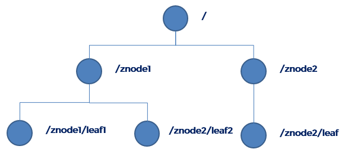
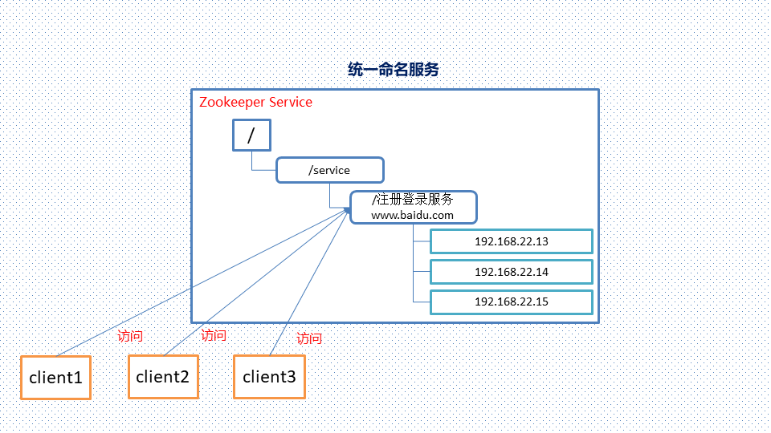
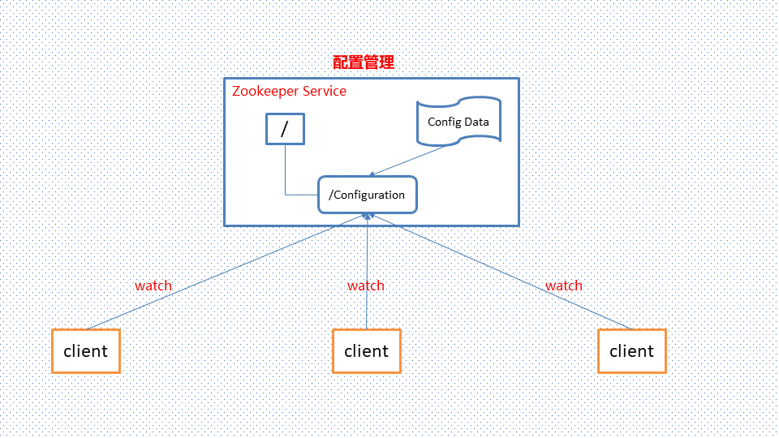
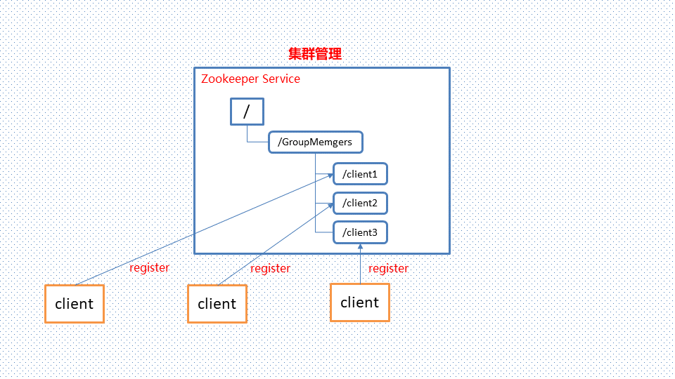
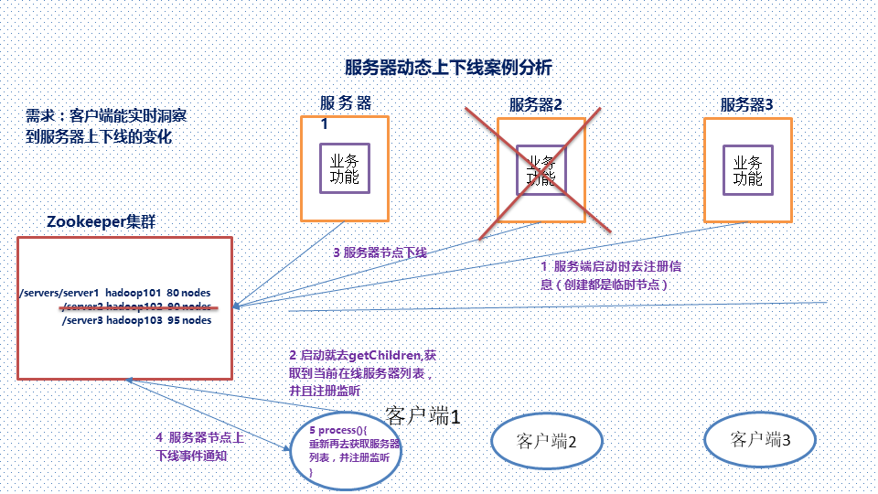
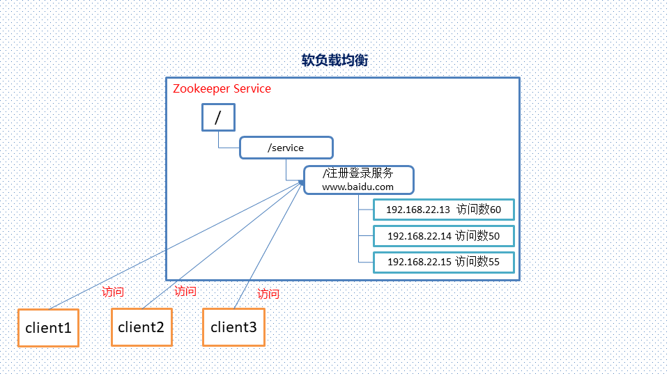
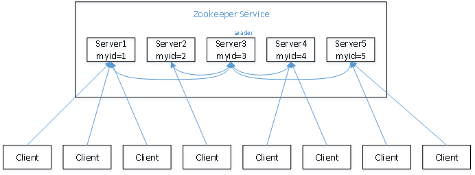
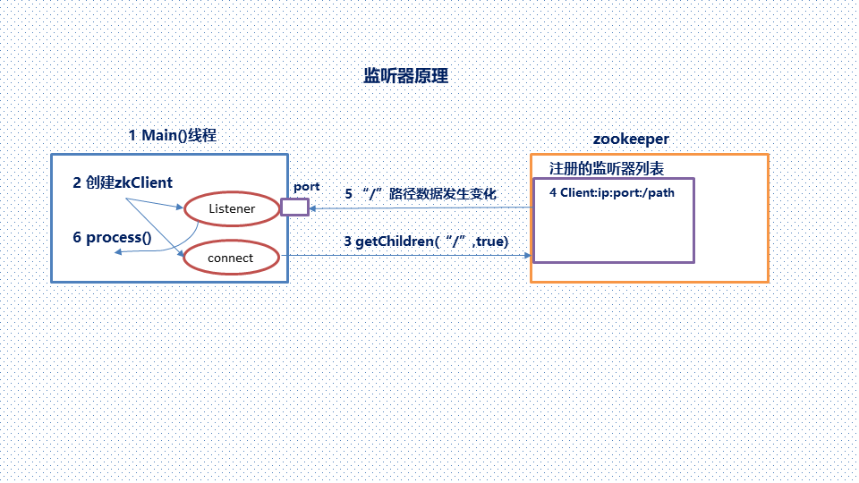
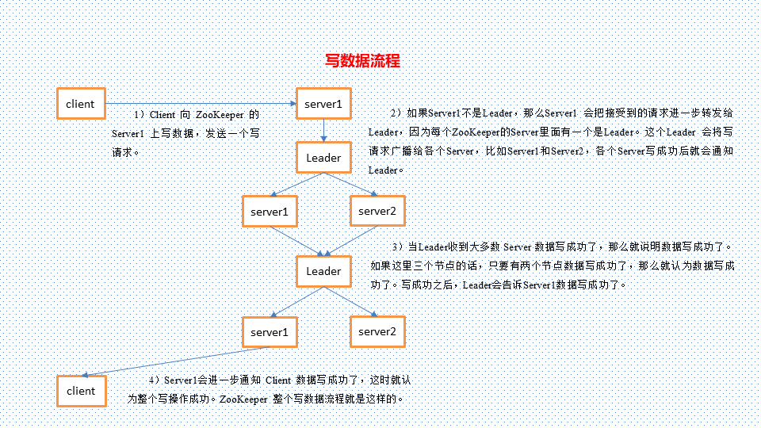

# 09_大数据技术之ZooKeeper

## 1.Zookeeper概述

zookeeper是一个开源的分布式的，为分布式应用提供协调服务的Apache项目。Hadoop和Hbase的重要组件。它是一个为分布式应用提供一致性服务的软件，提供的功能包括：配置维护、域名服务、分布式同步、组服务等等。

1. 特点：

   - Zookeeper：一个领导者（leader），多个跟随者（follower）组成的集群
   - Leader负责进行投票的发起和决议，更新系统状态
   - Follower用于接受客户请求并向客户端返回结果，在选举Leader过程中参与投票
   - 集群中奇书台服务器只要有半数以上节点存活，Zookeeper集群就能正常服务
   - 全局数据是一致的：每个server保存一份相同的数据副本，client无论连接哪一个server，数据都是一致的
   - 更新请求顺序进行，来自同一个client的更新请求按其发送顺序依次执行
   - 数据更新原子性，一次数据要么成功，要么失败
   - 实时性，在一定时间范围内，client能读到最新的数据

2. 数据结构

   Zookeeper数据模型的结构与unix文件系统类似，整体可以看作是一颗树，每个节点称作一个ZNode。每一个ZNode默认能够存储1MB的元数据，每个ZNode都可以通过其路径唯一标识

   

3. 应用场景

   提供的服务包括：统一命名服务、统一配置管理、统一集群管理、服务器节点动态上下线、软负载均衡等

   1. 统一命名服务

      

   2. 统一配置管理

      1. 分布式环境下，配置文件管理和同步是一个常见的问题

         - 一个集群中，所有节点的配置信息是一致的，比如hadoop集群
         - 对配置文件修改后，希望能够够快速同步到各个节点上

      2. 配置管理可交由ZK实现

         - 可配置信息写入ZK上的一个Znode
         - 各个节点监听这个Znode
         - 一旦znode中的数据被修改，ZK将会通知各个节点

         

      3. 统一集群管理

         1. 分布式环境中，事实掌握每个节点的状态是必要的

            可根据节点实时做出一些调整

         2. 可交由ZK实现

            - 可将节点信息写入ZK上的一个ZNode
            - 监听这个ZNode可获取它的事实状态变化

         3. 典型应用

            HBase中Master状态监控与选举

            

      4. 服务器节点动态上下线

         

      5. 软负载均衡

         

## 2.Zookeeper内部原理

### 2.1选举机制

1. 半数机制（Paxos协议）：集群中半数以上机器存活，集群可用。所以zookeeper适合安装在奇书台机器上

2. Zookeeper虽然在配置文件中并没有指定master和slave。但是，Zookeeper工作时，是有一个节点为leader，其他则为follower，Leader是通过内部选举机制临时产生的

3. 举例说明

   假设有五台服务器组成zookeeper集群，他们的id从1-5，同时他们都是最新启动的，也就是没有历史数据，在存放数据量这一点上，都是一样的。假设这些服务依序启动，我们可以看看会发生什么

   

   - 服务1启动，此时只有它一台服务器启动了，它发出去的信号没有任何响应，所以它的选举状态一直都是LOOKING状态
   - 服务2启动，他与最开始启动的服务1进行通信，互相交换了自己的选举结果，由于两者都没有历史数据，所以id值较大的服务器2胜利，但是由于没有达到半数以上的服务器都同意选举它（本例中的半数以上是3），所以服务器1、2之间还是继续保持LOOKING状态
   - 服务3启动，根据前面的理论分析，服务3称为1、2、3中的老大，而与上面不同的是，此时，有三台服务器选举它，所以它称为本次选举的leader
   - 服务4启动，根据前面的分析，理论上服务器4应该是服务器1、2、3、4中最大的，但是由于前面已经有半数以上的服务器选举了服务器3，所以它只能接受党小弟的命
   - 服务5启动，同4一样当小弟

### 2.2节点类型

1. Znode有两种类型：

   - 短暂（ephemeral）：客户端和服务端断开连接之后，创建的节点自己删除
   - 持久（persistent）：客户端和服务器端断开连接之后，创建的节点不删除

2. Znode有四种形式的目录节点（默认是persistent）

   - 持久化目录节点（PESISTENT)(小写：persistent)

     客户端与zookeeper断开连接之后，该节点依旧存在

   - 持久化顺序编号目录节点（PERSISTENT_SEQUENTIAL）（小写：persistent_sequential）

     客户端与zookeeper断开连接之后，该节点依旧存在，只是zookeeper给该节点名称进行顺序编号

   - 临时目录节点（EPHEMERAL）(ephemeral)

     客户端与zookeeper断开连接之后，该节点被删除

   - 临时顺序编号目录节点（EPHEMERAL_SEQUENTIAL）(ephemeral_sequential)

     客户端与zookeeper断开连接之后，该节点被删除，只是zookeeper给该节点名称进行顺序编号

3. 创建znode时设置顺序标识，znode名称之后会附加一个值，顺序号是一个单词递增的计数器，由父节点维护

4. 在分布式系统中，顺序号可以被用于为所有的事件进行全局排序，这样客户端可以通过顺序号推断事件的顺序

### 2.3start结构体

1. czxid-引起这个znode创建的zxid，创建节点的事物的zxid
   - 每次修改Zookeeper状态都会收到一个zxid形式的时间戳，也就是zookeeper事物 ID。
   - 事物ID是zookeeper中所有修改总的次序。每个修改都有唯一的zxid，如果zxid1小于zxid2，那么zxid1在zxid2之前发生
2. ctime-znode 被创建的毫秒数（从1970年开始）
3. mZxid-znode 最后更新的zxid
4. mtime-znode 最后修改的毫秒数（从1970年开始）
5. pZxid-znode 最后更新的子节点zxid
6. cversion-znode子节点变化好，znode子节点修改次数
7. dataversion-znode数据变化号
8. aclVersion-znode访问控制列表的变化号
9. ephemeralOwner-如果是临时节点，这个是znode拥有者的session id。如果不是临时节点则是0
10. dataLength- znode的数据长度
11. numChildren - znode子节点数量

## 2.4 监听器原理

1. 监听器原理详解

   - 首先要有一个main（）线程
   - 在main线程中创建ZK客户端，这是会创建两个线程，一个负责网络连接通信（connect），一个负责监听（listener）
   - 通过connect线程将注册的监听事件发送给ZK
   - 在ZK的注册监听器列表中将注册的监听事件添加到列表中
   - ZK监听到有数据或路径发送变化时，就会将这个消息发送给listener线程
   - listtener线程内部调用process（）方法

2. 常见的监听

   - 监听节点数据的变化

     i. Get path [watch]

   - 监听子节点增减的变化

     i. Ls path [watch]

   



3. zookeeper的watch机制

   - 通知类似于数据库中的触发器, 对某个Znode设置 `Watcher`, 当Znode发生变化的时候, `WatchManager`会调用对应的`Watcher`
   - 当Znode发生删除, 修改, 创建, 子节点修改的时候, 对应的`Watcher`会得到通知
   - `Watcher`的特点
     - **一次性触发** 一个 `Watcher` 只会被触发一次, 如果需要继续监听, 则需要再次添加 `Watcher`
     - 事件封装: `Watcher` 得到的事件是被封装过的, 包括三个内容 `keeperState, eventType, path`

   | KeeperState   | EventType        | 触发条件                 | 说明                               |
   | ------------- | ---------------- | ------------------------ | ---------------------------------- |
   |               | None             | 连接成功                 |                                    |
   | SyncConnected | NodeCreated      | Znode被创建              | 此时处于连接状态                   |
   | SyncConnected | NodeDeleted      | Znode被删除              | 此时处于连接状态                   |
   | SyncConnected | NodeDataChanged  | Znode数据被改变          | 此时处于连接状态                   |
   | SyncConnected | NodeChildChanged | Znode的子Znode数据被改变 | 此时处于连接状态                   |
   | Disconnected  | None             | 客户端和服务端断开连接   | 此时客户端和服务器处于断开连接状态 |
   | Expired       | None             | 会话超时                 | 会收到一个SessionExpiredExceptio   |
   | AuthFailed    | None             | 权限验证失败             | 会收到一个AuthFailedException      |

### 2.5 写数据流程



读是局部性的，即client只需要从与它相连的server上读取数据即可；而client有写请求的话，与之相连的server会通知leader，然后leader会把写操作分发给所有server。所以定要比读慢很多。


## 3.zookeeper常用API操作

导入依赖项

```xml
<dependencies>
        <!--Zookeeper依赖-->
        <dependency>
            <groupId>org.apache.zookeeper</groupId>
            <artifactId>zookeeper</artifactId>
            <version>3.4.10</version>
        </dependency>
        <dependency>
            <groupId>org.apache.curator</groupId>
            <artifactId>curator-framework</artifactId>
            <version>4.0.0</version>
        </dependency>
        <dependency>
            <groupId>org.apache.curator</groupId>
            <artifactId>curator-recipes</artifactId>
            <version>4.0.0</version>
        </dependency>
        <dependency>
            <groupId>org.apache.curator</groupId>
            <artifactId>curator-client</artifactId>
            <version>4.0.0</version>
        </dependency>
        <dependency>
            <groupId>com.google.guava</groupId>
            <artifactId>guava</artifactId>
            <version>16.0.1</version>
        </dependency>
        <dependency>
            <groupId>junit</groupId>
            <artifactId>junit</artifactId>
            <version>4.12</version>
            <scope>compile</scope>
        </dependency>
        
    </dependencies>
```


### 3.1创建zookeeper客户端

```java
 private static String connectString = "bigdata111:2181,bigdata222:2181,bigdata333:2181";
    private static int sessionTimeout = 2000;
    private ZooKeeper zkClient = null;


    //创建zookeeper客户端
    @Before
    public void init() throws Exception {

        zkClient = new ZooKeeper(connectString, sessionTimeout, new Watcher() {
            @Override
            public void process(WatchedEvent event) {
                // 收到事件通知后的回调函数（用户的业务逻辑）
                System.out.println(event.getType() + "--" + event.getPath());

                // 再次启动监听
                try {
                    zkClient.getChildren("/", true);
                } catch (Exception e) {
                    e.printStackTrace();
                }
            }
        });
    }
```

### 3.2 创建子节点

```java
// 创建子节点
    @Test
    public void create() throws Exception {
        // 数据的增删改查
        // 参数1：要创建的节点的路径； 参数2：节点数据 ； 参数3：节点权限 ；参数4：节点的类型
        String nodeCreated = zkClient.create("/eclipse", "hello zk".getBytes(), ZooDefs.Ids.OPEN_ACL_UNSAFE, CreateMode.PERSISTENT);
    }

```

### 3.3 获取子节点并监听

```java
 // 获取子节点并监听
    @Test
    public void getChildren() throws Exception {
        List<String> children = zkClient.getChildren("/", true);

        for (String child : children) {
            System.out.println(child);
        }

        // 延时阻塞
        Thread.sleep(Long.MAX_VALUE);
    }
```

### 3.4 判断znode是否存在

```java

    // 判断znode是否存在
    @Test
    public void exist() throws Exception {
        Stat stat = zkClient.exists("/eclipse", false);

        System.out.println(stat == null ? "not exist" : "exist");
    }
```

### 3.5 创建永久节点

```java
//创建永久节点
    @Test
    public void createNode() throws Exception {

        //定制重试策略 参数：重试的间隔时间，重试的最大次数
        RetryPolicy retryPolicy = new ExponentialBackoffRetry(1000, 1);
        //获取客户端对象 参数：要连接的服务器列表 会话的超时时间 链接超时时间 重试策略
        CuratorFramework client = CuratorFrameworkFactory.newClient("bigdata111:2181,bigdata222:2181,bigdata333:2181", 1000, 1000, retryPolicy);

        //调用start开启客户端操作
        client.start();

        //通过create来进行创建节点，并且需要指定节点类型
        client.create().creatingParentsIfNeeded().withMode(CreateMode.PERSISTENT).forPath("/hello3/world");

        //
        client.close();
    }
```

### 3.6 创建临时节点

```java
  //创建临时节点
    @Test
    public void createNode2() throws Exception {

        //定制一个重试策略
        RetryPolicy retryPolicy = new  ExponentialBackoffRetry(3000, 1);

        CuratorFramework client = CuratorFrameworkFactory.newClient("bigdata111:2181,bigdata222:2181,bigdata333:2181", 3000, 3000, retryPolicy);

        client.start();

        client.create().creatingParentsIfNeeded().withMode(CreateMode.EPHEMERAL).forPath("/hello5/world");

        Thread.sleep(5000);

        client.close();
    }
```


### 3.7 节点数据查询

```java
 /**

     * 节点下面添加数据与修改是类似的，一个节点下面会有一个数据，新的数据会覆盖旧的数据

     * @throws Exception

     */
    //节点数据查询
    @Test
    public void nodeData() throws Exception {

        RetryPolicy retryPolicy = new  ExponentialBackoffRetry(3000, 1);

        CuratorFramework client = CuratorFrameworkFactory.newClient("bigdata111:2181,bigdata222:2181,bigdata333:2181", 3000, 3000, retryPolicy);

        client.start();

        //修改节点数据 参数 ：节点 字节数组
        client.setData().forPath("/hello5", "hello7".getBytes());

        client.close();
    }

```

### 3.8 数据查询

```java
 /**

     * 数据查询

     */

    @Test

    public void updateNode() throws Exception {

        RetryPolicy retryPolicy = new  ExponentialBackoffRetry(3000, 1);

        CuratorFramework client = CuratorFrameworkFactory.newClient("bigdata111:2181,bigdata222:2181,bigdata333:2181", 3000, 3000, retryPolicy);

        client.start();

        byte[] forPath = client.getData().forPath("/hello5");

        System.out.println(new String(forPath));

        client.close();

    }
```

### 3.9 zookeeper的watch机制

```java
 /**

     * zookeeper的watch机制

     * @throws Exception

     */
    //监听节点
    @Test
    public void watchNode() throws Exception {

        RetryPolicy policy = new ExponentialBackoffRetry(3000, 3);

        CuratorFramework client = CuratorFrameworkFactory.newClient("bigdata111:2181,bigdata222:2181,bigdata333:2181", policy);

        client.start();

        // ExecutorService pool = Executors.newCachedThreadPool();

        //设置节点的cache

        TreeCache treeCache = new TreeCache(client, "/hello5");

        //设置监听器和处理过程

        treeCache.getListenable().addListener(new TreeCacheListener() {

            @Override

            public void childEvent(CuratorFramework client, TreeCacheEvent event) throws Exception {
                ChildData data = event.getData();
                if(data !=null){
                    switch (event.getType()) {
                        case NODE_ADDED://添加节点
                            System.out.println("NODE_ADDED : "+ data.getPath() +"  数据:"+ new String(data.getData()));
                            break;
                        case NODE_REMOVED://节点删除
                            System.out.println("NODE_REMOVED : "+ data.getPath() +"  数据:"+ new String(data.getData()));
                            break;
                        case NODE_UPDATED://节点更新
                            System.out.println("NODE_UPDATED : "+ data.getPath() +"  数据:"+ new String(data.getData()));
                            break;
                        default:
                            break;
                    }
                }else{
                    System.out.println( "data is null : "+ event.getType());
                }
            }
        });

        //开始监听
        treeCache.start();
        Thread.sleep(50000000);

    }

```

