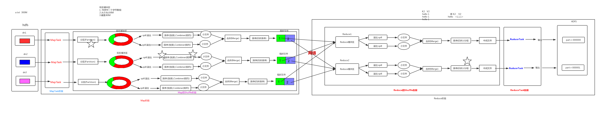
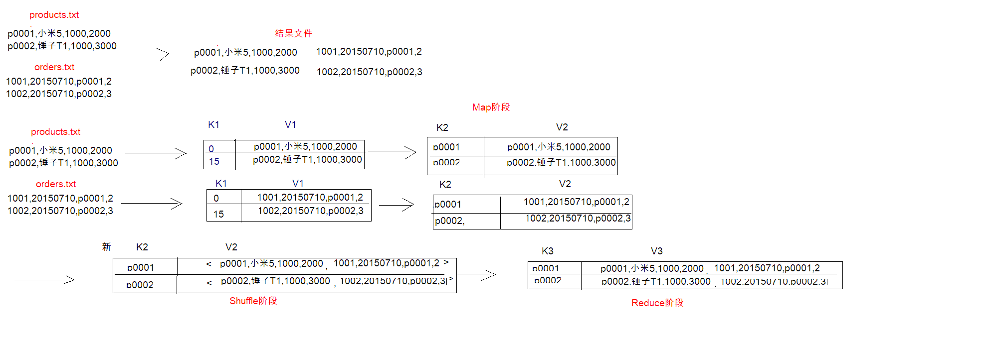
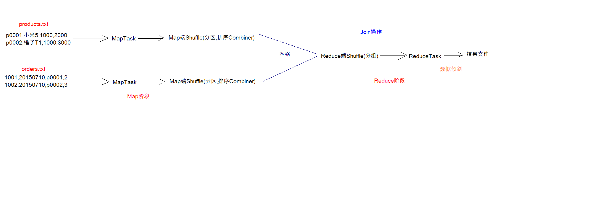
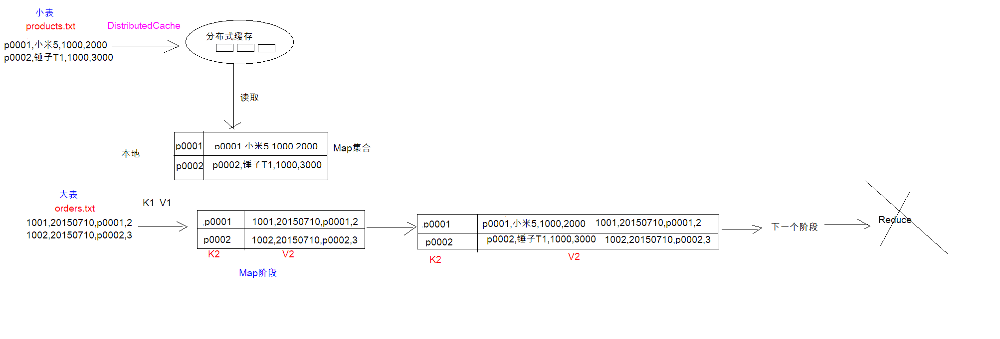

# 15_MapReduce运行机制详解

MapReduce工作机制全流程图



## 1.MapTask工作机制

**概述：**inputFile通过split被逻辑切分为多个split文件，通过Record按行读取内容给Map（用户自己实现）进行处理，数据被Map处理结束之后交给OutPutCollector收集器，对其结果key进行分区（默认使用hash分区），然后写入buffer，每个MapTask都有一个内存缓冲区，存储着Map的输出结果，当缓冲区快满的时候需要将缓冲区的数据以一个临时文件的方式存放到磁盘，当整个MapTask结束后再对磁盘中这个MapTask产生的所有临时文件做合并，生成最终的正式输出文件，然后等待ReduceTask来拉取数据

### 1.1详细步骤

1. 读取数据组件InputFormat（默认TextInputFormat）会通过getSplits方法对输入目录中文件进行逻辑切片规划得到block，有多少个block就对应启动多少个MapTask

2. 将输入文件切分作为block之后，由RecorReader对象（默认是LineRecordReader）进行读取，以`\n`作为分隔符，读取一行数据，返回`<key,value>`。key表示每行首字符偏移值，Value表示这一行文本内容

3. 读取block返回`<key,value>`，进入用户自己继承的Mapper类中，执行用户重写的map函数，RecordReader读取一行这里调用一次

4. Mapper逻辑结束之后，将Mapper的每条结果通过`context.write`进行collect数据收集。在collect中，会先对其进行分区处理，默认是同HashPartitioner

   > MapReduce提供Partitioner接口，作用就是根据key或value及Reducer的数量来决定当前的这对输出数据最终应该交由那个Reduce task处理，默认对Key Hash后再以Reducer数量取模。默认的取模方式只是为了平均Reducer的处理能力，如果用户自己对Partitioner有需求，可以定制并设置到Job上

5. 接下来，会将数据写入内存，内存中这片区域叫做环形缓冲区，缓冲区的作用是批量收集Mapper结果，减少磁盘IO的影响。**我们的key和value对以及Partition的结果都会被写入缓冲区**。当然，写入之前，key与value的值都会被序列化成字节数组。

   > 环形缓冲区其实是一个数组，数组中存放着key,value的序列化数据和key，value的元数据信息，包括partition,key的起始位置，value的起始位置以及value的长度。环形结构是一个抽象概念

   > 缓冲区是有大小限制，默认是100MB。当Mapper的输出结果很多时，就可能会撑爆内存，所以需要在一定条件下将缓冲区中的数据临时写入磁盘，然后重新利用这块缓冲区。这个从内存往磁盘写数据的过程称为spill，中文可译为**溢写**。这个溢写是由单独的线程来完成，不影响往缓冲区写Mapper结果的线程。溢写线程启动时不应该阻止Mapper的结果输出，所以整个缓冲区有个溢写的比例spill.percent。这个比例默认是0.8，也就是当缓冲区的数据已经达到阈值`buffer size * spill percent = 100MB * 0.8 = 80MB`，溢写线程启动锁定这80MB的内存，执行溢写过程，Mapper的输出结果还可以往剩下的20MB内存中写，互不影响

6. 当溢写线程启动后，需要对着80MB空间内的Key做排序（sort）。排序是MapReduce模型默认的行为，这里的排序也是对序列化的字节做的排序

   > 如果Job设置过Combiner，那么现在就是使用Combiner的时候了。将有相同key的`key/value`对的value加起来，减少溢写到磁盘的数据量。Combiner会优化MapReduce的中间结果，所以它在整个模型中会多次使用

   > 那么，哪些场景才能使用Combiner呢？从这里分析，Combiner的输出的Reducer的输入，Combiner决不能改变最终的计算结果。Combiner只应该用于那种Reduce的输入，Key/value与输出key/value类型完全一致，且不影响最终结果的场景。比如累加，最大值等。Combiner的使用一定得慎重，如果用好，她对Job执行效率有帮助，反之会影响Reducer的最终结果。

7. 合并溢写文件，每次溢写会在磁盘上生成一个临时文件(写之前判断是否有Combiner)，如果Mapper的输出结果真的很大，又多次这样的溢写发生，磁盘上相应的就会有多个临时文件存在。当整个数据处理结束之后开始对磁盘中的临时文件进行Mege合并，因为最终的文件只有一个，写入磁盘，并且为这个文件提供了一个索引文件，以记录每个Reduce对应数据量的偏移量

   > 在进行文件合并过程中，MapTask以分区为单位进行合并。对于某个分区，它将采用多轮递归合并的方式。每轮合并io.sort.factor（默认100）个文件，并将产生的文件重新加入待合并列表中，对文件排序后，重复以上过程，直到最终得到一个大文件。
   >
   > 让每个MapTask最终只生成一个数据文件，可避免同时打开大量文件和同时读取大量小文件产生的随机读取带来的开销。

### 1.2配置

| 配置                             | 默认值                         | 解释                       |
| -------------------------------- | ------------------------------ | -------------------------- |
| mapreduce.task.io.sort.mb        | 100                            | 设置环型缓冲区的内存值大小 |
| mapreduce.map.sort.spill.percent | 0.8                            | 设置溢写的比例             |
| mapreduce.cluster.local.dir      | ${hadoop.tmp.dir}/mapred/local | 溢写数据目录               |
| mapreduce.task.io.sort.factor    | 10                             | 设置一次合并多少个溢写文件 |

## 2.ReduceTask工作机制

**概述：**Reduce大致分为copy，sort，reduce三个阶段，重点在前两个阶段。copy阶段包含一个eventFetcher来获取已完成的map列表，由Fetcher线程去copy数据，在此过程中会启动两个merge线程，分别为inMemoryMerger和onDiskMerger，分别将内存中的数据merge到磁盘和将磁盘中的数据进行merge。待数据copy完成之后，copy阶段就完成了，开始进行sot阶段，sort阶段主要是执行finalMerge操作，纯粹的sort阶段，完成之后就是reduce阶段，调用用户自定义的reduce函数进行处理

### 2.1详细步骤

1. Copy阶段，ReduceTask从各个MapTask上远程拷贝一片数据，并针对某一片数据，如果其大小超过一定阈值，则写到磁盘上，否则直接放到内存中。
2. Merge阶段，在远程拷贝数据的同时，ReduceTask启动了两个后台线程对内存和磁盘上的文件进行合并，以防止内存使用过多或磁盘上文件过多。
3. sort阶段，按照MapReduce语义，用户编写reduce()函数输入数据是按key进行聚集的一组数据。为了将key相同的数据聚在一起，Hadoop采用了基于排序的策略。由于各个MapTask已经实现对自己的处理结果进行了局部排序，因此，ReduceTask只需对所有数据进行一次归并排序即可。
4. Reduce阶段：reduce()函数将计算结果写到HDFS上。

### 2.2 设置ReduceTask并行度（个数）

reducetask的并行度同样影响整个job的执行并发度和执行效率，但与maptask的并发数由切片数决定不同，Reducetask数量的决定是可以直接手动设置：

```
//默认值是1，手动设置为4
job.setNumReduceTasks(4);
```

**注意：**

1. reducetask=0，表示没有reduce阶段，输出文件个数和map个数一致。
2. reducetask默认值就是1，所以输出文件个数为一个。
3. 如果数据分布不均匀，就有可能在reduce阶段产生数据倾斜
4. reducetask数量并不是任意设置，还要考虑业务逻辑需求，有些情况下，需要计算全局汇总结果，就只能有1个reducetask。
5. 具体多少个reducetask，需要根据集群性能而定。
6. 如果分区数不是1，但是reducetask为1，是否执行分区过程。答案是：不执行分区过程。因为在maptask的源码中，执行分区的前提是先判断reduceNum个数是否大于1。不大于1肯定不执行。

**实验：**测试reducetask多少合适。

1. 实验环境：1个master节点，16个slave节点：CPU:8GHZ，内存: 2G

2. 实验结论：

   改变reduce task （数据量为1GB）

   MapTask = 16

   | Reduce task | 1    | 5    | 10   | 15   | 16   | 20   | 25   | 30   | 45   | 60   |
   | ----------- | ---- | ---- | ---- | ---- | ---- | ---- | ---- | ---- | ---- | ---- |
   | 总时间      | 892  | 146  | 110  | 92   | 88   | 100  | 128  | 101  | 145  | 104  |

   

## 3.Shuffle过程

map阶段处理的数据如何传递给reduce阶段，是MapReduce框架中最关键的一个流程，这个流程就叫shuffle

shuffle：洗牌、发牌（核心机制：数据分区，排序，分组，规约，合并等过程）

Shuffle是MapReduce的核心，它分布在MapRedue的Map阶段和Reduce阶段。一般把从Map产生输出开始到Reduce取得数据作为输入之前的过程称为shuffle

### 3.1 详细过程

1. Collect阶段：将MapTask的结果输出到默认大小为100MB的环形缓冲区，保存的是`key/value`，partiton分区信息等
2. Spill阶段：当内存中的数据量达到一定的阀值的时候，就会将数据写入本地磁盘，在将数据写入磁盘之前需要对数据进行一次排序的操作，如果配置了combiner，还会将有相同分区号和key的数据进行排序
3. Merge阶段：把所有溢出的临时文件进行一次合并操作，以确保一个MapTask最终只产生一个中间数据文件
4. Copy阶段：ReduceTask启动Fetcher线程到已经完成MapTask的节点上复制一份属于自己的数据，这些数据默认会保存在内存的缓冲区中，当内存的缓冲区达到一定的阀值的时候，就会将数据写到磁盘之上
5. Merge阶段：在ReduceTask远程复制数据的同时，会在后台开启两个线程对内存到本地的数据文件进行合并操作
6. Sort阶段：在对数据进行合并的同时，会进行排序操作，由于MapTask阶段已经对数据进行了局部的排序，ReduceTask只需要保证Copy的数据的最终整体有效性即可。Shuffle中的缓冲区大小会影响到MapReduce程序的执行效率，原则上说，缓冲区越大，磁盘IO的次数越小，执行速度就越快。缓冲区的大小可以通过参数调整，参数：`mapreduce.task.io.sort.mb`默认100M

### 3.2 Partition分区

1. 问题引出：要求将统计结果按照条件输出到不同文件中（分区）。比如：将统计结果按照手机归属地不同省份输出到不同的文件中（分区）

2. 默认partition分区

   ```java
   public class HashPartitioner<K, V> extends Partitioner<K, V> {
     public int getPartition(K key, V value, int numReduceTasks) {
       return (key.hashCode() & Integer.MAX_VALUE) % numReduceTasks;
     }
   }
   ```

   默认分区是根据key的hashCode对ReduceTasks的个数取模得到的。用户无法控制那个key存储到那个分区

   **&是为了不出现负数，也可以用  hashcode()%num + num来代替，但是位运算性能比较高。**

3. 自定义Partioner步骤

   1. 自定义类继承Partitioner，重写getPartition()方法

      ```java
      public class ProvincePartitioner extends Partitioner<Text, FlowBean> {
      
      	@Override
      	public int getPartition(Text key, FlowBean value, int numPartitions) {
      
      // 1 获取电话号码的前三位
      		String preNum = key.toString().substring(0, 3);
      		
      		int partition = 4;
      		
      		// 2 判断是哪个省
      		if ("136".equals(preNum)) {
      			partition = 0;
      		}else if ("137".equals(preNum)) {
      			partition = 1;
      		}else if ("138".equals(preNum)) {
      			partition = 2;
      		}else if ("139".equals(preNum)) {
      			partition = 3;
      		}
      		return partition;
      	}
      }
      ```

   2. 在job驱动中，设置自定义partitioner：

      ```java
      job.setPartitionerClass(CustomPartitioner.class);
      ```

   3. 自定义partition后，要根据自定义partitioner的逻辑设置相应数量的reduce task

      ```java
      job.setNumReduceTasks(5);
      ```

4. **注意：**

   1. 如果reduceTask的数量> getPartition的结果数，则会多产生几个空的输出文件part-r-000xx；
   2. 如果1<reduceTask的数量<getPartition的结果数，则有一部分分区数据无处安放，会Exception；
   3. 如果reduceTask的数量=1，则不管mapTask端输出多少个分区文件，最终结果都交给这一个reduceTask，最终也就只会产生一个结果文件 part-r-00000；

   例如：假设自定义分区数为5，则

   （1）job.setNumReduceTasks(1);会正常运行，只不过会产生一个输出文件

   （2）job.setNumReduceTasks(2);会报错

   （3）job.setNumReduceTasks(6);大于5，程序会正常运行，会产生空文件
   
5. 实例操作

   需求1：将统计结果按照手机归属地不同省份输出到不同文件中（Partitioner）

   需求2：把单词按照ASCII码奇偶分区（Partitioner）

   具体见后面案例

### 3.3 WritableComparable排序

- 排序是MapReduce框架中最重要的操作之一。MapTask和ReduceTask均会对数据（按照key）进行排序。该操作属于Hadoop的默认行为。任何应用程序中的数据均会被排序，而不逻辑上是否需要。**默认排序是按照字典顺序排序，且实现该排序的方法是快速排序**
- 对于MapTask，它会将处理的结果暂时放到一个缓冲区，当缓冲区使用率达到一定阈值之后，再对缓冲区中的数据进行一次排序，并将这些有序数据写到磁盘上，而当数据处理完毕后，他会对磁盘上的所有文件进行一次合并，以将这些文件合并成一个大的有序文件
- 对于ReduceTask，它从每个MapTask上远程拷贝相应的数据文件，如果文件大小超过一定阈值，则放到磁盘上，否则放到内存中。如果磁盘上文件数据达到一定阈值，则进行一次合并以生成一个更大的文件；如果内存中文件大小或者数据超过一定阈值，则进行一次合并后将数据写到磁盘上。当所有数据拷贝完毕以后，ReduceTask统一对内存和磁盘上所有的数据进行一次合并

**每个阶段的默认排序**

1. 排序的分类：

   1. 部分排序

      MapReduce根据输入记录的键对数据集排序。保证输出的每个文件内部排序

   2. 全排序

      如何用Hadoop产生一个全局排序的文件？最简单的方法是使用一个分区。但该方法在处理大型文件时效率极低，因为一台机器必须处理所有输出文件，从而完全丧失了MapReduce所提供的并行架构

      **替代方案：**首先创建一系列排好序的文件；其次，串联这些文件；最后生成一个全局排序的文件。主要思路是使用一个分区来描述输出的全局排序。例如：可以为上述文件创建3个分区，在第一个分区中，记录的单词首字母a-g，第二个分区记录单词首字母h-n，第三个分区记录首字母o-z。

   3. 辅助排序（GroupingComparator分组）

      MapReduce框架在记录到达Reduce之前按键对记录排序，但键所对应的值并没有被排序。甚至在不同的执行轮次中，这些值的排序也不固定，因为他们来自不同的map任务且这些map任务在不同轮次中完成时间各不相同。一般来说，大多数MapReduce程序会避免让Reduce函数依赖于值的排序。但是，有时也需要通过特定的方法对键进行排序和分组等以实现对值的排序。

   4. 二次排序

      在自定义排序的过程中，如果compareTo中的判断条件为两个即为二次排序

2. 自定义排序WritableComparable

   1. 原理分析

      bean对象实现WritableComparable接口重写compareTo方法，就可以实现排序

      ```java
      @Override
      public int compareTo(FlowBean o) {
      	// 倒序排列，从大到小
      	return this.sumFlow > o.getSumFlow() ? -1 : 1;
      }
      ```
      
   2. 案例实操
   
      需求3：将统计结果按照总流量倒序排序（排序）
   
      需求4：不同省份输出文件内部排序（部分排序）
   
      详情见后面案例

### 3.4 GroupComparator分组（辅助排序）

对Reduce阶段的数据根据某一个或几个字段进行分组

详情见案例：求出每一个订单中最贵的商品（GroupingComparator）

### 3.5 Combiner合并

1. HDFS：不怕大文件，怕很多小文件，mapreduce ：怕数据倾斜

2. 默认情况下，**TextInputFormat**对任务的切片机制是按照**文件**规划切片，不管有多少个小文件，都会是单独的切片，都会**交给一个maptask**，这样，如果有大量的小文件就会产生大量的maptask，处理效率极端底下

   就会产生大量的maptask，处理效率极端底下

3. 优化策略：

   1. **最好的方法：**在数据处理的最前端（预处理、采集），就将小文件合并成大文件，在上传到HDFS做后续的分析

   2. **补救措施：**如果已经是大量的小文件在HDFS中了，可以使用另一种inputformat来做切片（CombineFileInputformat），它的切片逻辑跟TextInputformat不同

      > 注：CombineTextInputFormat是CombineFileInputformat的子类

      不同：它可以将多个小文件从逻辑上规划到一个切片中，这样，多个小文件就可以交给一个maptask了

      ```java
      //如果不设置InputFormat，它默认的用的是TextInputFormat.class
      		/*CombineTextInputFormat为系统自带的组件类
      		 * setMinInputSplitSize 中的2048是表示n个小文件之和不能大于2048
      		 * setMaxInputSplitSize 中的4096是     当满足setMinInputSplitSize中的2048情况下  在满足n+1个小文件之和不能大于4096
      		 */
      job.setInputFormatClass(CombineTextInputFormat.class);
      CombineTextInputFormat.setMinInputSplitSize(job, 2048);
      CombineTextInputFormat.setMaxInputSplitSize(job, 4096);
      ```

4. 自定义Combiner实现步骤

   1. 自定义一个combiner继承Reducer，重写Reduce方法

      ```java
      public class WordcountCombiner extends Reducer<Text, IntWritable, Text, IntWritable>{
      	@Override
      	protected void reduce(Text key, Iterable<IntWritable> values,
      			Context context) throws IOException, InterruptedException {
              // 1 汇总操作
      		int count = 0;
      		for(IntWritable v :values){
      			count = v.get();
      		}
              // 2 写出
      		context.write(key, new IntWritable(count));
      	}
      }
      ```

   2. 在job驱动类中设置

      ```java
      job.setCombinerClass(WordcountCombiner.class);
      ```

## 4.案例：Reduce端实现Join

**原理：**

- Map端的主要工作：为来自不同表(文件)的key/value对打标签以区别不同来源的记录。然后用连接字段作为key，其余部分和新加的标志作为value，最后进行输出。

- Reduce端的主要工作：在reduce端以连接字段作为key的分组已经完成，我们只需要在每一个分组当中将那些来源于不同文件的记录(在map阶段已经打标志)分开，最后进行合并就ok了。

**该方法的缺点：**

这种方式的缺点很明显就是会造成map和reduce端也就是**shuffle阶段出现大量的数据传输，效率很低。**

### 4.1 需求

> 假如数据量巨大，两表的数据是以文件的形式存储来HDFS中，需要用MapReduce程序来实现以下SQL查询运算

```sql
select a.id,a.date,b.name,b.category_id,b.price from t_order a left join t_product b on a.pid = b.id
```

商品表：

```
id 		pname 	category_id 	price
P0001 	小米5 	1000 			2000
P0002 	锤子T1 	1000 			3000
```

订单数据表：

```
id 		 date 		pid 	amount
1001 	20150710 	P0001 		2
1002 	20150710 	P000		2
```

### 4.2ReduceJoin实现案例





通过将关联的条件作为map输出的key，将两表满足join条件的数据并携带数据所来源的文件
信息，发往同一个reduce task，在reduce中进行数据的串联（数据倾斜）

1. 定义Mapper

   ```java
   /**
    * k1 LongWritable
    * v1 Text
    *
    * k2 Text 商品ID
    * v2 Text 行文本信息
    */
   public class joinMapper extends Mapper<LongWritable,Text, Text,Text> {
       @Override
       protected void map(LongWritable key, Text value, Context context) throws IOException, InterruptedException {
           /**
            * product.txt
            * k1       v1
            * 0        P0001 小米5 1000 2000
            *
            * orders.txt
            * k1       v1
            * 0        1001 20150710 P0001 2
            *
            * -----------------------
            *
            * k2       v2
            * P0001    P0001 小米5 1000 2000
            *
            * P0001    1001 20150710 P0001 2
            */
   
   
           //1.判断数据来自哪个文件
           FileSplit fileSplit = (FileSplit)context.getInputSplit();//获取文件的切片
           String fileName = fileSplit.getPath().getName();//获取切片的名称
           if (fileName.equals("product.txt")){
               //数据来源于商品表
               //2.将k1 v1 转为k2 v2 ，然后写入上下文
               String[] split = value.toString().split(",");
               String productId = split[0];
               context.write(new Text(productId),value);
   
           }else{
               //数据源自订单数据表
               //2.将k1 v1 转为k2 v2 ，然后写入上下文
               String[] split = value.toString().split(",");
               String productId = split[2];
               context.write(new Text(productId),value);
           }
   
   
       }
   }
   
   ```

2. 定义Reduce

   ```java
   public class joinReducer extends Reducer<Text,Text,Text, Text> {
       @Override
       protected void reduce(Text key, Iterable<Text> values, Context context) throws IOException, InterruptedException {
   
           //1.遍历集合，获取v3(first + second)
           String first = "";
           String second = "";
           for ( Text value: values) {
               if (value.toString().startsWith("p")){
                   first = value.toString();
               }else {
                   second += value.toString();
               }
           }
   
           //2.k3和v3写入上下文
           context.write(key,new Text(first+ "/t" +second));
       }
   }
   
   ```

3. 定义主类

   ```java
   public class joinMain extends Configured implements Tool {
   
       @Override
       public int run(String[] strings) throws Exception {
           //1.获取job对象
           Job job = Job.getInstance(super.getConf(), "reduce_join");
           //2.设置job任务
   
           //设置输入类和输入路径
           job.setInputFormatClass(TextInputFormat.class);
           TextInputFormat.addInputPath(job,new Path("file:///G://学习//maven//src//main//java//reduce_join//MyOutputformat.input"));
           //设置map类和数据类型
           job.setMapperClass(joinMapper.class);
           job.setMapOutputKeyClass(Text.class);
           job.setMapOutputValueClass(Text.class);
           //shuffle阶段省略，采用默认方法
           //设置Reducer类和数据类型
           job.setReducerClass(joinReducer.class);
           job.setOutputKeyClass(Text.class);
           job.setOutputValueClass(Text.class);
           //设置输出类和输出的路径
           job.setOutputFormatClass(TextOutputFormat.class);
           TextOutputFormat.setOutputPath(job,new Path("file:///G://学习//maven//src//main//java//reduce_join//out"));
   
           //3.等待job任务结束
           boolean b = job.waitForCompletion(true);
           return b?0:1;
       }
   
       public static void main(String[] args) throws Exception {
           Configuration conf = new Configuration();
   
           //启动job任务
           int run = ToolRunner.run(conf, new joinMain(), args);
       }
   }
   
   ```

4. 输出结果

   ```
   p0001	p0001,小米5,1000,2000	2001,20150710,p0001,21001,20150710,p0001,2
   p0002	p0002,锤子T1,1000,3000	2002,20150710,p0002,31002,20150710,p0002,3
   ```

   

## 5.案例：Map端实现Join

**使用场景：**适用于一张表十分小、一张表很大。

**解决方案：**在map端缓存多张表，提前处理业务逻辑，这样增加map端业务，减少reduce端数据的压力，尽可能的减少数据倾斜。

**具体办法：**采用distributedcache

1. 在mapper的setup阶段，将文件读取到缓存集合中。

2. 在驱动函数中加载缓存。

   job.addCacheFile(new URI("file:/e:/mapjoincache/pd.txt"));// 缓存普通文件到task运行节点

使用分布式缓存，可以将小表分发到所有的map节点，这样map节点就可以在本地对自己所读到的大表的数据进行join并输出最终结果，可以大大提高join的操作的并发度，加快处理速度

### 5.1 MapJoin实现案例



先在mapper类中预定义好小表，进行join

引入实际场景中的解决方案：一次加载数据库

1. 定义Mapper

   ```java
   public class joinMapper extends Mapper<LongWritable, Text,Text,Text> {
       private HashMap<String,String> hashMap = new HashMap<>();
       //1.将分布式缓存的小表数据读取到本地map集合（只需要做一次）
       //setup方法只执行一次
       @Override
       protected void setup(Context context) throws IOException, InterruptedException {
           //1.获取分布式缓存列表
           URI[] cacheFiles = context.getCacheFiles();//包含了所有的缓存文件
           //2.获取指定的缓存文件的文件系统（fileSystem）
           FileSystem fileSystem = FileSystem.get(cacheFiles[0], context.getConfiguration());
           //3.获取文件的输入流
           FSDataInputStream inputStream = fileSystem.open(new Path(cacheFiles[0]));
           //4.读取文件内容，并将数据存入map集合
               //将字节输入流转为字符缓冲流FSdataInputStream --> BufferedReader
               BufferedReader bufferedReader = new BufferedReader(new InputStreamReader(inputStream));
               //以行为单位读取小表内容，并将读取的数据存入map集合
   
               String line = null;
               while ((line = bufferedReader.readLine())!= null){
                   String[] split = line.split(",");
                   hashMap.put(split[0],line);
   
               }
   
           //5.关闭流
           bufferedReader.close();
           fileSystem.close();
   
       }
   
       //2.对大表的业务处理逻辑，而且要实现大表和小表的join操作
   
       @Override
       protected void map(LongWritable key, Text value, Context context) throws IOException, InterruptedException {
           //1.从行文本数据中获取商品ID
           String[] split = value.toString().split(",");
           String productID = split[2];
           //2.在map集合中，将商品的ID作为键，获取值（商品的行文本数据），将value和值拼接，得到v2
           String productLine = hashMap.get(productID);
           String valueLine = productLine + "/t"+ value.toString();
           //3.将k2和v2写入上下文中
           context.write(new Text(productID),new Text(valueLine));
   
       }
   }
   
   ```

2. 定义主类：

   ```java
   public class joinMain extends Configured implements Tool {
   
       @Override
       public int run(String[] strings) throws Exception {
           //1.获取job对象
           Job job = Job.getInstance(super.getConf(), "map_join");
   
           //2.设置job对象（将小表放在分布式缓存当中）
           //将小表放在分布式缓存当中
           job.addCacheFile(new URI("hdfs://bigdata111:9000/product.txt"));
   
           //设置输入类和输入路径
           job.setInputFormatClass(TextInputFormat.class);
           TextInputFormat.addInputPath(job,new Path("file:///G://学习//maven//src//main//java//Map_join//MyOutputformat.input"));
           //设置mapper
           job.setMapperClass(joinMapper.class);
           job.setMapOutputKeyClass(Text.class);
           job.setMapOutputValueClass(Text.class);
           //shuffle阶段默认
           //本次案例没有Reduce
   
           //设置输出类和输出路径
           job.setOutputValueClass(TextOutputFormat.class);
           TextOutputFormat.setOutputPath(job,new Path("file:///G://学习//maven//src//main//java//Map_join//out"));
   
           //3.等待任务结束
           boolean b = job.waitForCompletion(true);
           return b?0:1;
       }
   
       public static void main(String[] args) throws Exception{
           Configuration conf = new Configuration();
   
           //启动job任务
           int run = ToolRunner.run(conf, new joinMain(), args);
       }
   }
   
   ```

3. 输出结果：

   ```
   p0001	p0001,小米5,1000,2000		2001,20150710,p0001,2
   p0001	p0001,小米5,1000,2000		1001,20150710,p0001,2
   p0002	p0002,锤子T1,1000,3000	2002,20150710,p0002,3
   p0002	p0002,锤子T1,1000,3000	1002,20150710,p0002,3
   
   ```

   

## 6.案例：求共同好友

### 6.1 需求分析

以下是QQ好友列表数据，冒号前是一个用户，冒号后是该用户的所有好友（数据中的好友关系是单向的）

```
A:B,C,D,F,E,O
B:A,C,E,K
C:A,B,D,E,I
D:A,E,F,L
E:B,C,D,M,L
F:A,B,C,D,E,O,M
G:A,C,D,E,F
H:A,C,D,E,O
I:A,O
J:B,O
K:A,C,D
L:D,E,F
M:E,F,G
O:A,H,I,J
```

求出哪些人两两之间有共同好友，及他两的共同好友都有谁？

### 6.2实现步骤


第一步：

1. 定义Mapper

   ```java
   public class OneFriendsMapper extends Mapper<LongWritable, Text,Text,Text> {
       @Override
       protected void map(LongWritable key, Text value, Context context) throws IOException, InterruptedException {
   
           String line = value.toString();
           //person在前，friends在后
           String[] split = line.split(":");
           String person = split[0];
           String[] friends = split[1].split(",");
   
           //friends在前，person在后
           for (String friend : friends){
               context.write(new Text(friend),new Text(person));
           }
   
       }
   }
   
   
   ```

2. 定义Reduce

   ```java
   public class OneFriendsReducer extends Reducer<Text, Text,Text,Text> {
       @Override
       protected void reduce(Text key, Iterable<Text> values, Context context) throws IOException, InterruptedException {
   
           StringBuffer sb = new StringBuffer();
           for (Text person :values){
               sb.append(person).append(",");
           }
   
           context.write(key,new Text(sb.toString()));
       }
   }
   
   
   ```

3. 定义主类：

   ```java
   public class oneFriendsDriver {
       public static void main(String[] args) throws IOException, ClassNotFoundException, InterruptedException {
           args = new String[]{"G://学习//maven//src//main//java//Friends//friends.txt","G://学习//maven//src//main//java//Friends//out"};
           //配置文件对象
           Configuration conf = new Configuration();
           Job job = Job.getInstance(conf);
           //设置jab对象
           job.setJarByClass(oneFriendsDriver.class);
           //设置输入输出类
           job.setMapperClass(OneFriendsMapper.class);
           job.setReducerClass(OneFriendsReducer.class);
           //指定map输出的数据类型
           job.setMapOutputKeyClass(Text.class);
           job.setMapOutputValueClass(Text.class);
           //指定最终输出的数据类型
           job.setOutputKeyClass(Text.class);
           job.setOutputValueClass(Text.class);
           //指定job输入输出目录
           FileInputFormat.setInputPaths(job,new Path(args[0]));
           FileOutputFormat.setOutputPath(job,new Path(args[1]));
   
           //提交
           boolean result = job.waitForCompletion(true);
           System.exit(result?1:0);
       }
   }
   
   ```
   
4. 第一步 输出结果

   ```
   A	I,K,B,G,F,H,O,C,D,
   B	A,F,C,J,E,
   C	E,A,H,B,F,G,K,
   D	K,E,C,L,A,F,H,G,
   E	F,M,L,H,G,D,C,B,A,
   F	G,D,A,M,L,
   G	M,
   H	O,
   I	C,O,
   J	O,
   K	B,
   L	D,E,
   M	E,F,
   O	J,I,H,A,F,
   
   ```

第二步：

1. 定义Mapper

   ```java
   public class twoFriendsMapper extends Mapper<LongWritable, Text,Text,Text> {
       @Override
       protected void map(LongWritable key, Text value, Context context) throws IOException, InterruptedException {
           String line = value.toString();
           String[] split = line.split("\t");
   
           String friend = split[0];
           String[] persons = split[1].split(",");
   
           Arrays.sort(persons);
   
           for (int i = 0; i< persons.length-1; i++){
               for (int j = i + 1; j < persons.length; j++) {
                   context.write(new Text(persons[i]+"-"+persons[j]),new Text(friend));
               }
           }
       }
   }
   
   ```
   
2. 定义Reduce

   ```java
   public class twoFriendsReducer extends Reducer<Text, Text,Text,Text> {
       @Override
       protected void reduce(Text key, Iterable<Text> values, Context context) throws IOException, InterruptedException {
           StringBuffer sb = new StringBuffer();
           for (Text friend: values){
               sb.append(friend).append(" ");
           }
           context.write(key,new Text(sb.toString()));
   
       }
   }
   
   ```
   
3. 定义JoinMain

   ```java
   public class TwoFriendsDriver {
       public static void main(String[] args) throws IOException, ClassNotFoundException, InterruptedException {
           args = new String[]{"G://学习//maven//src//main//java//Friends//out","G://学习//maven//src//main//java//Friends//out1"};
           //配置文件对象
           Configuration conf = new Configuration();
           Job job = Job.getInstance(conf);
           //设置jab对象
           job.setJarByClass(TwoFriendsDriver.class);
           //设置输入输出类
           job.setMapperClass(twoFriendsMapper.class);
           job.setReducerClass(twoFriendsReducer.class);
           //指定map输出的数据类型
           job.setMapOutputKeyClass(Text.class);
           job.setMapOutputValueClass(Text.class);
           //指定最终输出的数据类型
           job.setOutputKeyClass(Text.class);
           job.setOutputValueClass(Text.class);
           //指定job输入输出目录
           FileInputFormat.setInputPaths(job,new Path(args[0]));
           FileOutputFormat.setOutputPath(job,new Path(args[1]));
   
           //提交
           boolean result = job.waitForCompletion(true);
           System.exit(result?1:0);
       }
   }
   
   ```
   
4. 第二步输出结果的一部分：

   ```
   A-B	C E 
   A-C	B E D 
   A-D	F E 
   A-E	B D C 
   A-F	O E D B C 
   A-G	C F D E 
   A-H	O D C E 
   A-I	O 
   A-J	B O 
   A-K	C D 
   A-L	D E F 
   A-M	E F 
   B-C	A E 
   B-D	E A 
   ```

两个Driver共同执行的方法：

```java
public class AllFriendsDriver {
    public static void main(String[] args) throws IOException {
        args = new String[]{"G://学习//maven//src//main//java//Friends//friends.txt","G://学习//maven//src//main//java//Friends//out","G://学习//maven//src//main//java//Friends//out1"};

        Configuration conf = new Configuration();
        //job1
        Job job1 = Job.getInstance(conf);

        job1.setMapperClass(OneFriendsMapper.class);
        job1.setReducerClass(OneFriendsReducer.class);

        job1.setMapOutputKeyClass(Text.class);
        job1.setMapOutputValueClass(Text.class);
        job1.setOutputKeyClass(Text.class);
        job1.setOutputValueClass(Text.class);

        FileInputFormat.setInputPaths(job1,new Path(args[0]));
        FileOutputFormat.setOutputPath(job1,new Path(args[1]));

        //job2
        Job job2 = Job.getInstance(conf);

        job2.setMapperClass(twoFriendsMapper.class);
        job2.setReducerClass(twoFriendsReducer.class);

        job2.setMapOutputKeyClass(Text.class);
        job2.setMapOutputValueClass(Text.class);
        job2.setOutputKeyClass(Text.class);
        job2.setOutputValueClass(Text.class);

        FileInputFormat.setInputPaths(job2,new Path(args[1]));
        FileOutputFormat.setOutputPath(job2,new Path(args[2]));


        //job控制器
        JobControl control = new JobControl("song");
        ControlledJob ajob = new ControlledJob(job1.getConfiguration());
        ControlledJob bjob = new ControlledJob(job2.getConfiguration());
        bjob.addDependingJob(ajob);
        control.addJob(ajob);
        control.addJob(bjob);
        Thread t = new Thread(control);
        t.start();

    }
}

```


## 7 InputFormat数据输入

### 7.1 Job提交流程和切片源码详解

#### 7.1.1 job提交流程源码详解

具体文件见：**Job提交源码跟踪.txt**

```java
	waitForCompletion()
	submit();
	// 1建立连接
	connect();	
	// 1）创建提交job的代理
	new Cluster(getConfiguration());
	// （1）判断是本地yarn还是远程
	initialize(jobTrackAddr, conf); 
	// 2 提交job
	submitter.submitJobInternal(Job.this, cluster);
	// 1）创建给集群提交数据的Stag路径
	Path jobStagingArea = JobSubmissionFiles.getStagingDir(cluster, conf);
	// 2）获取jobid ，并创建job路径
	JobID jobId = submitClient.getNewJobID();
	// 3）拷贝jar包到集群
	copyAndConfigureFiles(job, submitJobDir);	
	rUploader.uploadFiles(job, jobSubmitDir);
    // 4）计算切片，生成切片规划文件
    writeSplits(job, submitJobDir);
    maps = writeNewSplits(job, jobSubmitDir);
	input.getSplits(job);
    // 5）向Stag路径写xml配置文件
    writeConf(conf, submitJobFile);
    conf.writeXml(out);
    // 6）提交job,返回提交状态
    status = submitClient.submitJob(jobId, submitJobDir.toString(), job.getCredentials());
```


#### 7.2.2 FileInputFormat源码解析(input.getSplits(job))

1. 找到你的数据存储目录
2. 开始遍历处理（规划切片）目录下的每一个文件
3. 遍历第一个文件 （ss.txt)
   1. 获取文件的大小fs.sizeOf(ss.txt);
   2. 计算切片大小computeSplitSize方法
   3. Math.max(minSize,Math.min(maxSize,blocksize))=blocksize=128M
   4. **以上源码在FileInputormat的280行**
   5. **默认情况下，切片大小=blocksize**
   6. 开始切，形成第一个切片：ss.txt——0:128M，第二个切片 ss.txt——128:256M，第三个切片ss.txt—256M:300M（每次切片时，都要判断切完剩下的部分是否大于块的1.1倍，**不大于1.1倍就划分一块切片**）
   7. 将切片信息写到一个切片规划文件中
   8. 整个切片的核心过程在getSplit()方法中完成
   9. 数据切片只是在逻辑上对输入数据进行分片，并不会在磁盘上将其切分成分片进行存储。InputSplit只记录了分片的元数据信息，比如起始位置、长度以及所在的节点列表等。
   10. 注意：block是HDFS物理上存储的数，切片时对数据逻辑上的划分。
4. **提交切片规划文件到yarn上，yarn上的MrAppMaster就可以根据切片规划文件计算开启maptask的个数**

### 7.2FileInputFormat切片机制

1. FileInputFortmat中默认的切片机制

   - 简单地按照文件的内容长度进行切分
   - 切片大小，默认等于block大小
   - 切片时不考虑数据集整体，而是逐个针对每一个文件单独切片

   比如待处理出具有两个文件：

   ```
   file1.txt    320M
   file2.txt    10M
   ```

   经过FileInputFormat的切片机制运算后形成的切片信息如下：

   ```
   file1.txt.split1--  0~128
   file1.txt.split2--  128~256
   file1.txt.split3--  256~320
   file2.txt.split1--  0~10M
   ```

2. FileInputFormat切片大小的参数配置

   - 通过分析源码，在FileInputFormat中，计算切片大小的逻辑：Math.max(minSize, Math.min(maxSize, blockSize)); 

   - 切片主要是由这几个值来运算决定的

     - mapreduce.input.fileinputformat.split.minsize=1 默认值为1

     - mapreduce.input.fileinputformat.split.maxsize= Long.MAXValue 默认值Long.MAXValue

       因此，默认情况下，**切片大小=blocksize**。

     - maxsize（切片最大值）：参数如果调得比blocksize小，则会让切片变小，而且就等于配置的这个参数的值。

     - minsize（切片最小值）：参数调的比blockSize大，则可以让切片变得比blocksize还大。

3. 获取切片信息的API

   ```java
   // 根据文件类型获取切片信息
   FileSplit inputSplit = (FileSplit) context.getInputSplit();
   // 获取切片的文件名称
   String name = inputSplit.getPath().getName();
   ```

### 7.3 CombineTextInputFormat切片机制

关于大量小文件的优化策略

1. 默认情况下TextInputFormat对任务的切片机制是按文件规划切片，不管文件多小，都会是一个单独的切片，都会交给一个maptask，这样如果有大量小文件，就会产生大量的maptask，处理效率极其低下

2. 优化策略：

   1. 最好的办法，在数据处理系统的最前端（预处理/采集），将小文件先合并成大文件，再上传到HDFS做后续分析。
   2. 补救措施：如果已经是大量小文件在HDFS中了，就可以使用另一种InputFormat来做切片（CombineTextInputFormat），它的切片逻辑跟TextFileInputFormat不同：它可以将多个小文件从逻辑上规划到一个切片中，这样，多个小文件就可以交个一个maptask。
   3. **优先满足最小切片大小，**不超过最大切片大小
      - CombineTextInputFormat.setMaxInputSplitSize(job, 4194304);// 4m
      - CombineTextInputFormat.setMinInputSplitSize(job, 2097152);// 2m
      - 举例：0.5m+1m+0.3m+5m=2m + 4.8m=2m + 4m + 0.8m

3. 具体实现步骤

   ```java
   //  如果不设置InputFormat,它默认用的是TextInputFormat.class
   job.setInputFormatClass(CombineTextInputFormat.class)
   CombineTextInputFormat.setMaxInputSplitSize(job, 4194304);// 4m
   CombineTextInputFormat.setMinInputSplitSize(job, 2097152);// 2m
   ```


### 7.4 InputFormat接口实现类

MapReduce任务的输入文件一般是存储在HDFS里面。输入的文件格式包括：基于行的日志文件、二进制格式文件等。这些文件一般会很大，达到数十GB，甚至更大。那么MapReduce是如何读取这些数据的呢？答案：InputFormat接口

> InputFormat常见的接口实现类包括：TextInputFormat、KeyValueTextInputFormat、NLineInputFormat、CombineTextInputFormat和自定义InputFormat等。

1. TextInputFormat

   TextInputFormat是默认的InputFormat。每条记录是一行输入。**键是LongWritable类型，存储该行在整个文件中的字节偏移量。值是这行内容，不包括任何行终止符（换行符和回车符）**

   以下是一个示例，比如，一个分片包含了如下4条文本记录

   ```
   Rich learning form
   Intelligent learning engine
   Learning more convenient
   From the real demand for more close to the enterprise
   ```

   每条记录髰为以下键/值对

   ```
   (0,Rich learning form)
   (19,Intelligent learning engine)
   (47,Learning more convenient)
   (72,From the real demand for more close to the enterprise)
   ```

   很明显，键并不是行号。一般情况下，很难取得行号，因为文件按字节而不是按行切分为分片

2. KeyValueTextInputFormat(仅知道即可）

   每一行均为一条记录，被分隔符分割为key，value。可以通过在驱动类中设置conf.set(KeyValueLineRecordReader.KEY_VALUE_SEPERATOR, " ");来设定分隔符。默认分隔符是tab（\t）。

   以下是一个示例，输入是一个包含4条记录的分片。其中——>表示一个（水平方向的）制表符。

   ```
   line1 ——>Rich learning form
   line2 ——>Intelligent learning engine
   line3 ——>Learning more convenient
   line4 ——>From the real demand for more close to the enterprise
   ```

   每条记录表示为以下键/值对：

   ```
   (line1,Rich learning form)
   (line2,Intelligent learning engine)
   (line3,Learning more convenient)
   (line4,From the real demand for more close to the enterprise)
   ```

   此时的键是每行排在制表符之前的Text序列。

3. NLineInputFormat(仅知道即可）

   如果使用NlineInputFormat，代表每个map进程处理的InputSplit不再按block块去划分，而是按NlineInputFormat指定的行数N来划分。即输入文件的总行数\n=切片数，如果不整除，切片数=商+1。

   以下是一个示例，仍然以上面的4行输入为例。

   ```
   Rich learning form
   Intelligent learning engine
   Learning more convenient
   From the real demand for more close to the enterprise
   ```

    例如，如果N是2，则每个输入分片包含两行。开启2个maptask。

   ```
   (0,Rich learning form)
   (19,Intelligent learning engine)
   ```

   另一个 mapper 则收到后两行：

   ```
   (47,Learning more convenient)
   (72,From the real demand for more close to the enterprise)
   ```

    这里的键和值与TextInputFormat生成的一样。

## 8.案例：自定义InputFormt合并小文件

### 8.1 需求

无论hdfs还是MapReduce，对于小文件都有折损率，实践中，又难免面临处理大量小文件的场景，此时，就需要有相应的解决方案

### 8.2 分析实现

小文件的优化无非以下几种方式：

- 在数据采集之前，就将小文件或小批数据合并成大文件在上传HDFS
- 在业务处理之前，在HDFS上使用MapReduce程序对小文件进行合并
- 在MapReduce处理是，可采用combineInputFormat提高效率

代码实现：

采用上述第二种方式

程序的核心机制：

- 自定义一个InputFormat，改写RecordReader，实现一次读取一个完整文件封装为KV
- 在输出时使用SequenceFileOutPutFormat输出合并小文件

代码如下：

1. 自定义InputFormat

   ```java
   public class MyInputformat extends FileInputFormat<NullWritable, BytesWritable> {
       @Override
       public RecordReader<NullWritable, BytesWritable> createRecordReader(InputSplit inputSplit, TaskAttemptContext taskAttemptContext) throws IOException, InterruptedException {
           //1.创建自定义RecordReader对象
           MyRecordReader myRecordReader = new MyRecordReader();
           //2.将inputSplit和context对象传给MyRecordReader
           myRecordReader.initialize(inputSplit,taskAttemptContext);
           return myRecordReader;
       }
   
       //设置文件是否可以被切割
       @Override
       protected boolean isSplitable(JobContext context, Path filename) {
           return false;
       }
   }
   
   ```

2. 自定义RecordReader

   ```java
   public class MyRecordReader extends RecordReader<NullWritable, BytesWritable> {
       private Configuration configuration = null;
       private FileSplit fileSplit = null;
       private boolean processed = false;//状态值
       private BytesWritable bytesWritable =  bytesWritable= new BytesWritable();
       private FileSystem fileSystem = null;
       private FSDataInputStream inputStream = null;
       //进行初始化工作
       @Override
       public void initialize(InputSplit inputSplit, TaskAttemptContext taskAttemptContext) throws IOException, InterruptedException {
           //获取文件的切片
           fileSplit = (FileSplit) inputSplit;
           //获取configuration对象
           configuration = taskAttemptContext.getConfiguration();
       }
   
       //用于获取k1和v1
       @Override
       public boolean nextKeyValue() throws IOException, InterruptedException {
           /*
            * k1  NullWritable
            * v1  BytesWritable
            *
            * */
           if(!processed){
               //1.获取源文件的字节输入流
                   //1.1获取源文件文件系统fileSystem
                   fileSystem= FileSystem.get(configuration);
                   //1.2通过fileSystem获取文件字节输入流
                   inputStream = fileSystem.open(fileSplit.getPath());
   
               //2.读取源文件数据到普通的字节数组（byte[])
               byte[] bytes = new byte[(int)fileSplit.getLength()];
               IOUtils.readFully(inputStream,bytes,0,(int)fileSplit.getLength());
               //3.将字节数组中的数据封装到bytesWritable，得到v1
               bytesWritable.set(bytes,0,(int)fileSplit.getLength());
   
               processed = true;
               return true;
           }
   
           return false;
       }
   
       //返回k1
       @Override
       public NullWritable getCurrentKey() throws IOException, InterruptedException {
           return NullWritable.get();
       }
       //返回v1
       @Override
       public BytesWritable getCurrentValue() throws IOException, InterruptedException {
           return bytesWritable;
       }
   
       //回去文件读取的进度
       @Override
       public float getProgress() throws IOException, InterruptedException {
           return 0;
       }
   
       //进行资源的释放
       @Override
       public void close() throws IOException {
           inputStream.close();
           fileSystem.close();
       }
   }
   
   ```

3. Mapper类

   ```java
   public class SequenceFileMapper extends Mapper<NullWritable, BytesWritable, Text,BytesWritable> {
       @Override
       protected void map(NullWritable key, BytesWritable value, Context context) throws IOException, InterruptedException {
           //1.获取文件的名字，作为k2
           FileSplit fileSplit = (FileSplit)context.getInputSplit();
           String filename = fileSplit.getPath().getName();
           //2.将k2和v2写入上下文
           context.write(new Text(filename),value);
       }
   }
   
   ```

4. 主类

   ```java
   public class JobMain extends Configured implements Tool {
       @Override
       public int run(String[] strings) throws Exception {
           //1.获取job对象
           Job job = Job.getInstance(super.getConf(), "sequence_file_job");
   
           //2.设置job对象
               //1.设置输入类和输入路径
               job.setInputFormatClass(MyInputformat.class);
               MyInputformat.addInputPath(job,new Path("file:///G://学习//maven//src//main//java//MyInputformat//MyOutputformat.input"));
               //2.设置mapper类和数据类型
               job.setMapperClass(SequenceFileMapper.class);
               job.setMapOutputKeyClass(Text.class);
               job.setMapOutputValueClass(BytesWritable.class);
               //3.不需要设置reducer类，但是必须设置数据类型
               job.setOutputKeyClass(Text.class);
               job.setOutputValueClass(BytesWritable.class);
               //4.设置输出类和输出的路径
               job.setOutputFormatClass(SequenceFileOutputFormat.class);
               SequenceFileOutputFormat.setOutputPath(job,new Path("file:///G://学习//maven//src//main//java//MyInputformat//out"));
           //3.等到job任务执行结束
           boolean b = job.waitForCompletion(true);
           return b?0:1;
       }
   
       public static void main(String[] args) throws Exception {
           Configuration conf = new Configuration();
           int run = ToolRunner.run(conf, new JobMain(), args);
           System.exit(run);
       }
   }
   
   ```


## 9. OutputFormat数据输出

### 9.1 OutputFormat接口实现类

OutputFormat是MapReduce输出的基类，所有实现MapReduce输出都实现了OutputFormat接口。下面介绍几种常见的OutputFormat实现类：

1. 文本输出TextOutputFormat

   默认的输出格式是TextOutputFormat，它把每条记录写为文本行。它的键和值可以是任意类型，因为TextOutputFormat调用toString()方法把他们转换为字符串

2. SequenceFileOutputFormat

   sequenceFileOutputFormat将它的输出写为一个顺序文件。如果输出需要作为后续MapReduce任务的输入，这便是一种好的输格式，因为他的格式紧凑，很容易被压缩

### 9.2 自定义OutputFormat

为了实现控制最终文件的输出路径，可以自定义OutputFormat。

要在一个mapreduce程序中根据数据的不同输出两类结果到不同目录，这类灵活的输出需求可以通过自定义outputformat来实现。

1. 自定义Outputformat步骤

   - 自定义一个类继承FileOutputFormat
   - 改写recorewriter，具体改写输出数据的方法write();

2. 实操案例

   修改日志内容及自定义日志输出路径（自定义OutputFormat）。

## 10.案例：自定义OutputFormat

### 10.1 需求

现在有一些订单的评论数据，需求：将订单的好评与差评进行区分，将最终的数据分开到不同的文件夹下面去，数据内容参见文件，其中数据第九个字段表示好评，中评，差评。0：好评，1：中评，2：差评

### 10.2 分析实现

实现要点：

- 在MapReduce中访问外部资源
- 自定义OutputFormat，改写其中的RecordWriter，改写具体输出数据的方法write();

代码实现：

1. 自定义MyOutputFormat

   ```java
   public class MyOutputformat extends FileOutputFormat<Text, NullWritable> {
   
       @Override
       public RecordWriter<Text, NullWritable> getRecordWriter(TaskAttemptContext taskAttemptContext) throws IOException, InterruptedException {
           //1.获取数据源目标文件的输出流（两个）
           FileSystem fileSystem = FileSystem.get(taskAttemptContext.getConfiguration());
           FSDataOutputStream goodcommentsOutputStream = fileSystem.create(new Path("file:///G://学习//maven//src//main//java//MyOutputformat//out1//good.txt"));
           FSDataOutputStream badcommentsOutputStream = fileSystem.create(new Path("file:///G://学习//maven//src//main//java//MyOutputformat//out2//bad.txt"));
           //2.将输出流传给MeRecordWrite
           MyRecordWrite myRecordWrite = new MyRecordWrite(goodcommentsOutputStream,badcommentsOutputStream);
           return myRecordWrite;
       }
   }
   
   ```

2. MyRecordReader类:

   ```java
   public class MyRecordWrite extends RecordWriter<Text, NullWritable> {
       private FSDataOutputStream goodcommentsOutputStream = null;
       private FSDataOutputStream badcommentsOutputStream = null;
   
       public MyRecordWrite(FSDataOutputStream goodcommentsOutputStream, FSDataOutputStream badcommentsOutputStream) {
           this.goodcommentsOutputStream = goodcommentsOutputStream;
           this.badcommentsOutputStream = badcommentsOutputStream;
       }
   
       public MyRecordWrite() {
       }
   
       /**
        *
        * @param text 行文本内容
        * @param nullWritable
        * @throws IOException
        * @throws InterruptedException
        */
       @Override
       public void write(Text text, NullWritable nullWritable) throws IOException, InterruptedException {
           //1.从行文本中获取源数据第九个字段
           String[] split = text.toString().split("\t");
           String numStr = split[9];
   
           //2.根据字段的值判断评论的类型，将对应的数据写入不同的文件夹
           if(Integer.parseInt(numStr) <= 1){
               //好评或中评
               goodcommentsOutputStream.write(text.toString().getBytes());
               goodcommentsOutputStream.write("/r\n".getBytes());
           }else{
               //差评
               badcommentsOutputStream.write(text.toString().getBytes());
               badcommentsOutputStream.write("/r\n".getBytes());
           }
   
       }
   
       @Override
       public void close(TaskAttemptContext taskAttemptContext) throws IOException, InterruptedException {
           IOUtils.closeStream(goodcommentsOutputStream);
           IOUtils.closeStream(badcommentsOutputStream);
       }
   }
   
   ```

3. 自定义Mapper类

   ```java
   public class MyOutputFormatMapper extends Mapper<LongWritable, Text,Text, NullWritable> {
       @Override
       protected void map(LongWritable key, Text value, Context context) throws IOException, InterruptedException {
           context.write(value,NullWritable.get());
       }
   }
   
   ```

4. 主类

   ```java
   public class JobMain extends Configured implements Tool {
   
       @Override
       public int run(String[] strings) throws Exception {
           //1.获取job对象
           Job job = Job.getInstance(super.getConf(), "myoutputFormat_job");
   
           //2.设置job任务
           //1.设置输入类和输入的路径
           job.setInputFormatClass(TextInputFormat.class);
           TextInputFormat.addInputPath(job,new Path("file:///G://学习//maven//src//main//java//MyOutputformat//input"));
           //2.设置mapper类和数据类型
           job.setMapperClass(MyOutputFormatMapper.class);
           job.setMapOutputKeyClass(Text.class);
           job.setMapOutputValueClass(NullWritable.class);
           //3.设置输出类和输出的路径
           job.setOutputFormatClass(MyOutputformat.class);
           MyOutputformat.setOutputPath(job,new Path("file:///G://学习//maven//src//main//java//MyOutputformat//out"));//校验文件存放目录
           //3.等待任务结束
           boolean b = job.waitForCompletion(true);
           return b?0:1;
       }
   
       public static void main(String[] args) throws Exception{
           Configuration configuration = new Configuration();
           int run = ToolRunner.run(configuration, new JobMain(),args);
           System.exit(run);
       }
   }
   
   ```

   

## 11.自定义分组求取topN

分组是MapReduce当中Reduce端的一个功能组件，主要的作用是决定哪些数据作为一组，调用一次Reduce的逻辑，默认是每个不同的key，作为多个不同的组，每个组调用一次Reduce逻辑，我们可以自定义分组实现不同的key作为同一组，调用一次Reduce逻辑

### 11.1需求

有如下订单数据：

```
订单id 			商品id 	成交金额
Order_0000001 	Pdt_01 		222.8
Order_0000001 	Pdt_05 		25.8
Order_0000002 	Pdt_03 		522.8
Order_0000002 	Pdt_04 		122.4
Order_0000002 	Pdt_05 		722.4
Order_0000003 	Pdt_01 		222.8
```

现在需要求出每一个订单中成交金额最大的一笔

### 11.2 分析实现

- 利用订单ID和成交金额作为key，可以将map解读那读取到的所有订单数据按照ID区分，按照金额排序，发送到Reduce
- 在Reduce端利用分组将订单ID相同的KV聚合成组，然后取第一个即是最大值

代码实现：

1. 定义OrderBean

   > 定义一个OrderBean，里面定义两个字段，第一个字段是我们的orderId，第二个字段是我们的金额（注意金额一定要使用Double或者DoubleWritable类型，否则没法按照金额顺序排序

   ```java
   public class OrderBean implements WritableComparable<OrderBean> {
       private String orderID;
       private Double price;
   
       public String getOrderID() {
           return orderID;
       }
   
       public void setOrderID(String orderID) {
           this.orderID = orderID;
       }
   
       public Double getPrice() {
           return price;
       }
   
       public void setPrice(Double price) {
           this.price = price;
       }
   
       @Override
       public String toString() {
           return  orderID + "\t" + price;
       }
   
       //指定排序规则
       @Override
       public int compareTo(OrderBean o) {
           //如果订单ID一致，则排序订单金额（降序）
           int i = this.orderID.compareTo(o.orderID);
           if (i == 0){
               i = this.price.compareTo(o.price) * -1;
           }
           return i;
       }
   
       //实现对象的序列化
       @Override
       public void write(DataOutput dataOutput) throws IOException {
           dataOutput.writeUTF(orderID);
           dataOutput.writeDouble(price);
       }
       //实现对象的反序列化
       @Override
       public void readFields(DataInput dataInput) throws IOException {
           this.orderID = dataInput.readUTF();
           this.price = dataInput.readDouble();
       }
   }
   
   ```

2. 定义Mapper类

   ```java
   public class GroupMapper extends Mapper<LongWritable, Text,OrderBean,Text> {
       @Override
       protected void map(LongWritable key, Text value, Context context) throws IOException, InterruptedException {
   
           //1.拆分行文本数据，得到订单ID，订单的金额
           String[] split = value.toString().split("\t");
           //2.封装OrderBean，得到K2
           OrderBean orderBean = new OrderBean();
           orderBean.setOrderID(split[0]);
           orderBean.setPrice(Double.valueOf(split[2]));
           //3.将k2和v2写入上下文
           context.write(orderBean,value);
       }
   }
   ```

3. 自定义分区

   > 自定义分区，按照订单id进行分区，把所有订单id相同的数据，都发送到同一个reduce中去

   ```java
   public class OrderPartition extends Partitioner<OrderBean, Text> {
       //分区规则，根据订单的ID实现分区
   
       /**
        *
        * @param orderBean k2
        * @param text v2
        * @param i ReduceTask的个数
        * @return 返回分区的编号
        */
       @Override
       public int getPartition(OrderBean orderBean, Text text, int i) {
           return (orderBean.getOrderID().hashCode() & 2147483647) % i;
       }
   }
   
   ```

4. 自定义分组

   > 按照我们自己的逻辑进行分组，通过比较相同的订单id，将相同的订单id放到一个组里面去，进过分组之后当中的数据，已经全部是排好序的数据，我们只需要取前topN即可

   ```java
   // 1.继承WritableComparator
   public class OrderGroupComparator extends WritableComparator {
   //    2.用父类的有参构造
       public OrderGroupComparator(){
           super(OrderBean.class,true);
       }
   
   //    3.指定分组的规则（重写方法）
   
       @Override
       public int compare(WritableComparable a, WritableComparable b) {
           //1.对形参做强制类型转换
           OrderBean first = (OrderBean)a;
           OrderBean second = (OrderBean)b;
           //2.指定分组规则
           return first.getOrderID().compareTo(second.getOrderID());
       }
   }
   
   ```

5. 定义Reducer类

   ```java
   public class GroupReducer extends Reducer<OrderBean,Text, Text, NullWritable> {
       @Override
       protected void reduce(OrderBean key, Iterable<Text> values, Context context) throws IOException, InterruptedException {
          int i = 0;
          //获取集合中的前N条数据
           for(Text value : values){
               context.write(value,NullWritable.get());
               i++;
               if (i>=1){
                   break;
               }
           }
       }
   }
   
   ```

6. 程序Main函数入口

   ```java
   public class JobMain extends Configured implements Tool {
   
       @Override
       public int run(String[] strings) throws Exception {
           //1.获取job对象
           Job job = Job.getInstance(super.getConf(), "mygroup_job");
   
           //2.设置job任务
           //1.设置输入类和输入的路径
           job.setInputFormatClass(TextInputFormat.class);
           TextInputFormat.addInputPath(job,new Path("file:///G://学习//maven//src//main//java//DemoTopN//input"));
           //2.设置mapper类和数据类型
           job.setMapperClass(GroupMapper.class);
           job.setMapOutputKeyClass(OrderBean.class);
           job.setMapOutputValueClass(Text.class);
           //3.设置分区
           job.setPartitionerClass(OrderPartition.class);
           //4.设置分组
           job.setGroupingComparatorClass(OrderGroupComparator.class);
   
           //5.设置Reducer类和数据类型
           job.setReducerClass(GroupReducer.class);
           job.setOutputKeyClass(Text.class);
           job.setOutputValueClass(NullWritable.class);
   
           //6.设置输出类和输出的路径
           job.setOutputFormatClass(TextOutputFormat.class);
           MyOutputformat.setOutputPath(job,new Path("file:///G://学习//maven//src//main//java//DemoTopN//out"));//校验文件存放目录
           //3.等待任务结束
           boolean b = job.waitForCompletion(true);
           return b?0:1;
       }
   
       public static void main(String[] args) throws Exception{
           Configuration configuration = new Configuration();
           int run = ToolRunner.run(configuration, new JobMain(), args);
           System.exit(run);
       }
   }
   
   ```

7. 输出结果

   ```
   Order_0000001	Pdt_01	222.8
   Order_0000002	Pdt_05	722.4
   Order_0000003	Pdt_01	222.8
   ```

   