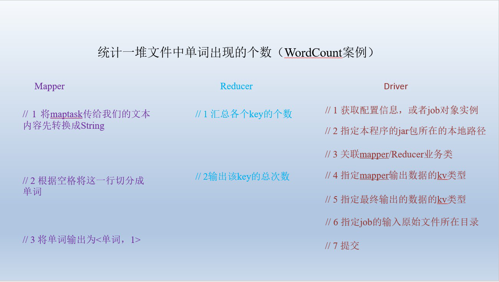
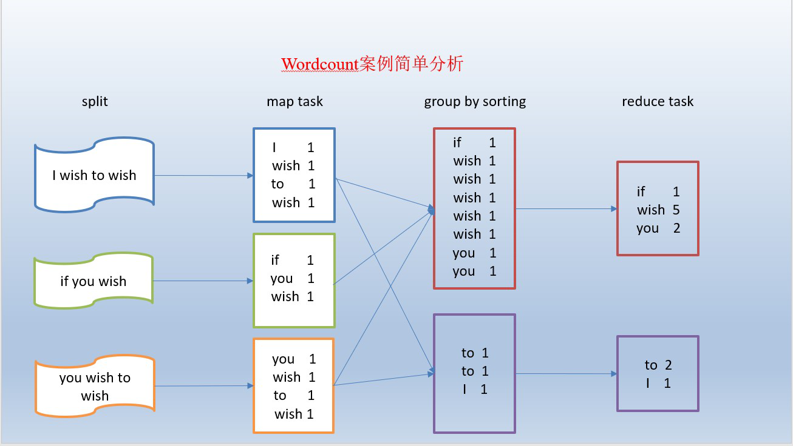
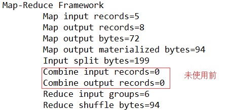
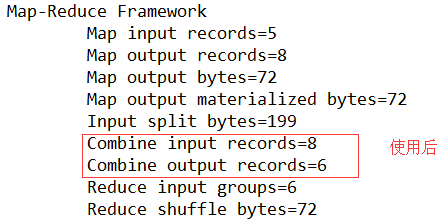
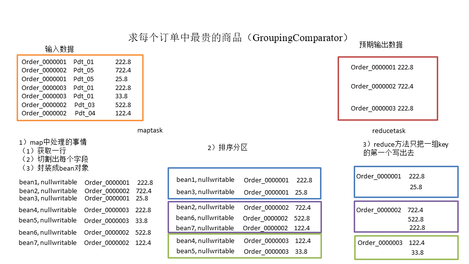
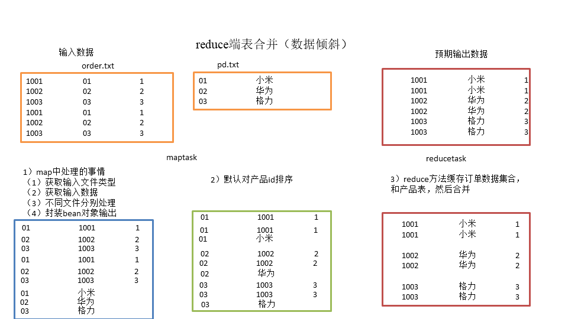
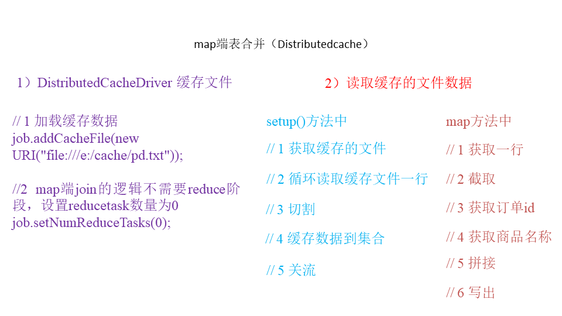

# 17_MapReduce全案例

# WordCount案例





## 17.1 统计一堆文件中单词出现的个数

需求：在一堆给定的文本文件中统计输出每个单词出现的总次数

数据准备：hello.txt

1. mapper类

   ```java
   import org.apache.hadoop.io.IntWritable;
   import org.apache.hadoop.io.LongWritable;
   import org.apache.hadoop.io.Text;
   import org.apache.hadoop.mapreduce.Mapper;
   
   import java.io.IOException;
   
   /**
    * @Class:maven._711.Maper
    * @Descript:
    * @Author:宋天
    * @Date:2019/11/22 20:04
    */
   public class WordCountMapper extends Mapper <LongWritable, Text,Text, IntWritable>{
       Text k = new Text();
       IntWritable v = new IntWritable(1);
       @Override
       protected void map(LongWritable key, Text value, Context context) throws IOException, InterruptedException {
           //1.获取一行
           String line = value.toString();
           //2.切割
           String[] s = line.split(" ");
           //3.输出
           for (String word : s){
               k.set(word);
               context.write(k,v);
           }
       }
   }
   
   ```

2. Reducer类

   ```java
   import org.apache.hadoop.io.IntWritable;
   import org.apache.hadoop.io.Text;
   import org.apache.hadoop.mapreduce.Reducer;
   
   import java.io.IOException;
   
   /**
    * @Class:maven._711.WordCountReduce
    * @Descript:
    * @Author:宋天
    * @Date:2019/11/22 20:09
    */
   public class WordCountReduce extends Reducer<Text, IntWritable,Text, IntWritable> {
       @Override
       protected void reduce(Text key, Iterable<IntWritable> values, Context context) throws IOException, InterruptedException {
   
           //1.累加求和
           int sum = 0;
           for (IntWritable count:values){
               sum += count.get();
           }
           //输出
           context.write(key, new IntWritable(sum));
       }
   }
   
   ```

3. 驱动类

   ```java
   import com.sun.org.apache.regexp.internal.RE;
   import org.apache.hadoop.conf.Configuration;
   import org.apache.hadoop.fs.Path;
   import org.apache.hadoop.io.IntWritable;
   import org.apache.hadoop.io.Text;
   import org.apache.hadoop.mapreduce.Job;
   import org.apache.hadoop.mapreduce.lib.input.FileInputFormat;
   import org.apache.hadoop.mapreduce.lib.output.FileOutputFormat;
   
   /**
    * @Class:maven._711.WordCountFDriver
    * @Descript:WordCount案例
    * @Author:宋天
    * @Date:2019/11/22 20:11
    */
   public class WordCountDriver {
       public static void main(String[] args) throws Exception{
           args = new String[]{"G://学习//maven//src//main//java//_711//hello.txt","G://学习//maven//src//main//java//_711//out"};
           //1.获取配置信息
           Configuration conf = new Configuration();
           Job job = Job.getInstance(conf);
           //2.设置jar包加载路径
           job.setJarByClass(WordCountDriver.class);
           //3.设置map和reducer类
           job.setMapperClass(WordCountMapper.class);
           job.setReducerClass(WordCountReduce.class);
           //4.设置map输出
           job.setMapOutputKeyClass(Text.class);
           job.setMapOutputValueClass(IntWritable.class);
           //5.设置reduce输出
           job.setOutputKeyClass(Text.class);
           job.setOutputValueClass(IntWritable.class);
           //6.设置输入和输出路径
           FileInputFormat.setInputPaths(job,new Path(args[0]));
           FileOutputFormat.setOutputPath(job,new Path(args[1]));
           //7.提交
           boolean result = job.waitForCompletion(true);
   
           System.exit(result?1:0);
       }
   }
   
   ```

## 17.2 把单词按照ASCII码奇偶分区（Partitioner）

1. 自定义分区

   ```java
   import org.apache.hadoop.io.IntWritable;
   import org.apache.hadoop.io.Text;
   import org.apache.hadoop.mapreduce.Partitioner;
   
   /**
    * @Class:maven._712.WordCountPartitioner
    * @Descript:
    * @Author:宋天
    * @Date:2019/11/22 20:20
    */
   public class WordCountPartitioner extends Partitioner<Text, IntWritable> {
       @Override
       public int getPartition(Text key, IntWritable value, int i) {
           //1.获取单词的key
           String firWord = key.toString().substring(0, 1);
           //将字符串转换为字符数组
           char[] charArray = firWord.toCharArray();
           int result = charArray[0];
           //2.根据奇书偶数进行分区
           if(result%2 == 0){
               return 0;
           }else {
               return 1;
           }
       }
   }
   
   ```

2. Mapper类

   ```java
   import org.apache.hadoop.io.IntWritable;
   import org.apache.hadoop.io.LongWritable;
   import org.apache.hadoop.io.Text;
   import org.apache.hadoop.mapreduce.Mapper;
   
   import java.io.IOException;
   
   /**
    * @Class:maven._711.Maper
    * @Descript:
    * @Author:宋天
    * @Date:2019/11/22 20:04
    */
   public class WordCountMapper extends Mapper <LongWritable, Text,Text, IntWritable>{
       Text k = new Text();
       IntWritable v = new IntWritable(1);
       @Override
       protected void map(LongWritable key, Text value, Context context) throws IOException, InterruptedException {
           //1.获取一行
           String line = value.toString();
           //2.切割
           String[] s = line.split(" ");
           //3.输出
           for (String word : s){
               k.set(word);
               context.write(k,v);
           }
       }
   }
   
   ```

3. Reducer类

   ```java
   import org.apache.hadoop.io.IntWritable;
   import org.apache.hadoop.io.Text;
   import org.apache.hadoop.mapreduce.Reducer;
   
   import java.io.IOException;
   
   /**
    * @Class:maven._711.WordCountReduce
    * @Descript:
    * @Author:宋天
    * @Date:2019/11/22 20:09
    */
   public class WordCountReduce extends Reducer<Text, IntWritable,Text, IntWritable> {
       @Override
       protected void reduce(Text key, Iterable<IntWritable> values, Context context) throws IOException, InterruptedException {
   
           //1.累加求和
           int sum = 0;
           for (IntWritable count:values){
               sum += count.get();
           }
           //输出
           context.write(key, new IntWritable(sum));
       }
   }
   
   ```

4. 驱动类

   ```java
   import org.apache.hadoop.conf.Configuration;
   import org.apache.hadoop.fs.Path;
   import org.apache.hadoop.io.IntWritable;
   import org.apache.hadoop.io.Text;
   import org.apache.hadoop.mapreduce.Job;
   import org.apache.hadoop.mapreduce.lib.input.FileInputFormat;
   import org.apache.hadoop.mapreduce.lib.output.FileOutputFormat;
   
   /**
    * @Class:maven._711.WordCountFDriver
    * @Descript:把单词按照ASCII码奇偶分区
    * @Author:宋天
    * @Date:2019/11/22 20:11
    */
   public class WordCountDriver {
       public static void main(String[] args) throws Exception{
           args = new String[]{"G://学习//maven//src//main//java//_711//hello.txt","G://学习//maven//src//main//java//_712//out"};
           //1.获取配置信息
           Configuration conf = new Configuration();
           Job job = Job.getInstance(conf);
           //2.设置jar包加载路径
           job.setJarByClass(WordCountDriver.class);
           //3.设置map和reducer类
           job.setMapperClass(WordCountMapper.class);
           job.setReducerClass(WordCountReduce.class);
           //4.设置map输出
           job.setMapOutputKeyClass(Text.class);
           job.setMapOutputValueClass(IntWritable.class);
   
           //5.设置reduce输出
           job.setOutputKeyClass(Text.class);
           job.setOutputValueClass(IntWritable.class);
   
           //设置分区
           job.setPartitionerClass(WordCountPartitioner.class);
           job.setNumReduceTasks(2);
   
   
           //6.设置输入和输出路径
           FileInputFormat.setInputPaths(job,new Path(args[0]));
           FileOutputFormat.setOutputPath(job,new Path(args[1]));
           //7.提交
           boolean result = job.waitForCompletion(true);
   
           System.exit(result?1:0);
       }
   }
   
   ```

## 17.3 对每一个maptask的输出局部汇总（Combiner）

统计过程中对每一个maptask的输出进行局部汇总，以减小网络传输量即采用Combiner功能。

数据准备：hello.txt

**方案一：**

1. 增加一个WordcountCombiner类继承Reducer

   ```java
   import org.apache.hadoop.io.IntWritable;
   import org.apache.hadoop.io.Text;
   import org.apache.hadoop.mapreduce.Reducer;
   
   import java.io.IOException;
   
   /**
    * @Class:maven._713.WordCountCombiner
    * @Descript:
    * @Author:宋天
    * @Date:2019/11/22 20:55
    */
   public class WordCountCombiner extends Reducer<Text, IntWritable,Text,IntWritable> {
       @Override
       protected void reduce(Text key, Iterable<IntWritable> values, Context context) throws IOException, InterruptedException {
   
           //1.汇总
           int count = 0;
           for (IntWritable v : values){
               count += v.get();
           }
           //2.写出
           context.write(key,new IntWritable(count));
       }
   }
   
   ```

2. Mapper类

   ```java
   import org.apache.hadoop.io.IntWritable;
   import org.apache.hadoop.io.LongWritable;
   import org.apache.hadoop.io.Text;
   import org.apache.hadoop.mapreduce.Mapper;
   
   import java.io.IOException;
   
   /**
    * @Class:maven._711.Maper
    * @Descript:
    * @Author:宋天
    * @Date:2019/11/22 20:04
    */
   public class WordCountMapper extends Mapper <LongWritable, Text,Text, IntWritable>{
       Text k = new Text();
       IntWritable v = new IntWritable(1);
       @Override
       protected void map(LongWritable key, Text value, Context context) throws IOException, InterruptedException {
           //1.获取一行
           String line = value.toString();
           //2.切割
           String[] s = line.split(" ");
           //3.输出
           for (String word : s){
               k.set(word);
               context.write(k,v);
           }
       }
   }
   
   ```

3. Reducer类

   ```java
   
   import org.apache.hadoop.io.IntWritable;
   import org.apache.hadoop.io.Text;
   import org.apache.hadoop.mapreduce.Reducer;
   
   import java.io.IOException;
   
   /**
    * @Class:maven._711.WordCountReduce
    * @Descript:
    * @Author:宋天
    * @Date:2019/11/22 20:09
    */
   public class WordCountReduce extends Reducer<Text, IntWritable,Text, IntWritable> {
       @Override
       protected void reduce(Text key, Iterable<IntWritable> values, Context context) throws IOException, InterruptedException {
   
           //1.累加求和
           int sum = 0;
           for (IntWritable count:values){
               sum += count.get();
           }
           //输出
           context.write(key, new IntWritable(sum));
       }
   }
   
   ```

4. 驱动类

   ```java
   public class WordCountDriver {
       public static void main(String[] args) throws Exception{
           args = new String[]{"G://学习//maven//src//main//java//_711//hello.txt","G://学习//maven//src//main//java//_713//out"};
           //1.获取配置信息
           Configuration conf = new Configuration();
           Job job = Job.getInstance(conf);
           //2.设置jar包加载路径
           job.setJarByClass(WordCountDriver.class);
           //3.设置map和reducer类
           job.setMapperClass(WordCountMapper.class);
           job.setReducerClass(WordCountReduce.class);
           //4.设置map输出
           job.setMapOutputKeyClass(Text.class);
           job.setMapOutputValueClass(IntWritable.class);
   
           //5.设置reduce输出
           job.setOutputKeyClass(Text.class);
           job.setOutputValueClass(IntWritable.class);
   
           //方案1：指定combiner
   //        job.setCombinerClass(WordCountCombiner.class);
           //方法2：将Reducer作为combiner
           job.setCombinerClass(WordCountReduce.class);
   
   
           //6.设置输入和输出路径
           FileInputFormat.setInputPaths(job,new Path(args[0]));
           FileOutputFormat.setOutputPath(job,new Path(args[1]));
           //7.提交
           boolean result = job.waitForCompletion(true);
   
           System.exit(result?1:0);
       }
   }
   
   ```

**方案二：**

将WordcountReducer作为combiner在WordcountDriver驱动类中指定

```java
// 指定需要使用combiner，以及用哪个类作为combiner的逻辑
job.setCombinerClass(WordcountReducer.class);
```

运行程序：






## 17.4 大量小文件的切片优化（CombineTextInputFormat）

在分布式的架构中，分布式文件系统HDFS，和分布式运算程序编程框架mapreduce。

HDFS:不怕大文件，**怕很多小文件**

mapreduce :**怕数据倾斜**

那么mapreduce是如果解决多个小文件的问题呢？

mapreduce关于大量小文件的优化策略

（1） 默认情况下，**TextInputFormat**对任务的切片机制是按照文件规划切片，不管有多少个小文件，都会是单独的切片，都**会交给一个maptask**，这样，如果有大量的小文件

就会产生大量的maptask，处理效率极端底下

（2）优化策略

最好的方法：在数据处理的最前端（预处理、采集），就将小文件合并成大文件，在上传到HDFS做后续的分析

补救措施：如果已经是大量的小文件在HDFS中了，可以使用另一种inputformat来做切片（CombineFileInputformat），它的切片逻辑跟TextInputformat

**注：combineTextInputFormat是CombineFileInputformat的子类**

不同：

它可以将多个小文件从逻辑上规划到一个切片中，这样，多个小文件就可以交给一个maptask了

```java
//如果不设置InputFormat，它默认的用的是TextInputFormat.class

/*CombineTextInputFormat为系统自带的组件类

* setMinInputSplitSize 中的2048是表示n个小文件之和不能大于2048

* setMaxInputSplitSize 中的4096是   当满足setMinInputSplitSize中的2048情况下  在满足n+1个小文件之和不能大于4096

*/

job.setInputFormatClass(CombineTextInputFormat.class);

CombineTextInputFormat.setMinInputSplitSize(job, 2048);

CombineTextInputFormat.setMaxInputSplitSize(job, 4096);
```

1. 输入数据：准备5个小文件

2. 实现过程

   1. 不做任何处理，运行需求1中的wordcount程序，观察切片数量

   2. 在WordcountDriver中增加如下代码，运行程序，并观察运行的切片个数为1

      ```java
      // 如果不设置InputFormat，它默认用的是TextInputFormat.class
      job.setInputFormatClass(CombineTextInputFormat.class);
      CombineTextInputFormat.setMaxInputSplitSize(job, 4194304);// 4m
      CombineTextInputFormat.setMinInputSplitSize(job, 2097152);// 2m
      ```

注：

| 文件大小 < MinSplit  < MaxSplit  | number of splits:1 |                      |        |
| -------------------------------- | ------------------ | -------------------- | ------ |
| MinSplit  < 文件大小 < MaxSplit  | number of splits:1 |                      |        |
| MaxSplit < 文件大小 < 2*MaxSplit | number of splits:2 |                      |        |
| 2 * MaxSplit < 文件大小          | number of splits:3 |                      |        |
| 测试大小                         | 最大MB             | 文件大小和最大值倍数 | Splits |
| 4.97MB                           | 3MB                | 1.65倍               | 2      |
| 4.1MB                            | 3MB                | 1.36                 | 1      |
| 6.51                             | 3MB                | 2.17                 | 3      |

1. 编写Mapper类

   ```java
   import org.apache.hadoop.io.IntWritable;
   import org.apache.hadoop.io.LongWritable;
   import org.apache.hadoop.io.Text;
   import org.apache.hadoop.mapreduce.Mapper;
   
   import java.io.IOException;
   
   /**
    * @Class:maven._711.Maper
    * @Descript:
    * @Author:宋天
    * @Date:2019/11/22 20:04
    */
   public class WordCountMapper extends Mapper <LongWritable, Text,Text, IntWritable>{
       Text k = new Text();
       IntWritable v = new IntWritable(1);
       @Override
       protected void map(LongWritable key, Text value, Context context) throws IOException, InterruptedException {
           //1.获取一行
           String line = value.toString();
           //2.切割
           String[] s = line.split(" ");
           //3.输出
           for (String word : s){
               k.set(word);
               context.write(k,v);
           }
       }
   }
   
   ```

2. Reduce

   ```java
   import org.apache.hadoop.io.IntWritable;
   import org.apache.hadoop.io.Text;
   import org.apache.hadoop.mapreduce.Reducer;
   
   import java.io.IOException;
   
   /**
    * @Class:maven._711.WordCountReduce
    * @Descript:
    * @Author:宋天
    * @Date:2019/11/22 20:09
    */
   public class WordCountReduce extends Reducer<Text, IntWritable,Text, IntWritable> {
       @Override
       protected void reduce(Text key, Iterable<IntWritable> values, Context context) throws IOException, InterruptedException {
   
           //1.累加求和
           int sum = 0;
           for (IntWritable count:values){
               sum += count.get();
           }
           //输出
           context.write(key, new IntWritable(sum));
       }
   }
   
   ```

3. 驱动类

   ```java
   import org.apache.hadoop.conf.Configuration;
   import org.apache.hadoop.fs.Path;
   import org.apache.hadoop.io.IntWritable;
   import org.apache.hadoop.io.Text;
   import org.apache.hadoop.mapreduce.Job;
   import org.apache.hadoop.mapreduce.lib.input.CombineTextInputFormat;
   import org.apache.hadoop.mapreduce.lib.input.FileInputFormat;
   import org.apache.hadoop.mapreduce.lib.output.FileOutputFormat;
   
   /**
    * @Class:maven._711.WordCountFDriver
    * @Descript:大量小文件的切片优化
    * @Author:宋天
    * @Date:2019/11/22 20:11
    */
   public class WordCountDriver {
       public static void main(String[] args) throws Exception{
           args = new String[]{"G://学习//maven//src//main//java//_714//input","G://学习//maven//src//main//java//_714//out"};
           //1.获取配置信息
           Configuration conf = new Configuration();
           Job job = Job.getInstance(conf);
           //2.设置jar包加载路径
           job.setJarByClass(WordCountDriver.class);
           //3.设置map和reducer类
           job.setMapperClass(WordCountMapper.class);
           job.setReducerClass(WordCountReduce.class);
           //4.设置map输出
           job.setMapOutputKeyClass(Text.class);
           job.setMapOutputValueClass(IntWritable.class);
   
           //5.设置reduce输出
           job.setOutputKeyClass(Text.class);
           job.setOutputValueClass(IntWritable.class);
   
           //如果不设置InputFormat，它默认采用TextInputFormat.class
           job.setInputFormatClass(CombineTextInputFormat.class);
           CombineTextInputFormat.setMaxInputSplitSize(job,4096);//当满足setMinInputSplitSize中的2048情况下  在满足n+1个小文件之和不能大于4096
           CombineTextInputFormat.setMinInputSplitSize(job, 2048);//是表示n个小文件之和不能大于4194304
   
           //看日志信息
           //2019-11-22 21:13:15,604 INFO [org.apache.hadoop.mapreduce.JobSubmitter] - number of splits:1  原文件太小。。。。所以只有一块
   
   
           //6.设置输入和输出路径
           FileInputFormat.setInputPaths(job,new Path(args[0]));
           FileOutputFormat.setOutputPath(job,new Path(args[1]));
           //7.提交
           boolean result = job.waitForCompletion(true);
   
           System.exit(result?1:0);
       }
   }
   
   ```

# 流量汇总案例


## 17.5 统计手机号耗费的总上行流量、下行流量、总流量（序列化）

需求：

统计每一个手机号耗费的总上行流量、下行流量、总流量

数据准备：data_flow.dat

输入数据格式：

```
数据格式：时间戳、电话号码、基站的物理地址、访问网址的ip、网站域名、数据包、接包数、上行/传流量、下行/载流量、响应码
```

输出数据格式：

```
1356·0436666 		1116		      954 			2070
手机号码		上行流量        下行流量		总流量
```

分析：

基本思路：

Map阶段：

1. 读取一行数据，切分字段
2. 抽取手机号、上行流量、下行流量
3. 以手机号为key，bean对象为value输出，即context.write(手机号,bean);

reduce阶段

1. 累加上行流量和下行流量得到总流量。
2. 实现自定义的bean来封装流量信息，并将bean作为map输出的key来传输
3. MR程序在处理数据的过程中会对数据排序(map输出的kv对传输到reduce之前，会排序)，排序的依据是map输出的key

**所以，**我们如果要实现自己需要的排序规则，则可以考虑将排序因素放到key中，让key实现接口：WritableComparable。

然后重写key的compareTo方法。

**编写程序**

1. 编写流量统计的bean对象

   ```java
   import org.apache.hadoop.io.Writable;
   
   import java.io.DataInput;
   import java.io.DataOutput;
   import java.io.IOException;
   
   /**
    * @Class:maven.FllowCount.FlowBean
    * @Descript:
    * @Author:宋天
    * @Date:2019/10/26 11:17
    */
   public class FlowBean implements Writable {
       private Integer upFlow;// 上行数据包数
       private Integer downFlow;// 下行数据包数
       private Integer upCountFlow;//上行流量总和
       private Integer downCountFlow;//下行流量总和
   
       public Integer getUpFlow() {
           return upFlow;
       }
   
       public void setUpFlow(Integer upFlow) {
           this.upFlow = upFlow;
       }
   
       public Integer getDownFlow() {
           return downFlow;
       }
   
       public void setDownFlow(Integer downFlow) {
           this.downFlow = downFlow;
       }
   
       public Integer getUpCountFlow() {
           return upCountFlow;
       }
   
       public void setUpCountFlow(Integer upCountFlow) {
           this.upCountFlow = upCountFlow;
       }
   
       public Integer getDownCountFlow() {
           return downCountFlow;
       }
   
       public void setDownCountFlow(Integer downCountFlow) {
           this.downCountFlow = downCountFlow;
       }
   
       @Override
       public String toString() {
           return  upFlow +
                   "/t" + downFlow +
                   "/t" + upCountFlow +
                   "/t" + downCountFlow;
       }
   
       //序列化方法
       @Override
       public void write(DataOutput dataOutput) throws IOException {
           dataOutput.writeInt(upFlow);
           dataOutput.writeInt(downFlow);
           dataOutput.writeInt(upCountFlow);
           dataOutput.writeInt(downCountFlow);
       }
       //反序列化
       @Override
       public void readFields(DataInput dataInput) throws IOException {
           this.upFlow = dataInput.readInt();
           this.downFlow = dataInput.readInt();
           this.upCountFlow = dataInput.readInt();
           this.downCountFlow = dataInput.readInt();
       }
   }
   ```

2. 编写mapper

   ```java
   import org.apache.hadoop.io.LongWritable;
   import org.apache.hadoop.io.Text;
   import org.apache.hadoop.mapreduce.Mapper;
   
   import java.io.IOException;
   
   /**
    * @Class:maven.FlowCount.FlowCountMapper
    * @Descript:
    * @Author:宋天
    * @Date:2019/10/26 11:25
    */
   public class FlowCountMapper extends Mapper<LongWritable, Text,Text,FlowBean> {
       /**
        * 将k1和 v1 转为 k2 和 v2
        * k1       v1
        * 0        1363157985059 	13600217502	00-1F-64-E2-E8-B1:CMCC	120.196.100.55	www.baidu.com	综合门户	19	128	1177	16852	200
        *
        * ------------
        *
        * k2               v2
        * 13600217502      FlowBean(19	128	1177	16852)
        */
       @Override
       protected void map(LongWritable key, Text value, Context context) throws IOException, InterruptedException {
           //1.拆分行文本数据，得到手机号 --》k2
           String[] split = value.toString().split("\t");
           String phoneNum = split[1];
   
           //2.创建FlowBean对象，并从行文本数据拆分出流量的四个字段，并将四个字段赋值给FlowBean对象
           FlowBean flowBean = new FlowBean();
           flowBean.setUpFlow(Integer.parseInt(split[6]));
           flowBean.setDownFlow(Integer.parseInt(split[7]));
           flowBean.setUpCountFlow(Integer.parseInt(split[8]));
           flowBean.setDownCountFlow(Integer.parseInt(split[9]));
   
           //3.将k2 和  v2 写入上下文中
           context.write(new Text(phoneNum),flowBean);
   
       }
   }
   
   ```

3. Reduce阶段

   ```java
   import org.apache.hadoop.io.Text;
   import org.apache.hadoop.mapreduce.Reducer;
   
   import java.io.IOException;
   
   /**
    * @Class:maven.FlowCount.FlowReducer
    * @Descript:
    * @Author:宋天
    * @Date:2019/10/26 11:34
    */
   public class FlowReducer extends Reducer<Text,FlowBean,Text,FlowBean> {
       @Override
       protected void reduce(Text key, Iterable<FlowBean> values, Context context) throws IOException, InterruptedException {
           //1.遍历集合，并将集合中对应的四个字段累加
            Integer upFlow = 0;// 上行数据包数
            Integer downFlow = 0;// 下行数据包数
            Integer upCountFlow = 0;//上行流量总和
            Integer downCountFlow = 0;//下行流量总和
           for (FlowBean value :values){
               upFlow += value.getUpFlow();
               downFlow += value.getDownFlow();
               upCountFlow += value.getUpCountFlow();
               downCountFlow += value.getDownCountFlow();
           }
           //2.创建FlowBean对象，并给对象赋值
           FlowBean flowBean = new FlowBean();
           flowBean.setUpFlow(upFlow);
           flowBean.setDownFlow(downFlow);
           flowBean.setUpCountFlow(upCountFlow);
           flowBean.setDownCountFlow(downCountFlow);
           //3.将k3和v3写入上下文中
           context.write(key,flowBean);
       }
   }
   
   ```

4. 编写驱动类

   ```java
   import org.apache.hadoop.conf.Configuration;
   import org.apache.hadoop.conf.Configured;
   import org.apache.hadoop.fs.Path;
   import org.apache.hadoop.io.Text;
   import org.apache.hadoop.mapreduce.Job;
   import org.apache.hadoop.mapreduce.lib.input.TextInputFormat;
   import org.apache.hadoop.mapreduce.lib.output.TextOutputFormat;
   import org.apache.hadoop.util.Tool;
   import org.apache.hadoop.util.ToolRunner;
   
   /**
    * @Class:maven.WordCount.JobMain
    * @Descript: 案例流量求和
    * @Author:宋天
    * @Date:2019/10/22 21:02
    */
   public class JobMain extends Configured implements Tool {
   
       //该方法用于指定一个job任务
       @Override
       public int run(String[] strings) throws Exception {
           //1.创建job任务对象
           Job job = Job.getInstance(super.getConf(), "mapreduce_flowBean");
           //如果打包运行出错，需要加如下代码
           job.setJarByClass(JobMain.class);
   
           //2.配置job任务对象
           job.setInputFormatClass(TextInputFormat.class);//1.读文件的方式使用InputFormat的子类TextInputFormat
           TextInputFormat.addInputPath(job,new Path("file:///G://学习//maven//src//main//java//FlowCount//data_flow.dat"));//2.指定读取源文件对象地址。
   
           job.setMapperClass(FlowCountMapper.class);//3.指定map阶段的处理方式
           job.setMapOutputKeyClass(Text.class);//4.设置map阶段k2的类型
           job.setMapOutputValueClass(FlowBean.class);//5.设置map阶段v2的类型
   
   //        shuffle阶段(分区，排序，规约，分组)暂不做处理，此处采用默认方式
   
           //6.指定Reduce阶段的处理方式和数据类型
           job.setReducerClass(FlowReducer.class);
           //7.设置k3类型
           job.setOutputKeyClass(Text.class);
           //8.设置v3的类型
           job.setOutputValueClass(FlowBean.class);
   
           //9.设置输出类型
           job.setOutputFormatClass(TextOutputFormat.class);
           //10.设置输出路径
           Path path = new Path("file:///G://学习//maven//src//main//java//FlowCount//FlowCountOut");
           TextOutputFormat.setOutputPath(job,path);
   
           //11.等待任务结束
           boolean b1 = job.waitForCompletion(true);
           return b1 ? 0 : 1;//根据返回结果判断任务是否正常
       }
   
       public static void main(String[] args) throws Exception {
           //配置文件对象
           Configuration conf = new Configuration();
           //启动job任务
           int run = ToolRunner.run(conf, new JobMain(), args);
           System.exit(run);//退出任务
       }
   }
   
   ```

## 17.6 将统计结果按照手机归属地不同省份输出到不同文件中（Partitioner）

需求：将统计结果按照手机归属地不同省份输出到不同文件中（分区）

数据准备:同上

分析：

1. Mapreduce中会将map输出的kv对，按照相同key分组，然后分发给不同的reducetask。默认的分发规则为：根据key的hashcode%reducetask数来分发

2. 如果要按照我们自己的需求进行分组，则需要改写数据分发（分组）组件Partitioner

   自定义一个CustomPartitioner继承抽象类：Partitioner

3. 在job驱动中，设置自定义`partitioner： job.setPartitionerClass(CustomPartitioner.class)`

在案例17.5的基础上，增加一个分区类

```java

import org.apache.hadoop.io.Text;
import org.apache.hadoop.mapreduce.Partitioner;


/**
 * @Class:maven.FlowCount_partition.FlowCountPartition
 * @Descript:
 * @Author:宋天
 * @Date:2019/10/26 18:23
 */
public class FlowCountPartition  extends Partitioner<Text,FlowBean> {
    /**
     * 该方法用来指定分区的规则
     * 135开头的数据到一个分区文件
     * 136开头的数据到一个分区文件
     * 147开头的数据到一个分区文件
     * @param text k2
     * @param flowBean v2
     * @param i reduceTask的个数
     * @return
     */
    @Override
    public int getPartition(Text text, FlowBean flowBean, int i) {
        // 1.获取手机号
        String phoneNum = text.toString();
        //2.判断手机号以什么开头，返回对应的分区别号（0-3）
        if (phoneNum.startsWith("135")){
            return 0;
        }else if(phoneNum.startsWith("136")){
            return 1;
        }else if (phoneNum.startsWith("137")){
            return 2;
        }else {
            return 3;
        }
    }
}

```

在驱动函数中增加自定义数据分区设置和reduce task设置

```java
import org.apache.hadoop.conf.Configuration;
import org.apache.hadoop.conf.Configured;
import org.apache.hadoop.fs.Path;
import org.apache.hadoop.io.Text;
import org.apache.hadoop.mapreduce.Job;
import org.apache.hadoop.mapreduce.lib.input.TextInputFormat;
import org.apache.hadoop.mapreduce.lib.output.TextOutputFormat;
import org.apache.hadoop.util.Tool;
import org.apache.hadoop.util.ToolRunner;

/**
 * @Class:maven.WordCount.JobMain
 * @Descript: 案例根据手机号进行分区
 * @Author:宋天
 * @Date:2019/10/22 21:02
 */
public class JobMain extends Configured implements Tool {

    //该方法用于指定一个job任务
    @Override
    public int run(String[] strings) throws Exception {
        //1.创建job任务对象
        Job job = Job.getInstance(super.getConf(), "mapreduce_flowBean_partition");
        //如果打包运行出错，需要加如下代码
        job.setJarByClass(JobMain.class);

        //2.配置job任务对象
        job.setInputFormatClass(TextInputFormat.class);//1.读文件的方式使用InputFormat的子类TextInputFormat
        TextInputFormat.addInputPath(job,new Path("file:///G://学习//maven//src//main//java//FlowCount_partition//data_flow.dat"));//2.指定读取源文件对象地址。

        job.setMapperClass(FlowCountMapper.class);//3.指定map阶段的处理方式
        job.setMapOutputKeyClass(Text.class);//4.设置map阶段k2的类型
        job.setMapOutputValueClass(FlowBean.class);//5.设置map阶段v2的类型

//        shuffle阶段(分区，排序，规约，分组)暂不做处理，此处采用默认方式
        //指定分区
        job.setPartitionerClass(FlowCountPartition.class);

        //6.指定Reduce阶段的处理方式和数据类型
        job.setReducerClass(FlowReducer.class);
        //7.设置k3类型
        job.setOutputKeyClass(Text.class);
        //8.设置v3的类型
        job.setOutputValueClass(FlowBean.class);

        //设置reduce的个数
        job.setNumReduceTasks(4);

        //9.设置输出类型
        job.setOutputFormatClass(TextOutputFormat.class);
        //10.设置输出路径
        Path path = new Path("file:///G://学习//maven//src//main//java//FlowCount_partition//FlowPartitionOut");
        TextOutputFormat.setOutputPath(job,path);

        //11.等待任务结束
        boolean b1 = job.waitForCompletion(true);
        return b1 ? 0 : 1;//根据返回结果判断任务是否正常
    }

    public static void main(String[] args) throws Exception {
        //配置文件对象
        Configuration conf = new Configuration();
        //启动job任务
        int run = ToolRunner.run(conf, new JobMain(), args);
        System.exit(run);//退出任务
    }
}

```

## 17.7 将统计结果按照总流量倒序排序（全排序）

需求：根据案例17.5产生的结果再次对总流量进行排序。

数据准备：案例17.5的输出结果

分析：

1. 把程序分两步走，第一步正常统计总流量，第二步再把结果进行排序

2. context.write(总流量，手机号)

3. FlowBean实现WritableComparable接口重写compareTo方法

   ```java
   @Override
   public int compareTo(FlowBean o) {
   	// 倒序排列，从大到小
   	return this.sumFlow > o.getSumFlow() ? -1 : 1;
   }
   ```

代码实现：

1. FlowBean对象在在需求1基础上增加了比较功能

   ```java
   import org.apache.hadoop.io.WritableComparable;
   
   import java.io.DataInput;
   import java.io.DataOutput;
   import java.io.IOException;
   
   /**
    * @Class:maven.FllowCount.FlowBean
    * @Descript:
    * @Author:宋天
    * @Date:2019/10/26 11:17
    */
   public class FlowBean implements WritableComparable<FlowBean> {
       private Integer upFlow;// 上行数据包数
       private Integer downFlow;// 下行数据包数
       private Integer upCountFlow;//上行流量总和
       private Integer downCountFlow;//下行流量总和
   
       public Integer getUpFlow() {
           return upFlow;
       }
   
       public void setUpFlow(Integer upFlow) {
           this.upFlow = upFlow;
       }
   
       public Integer getDownFlow() {
           return downFlow;
       }
   
       public void setDownFlow(Integer downFlow) {
           this.downFlow = downFlow;
       }
   
       public Integer getUpCountFlow() {
           return upCountFlow;
       }
   
       public void setUpCountFlow(Integer upCountFlow) {
           this.upCountFlow = upCountFlow;
       }
   
       public Integer getDownCountFlow() {
           return downCountFlow;
       }
   
       public void setDownCountFlow(Integer downCountFlow) {
           this.downCountFlow = downCountFlow;
       }
   
       @Override
       public String toString() {
           return  upFlow +
                   "\t" + downFlow +
                   "\t" + upCountFlow +
                   "\t" + downCountFlow;
       }
   
       //序列化方法
       @Override
       public void write(DataOutput dataOutput) throws IOException {
           dataOutput.writeInt(upFlow);
           dataOutput.writeInt(downFlow);
           dataOutput.writeInt(upCountFlow);
           dataOutput.writeInt(downCountFlow);
       }
       //反序列化
       @Override
       public void readFields(DataInput dataInput) throws IOException {
           this.upFlow = dataInput.readInt();
           this.downFlow = dataInput.readInt();
           this.upCountFlow = dataInput.readInt();
           this.downCountFlow = dataInput.readInt();
       }
   
       //指定排序的规则
       @Override
       public int compareTo(FlowBean o) {
           /\this.upFlow .compareTo(o.getUpFlow());
           return  o.upFlow - this.upFlow;//降序
       }
   }
   
   ```

2. 编写mapper

   ```java
   
   import org.apache.hadoop.io.LongWritable;
   import org.apache.hadoop.io.Text;
   import org.apache.hadoop.mapreduce.Mapper;
   
   import java.io.IOException;
   
   /**
    * @Class:maven.FlowCount_sort.FlowSortMappper
    * @Descript:
    * @Author:宋天
    * @Date:2019/10/26 16:48
    */
   
   /**
    * k1 Longwritable 行偏移量
    * v1 Text  行文本数据
    *
    * k2   FlowBean
    * v2   Text 手机号
    */
   public class FlowSortMapper extends Mapper<LongWritable, Text,FlowBean,Text> {
       //map方法：k1,v1转为k2,v2
       @Override
       protected void map(LongWritable key, Text value, Context context) throws IOException, InterruptedException {
           //1.拆分行文本数据（v1），得到四个流量字段，并封装FlowBean对象，得到k2
           String[] split = value.toString().split("\t");
           FlowBean flowBean = new FlowBean();
           flowBean.setUpFlow(Integer.parseInt(split[1]));
           flowBean.setDownFlow(Integer.parseInt(split[2]));
           flowBean.setUpCountFlow(Integer.parseInt(split[3]));
           flowBean.setDownCountFlow(Integer.parseInt(split[4]));
           //2.通过行文本数据，得到手机号 v2
           String phoneNum = split[0];//手机号
           //3.将k2和v2写入上下文中
           context.write(flowBean,new Text(phoneNum));
       }
   }
   
   ```

3. 编写reduce

   ```java
   import org.apache.hadoop.io.Text;
   import org.apache.hadoop.mapreduce.Reducer;
   
   import java.io.IOException;
   
   /**
    * @Class:maven.FlowCount_sort.FlowReducer
    * @Descript:
    * @Author:宋天
    * @Date:2019/10/26 16:56
    */
   
   /**
    * k2   FlowBean
    * v2   Text 手机号
    *
    * k3   Text 手机号
    * v3   FlowBean
    */
   public class FlowSortReducer extends Reducer<FlowBean,Text, Text,FlowBean> {
       @Override
       protected void reduce(FlowBean key, Iterable<Text> values, Context context) throws IOException, InterruptedException {
           //1.遍历集合，取出k3，并将k3和v3写入上下文
           for ( Text value : values){
               context.write(value,key);
           }
   
       }
   }
   
   ```

4. 编写驱动类

   ```java
   import _724.ProvincePartitioner;
   import org.apache.hadoop.conf.Configuration;
   import org.apache.hadoop.conf.Configured;
   import org.apache.hadoop.fs.Path;
   import org.apache.hadoop.io.Text;
   import org.apache.hadoop.mapreduce.Job;
   import org.apache.hadoop.mapreduce.lib.input.TextInputFormat;
   import org.apache.hadoop.mapreduce.lib.output.TextOutputFormat;
   import org.apache.hadoop.util.Tool;
   import org.apache.hadoop.util.ToolRunner;
   
   /**
    * @Class:maven.WordCount.JobMain
    * @Descript: 案例上行流量倒序排序
    * @Author:宋天
    * @Date:2019/10/22 21:02
    */
   public class JobMain extends Configured implements Tool {
   
       //该方法用于指定一个job任务
       @Override
       public int run(String[] strings) throws Exception {
           //1.创建job任务对象
           Job job = Job.getInstance(super.getConf(), "mapreduce_flowBean");
   
           //2.配置job任务对象
           job.setInputFormatClass(TextInputFormat.class);//1.读文件的方式使用InputFormat的子类TextInputFormat
           TextInputFormat.addInputPath(job,new Path("file:///G://学习//maven//src//main//java//_721//FlowCountOut"));//2.指定读取源文件对象地址,将上次的输出作为本次的输入
   
           job.setMapperClass(FlowSortMapper.class);//3.指定map阶段的处理方式
           job.setMapOutputKeyClass(FlowBean.class);//4.设置map阶段k2的类型
           job.setMapOutputValueClass(Text.class);//5.设置map阶段v2的类型
   
   //        shuffle阶段(分区，排序，规约，分组)暂不做处理，此处采用默认方式
   
           //6.指定Reduce阶段的处理方式和数据类型
           job.setReducerClass(FlowSortReducer.class);
           //7.设置k3类型
           job.setOutputKeyClass(Text.class);
           //8.设置v3的类型
           job.setOutputValueClass(FlowBean.class);
   
           //9.设置输出类型
           job.setOutputFormatClass(TextOutputFormat.class);
           //10.设置输出路径
           Path path = new Path("file:///G://学习//maven//src//main//java//FlowCount_sort//FlowCount_sortOut");
           TextOutputFormat.setOutputPath(job,path);
   
           //11.等待任务结束
           boolean b1 = job.waitForCompletion(true);
           return b1 ? 0 : 1;//根据返回结果判断任务是否正常
       }
   
       public static void main(String[] args) throws Exception {
           //配置文件对象
           Configuration conf = new Configuration();
           //启动job任务
           int run = ToolRunner.run(conf, new JobMain(), args);
           System.exit(run);//退出任务
       }
   }
   
   ```

## 17.8 不同省份输出文件内部排序（部分排序）

需求：要求每个省份手机号输出的文件中按照总流量内部排序。

分析：基于案例17.7，增加自定义分区类即可。

1. 增加自定义分区类

   ```java
   import org.apache.hadoop.io.Text;
   import org.apache.hadoop.mapreduce.Partitioner;
   
   /**
    * @Class:maven._724.ProvincePartitioner
    * @Descript:
    * @Author:宋天
    * @Date:2019/11/22 21:56
    */
   public class ProvincePartitioner extends Partitioner<FlowBean, Text> {
   
       @Override
       public int getPartition(FlowBean key, Text value, int i) {
           //1.获取手机号前三位
           String preNum = value.toString().substring(0, 3);
           int partition = 4;
           //2.根据手机号归属地设置分区
           if ("136".equals(preNum)) {
               partition = 0;
           }else if ("137".equals(preNum)) {
               partition = 1;
           }else if ("138".equals(preNum)) {
               partition = 2;
           }else if ("139".equals(preNum)) {
               partition = 3;
           }
   
           return partition;
       }
   }
   
   ```

2. 在驱动类中添加分区类

   ```java
   // 加载自定义分区类
   job.setPartitionerClass(FlowSortPartitioner.class);
   // 设置Reducetask个数
   	job.setNumReduceTasks(5);
   ```

3. 其他不变

## 17.9 辅助排序和二次排序案例（GroupingComparator）

需求：有如下订单数据

| 订单id  | 商品id | 成交金额 |
| ------- | ------ | -------- |
| 0000001 | Pdt_01 | 222.8    |
| 0000001 | Pdt_06 | 25.8     |
| 0000002 | Pdt_03 | 522.8    |
| 0000002 | Pdt_04 | 122.4    |
| 0000002 | Pdt_05 | 722.4    |
| 0000003 | Pdt_01 | 222.8    |
| 0000003 | Pdt_02 | 33.8     |

现在需要求出每一个订单中最贵的商品。

输入数据：GroupingComparator.txt

分析：

1. 利用“订单id和成交金额”作为key，可以将map阶段读取到的所有订单数据按照id分区，按照金额排序，发送到reduce。
2. 在reduce端利用groupingcomparator将订单id相同的kv聚合成组，然后取第一个即是最大值。



代码实现：

1. 定义订单信息OrderBean

   ```java
   package _730;
   
   import org.apache.hadoop.io.WritableComparable;
   
   import java.io.DataInput;
   import java.io.DataOutput;
   import java.io.IOException;
   
   /**
    * @Class:maven._730.OrderBean
    * @Descript:
    * @Author:宋天
    * @Date:2019/11/22 22:05
    */
   public class OrderBean implements WritableComparable<OrderBean> {
       //订单ID
       private int order_id;
       //价格
       private double price;
   
       public int getOrder_id() {
           return order_id;
       }
   
       public void setOrder_id(int order_id) {
           this.order_id = order_id;
       }
   
       public double getPrice() {
           return price;
       }
   
       public void setPrice(double price) {
           this.price = price;
       }
   
       @Override
       public String toString() {
           return order_id +"\t"+price;
       }
   
       @Override
       public int compareTo(OrderBean o) {
           int result;
           if(this.order_id > o.getOrder_id()){
               result = 1;
           }else if (this.order_id < getOrder_id()){
               result = -1;
           }else {
               result = this.price > o.getPrice() ? -1 : 1;
           }
           return result;
       }
   
       @Override
       public void write(DataOutput dataOutput) throws IOException {
           dataOutput.writeInt(order_id);
           dataOutput.writeDouble(price);
       }
   
       @Override
       public void readFields(DataInput dataInput) throws IOException {
           this.order_id = dataInput.readInt();
           this.price = dataInput.readDouble();
       }
   }
   
   ```

2. 编写OrderSortMapper

   ```java
   package _730;
   
   import org.apache.hadoop.io.LongWritable;
   import org.apache.hadoop.io.NullWritable;
   import org.apache.hadoop.io.Text;
   import org.apache.hadoop.mapreduce.Mapper;
   import org.junit.jupiter.api.Order;
   
   import java.io.IOException;
   
   /**
    * @Class:maven._730.OrderMapper
    * @Descript:
    * @Author:宋天
    * @Date:2019/11/22 22:13
    */
   public class OrderMapper extends Mapper<LongWritable, Text,OrderBean, NullWritable> {
       OrderBean k = new OrderBean();
   
       @Override
       protected void map(LongWritable key, Text value, Context context) throws IOException, InterruptedException {
           //1.获取一行
           String line = value.toString();
           //2.截取
           String[] fields = line.split("\t");
           //3.封装对象
           k.setOrder_id(Integer.parseInt(fields[0]));
           k.setPrice(Double.parseDouble(fields[2]));
   
           //4.写出
           context.write(k,NullWritable.get());
       }
   }
   
   ```

3. 编写OrderSortPartitioner

   ```java
   package _730;
   
   import org.apache.hadoop.io.NullWritable;
   import org.apache.hadoop.mapreduce.Partitioner;
   
   /**
    * @Class:maven._730.OrderSortPartitioner
    * @Descript:
    * @Author:宋天
    * @Date:2019/11/22 22:16
    */
   public class OrderSortPartitioner extends Partitioner<OrderBean, NullWritable> {
   
       @Override
       public int getPartition(OrderBean key, NullWritable value, int numReduceTasks) {
   
           return (key.getOrder_id() & Integer.MAX_VALUE) % numReduceTasks;
       }
   }
   
   ```

4. 编写OrderSortGroupingComparator

   ```java
   package _730;
   
   
   import org.apache.hadoop.io.WritableComparable;
   import org.apache.hadoop.io.WritableComparator;
   
   /**
    * @Class:maven._730.OrderSortGroupingComparator
    * @Descript:
    * @Author:宋天
    * @Date:2019/11/22 22:18
    */
   public class OrderSortGroupingComparator extends WritableComparator {
       protected OrderSortGroupingComparator(){
           super (OrderBean.class,true);
       }
   
       @SuppressWarnings("rawtypes")
       @Override
       public int compare(WritableComparable a, WritableComparable b) {
           OrderBean aBean = (OrderBean)a;
           OrderBean bBean = (OrderBean)b;
   
           int result;
           if (aBean.getOrder_id() > bBean.getOrder_id()){
               result = 1;
           }else if (aBean.getOrder_id() < bBean.getOrder_id()){
               result = -1;
           }else{
               result = 0;
           }
           return result;
       }
   }
   
   ```

5. 编写OrderSortReducer

   ```java
   package _730;
   
   import org.apache.hadoop.io.NullWritable;
   import org.apache.hadoop.io.Text;
   import org.apache.hadoop.mapreduce.Reducer;
   
   import java.io.IOException;
   
   /**
    * @Class:maven._730.OrderSortReducer
    * @Descript:
    * @Author:宋天
    * @Date:2019/11/22 22:23
    */
   public class OrderSortReducer extends Reducer<OrderBean, NullWritable,OrderBean, NullWritable> {
       @Override
       protected void reduce(OrderBean key, Iterable<NullWritable> values, Context context) throws IOException, InterruptedException {
   
           context.write(key,NullWritable.get());
       }
   }
   
   ```

6. 编写OrderSortDriver

   ```java
   package _730;
   
   import org.apache.hadoop.conf.Configuration;
   import org.apache.hadoop.fs.Path;
   import org.apache.hadoop.io.NullWritable;
   import org.apache.hadoop.mapreduce.Job;
   import org.apache.hadoop.mapreduce.lib.input.FileInputFormat;
   import org.apache.hadoop.mapreduce.lib.output.FileOutputFormat;
   
   
   /**
    * @Class:maven._730.OrderDriver
    * @Descript: 辅助排序和二次排序案例
    * @Author:宋天
    * @Date:2019/11/22 22:25
    */
   public class OrderDriver{
       public static void main(String[] args) throws Exception{
           args = new String[]{"G://学习//maven//src//main//java//_730//GroupingComparator.txt","G://学习//maven//src//main//java//_730//out"};
           //1.获取配置信息
           Configuration conf = new Configuration();
           Job job = Job.getInstance(conf);
           //2.设置Jar包加载路径
           job.setJarByClass(OrderBean.class);
           //3.加载map，reducer类
           job.setMapperClass(OrderMapper.class);
           job.setReducerClass(OrderSortReducer.class);
           //4.设置map输出数据类型
           job.setMapOutputKeyClass(OrderBean.class);
           job.setMapOutputValueClass(NullWritable.class);
           //5.设置最终输出类型
           job.setOutputKeyClass(OrderBean.class);
           job.setOutputValueClass(NullWritable.class);
           //6.设置输入数据和输出数据的路径
           FileInputFormat.setInputPaths(job,new Path(args[0]));
           FileOutputFormat.setOutputPath(job,new Path(args[1]));
           //7.设置Reduce端的分组
           job.setGroupingComparatorClass(OrderSortGroupingComparator.class);
           //8.设置分区
           job.setPartitionerClass(OrderSortPartitioner.class);
           //9.设置reduce个数
           job.setNumReduceTasks(3);
           //10.提交
           boolean result = job.waitForCompletion(true);
   
           System.exit(result?1:0);
   
       }
   }
   
   ```

## 17.10 小文件处理案例（自定义InputFormat）

需求：无论hdfs还是mapreduce，对于小文件都有损效率，实践中，又难免面临处理大量小文件的场景，此时，就需要有相应解决方案。将多个小文件合并成一个文件SequenceFile，SequenceFile里面存储着多个文件，存储的形式为文件路径+名称为key，文件内容为value。

输入数据：one.txt， two.txt， three.txt

分析：

小文件的优化无非以下几种方式：

1. 在数据采集的时候，就将小文件或小批数据合成大文件再上传HDFS
2. 在业务处理之前，在HDFS上使用mapreduce程序对小文件进行合并
3. 在mapreduce处理时，可采用CombineTextInputFormat提高效率

具体实现

本节采用自定义InputFormat的方式，处理输入小文件的问题。

1. 自定义一个类继承FileInputFormat
2. 改写RecordReader，实现一次读取一个完整文件封装为KV
3. 在输出时使用SequenceFileOutPutFormat输出合并文件

程序实现：

1. 自定义InputFromat

   ```java
   import org.apache.hadoop.fs.Path;
   import org.apache.hadoop.io.BytesWritable;
   import org.apache.hadoop.io.NullWritable;
   import org.apache.hadoop.mapreduce.InputSplit;
   import org.apache.hadoop.mapreduce.JobContext;
   import org.apache.hadoop.mapreduce.RecordReader;
   import org.apache.hadoop.mapreduce.TaskAttemptContext;
   import org.apache.hadoop.mapreduce.lib.input.FileInputFormat;
   
   import java.io.IOException;
   
   /**
    * @Class:maven.myInputFormat1.FileInputFormat
    * @Descript:
    * @Author:宋天
    * @Date:2019/11/19 17:46
    */
   
   //定义类继承FileInputFormat
   public class MyFileInputFormat extends FileInputFormat {
   
       //是否切分文件
       @Override
       protected boolean isSplitable(JobContext context, Path filename) {
           return false;
       }
   
       @Override
       public RecordReader<NullWritable, BytesWritable> createRecordReader(InputSplit split, TaskAttemptContext context) throws IOException, InterruptedException {
           MyRecordReader myRecordReader = new MyRecordReader();
           myRecordReader.initialize(split,context);
           return myRecordReader;
       }
   }
   
   ```

2. 自定义RecordReader

   ```java
   package myInputFormat1;
   
   import java.io.IOException;
   import org.apache.hadoop.conf.Configuration;
   import org.apache.hadoop.fs.FSDataInputStream;
   import org.apache.hadoop.fs.FileSystem;
   import org.apache.hadoop.fs.Path;
   import org.apache.hadoop.io.BytesWritable;
   import org.apache.hadoop.io.IOUtils;
   import org.apache.hadoop.io.NullWritable;
   import org.apache.hadoop.mapreduce.InputSplit;
   import org.apache.hadoop.mapreduce.RecordReader;
   import org.apache.hadoop.mapreduce.TaskAttemptContext;
   import org.apache.hadoop.mapreduce.lib.input.FileSplit;
   
   
   
   /**
    * @Class:maven.myInputFormat1.MyRecordReader
    * @Descript:
    * @Author:宋天
    * @Date:2019/11/19 17:50
    */
   public class MyRecordReader extends RecordReader<NullWritable, BytesWritable> {
       //配置 切片 加工 value值
       private Configuration configuration;
       private FileSplit split;
   
       private boolean processed = false;
       private BytesWritable value = new BytesWritable();
   
       @Override
       public void initialize(InputSplit split, TaskAttemptContext context) throws IOException, InterruptedException {
   
           this.split = (FileSplit)split;
           configuration = context.getConfiguration();
       }
   
       @Override
       public boolean nextKeyValue() throws IOException, InterruptedException {
   
           if (!processed) {
               // 1 定义缓存区
               byte[] contents = new byte[(int)split.getLength()];
   
               FileSystem fs = null;
               FSDataInputStream fis = null;
   
               try {
                   // 2 获取文件系统
                   Path path = split.getPath();
                   fs = path.getFileSystem(configuration);
   
                   // 3 读取数据
                   fis = fs.open(path);
   
                   // 4 读取文件内容
                   IOUtils.readFully(fis, contents, 0, contents.length);
   
                   // 5 输出文件内容
                   value.set(contents, 0, contents.length);
               } catch (Exception e) {
   
               }finally {
                   IOUtils.closeStream(fis);
               }
   
               processed = true;
   
               return true;
           }
   
           return false;
       }
   
       @Override
       public NullWritable getCurrentKey() throws IOException, InterruptedException {
           return NullWritable.get();
       }
   
       @Override
       public BytesWritable getCurrentValue() throws IOException, InterruptedException {
           return value;
       }
   
       @Override
       public float getProgress() throws IOException, InterruptedException {
           return processed? 1:0;
       }
   
       @Override
       public void close() throws IOException {
       }
   }
   ```

3. SequenceFileMapper处理流程

   ```java
   import org.apache.hadoop.io.BytesWritable;
   import org.apache.hadoop.io.NullWritable;
   import org.apache.hadoop.io.Text;
   import org.apache.hadoop.mapreduce.Mapper;
   import org.apache.hadoop.mapreduce.lib.input.FileSplit;
   
   import java.io.IOException;
   
   /**
    * @Class:maven.myInputFormat1.FileMapper
    * @Descript:
    * @Author:宋天
    * @Date:2019/11/19 17:31
    */
   public class FileMapper extends Mapper<NullWritable, BytesWritable,Text,BytesWritable> {
       Text k = new Text();
       @Override
       protected void setup(Context context) throws IOException, InterruptedException {
   
           //获取文件切片信息
           FileSplit inputSplit = (FileSplit) context.getInputSplit();
           //获取切片名称
           String name = inputSplit.getPath().toString();
           //设置key的输出
           k.set(name);
       }
   
       @Override
       protected void map(NullWritable key, BytesWritable value, Context context) throws IOException, InterruptedException {
           context.write(k,value);
       }
   }
   
   ```

4. Reducer

   ```java
   package myInputFormat1;
   
   import org.apache.hadoop.io.BytesWritable;
   import org.apache.hadoop.io.Text;
   import org.apache.hadoop.mapreduce.Reducer;
   
   import java.io.IOException;
   
   /**
    * @Class:maven.myInputFormat1.FileReducer
    * @Descript:
    * @Author:宋天
    * @Date:2019/11/19 17:44
    */
   public class FileReducer extends Reducer<Text, BytesWritable, Text,BytesWritable> {
       @Override
       protected void reduce(Text key, Iterable<BytesWritable> values, Context context) throws IOException, InterruptedException {
   
           context.write(key,values.iterator().next());
       }
   }
   
   ```

5. 编写驱动类

   ```java
   
   import org.apache.hadoop.conf.Configuration;
   import org.apache.hadoop.fs.Path;
   import org.apache.hadoop.io.BytesWritable;
   import org.apache.hadoop.io.Text;
   import org.apache.hadoop.mapreduce.Job;
   import org.apache.hadoop.mapreduce.lib.input.FileInputFormat;
   import org.apache.hadoop.mapreduce.lib.output.FileOutputFormat;
   import org.apache.hadoop.mapreduce.lib.output.SequenceFileOutputFormat;
   
   import java.io.IOException;
   
   /**
    * @Class:maven.myInputFormat1.SequenceFileDriver
    * @Descript: 自定义inputformat 实现小文件合并 目的：在进入map之前就进行一次合并
    * @Author:宋天
    * @Date:2019/11/19 18:28
    */
   public class SequenceFileDriver {
       public static void main(String[] args) throws IOException, ClassNotFoundException, InterruptedException {
           args = new String[]{"G://学习//maven//src//main//java//myInputFormat1//_714.input","G://学习//maven//src//main//java//myInputFormat1//out"};
           Configuration conf = new Configuration();
           Job job = Job.getInstance(conf);
           job.setJarByClass(SequenceFileDriver.class);
           job.setMapperClass(FileMapper.class);
           job.setReducerClass(FileReducer.class);
   
           //设置输入的inputFormat
           job.setInputFormatClass(MyFileInputFormat.class);
           //设置输出的outputFormat
           job.setOutputFormatClass(SequenceFileOutputFormat.class);
   
           job.setMapOutputKeyClass(Text.class);
           job.setMapOutputValueClass(BytesWritable.class);
   
           job.setOutputKeyClass(Text.class);
           job.setOutputValueClass(BytesWritable.class);
   
           FileInputFormat.setInputPaths(job,new Path(args[0]));
           FileOutputFormat.setOutputPath(job,new Path(args[1]));
   
           boolean result = job.waitForCompletion(true);
           System.exit(result?0:1);
   
   
       }
   }
   
   ```


## 17.11 过滤日志及自定义日志输出路径案例（自定义OutputFormat）

需求：过滤输入的log日志中是否包含itstar

1. 包含itstar的网站输出到 一个文件
2. 不包含itstar的网站输出到一个文件

输入数据：log.txt

编写程序：

1. 自定义一个outputformat

   ```java
   package MyOutputFormat1;
   
   import org.apache.hadoop.io.NullWritable;
   import org.apache.hadoop.io.Text;
   import org.apache.hadoop.mapreduce.RecordWriter;
   import org.apache.hadoop.mapreduce.TaskAttemptContext;
   import org.apache.hadoop.mapreduce.lib.output.FileOutputFormat;
   
   import java.io.IOException;
   
   /**
    * @Class:maven.MyOutputFormat1.FileterOutputFormat
    * @Descript:
    * @Author:宋天
    * @Date:2019/11/19 19:04
    */
   public class FileterLogOutputFormat extends FileOutputFormat<Text, NullWritable> {
   
       @Override
       public RecordWriter<Text, NullWritable> getRecordWriter(TaskAttemptContext job) throws IOException, InterruptedException {
           //创建一个RecordWriter
           return new FilterLogRecordWriter(job);
       }
   }
   
   ```

2. 具体的写数据RecordWriter

   ```java
   package MyOutputFormat1;
   
   import org.apache.hadoop.fs.FSDataOutputStream;
   import org.apache.hadoop.fs.FileSystem;
   import org.apache.hadoop.fs.Path;
   import org.apache.hadoop.io.NullWritable;
   import org.apache.hadoop.io.Text;
   import org.apache.hadoop.mapreduce.RecordWriter;
   import org.apache.hadoop.mapreduce.TaskAttemptContext;
   
   import java.io.IOException;
   
   /**
    * @Class:maven.myInputFormat1.FilterRecordWriter
    * @Descript:
    * @Author:宋天
    * @Date:2019/11/19 19:08
    */
   public class FilterLogRecordWriter extends RecordWriter<Text, NullWritable> {
       FSDataOutputStream itstarOut = null;
       FSDataOutputStream otherOut = null;
   
       public FilterLogRecordWriter(TaskAttemptContext job) {
           // 1 获取文件系统
           FileSystem fs;
   
           try {
               fs = FileSystem.get(job.getConfiguration());
   
               // 2 创建输出文件路径
               Path itstarPath = new Path("G://学习//maven//src//main//java//MyOutputFormat1//out//itstar.log");
               Path otherPath = new Path("G://学习//maven//src//main//java//MyOutputFormat1//out//other.log");
   
               // 3 创建输出流
               itstarOut = fs.create(itstarPath);
               otherOut = fs.create(otherPath);
           } catch (IOException e) {
               e.printStackTrace();
           }
       }
   
       @Override
       public void write(Text key, NullWritable value) throws IOException, InterruptedException {
   
           // 判断是否包含“itstar”输出到不同文件
           if (key.toString().contains("itstar")) {
               itstarOut.write(key.toString().getBytes());
           } else {
               otherOut.write(key.toString().getBytes());
           }
       }
   
       @Override
       public void close(TaskAttemptContext context) throws IOException, InterruptedException {
           // 关闭资源
           if (itstarOut != null) {
               itstarOut.close();
           }
   
           if (otherOut != null) {
               otherOut.close();
           }
       }
   }
   ```

3. 编写FilterMapper

   ```java
   package MyOutputFormat1;
   
   import org.apache.hadoop.io.LongWritable;
   import org.apache.hadoop.io.NullWritable;
   import org.apache.hadoop.io.Text;
   import org.apache.hadoop.mapreduce.Mapper;
   
   import java.io.IOException;
   
   /**
    * @Class:maven.MyOutputFormat1.FilterMapper
    * @Descript:
    * @Author:宋天
    * @Date:2019/11/19 19:17
    */
   public class FilterMapper extends Mapper<LongWritable,Text, Text, NullWritable> {
       Text k = new Text();
   
       @Override
       protected void map(LongWritable key, Text value, Context context) throws IOException, InterruptedException {
   
           //获取一行
           String line = value.toString();
           k.set(line);
           //写出
           context.write(k,NullWritable.get());
       }
   }
   
   ```

4. 编写reducer

   ```java
   package MyOutputFormat1;
   
   import org.apache.hadoop.io.NullWritable;
   import org.apache.hadoop.io.Text;
   import org.apache.hadoop.mapreduce.Reducer;
   
   import java.io.IOException;
   
   /**
    * @Class:maven.MyOutputFormat1.FilterReducer
    * @Descript:
    * @Author:宋天
    * @Date:2019/11/19 19:19
    */
   public class FilterReducer extends Reducer<Text, NullWritable, Text,NullWritable> {
       @Override
       protected void reduce(Text key, Iterable<NullWritable> values, Context context) throws IOException, InterruptedException {
   
           String k = key.toString();
           k = k + "/r/n";
           context.write(new Text(k),NullWritable.get());
       }
   }
   
   ```

5. 编写驱动类

   ```java
   package MyOutputFormat1;
   
   import myInputFormat1.FileReducer;
   import org.apache.hadoop.conf.Configuration;
   import org.apache.hadoop.fs.Path;
   import org.apache.hadoop.io.NullWritable;
   import org.apache.hadoop.io.Text;
   import org.apache.hadoop.mapreduce.Job;
   import org.apache.hadoop.mapreduce.lib.input.FileInputFormat;
   import org.apache.hadoop.mapreduce.lib.output.FileOutputFormat;
   
   /**
    * @Class:maven.MyOutputFormat1.FilterDriver
    * @Descript:
    * @Author:宋天
    * @Date:2019/11/19 19:21
    */
   public class FilterDriver {
       public static void main(String[] args) throws Exception {
           args = new String[]{"G://学习//maven//src//main//java//MyOutputFormat1//log.txt","G://学习//maven//src//main//java//MyOutputFormat1//out1"};
           Configuration conf = new Configuration();
           Job job = Job.getInstance(conf);
   
           job.setJarByClass(FilterDriver.class);
           job.setMapperClass(FilterMapper.class);
           job.setReducerClass(FilterReducer.class);
   
           job.setMapOutputKeyClass(Text.class);
           job.setMapOutputValueClass(NullWritable.class);
   
           job.setOutputKeyClass(Text.class);
           job.setOutputValueClass(NullWritable.class);
   
           //将自定义的输出格式设置在job中
           job.setOutputFormatClass(FileterLogOutputFormat.class);
           FileInputFormat.setInputPaths(job,new Path(args[0]));
           //虽然我们自定义了outputformat，但是因为我们的outputformat继承自fileoutputformat
           //而fileoutputformat要输出一个_SUCCESS文件，所以，在这里还得指定一个输出目录
           FileOutputFormat.setOutputPath(job,new Path(args[1]));
           boolean result = job.waitForCompletion(true);
           System.exit(result?0:1);
       }
   }
   
   ```


# MapReduce中多表合并案例

需求：订单数据表t_order：

| id   | pid  | amount |
| ---- | ---- | ------ |
| 1001 | 01   | 1      |
| 1002 | 02   | 2      |
| 1003 | 03   | 3      |

商品信息表t_product

| pid  | pname |
| ---- | ----- |
| 01   | 小米  |
| 02   | 华为  |
| 03   | 格力  |

将商品信息表中数据根据商品pid合并到订单数据表中。

最终数据形式：

| id   | pname | amount |
| ---- | ----- | ------ |
| 1001 | 小米  | 1      |
| 1004 | 小米  | 4      |
| 1002 | 华为  | 2      |
| 1005 | 华为  | 5      |
| 1003 | 格力  | 3      |
| 1006 | 格力  | 6      |

## 17.12 Reduce端表合并（数据倾斜）

通过将关联条件作为map输出的key，将两表满足join条件的数据并携带数据所来源的文件信息，发往同一个reduce task，在reduce中进行数据的串联。



编写代码

1. 创建商品和订合并后的bean类

   ```java
   package reduce_join2;
   
   import org.apache.hadoop.io.Writable;
   
   import java.io.DataInput;
   import java.io.DataOutput;
   import java.io.IOException;
   
   /**
    * @Class:maven.reduce_join2.TableBean
    * @Descript:
    * @Author:宋天
    * @Date:2019/11/14 20:43
    */
   public class TableBean implements Writable {
       private String order_id;//订单id
       private String p_id;//产品id
       private int amount;//产品数量
       private String pname;//产品名称
       private String flag;//表的标记
   
       public TableBean(){
           super();
       }
   
       public TableBean(String order_id, String p_id, int amount, String pname, String flag) {
           super();
           this.order_id = order_id;
           this.p_id = p_id;
           this.amount = amount;
           this.pname = pname;
           this.flag = flag;
       }
   
       public String getOrder_id() {
           return order_id;
       }
   
       public void setOrder_id(String order_id) {
           this.order_id = order_id;
       }
   
       public String getP_id() {
           return p_id;
       }
   
       public void setP_id(String p_id) {
           this.p_id = p_id;
       }
   
       public int getAmount() {
           return amount;
       }
   
       public void setAmount(int amount) {
           this.amount = amount;
       }
   
       public String getPname() {
           return pname;
       }
   
       public void setPname(String pname) {
           this.pname = pname;
       }
   
       public String getFlag() {
           return flag;
       }
   
       public void setFlag(String flag) {
           this.flag = flag;
       }
   
       @Override
       public void write(DataOutput out) throws IOException {
           out.writeUTF(order_id);
           out.writeUTF(p_id);
           out.writeInt(amount);
           out.writeUTF(pname);
           out.writeUTF(flag);
       }
   
       @Override
       public void readFields(DataInput in) throws IOException {
           this.order_id = in.readUTF();
           this.p_id = in.readUTF();
           this.amount = in.readInt();
           this.pname = in.readUTF();
           this.flag = in.readUTF();
       }
   
       @Override
       public String toString() {
           return order_id + "\t" + pname + "\t" + amount + "\t";
       }
   }
   
   ```

2. 编写TableMapper程序

   ```java
   package reduce_join2;
   
   import org.apache.hadoop.io.LongWritable;
   import org.apache.hadoop.io.Text;
   import org.apache.hadoop.mapreduce.Mapper;
   import org.apache.hadoop.mapreduce.lib.input.FileSplit;
   
   import java.io.IOException;
   
   /**
    * @Class:maven.reduce_join2.TableMapper
    * @Descript:
    * @Author:宋天
    * @Date:2019/11/14 20:50
    */
   public class TableMapper extends Mapper<LongWritable, Text,Text,TableBean> {
       TableBean bean = new TableBean();
       Text k = new Text();
   
       @Override
       protected void map(LongWritable key, Text value, Context context) throws IOException, InterruptedException {
   
           //1.获取输入文件类型
           FileSplit split = (FileSplit)context.getInputSplit();
           //2.获取文件名
           String name = split.getPath().getName();
           //3.获取输入数据
           String line = value.toString();
           //4.不同文件分别处理
           if(name.startsWith("order")){//订单表处理
               //切割
               String[] fileds = line.split(" ");
               //封装Bean对象
               bean.setOrder_id(fileds[0]);
               bean.setP_id(fileds[1]);
               bean.setAmount(Integer.parseInt(fileds[2]));
               bean.setPname("");
               bean.setFlag("0");
   
               k.set(fileds[1]);
           }else {//产品表
               //切割
               String[] fileds = line.split(" ");
               //封装Bean对象
               bean.setP_id(fileds[0]);
               bean.setPname(fileds[1]);
               bean.setAmount(0);
               bean.setOrder_id("");
               bean.setFlag("1");
   
               k.set(fileds[0]);
           }
           //写出
           context.write(k,bean);
       }
   }
   
   
   ```

3. 编写TableReducer程序

   ```java
   package reduce_join2;
   
   
   import org.apache.commons.beanutils.BeanUtils;
   import org.apache.hadoop.io.NullWritable;
   import org.apache.hadoop.io.Text;
   import org.apache.hadoop.mapreduce.Reducer;
   
   import java.io.IOException;
   import java.util.ArrayList;
   
   /**
    * @Class:maven.reduce_join2.TableeReduce
    * @Descript:
    * @Author:宋天
    * @Date:2019/11/14 21:00
    */
   public class TableReducer extends Reducer<Text,TableBean,TableBean, NullWritable> {
       @Override
       protected void reduce(Text key, Iterable<TableBean> values, Context context) throws IOException, InterruptedException {
          //1.准备存储订单的集合
           ArrayList<TableBean> orderBeans = new ArrayList<>();
           //2.准备Bean对象
           TableBean pdBean = new TableBean();
           for (TableBean bean : values){
               //订单表
               if ("0".equals(bean.getFlag())){
                   //拷贝传递过来的每条订单数据到集合
                   TableBean orderBean = new TableBean();
                   try {
                       BeanUtils.copyProperties(orderBean,bean);
                   } catch (Exception e) {
                       e.printStackTrace();
                   }
                   orderBeans.add(orderBean);
               }else{//产品表
                   try {
                       BeanUtils.copyProperties(pdBean,bean);
                   } catch (Exception e) {
                       e.printStackTrace();
                   }
               }
           }
           //3.表的拼接
           for (TableBean bean : orderBeans){
               bean.setPname(pdBean.getPname());
               //4.写数据
               context.write(bean,NullWritable.get());
           }
       }
   }
   
   ```

4. 编写TableDriver程序

   ```java
   package reduce_join2;
   
   import org.apache.hadoop.conf.Configuration;
   import org.apache.hadoop.fs.Path;
   import org.apache.hadoop.io.NullWritable;
   import org.apache.hadoop.io.Text;
   import org.apache.hadoop.mapreduce.Job;
   import org.apache.hadoop.mapreduce.lib.input.FileInputFormat;
   import org.apache.hadoop.mapreduce.lib.output.FileOutputFormat;
   
   import java.io.IOException;
   
   /**
    * @Class:maven.reduce_join2.TableDriver
    * @Descript: reducer端join运行
    * @Author:宋天
    * @Date:2019/11/14 21:23
    */
   public class TableDriver {
       public static void main(String[] args) throws IOException, ClassNotFoundException, InterruptedException {
           args = new String[]{"G://学习//maven//src//main//java//reduce_join2//a//","G://学习//maven//src//main//java//reduce_join2//out"};
   
           //获取配置信息或者job对象实例
           Configuration conf = new Configuration();
           Job job = Job.getInstance(conf);
           //2.指定本程序的jar包所在的本地路径
           job.setJarByClass(TableDriver.class);
           //3.指定本业务job要使用的mapper和reducer
           job.setMapperClass(TableMapper.class);
           job.setReducerClass(TableReducer.class);
           //4.指定mapper输出数据的kv类型
           job.setMapOutputKeyClass(Text.class);
           job.setMapOutputValueClass(TableBean.class);
           //5.指定最终输出的数据的k，v类型
           job.setOutputKeyClass(TableBean.class);
           job.setOutputValueClass(NullWritable.class);
           //6.指定job的输入原始文件所在目录
           FileInputFormat.setInputPaths(job,new Path(args[0]));
           FileOutputFormat.setOutputPath(job,new Path(args[1]));
           //7.将job中配置的相关参数，以及job所用的java类所在的jar包提交给yarn运行
           boolean b = job.waitForCompletion(true);
           System.exit(b?0:1);
   
       }
   }
   
   ```

5. 运行程序查看结果

   ```
   1001	小米	1	
   1004	华为	6	
   1002	华为	2	
   1005	格力	2	
   1003	格力	1	
   
   ```

   **缺点：**这种方式中，合并的操作是在reduce阶段完成，reduce端的处理压力太大，map节点的运算负载则很低，资源利用率不高，且在reduce阶段极易产生数据倾斜

   **解决方案：** map端实现数据合并


## 17.13 Map端表合并（Distributedcache）

分析：

1. 适用于关联表中有小表的情形；
2. 可以将小表分发到所有的map节点，这样，map节点就可以在本地对自己所读到的大表数据进行合并并输出最终结果，可以大大提高合并操作的并发度，加快处理速度。



编写代码：

1. 先在驱动模块中添加缓存文件

   ```java
   package Map_Join2;
   
   import org.apache.hadoop.conf.Configuration;
   import org.apache.hadoop.fs.Path;
   import org.apache.hadoop.io.NullWritable;
   import org.apache.hadoop.io.Text;
   import org.apache.hadoop.mapreduce.Job;
   import org.apache.hadoop.mapreduce.lib.input.FileInputFormat;
   import org.apache.hadoop.mapreduce.lib.output.FileOutputFormat;
   
   import java.net.URI;
   
   /**
    * @Class:maven.Map_Join2.MapJoinDriver
    * @Descript:
    * @Author:宋天
    * @Date:2019/11/13 16:34
    */
   public class MapJoinDriver {
       public static void main(String[] args) throws Exception {
           args =new String[]{"G://学习//maven//src//main//java//Map_Join2//order.txt","G://学习//maven//src//main//java//Map_Join2//out"};
   
           //1.获取job信息
           Configuration configuration = new Configuration();
           Job job = Job.getInstance(configuration);
           //2.设置加载jar包路径
           job.setJarByClass(MapJoinDriver.class);
           //3.关联map
           job.setMapperClass(Mapper_join.class);
           //4.设置最终输出数据类型
           job.setOutputKeyClass(Text.class);
           job.setOutputValueClass(NullWritable.class);
           //5.设置输入输出路径
           FileInputFormat.setInputPaths(job,new Path(args[0]));
           FileOutputFormat.setOutputPath(job,new Path(args[1]));
   
           //这个地方添加小表的数据
           job.addCacheFile(new URI("file:///g://学习/maven/src/main/java/Map_Join2/pd.txt"));
           //没有Reducer，设置为0
           job.setNumReduceTasks(0);
           //提交
           job.waitForCompletion(true);
       }
   }
   
   ```

2. 读取缓存的文件数据

   ```java
   package Map_Join2;
   
   import org.apache.commons.lang.StringUtils;
   import org.apache.hadoop.io.LongWritable;
   import org.apache.hadoop.io.NullWritable;
   import org.apache.hadoop.io.Text;
   import org.apache.hadoop.mapreduce.Mapper;
   
   
   import java.io.*;
   import java.util.HashMap;
   import java.util.Map;
   
   /**
    * @Class:maven.Map_Join2.Mapper
    * @Descript:
    * @Author:宋天
    * @Date:2019/11/13 16:17
    */
   public class Mapper_join extends Mapper<LongWritable,Text, Text, NullWritable> {
   
       Map<String,String> pdMap = new HashMap<>();
       @Override
       protected void setup(Context context) throws IOException, InterruptedException {
           BufferedReader bufferedReader = new BufferedReader(new InputStreamReader(new FileInputStream(
                   new File("G://学习//maven//src//main//java//Map_Join2//pd.txt")), "UTF-8"));
   
           String line;
           while (StringUtils.isNotEmpty( line = bufferedReader.readLine())) {
               String[] split = line.split(" ");
               String pid  = split[0];
               String pname = split[1];
   
               pdMap.put(pid,pname);
   
           }
           bufferedReader.close();
       }
       Text k = new Text();
   
       @Override
       protected void map(LongWritable key, Text value, Context context) throws IOException, InterruptedException {
           //转换类型
           String line = value.toString();
           //切分
           String[] fields = line.split(" ");
           //订单ID,产品ID，产品数量
           String orderid = fields[0];
           String pid = fields[1];
           String amount = fields[2];
   
           //通过pidkey拿到pname
           String pname = pdMap.get(pid);
           //拼接
           k.set(orderid+"\t"+pname+"\t"+amount);
   
           context.write(k,NullWritable.get());
   
       }
   }
   
   ```


# 日志清洗案例

## 17.14 简单解析版

需求：去除日志中字段长度小于等于11的日志。

输入数据：web.log

代码实现：

1. 编写LogMapper 

   ```java
   package _771;
   
   import org.apache.hadoop.io.LongWritable;
   import org.apache.hadoop.io.NullWritable;
   import org.apache.hadoop.io.Text;
   import org.apache.hadoop.mapreduce.Mapper;
   
   import java.io.IOException;
   
   /**
    * @Class:maven._771.LogMapper
    * @Descript:
    * @Author:宋天
    * @Date:2019/11/23 15:05
    */
   public class LogMapper extends Mapper<LongWritable,Text, Text, NullWritable> {
       Text k = new Text();
       @Override
       protected void map(LongWritable key, Text value, Context context) throws IOException, InterruptedException {
           //1.获取一行数据
           String line = value.toString();
           //2.解析日志
           boolean result = parseLog(line,context);
   
           //3.日志不合法退出
           if (!result){
               return;
           }
           //4.设置key
           k.set(line);
           //5.写出数据
           context.write(k,NullWritable.get());
       }
   
       private boolean parseLog(String line, Context context) {
           //1.截取
           String[] fields = line.split(" ");
           //2.日志长度大于11为合法
           if (fields.length > 11){
               //系统计数器
               context.getCounter("map","true").increment(1);
               return true;
           }else {
               context.getCounter("map","false").increment(1);
               return false;
           }
       }
   }
   
   ```

2. 编写LogDriver

   ```java
   package _771;
   
   import org.apache.hadoop.conf.Configuration;
   import org.apache.hadoop.fs.Path;
   import org.apache.hadoop.io.NullWritable;
   import org.apache.hadoop.io.Text;
   import org.apache.hadoop.mapreduce.Job;
   import org.apache.hadoop.mapreduce.lib.input.FileInputFormat;
   import org.apache.hadoop.mapreduce.lib.output.FileOutputFormat;
   
   /**
    * @Class:maven._771.LogDriver
    * @Descript:日志解析简单版：过滤掉长度小于11的日志
    * @Author:宋天
    * @Date:2019/11/23 15:11
    */
   public class LogDriver {
       public static void main(String[] args) throws Exception{
           args = new String[]{"G://学习//maven//src//main//java//_771//web.log","G://学习//maven//src//main//java//_771//out"};
           //1.获取job信息
           Configuration conf = new Configuration();
           Job job = Job.getInstance(conf);
           //2.设置jar包
           job.setJarByClass(LogDriver.class);
           //3.设置map
           job.setMapperClass(LogMapper.class);
   
           //4.设置reducetask个数为0
           job.setNumReduceTasks(0);
   
           //5.设置map输出类型
           job.setMapOutputKeyClass(Text.class);
           job.setMapOutputValueClass(NullWritable.class);
   
           //6.设置输入和输出路径
           FileInputFormat.setInputPaths(job,new Path(args[0]));
           FileOutputFormat.setOutputPath(job,new Path(args[1]));
           //7.提交
           boolean result = job.waitForCompletion(true);
           System.exit(result?1:0);
   
       }
   }
   
   ```

## 17.15 复杂解析版

需求：

1. 对web访问日志中的各字段识别切分
2. 去除日志中不合法的记录
3. 根据统计需求，生成各类访问请求过滤数据

输入数据：web.log

实现代码：

1. 定义一个bean，用来记录日志数据中的各数据字段

   ```java
   package _772;
   
   /**
    * @Class:maven._772.LogBean
    * @Descript:
    * @Author:宋天
    * @Date:2019/11/23 15:20
    */
   public class LogBean  {
       private String remote_addr;// 记录客户端的ip地址
       private String remote_user;// 记录客户端用户名称,忽略属性"-"
       private String time_local;// 记录访问时间与时区
       private String request;// 记录请求的url与http协议
       private String status;// 记录请求状态；成功是200
       private String body_bytes_sent;// 记录发送给客户端文件主体内容大小
       private String http_referer;// 用来记录从那个页面链接访问过来的
       private String http_user_agent;// 记录客户浏览器的相关信息
       private boolean valid = true;// 判断数据是否合法
   
       public String getRemote_addr() {
           return remote_addr;
       }
   
       public void setRemote_addr(String remote_addr) {
           this.remote_addr = remote_addr;
       }
   
       public String getRemote_user() {
           return remote_user;
       }
   
       public void setRemote_user(String remote_user) {
           this.remote_user = remote_user;
       }
   
       public String getTime_local() {
           return time_local;
       }
   
       public void setTime_local(String time_local) {
           this.time_local = time_local;
       }
   
       public String getRequest() {
           return request;
       }
   
       public void setRequest(String request) {
           this.request = request;
       }
   
       public String getStatus() {
           return status;
       }
   
       public void setStatus(String status) {
           this.status = status;
       }
   
       public String getBody_bytes_sent() {
           return body_bytes_sent;
       }
   
       public void setBody_bytes_sent(String body_bytes_sent) {
           this.body_bytes_sent = body_bytes_sent;
       }
   
       public String getHttp_referer() {
           return http_referer;
       }
   
       public void setHttp_referer(String http_referer) {
           this.http_referer = http_referer;
       }
   
       public String getHttp_user_agent() {
           return http_user_agent;
       }
   
       public void setHttp_user_agent(String http_user_agent) {
           this.http_user_agent = http_user_agent;
       }
   
       public boolean isValid() {
           return valid;
       }
   
       public void setValid(boolean valid) {
           this.valid = valid;
       }
   
       @Override
       public String toString() {
           StringBuilder sb = new StringBuilder();
           sb.append(this.valid);
           sb.append("/001").append(this.remote_addr);
           sb.append("/001").append(this.remote_user);
           sb.append("/001").append(this.time_local);
           sb.append("/001").append(this.request);
           sb.append("/001").append(this.status);
           sb.append("/001").append(this.body_bytes_sent);
           sb.append("/001").append(this.http_referer);
           sb.append("/001").append(this.http_user_agent);
   
           return sb.toString();
   
       }
   }
   
   ```

2. 编写LogMapper程序

   ```java
   package _772;
   
   import org.apache.hadoop.io.LongWritable;
   import org.apache.hadoop.io.NullWritable;
   import org.apache.hadoop.io.Text;
   import org.apache.hadoop.mapreduce.Mapper;
   
   import java.io.IOException;
   
   /**
    * @Class:maven._772.LogMapper
    * @Descript:
    * @Author:宋天
    * @Date:2019/11/23 15:21
    */
   public class LogMapper extends Mapper<LongWritable, Text,Text, NullWritable> {
       Text k = new Text();
       @Override
       protected void map(LongWritable key, Text value, Context context) throws IOException, InterruptedException {
           //1.获取一行
           String line = value.toString();
           //2.解析日志是否合法
           LogBean bean = paressLog(line);
           if (!bean.isValid()){
               return;
           }
           k.set(bean.toString());
           //3.输出
           context.write(k,NullWritable.get());
       }
   
       //解析日志
       private LogBean paressLog(String line) {
           LogBean logBean = new LogBean();
           //1.截取
           String[] fields = line.split(" ");
           if (fields.length> 11){
               //2.封装数据
               logBean.setRemote_addr(fields[0]);
               logBean.setRemote_user(fields[1]);
               logBean.setTime_local(fields[3].substring(1));
               logBean.setRequest(fields[6]);
               logBean.setStatus(fields[8]);
               logBean.setBody_bytes_sent(fields[9]);
               logBean.setHttp_referer(fields[10]);
   
               if (fields.length>12){
                   logBean.setHttp_user_agent(fields[11] + " " + fields[12]);
               }else {
                   logBean.setHttp_user_agent(fields[11]);
               }
               //大于400，HTTP错误
               if (Integer.parseInt(logBean.getStatus())>= 400){
                   logBean.setValid(false);
               }
           }else {
               logBean.setValid(false);
           }
           return logBean;
       }
   }
   
   ```

3. 编写驱动类

   ```java
   package _772;
   
   import org.apache.hadoop.conf.Configuration;
   import org.apache.hadoop.fs.Path;
   import org.apache.hadoop.io.NullWritable;
   import org.apache.hadoop.io.Text;
   import org.apache.hadoop.mapreduce.Job;
   import org.apache.hadoop.mapreduce.lib.input.FileInputFormat;
   import org.apache.hadoop.mapreduce.lib.output.FileOutputFormat;
   
   /**
    * @Class:maven._772.LogDriver
    * @Descript:复杂版日志清洗
    * @Author:宋天
    * @Date:2019/11/23 15:27
    */
   public class LogDriver {
       public static void main(String[] args) throws Exception{
           args = new String[]{"G://学习//maven//src//main//java//_771//web.log","G://学习//maven//src//main//java//_772//out"};
           //1.获取job信息
           Configuration conf = new Configuration();
           Job job = Job.getInstance(conf);
           //2.设置jar包
           job.setJarByClass(LogDriver.class);
           //3.关联map
           job.setMapperClass(LogMapper.class);
           //4.设置map输出
           job.setMapOutputKeyClass(Text.class);
           job.setMapOutputValueClass(NullWritable.class);
           //5.设置输入和输出路径
           FileInputFormat.setInputPaths(job,new Path(args[0]));
           FileOutputFormat.setOutputPath(job,new Path(args[1]));
           //6.提交
           boolean result = job.waitForCompletion(true);
           System.exit(result?1:0);
   
       }
   }
   
   ```

   

# 倒排索引案例（多job串联）

需求：有大量的文本（文档、网页），需要建立搜索索引

1. 第一次预期输出结果

   ```
   itstar--a.txt	3
   itstar--b.txt	2
   itstar--c.txt	2
   pingping--a.txt	 1
   pingping--b.txt	3
   pingping--c.txt	 1
   ss--a.txt	2
   ss--b.txt	1
   ss--c.txt	1
   ```

2. 第二次预期输出结果

   ```
   itstar	c.txt-->2	b.txt-->2	a.txt-->3	
   pingping	c.txt-->1	b.txt-->3	a.txt-->1	
   ss	c.txt-->1	b.txt-->1	a.txt-->2	
   ```

第一次处理

1. 第一次处理，编写OneIndexMapper

   ```java
   package _780;
   
   import org.apache.hadoop.io.IntWritable;
   import org.apache.hadoop.io.LongWritable;
   import org.apache.hadoop.io.Text;
   import org.apache.hadoop.mapreduce.Mapper;
   import org.apache.hadoop.mapreduce.lib.input.FileSplit;
   
   import java.io.IOException;
   
   /**
    * @Class:maven._780.OneIndexMapper
    * @Descript:
    * @Author:宋天
    * @Date:2019/11/23 15:35
    */
   public class OneIndexMapper extends Mapper<LongWritable, Text,Text, IntWritable> {
       String name;
       Text k = new Text();
       IntWritable v = new IntWritable();
   
       @Override
       protected void setup(Context context) throws IOException, InterruptedException {
           //1.获取文件名称
           FileSplit split = (FileSplit)context.getInputSplit();
           name = split.getPath().getName();
       }
   
       @Override
       protected void map(LongWritable key, Text value, Context context) throws IOException, InterruptedException {
           //1.获取一行
           String line = value.toString();
           //2.切割
           String[] fields = line.split(" ");
           for (String word : fields){
               //3.拼接
               k.set(word + "--" + name);
               v.set(1);
   
               //4.写出
               context.write(k,v);
           }
   
   
       }
   }
   
   ```

2. 第一次处理，编写OneIndexReducer

   ```java
   package _780;
   
   import org.apache.hadoop.io.IntWritable;
   import org.apache.hadoop.io.Text;
   import org.apache.hadoop.mapreduce.Reducer;
   
   import java.io.IOException;
   
   /**
    * @Class:maven._780.OneIndexReduce
    * @Descript:
    * @Author:宋天
    * @Date:2019/11/23 15:39
    */
   public class OneIndexReduce extends Reducer<Text, IntWritable,Text,IntWritable> {
       @Override
       protected void reduce(Text key, Iterable<IntWritable> values, Context context) throws IOException, InterruptedException {
           int count = 0;
           //1.累加求和
           for (IntWritable value : values){
               count += value.get();
           }
           //2.写出
           context.write(key,new IntWritable(count));
       }
   }
   
   ```

3. 第一次处理，编写OneIndexDriver

   ```java
   package _780;
   
   import org.apache.hadoop.conf.Configuration;
   import org.apache.hadoop.fs.Path;
   import org.apache.hadoop.io.IntWritable;
   import org.apache.hadoop.io.Text;
   import org.apache.hadoop.mapreduce.Job;
   import org.apache.hadoop.mapreduce.lib.input.FileInputFormat;
   import org.apache.hadoop.mapreduce.lib.output.FileOutputFormat;
   
   /**
    * @Class:maven._780.OneIndexDriver
    * @Descript:
    * @Author:宋天
    * @Date:2019/11/23 15:41
    */
   public class OneIndexDriver  {
       public static void main(String[] args) throws Exception{
           args = new String[]{"G://学习//maven//src//main//java//_780//input","G://学习//maven//src//main//java//_780//out"};
           Configuration conf = new Configuration();
           Job job = Job.getInstance(conf);
           job.setJarByClass(OneIndexDriver.class);
   
           job.setMapperClass(OneIndexMapper.class);
           job.setReducerClass(OneIndexReduce.class);
   
           job.setMapOutputKeyClass(Text.class);
           job.setMapOutputValueClass(IntWritable.class);
           job.setOutputKeyClass(Text.class);
           job.setOutputValueClass(IntWritable.class);
   
   
           FileInputFormat.setInputPaths(job,new Path(args[0]));
           FileOutputFormat.setOutputPath(job,new Path(args[1]));
           boolean result = job.waitForCompletion(true);
           System.exit(result?1:0);
   
       }
   }
   
   ```

4. 查看第一次输出结果

   ```
   itstar--a.txt	3
   itstar--b.txt	2
   itstar--c.txt	2
   pingping--a.txt	1
   pingping--b.txt	3
   pingping--c.txt	1
   ss--a.txt	2
   ss--b.txt	1
   ss--c.txt	1
   ```

第二次处理

1. 第二次处理，编写TwoIndexMapper

   ```java
   package _780;
   
   import org.apache.hadoop.io.LongWritable;
   import org.apache.hadoop.io.Text;
   import org.apache.hadoop.mapreduce.Mapper;
   
   import java.io.IOException;
   
   /**
    * @Class:maven._780.TwoIndexMapper
    * @Descript:
    * @Author:宋天
    * @Date:2019/11/23 15:58
    */
   public class TwoIndexMapper extends Mapper<LongWritable, Text,Text,Text> {
       Text k = new Text();
       Text v = new Text();
   
       @Override
       protected void map(LongWritable key, Text value, Context context) throws IOException, InterruptedException {
           // 1 获取1行数据
           String line = value.toString();
   
           // 2用“--”切割
           String[] fields = line.split("--");
   
           k.set(fields[0]);
           v.set(fields[1]);
   
           // 3 输出数据
           context.write(k, v);
       }
   }
   
   ```

2. 第二次处理，编写TwoIndexReducer

   ```java
   package _780;
   
   import org.apache.hadoop.io.Text;
   import org.apache.hadoop.mapreduce.Reducer;
   
   import java.io.IOException;
   
   /**
    * @Class:maven._780.TwoIndexReduce
    * @Descript:
    * @Author:宋天
    * @Date:2019/11/23 15:59
    */
   public class TwoIndexReduce extends Reducer<Text, Text,Text,Text> {
       @Override
       protected void reduce(Text key, Iterable<Text> values, Context context) throws IOException, InterruptedException {
           // itstar a.txt 3
           // itstar b.txt 2
           // itstar c.txt 2
   
           // itstar c.txt-->2 b.txt-->2 a.txt-->3
   
           StringBuilder sb = new StringBuilder();
           // 1 拼接
           for (Text value : values) {
               sb.append(value.toString().replace("\t", "-->") + "\t");
           }
           // 2 写出
           context.write(key, new Text(sb.toString()));
       }
   }
   
   ```

3. 第二次处理，编写TwoIndexDriver

   ```java
   package _780;
   
   import org.apache.hadoop.conf.Configuration;
   import org.apache.hadoop.fs.Path;
   import org.apache.hadoop.io.Text;
   import org.apache.hadoop.mapreduce.Job;
   import org.apache.hadoop.mapreduce.lib.input.FileInputFormat;
   import org.apache.hadoop.mapreduce.lib.output.FileOutputFormat;
   
   /**
    * @Class:maven._780.TwoIndexDriver
    * @Descript:
    * @Author:宋天
    * @Date:2019/11/23 16:00
    */
   public class TwoIndexDriver {
       public static void main(String[] args) throws Exception{
           args = new String[]{"G://学习//maven//src//main//java//_780//out","G://学习//maven//src//main//java//_780//out1"};
           Configuration config = new Configuration();
           Job job = Job.getInstance(config);
   
           job.setJarByClass(TwoIndexDriver.class);
           job.setMapperClass(TwoIndexMapper.class);
           job.setReducerClass(TwoIndexReduce.class);
   
           job.setMapOutputKeyClass(Text.class);
           job.setMapOutputValueClass(Text.class);
   
           job.setOutputKeyClass(Text.class);
           job.setOutputValueClass(Text.class);
   
           FileInputFormat.setInputPaths(job, new Path(args[0]));
           FileOutputFormat.setOutputPath(job, new Path(args[1]));
   
           boolean result = job.waitForCompletion(true);
           System.exit(result?0:1);
       }
   }
   
   ```

4. 第二次查看最终结果

   ```java
   Itstar  c.txt-->2	b.txt-->2	a.txt-->3	
   pingping	c.txt-->1	b.txt-->3	a.txt-->1	
   ss	c.txt-->1	b.txt-->1	a.txt-->2	
   ```


# 找博客共同好友案例

需求：以下是博客的好友列表数据，冒号前是一个用户，冒号后是该用户的所有好友（数据中的好友关系是单向的）

数据准备：friends.txt

求出哪些人两两之间有共同好友，及他俩的共同好友都有谁？

**需求分析：**

先求出A、B、C、….等是谁的好友

第一次输出结果

```
A	I,K,C,B,G,F,H,O,D,
B	A,F,J,E,
C	A,E,B,H,F,G,K,
D	G,C,K,A,L,F,E,H,
E	G,M,L,H,A,F,B,D,
F	L,M,D,C,G,A,
G	M,
H	O,
I	O,C,
J	O,
K	B,
L	D,E,
M	E,F,
O	A,H,I,J,F,
```

第二次输出结果

```
A-B	E C 
A-C	D F 
A-D	E F 
A-E	D B C 
A-F	O B C D E 
A-G	F E C D 
….
```


代码实现：

1. 第一次Mapper 

   ```java
   package Friends;
   
   import org.apache.hadoop.io.LongWritable;
   import org.apache.hadoop.io.Text;
   import org.apache.hadoop.mapreduce.Mapper;
   
   import java.io.IOException;
   
   /**
    * @Class:maven.Friends.OneFriendsMapper
    * @Descript:
    * @Author:宋天
    * @Date:2019/11/17 16:29
    */
   public class OneFriendsMapper extends Mapper<LongWritable, Text,Text,Text> {
       @Override
       protected void map(LongWritable key, Text value, Context context) throws IOException, InterruptedException {
   
           String line = value.toString();
           //person在前，friends在后
           String[] split = line.split(":");
           String person = split[0];
           String[] friends = split[1].split(",");
   
           //friends在前，person在后
           for (String friend : friends){
               context.write(new Text(friend),new Text(person));
           }
   
       }
   }
   
   ```

2. 第一次Reducer 

   ```java
   package Friends;
   
   import org.apache.hadoop.io.Text;
   import org.apache.hadoop.mapreduce.Reducer;
   
   import java.io.IOException;
   
   /**
    * @Class:maven.Friends.OneFriendsReducer
    * @Descript:
    * @Author:宋天
    * @Date:2019/11/17 16:35
    */
   public class OneFriendsReducer extends Reducer<Text, Text,Text,Text> {
       @Override
       protected void reduce(Text key, Iterable<Text> values, Context context) throws IOException, InterruptedException {
   
           StringBuffer sb = new StringBuffer();
           for (Text person :values){
               sb.append(person).append(",");
           }
   
           context.write(key,new Text(sb.toString()));
       }
   }
   
   ```

3. 第一次Driver 

   ```java
   package Friends;
   
   import org.apache.hadoop.conf.Configuration;
   import org.apache.hadoop.fs.Path;
   import org.apache.hadoop.io.Text;
   import org.apache.hadoop.mapreduce.Job;
   import org.apache.hadoop.mapreduce.lib.input.FileInputFormat;
   import org.apache.hadoop.mapreduce.lib.output.FileOutputFormat;
   
   
   import java.io.IOException;
   
   /**
    * @Class:maven.Friends.onFriendsDriver
    * @Descript:
    * @Author:宋天
    * @Date:2019/11/17 16:37
    */
   public class oneFriendsDriver {
       public static void main(String[] args) throws IOException, ClassNotFoundException, InterruptedException {
           args = new String[]{"G://学习//maven//src//main//java//Friends//friends.txt","G://学习//maven//src//main//java//Friends//out"};
           //配置文件对象
           Configuration conf = new Configuration();
           Job job = Job.getInstance(conf);
           //设置jab对象
           job.setJarByClass(oneFriendsDriver.class);
           //设置输入输出类
           job.setMapperClass(OneFriendsMapper.class);
           job.setReducerClass(OneFriendsReducer.class);
           //指定map输出的数据类型
           job.setMapOutputKeyClass(Text.class);
           job.setMapOutputValueClass(Text.class);
           //指定最终输出的数据类型
           job.setOutputKeyClass(Text.class);
           job.setOutputValueClass(Text.class);
           //指定job输入输出目录
           FileInputFormat.setInputPaths(job,new Path(args[0]));
           FileOutputFormat.setOutputPath(job,new Path(args[1]));
   
           //提交
           boolean result = job.waitForCompletion(true);
           System.exit(result?1:0);
       }
   }
   
   ```

4. 第二次Mapper 

   ```java
   package Friends;
   
   import org.apache.hadoop.io.LongWritable;
   import org.apache.hadoop.io.Text;
   import org.apache.hadoop.mapreduce.Mapper;
   
   import java.io.IOException;
   import java.util.Arrays;
   
   /**
    * @Class:maven.Friends.twoFriendsMapper
    * @Descript:
    * @Author:宋天
    * @Date:2019/11/17 16:51
    */
   public class twoFriendsMapper extends Mapper<LongWritable, Text,Text,Text> {
       @Override
       protected void map(LongWritable key, Text value, Context context) throws IOException, InterruptedException {
           String line = value.toString();
           String[] split = line.split("\t");
   
           String friend = split[0];
           String[] persons = split[1].split(",");
   
           Arrays.sort(persons);
   
           for (int i = 0; i< persons.length-1; i++){
               for (int j = i + 1; j < persons.length; j++) {
                   context.write(new Text(persons[i]+"-"+persons[j]),new Text(friend));
               }
           }
       }
   }
   
   ```

5. 第二次Reducer 

   ```java
   package Friends;
   
   import org.apache.hadoop.io.Text;
   import org.apache.hadoop.mapreduce.Reducer;
   
   import java.io.IOException;
   
   /**
    * @Class:maven.Friends.twoFriendsReducer
    * @Descript:
    * @Author:宋天
    * @Date:2019/11/17 17:00
    */
   public class twoFriendsReducer extends Reducer<Text, Text,Text,Text> {
       @Override
       protected void reduce(Text key, Iterable<Text> values, Context context) throws IOException, InterruptedException {
           StringBuffer sb = new StringBuffer();
           for (Text friend: values){
               sb.append(friend).append(" ");
           }
           context.write(key,new Text(sb.toString()));
   
       }
   }
   
   ```

6. 第二次Driver 

   ```java
   package Friends;
   
   import org.apache.hadoop.conf.Configuration;
   import org.apache.hadoop.fs.Path;
   import org.apache.hadoop.io.Text;
   import org.apache.hadoop.mapreduce.Job;
   import org.apache.hadoop.mapreduce.lib.input.FileInputFormat;
   import org.apache.hadoop.mapreduce.lib.output.FileOutputFormat;
   
   import java.io.IOException;
   
   /**
    * @Class:maven.Friends.TwoFriendsDriver
    * @Descript:
    * @Author:宋天
    * @Date:2019/11/17 17:02
    */
   public class TwoFriendsDriver {
       public static void main(String[] args) throws IOException, ClassNotFoundException, InterruptedException {
           args = new String[]{"G://学习//maven//src//main//java//Friends//out","G://学习//maven//src//main//java//Friends//out1"};
           //配置文件对象
           Configuration conf = new Configuration();
           Job job = Job.getInstance(conf);
           //设置jab对象
           job.setJarByClass(TwoFriendsDriver.class);
           //设置输入输出类
           job.setMapperClass(twoFriendsMapper.class);
           job.setReducerClass(twoFriendsReducer.class);
           //指定map输出的数据类型
           job.setMapOutputKeyClass(Text.class);
           job.setMapOutputValueClass(Text.class);
           //指定最终输出的数据类型
           job.setOutputKeyClass(Text.class);
           job.setOutputValueClass(Text.class);
           //指定job输入输出目录
           FileInputFormat.setInputPaths(job,new Path(args[0]));
           FileOutputFormat.setOutputPath(job,new Path(args[1]));
   
           //提交
           boolean result = job.waitForCompletion(true);
           System.exit(result?1:0);
       }
   }
   ```

一个Driver串联

```java
package Friends;

import org.apache.hadoop.conf.Configuration;
import org.apache.hadoop.fs.Path;
import org.apache.hadoop.io.Text;
import org.apache.hadoop.mapred.jobcontrol.JobControl;
import org.apache.hadoop.mapreduce.Job;
import org.apache.hadoop.mapreduce.lib.input.FileInputFormat;
import org.apache.hadoop.mapreduce.lib.jobcontrol.ControlledJob;
import org.apache.hadoop.mapreduce.lib.output.FileOutputFormat;

import java.io.IOException;

/**
 * @Class:maven.Friends.AllFriendsDeiver
 * @Descript:
 * @Author:宋天
 * @Date:2019/11/17 17:09
 */
public class AllFriendsDriver {
    public static void main(String[] args) throws IOException {
        args = new String[]{"G://学习//maven//src//main//java//Friends//friends.txt","G://学习//maven//src//main//java//Friends//out","G://学习//maven//src//main//java//Friends//out1"};

        Configuration conf = new Configuration();
        //job1
        Job job1 = Job.getInstance(conf);

        job1.setMapperClass(OneFriendsMapper.class);
        job1.setReducerClass(OneFriendsReducer.class);

        job1.setMapOutputKeyClass(Text.class);
        job1.setMapOutputValueClass(Text.class);
        job1.setOutputKeyClass(Text.class);
        job1.setOutputValueClass(Text.class);

        FileInputFormat.setInputPaths(job1,new Path(args[0]));
        FileOutputFormat.setOutputPath(job1,new Path(args[1]));

        //job2
        Job job2 = Job.getInstance(conf);

        job2.setMapperClass(twoFriendsMapper.class);
        job2.setReducerClass(twoFriendsReducer.class);

        job2.setMapOutputKeyClass(Text.class);
        job2.setMapOutputValueClass(Text.class);
        job2.setOutputKeyClass(Text.class);
        job2.setOutputValueClass(Text.class);

        FileInputFormat.setInputPaths(job2,new Path(args[1]));
        FileOutputFormat.setOutputPath(job2,new Path(args[2]));


        //job控制器
        JobControl control = new JobControl("song");
        ControlledJob ajob = new ControlledJob(job1.getConfiguration());
        ControlledJob bjob = new ControlledJob(job2.getConfiguration());
        bjob.addDependingJob(ajob);
        control.addJob(ajob);
        control.addJob(bjob);
        Thread t = new Thread(control);
        t.start();

    }
}

```

