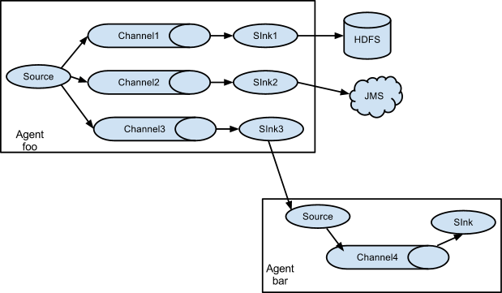

# 19_flume

## 1.Flume简介

1. Flume提供一个分布式的，可靠的，对大数据量的日志进行高效收集、聚集、移动的服务，flume只能在Unix环境下运行
2. Flume基于流式架构，容错性强，也很灵活简单。
3. Flume、kafka用来实时进行数据收集，Spark、Storm用来实时处理数据，impala用来实时查询


## 2.Flume角色

1. source（数据源）

   用于采集数据，Source是产生数据流的地方，同时Source会将产生的数据流阐述到Channel，这个有点类似于Java IO部分的Channel

2. Channel（管道）

   用于桥接Sources和Sinks，类似于一个队列

3. Sink（目的地）

   从Channel收集数据，将数据写到一个目标源（可以是下一个Source，也可以是HDFS或者HBase）

4. Event

   传输单元，Flume数据传输的基本单元，以事件的形式将数据从源头送至目的地

## 3.Flume传输过程

source监控某个文件或数据流，数据源产生新的数据，拿到该数据后，将数据封装在一个Event中，并put到channel后commit提交，channel队列先进先出，sink去channel队列中拉取数据，然后写入到HDFS中

### 4.Flume部署

1. 查询JAVA_HOME

   ```
   echo $JAVA_HOME
   ```

   显示：/opt/module/jdk1.8.0_144  /opt/module/jdk1.8.0_144

2. 安装Flume

   ```
   tar -zxvf apache-flume1.8.0-bin.tar.gz -C /opt/module/
   ```

3. 改名

   ```
   mv flume-env.sh.template flume-env.sh
   ```

4. flume-env.sh涉及修改项

   ```
   export JAVA_HOME=/opt/module/jdk1.8.0_144
   ```

## 5.案例

### 5.1 案例一：监控端口数据

1. 目标：Flume监控一端Console，另一端Console发送消息，使被监控端实时显示

2. 分布实现：

   1. 安装telnet工具

      ```
      yum -y install telnet
      ```

   2. 创建Flume Agent配置文件flume-telnet.conf

      将该文件写入flume根目录下jobconf文件夹，jobconf文件夹自行创建

      ```
      #定义Agent
      a1.sources = r1
      a1.sinks = k1
      a1.channels = c1
      
      #定义source
      a1.sources.r1.type = netcat
      a1.sources.r1.bind = bigdata113
      a1.sources.r1.port = 44445
      
      # 定义sink
      a1.sinks.k1.type = logger
      
      # 定义memory
      a1.channels.c1.type = memory
      a1.channels.c1.capacity = 1000
      a1.channels.c1.transactionCapacity = 100
      
      # 双向链接
      a1.sources.r1.channels = c1
      a1.sinks.k1.channel = c1
      ```

   3. 判断44444端口是否被占用

      ```
      netstat -tunlp | grep 44445
      ```

   4. 启动fume配置文件

      ```
      /opt/module/flume-1.8.0/bin/flume-ng agent /
      --conf /opt/module/flume1.8.0/conf/ /
      --name a1 /
      --conf-file /opt/module/flume-1.8.0/jobconf/flume-telnet.conf /
      -Dflume.root.logger==INFO,console
      ```

   5. 使用telnet工具向本机的44444端口发送内容

      ```
       telnet bigdata111 44445
      ```

### 5.2 案例二：实时读取本地文件到HDFS

1. 创建flume-hdfs.conf文件

   ```
   # Name the components on this agent
   a2.sources = r2
   a2.sinks = k2
   a2.channels = c2
   # Describe/configure the source
   a2.sources.r2.type = exec
   a2.sources.r2.command = tail -F /opt/Andy
   a2.sources.r2.shell = /bin/bash -c
   
   # Describe the sink
   a2.sinks.k2.type = hdfs
   a2.sinks.k2.hdfs.path = hdfs://bigdata111:9000/flume/%Y%m%d/%H
   #上传文件的前缀
   a2.sinks.k2.hdfs.filePrefix = logs-
   #是否按照时间滚动文件夹
   a2.sinks.k2.hdfs.round = true
   #多少时间单位创建一个新的文件夹
   a2.sinks.k2.hdfs.roundValue = 1
   #重新定义时间单位
   a2.sinks.k2.hdfs.roundUnit = hour
   #是否使用本地时间戳
   a2.sinks.k2.hdfs.useLocalTimeStamp = true
   #积攒多少个Event才flush到HDFS一次
   a2.sinks.k2.hdfs.batchSize = 1000
   #设置文件类型，可支持压缩
   a2.sinks.k2.hdfs.fileType = DataStream
   #多久生成一个新的文件
   a2.sinks.k2.hdfs.rollInterval = 600
   #设置每个文件的滚动大小
   a2.sinks.k2.hdfs.rollSize = 134217700
   #文件的滚动与Event数量无关
   a2.sinks.k2.hdfs.rollCount = 0
   #最小副本数
   a2.sinks.k2.hdfs.minBlockReplicas = 1
   
   # Use a channel which buffers events in memory
   a2.channels.c2.type = memory
   a2.channels.c2.capacity = 1000
   a2.channels.c2.transactionCapacity = 100
   
   # Bind the source and sink to the channel
   a2.sources.r2.channels = c2
   a2.sinks.k2.channel = c2
   ```

2. 执行监控配置

   ```java
   /opt/module/flume1.8.0/bin/flume-ng agent /
   --conf /opt/module/flume1.8.0/conf/ /
   --name a2 /
   --conf-file /opt/module/flume1.8.0/jobconf/flume-hdfs.conf
   ```

### 5.3 案例三：实时读取目录文件到HDFS

1. 目标：使用flume监听整个目录的文件

2. 分布实现：

   1. 创建配置文件flume-dir.conf

      ```
      a3.sources = r3
      a3.sinks = k3
      a3.channels = c3
      
      # Describe/configure the source
      a3.sources.r3.type = spooldir
      a3.sources.r3.spoolDir = /opt/module/flume1.8.0/upload
      a3.sources.r3.fileSuffix = .COMPLETED
      a3.sources.r3.fileHeader = true
      #忽略所有以.tmp结尾的文件，不上传
      a3.sources.r3.ignorePattern = ([^ ]*/.tmp)
      
      # Describe the sink
      a3.sinks.k3.type = hdfs
      a3.sinks.k3.hdfs.path = hdfs://bigdata111:9000/flume/%H
      #上传文件的前缀
      a3.sinks.k3.hdfs.filePrefix = upload-
      #是否按照时间滚动文件夹
      a3.sinks.k3.hdfs.round = true
      #多少时间单位创建一个新的文件夹
      a3.sinks.k3.hdfs.roundValue = 1
      #重新定义时间单位
      a3.sinks.k3.hdfs.roundUnit = hour
      #是否使用本地时间戳
      a3.sinks.k3.hdfs.useLocalTimeStamp = true
      #积攒多少个Event才flush到HDFS一次
      a3.sinks.k3.hdfs.batchSize = 100
      #设置文件类型，可支持压缩
      a3.sinks.k3.hdfs.fileType = DataStream
      #多久生成一个新的文件
      a3.sinks.k3.hdfs.rollInterval = 600
      #设置每个文件的滚动大小大概是128M
      a3.sinks.k3.hdfs.rollSize = 134217700
      #文件的滚动与Event数量无关
      a3.sinks.k3.hdfs.rollCount = 0
      #最小副本数
      a3.sinks.k3.hdfs.minBlockReplicas = 1
      
      # Use a channel which buffers events in memory
      a3.channels.c3.type = memory
      a3.channels.c3.capacity = 1000
      a3.channels.c3.transactionCapacity = 100
      
      # Bind the source and sink to the channel
      a3.sources.r3.channels = c3
      a3.sinks.k3.channel = c3
      ```

   2. 执行测试：测试如下脚本后，请向upload文件夹中添加文件试试

      ```
      /opt/module/flume1.8.0/bin/flume-ng agent /
      --conf /opt/module/flume1.8.0/conf/ /
      --name a3 /
      --conf-file /opt/module/flume1.8.0/jobconf/flume-dir.conf
      ```

   3. 提示：在使用Spooling Directory Source时

      1. 不要在监控目录中创建并持续修改文件
      2. 上传完成的文件会以.COMPLETED结尾
      3. 被监控文件夹每500毫秒扫描一次文件变动

### 5.4 案例四：flum与flume之间数据传递：单flume多channel、sink




1. 目标：使用flume1监控文件变动，flume1将变动内容传递给flume2，flume2负责存储到HDFS。同时flume1将变动的内容传递给flume3，flume3负责输出到local

2. 分布实现

   1. 创建flume1.conf，用于监控某文件的变动，同时产生两个channel和两个sink分别输送给lume2和flume3

      ```
      # 1.agent
      a1.sources = r1
      a1.sinks = k1 k2
      a1.channels = c1 c2
      # 将数据流复制给多个channel
      a1.sources.r1.selector.type = replicating
      
      # 2.source
      a1.sources.r1.type = exec
      a1.sources.r1.command = tail -F /opt/Andy
      a1.sources.r1.shell = /bin/bash -c
      
      # 3.sink1
      a1.sinks.k1.type = avro
      a1.sinks.k1.hostname = bigdata111
      a1.sinks.k1.port = 4141
      
      # sink2
      a1.sinks.k2.type = avro
      a1.sinks.k2.hostname = bigdata111
      a1.sinks.k2.port = 4142
      
      # 4.channel—1
      a1.channels.c1.type = memory
      a1.channels.c1.capacity = 1000
      a1.channels.c1.transactionCapacity = 100
      
      # 4.channel—2
      a1.channels.c2.type = memory
      a1.channels.c2.capacity = 1000
      a1.channels.c2.transactionCapacity = 100
      
      # Bind the source and sink to the channel
      a1.sources.r1.channels = c1 c2
      a1.sinks.k1.channel = c1
      a1.sinks.k2.channel = c2
      ```

   2. 创建flume-2.conf，用于接收flume1的event，同时产生1个channel和1个sink，将数据输送给hdfs：

      ```
      # 1 agent
      a2.sources = r1
      a2.sinks = k1
      a2.channels = c1
      
      # 2 source
      a2.sources.r1.type = avro
      a2.sources.r1.bind = bigdata111
      a2.sources.r1.port = 4141
      
      # 3 sink
      a2.sinks.k1.type = hdfs
      a2.sinks.k1.hdfs.path = hdfs://bigdata111:9000/flume2/%H
      #上传文件的前缀
      a2.sinks.k1.hdfs.filePrefix = flume2-
      #是否按照时间滚动文件夹
      a2.sinks.k1.hdfs.round = true
      #多少时间单位创建一个新的文件夹
      a2.sinks.k1.hdfs.roundValue = 1
      #重新定义时间单位
      a2.sinks.k1.hdfs.roundUnit = hour
      #是否使用本地时间戳
      a2.sinks.k1.hdfs.useLocalTimeStamp = true
      #积攒多少个Event才flush到HDFS一次
      a2.sinks.k1.hdfs.batchSize = 100
      #设置文件类型，可支持压缩
      a2.sinks.k1.hdfs.fileType = DataStream
      #多久生成一个新的文件
      a2.sinks.k1.hdfs.rollInterval = 600
      #设置每个文件的滚动大小大概是128M
      a2.sinks.k1.hdfs.rollSize = 134217700
      #文件的滚动与Event数量无关
      a2.sinks.k1.hdfs.rollCount = 0
      #最小副本数
      a2.sinks.k1.hdfs.minBlockReplicas = 1
      
      
      # 4 channel
      a2.channels.c1.type = memory
      a2.channels.c1.capacity = 1000
      a2.channels.c1.transactionCapacity = 100
      
      #5 Bind 
      a2.sources.r1.channels = c1
      a2.sinks.k1.channel = c1
      ```

   3. 创建flume-3.conf，用于接收flume1的event，同时产生1个channel和1个sink，将数据输送给本地目录：

      ```
      #1 agent
      a3.sources = r1
      a3.sinks = k1
      a3.channels = c1
      
      # 2 source
      a3.sources.r1.type = avro
      a3.sources.r1.bind = bigdata111
      a3.sources.r1.port = 4142
      
      #3 sink
      a3.sinks.k1.type = file_roll
      #备注：此处的文件夹需要先创建好
      a3.sinks.k1.sink.directory = /opt/flume3
      
      # 4 channel
      a3.channels.c1.type = memory
      a3.channels.c1.capacity = 1000
      a3.channels.c1.transactionCapacity = 100
      
      # 5 Bind
      a3.sources.r1.channels = c1
      a3.sinks.k1.channel = c1
      ```

   4. 提示：输出的本地目录必须是已经存在的目录，如果该目录不存在，并不会创建新的目录。

   5. 执行测试：分别开启对应flume-job（依次启动flume2，flume3，flume1），同时产生文件变动并观察结果：

      ```
      $ bin/flume-ng agent --conf conf/ --name a1 --conf-file jobconf/flume2.conf
      
      $ bin/flume-ng agent --conf conf/ --name a2 --conf-file jobconf/flume3.conf
      
      $ bin/flume-ng agent --conf conf/ --name a3 --conf-file jobconf/flume1.conf
      ```

### 5.5 案例五：Flume与Flume之间数据传递，多Flume汇总数据到单Flume


1. 目标：flume11监控文件hive.log，flume-22监控某一个端口的数据流，flume11与flume-22将数据发送给flume-33，flume33将最终数据写入到HDFS。

2. 分布实现：

   1. 创建flume11.conf，用于监控hive.log文件，同时sink数据到flume-33：

      ```
      # 1 agent
      a1.sources = r1
      a1.sinks = k1
      a1.channels = c1
      
      # 2 source
      a1.sources.r1.type = exec
      a1.sources.r1.command = tail -F /opt/Andy
      a1.sources.r1.shell = /bin/bash -c
      
      # 3 sink
      a1.sinks.k1.type = avro
      a1.sinks.k1.hostname = bigdata111
      a1.sinks.k1.port = 4141
      
      # 4 channel
      a1.channels.c1.type = memory
      a1.channels.c1.capacity = 1000
      a1.channels.c1.transactionCapacity = 100
      
      # 5. Bind
      a1.sources.r1.channels = c1
      a1.sinks.k1.channel = c1
      ```
      
   2. 创建flume-22.conf，用于监控端口44444数据流，同时sink数据到flume-33：
   
      ```
      # 1 agent
      a2.sources = r1
      a2.sinks = k1
      a2.channels = c1
      
      # 2 source
      a2.sources.r1.type = netcat
      a2.sources.r1.bind = bigdata111
      a2.sources.r1.port = 44444
      
      #3 sink
      a2.sinks.k1.type = avro
      a2.sinks.k1.hostname = bigdata111
      a2.sinks.k1.port = 4141
      
      # 4 channel
      a2.channels.c1.type = memory
      a2.channels.c1.capacity = 1000
      a2.channels.c1.transactionCapacity = 100
      
      # 5 Bind
      a2.sources.r1.channels = c1
      a2.sinks.k1.channel = c1
      ```
   
   3. 创建flume33.conf，用于接收flume11与flume22发送过来的数据流，最终合并后sink到HDFS：
   
      ```
      # 1 agent
      a3.sources = r1
      a3.sinks = k1
      a3.channels = c1
      
      # 2 source
      a3.sources.r1.type = avro
      a3.sources.r1.bind = bigdata111
      a3.sources.r1.port = 4141
      
      # 3 sink
      a3.sinks.k1.type = hdfs
      a3.sinks.k1.hdfs.path = hdfs://bigdata111:9000/flume3/%H
      #上传文件的前缀
      a3.sinks.k1.hdfs.filePrefix = flume3-
      #是否按照时间滚动文件夹
      a3.sinks.k1.hdfs.round = true
      #多少时间单位创建一个新的文件夹
      a3.sinks.k1.hdfs.roundValue = 1
      #重新定义时间单位
      a3.sinks.k1.hdfs.roundUnit = hour
      #是否使用本地时间戳
      a3.sinks.k1.hdfs.useLocalTimeStamp = true
      #积攒多少个Event才flush到HDFS一次
      a3.sinks.k1.hdfs.batchSize = 100
      #设置文件类型，可支持压缩
      a3.sinks.k1.hdfs.fileType = DataStream
      #多久生成一个新的文件
      a3.sinks.k1.hdfs.rollInterval = 600
      #设置每个文件的滚动大小大概是128M
      a3.sinks.k1.hdfs.rollSize = 134217700
      #文件的滚动与Event数量无关
      a3.sinks.k1.hdfs.rollCount = 0
      #最小冗余数
      a3.sinks.k1.hdfs.minBlockReplicas = 1
      
      # 4 channel
      a3.channels.c1.type = memory
      a3.channels.c1.capacity = 1000
      a3.channels.c1.transactionCapacity = 100
      
      # 5 Bind
      a3.sources.r1.channels = c1
      a3.sinks.k1.channel = c1
      ```
   
   4. 执行测试：分别开启对应flume-job（依次启动flume-33，flume-22，flume11），同时产生文件变动并观察结果：
   
      ```
      $ bin/flume-ng agent --conf conf/ --name a3 --conf-file jobconf/flume33.conf
      $ bin/flume-ng agent --conf conf/ --name a2 --conf-file jobconf/flume22.conf
      $ bin/flume-ng agent --conf conf/ --name a1 --conf-file jobconf/flume11.conf
      ```
   
   5. 数据发送
   
      - telnet bigdata111 44444   打开后发送5555555
      - 在/opt/Andy 中追加666666

## 6.Flume拦截器

### 6.1 时间戳拦截器

Timestamp.conf

```
#1.定义agent名， source、channel、sink的名称
a4.sources = r1
a4.channels = c1
a4.sinks = k1

#2.具体定义source
a4.sources.r1.type = spooldir
a4.sources.r1.spoolDir = /opt/module/flume-1.8.0/upload

#定义拦截器，为文件最后添加时间戳
a4.sources.r1.interceptors = i1
a4.sources.r1.interceptors.i1.type = org.apache.flume.interceptor.TimestampInterceptor$Builder

#具体定义channel
a4.channels.c1.type = memory
a4.channels.c1.capacity = 10000
a4.channels.c1.transactionCapacity = 100


#具体定义sink
a4.sinks.k1.type = hdfs
a4.sinks.k1.hdfs.path = hdfs://bigdata111:9000/flume-interceptors/%H
a4.sinks.k1.hdfs.filePrefix = events-
a4.sinks.k1.hdfs.fileType = DataStream

#不按照条数生成文件
a4.sinks.k1.hdfs.rollCount = 0
#HDFS上的文件达到128M时生成一个文件
a4.sinks.k1.hdfs.rollSize = 134217728
#HDFS上的文件达到60秒生成一个文件
a4.sinks.k1.hdfs.rollInterval = 60

#组装source、channel、sink
a4.sources.r1.channels = c1
a4.sinks.k1.channel = c1
```

启动命令

```
/opt/module/flume-1.8.0/bin/flume-ng agent -n a4 /
-f /opt/module/flume-1.8.0/jobconf/flume-interceptors.conf /
-c /opt/module/flume-1.8.0/conf /
-Dflume.root.logger=INFO,console
```

### 6.2 主机名拦截器

Host.conf

```
#1.定义agent
a1.sources= r1
a1.sinks = k1
a1.channels = c1

#2.定义source
a1.sources.r1.type = exec
a1.sources.r1.channels = c1
a1.sources.r1.command = tail -F /opt/Andy
a1.sources.r1.interceptors = i1
a1.sources.r1.interceptors.i1.type = host

#参数为true时用IP192.168.1.111，参数为false时用主机名，默认为true
a1.sources.r1.interceptors.i1.useIP = false
a1.sources.r1.interceptors.i1.hostHeader = agentHost

 #3.定义sinks
a1.sinks.k1.type=hdfs
a1.sinks.k1.channel = c1
a1.sinks.k1.hdfs.path = hdfs://bigdata111:9000/flumehost/%H
a1.sinks.k1.hdfs.filePrefix = Andy_%{agentHost}
#往生成的文件加后缀名.log
a1.sinks.k1.hdfs.fileSuffix = .log
a1.sinks.k1.hdfs.fileType = DataStream
a1.sinks.k1.hdfs.writeFormat = Text
a1.sinks.k1.hdfs.rollInterval = 10
a1.sinks.k1.hdfs.useLocalTimeStamp = true
 
a1.channels.c1.type = memory
a1.channels.c1.capacity = 1000
a1.channels.c1.transactionCapacity = 100
 
a1.sources.r1.channels = c1
a1.sinks.k1.channel = c1
```

启动命令：

```
bin/flume-ng agent -c conf/ -f jobconf/host.conf -n a1 -Dflume.root.logger=INFO,console
```

### 6.3UUID拦截器

uuid.conf

```
a1.sources = r1
a1.sinks = k1
a1.channels = c1

a1.sources.r1.type = exec
a1.sources.r1.channels = c1
a1.sources.r1.command = tail -F /opt/Andy
a1.sources.r1.interceptors = i1
#type的参数不能写成uuid，得写具体，否则找不到类
a1.sources.r1.interceptors.i1.type = org.apache.flume.sink.solr.morphline.UUIDInterceptor$Builder
#如果UUID头已经存在,它应该保存
a1.sources.r1.interceptors.i1.preserveExisting = true
a1.sources.r1.interceptors.i1.prefix = UUID_

a1.sinks.k1.type = logger

a1.channels.c1.type = memory
a1.channels.c1.capacity = 1000
a1.channels.c1.transactionCapacity = 100

a1.sources.r1.channels = c1
a1.sinks.k1.channel = c1

```

启动命令

```
# bin/flume-ng agent -c conf/ -f jobconf/uuid.conf -n a1 -Dflume.root.logger==INFO,console
```

### 6.4 查询替换拦截器

search.conf

```
#1 agent
a1.sources = r1
a1.sinks = k1
a1.channels = c1
#2 source
a1.sources.r1.type = exec
a1.sources.r1.channels = c1
a1.sources.r1.command = tail -F /opt/Andy
a1.sources.r1.interceptors = i1
a1.sources.r1.interceptors.i1.type = search_replace

#遇到数字改成itstar，A123会替换为Aitstar
a1.sources.r1.interceptors.i1.searchPattern = [0-9]+
a1.sources.r1.interceptors.i1.replaceString = itstar
a1.sources.r1.interceptors.i1.charset = UTF-8

#3 sink
a1.sinks.k1.type = logger

#4 Chanel
a1.channels.c1.type = memory
a1.channels.c1.capacity = 1000
a1.channels.c1.transactionCapacity = 100

#5 bind
a1.sources.r1.channels = c1
a1.sinks.k1.channel = c1
```

启动命令

```
# bin/flume-ng agent -c conf/ -f jobconf/search.conf -n a1 -Dflume.root.logger=INFO,console
```

### 6.5 正则过滤拦截器

filter.conf

```
#1 agent
a1.sources = r1
a1.sinks = k1
a1.channels = c1

#2 source
a1.sources.r1.type = exec
a1.sources.r1.channels = c1
a1.sources.r1.command = tail -F /opt/Andy
a1.sources.r1.interceptors = i1
a1.sources.r1.interceptors.i1.type = regex_filter
a1.sources.r1.interceptors.i1.regex = ^A.*
#如果excludeEvents设为false,表示过滤掉不是以A开头的events。如果excludeEvents设为true，则表示过滤掉以A开头的events。
a1.sources.r1.interceptors.i1.excludeEvents = true

a1.sinks.k1.type = logger

a1.channels.c1.type = memory
a1.channels.c1.capacity = 1000
a1.channels.c1.transactionCapacity = 100

a1.sources.r1.channels = c1
a1.sinks.k1.channel = c1

```


```
# bin/flume-ng agent -c conf/ -f jobconf/filter.conf -n a1 -Dflume.root.logger=INFO,console
```

### 6.6 正则抽取拦截器

extractor.conf

```
#1 agent
a1.sources = r1
a1.sinks = k1
a1.channels = c1

#2 source
a1.sources.r1.type = exec
a1.sources.r1.channels = c1
a1.sources.r1.command = tail -F /opt/Andy
a1.sources.r1.interceptors = i1
a1.sources.r1.interceptors.i1.type = regex_extractor
a1.sources.r1.interceptors.i1.regex = hostname is (.*?) ip is (.*)
a1.sources.r1.interceptors.i1.serializers = s1 s2
a1.sources.r1.interceptors.i1.serializers.s1.name = cookieid
a1.sources.r1.interceptors.i1.serializers.s2.name = ip

a1.sinks.k1.type = logger

a1.channels.c1.type = memory
a1.channels.c1.capacity = 1000
a1.channels.c1.transactionCapacity = 100

a1.sources.r1.channels = c1
a1.sinks.k1.channel = c1

```

注：正则抽取拦截器的headers不会出现在文件名和文件内容中

启动命令

```
# bin/flume-ng agent -c conf/ -f jobconf/extractor.conf -n a1 -Dflume.root.logger=INFO,console
```


## 7.Flume自定义拦截器

字母小写变大写

1. pom.xml

   ```xml
       <dependencies>
           <!-- flume核心依赖 -->
           <dependency>
               <groupId>org.apache.flume</groupId>
               <artifactId>flume-ng-core</artifactId>
               <version>1.8.0</version>
           </dependency>
       </dependencies>
       <build>
           <plugins>
               <!-- 打包插件 -->
               <plugin>
                   <groupId>org.apache.maven.plugins</groupId>
                   <artifactId>maven-jar-plugin</artifactId>
                   <version>2.4</version>
                   <configuration>
                       <archive>
                           <manifest>
                               <addClasspath>true</addClasspath>
                               <classpathPrefix>lib/</classpathPrefix>
                               <mainClass></mainClass>
                           </manifest>
                       </archive>
                   </configuration>
               </plugin>
               <!-- 编译插件 -->
               <plugin>
                   <groupId>org.apache.maven.plugins</groupId>
                   <artifactId>maven-compiler-plugin</artifactId>
                   <configuration>
                       <source>1.8</source>
                       <target>1.8</target>
                       <encoding>utf-8</encoding>
                   </configuration>
               </plugin>
           </plugins>
       </build>
   ```

2. 自定义实现拦截器

   ```java
   import org.apache.flume.Context;
   import org.apache.flume.Event;
   import org.apache.flume.interceptor.Interceptor;
    
   import java.util.ArrayList;
   import java.util.List;
    
   public class MyInterceptor implements Interceptor {
       @Override
       public void initialize() {
       }
    
       @Override
       public void close() {
       }
    
       /**
        * 拦截source发送到通道channel中的消息
        *
        * @param event 接收过滤的event
        * @return event    根据业务处理后的event
        */
       @Override
       public Event intercept(Event event) {
           // 获取事件对象中的字节数据
           byte[] arr = event.getBody();
           // 将获取的数据转换成大写
           event.setBody(new String(arr).toUpperCase().getBytes());
           // 返回到消息中
           return event;
       }
       // 接收被过滤事件集合
       @Override
       public List<Event> intercept(List<Event> events) {
           List<Event> list = new ArrayList<>();
           for (Event event : events) {
               list.add(intercept(event));
           }
           return list;
       }
    
       public static class Builder implements Interceptor.Builder {
           // 获取配置文件的属性
           @Override
           public Interceptor build() {
               return new MyInterceptor();
           }
    
           @Override
           public void configure(Context context) {
    
           }
       }
   ```

   使用Maven做成Jar包，在flume的目录下mkdir jar，上传此jar到jar目录中

3. Flume配置文件

   ToUpCase.conf

   ```
   #1.agent 
   a1.sources = r1
   a1.sinks =k1
   a1.channels = c1
    
    
   # Describe/configure the source
   a1.sources.r1.type = exec
   a1.sources.r1.command = tail -F /opt/Andy
   a1.sources.r1.interceptors = i1
   #全类名$Builder
   a1.sources.r1.interceptors.i1.type = ToUpCase.MyInterceptor$Builder
    
   # Describe the sink
   a1.sinks.k1.type = hdfs
   a1.sinks.k1.hdfs.path = /ToUpCase1
   a1.sinks.k1.hdfs.filePrefix = events-
   a1.sinks.k1.hdfs.round = true
   a1.sinks.k1.hdfs.roundValue = 10
   a1.sinks.k1.hdfs.roundUnit = minute
   a1.sinks.k1.hdfs.rollInterval = 3
   a1.sinks.k1.hdfs.rollSize = 20
   a1.sinks.k1.hdfs.rollCount = 5
   a1.sinks.k1.hdfs.batchSize = 1
   a1.sinks.k1.hdfs.useLocalTimeStamp = true
   #生成的文件类型，默认是 Sequencefile，可用 DataStream，则为普通文本
   a1.sinks.k1.hdfs.fileType = DataStream
    
   # Use a channel which buffers events in memory
   a1.channels.c1.type = memory
   a1.channels.c1.capacity = 1000
   a1.channels.c1.transactionCapacity = 100
    
   # Bind the source and sink to the channel
   a1.sources.r1.channels = c1
   a1.sinks.k1.channel = c1
   ```

4. 运行命令：

   ```
   bin/flume-ng agent -c conf/ -n a1 -f jar/ToUpCase.conf -C jar/Flume_Andy-1.0-SNAPSHOT.jar -Dflume.root.logger=DEBUG,console
   ```

