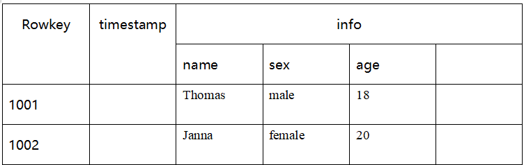

# 24_Hbase底层原理及JAVA代码开发

# 1.Hbase概念

## 1.1 Hbase简介

1. Hbase是bigtable的开源java版本。是**建立在HDFS**之上，提供高可靠性、高性能、列存储、可伸缩、实时读写nosql的**数据库系统**
2. 它介于nosql和RDRMS之间，仅能通过主键（row key）和主键的range来检索数据，仅支持单行事务（可通过hive支持来实现多表join等复杂操作）
3. 主要用来存储结构化和半结构化的松散数据。
4. Hbase查询数据功能很简单，不支持join等复杂操作，不支持复杂的食务（行级的事务）
5. Hbase中**支持的数据类型：byte[]**
6. 与hadoop一样，Hbase目标主要依靠**横向扩展**，通过不断增加廉价的商用服务器，来增加计算和存储能力。
7. Hbase是一个分布式的、**面向列**的开源数据库，它是一个适合非**结构化数据存储的数据库。**另一个不同的是Hbase基于列而不是基于行的模式

**Hbase中的表一般由以下特点：**

- 大：上亿行、百万列
- 面向列：面向列（簇）的存储和权限控制，列（簇）独立检索
- 稀疏：对于为空（null）的列，并不占用存储空间，因此，表的设计非常稀疏


## 1.2 HBase和Hadoop的关系

1. HDFS
   - 为分布式存储提供文件系统
   - 针对存储大尺寸的文件进行优化，不需要对HDFS上的文件进行随机读写
   - 直接使用文件
   - 数据模型不灵活
   - 使用文件系统和处理框架
   - 优化一次写入，多次读取的方式
2. HBase
   - 提供表状的面向列的数据存储
   - 针对表状数据的随机读写进行优化
   - 使用key-value操作数据
   - 提供灵活的数据模型
   - 使用表状存储，支持MapReduce，依赖HDFS
   - 优化了多次读，以及多次写

## 1.3 RDBMS与Hbase的对比

1. 关系型数据库
   - 结构
     - 数据库以表的形式存在
     - 支持FAT、MTFS、EXT文件系统
     - 使用Commit log存储日志
     - 参考系统是坐标系统
     - 使用主键（PK）
     - 支持分区
     - 使用行、列、单元格
   - 功能
     - 支持向上扩展
     - 使用SQL查询
     - 面向行，即没一行都是一个连续单元
     - 数据总量依赖于服务器配置
     - 具有ACID支持
     - 适合结构化数据
     - 传统关系型数据库一般都是中心化的
     - 支持事务
     - 支持join
2. HBase
   - 结构
     - 数据库以region的形式存在
     - 支持HDFS文件系统
     - 使用WAL（Write-Ahead Logs）存储日志
     - 参考系统是Zookeeper
     - 使用行键（row key）
     - 支持分片
     - 使用行、列簇、列和单元格
   - 功能
     - 支持向外扩展
     - 使用API和MapReduce来访问HBase表数据
     - 面向列，即每一列都是一个连续的单元
     - 数据总量不依赖具体的某台机器，而是取决于机器的数量
     - Hbase不支持ACID（Atomicity、Consistency、Isolation、Durability）原子性，一致性，隔离性，耐久性
     - 适合结构化数据和非结构化数据
     - 一般都是分布式的
     - HBase不支持事务，支持的是单行数据的事物操作
     - 不支持join

## 1.4 HBase特征简要

1. 海量存储

   Hbase适合存储PB级别的海量数据，在PB级别的数据以及采用廉价PC存储的情况下，能在几十到百毫秒内返回数据。这与Hbase的极易扩展性息息相关。正式因为Hbase良好的扩展性，才为海量数据的存储提供了便利

2. 列式存储 

   这里的列式存储其实说是列簇存储，HBase是根据列簇来存储数据的。列簇下面可以有非常多的列，列簇在创建表的时候就必须指定

3. 极易扩展

   HBase的扩展性主要体现在两个方面，一个是基于上层处理能力（RegionServer）的扩展，一个是基于存储的扩展（HDFS）。

   通过横向添加RegionServer的机器，进行水平扩展，提升HBase的上层处理能力，提升Hbase服务更多Region的能力

   > 注：RegionServer的作用是管理region、承接业务的访问，这个后面会详细的介绍通过横向添加Datanode的机器，进行存储层扩容，提升Hbase的数据存储能力和提升后端存储的读写能力

4. 高并发

   由于目前大部分使用Hbase的架构，都是采用的廉价的pc，因此单个IO的延迟其实并不小，一般在几十到上百毫秒之间。这里说的高并发，主要是在并发的情况下，hbase的单个IO延迟下降并不多。能获得高并发、低延迟的服务

5. 稀疏

   稀疏主要针对Hbase列的灵活性，在列簇中，你可以指定任意多的列，在列数据为空的情况下，是不会占用存储空间的 

   

   

## 1.2 Hbase的角色

### 1.2.1 HMaster

功能：

1. 监控RegionServer
2. 处理RegionServer故障转移
3. 处理元数据的变更
4. 处理region的分配或移除
5. 在空闲时间进行数据的负载均衡
6. 通过zookeeper发布自己的位置给客户端

### 1.2.2 HRegionServer

功能：

1. 负责存储HBase的实际数据
2. 处理分配给它的Region
3. 刷新缓存到HDFS
4. 维护HLog
5. 执行压缩
6. 负责处理Region分片

组件

1. write-ahead logs

   Hbase的修改记录，当对Hbase读写数据的时候，数据不是直接写进磁盘，它会在内存中保留一段时间（时间以及数据量阈值可以设定）。但把数据保存在内存中可能有更高的概率引起数据丢失，为了解决这个问题，数据会先写在一个叫做write-ahead logfile的文件中，然后在写入内存。所以在系统出现故障的时候，数据可以通过这个日志文件重建

2. HFile

   这是磁盘上保存原始数据的实际的物理文件，是实际的存储文件

3. Store

   Hfile存储在Store中，一个Store对应Hbase表中的一个列簇

4. MemStore

   顾名思义，就是内存存储，位于内存中，用来保存当前的数据操作，所以数据保存在WAL中之后，RegsionServer会在内存中存储键值对

5. Region

   Hbase表的分片，Hbase表会根据RowKey值被切分成不同的region存储在RegionServer中，在一个RegionServer中可以有多个不同的region

## 1.3 Hbase的架构

一个RegionServer可以包含多个HRegion，每个RegionServer维护一个HLog，和多个HFiles以及相对应的MemStore。RegionServer运行于DataNode上，数量可以与DataNode数量一致


1. client

   包含访问hbase的接口，client维护着一些cache来加快对hbase的访问，比如regione的位置信息

2. Zookeeper

   - 保证任何时候，集群中只有一个Master
   - 存储所有Region的寻址入口
   - 实时监控Region Server的状态，将Region Server的上线和下线信息实时通知给Master
   - 存储Hbase的schema，包括有哪些table，每个table有哪些column family

3. Master职责

   - 为Region Server分配region
   - 负责region server的负载均衡
   - 发现失效的region server并重新分配其上的region
   - HDFS上的垃圾文件回收
   - 处理schema更新请求

4. Region server职责

   - region server维护master分配给他的region，处理这些region的IO请求
   - Region server负责切分在运行过程中变的过大的region

   可以看到，**client访问hbase上数据的过程并不需要master参与**（寻址访问zookeeper和region server，数据读写访问region server），master仅仅维护着table和region的元数据信息，负载很低

## 1.4 Hbase 数据模型


确定一个单元格的位置（cell），需要如下四个：

rowkey + Colume Family + Colume + timestamp(版本version)，数据有版本的概念，即一个单元格可能有多个值，但是只有最新得一个对外显示。

- Hbase中有两张特殊的表Table，-ROOT-和.META.
- .META.：记录了用户表的Region信息，**.META.**可以有多个region
- -ROOT-：记录了.META.表的Region信息，**-ROOT-只有一个region**
- Zookeeper中记录了-ROOT-表的location
- Client访问用户数据之前需要首先访问zookeeper，然后访问-ROOT-，接着访问.META.，最后才能找到用户数据的位置去访问，中间需要多次网络操作，不过client端会做cache缓存，**注：在0.96版本后，Hbase移除了-ROOT-表**


- Row Key：

  行键，table的主键，table中的记录**默认按照Row Key升序排序**。访问hbase table中的行，只有三种方式：

  1. 通过单个row key访问
  2. 通过row key的range
  3. 全表扫描

  **Row key行键** (Row key)可以是任意字符串(**最大长度是 64KB**，实际应用中长度一般为 10-100bytes)，在hbase内部，row key保存为字节数组。

- Cell

  由`{row key, column( =<family> + <label>), version} `唯一确定的单元。

  cell中的数据是没有类型的，全部是字节码形式存贮。

- Timestamp（时间戳）：

  时间戳，每次数据操作对应的时间戳，可以看做是数据的version number。

  HBase中通过row和columns确定的为一个存贮单元称为cell。每个 cell都保存着同一份数据的多个版本。版本通过时间戳来索引。**时间戳可以由hbase(在数据写入时自动 )赋值，每个 cell中，不同版本的数据按照时间倒序排序，即最新的数据排在最前面。**

  > 为了避免数据存在过多版本造成的的管理 (包括存贮和索引)负担，hbase提供了两种数据版本回收方式：
  >
  > 1. 保存数据的最后n个版本
  > 2. 保存最近一段时间内的版本（设置数据的生命周期TTL）。
  >
  > 用户可以针对每个列族进行设置。

- column family（列簇）：

  hbase表中的每个列，都归属与某个列族。列族是表的schema的一部分(而列不是)，必须在使用表之前定义。列名都以列族作为前缀。例如courses:history ， courses:math 都属于 courses 这个列族。column family支持动态扩展，无需预先定义column的数据以及类型，所有column均以二进制格式存储，用户需要自行进行类型转换

  > 访问控制、磁盘和内存的使用统计都是在列族层面进行的。
  >
  > 列族越多，在取一行数据时所要参与IO、搜寻的文件就越多，所以，如果没有必要，不要设置太多的列族

- column 列

  列族下面的具体列，属于某一个ColumnFamily,类似于我们mysql当中创建的具体的列

  列是插入数据的时候动态指定的

- table & region：

  当table随着记录数不断增加而变大后，会逐渐分类成多个splits，成为一个regions，一个region由【startkey，endkey】表示，不同的region会被Master分配给相应的RegionServer进行管理

- VersionNum
  数据的版本号，每条数据可以有多个版本号，默认值为系统时间戳，类型为Long

## 1.5 Hbase文件类型

HBase中的所有数据文件都存储在Hadoop HDFS文件系统上，主要包括上述提出的两种文件类型：

1. HFile， HBase中KeyValue数据的存储格式，HFile是Hadoop的二进制格式文件，实际上StoreFile就是对HFile做了轻量级包装，即StoreFile底层就是HFile
2. HLog File，HBase中WAL（Write Ahead Log） 的存储格式，物理上是Hadoop的Sequence File

## 1.6 HBase 三个重要机制

1. flush机制

   - （hbase.regionserver.global.memstore.size）默认;堆大小的40%

     regionServer的全局memstore的大小，超过该大小会触发flush到磁盘的操作,默认是堆大小的40%,而且regionserver级别的flush会阻塞客户端读写

   - （hbase.hregion.memstore.flush.size）默认：128M

     单个region里memstore的缓存大小，超过那么整个HRegion就会flush, 

   - （hbase.regionserver.optionalcacheflushinterval）默认：1h

     内存中的文件在自动刷新之前能够存活的最长时间

   - hbase.regionserver.global.memstore.size.lower.limit）默认：堆大小 * 0.4 * 0.95

     有时候集群的“写负载”非常高，写入量一直超过flush的量，这时，我们就希望memstore不要超过一定的安全设置。在这种情况下，写操作就要被阻塞一直到memstore恢复到一个“可管理”的大小, 这个大小就是默认值是堆大小 * 0.4 * 0.95，也就是当regionserver级别的flush操作发送后,会阻塞客户端写,一直阻塞到整个regionserver级别的memstore的大小为 堆大小 * 0.4 *0.95为止

   - （hbase.hregion.preclose.flush.size）默认为：5M

     当一个 region 中的 memstore 的大小大于这个值的时候，我们又触发 了 close.会先运行“pre-flush”操作，清理这个需要关闭的memstore，然后 将这个 region 下线。当一个 region 下线了，我们无法再进行任何写操作。 如果一个 memstore 很大的时候，flush  操作会消耗很多时间。"pre-flush" 操作意味着在 region 下线之前，会先把 memstore 清空。这样在最终执行 close 操作的时候，flush 操作会很快。

   - （hbase.hstore.compactionThreshold）默认：超过3个

     一个store里面允许存的hfile的个数，超过这个个数会被写到新的一个hfile里面 也即是每个region的每个列族对应的memstore在fulsh为hfile的时候，默认情况下当超过3个hfile的时候就会 对这些文件进行合并重写为一个新文件，设置个数越大可以减少触发合并的时间，但是每次合并的时间就会越长

2. compact机制

   把小的storeFile文件合并成大的Storefile文件。

   清理过期的数据，包括删除的数据

   将数据的版本号保存为3个

3. split机制

   当Region达到阈值，会把过大的Region一分为二。

   默认一个HFile达到10Gb的时候就会进行切分

# 2. Hbase部署

**注：部署HBase需要确保zookeeper和hadoop正常使用**

1. 解压Hbase到指定目录

   ```
   tar -zxf /opt/software/hbase-2.0.0-bin.tar.gz -C /opt/module/
   ```

2. 在conf目录下，修改配置文件

   - hbase-env.sh

     ```
     export JAVA_HOME=/opt/module/jdk1.8.0_121
     export HBASE_MANAGES_ZK=false
     ```

   - hbase-site.xml

     添加如下内容

     ```xml
     <property>  
     		<name>hbase.rootdir</name>  
     		<value>hdfs://centos-one:9000/hbase</value>  
     	</property>
     
     
     	<property>
     		<name>hbase.cluster.distributed</name>
     		<value>true</value>
     	</property>
     
     
     	<property>
     		<name>hbase.master.port</name>
     		<value>16000</value>
     	</property>
     
     
     	<property>  
     		<name>hbase.zookeeper.quorum</name>
     		<value>bigdata111:2181,bigdata222:2181,bigdata3331:2181</value>
     	</property>
     
     
     	<property>  
     		<name>hbase.zookeeper.property.dataDir</name>
     	 <value>/opt/module/zookeeper-3.4.10/zkData</value>
     	</property>
     
     <property>
     <name>hbase.master.maxclockskew</name>
     <value>180000</value>
     </property>
     ```

   - regionservers文件添加如下内容

     ```
     bigdata111
     bigdata222
     bigdata333
     ```

   - 创建back-masters配置文件，实现HMaster的高可用

     ```
     cd /opt/module/hbase-2.0.0/conf
     vim backup-masters
     
     bigdata222
     ```

3. 安装包分发到其他机器

   ```
   scp -r /opt/module/hbase-2.0.0 root@bigdata222:/opt/module
   scp -r /opt/module/hbase-2.0.0 root@bigdata333:/opt/module
   ```

4. 三台机器创建软连接

   因为hbase需要读取hadoop的core-site.xml以及hdfs-site.xml当中的配置文件信息，所以我们三台机器都要执行以下命令创建软连接

   ```
   ln -s /opt/module/hadoop-2.8.4/etc/hadoop/core-site.xml /opt/module/hbase-2.0.0/conf/core-site.xml
   
   ln -s /opt/module/hadoop-2.8.4/etc/hadoop/hdfs-site.xml /opt/module/hbase-2.0.0/conf/hdfs-site.xml
   ```

5. 三台机器添加HBASE_HOME的环境变量

   ```
   #hbase
   export HBASE_HOME=/opt/module/hbase-2.0.0
   export PATH=$HBASE_HOME/bin:$PATH
   ```

6. Hbase启动

   1. 集群启动

      ```
      start-hbase.sh
      ```

   2. 单节点启动

      启动HMaster命令

      ```
      bin/hbase-daemon.sh start master
      ```

      启动HRegionServer命令

      ```
      bin/hbase-daemon.sh start regionserver
      ```

7. 页面访问

   http://bigdata111:16010/master-status

# 3.Hbase常用shell操作

## 3.1 基础操作

1. 进入HBase客户端命令操作界面

   ```
   hbase shell
   ```

2. 查看帮助命令

   ```
   help
   ```

3. 查看当前数据库中有哪些表

   ```
   list
   ```

4. 创建一张表

   创建user表，包含info和data两个列簇

   ```
   create 'user', 'info', 'data'
   ```

   或者

   ```
   create 'user', {NAME => 'info', VERSIONS => '3'}，{NAME => 'data'}
   ```

5. 添加数据操作

   ```
   hbase(main) > put 'student','1001','info:name','Thomas'
   hbase(main) > put 'student','1001','info:sex','male'
   hbase(main) > put 'student','1001','info:age','18'
   hbase(main) > put 'student','1002','info:name','Janna'
   hbase(main) > put 'student','1002','info:sex','female'
   hbase(main) > put 'student','1002','info:age','20'
   ```

   数据插入后的数据模型

   

## 3.2 查询数据

   1. 通过rowkey进行查询

      获取user表中rowkey为1001的所有信息

      ```
      get 'user','1001'
      ```

   2. 查看rowkey下面的某个列簇的信息

      获取表user中rowkey为1001，info列簇的所有信息

      ```
      get 'user', '1001', 'info'
      ```

   3. 查看rowkey指定列簇指定字段的值

      获取user表中row key为1001，info列族的name、age列标示符的信息

      ```
      get 'user','1001','info:name','info:age'
      ```

   4. 查看rowkey指定多个列簇的信息

      获取user表中rowkey为1001，info，data列簇的信息

      ```
      get 'user','1001','info','data'
      ```

      或者

      ```
      get 'user', '1001', {COLUMN => ['info', 'data']}
      ```

      或者

      ```
      get 'user', '1001', {COLUMN => ['info:name', 'data:pic']}
      ```

   5. 指定rowkey与列值查询

      获取user表中rowkey为1001，cell的值为Thomas的信息

      ```
      get 'user', '1001', {FILTER => "ValueFilter(=, 'binary:Thomas')"}
      ```

   6. 指定rowkey与列值模糊查询

      获取user表中row key为1001，列标示符中含有a的信息

      ```
      get 'user', '1001', {FILTER => "(QualifierFilter(=,'substring:a'))"}
      ```

   7. 查询所有数据

      查询user表中的所有信息

      ```
      scan 'user'
      ```

   8. 列簇查询

      查询user表中列族为info的信息

      ```
      scan 'user', {COLUMNS => 'info'}
      
      scan 'user', {COLUMNS => 'info', RAW => true, VERSIONS => 5}
      
      scan 'user', {COLUMNS => 'info', RAW => true, VERSIONS => 3}
      ```

   9. 多列族查询

      查询user表中列族为info和data的信息

      ```
      scan 'user', {COLUMNS => ['info', 'data']}
      scan 'user', {COLUMNS => ['info:name', 'data:pic']}
      ```
      
   10. 指定列族与列名以及限定版本查询

       查询user表中列族为info、列标示符为name的信息,并且版本最新的5个

       ```
       scan 'user', {COLUMNS => 'info:name', VERSIONS => 5}
       ```

   11. 指定列族与某个列名查询

       查询user表中列族为info、列标示符为name的信息

       ```
       scan 'user', {COLUMNS => 'info:name'}
       ```

   12. 指定多个列族与按照数据值模糊查询

       查询user表中列族为info和data且列标示符中含有a字符的信息

       ```
       scan 'user', {COLUMNS => ['info', 'data'], FILTER => "(QualifierFilter(=,'substring:a'))"}
       ```

   13. rowkey的范围值查询

       查询user表中列族为info，rowkey范围是1001, 1003)的数据

       ```
       scan 'user', {COLUMNS => 'info', STARTROW => '1001', ENDROW => '1003'}
       ```

   14. 指定rowkey模糊查询

       查询user表中row key以`1`字符开头的

       ```
       scan 'user',{FILTER=>"PrefixFilter('1')"}
       ```

   15. 指定数据范围值查询

       查询user表中指定范围的数据

       ```
       scan 'user', {TIMERANGE => [1392368783980, 1392380169184]}
       ```

## 3.3 更新数据

概念：更新操作同插入操作一模一样，只不过有数据就更新，没数据就添加

更新版本号

将user表的info列族版本号改为5

```
alter 'user', NAME => 'info', VERSIONS => 5
```

## 3.4 删除数据及删除表操作

1. 指定rowkey以及列名进行删除

   删除user表row key为1001，列标示符为info:name的数据

   ```
   delete 'user', '1001', 'info:name'
   ```

2. 指定rowkey，列名以及字段值进行删除

   删除user表row key为1001，列标示符为info:name，timestamp为1392383705316的数据

   ```
   delete 'user', '1001', 'info:name', 1392383705316
   ```

3. 删除一个列族

   ```
   alter 'user', NAME => 'info', METHOD => 'delete' 
   或
   alter 'user', 'delete' => 'info'
   ```

4. 清空表数据

   ```
   truncate 'user'
   ```

5. 删除表

   首先需要先让该表为disable状态，使用命令：

   ```
   disable 'user'
   ```

   然后才能drop这个表，使用命令：

   ```
   drop 'user'
   ```

    **注意：**如果直接drop表，会报错：Drop the named table. Table must first be disabled)

6. 统计一张表有多少行数据

   ```
   count 'user'
   ```

## 3.5 Hbase 的高级shell管理命令

1. status

   显示服务器状态

   ```
   hbase(main):058:0> status 'bigdata111'
   ```

2. whoami
   显示HBase当前用户，例如：

   ```
   hbase> whoami
   ```

3. list

   显示当前所有表

4. count

   统计指定表的记录数，如：

   ```
   count 'user'
   ```

5. describe

   展示表结构信息

   ```
   describe 'user'
   ```

6. exists

   检查表是否存在，适用于表量特别多的情况

   ```
   hbase(main):027:0> exists 'user'
   Table user does exist                               Took 0.0079 seconds                 
   => true
   ```

7. is_enabled、is_disabled

   检查表是否启用或禁用

   ```
   hbase(main):028:0> is_enabled 'user'
   true                                               Took 0.0119 seconds                                 => true
   
   hbase(main):029:0> is_disabled 'user'
   false                                               Took 0.0143 seconds                                 => 1
   ```

8. alter

   该命令可以改变表和列族的模式，例如：

   **为当前表增加列族：**

   ```
   alter 'user', NAME => 'CF2', VERSIONS => 2
   ```

   **为当前表删除列族：**

   ```
   alter 'user', 'delete' => 'CF2'
   ```

9. disable/enable

   禁用一张表/启用一张表

10. drop

    删除一张表，记得在删除表之前必须先禁用

11. truncate

    禁用表-删除表-创建表

# 4. Hbase的java代码开发

## 4.1 创建maven工程，导入jar包

```xml

    <dependencies>
        <!-- https://mvnrepository.com/artifact/org.apache.hbase/hbase-client -->
        <dependency>
            <groupId>org.apache.hbase</groupId>
            <artifactId>hbase-client</artifactId>
            <version>2.0.0</version>
        </dependency>
        <!-- https://mvnrepository.com/artifact/org.apache.hbase/hbase-server -->
        <dependency>
            <groupId>org.apache.hbase</groupId>
            <artifactId>hbase-server</artifactId>
            <version>2.0.0</version>
        </dependency>

    </dependencies>


    <build>
        <plugins>
            <plugin>
                <groupId>org.apache.maven.plugins</groupId>
                <artifactId>maven-compiler-plugin</artifactId>
                <version>2.5.1</version>
                <configuration>
                    <encoding>UTF-8</encoding>
                    <source>1.8</source>
                    <target>1.8</target>
                </configuration>
            </plugin>
        </plugins>
    </build>

```

## 4.2 创建表以及添加数据

```java
//    创建表myuser，并且带有两个列簇f1,f2
    @Test
    public void createTable() throws IOException {
        //创建配置文件对象，并指定zookeeper的连接地址
        Configuration configuration = HBaseConfiguration.create();
        //指定连接地址
        configuration.set("hbase.zookeeper.property.clientPort", "2181");
        configuration.set("hbase.zookeeper.quorum", "bigdata111,bigdata222,bigdata333");
        //集群配置↓
        //configuration.set("hbase.zookeeper.quorum", "101.236.39.141,101.236.46.114,101.236.46.113");
        configuration.set("hbase.master", "bigdata111:60000");

        //连接hbase集群
        Connection connection = ConnectionFactory.createConnection(configuration);
        //获取管理员对象
        Admin admin = connection.getAdmin();
        //通过HTableDescriptor来实现我们表的参数设置，包括表名，列族等等
        HTableDescriptor hTableDescriptor = new HTableDescriptor(TableName.valueOf("myuser"));
        //添加列族
        hTableDescriptor.addFamily(new HColumnDescriptor("f1"));
        hTableDescriptor.addFamily(new HColumnDescriptor("f2"));
        //创建表
        boolean myuser = admin.tableExists(TableName.valueOf("myuser"));
        if(!myuser){
            admin.createTable(hTableDescriptor);
        }
        //关闭客户端连接
        admin.close();
        connection.close();
    }

```

```java
//    向表中添加数据
    @Test
    public void addDatas() throws Exception{
        //获取连接
        Configuration conf = HBaseConfiguration.create();
        conf.set("hbase.zookeeper.quorum","bigdata111,bigdata222,bigdata333");
        Connection connection = ConnectionFactory.createConnection(conf);
        //获取表
        Table myuser = connection.getTable(TableName.valueOf("myuser"));
        //创建put对象，并指定rowkey
        Put put = new Put("1001".getBytes());
        put.addColumn("f1".getBytes(),"id".getBytes(), Bytes.toBytes("1"));
        put.addColumn("f1".getBytes(),"name".getBytes(), Bytes.toBytes("张三"));
        put.addColumn("f1".getBytes(),"age".getBytes(), Bytes.toBytes(18));
        put.addColumn("f2".getBytes(),"address".getBytes(), Bytes.toBytes("地球人"));
        put.addColumn("f2".getBytes(),"phone".getBytes(), Bytes.toBytes("15874102589"));

        //插入数据
        myuser.put(put);
        //关闭表
        myuser.close();
    }


```

## 4.3 查询数据

初始化一批数据到HBase当中用于查询

```java
  //查询数据
//    先初始化一批数据到HBase当中用于查询
    @Test
    public void insertBatchData() throws IOException {

        //获取连接
        Configuration configuration = HBaseConfiguration.create();
        configuration.set("hbase.zookeeper.quorum", "bigdata111,bigdata222,bigdata333");
        Connection connection = ConnectionFactory.createConnection(configuration);
        //获取表
        Table myuser = connection.getTable(TableName.valueOf("myuser"));
        //创建put对象，并指定rowkey
        Put put = new Put("0002".getBytes());
        put.addColumn("f1".getBytes(),"id".getBytes(),Bytes.toBytes(1));
        put.addColumn("f1".getBytes(),"name".getBytes(),Bytes.toBytes("曹操"));
        put.addColumn("f1".getBytes(),"age".getBytes(),Bytes.toBytes(30));
        put.addColumn("f2".getBytes(),"sex".getBytes(),Bytes.toBytes("1"));
        put.addColumn("f2".getBytes(),"address".getBytes(),Bytes.toBytes("沛国谯县"));
        put.addColumn("f2".getBytes(),"phone".getBytes(),Bytes.toBytes("16888888888"));
        put.addColumn("f2".getBytes(),"say".getBytes(),Bytes.toBytes("helloworld"));

        Put put2 = new Put("0003".getBytes());
        put2.addColumn("f1".getBytes(),"id".getBytes(),Bytes.toBytes(2));
        put2.addColumn("f1".getBytes(),"name".getBytes(),Bytes.toBytes("刘备"));
        put2.addColumn("f1".getBytes(),"age".getBytes(),Bytes.toBytes(32));
        put2.addColumn("f2".getBytes(),"sex".getBytes(),Bytes.toBytes("1"));
        put2.addColumn("f2".getBytes(),"address".getBytes(),Bytes.toBytes("幽州涿郡涿县"));
        put2.addColumn("f2".getBytes(),"phone".getBytes(),Bytes.toBytes("17888888888"));
        put2.addColumn("f2".getBytes(),"say".getBytes(),Bytes.toBytes("talk is cheap , show me the code"));


        Put put3 = new Put("0004".getBytes());
        put3.addColumn("f1".getBytes(),"id".getBytes(),Bytes.toBytes(3));
        put3.addColumn("f1".getBytes(),"name".getBytes(),Bytes.toBytes("孙权"));
        put3.addColumn("f1".getBytes(),"age".getBytes(),Bytes.toBytes(35));
        put3.addColumn("f2".getBytes(),"sex".getBytes(),Bytes.toBytes("1"));
        put3.addColumn("f2".getBytes(),"address".getBytes(),Bytes.toBytes("下邳"));
        put3.addColumn("f2".getBytes(),"phone".getBytes(),Bytes.toBytes("12888888888"));
        put3.addColumn("f2".getBytes(),"say".getBytes(),Bytes.toBytes("what are you 弄啥嘞！"));

        Put put4 = new Put("0005".getBytes());
        put4.addColumn("f1".getBytes(),"id".getBytes(),Bytes.toBytes(4));
        put4.addColumn("f1".getBytes(),"name".getBytes(),Bytes.toBytes("诸葛亮"));
        put4.addColumn("f1".getBytes(),"age".getBytes(),Bytes.toBytes(28));
        put4.addColumn("f2".getBytes(),"sex".getBytes(),Bytes.toBytes("1"));
        put4.addColumn("f2".getBytes(),"address".getBytes(),Bytes.toBytes("四川隆中"));
        put4.addColumn("f2".getBytes(),"phone".getBytes(),Bytes.toBytes("14888888888"));
        put4.addColumn("f2".getBytes(),"say".getBytes(),Bytes.toBytes("出师表你背了嘛"));

        Put put5 = new Put("0005".getBytes());
        put5.addColumn("f1".getBytes(),"id".getBytes(),Bytes.toBytes(5));
        put5.addColumn("f1".getBytes(),"name".getBytes(),Bytes.toBytes("司马懿"));
        put5.addColumn("f1".getBytes(),"age".getBytes(),Bytes.toBytes(27));
        put5.addColumn("f2".getBytes(),"sex".getBytes(),Bytes.toBytes("1"));
        put5.addColumn("f2".getBytes(),"address".getBytes(),Bytes.toBytes("哪里人有待考究"));
        put5.addColumn("f2".getBytes(),"phone".getBytes(),Bytes.toBytes("15888888888"));
        put5.addColumn("f2".getBytes(),"say".getBytes(),Bytes.toBytes("跟诸葛亮死掐"));


        Put put6 = new Put("0006".getBytes());
        put6.addColumn("f1".getBytes(),"id".getBytes(),Bytes.toBytes(5));
        put6.addColumn("f1".getBytes(),"name".getBytes(),Bytes.toBytes("xiaobubu—吕布"));
        put6.addColumn("f1".getBytes(),"age".getBytes(),Bytes.toBytes(28));
        put6.addColumn("f2".getBytes(),"sex".getBytes(),Bytes.toBytes("1"));
        put6.addColumn("f2".getBytes(),"address".getBytes(),Bytes.toBytes("内蒙人"));
        put6.addColumn("f2".getBytes(),"phone".getBytes(),Bytes.toBytes("15788888888"));
        put6.addColumn("f2".getBytes(),"say".getBytes(),Bytes.toBytes("貂蝉去哪了"));

        List<Put> listPut = new ArrayList<Put>();
        listPut.add(put);
        listPut.add(put2);
        listPut.add(put3);
        listPut.add(put4);
        listPut.add(put5);
        listPut.add(put6);

        myuser.put(listPut);
        myuser.close();
    }


```

### 4.3.1 按照rowkey查询获取所有列的值

查询主键rowkey为0003的人

```java
//    按照rowkey进行查询获取所有列的所有值
    @Test
    public  void searchData() throws IOException {
        Configuration configuration = HBaseConfiguration.create();
        configuration.set("hbase.zookeeper.quorum","bigdata111,bigdata222,bigdata333");
        Connection connection = ConnectionFactory.createConnection(configuration);
        Table myuser = connection.getTable(TableName.valueOf("myuser"));

        Get get = new Get(Bytes.toBytes("0003"));
//        get.addFamily("f1".getBytes());//查询列簇为f1的，如果不添加addFamily，则查询所有列簇
        get.addColumn("f1".getBytes(),"id".getBytes());//查询列簇为f1，列名为id的全部数据
        Result result = myuser.get(get);
        //获取0003这条数据的cell值
        Cell[] cells = result.rawCells();
        //获取所有的列名称以及列的值
        for (Cell cell : cells) {
            //注意，如果列属性是int类型，那么这里就不会显示
            //获取列簇的名称
            String familyName = Bytes.toString(cell.getFamilyArray(),cell.getFamilyOffset(),cell.getFamilyLength());
            //获取列的名称
            String columnName = Bytes.toString(cell.getQualifierArray(),cell.getQualifierOffset(),cell.getQualifierLength());

            //在插入数据的时候，有部分数据是int类型，如果不做对应转换则会输出异常值
            if (familyName.equals("f1")&& columnName.equals("id") || columnName.equals("age")){
                int value = Bytes.toInt(cell.getValueArray(),cell.getValueOffset(),cell.getValueLength());
                System.out.println("列簇名为："+familyName+", 列名为："+columnName+", 列值为："+value);
            }else {
                String value = Bytes.toString(cell.getValueArray(), cell.getValueOffset(), cell.getValueLength());
                System.out.println("列簇名为：" + familyName + ", 列名为：" + columnName + ", 列值为：" + value);
            }

        }

        myuser.close();
    }
```

### 4.3.2 通过startRowKey和endRowKey进行扫描

```java
/**
     * 通过startRowKey和endRowKey进行扫描查询
     * 扫描rowkey范围是0004到0006的所有值
     */
    @Test
    public  void scanRowKey() throws IOException {
        //获取连接
        Configuration configuration = HBaseConfiguration.create();
        configuration.set("hbase.zookeeper.quorum","bigdata111,bigdata222,bigdata333");
        Connection connection = ConnectionFactory.createConnection(configuration);
        Table myuser = connection.getTable(TableName.valueOf("myuser"));
        Scan scan = new Scan();
        //设置起始和结束rowkey,范围值扫描包含前面的不包含后面的
        scan.setStartRow("0004".getBytes());
        scan.setStopRow("0006".getBytes());
        //返回多条数据结果值都封装到ResultScanner对象中
        ResultScanner resultScanner = myuser.getScanner(scan);
        for (Result result : resultScanner) {
            //遍历获取得到所有的列族以及所有的列的名称
            List<Cell> cells = result.listCells();
            for (Cell cell : cells) {
                //获取所属rowkey
               String rowkey = Bytes.toString(cell.getRowArray(),cell.getRowOffset(),cell.getRowLength());
               //获取列族名
               String familyName = Bytes.toString(cell.getFamilyArray(),cell.getFamilyOffset(),cell.getFamilyLength());
               //获取列名
                String columnName = Bytes.toString(cell.getQualifierArray(),cell.getQualifierOffset(),cell.getQualifierLength());

                if (familyName.equals("f1")&&columnName.equals("id") || columnName.equals("age")){
                    int value = Bytes.toInt(cell.getValueArray(),cell.getValueOffset(),cell.getValueLength());
                    System.out.println("数据的rowkey为："+ rowkey +", 数据的列簇名为：" + familyName+", 数据的列名为："+columnName+", 列值为："+value);

                }else{
                    String value =Bytes.toString(cell.getValueArray(),cell.getValueOffset(),cell.getValueLength());
                    System.out.println("数据的rowkey为："+ rowkey +", 数据的列簇名为：" + familyName+", 数据的列名为："+columnName+", 列值为："+value);
                }
            }
        }
        myuser.close();
    }


```

### 4.3.3 通过scan进行全表扫描

```java
 /**
      全表扫描
     */
    @Test
    public void scanAllData() throws IOException {
        //获取连接
        Configuration configuration = HBaseConfiguration.create();
        configuration.set("hbase.zookeeper.quorum","bigdata111,bigdata222,bigdata333");
        Connection connection = ConnectionFactory.createConnection(configuration);
        Table myuser = connection.getTable(TableName.valueOf("myuser"));
        Scan scan = new Scan();
        //返回多条数据结果值都封装到ResultScanner对象中
        ResultScanner resultScanner = myuser.getScanner(scan);
        for (Result result : resultScanner) {
            //遍历获取得到所有的列族以及所有的列的名称
            List<Cell> cells = result.listCells();
            for (Cell cell : cells) {
                //获取所属rowkey
                String rowkey = Bytes.toString(cell.getRowArray(),cell.getRowOffset(),cell.getRowLength());
                //获取列族名
                String familyName = Bytes.toString(cell.getFamilyArray(),cell.getFamilyOffset(),cell.getFamilyLength());
                //获取列名
                String columnName = Bytes.toString(cell.getQualifierArray(),cell.getQualifierOffset(),cell.getQualifierLength());

                if (familyName.equals("f1")&&columnName.equals("id") || columnName.equals("age")){
                    int value = Bytes.toInt(cell.getValueArray(),cell.getValueOffset(),cell.getValueLength());
                    System.out.println("数据的rowkey为："+ rowkey +", 数据的列簇名为：" + familyName+", 数据的列名为："+columnName+", 列值为："+value);

                }else{
                    String value =Bytes.toString(cell.getValueArray(),cell.getValueOffset(),cell.getValueLength());
                    System.out.println("数据的rowkey为："+ rowkey +", 数据的列簇名为：" + familyName+", 数据的列名为："+columnName+", 列值为："+value);
                }
            }
        }
        myuser.close();
    }
```

## 4.4 过滤器查询

过滤器的类型很多，但是可以分为两大类，----》**比较过滤器和专用过滤器**，过滤器的作用是在服务端判断数据是否满足条件，然后只将满足条件的数据返回给客户端

**Hbase过滤器的比较运算符**

|       LESS       |    <     |
| :--------------: | :------: |
|  LESS_OR_EQUAL   |    <=    |
|      EQUAL       |    =     |
|    NOT_EQUAL     |    <>    |
| GREATER_OR_EQUAL |    >=    |
|     GREATER      |    >     |
|      NO_OP       | 排除所有 |

**Hbase过滤器的比较器（指定比较机制）：**

> BinaryComparator  按字节索引顺序比较指定字节数组，采用Bytes.compareTo(byte[])BinaryPrefixComparator 跟前面相同，只是比较左端的数据是否相同NullComparator 判断给定的是否为空BitComparator 按位比较RegexStringComparator 提供一个正则的比较器，仅支持 EQUAL 和非EQUALSubstringComparator 判断提供的子串是否出现在value中。

### 4.4.1 比较过滤器

```java
//常用比较过滤器
    @Test
    public void rowFilter() throws Exception{
        //获取连接
        Configuration configuration = HBaseConfiguration.create();
        configuration.set("hbase.zookeeper.quorum","bigdata111,bigdata222,bigdata333");
        Connection connection = ConnectionFactory.createConnection(configuration);
        Table myuser = connection.getTable(TableName.valueOf("myuser"));
        Scan scan = new Scan();

        //使用rowFilter查询比0003小的所有数据
//        RowFilter rowFilter = new RowFilter(CompareOperator.LESS, new BinaryComparator(Bytes.toBytes("0003")));
//        scan.setFilter(rowFilter);

        //查询比f2列簇小的所有的列簇里面的数据
//        FamilyFilter f2 = new FamilyFilter(CompareOperator.LESS,new SubstringComparator("f2"));
//        scan.setFilter(f2);

        //只查询name列的值
//        QualifierFilter name = new QualifierFilter((CompareOperator.EQUAL), new SubstringComparator("name"));
//        scan.setFilter(name);

        //查询列值包含8的所有数据
        ValueFilter valueFilter = new ValueFilter(CompareFilter.CompareOp.EQUAL, new SubstringComparator("8"));
        scan.setFilter(valueFilter);

        //返回多条数据结果值都封装到ResultScanner对象中
        ResultScanner resultScanner = myuser.getScanner(scan);
        for (Result result : resultScanner) {
            //遍历获取得到所有的列族以及所有的列的名称
            List<Cell> cells = result.listCells();
            for (Cell cell : cells) {
                //获取所属rowkey
                String rowkey = Bytes.toString(cell.getRowArray(),cell.getRowOffset(),cell.getRowLength());
                //获取列族名
                String familyName = Bytes.toString(cell.getFamilyArray(),cell.getFamilyOffset(),cell.getFamilyLength());
                //获取列名
                String columnName = Bytes.toString(cell.getQualifierArray(),cell.getQualifierOffset(),cell.getQualifierLength());

                if (familyName.equals("f1")&&columnName.equals("id") || columnName.equals("age")){
                    int value = Bytes.toInt(cell.getValueArray(),cell.getValueOffset(),cell.getValueLength());
                    System.out.println("数据的rowkey为："+ rowkey +", 数据的列簇名为：" + familyName+", 数据的列名为："+columnName+", 列值为："+value);

                }else{
                    String value =Bytes.toString(cell.getValueArray(),cell.getValueOffset(),cell.getValueLength());
                    System.out.println("数据的rowkey为："+ rowkey +", 数据的列簇名为：" + familyName+", 数据的列名为："+columnName+", 列值为："+value);
                }
            }
        }
        myuser.close();


    }

```

### 4.4.2 专用过滤器

```java
 @Test
// 专用过滤器
    public void rowFilter2() throws Exception{
    //获取连接
    Configuration configuration = HBaseConfiguration.create();
    configuration.set("hbase.zookeeper.quorum","bigdata111,bigdata222,bigdata333");
    Connection connection = ConnectionFactory.createConnection(configuration);
    Table myuser = connection.getTable(TableName.valueOf("myuser"));
    Scan scan = new Scan();

    //查询name值为 刘备 的数据
//    SingleColumnValueFilter singleColumnValueFilter = new SingleColumnValueFilter("f1".getBytes(), "name".getBytes(), CompareOperator.EQUAL, "刘备".getBytes());
//    scan.setFilter(singleColumnValueFilter);

    //查询以00开头的所有前缀的rowkey
    PrefixFilter prefixFilter = new PrefixFilter("00".getBytes());
    scan.setFilter(prefixFilter);

    //返回多条数据结果值都封装到ResultScanner对象中
    ResultScanner resultScanner = myuser.getScanner(scan);
    for (Result result : resultScanner) {
        //遍历获取得到所有的列族以及所有的列的名称
        List<Cell> cells = result.listCells();
        for (Cell cell : cells) {
            //获取所属rowkey
            String rowkey = Bytes.toString(cell.getRowArray(),cell.getRowOffset(),cell.getRowLength());
            //获取列族名
            String familyName = Bytes.toString(cell.getFamilyArray(),cell.getFamilyOffset(),cell.getFamilyLength());
            //获取列名
            String columnName = Bytes.toString(cell.getQualifierArray(),cell.getQualifierOffset(),cell.getQualifierLength());

            if (familyName.equals("f1")&&columnName.equals("id") || columnName.equals("age")){
                int value = Bytes.toInt(cell.getValueArray(),cell.getValueOffset(),cell.getValueLength());
                System.out.println("数据的rowkey为："+ rowkey +", 数据的列簇名为：" + familyName+", 数据的列名为："+columnName+", 列值为："+value);

            }else{
                String value =Bytes.toString(cell.getValueArray(),cell.getValueOffset(),cell.getValueLength());
                System.out.println("数据的rowkey为："+ rowkey +", 数据的列簇名为：" + familyName+", 数据的列名为："+columnName+", 列值为："+value);
            }
        }
    }
    myuser.close();


}
```

### 4.4.3 分页过滤器

```java
// 分页过滤器
    @Test
    public void pageFilter2() throws IOException {
        //获取连接
        Configuration configuration = HBaseConfiguration.create();
        configuration.set("hbase.zookeeper.quorum", "bigdata111,bigdata222,bigdata333");
        Connection connection = ConnectionFactory.createConnection(configuration);
        Table myuser = connection.getTable(TableName.valueOf("myuser"));

        int pageNum = 3;
        int pageSize = 2;

        if (pageNum == 1) {
            Scan scan = new Scan();
            //如果是查询第一页数据，就按照空进行扫描
            scan.withStartRow("".getBytes());
            PageFilter filter = new PageFilter(pageSize);
            scan.setFilter(filter);
            ResultScanner scanner = myuser.getScanner(scan);

            for (Result result : scanner) {
                //获取rowkey
                System.out.println(Bytes.toString(result.getRow()));

            }

        }else{
            String startRow ="";
            Scan scan = new Scan();

            //计算前两页数据的最后一条，再加上一条就是第三页的起始rowkey
            scan.withStartRow("".getBytes());
            PageFilter filter = new PageFilter((pageNum - 1) * pageSize + 1  );
            scan.setFilter(filter);
            ResultScanner scanner = myuser.getScanner(scan);
            for (Result result : scanner) {
                byte[] row = result.getRow();
                startRow =  new String(row);
            }

            //第三页的数据
            scan.withStartRow(startRow.getBytes());
            PageFilter filter2 = new PageFilter(pageSize);
            scan.setFilter(filter2);

            ResultScanner scanner1 = myuser.getScanner(scan);
            for (Result result : scanner1) {
                byte[] row = result.getRow();
                System.out.println(new String(row));
            }
        }
        myuser.close();
    }

//  多过滤器综合查询FilterList
//    需求：使用SingleColumnValueFilter查询f1列簇，name为刘备的数据，并且同时满足rowkey的前缀以00开头的数据（prefixFilter）
    @Test
    public void fiterList() throws Exception{
        //获取连接
        Configuration configuration = HBaseConfiguration.create();
        configuration.set("hbase.zookeeper.quorum","bigdata111,bigdata222,bigdata333");
        Connection connection = ConnectionFactory.createConnection(configuration);
        Table myuser = connection.getTable(TableName.valueOf("myuser"));

//        使用FilterList实现综合查询
        SingleColumnValueFilter singleColumnValueFilter = new SingleColumnValueFilter("f1".getBytes(),"name".getBytes(),CompareOperator.EQUAL,"刘备".getBytes());
        PrefixFilter prefixFilter = new PrefixFilter("00".getBytes());
        FilterList filterList = new FilterList(singleColumnValueFilter, prefixFilter);

        Scan scan = new Scan();
        scan.setFilter(filterList);
        ResultScanner resultScanner = myuser.getScanner(scan);
        for (Result result : resultScanner) {
            //遍历获取得到所有的列族以及所有的列的名称
            List<Cell> cells = result.listCells();
            for (Cell cell : cells) {
                //获取所属rowkey
                String rowkey = Bytes.toString(cell.getRowArray(),cell.getRowOffset(),cell.getRowLength());
                //获取列族名
                String familyName = Bytes.toString(cell.getFamilyArray(),cell.getFamilyOffset(),cell.getFamilyLength());
                //获取列名
                String columnName = Bytes.toString(cell.getQualifierArray(),cell.getQualifierOffset(),cell.getQualifierLength());

                if (familyName.equals("f1")&&columnName.equals("id") || columnName.equals("age")){
                    int value = Bytes.toInt(cell.getValueArray(),cell.getValueOffset(),cell.getValueLength());
                    System.out.println("数据的rowkey为："+ rowkey +", 数据的列簇名为：" + familyName+", 数据的列名为："+columnName+", 列值为："+value);

                }else{
                    String value =Bytes.toString(cell.getValueArray(),cell.getValueOffset(),cell.getValueLength());
                    System.out.println("数据的rowkey为："+ rowkey +", 数据的列簇名为：" + familyName+", 数据的列名为："+columnName+", 列值为："+value);
                }
            }
        }
        myuser.close();
    }


```

### 4.5 根据rowkey删除数据

```java
//    根据rowkey删除某一条数据

    @Test
    public void deleteData() throws IOException {
        //获取连接
        Configuration configuration = HBaseConfiguration.create();
        configuration.set("hbase.zookeeper.quorum","bigdata111,bigdata222,bigdata333");
        Connection connection = ConnectionFactory.createConnection(configuration);
        Table myuser = connection.getTable(TableName.valueOf("myuser"));

        Delete delete = new Delete("0002".getBytes());
        myuser.delete(delete);
        myuser.close();
    }
```

### 4.6 删除表操作

```java
//    删除表操作
    @Test
    public void deleteTable() throws IOException{
        //获取连接
        Configuration configuration = HBaseConfiguration.create();
        configuration.set("hbase.zookeeper.quorum","bigdata111,bigdata222,bigdata333");
        Connection connection = ConnectionFactory.createConnection(configuration);
        Table myuser = connection.getTable(TableName.valueOf("myuser"));

        //获取管理员对象
        Admin admin = connection.getAdmin();
        //禁用表
        admin.disableTable(TableName.valueOf("myuser"));
        //删除表
        admin.disableTable(TableName.valueOf("myuser"));

        myuser.close();
    }

```

