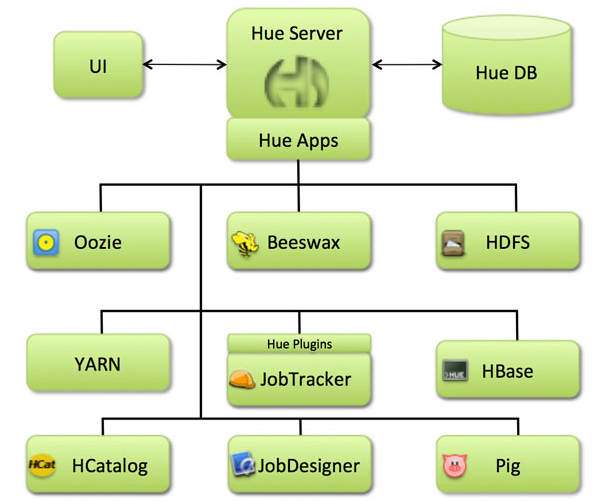

# 26_HBase整合hue以及Phoenix集成

# 1.Hbase整合hue

## 1.1 hue介绍

HUE=Hadoop User Experience
在没有HUE的时候，如果我们想要查看Hadoop生态圈各组件的状态，可以通过它们的webconsole，地址分别是：

```
HDFS: NameNode网页 http://ip:50070
SecondaryNameNode网页: http://ip:50090
Yarn: http://ip:8088
HBase: http://ip:16010
Hive http://ip:9999/hwi/
Spark http://ip:8080
```

如果一个个去查看肯定是可以的，但是…比较耗时间，稍显麻烦。而HUE就是对这些的整合，在HUE一个地方就可以查看上面全部组件的状况和进行一些操作。

Hue是一个开源的Apache Hadoop UI系统，由Cloudera Desktop演化而来，最后Cloudera公司将其贡献给Apache基金会的Hadoop社区，它是基于Python Web框架Django实现的。

通过使用Hue我们可以在浏览器端的Web控制台上与Hadoop集群进行交互来分析处理数据，例如操作HDFS上的数据，运行MapReduce Job，执行Hive的SQL语句，浏览HBase数据库等等。

**HUE链接**

Site: http://gethue.com/

Github: https://github.com/cloudera/hue

Reviews: [https://review.cloudera.org](https://review.cloudera.org/)



**核心功能**

1. SQL编辑器，支持Hive, Impala, MySQL, Oracle, PostgreSQL, SparkSQL, Solr SQL, Phoenix…
2. 搜索引擎Solr的各种图表
3. Spark和Hadoop的友好界面支持
4. 支持调度系统Apache Oozie，可进行workflow的编辑、查看

HUE提供的这些功能相比Hadoop生态各组件提供的界面更加友好，但是一些需要debug的场景可能还是需要使用原生系统才能更加深入的找到错误的原因。

HUE中查看Oozie workflow时，也可以很方便的看到整个workflow的DAG图，不过在最新版本中已经将DAG图去掉了，只能看到workflow中的action列表和他们之间的跳转关系，想要看DAG图的仍然可以使用oozie原生的界面系统查看。

1. 访问HDFS和文件浏览 
2. 通过web调试和开发hive以及数据结果展示 
3. 查询solr和结果展示，报表生成 
4. 通过web调试和开发impala交互式SQL Query 
5. spark调试和开发 
6. oozie任务的开发，监控，和工作流协调调度 
7. Hbase数据查询和修改，数据展示 
8. Hive的元数据（metastore）查询 
9. MapReduce任务进度查看，日志追踪 
10. 创建和提交MapReduce，Streaming，Java job任务 
11. Sqoop2的开发和调试 
12. Zookeeper的浏览和编辑 
13. 数据库（MySQL，PostGres，SQlite，Oracle）的查询和展示 

总结：**Hue是一个友好的界面集成框架，可以集成我们各种学习过的以及将要学习的框架，一个界面就可以做到查看以及执行所有的框架**

## 1.2 hue的环境准备及安装

Hue的安装支持多种方式，包括rpm包的方式进行安装，tar.gz包的方式进行安装以及cloudera  manager的方式来进行安装等，我们这里使用tar.gz包的方式来进行安装

### 1.2.1 下载依赖包

```
yum install ant asciidoc cyrus-sasl-devel cyrus-sasl-gssapi cyrus-sasl-plain gcc gcc-c++ krb5-devel libffi-devel libxml2-devel libxslt-devel make mysql mysql-devel openldap-devel python-devel sqlite-devel  gmp-devel openssl-devel -y
```

### 1.2.2 安装配置maven

hue的编译需要使用maven进行下载一些其他jar包

```
wget http://repos.fedorapeople.org/repos/dchen/apache-maven/epel-apache-maven.repo -O /etc/yum.repos.d/epel-apache-maven.repo

sed -i s//$releasever/6/g /etc/yum.repos.d/epel-apache-maven.repo

yum install -y apache-maven

mvn --version
```

配置maven的下载地址

```
vim  /etc/maven/settings.xml
```

```
 <mirror>
         <id>alimaven</id>
         <mirrorOf>central</mirrorOf>
         <name>aliyun maven</name>
         <url>http://maven.aliyun.com/nexus/content/groups/public/</url>
     </mirror>
 
     <mirror>
         <id>ui</id>
         <mirrorOf>central</mirrorOf>
         <name>Human Readable Name for this Mirror.</name>
         <url>http://uk.maven.org/maven2/</url>
     </mirror>
 
     <mirror>
         <id>jboss-public-repository-group</id>
         <mirrorOf>central</mirrorOf>
         <name>JBoss Public Repository Group</name>
         <url>http://repository.jboss.org/nexus/content/groups/public</url>
     </mirror>
```

注：在标签`<mirrors>`内添加

### 1.2.3  为linux操作系统添加普通用户

hue的安装必须添加普通用户 hue，否则启动报错，直接给node03服务器添加普通用户即可

```
useradd  hue
passwd  hue
```

### 1.2.4 下载hue压缩包并上传解压

```
cd /opt/module

wget http://gethue.com/downloads/releases/4.0.1/hue-4.0.1.tgz

tar -zxf hue-4.0.1.tgz -C /export/servers/
```

### 1.2.5 修改配置文件

修改hue的配置文件hue.ini

```
cd/opt/module/hue-4.0.0/desktop/conf/
vim hue.ini
```

```
#通用配置
[desktop]
secret_key=adsfasdfadsfasdfadfadfad
http_host=bigdata333
time_zone=Asia/Shanghai
server_user=root
server_group=root
default_user=root
default_hdfs_superuser=root
```

配置使用mysql作为hue的存储数据库,大概在hue.ini的561行左右

```
[[database]]
engine=mysql
host=bigdata333
port=3306
user=root
password=000000
name=hue
```

### 1.2.6 创建mysql数据库

进入mysql客户端，然后创建mysql数据库

```
mysql –uroot  -p000000
```

```
create database hue default character set utf8 default collate utf8_general_ci;
```

### 1.2.7 对hue进行编译

```
/opt/module/hue-4.0.0
make apps
```

注意：如果编译失败，那么需要重新进行编译，多编译几次，网速够快就能编译通过

```
make clean
make apps
```

### 1.2.8 启动hue服务并进行页面访问

```
cd /opt/module/hue-4.0.0

build/env/bin/supervisor
```

页面访问：http://bigdata333:8888

第一次访问的时候，需要设置管理员用户和密码

我们这里的管理员的用户名与密码尽量保持与我们安装hadoop的用户名和密码一致。

进入之后发现我们的hue页面报错了，这个错误主要是因为hive的原因，因为我们的hue与hive集成的时候出错了，所以我们需要配置我们的hue与hive进行集成。

## 1.3 hue与HDFS以及yarn集成

### 1.3.1 更改所有hadoop节点的core-site.xml配置

记得更改完core-site.xml之后一定要重启hdfs与yarn集群

三台机器更改core-site.xml

```1
<property>
<name>hadoop.proxyuser.root.hosts</name>
<value>*</value>
</property>
<property>
<name>hadoop.proxyuser.root.groups</name>
<value>*</value>
</property> 
```

### 1.3.2 更改所有hadoop节点的hdfs-site.xml

```
<property>
	  <name>dfs.webhdfs.enabled</name>
	  <value>true</value>
	</property>
```

### 1.3.3 继续配置hue.ini

配置我们的hue与hdfs集成 在830行

```
[[hdfs_clusters]]
[[[default]]]
fs_defaultfs=hdfs://bigdata111:9000
webhdfs_url=http://bigdata111:50070/webhdfs/v1
hadoop_hdfs_home=/opt/module/hadoop-2.8.4
hadoop_bin=/opt/module/hadoop-2.8.4/bin
hadoop_conf_dir=/opt/module/hadoop-2.8.4/etc/hadoop
```

### 1.3.4 配置我们的hue与yarn集成

```
[[yarn_clusters]]
[[[default]]]
resourcemanager_host=bigdata222
resourcemanager_port=8032
submit_to=True
resourcemanager_api_url=http://bigdata222:8088
history_server_api_url=http://bigdata111:19888
```

注：需要根据自己服务器的设置进行相关配置，本机测试是yarn在bigdata222节点，其他在bigdata111节点

## 1.4 配置hue 与 hive集成

如果需要配置hue与hive的集成，我们需要启动hive的hiveserver2服务

### 1.4.1 配置hue.ini 

 大约在955行

```
[beeswax]
 hive_server_host=bigdata111
 hive_server_port=10000
 hive_conf_dir=/opt/module/hive-2.3.4/conf
 erver_conn_timeout=120
 auth_username=root
 auth_password=000000
 
```

```
[metastore]
#允许使用hive创建数据库表等操作
enable_new_create_table=true
```

### 1.4.2 启动hive的metastore服务

```
cd /opt/module/hive-2.3.4
bin/hive --service hiveserver2 
```

重新启动hue，然后就可以通过浏览器页面操作hive了

## 1.5  hue与HBase的集成

### 1.5.1 修改hue.ini

大约在1190行

```
[hbase]
hbase_clusters=(Cluster|bigdata111:9090)
hbase_conf_dir=/opt/module/hbase-2.0.0/conf
```

### 1.5.2 启动hbase的thrift server服务

启动hbase的thriftserver

```
bin/hbase-daemon.sh start thrift  
```

### 1.5.3 启动hue

```
build/env/bin/supervisor
```

### 1.5.4 页面访问

http://bigdata333:8888/hue/

**注意：与HBase有关系的组件也需要全部启动，比如：启动hbase需要hdfs与zookeeper，所有这两个也需要启动**


# 2.Phoenix集成

## 2.1 Phoenix介绍

可以把Phoenix理解为Hbase的查询引擎，phoenix，由saleforce.com开源的一个项目，后又捐给了Apache。它相当于一个Java中间件，帮助开发者，像使用jdbc访问关系型数据库一些，访问NoSql数据库HBase。

phoenix，操作的表及数据，存储在hbase上。phoenix只是需要和Hbase进行表关联起来。然后再用工具进行一些读或写操作。

其实，可以把Phoenix只看成一种代替HBase的语法的一个工具。虽然可以用java可以用jdbc来连接phoenix，然后操作HBase，但是在生产环境中，不可以用在OLTP中。在线事务处理的环境中，需要低延迟，而Phoenix在查询HBase时，虽然做了一些优化，但**延迟还是不小**。所以依然是用在OLAT中，再将结果返回存储下来。

## 2.2 安装

1. 上传压缩包，并解压至module目录

   ```
   tar -zxvf apache-phoenix-4.14.1-HBase-1.2-bin.tar.gz -C /opt/module
   mv apache-phoenix-4.14.1-HBase-1.2-bin phoenix-4.14.1
   ```

2. 配置环境变量

   ```
   vi /etc/profile
   
   #phoenix
   export PHOENIX_HOME=/opt/module/phoenix-4.14.1
   export PATH=$PATH:$PHOENIX_HOME/bin
   ```

   source /etc/profile

3. 将主节点的phoenix包传到从节点

   ```
   scp -r phoenix-4.14.1 root@bigdata13:/opt/module
   scp -r phoenix-4.14.1 root@bigdata12:/opt/module
   ```

4. hbase-site.xml（注）三台都要

   ```
   cp hbase-site.xml /opt/module/phoenix-4.14.1/bin/
   ```

5. 拷贝jar包（注）三台都要

   将如下两个jar包，目录在/opt/module/phoenix-4.14.1下，拷贝到hbase的lib目录，目录在/opt/module/hbase-1.3.1/lib/

   ```
   phoenix-4.10.0-HBase-1.2-server.jar
   phoenix-core-4.10.0-HBase-1.2.jar
   ```

6. 启动

   ```
   sqlline.py bigdata111:2181
   ```

## 2.3 基本命令

1. 展示表

   ```
   !table
   ```

2. 创建表

   ```
   create table test(id integer not null primary key,name varchar);
   
   create table "Andy"(id integer not null primary key,name varchar);
   ```

3. 删除表

   ```
   drop table test;
   ```

4. 插入数据

   ```
   upsert into test values(1,'Andy');
   upsert into users(name) values('toms');
   ```

5. 查询数据

   ```
   select * from test;
   
   scan 'test'
   ```

6. 退出phoenix

   ```
   !q
   ```

7. 删除数据

   ```
   delete from test where id=2;
   ```

8. sum函数的使用

   ```
   select sum(id) from "Andy";
   ```

9. 增加一列

   ```
   alter table "Andy" add address varchar;
   ```

10. 删除一列

    ```
    alter table "Andy" drop column address;
    ```

**其他语法详见：**http://phoenix.apache.org/language/index.html

## 2.4 表映射

1. hbase中创建表

   ```
   create 'teacher','info','contact'
   ```

2. 插入数据

   ```
   put 'teacher','1001','info:name','Jack'
   put 'teacher','1001','info:age','28'
   put 'teacher','1001','info:gender','male'
   put 'teacher','1001','contact:address','shanghai'
   put 'teacher','1001','contact:phone','13458646987'
   
   put 'teacher','1002','info:name','Jim'
   put 'teacher','1002','info:age','30'
   put 'teacher','1002','info:gender','male'
   put 'teacher','1002','contact:address','tianjian'
   put 'teacher','1002','contact:phone','13512436987'
   ```

3. 在Phoenix创建映射表

   ```
   create view "teacher"(
   
   "ROW" varchar primary key,
   
   "contact"."address" varchar,
   
   "contact"."phone" varchar,
   
   "info"."age"  varchar,
   
   "info"."gender" varchar,
   
   "info"."name" varchar
   
   );
   ```

4. 在Phoenix查找数据

   ```
   select * from "teacher";
   ```

   

