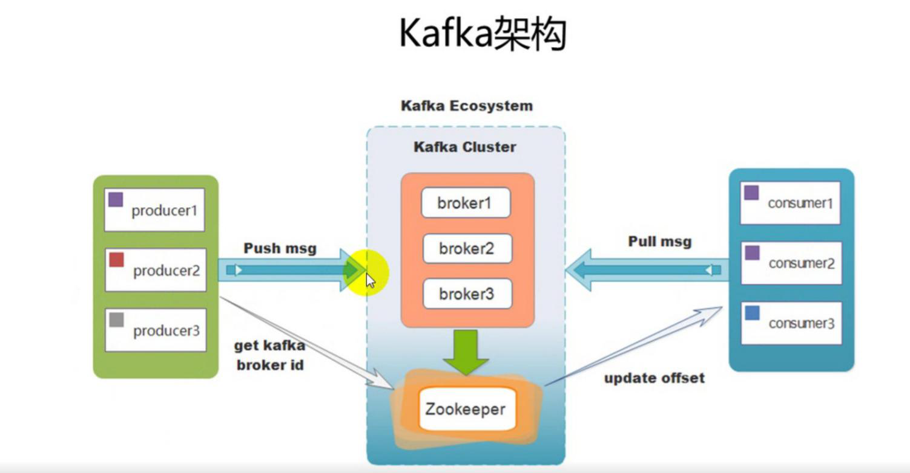
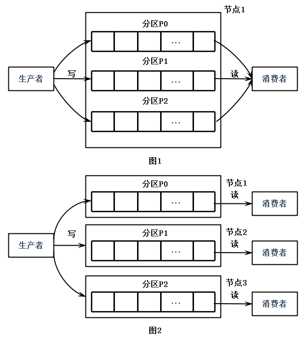
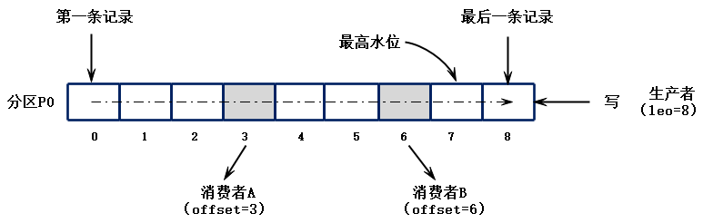

# 29_kafka消息队列

# 1.消息系统

**概念：**

- 消息系统负责将数据从一个应用程序传送到另一个应用程序，因此应用程序可以专注于数据，但是不必担心如何共享它。分布式消息系统基于可靠的消息队列的概念。消息在客户端应用程序和消息传递系统之间的异步排队

- 有两种类型的消息模式可用：点对点；发布-订阅消息系统

  - 点对点消息系统中，消息被保留在队列中，一个或者多个消费者可以消费队列中的消息，但是特定的消息只能有最多的一个消费者消费。一旦消费者读取队列中的消息，他就从该队列中消失。该系统的典型应用就是订单处理系统，其中每个订单将有一个订单处理器处理，但多个订单处理器可以同时工作

- 大多数的消息系统是基于发布-订阅消息系统

  

在没有使用消息系统以前，我们对于传统许多业务，以及跨服务器传递消息的时候，会采用串行方式或者并行方法：

- 串行方式：

  用户注实例，将注册信息写入数据库成功以后，发送注册邮件，在发送注册短信。

  

- 并行方式

  将注册信息写入数据库成功以后，发送注册邮件的同时，发送注册短信。以上三个任务完成以后，响应给客户端，与串行的差别是并行的方式可以缩短程序整体处理的时间

  

# 2.消息系统的引应用场景

1. 应用解耦

   将一个大型的任务系统分为若干个小模块，将所有的消息进行统一的管理和存储，因此了解耦，就会涉及到kafka企业消息级平台

2. 流量控制

   秒杀活动中，一般会因为流量过大，应用服务器挂掉，为了解决这个问题，一般需要在应用前端奖赏消息队列以控制访问流量

   - 可以控制活动的人数，可以缓解短时间内流量大，使得服务器崩掉
   - 可以通过队列进行数据缓存，后续在进行消费处理

3. 日志处理

   日志处理是指将消息队列用在日志处理中，比如kafka的应用中，解决大量的日志传输问题，日志采集工具采集，数据写入kafka中；kafka消息队列负责日志数据的接收，存储，转发功能，日志处理应用程序，订阅并消费kafka队列中的数据，进行数据分析

4. 消息通讯

   消息队列一般都内置了高效的通信机制，因此也可以用在纯的消息通讯，比如点对点的消息队列，或者聊天室等。

# 3.kafka简介

## 3.1 kafka概念

在流式计算中，Kafka一般用来缓存数据，Storm通过消费Kafka的数据进行计算。

1. Apache Kafka是一个开源**消息**系统，由Scala写成。是由Apache软件基金会开发的一个开源消息系统项目。
2. Kafka最初是由LinkedIn公司开发，并于2011年初开源。2012年10月从Apache Incubator毕业。该项目的目标是为处理实时数据提供一个统一、高通量、低等待的平台。
3. **Kafka是一个分布式消息队列。**Kafka对消息保存时根据Topic进行归类，发送消息者称为Producer，消息接受者称为Consumer，此外kafka集群有多个kafka实例组成，每个实例(server)成为broker。
4. 无论是kafka集群，还是producer和consumer都依赖于**zookeeper**集群保存一些meta信息，来保证系统可用性。

## 3.2 消息队列内部实现原理

- 点对点模式（类似接受文件，一对一，消费者主动拉取数据，消息收到后消息清除）

  点对点模型通常是一个基于拉取或者轮询的消息传送模型，这种模型从队列中请求信息，而不是将消息推送到客户端。这个模型的特点是发送到队列的消息被一个且只有一个接收者接收处理，即使有多个消息监听者也是如此。

- 发布/订阅模式（类似公众号，一对多，数据生产后，推送给所有订阅者）

  发布订阅模型则是一个基于推送的消息传送模型。发布订阅模型可以有多种不同的订阅者，临时订阅者只在主动监听主题时才接收消息，而持久订阅者则监听主题的所有消息，即使当前订阅者不可用，处于离线状态。

## 3.3 为什么需要消息队列

- 解耦：

  　　允许你独立的扩展或修改两边的处理过程，只要确保它们遵守同样的接口约束。

- 冗余：

  消息队列把数据进行持久化直到它们已经被完全处理，通过这一方式规避了数据丢失风险。许多消息队列所采用的"插入-获取-删除"范式中，在把一个消息从队列中删除之前，需要你的处理系统明确的指出该消息已经被处理完毕，从而确保你的数据被安全的保存直到你使用完毕。

- 扩展性：

  因为消息队列解耦了你的处理过程，所以增大消息入队和处理的频率是很容易的，只要另外增加处理过程即可。

- 灵活性 & 峰值处理能力：

  在访问量剧增的情况下，应用仍然需要继续发挥作用，但是这样的突发流量并不常见。如果为以能处理这类峰值访问为标准来投入资源随时待命无疑是巨大的浪费。使用消息队列能够使关键组件顶住突发的访问压力，而不会因为突发的超负荷的请求而完全崩溃。

- 可恢复性：

  系统的一部分组件失效时，不会影响到整个系统。消息队列降低了进程间的耦合度，所以即使一个处理消息的进程挂掉，加入队列中的消息仍然可以在系统恢复后被处理。

- 顺序保证：

  在大多使用场景下，数据处理的顺序都很重要。大部分消息队列本来就是排序的，并且能保证数据会按照特定的顺序来处理。（Kafka保证一个Partition内的消息的有序性）

- 缓冲：

  有助于控制和优化数据流经过系统的速度，解决生产消息和消费消息的处理速度不一致的情况

- 异步通信：

  很多时候，用户不想也不需要立即处理消息。消息队列提供了异步处理机制，允许用户把一个消息放入队列，但并不立即处理它。想向队列中放入多少消息就放多少，然后在需要的时候再去处理它们。

# 4.kafka的架构


## 4.1 kafka四大核心

1. 生产者API

   允许应用程序发布记录流至一个或者多个kafka的主题（topics）

2. 消费者API

   允许应用程序订阅一个或者多个主题，并处理这些主题接收到的记录流

3. StreamsAPI

   允许应用程序充当流处理器（stream processor），从一个或者多个主题获取输入流，并生产一个输出流到一个或者多个主题，能够有效的变化输入流为输出流

4. ConnectorAPI

   允许构建和运行可重用的生产者或者消费者，能够把kafka主题连接到现有的应用程序或数据系统。例如一个连接到关系数据库的连接器可能会获取每个表的变化 

## 4.2 kafka架构



- roducer ：消息生产者，就是向kafka broker发消息的客户端。
- Consumer ：消息消费者，向kafka broker取 消息的客户端
- Topic ：可以理解为一个队列。
- Consumer Group （CG）：消费者组，kafka提供的可扩展且具有容错性的消费者机制。既然是一个组，那么组内必然可以有多个消费者或消费者实例(consumer instance)，它们共享一个公共的ID，即group ID。组内的所有消费者协调在一起来消费订阅主题(subscribed topics)的所有分区(partition)。当然，每个分区只能由同一个消费组内的一个consumer来消费。
- Broker ：一台kafka服务器就是一个broker。一个集群由多个broker组成。一个broker可以容纳多个topic。
- Partition：为了实现扩展性，一个非常大的topic可以分布到多个broker（即服务器）上，一个topic可以分为多个partition，每个partition是一个有序的队列。partition中的每条消息都会被分配一个有序的id（offset）。kafka只保证按一个partition中的顺序将消息发给consumer，不保证一个topic的整体（多个partition间）的顺序。
- Offset：偏移量，kafka的存储文件都是按照offset.kafka来命名，用offset做名字的好处是方便查找。例如你想找位于2049的位置，只要找到2048.kafka的文件即可。当然the first offset就是00000000000.kafka

## 4.3 分布式模型

- Kafka每个主题的多个分区日志分布式地存储在Kafka集群上，同时为了故障容错，每个分区都会以副本的方式复制到多个消息代理节点上。其中一个节点会作为主副本（Leader），其他节点作为备份副本（Follower，也叫作从副本）。主副本会负责所有的客户端读写操作，备份副本仅仅从主副本同步数据。当主副本出现故障时，备份副本中的一个副本会被选择为新的主副本。**因为每个分区的副本中只有主副本接受读写，所以每个服务器端都会作为某些分区的主副本，以及另外一些分区的备份副本，这样Kafka集群的所有服务端整体上对客户端是负载均衡的。**

- Kafka的生产者和消费者相对于服务器端而言都是客户端。

- Kafka生产者客户端发布消息到服务端的指定主题，会指定消息所属的分区。生产者发布消息时根据消息是否有键，采用不同的分区策略。消息没有键时，通过轮询方式进行客户端负载均衡；消息有键时，根据分区语义（例如hash）确保相同键的消息总是发送到同一分区。

- Kafka的消费者通过订阅主题来消费消息，并且每个消费者都会设置一个消费组名称。因为生产者发布到主题的每一条消息都只会发送给消费者组的一个消费者。所以，如果要实现传统消息系统的“队列”模型，可以让每个消费者都拥有相同的消费组名称，这样消息就会负责均衡到所有的消费者；如果要实现“发布-订阅”模型，则每个消费者的消费者组名称都不相同，这样每条消息就会广播给所有的消费者。

- 分区是消费者现场模型的最小并行单位。如下图（图1）所示，生产者发布消息到一台服务器的3个分区时，只有一个消费者消费所有的3个分区。在下图（图2）中，3个分区分布在3台服务器上，同时有3个消费者分别消费不同的分区。假设每个服务器的吞吐量时300MB，在下图（图1）中分摊到每个分区只有100MB，而在下图（图2）中，集群整体的吞吐量有900MB。可以看到，增加服务器节点会提升集群的性能，增加消费者数量会提升处理性能。

- 同一个消费组下多个消费者互相协调消费工作，Kafka会将所有的分区平均地分配给所有的消费者实例，这样每个消费者都可以分配到数量均等的分区。Kafka的消费组管理协议会动态地维护消费组的成员列表，当一个新消费者加入消费者组，或者有消费者离开消费组，都会触发再平衡操作。

  

- Kafka的消费者消费消息时，只保证在一个分区内的消息的完全有序性，并不保证同一个主题汇中多个分区的消息顺序。而且，消费者读取一个分区消息的顺序和生产者写入到这个分区的顺序是一致的。比如，生产者写入“hello”和“Kafka”两条消息到分区P1，则消费者读取到的顺序也一定是“hello”和“Kafka”。如果业务上需要保证所有消息完全一致，只能通过设置一个分区完成，但这种做法的缺点是最多只能有一个消费者进行消费。一般来说，只需要保证每个分区的有序性，再对消息键(message Key 可以是user id等)来保证相同键的所有消息落入同一分区，就可以满足绝大多数的应用。

# 5. kafka集群搭建

## 5.1 初始化安装环境

需要安装jdk和zookeeper

**注：**保证三台机器的zk服务都正常启动，且正常运行，查看zk的运行装填，保证有一台zk的服务状态为leader，且两台为follower即可

## 5.2 上传安装包并解压

下载地址：

http://archive.apache.org/dist/kafka/0.10.0.0/kafka_2.11-0.10.0.0.tgz

```
tar -zxvf kafka_2.11-0.10.0.0.tgz -C /opt/module
```

## 5.3 修改配置文件

```
cd /opt/module/kafka_2.11-0.10.0.0/config
vim server.properties

broker.id=0
log.dirs=/opt/module/kafka_2.11-0.10.0.0/logs
zookeeper.connect=bigdata111:2181,bigdata222:2181,bigdata333:2181
新增：
delete.topic.enable=true
host.name=bigdata111
```

在kafka根目录下创建logs目录用于存放数据文件

```
mkdir logs
```

## 5.4  分发安装包

将bigdata111上的安装包分发至其他两台服务器

```
scp -r kafka_2.11-0.10.0.0/ root@bigdata222:/opt/module
scp -r kafka_2.11-0.10.0.0/ root@bigdata333:/opt/module
```

## 5.5 另外两台服务器修改配置文件

bigdata222

```
cd /opt/module/kafka_2.11-0.10.0.0/config
vim server.properties

broker.id=1
log.dirs=/opt/module/kafka_2.11-0.10.0.0/logs
zookeeper.connect=bigdata111:2181,bigdata222:2181,bigdata333:2181
delete.topic.enable=true
host.name=bigdata222
```

bigdata333

```
cd /opt/module/kafka_2.11-0.10.0.0/config
vim server.properties

broker.id=2
log.dirs=/opt/module/kafka_2.11-0.10.0.0/logs
zookeeper.connect=bigdata111:2181,bigdata222:2181,bigdata333:2181
delete.topic.enable=true
host.name=bigdata333
```

## 5.6 启动集群

启动kafka之前，需要先启动zookeeper服务

```
zkServer.sh start
```

1. 前台启动

   ```
   bin/kafka-server-start.sh config/server.properties
   ```

2. 后台启动

   三台同时

   ```
   nohup bin/kafka-server-start.sh config/server.properties 2>&1 &
   ```

3. 停止

   ```
   bin/kafka-server-stop.sh
   ```

可通过jps查看进程，检查是否启动

## 5.7 kafka配置信息

### 5.7.1Broker配置信息

| ***\*属性\****                          | ***\*默认值\****   | ***\*描述\****                                               |
| --------------------------------------- | ------------------ | ------------------------------------------------------------ |
| broker.id                               |                    | 必填参数，broker的唯一标识                                   |
| log.dirs                                | /tmp/kafka-logs    | Kafka数据存放的目录。可以指定多个目录，中间用逗号分隔，当新partition被创建的时会被存放到当前存放partition最少的目录。 |
| port                                    | 9092               | BrokerServer接受客户端连接的端口号                           |
| zookeeper.connect                       | null               | Zookeeper的连接串，格式为：hostname1:port1,hostname2:port2,hostname3:port3。可以填一个或多个，为了提高可靠性，建议都填上。注意，此配置允许我们指定一个zookeeper路径来存放此kafka集群的所有数据，为了与其他应用集群区分开，建议在此配置中指定本集群存放目录，格式为：hostname1:port1,hostname2:port2,hostname3:port3/chroot/path 。需要注意的是，消费者的参数要和此参数一致。 |
| message.max.bytes                       | 1000000            | 服务器可以接收到的最大的消息大小。注意此参数要和consumer的maximum.message.size大小一致，否则会因为生产者生产的消息太大导致消费者无法消费。 |
| num.io.threads                          | 8                  | 服务器用来执行读写请求的IO线程数，此参数的数量至少要等于服务器上磁盘的数量。 |
| queued.max.requests                     | 500                | I/O线程可以处理请求的队列大小，若实际请求数超过此大小，网络线程将停止接收新的请求。 |
| socket.send.buffer.bytes                | 100 * 1024         | The SO_SNDBUFF buffer the server prefers for socket connections. |
| socket.receive.buffer.bytes             | 100 * 1024         | The SO_RCVBUFF buffer the server prefers for socket connections. |
| socket.request.max.bytes                | 100 * 1024 * 1024  | 服务器允许请求的最大值， 用来防止内存溢出，其值应该小于 Java heap size. |
| num.partitions                          | 1                  | 默认partition数量，如果topic在创建时没有指定partition数量，默认使用此值，建议改为5 |
| log.segment.bytes                       | 1024 * 1024 * 1024 | Segment文件的大小，超过此值将会自动新建一个segment，此值可以被topic级别的参数覆盖。 |
| log.roll.{ms,hours}                     | 24 * 7 hours       | 新建segment文件的时间，此值可以被topic级别的参数覆盖。       |
| log.retention.{ms,minutes,hours}        | 7 days             | Kafka segment log的保存周期，保存周期超过此时间日志就会被删除。此参数可以被topic级别参数覆盖。数据量大时，建议减小此值。 |
| log.retention.bytes                     | -1                 | 每个partition的最大容量，若数据量超过此值，partition数据将会被删除。注意这个参数控制的是每个partition而不是topic。此参数可以被log级别参数覆盖。 |
| log.retention.check.interval.ms         | 5 minutes          | 删除策略的检查周期                                           |
| auto.create.topics.enable               | true               | 自动创建topic参数，建议此值设置为false，严格控制topic管理，防止生产者错写topic。 |
| default.replication.factor              | 1                  | 默认副本数量，建议改为2。                                    |
| replica.lag.time.max.ms                 | 10000              | 在此窗口时间内没有收到follower的fetch请求，leader会将其从ISR(in-sync replicas)中移除。 |
| replica.lag.max.messages                | 4000               | 如果replica节点落后leader节点此值大小的消息数量，leader节点就会将其从ISR中移除。 |
| replica.socket.timeout.ms               | 30 * 1000          | replica向leader发送请求的超时时间。                          |
| replica.socket.receive.buffer.bytes     | 64 * 1024          | The socket receive buffer for network requests to the leader for replicating data. |
| replica.fetch.max.bytes                 | 1024 * 1024        | The number of byes of messages to attempt to fetch for each partition in the fetch requests the replicas send to the leader. |
| replica.fetch.wait.max.ms               | 500                | The maximum amount of time to wait time for data to arrive on the leader in the fetch requests sent by the replicas to the leader. |
| num.replica.fetchers                    | 1                  | Number of threads used to replicate messages from leaders. Increasing this value can increase the degree of I/O parallelism in the follower broker. |
| fetch.purgatory.purge.interval.requests | 1000               | The purge interval (in number of requests) of the fetch request purgatory. |
| zookeeper.session.timeout.ms            | 6000               | ZooKeeper session 超时时间。如果在此时间内server没有向zookeeper发送心跳，zookeeper就会认为此节点已挂掉。 此值太低导致节点容易被标记死亡；若太高，.会导致太迟发现节点死亡。 |
| zookeeper.connection.timeout.ms         | 6000               | 客户端连接zookeeper的超时时间。                              |
| zookeeper.sync.time.ms                  | 2000               | H ZK follower落后 ZK leader的时间。                          |
| controlled.shutdown.enable              | true               | 允许broker shutdown。如果启用，broker在关闭自己之前会把它上面的所有leaders转移到其它brokers上，建议启用，增加集群稳定性。 |
| auto.leader.rebalance.enable            | true               | If this is enabled the controller will automatically try to balance leadership for partitions among the brokers by periodically returning leadership to the “preferred” replica for each partition if it is available. |
| leader.imbalance.per.broker.percentage  | 10                 | The percentage of leader imbalance allowed per broker. The controller will rebalance leadership if this ratio goes above the configured value per broker. |
| leader.imbalance.check.interval.seconds | 300                | The frequency with which to check for leader imbalance.      |
| offset.metadata.max.bytes               | 4096               | The maximum amount of metadata to allow clients to save with their offsets. |
| connections.max.idle.ms                 | 600000             | Idle connections timeout: the server socket processor threads close the connections that idle more than this. |
| num.recovery.threads.per.data.dir       | 1                  | The number of threads per data directory to be used for log recovery at startup and flushing at shutdown. |
| unclean.leader.election.enable          | true               | Indicates whether to enable replicas not in the ISR set to be elected as leader as a last resort, even though doing so may result in data loss. |
| delete.topic.enable                     | false              | 启用deletetopic参数，建议设置为true。                        |
| offsets.topic.num.partitions            | 50                 | The number of partitions for the offset commit topic. Since changing this after deployment is currently unsupported, we recommend using a higher setting for production (e.g., 100-200). |
| offsets.topic.retention.minutes         | 1440               | Offsets that are older than this age will be marked for deletion. The actual purge will occur when the log cleaner compacts the offsets topic. |
| offsets.retention.check.interval.ms     | 600000             | The frequency at which the offset manager checks for stale offsets. |
| offsets.topic.replication.factor        | 3                  | The replication factor for the offset commit topic. A higher setting (e.g., three or four) is recommended in order to ensure higher availability. If the offsets topic is created when fewer brokers than the replication factor then the offsets topic will be created with fewer replicas. |
| offsets.topic.segment.bytes             | 104857600          | Segment size for the offsets topic. Since it uses a compacted topic, this should be kept relatively low in order to facilitate faster log compaction and loads. |
| offsets.load.buffer.size                | 5242880            | An offset load occurs when a broker becomes the offset manager for a set of consumer groups (i.e., when it becomes a leader for an offsets topic partition). This setting corresponds to the batch size (in bytes) to use when reading from the offsets segments when loading offsets into the offset manager’s cache. |
| offsets.commit.required.acks            | -1                 | The number of acknowledgements that are required before the offset commit can be accepted. This is similar to the producer’s acknowledgement setting. In general, the default should not be overridden. |
| offsets.commit.timeout.ms               | 5000               | The offset commit will be delayed until this timeout or the required number of replicas have received the offset commit. This is similar to the producer request timeout. |

### 5.7.2 Producer配置信息

| ***\*属性\****                     | ***\*默认值\****                  | ***\*描述\****                                               |
| ---------------------------------- | --------------------------------- | ------------------------------------------------------------ |
| metadata.broker.list               |                                   | 启动时producer查询brokers的列表，可以是集群中所有brokers的一个子集。注意，这个参数只是用来获取topic的元信息用，producer会从元信息中挑选合适的broker并与之建立socket连接。格式是：host1:port1,host2:port2。 |
| request.required.acks              | 0                                 | 参见3.2节介绍                                                |
| request.timeout.ms                 | 10000                             | Broker等待ack的超时时间，若等待时间超过此值，会返回客户端错误信息。 |
| producer.type                      | sync                              | 同步异步模式。async表示异步，sync表示同步。如果设置成异步模式，可以允许生产者以batch的形式push数据，这样会极大的提高broker性能，推荐设置为异步。 |
| serializer.class                   | kafka.serializer.DefaultEncoder   | 序列号类，.默认序列化成 byte[] 。                            |
| key.serializer.class               |                                   | Key的序列化类，默认同上。                                    |
| partitioner.class                  | kafka.producer.DefaultPartitioner | Partition类，默认对key进行hash。                             |
| compression.codec                  | none                              | 指定producer消息的压缩格式，可选参数为： “none”, “gzip” and “snappy”。关于压缩参见4.1节 |
| compressed.topics                  | null                              | 启用压缩的topic名称。若上面参数选择了一个压缩格式，那么压缩仅对本参数指定的topic有效，若本参数为空，则对所有topic有效。 |
| message.send.max.retries           | 3                                 | Producer发送失败时重试次数。若网络出现问题，可能会导致不断重试。 |
| retry.backoff.ms                   | 100                               | Before each retry, the producer refreshes the metadata of relevant topics to see if a new leader has been elected. Since leader election takes a bit of time, this property specifies the amount of time that the producer waits before refreshing the metadata. |
| topic.metadata.refresh.interval.ms | 600 * 1000                        | The producer generally refreshes the topic metadata from brokers when there is a failure (partition missing, leader not available…). It will also poll regularly (default: every 10min so 600000ms). If you set this to a negative value, metadata will only get refreshed on failure. If you set this to zero, the metadata will get refreshed after each message sent (not recommended). Important note: the refresh happen only AFTER the message is sent, so if the producer never sends a message the metadata is never refreshed |
| queue.buffering.max.ms             | 5000                              | 启用异步模式时，producer缓存消息的时间。比如我们设置成1000时，它会缓存1秒的数据再一次发送出去，这样可以极大的增加broker吞吐量，但也会造成时效性的降低。 |
| queue.buffering.max.messages       | 10000                             | 采用异步模式时producer buffer 队列里最大缓存的消息数量，如果超过这个数值，producer就会阻塞或者丢掉消息。 |
| queue.enqueue.timeout.ms           | -1                                | 当达到上面参数值时producer阻塞等待的时间。如果值设置为0，buffer队列满时producer不会阻塞，消息直接被丢掉。若值设置为-1，producer会被阻塞，不会丢消息。 |
| batch.num.messages                 | 200                               | 采用异步模式时，一个batch缓存的消息数量。达到这个数量值时producer才会发送消息。 |
| send.buffer.bytes                  | 100 * 1024                        | Socket write buffer size                                     |
| client.id                          | “”                                | The client id is a user-specified string sent in each request to help trace calls. It should logically identify the application making the request. |

### 5.7.3 Consumer配置信息

| ***\*属性\****                  | ***\*默认值\**** | ***\*描述\****                                               |
| ------------------------------- | ---------------- | ------------------------------------------------------------ |
| group.id                        |                  | Consumer的组ID，相同goup.id的consumer属于同一个组。          |
| zookeeper.connect               |                  | Consumer的zookeeper连接串，要和broker的配置一致。            |
| consumer.id                     | null             | 如果不设置会自动生成。                                       |
| socket.timeout.ms               | 30 * 1000        | 网络请求的socket超时时间。实际超时时间由max.fetch.wait + socket.timeout.ms 确定。 |
| socket.receive.buffer.bytes     | 64 * 1024        | The socket receive buffer for network requests.              |
| fetch.message.max.bytes         | 1024 * 1024      | 查询topic-partition时允许的最大消息大小。consumer会为每个partition缓存此大小的消息到内存，因此，这个参数可以控制consumer的内存使用量。这个值应该至少比server允许的最大消息大小大，以免producer发送的消息大于consumer允许的消息。 |
| num.consumer.fetchers           | 1                | The number fetcher threads used to fetch data.               |
| auto.commit.enable              | true             | 如果此值设置为true，consumer会周期性的把当前消费的offset值保存到zookeeper。当consumer失败重启之后将会使用此值作为新开始消费的值。 |
| auto.commit.interval.ms         | 60 * 1000        | Consumer提交offset值到zookeeper的周期。                      |
| queued.max.message.chunks       | 2                | 用来被consumer消费的message chunks 数量， 每个chunk可以缓存fetch.message.max.bytes大小的数据量。 |
| auto.commit.interval.ms         | 60 * 1000        | Consumer提交offset值到zookeeper的周期。                      |
| queued.max.message.chunks       | 2                | 用来被consumer消费的message chunks 数量， 每个chunk可以缓存fetch.message.max.bytes大小的数据量。 |
| fetch.min.bytes                 | 1                | The minimum amount of data the server should return for a fetch request. If insufficient data is available the request will wait for that much data to accumulate before answering the request. |
| fetch.wait.max.ms               | 100              | The maximum amount of time the server will block before answering the fetch request if there isn’t sufficient data to immediately satisfy fetch.min.bytes. |
| rebalance.backoff.ms            | 2000             | Backoff time between retries during rebalance.               |
| refresh.leader.backoff.ms       | 200              | Backoff time to wait before trying to determine the leader of a partition that has just lost its leader. |
| auto.offset.reset               | largest          | What to do when there is no initial offset in ZooKeeper or if an offset is out of range ;smallest : automatically reset the offset to the smallest offset; largest : automatically reset the offset to the largest offset;anything else: throw exception to the consumer |
| consumer.timeout.ms             | -1               | 若在指定时间内没有消息消费，consumer将会抛出异常。           |
| exclude.internal.topics         | true             | Whether messages from internal topics (such as offsets) should be exposed to the consumer. |
| zookeeper.session.timeout.ms    | 6000             | ZooKeeper session timeout. If the consumer fails to heartbeat to ZooKeeper for this period of time it is considered dead and a rebalance will occur. |
| zookeeper.connection.timeout.ms | 6000             | The max time that the client waits while establishing a connection to zookeeper. |
| zookeeper.sync.time.ms          | 2000             | How far a ZK follower can be behind a ZK leader              |

# 6.kafka基本操作

## 6.1创建一个Topic

创建了一个名字为test的主题， 有三个分区，有两个副本

```
 bin/kafka-topics.sh --create --partitions 3 --replication-factor 2 --topic test --zookeeper bigdata111:2181,bigdata222:2181,bigdata333:2181
```

## 6.2 查看主题命令

查看kafka当中存在的主题

```
bin/kafka-topics.sh  --list --zookeeper bigdata111:2181,bigdata222:2181,bigdata333:2181
```

## 6.3 生产者生产数据

模拟生产者来生产数据

bigdata111服务器执行以下命令来模拟生产者进行生产数据

```
bin/kafka-console-producer.sh --broker-list bigdata111:9092,bigdata222:9092,bigdata333:9092 --topic test
```

## 6.4 运行describe  topics命令

复制一个会话，在bigdata111执行以下命令运行describe查看topic的相关信息

```
bin/kafka-topics.sh --describe --zookeeper bigdata111:2181 --topic test
```

# 7.修改topic属性

## 7.1 增加topic分区数

任意kafka服务器执行以下命令可以增加topic分区数

```
bin/kafka-topics.sh --zookeeper zkhost:port --alter --topic topicName --partitions 8
```

## 7.2 增加配置

动态修改kakfa的配置

任意kafka服务器执行以下命令可以增加topic分区数

```
bin/kafka-topics.sh --zookeeper bigdata111:2181 --alter --topic test --config flush.messages=1
```

## 7.3 删除配置

动态删除kafka集群配置

```
bin/kafka-topics.sh --zookeeper bigdata111:2181 --alter --topic test --delete-config flush.messages
```

## 7.4 删除topic

目前删除topic在默认情况下只是打上一个删除的标记，在重新启动kafka后才删除。如果需要立即删除，则需要在

server.properties中配置：

```
delete.topic.enable=true
```

然后执行以下命令进行删除topic

```
bin/kafka-topics.sh --zookeeper bigdata111:2181 --delete --topic topicName
```

# 8.kafka集群Java API操作

## 8.1 创建maven工程，导入jar包

```xml
<dependencies>
    <dependency>
        <groupId>org.apache.kafka</groupId>
        <artifactId>kafka-clients</artifactId>
        <version> 0.10.0.0</version>
    </dependency>
    <dependency>
        <groupId>org.apache.kafka</groupId>
        <artifactId>kafka-streams</artifactId>
        <version>0.10.0.0</version>
    </dependency>

</dependencies>

<build>
    <plugins>
        <!-- java编译插件 -->
        <plugin>
            <groupId>org.apache.maven.plugins</groupId>
            <artifactId>maven-compiler-plugin</artifactId>
            <version>3.2</version>
            <configuration>
                <source>1.8</source>
                <target>1.8</target>
                <encoding>UTF-8</encoding>
            </configuration>
        </plugin>
    </plugins>
</build>
```

## 8.2 实现生产数据

```java
public class MyProducer {
    /**
     * 实现生产数据到kafka test这个topic里面去
     * @param args
     */
    public static void main(String[] args) {
        Properties props = new Properties(); props.put("bootstrap.servers", "bigdata111:9092"); props.put("acks", "all");
        props.put("acks","all");
        props.put("retries", 0);
        props.put("batch.size", 16384);
        props.put("linger.ms", 1);
        props.put("buffer.memory", 33554432);
        props.put("key.serializer",
                "org.apache.kafka.common.serialization.StringSerializer");
        props.put("value.serializer",
                "org.apache.kafka.common.serialization.StringSerializer");

//        获取kafka producer这个类
        KafkaProducer<String, String> KafkaProducer = new KafkaProducer<>(props);
        for (int i = 0; i < 1000; i++) {
//          使用循环发送消息
            KafkaProducer.send(new ProducerRecord<>("test","mymessage" + i));
        }
//      关闭生产者
        KafkaProducer.close();

    }
}

```

## 8.3 自动提交offset

```java
public class AutomaticConsumer {
    /**
     * 自动提交offset
     * @param args
     */
    public static void main(String[] args) {
        Properties props = new Properties();
        props.put("bootstrap.servers", "bigdata111:9092");
        props.put("group.id", "test_group");  //消费组
        props.put("enable.auto.commit", "true");//允许自动提交offset
        props.put("auto.commit.interval.ms", "1000");//每隔多久自动提交offset
        props.put("session.timeout.ms", "30000");
        //指定key，value的反序列化类
        props.put("key.deserializer", "org.apache.kafka.common.serialization.StringDeserializer");
        props.put("value.deserializer", "org.apache.kafka.common.serialization.StringDeserializer");

        KafkaConsumer<String, String> kafkaConsumer = new KafkaConsumer<>(props);

        //指定消费哪个topic里面的数据
        kafkaConsumer.subscribe(Arrays.asList("test"));
        //使用死循环来消费test这个topic里面的数据
        while (true){
            //这里面是我们所有拉取到的数据
            ConsumerRecords<String, String> consumerRecords = kafkaConsumer.poll(1000);
            for (ConsumerRecord<String, String> consumerRecord : consumerRecords) {
                long offset = consumerRecord.offset();
                String value = consumerRecord.value();
                System.out.println("消息的offset值为"+offset +"消息的value值为"+ value);
            }

        }
    }
}

```

## 8.4 手动提交offset

```java
public class MannualConsumer {
    /**
     * 实现手动的提交offset
     * @param args
     */
    public static void main(String[] args) {
        Properties props = new Properties();
        props.put("bootstrap.servers", "bigdata111:9092");
        props.put("group.id", "test_group");
        props.put("enable.auto.commit", "false"); //禁用自动提交offset，后期我们手动提交offset
        props.put("auto.commit.interval.ms", "1000");
        props.put("session.timeout.ms", "30000");
        props.put("key.deserializer", "org.apache.kafka.common.serialization.StringDeserializer");
        props.put("value.deserializer", "org.apache.kafka.common.serialization.StringDeserializer");
        KafkaConsumer<String, String> kafkaConsumer = new KafkaConsumer<>(props);
        kafkaConsumer.subscribe(Arrays.asList("test"));  //订阅test这个topic
        int minBatchSize = 200;  //达到200条进行批次的处理，处理完了之后，提交offset
        List<ConsumerRecord<String, String>> consumerRecordList = new ArrayList<>();//定义一个集合，用于存储我们的ConsumerRecorder
        while (true){

            ConsumerRecords<String, String> consumerRecords = kafkaConsumer.poll(1000);
            for (ConsumerRecord<String, String> consumerRecord : consumerRecords) {
                consumerRecordList.add(consumerRecord);
            }
            if(consumerRecordList.size() >=  minBatchSize){
                //如果集合当中的数据大于等于200条的时候，我们批量进行处理
                //将这一批次的数据保存到数据库里面去
                //insertToDb(consumerRecordList);
                System.out.println("手动提交offset的值");
                //提交offset，表示这一批次的数据全部都处理完了
                // kafkaConsumer.commitAsync();  //异步提交offset值
                kafkaConsumer.commitSync();//同步提交offset的值
                consumerRecordList.clear();//清空集合当中的数据
            }
        }
    }
}
```

## 8.5 kafka Streams API开发

**需求：**使用StreamAPI获取test这个topic当中的数据，然后将数据全部转为大写，写入到test2这个topic当中去

### 8.5.1 创建一个topic 

bigdata111执行以下命令创建topic

```
bin/kafka-topics.sh --create  --partitions 3 --replication-factor 2 --topic test2 --zookeeper bigdata111:2181,bigdata222:2181,bigdata333:2181
```

### 8.5.2 开发代码

```java
public class Stream {
    /**
     * 通过streamAPI实现将数据从test里面读取出来，写入到test2里面去
     * @param args
     */
    public static void main(String[] args) {

        Properties properties = new Properties();
        properties.put(StreamsConfig.APPLICATION_ID_CONFIG,"bigger");
        properties.put(StreamsConfig.BOOTSTRAP_SERVERS_CONFIG,"bigdata111:9092");
        properties.put(StreamsConfig.KEY_SERDE_CLASS_CONFIG, Serdes.String().getClass());//key的序列化和反序列化的类
        properties.put(StreamsConfig.VALUE_SERDE_CLASS_CONFIG,Serdes.String().getClass());
        //获取核心类 KStreamBuilder
        KStreamBuilder kStreamBuilder = new KStreamBuilder();
        //通过KStreamBuilder调用stream方法表示从哪个topic当中获取数据
        //调用mapValues方法，表示将每一行value都给取出来
        //line表示我们取出来的一行行的数据
        //将转成大写的数据，写入到test2这个topic里面去
        kStreamBuilder.stream("test").mapValues(line -> line.toString().toUpperCase()).to("test2");
        //通过kStreamBuilder可以用于创建KafkaStream  通过kafkaStream来实现流失的编程启动
        KafkaStreams kafkaStreams = new KafkaStreams(kStreamBuilder, properties);
        kafkaStreams.start();  //调用start启动kafka的流 API
    }

}

```

### 8.5.3 生产数据

bigdata111执行以下命令，向test这个topic当中生产数据

```
bin/kafka-console-producer.sh --broker-list bigdata111:9092,bigdata222:9092,bigdata333:9092 --topic test
```

### 8.5.4 消费数据

bigdata111执行以下命令，消费test2这个topic当中的数据

```
bin/kafka-console-consumer.sh --from-beginning  --topic test2 --zookeeper bigdata111:2181,bigdata222:2181,bigdata333:2181
```

# 9.Kafka工作流程分析

## 9.1 kafka生产过程分析

### 9.1.1 写入方式

producer采用推（push）模式将消息发布到broker，每条消息都被追加（append）到分区（patition）中，属于顺序写磁盘（顺序写磁盘效率比随机写内存要高，保障kafka吞吐率）。

### 9.1.2 分区

- Kafka集群有多个消息代理服务器（broker-server）组成，发布到Kafka集群的每条消息都有一个类别，用主题（topic）来表示。通常，不同应用产生不同类型的数据，可以设置不同的主题。一个主题一般会有多个消息的订阅者，当生产者发布消息到某个主题时，订阅了这个主题的消费者都可以接收到生成者写入的新消息。

- Kafka集群为每个主题维护了分布式的分区（partition）日志文件，物理意义上可以把主题（topic）看作进行了分区的日志文件（partition log）。主题的每个分区都是一个有序的、不可变的记录序列，新的消息会不断追加到日志中。分区中的每条消息都会按照时间顺序分配到一个单调递增的顺序编号，叫做偏移量（offset），这个偏移量能够唯一地定位当前分区中的每一条消息。

- 消息发送时都被发送到一个topic，其本质就是一个目录，而topic是由一些Partition Logs(分区日志)组成，其组织结构如下图所示：

  下图中的topic有3个分区，每个分区的偏移量都从0开始，不同分区之间的偏移量都是独立的，不会相互影响。

  

  

- 我们可以看到，每个Partition中的消息都是有序的，生产的消息被不断追加到Partition log上，其中的每一个消息都被赋予了一个唯一的offset值。

- 发布到Kafka主题的每条消息包括键值和时间戳。消息到达服务器端的指定分区后，都会分配到一个自增的偏移量。原始的消息内容和分配的偏移量以及其他一些元数据信息最后都会存储到分区日志文件中。消息的键也可以不用设置，这种情况下消息会均衡地分布到不同的分区。

#### 9.1.2.1 分区的原因

1. 方便在集群中扩展，每个Partition可以通过调整以适应它所在的机器，而一个topic又可以有多个Partition组成，因此整个集群就可以适应任意大小的数据了；

2. 可以提高并发，因为可以以Partition为单位读写了。

   传统消息系统在服务端保持消息的顺序，如果有多个消费者消费同一个消息队列，服务端会以消费存储的顺序依次发送给消费者。但由于消息是异步发送给消费者的，消息到达消费者的顺序可能是无序的，这就意味着在并行消费时，传统消息系统无法很好地保证消息被顺序处理。虽然我们可以设置一个专用的消费者只消费一个队列，以此来解决消息顺序的问题，但是这就使得消费处理无法真正执行。

   Kafka比传统消息系统有更强的顺序性保证，它使用主题的分区作为消息处理的并行单元。Kafka以分区作为最小的粒度，将每个分区分配给消费者组中不同的而且是唯一的消费者，并确保一个分区只属于一个消费者，即这个消费者就是这个分区的唯一读取线程。那么，只要分区的消息是有序的，消费者处理的消息顺序就有保证。每个主题有多个分区，不同的消费者处理不同的分区，所以Kafka不仅保证了消息的有序性，也做到了消费者的负载均衡。

#### 9.1.2.2 分区的原则

1. 指定了patition，则直接使用；
2. 未指定patition但指定key，通过对key的value进行hash出一个patition
3. patition和key都未指定，使用轮询选出一个patition。

```java
DefaultPartitioner类
public int partition(String topic, Object key, byte[] keyBytes, Object value, byte[] valueBytes, Cluster cluster) {
        List<PartitionInfo> partitions = cluster.partitionsForTopic(topic);
        int numPartitions = partitions.size();
        if (keyBytes == null) {
            int nextValue = nextValue(topic);
            List<PartitionInfo> availablePartitions = cluster.availablePartitionsForTopic(topic);
            if (availablePartitions.size() > 0) {
                int part = Utils.toPositive(nextValue) % availablePartitions.size();
                return availablePartitions.get(part).partition();
            } else {
                // no partitions are available, give a non-available partition
                return Utils.toPositive(nextValue) % numPartitions;
            }
        } else {
            // hash the keyBytes to choose a partition
            return Utils.toPositive(Utils.murmur2(keyBytes)) % numPartitions;
        }
    }
```

### 9.1.3 副本（Replication）

同一个partition可能会有多个replication（对应 server.properties 配置中的 default.replication.factor=N）。没有replication的情况下，一旦broker 宕机，其上所有 patition 的数据都不可被消费，同时producer也不能再将数据存于其上的patition。引入replication之后，同一个partition可能会有多个replication，而这时需要在这些replication之间选出一个leader，producer和consumer只与这个leader交互，其它replication作为follower从leader 中复制数据。

### 9.1.4 写入流程

 producer写入消息流程如下：

1. producer先从zookeeper的 "/brokers/.../state"节点找到该partition的leader
2. producer将消息发送给该leader
3. leader将消息写入本地log
4. followers从leader pull消息，写入本地log后向leader发送ACK
5. leader收到所有ISR中的replication的ACK后，增加HW（high watermark，最后commit 的offset）并向producer发送ACK

## 9.2 Broker 保存消息

### 9.2.1 存储方式

物理上把topic分成一个或多个patition（对应 server.properties 中的num.partitions=3配置），每个patition物理上对应一个文件夹（该文件夹存储该patition的所有消息和索引文件），如下：

```
[itstar@bigdata11 logs]$ ll
drwxrwxr-x. 2 itstar itstar  4096 8月   6 14:37 first-0
drwxrwxr-x. 2 itstar itstar  4096 8月   6 14:35 first-1
drwxrwxr-x. 2 itstar itstar  4096 8月   6 14:37 first-2
[itstar@bigdata11 logs]$ cd first-0
[itstar@bigdata11 first-0]$ ll
-rw-rw-r--. 1 itstar itstar 10485760 8月   6 14:33 00000000000000000000.index
-rw-rw-r--. 1 itstar itstar      219 8月   6 15:07 00000000000000000000.log
-rw-rw-r--. 1 itstar itstar 10485756 8月   6 14:33 00000000000000000000.timeindex
-rw-rw-r--. 1 itstar itstar        8 8月   6 14:37 leader-epoch-checkpoint
```

### 9.2.2 存储策略

无论消息是否被消费，kafka都会保留所有消息。有两种策略可以删除旧数据：

1. 基于时间：log.retention.hours=168
2. 基于大小：log.retention.bytes=1073741824

需要注意的是，因为Kafka读取特定消息的时间复杂度为O(1)，即与文件大小无关，所以这里删除过期文件与提高 Kafka 性能无关。

### 9.2.3  Zookeeper存储结构


注意：producer不在zk中注册，消费者在zk中注册。

## 9.3 kafka消费过程分析

### 9.3.1 消费模型

- 消息由生产者发布到Kafka集群后，会被消费者消费。消息的消费模型有两种：推送模型（push）和拉取模型（pull）。

- 基于推送模型（push）的消息系统，由消息代理记录消费者的消费状态。消息代理在将消息推送到消费者后，标记这条消息为已消费，但这种方式无法很好地保证消息被处理。比如，消息代理把消息发送出去后，当消费进程挂掉或者由于网络原因没有收到这条消息时，就有可能造成消息丢失（因为消息代理已经把这条消息标记为已消费了，但实际上这条消息并没有被实际处理）。如果要保证消息被处理，消息代理发送完消息后，要设置状态为“已发送”，只有收到消费者的确认请求后才更新为“已消费”，这就需要消息代理中记录所有的消费状态，这种做法显然是不可取的。

- Kafka采用拉取模型，由消费者自己记录消费状态，每个消费者互相独立地顺序读取每个分区的消息。如下图所示，有两个消费者（不同消费者组）拉取同一个主题的消息，消费者A的消费进度是3，消费者B的消费进度是6。消费者拉取的最大上限通过最高水位（watermark）控制，生产者最新写入的消息如果还没有达到备份数量，对消费者是不可见的。这种由消费者控制偏移量的优点是：消费者可以按照任意的顺序消费消息。比如，消费者可以重置到旧的偏移量，重新处理之前已经消费过的消息；或者直接跳到最近的位置，从当前的时刻开始消费。

  

- 在一些消息系统中，消息代理会在消息被消费之后立即删除消息。如果有不同类型的消费者订阅同一个主题，消息代理可能需要冗余地存储同一消息；或者等所有消费者都消费完才删除，这就需要消息代理跟踪每个消费者的消费状态，这种设计很大程度上限制了消息系统的整体吞吐量和处理延迟。Kafka的做法是生产者发布的所有消息会一致保存在Kafka集群中，不管消息有没有被消费。用户可以通过设置保留时间来清理过期的数据，比如，设置保留策略为两天。那么，在消息发布之后，它可以被不同的消费者消费，在两天之后，过期的消息就会自动清理掉。

### 9.3.2 高级API

1. 高级API优点

   - 高级API 写起来简单
   - 不需要自行去管理offset，系统通过zookeeper自行管理。
   - 不需要管理分区，副本等情况，.系统自动管理。
   - 消费者断线会自动根据上一次记录在zookeeper中的offset去接着获取数据（默认设置1分钟更新一下zookeeper中存的offset）
   - 可以使用group来区分对同一个topic 的不同程序访问分离开来（不同的group记录不同的offset，这样不同程序读取同一个topic才不会因为offset互相影响）

2. 高级API缺点

   - 不能自行控制offset（对于某些特殊需求来说）

   - 不能细化控制如分区、副本、zk等

### 9.3.3 低级API

1. 低级 API 优点

   - 能够让开发者自己控制offset，想从哪里读取就从哪里读取。
   - 自行控制连接分区，对分区自定义进行负载均衡
   - 对zookeeper的依赖性降低（如：offset不一定非要靠zk存储，自行存储offset即可，比如存在文件或者内存中）

2. 低级API缺点

   太过复杂，需要自行控制offset，连接哪个分区，找到分区leader 等。

### 9.3.4  消费者组

消费者是以consumer group消费者组的方式工作，由一个或者多个消费者组成一个组，共同消费一个topic。每个分区在同一时间只能由group中的一个消费者读取，但是多个group可以同时消费这个partition。在图中，有一个由三个消费者组成的group，有一个消费者读取主题中的两个分区，另外两个分别读取一个分区。某个消费者读取某个分区，也可以叫做某个消费者是某个分区的拥有者。

在这种情况下，消费者可以通过水平扩展的方式同时读取大量的消息。另外，如果一个消费者失败了，那么其他的group成员会自动负载均衡读取之前失败的消费者读取的分区。

### 9.3.5 消费方式

- consumer采用pull（拉）模式从broker中读取数据。

- push（推）模式很难适应消费速率不同的消费者，因为消息发送速率是由broker决定的。它的目标是尽可能以最快速度传递消息，但是这样很容易造成consumer来不及处理消息，典型的表现就是拒绝服务以及网络拥塞。而pull模式则可以根据consumer的消费能力以适当的速率消费消息。

- 对于Kafka而言，pull模式更合适，它可简化broker的设计，consumer可自主控制消费消息的速率，同时consumer可以自己控制消费方式——即可批量消费也可逐条消费，同时还能选择不同的提交方式从而实现不同的传输语义。

- pull模式不足之处是，如果kafka没有数据，消费者可能会陷入循环中，一直等待数据到达。为了避免这种情况，我们在我们的拉请求中有参数，允许消费者请求在等待数据到达的“长轮询”中进行阻塞（并且可选地等待到给定的字节数，以确保大的传输大小）。