# 29_kafka消息队列

# 1.kafka企业级消息系统

## 1.1 使用消息系统的原因

在没有使用消息系统以前，我们对于传统许多业务，以及跨服务器传递消息的时候，会采用串行方式或者并行方法；

- 串行方式

  用户注册实例：将注册信息写入数据库成功后，发送注册邮件，在发送注册短信。

  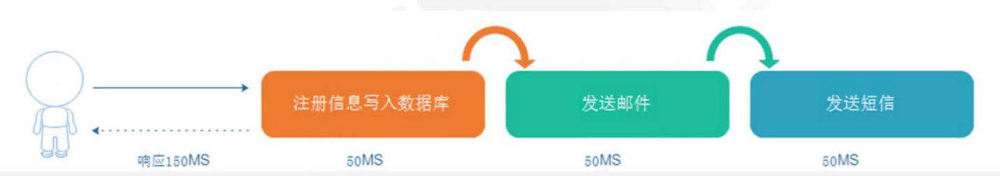

- 并行方式

  将注册信息写入数据库成功后，发送注册邮件的同时，发送注册短信。以上三个任务完成之后，响应给客户端，与串行的差别是并行的方式可以缩短程序整体处理的时间。

  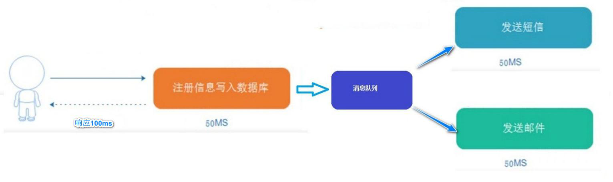

## 1.2.消息系统

消息系统负责将数据从一个应用程序传送到另一个应用程序，因此应用程序可以专注于数据，但是不必担心 如何共享它。分布式消息系统基于可靠的消息队列的概念。消息在客户端应用程序和消息传递系统之间的异步排队。


有两种类型的消息模式可用`点对点`，`发布-订阅`消息系统

- 点对点
  - 点对点消息系统中，消息被保留在队列中，一个或者多个消费者可以消费队列中的消息，但是特定的消息只能有最多的一个消费者消费。一旦消费者读取队列中的消息，他就从该队列中消失。该系统的典型应用就是订单处理系统，其中每个订单将有一个订单处理器处理，但多个订单处理器可以同时工作。
  - 主要采用的队列的方式，如A->B 当B消费的队列中的数据，那么队列的数据就会被删除掉【如果B不消费那么就会存在队列中有很多的脏数据】

- 大多数的消息系统是基于`发布-订阅`消息系统

  发布与订阅主要三大组件

  - 主题：一个消息的分类 

  - 发布者：将消息通过主动推送的方式推送给消息系统；

  - 订阅者：可以采用拉、推的方式从消息系统中获取数据

## 1.3 消息系统的应用场景

1. 应用解耦

   将一个大型的任务系统分成若干个小模块，将所有的消息进行统一的管理和存储，因此为了解耦，就会涉及到kafka企业级消息平台

2. 流量控制

   秒杀活动当中，一般会因为流量过大，应用服务器挂掉，为了解决这个问题，一般需要在应用前端加上消息队列以控制访问流量。

   - 可以控制活动的人数 可以缓解短时间内流量大使得服务器崩掉
   -  可以通过队列进行数据缓存，后续再进行消费处理

3. 日志处理

   日志处理指将消息队列用在日志处理中，比如kafka的应用中，解决大量的日志传输问题；

   日志采集工具采集 数据写入kafka中；kafka消息队列负责日志数据的接收，存储，转发功能；

   日志处理应用程序：订阅并消费 kafka队列中的数据，进行数据分析。

4. 消息通讯

   消息队列一般都内置了高效的通信机制，因此也可以用在纯的消息通讯，比如点对点的消息队列，或者聊天室等。

# 2. kafka简介

kafka是最初由linkedin公司开发的，使用scala语言编写，kafka是一个分布式，分区的，多副本的，多订阅者的日志系统（分布式MQ系统），可以用于搜索日志，监控日志，访问日志等。

- 支持的语言

  kafka目前支持多种客户端的语言：java、python、c++、php等

- apache kafka是一个分布式发布-订阅消息系统

  apache kafka是一个分布式发布-订阅消息系统和一个强大的队列，可以处理大量的数据，并使能够将消息从一个端点传递到另一个端点，kafka适合离线和在线消息消费。kafka消息保留在磁盘上，并在集群内复制以防止数据丢失。kafka构建在zookeeper同步服务之上。它与apache和spark非常好的集成，应用于实时流式数据分析。

- 其他的消息队列

  - RabbitMQ 
  - Redis 
  - ZeroMQ 
  - ActiveMQ

- kafka的好处

  - 可靠性：分布式的，分区，复制和容错的。
  - 可扩展性：kafka消息传递系统轻松缩放，无需停机。
  - 耐用性：kafka使用分布式提交日志，这意味着消息会尽可能快速的保存在磁盘上，因此它是持久的。 
  - 性能：kafka对于发布和定于消息都具有高吞吐量。即使存储了许多TB的消息，他也爆出稳定的性能。 kafka非常快：保证零停机和零数据丢失。

- kafka的应用场景

  - 指标分析

    kafka  通常用于操作监控数据。这设计聚合来自分布式应用程序的统计信息，  以产生操作的数据集中反馈

  - 日志聚合解决方法

    kafka可用于跨组织从多个服务器收集日志，并使他们以标准的合适提供给多个服务器。

  - 流式处理

    流式处理框架（spark，storm，flink）重主题中读取数据，对齐进行处理，并将处理后的数据写入新的主题，供 用户和应用程序使用，kafka的强耐久性在流处理的上下文中也非常的有用。

# 3. kafka架构

kafka官方架构图：

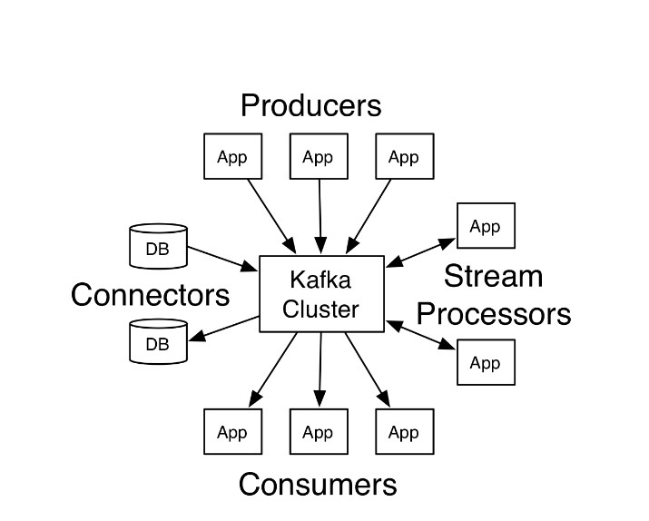

核心组件：

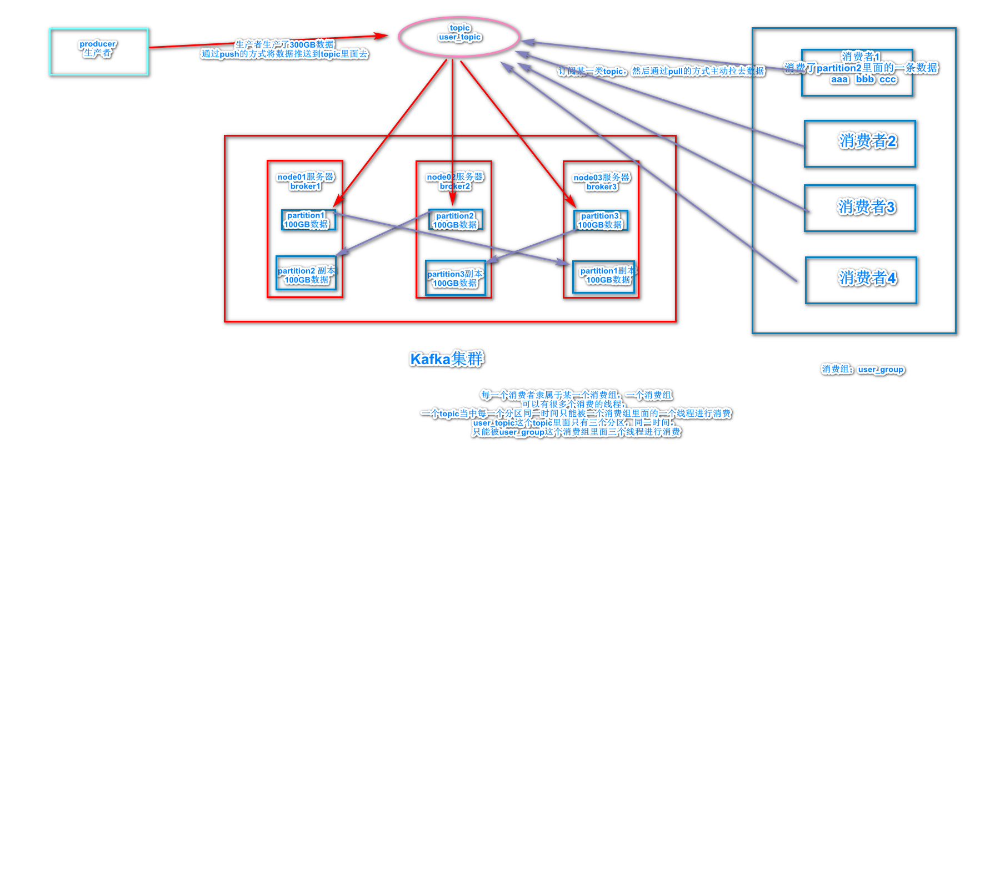

## 3.1 kafka四大核心

- 生产者

  允许应用程序发布记录流至一个或者多个kafka的主题（topics）。

- 消费者

  允许应用程序订阅一个或者多个主题，并处理这些主题接收到的记录流。

- StreamsAPI

  允许应用程序充当流处理器（stream processor），从一个或者多个主题获取输入流，并生产一个输出流到一个或 者多个主题，能够有效的变化输入流为输出流。

- ConnectorAPI

  允许构建和运行可重用的生产者或者消费者，能够把kafka主题连接到现有的应用程序或数据系统。例如：一个连 接到关系数据库的连接器可能会获取每个表的变化。

## 3.2 kafka架构关系与整体架构

架构关系：

说明：kafka支持消息持久化，消费端为拉模型来拉取数据，消费状态和订阅关系有客户端负责维护，消息消费完 后，不会立即删除，会保留历史消息。因此支持多订阅时，消息只会存储一份就可以了。

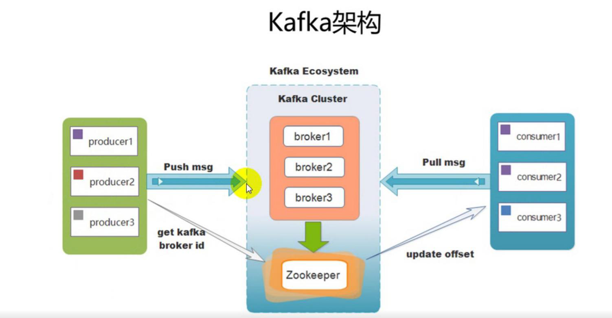

kafka整体架构：

说明：一个典型的kafka集群中包含若干个Producer，若干个Broker，若干个Consumer，以及一个zookeeper集群； kafka通过zookeeper管理集群配置，选举leader，以及在Consumer Group发生变化时进行Rebalance（负载均衡）；Producer使用push模式将消息发布到Broker；Consumer使用pull模式从Broker中订阅并消费消息。

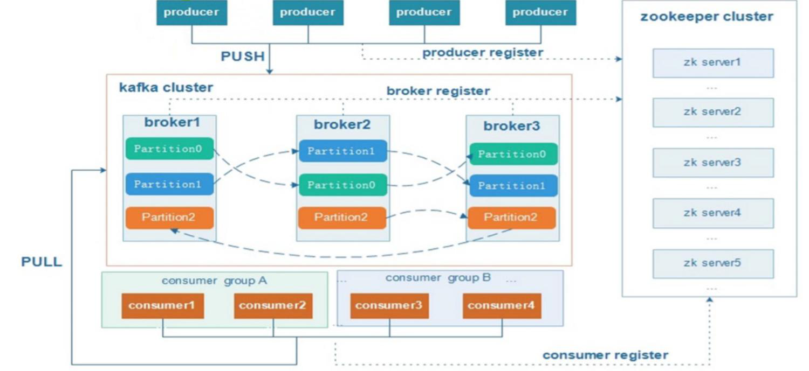

# 4. kafka中术语介绍

- Broker：kafka集群中包含一个或者多个服务实例，这种服务实例被称为Broker
- Topic：每条发布到kafka集群的消息都有一个类别，这个类别就叫做Topic 
- Partition：Partition是一个物理上的概念，每个Topic包含一个或者多个Partition 
- Producer：负责发布消息到kafka的Broker中。
- Consumer：消息消费者，向kafka的broker中读取消息的客户端
- Consumer Group：每一个Consumer属于一个特定的Consumer Group（可以为每个Consumer指定 groupName）

## 4.1 topic说明

- kafka将消息以topic为单位进行归类


- topic特指kafka处理的消息源（feeds of messages）的不同分类。


- topic是一种分类或者发布的一些列记录的名义上的名字。kafka主题始终是支持多用户订阅的；也就是说，一 个主题可以有零个，一个或者多个消费者订阅写入的数据。


- 在kafka集群中，可以有无数的主题。


- 生产者和消费者消费数据一般以主题为单位。更细粒度可以到分区级别。

## 4.2 partitions 分区数

> Partitions：分区数：控制topic将分片成多少个log，可以显示指定，如果不指定则会使用 broker（server.properties）中的num.partitions配置的数量。

- 一个broker服务下，是否可以创建多个分区？

  可以

- kafka中，每一个分区会有一个编号：这个编号从0开始

- 某一个分区的数据是有序的

  

  说明：数据是有序的 

- 如何保证一个主题下的数据是有序的？（生产是什么样的顺序，那么消费的时候也是什么样的顺序）

  一个主题（topic）下面有一个分区（partition）即可

- topic的Partition数量在创建topic时配置。

- Partition数量决定了每个Consumer group中并发消费者的最大数量。

- Consumer group A 有两个消费者来读取4个partition中数据；Consumer group B有四个消费者来读取4个 partition中的数据

  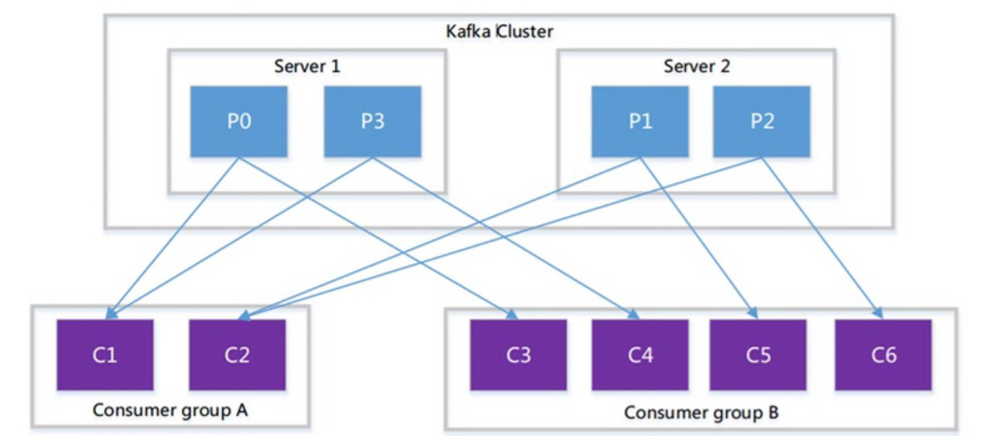

## 4.3 Partition Replication 副本数

- kafka分区副本数（kafka Partition Replicas)

  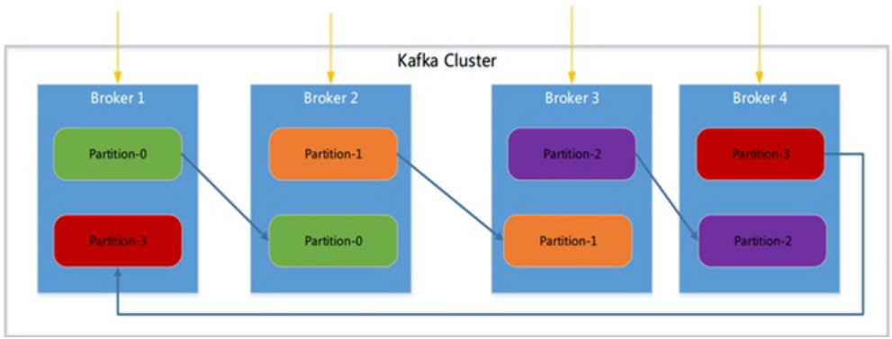

- 副本数（replication-factor）

  控制消息保存在几个broker（服务器）上，一般情况下等于broker的个数

- 一个broker服务下，是否可以创建多个副本因子？

  不可以，创建主题时，副本因子应该小于等于可用的broker数


副本因子过程图：

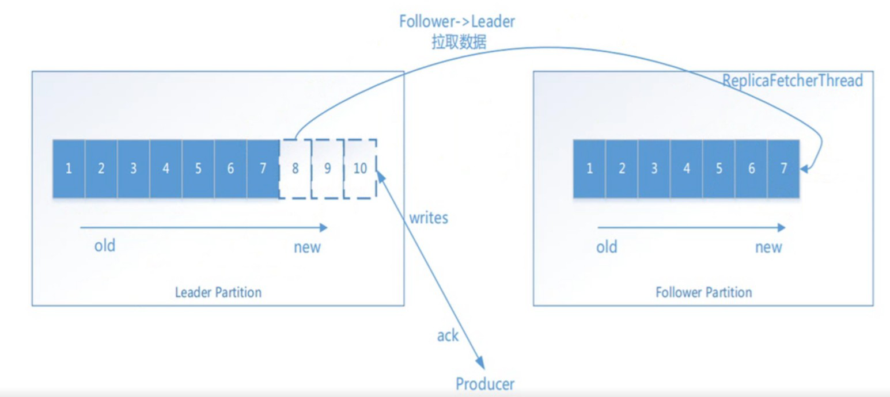

副本因子操作以分区为单位的。每个分区都有各自的主副本和从副本；主副本叫做leader，从副本叫做 follower（在有多个副本的情况下，kafka会为同一个分区下的分区，设定角色关系：一个leader和N个 follower），处于同步状态的副本叫做in-sync-replicas(ISR);follower通过拉的方式从leader同步数据。消费 者和生产者都是从leader读写数据，不与follower交互。

- 副本因子的作用：让kafka读取数据和写入数据时的可靠性。
- 副本因子是包含本身同一个副本因子不能放在同一个Broker中。
- 如果某一个分区有三个副本因子，就算其中一个挂掉，那么只会剩下的两个钟，选择一个leader，但不会在其 他的broker中，另启动一个副本（因为在另一台启动的话，存在数据传递，只要在机器之间有数据传递，就 会长时间占用网络IO，kafka是一个高吞吐量的消息系统，这个情况不允许发生）所以不会在零个broker中启 动。
- 如果所有的副本都挂了，生产者如果生产数据到指定分区的话，将写入不成功。
- lsr表示：当前可用的副本

## 4.4 kafka partition offset 偏移量

任何发布到此partition的消息都会被直接追加到log文件的尾部，每条消息在文件中的位置称为offset（偏移量），offset是一个long类型数字，它唯一标识了一条消息，消费者通过（offset，partition，topic）跟踪记录。

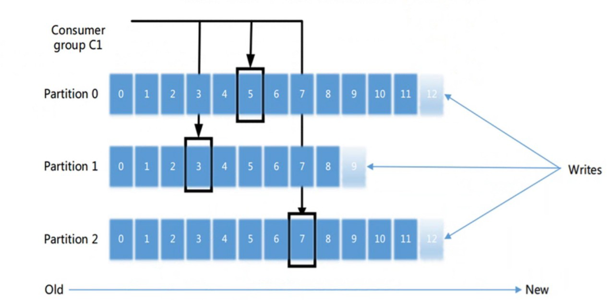

## 4.5 kafka分区和消费者组之间的关系

消费组： 由一个或者多个消费者组成，同一个组中的消费者对于同一条消息只消费一次。

某一个主题下的分区数，对于消费组来说，应该小于等于该主题下的分区数。如下所示：

> 如：某一个主题有4个分区，那么消费组中的消费者应该小于4，而且最好与分区数成整数倍
>
> 1	2	4
>
> 同一个分区下的数据，在同一时刻，不能同一个消费组的不同消费者消费

总结：分区数越多，同一时间可以有越多的消费者来进行消费，消费数据的速度就会越快，提高消费的性能

# 5. kafka集群搭建

## 5.1 初始化安装环境

需要安装jdk和zookeeper

**注：**保证三台机器的zk服务都正常启动，且正常运行，查看zk的运行装填，保证有一台zk的服务状态为leader，且两台为follower即可

## 5.2 上传安装包并解压

下载地址：

http://archive.apache.org/dist/kafka/0.10.0.0/kafka_2.11-0.10.0.0.tgz

```
tar -zxvf kafka_2.11-0.10.0.0.tgz -C /opt/module
```

## 5.3 修改配置文件

```
cd /opt/module/kafka_2.11-0.10.0.0/config
vim server.properties

broker.id=0
log.dirs=/opt/module/kafka_2.11-0.10.0.0/logs
zookeeper.connect=bigdata111:2181,bigdata222:2181,bigdata333:2181
新增：
delete.topic.enable=true
host.name=bigdata111
```

在kafka根目录下创建logs目录用于存放数据文件

```
mkdir logs
```

## 5.4  分发安装包

将bigdata111上的安装包分发至其他两台服务器

```
scp -r kafka_2.11-0.10.0.0/ root@bigdata222:/opt/module
scp -r kafka_2.11-0.10.0.0/ root@bigdata333:/opt/module
```

## 5.5 另外两台服务器修改配置文件

bigdata222

```
cd /opt/module/kafka_2.11-0.10.0.0/config
vim server.properties

broker.id=1
log.dirs=/opt/module/kafka_2.11-0.10.0.0/logs
zookeeper.connect=bigdata111:2181,bigdata222:2181,bigdata333:2181
delete.topic.enable=true
host.name=bigdata222
```

bigdata333

```
cd /opt/module/kafka_2.11-0.10.0.0/config
vim server.properties

broker.id=2
log.dirs=/opt/module/kafka_2.11-0.10.0.0/logs
zookeeper.connect=bigdata111:2181,bigdata222:2181,bigdata333:2181
delete.topic.enable=true
host.name=bigdata333
```

## 5.6 启动集群

启动kafka之前，需要先启动zookeeper服务

```
zkServer.sh start
```

1. 前台启动

   三台

   ```
   bin/kafka-server-start.sh config/server.properties
   ```

2. 后台启动

   三台

   ```
   nohup bin/kafka-server-start.sh config/server.properties 2>&1 &
   ```

3. 停止

   ```
   bin/kafka-server-stop.sh
   ```

可通过jps查看进程，检查是否启动

# 6. kafka集群操作

## 6.1 控制台操作

1. 创建一个topic

   创建了一个名字为test的主题， 有三个分区，有两个副本

   ```shell
   bin/kafka-topics.sh --create  --partitions 3 --replication-factor 2 --topic test --zookeeper bigdata111:2181,bigdata222:2181,bigdata333:2181
   ```

2. 查看主题

   查看kafka当中存在的主题

   ```shell
   bin/kafka-topics.sh --list --zookeeper  bigdata111:2181,bigdata222:2181,bigdata333:2181
   ```

3. 生产者生产数据

   模拟生产者来生产数据

   ```shell
   bin/kafka-console-producer.sh --broker-list  bigdata111:2181,bigdata222:2181,bigdata333:2181 --topic test
   ```

4. 消费者消费数据

   执行以下命令来模拟消费者进行消费数据

   ```shell
   bin/kafka-console-consumer.sh --from-beginning  --topic test --zookeeper  bigdata111:2181,bigdata222:2181,bigdata333:2181
   ```

5. 查看topic的相关信息

   ```shell
   bin/kafka-topics.sh --describe  --topic test --zookeeper  bigdata111:2181
   ```

   结果说明：

   > 这是输出的解释。第一行给出了所有分区的摘要，每个附加行提供有关一个分区的信息。由于我们只有一个分 区用于此主题，因此只有一行。
   >
   > “leader”是负责给定分区的所有读取和写入的节点。每个节点将成为随机选择的分区部分的领导者。（因为在kafka中 如果有多个副本的话，就会存在leader和follower的关系，表示当前这个副本为leader所在的broker是哪一个） 
   >
   > “replicas”是复制此分区日志的节点列表，无论它们是否为领导者，或者即使它们当前处于活动状态。（所有副本列表   0 ，1,2） 
   >
   > “isr”是“同步”复制品的集合。这是副本列表的子集，该列表当前处于活跃状态并且已经被领导者捕获。（可用的列表 数）

6. 修改topic属性

   - 增加topic分区数

     ```shell
     bin/kafka-topics.sh --zookeeper  bigdata111:2181,bigdata222:2181,bigdata333:2181 --alter --topic test --partitions 8
     ```

   - 增加配置

     ```shell
     bin/kafka-topics.sh --zookeeper bigdata111:2181 --alter --topic test --config flush.messages=1
     ```

   - 删除配置

     ```shell
     bin/kafka-topics.sh --zookeeper bigdata111:2181 --alter --topic test --delete-config flush.messages
     ```

   - 删除topic

     目前删除topic在默认情况下知识打上一个删除的标记，在重新启动kafka后才删除。如果需要立即删除，则需要在

     `server.properties`中配置：

     ```
     delete.topic.enable=true
     ```

     然后执行以下命令进行删除topic

     ```shell
      bin/kafka-topics.sh --zookeeper bigdata111:2181 --delete --topic test
     ```

     

## 6.2 JavaAPI操作

### 6.2.1 添加依赖

```xml
<dependencies>
    <dependency>
        <groupId>org.apache.kafka</groupId>
        <artifactId>kafka-clients</artifactId>
        <version>0.10.0.0</version>
    </dependency>
    <dependency>
        <groupId>org.apache.kafka</groupId>
        <artifactId>kafka-streams</artifactId>
        <version>0.10.0.0</version>
    </dependency>
</dependencies>

<build>
    <plugins>
        <!-- java编译插件 -->
        <plugin>
            <groupId>org.apache.maven.plugins</groupId>
            <artifactId>maven-compiler-plugin</artifactId>
            <version>3.2</version>
            <configuration>
                <source>1.8</source>
                <target>1.8</target>
                <encoding>UTF-8</encoding>
            </configuration>
        </plugin>
    </plugins>
</build>
```

### 6.2.2 生产者

```java
package kafka;

import org.apache.kafka.clients.producer.KafkaProducer;
import org.apache.kafka.clients.producer.ProducerRecord;


import java.util.Properties;

/**
 * @Class:kafka.kafka.OrderProducer
 * @Descript:
 * @Author:宋天
 * @Date:2020/1/15
 */
public class MyProducer {
    /**
     * 实现生产数据到kafka test这个topic里面去
     * @param args
     */
    public static void main(String[] args) {
        Properties props = new Properties(); props.put("bootstrap.servers", "bigdata111:9092"); props.put("acks", "all");
        props.put("acks","all");
        props.put("retries", 0);
        props.put("batch.size", 16384);
        props.put("linger.ms", 1);
        props.put("buffer.memory", 33554432);
        props.put("key.serializer",
                "org.apache.kafka.common.serialization.StringSerializer");
        props.put("value.serializer",
                "org.apache.kafka.common.serialization.StringSerializer");

//        获取kafka producer这个类
        KafkaProducer<String, String> KafkaProducer = new KafkaProducer<>(props);
        for (int i = 0; i < 1000; i++) {
//          使用循环发送消息
            KafkaProducer.send(new ProducerRecord<>("test","mymessage" + i));
        }
//      关闭生产者
        KafkaProducer.close();

    }
}

```

### 6.2.3 消费者

消息的消费分为两种方式：

offset：offset记录了每个分区里面的消息消费到了哪一条，下一次来的时候，我们继续从上一次的记录接着消费

- 自动提交offset：

  ```java
  package kafka;
  
  import org.apache.kafka.clients.consumer.ConsumerRecord;
  import org.apache.kafka.clients.consumer.ConsumerRecords;
  import org.apache.kafka.clients.consumer.KafkaConsumer;
  
  import java.util.Arrays;
  import java.util.Properties;
  
  /**
   * @Class:kafka.kafka.AutomaticConsumer
   * @Descript:
   * @Author:宋天
   * @Date:2020/1/15
   */
  public class AutomaticConsumer {
      /**
       * 自动提交offset
       * @param args
       */
      public static void main(String[] args) {
          Properties props = new Properties();
          props.put("bootstrap.servers", "bigdata111:9092");
          props.put("group.id", "test_group");  //消费组
          props.put("enable.auto.commit", "true");//允许自动提交offset
          props.put("auto.commit.interval.ms", "1000");//每隔多久自动提交offset
          props.put("session.timeout.ms", "30000");
          //指定key，value的反序列化类
          props.put("key.deserializer", "org.apache.kafka.common.serialization.StringDeserializer");
          props.put("value.deserializer", "org.apache.kafka.common.serialization.StringDeserializer");
  
          KafkaConsumer<String, String> kafkaConsumer = new KafkaConsumer<>(props);
  
          //指定消费哪个topic里面的数据
          kafkaConsumer.subscribe(Arrays.asList("test"));
          //使用死循环来消费test这个topic里面的数据
          while (true){
              //这里面是我们所有拉取到的数据
              ConsumerRecords<String, String> consumerRecords = kafkaConsumer.poll(1000);
              for (ConsumerRecord<String, String> consumerRecord : consumerRecords) {
                  long offset = consumerRecord.offset();
                  String value = consumerRecord.value();
                  System.out.println("消息的offset值为"+offset +"消息的value值为"+ value);
              }
  
          }
      }
  }
  
  ```

  

- 手动提交offset：

  ```java
  package kafka;
  
  import org.apache.kafka.clients.consumer.ConsumerRecord;
  import org.apache.kafka.clients.consumer.ConsumerRecords;
  import org.apache.kafka.clients.consumer.KafkaConsumer;
  
  import java.util.ArrayList;
  import java.util.Arrays;
  import java.util.List;
  import java.util.Properties;
  
  /**
   * @Class:kafka.kafka.MannualConsumer
   * @Descript:
   * @Author:宋天
   * @Date:2020/1/15
   */
  public class MannualConsumer {
      /**
       * 实现手动的提交offset
       * @param args
       */
      public static void main(String[] args) {
          Properties props = new Properties();
          props.put("bootstrap.servers", "bigdata111:9092");
          props.put("group.id", "test_group");
          props.put("enable.auto.commit", "false"); //禁用自动提交offset，后期我们手动提交offset
          props.put("auto.commit.interval.ms", "1000");
          props.put("session.timeout.ms", "30000");
          props.put("key.deserializer", "org.apache.kafka.common.serialization.StringDeserializer");
          props.put("value.deserializer", "org.apache.kafka.common.serialization.StringDeserializer");
          KafkaConsumer<String, String> kafkaConsumer = new KafkaConsumer<>(props);
          kafkaConsumer.subscribe(Arrays.asList("test"));  //订阅test这个topic
          int minBatchSize = 200;  //达到200条进行批次的处理，处理完了之后，提交offset
          List<ConsumerRecord<String, String>> consumerRecordList = new ArrayList<>();//定义一个集合，用于存储我们的ConsumerRecorder
          while (true){
  
              ConsumerRecords<String, String> consumerRecords = kafkaConsumer.poll(1000);
              for (ConsumerRecord<String, String> consumerRecord : consumerRecords) {
                  consumerRecordList.add(consumerRecord);
              }
              if(consumerRecordList.size() >=  minBatchSize){
                  //如果集合当中的数据大于等于200条的时候，我们批量进行处理
                  //将这一批次的数据保存到数据库里面去
                  //insertToDb(consumerRecordList);
                  System.out.println("手动提交offset的值");
                  //提交offset，表示这一批次的数据全部都处理完了
                  // kafkaConsumer.commitAsync();  //异步提交offset值
                  kafkaConsumer.commitSync();//同步提交offset的值
                  consumerRecordList.clear();//清空集合当中的数据
              }
          }
      }
  }
  ```

  

### 6.2.4 kafka Streams API开发

需求：使用StreamAPI获取test这个topic当中的数据，然后将数据全部转为大写，写入到test2这个topic当中去

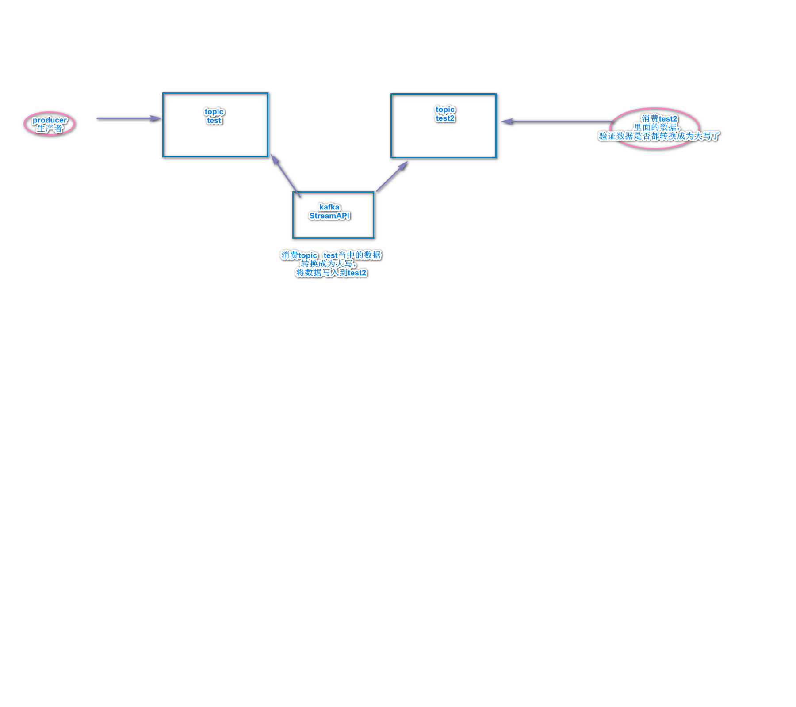


1. 创建一个topic

   ```shell
   bin/kafka-topics.sh --create  --partitions 3 --replication-factor 2 --topic test2 --zookeeper bigdata111:2181,bigdata222:2181,bigdata333:2181
   ```

2. StreamAPI代码

   ```java
   package kafka;
   
   import org.apache.kafka.common.serialization.Serdes;
   import org.apache.kafka.streams.KafkaStreams;
   import org.apache.kafka.streams.StreamsConfig;
   import org.apache.kafka.streams.kstream.KStreamBuilder;
   
   import java.util.Properties;
   
   /**
    * @Class:kafka.kafka.Stream
    * @Descript:
    * @Author:宋天
    * @Date:2020/1/15
    */
   public class Stream {
       /**
        * 通过streamAPI实现将数据从test里面读取出来，写入到test2里面去
        * @param args
        */
       public static void main(String[] args) {
   
           Properties properties = new Properties();
           properties.put(StreamsConfig.APPLICATION_ID_CONFIG,"bigger");
           properties.put(StreamsConfig.BOOTSTRAP_SERVERS_CONFIG,"bigdata111:9092");
           properties.put(StreamsConfig.KEY_SERDE_CLASS_CONFIG, Serdes.String().getClass());//key的序列化和反序列化的类
           properties.put(StreamsConfig.VALUE_SERDE_CLASS_CONFIG,Serdes.String().getClass());
           //获取核心类 KStreamBuilder
           KStreamBuilder kStreamBuilder = new KStreamBuilder();
           //通过KStreamBuilder调用stream方法表示从哪个topic当中获取数据
           //调用mapValues方法，表示将每一行value都给取出来
           //line表示我们取出来的一行行的数据
           //将转成大写的数据，写入到test2这个topic里面去
           kStreamBuilder.stream("test").mapValues(line -> line.toString().toUpperCase()).to("test2");
           //通过kStreamBuilder可以用于创建KafkaStream  通过kafkaStream来实现流失的编程启动
           KafkaStreams kafkaStreams = new KafkaStreams(kStreamBuilder, properties);
           kafkaStreams.start();  //调用start启动kafka的流 API
       }
   
   }
   
   ```

3. 生产数据

   ```shell
   bin/kafka-console-producer.sh --broker-list bigdata111:2181,bigdata222:2181,bigdata333:2181 --topic test
   ```

4. 消费数据

   ```
   bin/kafka-console-consumer.sh --from-beginning  --topic test2 --zookeeper bigdata111:2181,bigdata222:2181,bigdata333:2181
   ```

# 7.kafka原理部分

## 7.1 生产者

生产者是一个向kafka Cluster发布记录的客户端；**生产者是线程安全的**，跨线程共享单个生产者实例通常比具有多个实例更快。

生产者原理：主要就是研究如何将数据写入到kafka集群里面去，写入到某一个topic里面去之后，如何确定数据写入到哪一个分区里面去

生产者要进行生产数据到kafka  Cluster中，必要条件有以下三个：

```shell
#1、地址
bootstrap.servers=bigdata111:9092
#2、序列化 
key.serializer=org.apache.kafka.common.serialization.StringSerializer value.serializer=org.apache.kafka.common.serialization.StringSerializer
#3、主题（topic） 需要制定具体的某个topic（order）即可。
```

### 7.1.1 生产者写数据流程

生产者（Producer）写数据流程图：

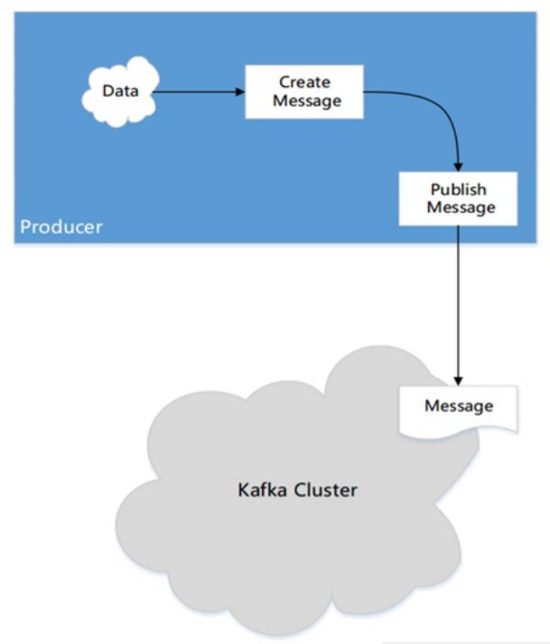

描述：

1. Producer连接任意活着的Broker，请求指定Topic，Partion的Leader元数据信息，然后直接与对应的Broker直接连接，发布数据

2. 开放分区接口（生产者数据分发策略）

   - 用户可以指定分区函数，使得消息可以根据key，发送到指定的Partition中。

   - kafka在数据生产的时候，有一个数据分发策略。默认的情况使用DefaultPartitioner.class类。 这个类中就定义数据分发的策略。

   - 如果是用户制定了partition，生产就不会调用DefaultPartitioner.partition()方法

   - 当用户指定key，使用hash算法。如果key一直不变，同一个key算出来的hash值是个固定值。如果是固定 值，这种hash取模就没有意义。

   - 当用户既没有指定partition也没有key：

     ```
     /**
      * The default partitioning strategy:
      * <ul>
      * <li>If a partition is specified in the record, use it
      * <li>If no partition is specified but a key is present choose a partition based on a hash of the key
      * <li>If no partition or key is present choose a partition in a round-robin fashion
      */
     ```

   - 数据分发策略的时候，可以指定数据发往哪个partition。当ProducerRecord 的构造参数中有partition的时 候，就可以发送到对应partition上。

### 7.1.2 生产者数据分发策略

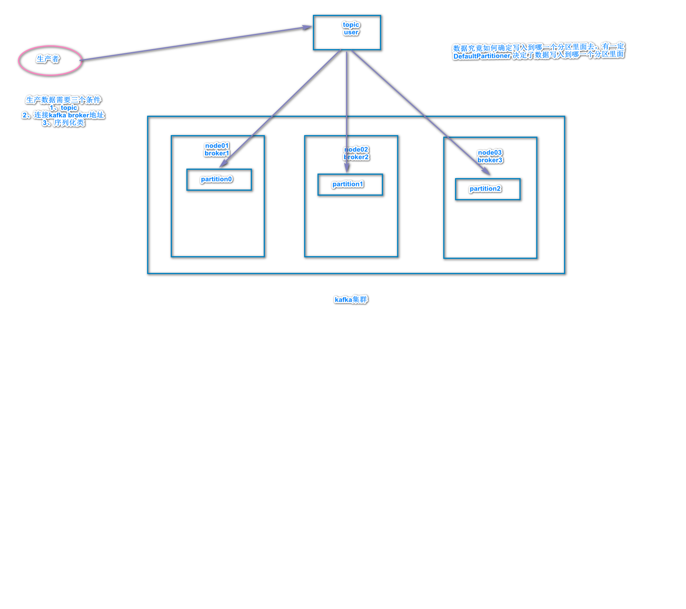

生产者数据分发策略有如下四种：(总的来说就是调用了一个方法，参数不同而已)

```java
//可根据主题和内容发送
public ProducerRecord(String topic, V value)
//根据主题，key、内容发送
public ProducerRecord(String topic, K key, V value)
//根据主题、分区、key、内容发送
public ProducerRecord(String topic, Integer partition, K key, V value)
//根据主题、分区、时间戳、key，内容发送
public ProducerRecord(String topic, Integer partition, Long timestamp, K key, V value)
```

演示：

```java
package kafka.partition;

import org.apache.kafka.clients.producer.KafkaProducer;
import org.apache.kafka.clients.producer.ProducerRecord;

import java.util.Properties;

public class PartitionProducer {

    /**
     * kafka生产数据 通过不同的方式，将数据写入到不同的分区里面去
     *
     * @param args
     */
    public static void main(String[] args) {
        Properties props = new Properties();
        props.put("bootstrap.servers", "bigdata111:9092");
        props.put("acks", "all");
        props.put("retries", 0);
        props.put("batch.size", 16384);
        props.put("linger.ms", 1);
        props.put("buffer.memory", 33554432);
        props.put("key.serializer", "org.apache.kafka.common.serialization.StringSerializer");
        props.put("value.serializer", "org.apache.kafka.common.serialization.StringSerializer");

        //配置我们自定义分区类
        props.put("partitioner.class","cn.itcast.kafka.partition.MyPartitioner");


        //获取kafakProducer这个类
        KafkaProducer<String, String> kafkaProducer = new KafkaProducer<>(props);
        //使用循环发送消息
        for(int i =0;i<100;i++){
            //分区策略第一种，如果既没有指定分区号，也没有指定数据key，那么就会使用轮询的方式将数据均匀的发送到不同的分区里面去
            //ProducerRecord<String, String> producerRecord1 = new ProducerRecord<>("mypartition", "mymessage" + i);
            //kafkaProducer.send(producerRecord1);
            
            //第二种分区策略 如果没有指定分区号，指定了数据key，通过key.hashCode  % numPartitions来计算数据究竟会保存在哪一个分区里面
            //注意：如果数据key，没有变化   key.hashCode % numPartitions  =  固定值  所有的数据都会写入到某一个分区里面去
            //ProducerRecord<String, String> producerRecord2 = new ProducerRecord<>("mypartition", "mykey", "mymessage" + i);
            //kafkaProducer.send(producerRecord2);
            
            //第三种分区策略：如果指定了分区号，那么就会将数据直接写入到对应的分区里面去
          //  ProducerRecord<String, String> producerRecord3 = new ProducerRecord<>("mypartition", 0, "mykey", "mymessage" + i);
           // kafkaProducer.send(producerRecord3);
            
            //第四种分区策略：自定义分区策略。如果不自定义分区规则，那么会将数据使用轮询的方式均匀的发送到各个分区里面去
            kafkaProducer.send(new ProducerRecord<String, String>("mypartition","mymessage"+i));
        }
        //关闭生产者
        kafkaProducer.close();
    }

}

```

自定义分区类代码：

```java
package kafka.partition;

import org.apache.kafka.clients.producer.Partitioner;
import org.apache.kafka.common.Cluster;

import java.util.Map;

public class MyPartitioner implements Partitioner {
    /*
    这个方法就是确定数据到哪一个分区里面去
    直接return  2 表示将数据写入到2号分区里面去
     */
    @Override
    public int partition(String topic, Object key, byte[] keyBytes, Object value, byte[] valueBytes, Cluster cluster) {
        return 2;
    }

    @Override
    public void close() {

    }

    @Override
    public void configure(Map<String, ?> configs) {

    }
}

```


## 7.2 消费者

消费者是一个从kafka Cluster中消费数据的一个客户端；该客户端可以处理kafka brokers中的故障问题，并且可以适应在集群内的迁移的topic分区；该客户端还允许消费者组使用消费者组来进行负载均衡。

消费者维持一个TCP的长连接来获取数据，使用后未能正常关闭这些消费者问题会出现，因此**消费者不是线程安全的。**

消费模型图：

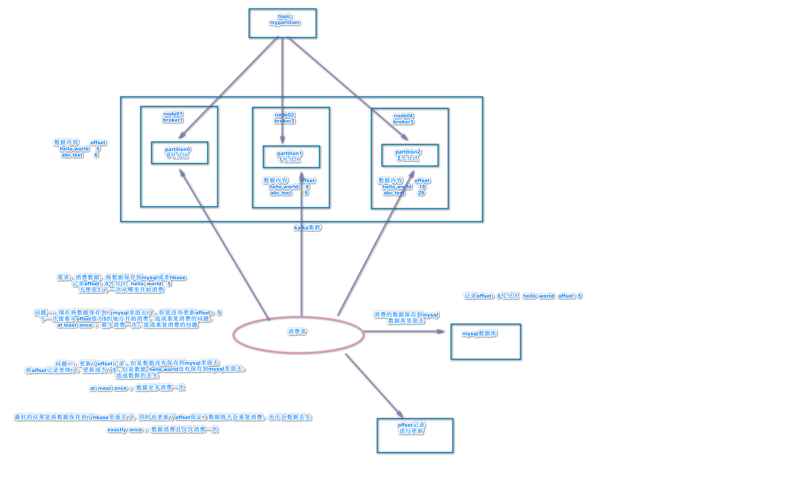

消费者要从kafka  Cluster进行消费数据，必要条件有以下四个：

```shell
#1、地址
bootstrap.servers=node01:9092
#2、序列化 
key.serializer=org.apache.kafka.common.serialization.StringSerializer value.serializer=org.apache.kafka.common.serialization.StringSerializer
#3、主题（topic） 需要制定具体的某个topic（order）即可。
#4、消费者组 group.id=test
```

### 7.2.1 自动提交offset

```java
package kafka;

import org.apache.kafka.clients.consumer.ConsumerRecord;
import org.apache.kafka.clients.consumer.ConsumerRecords;
import org.apache.kafka.clients.consumer.KafkaConsumer;

import java.util.Arrays;
import java.util.Properties;

/**
 * @Class:kafka.kafka.AutomaticConsumer
 * @Descript:
 * @Author:宋天
 * @Date:2020/1/15
 */
public class AutomaticConsumer {
    /**
     * 自动提交offset
     * @param args
     */
    public static void main(String[] args) {
        Properties props = new Properties();
        props.put("bootstrap.servers", "bigdata111:9092");
        props.put("group.id", "test_group");  //消费组
        props.put("enable.auto.commit", "true");//允许自动提交offset
        props.put("auto.commit.interval.ms", "1000");//每隔多久自动提交offset
        props.put("session.timeout.ms", "30000");
        //指定key，value的反序列化类
        props.put("key.deserializer", "org.apache.kafka.common.serialization.StringDeserializer");
        props.put("value.deserializer", "org.apache.kafka.common.serialization.StringDeserializer");

        KafkaConsumer<String, String> kafkaConsumer = new KafkaConsumer<>(props);

        //指定消费哪个topic里面的数据
        kafkaConsumer.subscribe(Arrays.asList("test"));
        //使用死循环来消费test这个topic里面的数据
        while (true){
            //这里面是我们所有拉取到的数据
            ConsumerRecords<String, String> consumerRecords = kafkaConsumer.poll(1000);
            for (ConsumerRecord<String, String> consumerRecord : consumerRecords) {
                long offset = consumerRecord.offset();
                String value = consumerRecord.value();
                System.out.println("消息的offset值为"+offset +"消息的value值为"+ value);
            }

        }
    }
}

```


### 7.2.2 手动提交offset

```java
package kafka;

import org.apache.kafka.clients.consumer.ConsumerRecord;
import org.apache.kafka.clients.consumer.ConsumerRecords;
import org.apache.kafka.clients.consumer.KafkaConsumer;

import java.util.ArrayList;
import java.util.Arrays;
import java.util.List;
import java.util.Properties;

/**
 * @Class:kafka.kafka.MannualConsumer
 * @Descript:
 * @Author:宋天
 * @Date:2020/1/15
 */
public class MannualConsumer {
    /**
     * 实现手动的提交offset
     * @param args
     */
    public static void main(String[] args) {
        Properties props = new Properties();
        props.put("bootstrap.servers", "bigdata111:9092");
        props.put("group.id", "test_group");
        props.put("enable.auto.commit", "false"); //禁用自动提交offset，后期我们手动提交offset
        props.put("auto.commit.interval.ms", "1000");
        props.put("session.timeout.ms", "30000");
        props.put("key.deserializer", "org.apache.kafka.common.serialization.StringDeserializer");
        props.put("value.deserializer", "org.apache.kafka.common.serialization.StringDeserializer");
        KafkaConsumer<String, String> kafkaConsumer = new KafkaConsumer<>(props);
        kafkaConsumer.subscribe(Arrays.asList("test"));  //订阅test这个topic
        int minBatchSize = 200;  //达到200条进行批次的处理，处理完了之后，提交offset
        List<ConsumerRecord<String, String>> consumerRecordList = new ArrayList<>();//定义一个集合，用于存储我们的ConsumerRecorder
        while (true){

            ConsumerRecords<String, String> consumerRecords = kafkaConsumer.poll(1000);
            for (ConsumerRecord<String, String> consumerRecord : consumerRecords) {
                consumerRecordList.add(consumerRecord);
            }
            if(consumerRecordList.size() >=  minBatchSize){
                //如果集合当中的数据大于等于200条的时候，我们批量进行处理
                //将这一批次的数据保存到数据库里面去
                //insertToDb(consumerRecordList);
                System.out.println("手动提交offset的值");
                //提交offset，表示这一批次的数据全部都处理完了
                // kafkaConsumer.commitAsync();  //异步提交offset值
                kafkaConsumer.commitSync();//同步提交offset的值
                consumerRecordList.clear();//清空集合当中的数据
            }
        }
    }
}
```

### 7.2.3 完成处理每个分区中的记录后提交偏移量

```java
package kafka.consumer;

import org.apache.kafka.clients.consumer.ConsumerRecord;
import org.apache.kafka.clients.consumer.ConsumerRecords;
import org.apache.kafka.clients.consumer.KafkaConsumer;
import org.apache.kafka.clients.consumer.OffsetAndMetadata;
import org.apache.kafka.common.TopicPartition;

import java.util.*;

public class ConmsumerPartition {

    /**
     * 处理完每一个分区里面的数据，就马上提交这个分区里面的数据
     * @param args
     */
    public static void main(String[] args) {
        Properties props = new Properties();
        props.put("bootstrap.servers", "bigdata111:9092");
        props.put("group.id", "test_group");
        props.put("enable.auto.commit", "false"); //禁用自动提交offset，后期我们手动提交offset
        props.put("auto.commit.interval.ms", "1000");
        props.put("session.timeout.ms", "30000");
        props.put("key.deserializer", "org.apache.kafka.common.serialization.StringDeserializer");
        props.put("value.deserializer", "org.apache.kafka.common.serialization.StringDeserializer");
        KafkaConsumer<String, String> kafkaConsumer = new KafkaConsumer<>(props);
        kafkaConsumer.subscribe(Arrays.asList("mypartition"));
        while (true){
            //通过while ture进行消费数据
            ConsumerRecords<String, String> records = kafkaConsumer.poll(1000);
            //获取mypartition这个topic里面所有的分区
            Set<TopicPartition> partitions = records.partitions();
            //循环遍历每一个分区里面的数据，然后将每一个分区里面的数据进行处理，处理完了之后再提交每一个分区里面的offset
            for (TopicPartition partition : partitions) {
                //获取每一个分区里面的数据
                List<ConsumerRecord<String, String>> records1 = records.records(partition);
                for (ConsumerRecord<String, String> record : records1) {
                    System.out.println(record.value()+"===="+ record.offset());
                }
                //获取我们分区里面最后一条数据的offset，表示我们已经消费到了这个offset了
                long offset = records1.get(records1.size() - 1).offset();
                //提交offset
                //提交我们的offset，并且给offset加1  表示我们下次从没有消费的那一条数据开始消费
                kafkaConsumer.commitSync(Collections.singletonMap(partition,new OffsetAndMetadata(offset + 1)));
            }
        }
    }
}

```

注意事项：

提交的偏移量应始终是应用程序将读取的下一条消息的偏移量。 因此，在调用commitSync（偏移量）时，应该 在最后处理的消息的偏移量中添加一个

### 7.2.4 实现消费一个topic里面某些分区里面的数据

1. 如果进程正在维护与该分区关联的某种本地状态（如本地磁盘上的键值存储），那么它应该只获取它在磁盘上 维护的分区的记录。
2. 如果进程本身具有高可用性，并且如果失败则将重新启动（可能使用YARN，Mesos或AWS工具等集群管理框 架，或作为流处理框架的一部分）。 在这种情况下，Kafka不需要检测故障并重新分配分区，因为消耗过程将在另一台机器上重新启动。

```java
package kafka.consumer;

import org.apache.kafka.clients.consumer.ConsumerRecord;
import org.apache.kafka.clients.consumer.ConsumerRecords;
import org.apache.kafka.clients.consumer.KafkaConsumer;
import org.apache.kafka.common.TopicPartition;

import java.util.Arrays;
import java.util.Properties;

public class ConsumerSomePartition {
    //实现消费一个topic里面某些分区里面的数据
    public static void main(String[] args) {

        Properties props = new Properties();
        props.put("bootstrap.servers", "bigdata111:9092,bigdata222:9092,bigdata333:9092");
        props.put("group.id", "test_group");  //消费组
        props.put("enable.auto.commit", "true");//允许自动提交offset
        props.put("auto.commit.interval.ms", "1000");//每隔多久自动提交offset
        props.put("session.timeout.ms", "30000");
        //指定key，value的反序列化类
        props.put("key.deserializer", "org.apache.kafka.common.serialization.StringDeserializer");
        props.put("value.deserializer", "org.apache.kafka.common.serialization.StringDeserializer");

        //获取kafkaConsumer
        KafkaConsumer<String, String> consumer = new KafkaConsumer<>(props);

        //通过consumer订阅某一个topic，进行消费.会消费topic里面所有分区的数据
       // consumer.subscribe();

        //通过调用assign方法实现消费mypartition这个topic里面的0号和1号分区里面的数据

        TopicPartition topicPartition0 = new TopicPartition("mypartition", 0);
        TopicPartition topicPartition1 = new TopicPartition("mypartition", 1);
        //订阅我们某个topic里面指定分区的数据进行消费
        consumer.assign(Arrays.asList(topicPartition0,topicPartition1));

        int i =0;
        while(true){
            ConsumerRecords<String, String> records = consumer.poll(1000);
            for (ConsumerRecord<String, String> record : records) {
                i++;
                System.out.println("数据值为"+ record.value()+"数据的offset为"+ record.offset());
                System.out.println("消费第"+i+"条数据");
            }

        }
    }
}

```

注意事项：

1、要使用此模式，您只需使用要使用的分区的完整列表调用assign（Collection），而不是使用subscribe订阅 主题。

2、主题与分区订阅只能二选一

### 7.2.5 消费者数据丢失-数据重复

kafka当中数据消费模型：

- exactly once：消费且仅仅消费一次，可以在事务里面执行kafka的操作


- at  most  once：至多消费一次，数据丢失的问题


- at  least  once ：至少消费一次，数据重复消费的问题

说明：

1. 已经消费的数据对于kafka来说，会将消费组里面的offset值进行修改，那什么时候进行修改了？

   是在数据消费 完成之后，比如在控制台打印完后自动提交；

2. 提交过程：

   是通过kafka将offset进行移动到下个message所处的offset的位置。

3. 拿到数据后，存储到hbase中或者mysql中，如果hbase或者mysql在这个时候连接不上，就会抛出异常，如果在处理数据的时候已经进行了提交，那么kafka伤的offset值已经进行了修改了，但是hbase或者mysql中没有数据，这个时候就会出现**数据丢失**。

4. 什么时候提交offset值？

   在Consumer将数据处理完成之后，再来进行offset的修改提交。默认情况下offset是 自动提交，需要修改为手动提交offset值。

5. 如果在处理代码中正常处理了，但是在提交offset请求的时候，没有连接到kafka或者出现了故障，那么该次修 改offset的请求是失败的，那么下次在进行读取同一个分区中的数据时，会从已经处理掉的offset值再进行处理一 次，那么在hbase中或者mysql中就会产生两条一样的数据，也就是**数据重复**

### 7.2.6 消费者读数据

消费者（Consumer）读数据流程图：

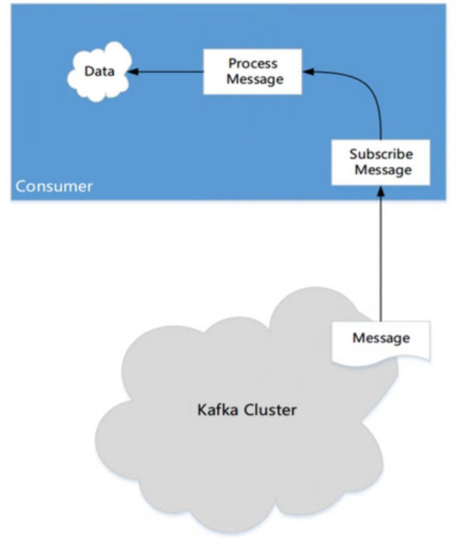


流程描述：

Consumer连接指定的Topic partition所在leader broker，采用pull方式从kafkalogs中获取消息。对于不同的消费模式，会将offset保存在不同的地方

- kafka的highLevel API进行消费：将offset保存在zk当中，每次更新offset的时候，都需要连接zk


- 以及kafka的lowLevelAP进行消费：保存了消费的状态，其实就是保存了offset，将offset保存在kafka的一个默认的topic里面。kafka会自动的创建一个topic，保存所有其他topic里面的offset在哪里


kafka将数据全部都以文件的方式保存到了文件里面去了。

官网关于high level  API  以及low  level  API的简介：

http://kafka.apache.org/0100/documentation.html#impl_consumer

1. 高阶API（High Level API）

   kafka消费者高阶API简单；隐藏Consumer与Broker细节；相关信息保存在zookeeper中。

   ```java
   /* create a connection to the cluster */
   ConsumerConnector connector = Consumer.create(consumerConfig);
   
   interface ConsumerConnector {
   
   /**
   This method is used to get a list of KafkaStreams, which are iterators over
   MessageAndMetadata objects from which you can obtain messages and their
   associated metadata (currently only topic).
   Input: a map of <topic, #streams>
   Output: a map of <topic, list of message streams>
   */
   public Map<String,List<KafkaStream>> createMessageStreams(Map<String,Int> topicCountMap);
   /**
   You can also obtain a list of KafkaStreams, that iterate over messages
   from topics that match a TopicFilter. (A TopicFilter encapsulates a
   whitelist or a blacklist which is a standard Java regex.)
   */
   public List<KafkaStream> createMessageStreamsByFilter( TopicFilter topicFilter, int numStreams);
   /* Commit the offsets of all messages consumed so far. */ public commitOffsets()
   /* Shut down the connector */ public shutdown()
   }
   ```

   说明：大部分的操作都已经封装好了，比如：当前消费到哪个位置下了，但是不够灵活（工作过程推荐使用）

2. 低级API（Low Level API）

   kafka消费者低级API非常灵活；需要自己负责维护连接Controller Broker。保存offset，Consumer Partition对应 关系。

   ```java
   class SimpleConsumer {
   
   /* Send fetch request to a broker and get back a set of messages. */ 
   public ByteBufferMessageSet fetch(FetchRequest request);
   
   /* Send a list of fetch requests to a broker and get back a response set. */ public MultiFetchResponse multifetch(List<FetchRequest> fetches);
   
   /**
   
   Get a list of valid offsets (up to maxSize) before the given time.
   The result is a list of offsets, in descending order.
   @param time: time in millisecs,
   if set to OffsetRequest$.MODULE$.LATEST_TIME(), get from the latest
   offset available. if set to OffsetRequest$.MODULE$.EARLIEST_TIME(), get from the earliest
   
   available. public long[] getOffsetsBefore(String topic, int partition, long time, int maxNumOffsets);
   
   
   * offset
   */
   ```

   说明：没有进行包装，所有的操作有用户决定，如自己的保存某一个分区下的记录，你当前消费到哪个位置。

## 7.3 kafka log存储机制

### 7.3.1 log日志目录及组成

kafka在我们指定的log.dir目录下，会创建一些文件夹；名字是【主题名字-分区名】所组成的文件夹。 在【主题名字-分区名】的目录下，会有两个文件存在，如下所示：

```shell
#索引文件
00000000000000000000.index
#日志内容
00000000000000000000.log
```

- .log文件：顺序的保存了我们的写入的数据

- .index文件：索引文件，使用索引文件，加快kafka数据的查找速度

在目录下的文件，会根据log日志的大小进行切分，**.log 文件大小为 1G**的时候，就会进行切分文件；

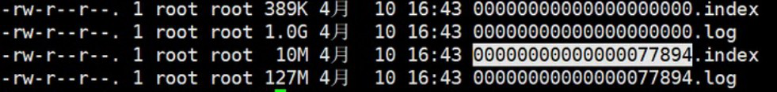

在kafka的设计中，将offset值作为了文件名的一部分

比如：topic的名字为：test，有三个分区，生成的目录如下如下所示：

```
test-0
test-1
test-2
```

总结：查找数据的过程

第一步：通过offset确定数据保存在哪一个segment里面了，

第二部：查找对应的segment里面的index文件  。index文件都是key/value对的。key表示数据在log文件里面的顺序是第几条。value记录了这一条数据在全局的标号。如果能够直接找到对应的offset直接去获取对应的数据即可

如果index文件里面没有存储offset，就会查找offset最近的那一个offset，例如查找offset为7的数据找不到，那么就会去查找offset为6对应的数据，找到之后，再取下一条数据就是offset为7的数据


- kafka日志的组成：

  segment file组成：由两个部分组成，分别为index file和data file，此两个文件一一对应且成对出现； 后缀.index和.log分别表示为segment的索引文件、数据文件。

- segment文件命名规则：

  partion全局的第一个segment从0开始，后续每个segment文件名为上一个全局 partion的最大offset（偏移message数）。数值最大为64位long大小，19位数字字符长度，没有数字就用0 填充。

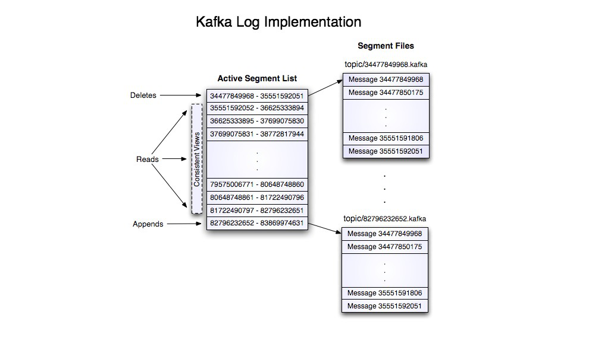

通过索引信息可以快速定位到message。通过index元数据全部映射到memory，可以避免segment file的IO磁盘操作；

通过索引文件稀疏存储，可以大幅降低index文件元数据占用空间大小。 稀疏索引：为了数据创建索引，但范围并不是为每一条创建，而是为某一个区间创建；

**好处**：就是可以减少索引值的数量。

**不好的地方**：找到索引区间之后，要得进行第二次处理。

### 7.3.2 kafka的offset查找过程

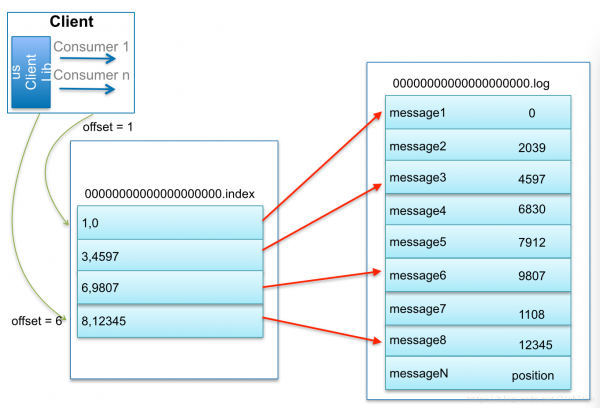

比如：要查找绝对offset为7的Message：

上图的左半部分是索引文件，里面存储的是一对一对的key-value，其中key是消息在数据文件（对应的log文件）中的编号，比如“1,3,6,8……”，
分别表示在log文件中的第1条消息、第3条消息、第6条消息、第8条消息……，那么为什么在index文件中这些编号不是连续的呢？
这是因为index文件中并没有为数据文件中的每条消息都建立索引，而是采用了稀疏存储的方式，每隔一定字节的数据建立一条索引。
这样避免了索引文件占用过多的空间，从而可以将索引文件保留在内存中。
但缺点是没有建立索引的Message也不能一次定位到其在数据文件的位置，从而需要做一次顺序扫描，但是这次顺序扫描的范围就很小了。

 

其中以索引文件中元数据3,4597为例，其中3代表在右边log数据文件中从上到下第3个消息(在全局partiton表示第4597个消息)，
其中4597表示该消息的物理偏移地址（位置）为4597。

### 7.3.3 kafka Message的物理结构及介绍

kafka  Message的物理结构，如下图所示：

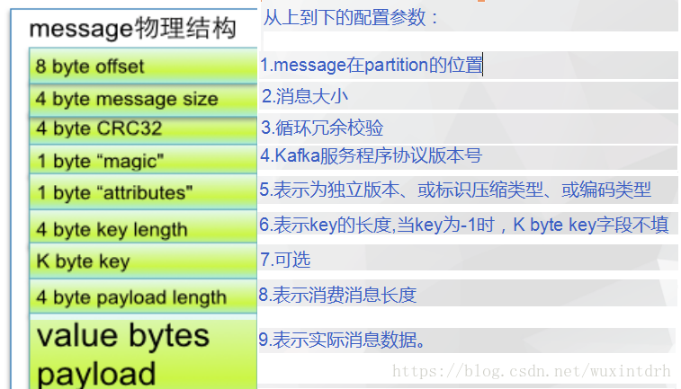

### 7.3.4 kafka中log CleanUp

kafka中清理日志的方式有两种：delete和compact。

删除的阈值有两种：过期的时间和分区内总日志大小。

在kafka中，因为数据是存储在本地磁盘中，并没有像hdfs的那样的分布式存储，就会产生磁盘空间不足的情 况，可以采用删除或者合并的方式来进行处理

可以通过时间来删除、合并：默认7天 还可以通过字节大小、合并 

| log.cleanup.policy    | The default cleanup policy for segments beyond the retention window. A comma separated list of valid policies. Valid policies are: "delete" and "compact" | list | delete | [compact, delete] | medium | cluster- wide |
| --------------------- | ------------------------------------------------------------ | ---- | ------ | ----------------- | ------ | ------------- |
| log.retention.hours   | The number of hours to keep a log file before deleting it (in hours), tertiary to log.retention.ms property | int  | 168    |                   | high   | read- only    |
| log.retention.minutes | The number of minutes to keep a log file before deleting it (in minutes), secondary to log.retention.ms property. If not set, the value in log.retention.hours is used | int  | null   |                   | high   | read- only    |
| log.retention.ms      | The number of milliseconds to keep a log file before deleting it (in milliseconds), If not set, the value in log.retention.minutes is used | long | null   |                   | high   | cluster- wide |

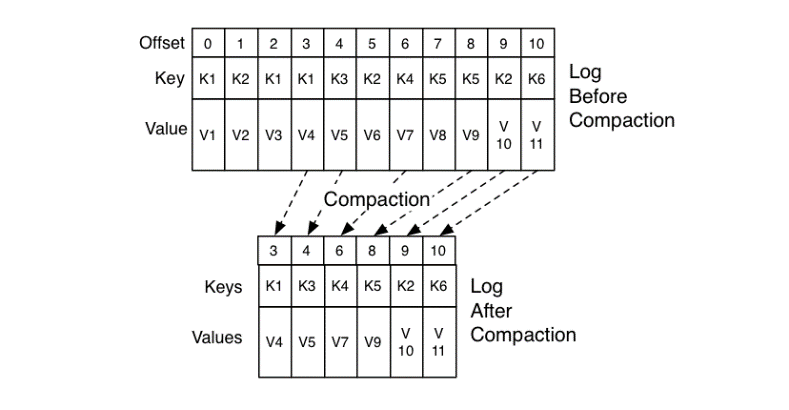


# 8.kafka消息不丢失制

生产者：使用ack机制

broker：使用partition的副本机制

消费者：使用offset来进行记录

## 8.1 生产者生产数据不丢失

过程图1：

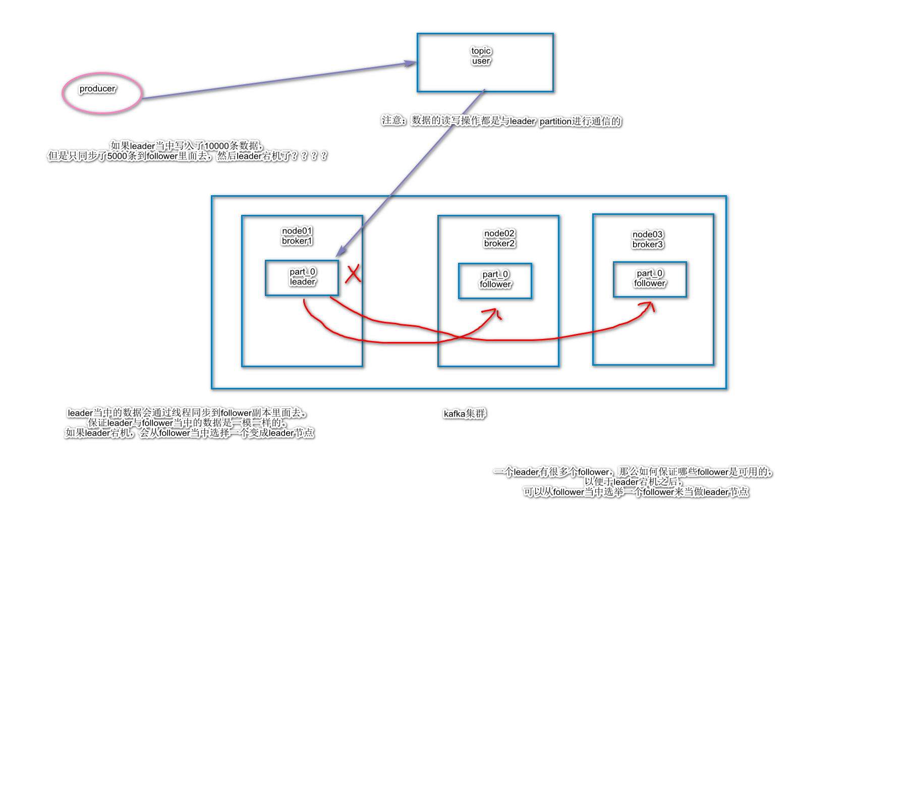

过程图2：


说明：有多少个分区，就启动多少个线程来进行同步数据

### 8.1.1 发送数据方式

可以采用同步或者异步的方式

过程图：

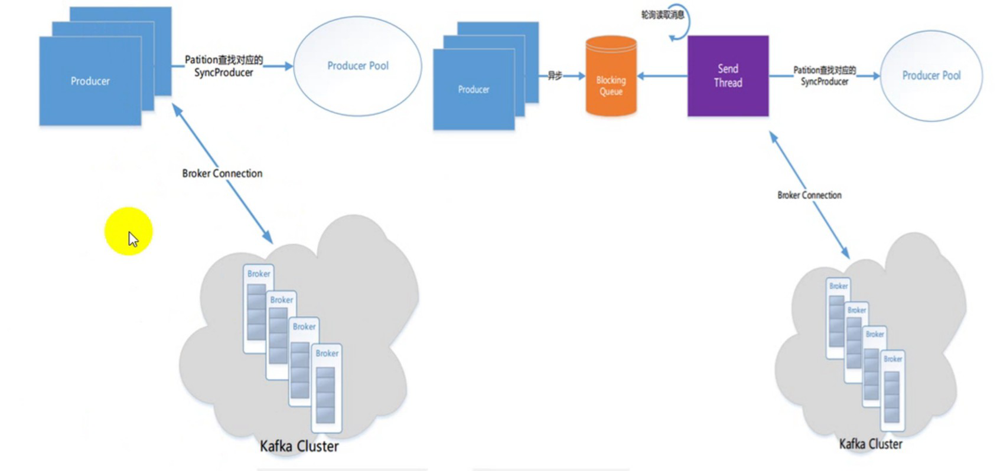

同步：发送一批数据给kafka后，等待kafka返回结果

1. 生产者等待10s，如果broker没有给出ack相应，就认为失败。

2. 生产者重试3次，如果还没有相应，就报错

 

异步：发送一批数据给kafka，只是提供一个回调函数。

1. 先将数据保存在生产者端的buffer中。buffer大小是2万条 
2. 满足数据阈值或者数量阈值其中的一个条件就可以发送数据。
3. 发送一批数据的大小是500条

说明：如果broker迟迟不给ack，而buffer又满了，开发者可以设置是否直接清空buffer中的数据。

### 8.1.2 ack机制（确认机制）

生产者数据不抵事，需要服务端返回一个确认码，即ack响应码；ack的响应有三个状态值

```
0：生产者只负责发送数据，不关心数据是否丢失，响应的状态码为0（丢失的数据，需要再次发送    ）

1：partition的leader收到数据，响应的状态码为1

-1：所有的从节点都收到数据，响应的状态码为-1
```

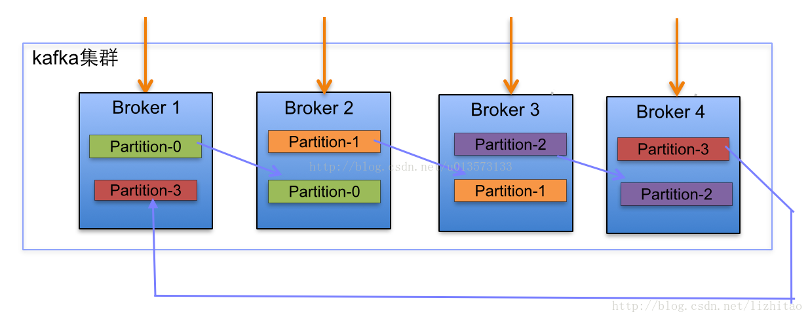

说明：如果broker端一直不给ack状态，producer永远不知道是否成功；producer可以设置一个超时时间10s，超 过时间认为失败。

- 主分区与副本分区之间的数据同步：

  两个指标，一个是副本分区与主分区之间的心跳间隔，超过10S就认为副本分区已经宕机，会将副本分区从ISR当中移除

- 主分区与副本分区之间的数据同步延迟，默认数据差值是4000条

  例如主分区有10000条数据，副本分区同步了3000条，差值是7000 >  4000条，也会将这个副本分区从ISR列表里面移除掉

## 8.2 kafka的broker中数据不丢失

在broker中，保证数据不丢失主要是通过副本因子（冗余），防止数据丢失

## 8.3 消费者消费数据不丢失


在消费者消费数据的时候，只要每个消费者记录好offset值即可，就能保证数据不丢失。


# 9. CAP理论以及kafka当中的CAP机制

## 9.1 分布式系统当中的CAP理论

分布式系统（distributed system）正变得越来越重要，大型网站几乎都是分布式的。

分布式系统的最大难点，就是各个节点的状态如何同步。

为了解决各个节点之间的状态同步问题，在1998年，由加州大学的计算机科学家 Eric Brewer 提出分布式系统的三个指标，分别是

- Consistency：一致性
- Availability：可用性
- Partition tolerance：分区容错性

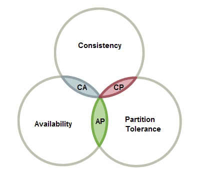

Eric Brewer 说，这三个指标不可能同时做到。这个结论就叫做 CAP 定理

## 9.2 Partition tolerance

先看 Partition tolerance，中文叫做"分区容错"。

大多数分布式系统都分布在多个子网络。每个子网络就叫做一个区（partition）。分区容错的意思是，区间通信可能失败。比如，一台服务器放在中国，另一台服务器放在美国，这就是两个区，它们之间可能无法通信。


上图中，G1 和 G2 是两台跨区的服务器。G1 向 G2 发送一条消息，G2 可能无法收到。系统设计的时候，必须考虑到这种情况。

一般来说，分区容错无法避免，因此可以认为 CAP 的 P 总是存在的。即永远可能存在分区容错这个问题

## 9.3 Consistency

Consistency 中文叫做"一致性"。意思是，写操作之后的读操作，必须返回该值。举例来说，


某条记录是 v0，用户向 G1 发起一个写操作，将其改为 v1。

接下来，用户的读操作就会得到 v1。这就叫一致性。


问题是，用户有可能向 G2 发起读操作，由于 G2 的值没有发生变化，因此返回的是 v0。G1 和 G2 读操作的结果不一致，这就不满足一致性了。


为了让 G2 也能变为 v1，就要在 G1 写操作的时候，让 G1 向 G2 发送一条消息，要求 G2 也改成 v1。

这样的话，用户向 G2 发起读操作，也能得到 v1。


## 9.4 Availability

Availability 中文叫做"可用性"，意思是只要收到用户的请求，服务器就必须给出回应。

用户可以选择向 G1 或 G2 发起读操作。不管是哪台服务器，只要收到请求，就必须告诉用户，到底是 v0 还是 v1，否则就不满足可用性。

## 9.5 kafka当中的CAP应用

kafka是一个分布式的消息队列系统，既然是一个分布式的系统，那么就一定满足CAP定律，那么在kafka当中是如何遵循CAP定律的呢？kafka满足CAP定律当中的哪两个呢？

kafka满足的是CAP定律当中的CA，其中Partition  tolerance通过的是一定的机制尽量的保证分区容错性。

其中C表示的是数据一致性。A表示数据可用性。

 

kafka首先将数据写入到不同的分区里面去，每个分区又可能有好多个副本，数据首先写入到leader分区里面去，读写的操作都是与leader分区进行通信，保证了数据的一致性原则，也就是满足了Consistency原则。然后kafka通过分区副本机制，来保证了kafka当中数据的可用性。但是也存在另外一个问题，就是副本分区当中的数据与leader当中的数据存在差别的问题如何解决，这个就是Partition tolerance的问题。

> kafka为了解决Partition tolerance的问题，使用了ISR的同步策略，来尽最大可能减少Partition tolerance的问题

每个leader会维护一个ISR（a set of in-sync replicas，基本同步）列表

ISR列表主要的作用就是决定哪些副本分区是可用的，也就是说可以将leader分区里面的数据同步到副本分区里面去，决定一个副本分区是否可用的条件有两个

- replica.lag.time.max.ms=10000   副本分区与主分区心跳时间延迟
- replica.lag.max.messages=4000  副本分区与主分区消息同步最大差

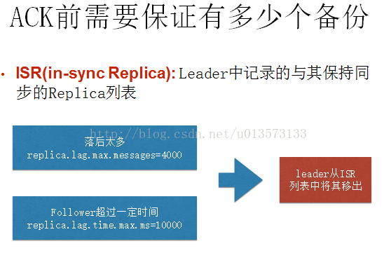

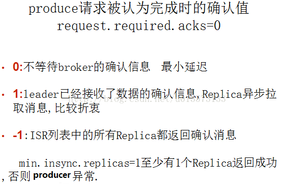

# 10. kafka in zookeeper

kafka在zookeeper中注册的图如下所示：

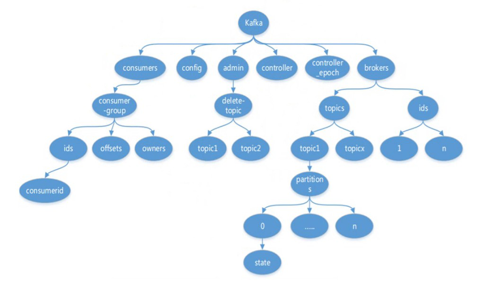

kafka集群中：包含了很多的broker，但是在这么的broker中也会有一个老大存在；是在kafka节点中的一个临时节 点，去创建相应的数据，这个老大就是 **Controller Broker**。

**Controller Broker 职责：**管理所有的broker。

# 11.kafka监控及运维

在开发工作中，消费在Kafka集群中消息，数据变化是我们关注的问题，当业务前提不复杂时，我们可以使用Kafka 命令提供带有Zookeeper客户端工具的工具，可以轻松完成我们的工作。随着业务的复杂性，增加Group和 Topic，那么我们使用Kafka提供命令工具，已经感到无能为力，那么Kafka监控系统目前尤为重要，我们需要观察 消费者应用的细节。

## 11.1 kafka-eagle概述

 为了简化开发者和服务工程师维护Kafka集群的工作有一个监控管理工具，叫做 Kafka-eagle。这个管理工具可以很容易地发现分布在集群中的哪些topic分布不均匀，或者是分区在整个集群分布不均匀的的情况。它支持管理多个集群、选择副本、副本重新分配以及创建Topic。同时，这个管理工具也是一个非常好的可以快速浏览这个集群的工具， 

## 11.2 安装部署

1. 环境要求

   需要安装jdk，启动zk以及kafka的服务

2. 下载安装包

   kafka-eagle官网：

   http://download.kafka-eagle.org/

   我们可以从官网上面直接下载最细的安装包即可kafka-eagle-bin-1.3.2.tar.gz这个版本即可

   代码托管地址：

   https://github.com/smartloli/kafka-eagle/releases

3. 上传并解压

   将eagle安装在一台节点即可，这里选择bigdata111

   ```
   cd /opt/software
   tar -zxf kafka-eagle-bin-1.3.2.tar.gz -C /opt/module/
   cd /opt/module/kafka-eagle-bin-1.3.2
   tar -zxf kafka-eagle-web-1.3.2-bin.tar.gz
   ```

4. 准备数据库

   kafka-eagle需要使用一个数据库来保存一些元数据信息，我们这里直接使用MySQL数据库来保存即可，在node03服务器执行以下命令创建一个mysql数据库即可

   ```sql
   mysql -uroot -p000000
   
   create database eagle;
   ```

5. 修改kafka-eagle配置文件

   ```
   cd /opt/module/kafka-eagle-bin-1.3.2/kafka-eagle-web-1.3.2/conf
   vim system-config.properties
   ```

   ```
   kafka.eagle.zk.cluster.alias=cluster1,cluster2
   cluster1.zk.list=bigdata111:2181,bigdata222:2181,bigdata333:2181
   cluster2.zk.list=bigdata111:2181,bigdata222:2181,bigdata333:2181
   
   kafka.eagle.driver=com.mysql.jdbc.Driver
   kafka.eagle.url=jdbc:mysql://bigdata111:3306/eagle
   kafka.eagle.username=root
   kafka.eagle.password=000000
   ```

6. 配置环境变量

   kafka-eagle必须配置环境变量，node03服务器执行以下命令来进行配置环境变量

   ```
   vim /etc/profile
   
   export KE_HOME=/opt/module/kafka-eagle-bin-1.3.2/kafka-eagle-web-1.3.2
   export PATH=:$KE_HOME/bin:$PATH
   
   source  /etc/profile
   ```

7. 启动kafka-eagle

   ```
   cd/opt/module/kafka-eagle-bin-1.3.2/kafka-eagle-web-1.3.2/bin
   chmod u+x ke.sh
   
   ./ke.sh start
   ```

8. 主界面

   访问kafka-eagle

   http://bigdata111:8048/ke/account/signin?/ke/

   用户名：admin

   密码：123456

    

   