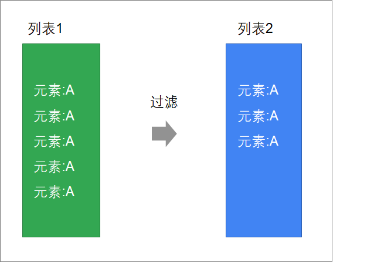

# 31_scala-02

# 1. 函数式编程

## 1.1遍历

方法签名：

```scala
foreach(f: (A) ⇒ Unit): Unit
```

说明：

| foreach | API           | 说明                                                    |
| ------- | ------------- | ------------------------------------------------------- |
| 参数    | f: (A) ⇒ Unit | 接收一个函数对象 函数的输入参数为集合的元素，返回值为空 |
| 返回值  | Unit          | 空                                                      |

foreach执行过程：


示例：

```scala
// 定义一个列表
scala> val a = List(1,2,3,4)
a: List[Int] = List(1, 2, 3, 4)

// 迭代打印
scala> a.foreach((x:Int)=>println(x))
1
2
3
4
```

**使用类型推断简化函数定义**

* scala可以自动来推断出来集合中每个元素参数的类型
* 创建函数时，可以省略其参数列表的类型

示例：

```scala
scala> val a = List(1,2,3,4)
a: List[Int] = List(1, 2, 3, 4)

// 省略参数类型
scala> a.foreach(x=>println(x))
```

**使用下划线来简化函数定义**

当函数参数，只在函数体中出现一次，而且函数体没有嵌套调用时，可以使用下划线来简化函数定义

示例：

```scala
scala> val a = List(1,2,3,4)
a: List[Int] = List(1, 2, 3, 4)

scala> a.foreach(println(_))
1
2
3
4
```

注：

* 如果方法参数是函数，如果出现了下划线，scala编译器会自动将代码封装到一个函数中
* 参数列表也是由scala编译器自动处理

## 1.2 映射

集合的映射操作是将来在编写Spark/Flink用得最多的操作，是我们必须要掌握的。因为进行数据计算的时候，就是一个将一种数据类型转换为另外一种数据类型的过程。

map方法接收一个函数，将这个函数应用到每一个元素，返回一个新的列表：


**方法签名**

```scala
def map[B](f: (A) ⇒ B): TraversableOnce[B]
```

说明：

| map方法 | API                | 说明                                                         |
| ------- | ------------------ | ------------------------------------------------------------ |
| 泛型    | [B]                | 指定map方法最终返回的集合泛型                                |
| 参数    | f: (A) ⇒ B         | 传入一个函数对象 该函数接收一个类型A（要转换的列表元素），返回值为类型B |
| 返回值  | TraversableOnce[B] | B类型的集合                                                  |

**map方法解析**


示例1：

```scala
scala> val a = List(1,2,3,4)
a: List[Int] = List(1, 2, 3, 4)

scala> a.map(x=>x+1)
res4: List[Int] = List(2, 3, 4, 5)
```

示例2：

```scala
scala> val a = List(1,2,3,4)
a: List[Int] = List(1, 2, 3, 4)

scala> a.map(_ + 1)
```

## 1.3 扁平化映射

可以把flatMap，理解为先map，然后再flatten

- map是将列表中的**元素转换为一个List**
- flatten再将整个列表进行扁平化


方法签名：

```scala
def flatMap[B](f: (A) ⇒ GenTraversableOnce[B]): TraversableOnce[B]
```

说明：

| flatmap方法 | API                            | 说明                                                         |
| ----------- | ------------------------------ | ------------------------------------------------------------ |
| 泛型        | [B]                            | 最终要转换的集合元素类型                                     |
| 参数        | f: (A) ⇒ GenTraversableOnce[B] | 传入一个函数对象 函数的参数是集合的元素 函数的返回值是一个集合 |
| 返回值      | TraversableOnce[B]             | B类型的集合                                                  |

示例:

1. 有一个包含了若干个文本行的列表："hadoop hive spark flink flume", "kudu hbase sqoop storm"
2. 获取到文本行中的每一个单词，并将每一个单词都放到列表中

**思路分析**


步骤：

1. 使用map将文本行拆分成数组
2. 再对数组进行扁平化

```scala
// 定义文本行列表
scala> val a = List("hadoop hive spark flink flume", "kudu hbase sqoop storm")
a: List[String] = List(hadoop hive spark flink flume, kudu hbase sqoop storm)

// 使用map将文本行转换为单词数组
scala> a.map(x=>x.split(" "))
res5: List[Array[String]] = List(Array(hadoop, hive, spark, flink, flume), Array(kudu, hbase, sqoop, storm))

// 扁平化，将数组中的
scala> a.map(x=>x.split(" ")).flatten
res6: List[String] = List(hadoop, hive, spark, flink, flume, kudu, hbase, sqoop, storm)
```

**使用flatMap简化操作**

```scala
scala>  val a = List("hadoop hive spark flink flume", "kudu hbase sqoop storm")
a: List[String] = List(hadoop hive spark flink flume, kudu hbase sqoop storm)

scala> a.flatMap(_.split(" "))
res7: List[String] = List(hadoop, hive, spark, flink, flume, kudu, hbase, sqoop, storm)
```

注：`flatten`与`flatMap`的返回值为处理后的的List列表，并不会对原列表作出改变

## 1.4 过滤

过滤符合一定条件的元素



方法签名：

```scala
def filter(p: (A) ⇒ Boolean): TraversableOnce[A]
```

说明：

| filter方法 | API                | 说明                                                         |
| ---------- | ------------------ | ------------------------------------------------------------ |
| 参数       | p: (A) ⇒ Boolean   | 传入一个函数对象 接收一个集合类型的参数 返回布尔类型，满足条件返回true, 不满足返回false |
| 返回值     | TraversableOnce[A] | 列表                                                         |


示例：

```scala
scala> List(1,2,3,4,5,6,7,8,9).filter(_ % 2 == 0)
res8: List[Int] = List(2, 4, 6, 8)
```

## 1.5 排序

在scala集合中，可以使用以下几种方式来进行排序

* sorted默认排序

  ```scala
  scala> List(3,1,2,9,7).sorted
  res16: List[Int] = List(1, 2, 3, 7, 9)
  ```

* sortBy指定字段排序

  根据传入的函数转换后，再进行排序

  方法签名：

  ```scala
  def sortBy[B](f: (A) ⇒ B): List[A]
  ```

  说明：

  | sortBy方法 | API        | 说明                                                         |
  | ---------- | ---------- | ------------------------------------------------------------ |
  | 泛型       | [B]        | 按照什么类型来进行排序                                       |
  | 参数       | f: (A) ⇒ B | 传入函数对象 接收一个集合类型的元素参数 返回B类型的元素进行排序 |
  | 返回值     | List[A]    | 返回排序后的列表                                             |

  示例：

  ```scala
  scala> val a = List("1 hadoop", "3 flume", "5 hive", "2 spark")
  a: List[String] = List(1 hadoop, 3 flume, 5 hive, 2 spark)
  
  scala> a.sortBy(_.split(" ")(0))
  res30: List[String] = List(1 hadoop, 2 spark, 3 flume, 5 hive)
  ```

  

* sortWith自定义排序

  自定义排序，根据一个函数来进行自定义排序

  方法签名：
  
  ```scala
def sortWith(lt: (A, A) ⇒ Boolean): List[A]
  ```

  说明：
  
  | sortWith方法 | API                  | 说明                                                         |
  | ------------ | -------------------- | ------------------------------------------------------------ |
| 参数         | lt: (A, A) ⇒ Boolean | 传入一个比较大小的函数对象 接收两个集合类型的元素参数返回两个元素大小，小于返回true，大于返回false |
  | 返回值       | List[A]              | 返回排序后的列表                                             |

  示例：
  
  ```scala
  scala> val a = List(2,3,1,6,4,5)
  a: List[Int] = List(2, 3, 1, 6, 4, 5)
  
  scala> a.sortWith((x,y) => if(x<y)true else false)
  res15: List[Int] = List(1, 2, 3, 4, 5, 6)
  
  scala> res15.reverse
res18: List[Int] = List(6, 5, 4, 3, 2, 1)
  ```

  简化：
  
  ```scala
  scala> val a = List(2,3,1,6,4,5)
  a: List[Int] = List(2, 3, 1, 6, 4, 5)
  
  // 函数参数只在函数中出现一次，可以使用下划线代替
  scala> a.sortWith(_ < _).reverse
  res19: List[Int] = List(6, 5, 4, 3, 2, 1)
  ```


注：reverse为反转的意思。

## 1.6 分组

groupBy表示按照函数将列表分成不同的组

方法签名：

```scala
def groupBy[K](f: (A) ⇒ K): Map[K, List[A]]
```

说明：

| groupBy方法 | API             | 说明                                                         |
| ----------- | --------------- | ------------------------------------------------------------ |
| 泛型        | [K]             | 分组字段的类型                                               |
| 参数        | f: (A) ⇒ K      | 传入一个函数对象 接收集合元素类型的参数 返回一个K类型的key，这个key会用来进行分组，相同的key放在一组中 |
| 返回值      | Map[K, List[A]] | 返回一个映射，K为分组字段，List为这个分组字段对应的一组数据  |

**groupBy执行过程分析：**


示例：

```scala
scala> val a = List("张三"->"男", "李四"->"女", "王五"->"男")
a: List[(String, String)] = List((张三,男), (李四,女), (王五,男))

// 按照性别分组
scala> a.groupBy(x=>x._2)
//简化：
scala> a.groupBy(_._2)
res6: scala.collection.immutable.Map[String,List[(String, String)]] = Map(男 -> List((张三,男), (王五,男)), 女 -> List((李四,女)))

// 将分组后的映射转换为性别/人数元组列表
scala> res0.map(x => x._1 -> x._2.size)
res3: scala.collection.immutable.Map[String,Int] = Map(男 -> 2, 女 -> 1)

//统计出现的结果
scala> res3.toList
res4: List[(String, Int)] = List((男,2), (女,1))
```

## 1.7 聚合

聚合操作，可以将一个列表中的数据合并为一个。这种操作经常用来统计分析中

方法签名：

```scala
def reduce[A1 >: A](op: (A1, A1) ⇒ A1): A1
```


说明：

| reduce方法 | API               | 说明                                                         |
| ---------- | ----------------- | ------------------------------------------------------------ |
| 泛型       | [A1 >: A]         | （下界）A1必须是集合元素类型的子类                           |
| 参数       | op: (A1, A1) ⇒ A1 | 传入函数对象，用来不断进行聚合操作 第一个A1类型参数为：当前聚合后的变量 第二个A1类型参数为：当前要进行聚合的元素 |
| 返回值     | A1                | 列表最终聚合为一个元素                                       |

注：

* reduce和reduceLeft效果一致，表示从左到右计算
* reduceRight表示从右到左计算

示例：

```scala
scala> val a = List(1,2,3,4,5,6,7,8,9,10)
a: List[Int] = List(1, 2, 3, 4, 5, 6, 7, 8, 9, 10)

//x表示两次相加的结果值，y表示聚合的下一个元素
scala> a.reduce((x,y) => x + y)
res5: Int = 55

// 第一个下划线表示第一个参数，就是历史的聚合数据结果
// 第二个下划线表示第二个参数，就是当前要聚合的数据元素
scala> a.reduce(_ + _)
res53: Int = 55

// 与reduce一样，从左往右计算
scala> a.reduceLeft(_ + _)
res0: Int = 55

// 从右往左聚合计算
scala> a.reduceRight(_ + _)
res1: Int = 55
```

## 1.8 折叠

fold与reduce很像，但是多了一个指定初始值参数

方法签名：

```scala
def fold[A1 >: A](z: A1)(op: (A1, A1) ⇒ A1): A1
```

说明：

| reduce方法 | API               | 说明                                                         |
| ---------- | ----------------- | ------------------------------------------------------------ |
| 泛型       | [A1 >: A]         | （下界）A1必须是集合元素类型的子类                           |
| 参数1      | z: A1             | 初始值                                                       |
| 参数2      | op: (A1, A1) ⇒ A1 | 传入函数对象，用来不断进行折叠操作 第一个A1类型参数为：当前折叠后的变量 第二个A1类型参数为：当前要进行折叠的元素 |
| 返回值     | A1                | 列表最终折叠为一个元素                                       |

注：

* fold和foldLet效果一致，表示从左往右计算

* foldRight表示从右往左计算

示例：

```scala
scala> val a = List(1,2,3,4,5,6,7,8,9,10)
a: List[Int] = List(1, 2, 3, 4, 5, 6, 7, 8, 9, 10)

scala> a.fold(0)(_ + _)
res4: Int = 155
```

# 2.创建类和对象

* 使用`class`来定义一个类
* 使用`new`来创建对象

```scala
object _01ClassDemo {
  // 创建类
  class Person{}

  def main(args: Array[String]): Unit = {
    // 创建对象
    val p = new Person()
    println(p)
  }
}
```

简化：

* 如果类是空的，没有任何成员，可以省略`{}`
* 如果构造器的参数为空，可以省略`()`

```scala
object _02ClassDemo {

  // 创建类，省略花括号
  class Person

  def main(args: Array[String]): Unit = {
    // 创建对象，省略括号
    val person = new Person
  }
}
```

# 3.定义和访问成员变量

一个类会有自己的属性，例如：人这样一个类，有自己的姓名和年龄。我们接下来学习在类中定义、和访问成员变量。

- 在类中使用`var/val`来定义成员变量
- 对象直接使用成员变量名称来访问成员变量

示例：

```scala
object _03ClassDemo {
  class Person {
    // 定义成员变量
    var name = ""
    var age = 0
  }

  def main(args: Array[String]): Unit = {
    // 创建Person对象
    val person = new Person
    person.name = "zhangsan"
    person.age = 20

    // 获取变量值
    println(person.name)
    println(person.age)
  }
}
```

# 4.使用下划线初始化成员变量

- 在定义`var`类型的成员变量时，可以使用`_`来初始化成员变量
  - String => null
  - Int => 0
  - Boolean => false
  - Double => 0.0
  - ...

注：

- `val`类型的成员变量，必须要自己手动初始化
- 使用下划线进行初始化成员变量的时候，必须指定变量的数据类型

示例：

```scala
object _04ClassDemo {

  class Person{
    // 使用下划线进行初始化
    var name:String = _
    var age:Int = _
  }

  def main(args: Array[String]): Unit = {
    val person = new Person
    
    println(person.name)
    println(person.age)
  }
}
```


# 5.定义成员方法

类可以有自己的行为，scala中也可以通过定义成员方法来定义类的行为。

在scala的类中，也是使用`def`来定义成员方法

示例：

```scala
object _05ClassDemo {

  class Customer {
    var name:String = _
    var sex:String = _

    // 定义成员方法
    def sayHi(msg:String) = {
      println(msg)
    }
  }

  def main(args: Array[String]): Unit = {
    val customer = new Customer
    customer.name = "张三"
    customer.sex = "男"
    customer.sayHi("你好")
  }
}
```

# 6.访问修饰符

Java中的访问控制，同样适用于scala，可以在成员前面添加`private/protected`关键字来控制成员的可见性。但在scala中，**没有public关键字**，任何没有被标为`private`或`protected`的成员都是公共的

示例：

```scala
object _02AccessDemo {
 class Person {
    // 定义私有成员变量
    private var name:String = _
    private var age:Int = _

    def getName() = name
    def setName(name:String) = this.name = name
    def getAge() = age
    def setAge(age:Int) = this.age = age

    // 定义私有成员方法
    private def getNameAndAge() = {
       (this.name -> this.age)
    }
  }

  def main(args: Array[String]): Unit = {
    val person = new Person
    person.setName("张三")
    person.setAge(10)

    println(person.getName())
    println(person.getAge())
    
    //Symbol getNameAndAge is inaccessible from this place
//    person.getNameAndAge
  }
}
```

# 7.类构造器

当创建类对象的时候，会自动调用类的构造器。之前使用的都是默认构造器，我们接下来要学习如何自定义构造器。

## 7.1 主构造器

语法：

```scala
class 类名(var/val 参数名:类型 = 默认值, var/val 参数名:类型 = 默认值){
    // 构造代码块
}
```

注：

> * 主构造器的参数列表是直接定义在类名后面，添加了val/var表示直接通过主构造器定义成员变量
> * 构造器参数列表可以指定默认值
> * 创建实例，调用构造器可以指定字段进行初始化
> * 整个class中除了字段定义和方法定义的代码都是构造代码

示例：

```scala
object _06ConstructorDemo {

  // 定义类的主构造器
  // 指定默认值
  class Person(var name:String = "", var age:Int = 0) {
    println("调用主构造器")
  }

  def main(args: Array[String]): Unit = {
    // 给构造器传入参数
    val zhangsan = new Person("张三", 20)
    println(zhangsan.name)
    println(zhangsan.age)

    println("---")

    // 不传入任何参数
    val empty = new Person
    println(empty.name)
    println(empty.age)

    println("---")

    // 指定字段进行初始化
    val man40 = new Person(age = 40)
    println(man40.name)
    println(man40.age)
  }
}
```

## 7.2 辅助构造器

在scala中，除了定义主构造器外，还可以根据需要来定义辅助构造器。例如：允许通过多种方式，来创建对象，这时候就可以定义其他更多的构造器。我们把除了主构造器之外的构造器称为**辅助构造器**。

语法：

- 定义辅助构造器与定义方法一样，也使用`def`关键字来定义
- 这个方法的名字为`this`

```scala
def this(参数名:类型, 参数名:类型) {
    // 第一行需要调用主构造器或者其他构造器
    // 构造器代码
}
```

注：

- 辅助构造器的第一行代码，必须要**调用主构造器或者其他辅助构造器**

示例：

```scala
object _07ConstructorDemo {

  class Customer(var name:String = "", var address:String = "") {
    // 定义辅助构造器
    def this(arr:Array[String]) = {
      // 辅助构造器必须要调用主构造器或者其他辅助构造器
      this(arr(0), arr(1))
    }
  }

  def main(args: Array[String]): Unit = {
    val zhangsan = new Customer(Array("张三", "北京"))

    println(zhangsan.name)
    println(zhangsan.address)
  }
}
```

# 8.单例对象

scala中没有Java中的静态成员，我们想要定义类似于Java的static变量、static方法，就要使用到scala中的单例对象——object.

单例对象表示全局仅有一个对象（类似于Java static概念）

* 定义单例对象和定义类很像，就是把class换成object
* 在object中定义的成员变量类似于Java的静态变量
* 可以使用object直接引用成员变量

示例：

```scala
object _08ObjectDemo {

  // 定义一个单例对象
  object Dog {
    // 定义腿的数量
    val LEG_NUM = 4
  }

  def main(args: Array[String]): Unit = {
    println(Dog.LEG_NUM)
  }
}

```

**在单例对象中定义成员方法**

- 在object中定义的成员方法类似于Java的静态方法

示例：

```scala
object _09ObjectDemo {

  object PrintUtil {

    // 打印分割线
    def printSpliter() = {
      // 字符串乘法，表示返回多少个字符串
      println("-" * 10)
    }
  }

  def main(args: Array[String]): Unit = {
    PrintUtil.printSpliter()
  }
}
```

# 9.工具类案例

需求：

- 编写一个DateUtil工具类专门用来格式化日期时间
- 定义一个方法，用于将日期（Date）转换为年月日字符串。

实现：

```scala
object _10ObjectDemo {

  object DateUtils {
    // 在object中定义的成员变量，相当于Java中定义一个静态变量
    // 定义一个SimpleDateFormat日期时间格式化对象
    val simpleDateFormat = new SimpleDateFormat("yyyy-MM-dd HH:mm")

    // 相当于Java中定义一个静态方法
    def format(date: Date) = simpleDateFormat.format(date)
  }

  // main是一个静态方法，所以必须要写在object中
  def main(args: Array[String]): Unit = {
    println(DateUtils.format(new Date()))
  }
}
```

# 11.main方法

scala和Java一样，如果要运行一个程序，必须有一个main方法。而在Java中main方法是静态的，而在scala中没有静态方法。在scala中，这个main方法必须放在一个单例对象中。

**定义main方法**

```scala
def main(args:Array[String]):Unit = {
    // 方法体
}
```

示例：

```scala
object Main5 {
  def main(args:Array[String]) = {
    println("hello, scala")
  }
}
```

**实现App Trait来定义入口**

创建一个object，继承自App Trait（特质），然后将需要编写在main方法中的代码，写在object的构造方法体内。

```scala
object 单例对象名 extends App {
    // 方法体
}
```

示例：

```scala
object Main5 extends App {
  println("hello, scala")
}
```

# 12.伴生对象

在Java中，经常会有一些类，同时有实例成员又有静态成员。例如：

```java
public class CustomerService {

    private static String SERVICE_NAME = "CustomerService";

    public void save() {
        // 保存客户
        System.out.println(SERVICE_NAME + ":保存客户");
    }

    public static void main(String[] args) {
        new CustomerService().save();
    }
}
```

在scala中，要实现类似的效果，可以使用伴生对象来实现。

我们还可以使用伴生对象来实现快速创建对象，例如：

```scala
// 无需使用new就可以快速来创建对象
val a = Array(1,2,3)
val b = Set(1,2,3)
```

**定义伴生对象**

**一个class和object具有同样的名字**。这个object称为**伴生对象**，这个class称为**伴生类**

* 伴生对象必须要和伴生类一样的名字
* 伴生对象和伴生类在同一个scala源文件中
* 伴生对象和伴生类可以**互相访问private属性**

示例：

```scala
object _11ObjectDemo {

  class CustomerService {
    def save() = {
      println(s"${CustomerService.SERVICE_NAME}:保存客户")
    }
  }

  // CustomerService的伴生对象
  object CustomerService {
    private val SERVICE_NAME = "CustomerService"
  }

  def main(args: Array[String]): Unit = {
    val customerService = new CustomerService()
    customerService.save()
  }
}
```

**private[this]访问权限**

如果某个成员的权限设置为private[this]，表示只能在当前类中访问。伴生对象也不可以访问

```scala
  class Person(private[this] var name:String)
  
  object Person {
    def printPerson(person:Person): Unit = {
      println(person.name)// 报错
    }
  }
  
  def main(args: Array[String]): Unit = {
    val person = new Person("张三")
    Person.printPerson(person)
  }
```

注：上述代码，会编译报错。但移除掉[this]就可以访问了

# 13.伴生对象-apply方法

我们之前使用过这种方式来创建一个Array对象。

```scala
// 创建一个Array对象
val a = Array(1,2,3,4)
```

这种写法非常简便，不需要再写一个new，然后敲一个空格，再写类名。我们可以通过伴生对象的apply方法来实现。

定义：

**定义apply方法**

```scala
object 伴生对象名 {
	def apply(参数名:参数类型, 参数名:参数类型...) = new 类(...)
}
```

注：apply必须写在object伴生对象中

**创建对象**

```scala
伴生对象名(参数1, 参数2...)
```

示例：

```scala
object _12ApplyDemo {
  class Person(var name:String = "", var age:Int = 0)

  object Person {
    // 定义apply方法，接收两个参数
    def apply(name:String, age:Int) = new Person(name, age)
  }

  def main(args: Array[String]): Unit = {
    // 使用伴生对象名称来创建对象
    val zhangsan = Person("张三", 20)
    println(zhangsan.name)
    println(zhangsan.age)
  }
}
```

# 14.继承

scala语言是支持面向对象编程的，我们也可以使用scala来实现继承，通过继承来减少重复代码。

语法：

* scala和Java一样，使用**extends**关键字来实现继承
* 可以在子类中定义父类中没有的字段和方法，或者重写父类的方法
* 类和单例对象都可以从某个父类继承

```scala
class/object 子类 extends 父类 {
    ..
}
```

示例1：类继承

```scala
class Person {
  var name = "super"

  def getName = this.name
}

class Student extends Person

object Main13 {
  def main(args: Array[String]): Unit = {
    val p1 = new Person()
    val p2 = new Student()

    p2.name = "张三"

    println(p2.getName)
  }
}
```

示例2：单例对象继承

```scala
class Person {
  var name = "super"

  def getName = this.name
}

object Student extends Person

object Main13 {
  def main(args: Array[String]): Unit = {
    Student.name="张三"
    println(Student.getName)
  }
}
```

# 15.override和super

类似于Java语言，我们在子类中使用override需要来重写父类的成员，可以使用super来引用父类

- 子类要覆盖父类中的一个方法，必须要使用override关键字
- 使用override来重写一个val字段
- 使用super关键字来访问父类的成员方法

**注：不能重写var定义的可变变量**

示例：

```scala
class Person {
  val name = "super"

  def getName = name
}

class Student extends Person {
  // 重写val字段
  override val name: String = "child"

  // 重写getName方法
  override def getName: String = "hello, " + super.getName
}

object Main13 {
  def main(args: Array[String]): Unit = {
    println(new Student().getName)
  }
}
```

# 16.scala中的文件操作

读取

```scala
	var source = Source.fromFile("F:\\file\\1.txt")
    //转换为字符串输出
//    println(source.mkString)
    //按行读取
    var lines = source.getLines();
    lines.foreach(println)

    //从url中获取数据
    var source2 = Source.fromURL("http://www.baidu.com","UTF-8")
    println(source2.mkString)

    //读取二进制文件
    val file = new File("F:\\file\\1.txt")//导入的是java的包，而不是scala的包
    var in = new FileInputStream(file)
    var buffer = new Array[Byte](file.length().toInt)
    //读取
    in.read(buffer)
    println(buffer.length)
    in.close()
```

写入

```scala
	var out = new PrintWriter("F:\\file\\1.txt")
    for (i <- 0 until 10 ) out.println(i)
    out.close()
```

