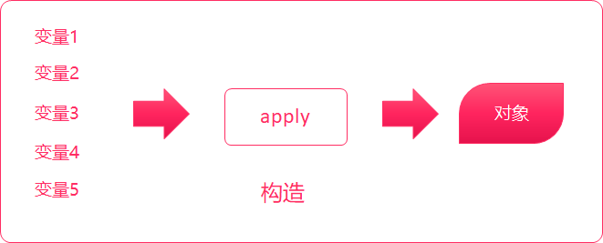
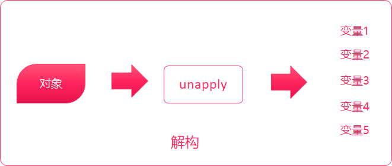
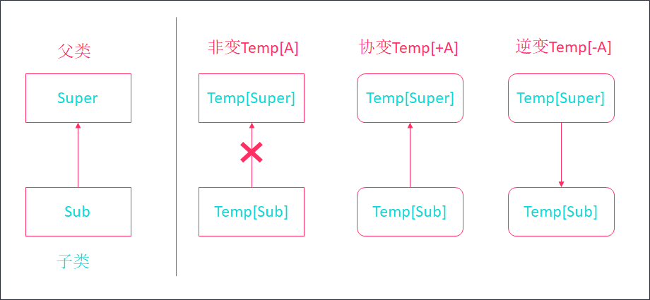

# 32_scala-03

# 1.类型判断

## 1.1 isInstanceOf

scala中对象提供`isInstanceOf`和`asInstanceOf`方法。

* isInstanceOf判断对象是否为指定类的对象
* asInstanceOf将对象转换为指定类型

用法：

```scala
// 判断对象是否为指定类型
val trueOrFalse:Boolean = 对象.isInstanceOf[类型]
// 将对象转换为指定类型
val 变量 = 对象.asInstanceOf[类型]
```

示例：

```scala
class Person3
class Student3 extends Person3

object Main3 {
  def main(args: Array[String]): Unit = {
    val s1:Person3 = new Student3

    // 判断s1是否为Student3类型
    if(s1.isInstanceOf[Student3]) {
      // 将s1转换为Student3类型
      val s2 =  s1.asInstanceOf[Student3]
      println(s2)
    }

  }
}

```

## 1.2 getClass和classOf

isInstanceOf 只能判断对象是否为**指定类以及其子类**的对象，而不能精确的判断出，对象就是指定类的对象。如果要求精确地判断出对象就是指定类的对象，那么就只能使用 getClass 和 classOf 。

用法：

- p.getClass可以精确获取对象的类型
- classOf[x]可以精确获取类型
- 使用==操作符可以直接比较类型

示例：

```scala
class Person4
class Student4 extends Person4

object Student4{
  def main(args: Array[String]) {
    val p:Person4=new Student4
    //判断p是否为Person4类的实例
    println(p.isInstanceOf[Person4])//true

    //判断p的类型是否为Person4类
    println(p.getClass == classOf[Person4])//false

    //判断p的类型是否为Student4类
    println(p.getClass == classOf[Student4])//true
  }
}
```

# 2.抽象类

如果类的某个成员在当前类中的定义是不包含完整的，它就是一个**抽象类**

不完整定义有两种情况：

1. 方法没有方法体（**抽象方法**）
2. 变量没有初始化（**抽象字段**）

用法：

```scala
// 定义抽象类
abstract class 抽象类名 {
  // 定义抽象字段
  val 抽象字段名:类型
  // 定义抽象方法
  def 方法名(参数:参数类型,参数:参数类型...):返回类型
}
```

示例：

```scala
// 创建形状抽象类
abstract class Shape {
  def area:Double
}

// 创建正方形类
class Square(var edge:Double /*边长*/) extends Shape {
  // 实现父类计算面积的方法
  override def area: Double = edge * edge
}

// 创建长方形类
class Rectangle(var length:Double /*长*/, var width:Double /*宽*/) extends Shape {
  override def area: Double = length * width
}

// 创建圆形类
class Cirle(var radius:Double /*半径*/) extends Shape {
  override def area: Double = Math.PI * radius * radius
}

object Main6 {
  def main(args: Array[String]): Unit = {
    val s1:Shape = new Square(2)
    val s2:Shape = new Rectangle(2,3)
    val s3:Shape = new Cirle(2)

    println(s1.area)
    println(s2.area)
    println(s3.area)
  }
}
```

# 3.抽象字段

语法：

```scala
abstract class 抽象类 {
    val/var 抽象字段:类型
}
```

示例：

```scala
// 定义一个人的抽象类
abstract class Person6 {
  // 没有初始化的val字段就是抽象字段
  val WHO_AM_I:String
}

class Student6 extends Person6 {
  override val WHO_AM_I: String = "学生"
}

class Policeman6 extends Person6 {
  override val WHO_AM_I: String = "警察"
}

object Main6 {
  def main(args: Array[String]): Unit = {
    val p1 = new Student6
    val p2 = new Policeman6

    println(p1.WHO_AM_I)
    println(p2.WHO_AM_I)
  }
}
```

# 4.匿名内部类

匿名内部类是没有名称的子类，直接用来创建实例对象。Spark的源代码中有大量使用到匿名内部类。

scala中的匿名内部类使用与Java一致。

语法：

```scala
val/var 变量名 = new 类/抽象类 {
    // 重写方法
}
```

示例：

```scala
abstract class Person7 {
  def sayHello:Unit
}

object Main7 {
  def main(args: Array[String]): Unit = {
    // 直接用new来创建一个匿名内部类对象
    val p1 = new Person7 {
      override def sayHello: Unit = println("我是一个匿名内部类")
    }
    p1.sayHello
  }
}
```

# 5.特质

概念：scala中没有Java中的接口（interface），替代的概念是——特质

## 5.1 trait作为接口使用

定义：

- 特质是scala中代码复用的基础单元
- 它可以将方法和字段定义封装起来，然后添加到类中
- 与类继承不一样的是，类继承要求每个类都只能继承`一个`超类，而一个类可以添加`任意数量`的特质。
- 特质的定义和抽象类的定义很像，但它是使用`trait`关键字

语法：

```scala
trait 名称 {
    // 抽象字段
    // 抽象方法
}
```

继承特质：

```scala
class 类 extends 特质1 with 特质2 {
    // 字段实现
    // 方法实现
}
```

- 使用`extends`来继承trait（scala不论是类还是特质，都是使用extends关键字）
- 如果要继承多个trait，则使用`with`关键字

### 5.1.1 继承单个trait

```scala
  trait Logger {
    // 抽象方法
    def log(message:String)
  }

  class ConsoleLogger extends Logger {
    override def log(message: String): Unit = println("控制台日志:" + message)
  }

  def main(args: Array[String]): Unit = {
    val logger = new ConsoleLogger
    logger.log("这是一条日志")
  }
```

### 5.1.2 继承多个trait

```scala
trait MessageSender {
    def send(msg:String)
}

trait MessageReceive {
    def receive():String
}

class MessageWorker extends MessageSender with MessageReceive {
    override def send(msg: String): Unit = println(s"发送消息:${msg}")

    override def receive(): String = "你好！我叫一个好人！"
}

def main(args: Array[String]): Unit = {
    val worker = new MessageWorker
    worker.send("hello")
    println(worker.receive())
}
```


### 5.1.3 object继承trait

```scala
trait Logger {
    def log(message:String)
}

object ConsoleLogger extends Logger {
    override def log(message: String): Unit = println("控制台消息:" + message)
}

def main(args: Array[String]): Unit = {
    ConsoleLogger.log("程序退出!")
}
```

## 5.2 特质中的方法

```scala
trait LoggerDetail {
  // 在trait中定义具体方法
  def log(msg:String) = println(msg)
}

class UserService extends LoggerDetail {
  def add() = log("添加用户")
}

object MethodInTrait {
  def main(args: Array[String]): Unit = {
    val userService = new UserService
    userService.add()
  }
}
```

## 5.3 teait中定义具体的字段和抽象的字段

* 在trait中可以定义具体字段和抽象字段

* 继承trait的子类自动拥有trait中定义的字段
* 字段直接被添加到子类中

示例：

```scala
  trait Logger {
    val sdf = new SimpleDateFormat("yyyy-MM-dd HH:mm")
    def log(msg:String)
  }

  class ConsoleLogger extends Logger {
    override def log(msg: String): Unit = {
      val info = s"${sdf.format(new Date())}:控制台消息:${msg}"
      println(info)
    }
  }

  def main(args: Array[String]): Unit = {
    val logger = new ConsoleLogger()
    logger.log("NullPointerException")
  }
```

## 5.4 使用trait实现模板模式

要实现以下需求：

* 实现一个输出日志的功能
* 目前要求输出到控制台
* 将来可能会输出到文件、输出到Redis、或者更多的需求

在一个特质中，具体方法依赖于抽象方法，而抽象方法可以放到继承trait的子类中实现，这种设计方式也称为**模板模式**

示例：

```scala
  trait Logger {
    def log(msg:String)
    def info(msg:String) = log("INFO:" + msg)
    def warn(msg:String) = log("WARN:" + msg)
    def error(msg:String) = log("ERROR:" + msg)
  }

  class ConsoleLogger extends Logger {
    override def log(msg: String): Unit = {
      println(msg)
    }
  }

  def main(args: Array[String]): Unit = {
    val logger = new ConsoleLogger
    logger.info("信息日志")
    logger.warn("警告日志")
    logger.error("错误日志")
  }
```

## 5.5 对象混入trait

scala中可以将trait混入到对象中，就是将trait中定义的方法、字段添加到一个对象中

语法：

```scala
val/var 对象名 = new 类 with 特质
```

示例：

```scala
  trait Logger {
    def log(msg:String) = println(msg)
  }

  class UserService

  def main(args: Array[String]): Unit = {
    val service = new UserService with Logger
    service.log("混入的方法")
  }
```

## 5.6 trait实现调用链模式

类继承了多个trait后，可以依次调用多个trait中的同一个方法，只要让多个trait中的同一个方法在最后都依次执行super关键字即可。类中调用多个tait中都有这个方法时，首先会从最右边的trait方法开始执行，然后依次往左执行，形成一个调用链条。

```scala
trait HandlerTrait {
    def handle(data:String) = println("处理数据...")
}

trait DataValidHanlderTrait extends HandlerTrait {
    override def handle(data:String): Unit = {
        println("验证数据...")
        super.handle(data)
    }
}

trait SignatureValidHandlerTrait extends HandlerTrait {
    override def handle(data: String): Unit = {
        println("校验签名...")
        super.handle(data)
    }
}

class PayService extends DataValidHanlderTrait with SignatureValidHandlerTrait {
    override def handle(data: String): Unit = {
        println("准备支付...")
        super.handle(data)
    }
}

def main(args: Array[String]): Unit = {
    val service = new PayService
    service.handle("支付参数")
}

程序运行输出如下：
准备支付...
校验签名...
验证数据...
处理数据...
```

## 5.6 trait的构造机制

- trait也有构造代码，但和类不一样，特质不能有构造器参数
- 每个特质只有**一个无参数**的构造器。
- 一个类继承另一个类、以及多个trait，当创建该类的实例时，它的构造顺序如下：
  1. 执行父类的构造器
  2. `从左到右`依次执行trait的构造器
  3. 如果trait有父trait，先构造父trait，如果多个trait有同样的父trait，则只初始化一次
  4. 执行子类构造器

示例：

```scala
trait Logger {
    println("执行Logger构造器")
}

trait MyLogger extends Logger {
    println("执行MyLogger构造器")
}

trait TimeLogger extends Logger {
    println("执行TimeLogger构造器")
}

class Person{
    println("执行Person构造器")
}

class Student extends Person with TimeLogger with MyLogger {
    println("执行Student构造器")
}

def main(args: Array[String]): Unit = {
    new Student
}

// 程序运行输出如下：
// 执行Person构造器
// 执行Logger构造器
// 执行TimeLogger构造器
// 执行MyLogger构造器
// 执行Student构造器
```

## 5.7 trait继承class

trait也可以继承class的。特质会将class中的成员都继承下来。

示例：

```scala
class MyUtil {
    def printMsg(msg:String) = println(msg)
}

trait Logger extends MyUtil {
    def log(msg:String) = printMsg("Logger:" + msg)
}

class Person extends Logger {
    def sayHello() = log("你好")
}

def main(args: Array[String]): Unit = {
    val person = new Person
    person.sayHello()
}
```

# 6.样例

## 6.1 样例类

样例类是一种特殊类，它可以用来快速定义一个用于**保存数据**的类（类似于Java POJO类），在后续要学习并发编程和spark、flink这些框架也都会经常使用它。

语法：

```scala
case class 样例类名([var/val] 成员变量名1:类型1, 成员变量名2:类型2, 成员变量名3:类型3)
```

* 如果要实现某个成员变量可以被修改，可以添加var
* 默认为val，可以省略

作用：

- 支持模式匹配，相当于java中的接口
- 定义Spark SQL中的表结构

**示例1：定义一个样例类**

```scala
object _01CaseClassDemo {
  case class Person(name:String, age:Int)

  def main(args: Array[String]): Unit = {
    val zhangsan = Person("张三", 20)

    println(zhangsan)
  }
}
```

**示例2：可变成员变量**

```scala
object _02CaseClassDemo {
  case class Person(var name:String, var age:Int)

  def main(args: Array[String]): Unit = {
    val zhangsan = Person("张三", 20)

    zhangsan.age = 23

    println(zhangsan)
  }
}
```

## 6.2 样例类的方法

### 6.2.1 apply方法

apply方法可以让我们快速地使用类名来创建对象。参考以下代码：

```scala
case class CasePerson(name:String, age:Int)

object CaseClassDemo {
  def main(args: Array[String]): Unit = {
    val lisi = CasePerson("李四", 21)
    println(lisi.toString)
  }
}
```

### 6.2.2 toString方法

toString返回样例类名称(成员变量1, 成员变量2, 成员变量3....)，我们可以更方面查看样例类的成员

```scala
case class CasePerson(name:String, age:Int)

object CaseClassDemo {
  def main(args: Array[String]): Unit = {
    val lisi = CasePerson("李四", 21)
    println(lisi.toString)
    // 输出：CasePerson(李四,21)
  }
}
```

注：直接打印lisi相当于调用了toString方法

### 6.2.3 equals方法

样例类自动实现了equals方法，可以直接使用==比较两个样例类是否相等，即所有的成员变量是否相等

示例：

```scala
val lisi1 = CasePerson("李四", 21)
val lisi2 = CasePerson("李四", 21)
println(lisi1 == lisi2)
println(lisi1.equals(lisi2))
// 都输出：true
```

### 6.2.4 hashCode方法

样例类自动实现了hashCode方法，如果所有成员变量的值相同，则hash值相同，只要有一个不一样，则hash值不一样。

```scala
val lisi1 = CasePerson("李四", 21)
val lisi2 = CasePerson("李四", 22)

println(lisi1.hashCode())
println(lisi2.hashCode())
//打印同样的地址值
```

### 6.2.5 copy方法

样例类实现了copy方法，可以快速创建一个相同的实例对象，可以使用带名参数指定给成员进行重新赋值

```scala
val lisi1 = CasePerson("李四", 21)

val wangwu = lisi1.copy(name="王五")
println(wangwu)
```

## 6.3 样例对象

它主要用在两个地方：

1. 定义枚举
2. 作为没有任何参数的消息传递（后面Akka编程会讲到）

**定义枚举：**

使用case object可以创建样例对象。样例对象是单例的，而且它**没有主构造器**

语法：

```scala
case object 样例对象名
```

示例：

```scala
trait Sex /*定义一个性别特质*/
case object Male extends Sex		// 定义一个样例对象并实现了Sex特质
case object Female extends Sex		

case class Person(name:String, sex:Sex)

object CaseClassDemo {
  def main(args: Array[String]): Unit = {
    val zhangsan = Person("张三", Male)

    println(zhangsan)//Person(张三,Male)
  }
}
```

# 7.模式匹配 

scala中有一个非常强大的模式匹配机制，可以应用在很多场景：

- switch语句
- 类型查询
- 使用模式匹配快速获取数据

## 7.1 简单模式匹配

在Java中，有switch关键字，可以简化if条件判断语句。在scala中，可以使用match表达式替代。

语法：

```scala
变量 match {
    case "常量1" => 表达式1
    case "常量2" => 表达式2
    case "常量3" => 表达式3
    case _ => 表达式4		// 默认匹配
}
```

示例：

```scala
println("请输出一个词：")
// StdIn.readLine表示从控制台读取一行文本
val name = StdIn.readLine()

val result = name match {
    case "hadoop" => "大数据分布式存储和计算框架"
    case "zookeeper" => "大数据分布式协调服务框架"
    case "spark" => "大数据分布式内存计算框架"
    case _ => "未匹配"
}

println(result)
```

## 7.2 匹配类型

除了像Java中的switch匹配数据之外，match表达式还可以进行类型匹配。如果我们要根据不同的数据类型，来执行不同的逻辑，也可以使用match表达式来实现。

语法：

```scala
变量 match {
    case 类型1变量名: 类型1 => 表达式1
    case 类型2变量名: 类型2 => 表达式2
    case 类型3变量名: 类型3 => 表达式3
    ...
    case _ => 表达式4
}
```

示例：

定义一个变量为Any类型，然后分别给其赋值为"hadoop"、1、1.0

```scala
val a:Any = "hadoop"

val result = a match {
    case _:String => "String"
    case _:Int => "Int"
    case _:Double => "Double"
}

println(result)
```

注：如果case表达式中无需使用到匹配到的变量，可以使用下划线代代替

## 7.3 守卫

在scala中，可以使用守卫来简化多个case——也就是在**case语句中添加if条件判断**。

示例：

```scala
val a = StdIn.readInt()

a match {
    case _ if a >= 0 && a <= 3 => println("[0-3]")
    case _ if a >= 4 && a <= 8 => println("[3-8]")
    case _ => println("未匹配")
}
```

## 7.4 匹配样例类

scala可以使用模式匹配来匹配样例类，从而可以快速获取样例类中的成员数据。后续，我们在开发Akka案例时，还会用到。

示例：

```scala
// 1. 创建两个样例类
case class Person(name:String, age:Int)
case class Order(id:String)

def main(args: Array[String]): Unit = {
    // 2. 创建样例类对象，并赋值为Any类型
    val zhangsan:Any = Person("张三", 20)
    val order1:Any = Order("001")

    // 3. 使用match...case表达式来进行模式匹配
    // 获取样例类中成员变量
    order1 match {
        case Person(name, age) => println(s"姓名：${name} 年龄：${age}")
        case Order(id) => println(s"ID为：${id}")
        case _ => println("未匹配")
    }
}
```

## 7.5 匹配集合

### 7.5.1 匹配数组

依次修改以下三个数组，并查看结果：

```
Array(1,x,y)   // 以1开头，后续的两个元素不固定
Array(0)	   // 只匹配一个0元素的元素
Array(0, ...)  // 可以任意数量，但是以0开头
```

```scala
val arr = Array(1, 3, 5)
arr match {
    case Array(1, x, y) => println(x + " " + y)
    case Array(0) => println("only 0")
    case Array(0, _*) => println("0 ...")
    case _ => println("something else")
}
```

### 7.5.2 匹配列表

依次修改以下三个数组，并查看结果：

```
List(0)				// 只保存0一个元素的列表
List(0,...)   		// 以0开头的列表，数量不固定
List(x,y)	   		// 只包含两个元素的列表  
```

```scala
val list = List(0, 1, 2)

list match {
    case 0 :: Nil => println("只有0的列表")
    case 0 :: tail => println("0开头的列表")
    case x :: y :: Nil => println(s"只有另两个元素${x}, ${y}的列表")
    case _ => println("未匹配")
}
```

### 7.5.3 匹配元组

依次修改以下三个数组，并查看结果：

```
(1, x, y)		// 以1开头的、一共三个元素的元组
(x, y, 5)   // 一共有三个元素，最后一个元素为5的元组
```

```scala
val tuple = (2, 2, 5)

tuple match {
    case (1, x, y) => println(s"三个元素，1开头的元组：1, ${x}, ${y}")
    case (x, y, 5) => println(s"三个元素，5结尾的元组：${x}, ${y}, 5")
    case _ => println("未匹配")
}
```

## 7.6 变量声明中的模式匹配

在定义变量的时候，可以使用模式匹配快速获取数据

**示例1： 获取数组中的元素**

```scala
val array = (1 to 10).toArray
val Array(_, x, y, z, _*) = array

println(x, y, z)
```

**示例2：获取List中的数据**

```scala
val list = (1 to 10).toList
val x :: y :: tail = list

println(x, y)
```

# 8.Option类型

使用Option类型，可以用来有效避免空引用(null)异常。也就是说，将来我们返回某些数据时，可以返回一个Option类型来替代。

定义：

scala中，Option类型来表示可选值。这种类型的数据有两种形式：

- Some(x)：表示实际的值

  源码：

  ```scala
  final case class Some[+A](val x : A) extends scala.Option[A] with scala.Product with scala.Serializable {
    def isEmpty : scala.Boolean = { /* compiled code */ }
    def get : A = { /* compiled code */ }
  }
  ```

- None：表示没有值

  源码：

  ```scala
  case object None extends scala.Option[scala.Nothing] with scala.Product with scala.Serializable {
    def isEmpty : scala.Boolean = { /* compiled code */ }
    def get : scala.Nothing = { /* compiled code */ }
  }
  ```

- 使用getOrElse方法，当值为None是可以指定一个默认值

**示例1：**

```scala
/**
    * 定义一个两个数相除的方法，使用Option类型来封装结果
    * @param a 参数1
    * @param b 参数2
    * @return Option包装Double类型
    */
  def dvi(a:Double, b:Double):Option[Double] = {
    if(b != 0) {
      Some(a / b)
    }
    else {
      None
    }
  }

  def main(args: Array[String]): Unit = {
    val result1 = dvi(1.0, 5)

    result1 match {
      case Some(x) => println(x)
      case None => println("除零异常")
    }
  }
```

**示例2：**

重写上述案例，使用getOrElse方法，当除零时，或者默认值为0

```scala
def dvi(a:Double, b:Double) = {
    if(b != 0) {
        Some(a / b)
    }
    else {
        None
    }
}

def main(args: Array[String]): Unit = {
    val result = dvi(1, 0).getOrElse(0)

    println(result)
}
```

# 9. 偏函数

偏函数可以提供了简洁的语法，可以简化函数的定义。配合集合的函数式编程，可以让代码更加优雅。

定义：

* 偏函数被包在花括号内没有match的一组case语句是一个偏函数

* 偏函数是PartialFunction[A, B]的一个实例
  * A代表输入参数类型
  * B代表返回结果类型

**示例1:**

```scala
// func1是一个输入参数为Int类型，返回值为String类型的偏函数
val func1: PartialFunction[Int, String] = {
    case 1 => "一"
    case 2 => "二"
    case 3 => "三"
    case _ => "其他"
}

println(func1(2))
```

**示例2：**

```scala
val list = (1 to 10).toList

val list2 = list.map{
    case x if x >= 1 && x <= 3 => "[1-3]"
    case x if x >= 4 && x <= 8 => "[4-8]"
    case x if x > 8 => "(8-*]"
}

println(list2)
```

# 10. 正则表达式

定义：

reegx类

* scala中提供了Regex类来定义正则表达式

* 要构造一个RegEx对象，直接使用String类的r方法即可

* 建议使用三个双引号来表示正则表达式，不然就得对正则中的反斜杠来进行转义

语法：

```scala
val regEx = """正则表达式""".r
```

**findAllMatchIn方法**

* 使用findAllMatchIn方法可以获取到所有正则匹配到的字符串

**示例1：**

定义一个正则表达式，来匹配邮箱是否合法

```scala
val r = """.+@.+\..+""".r

val eml1 = "qq12344@163.com"
val eml2 = "qq12344@.com"

if(r.findAllMatchIn(eml1).size > 0) {
    println(eml1 + "邮箱合法")
}
else {
    println(eml1 + "邮箱不合法")
}

if(r.findAllMatchIn(eml2).size > 0) {
    println(eml2 + "邮箱合法")
}
else {
    println(eml2 + "邮箱不合法")
}
```

**示例2**

找出以下列表中的所有不合法的邮箱

```scala
val emlList =
List("38123845@qq.com", "a1da88123f@gmail.com", "zhansan@163.com", "123afadff.com")

val regex = """.+@.+/..+""".r

val invalidEmlList = emlList.filter {
    x =>
    if (regex.findAllMatchIn(x).size < 1) true else false
}

println(invalidEmlList)
```

**示例3**

使用正则表达式进行模式匹配，匹配出来邮箱运营商的名字。例如：邮箱zhansan@163.com，需要将163匹配出来

```scala
// 使用括号表示一个分组
val regex = """.+@(.+)/..+""".r

val emlList =
List("38123845@qq.com", "a1da88123f@gmail.com", "zhansan@163.com", "123afadff.com")

val emlCmpList = emlList.map {
    case x@regex(company) => s"${x} => ${company}"
    case x => x + "=>未知"
}

println(emlCmpList)
```

# 11. 异常处理

## 11.1捕获异常：

语法：

```scala
try {
    // 代码
}
catch {
    case ex:异常类型1 => // 代码
    case ex:异常类型2 => // 代码
}
finally {
    // 代码
}
```

- try中的代码是我们编写的业务处理代码
- 在catch中表示当出现某个异常时，需要执行的代码
- 在finally中，是不管是否出现异常都会执行的代码

示例：

```scala
try {
    val i = 10 / 0

    println("你好！")
} catch {
    case ex: Exception => println(ex.getMessage)
} 
```

## 11.2 抛出异常

示例：

```scala
  def main(args: Array[String]): Unit = {
    throw new Exception("这是一个异常")
  }

Exception in thread "main" java.lang.Exception: 这是一个异常
	at ForDemo$.main(ForDemo.scala:3)
	at ForDemo.main(ForDemo.scala)
```

scala不需要在方法上声明要抛出的异常，它已经解决了再Java中被认为是设计失败的检查型异常。

# 12.提取器

我们之前已经使用过scala中非常强大的模式匹配功能了，通过模式匹配，我们可以快速匹配样例类中的成员变量。例如：

```scala
// 1. 创建两个样例类
case class Person(name:String, age:Int)
case class Order(id:String)

def main(args: Array[String]): Unit = {
    // 2. 创建样例类对象，并赋值为Any类型
    val zhangsan:Any = Person("张三", 20)
    val order1:Any = Order("001")

    // 3. 使用match...case表达式来进行模式匹配
    // 获取样例类中成员变量
    order1 match {
        case Person(name, age) => println(s"姓名：${name} 年龄：${age}")
        case Order(id1) => println(s"ID为：${id1}")
        case _ => println("未匹配")
    }
}
```

注：那是不是所有的类都可以进行这样的模式匹配呢？答案是：**不可以的**

要支持模式匹配，必须要实现一个**提取器**。

样例类自动实现了apply、unapply方法

**定义提取器**

之前我们学习过了，实现一个类的伴生对象中的apply方法，可以用类名来快速构建一个对象。伴生对象中，还有一个unapply方法。与apply相反，unapply是将该类的对象，拆解为一个个的元素。





```scala
def unapply(stu:Student):Option[(类型1, 类型2, 类型3...)] = {
    if(stu != null) {
        Some((变量1, 变量2, 变量3...))
    }
    else {
        None
    }
}
```

**示例：**

* 创建一个Student类，包含姓名年龄两个字段
* 实现一个类的解构器，并使用match表达式进行模式匹配，提取类中的字段。

```scala
class Student(var name:String, var age:Int)

object Student {
    def apply(name:String, age:Int) = {
        new Student(name, age)
    }

    def unapply(student:Student) = {
        val tuple = (student.name, student.age)

        Some(tuple)
    }
}

def main(args: Array[String]): Unit = {
    val zhangsan = Student("张三", 20)

    zhangsan match {
        case Student(name, age) => println(s"${name} => ${age}")
    }
}
```

# 13.泛型

## 13.1 定义泛型

语法：

```scala
def 方法名[泛型名称](..) = {
    //...
}
```

示例：

不考虑泛型实现：

```scala
 def getMiddle(arr:Array[Int]) = arr(arr.length / 2)

  def main(args: Array[String]): Unit = {
    val arr1 = Array(1,2,3,4,5)

    println(getMiddle(arr1))
  }
```

加入泛型支持

```scala
def getMiddleElement[T](array:Array[T]) =array(array.length / 2)

def main(args: Array[String]): Unit = {
    println(getMiddleElement(Array(1, 2, 3, 4, 5)))
    println(getMiddleElement(Array("a", "b", "c", "d", "e")))
}
```

## 13.2 泛型类

语法：

```scala
class 类[T](val 变量名: T)
```

* 定义一个泛型类，直接在类名后面加上方括号，指定要使用的泛型参数
* 指定类对应的泛型参数后，就使用这些类型参数来定义变量了

示例：

```scala
case class Pair[T](var a:T, var b:T)

def main(args: Array[String]): Unit = {
    val pairList = List(
        Pair("Hadoop", "Storm"),
        Pair("Hadoop", 2008),
        Pair(1.0, 2.0),
        Pair("Hadoop", Some(1.9))
    )

    println(pairList)
}
```

## 13.3 上界

我们在定义方法/类的泛型时，限定必须从哪个类继承、或者必须是哪个类的父类。此时，就需要使用到上下界。

使用`<: 类型名`表示给类型添加一个**上界**，表示泛型参数必须要从该类（或本身）继承

语法：

```scala
[T <: 类型]
```

示例：

```scala
class Person
class Student extends Person

def demo[T <: Person](a:Array[T]) = println(a)

def main(args: Array[String]): Unit = {
    demo(Array(new Person))
    demo(Array(new Student))
    // 编译出错，必须是Person的子类
    // demo(Array("hadoop"))
}
```

## 13.4 下界

上界是要求必须是某个类的子类，或者必须从某个类继承，而下界是必须是**某个类的父类**（或本身）

语法：

```scala
[T >: 类型]
```

注：如果类既有上界、又有下界。下界写在前面，上界写在后面

示例：

```scala
class Person
class Policeman extends Person
class Superman extends Policeman

def demo[T >: Policeman](array:Array[T]) = println(array)

def main(args: Array[String]): Unit = {
    demo(Array(new Person))
    demo(Array(new Policeman))
    // 编译出错：Superman是Policeman的子类
    // demo(Array(new Superman))
}
```

## 13.5 非变

spark的源代码中大量使用到了协变、逆变、非变，学习该知识点对我们将来阅读spark源代码很有帮助。

如下存在类型转换问题：

```scala
class Pair[T]

object Pair {
  def main(args: Array[String]): Unit = {
    val p1 = Pair("hello")
    // 编译报错，无法将p1转换为p2
    val p2:Pair[AnyRef] = p1

    println(p2)
  }
}
```

如何让带有泛型的类支持类型转换呢？

语法：

```scala
class Pair[T]{}
```

* 默认泛型类是非变的
* 类型B是A的子类型，Pair[A]和Pair[B]没有任何从属关系
* Java是一样的



## 13.6 协变

概念：泛型变量的值可以是本身类型或者其子类型

语法：

```scala
class Pair[+T]
```

* 类型B是A的子类型，Pair[B]可以认为是Pair[A]的子类型
* 参数化类型的方向和类型的方向是一致的。

## 13.7 逆变

概念：泛型变量的值可以是其本身或是其父类

**语法格式**

```scala
class Pair[-T]
```

* 类型B是A的子类型，Pair[A]反过来可以认为是Pair[B]的子类型
* 参数化类型的方向和类型的方向是相反的

示例：

```scala
class Super
class Sub extends Super

class Temp1[T]
class Temp2[+T]
class Temp3[-T]

def main(args: Array[String]): Unit = {
    val a:Temp1[Sub] = new Temp1[Sub]
    // 编译报错
    // 非变
    //val b:Temp1[Super] = a

    // 协变
    val c: Temp2[Sub] = new Temp2[Sub]
    val d: Temp2[Super] = c

    // 逆变
    val e: Temp3[Super] = new Temp3[Super]
    val f: Temp3[Sub] = e
}
```

## 13.8 视图界定

定义：视图界定是上界和下界的一种扩展

期望 函数可以接受上界和下界规定的类型外，还可以接受通过隐式转换转换过去的类型

**语法：**

用 % 来表示

```scala
def a[T<%String](x:T,y:T) = x + " ***** " + y
//    a(1,2)//报错

implicit def b(n:Int):String = n.toString
println(a(b(1),b(2)))
//输出：1 ***** 2
```

代表：

1. 可以接收String和String的子类
2. 可以接收能够转换为String的其他类型

**注：相同类型的转换只能定义一次，比如Int->String，如果按照上述案例再次进行定义，则会报错**