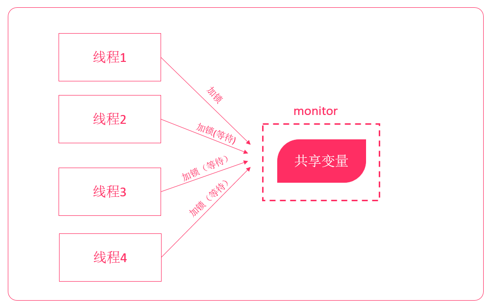
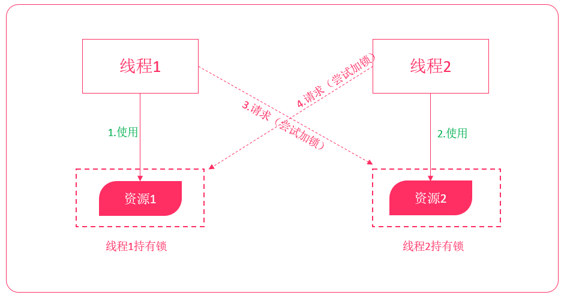
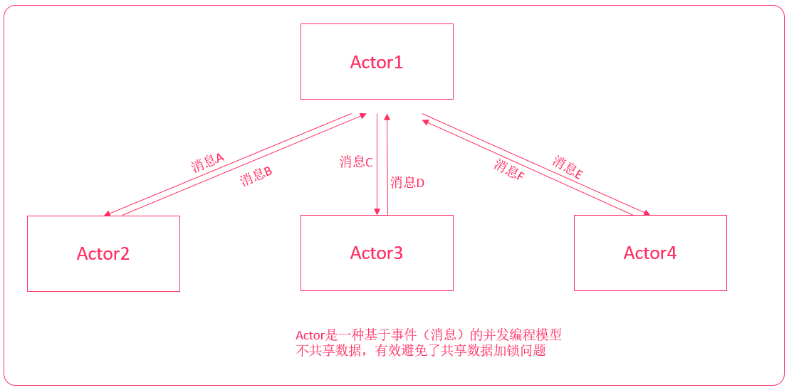
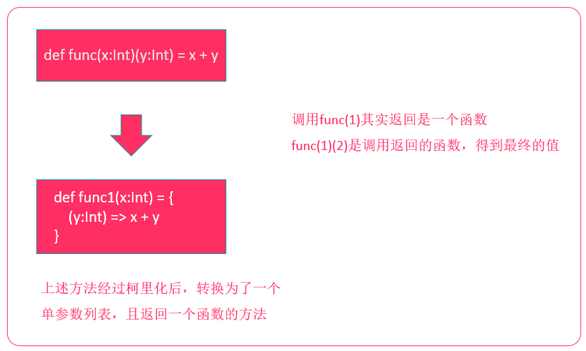
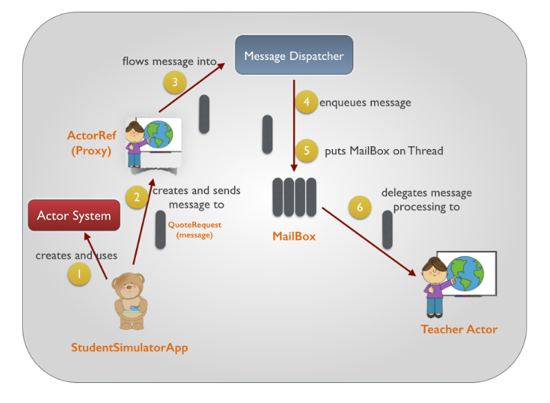
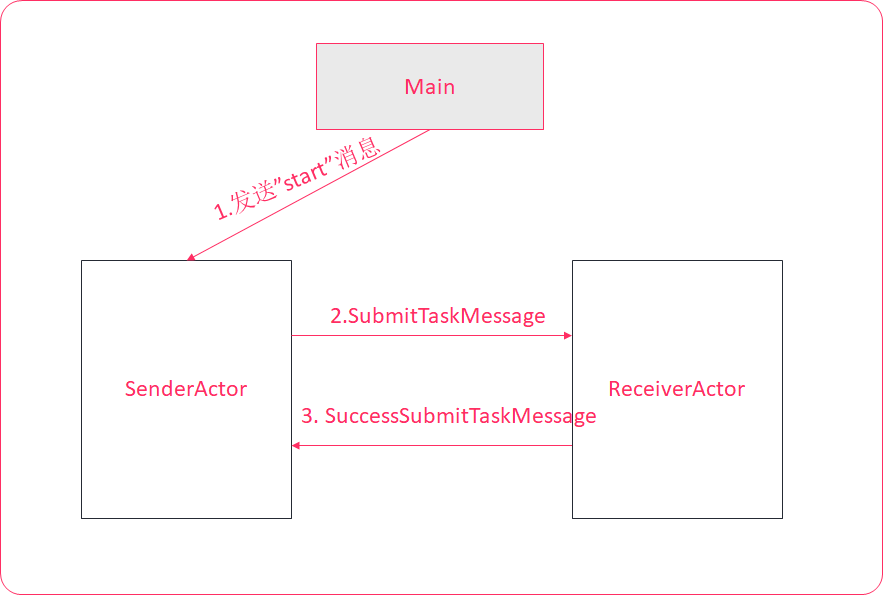
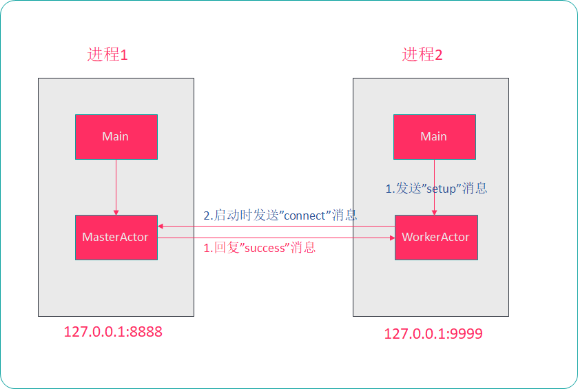

33_scala-04

# 1.Actor并发编程模型

scala的Actor并发编程模型可以用来开发比Java线程效率更高的并发程序

**Java并发编程的问题：**

在Java并发编程中，每个对象都有一个逻辑监视器（monitor），可以用来控制对象的多线程访问。我们添加sychronized关键字来标记，需要进行同步加锁访问。这样，通过加锁的机制来确保同一时间只有一个线程访问共享数据。但这种方式存在资源争夺、以及死锁问题，程序越大问题越麻烦



线程死锁：



**Actor并发编程模型**

Actor并发编程模型，是scala提供给程序员的一种与Java并发编程完全不一样的并发编程模型，是一种基于事件模型的并发机制。Actor并发编程模型是一种不共享数据，依赖消息传递的一种并发编程模式，有效避免资源争夺、死锁等情况。



**Java并发编程对比Actor并发编程**

| Java内置线程模型                                  | scala Actor模型                      |
| ------------------------------------------------- | ------------------------------------ |
| "共享数据-锁"模型 (share data and lock)           | share nothing                        |
| 每个object有一个monitor，监视线程对共享数据的访问 | 不共享数据，Actor之间通过Message通讯 |
| 加锁代码使用synchronized标识                      |                                      |
| 死锁问题                                          |                                      |
| 每个线程内部是顺序执行的                          | 每个Actor内部是顺序执行的            |

Scala中的并发：

scala中的Actor是一种**不共享数据**，依赖于消息传递的一种并发编程模型。避免死锁，资源等情况

**如果Actor A和 Actor B要相互沟通步骤：**

1. A要给B传递一个消息，B有一个收件箱，B要不断轮询自己收件箱
2. 若B看见A发过来的消息，B会解析A的消息并执行
3. 处理完后，通过消息发送给A

学习Actor时，需要区分，发消息和回复消息。这是两个不同的操作

**注：**scala在2.11.x版本中加入了Akka并发编程框架，老版本已经废弃。Actor的编程模型和Akka很像，我们这里学习Actor的目的是为学习Akka做准备。

# 2.创建Actor

创建Actor的方式和Java中创建线程很类似，也是通过继承来创建。

示例：

创建两个Actor，一个Actor打印1-10，另一个Actor打印11-20

* 使用class继承Actor创建（如果需要在程序中创建多个相同的Actor）
* 使用object继承Actor创建（如果在程序中只创建一个Actor）

```scala
object _05ActorDemo {
  class Actor1 extends Actor {
    override def act(): Unit = (1 to 10).foreach(println(_))
  }

  class Actor2 extends Actor {
    override def act(): Unit = (11 to 20).foreach(println(_))
  }

  def main(args: Array[String]): Unit = {
    new Actor1().start()
    new Actor2().start()
  }
}
```

使用object继承Actor创建

```scala
  object Actor1 extends Actor {
    override def act(): Unit =
      for(i <- 1 to 10) {
        println(i)
      }
  }

  object Actor2 extends Actor {
    override def act(): Unit =
      for(i <- 11 to 20) {
        println(i)
      }
  }

  def main(args: Array[String]): Unit = {
    Actor1.start()
    Actor2.start()
  }
```

**Actor程序运行流程**

1. 调用start()方法启动Actor
2. 自动执行**act**()方法
3. 向Actor发送消息
4. act方法执行完成后，程序会调用**exit()**方法

# 3.发送/接收

用法：

| **！** | **发送异步消息，没有返回值**          |
| ------ | ------------------------------------- |
| **!?** | **发送同步消息，等待返回值**          |
| **!!** | **发送异步消息，返回值是Future[Any]** |

例如：

要给actor1发送一个异步字符串消息，使用以下代码：

```scala
actor1 ! "你好!"
```

**接受消息**

Actor中使用receive方法来接收消息，需要给receive方法传入一个偏函数

```scala
{
    case 变量名1:消息类型1 => 业务处理1,
    case 变量名2:消息类型2 => 业务处理2,
    ...
}
```

注：receive方法只接收一次消息，接收完后继续执行act方法

示例：

```scala
  object ActorSender extends Actor {
    override def act(): Unit = {
      // 发送消息
      while(true) {
        ActorReceiver ! "hello!"
        TimeUnit.SECONDS.sleep(3)
      }
    }
  }

  object ActorReceiver extends Actor {
    override def act(): Unit = {
      // 持续接收消息
      while(true) {
        receive {
          case msg:String => println("接收到消息：" + msg)
        }
      }
    }
  }

  def main(args: Array[String]): Unit = {
    ActorReceiver.start()
    ActorSender.start()
  }

```

## 3.1 使用loop和react优化接收消息

上述代码，使用while循环来不断接收消息。

* 如果当前Actor没有接收到消息，线程就会处于阻塞状态
* 如果有很多的Actor，就有可能会导致很多线程都是处于阻塞状态
* 每次有新的消息来时，重新创建线程来处理
* 频繁的线程创建、销毁和切换，会影响运行效率

在scala中，可以使用loop + react来复用线程。比while + receive更高效

示例：

```scala
// 持续接收消息
loop {
    react {
        case msg:String => println("接收到消息：" + msg)
    }
}
```

示例：

```scala
  object ActorSender extends Actor {
    override def act(): Unit = {
      // 发送消息
      while(true) {
        ActorReceiver ! "hello!"
        TimeUnit.SECONDS.sleep(3)
      }
    }
  }

  object ActorReceiver extends Actor {
    override def act(): Unit = {
     // 持续接收消息
        loop {
            react {
                case msg:String => println("接收到消息：" + msg)
            }
        }
    }
  }

  def main(args: Array[String]): Unit = {
    ActorReceiver.start()
    ActorSender.start()
  }

```


## 3.2 发送/接受自定义消息

我们前面发送的消息是字符串类型，Actor中也支持发送自定义消息，常见的如：**使用样例类封装消息，然后进行发送处理。**

**示例1：**

* 创建一个MsgActor，并向它发送一个同步消息，该消息包含两个字段（id、message）
* MsgActor回复一个消息，该消息包含两个字段（message、name）
* 打印回复消息

```scala
case class Message(id:Int, msg:String)
case class ReplyMessage(msg:String, name:String)

  object MsgActor extends Actor {
    override def act(): Unit = {
      loop {
        react {
          case Message(id, msg) => {
            println(s"接收到消息:${id}/${msg}")
            sender ! ReplyMessage("不太好", "Tom")
          }
        }
      }
    }
  }

  def main(args: Array[String]): Unit = {
    MsgActor.start()

    //同步方式发送自定义消息，所以有返回值
    val replyMessage: Any = MsgActor !? Message(1, "你好")
    //打印回复消息
    if(replyMessage.isInstanceOf[ReplyMessage]){
        println("回复消息:" + replyMessage.asInstanceOf[ReplyMessage])
    }
  }
```

注：

* 使用`!?`来发送同步消息
* 在Actor的act方法中，可以使用sender获取发送者的Actor引用

**示例2：**

* 创建一个MsgActor，并向它发送一个异步无返回消息，该消息包含两个字段（message, company）

```scala
case class Mesasge(message:String, company:String)

object MsgActor extends Actor {
    override def act(): Unit = {
        loop {
            react {
                case Mesasge(message, company) =>
                println(s"MsgActor接收到消息:${message}/${company}")
            }
        }
    }
}

def main(args: Array[String]): Unit = {
    MsgActor.start()
    MsgActor ! Mesasge("中国联通", "大爷，快交话费！")
}
```

注：使用`!`发送异步无返回消息

**示例3**

* 创建一个MsgActor，并向它发送一个异步有返回消息，该消息包含两个字段（id、message）
* MsgActor回复一个消息，该消息包含两个字段（message、name）
* 打印回复消息

```scala
case class Message(id:Int, message:String)
case class ReplyMessage(message:String, name:String)

object MsgActor extends Actor {
    override def act(): Unit = {
        loop {
            react {
                case Message(id, message) =>
                println(s"MsgActor接收到消息：${id}/${message}")
                sender ! ReplyMessage("收到消息！", "JIm")
            }
        }
    }
}

def main(args: Array[String]): Unit = {
    MsgActor.start()

    //future表示将来会返回一个数据
    val future: Future[Any] = MsgActor !! Message(1, "你好！")

    //提前通过一个循环等到future中有数据，再执行
    //调用future.isSet方法可以判断数据是否已经被接收到
    while(!future.isSet) {}

    //使用future的apply方法就可以获取数据
    val replyMessage = future.apply().asInstanceOf[ReplyMessage]
    println(replyMessage)
}
```

* 使用`!!`发送异步有返回消息
* 发送后，返回类型为Future[Any]的对象
* Future表示异步返回数据的封装，虽获取到Future的返回值，但不一定有值，可能在将来某一时刻才会返回消息
* Future的isSet()可检查是否已经收到返回消息，apply()方法可获取返回数据

# 4.WordCount案例

给定几个文本文件（文本文件都是以空格分隔的），使用Actor并发编程来统计单词的数量

**实现思路**

1. MainActor获取要进行单词统计的文件
2. 根据文件数量创建对应的WordCountActor
3. 将文件名封装为消息发送给WordCountActor
4. WordCountActor接收消息，并统计单个文件的单词计数
5. 将单词计数结果发送给MainActor
6. MainActor等待所有的WordCountActor都已经成功返回消息，然后进行结果合并

**步骤：**

1. 获取文件列表

   在main方法中读取指定目录(${project_root_dir}/data/)下的所有文件，并打印所有的文件名

   - 创建用于测试的数据文件
   - 加载工程根目录，获取到所有文件
   - 将每一个文件名，添加目录路径
   - 打印所有文件名

   ```scala
   // 1. MainActor获取要进行单词统计的文件
   val DIR_PATH = "./data/"
   val dataDir = new File(DIR_PATH)
   
   // 读取所有data目录下的所有文件
   println("对以下文件进行单词统计:")
   // 构建文件列表
   val fileList = dataDir.list().toList.map(DIR_PATH + _)
   println(fileList)
   ```

2. 创建WordCountActor

   根据文件数量创建WordCountActor，为了方便后续发送消息给Actor，将每个Actor与文件名关联在一起

   - 创建WordCountActor
   - 将文件列表转换为WordCountActor
   - 为了后续方便发送消息给Actor，将Actor列表和文件列表拉链到一起
   - 打印测试

   MainActor.scala

   ```scala
   // 2. 根据文件数量创建对应的WordCountActor
   val actorList = fileList.map {
       x => new WordCountActor
   }
   
   // 将Actor和文件名列表建立为元组
   val actorWithFileList: List[(WordCountActor, String)] = actorList.zip(fileList)
   ```

3.  启动Actor/发送/接收任务消息

   启动所有WordCountActor，并发送单词统计任务消息给每个WordCountActor

   **注：此处应发送异步有返回消息**

   - 创建一个WordCountTask样例类消息，封装要进行单词计数的文件名
   - 启动所有WordCountTask，并发送异步有返回消息
   - 获取到所有的WordCount中获取到的消息（封装到一个Future列表中）
   - 在WordCountActor中接收并打印消息

   MainActor.scala

   ```scala
   // 3. 将文件名封装为消息发送给WordCountActor，并获取到异步返回结果
   val futureList = actorWithFileList.map {
       // tuple为Actor和文件名
       tuple =>
       // 启动actor
       tuple._1.start()
       // 发送任务消息
       tuple._1 !! WordCountTask(tuple._2)
   }
   ```

   MessagePackage.scala

   ```scala
   /**
     * 单词统计任务消息
     * @param fileName 文件名
     */
   case class WordCountTask(fileName:String)
   ```

   WordCountActor.scala	

   ```scala
   loop {
       receive {
           // 接收单词统计任务消息
           case WordCountTask(fileName) => {
               println("接收到消息:" + fileName)
           }
       }
   }
   ```

4. 消息统计文件单词计数

   读取文件文本，并统计出来单词的数量。例如：

   ```
   (hadoop, 3), (spark, 1)...
   ```

   - 读取文件内容，并转换为列表
   - 按照空格切割文本，并转换为一个一个的单词
   - 为了方便进行计数，将单词转换为元组
   - 按照单词进行分组，然后再进行聚合统计
   - 打印聚合统计结果

   WordCountActor.scala

   ```scala
   // 4. 统计单个文件的单词计数
   val iter: Iterator[String] = Source.fromFile(fileName).getLines()
   // [第一行] hadoop hadoop
   // [第二行] hadoop spark
   val lineList = iter.toList
   // [单词列表] hadoop, hadoop, hadoop, spark
   val wordList: List[String] = lineList.flatMap(_.split(" "))
   // 将单词转换为元组
   // [元组列表] (hadoop, 1), (hadoop, 1), (hadoop, 1), (spark, 1)
   val tupleList = wordList.map(_ -> 1)
   // 按照单词进行分组
   // [单词分组] = {hadoop->List(hadoop->1, hadoop->1, hadoop->1), spark->List(spark ->1)}
   val grouped: Map[String, List[(String, Int)]] = tupleList.groupBy(_._1)
   // 将分组内的数据进行聚合
   // [单词计数] = (hadoop, 3), (spark, 1)
   val wordCount: Map[String, Int] = grouped.map {
       tuple =>
       // 单词
       val word = tuple._1
       // 进行计数
       // 获取到所有的单词数量，然后进行累加
       val total = tuple._2.map(_._2).sum
       word -> total
   }
   println(wordCount)
   ```

5. 封装单词计数结果回复给MainActor

   * 将单词计数的结果封装为一个样例类消息，并发送给MainActor
   * MainActor等待所有WordCount均已返回后获取到每个WordCountActor单词计算后的结果

   

   - 定义一个样例类封装单词计数结果
   - 将单词计数结果发送给MainActor
   - MainActor中检测所有WordActor是否均已返回，如果均已返回，则获取并转换结果
   - 打印结果

   MessagePackage.scala

   ```scala
   /**
     * 单词统计结果
     * @param wordCount 单词计数
     */
   case class WordCountResult(wordCount: Map[String, Int])
   ```

   WordCountActor.scala

   ```scala
   // 5. 将单词计数结果回复给MainActor
   sender ! WordCountResult(wordCount)
   ```

   MainActor.scala

   ```scala
   // 等待所有Actor都已经返回
   while(futureList.filter(_.isSet).size != fileList.size){}
   // MainActor等待所有的WordCountActor都已经成功返回消息，然后进行结果合并
   val resultList: List[Map[String, Int]] = futureList.map(_.apply.asInstanceOf[WordCountResult].wordCount)
   println("接收到所有统计结果：" + resultList)
   ```

6. 结果合并

   对接收到的所有单词计数进行合并。因为该部分已经在WordCountActor已经编写过，所以抽取这部分一样的代码到一个工具类中，再调用合并得到最终结果

   - 创建一个用于单词合并的工具类
   - 抽取重复代码为一个方法
   - 在MainActor调用该合并方法，计算得到最终结果，并打印

   WordCountUtil.scala

   ```scala
     /**
       * 单词分组统计
       * @param wordCountList 单词计数列表
       * @return 分组聚合结果
       */
     def reduce(wordCountList:List[(String, Int)]) = {
       // 按照单词进行分组
       // [单词分组] = {hadoop->List(hadoop->1, hadoop->1, hadoop->1), spark->List(spark ->1)}
       val grouped: Map[String, List[(String, Int)]] = wordCountList.groupBy(_._1)
       // 将分组内的数据进行聚合
       // [单词计数] = (hadoop, 3), (spark, 1)
       val wordCount: Map[String, Int] = grouped.map {
         tuple =>
           // 单词
           val word = tuple._1
           // 进行计数
           // 获取到所有的单词数量，然后进行累加
           val total = tuple._2.map(_._2).sum
           word -> total
       }
       wordCount
     }
   ```

   MainActor.scala

   ```scala
   // 扁平化后再聚合计算
   val result: Map[String, Int] = WordCountUtil.reduce(resultList.flatten)
   
   println("最终结果:" + result)
   ```


**完整代码：**

WordCountTask.scala

```scala
package day01

/**
 * @Class:scala.day01.WordCountTask
 * @Descript:
 * @Author:宋天
 * @Date:2020/5/5
 */
case class WordCountTask(fileName:String)

/**
 * 封装单词统计结果
 * @param wordCountMap
 */
case class WordCountResult(wordCountMap: Map[String, Int])

```

MainActor.scala

```scala
package day01

import java.io.File

import scala.actors.Future


/**
 * @Class:spark.test.MainActor
 * @Descript:
 * @Author:宋天
 * @Date:2020/5/5
 */
object MainActor {
  def main(args: Array[String]): Unit = {
    //第一步
    //1.加载指定目录的数据文件
    val DIR_PATH = "./WordCount/"
    //2.获取指定目录下所有的数据文件名
    //list方法 返回此抽象路径名表示的目录中的文件和目录的名称字符串数组
    val fileNames = new File(DIR_PATH).list().toList // List(1.txt, 2.txt)
    //3.将数据文件添加目录
    val fileDirNames: List[String] = fileNames.map(DIR_PATH + _)// List(./WordCount/1.txt, ./WordCount/2.txt)


    //第二步
    //1. 创建Actor关联文件
    val ActorLists: List[WordCountActor] = fileNames.map {
      fileName => new WordCountActor
    }
    //2. 将Actor和文件名关联
    //List((day01.WordCountActor@62ee68d8,./WordCount/1.txt), (day01.WordCountActor@735b5592,./WordCount/2.txt))
    val tuples: List[(WordCountActor, String)] = ActorLists.zip(fileDirNames)

    //3. 启动Actor/发送/接收消息
    val futureList: List[Future[Any]] = tuples.map {
      actorFilename =>
        val actor = actorFilename._1
        //启动Actor
        actor.start()
        //发送消息到Actor，异步有返回值消息
        val future: Future[Any] = actor !! WordCountTask(actorFilename._2)
        future
    }

    //4. 等待所有的Actor返回数据
    while (futureList.filter(!_.isSet).size != 0){}
    //获取数据
    val results: List[WordCountResult] = futureList.map(_.apply().asInstanceOf[WordCountResult])
    //获取样例类中封装的单词统计结果
    val ResultMap: List[Map[String, Int]] = results.map(_.wordCountMap)
    println(ResultMap)
    // List(Map(flink -> 1, hadoop -> 3, spark -> 3, hive -> 2, flume -> 1, hbase -> 2), Map(flink -> 1, hadoop -> 3, spark -> 3, hive -> 2, flume -> 1, hbase -> 2))

    //展平
    val resultList: Map[String, Int] = WordCountUtils.reduce(ResultMap.flatten)
    println(resultList)
   //Map(flink -> 2, hadoop -> 6, spark -> 6, hive -> 4, flume -> 2, hbase -> 4)
  }
}

```

WordCountActor.scala

```scala
package day01

import scala.actors.Actor
import scala.io.Source

/**
 * @Class:spark.test.WordCountActor
 * @Descript:
 * @Author:宋天
 * @Date:2020/5/5
 */
class WordCountActor extends Actor{
  override def act(): Unit = {
    loop{
      react{
       case WordCountTask(fileName) =>
         println(fileName)
//           ./WordCount/1.txt
//         ./WordCount/2.txt

          //1. 读取文件，转换为列表
          val lineList: List[String] = Source.fromFile(fileName).getLines().toList
          //2. 切割字符串，转换为单词
          val wordLists: List[String] = lineList.flatMap(_.split(" "))
          //3. 将单词转换为一个元组
          val wordAndCountLists: List[(String, Int)] = wordLists.map(_ -> 1)


//          //4. 分组
//          val groupMap: Map[String, List[(String, Int)]] = wordAndCountLists.groupBy(_._1)
//          //5. 聚合计算
//          val wordCountMap: Map[String, Int] = groupMap.map {
//            keyVal =>
//              keyVal._1 -> keyVal._2.map(_._2).sum
//          }

         //简化
         val wordCountMap: Map[String, Int] = WordCountUtils.reduce(wordAndCountLists)

          //6. 打印测试
          println(wordCountMap)
          // Map(flink -> 1, hadoop -> 3, spark -> 3, hive -> 2, flume -> 1, hbase -> 2)
          //Map(flink -> 1, hadoop -> 3, spark -> 3, hive -> 2, flume -> 1, hbase -> 2)

          //7. 封装数据，并发送给MainActor
          sender ! WordCountResult(wordCountMap)
      }
    }
  }
}

```

WordCountUtils.scala

```scala
package day01

/**
 * @Class:scala.day01.WordCountUtils
 * @Descript:
 * @Author:宋天
 * @Date:2020/5/5
 */
object WordCountUtils {
  def reduce(wordAndCountLists:List[(String,Int)])={
    //4. 分组
    val groupMap: Map[String, List[(String, Int)]] = wordAndCountLists.groupBy(_._1)
    //5. 聚合计算
    val wordCountMap: Map[String, Int] = groupMap.map {
      keyVal =>
        keyVal._1 -> keyVal._2.map(_._2).sum
    }
    wordCountMap
  }

}

```


# 5.高阶函数

scala 混合了面向对象和函数式的特性，在函数式编程语言中，函数是“头等公民”，它和Int、String、Class等其他类型处于同等的地位，可以像其他类型的变量一样被传递和操作。

高阶函数包含

* 作为值的函数
* 匿名函数
* 闭包
* 柯里化等等

## 5.1 作为值的函数

在scala中，函数就像和数字、字符串一样，可以将函数传递给一个方法。我们可以对算法进行封装，然后将具体的动作传递给方法，这种特性很有用。

示例：将数字转换为指定个数的小星型

```scala
val func: Int => String = (num:Int) => "*" * num

println((1 to 10).map(func))
```

## 5.2 匿名函数

上面的代码，给`(num:Int) => "*" * num`函数赋值给了一个变量，但是这种写法有一些啰嗦。在scala中，可以不需要给函数赋值给变量，没有赋值给变量的函数就是**匿名函数**

示例：简化上述的案例

```scala
object starNum {
  def main(args: Array[String]): Unit = {
    // val list = (1 to 5 ).map(num => "*" * num)
      
    //再次简化
    // 因为此处num变量只使用了一次，而且只是进行简单的计算，所以可以省略参数列表，使用_替代参数
    val list = (1 to 5 ).map( "*" * _)
    println(list)
    // Vector(*, **, ***, ****, *****)
  }

}
```

## 5.3 柯里化

在scala和spark的源代码中，大量使用到了柯里化。为了后续方便阅读源代码，我们需要来了解下柯里化。

**定义：**柯里化（Currying）是指将原先接收多个参数的方法转换为多个只有一个参数的参数列表的过程。

```scala
//    以下两个函数在定义时等价
    def add(x:Int,y:Int)=x+y
    def add1(x:Int)(y:Int)=x+y
    
//    普通函数
    def add2(x:Int,y:Int)=x+y
//    柯里化函数
    def add3(x:Int)=(y:Int)=>x+y
//    简写
    def add4(x:Int)(y:Int)=x+y
```



示例：

* 编写一个方法，用来完成两个Int类型数字的计算
* 具体如何计算封装到函数中
* 使用柯里化来实现上述操作

```scala
// 柯里化：实现对两个数进行计算
def calc_carried(x:Double, y:Double)(func_calc:(Double, Double)=>Double) = {
    func_calc(x, y)
}

def main(args: Intrray[String]): Unit = {
    println(calc_carried(10.1, 10.2){
        (x,y) => x + y
    })
    println(calc_carried(10, 10)(_ + _))
    println(calc_carried(10.1, 10.2)(_ * _))
    println(calc_carried(100.2, 10)(_ - _))
}
```

## 5.4 闭包

闭包其实就是一个函数，只不过这个**函数的返回值依赖于声明在函数外部的变量**。

可以简单认为，就是**可以访问不在当前作用域范围的一个函数**。

**示例1：**

```scala
val y=10

val add: Int => Int = (x:Int)=> x + y

println(add(5)) // 结果15
```

**示例2**

柯里化就是一个闭包

```scala
  def add(x:Int)(y:Int) = {
    x + y
  }
```

相当于：

```scala
  def add(x:Int) = {
    (y:Int) => x + y
  }
```

# 6.隐式转换和隐式参数

隐式转换和隐式参数是scala非常有特色的功能，也是Java等其他编程语言没有的功能。我们可以很方便地利用隐式转换来丰富现有类的功能。后面在编写Akka并发编程、Spark SQL、Flink都会看到隐式转换和隐式参数的身影。

## 6.1 隐式转换

**定义：**所谓**隐式转换**，是指以implicit关键字声明的带有**单个参数**的方法。它是**自动被调用**的，自动将某种类型转换为另外一种类型。

在spark中隐士转换都写在伴生对象中，因为类的实例肯定能找到伴生对象的，在一个作用域当中

**注：隐式转换会导致代码的可读性变差，所以需要谨慎使用**

**使用步骤：**

1. 在**object中定义隐式转换方法**（使用implicit）
2. 在需要用到隐式转换的地方，引入隐式转换（使用import）
3. **自动调用**隐式转化后的方法

**示例：**

**步骤**

1. 创建RichFile类，提供一个read方法，用于将文件内容读取为字符串
2. 定义一个隐式转换方法，将File隐式转换为RichFile对象
3. 创建一个File，导入隐式转换，调用File的read方法

**参考代码**

```scala
//这里的RichFile相当于File的增强类 需要将被增强的类作为参数传入构造器中
class RichFile(val file:File) {
    // 读取文件为字符串
    def read() = {
        Source.fromFile(file).mkString
    }
}
//implicit是隐式转换的关键字 这里定义一个隐式转换函数把当前类型转换成增强的类型
object RichFile {
    //File --> RichFile
    implicit def file2RichFile(file:File) = new RichFile(file)
}

def main(args: Array[String]): Unit = {
    // 加载文件
    val file = new File("./data/1.txt")

    // 导入隐式转换
    import RichFile.file2RichFile

    // file对象具备有read方法
    println(file.read())
    /**
      * File对象中并没有read方法 编译器会在全局范围内查询匹配的隐式类
      * 在RichFile导入的类中有file2RichFile接受File类型的类 会自动匹配 
      * 使得File对象通过这种隐式的方法具有read方法
      */
}
```

**隐式转换的时机**

* 当对象调用类中不存在的方法或者成员时，编译器会自动将对象进行隐式转换
* 当方法中的参数的类型与目标类型不一致时

**自动导入隐式转换方法**

前面，我们手动使用了import来导入隐式转换。是否可以不手动import呢？

在scala中，如果在当前作用域中有隐式转换方法，会自动导入隐式转换。

**示例1：**将隐式转换方法定义在main所在的object中

```scala
class RichFile(val f:File) {
  // 将文件中内容读取成字符串
  def read() = Source.fromFile(f).mkString
}

object ImplicitConvertDemo {
  // 定义隐式转换方法
  implicit def file2RichFile(f:File) = new RichFile(f)

  def main(args: Array[String]): Unit = {
    val f = new File("./data/textfiles/1.txt")

    // 调用的其实是RichFile的read方法
    println(f.read())
  }
}
```

**示例2：**

```scala
object demo_01  {
  class Fruit(name:String){
    def getFruitName():String = name
  }
  class Monkey(f:Fruit){
    def say()=println("Monkey like " + f.getFruitName())

  }
//  定义隐式转换函数
  implicit def fruit2(f:Fruit):Monkey = {
    new Monkey(f);
  }
  def main(args: Array[String]): Unit = {
    var f:Fruit = new Fruit("Banana")
    f.say() // Monkey like Banana

  }

}
```


## 6.2 隐式参数

方法可以带有一个标记为implicit的参数列表。这种情况，编译器会查找缺省值，提供给该方法。

**定义：**

1. 在方法后面添加一个参数列表，参数使用implicit修饰
2. 在object中定义implicit修饰的隐式值
3. 调用方法，可以不传入implicit修饰的参数列表，编译器会自动查找缺省值

注：

> 1. 和隐式转换一样，可以使用import手动导入隐式参数
> 2. 如果在当前作用域定义了隐式值，会自动进行导入

示例：

* 定义一个方法，可将传入的值，使用一个分隔符前缀、后缀包括起来
* 使用隐式参数定义分隔符
* 调用该方法，并打印测试

```scala
// 使用implicit定义一个参数
def quote(what:String)(implicit delimiter:(String, String)) = {
    delimiter._1 + what + delimiter._2
}

// 隐式参数
object ImplicitParam {
    implicit val DEFAULT_DELIMITERS = ("<<<", ">>>")
}

  def main(args: Array[String]): Unit = {
    // 导入隐式参数
    import ImplicitParam.DEFAULT_DELIMITERS

    //隐式参数没有传值，编译器会在全局范围内搜索 有没有implicit String类型的隐式值 并传入
    println(quote("李雷和韩梅梅")) // <<<李雷和韩梅梅>>>
    //隐式参数正常是可以传值的，和普通函数传值一样  但是也可以不传值，因为有缺省值(默认配置)
    println(quote("李雷和韩梅梅")("222","222")) // 222李雷和韩梅梅222
  }
```

## 6.3 隐式类

- 有时候进行代码重构，要增强他的某项功能同时又不想做太大的改动
- 更多用的是隐式转换，隐式类用的不多

在类名前加上implicit关键字

作用：增强类的功能

示例：

```scala
object Context_Helper {
    implicit class FileEnhancer(file: File) {
        def read = Source.fromFile(file.getPath).mkString
    }
    implicit class Op(x: Int) {
        def add(second: Int) = x + second
    }
}
 
object Implicits_Class {
  
    def main(args: Array[String]): Unit = {
        import Context_Helper._

        /**
         * File对象中并没有read方法 编译器会在全局范围内查询匹配的隐式类
         * 在Context_Helper导入的类中有FileEnhancer 接受File类型的类 会自动匹配 、
         * 使得File对象通过这种隐式的方法具有read方法
         */
        println(new File("E:\\projectTest\\1.txt").read)   
        
        // 执行过程：首先把1转换为Op类，再调用add方法
        println(1.add(2))    //3
        
    }
}

```

## 6.4 隐式参数与隐式转换

```scala

object Implicit_Conversions_with_Implicit_Parameters {
  
    def main(args: Array[String]): Unit = {
        
        /**
         * (1)bigger[T]为泛型函数
         * (2)bigger(...)(...)该函数是柯里化的
         * (3)第二个括号传入的是一个匿名函数，类型为T => Ordered[T] orders是隐式参数 输入类型为T类型， 返回类型为Ordered[T]类型
         * 
         * */
        def bigger[T](a: T, b: T)(implicit ordered: T => Ordered[T]) = {
            /**
             * ordered(a) > b中的">"是一个函数 具体定义在Ordered类中 
             * Source define:
             *        def >  (that: A): Boolean = (this compare that) >  0
             */
            if (ordered(a) > b) a else b   // if (a > b) a else b  这样写也可以
        }
      
        println(bigger(4, 3))                 //4
        println(bigger("Spark", "Hadoop"))    //Spark
        
    }
}

```

## 6.5 上下文界定中的隐式参数

在每次上下文运行的实例对象中将具体的值注入到隐式参数中，而且注入的过程是自动的

```scala

//[T: Ordering]：说明存在一个隐式类型Ordering[T]
class Pair_Implicits[T: Ordering](val first: T, val second: T){
    //声明一个隐式类型对象传入函数 
    def bigger(implicit ordered: Ordering[T]) = {
        if (ordered.compare(first, second) > 0) first else second
    }
}

//简化上面的写法
class Pair_Implicitly[T: Ordering](val first: T, val second: T){
    def bigger = 
      if (implicitly[Ordering[T]].compare(first, second) > 0) first else second
}

//进一步简化
class Pair_Implicitly_Ordereded[T: Ordering](val first: T, val second: T) {
    def bigger = {
        import Ordered._
        if (first > second) first else second
    }
}

object Context_Bounds_Internals {
  
    def main(args: Array[String]): Unit = {
      println(new Pair_Implicits(7, 9).bigger)
      println(new Pair_Implicitly(7, 9).bigger)
      println(new Pair_Implicitly_Ordereded(7, 9).bigger)
      
    }
}

```


## 6.6 隐式对象

```scala

abstract class Template[T] {
    def add(x: T, y: T): T
}
abstract class SubTemplate[T] extends Template[T] {
    def unit: T
}

object Implicits_Object {
    def main(args: Array[String]): Unit = {
    
        implicit object StringAdd extends  SubTemplate[String] {
            def add(x: String, y: String): String = x concat y
            def unit: String = ""
        }  
        
        //定义隐式对象  定义方式:implicit object XXX
        implicit object IntAdd extends SubTemplate[Int] {
            def add(x: Int, y: Int): Int = x + y
            def unit: Int = 0
        } 
        
        //implicit m: SubTemplate[T]中 m是一个隐式对象就是实际在运行的对象
        def sum[T](xs: List[T])(implicit m: SubTemplate[T]): T =
            if (xs.isEmpty) m.unit 
            else m.add(xs.head, sum(xs.tail))
            
        println(sum(List(1, 2, 3)))         //6
        println(sum(List("Scala", "Spark", "Kafka")))   //ScalaSparkKafka
      
    }
}

```

## 6.7 通过伴生对象进行隐式转换

```scala
 
import java.io.File
import scala.io.Source
 

class RichFile(val file: File) {
    def read = Source.fromFile(file.getPath).mkString
}

class File_Impkicits(path: String) extends File(path)
object File_Impkicits {
    implicit def file2RichFile(file: File) = new RichFile(file) //file-->RichFile
}
 
object Implicits_Internals {
    def main(args: Array[String]): Unit = {
       /*
        * 这里没有导入隐式对象
        * 
        * 通过给File_Impkicits类 构建一个伴生对象 在伴生对象内部顶一个隐式转换的方法
        * 
        * 执行顺序:
        * 1.搜索File_Impkicits有无read方法 
        * 2.在上下文上搜索(有无导入的隐式对象)
        * 3.搜索File_Impkicits的伴生对象内有无隐式转换  发现implicit关键 尝试匹配类型  
        *    例如这里匹配file2RichFile(file: File) 返回类型为RichFile 在RichFile中发现read方法
        */
       println(new File_Impkicits("E:\\projectTest\\1.txt").read)
    }
}

```


# 7.Akka并发编程框架

## 7.1 简介

Akka是一个用于构建高并发、分布式和可扩展的基于事件驱动的应用的工具包。Akka是使用scala开发的库，同时可以使用scala和Java语言来开发基于Akka的应用程序。

**特性**

- 提供基于异步非阻塞、高性能的事件驱动编程模型
- 内置容错机制，允许Actor在出错时进行恢复或者重置操作
- 超级轻量级的事件处理（每GB堆内存几百万Actor）
- 使用Akka可以在单机上构建高并发程序，也可以在网络中构建分布式程序。

**通信过程**

以下图片说明了Akka Actor的并发编程模型的基本流程：

1. 学生创建一个ActorSystem
2. 通过ActorSystem来创建一个ActorRef（老师的引用），并将消息发送给ActorRef
3. ActorRef将消息发送给Message Dispatcher（消息分发器）
4. Message Dispatcher将消息按照顺序保存到目标Actor的MailBox中
5. Message Dispatcher将MailBox放到一个线程中
6. MailBox按照顺序取出消息，最终将它递给TeacherActor接受的方法中



## 7.2 创建Actor

Akka中，也是基于Actor来进行编程的。类似于之前学习过的Actor。但是Akka的Actor的编写、创建方法和之前有一些不一样。

**API介绍：ActorSystem**

在Akka中，ActorSystem是一个重量级的结构，它需要分配多个线程，所以在实际应用中，ActorSystem通常是一个单例对象，可以使用这个ActorSystem创建很多Actor。它负责创建和监督actor

**Actor中获取ActorSystem**

直接使用context.system就可以获取到管理该Actor的ActorSystem的引用

**实现Actor类**

- 继承Actor（**注意：要导入akka.actor包下的Actor**）
- 实现receive方法，receive方法中**直接处理消息**即可，不需要添加loop和react方法调用。Akka会自动调用receive来接收消息

- 【可选】还可以实现preStart()方法，该方法在Actor对象构建后执行，在Actor声明周期中仅执行一次

**加载Akka Actor**

1. 要创建Akka的Actor，必须要先获取创建一个ActorSystem。需要给ActorSystem指定一个名称，并可以去加载一些配置项（后面会使用到）
2. 调用ActorSystem.actorOf(Props(Actor对象), "Actor名字")来加载Actor

<br>

**Actor Path**

每一个Actor都有一个Path，就像使用Spring MVC编写一个Controller/Handler一样，这个路径可以被外部引用。路径的格式如下：

| Actor类型 | 路径                                         | 示例                                         |
| --------- | -------------------------------------------- | -------------------------------------------- |
| 本地Actor | akka://actorSystem名称/user/Actor名称        | akka://SimpleAkkaDemo/user/senderActor       |
| 远程Actor | akka.tcp://my-sys@ip地址:port/user/Actor名称 | akka.tcp://192.168.10.17:5678/user/service-b |

## 7.3 入门案例

案例说明：基于Akka创建两个Actor，Actor之间可以互相发送消息。



1. 创建Maven模块

2. 打开pom.xml文件，导入akka Maven依赖和插件

   ```xml
     <dependencies>
           <dependency>
               <groupId>com.typesafe.akka</groupId>
               <artifactId>akka-actor_2.11</artifactId>
               <version>2.3.14</version>
           </dependency>
           <dependency>
               <groupId>com.typesafe.akka</groupId>
               <artifactId>akka-remote_2.11</artifactId>
               <version>2.3.14</version>
           </dependency>
           <dependency>
               <groupId>org.scala-lang</groupId>
               <artifactId>scala-library</artifactId>
               <version>2.11.8</version>
           </dependency>
     </dependencies>
   
       <build>
           <sourceDirectory>src/main/scala</sourceDirectory>
           <testSourceDirectory>src/test/scala</testSourceDirectory>
           <plugins>
               
           <plugin>
                   <groupId>net.alchim31.maven</groupId>
                   <artifactId>scala-maven-plugin</artifactId>
                   <version>3.2.0</version>
                   <executions>
                       <execution>
                           <goals>
                               <goal>compile</goal>
                               <goal>testCompile</goal>
                           </goals>
                           <configuration>
                               <args>
                                   <arg>-dependencyfile</arg>
                                   <arg>${project.build.directory}/.scala_dependencies</arg>
                               </args>
                           </configuration>
                       </execution>
                   </executions>
               </plugin>
               
               <plugin>
                   <groupId>org.apache.maven.plugins</groupId>
                   <artifactId>maven-shade-plugin</artifactId>
                   <version>3.1.1</version>
                   <executions>
                       <execution>
                           <phase>package</phase>
                           <goals>
                               <goal>shade</goal>
                           </goals>
                           <configuration>
                               <filters>
                                   <filter>
                                       <artifact>*:*</artifact>
                                       <excludes>
                                           <exclude>META-INF/*.SF</exclude>
                                           <exclude>META-INF/*.DSA</exclude>
                                           <exclude>META-INF/*.RSA</exclude>
                                       </excludes>
                                   </filter>
                               </filters>
                               <transformers>
                                   <transformer implementation="org.apache.maven.plugins.shade.resource.ManifestResourceTransformer">
                                       <mainClass></mainClass>
                                   </transformer>
                               </transformers>
                           </configuration>
                       </execution>
                   </executions>
               </plugin>
           </plugins>
       </build>
   ```

3. 创建并加载Actor

   创建两个Actor

   - SenderActor：用来发送消息
   - ReceiveActor：用来接收，回复消息

4. 创建Actor

   - 创建ActorSystem
   - 创建自定义Actor
   - ActorSystem加载Actor

5. 发送/接收消息：

   - 使用样例类封装消息
   - SubmitTaskMessage——提交任务消息
   - SuccessSubmitTaskMessage——任务提交成功消息
   - 使用类似于之前学习的Actor方式，使用`!`发送异步消息

SenderActor.scala

```scala
package test

import akka.actor.{Actor, ActorSelection}

/**
 * @Class:spark.test.SenderActor
 * @Descript:
 * @Author:宋天
 * @Date:2020/5/6
 */
object SenderActor extends Actor{
  // 在Actor并发编程模型，需要实现act，想要持续接收消息需要 loop + react
  // 但是在akka编程模型中，直接在receive方法中编写偏函数，直接处理消息就可以了
  override def receive: Receive = {
    case "start" => {
      println("SenderActor：接收到start消息")
      // 发送SuccessSubmitTaskMessage消息给ReceiverActor
      // akka://actorSystem的名字/user/actor的名字
      //注：里面的名字必须是在主函数中自己起的名字
      val receiverActor: ActorSelection = context.actorSelection("akka://actorSystem/user/receiverActor")
      //发送消息
      receiverActor ! SubmitTaskMessage("提交任务")
    }
    case SuccessSubmitTaskMessage(message)=>{
      println(s"SenderActor：接收到任务提交成功消息 ${message}")
    }
  }
}

```

ReceiverActor.scala

```scala
package test

import akka.actor.Actor

/**
 * @Class:spark.test.ReceiverActor
 * @Descript:
 * @Author:宋天
 * @Date:2020/5/6
 */
object ReceiverActor extends Actor{
  override def receive: Receive = {

    case SubmitTaskMessage(message) => {
      println(s"ReceiverActor：接收到任务提交消息 ${message}")
      //回复任务提交成功给senderActor
      sender ! SuccessSubmitTaskMessage("成功提交任务")
    }
  }
}

```

SubmitTaskMessage.scala

```scala
package test

/**
 * @Class:spark.test.SubmitTaskMessage
 * @Descript:
 * @Author:宋天
 * @Date:2020/5/6
 */
//提交任务消息
case class SubmitTaskMessage(message:String)
//提交任务成功消息
case class SuccessSubmitTaskMessage(message:String)

```

Main.scala

```scala
package test

import akka.actor.{ActorRef, ActorSystem, Props}
import com.typesafe.config.ConfigFactory

/**
 * @Class:spark.test.MainActor
 * @Descript:
 * @Author:宋天
 * @Date:2020/5/6
 */
object MainActor {
  def main(args: Array[String]): Unit = {
    //1. 实现一个Actor trait

    //2. 创建ActorSystem
    val actorSystem: ActorSystem = ActorSystem("actorSystem", ConfigFactory.load())
    //3. 加载Actor
    val senderActor: ActorRef = actorSystem.actorOf(Props(SenderActor), "senderActor")
    val receiverActor: ActorRef = actorSystem.actorOf(Props(ReceiverActor), "receiverActor")

    //在main方法中，发送一个字符串消息给senderActor
    senderActor ! "start"

    // 程序最终输出结果：
    /**
     * SenderActor：接收到start消息
     * ReceiverActor：接收到任务提交消息 提交任务
     * SenderActor：接收到任务提交成功消息 成功提交任务
     */
  }

}

```


## 7.4 Akka定时任务

Akka中，提供一个**scheduler**对象来实现定时调度功能。使用ActorSystem.scheduler.schedule方法，可以启动一个定时任务。

schedule方法针对scala提供两种使用形式：

**第一种：发送消息**

```scala
def schedule(
    initialDelay: FiniteDuration,		// 延迟多久后启动定时任务
    interval: FiniteDuration,			// 每隔多久执行一次
    receiver: ActorRef,					// 给哪个Actor发送消息
    message: Any)						// 要发送的消息
(implicit executor: ExecutionContext)	// 隐式参数：需要手动导入
```

**第二种：自定义实现**

```scala
def schedule(
    initialDelay: FiniteDuration,			// 延迟多久后启动定时任务
    interval: FiniteDuration				// 每隔多久执行一次
)(f: ⇒ Unit)								// 定期要执行的函数，可以将逻辑写在这里
(implicit executor: ExecutionContext)		// 隐式参数：需要手动导入
```

**示例1：**

* 定义一个Actor，每1秒发送一个消息给Actor，Actor收到后打印消息
* 使用发送消息方式实现

```scala
package test

import akka.actor.{Actor, ActorRef, ActorSystem, Props}
import com.typesafe.config.ConfigFactory

/**
 * @Class:spark.test.SchedulerDemo
 * @Descript:
 * @Author:宋天
 * @Date:2020/5/6
 */
object SchedulerDemo {
  //1. 创建一个Actor 接收打印消息
  object ReceiveActor extends Actor{
    override def receive: Receive = {
      case x => println(x)
    }
  }
  //2. 构建ActorSystem，加载Actor
  def main(args: Array[String]): Unit = {
    val actorSystem: ActorSystem = ActorSystem("actorSystem", ConfigFactory.load())
    val receiveActor: ActorRef = actorSystem.actorOf(Props(ReceiveActor), "receiveActor")
    //3. 定时发送消息给Actor
    /**
     * 参数1：延迟多久启动定时任务
     * 参数2：定时任务的周期
     * 参数3：指定发送消息给哪个Actor
     * 参数4：发送的消息是什么
     */
    //导入隐式转换
    import scala.concurrent.duration._
    //导入隐式参数
    import actorSystem.dispatcher

    actorSystem.scheduler.schedule(0 seconds,
      1 seconds,
      receiveActor,
      "hello")
  }
}

```

示例2：

* 定义一个Actor，每1秒发送一个消息给Actor，Actor收到后打印消息
* 使用自定义方式实现

```scala
package test

import akka.actor.{Actor, ActorRef, ActorSystem, Props}
import com.typesafe.config.ConfigFactory

/**
 * @Class:spark.test.SchedulerDemo02
 * @Descript:
 * @Author:宋天
 * @Date:2020/5/6
 */
object SchedulerDemo02 {
  //1. 创建Actor，接收打印消息
  object ReceiveActor extends Actor{
    override def receive: Receive = {
      case x => println(x)
    }
  }
  //2. 构建ActorSystem
  def main(args: Array[String]): Unit = {
    val actorSystem: ActorSystem = ActorSystem("actorSystem", ConfigFactory.load())
    val receiveActor: ActorRef = actorSystem.actorOf(Props(ReceiveActor), "receiveActor")
    //3. 定时发送消息（自定义方式）
    //导入隐式转换
    import scala.concurrent.duration._
    //导入隐式参数
    import actorSystem.dispatcher
    actorSystem.scheduler.schedule(0 seconds, 1 seconds){
      //业务逻辑
      receiveActor ! "hello"
    }
  }
}
```

注：

1. 需要导入隐式转换`import scala.concurrent.duration._`才能调用0 seconds方法
2. 需要导入隐式参数`import actorSystem.dispatcher`才能启动定时任务

## 7.5 实现两个进程之间的通信

基于Akka实现在两个**进程**间发送、接收消息。Worker启动后去连接Master，并发送消息，Master接收到消息后，再回复Worker消息。



### 7.5.1 Worker实现

**步骤**

1. 创建一个包work，并新增配置文件

   application.conf 配置文件

   ```conf
   akka.actor.provider = "akka.remote.RemoteActorRefProvider"
   akka.remote.netty.tcp.hostname = "127.0.0.1"
   akka.remote.netty.tcp.port = "9999"
   ```

2. 创建启动WorkerActor

3. 发送"setup"消息给WorkerActor，WorkerActor接收打印消息

4. 启动测试

WorkerActor.scala

```scala
package test.work

import akka.actor.Actor

/**
 * @Class:spark.test.work.WorkerActor
 * @Descript:
 * @Author:宋天
 * @Date:2020/5/6
 */
object WorkerActor extends Actor{
  override def receive: Receive = {
    case x => println(x)
  }
}

```

WorkerMainActor.scala

```scala
package test.work

import akka.actor.{ActorRef, ActorSystem, Props}
import com.typesafe.config.ConfigFactory

/**
 * @Class:spark.test.work.MainActor
 * @Descript:
 * @Author:宋天
 * @Date:2020/5/6
 */
object WorkerMainActor {
  def main(args: Array[String]): Unit = {
    //1. 创建一个ActorSystem
    //会自动加载配置文件
    // 这里为了下面的测试直接指定配置文件
    val actorSystem: ActorSystem = ActorSystem("actorSystem", ConfigFactory.load("application.conf"))
    //2. 加载Actor
    val workerActor: ActorRef = actorSystem.actorOf(Props(WorkerActor), "workerActor")
    //3. 发送消息给Actor
    workerActor ! "setup"
  }
}

```

### 7.5.2 Master实现

**步骤**

1. 创建一个包MasterWork，并新增配置文件

   application2.conf

   ```
   akka.actor.provider = "akka.remote.RemoteActorRefProvider"
   akka.remote.netty.tcp.hostname = "127.0.0.1"
   akka.remote.netty.tcp.port = "8888" 
   ```

   

2. 创建启动MasterActor

3. WorkerActor发送"connect"消息给MasterActor

4. MasterActor回复"success"消息给WorkerActor

5. WorkerActor接收并打印接收到的消息

6. 启动Master、Worker测试

**参考代码**

MasterMainActor.scala

```scala
package test.MasterWork

import akka.actor.{ActorSystem, Props}
import com.typesafe.config.ConfigFactory

/**
 * @Class:spark.test.MasterWork.MainActor
 * @Descript:
 * @Author:宋天
 * @Date:2020/5/6
 */
object MasterMainActor {
  def main(args: Array[String]): Unit = {
    //1. 构建ActorSystem
    //指定application2.conf配置文件
    val actorSystem: ActorSystem = ActorSystem("actorSystem", ConfigFactory.load("application2.conf"))
    //2. 加载Actor
    actorSystem.actorOf(Props(MasterActor),"masterActor")
  }
}

```

MasterActor.scala

```scala
package test.MasterWork

import akka.actor.{Actor, ActorSelection}

/**
 * @Class:spark.test.MasterWork.MasterActor
 * @Descript:
 * @Author:宋天
 * @Date:2020/5/6
 */
object MasterActor extends Actor{
  override def receive: Receive = {
    case "connect" => {
      println("MasterActor：接收到消息connect")
      //获取到发送者Actor的引用
      sender() ! "success"
    }
  }
}

```

修改work的WorkerActor.scala文件

```scala
package test.work

import akka.actor.{Actor, ActorSelection}
import test.MasterWork.MasterActor.context

/**
 * @Class:spark.test.work.WorkerActor
 * @Descript:
 * @Author:宋天
 * @Date:2020/5/6
 */
object WorkerActor extends Actor {
  override def receive: Receive = {
    case "setup" => {
      println("WorkActor：接收到消息setup")
      //发送消息给Master
      //1. 获取到MasterActor的引用
      // Master的引用路径：akka.tcp://actorSystem@127.0.0.1:8888/user/actor的名字
      val masterActor: ActorSelection = context.actorSelection("akka.tcp://actorSystem@127.0.0.1:8888/user/masterActor")

      //2. 在发送消息给MasterActor
      masterActor ! "connect"
    }
    case "success" =>{
      println("WorkActor：接收到消息success")
    }
  }
}
```

测试步骤：

1. 先启动MasterMainActor
2. 在启动WorkerMainActor查看结果

# 8.简易版spark通信框架案例

## 8.1 案例介绍

模拟Spark的Master与Worker通信

* 一个Master
  * 管理Worker
* 若干个Worker（Worker可以按需添加）
  * 注册
  * 发送心跳


实现思路

1. 构建Master、Worker阶段
   * 构建Master ActorSystem、Actor
   * 构建Worker ActorSystem、Actor

2. Worker注册阶段
   * Worker进程向Master注册（将自己的ID、CPU核数、内存大小(M)发送给Master）

3. Worker定时发送心跳阶段

   * Worker定期向Master发送心跳消息
4. Master定时心跳检测阶段
   * Master定期检查Worker心跳，将一些超时的Worker移除，并对Worker按照内存进行倒序排序
5. 多个Worker测试阶段
   * 启动多个Worker，查看是否能够注册成功，并停止某个Worker查看是否能够正确移除

## 8.2 项目搭建

项目使用Maven搭建工程

**步骤**

1. 分别搭建几下几个项目

| 工程名            | 说明                   |
| ----------------- | ---------------------- |
| spark-demo-common | 存放公共的消息、实体类 |
| spark-demo-master | Akka Master节点        |
| spark-demo-worker | Akka Worker节点        |

2. 分别导入如下依赖
   
   ```xml
   <dependencies>
       <dependency>
           <groupId>com.typesafe.akka</groupId>
           <artifactId>akka-actor_2.11</artifactId>
           <version>2.3.14</version>
       </dependency>
       <dependency>
           <groupId>com.typesafe.akka</groupId>
           <artifactId>akka-remote_2.11</artifactId>
           <version>2.3.14</version>
       </dependency>
       <dependency>
           <groupId>org.scala-lang</groupId>
           <artifactId>scala-library</artifactId>
           <version>2.11.8</version>
       </dependency>
   </dependencies>
   
       <build>
           <sourceDirectory>src/main/scala</sourceDirectory>
           <testSourceDirectory>src/test/scala</testSourceDirectory>
           <plugins>
   
               <plugin>
                   <groupId>org.apache.maven.plugins</groupId>
                   <artifactId>maven-compiler-plugin</artifactId>
                   <version>3.0</version>
                   <configuration>
                       <source>1.8</source>
                       <target>1.8</target>
                       <encoding>UTF-8</encoding>
                   </configuration>
               </plugin>
   
               <plugin>
                   <groupId>net.alchim31.maven</groupId>
                   <artifactId>scala-maven-plugin</artifactId>
                   <version>3.2.0</version>
                   <executions>
                       <execution>
                           <goals>
                               <goal>compile</goal>
                               <goal>testCompile</goal>
                           </goals>
                           <configuration>
                               <args>
                                   <arg>-dependencyfile</arg>
                                   <arg>${project.build.directory}/.scala_dependencies</arg>
                               </args>
                           </configuration>
                       </execution>
                   </executions>
               </plugin>
   
               <plugin>
                   <groupId>org.apache.maven.plugins</groupId>
                   <artifactId>maven-shade-plugin</artifactId>
                   <version>3.1.1</version>
                   <executions>
                       <execution>
                           <phase>package</phase>
                           <goals>
                               <goal>shade</goal>
                           </goals>
                           <configuration>
                               <filters>
                                   <filter>
                                       <artifact>*:*</artifact>
                                       <excludes>
                                           <exclude>META-INF/*.SF</exclude>
                                           <exclude>META-INF/*.DSA</exclude>
                                           <exclude>META-INF/*.RSA</exclude>
                                       </excludes>
                                   </filter>
                               </filters>
                               <transformers>
                                   <transformer implementation="org.apache.maven.plugins.shade.resource.ManifestResourceTransformer">
                                       <mainClass></mainClass>
                                   </transformer>
                               </transformers>
                           </configuration>
                       </execution>
                   </executions>
               </plugin>
           </plugins>
       </build>
   ```
   
   注：master/worker模块添加需要添加common包的依赖，common模块可以只保留scala-library依赖
   
   （这是导入的依赖是自己创建的spark-demo-common）
   
   ```xml
   <dependency>
         <groupId>org.example</groupId>
         <artifactId>spark-demo-common</artifactId>
         <version>1.0-SNAPSHOT</version>
   </dependency>
   ```
   
3. master/worker导入配置文件application.conf
   * 修改Master的端口为7000

     ```
     akka.actor.provider = "akka.remote.RemoteActorRefProvider"
     akka.remote.netty.tcp.hostname = "127.0.0.1"
     akka.remote.netty.tcp.port = "7000"
     ```

   * 修改Worker的端口为7100

     ```
     akka.actor.provider = "akka.remote.RemoteActorRefProvider"
     akka.remote.netty.tcp.hostname = "127.0.0.1"
     akka.remote.netty.tcp.port = "7100"
     ```


## 8.3 构建Master和Worker

分别构建Master和Worker，并启动测试

**步骤**

1. 创建并加载Master Actor
2. 创建并加载Worker Actor
3. 测试是否能够启动成功

**参考代码**

- spark-demo-master中创建如下文件

  Master.scala

  ```scala
  package com.it.master
  
  import akka.actor.{ActorSystem, Props}
  import com.typesafe.config.ConfigFactory
  /**
   * @Class:spark.com.it.master.Master
   * @Descript:
   * @Author:宋天
   * @Date:2020/5/7
   */
  object Master {
    def main(args: Array[String]): Unit = {
      //1. 构建ActorSystem
      val masterActorSystem: ActorSystem = ActorSystem("masterActorSystem", ConfigFactory.load())
      //2. 加载Actor
      masterActorSystem.actorOf(Props(MasterActor),"masterActor")
      //3. 启动测试
    }
  
  }
  ```

  MasterActor.scala

  ```scala
  package com.it.master
  
  import akka.actor.Actor
  
  /**
   * @Class:spark.com.it.master.MasterActor
   * @Descript:
   * @Author:宋天
   * @Date:2020/5/7
   */
  object MasterActor extends Actor{
    override def receive: Receive = {
      case x => println(x)
    }
  }
  
  ```

- spark-demo-worker中创建如下文件

  Worker.scala

  ```scala
  package com.it.worker
  
  import akka.actor.{ActorSystem, Props}
  import com.typesafe.config.ConfigFactory
  
  /**
   * @Class:spark.com.it.worker.Worker
   * @Descript:
   * @Author:宋天
   * @Date:2020/5/7
   */
  object Worker {
    def main(args: Array[String]): Unit = {
      //1. 构建ActorSystem
      val masterActorSystem: ActorSystem = ActorSystem("workerActorSystem", ConfigFactory.load())
      //2. 加载Actor
      masterActorSystem.actorOf(Props(WorkerActor),"workerActor")
      //3. 启动测试
    }
  }
  
  ```

  WorkerActor.scala

  ```scala
  package com.it.worker
  
  import akka.actor.Actor
  
  /**
   * @Class:spark.com.it.worker.WorkerActor
   * @Descript:
   * @Author:宋天
   * @Date:2020/5/7
   */
  object WorkerActor extends Actor{
    override def receive: Receive = {
      case x => println(x)
    }
  }
  
  ```

最后分别启动两个Actor，查看日志是否正确打印输出

master输出日志：

```
[INFO] [05/07/2020 09:49:20.130] [main] [Remoting] Starting remoting
[INFO] [05/07/2020 09:49:20.765] [main] [Remoting] Remoting started; listening on addresses :[akka.tcp://masterActorSystem@127.0.0.1:7000]
[INFO] [05/07/2020 09:49:20.766] [main] [Remoting] Remoting now listens on addresses: [akka.tcp://masterActorSystem@127.0.0.1:7000]
```

worker输出日志：

```
[INFO] [05/07/2020 09:44:40.968] [main] [Remoting] Starting remoting
[INFO] [05/07/2020 09:44:41.594] [main] [Remoting] Remoting started; listening on addresses :[akka.tcp://workerActorSystem@127.0.0.1:7100]
[INFO] [05/07/2020 09:44:41.595] [main] [Remoting] Remoting now listens on addresses: [akka.tcp://workerActorSystem@127.0.0.1:7100]
```

## 8.4 Worker注册阶段实现

在Worker启动时，发送注册消息给Master

**步骤**

1. Worker向Master发送注册消息（workerid、cpu核数、内存大小）
   * 随机生成CPU核（1、2、3、4、6、8）
   * 随机生成内存大小（512、1024、2048、4096）（单位M）
2. Master保存Worker信息，并给Worker回复注册成功消息
3. 启动测试

**参考代码**

修改如下文件

MasterActor.scala

```scala
package com.it.master

import akka.actor.Actor
import com.it.common.{RegisterSuccessMessage, WorkerInfo, WorkerRegisterMessage}

/**
 * @Class:spark.com.it.master.MasterActor
 * @Descript:
 * @Author:宋天
 * @Date:2020/5/7
 */
object MasterActor extends Actor{
  private val regWorkerMap = collection.mutable.Map[String,WorkerInfo]()
  override def receive: Receive = {
    case WorkerRegisterMessage(workerId,cpu,mem) => {
      println(s"MasterActor：接收到worker注册消息${workerId},${cpu},${mem}")

      //1. 保存worker信息 workerInfo
      regWorkerMap += workerId ->WorkerInfo(workerId,cpu,mem)
      //2. 回复一个注册成功消息
      sender ! RegisterSuccessMessage
    }
  }
}

```

WorkerActor.scala

```scala
package com.it.worker

import java.util.{Random, UUID}

import akka.actor.{Actor, ActorSelection}
import com.it.common.{RegisterSuccessMessage, WorkerRegisterMessage}

/**
 * @Class:spark.com.it.worker.WorkerActor
 * @Descript:
 * @Author:宋天
 * @Date:2020/5/7
 */
object WorkerActor extends Actor{
  private var masterActorRef:ActorSelection = _
  private var workerId:String = _
  private var cpu:Int = _
  private var mem:Int = _
  private var CPU_LIST = List(1,2,3,4,6,8)
  private var MEM_LIST = List(512,1024,2048,4096)


  //在Actor启动之前就会执行的一些代码
  //放在preStart中
  override def preStart(): Unit = {
    //1. 获取到MasterActor的引用
    val masterActorPath = "akka.tcp://masterActorSystem@127.0.0.1:7000/user/masterActor"
    masterActorRef = context.actorSelection(masterActorPath)
    //2. 构建注册消息
    workerId: String = UUID.randomUUID().toString
    val r = new Random()
    cpu = CPU_LIST(r.nextInt(CPU_LIST.length))
    mem = MEM_LIST(r.nextInt(MEM_LIST.length))
    val registerMessage: WorkerRegisterMessage = WorkerRegisterMessage(workerId, cpu, mem)

    //3. 发送消息给MasterActor
    masterActorRef ! registerMessage
  }
  override def receive: Receive = {
    case RegisterSuccessMessage =>{
      println("workerActor：接收到注册成功消息")
    }
  }
}

```

在common包新增如下文件，用来封装消息

Entities.scala

```scala
package com.it.common

/**
 * @Class:spark.com.it.common.Entities
 * @Descript:
 * @Author:宋天
 * @Date:2020/5/7
 */
// worker基本信息
case class WorkerInfo(workerId:String,cpu:Int,mem:Int)
```

MessagePackage.scala

```scala
package com.it.common

/**
 * @Class:spark.com.it.common.MessagePackage
 * @Descript:
 * @Author:宋天
 * @Date:2020/5/7
 */
// 封装Worker注册消息
//1. workerId
//2. cpu核数
//3. 内存大小（m）
case class WorkerRegisterMessage(workerId:String,cpu:Int,mem:Int)

//注册成功消息
case object RegisterSuccessMessage
```

启动测试：

worker输出如下内容：

```
workerActor：接收到注册成功消息
```

master输出如下内容：

```
MasterActor：接收到worker注册消息54e3503a-a6ed-42d3-9991-3332a336de40,4,512
```


## 8.5 Worker定时发送心跳阶段

Worker接收到Master返回注册成功后，发送心跳消息。而Master收到Worker发送的心跳消息后，需要更新对应Worker的最后心跳时间。

**步骤**

1. 编写工具类读取心跳发送时间间隔
2. 创建心跳消息
3. Worker接收到注册成功后，定时发送心跳消息
4. Master收到心跳消息，更新Worker最后心跳时间
5. 启动测试

**参考代码**

worker包下修改如下代码

- 配置文件新增如下内容

  ```
  # 配置worker发送心跳的周期（s）
  worker.heartbeat.interval = 5
  ```

- 新增 ConfigUtil.scala 用来读取配置文件

  ```scala
  package com.it.worker
  
  import com.typesafe.config.{Config, ConfigFactory}
  
  /**
   * @Class:spark.com.it.worker.ConfigUtil
   * @Descript:
   * @Author:宋天
   * @Date:2020/5/7
   */
  object ConfigUtil {
    private val config: Config = ConfigFactory.load()
    val `worker.heartbeat.interval` = config.getInt("worker.heartbeat.interval")
  
  
  }
  
  ```

- WorkerActor.scala

  ```scala
  package com.it.worker
  
  import java.util.{Random, UUID}
  
  import akka.actor.{Actor, ActorSelection}
  import com.it.common.{RegisterSuccessMessage, WorkerHeartBeatMessage, WorkerRegisterMessage}
  
  /**
   * @Class:spark.com.it.worker.WorkerActor
   * @Descript:
   * @Author:宋天
   * @Date:2020/5/7
   */
  object WorkerActor extends Actor{
    private var masterActorRef:ActorSelection = _
    private var workerId:String = _
    private var cpu:Int = _
    private var mem:Int = _
    private var CPU_LIST = List(1,2,3,4,6,8)
    private var MEM_LIST = List(512,1024,2048,4096)
  
  
    //在Actor启动之前就会执行的一些代码
    //放在preStart中
    override def preStart(): Unit = {
      //1. 获取到MasterActor的引用
      val masterActorPath = "akka.tcp://masterActorSystem@127.0.0.1:7000/user/masterActor"
      masterActorRef = context.actorSelection(masterActorPath)
      //2. 构建注册消息
      workerId = UUID.randomUUID().toString
      val r = new Random()
      cpu = CPU_LIST(r.nextInt(CPU_LIST.length))
      mem = MEM_LIST(r.nextInt(MEM_LIST.length))
      val registerMessage: WorkerRegisterMessage = WorkerRegisterMessage(workerId, cpu, mem)
  
      //3. 发送消息给MasterActor
      masterActorRef ! registerMessage
    }
    override def receive: Receive = {
      case RegisterSuccessMessage =>{
        println("workerActor：接收到注册成功消息")
  
        //导入时间单位隐式转换
        import scala.concurrent.duration._
        //导入隐式参数
        import context.dispatcher
  
        //定时发送心跳消息给Master
        context.system.scheduler.schedule(0 seconds,
          ConfigUtil.`worker.heartbeat.interval` seconds){
  
          masterActorRef ! WorkerHeartBeatMessage(workerId,cpu,mem)
        }
      }
    }
  }
  
  ```

Master包下修改如下配置文件

- MasterActor.scala

  ```scala
  package com.it.master
  
  import java.util.Date
  
  import akka.actor.Actor
  import com.it.common.{RegisterSuccessMessage, WorkerHeartBeatMessage, WorkerInfo, WorkerRegisterMessage}
  
  /**
   * @Class:spark.com.it.master.MasterActor
   * @Descript:
   * @Author:宋天
   * @Date:2020/5/7
   */
  object MasterActor extends Actor{
    private val regWorkerMap = collection.mutable.Map[String,WorkerInfo]()
    override def receive: Receive = {
      case WorkerRegisterMessage(workerId,cpu,mem) => {
        println(s"MasterActor：接收到worker注册消息${workerId},${cpu},${mem}")
  
        //1. 保存worker信息 workerInfo
        regWorkerMap += workerId -> WorkerInfo(workerId,cpu,mem,new Date().getTime)
        //2. 回复一个注册成功消息
        sender ! RegisterSuccessMessage
      }
      case WorkerHeartBeatMessage(workerId,cpu,mem) =>{
        println(s"MasterActor：接收到${workerId}心跳信息")
  
        regWorkerMap += workerId ->WorkerInfo(workerId,cpu,mem,new Date().getTime)
        println(regWorkerMap)
      }
    }
  }
  
  ```

common包下修改如下内容

- MessagePackage.scala

  新增如下内容

  ```scala
  //心跳消息
  case class WorkerHeartBeatMessage(workerId:String,cpu:Int,mem:Int)
  ```

- 修改Entities.scala文件，增加一个字段

  ```scala
  // worker基本信息
  case class WorkerInfo(workerId:String,cpu:Int,mem:Int,lastHeartBeatTime:Long)
  ```

  

## 8.6 Master定时心跳检测阶段

如果某个worker超过一段时间没有发送心跳，Master需要将该worker从当前的Worker集合中移除。可以通过Akka的定时任务，来实现心跳超时检查。

**步骤**

1. 编写工具类，读取检查心跳间隔时间间隔、超时时间
2. 定时检查心跳，过滤出来大于超时时间的Worker
3. 移除超时的Worker
4. 对现有Worker按照内存进行降序排序，打印可用Worker

**参考代码**

- master包下新增工具类

  ConfigUtils.scala

  ```scala
  package com.it.master
  
  import com.typesafe.config.{Config, ConfigFactory}
  
  /**
   * @Class:spark.com.it.master.ConfigUtils
   * @Descript:
   * @Author:宋天
   * @Date:2020/5/7
   */
  object ConfigUtils {
    private val config:Config = ConfigFactory.load()
  
    // 配置检查worker心跳时间周期（s）
     val `master.check.heartbeat.interval` = config.getInt("master.check.heartbeat.interval")
    // 配置worker心跳超时时间（s）
    val `master.check.heartbeat.timeout` = config.getInt("master.check.heartbeat.timeout")
  
  }
  
  ```

- MasterActor.scala 修改如下

  ```scala
  package com.it.master
  
  import java.util.Date
  
  import akka.actor.Actor
  import com.it.common.{RegisterSuccessMessage, WorkerHeartBeatMessage, WorkerInfo, WorkerRegisterMessage}
  import scala.collection.mutable
  
  /**
   * @Class:spark.com.it.master.MasterActor
   * @Descript:
   * @Author:宋天
   * @Date:2020/5/7
   */
  object MasterActor extends Actor{
    private val regWorkerMap = collection.mutable.Map[String,WorkerInfo]()
  
  
    override def preStart(): Unit = {
      // 导入时间单位隐式转换
      import scala.concurrent.duration._
      // 导入隐式参数
      import context.dispatcher
      //1. 启动定时任务
  
      context.system.scheduler.schedule(0 seconds,
        ConfigUtils.`master.check.heartbeat.interval` seconds){
          //2. 过滤大于超时时间的worker
          val timeOutWorkerMap: mutable.Map[String, WorkerInfo] = regWorkerMap.filter {
            keyval => {
              // 获取最后一次心跳更新时间
              val lastHeartBeatTime: Long = keyval._2.lastHeartBeatTime
              //当前系统时间 - 最后一次心跳时间 > 超时时间（配置文件） * 1000
              if (new Date().getTime - lastHeartBeatTime > ConfigUtils.`master.check.heartbeat.timeout` * 1000) {
                true
              } else {
                false
              }
            }
          }
          //3. 移出超时worker
          if (! timeOutWorkerMap.isEmpty){
            regWorkerMap --= timeOutWorkerMap.map(_._1)
  
            //4. 对worker按照内存进行降序排徐，打印worker
            val workList: List[WorkerInfo] = regWorkerMap.map(_._2).toList
            val sortedWorkerList: List[WorkerInfo] = workList.sortBy(_.mem).reverse
            println("按照内存降序排序后的worker列表：")
            println(sortedWorkerList)
          }
        }
  
    }
  
    override def receive: Receive = {
      case WorkerRegisterMessage(workerId,cpu,mem) => {
        println(s"MasterActor：接收到worker注册消息${workerId},${cpu},${mem}")
  
        //1. 保存worker信息 workerInfo
        regWorkerMap += workerId -> WorkerInfo(workerId,cpu,mem,new Date().getTime)
        //2. 回复一个注册成功消息
        sender ! RegisterSuccessMessage
      }
      case WorkerHeartBeatMessage(workerId,cpu,mem) =>{
        println(s"MasterActor：接收到${workerId}心跳信息")
  
        regWorkerMap += workerId ->WorkerInfo(workerId,cpu,mem,new Date().getTime)
        println(regWorkerMap)
      }
    }
  }
  
  ```

- 配置文件内容添加如下

  ```
  # 配置检查worker心跳时间周期（s）
  master.check.heartbeat.interval = 6
  # 配置worker心跳超时时间（s）
  master.check.heartbeat.timeout = 15
  ```

启动测试：

1. 启动master

   ```
   MasterActor：接收到worker注册消息99d04d2b-f45a-4a27-9c66-dd9e762a53bf,8,4096
   MasterActor：接收到99d04d2b-f45a-4a27-9c66-dd9e762a53bf心跳信息
   Map(99d04d2b-f45a-4a27-9c66-dd9e762a53bf -> WorkerInfo(99d04d2b-f45a-4a27-9c66-dd9e762a53bf,8,4096,1588824579263))
   MasterActor：接收到99d04d2b-f45a-4a27-9c66-dd9e762a53bf心跳信息
   Map(99d04d2b-f45a-4a27-9c66-dd9e762a53bf -> WorkerInfo(99d04d2b-f45a-4a27-9c66-dd9e762a53bf,8,4096,1588824584263))
   MasterActor：接收到99d04d2b-f45a-4a27-9c66-dd9e762a53bf心跳信息
   Map(99d04d2b-f45a-4a27-9c66-dd9e762a53bf -> WorkerInfo(99d04d2b-f45a-4a27-9c66-dd9e762a53bf,8,4096,1588824589259))
   MasterActor：接收到99d04d2b-f45a-4a27-9c66-dd9e762a53bf心跳信息
   
   ```

2. 启动worker

   ```
   workerActor：接收到注册成功消息
   ```

3. 关闭worker，查看结果，输出如下所示

   ```
   按照内存降序排序后的worker列表：
   List()
   ```

## 8.7 多个Worker测试阶段

修改配置文件，启动多个worker进行测试。

**步骤**

1. 启动master
2. 启动worker
3. 修改worker配置文件application.conf中的端口号，为任意端口
4. 配置IDEA启动worker程序，复制多份，并保存
5. 然后每启动一个worker，重新修改一份worker配置文件application.conf中的端口号
6. 查看日志是否正常输出
7. 关闭某个worker后，等待一会查看输出结果