# 34_spark 入门及集群搭建

# 1.Spark概述

## 1.1 spark 是什么

**Spark的历史：**

- 2009 年由加州大学伯克利分校 AMPLab 开创
- 2010 年通过BSD许可协议开源发布
- 2013 年捐赠给Apache软件基金会并切换开源协议到切换许可协议至 Apache2.0
- 2014 年 2 月，Spark 成为 Apache 的顶级项目
- 2014 年 11 月, Spark的母公司Databricks团队使用Spark刷新数据排序世界记录

**spark是什么：**

- Apache Spark是一个快速的，多用途的集群计算系统，相对于Hadoop MapReduce将中间结果保存在磁盘中，Spark使用了内存保存中间结果，能在数据尚未写入硬盘时在内存中进行运算
- Spark是一个计算框架，不想Hadoop一样包含了分布式文件系统和完备的调度系统，如果要使用Spark，需要搭载其他的文件系统和更成熟的调度系统

**为什么会有Spark：**

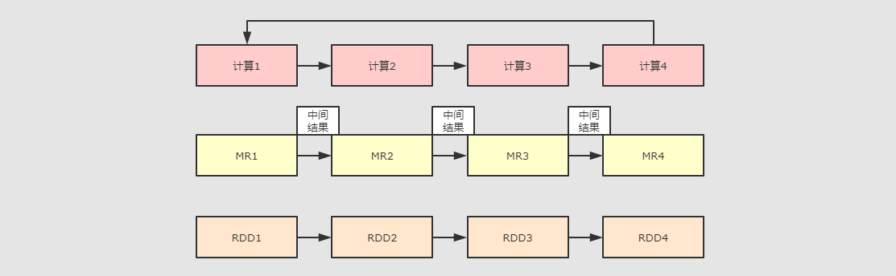

- Spark在产生之前，已经有非常成熟的计算系统存在了，例如：MapReduce，这些计算系统提供了高层次的API，把计算运行在集群中，并提供容错能力，从而实现分布式计算
- 虽然这些框架提供了大量的对访问利用计算机资源的抽象，但是他们缺少对分布式内存的抽象，这些框架多个计算之间的数据复用就是讲中间数据写到一个稳定的文件系统中（例如HDFS），所以产生数据的复制备份，磁盘的I/O以及数据的序列化，所以这些框架在遇到需要多个计算之间复用中间结果的操作时会非常的不高效
- 而这类操作是非常常见的，例如，迭代式计算，交互式数据挖掘，图计算等
- 在认识到这个问题后，学数据的AMPLad提出来一个新的模型，叫做RDDS
- RDDS是一个可以容错且并行的数据结构，他可以让用户显示的将中间结果数据集保存在内存中，并且通过控制数据集的分区来达到数据存放处理的最优化
- 同时RDDS也提供了非常丰富的API来操作数据集
- 后来RDDS被AMPLAab在一个叫做Spark的框架中提供并开源

**总结：**

- Spark是为了解决MapReduce等过去的计算系统无法在内存中保存中间结果的问题
- Spark的核心是RDDS，RDDS不仅是一种计算框架，也是一种数据结构

## 1.2 Spark的特点

1. 速度快：

   - Spark在内存时运行的速度是Hadoop MapReduce的100倍
   - 基于硬盘的运算速度大概晒Hadoop MapReduce的10倍
   - Spark实现了一种叫做RDDS的DAG执行引擎，其数据缓存在内存中可以进行迭代处理

2. 易用

   ```scala
   df = spark.read.json("logs.json")
   df.where("age > 21") /
     .select("name.first") /
     .show()
   ```

   - Spark支持java，scala，python，R，SQL等多种语言的API
   - Spark支持超过80个高级运算符使得用户可以非常轻易的构建并行计算程序
   - Spark可以使用基于Scala，python，R，Sql的Shell交互式查询

3. 通用

   - Spark提供一个完整的技术栈，包括Sql执行，DataSet命令式API，机器学习库MLlib, 图计算框架GraphX, 流计算SparkStreaming
   - 用户可以在同一个应用中同时使用这些工具。

4. 兼容

   - Spark可以运行在 Hadoop Yarn, Apache Mesos, Kubernets, Spark Standalone等集群中
   - Spark 可以访问 HBase, HDFS, Hive, Cassandra 在内的多种数据库

**总结：**

- 支持 Java, Scala, Python 和 R 的 API
- 可扩展至超过 8K 个节点
- 能够在内存中缓存数据集, 以实现交互式数据分析
- 提供命令行窗口, 减少探索式的数据分析的反应时间

## 1.3 Spark组件

Spark最核心的功能是RDDS，RDDS存在于spark-core这个包内，这个包也是Spak最核心的包，同时Spark在spark-core的上层提供了很多工具，以便于适应不用类型的计算

- Spark-Core 和 弹性分布式数据集(RDDs)

  - Spark-Core是整个Spark的基础，提供了分布式任务调度和基本的I/O功能
  - Spark的基础的程序抽象是弹性分布式数据集（RDDS），是一个可以并行操作，有容错的数据集合
    - RDDs 可以通过引用外部存储系统的数据集创建(如HDFS, HBase), 或者通过现有的 RDDs 转换得到
    - RDDs 抽象提供了 Java, Scala, Python 等语言的API
    - RDDs 简化了编程复杂性, 操作 RDDs 类似通过 Scala 或者 Java8 的 Streaming 操作本地数据集合

- Spark SQL

  - Spark SQL 在 `spark-core` 基础之上带出了一个名为 DataSet 和 DataFrame 的数据抽象化的概念
  - Spark SQL 提供了在 Dataset 和 DataFrame 之上执行 SQL 的能力
  - Spark SQL 提供了 DSL, 可以通过 Scala, Java, Python 等语言操作 DataSet 和 DataFrame
  - 它还支持使用 JDBC/ODBC 服务器操作 SQL 语言

- Spark Streaming

  - Spark Streaming 充分利用 `spark-core` 的快速调度能力来运行流分析
  - 它截取小批量的数据并可以对之运行 RDD Transformation
  - 它提供了在同一个程序中同时使用流分析和批量分析的能力

- MLlib

  - MLlib 是 Spark 上分布式机器学习的框架. Spark分布式内存的架构 比 Hadoop磁盘式 的 Apache Mahout 快上 10 倍, 扩展性也非常优良
  - MLlib 可以使用许多常见的机器学习和统计算法, 简化大规模机器学习
  - 汇总统计, 相关性, 分层抽样, 假设检定, 随即数据生成
  - 支持向量机, 回归, 线性回归, 逻辑回归, 决策树, 朴素贝叶斯
  - 协同过滤, ALS
  - K-means
  - SVD奇异值分解, PCA主成分分析
  - TF-IDF, Word2Vec, StandardScaler
  - SGD随机梯度下降, L-BFGS

- GraphX

  GraphX 是分布式图计算框架, 提供了一组可以表达图计算的 API, GraphX 还对这种抽象化提供了优化运行

**总结：**

- Spark 提供了 批处理(RDDs), 结构化查询(DataFrame), 流计算(SparkStreaming), 机器学习(MLlib), 图计算(GraphX) 等组件
- 这些组件均是依托于通用的计算引擎 RDDs 而构建出的, 所以 `spark-core` 的 RDDs 是整个 Spark 的基础

## 1.4 Spark和Hadoop的异同

|            | Hadoop                         | Spark                        |
| ---------- | ------------------------------ | ---------------------------- |
| **类型**   | 基础平台, 包含计算, 存储, 调度 | 分布式计算工具               |
| **场景**   | 大规模数据集上的批处理         | 迭代计算, 交互式计算, 流计算 |
| **延迟**   | 大                             | 小                           |
| **易用性** | API 较为底层, 算法适应性差     | API 较为顶层, 方便使用       |
| **价格**   | 对机器要求低, 便宜             | 对内存有要求, 相对较贵       |

# 2.Spark集群搭建

## 2.1 Spark集群结构

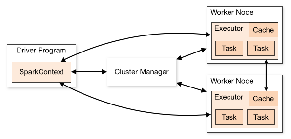

**问题：**Spark 如何将程序运行在一个集群中?


- Spark 自身是没有集群管理工具的, 但是如果想要管理数以千计台机器的集群, 没有一个集群管理工具还不太现实, 所以 Spark 可以借助外部的集群工具来进行管理

- 整个流程就是使用 Spark 的 Client 提交任务, 找到集群管理工具申请资源, 后将计算任务分发到集群中运行

**名词解释**

- Driver

  该进程调用 Spark 程序的 main 方法, 并且启动 SparkContext

- Cluster Manager

  该进程负责和外部集群工具打交道，申请或释放集群资源

- Worker

  该进程是一个守护进程，负责启动和管理Executor

- Executor

  该进程是一个JVM虚拟机，负责运行Spak Task

**运行一个 Spark 程序大致经历如下几个步骤**

1. 启动 Drive, 创建 SparkContext
2. Client 提交程序给 Drive, Drive **向 Cluster Manager 申请集群资源**
3. 资源申请完毕, **在 Worker 中启动 Executor**
4. Driver 将程序转化为 Tasks, 分发给 Executor 执行

**问题1：**Spark 程序可以运行在什么地方?

- Spark 可以将任务运行在两种模式下:
  - **单机,** 使用线程模拟并行来运行程序
  - **集群,** 使用集群管理器来和不同类型的集群交互, 将任务运行在集群中

- 常见的集群管理工具: Hadoop Yarn, Apache Mesos, Kubernetes

**问题2: **Driver 和 Worker 什么时候被启动?

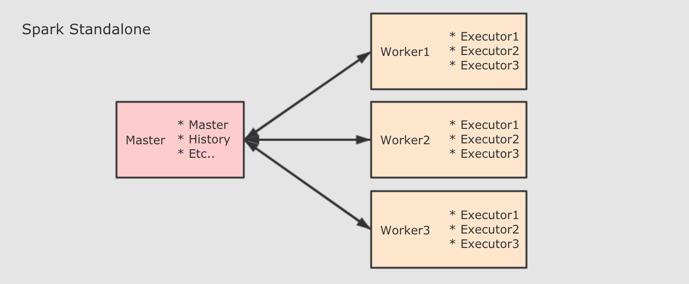

- Standalone 集群中, 分为两个角色: Master 和 Slave, 而 Slave 就是 Worker, 所以在 Standalone 集群中, 启动之初就会创建固定数量的 Worker
- Driver 的启动分为两种模式: Client 和 Cluster. 在 Client 模式下, Driver 运行在 Client 端, 在 Client 启动的时候被启动. 在 Cluster 模式下, Driver 运行在某个 Worker 中, 随着应用的提交而启动

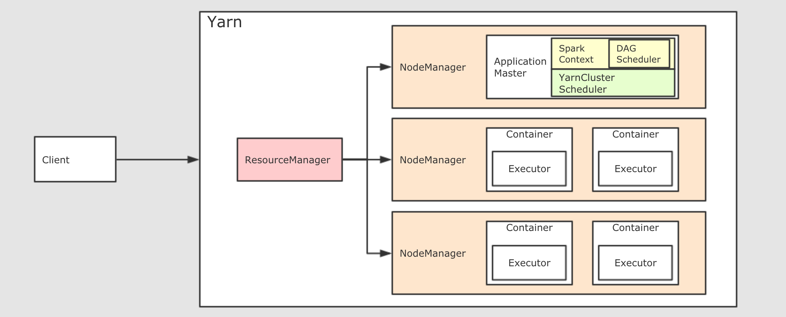

- 在 Yarn 集群模式下, 也依然分为 Client 模式和 Cluster 模式, 较新的版本中已经逐渐在废弃 Client 模式了, 所以上图所示为 Cluster 模式
- 如果要在 Yarn 中运行 Spark 程序, 首先会和 RM 交互, 开启 ApplicationMaster, 其中运行了 Driver, Driver创建基础环境后, 会由 RM 提供对应的容器, 运行 Executor, Executor会反向向 Driver 反向注册自己, 并申请 Tasks 执行
- 在后续的 Spark 任务调度部分, 会更详细介绍

**总结：**

- `Master` 负责总控, 调度, 管理和协调 Worker, 保留资源状况等
- `Slave` 对应 Worker 节点, 用于启动 Executor 执行 Tasks, 定期向 Master汇报
- `Driver` 运行在 Client 或者 Slave(Worker) 中, 默认运行在 Slave(Worker) 中

## 2.2 集群搭建

| bigdata111     | bigdata222 | bigdata333 |
| :------------- | :--------- | :--------- |
| Master         | Slave      | Slave      |
| History Server |            |            |
| Slave          |            |            |

1. 下载并上传spark安装包，解压至目标目录

2. 进入安装目录的conf目录内，修改配置文件

   - spark-env.sh.template 

     ```
     mv spark-env.sh.template spark-env.sh
     vim spark-env.sh
     # 添加一下内容
     
     # 指定 Java Home
     export JAVA_HOME=/opt/module/jdk1.8.0
     
     # 指定 Spark Master 地址
     export SPARK_MASTER_HOST=bigdata111
     export SPARK_MASTER_PORT=7077
     
     # 指定 Spark History 运行参数
     export SPARK_HISTORY_OPTS="-Dspark.history.ui.port=4000 -Dspark.history.retainedApplications=3 -Dspark.history.fs.logDirectory=hdfs://bigdata111:9000/spark_log"
     
     ```

   - slaves.template 

     修改配置文件 `slaves`, 以指定从节点为止, 从在使用 `sbin/start-all.sh` 启动集群的时候, 可以一键启动整个集群所有的 Worker

     ```
     mv slaves.template slaves
     vim slaves
     # 删除localtion 并添加从节点
     
     bigdata111
     bigdata222
     bigdata333
     ```

   - spark-defaults.conf.template 

     默认情况下, Spark 程序运行完毕后, 就无法再查看运行记录的 Web UI 了, 通过 HistoryServer 可以提供一个服务, 通过读取日志文件, 使得我们可以在程序运行结束后, 依然能够查看运行过程

     ```
     mv spark-defaults.conf.template spark-defaults.conf
     vim spark-defaults.conf
     
     #将以下内容复制到末尾，可以指定 Spark 将日志输入到 HDFS 中
     spark.eventLog.enabled  true
     spark.eventLog.dir      hdfs://bigdata111:9000/spark_log
     spark.eventLog.compress true
     ```

   - 为Spark创建HDFS中的日志目录

     ```
     hdfs dfs -mkdir -p /spark_log
     ```

3. 配置profile文件

   vim /etc/profile

   ```
   export SPARK_BIN=/opt/module/spark/bin
   export PATH=$PATH:$SPARK_BIN
   ```

   source /etc/profile

4. 分发和运行

   ```
   # 分发
   scp -r spark-2.3.4 root@bigdata222:/opt/module
   scp -r spark-2.3.4 root@bigdata333:/opt/module
   
   #启动 Spark Master 和 Slaves, 以及 HistoryServer
   sbin/start-all.sh
   sbin/start-history-server.sh
   ```

## 2.3 高可用集群搭建

对于 Spark Standalone 集群来说, 当 Worker 调度出现问题的时候, 会自动的弹性容错, 将出错的 Task 调度到其它 Worker 执行

但是对于 Master 来说, 是会出现单点失败的, 为了避免可能出现的单点失败问题, Spark 提供了两种方式满足高可用

- 使用 Zookeeper 实现 Masters 的主备切换
- 使用文件系统做主备切换

使用文件系统做主备切换的场景实在太小, 所以此处不再花费笔墨介绍

1. 停止Spark集群

   ```
   sbin/stop-all.sh
   ```

2. 修改配置文件, 增加 Spark 运行时参数, 从而指定 Zookeeper 的位置

   - spark-env.sh

     ```
     # 将以下内容注释
     # export SPARK_MASTER_HOST=bigdata111
     
     # 新增以下内容
     # 指定 Spark 运行时参数
     export SPARK_DAEMON_JAVA_OPTS="-Dspark.deploy.recoveryMode=ZOOKEEPER -Dspark.deploy.zookeeper.url=bigdata111:2181,bigdata222:2181,bigdata333:2181 -Dspark.deploy.zookeeper.dir=/spark"
     ```

   - 分发配置文件到整个集群

     ```
     scp -r spark-env.sh root@bigdata222:/opt/module/spark-2.3.4/conf
     
     scp -r spark-env.sh root@bigdata333:/opt/modulespark-2.3.4/conf
     
     ```

3. 启动

   - 在bigdata111 上启动整个集群

     ```
     sbin/start-all.sh
     sbin/start-history-server.sh
     ```

   - 在bigdata222上单独启动一个Master

     ```
     sbin/start-master.sh
     ```

   注：需要启动hdfs集群和zookeeper服务

   ```
   start-dfs.sh
   zkServer.sh start
   ```

4. 浏览器查看Spark的WebUI

   **spark各端口服务器**

   | Service        | port            |
   | :------------- | :-------------- |
   | Master WebUI   | bigdata111:8080 |
   | Worker WebUI   | bigdata111:8081 |
   | History Server | bigdata111:4000 |

   - 你会发现一个是 `ALIVE(主)`, 另外一个是 `STANDBY(备)`

   - 如果关闭一个, 则另外一个成为`ALIVE`, 但是这个过程可能要持续两分钟左右, 需要耐心等待

     ```
     # 在 Node01 中执行如下指令
     sbin/stop-master.sh
     ```

**Spark HA 选举**

Spark HA 的 Leader 选举使用了一个叫做 Curator 的 Zookeeper 客户端来进行

Zookeeper 是一个分布式强一致性的协调服务, Zookeeper 最基本的一个保证是：如果多个节点同时创建一个 ZNode, 只有一个能够成功创建. 这个做法的本质使用的是 Zookeeper 的 ZAB 协议, 能够在分布式环境下达成一致.

# 3.Spark入门

Spark 官方提供了两种方式编写代码, 都比较重要, 分别如下

- `spark-shell`
  Spark shell 是 Spark 提供的一个基于 Scala 语言的交互式解释器, 类似于 Scala 提供的交互式解释器, Spark shell 也可以直接在 Shell 中编写代码执行
  这种方式也比较重要, 因为一般的数据分析任务可能需要探索着进行, 不是一蹴而就的, 使用 Spark shell 先进行探索, 当代码稳定以后, 使用独立应用的方式来提交任务, 这样是一个比较常见的流程
- `spark-submit`
  Spark submit 是一个命令, 用于提交 Scala 编写的基于 Spark 框架, 这种提交方式常用作于在集群中运行任务

## 3.1 Spark shell 的方式编写 WordCount

**概要：**

在初始阶段工作可以全部使用 Spark shell 完成, 它可以加快原型开发, 使得迭代更快, 很快就能看到想法的结果. 但是随着项目规模越来越大, 这种方式不利于代码维护, 所以可以编写独立应用. 一般情况下, 在探索阶段使用 Spark shell, 在最终使用独立应用的方式编写代码并使用 Maven 打包上线运行

接下来使用 Spark shell 的方式编写一个 WordCount

**Spark shell 简介**

- 启动 Spark shell
  进入 Spark 安装目录后执行 `spark-shell --master master` 就可以提交Spark 任务
- Spark shell 的原理是把每一行 Scala 代码编译成类, 最终交由 Spark 执行

Master 的地址可以有如下几种设置方式：

| 地址                | 解释                                                         |
| :------------------ | :----------------------------------------------------------- |
| `local[N]`          | 使用 N 条 Worker 线程在本地运行                              |
| `spark://host:port` | 在 Spark standalone 中运行, 指定 Spark 集群的 Master 地址, 端口默认为 7077 |
| `mesos://host:port` | 在 Apache Mesos 中运行, 指定 Mesos 的地址                    |
| `yarn`              | 在 Yarn 中运行, Yarn 的地址由环境变量 `HADOOP_CONF_DIR` 来指定 |


1. 准备文件

   ```txt
   hadoop spark flume
   spark hadoop
   flume hadoop
   ```

2. 启动Spark Shell

   ```
   bin/spark-shell --master local[6]
   ```

   注：参数`local[6]` 指定本地运行并采用6个线程

3. 执行如下代码

   ```scala
   scala> val sourceRdd = sc.textFile("file:///export/data/wordcount.txt")
   sourceRdd: org.apache.spark.rdd.RDD[String] = file:///export/data/wordcount.txt MapPartitionsRDD[1] at textFile at <console>:24
   
   scala> val flattenCountRdd = sourceRdd.flatMap(_.split(" ")).map((_, 1))
   flattenCountRdd: org.apache.spark.rdd.RDD[(String, Int)] = MapPartitionsRDD[3] at map at <console>:26
   
   scala> val aggCountRdd = flattenCountRdd.reduceByKey(_ + _)
   aggCountRdd: org.apache.spark.rdd.RDD[(String, Int)] = ShuffledRDD[4] at reduceByKey at <console>:28
   
   scala> val result = aggCountRdd.collect
   result: Array[(String, Int)] = Array((spark,2), (hadoop,3), (flume,2))
   ```

   **注：sc**

   上述代码中 `sc` 变量指的是 SparkContext, 是 Spark 程序的上下文和入口

   正常情况下我们需要自己创建, 但是如果使用 Spark shell 的话, Spark shell 会帮助我们创建, 并且以变量 `sc` 的形式提供给我们调用

4. 程序运行流程

   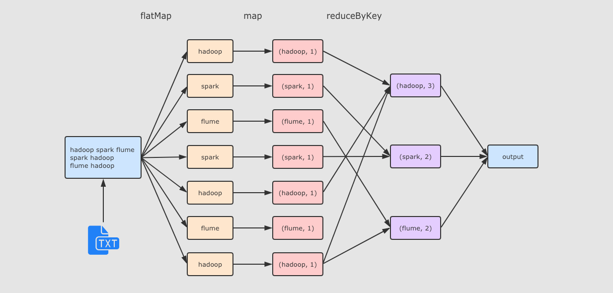

   - `flatMap(_.split(" "))` 将数据转为数组的形式, 并展平为多个数据
   - `map_, 1` 将数据转换为元组的形式
   - `reduceByKey(_ + _)` 计算每个 Key 出现的次数

## 3.2 读取HDFS上的文件

1. 上传文件到HDFS中

   ```
   hdfs dfs -mkdir /dataset
   hdfs dfs -put wordcount.txt /dataset/
   ```

2. 在 Spark shell 中访问 HDFS

   ```scala
   val sourceRdd = sc.textFile("hdfs://bigdata111/dataset/wordcount.txt")
   val flattenCountRdd = sourceRdd.flatMap(_.split(" ")).map((_, 1))
   val aggCountRdd = flattenCountRdd.reduceByKey(_ + _)
   val result = aggCountRdd.collect
   ```

   **注：如何使得 Spark 可以访问 HDFS?**

   可以通过指定 HDFS 的 NameNode 地址直接访问, 类似于上面代码中的 `sc.textFile("hdfs://bigdata111/dataset/wordcount.txt")`

   **也可以通过向 Spark 配置 Hadoop 的路径, 来通过路径直接访问**

   - 在 `spark-env.sh` 中添加 Hadoop 的配置路径

     `export HADOOP_CONF_DIR="/etc/hadoop/conf"`

   - 在配置过后, 可以直用`hdfs:///路径` 的形式直接访问

     ```
     sc.textFile("hdfs:///dataset/wordcount.txt")
     ```

   - 在配置过后, 也可以直接使用路径访问

     ```
     sc.textFile("/dataset/wordcount.txt")
     ```

## 3.3 编写独立应用提交spark任务

1. 创建maven工程，并添加如下pom依赖

   ```xml
    <properties>
           <scala.version>2.11.8</scala.version>
           <spark.version>2.3.4</spark.version>
           <slf4j.version>1.7.16</slf4j.version>
           <log4j.version>1.2.17</log4j.version>
       </properties>
   
       <dependencies>
           <dependency>
               <groupId>org.scala-lang</groupId>
               <artifactId>scala-library</artifactId>
               <version>${scala.version}</version>
           </dependency>
           <dependency>
               <groupId>org.apache.spark</groupId>
               <artifactId>spark-core_2.11</artifactId>
               <version>${spark.version}</version>
           </dependency>
           <dependency>
               <groupId>org.apache.hadoop</groupId>
               <artifactId>hadoop-client</artifactId>
               <version>2.8.4</version>
           </dependency>
   
           <dependency>
               <groupId>org.slf4j</groupId>
               <artifactId>jcl-over-slf4j</artifactId>
               <version>${slf4j.version}</version>
           </dependency>
           <dependency>
               <groupId>org.slf4j</groupId>
               <artifactId>slf4j-api</artifactId>
               <version>${slf4j.version}</version>
           </dependency>
           <dependency>
               <groupId>org.slf4j</groupId>
               <artifactId>slf4j-log4j12</artifactId>
               <version>${slf4j.version}</version>
           </dependency>
           <dependency>
               <groupId>log4j</groupId>
               <artifactId>log4j</artifactId>
               <version>${log4j.version}</version>
           </dependency>
           <dependency>
               <groupId>junit</groupId>
               <artifactId>junit</artifactId>
               <version>4.10</version>
               <scope>provided</scope>
           </dependency>
       </dependencies>
   
       <build>
           <sourceDirectory>src/main/scala</sourceDirectory>
           <testSourceDirectory>src/test/scala</testSourceDirectory>
           <plugins>
   
               <plugin>
                   <groupId>org.apache.maven.plugins</groupId>
                   <artifactId>maven-compiler-plugin</artifactId>
                   <version>3.0</version>
                   <configuration>
                       <source>1.8</source>
                       <target>1.8</target>
                       <encoding>UTF-8</encoding>
                   </configuration>
               </plugin>
   
               <plugin>
                   <groupId>net.alchim31.maven</groupId>
                   <artifactId>scala-maven-plugin</artifactId>
                   <version>3.2.0</version>
                   <executions>
                       <execution>
                           <goals>
                               <goal>compile</goal>
                               <goal>testCompile</goal>
                           </goals>
                           <configuration>
                               <args>
                                   <arg>-dependencyfile</arg>
                                   <arg>${project.build.directory}/.scala_dependencies</arg>
                               </args>
                           </configuration>
                       </execution>
                   </executions>
               </plugin>
   
               <plugin>
                   <groupId>org.apache.maven.plugins</groupId>
                   <artifactId>maven-shade-plugin</artifactId>
                   <version>3.1.1</version>
                   <executions>
                       <execution>
                           <phase>package</phase>
                           <goals>
                               <goal>shade</goal>
                           </goals>
                           <configuration>
                               <filters>
                                   <filter>
                                       <artifact>*:*</artifact>
                                       <excludes>
                                           <exclude>META-INF/*.SF</exclude>
                                           <exclude>META-INF/*.DSA</exclude>
                                           <exclude>META-INF/*.RSA</exclude>
                                       </excludes>
                                   </filter>
                               </filters>
                               <transformers>
                                   <transformer implementation="org.apache.maven.plugins.shade.resource.ManifestResourceTransformer">
                                       <mainClass></mainClass>
                                   </transformer>
                               </transformers>
                           </configuration>
                       </execution>
                   </executions>
               </plugin>
           </plugins>
       </build>
   ```
   

   
2. 编写代码

   ```scala
/**
    * @Class:spark.Rdd.wordcount
    * @Descript:
    * @Author:宋天
    * @Date:2020/1/29
    */
   class wordcount {
       @Test
     def asd(): Unit = {
       // 1. 创建 Spark Context
       val conf = new SparkConf().setAppName("wordcount").setMaster("local[2]")
       val sc: SparkContext = new SparkContext(conf)
   
       // 2. 加载文件
       val source: RDD[String] = sc.textFile("hdfs://bigdata111:9000/dataset/wordcount.txt", 2)
   //    3. 处理文件
   //    3.1 拆分单词
       val words: RDD[String] = source.flatMap { line => line.split(" ") }
   //    3.2 每个单词指定一个词频 1
       val wordsTuple: RDD[(String, Int)] = words.map { word => (word, 1) }
   //    3.3 聚合
       val wordsCount: RDD[(String, Int)] = wordsTuple.reduceByKey { (x, y) => x + y }
   
       // 3. 查看执行结果
       val result = wordsCount.collect
       result.foreach(item=>println(item))
     }
   }
   
   ```
   
   注：和 Spark shell 中不同, 独立应用需要手动创建 SparkContext
   
3. 运行

   运行 Spark 独立应用大致有两种方式, 一种是直接在 IDEA 中调试, 另一种是可以在提交至 Spark 集群中运行, 而 Spark 又支持多种集群, 不同的集群有不同的运行方式

   - 本地运行：IDEA直接运行


   - 集群运行：集群运行时需要注意修改部分代码，第一部分为去掉`setMaster("local[2]")`，第二步为修改读取文件的路径为hdfs路径或者服务器路径，然后采用IDEA的打包工具打包并上传到服务器，并通过如下代码执行

     ```
     spark-submit --master spark://bigdata111:7077 /
     --class Rdds.WordCounts /
     original-spark-0.1.0.jar
     ```

     

   参数解析：

   | 参数                 | 解释                                                         |
   | -------------------- | ------------------------------------------------------------ |
   | `--master `          | 同 Spark shell 的 Master, 可以是spark, yarn, mesos, kubernetes等 URL |
   | `--deploy-mode `     | Driver 运行位置, 可选 Client 和 Cluster, 分别对应运行在本地和集群(Worker)中 |
   | `--class `           | Jar 中的 Class, 程序入口                                     |
   | `--jars `            | 依赖 Jar 包的位置                                            |
   | `--driver-memory `   | Driver 程序运行所需要的内存, 默认 512M                       |
   | `--executor-memory ` | Executor 的内存大小, 默认 1G                                 |

## 3.4 spark任务调度过程

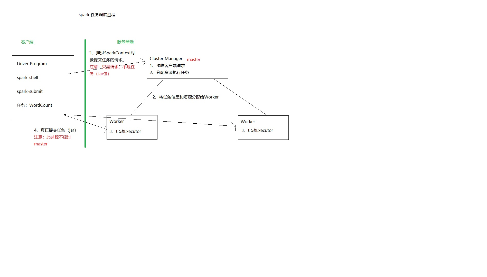

1. 客户端（driver）通过sparkcontext对象，将请求交给master
2. master将任务信息和资源分配给worker
3. worker启动executor
4. 真正的任务提交，driver给worker提交jar，不经过master

## 3.5 总结

三种不同的运行方式

1. Spark shell
   - 作用
     - 一般用作于探索阶段, 通过 Spark shell 快速的探索数据规律
     - 当探索阶段结束后, 代码确定以后, 通过独立应用的形式上线运行
   - 功能
     - Spark shell 可以选择在集群模式下运行, 还是在线程模式下运行
     - Spark shell 是一个交互式的运行环境, 已经内置好了 SparkContext 和 SparkSession 对象, 可以直接使用
     - Spark shell 一般运行在集群中安装有 Spark client 的服务器中, 所以可以自有的访问 HDFS
2. 本地运行
   - 作用
     - 在编写独立应用的时候, 每次都要提交到集群中还是不方便, 另外很多时候需要调试程序, 所以在 IDEA 中直接运行会比较方便, 无需打包上传了
   - 功能
     - 因为本地运行一般是在开发者的机器中运行, 而不是集群中, 所以很难直接使用 HDFS 等集群服务, 需要做一些本地配置, 用的比较少
     - 需要手动创建 SparkContext
3. 集群运行
   - 作用
     - 正式环境下比较多见, 独立应用编写好以后, 打包上传到集群中, 使用`spark-submit`来运行, 可以完整的使用集群资源
   - 功能
     - 同时在集群中通过`spark-submit`来运行程序也可以选择是用线程模式还是集群模式
     - 集群中运行是全功能的, HDFS 的访问, Hive 的访问都比较方便
     - 需要手动创建 SparkContext

# 4.RDD入门

## 4.1 初步了解

```scala
object WordCounts {

  def main(args: Array[String]): Unit = {
    // 1. 创建 Spark Context
    val conf = new SparkConf().setAppName("wordcount").setMaster("local[2]")
    val sc: SparkContext = new SparkContext(conf)

    // 2. 读取文件并计算词频
    val source: RDD[String] = sc.textFile("hdfs://bigdata111/dataset/wordcount.txt", 2)
    val words: RDD[String] = source.flatMap { line => line.split(" ") }
    val wordsTuple: RDD[(String, Int)] = words.map { word => (word, 1) }
    val wordsCount: RDD[(String, Int)] = wordsTuple.reduceByKey { (x, y) => x + y }

    // 3. 查看执行结果
    println(wordsCount.collect)
  }
}
```

在这份 WordCount 代码中, 大致的思路如下:

1. 使用 `sc.textFile()` 方法读取 HDFS 中的文件, 并生成一个 `RDD`
2. 使用 `flatMap` 算子将读取到的每一行字符串打散成单词, 并把每个单词变成新的行
3. 使用 `map` 算子将每个单词转换成 `(word, 1)` 这种元组形式
4. 使用 `reduceByKey` 统计单词对应的频率

其中所使用到的**算子**有如下几个:

- `flatMap` 是一对多
- `map` 是一对一
- `reduceByKey` 是按照 Key 聚合, 类似 MapReduce 中的 Shuffled

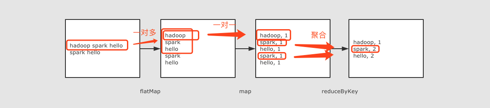

## 4.2 RDD的概念

**定义：**

- RDD, 全称为 Resilient Distributed Datasets, 是一个容错的, 并行的数据结构, 可以让用户显式地将数据存储到磁盘和内存中, 并能控制数据的分区.
- 同时, RDD 还提供了一组丰富的操作来操作这些数据. 在这些操作中, 诸如 map, flatMap, filter 等转换操作实现了 Monad 模式, 很好地契合了 Scala 的集合操作. 除此之外, RDD 还提供了诸如 join, groupBy, reduceByKey 等更为方便的操作, 以支持常见的数据运算.
- 通常来讲, 针对数据处理有几种常见模型, 包括: Iterative Algorithms, Relational Queries, MapReduce, Stream Processing. 例如 Hadoop MapReduce 采用了 MapReduce 模型, Storm 则采用了 Stream Processing 模型. RDD 混合了这四种模型, 使得 Spark 可以应用于各种大数据处理场景.
- RDD 作为数据结构, 本质上是一个只读的分区记录集合. 一个 RDD 可以包含多个分区, 每个分区就是一个 DataSet 片段.
- RDD 之间可以相互依赖, 如果 RDD 的每个分区最多只能被一个子 RDD 的一个分区使用，则称之为窄依赖, 若被多个子 RDD 的分区依赖，则称之为宽依赖. 不同的操作依据其特性, 可能会产生不同的依赖. 例如 map 操作会产生窄依赖, 而 join 操作则产生宽依赖.

**特性**

1. 是一组分区
   
   - 理解：RDD是由分区组成，每个分区运行在不同的Worker上，通过这种方式来实现分布式计算。
   - RDD是逻辑概念，分区是物理概念。
2. 在RDD中，有一系列函数，用于处理计算每个分区中的数据。这里把函数叫算子。
3. RDD之间存在依赖关系。
4. 自定义分区规则

   - 可以自定义分区规则来创建RDD		

   - 创建RDD时，可以指定分区，也可以自定义分区规则，类似于MapReduce的分区
5. 优先选择离文件位置近的节点执行。

**特点：**

1. RDD 是一个编程模型
   - RDD 允许用户显式的指定数据存放在内存或者磁盘
   - RDD 是分布式的, 用户可以控制 RDD 的分区
2. RDD 是一个编程模型
   - RDD 提供了丰富的操作
   - RDD 提供了 map, flatMap, filter 等操作符, 用以实现 Monad 模式
   - RDD 提供了 reduceByKey, groupByKey 等操作符, 用以操作 Key-Value 型数据
   - RDD 提供了 max, min, mean 等操作符, 用以操作数字型的数据
3. RDD 是混合型的编程模型, 可以支持迭代计算, 关系查询, MapReduce, 流计算
4. RDD 是只读的
5. RDD 之间有依赖关系, 根据执行操作的操作符的不同, 依赖关系可以分为宽依赖和窄依赖

**RDD分区**

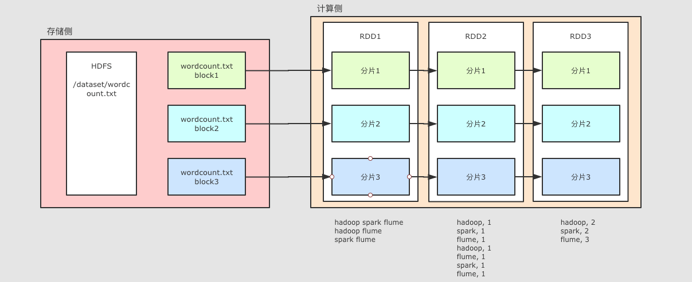

**整个 WordCount 案例的程序从结构上可以用上图表示, 分为两个大部分**

- 存储
  - 文件如果存放在 HDFS 上, 是分块的, 类似上图所示, 这个 `wordcount.txt` 分了三块
- 计算
  - Spark 不止可以读取 HDFS, Spark 还可以读取很多其它的数据集, Spark 可以从数据集中创建出 RDD
  - 例如上图中, 使用了一个 RDD 表示 HDFS 上的某一个文件, 这个文件在 HDFS 中是分三块, 那么 RDD 在读取的时候就也有三个分区, 每个 RDD 的分区对应了一个 HDFS 的分块
  - 后续 RDD 在计算的时候, 可以更改分区, 也可以保持三个分区, 每个分区之间有依赖关系, 例如说 RDD2 的分区一依赖了 RDD1 的分区一
  - RDD 之所以要设计为有分区的, 是因为要进行分布式计算, 每个不同的分区可以在不同的线程, 或者进程, 甚至节点中, 从而做到并行计算

## 4.3 创建RDD

简略的说, RDD 有三种创建方式

- RDD 可以通过本地集合直接创建
- RDD 也可以通过读取外部数据集来创建
- RDD 也可以通过其它的 RDD 衍生而来

### 4.3.1 本地集合创建RDD

```scala
val conf = new SparkConf().setAppName("lcoal").setMaster("local[2]")
val sc = new SparkContext(conf)

val list = List(1, 2, 3, 4, 5, 6)
val rddParallelize = sc.parallelize(list, 2)
val rddMake = sc.makeRDD(list, 2)
```

通过 `parallelize` 和 `makeRDD` 这两个 API 可以通过本地集合创建 RDD

这两个 API 本质上是一样的, 在 `makeRDD` 这个方法的内部, 最终也是调用了 `parallelize`

因为不是从外部直接读取数据集的, 所以没有外部的分区可以借鉴, 于是在这两个方法都都有两个参数, 第一个参数是本地集合, 第二个参数是分区数

### 4.3.2 通过读取外部文件创建 RDD

```java
val conf = new SparkConf().setMaster("local[2]")
val sc = new SparkContext(conf)

val source: RDD[String] = sc.textFile("hdfs://bigdata111:9000/dataset/wordcount.txt")
```

访问方式

- 支持访问文件夹, 例如 `sc.textFile("hdfs:///dataset")`
- 支持访问压缩文件, 例如 `sc.textFile("hdfs:///dataset/words.gz")`
- 支持通过通配符访问, 例如 `sc.textFile("hdfs:///dataset/*.txt")`

**注：**

如果把 Spark 应用跑在集群上, 则 Worker 有可能在任何一个节点运行

所以如果使用 `file:///…;` 形式访问本地文件的话, 要确保所有的 Worker 中对应路径上有这个文件, 否则可能会报错无法找到文件

**分区**

- 默认情况下读取 HDFS 中文件的时候, 每个 HDFS 的 `block` 对应一个 RDD 的 `partition`, `block` 的默认是128M
- 通过第二个参数, 可以指定分区数量, 例如 `sc.textFile("hdfs://bigdata111:9000/dataset/wordcount.txt", 20)`
- 如果通过第二个参数指定了分区, 这个分区数量一定不能小于`block`数

**通常每个 CPU core 对应 2 - 4 个分区是合理的值**

**支持的平台**

- 支持 Hadoop 的几乎所有数据格式, 支持 HDFS 的访问
- 通过第三方的支持, 可以访问AWS和阿里云中的文件, 详情查看对应平台的 API

### 4.3.3 通过其它的 RDD 衍生新的 RDD

```scala
val conf = new SparkConf().setAppName("wordcount").setMaster("local[2]")
val sc = new SparkContext(conf)

val source: RDD[String] = sc.textFile("hdfs://bigdata111:9000/dataset/wordcount.txt", 20)
val words = source.flatMap { line => line.split(" ") }
```

- `source` 是通过读取 HDFS 中的文件所创建的
- `words` 是通过 `source` 调用算子 `map` 生成的新 RDD

## 4.4 RDD算子的初步了解

### 4.4.1 Map算子

```scala
 // 1. 创建 Spark Context
    val conf = new SparkConf().setAppName("wordcount").setMaster("local[2]")
    val sc: SparkContext = new SparkContext(conf)

//创建RDD
var rdd = sc.parallelize(Seq(1, 2, 3))
  .map( num => num * 10 )//执行map操作
  .collect()//得到结果
//遍历结果
rdd.foreach(item => println(item))
```


**作用**

把 RDD 中的数据 一对一 的转为另一种形式

**调用**

```
def map[U: ClassTag](f: T ⇒ U): RDD[U]
```

**参数**

`f` → Map 算子是 `原RDD → 新RDD` 的过程, 这个函数的参数是原 RDD 数据, 返回值是经过函数转换的新 RDD 的数据

**注意点**

Map 是一对一, 如果函数是 `String → Array[String]` 则新的 RDD 中每条数据就是一个数组

### 4.4.2 FlatMap 算子

```scala
 // 1. 创建 Spark Context
val conf = new SparkConf().setAppName("wordcount").setMaster("local[2]")
val sc: SparkContext = new SparkContext(conf)

//创建Rdd
val rdd = sc.parallelize(Seq("Hello lily", "Hello lucy", "Hello tim"))
  .flatMap( line => line.split(" ") )//处理数据
  .collect()//得到结果
//遍历结果
rdd.foreach(item=>println(item))
//关闭sc
sc.stop()
```

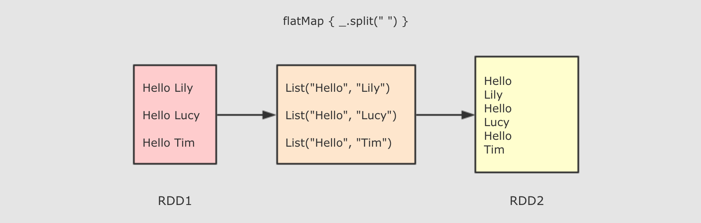

**作用**

FlatMap 算子和 Map 算子类似, 但是 FlatMap 是一对多

**调用**

```
def flatMap[U: ClassTag](f: T ⇒ List[U]): RDD[U]
```

**参数**

`f` → 参数是原 RDD 数据, 返回值是经过函数转换的新 RDD 的数据, 需要注意的是返回值是一个集合, 集合中的数据会被展平后再放入新的 RDD

**注意点**

flatMap 其实是两个操作, 是 `map + flatten`, 也就是先转换, 后把转换而来的 List 展开

### 4.4.3 ReduceByKey 算子

```scala
 // 1. 创建 Spark Context
    val conf = new SparkConf().setAppName("wordcount").setMaster("local[2]")
    val sc: SparkContext = new SparkContext(conf)

//创建Rdd
val rdd = sc.parallelize(Seq("Hello lily", "Hello lucy", "Hello tim"))
  .flatMap(item=>item.split(" "))//处理数据
  .map(item=>(item,1))
  .reduceByKey( (curr, agg) => curr + agg )
  .collect()//得到结果
//关闭 sc
sc.stop()
```

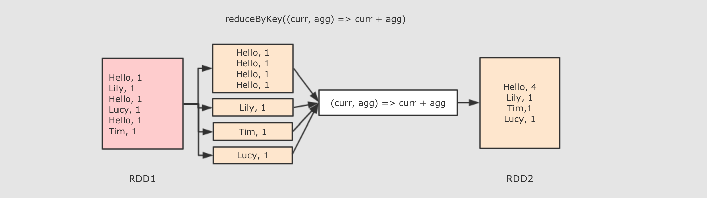

**作用**

首先按照 Key 分组, 接下来把整组的 Value 计算出一个聚合值, 这个操作非常类似于 MapReduce 中的 Reduce

**调用**

```
def reduceByKey(func: (V, V) ⇒ V): RDD[(K, V)]
```

**参数**

func → 执行数据处理的函数, 传入两个参数, 一个是当前值, 一个是局部汇总, 这个函数需要有一个输出, 输出就是这个 Key 的汇总结果

**注意点**

- ReduceByKey 只能作用于 Key-Value 型数据, Key-Value 型数据在当前语境中特指 Tuple2
- ReduceByKey 是一个需要 Shuffled 的操作
- 和其它的 Shuffled 相比, ReduceByKey是高效的, 因为类似 MapReduce 的, 在 Map 端有一个 Cominer, 这样 I/O 的数据便会减少

### 4.4.4 总结：

1. map 和 flatMap 算子都是转换, 只是 flatMap 在转换过后会再执行展开, 所以 map 是一对一, flatMap 是一对多
2. reduceByKey 类似 MapReduce 中的 Reduce


## 4.5 RDD的依赖关系和Spark任务中的Stage

依赖关系：宽依赖、窄依赖

- 宽依赖：多个子RDD分区，依赖同一个父RDD分区
- 窄依赖：每一个父RDD分区，最多被一个子RDD分区使用

任务划分阶段的依据：宽依赖		


- RDD的依赖关系

  RDD和它依赖的父RDD（s）的关系有两种不同的类型，即窄依赖（narrow dependency）和宽依赖（wide dependency）。

  

  - 窄依赖指的是每一个父RDD的Partition最多被子RDD的一个Partition使用

    总结：窄依赖我们形象的比喻为**独生子女**

  - 宽依赖指的是多个子RDD的Partition会依赖同一个父RDD的Partition

    总结：窄依赖我们形象的比喻为**超生**

- Spark任务中的Stage

  DAG(Directed Acyclic Graph)叫做有向无环图，原始的RDD通过一系列的转换就就形成了DAG，根据RDD之间的依赖关系的不同将DAG划分成不同的Stage，对于窄依赖，partition的转换处理在Stage中完成计算。对于宽依赖，由于有Shuffle的存在，只能在parent RDD处理完成后，才能开始接下来的计算，因此**宽依赖是划分Stage的依据**。

  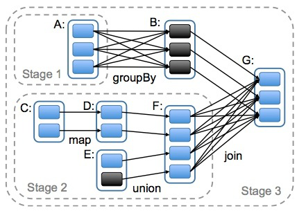

# 5.RDD高级算子初步练习

##  5.1 mapPartitionsWithIndex

对RDD中的每个分区（带有下标）进行操作，下标用index来表示
通过这个算子可以获取分区号

```
def mapPartitionsWithIndex[U](f: (Int, Iterator[T]) ⇒ Iterator[U])
f: (Int, Iterator[T]) ⇒ Iterator[U]
```

**解释：定义一个函数，对分区进行处理**
f 接收两个参数，第一个参数 代表分区号。第二个代表分区中的元素。Iterator[U] 处理完后的结果

示例：

```scala
object scala {
  def main(args: Array[String]): Unit = {
    val conf = new SparkConf().setAppName("wordcount").setMaster("local[2]")
    val sc: SparkContext = new SparkContext(conf)

    val rdd1 = sc.parallelize(List(1,2,3,4,5,6,7,8,9),3)

    val rdd2 = rdd1.mapPartitionsWithIndex(fun1).collect()

    rdd2.foreach(item=>println(item))
  }

  def fun1(index:Int,iter:Iterator[Int]) : Iterator[String] = {
     iter.toList.map(x => "[PartId: " + index + " , value = " + x + " ]").iterator
     }
}
//输出
[PartId: 0 , value = 1 ]
[PartId: 0 , value = 2 ]
[PartId: 0 , value = 3 ]
[PartId: 1 , value = 4 ]
[PartId: 1 , value = 5 ]
[PartId: 1 , value = 6 ]
[PartId: 2 , value = 7 ]
[PartId: 2 , value = 8 ]
[PartId: 2 , value = 9 ]
```

## 5.2 aggregate

先对局部聚合，再对全局聚合

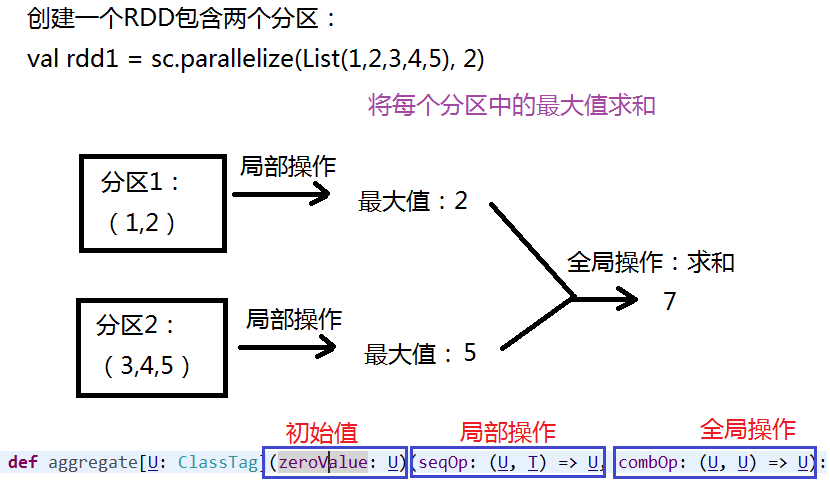

示例1：

```scala
import math._
object scala {
  def main(args: Array[String]): Unit = {
    val conf = new SparkConf().setAppName("wordcount").setMaster("local[2]")
    val sc: SparkContext = new SparkContext(conf)

    val rdd1 = sc.parallelize(List(1,2,3,4,5), 2)
    val rdd2 = rdd1.mapPartitionsWithIndex(fun1).collect()
    rdd2.foreach(item=>println(item))
    /**
     * [PartId: 0 , value = 1 ]
     * [PartId: 0 , value = 2 ]
     * [PartId: 1 , value = 3 ]
     * [PartId: 1 , value = 4 ]
     * [PartId: 1 , value = 5 ]
     */

//      先对局部数据进行聚合操作，然后再对全局数据进行聚合操作
//    初始值为0时
    val rdd3 = rdd1.aggregate(0)(max(_,_),_+_)
    println(rdd3) // 7
//    修改初始值为10
    val rdd4 = rdd1.aggregate(10)(max(_,_),_+_)
    println(rdd4) // 30
    /**
     * 分析结果：
     * 初始值是10，代表每个分区中，都多了一个10.
     * 局部操作，每个分区的最大值都是10.
     * 全局操作，10 也要在全局操作时生效，即 10 + 10 + 10 = 30
     *
     */
  }

  def fun1(index:Int,iter:Iterator[Int]) : Iterator[String] = {
     iter.toList.map(x => "[PartId: " + index + " , value = " + x + " ]").iterator
     }
}
```

示例2：求和

方式1：map

方式2：使用聚合操作

```scala
val rdd1 = sc.parallelize(List(1, 2, 3, 4, 5), 2)
val rdd2 = rdd1.aggregate(0)(_ + _, _ + _);
println(rdd2)//15
```

例子：

```scala
object scala {
  def main(args: Array[String]): Unit = {
    val conf = new SparkConf().setAppName("wordcount").setMaster("local[2]")
    val sc: SparkContext = new SparkContext(conf)

    val rdd1 = sc.parallelize(List("a","b","c","d","e","f"),2)
    val rdd2 = rdd1.mapPartitionsWithIndex(fun2).collect()
    rdd2.foreach(item=>println(item))
    /**
     * [PartId: 0 , value = a ]
     * [PartId: 0 , value = b ]
     * [PartId: 0 , value = c ]
     * [PartId: 1 , value = d ]
     * [PartId: 1 , value = e ]
     * [PartId: 1 , value = f ]
     * */
//    问题：下列输出结果是什么
    val rdd3 = rdd1.aggregate("")(_+_,_+_)
    println( rdd3)  // abcdef

    val rdd4 = rdd1.aggregate("")(_+_,_+_)
    println( rdd4)  // defabc

    val rdd5 = rdd1.aggregate("*")(_+_,_+_)
    println( rdd5)  // **def*abc

    val rdd6 = rdd1.aggregate("*")(_+_,_+_)
    println( rdd6)  // **abc*def
  }

  def fun2(index:Int,iter:Iterator[String]) : Iterator[String] = {
    iter.toList.map(x => "[PartId: " + index + " , value = " + x + " ]").iterator
  }
}

```

复杂版例子：

```scala
object scala {
  def main(args: Array[String]): Unit = {
    val conf = new SparkConf().setAppName("wordcount").setMaster("local[2]")
    val sc: SparkContext = new SparkContext(conf)

    val rdd1 = sc.parallelize(List("12","23","345","4567"),2)
    val rdd2 = rdd1.mapPartitionsWithIndex(fun2).collect()
    rdd2.foreach(item=>println(item))
    /**
     * [PartId: 0 , value = 12 ]
     * [PartId: 0 , value = 23 ]
     * [PartId: 1 , value = 345 ]
     * [PartId: 1 , value = 4567 ]
     */
    val rdd3 = rdd1.aggregate("")((x,y)=>math.max(x.length,y.length).toString,(x,y)=>x+y)
    println(rdd3) //24
  }
  def fun1(index:Int,iter:Iterator[Int]) : Iterator[String] = {
     iter.toList.map(x => "[PartId: " + index + " , value = " + x + " ]").iterator
  }
}
```

分析：

- 第一个分区：
  - 第一次比较："" 和 "12" 比，求长度最大值：2 。2 ---> "2".
  - 第二次比较："2" 和 "23" 比，求长度最大值：2 。2 ---> "2".
- 第二个分区：
  - 第一次比较："" 和 "345" 比，求长度最大值：3 。3 ---> "3".
  - 第二次比较："3" 和 "4567" 比，求长度最大值：4 。4 ---> "4".

## 5.3 aggregateByKey

类似于aggregate，操作<Key Value>的数据类型

示例：

```scala
object scala {
  def main(args: Array[String]): Unit = {
    val conf = new SparkConf().setAppName("wordcount").setMaster("local[2]")
    val sc: SparkContext = new SparkContext(conf)

    val rdd1 = sc.parallelize(List(("cat",2),("cat",5),("mouse",4),("cat",12),("dog",12),("mouse",2)),2)
    val rdd2 = rdd1.mapPartitionsWithIndex(fun3).collect()
    rdd2.foreach(item=>println(item))
    /**
     * [PartId: 0 , value = (cat,2) ]
     * [PartId: 0 , value = (cat,5) ]
     * [PartId: 0 , value = (mouse,4) ]
     * [PartId: 1 , value = (cat,12) ]
     * [PartId: 1 , value = (dog,12) ]
     * [PartId: 1 , value = (mouse,2) ]
     */

   val rdd3 =  rdd1.aggregateByKey(0)(math.max(_,_),_+_).collect()
    rdd3.foreach(item=>println(item))
    /**
     * (dog,12)
     * (cat,17)
     * (mouse,6)
     */
  }
  def fun3(index:Int,iter:Iterator[(String,Int)]) : Iterator[String] = {
    iter.toList.map(x => "[PartId: " + index + " , value = " + x + " ]").iterator
  }
}

```

程序分析：
			0：(cat,5)(mouse,4)
			1：(cat,12)(dog,12)(mouse,2)

## 5.4 coalesce与repartition

这两个算子都与分区有关系

都是对RDD进行重分区。创建RDD时可以创建分区个数，这两个用于重分区。

**区别：**

- coalesce ： 默认不会进行shuffle。
- repartition：对数据真正进行shuffle（在网络上重新分区）

示例：

```scala
object scala {
  def main(args: Array[String]): Unit = {
    val conf = new SparkConf().setAppName("wordcount").setMaster("local[2]")
    val sc: SparkContext = new SparkContext(conf)

    val rdd1 = sc.parallelize(List(1,2,3,4,5,6,7,8,9),2)
    val rdd2 = rdd1.repartition(3)
    rdd2.foreach(item=>println(item))


    val rdd3 = rdd1.coalesce(3)
    println( rdd3.partitions.length) // 2 可见并未进行重分区
    
    val rdd4 = rdd1.coalesce(3,true)
    println( rdd4.partitions.length) //3 此时进行了重分区操作
  }
}

```

## 5.5 其他高级算子

http://homepage.cs.latrobe.edu.au/zhe/ZhenHeSparkRDDAPIExamples.html

# 6.编程案例

使用 Spark Core 完成编程案例。

## 6.1 分析Tomcat访问日志。

需求：找到访问量最高的两个网页。

- 对网页的访问量 统计求和。
- 排序，降序排列

```scala
package Rdd

import org.apache.spark.rdd.RDD
import org.apache.spark.{SparkConf, SparkContext}
import math._

/**
 * @Class:spark.Rdd.scala
 * @Descript:
 * @Author:宋天
 * @Date:2020/1/31
 */
object scala {
  def main(args: Array[String]): Unit = {
      //定义conf对象
      val conf = new SparkConf().setAppName("My Web Count Example").setMaster("local")
      //创建SparkContext对象
      val sc = new SparkContext(conf)

      //读入数据，并切分数据:
      // 192.168.88.1 - - [30/Jul/2017:12:54:38 +0800] "GET /MyDemoWeb/hadoop.jsp HTTP/1.1" 200 242
      val rdd1 = sc.textFile("C://Users//宋天//Desktop//大数据//file//localhost_access_log.2017-07-30.txt").map(
        line => {
          //得到 .jsp的位置
          val index1 = line.indexOf("/"")
          val index2 = line.lastIndexOf("/"")

          //得到子串 :  GET /MyDemoWeb/hadoop.jsp HTTP/1.1
          val line1 = line.substring(index1 + 1, index2)
          val index3 = line1.indexOf(" ")
          val index4 = line1.lastIndexOf(" ")

          //得到子串 :  /MyDemoWeb/hadoop.jsp
          val line2 = line1.substring(index3 + 1, index4)

          //得到具体的网页
          val line3 = line2.substring(line2.lastIndexOf("/") + 1)

          //返回一个元组
          (line3, 1)
        }
      )

      //按照Key进行聚合操作
      val rdd2 = rdd1.reduceByKey(_ + _)

      //按照value进行排序
      val rdd3 = rdd2.sortBy(_._2, false)

      //输出
      println(rdd3.take(2).toBuffer) // ArrayBuffer((oracle.jsp,9), (hadoop.jsp,9))
      sc.stop()
  }
}

```

## 6.2 创建自定义分区

根据jsp文件的名字，将各自的访问日志放入到不同的分区文件中

 例如：part-00000文件中的内容：只包含了web.jsp的访问日志

```scala
import org.apache.spark.{Partitioner, SparkConf, SparkContext}
import collection.mutable
object scala {
  def main(args: Array[String]): Unit = {
//    System.setProperty("hadoop.home.dir", "D://vidoes")

    //定义conf对象
    val conf = new SparkConf().setAppName("My Web Count Example").setMaster("local")
    //创建SparkContext对象
    val sc = new SparkContext(conf)

    //读入数据，并切分数据:
    // 192.168.88.1 - - [30/Jul/2017:12:54:38 +0800] "GET /MyDemoWeb/hadoop.jsp HTTP/1.1" 200 242
    val rdd1 = sc.textFile("C://Users//宋天//Desktop//大数据//file//localhost_access_log.2017-07-30.txt").map(
      line => {
        //得到 .jsp的位置
        val index1 = line.indexOf("/"")
        val index2 = line.lastIndexOf("/"")

        //得到子串 :  GET /MyDemoWeb/hadoop.jsp HTTP/1.1
        val line1 = line.substring(index1+1,index2)
        val index3 = line1.indexOf(" ")
        val index4 = line1.lastIndexOf(" ")

        //得到子串 :  /MyDemoWeb/hadoop.jsp
        val line2 = line1.substring(index3+1,index4)

        //得到具体的网页
        val line3 = line2.substring(line2.lastIndexOf("/")+1)

        //返回一个元组
        (line3,line)
      }
    )

    //得到所有的key: 就是网页的名字
    val rdd2 = rdd1.map(_._1).distinct().collect()

    //创建分区器
    val myPartitioner =  new MyPartitioner(rdd2)

    //根据访问的jsp文件的名字进行分区
    val rdd3 = rdd1.partitionBy(myPartitioner)

    //输出
    rdd3.saveAsTextFile("C://Users//宋天//Desktop//out")
    //println(rdd3.collect.toBuffer)
    sc.stop()

  }
}

////定义自己的分区器
class MyPartitioner( allJSPNames :Array[String]) extends Partitioner{
  //定义Map集合保存分区的条件
  val partitionMap = new mutable.HashMap[String,Int]()

  var PartID = 0;
  for(name <- allJSPNames){
    partitionMap.put(name,PartID)
    PartID += 1
  }

  override def numPartitions: Int = partitionMap.size

  override def getPartition(key: Any): Int = {
    // 根据jsp的名字返回对应的分区
    partitionMap.getOrElse(key.toString,0)
  }
}
```

## 6.3 操作数据库

把结果存入到mysql

```scala
import org.apache.spark.SparkConf
import org.apache.spark.SparkContext
import java.sql.DriverManager

object MyTomcatLogCountToMysql {

  def main(args: Array[String]): Unit = {

    val conf = new SparkConf().setMaster("local").setAppName("MyTomcatLogCountToMysql")
    val sc = new SparkContext(conf)

    /**
     * 读入日志：
     * 192.168.88.1 - - [30/Jul/2017:12:54:40 +0800] "GET /MyDemoWeb/hadoop.jsp HTTP/1.1" 200 242
     * (hadoop.jsp,1)
     */
    val rdd1 = sc.textFile("H://tmp_files//localhost_access_log.txt")
      .map(
        line => {
          //解析字符串 找到jsp名字
          //得到两个双引号之间的东西  GET /MyDemoWeb/hadoop.jsp HTTP/1.1
          val index1 = line.indexOf("/"")
          val index2 = line.lastIndexOf("/"")
          val line1 = line.substring(index1 + 1, index2)
          //得到两个空格之间的东西 /MyDemoWeb/hadoop.jsp
          val index3 = line1.indexOf(" ")
          val index4 = line1.lastIndexOf(" ")
          val line2 = line1.substring(index3 + 1, index4)
          //得到jsp名字
          val jspName = line2.substring(line2.lastIndexOf("/") + 1)

          (jspName, 1)
        })

    //    var conn = DriverManager.getConnection("jdbc:mysql://localhost:3306/company?serverTimezone=UTC&characterEncoding=utf-8", "root", "123456")
    //    var pst = conn.prepareStatement("insert into mydata values(?,?)")
    //
    //    rdd1.foreach(f => {
    //      pst.setString(1, f._1)
    //      pst.setInt(2,f._2)
    //      pst.executeUpdate()
    //    })
    /**
     * 上述代码直接运行时报错：Task not serializable
     *
     * 因为 conn 和 pst 没有序列化 即 不能再不同节点上进行传输
     */
      
      
	// 第一种修改方式
    //    rdd1.foreach(f => {
    //      var conn = DriverManager.getConnection("jdbc:mysql://localhost:3306/company?serverTimezone=UTC&characterEncoding=utf-8", "root", "123456")
    //      var pst = conn.prepareStatement("insert into mydata values(?,?)")
    //      pst.setString(1, f._1)
    //      pst.setInt(2, f._2)
    //      pst.executeUpdate()
    //    })
    /**
     * 上述代码可直接运行 相当于在本地新建连接
     *
     * 缺点：频繁操作数据库 对数据库压力很大
     */

    //第二种修改方式，针对分区进行操作，每个分区创建一个conn 和 pst
    //参数要求 (f: Iterator[(String, Int)] => Unit): Unit
    //相当于 对 rdd1 中每个分区都调用 saveToMysql 函数
    rdd1.foreachPartition(saveToMysql)
    sc.stop()

  }

  //定义一个函数 针对分区进行操作
  def saveToMysql(it: Iterator[(String, Int)]) {
    //it保存的是一个分区的数据
    var conn = DriverManager.getConnection("jdbc:mysql://localhost:3306/company?serverTimezone=UTC&characterEncoding=utf-8", "root", "123456")
    var pst = conn.prepareStatement("insert into mydata values(?,?)")

    it.foreach(f => {
      pst.setString(1, f._1)
      pst.setInt(2, f._2)
      pst.executeUpdate()
    })
  }

}
```

## 6.4 使用JDBC操作数据库

```scala
import org.apache.spark.SparkConf
import org.apache.spark.SparkContext
import org.apache.spark.rdd.JdbcRDD
import java.sql.DriverManager

object MyJDBCRDD {
  
  val connection = () =>{
    Class.forName("com.mysql.jdbc.Driver").newInstance()
    DriverManager.getConnection("jdbc:mysql://localhost:3306/company?serverTimezone=UTC&characterEncoding=utf-8", "root", "123456")
  }
  
  def main(args: Array[String]): Unit = {
    
    val conf = new SparkConf().setMaster("local").setAppName("MyJDBCRDD")
    val sc = new SparkContext(conf)
    
    val mysqlRDD = new JdbcRDD(sc,connection,"select * from emp where sal >? and sal <=?",900,2000,2,r=>{
      //返回员工的姓名和薪水
      val ename = r.getString(2)
      val sal = r.getInt(4)
      
      (ename,sal)
    })
    
    val result = mysqlRDD.collect
    println(result.toBuffer)
    sc.stop()
  }
}
```


​	