# 35_spark算子及原理

# 1.引入

**需求**

- 给定一个网站的访问记录, 俗称 Access log
- 计算其中出现的独立 IP, 以及其访问的次数

```scala

import org.apache.commons.lang3.StringUtils
import org.apache.spark.{SparkConf, SparkContext}
import org.junit.Test

/**
 * @Class:spark.Rdd.AccessLogAgg
 * @Descript:
 * @Author:宋天
 * @Date:2020/2/3
 */
class AccessLogAgg {
  /**
   * 案例：取出TOP10的数据
   */
  @Test
  def ipAgg():Unit = {
//    1. 创建sparkContext
    val conf = new SparkConf().setAppName("ip_agg").setMaster("local[6]")
    val sc = new SparkContext(conf)

//    2. 读取文件，生成数据集
    val sourceRDD = sc.textFile("C://Users//宋天//Desktop//大数据//file//localhost_access_log.2017-07-30.txt")
//    3. 取出IP，赋予出现次数为1
    val IpRdd = sourceRDD.map(item=>(item.split(" ")(0),1))

//    4. 简单清洗
//    4.1 去掉空数据
    val cleanRdd = IpRdd.filter(item=> StringUtils.isNotEmpty(item._1))
//    4.2 去掉非法数据
//    4.3 根据业务进行调整

//    5. 根据IP和出现的次数进行聚合
    val ipAggRdd = cleanRdd.reduceByKey((curr,agg)=>curr + agg)

//    6. 根据IP出现的次数进行排序
    val sortedRdd = ipAggRdd.sortBy(item  => item._2,ascending = false)

//    7. 取出结果，并打印
    sortedRdd.take(10).foreach(item => println(item))
  }
}

```

**六个问题：**

1. 假设要针对整个网站的历史数据进行处理, 量有 1T, 如何处理?

   答：放在集群中, 利用集群多台计算机来并行处理

2. 如何放在集群中运行?

   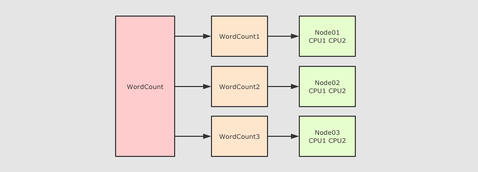

   简单来讲，并行计算就是同时使用多个计算资源解决一个问题，有如下四个要点：

   - 要解决的问题必须可以分解为多个可以并发计算的部分
   - 每个部分要可以在不同的处理器上被同时执行
   - 需要一个共享内存的机制
   - 需要一个总体上的协作机制来进行调度

3. 如果放在集群中的话, 可能要对整个计算任务进行分解, 如何分解?

   

   概述：

   - 对于HDFS中的文件，是分为不同的block的。
   - 在进行计算的时候，就可以按照block来划分，每一个block对应一个不同的计算单元

   扩展：

   - RDD并没有真实的存放数据，数据是从HDFS中读取的，在计算的过程中读取即可
   - RDD 至少是需要可以分片的，因为HDFS中的文件就是分片的，RDD分片的意义在于表示对元数据集每个分片的计算，RDD可以分片也意味着**可以并行计算**

4. 移动数据不如移动计算是一个基础的优化, 如何做到?

   

   每一个计算单元需要记录其存储单元的位置，尽量调度过去。

5. 在集群中运行, 需要很多节点之间配合, 出错的概率也更高, 出错了怎么办?

   

   RDD1 → RDD2 → RDD3 这个过程中, RDD2 出错了, 有两种办法可以解决

   1. 缓存RDD2的数据，直接恢复RDD2，类似HDFS的备份机制
   2. 记录RDD2的依赖关系，通过其父级的RDD来恢复RDD2，这种方式会少很多数据的交互和保存

   如何通过父级RDD来恢复？

   1. 记录RDD2的父亲是RDD1
   2. 记录RDD2的计算函数，例如记录 `RDD2 = RDD1.map(…)`, `map(…)` 就是计算函数
   3. 当RDD2计算出错的时候，可以通过父级RDD和计算函数来恢复RDD2

6. 假如任务特别负责，流程特别长，有很多RDD之间有依赖关系，如何优化？

   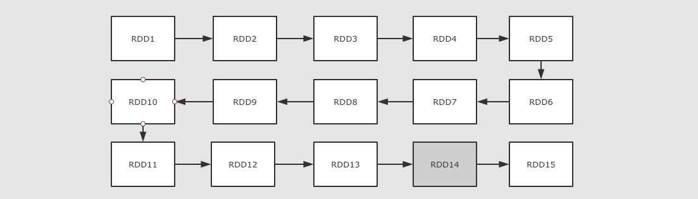

   上面提到了可以使用依赖关系来进行容错, 但是如果依赖关系特别长的时候, 这种方式其实也比较低效, 这个时候就应该使用另外一种方式, 也就是记录数据集的状态

   **在 Spark 中有两个手段可以做到**

   1. 缓存
   2. Checkpoint

# 2.再谈RDD

## 2.1 RDD为什么会出现

在 RDD 出现之前, 当时 MapReduce 是比较主流的, 而 MapReduce 如何执行迭代计算的任务呢?


多个 MapReduce 任务之间没有基于内存的数据共享方式, 只能通过磁盘来进行共享

这种方式明显**比较低效**

**RDD 如何解决迭代计算非常低效的问题呢?**


在 Spark 中, 其实最终 Job3 从逻辑上的计算过程是: `Job3 = (Job1.map).filter`, 整个过程是共享内存的, 而不需要将中间结果存放在可靠的分布式文件系统中

这种方式可以在保证容错的前提下, 提供更多的灵活, 更快的执行速度, RDD 在执行迭代型任务时候的表现可以通过下面代码体现

```scala
// 线性回归
val points = sc.textFile(...)
	.map(...)
	.persist(...)
val w = randomValue
for (i <- 1 to 10000) {
    val gradient = points.map(p => p.x * (1 / (1 + exp(-p.y * (w dot p.x))) - 1) * p.y)
    	.reduce(_ + _)
    w -= gradient
}
```

在这个例子中, 进行了大致 10000 次迭代, 如果在 MapReduce 中实现, 可能需要运行很多 Job, 每个 Job 之间都要通过 HDFS 共享结果, 熟快熟慢一窥便知

## 2.2 RDD的特点

### 2.2.1 RDD 不仅是数据集, 也是编程模型

RDD 即是一种数据结构, 同时也提供了上层 API, 同时 RDD 的 API 和 Scala 中对集合运算的 API 非常类似, 同样也都是各种算子

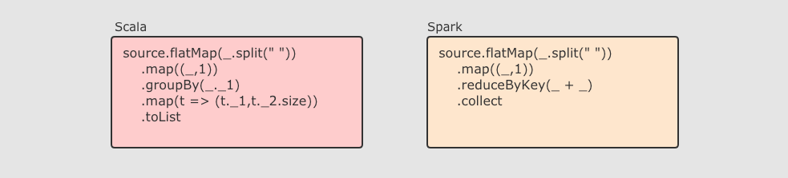

**RDD的算子大致分为两类：**

- Transformation 转换操作, 例如 `map` `flatMap` `filter` 等
- Action 动作操作, 例如 `reduce` `collect` `show` 等

执行 RDD 的时候, 在执行到转换操作的时候, 并不会立刻执行, 直到遇见了 Action 操作, 才会触发真正的执行, 这个特点叫做 **惰性求值**

### 2.2.2 RDD 可以分区

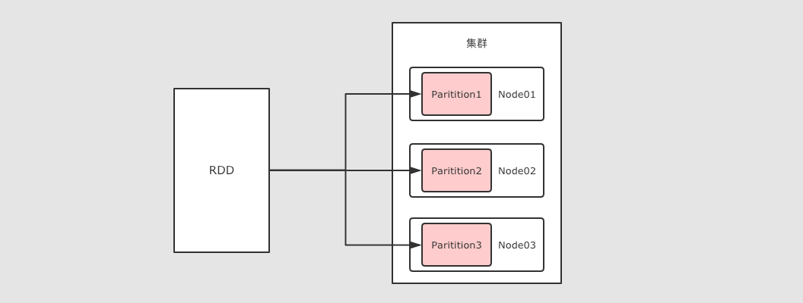

RDD是一个分布式的计算框架，所以，一定是能够进行分区计算的，只有分区了，才能利用集群的并行计算能力。

同时，**RDD不需要始终被具体化**，也就是说：RDD中可以没有数据，只要有足够的信息知道自己是从谁计算得来的就可以, 这是一种非常高效的容错方式

### 2.2.3 RDD是只读的

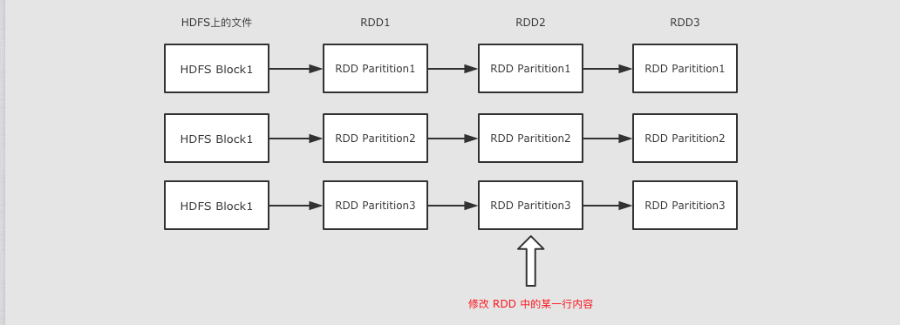

RDD是只读的，不允许任何形式的修改，虽说不能因为RDD和HDFS是只读的，就认为分布式存储系统必须设计为只读的，但是设计为只读的，会显著降低问题的复杂度，因为RDD需要可以容错的，可以惰性求值，可以移动计算，所以很难支持修改。

- RDD2中可能没有数据，只是保留了依赖关系和计算函数，那么需要修改什么？
- 如果因为支持修改，而必须保存数据的话，如何容错？
- 如果允许修改，如何定位要修改的那一行？**RDD的转换是粗粒度的，也就是说，RDD并不具体感知每一行在哪。**

### 2.2.4 RDD具有容错性

RDD 的容错有两种方式

- 保存 RDD 之间的依赖关系, 以及计算函数, 出现错误重新计算
- 直接将 RDD 的数据存放在外部存储系统, 出现错误直接读取, Checkpoint

## 2.3 弹性分布式数据集

**分布式：**

RDD支持分区，可以运行在集群中

**弹性：**

- RDD支持高效的容错
- RDD中的数据集可以缓存在内存中，也可以缓存在磁盘中，也可以缓存在外部存储中

**数据集：**

- RDD可以不保存具体数据，只保留创建自己的必备信息，例如依赖和计算函数
- RDD也可以缓存起来，相当于存储具体数据

## 2.4 总结RDD 的五大属性

**首先整理一下上面所提到的 RDD 所要实现的功能:**

1. RDD 有分区
2. RDD 要可以通过依赖关系和计算函数进行容错
3. RDD 要针对数据本地性进行优化
4. RDD 支持 MapReduce 形式的计算, 所以要能够对数据进行 Shuffled

对于 RDD 来说, 其中应该有什么内容呢? 如果站在 RDD 设计者的角度上, 这个类中, 至少需要什么属性?

- `Partition List` 分片列表, 记录 RDD 的分片, 可以在创建 RDD 的时候指定分区数目, 也可以通过算子来生成新的 RDD 从而改变分区数目
- `Compute Function` 为了实现容错, 需要记录 RDD 之间转换所执行的计算函数
- `RDD Dependencies` RDD 之间的依赖关系, 要在 RDD 中记录其上级 RDD 是谁, 从而实现容错和计算
- `Partitioner` 为了执行 Shuffled 操作, 必须要有一个函数用来计算数据应该发往哪个分区
- `Preferred Location` 优先位置, 为了实现数据本地性操作, 从而移动计算而不是移动存储, 需要记录每个 RDD 分区最好应该放置在什么位置

# 3.RDD算子

**分类：**

RDD 中的算子从功能上分为两大类

1. `Transformation(转换) `它会在一个已经存在的 RDD 上创建一个新的 RDD, 将旧的 RDD 的数据转换为另外一种形式后放入新的 RDD
2. `Action(动作)` 执行各个分区的计算任务, 将的到的结果返回到 Driver 中

RDD 中可以存放各种类型的数据, 那么对于不同类型的数据, RDD 又可以分为三类：

- 针对基础类型(例如 String)处理的普通算子
- 针对 `Key-Value` 数据处理的 `byKey` 算子
- 针对数字类型数据处理的计算算子

**特点：**

- Spark 中所有的 Transformations 是 Lazy(惰性) 的, 它们不会立即执行获得结果. 相反, 它们只会记录在数据集上要应用的操作. 只有当需要返回结果给 Driver 时, 才会执行这些操作, 通过 DAGScheduler 和 TaskScheduler 分发到集群中运行, 这个特性叫做 **惰性求值**
- 默认情况下, 每一个 Action 运行的时候, 其所关联的所有 Transformation RDD 都会重新计算, 但是也可以使用 `presist` 方法将 RDD 持久化到磁盘或者内存中. 这个时候为了下次可以更快的访问, 会把数据保存到集群上.

## 3.1 Transformations算子

### 3.1.1 map 

**语法：**

```scala
map(T => U)
```

**示例：**

```scala
@Test
  def mapDemo():Unit = {
    val conf = new SparkConf().setAppName("demo").setMaster("local[6]")
    val sc = new SparkContext(conf)

    sc.parallelize(Seq(1, 2, 3))
      .map(num => num * 10)
      .collect()
      .foreach(item => println(item))

    /**
     * 10
     * 20
     * 30
     */
  }
```

**作用：**

- 把RDD中的数据**一对一**的转为另一种形式

方法签名：

```scala
def map[U: ClassTag](f: T ⇒ U): RDD[U]
```

**参数：**

- `f` → Map 算子是 `原RDD → 新RDD` 的过程, 传入函数的参数是原 RDD 数据, 返回值是经过函数转换的新 RDD 的数据

**注意：**

Map 是一对一, 如果函数是 `String → Array[String]` 则新的 RDD 中每条数据就是一个数组

### 3.1.2 flatMap

语法：

```scala
flatMap(T ⇒ List[U])
```

**示例：**

```scala
  @Test
  def flatMapDemo():Unit = {
    val conf = new SparkConf().setAppName("demo").setMaster("local[6]")
    val sc = new SparkContext(conf)

    sc.parallelize(Seq("Hello lily","Hello lucy", "Hello tim"))
      .flatMap(line => line.split(" "))
      .collect()
      .foreach(item => println(item))

    /**
     * Array[String] = Array(Hello,lily,Hello,lucy,Hello,tim)
     */
  }
```


**作用：**

FlatMap 算子和 Map 算子类似, 但是 **FlatMap 是一对多**

**调用**

```
def flatMap[U: ClassTag](f: T ⇒ List[U]): RDD[U]
```

**参数**

- `f` → 参数是原 RDD 数据, 返回值是经过函数转换的新 RDD 的数据, 需要注意的是返回值是一个集合, 集合中的数据会被展平后再放入新的 RDD

**注意点**

- flatMap 其实是两个操作, 是 `map + flatten`, 也就是先转换, 后把转换而来的 List 展开
- Spark 中并没有直接展平 RDD 中数组的算子, 可以使用 `flatMap` 做这件事

### 3.1.3 filter

语法：

```scala
filter(T ⇒ Boolean)
```

示例：

```scala
  @Test
  def filterDemo():Unit = {
    val conf = new SparkConf().setAppName("demo").setMaster("local[6]")
    val sc = new SparkContext(conf)

    sc.parallelize(Seq(1,2,3))
      .filter(value =>value >= 3)
      .collect()
      .foreach(item=>println(item))

    /**
     * 3
     */
  }
```

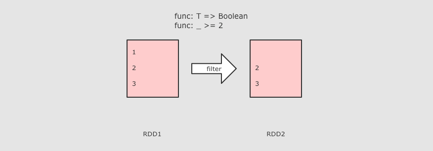

作用

- `Filter` 算子的主要作用是过滤掉不需要的内容
- filter中接收的函数，参数是 **每一个元素**，如果这个函数返回true，当前元素就会被加入数据集，如果返回false，当前元素就会被过滤掉

### 3.1.4 mapPartitions

**RDD[T] ⇒ RDD[U]** 和 map 类似, 但是针对整个分区的数据转换

```scala
@Test
  def mapPartitions():Unit ={
    val conf = new SparkConf().setAppName("demo").setMaster("local[6]")
    val sc = new SparkContext(conf)
      
    sc.parallelize(Seq(1,2,3,4,5),2)
      .mapPartitions(item=>{
        //遍历每一条数据进行转换，转换完后返回这个item
        item.map(it => it * 10)
      }).collect()
      .foreach(item=>println(item))

    /**
     * 10
     * 20
     * 30
     * 40
     * 50
     */
  }
```

注：

- mapPartitions和map算子是一样的，只不过是针对每一条数据进行转换，**mapPartitions针对一整个分区的数据进行转换**，所以：
  - map的func参数是单条数据，mapPartitions的func参数是一个集合（一个分区整个所有的数据）
  - map的func返回值也是单条数据，mapPartitions的func返回值是一个集合

### 3.1.5 mapPartitionsWithIndex

对RDD中的每个分区（带有下标）进行操作，下标用index来表示
通过这个算子可以获取分区号

 和 **mapPartitions 类似, 只是在函数中增加了分区的 Index**

```scala
def mapPartitionsWithIndex[U](f: (Int, Iterator[T]) ⇒ Iterator[U])
f: (Int, Iterator[T]) ⇒ Iterator[U]
```

**解释：定义一个函数，对分区进行处理**
f 接收两个参数，第一个参数 代表分区号。第二个代表分区中的元素。Iterator[U] 处理完后的结果

示例：

```scala
object scala {
  def main(args: Array[String]): Unit = {
    val conf = new SparkConf().setAppName("demo").setMaster("local[2]")
    val sc: SparkContext = new SparkContext(conf)

    val rdd1 = sc.parallelize(List(1,2,3,4,5,6,7,8,9),3)
    val rdd2 = rdd1.mapPartitionsWithIndex(fun1).collect()

    rdd2.foreach(item=>println(item))
  }

  def fun1(index:Int,iter:Iterator[Int]) : Iterator[String] = {
     iter.toList.map(x => "[PartId: " + index + " , value = " + x + " ]").iterator
     }
}
//输出
[PartId: 0 , value = 1 ]
[PartId: 0 , value = 2 ]
[PartId: 0 , value = 3 ]
[PartId: 1 , value = 4 ]
[PartId: 1 , value = 5 ]
[PartId: 1 , value = 6 ]
[PartId: 2 , value = 7 ]
[PartId: 2 , value = 8 ]
[PartId: 2 , value = 9 ]
```


### 3.1.6 mapValues

示例：

```scala
  @Test
  def mapValuesDemo():Unit = {
    val conf = new SparkConf().setAppName("demo").setMaster("local[2]")
    val sc: SparkContext = new SparkContext(conf)
    sc.parallelize(Seq(("a", 1), ("b", 2), ("c", 3)))
      .mapValues( value => value * 10 )
      .collect()
      .foreach(item=>println(item))

    /**
     * (a,10)
     * (b,20)
     * (c,30)
     */
  }
```

作用：

- MapValues 只能作用于 Key-Value 型数据, 和 Map 类似, 也是使用函数按照转换数据, 不同点是 **MapValues 只转换 Key-Value 中的 Value**

- mapValues也是map，只不过map作用于整条数据，而mapValues作用于value

### 3.1.7 sample

作用

- Sample 算子可以从一个数据集中抽样出来一部分, 常用作于减小数据集以保证运行速度, 并且尽可能少规律的损失

**参数**

- Sample 接受第一个参数为`withReplacement`, 意为是否取样以后**是否还放回原数据集供下次使用**, 简单的说, 如果这个参数的值为 true, 则抽样出来的数据集中可能会有重复
- Sample 接受第二个参数为`fraction`, 意为**抽样的比例**
- Sample 接受第三个参数为`seed`, **随机数种子**, 用于 Sample 内部随机生成下标, 一般不指定, 使用默认值

语法：

```scala
sample(withReplacement, fraction, seed)
```

示例：

```scala
  @Test
  def sampleDemo():Unit = {
 	val conf = new SparkConf().setAppName("demo").setMaster("local[2]")
    val sc: SparkContext = new SparkContext(conf)
      
    sc.parallelize(Seq(1, 2, 3, 4, 5, 6, 7, 8, 9, 10))
      .sample(true, 0.6, 2)
      .collect()
      .foreach(item=>println(item))

    /**
     * 2
     * 4
     * 8
     * 8
     * 9
     */
  }
```


### 3.1.8 union

并集

示例：

```scala
  @Test
  def unionDemo():Unit = {
	val conf = new SparkConf().setAppName("demo").setMaster("local[2]")
    val sc: SparkContext = new SparkContext(conf)
      
    val rdd1 = sc.parallelize(Seq(1, 2, 3))
    val rdd2 = sc.parallelize(Seq(4, 5, 6))
    rdd1.union(rdd2)
      .collect()
      .foreach(item=>println(item))

    /**
     * 1
     * 2
     * 3
     * 4
     * 5
     * 6
     */
  }
```


### 3.1.9 intersection

交集

示例：

```scala
  @Test
  def intersectionDemo():Unit = {
	val conf = new SparkConf().setAppName("demo").setMaster("local[2]")
    val sc: SparkContext = new SparkContext(conf)
      
    val rdd1 = sc.parallelize(Seq(1, 2, 3, 4, 5))
    val rdd2 = sc.parallelize(Seq(4, 5, 6, 7, 8))
    rdd1.intersection(rdd2)
      .collect()
      .foreach(item=>println(item))

    /**
     * 4
     * 5
     */
  }
}
```

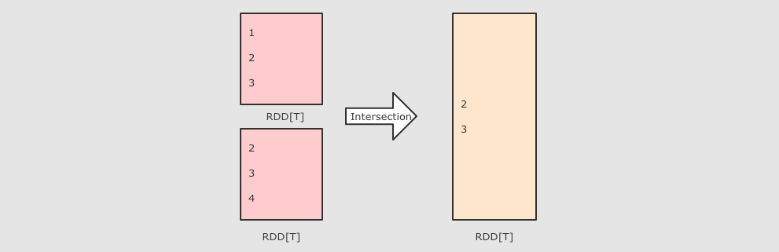

作用

- Intersection 算子是一个集合操作, 用于求得 左侧集合 和 右侧集合 的交集, 换句话说, 就是左侧集合和右侧集合都有的元素, 并生成一个新的 RDD

### 3.1.10 subtract

```scala
(RDD[T], RDD[T]) ⇒ RDD[T] 差集, 可以设置分区数
```

示例：

```scala
  @Test
  def subtractDemo():Unit = {
	val conf = new SparkConf().setAppName("demo").setMaster("local[2]")
    val sc: SparkContext = new SparkContext(conf)
      
    val rdd1 = sc.parallelize(Seq(1, 2, 3, 4, 5))
    val rdd2 = sc.parallelize(Seq(4, 5, 6, 7, 8))
    rdd1.subtract(rdd2)
      .collect()
      .foreach(item=>println(item))

    /**
     * 1
     * 2
     * 3
     */
  }

```

### 3.1.11 disinct

示例：

```scala
  @Test
  def distinctDemo():Unit = {
	val conf = new SparkConf().setAppName("demo").setMaster("local[2]")
    val sc: SparkContext = new SparkContext(conf)

    sc.parallelize(Seq(1, 1, 2, 2, 3))
      .distinct()
      .collect()
      .foreach(item=>println(item))

    /**
     * 1
     * 2
     * 3
     */
  }
```


作用

- Distinct 算子用于去重

注意点

- Distinct 是一个需要 Shuffled 的操作
- 本质上 Distinct 就是一个 reductByKey, 把重复的合并为一个

### 3.1.12 reduceByKey

按照key进行分组，然后把每一组数据reduce

示例：

```scala
  @Test
  def reduceByKeyDemo():Unit = {
    val conf = new SparkConf().setAppName("demo").setMaster("local[2]")
    val sc: SparkContext = new SparkContext(conf)
      
    sc.parallelize(Seq(("a", 1), ("a", 1), ("b", 1)))
      .reduceByKey( (curr, agg) => curr + agg )
      .collect()
      .foreach(item=>println(item))

    /**
     * (a,2)
     * (b,1)
     */
  }
```

作用

- 首先按照 Key 分组生成一个 Tuple, 然后针对每个组执行 `reduce` 算子

调用

```
def reduceByKey(func: (V, V) ⇒ V): RDD[(K, V)]
```

参数

- func → 执行数据处理的函数, 传入两个参数, 一个是当前值, 一个是局部汇总, 这个函数需要有一个输出, 输出就是这个 Key 的汇总结果

注意点

- ReduceByKey 只能作用于 Key-Value 型数据, Key-Value 型数据在当前语境中特指 Tuple2
- ReduceByKey 是一个需要 Shuffled 的操作
- 和其它的 Shuffled 相比, ReduceByKey是高效的, 因为类似 MapReduce 的, 在 Map 端有一个 Cominer, 这样 I/O 的数据便会减少

### 3.1.13 groupByKey

示例：

```scala
@Test
  def groupByKeyDemo():Unit = {
    val conf = new SparkConf().setAppName("demo").setMaster("local[2]")
    val sc: SparkContext = new SparkContext(conf)
      
    sc.parallelize(Seq(("a", 1), ("a", 1), ("b", 1)))
      .groupByKey()
      .collect()
      .foreach(item=>println(item))

    /**
     * (a,CompactBuffer(1, 1))
     * (b,CompactBuffer(1))
     */
  }
```

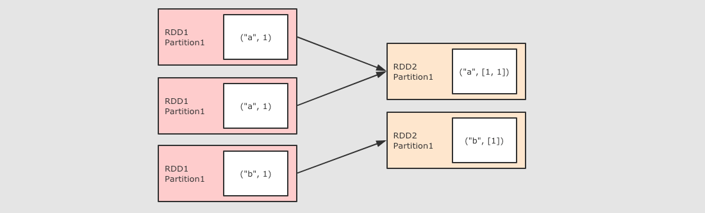

作用

- GroupByKey 算子的主要作用是按照 Key 分组, 和 ReduceByKey 有点类似, 但是 GroupByKey 并不求聚合, 只是列举 Key 对应的所有 Value

注意点

- GroupByKey 是一个 Shuffled
- GroupByKey 和 ReduceByKey 不同, 因为需要列举 Key 对应的所有数据, 所以无法在 Map 端做 Combine, 所以 GroupByKey 的性能并没有 ReduceByKey 好

### 3.1.14 combineByKey

combineByKey这个孙子中接收三个参数：

转换数据的函数（初始函数，作用于第一条数据，用于开启整个计算），在分区上进行聚合，把所有分区的聚合结果聚合为最终结果

示例：

```scala
  @Test
  def combineByKeyDemo():Unit = {
    val rdd: RDD[(String, Double)] = sc.parallelize(Seq(
      ("zhangsan", 99.0),
      ("zhangsan", 96.0),
      ("lisi", 97.0),
      ("lisi", 98.0),
      ("zhangsan", 97.0))
    )

    val combineRdd: RDD[(String, (Double, Int))] = rdd.combineByKey(

      //对数据进行初步处理
      /**
       * ("zhangsan", (99.0,1))
       * ("zhangsan", (96.0,1))
       * ....
       */
      createCombiner = (curr:Double) => (curr, 1),

      // 进行分区结果集处理
      /**
       * ("zhangsan", (195.0,2))  --分区1
       * ("lisi", (195.0,2))  --分区2
       * ....
       */
      //参数说明：第一个参数是集合的value，也就是(99.0,1)，第二个参数是下一条数据的value，也就是(96.0,1)
      mergeValue  = (curr: (Double, Int),nextValue:Double) => (curr._1 + nextValue, curr._2 + 1),

      //不同分区的相同的key数据，进行聚合
      /**
       * ("zhangsan", (195.0,2))  -->分区1的结果
       *
       *  ("zhangsan", (97.0,1))  -->分区3的结果
       *
       *  最后得到这个key的结果为：
       *   ("zhangsan", (292.0,3))
       */
      mergeCombiners = (curr: (Double, Int), agg: (Double, Int)) =>
        (curr._1 + agg._1, curr._2 + agg._2)
    )

    //相当于：(zhangsan , 292.0 / 3)
    val meanRdd = combineRdd.map(score => (score._1, score._2._1 / score._2._2))

    meanRdd.collect().foreach(item=>println(item))

    /**
     * (zhangsan,97.33333333333333)
     * (lisi,97.5)
     */
  }
```

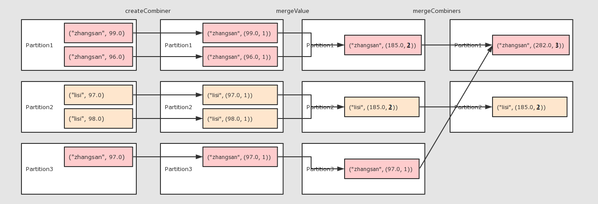

作用

- 对数据集按照 Key 进行聚合

调用

- `combineByKey(createCombiner, mergeValue, mergeCombiners, [partitioner], [mapSideCombiner], [serializer])`

参数

- `createCombiner` 将 Value 进行初步转换
- `mergeValue` 在每个分区把上一步转换的结果聚合
- `mergeCombiners` 在所有分区上把每个分区的聚合结果聚合
- `partitioner` 可选, 分区函数
- `mapSideCombiner` 可选, 是否在 Map 端 Combine
- `serializer` 序列化器

注意点

- `combineByKey` 的要点就是三个函数的意义要理解
- `groupByKey`, `reduceByKey` 的底层都是 `combineByKey`

### 3.1.15 aggregateByKey

```
aggregateByKey(zeroValue)(seqOp, combOp)
    zeroValue：指定初始值
    seqOp：作用于每一个元素，根据初始值，进行计算
    combOp：将sqlOp处理过的结果进行聚合

aggregateByKey：特别适合针对每个数据要先处理，后聚合
```

示例：

```scala
  @Test
  def aggregateByKeyDemo():Unit = {
    val conf = new SparkConf().setAppName("demo").setMaster("local[2]")
    val sc: SparkContext = new SparkContext(conf)
      
    val rdd = sc.parallelize(Seq(("手机", 10.0), ("手机", 15.0), ("电脑", 20.0)))
    val result = rdd.aggregateByKey(0.8)(
      seqOp = (zeroValue, price) => price * zeroValue,
      combOp = (curr, agg) => curr + agg
    ).collect().foreach(item=>println(item))

    /**
     * (手机,20.0)
     * (电脑,16.0)
     */
  }
```

- 作用

  聚合所有 Key 相同的 Value, 换句话说, 按照 Key 聚合 Value

- 调用

  `rdd.aggregateByKey(zeroValue)(seqOp, combOp)`

- 参数

  `zeroValue` 初始值`seqOp` 转换每一个值的函数`comboOp` 将转换过的值聚合的函数

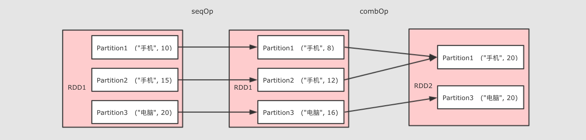

注意点 **为什么需要两个函数?** aggregateByKey 运行将一个`RDD[(K, V)]`聚合为`RDD[(K, U)]`, 如果要做到这件事的话, 就需要先对数据做一次转换, 将每条数据从`V`转为`U`, `seqOp`就是干这件事的，当`seqOp`的事情结束以后, `comboOp`把其结果聚合

- 和 reduceByKey 的区别:
  - aggregateByKey 最终聚合结果的类型和传入的初始值类型保持一致
  - reduceByKey 在集合中选取第一个值作为初始值, 并且聚合过的数据类型不能改变

### 3.1.16 foldByKey

示例：

```scala
  @Test
  def foldByKeyDemo():Unit = {
    val conf = new SparkConf().setAppName("demo").setMaster("local[2]")
    val sc: SparkContext = new SparkContext(conf)
      
    sc.parallelize(Seq(("a", 1), ("a", 1), ("b", 1)))
      .foldByKey(10)( (curr, agg) => curr + agg )
      .collect()
      .foreach(item=>println(item))

    /**
     * (a,22)
     * (b,11)
     */
  }
```

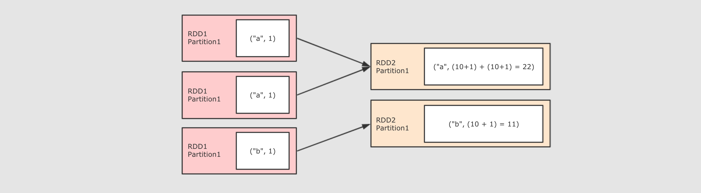

作用

- 和 ReduceByKey 是一样的, 都是按照 Key 做分组去求聚合, 但是 FoldByKey 的不同点在于可以指定初始值

注意：这个初始值作用于每条数据，而不仅仅是一条

调用

```
foldByKey(zeroValue)(func)
```

参数

- `zeroValue` 初始值
- `func` seqOp 和 combOp 相同, 都是这个参数

注意点

- FoldByKey 是 AggregateByKey 的简化版本, seqOp 和 combOp 是同一个函数
- FoldByKey 指定的初始值作用于每一个 Value

### 3.1.17 join

示例：

```scala
  @Test
  def joinDemo():Unit = {
    val conf = new SparkConf().setAppName("demo").setMaster("local[2]")
    val sc: SparkContext = new SparkContext(conf)
      
    val rdd1 = sc.parallelize(Seq(("a", 1), ("a", 2), ("b", 1)))
    val rdd2 = sc.parallelize(Seq(("a", 10), ("a", 11), ("a", 12)))

    rdd1.join(rdd2).collect().foreach(item=>println(item))

    /**
     * (a,(1,10))
     * (a,(1,11))
     * (a,(1,12))
     * (a,(2,10))
     * (a,(2,11))
     * (a,(2,12))
     */
  }
```


作用

- 将两个 RDD **按照相同的 Key 进行连接**

调用

```
join(other, [partitioner or numPartitions])
```

参数

- `other` 其它 RDD
- `partitioner or numPartitions` 可选, 可以通过传递分区函数或者分区数量来改变分区

注意点

- Join 有点类似于 SQL 中的内连接, 只会再结果中包含能够连接到的 Key
- Join 的结果是一个笛卡尔积形式, 例如`"a", 1), ("a", 2`和`"a", 10), ("a", 11`的 Join 结果集是 `"a", 1, 10), ("a", 1, 11), ("a", 2, 10), ("a", 2, 11`

### 3.1.18 cogroup

示例：

```scala
  @Test
  def cogroupDemo():Unit = {
    val rdd1 = sc.parallelize(Seq(("a", 1), ("a", 2), ("a", 5), ("b", 2), ("b", 6), ("c", 3), ("d", 2)))
    val rdd2 = sc.parallelize(Seq(("a", 10), ("b", 1), ("d", 3)))
    val rdd3 = sc.parallelize(Seq(("b", 10), ("a", 1)))

    val result1 = rdd1.cogroup(rdd2).collect().foreach(item=>println(item))
    /**
     * (a,(CompactBuffer(1, 2, 5),CompactBuffer(10)))
     * (b,(CompactBuffer(2, 6),CompactBuffer(1)))
     * (c,(CompactBuffer(3),CompactBuffer()))
     * (d,(CompactBuffer(2),CompactBuffer(3)))
     * =======分割线========
     */

    println("=======分割线========")

    val result2 = rdd1.cogroup(rdd2, rdd3).collect().foreach(item=>println(item))

    /**
     * (a,(CompactBuffer(1, 2, 5),CompactBuffer(10),CompactBuffer(1)))
     * (b,(CompactBuffer(2, 6),CompactBuffer(1),CompactBuffer(10)))
     * (c,(CompactBuffer(3),CompactBuffer(),CompactBuffer()))
     * (d,(CompactBuffer(2),CompactBuffer(3),CompactBuffer()))
     */

  }
```

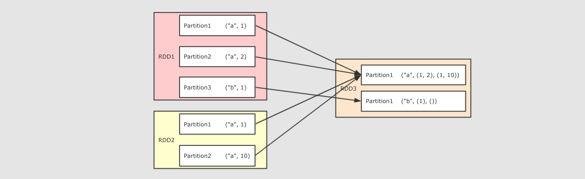

作用

- 多个 RDD 协同分组, 将多个 RDD 中 Key 相同的 Value 分组

调用

- `cogroup(rdd1, rdd2, rdd3, [partitioner or numPartitions])`

参数

- `rdd…` 最多可以传三个 RDD 进去, 加上调用者, 可以为四个 RDD 协同分组
- `partitioner or numPartitions` 可选, 可以通过传递分区函数或者分区数来改变分区

注意点

- 对 RDD1, RDD2, RDD3 进行 cogroup, 结果中就一定会有三个 List, 如果没有 Value 则是空 List, 这一点类似于 SQL 的全连接, 返回所有结果, 即使没有关联上
- CoGroup 是一个需要 Shuffled 的操作

### 3.1.19 cartesian

**(RDD[T], RDD[U]) ⇒ RDD[(T, U)]** 生成两个 RDD 的笛卡尔积

### 3.1.20 sortBy

示例：

```scala
  @Test
  def sortDemo():Unit = {
    val rdd1 = sc.parallelize(Seq(("a", 3), ("b", 2), ("c", 1)))
      //指定按照value进行排序
    val sortByResult = rdd1.sortBy( item => item._2 ).collect().foreach(item=>println(item))

    /**
     * (c,1)
     * (b,2)
     * (a,3)
     * =======分割线========
     */
    println("=======分割线========")
      
      // 直接按照key进行排序
    val sortByKeyResult = rdd1.sortByKey().collect().foreach(item=>println(item))

    /**
     * (a,3)
     * (b,2)
     * (c,1)
     */
  }
```

作用

- 排序相关相关的算子有两个, 一个是`sortBy`, 另外一个是`sortByKey`

调用

```
sortBy(func, ascending, numPartitions)
```

参数

- `func`通过这个函数返回要排序的字段
- `ascending`是否升序
- `numPartitions`分区数

注意点

- 普通的 RDD 没有`sortByKey`, 只有 Key-Value 的 RDD 才有
- `sortBy`可以指定按照哪个字段来排序, `sortByKey`直接按照 Key 来排序

### 3.1.21 partitionBy

使用用传入的 partitioner 重新分区, 如果和当前分区函数相同, 则忽略操作

### 3.1.22 coalesce

coalesce进行重分区的时候，默认是不shuffle的，coalesce默认不能增大分区数

减少分区数

示例：

```scala
  @Test
  def coalesceDemo():Unit = {
    val rdd = sc.parallelize(Seq(("a", 3), ("b", 2), ("c", 1)))
    val oldNum = rdd.partitions.length

    val coalesceRdd = rdd.coalesce(4, shuffle = true)
    val coalesceNum = coalesceRdd.partitions.length

    val repartitionRdd = rdd.repartition(4)
    val repartitionNum = repartitionRdd.partitions.length

    println(oldNum, coalesceNum, repartitionNum)

    /**
     * (6,4,4)
     */
  }
```

作用

- 一般涉及到分区操作的算子常见的有两个, `repartitioin` 和 `coalesce`, 两个算子都可以调大或者调小分区数量

调用

- `repartitioin(numPartitions)`
- `coalesce(numPartitions, shuffle)`

参数

- `numPartitions` 新的分区数
- `shuffle` 是否 shuffle, 如果新的分区数量比原分区数大, 必须 Shuffled, 否则重分区无效

注意点

- `repartition` 和 `coalesce` 的不同就在于 `coalesce` 可以控制是否 Shuffle
- `repartition` 是一个 Shuffled 操作

### 3.1.23 repartition

repartition进行重分区的时候，默认是shuffle的

重新分区

```scala
 @Test
  def partitioningemo():Unit = {
    val rdd1 = sc.parallelize(Seq(1,2,3,4,5),2)
    println( rdd1.partitions.size) //2
    println(rdd1.repartition(1).partitions.size)//1

  }
```


### 3.1.24  repartitionAndSortWithinPartitions

 重新分区的同时升序排序, 在partitioner中排序, 比先重分区再排序要效率高, 建议使用在需要分区后再排序的场景使用

## 3.2 Action算子

### 3.2.1 reduce

示例：

```scala
  @Test
  def reduceDemo():Unit = {
    val rdd = sc.parallelize(Seq(("手机", 10.0), ("手机", 15.0), ("电脑", 20.0)))
      // 注意这里reduceByKey是按照key进行分组过的，但是reduce并不是，所以，reduce传入的curr是一整条数据而不仅仅只是value，同理，agg也是由函数的返回结果确定
    val result: (String, Double) = rdd.reduce((curr, agg) => ("总价", curr._2 + agg._2))
    println(result) //(总价,45.0)
  }
```

需要知道的地方：

1. 函数中传入的curr参数，并不是value，而是一整条数据
2. reduce整体上的结果，只有一个

作用

- 对整个结果集规约, 最终生成一条数据, 是整个数据集的汇总

调用

- `reduce( (currValue[T], agg[T]) ⇒ T )`

注意点

- reduce 和 reduceByKey 是完全不同的, reduce 是一个 action, 并不是 Shuffled 操作
- 本质上 reduce 就是现在每个 partition 上求值, 最终把每个 partition 的结果再汇总


reduceByKey和reduce有什么区别：

1. reduce是一个Action算子，reduceByKey是一个转换算子

2. 假设一个RDD里面有一万条数据，大部分Key是相同的，有十个不同的key

   其中：`rdd.reduceByKe`y生成10条数据，`rdd.reduce`生成1条结果

3. reduceBykey本质上是先按照Key进行分组，然后把每组都聚合，reduce是针对于一整个数据集来进行聚合

4. ruduceByKey是针对KV类型的数据来进行计算，reduce可以针对所有类型的数据进行计算

5. **reduce算子不是一个shuffle操作**

   - shuffle操作分为mapper和reducer，mapper将数据放入paritioner的函数计算，求得分往那个reducer，后分到对应的reducer
   - reduce操作并没有mapper和reducer，因为reduce算子会作用于RDD中的每一个分区，然后再分区上求得局部结果，最终汇总到Driver中求和最终结果
   - RDD中有五大属性，partitioner在shuffle过程中使用，partitioner只有KV类型的RDD才有


### 3.2.2 collect

以数组的形式返回数据集中所有的元素

### 3.2.3 count

返回元素个数

### 3.2.4 first

注意：一般情况下action会从所有的分区中获取数据，相对来说速度就比较慢，first只是获取第一个元素，所以，first只会处理第一个分区的数据，所以速度很快，无需处理所有数据

返回第一个元素

### 3.2.5 take

返回前N个元素

### 3.2.5 takeSample

`takeSample(withReplacement, num)`

类似于sample，区别在这是一个Action，直接返回结果

参数：

- withReplacement要不要放回数据，和sample一样
- num取出的结果

### 3.2.6 flod

`fold(zeroValue)( (T, T) ⇒ U )`

指定初始值和计算函数，折叠聚合整个数据集

### 3.2.7 saveAsTextFile

将结果存入 path 对应的文件中

### 3.2.8 saveAsSequenceFile

将结果存入 path 对应的 Sequence 文件中

### 3.2.9 countByKey

- count和countByKey的结果相距很远，每次调用Action都会生成一个job，job会运行获取结果，所以两个job中间有大量的log输出，其实就是在启动job
- countByKey的运算结果是：Map(Key , Value) ，其中value是 key的count结果

- countByKey一般用于处理数据倾斜问题：

  如果要解决数据倾斜问题，是不是要先知道谁倾斜，通过countByKey，是不是可以查看key对应的数据总和，从而解决问题

示例：

```scala
  @Test
  def countByKeyDemo():Unit = {
    val rdd = sc.parallelize(Seq(("手机", 10.0), ("手机", 15.0), ("电脑", 20.0)))
    println(rdd.count) // 3
    val result = rdd.countByKey()
    println(result) // Map(手机 -> 2, 电脑 -> 1)
  }
```

作用

- 求得整个数据集中 Key 以及对应 Key 出现的次数

注意点

- 返回结果为 `Map(key → count)`
- **常在解决数据倾斜问题时使用, 查看倾斜的 Key**

count和countByKey的区别：

- count和countByKey的结果相距很远，每次调用Action都会生成一个job，job会运行获取结果，所以在两个job中间有大量的log输出，其实就是在启动job
- countByKey的运算结果是Map(Key,Value -> key的count)

### 3.2.10 foreach

异步遍历每一个元素，简单说，遍历出来的顺序未必就是存储元素时的顺序

示例：

```scala
  @Test
  def TextDemo():Unit = {
    val rdd = sc.parallelize(Seq(("手机", 10.0), ("手机", 15.0), ("电脑", 20.0)))
    // 结果: Array((手机,10.0), (手机,15.0), (电脑,20.0))
    rdd.collect().foreach(item1=>println(item1))
    println("=============")
    // 结果: Array((手机,10.0), (手机,15.0))
    rdd.take(2).foreach(item=>println(item))
    // 结果: (手机,10.0)
    println(rdd.first())
  }
```

## 3.3 总结

- RDD的算子大部分都会生成一些专用的RDD

  - `map`, `flatMap`, `filter` 等算子会生成 `MapPartitionsRDD`
  - `coalesce`, `repartition` 等算子会生成 `CoalescedRDD`

- 常见的RDD有两种类型

  - 转换型的RDD，Transformation
  - 动作型的RDD，Action

- 常见的Tranksformation类型的RDD

  - map
  - flatMap
  - filter
  - groupBy
  - reduceByKey

- 常见的Action类型的RDD

  - collect
  - countByKey
  - reduce

  

## 3.4 RDD对不同类型数据的支持

- 一般情况下RDD要处理的数据有三类

  - 字符串
  - 键值对
  - 数字型

- RDD的算子设计针对这三类不同的数据分别都有支持

  - 对于以字符串为代表的基本数据类型是比较基础的一些操作，诸如：map，flatMap，Filter等基础的算子
  - 对于键值对类型的数据，有额外的支持，诸如：reduceByKey，groupByKey等ByKey的算子
  - 同样对于数字型的数据也有额外的支持，诸如：max，min等

- RDD对键值对数据的额外支持

  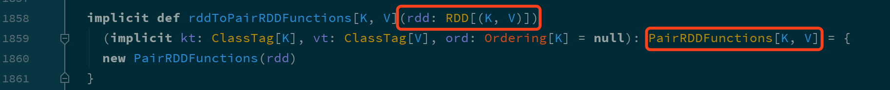

  - 键值型数据本质上就是一个二元数组，键值对类型的RDD表示为RDD[(K,V)]

  - RDD对键值对的额外支持是通过隐式支持来完成的，一个RDD[(K,V)]，可以被隐式转换为一个PairRDDFunctions对象，从而调用其中的方法

  - **既然对键值对的支持是通过** `PairRDDFunctions` **提供的, 那么从** `PairRDDFunctions` **中就可以看到这些支持有什么**

    | 类别     | 算子             |
    | :------- | :--------------- |
    | 聚合操作 | `reduceByKey`    |
    |          | `foldByKey`      |
    |          | `combineByKey`   |
    | 分组操作 | `cogroup`        |
    |          | `groupByKey`     |
    | 连接操作 | `join`           |
    |          | `leftOuterJoin`  |
    |          | `rightOuterJoin` |
    | 排序操作 | `sortBy`         |
    |          | `sortByKey`      |
    | Action   | `countByKey`     |
    |          | `take`           |
    |          | `collect`        |

- RDD对数字型数据的额外支持

  对于数字型数据的额外支持基本上都是 Action 操作, 而不是转换操作

  | 算子             | 含义             |
  | :--------------- | :--------------- |
  | `count`          | 个数             |
  | `mean`           | 均值             |
  | `sum`            | 求和             |
  | `max`            | 最大值           |
  | `min`            | 最小值           |
  | `variance`       | 方差             |
  | `sampleVariance` | 从采样中计算方差 |
  | `stdev`          | 标准差           |
  | `sampleStdev`    | 采样的标准差     |

  示例：

  ```scala
  val rdd = sc.parallelize(Seq(1, 2, 3))
  // 结果: 3
  println(rdd.max())
  ```


## 3.5 阶段练习和总结

重点：理解 RDD 的一般使用步骤

```scala
package Rdd


import org.apache.commons.lang3.StringUtils
import org.apache.spark.{SparkConf, SparkContext}
import org.junit.Test

/**
 * @Class:spark.Rdd.StagePractice
 * @Descript:
 * @Author:宋天
 * @Date:2020/2/4
 */
class StagePractice {
  @Test
  def pro(): Unit = {
//    1. 创建SC对象
    val conf = new SparkConf().setAppName("StagePractice").setMaster("local[2]")
    val sc = new SparkContext(conf);
//    2. 读取文件
    val source = sc.textFile("C:\\Users\\宋天\\Desktop\\大数据\\file\\BeijingPM20100101_20151231_noheader.csv")
//    3. 通过算子处理数据
    /**
     * 3.1 抽取数据，年，月，PM，返回结果：（（年，月）。PM）
     * 3.2 清洗，过滤掉空的字符串，过滤掉NA
     * 3.3 聚合
     * 3.4 排序
     */
    val resultRDD = source.map(item =>((item.split(",")(1),item.split(",")(2)),item.split(",")(6)))
      .filter(item => StringUtils.isNotEmpty(item._2) && ! item._2.equalsIgnoreCase("NA"))
      .map(item => (item._1,item._2.toInt))
      .reduceByKey((curr,agg)=>curr + agg)
      .sortBy( item => item._2, ascending = false)

    // 4. 获取结果
    resultRDD.take(10).foreach(item => println(item))

    // 5. 运行测试
    sc.stop()
  }
}
```

通过上述代码可以看到，其实RDD的整体使用步骤如下所示：


# 4.RDD的shuffle和分区

**分区的作用：**

RDD使用分区来分布式并行处理数据，并且要做到尽量少的在不同的Executor之间使用网络交换数据，所以当使用RDD读取数据的时候，会尽量的在物理上靠近数据源，比如说在读取Cassandra或者DHFS中的数据的时候，会尽量的保持RDD的分区和数据源的分区数，分区模式等一一对应

- RDD经常需要通过读取外部系统的数据来创建，外部存储系统往往是支持分片的，RDD需要支持分区，来和外部系统的分片一一对应
- RDD的分区是一个并行计算的实现手段

**分区和Shuffle的关系：**

分区的主要作用是用来实现并行计算，本质上和Shuffle没什么关系，但是往往在进行数据处理的时候，例如`reduceByKey`，`groupByKey`等聚合操作，需要把Key相同的value拉取到一起进行计算，这个时候因为这些Key相同的Value可能会坐落于不同的分区，于是理解分区才能理解Shuffle的根本原理

**Spark中的Shuffle操作的特点：**

- 只有key-value型的RDD才会有Shuffle操作，例如RDD[(K, V)]，但是有一个特例，就是repartition算子可以对任何数据类型Shuffle
- 早期版本 Spark 的 Shuffle 算法是 `Hash base shuffle`, 后来改为 `Sort base shuffle`, 更适合大吞吐量的场景

## 4.1 RDD的分区操作

### 4.1.1 查看分区数

任意执行一个任务之后可在spark的webUI界面查看

示例：

```scala
scala> sc.parallelize(1 to 100).count
res0: Long = 100
```

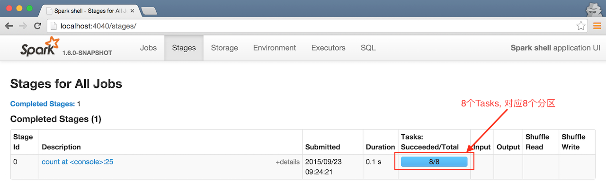

注：之所以会有8个Tasks，是因为在启动的时候指定的命令是`spark-shell --master local[8]`，这样会生成一个Executors，这个Executors有8个cores，所以会默认与8个Tasks，每个Cores对应一个分区，每个分区对应一个Tasks，可以通过`rdd.partitions.size`来查看分区数量

同时也可以通过 spark-shell 的 WebUI 来查看 Executors 的情况


默认的分区数量是和 Cores 的数量有关的, 也可以通过下面三种方式修改或者重新指定分区数量

### 4.1.2 创建RDD时指定分区数

示例：

```scala
scala> val rdd1 = sc.parallelize(1 to 100, 6)
rdd1: org.apache.spark.rdd.RDD[Int] = ParallelCollectionRDD[1] at parallelize at <console>:24

scala> rdd1.partitions.size
res1: Int = 6

scala> val rdd2 = sc.textFile("hdfs:///dataset/wordcount.txt", 6)
rdd2: org.apache.spark.rdd.RDD[String] = hdfs:///dataset/wordcount.txt MapPartitionsRDD[3] at textFile at <console>:24

scala> rdd2.partitions.size
res2: Int = 7
```

**注：**rdd1 是通过本地集合创建的, 创建的时候通过第二个参数指定了分区数量. rdd2 是通过读取 HDFS 中文件创建的, 同样通过第二个参数指定了分区数, 因为是从 HDFS 中读取文件, 所以最终的分区数是由 Hadoop 的 InputFormat 来指定的, 所以比指定的分区数大了一个.

### 4.1.3 通过coalesce算子指定分区数

语法：

```scala
coalesce(numPartitions: Int, shuffle: Boolean = false)(implicit ord: Ordering[T] = null): RDD[T]
```

参数：

- numPartitions : 新生成的 RDD 的分区数

- shuffle : 是否 Shuffle

示例：

- 如果 `shuffle` 参数指定为 `false`, 运行计划中确实没有 `ShuffledRDD`, 没有 `shuffled` 这个过程

  ```scala
  scala> val noShuffleRdd = source.coalesce(numPartitions=8, shuffle=false)
  noShuffleRdd: org.apache.spark.rdd.RDD[Int] = CoalescedRDD[1] at coalesce at <console>:26
  
  scala> noShuffleRdd.toDebugString 
  res1: String =
  (6) CoalescedRDD[1] at coalesce at <console>:26 []
   |  ParallelCollectionRDD[0] at parallelize at <console>:24 []
  
   scala> val noShuffleRdd = source.coalesce(numPartitions=8, shuffle=false)
   noShuffleRdd: org.apache.spark.rdd.RDD[Int] = CoalescedRDD[1] at coalesce at <console>:26
  ```

- 如果 `shuffle` 参数指定为 `true`, 运行计划中有一个 `ShuffledRDD`, 有一个明确的显式的 `shuffled` 过程

  ```scala
  scala> shuffleRdd.toDebugString 
  res3: String =
  (8) MapPartitionsRDD[5] at coalesce at <console>:26 []
   |  CoalescedRDD[4] at coalesce at <console>:26 []
   |  ShuffledRDD[3] at coalesce at <console>:26 []
   +-(6) MapPartitionsRDD[2] at coalesce at <console>:26 []
      |  ParallelCollectionRDD[0] at parallelize at <console>:24 []
  
  ```

-  如果 `shuffle` 参数指定为 `false` 却增加了分区数, 分区数并不会发生改变, 这是因为增加分区是一个宽依赖, 没有 `shuffled` 过程无法做到, 后续会详细解释宽依赖的概念

  ```scala
  scala> noShuffleRdd.partitions.size     
  res4: Int = 6
  
  scala> shuffleRdd.partitions.size
  res5: Int = 8
  ```

### 4.1.4 通过repartition算子指定分区数

语法：

```scala
repartition(numPartitions: Int)(implicit ord: Ordering[T] = null): RDD[T]
```

repartition 算子本质上就是` coalesce(numPartitions, shuffle = true)`

```scala
//源码
def repartition(numPartitions: Int)(implicit ord: Ordering[T] = null): RDD[T] = withScope {
    coalesce(numPartitions, shuffle = true)
  }
```

示例：

```scala
scala> val source = sc.parallelize(1 to 100, 6)
source: org.apache.spark.rdd.RDD[Int] = ParallelCollectionRDD[7] at parallelize at <console>:24

scala> source.partitions.size
res7: Int = 6


增加分区有效
scala> source.repartition(100).partitions.size 
res8: Int = 100

减少分区有效
scala> source.repartition(1).partitions.size 
res9: Int = 1
```

注：

`repartition` 算子无论是增加还是减少分区都是有效的, 因为本质上 `repartition` 会通过 `shuffle` 操作把数据分发给新的 RDD 的不同的分区, 只有 `shuffle` 操作才可能做到增大分区数, 默认情况下, 分区函数是 `RoundRobin`, 如果希望改变分区函数, 也就是数据分布的方式, 可以通过自定义分区函数来实现

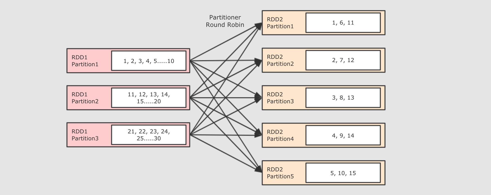

## 4.2 RDD的shuffle是什么

示例：

```scala
val sourceRdd = sc.textFile("hdfs://bigdata111:9000/dataset/wordcount.txt")
val flattenCountRdd = sourceRdd.flatMap(_.split(" ")).map((_, 1))
val aggCountRdd = flattenCountRdd.reduceByKey(_ + _)
val result = aggCountRdd.collect
```

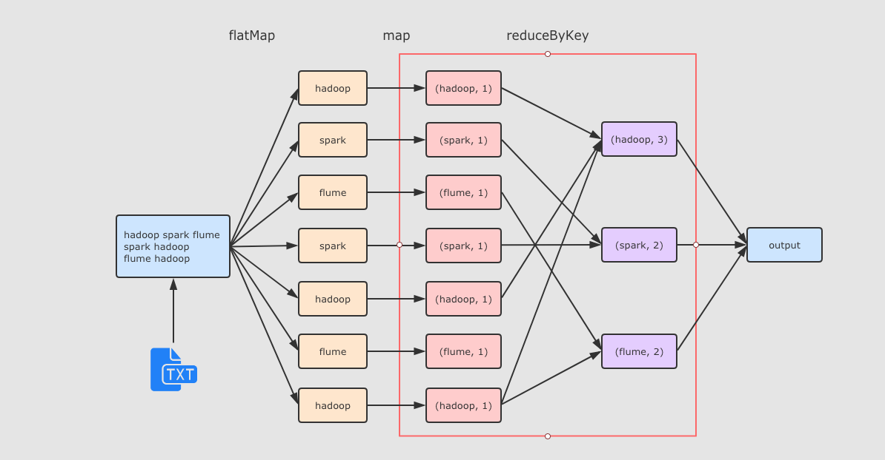

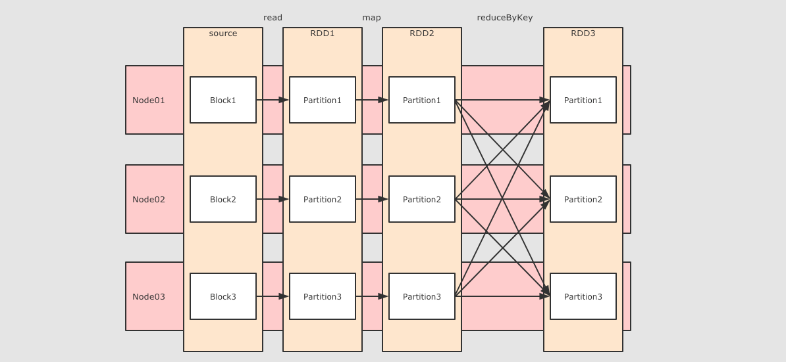

分析：

reduceByKey这个算子本质上就是先按照Key分组，后对每一组数据进行reduce，所面临的挑战就是 Key 相同的所有数据可能分布在不同的partition分区中，甚至可能在不同的节点中，但是他们必须被共同计算

为了让来自相同的key的所有数据都在reduceByKey的同一个reduce中处理，需要执行一个 `all-to-all` 的操作, 需要在不同的节点（不同的分区）之间拷贝数据，必须跨分区聚集相同的key的所有数据，这个过额长叫做shuffle

## 4.3 RDD的shuffle原理

Spark 的 Shuffle 发展大致有两个阶段: `Hash base shuffle` 和 `Sort base shuffle`

### 4.3.1 Hash base shuffle

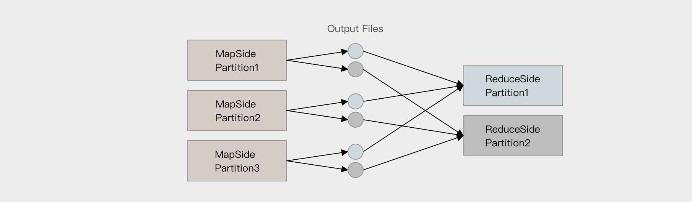

- 大致的原理是分桶, 假设 Reducer 的个数为 R, 那么每个 Mapper 有 R 个桶, 按照 Key 的 Hash 将数据映射到不同的桶中, Reduce 找到每一个 Mapper 中对应自己的桶拉取数据.
- 假设 Mapper 的个数为 M, 整个集群的文件数量是 `M * R`, 如果有 1,000 个 Mapper 和 Reducer, 则会生成 1,000,000 个文件, 这个量非常大了.
- 过多的文件会导致文件系统打开过多的文件描述符, 占用系统资源. 所以这种方式并不适合大规模数据的处理, 只适合中等规模和小规模的数据处理, 在 Spark 1.2 版本中废弃了这种方式.

### 4.3.2 Sort base shuffle

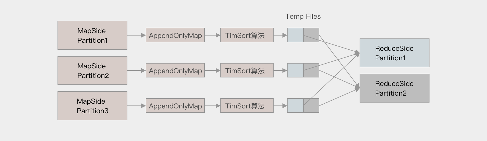

对于 Sort base shuffle 来说, 每个 Map 侧的分区只有一个输出文件, Reduce 侧的 Task 来拉取, 大致流程如下

1. Map 侧将数据全部放入一个叫做 AppendOnlyMap 的组件中, 同时可以在这个特殊的数据结构中做聚合操作
2. 然后通过一个类似于 MergeSort 的排序算法 TimSort 对 AppendOnlyMap 底层的 Array 排序
   - 先按照 Partition ID 排序, 后按照 Key 的 HashCode 排序
3. 最终每个 Map Task 生成一个 输出文件, Reduce Task 来拉取自己对应的数据

从上面可以得到结论, Sort base shuffle 确实可以大幅度减少所产生的中间文件, 从而能够更好的应对大吞吐量的场景, 在 Spark 1.2 以后, 已经默认采用这种方式.

但是需要大家知道的是, Spark 的 Shuffle 算法并不只是这一种, 即使是在最新版本, 也有三种 Shuffle 算法, 这三种算法对每个 Map 都只产生一个临时文件, 但是产生文件的方式不同, 一种是类似 Hash 的方式, 一种是刚才所说的 Sort, 一种是对 Sort 的一种优化(使用 Unsafe API 直接申请堆外内存)

# 5.缓存

**概念：**

RDD通过persist方法或cache方法可以将前面的计算结果缓存，但是并不是这两个方法被调用时立即缓存，而是触发后面的action时，该RDD将会被缓存在计算节点的内存中，并供后面重用。

缓存有可能丢失，或者存储存储于内存的数据由于内存不足而被删除，RDD的缓存容错机制保证了即使缓存丢失也能保证计算的正确执行。通过基于RDD的一系列转换，丢失的数据会被重算，由于RDD的各个Partition是相对独立的，因此只需要计算丢失的部分即可，并不需要重算全部Partition。

**RDD的缓存机制：**默认将RDD的数据缓存在内存中

- 作用：提高性能
- 使用：标识一下RDD可以被缓存：函数：persist 或者 cache

**简要示例:**

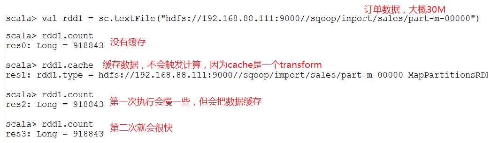

**通过UI监控**

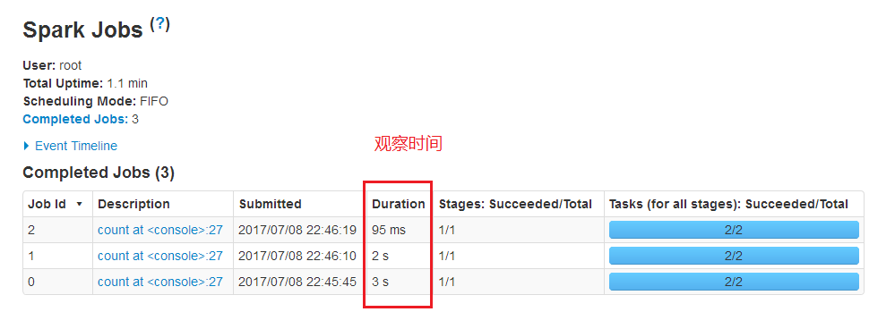

## 5.1 缓存的意义

使用缓存的原因1： **是为了多次使用 RDD**

**示例：**

需求: 在日志文件中找到访问次数最少的 IP 和访问次数最多的 IP

```scala
val conf = new SparkConf().setMaster("local[6]").setAppName("debug_string")
val sc = new SparkContext(conf)

val interimRDD = sc.textFile("dataset/access_log_sample.txt")
  .map(item => (item.split(" ")(0), 1))
  .filter(item => StringUtils.isNotBlank(item._1))
  .reduceByKey((curr, agg) => curr + agg) // 这是一个 Shuffle 操作, Shuffle 操作会在集群内进行数据拷贝

val resultLess = interimRDD.sortBy(item => item._2, ascending = true).first()
val resultMore = interimRDD.sortBy(item => item._2, ascending = false).first()

println(s"出现次数最少的 IP : $resultLess, 出现次数最多的 IP : $resultMore")

sc.stop()
```

在上述代码中, 多次使用到了 `interimRDD`, 导致文件读取两次, 计算两次, 有没有什么办法增进上述代码的性能?

使用缓存的原因 2 ：**容错**


当在计算 RDD3 的时候如果出错了, 会怎么进行容错?

答：会再次计算 RDD1 和 RDD2 的整个链条, 假设 RDD1 和 RDD2 是通过比较昂贵的操作得来的, 有没有什么办法减少这种开销?

**上述两个问题的解决方案其实都是 缓存**, 除此之外, 使用缓存的理由还有很多, 但是总结一句, 就是缓存能够帮助开发者在进行一些昂贵操作后, 将其结果保存下来, 以便下次使用无需再次执行, 缓存能够显著的提升性能.

所以, 缓存适合在一个 RDD 需要重复多次利用, 并且还不是特别大的情况下使用, 例如迭代计算等场景.

## 5.2 缓存相关的API

### 5.2.1  cache

示例：

```scala
val conf = new SparkConf().setMaster("local[6]").setAppName("debug_string")
val sc = new SparkContext(conf)

val interimRDD = sc.textFile("dataset/access_log_sample.txt")
  .map(item => (item.split(" ")(0), 1))
  .filter(item => StringUtils.isNotBlank(item._1))
  .reduceByKey((curr, agg) => curr + agg)
  .cache() // 缓存

val resultLess = interimRDD.sortBy(item => item._2, ascending = true).first()
val resultMore = interimRDD.sortBy(item => item._2, ascending = false).first()

println(s"出现次数最少的 IP : $resultLess, 出现次数最多的 IP : $resultMore")

sc.stop()
```

方法签名：

```scala
cache(): this.type = persist()
```

cache 方法其实是 `persist` 方法的一个别名

### 5.2.2 persist

示例：

```scala
val conf = new SparkConf().setMaster("local[6]").setAppName("debug_string")
val sc = new SparkContext(conf)

val interimRDD = sc.textFile("dataset/access_log_sample.txt")
  .map(item => (item.split(" ")(0), 1))
  .filter(item => StringUtils.isNotBlank(item._1))
  .reduceByKey((curr, agg) => curr + agg)
  .persist(StorageLevel.MEMORY_ONLY) // 	缓存

val resultLess = interimRDD.sortBy(item => item._2, ascending = true).first()
val resultMore = interimRDD.sortBy(item => item._2, ascending = false).first()

println(s"出现次数最少的 IP : $resultLess, 出现次数最多的 IP : $resultMore")

sc.stop()
```

方法签名：

```scala
persist(): this.type
persist(newLevel: StorageLevel): this.type
```

`persist` 方法其实有两种形式, `persist()` 是 `persist(newLevel: StorageLevel)` 的一个别名, `persist(newLevel: StorageLevel)` 能够指定缓存的级别

**问题：**缓存其实是一种空间换时间的做法, 会占用额外的存储资源, 如何清理?

示例：

```scala
val conf = new SparkConf().setMaster("local[6]").setAppName("debug_string")
val sc = new SparkContext(conf)

val interimRDD = sc.textFile("dataset/access_log_sample.txt")
  .map(item => (item.split(" ")(0), 1))
  .filter(item => StringUtils.isNotBlank(item._1))
  .reduceByKey((curr, agg) => curr + agg)
  .persist()

interimRDD.unpersist() // 清理缓存

val resultLess = interimRDD.sortBy(item => item._2, ascending = true).first()
val resultMore = interimRDD.sortBy(item => item._2, ascending = false).first()

println(s"出现次数最少的 IP : $resultLess, 出现次数最多的 IP : $resultMore")

sc.stop()
```

根据缓存级别的不同, 缓存存储的位置也不同, 但是使用 `unpersist` 可以指定删除 RDD 对应的缓存信息, 并指定缓存级别为 `NONE`

## 5.3 缓存的级别

其实如何缓存是一个技术活, 有很多细节需要思考, 如下

- 是否使用磁盘缓存?
- 是否使用内存缓存?
- 是否使用堆外内存?
- 缓存前是否先序列化?
- 是否需要有副本?

如果要回答这些信息的话, 可以先查看一下 RDD 的缓存级别对象

示例：

```scala
val conf = new SparkConf().setMaster("local[6]").setAppName("debug_string")
val sc = new SparkContext(conf)

val interimRDD = sc.textFile("dataset/access_log_sample.txt")
  .map(item => (item.split(" ")(0), 1))
  .filter(item => StringUtils.isNotBlank(item._1))
  .reduceByKey((curr, agg) => curr + agg)
  .persist()

println(interimRDD.getStorageLevel)
// StorageLevel(memory, deserialized, 1 replicas)

sc.stop()
```

打印出来的对象是 `StorageLevel`, 其中有如下几个构造参数

```scala
class StorageLevel private (
    private var _useDisk : scala.Boolean,
    private var _useMemory : scala.Boolean,
    private var _useOffHeap : scala.Boolean,
    private var _deserialized : scala.Boolean,
    private var _replication : scala.Int = { /* compiled code */ })
extends java.lang.Object with java.io.Externalizable {

```

根据这几个参数的不同, `StorageLevel` 有如下几个枚举对象

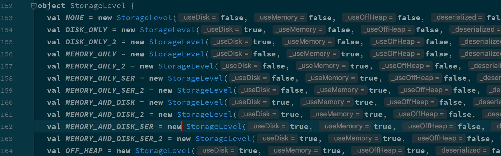

| 缓存级别                | `userDisk` 是否使用磁盘 | `useMemory` 是否使用内存 | `useOffHeap` 是否使用堆外内存 | `deserialized` 是否以反序列化形式存储 | `replication` 副本数 |
| :---------------------- | :---------------------- | :----------------------- | :---------------------------- | :------------------------------------ | :------------------- |
| `NONE`                  | false                   | false                    | false                         | false                                 | 1                    |
| `DISK_ONLY`             | true                    | false                    | false                         | false                                 | 1                    |
| `DISK_ONLY_2`           | true                    | false                    | false                         | false                                 | 2                    |
| `MEMORY_ONLY`           | false                   | true                     | false                         | true                                  | 1                    |
| `MEMORY_ONLY_2`         | false                   | true                     | false                         | true                                  | 2                    |
| `MEMORY_ONLY_SER`       | false                   | true                     | false                         | false                                 | 1                    |
| `MEMORY_ONLY_SER_2`     | false                   | true                     | false                         | false                                 | 2                    |
| `MEMORY_AND_DISK`       | true                    | true                     | false                         | true                                  | 1                    |
| `MEMORY_AND_DISK`       | true                    | true                     | false                         | true                                  | 2                    |
| `MEMORY_AND_DISK_SER`   | true                    | true                     | false                         | false                                 | 1                    |
| `MEMORY_AND_DISK_SER_2` | true                    | true                     | false                         | false                                 | 2                    |
| `OFF_HEAP`              | true                    | true                     | true                          | false                                 | 1                    |

简要说明：以下带`2`的表示有一个副本

- NONE：不进行存储
- `DISK_ONLY`和`DISK_ONLY_2`，只存在磁盘中
- `MEMORY_ONLY`和`MEMORY_ONLY_2`，只存在内存中
- MEMORY_ONLY_SER和`MEMORY_ONLY_SER_2`，存在内存中，存储的是二进制数据
- `MEMORY_AND_DISK`和`MEMORY_AND_DISK`，表示内存和磁盘都存储
- `MEMORY_AND_DISK_SER`  和`MEMORY_AND_DISK_SER_2` ，表示序列化以后再存，存二进制数据

**如何选择分区级别**

Spark 的存储级别的选择，核心问题是在 memory 内存使用率和 CPU 效率之间进行权衡。建议按下面的过程进行存储级别的选择:

如果您的 RDD 适合于默认存储级别（MEMORY_ONLY），leave them that way。这是 CPU 效率最高的选项，允许 RDD 上的操作尽可能快地运行.

如果不是，试着使用 MEMORY_ONLY_SER 和 selecting a fast serialization library 以使对象更加节省空间，但仍然能够快速访问。(Java和Scala)

不要溢出到磁盘，除非计算您的数据集的函数是昂贵的，或者它们过滤大量的数据。否则，重新计算分区可能与从磁盘读取分区一样快.

如果需要快速故障恢复，请使用复制的存储级别（例如，如果使用 Spark 来服务 来自网络应用程序的请求）。All 存储级别通过重新计算丢失的数据来提供完整的容错能力，但复制的数据可让您继续在 RDD 上运行任务，而无需等待重新计算一个丢失的分区.

# 6.容错机制Checkpoint

**通过 检查点（checkpoint）来实现**

**检查点**（本质是通过将RDD写入Disk做检查点）是为了通过lineage（血统）做容错的辅助，lineage过长会造成容错成本过高，这样就不如在中间阶段做检查点容错，如果之后有节点出现问题而丢失分区，从做检查点的RDD开始重做Lineage，就会减少开销。

> RDD 的检查点：是一种容错机制
>
> 概念：Lineage 血统
>
> 理解：表示任务执行的生命周期（整个任务的执行过程）

设置checkpoint的目录，可以是本地的文件夹、也可以是HDFS。一般是在具有容错能力，高可靠的文件系统上(比如HDFS, S3等)设置一个检查点路径，用于保存检查点数据。

**RDD的检查点类型：sc.setCheckPointDir(设置检查点目录)**

- 本地目录：不推荐
- HDFS目录：用于生产

## 6.1 Checkpoint的作用

Checkpoint 的主要作用是斩断 RDD 的依赖链, 并且将数据存储在可靠的存储引擎中, 例如支持分布式存储和副本机制的 HDFS.

**Checkpoint 的方式**

- **可靠的** 将数据存储在可靠的存储引擎中, 例如 HDFS
- **本地的** 将数据存储在本地

**什么是斩断依赖链**

> 斩断依赖链是一个非常重要的操作, 接下来以 HDFS 的 NameNode 的原理来举例说明
>
> HDFS 的 NameNode 中主要职责就是维护两个文件, 一个叫做 `edits`, 另外一个叫做 `fsimage`. `edits` 中主要存放 `EditLog`, `FsImage` 保存了当前系统中所有目录和文件的信息. 这个 `FsImage` 其实就是一个 `Checkpoint`.
>
> HDFS 的 NameNode 维护这两个文件的主要过程是, 首先, 会由 `fsimage` 文件记录当前系统某个时间点的完整数据, 自此之后的数据并不是时刻写入 `fsimage`, 而是将操作记录存储在 `edits` 文件中. 其次, 在一定的触发条件下, `edits` 会将自身合并进入 `fsimage`. 最后生成新的 `fsimage` 文件, `edits` 重置, 从新记录这次 `fsimage` 以后的操作日志.
>
> 如果不合并 `edits` 进入 `fsimage` 会怎样? 会导致 `edits` 中记录的日志过长, 容易出错.
>
> 所以当 Spark 的一个 Job 执行流程过长的时候, 也需要这样的一个斩断依赖链的过程, 使得接下来的计算轻装上阵.

**Checkpoint 和 Cache 的区别**

> Cache 可以把 RDD 计算出来然后放在内存中, 但是 RDD 的依赖链(相当于 NameNode 中的 Edits 日志)是不能丢掉的, 因为这种缓存是不可靠的, 如果出现了一些错误(例如 Executor 宕机), 这个 RDD 的容错就只能通过回溯依赖链, 重放计算出来.
>
> 但是 Checkpoint 把结果保存在 HDFS 这类存储中, 就是可靠的了, 所以可以斩断依赖, 如果出错了, 则通过复制 HDFS 中的文件来实现容错.
>
> 所以他们的区别主要在以下两点
>
> - Checkpoint 可以保存数据到 HDFS 这类可靠的存储上, Persist 和 Cache 只能保存在本地的磁盘和内存中
> - Checkpoint 可以斩断 RDD 的依赖链, 而 Persist 和 Cache 不行
> - 因为 CheckpointRDD 没有向上的依赖链, 所以程序结束后依然存在, 不会被删除. 而 Cache 和 Persist 会在程序结束后立刻被清除.

## 6.2 使用 Checkpoint

示例：

```scala
val conf = new SparkConf().setMaster("local[6]").setAppName("debug_string")
val sc = new SparkContext(conf)
sc.setCheckpointDir("checkpoint") //在使用 Checkpoint 之前需要先设置 Checkpoint 的存储路径, 而且如果任务在集群中运行的话, 这个路径必须是 HDFS 上的路径

val interimRDD = sc.textFile("dataset/access_log_sample.txt")
  .map(item => (item.split(" ")(0), 1))
  .filter(item => StringUtils.isNotBlank(item._1))
  .reduceByKey((curr, agg) => curr + agg)
// interimRDD = interimRDD.cache()


interimRDD.checkpoint() // 开启 Checkpoint

interimRDD.collect().foreach(println(_))

sc.stop()
```

**注意： 一个小细节**

```scala
val conf = new SparkConf().setMaster("local[6]").setAppName("debug_string")
val sc = new SparkContext(conf)
sc.setCheckpointDir("checkpoint")

val interimRDD = sc.textFile("dataset/access_log_sample.txt")
  .map(item => (item.split(" ")(0), 1))
  .filter(item => StringUtils.isNotBlank(item._1))
  .reduceByKey((curr, agg) => curr + agg)
  .cache() // checkpoint 之前先 cache 一下, 准没错

//如果调用checkpoint，则会重新计算一下RDD，然后把结果存在HDFS或者本地目录上，所以，应该在在checkpoint之前进行一次cache
interimRDD.checkpoint()
interimRDD.collect().foreach(println(_))
```

应该在 `checkpoint` 之前先 `cache` 一下, 因为 `checkpoint` 会重新计算整个 RDD 的数据然后再存入 HDFS 等地方.

所以上述代码中如果 `checkpoint` 之前没有 `cache`, 则整个流程会被计算两次, 一次是 `checkpoint`, 另外一次是 `collect`

# 7.Spark底层逻辑

**部署情况：**

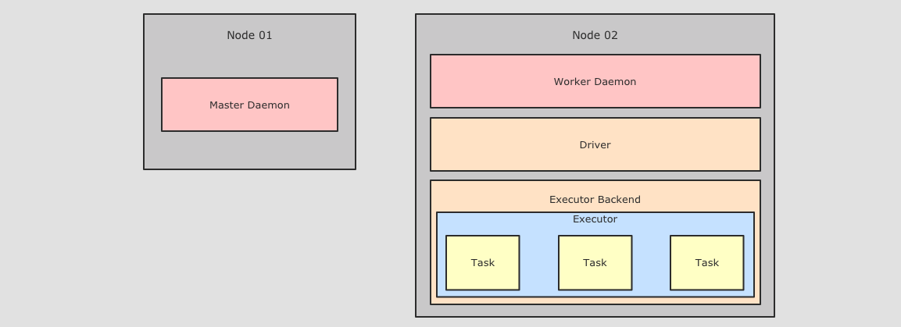

针对上图，可以看到整体上在集群中运行的角色有如下几个：

- Master Daemon

  负责管理Master节点，协调资源的获取，以及连接Worker节点来运行Excutor，是Spark集群中的协调节点

- Worker Dae'mon

  Workers也称为Slaves，是Spark集群中的计算节点，用于和Master交互并管理Excutor。当有个Spark Job提交之后，会创建SparkContext，后Woorker会启动对应的Excutor

- Executor Backend

  上面提到Worker用于控制Executor的启动和停止，其实Worker是通过Executor Backend拉来进行控制的 ，Excutor Backend是一个进程（是一个JVM实例），持有一个Executor对象

另外在启动程序的时候, 有三种程序需要运行在集群上:

- Driver

  `Driver` 是一个 `JVM` 实例, 是一个进程, 是 `Spark Application` 运行时候的领导者, 其中运行了 `SparkContext`.

  `Driver` 控制 `Job` 和 `Task`, 并且提供 `WebUI`.

- Executor

  `Executor` 对象中通过线程池来运行 `Task`, 一个 `Executor` 中只会运行一个 `Spark Application` 的 `Task`, 不同的 `Spark Application` 的 `Task` 会由不同的 `Executor` 来运行

**案例：**

因为要理解执行计划, 重点不在案例, 所以本节以一个非常简单的案例作为入门, 就是我们第一个案例 WordCount

```scala
val sc = ...

  @Test
  def wc():Unit = {
    val textRDD = sc.parallelize(Seq("Hadoop Spark", "Hadoop Flume", "Spark Sqoop"))
    val splitRDD = textRDD.flatMap(_.split(" "))
    val tupleRDD = splitRDD.map((_, 1))
    val reduceRDD = tupleRDD.reduceByKey(_ + _)
    //将结果转为字符串
    val strRDD = reduceRDD.map(item => s"${item._1}, ${item._2}")

    println(strRDD.toDebugString)

    /**
     * (6) MapPartitionsRDD[4] at map at demo.scala:390 []
     * |  ShuffledRDD[3] at reduceByKey at demo.scala:389 []
     * +-(6) MapPartitionsRDD[2] at map at demo.scala:388 []
     * |  MapPartitionsRDD[1] at flatMap at demo.scala:387 []
     * |  ParallelCollectionRDD[0] at parallelize at demo.scala:386 []
     */
    strRDD.collect.foreach(item => println(item))

    /**
     * Flume, 1
     * Sqoop, 1
     * Spark, 2
     * Hadoop, 2
     */
  }
```

**分析：**整个案例的运行过程大致如下:

1. 通过代码的运行, 生成对应的 `RDD` 逻辑执行图
2. 通过 `Action` 操作, 根据逻辑执行图生成对应的物理执行图, 也就是 `Stage` 和 `Task`
3. 将物理执行图运行在集群中

**逻辑执行图：**

对于上面代码中的 `reduceRDD` 如果使用 `toDebugString` 打印调试信息的话, 会显式如下内容

```scala
(6) MapPartitionsRDD[4] at map at demo.scala:390 []
 |  ShuffledRDD[3] at reduceByKey at demo.scala:389 []
 +-(6) MapPartitionsRDD[2] at map at demo.scala:388 []
    |  MapPartitionsRDD[1] at flatMap at demo.scala:387 []
    |  ParallelCollectionRDD[0] at parallelize at demo.scala:386 []
```

根据这段内容, 大致能得到这样的一张逻辑执行图

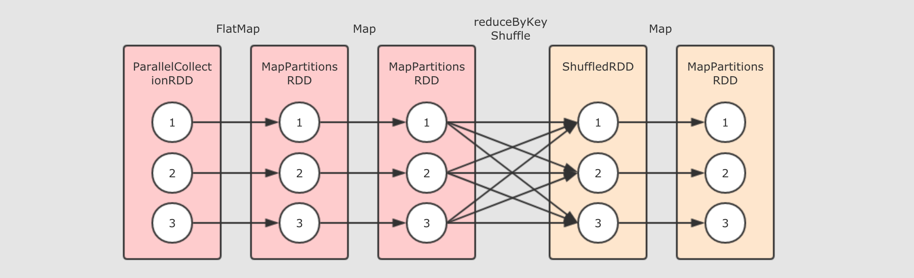

- 其实 RDD 并没有什么严格的逻辑执行图和物理执行图的概念, 这里也只是借用这个概念, 从而让整个 RDD 的原理可以解释, 好理解.
- 对于 RDD 的逻辑执行图, 起始于第一个入口 RDD 的创建, 结束于 Action 算子执行之前, 主要的过程就是生成一组互相有依赖关系的 RDD, 其并不会真的执行, 只是表示 RDD 之间的关系, 数据的流转过程.

**物理执行图：**

- 当触发 Action 执行的时候, 这一组互相依赖的 RDD 要被处理, 所以要转化为可运行的物理执行图, 调度到集群中执行.
- 因为大部分 RDD 是不真正存放数据的, 只是数据从中流转, 所以, 不能直接在集群中运行 RDD, 要有一种 Pipeline 的思想, 需要将这组 RDD 转为 Stage 和 Task, 从而运行 Task, 优化整体执行速度.
- 以上的逻辑执行图会生成如下的物理执行图, 这一切发生在 Action 操作被执行时.

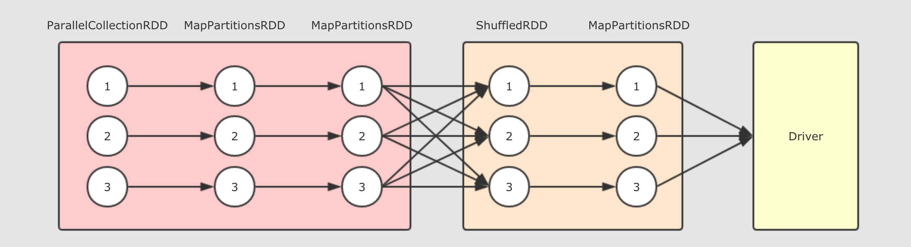

从上图可以总结如下几个点

-  在第一个 `Stage` 中, 每一个这样的执行流程是一个 `Task`, 也就是在同一个 Stage 中的所有 RDD 的对应分区, 在同一个 Task 中执行
- Stage 的划分是由 Shuffle 操作来确定的, 有 Shuffle 的地方, Stage 断开

## 7.1 逻辑执行图生成

代码案例：

```scala
val sc = ...

val textRDD = sc.parallelize(Seq("Hadoop Spark", "Hadoop Flume", "Spark Sqoop"))
val splitRDD = textRDD.flatMap(_.split(" "))
val tupleRDD = splitRDD.map((_, 1))
val reduceRDD = tupleRDD.reduceByKey(_ + _)
val strRDD = reduceRDD.map(item => s"${item._1}, ${item._2}")

println(strRDD.toDebugString)
strRDD.collect.foreach(item => println(item))
```

**明确逻辑计划的边界**

- 在 `Action` 调用之前, 会生成一系列的 `RDD`, 这些 `RDD` 之间的关系, 其实就是整个逻辑计划
- 例如上述代码, 如果生成逻辑计划的, 会生成如下一些 `RDD`, 这些 `RDD` 是相互关联的, 这些 `RDD` 之间, 其实本质上生成的就是一个 **计算链**

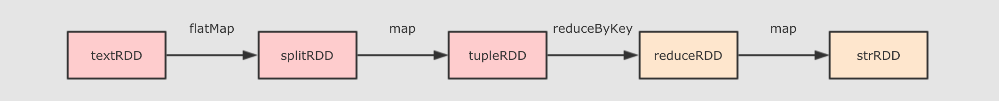

接下来, 采用迭代渐进式的方式, 一步一步的查看一下整体上的生成过程

### 7.1.1 textFile算子的背后

研究 `RDD` 的功能或者表现的时候, 其实本质上研究的就是 `RDD` 中的五大属性, 因为 `RDD` 透过五大属性来提供功能和表现, 所以如果要研究 `textFile` 这个算子, 应该从五大属性着手, 那么第一步就要看看生成的 `RDD` 是什么类型的 `RDD`

1. `textFile`生成的是`HadoopRDD`

   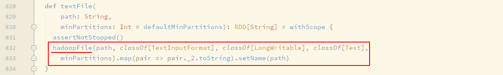

   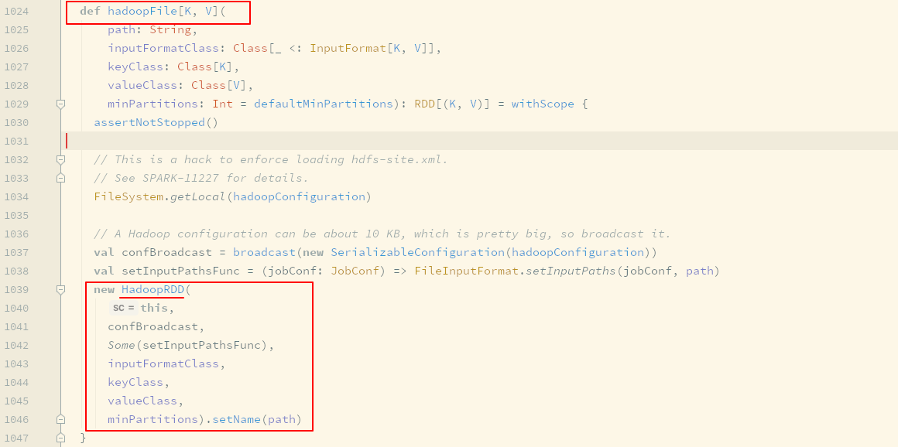

   除了上面这一个步骤以外, 后续步骤将不再直接基于代码进行讲解, 因为从代码的角度着手容易迷失逻辑, 这个章节的初心有两个, 一个是希望大家了解 Spark 的内部逻辑和原理, 另外一个是希望大家能够通过本章学习具有代码分析的能力

2. HadoopRDD 的 Partitions 对应了 HDFS 的 Blocks

   

   其实本质上每个 `HadoopRDD` 的 `Partition` 都是对应了一个 `Hadoop` 的 `Block`, 通过 `InputFormat` 来确定 `Hadoop` 中的 `Block` 的位置和边界, 从而可以供一些算子使用

3.  `HadoopRDD` 的 `compute` 函数就是在读取 `HDFS` 中的 `Block `

   本质上, `compute` 还是依然使用 `InputFormat` 来读取 `HDFS` 中对应分区的 `Block`

4. ` textFile` 这个算子生成的其实是一个 `MapPartitionsRDD` 

   `textFile` 这个算子的作用是读取 `HDFS` 上的文件, 但是 `HadoopRDD` 中存放是一个元组, 其 `Key` 是行号, 其 `Value` 是 `Hadoop` 中定义的 `Text` 对象, 这一点和 `MapReduce` 程序中的行为是一致的

   但是并不适合 `Spark` 的场景, 所以最终会通过一个 `map` 算子, 将 `(LineNum, Text)` 转为 `String` 形式的一行一行的数据, 所以最终 `textFile` 这个算子生成的 `RDD` 并不是 `HadoopRDD`, 而是一个 `MapPartitionsRDD`

### 7.1.2 map算子的背后

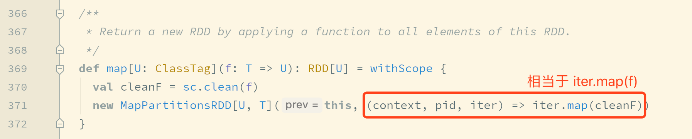

1. `map` 算子生成了 `MapPartitionsRDD`

   由源码可知, 当 `val rdd2 = rdd1.map()` 的时候, 其实生成的新 `RDD` 是 `rdd2`, `rdd2` 的类型是 `MapPartitionsRDD`, 每个 `RDD` 中的五大属性都会有一些不同, 由 `map` 算子生成的 `RDD` 中的计算函数, 本质上就是遍历对应分区的数据, 将每一个数据转成另外的形式

2. `MapPartitionsRDD` 的计算函数是 `collection.map( function )`

   真正运行的集群中的处理单元是 `Task`, 每个 `Task` 对应一个 `RDD` 的分区, 所以 `collection` 对应一个 `RDD` 分区的所有数据, 而这个计算的含义就是将一个 `RDD` 的分区上所有数据当作一个集合, 通过这个 `Scala` 集合的 `map` 算子, 来执行一个转换操作, 其转换操作的函数就是传入 `map` 算子的 `function`

3. 传入 `map` 算子的函数会被清理

   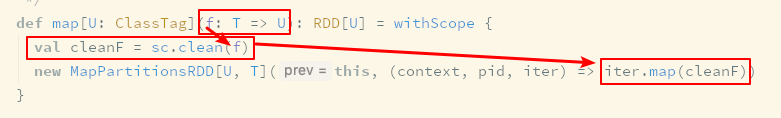

   这个清理主要是处理闭包中的依赖, 使得这个闭包可以被序列化发往不同的集群节点运行

### 7.1.3 flatMap算子的背后

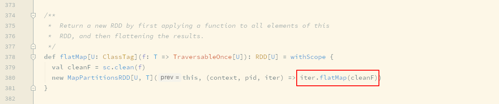

`flatMap` 和 `map` 算子其实本质上是一样的, 其步骤和生成的 `RDD` 都是一样, 只是对于传入函数的处理不同, `map` 是 `collect.map( function )` 而 `flatMap` 是 `collect.flatMap( function )`

从侧面印证了, 其实 `Spark` 中的 `flatMap` 和 `Scala` 基础中的 `flatMap` 其实是一样的

### 7.1.4 textRDD → splitRDD → tupleRDD

由 `textRDD` 到 `splitRDD` 再到 `tupleRDD` 的过程, 其实就是调用 `map` 和 `flatMap` 算子生成新的 `RDD` 的过程, 所以如下图所示, 就是这个阶段所生成的逻辑计划


### 7.1.5 总结

1. 如何生成 `RDD` ?

   生成 `RDD` 的常见方式有三种

   - 从本地集合创建
   - 从外部数据集创建
   - 从其它 `RDD` 衍生

   通过外部数据集创建 `RDD`, 是通过 `Hadoop` 或者其它外部数据源的 `SDK` 来进行数据读取, 同时如果外部数据源是有分片的话, `RDD` 会将分区与其分片进行对照

   通过其它 `RDD` 衍生的话, 其实本质上就是通过不同的算子生成不同的 `RDD` 的子类对象, 从而控制 `compute` 函数的行为来实现算子功能

   **简单说明：**

   - HadoopRDD重写了分区列表和计算函数
   - `MapPartitions` 重写了compute函数，处理整个RDD的数据

2. 生成哪些 `RDD` ?

   不同的算子生成不同的 `RDD`, 生成 `RDD` 的类型取决于算子, 例如 `map` 和 `flatMap` 都会生成 `RDD` 的子类 `MapPartitions` 的对象

3. 如何计算 `RDD` 中的数据 ?

   虽然前面我们提到过 `RDD` 是偏向计算的, 但是其实 `RDD` 还只是表示数据, 纵观 `RDD` 的五大属性中有三个是必须的, 分别如下

   - `Partitions List` 分区列表
   - `Compute function` 计算函数
   - `Dependencies` 依赖

   虽然计算函数是和计算有关的, 但是只有调用了这个函数才会进行计算, `RDD` 显然不会自己调用自己的 `Compute` 函数, 一定是由外部调用的, 所以 `RDD` 更多的意义是用于表示数据集以及其来源, 和针对于数据的计算

   所以如何计算 `RDD` 中的数据呢? 一定是通过其它的组件来计算的, 而计算的规则, 由 `RDD` 中的 `Compute` 函数来指定, 不同类型的 `RDD` 子类有不同的 `Compute` 函数
   
4. 明确边界

   - 明确的是RDD逻辑图的边界
   - 逻辑图是从第一个RDD的创建开始
   - 逻辑图到Action算子执行之前结束
   - 逻辑图就是一组RDD以及其依赖关系
   - **RDD五大属性：**
     - 分区列表
     - 依赖关系
     - 计算函数
     - 最佳位置
     - 分区函数

   

## 7.2 RDD之间的依赖关系概述

 **什么是 `RDD` 之间的依赖关系?**


- 什么是关系(依赖关系) ?

  从算子视角上来看, `splitRDD` 通过 `map` 算子得到了 `tupleRDD`, 所以 `splitRDD` 和 `tupleRDD` 之间的关系是 `map`

  但是仅仅这样说, 会不够全面, 从细节上来看, `RDD` 只是数据和关于数据的计算, 而具体执行这种计算得出结果的是一个神秘的其它组件, 所以, 这两个 `RDD` 的关系可以表示为 `splitRDD` 的数据通过 `map` 操作, 被传入 `tupleRDD`, 这是它们之间更细化的关系

  但是 `RDD` 这个概念本身并不是数据容器, 数据真正应该存放的地方是 `RDD` 的分区, 所以如果把视角放在数据这一层面上的话, 直接讲这两个 RDD 之间有关系是不科学的, 应该从这两个 RDD 的分区之间的关系来讨论它们之间的关系

  **简单说明：RDD之间的依赖关系不是指RDD之间的关系，而是分区之间的关系**

- 那这些分区之间是什么关系?

  如果仅仅说 `splitRDD` 和 `tupleRDD` 之间的话, 那它们的分区之间就是一对一的关系

  但是 `tupleRDD` 到 `reduceRDD` 呢? `tupleRDD` 通过算子 `reduceByKey` 生成 `reduceRDD`, 而这个算子是一个 `Shuffle` 操作, `Shuffle` 操作的两个 `RDD` 的分区之间并不是一对一, `reduceByKey` 的一个分区对应 `tupleRDD` 的多个分区


**reduceByKey算子会生成ShuffledRDD** 

`reduceByKey` 是由算子 `combineByKey` 来实现的, `combineByKey` 内部会创建 `ShuffledRDD` 返回, 具体的代码请大家通过 `IDEA` 来进行查看, 此处不再截图, 而整个 `reduceByKey` 操作大致如下过程


去掉两个 `reducer` 端的分区, 只留下一个的话, 如下


所以, 对于 `reduceByKey` 这个 `Shuffle` 操作来说, `reducer` 端的一个分区, 会从多个 `mapper` 端的分区拿取数据, 是一个多对一的关系

至此为止, 出现了两种分区之间的关系了, 一种是一对一, 一种是多对一

- 一对一：一般都是直接转换，例如：flatMap，map
- 多对一：一般是Shuffle，例如：reduceByKey

**整体上的流程图**

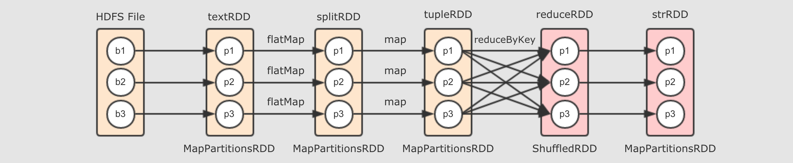

## 7.3 RDD 之间的依赖关系详解

**提出问题：**

1. 如果分区间得关系是一对一或者多对一, 那么这种情况下的 RDD 之间的关系的正式命名是什么呢?
2. RDD 之间的依赖关系, 具体有几种情况呢?

### 7.3.1 窄依赖

假如 `rddB = rddA.transform(…)`, 如果 `rddB` 中一个分区依赖 `rddA` 也就是其父 `RDD` 的少量分区, 这种 `RDD` 之间的依赖关系称之为窄依赖

换句话说, 子 RDD 的每个分区依赖父 RDD 的少量个数的分区, 这种依赖关系称之为窄依赖

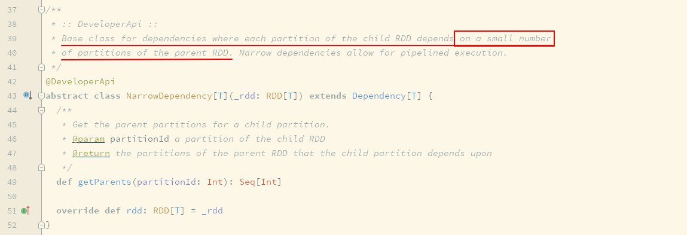

示例：

```scala
val sc = ...

val rddA = sc.parallelize(Seq(1, 2, 3))
val rddB = sc.parallelize(Seq("a", "b"))

/**
  * 运行结果: (1,a), (1,b), (2,a), (2,b), (3,a), (3,b)
  */
rddA.cartesian(rddB).collect().foreach(println(_))
```

- 上述代码的 `cartesian` 是求得两个集合的笛卡尔积
- 上述代码的运行结果是 `rddA` 中每个元素和 `rddB` 中的所有元素结合, 最终的结果数量是两个 `RDD` 数量之和
- `rddC` 有两个父 `RDD`, 分别为 `rddA` 和 `rddB`

对于 `cartesian` 来说, 依赖关系如下


上述图形中清晰展示如下现象

1. `rddC` 中的分区数量是两个父 `RDD` 的分区数量之乘积
2. `rddA` 中每个分区对应 `rddC` 中的两个分区 (因为 `rddB` 中有两个分区), `rddB` 中的每个分区对应 `rddC` 中的三个分区 (因为 `rddA` 有三个分区)

它们之间是窄依赖, 事实上在 `cartesian` 中也是 `NarrowDependency` 这个所有窄依赖的父类的唯一一次直接使用, 为什么呢?

**因为所有的分区之间是拷贝关系, 并不是 Shuffle 关系**

- `rddC` 中的每个分区并不是依赖多个父 `RDD` 中的多个分区
- `rddC` 中每个分区的数量来自一个父 `RDD` 分区中的所有数据, 是一个 `FullDependence`, 所以数据可以直接从父 `RDD` 流动到子 `RDD`
- 不存在一个父 `RDD` 中一部分数据分发过去, 另一部分分发给其它的 `RDD`

### 7.3.2 宽依赖

并没有所谓的宽依赖, 宽依赖应该称作为 `ShuffleDependency`

在 `ShuffleDependency` 的类声明上如下写到

```text
Represents a dependency on the output of a shuffle stage.
```

上面非常清楚的说道, 宽依赖就是 `Shuffle` 中的依赖关系, 换句话说, 只有 `Shuffle` 产生的地方才是宽依赖

那么宽窄依赖的判断依据就非常简单明确了, **是否有 Shuffle ?**

举个 `reduceByKey` 的例子, `rddB = rddA.reduceByKey( (curr, agg) ⇒ curr + agg )` 会产生如下的依赖关系


- `rddB` 的每个分区都几乎依赖 `rddA` 的所有分区
- 对于 `rddA` 中的一个分区来说, 其将一部分分发给 `rddB` 的 `p1`, 另外一部分分发给 `rddB` 的 `p2`, 这不是数据流动, 而是分发

### 7.3.3 分辨宽窄依赖

其实分辨宽窄依赖的本身就是在分辨父子 `RDD` 之间是否有 `Shuffle`, 大致有以下的方法

- 如果是 `Shuffle`, 两个 `RDD` 的分区之间不是单纯的数据流动, 而是分发和复制
- 一般 `Shuffle` 的子 `RDD` 的每个分区会依赖父 `RDD` 的多个分区

但是这样判断其实不准确, 如果想分辨某个算子是否是窄依赖, 或者是否是宽依赖, 则还是要取决于具体的算子, 例如想看 `cartesian` 生成的是宽依赖还是窄依赖, 可以通过如下步骤

1. 查看 `map` 算子生成的 `RDD`

   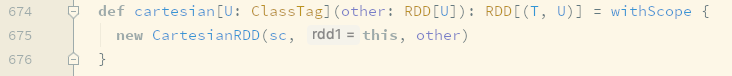

2. 进去 `RDD` 查看 `getDependence` 方法

   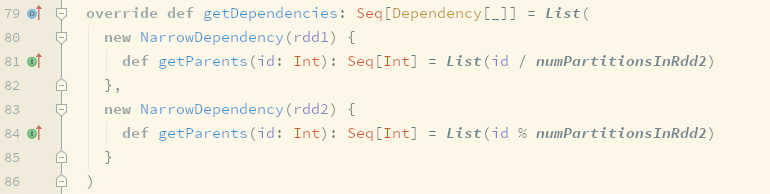

总结：

1. RDD 的逻辑图本质上是对于计算过程的表达, 例如数据从哪来, 经历了哪些步骤的计算
2. 每一个步骤都对应一个 RDD, 因为数据处理的情况不同, RDD 之间的依赖关系又分为窄依赖和宽依赖 

**判断宽/窄依赖总结：**

1. 如果分区一对一，则是窄依赖
2. 如果分区键是多对一，要看是否有数据分发，shuffle
3. 最准确的判断是去看看源码有没有`getDependence` 

## 7.4 常见的宽窄依赖类型（重点）

### 7.4.1 一对一窄依赖

其实 `RDD` 中默认的是 `OneToOneDependency`, 后被不同的 `RDD` 子类指定为其它的依赖类型, 常见的一对一依赖是 `map` 算子所产生的依赖, 例如 `rddB = rddA.map(…)`


**每个分区之间一一对应, 所以叫做一对一窄依赖**

### 7.4.2 Range 窄依赖

`Range` 窄依赖其实也是一对一窄依赖, 但是保留了中间的分隔信息, 可以通过某个分区获取其父分区, **目前只有一个算子生成这种窄依赖**, 就是 `union` 算子, 例如 `rddC = rddA.union(rddB)`


- `rddC` 其实就是 `rddA` 拼接 `rddB` 生成的, 所以 `rddC` 的 `p5` 和 `p6` 就是 `rddB` 的 `p1` 和 `p2`
- 所以需要有方式获取到 `rddC` 的 `p5` 其父分区是谁, 于是就需要记录一下边界, 其它部分和一对一窄依赖一样

### 7.4.3 多对一窄依赖

多对一窄依赖其图形和 `Shuffle` 依赖非常相似, 所以在遇到的时候, 要注意其 `RDD` 之间是否有 `Shuffle` 过程, 比较容易让人困惑, 常见的多对一依赖就是重分区算子 `coalesce`, 例如 `rddB = rddA.coalesce(2, shuffle = false)`, 但同时也要注意, 如果 `shuffle = true` 那就是完全不同的情况了


**因为没有 `Shuffle`, 所以这是一个窄依赖**

### 7.4.4 再谈宽窄依赖的区别

1. 宽窄依赖的区别非常重要, 因为涉及了一件非常重要的事情: **如何计算 `RDD` ?**
2. 宽窄以来的核心区别是: **窄依赖的 `RDD` 可以放在一个 `Task` 中运行**

## 7.5 物理执行图生成

### 7.5.1 物理图的作用是什么?

**问题一: 物理图的意义是什么?**

物理图解决的其实就是 `RDD` 流程生成以后, 如何计算和运行的问题, 也就是如何把 RDD 放在集群中执行的问题

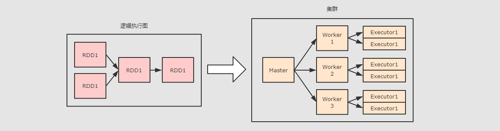

**问题二: 如果要确定如何运行的问题, 则需要先确定集群中有什么组件**

- 首先集群中物理元件就是一台一台的机器
- 其次这些机器上跑的守护进程有两种: `Master`, `Worker`
  - 每个守护进程其实就代表了一台机器, 代表这台机器的角色, 代表这台机器和外界通信
  - 例如我们常说一台机器是 `Master`, 其含义是这台机器中运行了一个 `Master` 守护进程, 如果一台机器运行了 `Master` 的同时又运行了 `Worker`, 则说这台机器是 `Master` 也可以, 说它是 `Worker` 也行
- 真正能运行 `RDD` 的组件是: `Executor`, 也就是说其实 `RDD` 最终是运行在 `Executor` 中的, 也就是说, 无论是 `Master` 还是 `Worker` 其实都是用于管理 `Executor` 和调度程序的

结论是 `RDD` 一定在 `Executor` 中计算, 而 `Master` 和 `Worker` 负责调度和管理 `Executor`

**问题三: 物理图的生成需要考虑什么问题?**

- 要计算 `RDD`, 不仅要计算, 还要很快的计算 → 优化性能
- 要考虑容错, 容错的常见手段是缓存 → `RDD` 要可以缓存

结论是在生成物理图的时候, 不仅要考虑效率问题, 还要考虑一种更合适的方式, 让 `RDD` 运行的更好

### 7.5.2 谁来计算 RDD ?

**问题一: RDD 是什么, 用来做什么 ?**

回顾一下 `RDD` 的五个属性

简单的说就是: **分区列表, 计算函数, 依赖关系, 分区函数, 最佳位置**

- 分区列表, 分区函数, 最佳位置, 这三个属性其实说的就是数据集在哪, 在哪更合适, 如何分区
- 计算函数和依赖关系, 这两个属性其实说的是数据集从哪来

所以结论是 `RDD` 是一个数据集的表示, 不仅表示了数据集, 还表示了这个数据集从哪来, 如何计算。

但是问题是, 谁来计算 ? 如果为一台汽车设计了一个设计图, 那么设计图自己生产汽车吗 ?

**问题二: 谁来计算 ?**

前面我们明确了两件事, `RDD` 在哪被计算? 在 `Executor` 中. `RDD` 是什么? 是一个数据集以及其如何计算的图纸.

直接使用 `Executor` 也是不合适的, 因为一个计算的执行总是需要一个容器, 例如 `JVM` 是一个进程, 只有进程中才能有线程, 所以这个计算 `RDD` 的线程应该运行在一个进程中, 这个进程就是 `Exeutor`, `Executor` 有如下两个职责

- 和 `Driver` 保持交互从而认领属于自己的任务

  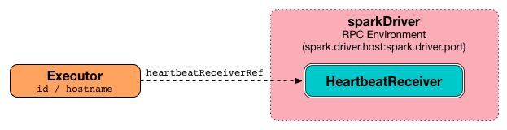

- 接受任务后, 由Task运行任务

  

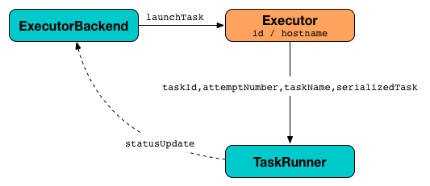

**问题三: Task 该如何设计 ?**

第一个想法是每个 `RDD` 都由一个 `Task` 来计算，第二个想法是一整个逻辑执行图中所有的 `RDD` 都由一组 `Task` 来执行，第三个想法是分阶段执行

- 第一个想法: 为每个 RDD 的分区设置一组 Task

  

  大概就是每个 `RDD` 都有三个 `Task`, 每个 `Task` 对应一个 `RDD` 的分区, 执行一个分区的数据的计算

  但是这么做有一个非常难以解决的问题, 就是数据存储的问题, 例如 `Task 1, 4, 7, 10, 13, 16` 在同一个流程上, 但是这些 `Task` 之间需要交换数据, 因为这些 `Task` 可能被调度到不同的机器上上, 所以 `Task1` 执行完了数据以后需要暂存, 后交给 `Task4` 来获取

  这只是一个简单的逻辑图, 如果是一个复杂的逻辑图, 会有什么表现? 要存储多少数据? 无论是放在磁盘还是放在内存中, 是不是都是一种极大的负担?

- 第二个想法: 让数据流动

  很自然的, 第一个想法的问题是数据需要存储和交换, 那不存储不就好了吗? 对, 可以让数据流动起来

  第一个要解决的问题就是, 要为数据创建管道(`Pipeline`), 有了管道, 就可以流动

  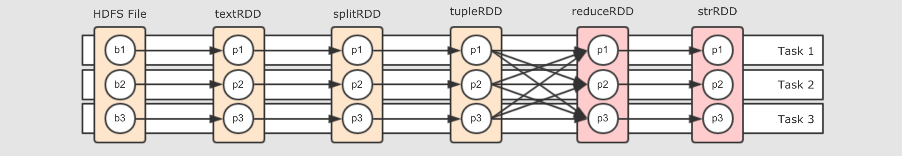

  简单来说, 就是为所有的 `RDD` 有关联的分区使用同一个 `Task`, 但是就没问题了吗? 请关注红框部分

  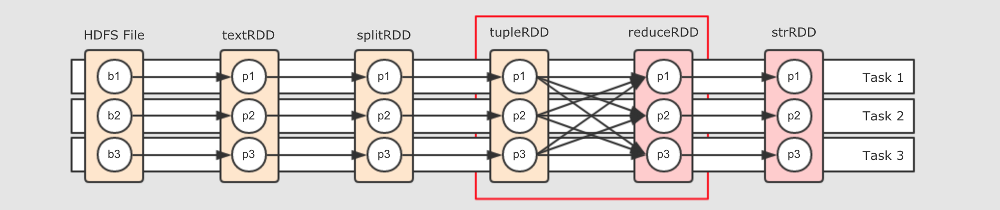

  这两个 `RDD` 之间是 `Shuffle` 关系, 也就是说, 右边的 `RDD` 的一个分区可能依赖左边 `RDD` 的所有分区, 这样的话, 数据在这个地方流不动了, 怎么办?

- 第三个想法: 划分阶段

  既然在 `Shuffle` 处数据流不动了, 那就可以在这个地方中断一下, 后面 `Stage` 部分详解

### 7.5.3 如何划分阶段 ?

为了减少执行任务, 减少数据暂存和交换的机会, 所以需要创建管道, 让数据沿着管道流动, 其实也就是原先每个 `RDD` 都有一组 `Task`, 现在改为所有的 `RDD` 共用一组 `Task`, 但是也有问题, 问题如下


就是说, 在 `Shuffle` 处, 必须断开管道, 进行数据交换, 交换过后, 继续流动, 所以整个流程可以变为如下样子

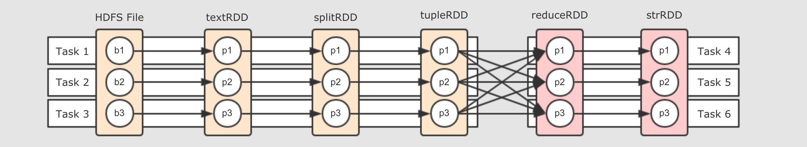

把 `Task` 断开成两个部分, `Task4` 可以从 `Task 1, 2, 3` 中获取数据, 后 `Task4` 又作为管道, 继续让数据在其中流动

但是还有一个问题, 说断开就直接断开吗? 不用打个招呼的呀? 这个断开即没有道理, 也没有规则, 所以可以为这个断开增加一个概念叫做阶段, 按照阶段断开, 阶段的英文叫做 `Stage`, 如下


所以划分阶段的本身就是设置断开点的规则, 那么该如何划分阶段呢?

1. 第一步, 从最后一个 `RDD`, 也就是逻辑图中最右边的 `RDD` 开始, 向前滑动 `Stage` 的范围, 为 `Stage0`
2. 第二步, 遇到 `ShuffleDependency` 断开 `Stage`, 从下一个 `RDD` 开始创建新的 `Stage`, 为 `Stage1`
3. 第三步, 新的 `Stage` 按照同样的规则继续滑动, 直到包裹所有的 `RDD`

总结来看, 就是针对于宽窄依赖来判断, 一个 `Stage` 中只有窄依赖, 因为只有窄依赖才能形成数据的 `Pipeline`.

如果要进行 `Shuffle` 的话, 数据是流不过去的, 必须要拷贝和拉取. 所以遇到 `RDD` 宽依赖的两个 `RDD` 时, 要切断这两个 `RDD` 的 `Stage`.

**注：这样一个 RDD 依赖的链条, 我们称之为 RDD 的血统, 其中有宽依赖也有窄依赖**

### 7.5.4 数据怎么流动 ?

代码：

```scala
val sc = ...

val textRDD = sc.parallelize(Seq("Hadoop Spark", "Hadoop Flume", "Spark Sqoop"))
val splitRDD = textRDD.flatMap(_.split(" "))
val tupleRDD = splitRDD.map((_, 1))
val reduceRDD = tupleRDD.reduceByKey(_ + _)
val strRDD = reduceRDD.map(item => s"${item._1}, ${item._2}")

strRDD.collect.foreach(item => println(item))
```

上述代码是这个章节我们一直使用的代码流程, 如下是其完整的逻辑执行图


由上图分析得知：

1. 数据的开始计算是发生在调用Action的RDD上
2. 而后会往前寻找数据，直到最开始的RDD，而先获取到数据的RDD是textRDD
3. 而后再从textRDD开始计算得出结果，往后运行。
4. 所以，这里划分阶段是从后往前划分

如果放在集群中运行, 通过 `WebUI` 可以查看到如下 `DAG` 结构，那么仔细查看可以发现和我们分析的stage是不同的，为什么呢？我们接着往下看

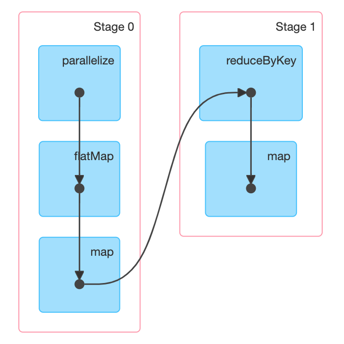

说明：

1. 从 `ResultStage` 开始执行

   最接近 `Result` 部分的 `Stage id` 为 0, 这个 `Stage` 被称之为 `ResultStage`

   由代码可以知道, 最终调用 `Action` 促使整个流程执行的是最后一个 `RDD`, `strRDD.collect`, 所以当执行 `RDD` 的计算时候, 先计算的也是这个 `RDD`

2. `RDD` **之间是有关联的**

   前面已经知道, 最后一个 `RDD` 先得到执行机会, 先从这个 `RDD` 开始执行, 但是这个 `RDD` 中有数据吗 ? 如果没有数据, 它的计算是什么? 它的计算是从父 `RDD` 中获取数据, 并执行传入的算子的函数

   简单来说, 从产生 `Result` 的地方开始计算, 但是其 `RDD` 中是没数据的, 所以会找到父 `RDD` 来要数据, 父 `RDD` 也没有数据, 继续向上要, 所以, 计算从 `Result` 处调用, 但是从整个逻辑图中的最左边 `RDD` 开始, 类似一个递归的过程

   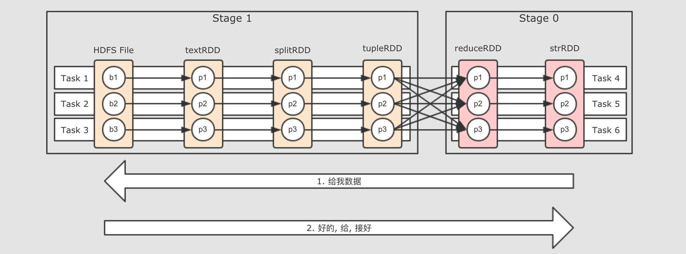

## 7.6 调度过程

### 7.6.1 逻辑图

是什么？怎么生成？具体怎么生成？

```scala
val textRDD = sc.parallelize(Seq("Hadoop Spark", "Hadoop Flume", "Spark Sqoop"))
val splitRDD = textRDD.flatMap(_.split(" "))
val tupleRDD = splitRDD.map((_, 1))
val reduceRDD = tupleRDD.reduceByKey(_ + _)
val strRDD = reduceRDD.map(item => s"${item._1}, ${item._2}")
```

**逻辑图如何生成**

上述代码在 `Spark Application` 的 `main` 方法中执行, 而 `Spark Application` 在 `Driver` 中执行, 所以上述代码在 `Driver` 中被执行, 那么这段代码执行的结果是什么呢?

一段 `Scala` 代码的执行结果就是最后一行的执行结果, 所以上述的代码, 从逻辑上执行结果就是最后一个 `RDD`, 最后一个 `RDD` 也可以认为就是逻辑执行图, 为什么呢?

例如 `rdd2 = rdd1.map(…)` 中, 其实本质上 `rdd2` 是一个类型为 `MapPartitionsRDD` 的对象, 而创建这个对象的时候, 会通过构造函数传入当前 `RDD` 对象, 也就是父 `RDD`, 也就是调用 `map` 算子的 `rdd1`, `rdd1` 是 `rdd2` 的父 `RDD`

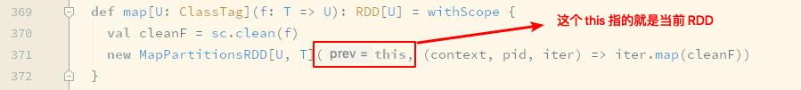

一个 `RDD` 依赖另外一个 `RDD`, 这个 `RDD` 又依赖另外的 `RDD`, 一个 `RDD` 可以通过 `getDependency` 获得其父 `RDD`, 这种环环相扣的关系, 最终从最后一个 `RDD` 就可以推演出前面所有的 `RDD`

**逻辑图是什么, 干啥用**

逻辑图其实本质上描述的就是数据的计算过程, 数据从哪来, 经过什么样的计算, 得到什么样的结果, 再执行什么计算, 得到什么结果

可是数据的计算是描述好了, 这种计算该如何执行呢?

### 7.6.2 物理图

数据的计算表示好了, 该正式执行了, 但是如何执行? 如何执行更快更好更酷? 就需要为其执行做一个规划, 所以需要生成物理执行图

```scala
strRDD.collect.foreach(item => println(item))
```

上述代码其实就是最后的一个 `RDD` 调用了 `Action` 方法, 调用 `Action` 方法的时候, 会请求一个叫做 `DAGScheduler` 的组件, `DAGScheduler` 会创建用于执行 `RDD` 的 `Stage` 和 `Task`

`DAGScheduler` 是一个由 `SparkContext` 创建, 运行在 `Driver` 上的组件, 其作用就是将由 `RDD` 构建出来的逻辑计划, 构建成为由真正在集群中运行的 `Task` 组成的物理执行计划, `DAGScheduler` 主要做如下三件事

1. 帮助每个 `Job` 计算 `DAG` 并发给 `TaskSheduler` 调度
2. 确定每个 `Task` 的最佳位置
3. 跟踪 `RDD` 的缓存状态, 避免重新计算

从字面意思上来看, `DAGScheduler` 是调度 `DAG` 去运行的, `DAG` 被称作为有向无环图, 其实可以将 `DAG` 理解为就是 `RDD` 的逻辑图, 其呈现两个特点: `RDD` 的计算是有方向的, `RDD` 的计算是无环的, 所以 `DAGScheduler` 也可以称之为 `RDD Scheduler`, 但是真正运行在集群中的并不是 `RDD`, 而是 `Task` 和 `Stage`, `DAGScheduler` 负责这种转换

### 7.6.3 Job 

**`Job` 什么时候生成 ?**

当一个 `RDD` 调用了 `Action` 算子的时候, 在 `Action` 算子内部, 会使用 `sc.runJob()` 调用 `SparkContext` 中的 `runJob` 方法, 这个方法又会调用 `DAGScheduler` 中的 `runJob`, 后在 `DAGScheduler` 中使用消息驱动的形式创建 `Job`

简而言之, `Job` 在 `RDD` 调用 `Action` 算子的时候生成, 而且调用一次 `Action` 算子, 就会生成一个 `Job`, 如果一个 `SparkApplication` 中调用了多次 `Action` 算子, 会生成多个 `Job` 串行执行, 每个 `Job` 独立运作, 被独立调度, 所以 `RDD` 的计算也会被执行多次

**`Job` 是什么 ?**

如果要将 `Spark` 的程序调度到集群中运行, `Job` 是粒度最大的单位, 调度以 `Job` 为最大单位, 将 `Job` 拆分为 `Stage` 和 `Task` 去调度分发和运行, 一个 `Job` 就是一个 `Spark` 程序从 `读取 → 计算 → 运行` 的过程

一个 `Spark Application` 可以包含多个 `Job`, 这些 `Job` 之间是串行的, 也就是第二个 `Job` 需要等待第一个 `Job` 的执行结束后才会开始执行

**`Job` 和 `Stage` 的关系**

`Job` 是一个最大的调度单位, 也就是说 `DAGScheduler` 会首先创建一个 `Job` 的相关信息, 后去调度 `Job`, 但是没办法直接调度 `Job`, 比如说现在要做一盘手撕包菜, 不可能直接去炒一整颗包菜, 要切好撕碎, 再去炒

也就是说一个job里面可以有多个stage

- 为什么 `Job` 需要切分 ?

  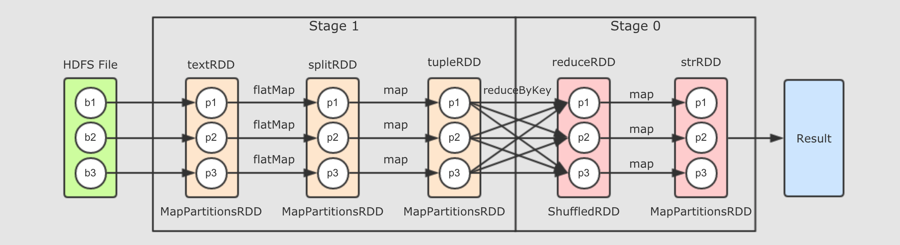

  - 因为 `Job` 的含义是对整个 `RDD` 血统求值, 但是 `RDD` 之间可能会有一些宽依赖

  - 如果遇到宽依赖的话, 两个 `RDD` 之间需要进行数据拉取和复制

    如果要进行拉取和复制的话, 那么一个 `RDD` 就必须等待它所依赖的 `RDD` 所有分区先计算完成, 然后再进行拉取

  - 由上得知, 一个 `Job` 是无法计算完整个 `RDD` 血统的

- 如何切分 ?

  创建一个 `Stage`, 从后向前回溯 `RDD`, 遇到 `Shuffle` 依赖就结束 `Stage`, 后创建新的 `Stage` 继续回溯. 这个过程上面已经详细的讲解过, 但是问题是切分以后如何执行呢, 从后向前还是从前向后, 是串行执行多个 `Stage`, 还是并行执行多个 `Stage`

**问题一: 执行顺序**

在图中, `Stage 0` 的计算需要依赖 `Stage 1` 的数据, 因为 `reduceRDD` 中一个分区可能需要多个 `tupleRDD` 分区的数据, 所以 `tupleRDD` 必须先计算完, 所以, 应该在逻辑图中**自左向右执行 Stage**

**问题二: 串行还是并行**

还是同样的原因, `Stage 0` 如果想计算, `Stage 1` 必须先计算完, 因为 `Stage 0` 中每个分区都依赖 `Stage 1` 中的所有分区, 所以 `Stage 1` 不仅需要先执行, 而且 `Stage 1` 执行完之前 `Stage 0` 无法执行, 它们只能**串行执行**

**总结**

- 一个 `Stage` 就是物理执行计划中的一个步骤, 一个 `Spark Job` 就是划分到不同 `Stage` 的计算过程
- `Stage` 之间的边界由 `Shuffle` 操作来确定
  - `Stage` 内的 `RDD` 之间都是窄依赖, 可以放在一个管道中执行
  - 而 `Shuffle` 后的 `Stage` 需要等待前面 `Stage` 的执行

`Stage` 有两种

- `ShuffMapStage`, 其中存放窄依赖的 `RDD`
- `ResultStage`, 每个 `Job` 只有一个, 负责计算结果, 一个 `ResultStage` 执行完成标志着整个 `Job` 执行完毕

### 7.6.4 Stage和Task的关系

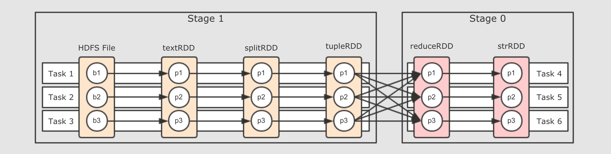

前面我们说到 `Job` 无法直接执行, 需要先划分为多个 `Stage`, 去执行 `Stage`, 那么 `Stage` 可以直接执行吗?

- 第一点: `Stage` 中的 `RDD` 之间是窄依赖

  因为 `Stage` 中的所有 `RDD` 之间都是窄依赖, 窄依赖 `RDD` 理论上是可以放在同一个 `Pipeline(管道, 流水线)` 中执行的, 似乎可以直接调度 `Stage` 了? 其实不行, 看第二点

- 第二点: 别忘了 `RDD` 还有分区

  一个 `RDD` 只是一个概念, 而真正存放和处理数据时, 都是以分区作为单位的

  `Stage` 对应的是多个整体上的 `RDD`, 而真正的运行是需要针对 `RDD` 的分区来进行的

- 第三点: 一个 `Task` 对应一个 `RDD` 的分区

  一个比 `Stage` 粒度更细的单元叫做 `Task`, `Stage` 是由 `Task` 组成的, 之所以有 `Task` 这个概念, 是因为 `Stage` 针对整个 `RDD`, 而计算的时候, 要针对 `RDD` 的分区

  假设一个 `Stage` 中有 10 个 `RDD`, 这些 `RDD` 中的分区各不相同, 但是分区最多的 `RDD` 有 30 个分区, 而且很显然, 它们之间是窄依赖关系

  那么, 这个 `Stage` 中应该有多少 `Task` 呢? 应该有 30 个 `Task`, 因为一个 `Task` 计算一个 `RDD` 的分区. 这个 `Stage` 至多有 30 个分区需要计算

- 总结

  - 一个 `Stage` 就是一组并行的 `Task` 集合
  - Task 是 Spark 中最小的独立执行单元, 其作用是处理一个 RDD 分区
  - 一个 Task 只可能存在于一个 Stage 中, 并且只能计算一个 RDD 的分区

关系说明：

- 一个Stage中有多个Task
- 一个Stage对应一个Taskset
- 一个Stage就是一组Task

### 7.6.5 TaskSet

梳理一下这几个概念, `Job > Stage > Task`, `Job 中包含 Stage 中包含 Task`

而 `Stage` 中经常会有一组 `Task` 需要同时执行, 所以针对于每一个 `Task` 来进行调度太过繁琐, 而且没有意义, 所以每个 `Stage` 中的 `Task` 们会被收集起来, 放入一个 `TaskSet` 集合中

- 一个 `Stage` 有一个 `TaskSet`
- `TaskSet` 中 `Task` 的个数由 `Stage` 中的最大分区数决定

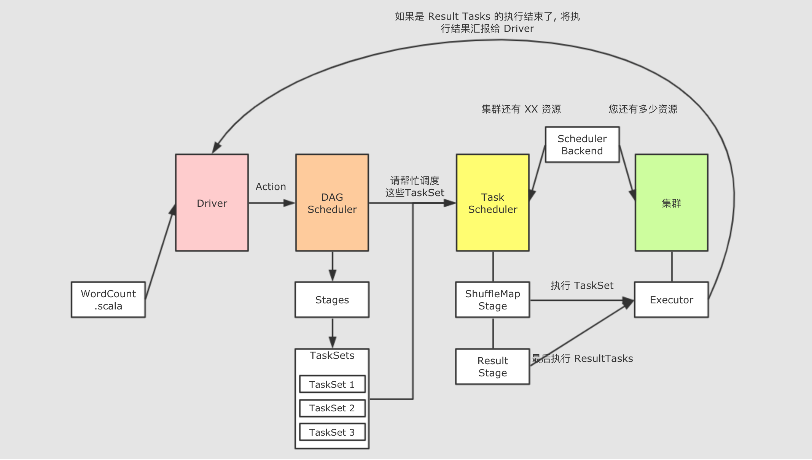

## 7.7 shuffle过程

### 7.7.1 Shuffle 过程的组件结构

从整体视角上来看, `Shuffle` 发生在两个 `Stage` 之间, 一个 `Stage` 把数据计算好, 整理好, 等待另外一个 `Stage` 来拉取


放大视角, 会发现, 其实 `Shuffle` 发生在 `Task` 之间, 一个 `Task` 把数据整理好, 等待 `Reducer` 端的 `Task` 来拉取


如果更细化一下, `Task` 之间如何进行数据拷贝的呢? 其实就是一方 `Task` 把文件生成好, 然后另一方 `Task` 来拉取

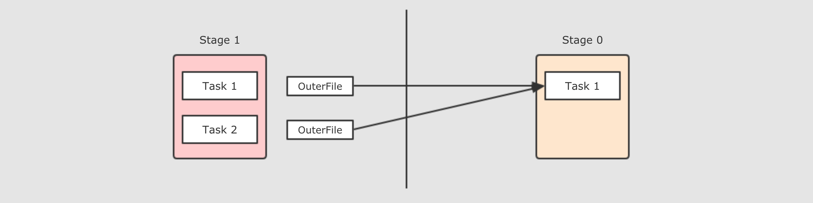

现在是一个 `Reducer` 的情况, 如果有多个 `Reducer` 呢? 如果有多个 `Reducer` 的话, 就可以在每个 `Mapper` 为所有的 `Reducer` 生成各一个文件, 这种叫做 `Hash base shuffle`, 这种 `Shuffle` 的方式问题大家也知道, 就是生成中间文件过多, 而且生成文件的话需要缓冲区, 占用内存过大


那么可以把这些文件合并起来, 生成一个文件返回, 这种 `Shuffle` 方式叫做 `Sort base shuffle`, 每个 `Reducer` 去文件的不同位置拿取数据


如果再细化一下, 把参与这件事的组件也放置进去, 就会是如下这样

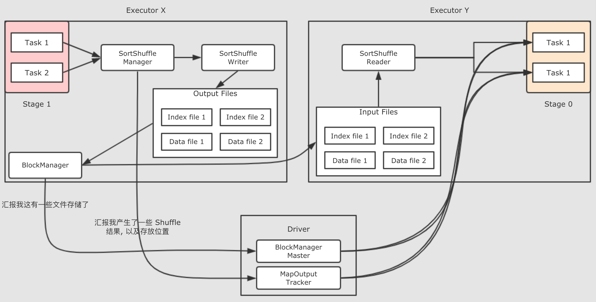

### 7.7.2 ShuffleWriter 

**有哪些 `ShuffleWriter` ?**

大致上有三个 `ShufflWriter`, `Spark` 会按照一定的规则去使用这三种不同的 `Writer`

- `BypassMergeSortShuffleWriter`

  这种 `Shuffle Writer` 也依然有 `Hash base shuffle` 的问题, 它会在每一个 `Mapper` 端对所有的 `Reducer` 生成一个文件, 然后再合并这个文件生成一个统一的输出文件, 这个过程中依然是有很多文件产生的, 所以只适合在小量数据的场景下使用

  `Spark` 有考虑去掉这种 `Writer`, 但是因为结构中有一些依赖, 所以一直没去掉

  当 `Reducer` 个数小于 `spark.shuffle.sort.bypassMergeThreshold`, 并且没有 `Mapper` 端聚合的时候启用这种方式

- `SortShuffleWriter`

  这种 `ShuffleWriter` 写文件的方式非常像 `MapReduce` 了, 后面详说

  当其它两种 `Shuffle` 不符合开启条件时, 这种 `Shuffle` 方式是默认的

- `UnsafeShuffleWriter`

  这种 `ShuffWriter` 会将数据序列化, 然后放入缓冲区进行排序, 排序结束后 `Spill` 到磁盘, 最终合并 `Spill` 文件为一个大文件, 同时在进行内存存储的时候使用了 `Java` 得 `Unsafe API`, 也就是使用堆外内存, 是钨丝计划的一部分

  也不是很常用, 只有在满足如下三个条件时候才会启用

  - 序列化器序列化后的数据, 必须支持排序
  - 没有 `Mapper` 端的聚合
  - `Reducer` 的个数不能超过支持的上限 (2 ^ 24)

**`SortShuffleWriter` 的执行过程**

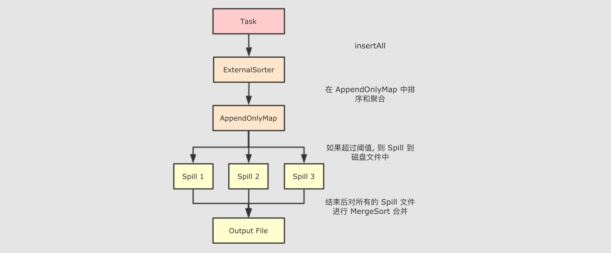

整个 `SortShuffleWriter` 如上述所说, 大致有如下几步

1. 首先 `SortShuffleWriter` 在 `write` 方法中回去写文件, 这个方法中创建了 `ExternalSorter`
2. `write` 中将数据 `insertAll` 到 `ExternalSorter` 中
3. 在 `ExternalSorter` 中排序
   1. 如果要聚合, 放入 `AppendOnlyMap` 中, 如果不聚合, 放入 `PartitionedPairBuffer` 中
   2. 在数据结构中进行排序, 排序过程中如果内存数据大于阈值则溢写到磁盘
4. 使用 `ExternalSorter` 的 `writePartitionedFile` 写入输入文件
   1. 将所有的溢写文件通过类似 `MergeSort` 的算法合并
   2. 将数据写入最终的目标文件中

# 8.RDD 的分布式共享变量

## 8.1 什么是闭包

闭包是一个必须要理解, 但是又不太好理解的知识点, 先看一个小例子

```scala
@Test
def test(): Unit = {
  val areaFunction = closure()
  val area = areaFunction(2)
  println(area)
}

def closure(): Int => Double = {
  val factor = 3.14
  val areaFunction = (r: Int) => math.pow(r, 2) * factor
  areaFunction
}
```

上述例子中, `closure`方法返回的一个函数的引用, 其实就是一个闭包, 闭包本质上就是一个封闭的作用域, 要理解闭包, 是一定要和作用域联系起来的.

**能否在 `test` 方法中访问 `closure` 定义的变量? 不能**

```scala
@Test
def test(): Unit = {
  println(factor)
}

def closure(): Int => Double = {
  val factor = 3.14
}
```

**有没有什么间接的方式?**

```scala
@Test
def test(): Unit = {
  val areaFunction = closure()
  areaFunction()
}

def closure(): () => Unit = {
  val factor = 3.14
  val areaFunction = () => println(factor)
  areaFunction
}
```

**什么是闭包?**

```scala
val areaFunction = closure()
areaFunction()
```

通过 `closure` 返回的函数 `areaFunction` 就是一个闭包, 其函数内部的作用域并不是 `test` 函数的作用域，**如果一个函数携带了一个外包的作用域，这种函数我们称之为闭包**, 在 Scala 中

- areaFunction就是闭包，闭包的本质就是一个函数
- 在Scala中，函数是一个特殊的类型，FunctionX
- 闭包也是一个FunctionX类型的对象
- **闭包是一个对象**

## 8.2 分发闭包

```java
sc.textFile("dataset/access_log_sample.txt")
  .flatMap(item => item.split(""))
  .collect()
```

上述这段代码中, `flatMap` 中传入的是另外一个函数, 传入的这个函数就是一个闭包, 这个闭包会被序列化运行在不同的 Executor 中


```scala
class MyClass {
  val field = "Hello"

  def doStuff(rdd: RDD[String]): RDD[String] = {
    rdd.map(x => field + x)
  }
}
```

简单分析：

- `(x => field + x)`引用了MyClass对象中的一个成员变量，说明其可以访问MyClass这个类的作用域，也是一个闭包，封闭的是MyClass这个作用域

这段代码中的闭包就有了一个依赖, 依赖于外部的一个类, 因为传递给算子的函数最终要在 Executor 中运行, 所以需要 **序列化** `MyClass` 发给每一个 `Executor`, 从而在 `Executor` 访问 `MyClass` 对象的属性

将`(x => field + x)`这个函数分发给不同的Executor中执行的时候，其依赖了MyClass这个类当前的对象，因为其封闭了这个作用域MyClass和函数，这两个都要一起被序列化发往不同的节点执行

- 问题1：如果MyClass不能被序列化，将会报错
- 问题2：如果在这个闭包中，依赖了一个外部很大的集合，那么这个集合会随着每一个Task分发，可以理解为，其依赖的外部数据，都会被复制很多份


**总结：**

1. 闭包就是一个封闭的作用域, 也是一个对象
2. Spark 算子所接受的函数, 本质上是一个闭包, 因为其需要封闭作用域, 并且序列化自身和依赖, 分发到不同的节点中运行

## 8.3 累加器

一个小问题

```java
var count = 0

val config = new SparkConf().setAppName("ip_ana").setMaster("local[6]")
val sc = new SparkContext(config)

sc.parallelize(Seq(1, 2, 3, 4, 5))
  .foreach(count += _)

println(count)
```

**上面这段代码是一个非常错误的使用**, 请不要仿照, 这段代码只是为了证明一些事情

先明确两件事, `var count = 0` 是在 Driver 中定义的, `foreach(count += _)` 这个算子以及传递进去的闭包运行在 Executor 中

这段代码整体想做的事情是累加一个变量, 但是这段代码的写法却做不到这件事, 原因也很简单, 因为具体的算子是闭包, 被分发给不同的节点运行, 所以这个闭包中累加的并不是 Driver 中的这个变量

**简单来说：**就是count这个变量会被分发给不同的Executor中运行，而count的初始变量是0，也就是说，每个Executor中count的初始变量都是0，最后得出的结果就是错误的

### 8.3.1 全局累加器

Accumulators(累加器) 是一个只支持 `added`(添加) 的分布式变量, 可以在分布式环境下保持一致性, 并且能够做到高效的并发.

原生 Spark 支持数值型的累加器, 可以用于实现计数或者求和, 开发者也可以使用自定义累加器以实现更高级的需求

```java
val config = new SparkConf().setAppName("ip_ana").setMaster("local[6]")
val sc = new SparkContext(config)

val counter = sc.longAccumulator("counter")

sc.parallelize(Seq(1, 2, 3, 4, 5))
  .foreach(counter.add(_))

// 运行结果: 15
println(counter.value)
```

注意点:

- Accumulator 是支持并发并行的, 在任何地方都可以通过 `add` 来修改数值, 无论是 Driver 还是 Executor
- 只能在 Driver 中才能调用 `value` 来获取数值

在 WebUI 中关于 Job 部分也可以看到 Accumulator 的信息, 以及其运行的情况

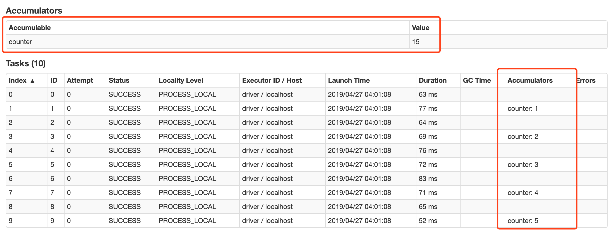

累计器件还有两个小特性,

-  第一, 累加器能保证在 Spark 任务出现问题被重启的时候不会出现重复计算
- 第二, 累加器只有在 Action 执行的时候才会被触发.

```java
val config = new SparkConf().setAppName("ip_ana").setMaster("local[6]")
val sc = new SparkContext(config)

val counter = sc.longAccumulator("counter")

sc.parallelize(Seq(1, 2, 3, 4, 5))
  .map(counter.add(_)) // 这个地方不是 Action, 而是一个 Transformation

// 运行结果是 0
println(counter.value)
```

### 8.3.2 自定义累加器

开发者可以通过自定义累加器来实现更多类型的累加器, 累加器的作用远远不只是累加, 比如可以实现一个累加器, 用于向里面添加一些运行信息

```scala
package test

import org.apache.spark.{SparkConf, SparkContext}
import org.apache.spark.util.AccumulatorV2
import org.junit.Test

import scala.collection.mutable

/**
 * @Class:spark.test.Accumulator
 * @Descript:
 * @Author:宋天
 * @Date:2020/5/6
 */
class Accumulator {
  @Test
  def acc():Unit = {
    val config = new SparkConf().setAppName("acc").setMaster("local[6]")
    val sc = new SparkContext(config)

    val numAcc = new NumAccumulator()
    //注册给spark
    sc.register(numAcc,"num")
    
    sc.parallelize(Seq("1","2","3"))
      .foreach(item => numAcc.add(item))
    
    println(numAcc.value)
    
    sc.stop()
  }

  class NumAccumulator extends AccumulatorV2[String,Set[String]]{
    private val nums:mutable.Set[String] = mutable.Set()

    /**
     * 告诉spark框架，这个累加器对象是否是空的
     * @return
     */
    override def isZero: Boolean = {
      nums.isEmpty
    }

    /**
     * 提供给Spark框架一个拷贝的累加器
     * @return
     */
    override def copy(): AccumulatorV2[String, Set[String]] = {
      val  newAccumulator = new NumAccumulator()
      nums.synchronized{
        newAccumulator.nums ++= this.nums
      }
      newAccumulator
    }

    /**
     * 帮助Spark框架清理累加器的内容
     */
    override def reset(): Unit = {
      nums.clear()
    }

    /**
     * 外部传入要累加的内容，在这个方法中进行累加
     * @param v
     */
    override def add(v: String): Unit = {
      nums += v
    }

    /**
     * 合并累加器
     *
     * 累加器在进行累加的时候，可能每个分布式节点都有一个实例，
     * 在最后Driver进行一次合并，把所有的实例的内容合并起来，会调用这个merge方法进行合并
     * @param other
     */
    override def merge(other: AccumulatorV2[String, Set[String]]): Unit = {
      nums ++= other.value
    }

    /**
     * 对value值进行处理
     *
     * 提供给外部累加结果
     * 那么为什么一定要给不可变的？
     * 因为外部有可能在进行修改，如果是可变的集合，其外部的修改会影响内部的值
     * @return
     */
    override def value: Set[String] = {
      nums.toSet
    }
  }
}

```

注意点:

- 可以通过继承 `AccumulatorV2` 来创建新的累加器
- 有几个方法需要重写
  - reset 方法用于把累加器重置为 0
  - add 方法用于把其它值添加到累加器中
  - merge 方法用于指定如何合并其他的累加器
- `value` 需要返回一个不可变的集合, 因为不能因为外部的修改而影响自身的值

## 8.4 广播变量

### 8.4.1 广播变量的作用 

广播变量允许开发者将一个 `Read-Only` 的变量缓存到集群中每个节点中, 而不是传递给每一个 Task 一个副本.

- 集群中每个节点, 指的是一个机器
- 每一个 Task, 一个 Task 是一个 Stage 中的最小处理单元, 一个 Executor 中可以有多个 Stage, 每个 Stage 有多个 Task

所以在需要跨多个 Stage 的多个 Task 中使用相同数据的情况下, 广播特别的有用

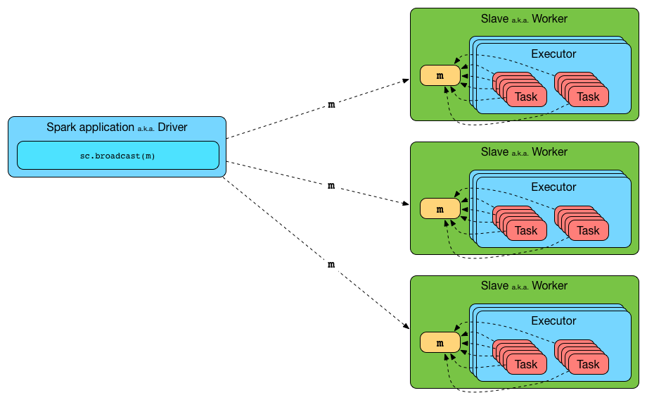

简单理解：

- 如果有10个Task，那么map就会被分发十份，就会有十个map
- 但是假如说集群只有两个Executor
  - 无论有多少个Task，最终都会被放在这两个Executor上执行
  - 一个Executor代表一个进程，集群需要多少个map？通过广播变量可以只需要2个map即可

### 8.4.2 广播变量的API

| 法名        | 描述                                   |
| :---------- | :------------------------------------- |
| `id`        | 唯一标识                               |
| `value`     | 广播变量的值                           |
| `unpersist` | 在 Executor 中异步的删除缓存副本       |
| `destroy`   | 销毁所有此广播变量所关联的数据和元数据 |
| `toString`  | 字符串表示                             |

**使用广播变量的一般套路**

可以通过如下方式创建广播变量

```scala
val b = sc.broadcast(1)
```

如果 Log 级别为 DEBUG 的时候, 会打印如下信息

```text
DEBUG BlockManager: Put block broadcast_0 locally took  430 ms
DEBUG BlockManager: Putting block broadcast_0 without replication took  431 ms
DEBUG BlockManager: Told master about block broadcast_0_piece0
DEBUG BlockManager: Put block broadcast_0_piece0 locally took  4 ms
DEBUG BlockManager: Putting block broadcast_0_piece0 without replication took  4 ms
```

创建后可以使用 `value` 获取数据

```scala
b.value
```

获取数据的时候会打印如下信息

```text
DEBUG BlockManager: Getting local block broadcast_0
DEBUG BlockManager: Level for block broadcast_0 is StorageLevel(disk, memory, deserialized, 1 replicas)
```

广播变量使用完了以后, 可以使用 `unpersist` 删除数据

```scala
b.unpersist
```

删除数据以后, 可以使用 `destroy` 销毁变量, 释放内存空间

```scala
b.destroy
```

销毁以后, 会打印如下信息

```text
DEBUG BlockManager: Removing broadcast 0
DEBUG BlockManager: Removing block broadcast_0_piece0
DEBUG BlockManager: Told master about block broadcast_0_piece0
DEBUG BlockManager: Removing block broadcast_0
```

**使用 `value` 方法的注意点**

方法签名 `value: T`

在 `value` 方法内部会确保使用获取数据的时候, 变量必须是可用状态, 所以必须在变量被 `destroy` 之前使用 `value` 方法, 如果使用 `value` 时变量已经失效, 则会爆出以下错误

```text
org.apache.spark.SparkException: Attempted to use Broadcast(0) after it was destroyed (destroy at <console>:27)
  at org.apache.spark.broadcast.Broadcast.assertValid(Broadcast.scala:144)
  at org.apache.spark.broadcast.Broadcast.value(Broadcast.scala:69)
  ... 48 elided
```

**使用 `destroy` 方法的注意点**

方法签名 `destroy(): Unit`

`destroy` 方法会移除广播变量, 彻底销毁掉, 但是如果你试图多次 `destroy` 广播变量, 则会爆出以下错误

```text
org.apache.spark.SparkException: Attempted to use Broadcast(0) after it was destroyed (destroy at <console>:27)
  at org.apache.spark.broadcast.Broadcast.assertValid(Broadcast.scala:144)
  at org.apache.spark.broadcast.Broadcast.destroy(Broadcast.scala:107)
  at org.apache.spark.broadcast.Broadcast.destroy(Broadcast.scala:98)
  ... 48 elided
```

### 8.4.3 广播变量的使用场景

假设我们在某个算子中需要使用一个保存了项目和项目的网址关系的 `Map[String, String]` 静态集合, 如下

```scala
val pws = Map("Apache Spark" -> "http://spark.apache.org/", "Scala" -> "http://www.scala-lang.org/")

val websites = sc.parallelize(Seq("Apache Spark", "Scala")).map(pws).collect
```

上面这段代码是没有问题的, 可以正常运行的, 但是非常的低效, 因为虽然可能 `pws` 已经存在于某个 `Executor` 中了, 但是在需要的时候还是会继续发往这个 `Executor`, 如果想要优化这段代码, 则需要尽可能的降低网络开销

可以使用广播变量进行优化, 因为广播变量会缓存在集群中的机器中, 比 `Executor` 在逻辑上更 "大"

```scala
val pwsB = sc.broadcast(pws)
val websites = sc.parallelize(Seq("Apache Spark", "Scala")).map(pwsB.value).collect
```

上面两段代码所做的事情其实是一样的, 但是当需要运行多个 `Executor` (以及多个 `Task`) 的时候, 后者的效率更高

完整代码：

```scala
package test

import org.apache.spark.{SparkConf, SparkContext}
import org.junit.Test

/**
 * @Class:spark.test.Broadcast
 * @Descript:
 * @Author:宋天
 * @Date:2020/5/6
 */
class Broadcast {

  /**
   * 问题；资源占用比较大，有十个对应的value
   */
  @Test
  def bc1:Unit = {
    //数据，假设这个数据很大
    val  v = Map("Spark"->"http://spark.apache.cn","Scala"->"http://www.scala-lang.org")

    val config = new SparkConf().setAppName("bc").setMaster("local[6]")
    val sc = new SparkContext(config)

    // 将其中的spark和scala转为对应的网址
    val r = sc.parallelize(Seq("Spark","Scala"))
    val result: Array[String] = r.map(item => v(item)).collect()
    println(result)
  }

  /**
   * 改进：使用广播，大幅度减少value的复制
   */
  @Test
  def bc2:Unit = {
    //数据，假设这个数据很大
    val  v = Map("Spark"->"http://spark.apache.cn","Scala"->"http://www.scala-lang.org")

    val config = new SparkConf().setAppName("bc").setMaster("local[6]")
    val sc = new SparkContext(config)

    // 创建广播
    val bc = sc.broadcast(v)

    // 将其中的spark和scala转为对应的网址
    val r = sc.parallelize(Seq("Spark","Scala"))
    //在算子中使用广播变量代替直接引用集合，只会复制和executor一样的数量
    //在使用广播之前，复制map了task数量份
    //在使用广播之后，复制次数和executor数量一致
    val result: Array[String] = r.map(item => bc.value(item)).collect()
    println(result)
  }
}

```


### 8.4.4 扩展

正常情况下使用 Task 拉取数据的时候, 会将数据拷贝到 Executor 中多次, 但是使用广播变量的时候只会复制一份数据到 Executor 中, 所以在两种情况下特别适合使用广播变量

- 一个 Executor 中有多个 Task 的时候
- 一个变量比较大的时候

而且在 Spark 中还有一个约定俗称的做法, 当一个 RDD 很大并且还需要和另外一个 RDD 执行 `join` 的时候, 可以将较小的 RDD 广播出去, 然后使用大的 RDD 在算子 `map` 中直接 `join`, 从而实现在 Map 端 `join`

```scala
val acMap = sc.broadcast(myRDD.map { case (a,b,c,b) => (a, c) }.collectAsMap)
val otherMap = sc.broadcast(myOtherRDD.collectAsMap)

myBigRDD.map { case (a, b, c, d) =>
  (acMap.value.get(a).get, otherMap.value.get(c).get)
}.collect
```

一般情况下在这种场景下, 会广播 Map 类型的数据, 而不是数组, 因为这样容易使用 Key 找到对应的 Value 简化使用

### 8.4.5 总结

1. 广播变量用于将变量缓存在集群中的机器中, 避免机器内的 Executors 多次使用网络拉取数据
2. 广播变量的使用步骤: (1) 创建 (2) 在 Task 中获取值 (3) 销毁