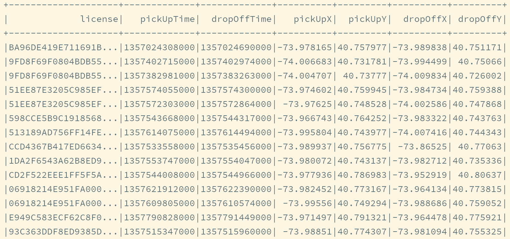

# 37-sparkSQL-2

# 1.Dataset和DataFrame的基础操作

## 1.1 有类型操作

### 1.1.1 转换

- flatMap

  通过flatMap可以将一条数据转为一个数组，然后在展开这个数据放入Dataset

  ```scala
  @Test
  def flatMap():Unit = {
      import spark.implicits._
      val ds = Seq("hello word","hadoop hello").toDS()
      ds.flatMap(_.split(" ")).show()
  }
  ```

- map

  map可以将数据集中**每条数据**转为另一种形式

  ```scala
  @Test
  def map():Unit = {
      import spark.implicits._
      val ds = Seq(Person("zhangshan",12)).toDS()
      ds.map(person => Person(person.name,person.age)).show()
  }
  case class Person(name:String,age:Int)
  ```

- mapPartitions

  mapPartitions和map一样，但是**map的处理单位是每条数据**，而**mapPartitions处理单位是每个分区**

  ```scala
  @Test
  def mapPartitions():Unit = {
      import spark.implicits._
      val ds = Seq(Person("zhangshan",12),Person("lisi",23)).toDS()
  
      ds.mapPartitions( iter =>{
          // iter 不能大到每个Executor的内存放不下，不然会OOM
          // 对每个元素进行转换，然后生成一个新的集合
          val returnValue = iter.map(
              item => Person(item.name,item.age)
      	)
      	returnValue
      }).show()
  }
  
  case class Person(name:String,age:Int)
  ```

- transform

  map和mapPartitions以及transform都是转换，**map和mapPartitions是针对数据**，**而transform是针对数据集**，这种方式最大的区别就是transform可以直接拿到Dataset进行操作

  

  ```scala
  @Test
  def transform():Unit = {
      import  spark.implicits._
  
      // 生成数据集 0 - 4 
      val ds = spark.range(5)
      // withColumn 后面再详细说明，其作用是创建新的列
      ds.transform(dataset => dataset.withColumn("doubled",'id*2)).show()
  
  }
  ```

- as

  **as[Type]算子的主要作用是将弱类型的Dataset转为强类型的Dataset**，它有很多适用场景，但是最常见的还是在读取数据的时候，因为DataFrameReader体系大部分情况下是将读取出来的数据转换为DataFrame的形式，如果后续需要使用Dataset的强类型API，则需要将DataFrame转为Dataset，可以使用as[Type]算子完成这种操作

  ```scala
  @Test
  def as():Unit = {
      import spark.implicits._
      val structType = StructType(
          Seq(
              StructField("name",StringType),
              StructField("age",IntegerType),
              StructField("gpa",FloatType)
          )
      )
      val sourceDF = spark.read
      .schema(structType)
      .option("delimiter","/t")
      .csv("C://Users//宋天//Desktop//大数据//file//studenttab10k")
  
      // 本质上：Dataset[Row].as[Student] => Dataset[Student]
      sourceDF.as[Student].show()
  
  }
  
  case class Student(name:String,age:Int,gpa:Float)
  ```

### 1.1.2 过滤

filter

filter用来按照条件过滤数据集

  ```scala
  @Test
  def filter():Unit = {
      import spark.implicits._
      val ds = Seq(Person("zhangsan",12),Person("lisi",23)).toDS()
      ds.filter(person =>person.name == "lisi").show
  
  }
  case class Person(name:String,age:Int)
  ```


### 1.1.3 聚合

groupByKey

  **groupByKey算子的返回结果是KeyValueGroupedDataset**，而不是一个Dataset，所以必须要先进过KeyValueGroupedDataset中的方法进行聚合，再转回Dataset，才能使用Action得出结果

  这也印证了分组后必须聚合的道理

```scala
@Test
def groupByKey():Unit = {
    import spark.implicits._
    val ds = Seq(Person("zhangsan",12),Person("lisi",23)).toDS()
    
    // 分组
    val grouped:KeyValueGroupedDataset[String,Person] = ds.groupByKey(person=>person.name)
    
    //注意：grouped返回值不是dataset类型，所以不能直接show，必须通过聚合方法
    val result:Dataset[(String,Long)] = grouped.count()
    result.show()
}
```

### 1.1.4 切分

- randomSplit

  randomSplit会**按照传入的权重随机将一个Dataset分为多少个Dataset**，传入randomSplit的数组有多少个权重，最终数据就会生成多少个Dataset，这些权重的加倍和应该为1，否则将被标准化

  ```scala
  @Test
  def randomSplit():Unit = {
      val ds = spark.range(19)
      val dataset = ds.randomSplit(Array[Double](2,3))
      dataset.foreach(dataset=>dataset.show())
  }
  ```

- sample

  sample会随机在Dataset中抽样

  ```scala
  @Test
  def sample():Unit = {
      val ds = spark.range(12)
      // 第一个参数表示是否在采样后放回
      ds.sample(false,fraction = 0.4).show()
  }
  ```

### 1.1.5 排序

- orderBy

  orderBy配合Column的API，可以实现正反排序

  ```scala
  @Test
  def orderBy:Unit = {
     import spark.implicits._
      val ds = Seq(Person("zhangsan",12),Person("lisi",23),Person("lisi",23)).toDS()
      ds.orderBy("age").show()
      // 降序
      ds.orderBy('age.desc).show()
       // 升序
      ds.orderBy('age.asc).show()
  }
  ```

- sort

  其实orderBy是sort的别名，所以他们所实现的功能是一样的

  ```scala
  @Test
  def sort:Unit = {
      import spark.implicits._
      val ds = Seq(Person("zhangsan",12),Person("lisi",23)).toDS()
      ds.sort('age.desc).show()
  }
  ```

### 1.1.6 分区

- coalesce

  减少分区，此算子和RDD中的coalesce不同，Dataset中的coalesce只能减少分区数，coaesce会直接创建一个逻辑操作，并且设置Shuffle为false

  ```scala
  @Test
  def coalesce():Unit = {
      val ds = spark.range(14)
      ds.coalesce(1).explain(true)
  }
  ```

- repartitions

  repartitions有两个作用，一个是重分区到特定的分区数，另一个是按照某一列来分区，类似于SQL中的DISTRIBUTE BY

  ```scala
  @Test
  def repartitions():Unit = {
      import spark.implicits._
      val ds = Seq(Person("zhangsan",12),Person("lisi",23),Person("lisi",25)).toDS()
      ds.repartition(4)
      ds.repartition('name)
  }
  ```

### 1.1.7 去重

- dropDuplicates

  使用dropDuplicates可以去掉某一列中重复的行

  ```scala
  @Test
  def dropDuplicates():Unit = {
      import spark.implicits._
      val ds = spark.createDataset(Seq(Person("zhangsan",12),Person("zhangsan",12),Person("lisi",23)))
      ds.dropDuplicates("age").show()
  }
  ```

- distinct

  当dropDuplicates中没有传入列名的时候，其含义是根据所有列去重，

  dropDuplicates方法还有一个别名，叫做distinct

  

  所以distinct也可以去重，并且只能根据所有列去重

  ```scala
  @Test
  def distinct():Unit = {
      import spark.implicits._
      val ds = spark.createDataset(Seq(Person("zhangsan",12),Person("zhangsan",12),Person("lisi",23)))
      ds.distinct().show()
  }
  ```

### 1.1.8 集合操作

- except

  except和SQL语句中的except是一个意思，是求得ds1中不存在ds2中的数据，其实就是差集

  ```scala
  @Test
  def except():Unit = {
      val ds1 = spark.range(1, 10)
      val ds2 = spark.range(5, 15)
  
      ds1.except(ds2).show()
  }
  ```

- intersect

  求得两个集合的交集

  ```scala
  @Test
  def except():Unit = {
      val ds1 = spark.range(1, 10)
      val ds2 = spark.range(5, 15)
  
      ds1.intersect(ds2).show()
  }
  ```

- union

  求得两个集合的并集

  ```scala
  @Test
  def except():Unit = {
      val ds1 = spark.range(1, 10)
      val ds2 = spark.range(5, 15)
  
      ds1.union(ds2).show()
  }
  ```

- limit

  限制结果集数量

  ```scala
  @Test
  def except():Unit = {
      val ds = spark.range(1, 10)
      ds.limit(3).show()
  }
  ```

  

## 1.2 无类型操作

### 1.2.1 选择

- select

  select用来选择某些列出现在结果集中

  ```scala
  @Test
  def select():Unit = {
      import spark.implicits._
      val ds = Seq(Person("zhangsan",12),Person("lisi",23),Person("lisi",25)).toDS()
      // 在dataset当中，select可以在任何位置调用
      ds.select($"name").show()
  }
  ```

- selectExpr

  在 `SQL` 语句中, 经常可以在 `select` 子句中使用 `count(age)`, `rand()` 等函数, 在 `selectExpr` 中就可以使用这样的 `SQL` 表达式, 同时使用 `select` 配合 `expr` 函数也可以做到类似的效果

  ```scala
   @Test
  def selectExpr():Unit = {
      
      import spark.implicits._
      
      val ds = Seq(Person("zhangsan", 12), Person("zhangsan", 8), Person("lisi", 15)).toDS()
      ds.selectExpr("count(age) as count").show()
      ds.selectExpr("rand() as random").show()
      
      import org.apache.spark.sql.functions._
      
      ds.select(expr("count(age) as count")).show()
  }
  ```

- withColumn

  通过 `Column` 对象在 `Dataset` 中创建一个新的列或者修改原来的列

  ```scala
  @Test
  def withColumn():Unit = {
      import spark.implicits._
      import org.apache.spark.sql.functions._
      val ds = Seq(Person("zhangsan", 12), Person("zhangsan", 8), Person("lisi", 15)).toDS()
      //如果想使用函数功能
      //1. 使用funtions.xx
      //2. 使用表达式，可以使用  expr("rand()") 随时随地编写表达式
      ds.withColumn("random", expr("rand()")).show()
  }
  ```

- withColumnRenamed

  修改别名

  ```scala
  @Test
  def withColumnRenamed():Unit = {
      import spark.implicits._
      val ds = Seq(Person("zhangsan", 12), Person("zhangsan", 8), Person("lisi", 15)).toDS()
      ds.withColumnRenamed("name", "new_name").show()
  }
  ```

### 1.2.2 减除

drop

减掉某个列

```scala
@Test
def drop():Unit = {
    import spark.implicits._
    val ds = Seq(Person("zhangsan", 12), Person("zhangsan", 8), Person("lisi", 15)).toDS()
    ds.drop('age).show()
}
```

### 1.2.3 聚合

groupBy

按照给定的行进行分组

```scala
@Test
def groupBy():Unit = {
    import spark.implicits._
    val ds = Seq(Person("zhangsan", 12), Person("zhangsan", 8), Person("lisi", 15)).toDS()
    
    // GroupByKey是有类型的，主要原因是，GroupByKey所生成对象中的算子是有类型的
    
    // groupBy 是无类型的，主要原因是groupBy所生成的对象中的对象中的算子是无类型的，是针对列进行处理的
    ds.groupBy('name).count().show()
}
```

## 1.3 Column对象

column表示了Dataset中的一个列，并且可以持有一个表达式，这个表达式作用于每一条数据，对每条数据都生成一个值，之所以有单独这样的一节是因为列这个操作属于细节，但又比较常见会在很多算子中配合出现

### 1.3.1 创建

- `'`

  单引号的在scala中是一个特殊的符号，通过单引号会生成一个symbol对象，symbol对象可以理解为是一个字符串的变种，但是比字符串的效率高很多，在spark中，对scala中的symbol对象做了隐式转换，转换为一个columnName对象，columnName是column的子类，所以在spark中可以如下去**选中一个列**

  ```scala
  val spark = SparkSession.builder().appName("column").master("local[6]").getOrCreate()
  import spark.implicits._
  val personDF = Seq(Person("zhangsan", 12), Person("zhangsan", 8), Person("lisi", 15)).toDS()
  
  // 必须导入隐式转换才能使用
  val c1: Symbol = 'name
  personDF.select(c1).show()
  personDF.select('name).show()
  ```

- `$`

  同理`$`符也是一个隐式转换，同样通过`spark.implicits`导入，通过`$`可以生成一个`column`对象

  ```scala
  val spark = SparkSession.builder().appName("column").master("local[6]").getOrCreate()
  import spark.implicits._
  val personDF = Seq(Person("zhangsan", 12), Person("zhangsan", 8), Person("lisi", 15)).toDS()
  
  // 必须导入隐式转换才能使用
  val c2: ColumnName = $"name"
  personDF.select(c2).show()
  personDF.select('name).show()
  ```

- `col`

  sparkSQ提供了一系列的函数，可以通过函数实现很多功能，在后面的部分会进行详细说明，这些函数中有两个可以函数我们创建column

  ```scala
  val spark = SparkSession.builder().appName("column").master("local[6]").getOrCreate()
  import org.apache.spark.sql.functions._
  val personDF = Seq(Person("zhangsan", 12), Person("zhangsan", 8), Person("lisi", 15)).toDS()
  
  // 必须导入functions
  val c3: sql.Column = col("name")
  personDF.select(c3).show()
  personDF.select(col("name")).show()
  ```

- `column`

  ```scala
  val spark = SparkSession.builder().appName("column").master("local[6]").getOrCreate()
  import org.apache.spark.sql.functions._
  val personDF = Seq(Person("zhangsan", 12), Person("zhangsan", 8), Person("lisi", 15)).toDS()
  // 必须导入functions
  val c4: sql.Column = column("name")
  personDF.select(c4).show()
  personDF.select(column("name")).show()
  ```

  以上四种创建方式，没有关联dataset

  ```scala
  // dataset 可以使用
  ds.select(column).show
  // dataFrame 同样可以使用
  df.select(column).show
  // select 方法可以使用column对象来选中某个列，那么其他算子同样可以
  df.where(column == "zhangsan").show
  ```

  

- `Dataset.col`

  前面的column对象创建方式所创建的column对象都是Free的，也就是没有绑定任何Dataset，所以可以作用于任何Dataset，同时，也可以通过Dataset的col方法选择一个列，但是这个column是绑定了这个Dataset的，所以只能用于创建Dataset上

  ```scala
  val spark = SparkSession.builder().appName("column").master("local[6]").getOrCreate()
  val personDF = Seq(Person("zhangsan", 12), Person("zhangsan", 8), Person("lisi", 15)).toDS()
  
  val c5: sql.Column = personDF.col("name")
  // 使用dataset来获取column对象，会和某个Dataset进行绑定，在逻辑计划中，就会有不同的表现
  personDF.select(c5).show()  // 报错
  
  // 正确的使用方法
  personDF.select( personDF.col("name")).show()
  ```

- `Dataset.apply`

  可以通过Dataset对象的apply方法来获取一个关联此dataset的column对象

  ```scala
  val spark = SparkSession.builder().appName("column").master("local[6]").getOrCreate()
  val personDF = Seq(Person("zhangsan", 12), Person("zhangsan", 8), Person("lisi", 15)).toDS()
  
  val c6: sql.Column = personDF.apply("name")
  // 因为调用了apply方法，所以等同于
  val c7 = personDF("name")
  
  // 同上 
  personDF.select(c6).show()
  personDF.select( personDF.apply("name")).show()
  ```

### 1.3.2 别名和转换

- `as[Type]`

  as方法有两个用法，通过`as[Type]`的形式可以将一个列中数据的类型转换为type类型

  ```scala
  personDF.select(col("age").as[Long]).show()
  // 这样也可以
  personDF.select('age.as[Long]).show()
  ```

- `as(name)`

  通过`as(name)`的形式使用as方法可以为列创建别名

  ```scala
  personDF.select(col("age").as("age_new")).show()
  // 简化
  personDF.select('age as "age_new" ).show()
  ```

### 1.3.3 添加列

withColumn

通过column在添加一个新的列的时候修改column列所代表的的列的数据

```scala
 personDF.withColumn("double_age", 'age * 2).show()
```

### 1.3.4 操作

- `like`

  通过column的API，可以轻松实现SQL语句中`LIKE`的功能

  ```scala
  personDF.filter('name like "%zhang%").show()
  ```

- `isin`

  通过column的API，可以轻松实现SQL语句中`isin`的功能，枚举判断

  ```scala
  personDF.filter('name isin ("hello", "zhangsan")).show()
  ```

- `sort`

  在排序的时候, 可以通过 `Column` 的 `API` 实现正反序

  ```scala
  personDF.sort('age.asc).show()
  personDF.sort('age.desc).show()
  ```

  

# 2.缺省值处理

缺省值的处理思路：

如果想探究如何处理无效值, 首先要知道无效值从哪来, 从而分析可能产生的无效值有哪些类型, 在分别去看如何处理无效值

- 什么是缺省值

  一个值本身的含义是这个值不存在则称之为缺省值，也就是说这个值本身代表着缺失，或者这个值本身无意义，比如说`null`，或者空字符串

  NaN => Not a Number

  null => 对象为空

  

  关于数据的分析其实就是统计分析的概念, 如果这样的话, 当数据集中存在缺失值, 则无法进行统计和分析, 对很多操作都有影响

- 缺省值是如何产生的

  

  Spark 大多时候处理的数据来自于业务系统中, 业务系统中可能会因为各种原因, 产生一些异常的数据

  例如说因为前后端的判断失误, 提交了一些非法参数. 再例如说因为业务系统修改 `MySQL` 表结构产生的一些空值数据等. 总之在业务系统中出现缺失值其实是非常常见的一件事, 所以大数据系统就一定要考虑这件事.

- 缺省值的类型

  常见的缺省值有两种类型

  - `null`,`NaN`等特殊类型的值，某些语言中，null可以理解为一个对象，但是代表没有对象，NaN是一个数字，可以代表不是数字

    针对这一类的缺失值, `Spark` 提供了一个名为 `DataFrameNaFunctions` 特殊类型来操作和处理

  - `Null`,`NA`," "，等解析为字符串的类型，但是其实并不是常规字符串数据

    针对这类字符串，需要对数据集进行采样，观察数据异常总结经验，各个击破

  - `DataFrameNaFunctions`

    `DataFrameNaFunctions` 使用 `Dataset` 的 `na` 函数来获取

    ```scala
    val df = ...
    val naFunc: DataFrameNaFunctions = df.na
    ```

    当数据集中出现缺失值的时候, 大致有两种处理方式, 一个是丢弃, 一个是替换为某值, `DataFrameNaFunctions` 中包含一系列针对空值数据的方案

    - `DataFrameNaFunctions.drop` 可以在当某行中包含 `null` 或 `NaN` 的时候丢弃此行
    - `DataFrameNaFunctions.fill` 可以在将 `null` 和 `NaN` 充为其它值
    - `DataFrameNaFunctions.replace` 可以把 `null` 或 `NaN` 替换为其它值, 但是和 `fill` 略有一些不同, 这个方法针对值来进行替换

- 如何使用SparkSQL处理null和NaN

  1. 首先要将数据读取出来，此次使用的数据集直接存在NaN，在指定Schema后，可以直接被转为Double.NaN

     ```scala
     val schema = StructType(
       List(
         StructField("id", IntegerType),
         StructField("year", IntegerType),
         StructField("month", IntegerType),
         StructField("day", IntegerType),
         StructField("hour", IntegerType),
         StructField("season", IntegerType),
         StructField("pm", DoubleType)
       )
     )
     // 读取数据集
     // 方式1：通过spark csv自动推断类型读取，推断数字的时候会将NaN推断为字符串
     // 方式2：直接读取字符串，在后续操作中使用map算子转换类型
     // 方式3：指定schema，不要自动推断
     
     val df = spark.read
       .option("header", value = true)
       .schema(schema)
       .csv("dataset/beijingpm_with_nan.csv")
     ```

  2. 对于缺省值的处理一般就是丢弃和填充

     丢弃包含null和NaN的行

     关于drop的值说明

     ```scala
     //只有一个NaN就丢弃
     df.na.drop("any").show()
     // 等价于
     df.na.drop("all").show()
     
     // 所有的数据都是NaN的行才丢弃
     df.na.drop("all").show()
     
     // 某些列的规则
     df.na.drop("all", List("pm", "id")).show()
     ```

     

     - **当某行数据所有的值**都是null或者NaN的时候丢弃此行

       ```scala
       df.na.drop("all").show()
       ```

     - **当某行中特定列所有值**都是 `null` 或者 `NaN` 的时候丢弃此行

       ```scala
       df.na.drop("all", List("pm", "id")).show()
       ```

     - **当某行数据任意一个字段**为 `null` 或者 `NaN` 的时候丢弃此行

       ```scala
       df.na.drop().show()
       df.na.drop("any").show()
       ```

     - **当某行中特定列任意一个字段**为 `null` 或者 `NaN` 的时候丢弃此行

       ```scala
       df.na.drop(List("pm", "id")).show()
       df.na.drop("any", List("pm", "id")).show()
       ```

  3. 填充包含null和NaN的列

     - 填充所有包含 `null` 和 `NaN` 的列

       ```scala
       df.na.fill(0).show()
       ```

     - 填充特定包含 `null` 和 `NaN` 的列

       ```scala
       df.na.fill(0, List("pm")).show()
       ```

     - 根据包含 `null` 和 `NaN` 的列的不同来填充

       ```scala
       import scala.collection.JavaConverters._
       
       df.na.fill(Map[String, Any]("pm" -> 0).asJava).show
       ```

- 如何使用SparkSQL处理异常字符串

  1. 读取数据集，这次读取的是最原始的PM数据集

     ```scala
     val df = spark.read
       .option("header", value = true)
       .option("inferSchema", value = true)
       .csv("dataset/BeijingPM20100101_20151231.csv")
     ```
   ```
  
   ```
2. 使用函数直接转换非法的字符串
  
     ```scala
     import org.apache.spark.sql.functions._
     
     df.select('No as "id", 'year, 'month, 'day, 'hour, 'season,
       when('PM_Dongsi === "NA", Double.NaN) // 第二个参数表示满足条件时的值
         .otherwise('PM_Dongsi cast DoubleType) // 当值不是NA的时候，将正常值转为Double类型
       .as("pm"))
       .show()
     ```
  
  3. 使用 `where` 直接过滤

   ```scala
     df.select('No as "id", 'year, 'month, 'day, 'hour, 'season, 'PM_Dongsi)
     .where('PM_Dongsi =!= "NA")
       .show()
   ```

  4. 使用 `DataFrameNaFunctions` 替换, 但是这种方式被替换的值和新值必须是同类型

   ```scala
     // 原类型和转换后的类型必须保持一致
     df.select('No as "id", 'year, 'month, 'day, 'hour, 'season, 'PM_Dongsi)
       .na.replace("PM_Dongsi", Map("NA" -> "NaN","NULL"->"null"))
       .show()
   ```

​     

# 3. 聚合

## 3.1 groupBy

groupBy算子会按照列将Dataset分组，并返回一个`RelationalGroupedDataset`对象，通过`RelationalGroupedDataset`可以对分组进行聚合

1. 加载实验数据

   ```scala
   private val spark = SparkSession.builder()
       .master("local[6]")
       .appName("aggregation")
       .getOrCreate()
   
     import spark.implicits._
   
     private val schema = StructType(
       List(
         StructField("id", IntegerType),
         StructField("year", IntegerType),
         StructField("month", IntegerType),
         StructField("day", IntegerType),
         StructField("hour", IntegerType),
         StructField("season", IntegerType),
         StructField("pm", DoubleType)
       )
     )
   
     private val pmDF = spark.read
       .schema(schema)
       .option("header", value = true)
       .csv("dataset/pm_without_null.csv")
   ```

2. 数据过滤

   ```scala
   // 数据去掉空值
   val cleanDF = sourceDF.where('pm =!= Double.NaN)
   ```

3. 使用functions函数进行聚合

   需求：统计每个月PM值的平均值

   ```scala
   // 使用 functions 函数来完成聚合
   import org.apache.spark.sql.functions._
   // 分组
   val groupedDF: RelationalGroupedDataset = pmDF.groupBy('year,$"month")
   // 本质上, avg 这个函数定义了一个操作, 把表达式设置给 pm 列
   // select avg(pm) from ... group by
   groupedDF.agg(avg('pm) as "pm_avg") // avg->求平均数
     .orderBy('pm_avg.desc)
     .show()
   ```

4. 除了使用 `functions` 进行聚合, 还可以直接使用 `RelationalGroupedDataset `的 API 进行聚合

   ```scala
   // 使用GroupedDataset的API来完成聚合
   groupedDF.avg("pm")
     .orderBy('pm_avg)
     .show()
   
   // 求方差
   groupedDF.agg(stddev(""))
     .orderBy('pm_avg.desc)
     .show()
   
   groupedDF.max("pm")
     .orderBy('pm_avg)
     .show()
     
   groupedDF.sum()
     .select($"avg(pm)" as "pm_avg")
     .orderBy("pm_avg")
     .show()  
   ```

## 3.2 多维聚合

我们可能经常需要针对数据进行多维的聚合, 也就是一次性统计小计, 总计等, 一般的思路如下

1. 准备数据

   ```scala
   val spark = SparkSession.builder()
     .master("local[6]")
     .appName("aggregation")
     .getOrCreate()
   
   import spark.implicits._
   
   val schemaFinal = StructType(
     List(
       StructField("source", StringType),
       StructField("year", IntegerType),
       StructField("month", IntegerType),
       StructField("day", IntegerType),
       StructField("hour", IntegerType),
       StructField("season", IntegerType),
       StructField("pm", DoubleType)
     )
   )
   val pmFinal = spark.read
     .schema(schemaFinal)
     .option("header", value = true)
     .csv("dataset/pm_final.csv")
   ```
   
2. 进行多维聚合

   ```scala
   import org.apache.spark.sql.functions._
   
   // 需求1：不同年，不同来源，PM值的平均数
   val groupPostAndYear = pmFinal.groupBy('source, 'year)
     .agg(avg("pm") as "pm")
   
   // 需求2：不在整个数据集中，按照不同来源来统计
   val groupPost = pmFinal.groupBy('source)
     .agg(avg("pm") as "pm")
     // lit(null) as "year" 作用是null显示为一列
     .select('source, lit(null) as "year", 'pm)
   
   // 合并在同一个结果集中
groupPostAndYear.union(groupPost)
   	// 排序 先按照source进行排序，接着按照year进行排序，当source和year相同时，按照pm进行排序
     .sort('source, 'year.asc_nulls_last, 'pm)
     .show()
   ```
   
   大家其实也能看出来, 在一个数据集中又小计又总计, 可能需要多个操作符, 如何简化呢? 请看继续往下看

### 3.2.1 rollup操作符

`rollup` 操作符其实就是 `groupBy` 的一个扩展, `rollup` 会对传入的列进行滚动 `groupBy`, `groupBy` 的次数为列数量 `+ 1`, 最后一次是对整个数据集进行聚合

1. 创建数据集

   ```scala
   import org.apache.spark.sql.functions._
   
   val sales = Seq(
     ("Beijing", 2016, 100),
     ("Beijing", 2017, 200),
     ("Shanghai", 2015, 50),
     ("Shanghai", 2016, 150),
     ("Guangzhou", 2017, 50)
   ).toDF("city", "year", "amount")
   ```

2. rollup操作

   ```scala
   // 滚动分组
   // 假设传入A,B两个列，那么分组结果就会是AB,A,NULL（全局结果）
   
   sales.rollup("city", "year")
     .agg(sum("amount") as "amount")
     .sort($"city".desc_nulls_last, $"year".asc_nulls_last)
     .show()
   
   /**
     * 结果集:
     * +---------+----+------+
     * |     city|year|amount|
     * +---------+----+------+
     * | Shanghai|2015|    50| <-- 上海某一年的销售额
     * | Shanghai|2016|   150|
     * | Shanghai|null|   200| <-- 上海一共的销售额，小计
     * |Guangzhou|2017|    50|
     * |Guangzhou|null|    50|
     * |  Beijing|2016|   100|
     * |  Beijing|2017|   200|
     * |  Beijing|null|   300|
     * |     null|null|   550| <-- 整个数据集的总计  
     * +---------+----+------+
     */
   ```

   注：`rollup(A,B)`和`rollup(B,A)`的区别?

   ```
   rollup A,B 的分组步骤：
   gruopBy A B
   gruopBy A
   gruopBy null
   
   rollup B,A  的分组步骤：
   gruopBy B,A
   gruopBy B 
   gruopBy null
   ```

   

3. 如果使用基础的 groupBy 如何实现效果?

   ```scala
   val cityAndYear = sales
     .groupBy("city", "year") // 按照 city 和 year 聚合
     .agg(sum("amount") as "amount")
   
   val city = sales
     .groupBy("city") // 按照 city 进行聚合
     .agg(sum("amount") as "amount")
     .select($"city", lit(null) as "year", $"amount")
   
   val all = sales
     .groupBy() // 全局聚合
     .agg(sum("amount") as "amount")
     .select(lit(null) as "city", lit(null) as "year", $"amount")
   
   cityAndYear
     .union(city)
     .union(all)
     .sort($"city".desc_nulls_last, $"year".asc_nulls_last)
     .show()
   
   /**
     * 统计结果:
     * +---------+----+------+
     * |     city|year|amount|
     * +---------+----+------+
     * | Shanghai|2015|    50|
     * | Shanghai|2016|   150|
     * | Shanghai|null|   200|
     * |Guangzhou|2017|    50|
     * |Guangzhou|null|    50|
     * |  Beijing|2016|   100|
     * |  Beijing|2017|   200|
     * |  Beijing|null|   300|
     * |     null|null|   550|
     * +---------+----+------+
     */
   ```

   很明显可以看到, 在上述案例中, `rollup` 就相当于先按照 `city`, `year` 进行聚合, 后按照 `city` 进行聚合, 最后对整个数据集进行聚合, 在按照 `city` 聚合时, `year` 列值为 `null`, 聚合整个数据集的时候, 除了聚合列, 其它列值都为 `null`

4. 使用 rollup 完成 pm 值的统计

   ```scala
   import org.apache.spark.sql.functions._
   
   pmFinal.rollup('source, 'year)
     .agg(sum("pm") as "pm_total")
     .sort('source.asc_nulls_last, 'year.asc_nulls_last)
     .show()
   ```


### 3.2.2 cube

`cube` 的功能和 `rollup` 是一样的, 但也有区别, 区别如下

- `rollup(A, B).sum`

  其结果集中会有三种数据形式: `A B C`, `A null C`, `null null C`

  不知道大家发现没, 结果集中没有对 `B` 列的聚合结果

- `cube(A, B).sum`

  其结果集中会有四种数据形式: `A B C`, `A null C`, `null null C`, `null B C`

  不知道大家发现没, 比 `rollup` 的结果集中多了一个 `null B C`, 也就是说, `rollup` 只会按照第一个列来进行组合聚合, 但是 `cube` 会将全部列组合聚合

```scala
import org.apache.spark.sql.functions._

pmFinal.cube('source, 'year)
  .agg(sum("pm") as "pm_total")
  .sort('source.asc_nulls_last, 'year.asc_nulls_last)
  .show()

/**
  * 结果集为
  *
  * +-------+----+---------+
  * | source|year| pm_total|
  * +-------+----+---------+
  * | dongsi|2013| 735606.0|
  * | dongsi|2014| 745808.0|
  * | dongsi|2015| 752083.0|
  * | dongsi|null|2233497.0|
  * |us_post|2010| 841834.0|
  * |us_post|2011| 796016.0|
  * |us_post|2012| 750838.0|
  * |us_post|2013| 882649.0|
  * |us_post|2014| 846475.0|
  * |us_post|2015| 714515.0|
  * |us_post|null|4832327.0|
  * |   null|2010| 841834.0| <-- 新增
  * |   null|2011| 796016.0| <-- 新增
  * |   null|2012| 750838.0| <-- 新增
  * |   null|2013|1618255.0| <-- 新增
  * |   null|2014|1592283.0| <-- 新增
  * |   null|2015|1466598.0| <-- 新增
  * |   null|null|7065824.0|
  * +-------+----+---------+
  */
```

`SparkSQL` **中支持的** `SQL` **语句实现** `cube` **功能**

`SparkSQL` 支持 `GROUPING SETS` 语句, 可以随意排列组合空值分组聚合的顺序和组成, 既可以实现 `cube` 也可以实现 `rollup` 的功能

```scala
pmFinal.createOrReplaceTempView("pm_final")
spark.sql(
  """
    |select source, year, sum(pm)
    |from pm_final
    |group by source, year
    |grouping sets((source, year), (source), (year), ())
    |order by source asc nulls last, year asc nulls last
  """.stripMargin)
  .show()
```

**RelationalGroupedDataset**

常见的 `RelationalGroupedDataset` 获取方式有三种

- `groupBy`
- `rollup`
- `cube`

无论通过任何一种方式获取了 `RelationalGroupedDataset` 对象, 其所表示的都是是一个被分组的 `DataFrame`, 通过这个对象, 可以对数据集的分组结果进行聚合

```scala
val groupedDF: RelationalGroupedDataset = pmDF.groupBy('year)
```

需要注意的是, `RelationalGroupedDataset` 并不是 `DataFrame`, 所以其中并没有 `DataFrame` 的方法, 只有如下一些聚合相关的方法, 如下这些方法在调用过后会生成 `DataFrame` 对象, 然后就可以再次使用 `DataFrame` 的算子进行操作了

| 操作符  | 解释                                                         |
| :------ | :----------------------------------------------------------- |
| `avg`   | 求平均数                                                     |
| `count` | 求总数                                                       |
| `max`   | 求极大值                                                     |
| `min`   | 求极小值                                                     |
| `mean`  | 求均数                                                       |
| `sum`   | 求和                                                         |
| `agg`   | 聚合, 可以使用 `sql.functions` 中的函数来配合进行操作`pmDF.groupBy('year)    .agg(avg('pm) as "pm_avg")` |

# 4. 连接

## 4.1 无类型连接

**无类型连接算子** `join` **的** `API`

- 什么是连接

  按照 PostgreSQL 的文档中所说, 只要能在一个查询中, 同一时间并发的访问多条数据, 就叫做连接.

  做到这件事情的有两种

  1. 一种是把两张表在逻辑上连接起来，一条语句中同时访问两张表

     ```sql
     select * from user join address on user.address_id = adress.id
     ```

  2. 还有一种方式是表连接自己，一条语句也能访问自己中的多条数据

     ```sql
     select * from user u1 join (select * from user) u2 on u1.id = u2.id
     ```

- join算子的使用方式

  ```scala
  join(right: Dataset[_], joinExprs: Column, joinType: String): DataFrame
  ```

- 简单的连接案例

  - 表结构

    ```
    +---+------+------+            +---+---------+
    | id|  name|cityId|            | id|     name|
    +---+------+------+            +---+---------+
    |  0|  Lucy|     0|            |  0|  Beijing|
    |  1|  Lily|     0|            |  1| Shanghai|
    |  2|   Tim|     2|            |  2|Guangzhou|
    |  3|Danial|     0|            +---+---------+
    +---+------+------+
    ```

  - 如果希望对这两张表进行连接, 首先应该注意的是可以连接的字段, 比如说此处的左侧表 `cityId` 和右侧表 `id` 就是可以连接的字段, 使用 `join` 算子就可以将两个表连接起来, 进行统一的查询

    ```scala
    val person = Seq((0, "Lucy", 0), (1, "Lily", 0), (2, "Tim", 2), (3, "Danial", 0))
      .toDF("id", "name", "cityId")
    
    val cities = Seq((0, "Beijing"), (1, "Shanghai"), (2, "Guangzhou"))
      .toDF("id", "name")
    
    //参数：join的对象，条件
    person.join(cities, person.col("cityId") === cities.col("id"))
      .select(person.col("id"),
        person.col("name"),
        cities.col("name") as "city")
    //  .show()
    
    // 使用如下方式同样可以查询结果
    df.createOrReplaceTempView("user_city")
    spark.sql("select id, name, city from user_city where city = 'Beijing'")
          .show()
    
    /**
      * 执行结果:
      *
      * +---+------+---------+
      * | id|  name|     city|
      * +---+------+---------+
      * |  0|  Lucy|  Beijing|
      * |  1|  Lily|  Beijing|
      * |  2|   Tim|Guangzhou|
      * |  3|Danial|  Beijing|
      * +---+------+---------+
      */
    ```

- 什么是连接

  根据上述案例得到的连接表如下

  ```scala
  +---+------+---------+
  | id|  name|     city|
  +---+------+---------+
  |  0|  Lucy|  Beijing|
  |  1|  Lily|  Beijing|
  |  2|   Tim|Guangzhou|
  |  3|Danial|  Beijing|
  +---+------+---------+
  ```

  通过对这张表的查询，这个查询是作用于两张表的，所以是同一时间访问了多条数据

  ```scala
  spark.sql("select name from user_city where city = 'Beijing'").show()
  
  /**
    * 执行结果
    *
    * +------+
    * |  name|
    * +------+
    * |  Lucy|
    * |  Lily|
    * |Danial|
    * +------+
    */
  ```

  

## 4.2 连接类型

数据准备

```scala
private val spark = SparkSession.builder()
  .master("local[6]")
  .appName("aggregation")
  .getOrCreate()

import spark.implicits._

val person = Seq((0, "Lucy", 0), (1, "Lily", 0), (2, "Tim", 2), (3, "Danial", 3))
  .toDF("id", "name", "cityId")
person.createOrReplaceTempView("person")

val cities = Seq((0, "Beijing"), (1, "Shanghai"), (2, "Guangzhou"))
  .toDF("id", "name")
cities.createOrReplaceTempView("cities")
```

### 4.2.1 交叉连接

类型字段：cross

说明：**交叉连接就是笛卡尔积，就是两个表中所有的数据两两结对**

交叉连接是一个非常重的操作，在生产中，尽量不要将两个大数据集交叉连接，如果一定要交叉连接，也需要在交叉连接后进行过滤，优化器会进行优化


SQL语句：

```sql
select * from person cross join cities
```

Dataset操作：

```scala
@Test
def crossJoin(): Unit = {
    person.crossJoin(cities)
      .where(person.col("cityId") === cities.col("id"))
      .show()

    // sql 操作
    spark.sql("select u.id, u.name, c.name from person u cross join cities c " +
      "where u.cityId = c.id")
      .show()
}
```

### 4.2.2 内连接

类型字段：inner

说明：**内连接就是按照条件找到两个数据集关联的数据，并且在生成的结果集中只存在能关联到的数据**


SQL语句：

```sql
select * from person inner join cities on person.cityId = cities.id
```

Dataset操作：

```scala
@Test
def inner(): Unit = {
  person.join(cities,
    person.col("cityId") === cities.col("id"),
    joinType = "inner")
    .show()
    
  // sql 操作
  spark.sql("select p.id, p.name, c.name " +
    "from person p inner join cities c on p.cityId = c.id") // 必须有条件
    .show()
}
```

### 4.2.3 全外连接

类型字段：outer，full，fullouter

说明：内连接和外连接的最大区别，**就是内连接的结果集中只有可以连接上的数据，而外连接可以包含没有连接上的数据**，根据情况的不同，外连接又可以分为很多种，比如所有的没连接上的数据都放入结果集，就叫做全外连接


SQL语句：

```sql
select * from person full outer join cities on person.cityId = cities.id
```

Dataset操作

```scala
@Test
  def fullOuter(): Unit = {
    // 内连接, 就是只显示能连接上的数据, 外连接包含一部分没有连接上的数据, 全外连接, 指左右两边没有连接上的数据, 都显示出来
    person.join(cities,
      person.col("cityId") === cities.col("id"),
      joinType = "full")
      .show()

    // sql 操作
    spark.sql("select p.id, p.name, c.name " +
      "from person p full outer join cities c " +
      "on p.cityId = c.id")
      .show()
  }
```


### 4.2.4 左外连接

类型字段：leftouter，left

说明：左外连接就是全外连接的一个子集，全外连接中包含左右两边数据集中没有连接上的数据，而左外连接只包含左边数据集中没有连接上的数据


SQL语句

```sql
select * from person left join cities on person.cityId = cities.id
```

Dataset操作

```scala
@Test
  def leftRight(): Unit = {
    // 左连接
    person.join(cities,
      person.col("cityId") === cities.col("id"),
      joinType = "left")
      .show()

    // sql 操作
    spark.sql("select p.id, p.name, c.name " +
      "from person p left join cities c " +
      "on p.cityId = c.id")
      .show()
  }

```

### 4.2.5 LeftAnit

类型字段：leftanti

说明：LeftAnit是一种特殊的连接形式，和左外连接类似，但是其结果集中没有右侧的数据，**只包含左边集合中没有连接上的数据**


SQL语句：

```sql
select * from person left anti join cities on person.cityId = cities.id
```

Dataset操作：

```scala
  @Test
  def leftAntiSemi(): Unit = {
    // 左连接 anti
    person.join(cities,
      person.col("cityId") === cities.col("id"),
      joinType = "leftanti")
      .show()
      
	// sql 操作
    spark.sql("select p.id, p.name " +
      "from person p left anti join cities c " +
      "on p.cityId = c.id")
      .show()
  }
```

### 4.2.6 LeftSemi

类型字段：leftsemi

说明：和leftanti恰好相反，leftsemi的结果集也没有右侧集合的数据，但是只**包含左侧集合中连接上的数据**


SQL语句：

```sql
select * from person left semi join cities on person.cityId = cities.id
```

Dataset操作：

```scala
  @Test
  def leftAntiSemi(): Unit = {
   // 右连接
    person.join(cities,
      person.col("cityId") === cities.col("id"),
      joinType = "leftsemi")
      .show()
	// sql 操作
    spark.sql("select p.id, p.name " +
      "from person p left semi join cities c " +
      "on p.cityId = c.id")
      .show()
  }
```

### 4.2.7 右外连接

类型字段：rightouter，right

说明：右外连接和左外连接刚好相反，左外是包含左侧未连接的数据，和两个数据集中连接上的数据，而右外是包含右侧未连接的数据，和两个数据集中连接上的数据


SQL语句：

```sql
select * from person right join cities on person.cityId = cities.id
```

Dataset操作：

```scala
@Test
def leftRight(): Unit = {
  // 右连接
    person.join(cities,
      person.col("cityId") === cities.col("id"),
      joinType = "right")
      .show()

    spark.sql("select p.id, p.name, c.name " +
      "from person p right join cities c " +
      "on p.cityId = c.id")
      .show()
}
```

## 4.4 UDF

sparkSQL中有很多预定义函数，如果这些函数觉得不满意你可以通过UDF进行扩展

```scala
object UDF {
  def main(args: Array[String]): Unit = {

      val spark = SparkSession.builder()
        .appName("window")
        .master("local[6]")
        .getOrCreate()

      import spark.implicits._

      val data = Seq(
        ("Thin", "Cell phone", 6000),
        ("Normal", "Tablet", 1500),
        ("Mini", "Tablet", 5500),
        ("Ultra thin", "Cell phone", 5000),
        ("Very thin", "Cell phone", 6000),
        ("Big", "Tablet", 2500),
        ("Bendable", "Cell phone", 3000),
        ("Foldable", "Cell phone", 3000),
        ("Pro", "Tablet", 4500),
        ("Pro2", "Tablet", 6500)
      ).toDF("product", "category", "revenue")

    // 需求1：聚合每个类别的总价
    // 1. 分组 2. 对每一组的数据进行聚合

    import org.apache.spark.sql.functions._
//    data.groupBy('category)
//      .agg(sum('revenue))
//      .show()
//

    // 需求2：把名称变小写
//    data.select(lower('product))
//      .show()

    // 需求3：把价格变为字符串形式
    //6000 6k
    val toStrUDF: UserDefinedFunction = udf(toStr _)
    data.select('product,'category,toStrUDF('revenue))
  }

  def toStr(revenue:Long):String = {
    (revenue / 1000) + "k"
  }
}

```


## 4.3 广播连接-扩展

- 正常情况下的join过程

  

  join会在集群中分发两个数据集，两个数据集都要复制到Reducer端，是一个非常复杂和标准的ShuffleDependency，那么，有什么优化效率么？

- Map端Join

  前面图中看的过程, 之所以说它效率很低, 原因是需要在集群中进行数据拷贝, 如果能减少数据拷贝, 就能减少开销

  那么，如果能够只分发一个较小的数据集呢?

  

  可以将小数据集收集起来, 分发给每一个 `Executor`, 然后在需要 `Join` 的时候, 让较大的数据集在 `Map` 端直接获取小数据集, 从而进行 `Join`, 这种方式是不需要进行 `Shuffle` 的, 所以称之为 `Map` 端 `Join`

- Map端join的常规操作

  如果使用 `RDD` 的话, 该如何实现 `Map` 端 `Join` 呢?

  ```scala
  val personRDD = spark.sparkContext.parallelize(Seq((0, "Lucy", 0),
    (1, "Lily", 0), (2, "Tim", 2), (3, "Danial", 3)))
  
  val citiesRDD = spark.sparkContext.parallelize(Seq((0, "Beijing"),
    (1, "Shanghai"), (2, "Guangzhou")))
  
  val citiesBroadcast = spark.sparkContext.broadcast(citiesRDD.collectAsMap())
  
  val result = personRDD.mapPartitions(
    iter => {
      val citiesMap = citiesBroadcast.value
      // 使用列表生成式 yield 生成列表
      val result = for (person <- iter if citiesMap.contains(person._3))
        yield (person._1, person._2, citiesMap(person._3))
      result
    }
  ).collect()
  
  result.foreach(println(_))
  ```

- 使用 Dataset 实现 Join 的时候会自动进行 Map 端 Join

  自动进行 `Map` 端 `Join` 需要依赖一个系统参数 `spark.sql.autoBroadcastJoinThreshold`, 当数据集小于这个参数的大小时, 会自动进行 `Map` 端 `Join`

  如下, 开启自动 `Join`

  ```scala
  println(spark.conf.get("spark.sql.autoBroadcastJoinThreshold").toInt / 1024 / 1024)
  
  println(person.crossJoin(cities).queryExecution.sparkPlan.numberedTreeString)
  ```

  当关闭这个参数的时候, 则不会自动 Map 端 Join 了

  ```scala
  spark.conf.set("spark.sql.autoBroadcastJoinThreshold", -1)
  println(person.crossJoin(cities).queryExecution.sparkPlan.numberedTreeString)
  ```

- 也可以使用函数强制开启 Map 端 Join

  在使用 Dataset 的 join 时, 可以使用 broadcast 函数来实现 Map 端 Join

  ```scala
  import org.apache.spark.sql.functions._
  spark.conf.set("spark.sql.autoBroadcastJoinThreshold", -1)
  println(person.crossJoin(broadcast(cities)).queryExecution.sparkPlan.numberedTreeString)
  ```

  即使是使用 SQL 也可以使用特殊的语法开启

  ```scala
  spark.conf.set("spark.sql.autoBroadcastJoinThreshold", -1)
  val resultDF = spark.sql(
    """
      |select /*+ MAPJOIN (rt) */ * from person cross join cities rt
    """.stripMargin)
  println(resultDF.queryExecution.sparkPlan.numberedTreeString)
  ```

  

# 5. 窗口函数

## 5.1 第一名和第二名案例

需求介绍：

1. 数据集

   

   - `product` : 商品名称
   - `categroy` : 类别
   - `revenue` : 收入

2. 需求分析：

   需求：从数据集中得到每个类别收入第一的商品和收入第二的商品

   关键点是, 每个类别, 收入前两名

   - 方案1：使用常见语法子查询

     - 问题1: `Spark` 和 `Hive` 这样的系统中, 有自增主键吗? 没有
     - 问题2: 为什么分布式系统中很少见自增主键? 因为分布式环境下数据在不同的节点中, 很难保证顺序
     - 解决方案: 按照某一列去排序, 取前两条数据
     - 遗留问题: 不容易在分组中取每一组的前两个

     ```sql
     SELECT * FROM productRevenue ORDER BY revenue LIMIT 2
     ```

   - 方案2：计算每一个类别的按照收入排序的序号, 取每个类别中的前两个

     - 思路步骤
       1. 按照类别分组
       2. 每个类别中的数据按照收入排序
       3. 为排序过的数据增加编号
       4. 取得每个类别中的前两个数据作为最终结果

     使用SQL不太容易做到，需要一个语法叫做**窗口函数**

3. 代码编写

   - 创建初始环境

     ```scala
     class WindowFunction {
     
       @Test
       def firstSecond(): Unit = {
         val spark = SparkSession.builder()
           .appName("window")
           .master("local[6]")
           .getOrCreate()
     
         import spark.implicits._
     
         val data = Seq(
           ("Thin", "Cell phone", 6000),
           ("Normal", "Tablet", 1500),
           ("Mini", "Tablet", 5500),
           ("Ultra thin", "Cell phone", 5000),
           ("Very thin", "Cell phone", 6000),
           ("Big", "Tablet", 2500),
           ("Bendable", "Cell phone", 3000),
           ("Foldable", "Cell phone", 3000),
           ("Pro", "Tablet", 4500),
           ("Pro2", "Tablet", 6500)
         )
     
         val source = data.toDF("product", "category", "revenue")
       }
     }
     ```

   - 方式1：SQL语句方式

     ```sql
     data.createOrReplaceTempView("productRevenue")
     
      spark.sql("SELECT product, category, revenue FROM " +
           "(SELECT product,category,revenue,dense_rank() OVER (PARTITION BY category ORDER BY revenue DESC) as rank FROM productRevenue) " +
           " WHERE rank <= 2")
           .show()
     ```

     - 窗口函数在 `SQL` 中的完整语法如下

       ```sql
       function OVER (PARITION BY ... ORDER BY ... FRAME_TYPE BETWEEN ... AND ...)
       ```

   - 方式2：使用DataFrame的命令式API（窗口函数）

     ```scala
     // 定义窗口
     val window: WindowSpec = Window.partitionBy('category)
       .orderBy('revenue.desc)
     
     // 数据处理
     import org.apache.spark.sql.functions._
     source.select('product, 'category, 'revenue, dense_rank() over window as "rank")
     .where('rank <= 2)
       .show()
     ```
     
     - `WindowSpec` : 窗口的描述符, 描述窗口应该是怎么样的
     - `dense_rank() over window` : 表示一个叫做 `dense_rank()` 的函数作用于每一个窗口

4. 总结：

   - 在 `Spark` 中, 使用 `SQL` 或者 `DataFrame` 都可以操作窗口
   - 窗口的使用有两个步骤
     1. 定义窗口规则
     2. 定义窗口函数
   - 在不同的范围内统计名次时, 窗口函数非常得力

## 5.2 窗口函数

### 5.2.1 窗口函数的逻辑

从逻辑上来讲，窗口函数的执行步骤大致可以分为如下几步

```sql
dense_rank() OVER (PARTITION BY category ORDER BY revenue DESC) as rank
```

1. 根据 `PARTITION BY category`, 对数据进行分组

   

2. 分组后, 根据 `ORDER BY revenue DESC` 对每一组数据进行排序

   

3. 在 **每一条数据** 到达窗口函数时, 套入窗口内进行计算

   

从语法的角度上讲，窗口函数大致分为两个部分

```sql
dense_rank() OVER (PARTITION BY category ORDER BY revenue DESC) as rank
```

- 函数部分 `dense_rank()`
- 窗口定义部分 `PARTITION BY category ORDER BY revenue DESC`

**注意：**

窗口函数和 `GroupBy` 最大的区别, 就是 `GroupBy` 的聚合对每一个组只有一个结果, 而窗口函数可以对每一条数据都有一个结果

说白了, 窗口函数其实就是根据当前数据, 计算其在所在的组中的统计数据

### 5.2.2 窗口函数的定义

```sql
dense_rank() OVER (PARTITION BY category ORDER BY revenue DESC) as rank
```

1. `Partition` 定义

   控制哪些行会被放在一起, 同时这个定义也类似于 `Shuffle`, 会将同一个分组的数据放在同一台机器中处理

   

2. order定义

   在一个分组内进行排序, 因为很多操作, 如 `rank`, 需要进行排序

   

3. frame定义

   解释：

   - 窗口函数会针对 **每一个组中的每一条数据** 进行统计聚合或者 `rank`, 一个组又称为一个 `Frame`

   - 分组由两个字段控制, `Partition` 在整体上进行分组和分区

   - 而通过 `Frame` 可以通过 **当前行** 来更细粒度的分组控制

     举个栗子, 例如公司每月销售额的数据, 统计其同比增长率, 那就需要把这条数据和前面一条数据进行结合计算了

   **有哪些控制方式?**

   1. Row Frame

      通过**行号**来表示

      

   2. Range Frame

      通过某一个列的差值来表示

      

   

   

   

   

   

## 5.3 函数部分

```sql
dense_rank() OVER (PARTITION BY category ORDER BY revenue DESC) as rank
```

如下是支持的窗口函数

### 5.3.1 排名函数

- rank

  解释：

  - 排名函数, 计算当前数据在其 `Frame` 中的位置
  - 如果有重复, 则重复项后面的行号会有空挡

  

- dense_rank

  解释：和 rank 一样, 但是结果中没有空挡

  

- row_number

  解释： 和 rank 一样, 也是排名, 但是不同点是即使有重复想, 排名依然增长

  

### 5.3.2 分析函数

- first_value

  获取这个组第一条数据

- last_value

  获取这个组最后一条数据

- lag

  lag(field, n) 获取当前数据的 field 列向前 n 条数据

- lead

  lead(field, n) 获取当前数据的 field 列向后 n 条数据

### 5.3.3 聚合函数

- `*`

  所有的 functions 中的聚合函数都支持

  

**总结：窗口操作分为两个部分**

- 窗口定义, 定义时可以指定 `Partition`, `Order`, `Frame`
- 函数操作, 可以使用三大类函数, 排名函数, 分析函数, 聚合函数

## 5.4 最优差值案例

- 需求介绍

  

- 需求：统计每个商品和此品类最贵商品之间的差值

- 目标数据集

  

- 代码实现

  ```scala
  val spark = SparkSession.builder()
    .appName("window")
    .master("local[6]")
    .getOrCreate()
  
  import spark.implicits._
  import org.apache.spark.sql.functions._
  
  val data = Seq(
    ("Thin", "Cell phone", 6000),
    ("Normal", "Tablet", 1500),
    ("Mini", "Tablet", 5500),
    ("Ultra thin", "Cell phone", 5500),
    ("Very thin", "Cell phone", 6000),
    ("Big", "Tablet", 2500),
    ("Bendable", "Cell phone", 3000),
    ("Foldable", "Cell phone", 3000),
    ("Pro", "Tablet", 4500),
    ("Pro2", "Tablet", 6500)
  )
  
  val source = data.toDF("product", "category", "revenue")
  //1. 定义窗口，按照分类进行倒序排序
  val windowSpec = Window.partitionBy('category) //按照category进行分区
    .orderBy('revenue.desc)
  
  //2. 找到最后的商品价格
  val maxPrice:sql.column = max('revenue) over windowSpec
  
  //3. 得到结果
  source.select(
  'product, 'category, 'revenue,
    (maxPrice - 'revenue) as 'revenue_difference
  ).show()
  ```
  
  

# 6.sparkSQL练习项目

## 6.1 业务

**数据集结构**

| 字段                | 示例                               | 示意                           |
| :------------------ | :--------------------------------- | :----------------------------- |
| `hack_license`      | `BA96DE419E711691B9445D6A6307C170` | 执照号, 可以唯一标识一辆出租车 |
| `pickup_datetime`   | `2013-01-01 15:11:48`              | 上车时间                       |
| `dropoff_datetime`  | `2013-01-01 15:18:10`              | 下车时间                       |
| `pickup_longitude`  | `-73.978165`                       | 上车点                         |
| `pickup_latitude`   | `40.757977`                        | 上车点                         |
| `dropoff_longitude` | `-73.989838`                       | 下车点                         |
| `dropoff_latitude`  | `40.751171`                        | 下车点                         |

其中有三个点需要注意

- `hack_license` 是出租车执照, 可以唯一标识一辆出租车
- `pickup_datetime` 和 `dropoff_datetime` 分别是上车时间和下车时间, 通过这个时间, 可以获知行车时间
- `pickup_longitude` 和 `dropoff_longitude` 是经度, 经度所代表的是横轴, 也就是 X 轴
- `pickup_latitude` 和 `dropoff_latitude` 是纬度, 纬度所代表的是纵轴, 也就是 Y 轴

**业务场景：**

> 在网约车出现之前, 出行很大一部分要靠出租车和公共交通, 所以经常会见到一些情况, 比如说从东直门打车, 告诉师傅要去昌平, 师傅可能拒载. 这种情况所凸显的是一个出租车调度的难题, 所以需要先通过数据来看到问题, 后解决问题.
>
> 所以要统计出租车利用率, 也就是有乘客乘坐的时间, 和无乘客空跑的时间比例. 这是一个理解出租车的重要指标, 影响利用率的一个因素就是目的地, 比如说, 去昌平, 可能出租车师傅不确定自己是否要空放回来, 而去国贸, 下车几分钟内, 一定能有新的顾客上车.
>
> 而统计利用率的时候, 需要用到时间数据和空间数据来进行计算, 对于时间计算来说, SparkSQL 提供了很多工具和函数可以使用, 而空间计算仍然是一个比较专业的场景, 需要使用到第三方库.
>
> 我们的需求是, 在上述的数据集中, 根据时间算出等待时间, 根据地点落地到某个区, 算出某个区的平均等待时间, 也就是这个下车地点对于出租车利用率的影响.

**技术点：**

1. 数据清洗

   数据清洗在几乎所有类型的项目中都会遇到, 处理数据的类型, 处理空值等问题

2. JSON 解析

   `JSON` 解析在大部分业务系统的数据分析中都会用到, 如何读取 JSON 数据, 如何把 JSON 数据变为可以使用的对象数据

3. 地理位置信息处理

   地理位置信息的处理是一个比较专业的场景, 在一些租车网站, 或者像滴滴, `Uber` 之类的出行服务上, 也经常会处理地理位置信息

4. 探索性数据分析

   从拿到一个数据集, 明确需求以后, 如何逐步了解数据集, 如何从数据集中探索对应的内容等, 是一个数据工程师的基本素质

5. 会话分析

   会话分析用于识别同一个用户的多个操作之间的关联, 是分析系统常见的分析模式, 在电商和搜索引擎中非常常见

## 6.2 流程分析

1. 读取数据集

   数据集很大, 所以我截取了一小部分, 大概百分之一左右, 如果大家感兴趣的话, 可以将完整数据集放在集群中, 使用集群来计算 "大数据"

2. 清洗

   数据集当中的某些列名可能使用起来不方便, 或者数据集当中某些列的值类型可能不对, 或者数据集中有可能存在缺失值, 这些都是要清洗的动机, 和理由

3. 增加区域列

   由于最终要统计的结果是按照区域作为单位, 而不是一个具体的目的地点, 所以要在数据集中增加列中放置区域信息

   1. 既然是放置行政区名字, 应该现有行政区以及其边界的信息
   2. 通过上下车的坐标点, 可以判断是否存在于某个行政区中

   这些判断坐标点是否属于某个区域, 这些信息, 就是专业的领域了

4. 按照区域, 统计司机两次营运记录之间的时间差

   数据集中存在很多出租车师傅的数据, 所以如何将某个师傅的记录发往一个分区, 在这个分区上完成会话分析呢? 这也是一个需要理解的点

## 6.3 数据读取

工程搭建

```xml
<?xml version="1.0" encoding="UTF-8"?>
<project xmlns="http://maven.apache.org/POM/4.0.0"
         xmlns:xsi="http://www.w3.org/2001/XMLSchema-instance"
         xsi:schemaLocation="http://maven.apache.org/POM/4.0.0 http://maven.apache.org/xsd/maven-4.0.0.xsd">
    <modelVersion>4.0.0</modelVersion>

    <groupId>cn.itcast</groupId>
    <artifactId>taxi</artifactId>
    <version>0.0.1</version>

    <properties>
        <scala.version>2.11.8</scala.version>
        <spark.version>2.2.0</spark.version>
        <hadoop.version>2.7.5</hadoop.version>
        <slf4j.version>1.7.16</slf4j.version>
        <log4j.version>1.2.17</log4j.version>
        <mysql.version>5.1.35</mysql.version>
        <esri.version>2.2.2</esri.version>
        <json4s.version>3.6.6</json4s.version>
    </properties>

    <dependencies>
        <!-- Scala 库 -->
        <dependency>
            <groupId>org.scala-lang</groupId>
            <artifactId>scala-library</artifactId>
            <version>${scala.version}</version>
        </dependency>
        <dependency>
            <groupId>org.scala-lang.modules</groupId>
            <artifactId>scala-xml_2.11</artifactId>
            <version>1.0.6</version>
        </dependency>

        <!-- Spark 系列包 -->
        <dependency>
            <groupId>org.apache.spark</groupId>
            <artifactId>spark-core_2.11</artifactId>
            <version>${spark.version}</version>
        </dependency>
        <dependency>
            <groupId>org.apache.spark</groupId>
            <artifactId>spark-sql_2.11</artifactId>
            <version>${spark.version}</version>
        </dependency>
        <dependency>
            <groupId>org.apache.hadoop</groupId>
            <artifactId>hadoop-client</artifactId>
            <version>${hadoop.version}</version>
        </dependency>

        <!-- 地理位置处理库 -->
        <dependency>
            <groupId>com.esri.geometry</groupId>
            <artifactId>esri-geometry-api</artifactId>
            <version>${esri.version}</version>
        </dependency>

        <!-- JSON 解析库 -->
        <dependency>
            <groupId>org.json4s</groupId>
            <artifactId>json4s-native_2.11</artifactId>
            <version>${json4s.version}</version>
        </dependency>
        <dependency>
            <groupId>org.json4s</groupId>
            <artifactId>json4s-jackson_2.11</artifactId>
            <version>${json4s.version}</version>
        </dependency>

        <!-- 日志相关 -->
        <dependency>
            <groupId>org.slf4j</groupId>
            <artifactId>jcl-over-slf4j</artifactId>
            <version>${slf4j.version}</version>
        </dependency>
        <dependency>
            <groupId>org.slf4j</groupId>
            <artifactId>slf4j-api</artifactId>
            <version>${slf4j.version}</version>
        </dependency>
        <dependency>
            <groupId>org.slf4j</groupId>
            <artifactId>slf4j-log4j12</artifactId>
            <version>${slf4j.version}</version>
        </dependency>
        <dependency>
            <groupId>log4j</groupId>
            <artifactId>log4j</artifactId>
            <version>${log4j.version}</version>
        </dependency>
    </dependencies>

    <build>
        <sourceDirectory>src/main/scala</sourceDirectory>

        <plugins>
            <plugin>
                <groupId>org.apache.maven.plugins</groupId>
                <artifactId>maven-compiler-plugin</artifactId>
                <version>3.0</version>
                <configuration>
                    <source>1.8</source>
                    <target>1.8</target>
                    <encoding>UTF-8</encoding>
                </configuration>
            </plugin>

            <plugin>
                <groupId>net.alchim31.maven</groupId>
                <artifactId>scala-maven-plugin</artifactId>
                <version>3.2.0</version>
                <executions>
                    <execution>
                        <goals>
                            <goal>compile</goal>
                            <goal>testCompile</goal>
                        </goals>
                        <configuration>
                            <args>
                                <arg>-dependencyfile</arg>
                                <arg>${project.build.directory}/.scala_dependencies</arg>
                            </args>
                        </configuration>
                    </execution>
                </executions>
            </plugin>
        </plugins>

    </build>
</project>
```

创建scala源码目录，并设置这个目录为source root

**数据读取**

```scala
object TaxiAnalysisRunner {

  def main(args: Array[String]): Unit = {
	// 1. 创建 SparkSession
    val spark = SparkSession.builder()
      .master("local[6]")
      .appName("taxi")
      .getOrCreate()

    // 2. 导入函数和隐式转换
    import spark.implicits._
    import org.apache.spark.sql.functions._

    // 3. 读取文件
    val taxiRaw = spark.read
      .option("header", value = true)
      .csv("dataset/half_trip.csv")

    taxiRaw.show()
    taxiRaw.printSchema()
  }
}
```

运行结果：

```text
root
 |-- medallion: string (nullable = true)
 |-- hack_license: string (nullable = true)
 |-- vendor_id: string (nullable = true)
 |-- rate_code: string (nullable = true)
 |-- store_and_fwd_flag: string (nullable = true)
 |-- pickup_datetime: string (nullable = true)
 |-- dropoff_datetime: string (nullable = true)
 |-- passenger_count: string (nullable = true)
 |-- trip_time_in_secs: string (nullable = true)
 |-- trip_distance: string (nullable = true)
 |-- pickup_longitude: string (nullable = true)
 |-- pickup_latitude: string (nullable = true)
 |-- dropoff_longitude: string (nullable = true)
 |-- dropoff_latitude: string (nullable = true)
```


**下一步工作内容**

1. 剪去多余列

   现在数据集中包含了一些多余的列, 在后续的计算中并不会使用到, 如果让这些列参与计算的话, 会影响整体性能, 浪费集群资源

2. 类型转换

   可以看到, 现在的数据集中, 所有列类型都是 `String`, 而在一些统计和运算中, 不能使用 `String` 来进行, 所以要将这些数据转为对应的类型

## 6.4 数据清洗

**数据转换**

通过 `DataFrameReader` 读取出来的数据集是 `DataFrame`, 而 `DataFrame` 中保存的是 `Row` 对象, 但是后续我们在进行处理的时候可能要使用到一些有类型的转换, 也需要每一列数据对应自己的数据类型, 所以, 需要将 `Row` 所代表的弱类型对象转为 `Trip` 这样的强类型对象, 而 `Trip` 对象则是一个样例类, 用于代表一个出租车的行程

### 6.4.1 创建Trip样例类

```scala
object TaxiAnalysisRunner {

  def main(args: Array[String]): Unit = {
    // 此处省略 Main 方法中内容
  }

}

// Row -> Trip
/**
  * 代表一个行程, 是集合中的一条记录
  * @param license 出租车执照号
  * @param pickUpTime 上车时间
  * @param dropOffTime 下车时间
  * @param pickUpX 上车地点的经度
  * @param pickUpY 上车地点的纬度
  * @param dropOffX 下车地点的经度
  * @param dropOffY 下车地点的纬度
  */
case class Trip(
  license: String,
  pickUpTime: Long,
  dropOffTime: Long,
  pickUpX: Double,
  pickUpY: Double,
  dropOffX: Double,
  dropOffY: Double
)
```

### 6.4.2 将 Row 对象转为 Trip对象

将 Row 对象转为 Trip对象，从而将DataFrame转为Dataset[Trip]

首先应该创建一个新方法来进行这种转换, 毕竟是一个比较复杂的转换操作, 不能怠慢

```scala
object TaxiAnalysisRunner {

  def main(args: Array[String]): Unit = {
    // ... 省略数据读取

    // 4. 数据转换和清洗
   // 先把taxiRaw变为RDD在进行map转换操作
    val taxiParsed = taxiRaw.rdd.map(parse)
  }

  /**
    * 将 Row 对象转为 Trip 对象, 从而将 DataFrame 转为 Dataset[Trip] 方便后续操作
    * @param row DataFrame 中的 Row 对象
    * @return 代表数据集中一条记录的 Trip 对象
    */
  def parse(row: Row): Trip = {

  }
}

case class Trip(...)
```

### 6.4.3 创建Row对象的包装类型

因为在针对 `Row` 类型对象进行数据转换时, 需要对一列是否为空进行判断和处理, 在 `Scala` 中为空的处理进行一些支持和封装, 叫做 `Option`, 所以在读取 `Row` 类型对象的时候, 要返回 `Option` 对象, 通过一个包装类, 可以轻松做到这件事

创建一个类 `RichRow` 用以包装 `Row` 类型对象, 从而实现 `getAs` 的时候返回 `Option` 对象

```scala
object TaxiAnalysisRunner {

  def main(args: Array[String]): Unit = {
    // ...

    // 4. 数据转换和清洗
    val taxiParsed = taxiRaw.rdd.map(parse)
  }

  def parse(row: Row): Trip = {...}

}

case class Trip(...)


// DataFrame中的Row的包装类型，主要为了包装getAs方法
class RichRow(row: Row) {
  // 为了返回Option 提醒外面处理空值，提供处理方式 
  // option代表某个方法，结果有可能为空，使得方法调用处必须处理为null的情况
  // option对象本身提供了一些对于null方法的支持
  def getAs[T](field: String): Option[T] = {
    // 判断row.getAs是否为空，row中对应的filed是否为空
    if (row.isNullAt(row.fieldIndex(field)) || StringUtils.isBlank(row.getAs[String](field))) {
      // null -> 返回None
      None
    } else {
        
      // not null -> 返回Some
      Some(row.getAs[T](field))
    }
  }
}
```

### 6.4.4 转换

流程已经存在, 并且也已经为空值处理做了支持, 现在就可以进行转换了

首先根据数据集的情况会发现, 有如下几种类型的信息需要处理

- 字符串类型

  执照号就是字符串类型, 对于字符串类型, 只需要判断空, 不需要处理, 如果是空字符串, 加入数据集的应该是一个 `null`

- 时间类型

  上下车时间就是时间类型, 对于时间类型需要做两个处理

  - 转为时间戳, 比较容易处理
  - 如果时间非法或者为空, 则返回 `0L`

- `Double` 类型

  上下车的位置信息就是 `Double` 类型, `Double` 类型的数据在数据集中以 `String` 的形式存在, 所以需要将 `String` 类型转为 `Double` 类型

总结来看, 有两类数据需要特殊处理, 一类是时间类型, 一类是 `Double` 类型, 所以需要编写两个处理数据的帮助方法, 后在 `parse` 方法中收集为 `Trip` 类型对象

```scala
object TaxiAnalysisRunner {

  def main(args: Array[String]): Unit = {
    // ...

    // 4. 数据转换和清洗
    val taxiParsed = taxiRaw.rdd.map(parse)
  }

  def parse(row: Row): Trip = {
    // 通过使用转换方法依次转换各个字段数据
    val row = new RichRow(row)
    val license = row.getAs[String]("hack_license").orNull
    val pickUpTime = parseTime(row, "pickup_datetime")
    val dropOffTime = parseTime(row, "dropoff_datetime")
    val pickUpX = parseLocation(row, "pickup_longitude")
    val pickUpY = parseLocation(row, "pickup_latitude")
    val dropOffX = parseLocation(row, "dropoff_longitude")
    val dropOffY = parseLocation(row, "dropoff_latitude")

    // 创建 Trip 对象返回
    Trip(license, pickUpTime, dropOffTime, pickUpX, pickUpY, dropOffX, dropOffY)
  }

  /**
    * 将时间类型数据转为时间戳, 方便后续的处理
    * @param row 行数据, 类型为 RichRow, 以便于处理空值
    * @param field 要处理的时间字段所在的位置
    * @return 返回 Long 型的时间戳
    */
  def parseTime(row: RichRow, field: String): Long = {
    val pattern = "yyyy-MM-dd HH:mm:ss"
    val formatter = new SimpleDateFormat(pattern, Locale.ENGLISH)// 第二个参数指定时区

    // 执行转换，获取Data对象，getTime获取时间戳
    val time:Option[String] = row.getAs[String](field)
    val timeOption:Option[Long] = time.map( time => formatter.parse(time).getTime )
    timeOption.getOrElse(0L)
  }

  /**
    * 将字符串标识的 Double 数据转为 Double 类型对象
    * @param row 行数据, 类型为 RichRow, 以便于处理空值
    * @param field 要处理的 Double 字段所在的位置
    * @return 返回 Double 型的时间戳
    */
  def parseLocation(row: RichRow, field: String): Double = {
    // 1. 获取数据
    val location = row.getAs[String](field)
      
    // 2. 转换数据
    val localtionOption = location.map( loc => loc.toDouble ).getOrElse(0.0D)
  }
}

case class Trip(..)

class RichRow(row: Row) {...}
```

### 6.4.5 异常处理

在进行类型转换的时候, 是一个非常容易错误的点, 需要进行单独的处理

思路：


`parse` 方法应该做的事情应该有两件

- 捕获异常

  异常一定是要捕获的, 无论是否要抛给 `DataFrame`, 都要先捕获一下, 获知异常信息

  捕获要使用 `try … catch …` 代码块

- 返回结果

  返回结果应该分为两部分来进行说明

  - 正确, 正确则返回数据
  - 错误, 则应该返回两类信息, 1.告知外面哪个数据出了错，2.告知错误是什么

对于这种情况, 可以使用 `Scala` 中提供的一个类似于其它语言中多返回值的 `Either`. `Either` 分为两个情况, 一个是 `Left`, 一个是 `Right`, 左右两个结果所代表的意思可有由用户来指定

```scala
// 一个函数, 接收一个参数, 根据参数进行除法运算
val process = (b: Double) => {       
  val a = 10.0
  a / b
}

//	一个方法, 作用是让 process 函数调用起来更安全, 在其中 catch 错误, 报错后返回足够的信息 (报错时的参数和报错信息)
// Either[正确时返回的结果,(出现异常的参数，异常信息)]
// Either => Left or Right
def safe(function: Double => Double, b: Double): Either[Double, (Double, Exception)] = {  
  try {
    // 	正常时返回 Left, 放入正确结果
    val result = function(b)         
    Left(result)
  } catch {
   //异常时返回 Right, 放入报错时的参数, 和报错信息
    case e: Exception => Right(b, e) 
  }
}
// 	外部调用
val result = safe(process, 0)


// 处理调用结果, 如果是 Right 的话, 则可以进行响应的异常处理和弥补
result match {                       
  case Left(r) => println(r)
  case Right((b, e)) => println(b, e)
}
```

`Either` 和 `Option` 比较像, 都是返回不同的情况, 但是 `Either` 的 `Right` 可以返回多个值, 而 `None` 不行

如果一个 `Either` 有两个结果的可能性, 一个是 `Left[L]`, 一个是 `Right[R]`, 则 `Either` 的范型是 `Either[L, R]`

**完成代码逻辑**

加入一个 Safe 方法, 更安全

```scala
object TaxiAnalysisRunner {

  def main(args: Array[String]): Unit = {
    // ...

    // 4. 数据转换和清洗
    // 注意，这里我们传入的parse是一个函数，而不是一个方法，所以我们定义的safe也需要返回一个函数
    val taxiParsed = taxiRaw.rdd.map(safe(parse))
  }

  /**
    * 包裹转换逻辑, 并返回 Either
    */
  def safe[P, R](f: P => R): P => Either[R, (P, Exception)] = {
    new Function[P, Either[R, (P, Exception)]] with Serializable {
      override def apply(param: P): Either[R, (P, Exception)] = {
        try {
          Left(f(param))
        } catch {
          case e: Exception => Right((param, e))
        }
      }
    }
  }

  def parse(row: Row): Trip = {...}

  def parseTime(row: RichRow, field: String): Long = {...}

  def parseLocation(row: RichRow, field: String): Double = {...}
}

case class Trip(..)

class RichRow(row: Row) {...}
```

**针对转换异常进行处理**

对于 `Either` 来说, 可以获取 `Left` 中的数据, 也可以获取 `Right` 中的数据, 只不过如果当 `Either` 是一个 Right 实例时候, 获取 `Left` 的值会报错

所以, 针对于 `Dataset[Either]` 可以有如下步骤

1. 试运行, 观察是否报错
2. 如果报错, 则打印信息解决报错
3. 如果解决不了, 则通过 `filter` 过滤掉 `Right`
4. 如果没有报错, 则继续向下运行

```scala
object TaxiAnalysisRunner {

  def main(args: Array[String]): Unit = {
    ...

    // 4. 数据转换和清洗
    val taxiParsed = taxiRaw.rdd.map(safe(parse))
    val taxiGood = taxiParsed.map( either => either.left.get ).toDS()
  }

  ...
}

...
```

很幸运, 在运行上面的代码时, 没有报错, 如果报错的话, 可以使用如下代码进行过滤

```scala
object TaxiAnalysisRunner {

  def main(args: Array[String]): Unit = {
    ...

    // 4. 数据转换和清洗
    val taxiParsed = taxiRaw.rdd.map(safe(parse))
    val taxiGood = taxiParsed.filter( either => either.isLeft )
      .map( either => either.left.get )
      .toDS()
  }

  ...
}

...
```

### 6.4.6 统计时间分布直方图

观察数据分布常用手段是直方图, 直方图反应的是数据的 `"数量"` 分布


通过这个图可以看到其实就是乘客年龄的分布, 横轴是乘客的年龄, 纵轴是乘客年龄的频数分布

因为我们这个项目中要对出租车利用率进行统计, 所以需要先看一看单次行程的时间分布情况, 从而去掉一些异常数据, 保证数据是准确的

绘制直方图的 "图" 留在后续的 `DMP` 项目中再次介绍, 现在先准备好直方图所需要的数据集, 通过数据集来观察即可, 直方图需要的是两个部分的内容, 一个是数据本身, 另外一个是数据的分布, 也就是频数的分布, 步骤如下

1. 计算每条数据的时长, 但是单位要有变化, 按照分钟, 或者小时来作为时长单位
2. 统计每个时长的数据量, 例如有 `500` 个行程是一小时内完成的, 有 `300` 个行程是 `1 - 2` 小时内完成

**统计时间分布直方图**

使用 `UDF` 的优点和代价

`UDF` 是一个很好用的东西, 特别好用, 对整体的逻辑实现会变得更加简单可控, 但是有两个非常明显的缺点, 所以在使用的时候要注意, 虽然有这两个缺点, 但是只在必要的地方使用就没什么问题, 对于逻辑的实现依然是有很大帮助的

1. `UDF` 中, 对于空值的处理比较麻烦

   例如一个 `UDF` 接收两个参数, 是 `Scala` 中的 `Int` 类型和 `Double` 类型, 那么, 在传入 `UDF` 参数的时候, 如果有数据为 `null`, 就会出现转换异常

2. 使用 `UDF` 的时候, 优化器可能无法对其进行优化

   `UDF` 对于 `Catalyst` 是不透明的, `Catalyst` 不可获知 `UDF` 中的逻辑, 但是普通的 `Function` 对于 `Catalyst` 是透明的, `Catalyst` 可以对其进行优化

**编写** `UDF`**, 将行程时长由毫秒单位改为小时单位**

1. 计算行程时长
2. 将时长由毫秒转为分钟

```scala
object TaxiAnalysisRunner {

  def main(args: Array[String]): Unit = {
    ...

    // 5. 绘制时长直方图
    // 5.1 编写UDF完成计算，将毫秒值转换为小时单位
    val hours = (pickUp: Long, dropOff: Long) => {
      val duration = dropOff - pickUp 
      val hours = TimeUnit.HOURS.convert(duration, TimeUnit.MILLISECONDS)
      hours
    }
    // 转为UDF
    val hoursUDF = udf(hours)
  }

  ...
}
```

**统计时长分布**

1. 第一步应该按照行程时长进行分组
2. 求得每个分组的个数
3. 最后按照时长排序并输出结果

```scala
object TaxiAnalysisRunner {

  def main(args: Array[String]): Unit = {
    ...

    // 5. 绘制时长直方图
    // 5.1 编写UDF完成计算，将毫秒值转换为小时单位
     val hours = (pickUp: Long, dropOff: Long) => {
      val duration = dropOff - pickUp 
      val hours = TimeUnit.HOURS.convert(duration, TimeUnit.MILLISECONDS)
      hours
    }
    // 转为UDF
    val hoursUDF = udf(hours)

    // 5.2 进行统计
    taxiGood.groupBy(hoursUDF($"pickUpTime", $"dropOffTime").as("duration"))
      .count()
      .sort("duration")
      .show()
  }

  ...
}
```

**注册函数, 在 SQL 表达式中过滤数据**

大部分时长都集中在 `1 - 19` 分钟内, 所以这个范围外的数据就可以去掉了, 如果同学使用完整的数据集, 会发现还有一些负的时长, 好像是回到未来的场景一样, 对于这种非法的数据, 也要过滤掉, 并且还要分析原因

```scala
object TaxiAnalysisRunner {

  def main(args: Array[String]): Unit = {
    ...

    // 5. 绘制时长直方图
    // 5.1 编写UDF完成计算，将毫秒值转换为小时单位
     val hours = (pickUp: Long, dropOff: Long) => {
      val duration = dropOff - pickUp 
      val hours = TimeUnit.HOURS.convert(duration, TimeUnit.MILLISECONDS)
      hours
    }
    // 转为UDF
    val hoursUDF = udf(hours)
    // 5.2 进行统计
    taxiGood.groupBy(hoursUDF($"pickUpTime", $"dropOffTime").as("duration"))
      .count()
      .sort("duration")
      .show()

    //6. 根据直方图的显示，查看数据分布后，减除反常数据
    // 注册UDF
    spark.udf.register("hours", hours)
    val taxiClean = taxiGood.where("hours(pickUpTime, dropOffTime) BETWEEN 0 AND 3")
    taxiClean.show()
  }

  ...
}
```

## 6.5 行政区信息

### 6.5.1 需求

项目的任务是统计出租车在不同行政区的平均等待时间, 所以源数据集和经过计算希望得到的新数据集大致如下

- 源数据集

  

- 目标数据集

  

**目标数据集分析**

目标数据集中有三列, `borough`, `avg(seconds)`, `stddev_samp(seconds)`

- `borough` 表示目的地行政区的名称
- `avg(seconds)` 和 `stddev_samp(seconds)` 是 `seconds` 的聚合, `seconds` 是下车时间和下一次上车时间之间的差值, 代表等待时间

所以有两列数据是现在数据集中没有

- `borough` 要根据数据集中的经纬度, 求出其行政区的名字
- `seconds` 要根据数据集中上下车时间, 求出差值

**GeoJSON 是什么**

- 定义

  - `GeoJSON` 是一种基于 `JSON` 的开源标准格式, 用来表示地理位置信息
  - 其中定了很多对象, 表示不同的地址位置单位

- 如何表示地理位置

  |  类型  | 图片显示，                 | 例子                                                         |
  | :----: | :------------------------- | ------------------------------------------------------------ |
  |   点   |       | `{    "type": "Point",    "coordinates": [30, 10] }`         |
  |  线段  |     | `{    "type": "Point",    "coordinates": [30, 10] }`         |
  | 多边形 |  | `{    "type": "Point",    "coordinates": [30, 10] }`         |
  |        |  | `{    "type": "Polygon",    "coordinates": [        [[35, 10], [45, 45], [15, 40], [10, 20], [35, 10]],        [[20, 30], [35, 35], [30, 20], [20, 30]]    ] }` |

**数据集**

- 行政区范围可以使用 `GeoJSON` 中的多边形来表示

- 这是提供的纽约的各个行政区范围的数据集, 叫做 `nyc-borough-boundaries-polygon.geojson`

  

- 使用步骤

  - 创建一个类型 `Feature`, 对应 `JSON` 文件中的格式
  - 通过解析 `JSON`, 创建 `Feature` 对象
  - 通过 `Feature` 对象创建 `GeoJSON` 表示一个地理位置的 `Geometry` 对象
  - 通过 `Geometry` 对象判断一个经纬度是否在其范围内

### 6.5.2 工具介绍

**JSON4S 介绍**

一般在 `Java` 中, 常使用如下三个工具解析 `JSON`

- `Gson`

  `Google` 开源的 `JSON` 解析工具, 比较人性化, 易于使用, 但是性能不如 `Jackson`, 也不如 `Jackson` 有积淀

- `Jackson`

  `Jackson` 是功能最完整的 `JSON` 解析工具, 也是最老牌的 `JSON` 解析工具, 性能也足够好, 但是 `API` 在一开始支持的比较少, 用起来稍微有点繁琐

- `FastJson`

  阿里巴巴的 `JSON` 开源解析工具, 以快著称, 但是某些方面用起来稍微有点反直觉

**什么是 `JSON` 解析**


- 读取 `JSON` 数据的时候, 读出来的是一个有格式的字符串, 将这个字符串转换为对象的过程就叫做解析
- 可以使用 `JSON4S` 来解析 `JSON`, `JSON4S` 是一个其它解析工具的 `Scala` 封装以适应 `Scala` 的对象转换
- `JSON4S` 支持 `Jackson` 作为底层的解析工具

**导入依赖**

```xml
<!-- JSON4S -->
<dependency>
    <groupId>org.json4s</groupId>
    <artifactId>json4s-native_2.11</artifactId>
    <version>${json4s.version}</version>
</dependency>
<!-- JSON4S 的 Jackson 集成库 -->
<dependency>
    <groupId>org.json4s</groupId>
    <artifactId>json4s-jackson_2.11</artifactId>
    <version>${json4s.version}</version>
</dependency>
```

**解析JSON**

```scala
import org.json4s._
import org.json4s.jackson.JsonMethods._
import org.json4s.jackson.Serialization.{read, write}

case class Product(name: String, price: Double)

val product =
  """
    |{"name":"Toy","price":35.35}
  """.stripMargin

// 使用序列化 API 之前, 要先导入代表转换规则的 formats 对象隐式转换
// 隐式转换的形式提供格式化工具，例如 如何解析时间字符串
implicit val formats = Serialization.formats(NoTypeHints)

// 将JSON具体的解析为某个对象
val obj: Product = parse(product).extra[Product]

// 可以将对象序列化为 JSON
val str: String = compact(render(Product("电视", 10.5)))

// 可以使用序列化的方式来将 JSON 字符串反序列化为对象
val obj1 = read[Person](product)

// 可以使用序列化的方式将对象序列化为 JSON 字符串
val str1 = write(Product("电视", 10.5))
```

**GeoJSON 读取工具的介绍**

- 读取 `GeoJSON` 的工具有很多, 但是大部分都过于复杂, 有一些只能 `Java` 中用
- 有一个较为简单, 也没有使用底层 `C` 语言开发的解析 `GeoJSON` 的类库叫做 `ESRI Geometry`, `Scala` 中也可以支持

**使用**

`ESRI Geometry` 的使用比较的简单, 大致就如下这样调用即可

```scala
// 	读取 JSON 生成 Geometry 对象
val mg = GeometryEngine.geometryFromGeoJson(jsonStr, 0, Geometry.Type.Unknown) 
// 重点: 一个 Geometry 对象就表示一个 GeoJSON 支持的对象, 可能是一个点, 也可能是一个多边形
val geometry = mg.getGeometry 
// 判断一个 Geometry 中是否包含另外一个 Geometry
GeometryEngine.contains(geometry, other, csr) 
```

**总结**

- `JSON` 解析

  - `FastJSON` 和 `Gson` 直接在 `Scala` 中使用会出现问题, 因为 `Scala` 的对象体系和 `Java` 略有不同
  - 最为适合 `Scala` 的方式是使用 `JSON4S` 作为上层 `API`, `Jackson` 作为底层提供 `JSON` 解析能力, 共同实现 `JSON` 解析
  - 其使用方式非常简单, 两行即可解析

  ```scala
  implicit val formats = Serialization.formats(NoTypeHints)
  val obj = read[Person](product)
  ```

- `GeoJSON` 的解析

  - 有一个很适合 Scala 的 GeoJSON 解析工具, 叫做 `ESRI Geometry`, 其可以将 GeoJSON 字符串转为 Geometry 对象, 易于使用

  ```scala
  GeometryEngine.geometryFromGeoJson(jsonStr, 0, Geometry.Type.Unknown)
  ```

- 后续工作

  1. 读取行政区的数据集, 解析 `JSON` 格式, 将 `JSON` 格式的字符串转为对象
  2. 使用 `ESRI` 的 `GeometryEngine` 读取行政区的 `Geometry` 对象的 `JSON` 字符串, 生成 `Geometry` 对象
  3. 使用上车点和下车点的坐标创建 `Point` 对象 ( `Geometry` 的子类)
  4. 判断 `Point` 是否在行政区的 `Geometry` 的范围内 (行政区的 `Geometry` 其实本质上是子类 `Polygon` 的对象)

### 6.5.3 具体实现

**解析JSON**

- 创建目标类

  ```json
  {
  	"type": "FeatureCollection",
  	// features 是一个数组, 其中每一个 Feature 代表一个行政区
  	"features": [ 
      {
        "type": "Feature",
        "id": 0,
        "properties": {
          "boroughCode": 5,
          "borough": "Staten Island",
          "@id": "http:////nyc.pediacities.com//Resource//Borough//Staten_Island"
        },
        "geometry": {
          "type": "Polygon",
          "coordinates": [
            [
              [-74.050508064032471, 40.566422034160816],
              [-74.049983525625748, 40.566395924928273]
            ]
          ]
        }
      }
    ]
  }
  ```

  目标类

  ```scala
  case class FeatureCollection(
    features: List[Feature]
  )
  
  case class Feature(
    id: Int,
    properties: Map[String, String],
    geometry: JObject
  )
  
  case class FeatureProperties(boroughCode: Int, borough: String)
  ```

- 将 `JSON` 字符串解析为目标类对象

  创建工具类实现功能

  ```scala
  object FeatureExtraction {
  
    def parseJson(json: String): FeatureCollection = {
      import org.json4s.jackson.Serialization.read
      //1. 导入formats隐式转换
      implicit val format: AnyRef with Formats = Serialization.formats(NoTypeHints)
      // 2. JSON->Obj
      val featureCollection = read[FeatureCollection](json)
      featureCollection
    }
  }
  ```

- 读取数据集, 转换数据

  ```scala
  // 7. 增加行政区信息
  // 7.1 读取数据集
  val geoJson = Source.fromFile("dataset/nyc-borough-boundaries-polygon.geojson").mkString
  val features = FeatureExtraction.parseJson(geoJson)
  ```

**解析 GeoJSON**

- 表示行政区的 JSON 段在哪

  ```json
  {
  	"type": "FeatureCollection",
  	"features": [
      {
        "type": "Feature",
        "id": 0,
        "properties": {
          "boroughCode": 5,
          "borough": "Staten Island",
          "@id": "http:////nyc.pediacities.com//Resource//Borough//Staten_Island"
        },
          // geometry 段即是 Geometry 对象的 JSON 表示
  
        "geometry": { 
          "type": "Polygon",
          "coordinates": [
            [
              [-74.050508064032471, 40.566422034160816],
              [-74.049983525625748, 40.566395924928273]
            ]
          ]
        }
      }
    ]
  }
  ```

- 通过 `ESRI` 解析此段

  ```scala
  case class Feature(
    id: Int,
    properties: Map[String, String],
    geometry: JObject     // 	geometry 对象需要使用 ESRI 解析并生成, 所以此处并没有使用具体的对象类型, 而是使用 JObject 表示一个 JsonObject, 并没有具体的解析为某个对象, 节省资源        
  ) {
  
      // 	将 JSON 转为 Geometry 对象
    def getGeometry: Geometry = { 
      GeometryEngine.geoJsonToGeometry(compact(render(geometry)), 0, Geometry.Type.Unknown).getGeometry
    }
  }
  ```

**在出租车 DataFrame 中增加行政区信息**

- 排序 `Geometry`

  - 动机: 后续需要逐个遍历 `Geometry` 对象, 取得每条出租车数据所在的行政区, 大的行政区排在前面效率更好一些

  ```scala
  // 7.2 排序 
  // 后续需要得到每一个出租车在那个行政区，拿到经纬度，遍历features 搜索其所在的行政区
  // 在搜索的过程中，行政区越大命中的几率就越高，所以把大的行政区放在前面，更容易命中，减少遍历次数
  val areaSortedFeatures = features.features.sortBy(feature => {
      (feature.properties("boroughCode"), - feature.getGeometry.calculateArea2D())
    })
  ```

- 发送广播

  - 动机: `Geometry` 对象数组相对来说是一个小数据集, 后续需要使用 `Spark` 来进行计算, 将 `Geometry` 分发给每一个 `Executor` 会显著减少 `IO` 通量

  ```scala
  // 7.3 广播
  val featuresBc = spark.sparkContext.broadcast(areaSortedFeatures)
  ```

- 创建 `UDF`

  - 动机: 创建 UDF, 接收每个出租车数据的下车经纬度, 转为行政区信息, 以便后续实现功能

  ```scala
  // 7.4 创建UDF，完成功能
  val boroughLookUp = (x: Double, y: Double) => {
    // 7.4.1 搜索经纬度所在的行政区
    val features: Option[Feature] = featuresBc.value.find(feature => {
      GeometryEngine.contains(feature.getGeometry, new Point(x, y), SpatialReference.create(4326))
    })
    // 7.4.2 转为行政区信息
    val borough = features.map(feature => {
      feature.properties("borough")
    }).getOrElse("NA")
    borough
  }
  // 7.5 统计信息
  val boroughUDF = udf(boroughLookUp)
  ```

- 测试转换结果, 统计每个行政区的出租车数据数量

  - 动机: 写完功能最好先看看, 运行一下

  ```scala
  // 测试
  taxiClean.groupBy(boroughUDF('dropOffX, 'dropOffY))
    .count()
    .show()
  ```

- 总结

  - 具体的实现分为两个大步骤
    1. 解析 `JSON` 生成 `Geometry` 数据
    2. 通过 `Geometry` 数据, 取得每一条出租车数据的行政区信息
  - `Geometry` 数据的生成又有如下步骤
    1. 使用 `JSON4S` 解析行政区区域信息的数据集
    2. 取得其中每一个行政区信息的 `Geometry` 区域信息, 转为 `ESRI` 的 `Geometry` 对象
  - 查询经纬度信息, 获取其所在的区域, 有如下步骤
    1. 遍历 `Geometry` 数组, 搜索经纬度所表示的 `Point` 对象在哪个区域内
    2. 返回区域的名称
       - 使用 `UDF` 的目的是为了统计数据集, 后续会通过函数直接完成功能

## 6.6 会话统计

会话统计的概念

需求分析

- 需求

  统计每个行政区的平均等客时间

- 需求可以拆分为如下几个步骤

  1. 按照行政区分组
  2. 在每一个行政区中, 找到同一个出租车司机的先后两次订单, 本质就是再次针对司机的证件号再次分组
  3. 求出这两次订单的下车时间和上车时间只差, 便是等待客人的时间
  4. 针对一个行政区, 求得这个时间的平均数

- 问题: 分组效率太低

  分组的效率相对较低

  - 分组是 `Shuffle`
  - 两次分组, 包括后续的计算, 相对比较复杂

- 解决方案: 分区后在分区中排序

  1. 按照 `License` 重新分区, 如此一来, 所有相同的司机的数据就会在同一个分区中

  2. 计算分区中连续两条数据的时间差

     

  上述的计算存在一个问题, 一个分组会有多个司机的数据, 如何划分每个司机的数据边界? 其实可以先过滤一下, 计算时只保留同一个司机的数据

- 无论是刚才的多次分组, 还是后续的分区, 都是要找到每个司机的会话, 通过会话来完成功能, 也叫做会话分析

**功能实现**

- 步骤

  1. 过滤掉没有经纬度的数据
  2. 按照 `License` 重新分区并按照 `License` 和 `pickUpTime` 排序
  3. 求得每个司机的下车和下次上车的时间差
  4. 求得每个行政区得统计数据

- Step 1: 过滤没有经纬度的数据

  ```scala
  // 8.1 过滤没有经纬度的数据
  val taxiDone = taxiClean.where("dropOffX != 0 and dropOffY != 0 and pickUpX != 0 and pickUpY != 0")
  ```

- Step 2: 划分会话

  ```scala
  // 8.2 会话分析
  val sessions = taxiDone.repartition('license)
    .sortWithinPartitions('license, 'pickUpTime)
  ```

- Step 3: 求得时间差

  1. 处理每个分区, 通过 `Scala` 的 `API` 找到相邻的数据

     ```scala
     // 8.3 求得时间差
     sessions.mapPartitions(trips => {
       val viter = trips.sliding(2)
     })
     ```

  2. 过滤司机不同的相邻数据

     ```scala
     // 8.3 求得时间差
     sessions.mapPartitions(trips => {
       val viter = trips.sliding(2)
         .filter(_.size == 2)
         .filter(p => p.head.license == p.last.license)
     })
     ```

  3. 求得时间差

     ```scala
     def boroughDuration(t1: Trip, t2: Trip): (String, Long) = {
       val borough = boroughLookUp(t1.dropOffX, t1.dropOffY)
       val duration = (t2.pickUpTime - t1.dropOffTime) / 1000
       (borough, duration)
     }
     // 8.3 求得时间差
     val boroughDurations = sessions.mapPartitions(trips => {
       val viter = trips.sliding(2)
         .filter(_.size == 2)
         .filter(p => p.head.license == p.last.license)
       viter.map(p => boroughDuration(p.head, p.last))
     }).toDF("borough", "seconds")
     ```

- Step 4: 统计数据

  ```scala
  // 8.4 测试
  boroughDurations.where("seconds > 0")
    .groupBy("borough")
    .agg(avg("seconds"), stddev("seconds"))
    .show()
  ```

- 总结

  - 其实会话分析的难点就是理解需求
    - 需求是找到每个行政区的待客时间, 就是按照行政区分组
    - 需求是找到待客时间, 就是按照司机进行分组, 并且还要按照时间进行排序, 才可找到一个司机相邻的两条数据
  - 但是分组和统计的效率较低
    - 可以把相同司机的所有形成发往一个分区
    - 然后按照司机的 `License` 和上车时间综合排序
    - 这样就可以找到同一个司机的两次行程之间的差值

