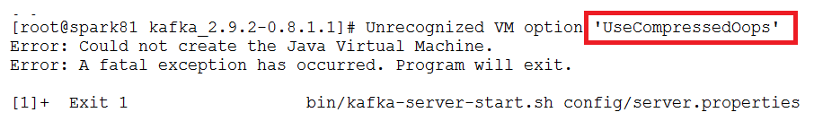

# 38-spark Streaming

# 1.Spark Streaming介绍

**新的场景：**

- 商品推荐
  - 京东和淘宝这样的商城在购物车, 商品详情等地方都有商品推荐的模块
  - 商品推荐的要求
    - 快速的处理, 加入购物车以后就需要迅速的进行推荐
    - 数据量大
    - 需要使用一些推荐算法
- 工业大数据
  - 现在的工场中, 设备是可以联网的, 汇报自己的运行状态, 在应用层可以针对这些数据来分析运行状况和稳健程度, 展示工件完成情况, 运行情况等
  - 工业大数据的需求
    - 快速响应, 及时预测问题
    - 数据是以事件的形式动态的产品和汇报
    - 因为是运行状态信息, 而且一般都是几十上百台机器, 所以汇报的数据量很大
- 监控
  - 一般的大型集群和平台, 都需要对其进行监控
  - 监控的需求
    - 要针对各种数据库, 包括 `MySQL`, `HBase` 等进行监控
    - 要针对应用进行监控, 例如 `Tomcat`, `Nginx`, `Node.js` 等
    - 要针对硬件的一些指标进行监控, 例如 `CPU`, 内存, 磁盘 等
    - 这些工具的日志输出是非常多的, 往往一个用户的访问行为会带来几百条日志, 这些都要汇报, 所以数据量比较大
    - 要从这些日志中, 聚合系统运行状况

**流计算：**

- 批量计算

  

  数据已经存在, 一次性读取所有的数据进行批量处理

  - 批量计算也叫做离线计算，数据是有边界的，无论多大，是有大小的
  - 批量计算往往计算全量数据

- 流计算

  

  数据源源不断的进来, 经过处理后落地
  
  - 流计算的数据是不断产生的
  - 流计算要求快速的处理，所以处理的是增量数据

## 1.1 流和批的架构组合

流计算和批量计算都是由意义的，有自己的应用场景, 那么如何结合流和批呢? 如何在同一个系统中使用这两种不同的解决方案呢?

**混合架构：**


**混合架构说明：**

混合架构的名字叫做 `Lambda 架构`, 混合架构最大的特点就是将流式计算和批处理结合起来，后在进行查询的时候分别查询流系统和批系统, 最后将结果合并在一起

一般情况下 Lambda 架构分三层

- 批处理层: 批量写入, 批量读取
- 服务层: 分为两个部分, 一部分对应批处理层, 一部分对应速度层
- 速度层: 随机读取, 随即写入, 增量计算

**混合架构优缺点：**

- 优点

  - 兼顾优点, 在批处理层可以全量查询和分析, 在速度层可以查询最新的数据
  - 速度很快, 在大数据系统中, 想要快速的获取结果是非常困难的, 因为高吞吐量和快速返回结果往往很难兼得, 例如 `Impala` 和 `Hive`, `Hive` 能进行非常大规模的数据量的处理, `Impala` 能够快速的查询返回结果, 但是很少有一个系统能够兼得两点, `Lambda` 使用多种融合的手段从而实现

- 缺点

  `Lambda` 是一个非常反人类的设计, 因为我们需要在系统中不仅维护多套数据层, 还需要维护批处理和流式处理两套框架, 这非常困难, 一套都很难搞定, 两套带来的运维问题是是指数级提升的

**流式架构**


- 流式架构说明

  流式架构常见的叫做 `Kappa 结构`, 是 `Lambda 架构` 的一个变种, 其实本质上就是删掉了批处理

- 优点

  - 非常简单
  - 效率很高, 在存储系统的发展下, 很多存储系统已经即能快速查询又能批量查询了, 所以 `Kappa 架构` 在新时代还是非常够用的

- 问题

  丧失了一些 `Lambda` 的优秀特点

## 1.2 Spark Streaming

Spark Streaming是核心Spark API的扩展，可实现可扩展、高吞吐量、可容错的实时数据流处理。数据可以从诸如Kafka，Flume，Kinesis或TCP套接字等众多来源获取，并且可以使用由高级函数（如map，reduce，join和window）开发的复杂算法进行流数据处理。最后，处理后的数据可以被推送到文件系统，数据库和实时仪表板。而且，您还可以在数据流上应用Spark提供的机器学习和图处理算法。

**特点：**

1. 易用：已经集成在Spark中
2. 容错性：底层也是RDD，RDD本身就具备了容错机制。	
3. 支持多种语言：Java Scala Python

**内部结构：**


Spark Streaming将连续的数据流抽象为discretizedstream或**DStream**。在内部，DStream 由一个RDD序列表示。

## 1.3 spark Sreaming的特点

| 特点                                         | 说明                                                         |
| :------------------------------------------- | :----------------------------------------------------------- |
| `Spark Streaming` 是 `Spark Core API` 的扩展 | `Spark Streaming` 具有类似 `RDD` 的 `API`, 易于使用, 并可和现有系统共用相似代码一个非常重要的特点是, `Spark Streaming` 可以在流上使用基于 `Spark` 的机器学习和流计算, 是一个一站式的平台 |
| `Spark Streaming` 具有很好的整合性           | `Spark Streaming` 可以从 `Kafka`, `Flume`, `TCP` 等流和队列中获取数据`Spark Streaming` 可以将处理过的数据写入文件系统, 常见数据库中 |
| `Spark Streaming` 是微批次处理模型           | 微批次处理的方式不会有长时间运行的 `Operator`, 所以更易于容错设计微批次模型能够避免运行过慢的服务, 实行推测执行 |

# 2. spark streaming入门

## 2.1 netcat的使用

**socket回顾：**


- socket是java中为了支持基于`TCP/UDP`协议的通信所提供的编程模型

- socket分为socket server和socket client

  - socket server

    监听某个端口，接收socket client发过来的连接请求建立连接，联机后建立可以向socket client发送TCP packet交互（被动）

  - socket client

    向某个端口发起连接，并在连接建立后，向socket server发送TCP packet实现交互（主动）

- TCP三次握手建立连接

  - `Client` 向 `Server` 发送 `SYN(j)`, 进入 `SYN_SEND` 状态等待 `Server` 响应
  - `Server` 收到 `Client` 的 `SYN(j)` 并发送确认包 `ACK(j + 1)`, 同时自己也发送一个请求连接的 `SYN(k)` 给 `Client`, 进入 `SYN_RECV` 状态等待 `Client` 确认
  - `Client` 收到 `Server` 的 `ACK + SYN`, 向 `Server` 发送连接确认 `ACK(k + 1)`, 此时, `Client` 和 `Server` 都进入 `ESTABLISHED` 状态, 准备数据发送

**Netcat**


- `Netcat` 简写 `nc`, 命令行中使用 `nc` 命令调用
- `Netcat` 是一个非常常见的 `Socket` 工具, 可以使用 `nc` 建立 `Socket server` 也可以建立 `Socket client`
  - `nc -l` 建立 `Socket server`, `l` 是 `listen` 监听的意思
  - `nc host port` 建立 `Socket client`, 并连接到某个 `Socket server`

## 2.2 IDEA开发

目标：使用 `Spark Streaming` 程序和 `Socket server` 进行交互, 从 `Server` 处获取实时传输过来的字符串, 拆开单词并统计单词数量, 最后打印出来每一个小批次的单词数量

1. 导入maven依赖

   ```XML
   		<scala.version>2.11.8</scala.version>
           <spark.version>2.3.4</spark.version>        
   <dependencies>
   		<dependency>
               <groupId>org.scala-lang</groupId>
               <artifactId>scala-library</artifactId>
               <version>${scala.version}</version>
           </dependency>
   		<dependency>
               <groupId>org.apache.spark</groupId>
               <artifactId>spark-core_2.11</artifactId>
               <version>${spark.version}</version>
           </dependency>
           <dependency>
               <groupId>org.apache.hadoop</groupId>
               <artifactId>hadoop-client</artifactId>
               <version>2.8.4</version>
           </dependency>        
           <dependency>
               <groupId>org.apache.spark</groupId>
               <artifactId>spark-streaming_2.11</artifactId>
               <version>${spark.version}</version>
           </dependency>
           <dependency>
               <groupId>junit</groupId>
               <artifactId>junit</artifactId>
               <version>4.10</version>
               <scope>provided</scope>
           </dependency>
      </dependencies>
    <build>
           <sourceDirectory>src/main/scala</sourceDirectory>
           <testSourceDirectory>src/test/scala</testSourceDirectory>
           <plugins>
   
               <plugin>
                   <groupId>org.apache.maven.plugins</groupId>
                   <artifactId>maven-compiler-plugin</artifactId>
                   <version>3.0</version>
                   <configuration>
                       <source>1.8</source>
                       <target>1.8</target>
                       <encoding>UTF-8</encoding>
                   </configuration>
               </plugin>
   
               <plugin>
                   <groupId>net.alchim31.maven</groupId>
                   <artifactId>scala-maven-plugin</artifactId>
                   <version>3.2.0</version>
                   <executions>
                       <execution>
                           <goals>
                               <goal>compile</goal>
                               <goal>testCompile</goal>
                           </goals>
                           <configuration>
                               <args>
                                   <arg>-dependencyfile</arg>
                                   <arg>${project.build.directory}/.scala_dependencies</arg>
                               </args>
                           </configuration>
                       </execution>
                   </executions>
               </plugin>
   
               <plugin>
                   <groupId>org.apache.maven.plugins</groupId>
                   <artifactId>maven-shade-plugin</artifactId>
                   <version>3.1.1</version>
                   <executions>
                       <execution>
                           <phase>package</phase>
                           <goals>
                               <goal>shade</goal>
                           </goals>
                           <configuration>
                               <filters>
                                   <filter>
                                       <artifact>*:*</artifact>
                                       <excludes>
                                           <exclude>META-INF/*.SF</exclude>
                                           <exclude>META-INF/*.DSA</exclude>
                                           <exclude>META-INF/*.RSA</exclude>
                                       </excludes>
                                   </filter>
                               </filters>
                               <transformers>
                                   <transformer implementation="org.apache.maven.plugins.shade.resource.ManifestResourceTransformer">
                                       <mainClass></mainClass>
                                   </transformer>
                               </transformers>
                           </configuration>
                       </execution>
                   </executions>
               </plugin>
           </plugins>
       </build>
   ```

2. 代码

   ```scala
     @Test
     def day01():Unit ={
       // 1. 初始化环境
       // 在 sparkCore中的内存，创建sprkContext的时候使用
       // 在创建 Streaming Context的时候也要用到conf，说明 Spark Streaming是基于Spark Core的
       // 在执行master的时候，不能指定一个线程，因为在Streaming运行的时候，需要开一个新的线程来去一直监听数据的获取
       val conf = new SparkConf().setAppName("MyNetwordWordCount").setMaster("local[6]")
   
       // StreamingContext其实就是Spark Streaming的入口
       // 相当于SparkContext 是Spark Core的入口一样，他们也都叫XXContext
       //接收两个参数，第一个conf，第二个是采样时间间隔
       val ssc = new StreamingContext(conf,Seconds(3))
   	ssc.sparkContext.setLogLevel("WARN") // 去掉日志中的警告信息
         
         
       // socketTextStream 这个方法用于创建一个DStream，监听Socket输入，当做文本处理
       // socketTextStream.textFile() 创建一个RDD，他们俩类似，都是创建对应的数据集
       // RDD -> Spark Core  DStream -> Spark Streaming
       //创建DStream 从netcat服务器上接收数据 因为接收字符串，所以使用textStream
       // 选择 Receiver 获取到数据后的保存方式, 此处是内存和磁盘都有, 并且序列化后保存
       val lines = ssc.socketTextStream(hostname = "192.168.64.129",port = 1234, storageLevel = StorageLevel.MEMORY_AND_DISK_SER)
         
       // 2. 数据处理
       // 2.1 把句子拆为单词
       val words = lines.flatMap(_.split(" "))
   	// 2.2 转换单词，并聚合
       val wordCount = words.map((_,1)).reduceByKey(_+_)
       //    val wordCount = words.transform(x => x.map((_,1))).reduceByKey(_+_)
   
       // 3. 展示和启动
       // 这一步类似 RDD 中的 Action, 执行最后的数据输出和收集，其实这一步并没有启动流
       wordCount.print()
   
       // 启动流和 JobGenerator, 开始流式处理数据
       ssc.start()
   
       // main方法执行完毕以后整个程序就会退出，所以需要阻塞主线程
       //阻塞主线程, 后台线程开始不断获取数据并处理
       // 注：启动的线程数必须大于1
       ssc.awaitTermination()
     }
   ```

**总结：**

注意点：

- `Spark Streaming` 并不是真正的来一条数据处理一条

  

  - DStream 在上述案例中的体现为Socket Server，然后按照时间把外部数据源传过来的数据分组

  - `Spark Streaming` 的处理机制叫做小批量, 英文叫做 `mini-batch`, 是收集了一定时间的数据后生成 `RDD`, 后针对 `RDD` 进行各种转换操作, 这个原理提现在如下两个地方
    - 控制台中打印的结果是一个批次一个批次的, 统计单词数量也是按照一个批次一个批次的统计
    - 多长时间生成一个 `RDD` 去统计呢? 由 `new StreamingContext(sparkConf, Seconds(1))` 这段代码中的第二个参数指定批次生成的时间

- `Spark Streaming` 中至少要有两个线程

  在使用 `spark-submit` 启动程序的时候, 不能指定一个线程

  - 主线程被阻塞了, 等待程序运行
  - 需要开启后台线程获取数据

**创建** `StreamingContext`

```scala
val conf = new SparkConf().setAppName(appName).setMaster(master)
val ssc = new StreamingContext(conf, Seconds(1))
```

- `StreamingContext` 是 `Spark Streaming` 程序的入口
- 在创建 `StreamingContext` 的时候, 必须要指定两个参数, 一个是 `SparkConf`, 一个是流中生成 `RDD` 的时间间隔
- `StreamingContext` 提供了如下功能
  - 创建 `DStream`, 可以通过读取 `Kafka`, 读取 `Socket` 消息, 读取本地文件等创建一个流, 并且作为整个 `DAG` 中的 `InputDStream`
  - `RDD` 遇到 `Action` 才会执行, 但是 `DStream` 不是, `DStream` 只有在 `StreamingContext.start()` 后才会开始接收数据并处理数据
  - 使用 `StreamingContext.awaitTermination()` 等待处理被终止
  - 使用 `StreamingContext.stop()` 来手动的停止处理
- 在使用的时候有如下注意点
  - 同一个 `Streaming` 程序中, 只能有一个 `StreamingContext`
  - 一旦一个 `Context` 已经启动 (`start`), 则不能添加新的数据源 

**各种算子：**


- 这些算子类似 `RDD`, 也会生成新的 `DStream`
- 这些算子操作最终会落到每一个 `DStream` 生成的 `RDD` 中

| 算子          | 释义                                                         |
| :------------ | :----------------------------------------------------------- |
| `flatMap`     | `lines.flatMap(_.split(" "))`将一个数据一对多的转换为另外的形式, 规则通过传入函数指定 |
| `map`         | `words.map(x => (x, 1))`一对一的转换数据                     |
| `reduceByKey` | `words.reduceByKey(_ + _)`这个算子需要特别注意, 这个聚合并不是针对于整个流, 而是针对于某个批次的数据 |

## 2.3 DStream基本概念

Discretized（离散） Streams (DStreams)在内部，它的工作原理如下。 Spark Streaming接收实时输入数据流并将数据分成批处理，然后由Spark引擎处理以批量生成最终结果流。


**DStreams是什么？**

是构建在Spark RDD之上的一款流处理工具。言外之意Spark DStream并不是严格意义的流处理。底层通过将RDD在时间轴上拆解成多个小的RDD-macro batch（构建在RDD之上的微批，严格意义上并不是真正的流），掺水了

Spark Streaming将连续的数据流抽象为discretizedstream或**DStream**。在内部，DStream 由一个RDD序列表示。

- StreamingContext会根据设置的批处理的时间间隔将产生的rdd归为一批，这一批rdd就是一个DStream，DStream可以通过算子操作转化为另一个DStream
- SparkStreaming的数据来源是kafka、flume、hdfs等，其中用的最多的是kafka，次子是flume，SparkStreaming将接收到的数据进行分批处理，每次发送一个DStream给SparkEngine处理，将处理后的数据持久到hdfs，datebase等里面。

# 3. spark streaming进阶

## 3.1 StreamingContext对象详解

- 初始化StreamingContext

  - 方式1：从SparkConf对象中创建

    ```scala
    val conf = new SparkConf().setAppName("MyNetwordWordCount").setMaster("local[2]")
        
    //接收两个参数，第一个conf，第二个是采样时间间隔
    val ssc = new StreamingContext(conf,Seconds(3))
    ```

  - 方式2：从现有的SparkContext实例中创建

    

- 程序中的要素说明

  - appName参数是应用程序在集群UI上显示的名称。 
  - master是Spark，Mesos或YARN集群的URL，或者一个特殊的`local [*]`字符串来让程序以本地模式运行。
  - 当在集群上运行程序时，不需要在程序中硬编码master参数，而是使用spark-submit提交应用程序并将master的URL以脚本参数的形式传入。但是，对于本地测试和单元测试，您可以通过`local[*]`来运行Spark Streaming程序**（请确保本地系统中的cpu核心数够用）**。 
  - StreamingContext会内在的创建一个SparkContext的实例（所有Spark功能的起始点），你可以通过ssc.sparkContext访问到这个实例。
  - 批处理的时间窗口长度必须根据应用程序的延迟要求和可用的集群资源进行设置。

- 注意事项

  - 一旦一个StreamingContextt开始运作，就不能设置或添加新的流计算。
  - 一旦一个上下文被停止，它将无法重新启动。
  - 同一时刻，一个JVM中只能有一个StreamingContext处于活动状态。
  - StreamingContext上的stop()方法也会停止SparkContext。 要仅停止StreamingContext（保持SparkContext活跃），请将stop() 方法的可选参数stopSparkContext设置为false。
  - 只要前一个StreamingContext在下一个StreamingContext被创建之前停止（不停止SparkContext），SparkContext就可以被重用来创建多个StreamingContext。

## 3.2 离散流

- DiscretizedStream或DStream 是Spark Streaming对流式数据的基本抽象。它表示连续的数据流，这些连续的数据流可以是从数据源接收的输入数据流，也可以是通过对输入数据流执行转换操作而生成的经处理的数据流。在内部，DStream由一系列连续的RDD表示，如下图：

  

- 举例分析：在之前的NetworkWordCount的例子中，我们将一行行文本组成的流转换为单词流，具体做法为：将flatMap操作应用于名为lines的 DStream中的每个RDD上，以生成words DStream的RDD。如下图所示：

  

  但是DStream和RDD也有区别，下面画图说明：

  

  

## 3.3 DStream中的转换操作


**最后两个transformation算子需要重点介绍一下：**

- transform(func)

  - 通过RDD-to-RDD函数作用于源DStream中的各个RDD，可以是任意的RDD操作，从而返回一个新的RDD

  - 举例：在NetworkWordCount中，也可以使用transform来生成元组对

    .png)

- updateStateByKey(func)

  -  操作允许不断用新信息更新它的同时保持任意状态。
     - 定义状态-状态可以是任何的数据类型
     - 定义状态更新函数-怎样利用更新前的状态和从输入流里面获取的新值更新状态
  -  重写NetworkWordCount程序，**累计每个单词出现的频率（注意：累计）**

  .png)

- 注意：如果在IDEA中，不想输出log4j的日志信息，可以将log4j.properties文件（放在src的目录下）的第一行改为：

  ```
  log4j.rootCategory=ERROR, console
  ```

  

## 3.4 窗口操作

Spark Streaming还提供了窗口计算功能，允许您在数据的滑动窗口上应用转换操作。下图说明了滑动窗口的工作方式：


如图所示，每当窗口滑过originalDStream时，落在窗口内的源RDD被组合并被执行操作以产生windowed DStream的RDD。在上面的例子中，操作应用于最近3个时间单位的数据，并以2个时间单位滑动。这表明任何窗口操作都需要指定两个参数。

- 窗口长度（windowlength） - 窗口的时间长度（上图的示例中为：3）。

- 滑动间隔（slidinginterval） - 两次相邻的窗口操作的间隔（即每次滑动的时间长度）（上图示例中为：2）。

  这两个参数必须是源DStream的批间隔的倍数（上图示例中为：1）。

示例：

我们以一个例子来说明窗口操作。 假设您希望对之前的单词计数的示例进行扩展，每10秒钟对过去30秒的数据进行wordcount。为此，我们必须在最近30秒的pairs DStream数据中对(word, 1)键值对应用reduceByKey操作。这是通过使用reduceByKeyAndWindow操作完成的。


一些常见的窗口操作如下表所示。所有这些操作都用到了上述两个参数 - windowLength和slideInterval。

- window(windowLength, slideInterval)

  基于源DStream产生的窗口化的批数据计算一个新的DStream

- countByWindow(windowLength, slideInterval)

  返回流中元素的一个滑动窗口数

- reduceByWindow(func, windowLength, slideInterval)

  返回一个单元素流。利用函数func聚集滑动时间间隔的流的元素创建这个单元素流。函数必须是相关联的以使计算能够正确的并行计算。

- reduceByKeyAndWindow(func, windowLength, slideInterval, [numTasks])

  应用到一个(K,V)对组成的DStream上，返回一个由(K,V)对组成的新的DStream。每一个key的值均由给定的reduce函数聚集起来。注意：在默认情况下，这个算子利用了Spark默认的并发任务数去分组。你可以用numTasks参数设置不同的任务数

- reduceByKeyAndWindow(func, invFunc, windowLength, slideInterval, [numTasks])

  上述reduceByKeyAndWindow() 的更高效的版本，其中使用前一窗口的reduce计算结果递增地计算每个窗口的reduce值。这是通过对进入滑动窗口的新数据进行reduce操作，以及“逆减（inverse reducing）”离开窗口的旧数据来完成的。一个例子是当窗口滑动时对键对应的值进行“一加一减”操作。但是，它仅适用于“可逆减函数（invertible reduce functions）”，即具有相应“反减”功能的减函数（作为参数invFunc）。 像reduceByKeyAndWindow一样，通过可选参数可以配置reduce任务的数量。 请注意，使用此操作必须启用检查点。

- countByValueAndWindow(windowLength, slideInterval, [numTasks])

  应用到一个(K,V)对组成的DStream上，返回一个由(K,V)对组成的新的DStream。每个key的值都是它们在滑动窗口中出现的频率。

## 3.5 输入DStreams和接收器

输入DStreams表示从数据源获取输入数据流的DStreams。在NetworkWordCount例子中，lines表示输入DStream，它代表从netcat服务器获取的数据流。每一个输入流DStream和一个Receiver对象相关联，这个Receiver从源中获取数据，并将数据存入内存中用于处理。

输入DStreams表示从数据源获取的原始数据流。Spark Streaming拥有两类数据源：

- 基本源（Basic sources）：这些源在StreamingContext API中直接可用。例如文件系统、套接字连接、Akka的actor等
- 高级源（Advanced sources）：这些源包括Kafka,Flume,Kinesis,Twitter等等。

### 3.5.1 文件流

文件流：通过监控文件系统的变化，若有新文件添加，则将它读入并作为数据流

需要注意的是：

- 这些文件具有相同的格式
- 这些文件通过原子移动或重命名文件的方式在dataDirectory创建
- 如果在文件中追加内容，这些追加的新数据也不会被读取。

```scala
import org.apache.spark.SparkConf
import org.apache.spark.streaming.{Seconds, StreamingContext}

object FileStreaming {
  def main(args: Array[String]) {
    val conf = new SparkConf().setMaster("local[2]").setAppName("FileStreaming")
    val ssc = new StreamingContext(conf,Seconds(2))

    //从本地目录中读取数据：如果有新文件产生，就会读取进来
    val lines = ssc.textFileStream("d://dowload//spark123")

    //打印结果
    lines.print()

    ssc.start()
    ssc.awaitTermination()
  }
}

```

注意：要演示成功，需要在原文件中编辑，然后拷贝一份。

### 3.5.2 RDD队列流

使用streamingContext.queueStream(queueOfRDD)创建基于RDD队列的DStream，用于调试Spark Streaming应用程序。

```scala
import org.apache.spark.SparkConf
import org.apache.spark.rdd.RDD
import org.apache.spark.streaming.{Seconds, StreamingContext}

import scala.collection.mutable

object RDDQueueStream {
  def main(args: Array[String]) {
    val conf = new SparkConf().setMaster("local").setAppName("queueStream")
    //每1秒对数据进行处理
    val ssc = new StreamingContext(conf,Seconds(1))

    //创建一个能够push到QueueInputDStream的RDDs队列
    val rddQueue = new mutable.Queue[RDD[Int]]()

    //基于一个RDD队列创建一个输入源
    val inputStream = ssc.queueStream(rddQueue)

    //将接收到的数据乘以10
    val mappedStream = inputStream.map(x => (x,x*10))
    mappedStream.print()

    ssc.start()

    for(i <- 1 to 3){
      rddQueue += ssc.sparkContext.makeRDD(1 to 10)   //创建RDD，并分配两个核数
      Thread.sleep(1000)
    }
    ssc.stop()
  }
}

```

### 3.5.3 套接字流

通过监听Socket端口来接收数据

```scala
import org.apache.spark.SparkConf
import org.apache.spark.storage.StorageLevel
import org.apache.spark.streaming.{Seconds, StreamingContext}

object ScoketStreaming {

  def main(args: Array[String]) {
    //创建一个本地的StreamingContext，含2个工作线程
    val conf = new SparkConf().setMaster("local[4]").setAppName("ScoketStreaming")
    val sc = new StreamingContext(conf,Seconds(5))   //每隔10秒统计一次字符总数

    //创建珍一个DStream，连接127.0.0.1 :7788
    val lines = sc.socketTextStream("127.0.0.1",7788)
    //打印数据
    lines.print()

    sc.start()         //开始计算
    sc.awaitTermination()   //通过手动终止计算，否则一直运行下去
  }
}

```

## 3.6 DStreams的输出操作

输出操作允许DStream的操作推到如数据库、文件系统等外部系统中。因为输出操作实际上是允许外部系统消费转换后的数据，它们触发的实际操作是DStream转换。目前，定义了下面几种输出操作：


**foreachRDD的设计模式**

DStream.foreachRDD是一个强大的原语，发送数据到外部系统中。

1. 创建连接，将数据写入外部数据库（使用之前的NetworkWordCount，改写之前输出结果的部分，如下）

   

   会报错，原因：

   Connection对象不是一个可被序列化的对象，不能RDD的每个Worker上运行；即：Connection不能在RDD分布式环境中的每个分区上运行，因为不同的分区可能运行在不同的Worker上。所以需要在每个RDD分区上单独创建Connection对象。

2. 在每个RDD分区上单独创建Connection对象，如下：

   

```scala
import java.sql.{Connection, DriverManager, PreparedStatement}

import org.apache.spark.SparkConf
import org.apache.spark.storage.StorageLevel
import org.apache.spark.streaming.{Seconds, StreamingContext}

object MyNetworkWordCount {
  def main(args: Array[String]): Unit = {
    //创建一个Context对象: StreamingContext  (SparkContext, SQLContext)
    //指定批处理的时间间隔
    val conf = new SparkConf().setAppName("MyNetworkWordCount").setMaster("local[2]")
    val ssc = new StreamingContext(conf,Seconds(5))

    //创建一个DStream，处理数据
    val lines  = ssc.socketTextStream("192.168.157.81",7788,StorageLevel.MEMORY_AND_DISK_SER)

    //执行wordcount
    val words = lines.flatMap(_.split(" "))

    val wordPair = words.map(x => (x,1))

    val wordCountResult = wordPair.reduceByKey(_ + _)
    //val wordCountResult = wordPair.reduceByKeyAndWindow((a:Int,b:Int) => (a+b), Seconds(30),Seconds(10))

    //输出结果
    //wordCountResult.print()
    wordCountResult.foreachRDD(rdd =>{
      rdd.foreachPartition(partitionRecord =>{

        var conn:Connection = null
        var pst:PreparedStatement = null

        try {
          conn = DriverManager.getConnection("jdbc:oracle:thin:@192.168.157.101:1521/orcl.example.com", "SCOTT", "tiger")

          partitionRecord.foreach(record => {
            pst = conn.prepareStatement("insert into myresult values(?,?)")
            pst.setString(1, record._1)
            pst.setInt(2, record._2)
            //执行
            pst.executeUpdate()
          })
        }catch{
          case e1:Exception => println("Some Error: " + e1.getMessage)
        }finally {
          if(pst != null) pst.close()
          if(conn != null) conn.close()
        }
      })
    })

    //启动StreamingContext
    ssc.start()

    //等待计算完成
    ssc.awaitTermination()
  }
}
```

## 3.7 DataFrame和SQL操作

我们可以很方便地使用DataFrames和SQL操作来处理流数据。您必须使用当前的StreamingContext对应的SparkContext创建一个SparkSession。此外，必须这样做的另一个原因是使得应用可以在driver程序故障时得以重新启动，这是通过创建一个可以延迟实例化的单例SparkSession来实现的。

在下面的示例中，我们使用DataFrames和SQL来修改之前的wordcount示例并对单词进行计数。我们将每个RDD转换为DataFrame，并注册为临时表，然后在这张表上执行SQL查询。 

```scala
import org.apache.spark.SparkConf
import org.apache.spark.sql.SparkSession
import org.apache.spark.storage.StorageLevel
import org.apache.spark.streaming.{Seconds, StreamingContext}

object MyNetworkWordCountDataFrame {
  def main(args: Array[String]): Unit = {
    //创建一个Context对象: StreamingContext  (SparkContext, SQLContext)
    //指定批处理的时间间隔
    val conf = new SparkConf().setAppName("MyNetworkWordCount").setMaster("local[2]")
    val ssc = new StreamingContext(conf, Seconds(5))

    //创建一个DStream，处理数据
    val lines = ssc.socketTextStream("192.168.157.81", 7788, StorageLevel.MEMORY_AND_DISK_SER)

    //执行wordcount
    val words = lines.flatMap(_.split(" "))

    //使用Spark SQL来查询Spark Streaming处理的数据
    words.foreachRDD { rdd =>
      //使用单列模式，创建SparkSession对象
      val spark = SparkSession.builder.config(rdd.sparkContext.getConf).getOrCreate()

      import spark.implicits._
      // 将RDD[String]转换为DataFrame
      val wordsDataFrame = rdd.toDF("word")

      // 创建临时视图
      wordsDataFrame.createOrReplaceTempView("words")

      // 执行SQL
      val wordCountsDataFrame =   spark.sql("select word, count(*) as total from words group by word")
      wordCountsDataFrame.show()
    }

    //启动StreamingContext
    ssc.start()

    //等待计算完成
    ssc.awaitTermination()
  }
}

```

## 3.8 缓存和持久化

与RDD类似，DStreams还允许开发人员将流数据保留在内存中。也就是说，在DStream上调用persist() 方法会自动将该DStream的每个RDD保留在内存中。如果DStream中的数据将被多次计算（例如，相同数据上执行多个操作），这个操作就会很有用。对于基于窗口的操作，如reduceByWindow和reduceByKeyAndWindow以及基于状态的操作，如updateStateByKey，数据会默认进行持久化。 因此，基于窗口的操作生成的DStream会自动保存在内存中，而不需要开发人员调用persist()。

 对于通过网络接收数据（例如Kafka，Flume，sockets等）的输入流，默认持久化级别被设置为将数据复制到两个节点进行容错。

请注意，与RDD不同，DStreams的默认持久化级别将数据序列化保存在内存中。

## 3.9 检查点支持

流数据处理程序通常都是全天候运行，因此必须对应用中逻辑无关的故障（例如，系统故障，JVM崩溃等）具有弹性。为了实现这一特性，Spark Streaming需要checkpoint足够的信息到容错存储系统，以便可以从故障中恢复。

**一般会对两种类型的数据使用检查点：**

- 元数据检查点（Metadatacheckpointing）

  将定义流计算的信息保存到容错存储中（如HDFS）。这用于从运行streaming程序的driver程序的节点的故障中恢复。元数据包括以下几种：

  - 配置（Configuration） - 用于创建streaming应用程序的配置信息。
  - DStream操作（DStream operations） - 定义streaming应用程序的DStream操作集合。
  - 不完整的batch（Incomplete batches） - jobs还在队列中但尚未完成的batch。

- 数据检查点（Datacheckpointing）

  将生成的RDD保存到可靠的存储层。对于一些需要将多个批次之间的数据进行组合的stateful变换操作，设置数据检查点是必需的。在这些转换操作中，当前生成的RDD依赖于先前批次的RDD，这导致依赖链的长度随时间而不断增加，由此也会导致基于血统机制的恢复时间无限增加。为了避免这种情况，stateful转换的中间RDD将定期设置检查点并保存到到可靠的存储层（例如HDFS）以切断依赖关系链。

总而言之，元数据检查点主要用于从driver程序故障中恢复，而数据或RDD检查点在任何使用stateful转换时是必须要有的。

**何时启用检查点**

对于具有以下任一要求的应用程序，必须启用检查点：

- 使用状态转：如果在应用程序中使用updateStateByKey或reduceByKeyAndWindow（具有逆函数），则必须提供检查点目录以允许定期保存RDD检查点。

- 从运行应用程序的driver程序的故障中恢复：元数据检查点用于使用进度信息进行恢复。

**如何配置检查点**

可以通过在一些可容错、高可靠的文件系统（例如，HDFS，S3等）中设置保存检查点信息的目录来启用检查点。这是通过使用streamingContext.checkpoint(checkpointDirectory)完成的。设置检查点后，您就可以使用上述的有状态转换操作。此外，如果要使应用程序从驱动程序故障中恢复，您应该重写streaming应用程序以使程序具有以下行为：

1. 当程序第一次启动时，它将创建一个新的StreamingContext，设置好所有流数据源，然后调用start()方法。

2. 当程序在失败后重新启动时，它将从checkpoint目录中的检查点数据重新创建一个StreamingContext。

   使用StreamingContext.getOrCreate可以简化此行为

**改写之前的WordCount程序，使得每次计算的结果和状态都保存到检查点目录下**

```scala
package demo

import org.apache.spark.SparkConf
import org.apache.spark.storage.StorageLevel
import org.apache.spark.streaming.{Seconds, StreamingContext}

object MyCheckpointNetworkWordCount {
  def main(args: Array[String]): Unit = {
    //在主程序中，创建一个Streaming Context对象
    //1、读取一个检查点的目录
    //2、如果该目录下已经存有之前的检查点信息，从已有的信息上创建这个Streaming Context对象
    //3、如果该目录下没有信息，创建一个新的Streaming Context
    val context = StreamingContext.getOrCreate("hdfs://192.168.157.111:9000/spark_checkpoint",createStreamingContext)

    //启动任务
    context.start()
    context.awaitTermination()
  }

  //创建一个StreamingContext对象，并且设置检查点目录，执行WordCount程序（记录之前的状态信息）
  def createStreamingContext():StreamingContext = {
    val conf = new SparkConf().setAppName("MyCheckpointNetworkWordCount").setMaster("local[2]")
    //创建这个StreamingContext对象
    val ssc = new StreamingContext(conf,Seconds(3))

    //设置检查点目录
    ssc.checkpoint("hdfs://192.168.157.111:9000/spark_checkpoint")

    //创建一个DStream，执行WordCount
    val lines = ssc.socketTextStream("192.168.157.81",7788,StorageLevel.MEMORY_AND_DISK_SER)

    //分词操作
    val words = lines.flatMap(_.split(" "))
    //每个单词记一次数
    val wordPair = words.map(x=> (x,1))

    //执行单词计数
    //定义一个新的函数：把当前的值跟之前的结果进行一个累加
    val addFunc = (currValues:Seq[Int],preValueState:Option[Int]) => {
      //当前当前批次的值
      val currentCount = currValues.sum

      //得到已经累加的值。如果是第一次求和，之前没有数值，从0开始计数
      val preValueCount = preValueState.getOrElse(0)

      //进行累加，然后累加后结果，是Option[Int]
      Some(currentCount + preValueCount)
    }

    //要把新的单词个数跟之前的结果进行叠加（累计）
    val totalCount = wordPair.updateStateByKey[Int](addFunc)

    //输出结果
    totalCount.print()

    //返回这个对象
    ssc
  }
}

```

通过查看HDFS中的信息，可以看到相关的检查点信息，如下：


# 4. 高级数据源

## 4.1Spark Streaming接收Flume数据

### 4.1.1 基于Flume的Push模式

Flume被用于在Flume agents之间推送数据.在这种方式下,Spark Streaming可以很方便的建立一个receiver,起到一个Avro agent的作用.Flume可以将数据推送到改receiver.

**push方式：flume将数据推送给Spark Streaming**

1. Flume的配置文件

   ```job
   #bin/flume-ng agent -n a4 -f myagent/a4.conf -c conf -Dflume.root.logger=INFO,console
   #定义agent名， source、channel、sink的名称
   a4.sources = r1
   a4.channels = c1
   a4.sinks = k1
   
   #具体定义source
   a4.sources.r1.type = spooldir
   a4.sources.r1.spoolDir = /root/training/logs
   
   #具体定义channel
   a4.channels.c1.type = memory
   a4.channels.c1.capacity = 10000
   a4.channels.c1.transactionCapacity = 100
   
   #具体定义sink
   a4.sinks = k1
   a4.sinks.k1.type = avro
   a4.sinks.k1.channel = c1
   a4.sinks.k1.hostname = 192.168.157.1
   a4.sinks.k1.port = 1234
   
   #组装source、channel、sink
   a4.sources.r1.channels = c1
   a4.sinks.k1.channel = c1
   
   ```

2. Spark Streaming程序

   ```scala
   import org.apache.spark.SparkConf
   import org.apache.spark.streaming.flume.FlumeUtils
   import org.apache.spark.streaming.{Seconds, StreamingContext}
   
   object MyFlumeStream {
   
     def main(args: Array[String]): Unit = {
       val conf = new SparkConf().setAppName("SparkFlumeNGWordCount").setMaster("local[2]")
       val ssc = new StreamingContext(conf, Seconds(5))
   
       //创建FlumeEvent的DStream
       val flumeEvent = FlumeUtils.createStream(ssc,"192.168.157.1",1234)
   
       //将FlumeEvent中的事件转成字符串
       val lineDStream = flumeEvent.map( e => {
          new String(e.event.getBody.array)
       })
   
       //输出结果
       lineDStream.print()
   
       ssc.start()
       ssc.awaitTermination();
     }
   }
   
   ```

3. 注意除了需要使用Flume的lib的jar包以外，还需要以下jar包：

   ```
   spark-streaming-flume_2.10-2.1.0.jar
   
   ```

4. 测试

   - 启动Spark Streaming程序
   - 启动Flume
   - 拷贝日志文件到/root/training/logs目录
   - 观察输出，采集到数据

### 4.1.2 基于Custom Sink的Pull模式 

同于Flume直接将数据推送到Spark Streaming中，第二种模式通过以下条件运行一个正常的Flume sink。Flume将数据推送到sink中，并且数据保持buffered状态。Spark Streaming使用一个可靠的Flume接收器和转换器从sink拉取数据。只要当数据被接收并且被Spark Streaming备份后，转换器才运行成功。

这样,与第一种模式相比,保证了很好的健壮性和容错能力。然而,这种模式需要为Flume配置一个正常的sink。

**custom sink 模式：比第一种有更好的健壮性和容错性。生产使用这个方式。**

以下为配置步骤：

1. flume配置文件

   ```conf
   #bin/flume-ng agent -n a1 -f myagent/a1.conf -c conf -Dflume.root.logger=INFO,console
   a1.channels = c1
   a1.sinks = k1
   a1.sources = r1
   
   a1.sources.r1.type = spooldir
   a1.sources.r1.spoolDir = /root/training/logs
   
   a1.channels.c1.type = memory
   a1.channels.c1.capacity = 100000
   a1.channels.c1.transactionCapacity = 100000
   
   a1.sinks.k1.type = org.apache.spark.streaming.flume.sink.SparkSink
   a1.sinks.k1.channel = c1
   a1.sinks.k1.hostname = 192.168.157.81
   a1.sinks.k1.port = 1234
   
   #组装source、channel、sink
   a1.sources.r1.channels = c1
   a1.sinks.k1.channel = c1
   
   
   ```

2. Spark Streaming程序

   ```scala
   package demo
   
   import org.apache.spark.SparkConf
   import org.apache.spark.storage.StorageLevel
   import org.apache.spark.streaming.flume.FlumeUtils
   import org.apache.spark.streaming.{Seconds, StreamingContext}
   
   object FlumeLogPull {
     def main(args: Array[String]) {
       val conf = new SparkConf().setAppName("SparkFlumeNGWordCount").setMaster("local[2]")
       val ssc = new StreamingContext(conf, Seconds(10))
   
       //创建FlumeEvent的DStream
       val flumeEvent = FlumeUtils.createPollingStream(ssc,"192.168.157.81",1234,StorageLevel.MEMORY_ONLY_SER_2)
   
       //将FlumeEvent中的事件转成字符串
       val lineDStream = flumeEvent.map( e => {
         new String(e.event.getBody.array)
       })
   
       //输出结果
       lineDStream.print()
   
       ssc.start()
       ssc.awaitTermination();
     }
   }
   
   
   ```

3. 需要的jar包

   - 将Spark的jar包拷贝到Flume的lib目录下
   - 下面的这个jar包也需要拷贝到Flume的lib目录下，同时加入IDEA工程的classpath

   ```
   spark-streaming-flume-sink_2.10-2.1.0.jar
   
   ```

4. 测试

   - 启动Flume
   - 在IDEA中启动FlumeLogPull
   - 将测试数据拷贝到/root/training/logs
   - 观察IDEA中的输出

## 4.2 Spark Streaming接收Kafka数据

Apache Kafka是一种高吞吐量的分布式发布订阅消息系统。


**搭建ZooKeeper（Standalone）：**

1. 配置/root/training/zookeeper-3.4.10/conf/zoo.cfg文件

   ```
   dataDir=/root/training/zookeeper-3.4.10/tmp
   server.1=spark81:2888:3888
   
   ```

2. 在/root/training/zookeeper-3.4.10/tmp目录下创建一个myid的空文件

   ```
   echo 1 > /root/training/zookeeper-3.4.6/tmp/myid
   
   ```

**搭建Kafka环境（单机单broker）：**

1. 修改server.properties文件

   

2. 启动Kafka

   ```
   bin/kafka-server-start.sh config/server.properties &
   
   ```

   如果出现以下错误

   

      需要修改bin/kafka-run-class.sh文件，将这个选项注释掉。

3. 测试Kafka

   - 创建Topic

     ```
     bin/kafka-topics.sh --create --zookeeper spark81:2181 -replication-factor 1 --partitions 3 --topic mydemo1
     
     ```

   - 发送消息

     ```
     bin/kafka-console-producer.sh --broker-list spark81:9092 --topic mydemo1
     
     ```

   - 接收消息

     ```
     bin/kafka-console-consumer.sh --zookeeper spark81:2181 --topic mydemo1
     
     ```

**搭建Spark Streaming和Kafka的集成开发环境**

由于Spark Streaming和Kafka集成的时候，依赖的jar包比较多，而且还会产生冲突。**强烈建议使用Maven的方式来搭建项目工程**。

下面是依赖的pom.xml文件：

```xml
<properties>
        <spark.version>2.1.0</spark.version>
        <scala.version>2.11</scala.version>
    </properties>

    <dependencies>
        <dependency>
            <groupId>org.apache.spark</groupId>
            <artifactId>spark-core_${scala.version}</artifactId>
            <version>${spark.version}</version>
        </dependency>
        <dependency>
            <groupId>org.apache.spark</groupId>
            <artifactId>spark-streaming_${scala.version}</artifactId>
            <version>${spark.version}</version>
        </dependency>
        <dependency>
            <groupId>org.apache.spark</groupId>
            <artifactId>spark-sql_${scala.version}</artifactId>
            <version>${spark.version}</version>
        </dependency>

        <dependency>
            <groupId>org.apache.spark</groupId>
            <artifactId>spark-streaming-kafka-0-8_2.11</artifactId>
            <version>2.1.1</version>
        </dependency>
    </dependencies>

```

### 4.2.1基于Receiver的方式

这个方法使用了Receivers来接收数据。Receivers的实现使用到Kafka高层次的消费者API。对于所有的Receivers，接收到的数据将会保存在Spark executors中，然后由Spark Streaming启动的Job来处理这些数据。

**开发Spark Streaming的Kafka Receivers**

```scala
import org.apache.spark.SparkConf
import org.apache.spark.streaming.kafka.KafkaUtils
import org.apache.spark.streaming.{Seconds, StreamingContext}

object KafkaWordCount {
  def main(args: Array[String]) {
    val conf = new SparkConf().setAppName("SparkFlumeNGWordCount").setMaster("local[2]")
    val ssc = new StreamingContext(conf, Seconds(10))

    //创建topic名称，1表示一次从这个topic中获取一条记录
    val topics = Map("mydemo1" ->1)

    //创建Kafka的输入流，指定ZooKeeper的地址
    val kafkaStream = KafkaUtils.createStream(ssc,"192.168.157.81:2181","mygroup",topics)

    //处理每次接收到的数据
    val lineDStream = kafkaStream.map(e => {
      new String(e.toString())
    })
    //输出结果
    lineDStream.print()

    ssc.start()
    ssc.awaitTermination();
  }
}


```

**测试**

- 启动Kafka消息的生产者

  ```
  bin/kafka-console-producer.sh --broker-list spark81:9092 --topic mydemo1
  
  ```

- 在IDEA中启动任务，接收Kafka消息

### 4.2.2直接读取方式

和基于Receiver接收数据不一样，这种方式定期地从Kafka的topic+partition中查询最新的偏移量，再根据定义的偏移量范围在每个batch里面处理数据。当作业需要处理的数据来临时，spark通过调用Kafka的简单消费者API读取一定范围的数据。

**开发Spark Streaming的程序**

```scala
import kafka.serializer.StringDecoder
import org.apache.spark.SparkConf
import org.apache.spark.streaming.{Seconds, StreamingContext}
import org.apache.spark.streaming.kafka.KafkaUtils

object DirectKafkaWordCount {
  def main(args: Array[String]) {
    val conf = new SparkConf().setAppName("SparkFlumeNGWordCount").setMaster("local[2]")
    val ssc = new StreamingContext(conf, Seconds(10))

    //创建topic名称，1表示一次从这个topic中获取一条记录
    val topics = Set("mydemo1")
    //指定Kafka的broker地址
    val kafkaParams = Map[String, String]("metadata.broker.list" -> "192.168.157.81:9092")

    //创建DStream，接收Kafka的数据
    val kafkaStream = KafkaUtils.createDirectStream[String, String, StringDecoder, StringDecoder](ssc, kafkaParams, topics)

    //处理每次接收到的数据
    val lineDStream = kafkaStream.map(e => {
      new String(e.toString())
    })
    //输出结果
    lineDStream.print()

    ssc.start()
    ssc.awaitTermination();
  }
}


```

**测试**

- 启动Kafka消息的生产者

  ```
  bin/kafka-console-producer.sh --broker-list spark81:9092 --topic mydemo1
  
  ```

- 在IDEA中启动任务，接收Kafka消息

# 5.性能优化

Spark性能优化手段：

1. 使用高性能序列化类库。
2. 优化数据结构。
3. 对多次使用的RDD进行持久化、checkpoint
4. 使用序列化的持久化级别：MEMORY_ONLY不序列化，MEMORY_ONLY_SER序列化。
5. Java虚拟机的垃圾回收调优。
6. Shuffle调优，1.x版本中，90%的性能问题都是shuffle导致的。2.x版本，官方解决了这个问题。

**其他性能优化：**

- 提高并行度。
- 广播共享数据。

## 5.1 诊断Spark内存使用

​	先要看到内存使用情况，才能进行针对性优化。

- 内存花费：

  - 每一个对象，都有对象头，占用16个字节，主要包含了一些对象的元信息，比如指向它类的指针。
    如果对象本身很小，'a'，他的对象头实际上比对象自己还大。
  - String对象，会比他内部的原始数据，多出40个字节。
    String内部使用 char 数组来保存内部的字符串序列。并且还要保存诸如数据长度之类的信息。
    String使用UTF-16编码，所以每个字符会占2个字节。比如：包含10个字符的String，占用 2*10 + 40 = 60字节。
  - 集合类型，比如HashMap LinkedList，内部使用链表数据结构。对链表中的每个数据使用 Entry 对象包装。
    Entry 对象不光有对象头，还有指向下一个Entry的指针，占用8字节。
  - java 原始数据类型（int）集合，内部通常会使用包装类型（Integer）来存储元素。

- 如何判断Spark程序消耗内存情况？

  示例：

  ```scala
  scala> val rdd1 = sc.textFile("/usr/local/tmp_files/test_Cache.txt")
  rdd1: org.apache.spark.rdd.RDD[String] = /usr/local/tmp_files/test_Cache.txt MapPartitionsRDD[1] at textFile at <console>:24
  
  scala> rdd1.cache
  res0: rdd1.type = /usr/local/tmp_files/test_Cache.txt MapPartitionsRDD[1] at textFile at <console>:24
  
  scala> rdd1.count
  res1: Long = 923452                                                             
  
  scala> rdd1.count
  res2: Long = 923452
  
  /usr/local/spark-2.1.0-bin-hadoop2.7/work/app-20190828055048-0000/0
  
  19/08/28 05:52:44 INFO MemoryStore: Block rdd_1_1 stored as values in memory (estimated size 26.0 MB, free 339.9 MB)
  19/08/28 05:52:45 INFO MemoryStore: Block rdd_1_0 stored as values in memory (estimated size 26.7 MB, free 313.2 MB)
  
  ```

  26 + 26.7 就是RDD内存的占用量。

## 5.2 减少批处理数据的执行时间

在Spark中有几个优化可以减少批处理的时间：

1. 数据接收的并行水平

   通过网络(如kafka，flume，socket等)接收数据需要这些数据反序列化并被保存到Spark中。如果数据接收成为系统的瓶颈，就要考虑并行地接收数据。注意，每个输入DStream创建一个receiver（运行在worker机器上）接收单个数据流。创建多个输入DStream并配置它们可以从源中接收不同分区的数据流，从而实现多数据流接收。例如，接收两个topic数据的单个输入DStream可以被切分为两个kafka输入流，每个接收一个topic。这将在两个worker上运行两个receiver，因此允许数据并行接收，提高整体的吞吐量。多个DStream可以被合并生成单个DStream，这样运用在单个输入DStream的transformation操作可以运用在合并的DStream上。

2. 数据处理的并行水平

   如果运行在计算stage上的并发任务数不足够大，就不会充分利用集群的资源。默认的并发任务数通过配置属性来确定**spark.default.parallelism**。

3. 数据序列化

   可以通过改变序列化格式来减少数据序列化的开销。在流式传输的情况下，有两种类型的数据会被序列化：

   - 输入数据
   - 由流操作生成的持久RDD

   在上述两种情况下，使用**Kryo**序列化格式可以减少CPU和内存开销。

   

## 5.3 设置正确的批容量

为了Spark Streaming应用程序能够在集群中稳定运行，系统应该能够以足够的速度处理接收的数据（即处理速度应该大于或等于接收数据的速度）。这可以通过流的网络UI观察得到。批处理时间应该小于批间隔时间。

根据流计算的性质，批间隔时间可能显著的影响数据处理速率，这个速率可以通过应用程序维持。可以考虑WordCountNetwork这个例子，对于一个特定的数据处理速率，系统可能可以每2秒打印一次单词计数（批间隔时间为2秒），但无法每500毫秒打印一次单词计数。所以，为了在生产环境中维持期望的数据处理速率，就应该设置合适的批间隔时间(即批数据的容量)。

找出正确的批容量的一个好的办法是用一个保守的批间隔时间（5-10,秒）和低数据速率来测试你的应用程序。

## 5.4 内存调优

我们重点介绍几个强烈推荐的自定义选项，它们可以减少Spark Streaming应用程序垃圾回收的相关暂停，获得更稳定的批处理时间。

- Default persistence level of DStreams：

  和RDDs不同的是，默认的持久化级别是序列化数据到内存中（DStream是StorageLevel.MEMORY_ONLY_SER，RDD是StorageLevel.MEMORY_ONLY）。即使保存数据为序列化形态会增加序列化/反序列化的开销，但是可以明显的减少垃圾回收的暂停。

- Clearing persistent RDDs：

  默认情况下，通过Spark内置策略（LUR），Spark Streaming生成的持久化RDD将会从内存中清理掉。如果spark.cleaner.ttl已经设置了，比这个时间存在更老的持久化RDD将会被定时的清理掉。正如前面提到的那样，这个值需要根据Spark Streaming应用程序的操作小心设置。然而，可以设置配置选项spark.streaming.unpersist为true来更智能的去持久化（unpersist）RDD。这个配置使系统找出那些不需要经常保有的RDD，然后去持久化它们。这可以减少Spark RDD的内存使用，也可能改善垃圾回收的行为。

- Concurrent garbage collector：

  使用并发的标记-清除垃圾回收可以进一步减少垃圾回收的暂停时间。尽管并发的垃圾回收会减少系统的整体吞吐量，但是仍然推荐使用它以获得更稳定的批处理时间。

## 5.5 使用高性能序列化类库

### 5.5.1 数据序列化概述

- 数据序列化就是将对象或者数据结构转换成特定的格式，使其可以在网络中传输，或者可存储在内存或文件中。
- 反序列化则是相反的操作，将对象从序列化的数据中还原出来。
- 对象序列化后的数据格式，可以是二进制，可以是xml，可以是JSON等任何格式。
- 对象、数据序列化的重点在于数据的交换和传输。
- 在任何分布式系统中，序列化都是扮演一个重要的角色。
  如果使用的序列化技术，操作慢，或者序列化后的数据量很大，会让分布式系统应用程序性能下降很多。
  所以，进行spark性能优化的第一步，就是进行序列化的性能优化。
- spark自身默认会在一些地方对数据进行序列化，比如shuffle。
  另外，如果我们使用了外部数据（Java内置类型或者自定义类型），我们也要让其序列化。
- Spark本身对序列化的便捷性和性能进行了取舍和权衡。
  默认：Spark倾向于序列化的便捷性。使用java自带的序列化机制，很方便使用。
- Java自带的序列化机制，有一些不足。性能不高，序列化速度慢，序列化后数据较大，比较占用内存空间。

### 5.5.2 Kryo

- Spark 支持使用kryo类库进行序列化
- kyro序列化机制比Java序列化机制更快，且数据占用空间更小，比java序列化数据占用空间小 10倍。

**如何使用kryo序列化机制**

1. 设置 Spark Conf 
   将spark.serializer 设置为：`org.apache.spark.serializer.KryoSerializer`

2. 使用kryo时，要求需要序列化的类，需要提前注册，以获得高性能。

   `conf.registerKryoClasses(Array(classOf[Student],.......))`

**kryo类库的优化**
	https://spark.apache.org/docs/2.1.0/configuration.html

1. 优化缓存大小

   如果注册的序列化的自定义类型，本身特别大，比如包含了超过100个字段。导致要序列化的对象过大。
   此时需要对kryo本身进行优化。因为kryo内部的缓存可能不够存放这么大的class对象。
   设置：`spark.kryoserializer.buffer.max` 参数的值 调大

2. 预先注册自定义类型

   虽然不注册自定义类型，kryo也可以正常工作。但是，保存一份他的全限定类名，耗费内存。
   推荐预先注册要序列化的自定义的类。

# 6.原理

## 6.1 总章

**`Spark Streaming` 的特点**

- `Spark Streaming` 会源源不断的处理数据, 称之为流计算
- `Spark Streaming` 并不是实时流, 而是按照时间切分小批量, 一个一个的小批量处理
- `Spark Streaming` 是流计算, 所以可以理解为数据会源源不断的来, 需要长时间运行

**`Spark Streaming` 是按照时间切分小批量**

- 如何小批量?

  `Spark Streaming` 中的编程模型叫做 `DStream`, 所有的 `API` 都从 `DStream` 开始, 其作用就类似于 `RDD` 之于 `Spark Core`

  

  可以理解为 `DStream` 是一个管道, 数据源源不断的从这个管道进去, 被处理, 再出去

  

  但是需要注意的是, `DStream` 并不是严格意义上的实时流, 事实上, `DStream` 并不处理数据, 而是处理 `RDD`

  

  - 以上, 可以整理出如下道理

    - `Spark Streaming` 是小批量处理数据, 并不是实时流
    - `Spark Streaming` 对数据的处理是按照时间切分为一个又一个小的 `RDD`, 然后针对 `RDD` 进行处理

    所以针对以上的解读, 可能会产生一种疑惑

    - 如何切分 `RDD`?

- 如何处理数据?

  如下代码

  ```scala
  val lines: DStream[String] = ssc.socketTextStream(
    hostname = args(0),
    port = args(1).toInt,
    storageLevel = StorageLevel.MEMORY_AND_DISK_SER)
  
  val words: DStream[String] = lines
    .flatMap(_.split(" "))
    .map(x => (x, 1))
    .reduceByKey(_ + _)
  ```

  可以看到

  - `RDD` 中针对数据的处理是使用算子, 在 `DStream` 中针对数据的操作也是算子
  - `DStream` 的算子似乎和 `RDD` 没什么区别

  有一个疑惑

  - 难道 `DStream` 会把算子的操作交给 `RDD` 去处理? 如何交?

- `Spark Streaming` **是流计算, 流计算的数据是无限的**

  无限的数据一般指的是数据不断的产生, 比如说运行中的系统, 无法判定什么时候公司会倒闭, 所以也无法断定数据什么时候会不再产生数据

  - 那就会产生一个问题

    如何不简单的读取数据, 如何应对数据量时大时小?

  如何数据是无限的, 意味着可能要一直运行下去

  - 那就会又产生一个问题

    `Spark Streaming` 不会出错吗? 数据出错了怎么办?

- 总结四个小问题：

  - `DStream` 如何对应 `RDD`?
  - 如何切分 `RDD`?
  - 如何读取数据?
  - 如何容错?

## 6.2 DGA

**DGA的定义：**

数据的处理是一环扣一环的，数据的处理是分步骤的，这叫有向，数据的处理不能首尾交替，如果首尾交替的话就会形成无限循环的执行，这叫无环

**RDD和DStream的DAG**

如果是 `RDD` 的 `WordCount`, 代码大致如下

```scala
val textRDD = sc.textFile(...)
val splitRDD = textRDD.flatMap(_.split(" "))
val tupleRDD = splitRDD.map((_, 1))
val reduceRDD = tupleRDD.reduceByKey(_ + _)
```

用图形表示如下


同样, `DStream` 的代码大致如下

```scala
val lines: DStream[String] = ssc.socketTextStream(...)
val words: DStream[String] = lines.flatMap(_.split(" "))
val wordCounts: DStream[(String, Int)] = words.map(x => (x, 1)).reduceByKey(_ + _)
```

同理, `DStream` 也可以形成 `DAG` 如下


看起来 `DStream` 和 `RDD` 好像, 确实如此

- DStream就像是管道，内部是处理的是RDD
- DStream本身也是可以组成DAG的，因为DStream通过一些转换算子，也是生成了新的DStream

`RDD` **和** `DStream` **的区别**


- 每个 `DStream` 都有一个关联的 `DStreamGraph` 对象
- `DStreamGraph` 负责表示 `DStream` 之间的的依赖关系和运行步骤
- `DStreamGraph` 中会单独记录 `InputDStream` 和 `OutputDStream`

**切分流, 生成小批量**

- 静态和动态

  根据前面的学习, 可以总结一下规律

  - `DStream` 对应 `RDD`
  - `DStreamGraph` 表示 `DStream` 之间的依赖关系和运行流程, 相当于 `RDD` 通过 `DAGScheduler` 所生成的 `RDD DAG`

  但是回顾前面的内容, `RDD` 的运行分为逻辑计划和物理计划

  - 逻辑计划就是 `RDD` 之间依赖关系所构成的一张有向无环图

  - 后根据这张 `DAG` 生成对应的 `TaskSet` 调度到集群中运行, 如下

    

    但是在 `DStream` 中则不能这么简单的划分, 因为 `DStream` 中有一个非常重要的逻辑, 需要按照时间片划分小批量

    - 在 `Streaming` 中, `DStream` 类似 `RDD`, 生成的是静态的数据处理过程, 例如一个 `DStream` 中的数据经过 `map` 转为其它模样
    - 在 `Streaming` 中, `DStreamGraph` 类似 `DAG`, 保存了这种数据处理的过程

    上述两点, 其实描述的是静态的一张 `DAG`, 数据处理过程, 但是 `Streaming` 是动态的, 数据是源源不断的来的

    

- 所以, 在 `DStream` 中，静态和动态是两个概念, 有不同的流程

  

  - `DStreamGraph` 将 `DStream` 联合起来, 生成 `DStream` 之间的 `DAG`, 这些 `DStream` 之间的关系是相互依赖的关系, 例如一个 `DStream` 经过 `map` 转为另外一个 `DStream`
  - 但是把视角移动到 `DStream` 中来看, `DStream` 代表了源源不断的 `RDD` 的生成和处理, 按照时间切片, 所以一个 `DStream DAG` 又对应了随着时间的推进所产生的无限个 `RDD DAG`

- 动态生成 `RDD DAG` 的过程

  `RDD DAG` 的生成是按照时间来切片的, `Streaming` 会维护一个 `Timer`, 固定的时间到达后通过如下五个步骤生成一个 `RDD DAG` 后调度执行

  1. 通知 `Receiver` 将收到的数据暂存, 并汇报存储的元信息, 例如存在哪, 存了什么
  2. 通过 `DStreamGraph` 复制出一套新的 `RDD DAG`
  3. 将数据暂存的元信息和 `RDD DAG` 一同交由 `JobScheduler` 去调度执行
  4. 提交结束后, 对系统当前的状态 `Checkpoint` 

## 6.3 数据的产生和导入

- Receiver

  在 `Spark Streaming` 中一个非常大的挑战是, 很多外部的队列和存储系统都是分块的, `RDD` 是分区的, 在读取外部数据源的时候, 会用不同的分区对照外部系统的分片, 例如

  

  不仅 `RDD`， `DStream` 中也面临这种挑战

  

  那么此处就有一个小问题

  - `DStream` 中是 `RDD` 流, 只是 `RDD` 的分区对应了 `Kafka` 的分区就可以了吗?

  答案是不行, 因为需要一套单独的机制来保证并行的读取外部数据源, 这套机制叫做 `Receiver`

- `Receiver` **的结构**

  

  为了保证并行获取数据, 对应每一个外部数据源的分区, 所以 `Receiver` 也要是分布式的，可以在每个Executor中运行，其主要分为三个部分

  - `Receiver` 是一个对象, 是可以有用户自定义的获取逻辑对象, 表示了如何获取数据
  - `Receiver Tracker` 是 `Receiver` 的协调和调度者, 其运行在 `Driver` 上
  - `Receiver Supervisor` 被 `Receiver Tracker` 调度到不同的几点上分布式运行, 其会拿到用户自定义的 `Receiver` 对象, 使用这个对象来获取外部数据

- `Receiver` **的执行过程**

  

  1. 在 `Spark Streaming` 程序开启时候, `Receiver Tracker` 使用 `JobScheduler` 分发 `Job` 到不同的节点, 每个 `Job` 包含一个 `Task` , 这个 `Task` 就是 `Receiver Supervisor`, 这个部分的源码还挺精彩的, 其实是复用了通用的调度逻辑
  2. `ReceiverSupervisor` 启动后运行 `Receiver` 实例
  3. `Receiver` 启动后, 就将持续不断地接收外界数据, 并持续交给 `ReceiverSupervisor` 进行数据存储
  4. `ReceiverSupervisor` 持续不断地接收到 `Receiver` 转来的数据, 并通过 `BlockManager` 来存储数据
  5. 获取的数据存储完成后发送元数据给 `Driver` 端的 `ReceiverTracker`, 包含数据块的 `id`, 位置, 数量, 大小 等信息

- 容错

  因为要非常长时间的运行, 对于任何一个流计算系统来说, 容错都是非常致命也非常重要的一环, 在 `Spark Streaming` 中, 大致提供了如下的容错手段

  - **热备**

    

    这行代码中的 `StorageLevel.MEMORY_AND_DISK_SER` 的作用是什么? 其实就是热备份

    - 当 Receiver 获取到数据要存储的时候, 是交给 BlockManager 存储的
    - 如果设置了 `StorageLevel.MEMORY_AND_DISK_SER`, 则意味着 `BlockManager` 不仅会在本机存储, 也会发往其它的主机进行存储, 本质就是冗余备份
    - 如果某一个计算失败了, 通过冗余的备份, 再次进行计算即可

    

    这是默认的容错手段

  - **冷备**

    冷备在 `Spark Streaming` 中的手段叫做 `WAL` (预写日志)

    - 当 `Receiver` 获取到数据后, 会交给 `BlockManager` 存储
    - 在存储之前先写到 `WAL` 中, `WAL` 中保存了 `Redo Log`, 其实就是记录了数据怎么产生的, 以便于恢复的时候通过 `Log` 恢复
    - 当出错的时候, 通过 `Redo Log` 去重放数据

  - **重放**

    - 有一些上游的外部系统是支持重放的, 比如说 `Kafka`
    - `Kafka` 可以根据 `Offset` 来获取数据
    - 当 `SparkStreaming` 处理过程中出错了, 只需要通过 `Kafka` 再次读取即可

  

# 7.操作

## 7.1 updateStateByKey

需求: 统计整个流中, 所有出现的单词数量, 而不是一个批中的数量

```scala
val sparkConf = new SparkConf().setAppName("NetworkWordCount").setMaster("local[6]")
val sc = new SparkContext(sparkConf)
sc.setLogLevel("ERROR")
val ssc = new StreamingContext(sc, Seconds(1))

val lines: DStream[String] = ssc.socketTextStream(
  hostname = "localhost",
  port = "9999".toInt,
  storageLevel = StorageLevel.MEMORY_AND_DISK_SER)

val words = lines.flatMap(_.split(" ")).map(x => (x, 1))

// 使用 updateStateByKey 必须设置 Checkpoint 目录
ssc.checkpoint("checkpoint")

// updateStateByKey 的函数
def updateFunc(newValue: Seq[Int], runningValue: Option[Int]) = {
  // newValue 之所以是一个 Seq, 是因为它是某一个 Batch 的某个 Key 的全部 Value
  val currentBatchSum = newValue.sum
  val state = runningValue.getOrElse(0)
  // 返回的这个 Some(count) 会再次进入 Checkpoint 中当作状态存储
  Some(currentBatchSum + state)
}

// 调用
val wordCounts = words.updateStateByKey[Int](updateFunc)

wordCounts.print()

ssc.start()
ssc.awaitTermination()
```

**使用IDEA开发**

```scala
val sparkConf = new SparkConf().setAppName("NetworkWordCount").setMaster("local[6]")
val sc = new SparkContext(sparkConf)
sc.setLogLevel("ERROR")
val ssc = new StreamingContext(sc, Seconds(1))

val lines: DStream[String] = ssc.socketTextStream(
  hostname = "localhost",
  port = 9999,
  storageLevel = StorageLevel.MEMORY_AND_DISK_SER)

val words = lines.flatMap(_.split(" ")).map(x => (x, 1))

// 通过 window 操作, 会将流分为多个窗口
val wordsWindow = words.window(Seconds(30), Seconds(10))
// 此时是针对于窗口求聚合
val wordCounts = wordsWindow.reduceByKey((newValue, runningValue) => newValue + runningValue)

wordCounts.print()

ssc.start()
ssc.awaitTermination()
```

既然 `window` 操作经常配合 `reduce` 这种聚合, 所以 `Spark Streaming` 提供了较为方便的方法

```scala
val sparkConf = new SparkConf().setAppName("NetworkWordCount").setMaster("local[6]")
val sc = new SparkContext(sparkConf)
sc.setLogLevel("ERROR")
val ssc = new StreamingContext(sc, Seconds(1))

val lines: DStream[String] = ssc.socketTextStream(
  hostname = "localhost",
  port = 9999,
  storageLevel = StorageLevel.MEMORY_AND_DISK_SER)

val words = lines.flatMap(_.split(" ")).map(x => (x, 1))

// 开启窗口并自动进行 reduceByKey 的聚合
val wordCounts = words.reduceByKeyAndWindow(
  reduceFunc = (n, r) => n + r,
  windowDuration = Seconds(30),
  slideDuration = Seconds(10))

wordCounts.print()

ssc.start()
ssc.awaitTermination()
```

## 7.2 窗口时间


- 在 `window` 函数中, 接收两个参数

  - `windowDuration` 窗口长度, `window` 函数会将多个 `DStream` 中的 `RDD` 按照时间合并为一个, 那么窗口长度配置的就是将多长时间内的 `RDD` 合并为一个
  - `slideDuration` 滑动间隔, 比较好理解的情况是直接按照某个时间来均匀的划分为多个 `window`, 但是往往需求可能是统计最近 `xx分` 内的所有数据, 一秒刷新一次, 那么就需要设置滑动窗口的时间间隔了, 每隔多久生成一个 `window`

- 滑动时间的问题

  - 如果 `windowDuration > slideDuration`, 则在每一个不同的窗口中, 可能计算了重复的数据
  - 如果 `windowDuration < slideDuration`, 则在每一个不同的窗口之间, 有一些数据为能计算进去

  但是其实无论谁比谁大, 都不能算错, 例如, 我的需求有可能就是统计一小时内的数据, 一天刷新两次