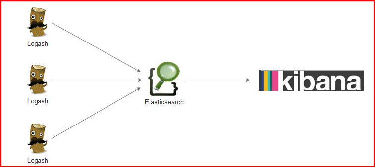

# 40-ElasticSearch

# 1.全文检索的介绍

## 1.1全文检索的需求

首先我们谈几个公司，如雷贯耳的：百度、谷歌、维基百科；这些公司都有一个相似性就是门户网站，可以提供我们通过关键字搜索，然后快速的检索出我们想要的信息；

【网页百度展示】

比如我们检索传智播客，百度后台就会按照这个关键字进行查找（里面有搜索库，以及爬虫库），然后按照权重来进行从上到下的排序，给我们高亮的展示出现

【京东或者淘宝展示】

随便搜索东西，就会高精度的展示我们想要的；就会根据关键词进行海量数据的快速的检索

比如我们查找：”护手霜“ ， 那么这期间内部会经过大体的：1、分词（护手，手霜，护等）2、根据这些词去海量的数据中检索 3、然后根据权重把检索出来的信息进行排序展示给我们

【传统做法】

那么对于一般的公司，初期是没有那么多数据的，所以很多公司更倾向于使用传统的数据库：mysql；比如我们要查找关键字”传智播客“，那么查询的方式大概就是:select * from table where field like ‘%传智播客%’; 但是随着业务发展，数据会不断的膨胀，那么问题就来了；mysql单表查询能力即便经过了优化，它的极限也就是400W左右的数据量。而且还会经常出现查询超时的现象；

然后很多公司开始对数据库进行横向和纵向的扩容，开始进行数据库表的“拆分”：横向拆分和纵向拆分；但是即便这样操作，仍然会出现很多问题，比如：

1、数据库会出现单点故障问题，于是先天主从复制关系，于是增加了运维成本

2、因为对表的拆分，增加了后期维护的难度，同样也是增加了运维成本

3、即便做了大量的维护，但对于大数据的检索操作，依然很慢，完全达不到期望值

于是出现了**lucene**，全文检索的工具。但是lucene对外暴露出的可用接口对于开发人员来说，操作是非常的复杂，而且没有效率的；于是在lucene的基础上进一步的封装，有了一个叫做solr的高性能分布式检索服务框架，但是，solr有一个致命的缺点就是：在建立索引期间，solr的搜索能力会极度下降，这就在一定程度上造成了solr在实时索引上效率并不高；

最后，出现了一个叫做elasticsearch的框架，同样是以lucene为基础，并且吸收了前两代的教训而开发出的分布式多用户能力的全文搜索引擎，并且elasticsearch是基于RESTful web接口进行发布的，那么这就意味着，我们开发人员操作起来更方便快捷；同时es拓展节点方便，可用于存储和检索海量数据，接近实时搜索能力，自动发现节点、副本机制保障可用性

## 1.2 非结构化数据查找方法

1. 顺序扫描法(Serial Scanning) 

   所谓顺序扫描，比如要找内容包含某一个字符串的文件，就是一个文档一个文档的看，对于每一个文档，从头看到尾，如果此文档包含此字符串，则此文档为我们要找的文件，接着看下一个文件，直到扫描完所有的文件。如利用windows的搜索也可以搜索文件内容，只是相当的慢

2. 全文检索(Full-text Search) 

   将非结构化数据中的一部分信息提取出来，重新组织，使其变得有一定结构，然后对此有一定结构的数据进行搜索，从而达到搜索相对较快的目的。这部分**从非结构化数据中提取出的然后重新组织的信息，我们称之索引。**

例如：

字典。字典的拼音表和部首检字表就相当于字典的索引，对每一个字的解释是非结构化的，如果字典没有音节表和部首检字表，在茫茫辞海中找一个字只能顺序扫描。然而字的某些信息可以提取出来进行结构化处理，比如读音，就比较结构化，分声母和韵母，分别只有几种可以一一列举，于是将读音拿出来按一定的顺序排列，每一项读音都指向此字的详细解释的页数。我们搜索时按结构化的拼音搜到读音，然后按其指向的页数，便可找到我们的非结构化数据——也即对字的解释。 

这种**先建立索引，再对索引进行搜索的过程就叫全文检索(Full-text Search)。** 
虽然创建索引的过程也是非常耗时的，但是索引一旦创建就可以多次使用，全文检索主要处理的是查询，所以耗时间创建索引是值得的。

## 1.3 如何实现全文检索

可以使用Lucene实现全文检索。Lucene是apache下的一个开放源代码的全文检索引擎工具包（提供了Jar包，实现全文检索的类库）。它提供了完整的查询引擎和索引引擎，部分文本分析引擎。Lucene的目的是为软件开发人员提供一个简单易用的工具包，以方便地在目标系统中实现全文检索的功能。 
注意：Lucene只是一个引擎，只是一个工具包，如果使用Lucene开发全文检索功能，要记住**Lucene是不能单独运行的**。

## 1.4 Lucene实现全文检索流程


1. 绿色表示索引过程，对要搜索的原始内容进行索引构建一个索引库，索引过程包括

   > 确定原始内容即将要搜索的内容-->采集文档-->创建文档--.分析文档-->索引文档

2. 红色表示搜索过程，从索引库中搜索内容，搜索过程包括：

   > 用户通过搜索界面-->创建查询-->执行搜索，从索引库搜索-->渲染搜索结果

从上面的知识点可以看出，索引和搜索的流程图也可以表示为：


总结：全文检索过程分为索引、搜索两个过程

- 索引
  - 从关系数据库中、互联网上、文件系统采集源数据(要搜索的目标信息)，源数据的来源是很广泛的。
  - 将源数据采集到一个统一的地方，要创建**索引**，将索引创建到一个索引库（文件系统）中，从源数据库中提取关键信息，从关键信息中抽取一个一个**词**，词和源数据是有关联的。也即创建索引时，词和源数据有关联，索引库中记录了这个关联，如果找到了词就说明找到了源数据（http的网页、pdf电子书等……）。
- 搜索
  -  用户执行搜索（全文检索）编写查询关键字。
  -  从索引库中搜索索引，根据**查询关键字搜索索引库中的一个一个词**。
  - 展示搜索的结果。

## 1.5 全文检索框架介绍

市面上全文检索的框架很多，较早期的一个框架就是lucene，基本上所有的全文检索的工作都交给lucene来实现，但是**lucene最大的弊端就是API太原生，没有经过任何封装，不太好使用**。所以后来出现一个叫做solr的框架，它也是基于lucene进行改造封装和包装，将服务端单独提取出来，客户端进行请求即可。

另外一个框架就是大名鼎鼎的elasticsearch了，es也是一个基于lucene打造的全文检索的框架，且一经推出就迅速被市场认可，市场占有率越来越多，现在首选的全文检索的框架基本就是ES了。

# 2. ELK日志协议栈

## 2.1集中式日志系统

日志，对于任何系统来说都是及其重要的组成部分。在计算机系统里面，更是如此。但是由于现在的计算机系统大多比较复杂，很多系统都不是在一个地方，甚至都是跨国界的；即使是在一个地方的系统，也有不同的来源，比如，操作系统，应用服务，业务逻辑等等。他们都在不停产生各种各样的日志数据。根据不完全统计，我们全球每天大约要产生 2EB的数据。

面对如此海量的数据，又是分布在各个不同地方，如果我们需要去查找一些重要的信息，难道还是使用传统的方法，去登陆到一台台机器上查看？看来传统的工具和方法已经显得非常笨拙和低效了。于是，一些聪明人就提出了建立一套集中式的方法，把不同来源的数据集中整合到一个地方。

一个完整的集中式日志系统，是离不开以下几个主要特点的。

- 收集－能够采集多种来源的日志数据
- 传输－能够稳定的把日志数据传输到中央系统
- 存储－如何存储日志数据
- 分析－可以支持 UI 分析
- 警告－能够提供错误报告，监控机制

## 2.2 ELK协议栈介绍及其体系结构



ELK 其实并不是一款软件，而是一整套解决方案，是三个软件产品的首字母缩写，Elasticsearch，Logstash 和 Kibana。这三款软件都是开源软件，通常是配合使用，而且又先后归于 Elastic.co 公司名下，故被简称为 ELK 协议栈。

- ElasticSearch

  ElasticSearch  是一个实时的分布式搜索和分析引擎，它可以用于全文搜索，结构化搜索以及分析。它是一个建立在全文搜索引擎 Apache Lucene 基础上的搜索引擎，使用 Java 语言编写。

  主要特点

  - 实时分析
  - 分布式实时文件存储，并将***\*每一个字段\****都编入索引
  - 文档导向，所有的对象全部是文档
  - 高可用性，易扩展，支持集群（Cluster）、分片和复制（Shards 和 Replicas）
  -  接口友好，支持 JSON

- Logstash

    Logstash 是一个具有实时渠道能力的数据收集引擎。使用 JRuby 语言编写。其作者是世界著名的运维工程师乔丹西塞 (JordanSissel)。

  主要特点：

  - 几乎可以访问任何数据
  - 可以和多种外部应用结合
  - 支持弹性扩展

  它由三个主要部分组成

  - Shipper－发送日志数据
  - Broker－收集数据，缺省内置 Redis
  - Indexer－数据写入

- Kibana

    Kibana 是一款基于 Apache 开源协议，使用 JavaScript 语言编写，为 Elasticsearch 提供分析和可视化的 Web 平台。它可以在 Elasticsearch 的索引中查找，交互数据，并生成各种维度的表图。

## 2.3 ELK整体架构


## 2.4参考文档

ELK官网：https://www.elastic.co/

ELK官网文档：https://www.elastic.co/guide/index.html

ELK中文手册：https://www.elastic.co/guide/cn/elasticsearch/guide/current/index.html

ELK中文社区：https://elasticsearch.cn/

# 3.ElasticSearch介绍

## 3.1 什么是ElasticSearch

Elaticsearch，简称为es， es是一个开源的高扩展的分布式全文检索引擎，它可以近乎实时的存储、检索数据；本身扩展性很好，可以扩展到上百台服务器，处理PB级别的数据。es也使用Java开发并使用Lucene作为其核心来实现所有索引和搜索的功能，但是它的目的是通过简单的RESTful API来隐藏Lucene的复杂性，从而让全文搜索变得简单。

## 3.2 ElasticSearch的使用案例

- 2013年初，GitHub抛弃了Solr，采取ElasticSearch 来做PB级的搜索。 “GitHub使用ElasticSearch搜索20TB的数据，包括13亿文件和1300亿行代码”
- 维基百科：启动以elasticsearch为基础的核心搜索架构
- SoundCloud：“SoundCloud使用ElasticSearch为1.8亿用户提供即时而精准的音乐搜索服务”
- 百度：百度目前广泛使用ElasticSearch作为文本数据分析，采集百度所有服务器上的各类指标数据及用户自定义数据，通过对各种数据进行多维分析展示，辅助定位分析实例异常或业务层面异常。目前覆盖百度内部20多个业务线（包括casio、云分析、网盟、预测、文库、直达号、钱包、风控等），单集群最大100台机器，200个ES节点，每天导入30TB+数据
-  新浪使用ES 分析处理32亿条实时日志
- 阿里使用ES 构建挖财自己的日志采集和分析体系

## 3.3 ElasticSearch对比Solr

- Solr 利用 Zookeeper 进行分布式管理，而 Elasticsearch 自身带有分布式协调管理功能;
- Solr 支持更多格式的数据，而 Elasticsearch 仅支持json文件格式；
- Solr 官方提供的功能更多，而 Elasticsearch 本身更注重于核心功能，高级功能多有第三方插件提供；
- Solr 在传统的搜索应用中表现好于 Elasticsearch，但在处理实时搜索应用时效率明显低于 Elasticsearch

## 3.4 ElasticSearch架构图以及基本概念

### 3.4.1 概述

Elasticsearch是面向文档(document oriented)的，这意味着它可以存储整个对象或文档(document)。然而它不仅仅是存储，还会索引(index)每个文档的内容使之可以被搜索。在Elasticsearch中，你可以对文档（而非成行成列的数据）进行索引、搜索、排序、过滤。

Elasticsearch比传统关系型数据库如下：

- Relational DB -> Databases -> Tables -> Rows -> Columns
- Elasticsearch -> Indices  -> Types  -> Documents -> Fields

### 3.4.2 ES架构模块


Gateway是ES用来存储索引的文件系统，支持多种类型。

Gateway的上层是一个分布式的lucene框架。

Lucene之上是ES的模块，包括：索引模块、搜索模块、映射解析模块等

ES模块之上是 Discovery、Scripting和第三方插件。

Discovery是ES的节点发现模块，不同机器上的ES节点要组成集群需要进行消息通信，集群内部需要选举master节点，这些工作都是由Discovery模块完成。支持多种发现机制，如 Zen 、EC2、gce、Azure。

Scripting用来支持在查询语句中插入javascript、python等脚本语言，scripting模块负责解析这些脚本，使用脚本语句性能稍低。ES也支持多种第三方插件。

再上层是ES的传输模块和JMX.传输模块支持多种传输协议，如 Thrift、memecached、http，默认使用http。JMX是java的管理框架，用来管理ES应用。

最上层是ES提供给用户的接口，可以通过RESTful接口和ES集群进行交互。

### 3.4.3 ElasticSearch核心概念

1. 索引 index

   一个索引就是一个拥有几分相似特征的文档的集合。比如说，你可以有一个客户数据的索引，另一个产品目录的索引，还有一个订单数据的索引。一个索引由一个名字来标识（必须全部是小写字母的），并且当我们要对对应于这个索引中的文档进行索引、搜索、更新和删除的时候，都要使用到这个名字。在一个集群中，可以定义任意多的索引。

2. 类型 type

   在一个索引中，你可以定义一种或多种类型。一个类型是你的索引的一个逻辑上的分类/分区，其语义完全由你来定。通常，会为具有一组共同字段的文档定义一个类型。比如说，我们假设你运营一个博客平台并且将你所有的数据存储到一个索引中。在这个索引中，你可以为用户数据定义一个类型，为博客数据定义另一个类型，当然，也可以为评论数据定义另一个类型。

3. 字段 Field

   相当于是数据表的字段，对文档数据根据不同属性进行的分类标识

4. 映射 mapping

   mapping是处理数据的方式和规则方面做一些限制，如某个字段的数据类型、默认值、分析器、是否被索引等等，这些都是映射里面可以设置的，其它就是处理es里面数据的一些使用规则设置也叫做映射，按着最优规则处理数据对性能提高很大，因此才需要建立映射，并且需要思考如何建立映射才能对性能更好。

5. 文档 document

   一个文档是一个可被索引的基础信息单元。比如，你可以拥有某一个客户的文档，某一个产品的一个文档，当然，也可以拥有某个订单的一个文档。文档以JSON（Javascript Object Notation）格式来表示，而JSON是一个到处存在的互联网数据交互格式。

   在一个index/type里面，你可以存储任意多的文档。注意，尽管一个文档，物理上存在于一个索引之中，文档必须被索引/赋予一个索引的type。

6. 集群 cluster

   一个集群就是由一个或多个节点组织在一起，它们共同持有整个的数据，并一起提供索引和搜索功能。一个集群由一个唯一的名字标识，这个名字默认就是“elasticsearch”。这个名字是重要的，因为一个节点只能通过指定某个集群的名字，来加入这个集群

7. 节点 node

   一个节点是集群中的一个服务器，作为集群的一部分，它存储数据，参与集群的索引和搜索功能。和集群类似，一个节点也是由一个名字来标识的，默认情况下，这个名字是一个随机的漫威漫画角色的名字，这个名字会在启动的时候赋予节点。这个名字对于管理工作来说挺重要的，因为在这个管理过程中，你会去确定网络中的哪些服务器对应于Elasticsearch集群中的哪些节点。

   一个节点可以通过配置集群名称的方式来加入一个指定的集群。默认情况下，每个节点都会被安排加入到一个叫做“elasticsearch”的集群中，这意味着，如果你在你的网络中启动了若干个节点，并假定它们能够相互发现彼此，它们将会自动地形成并加入到一个叫做“elasticsearch”的集群中。

   在一个集群里，只要你想，可以拥有任意多个节点。而且，如果当前你的网络中没有运行任何Elasticsearch节点，这时启动一个节点，会默认创建并加入一个叫做“elasticsearch”的集群。

8. 分片和复制  shards & replicas 

   一个索引可以存储超出单个结点硬件限制的大量数据。比如，一个具有10亿文档的索引占据1TB的磁盘空间，而任一节点都没有这样大的磁盘空间；或者单个节点处理搜索请求，响应太慢。为了解决这个问题，Elasticsearch提供了将索引划分成多份的能力，这些份就叫做分片。当你创建一个索引的时候，你可以指定你想要的分片的数量。每个分片本身也是一个功能完善并且独立的“索引”，这个“索引”可以被放置到集群中的任何节点上。分片很重要，主要有两方面的原因：  1）允许你水平分割/扩展你的内容容量。  2）允许你在分片（潜在地，位于多个节点上）之上进行分布式的、并行的操作，进而提高性能/吞吐量。

   至于一个分片怎样分布，它的文档怎样聚合回搜索请求，是完全由Elasticsearch管理的，对于作为用户的你来说，这些都是透明的。

   在一个网络/云的环境里，失败随时都可能发生，在某个分片/节点不知怎么的就处于离线状态，或者由于任何原因消失了，这种情况下，有一个故障转移机制是非常有用并且是强烈推荐的。为此目的，Elasticsearch允许你创建分片的一份或多份拷贝，这些拷贝叫做复制分片，或者直接叫复制。

   复制之所以重要，有两个主要原因： 在分片/节点失败的情况下，提供了高可用性。因为这个原因，注意到复制分片从不与原/主要（original/primary）分片置于同一节点上是非常重要的。扩展你的搜索量/吞吐量，因为搜索可以在所有的复制上并行运行。总之，每个索引可以被分成多个分片。一个索引也可以被复制0次（意思是没有复制）或多次。一旦复制了，每个索引就有了主分片（作为复制源的原来的分片）和复制分片（主分片的拷贝）之别。分片和复制的数量可以在索引创建的时候指定。在索引创建之后，你可以在任何时候动态地改变复制的数量，但是你事后不能改变分片的数量。

   默认情况下，Elasticsearch中的每个索引被分片5个主分片和1个复制，这意味着，如果你的集群中至少有两个节点，你的索引将会有5个主分片和另外5个复制分片（1个完全拷贝），这样的话每个索引总共就有10个分片。

# 4.ES集群部署

## 4.1 安装 elasticsearch

1. 创建普通用户

   **注意：ES不能使用root用户来启动**，必须使用普通用户来安装启动。这里我们创建一个普通用户以及定义一些常规目录用于存放我们的数据文件以及安装包等

   ```shell
   useradd elasticsearch
   passwd 000000
   ```

2. 添加权限

   为了让普通用户有更大的操作权限，我们一般都会给普通用户设置sudo权限，方便普通用户的操作

   执行命令：visudo，并添加以下内容

   ```shell
   es      ALL=(ALL)       ALL
   ```

3. 上传/下载压缩包并解压至目标目录，并添加用户权限

   ```shell
   wget https://artifacts.elastic.co/downloads/elasticsearch/elasticsearch-6.7.0.tar.gz
   tar -zxf elasticsearch-6.7.0.tar.gz -C /opt/module/
   chown -R elasticsearch /opt/module/elasticsearch-6.7.0
   ```

   执行完这一步的命令后，需要断开并重新连接才可以使设置生效

4. 修改配置文件

   - elasticsearch.yml

     ```shell
     cluster.name: my-application # 此属性每台节点必须要统一
     node.name: bigdata111
     path.data: /opt/module/elasticsearch-6.7.0/datas
     path.logs: /opt/module/elasticsearch-6.7.0/logs
     network.host: 192.168.64.129
     http.port: 9200
     discovery.zen.ping.unicast.hosts: ["bigdata111", "bigdata222", "bigdata333"]
     bootstrap.system_call_filter: false
     bootstrap.memory_lock: false
     http.cors.enabled: true
     http.cors.allow-origin: "*"
     ```

     并在ES安装目录下创建对应的文件夹

     ```shell
     mkdir -p /export/servers/es/elasticsearch-6.7.0/logs
     mkdir -p /export/servers/es/elasticsearch-6.7.0/datas
     ```

   - jvm.option

     修改jvm.option配置文件，调整jvm堆内存大小

     ```shell
     -Xms2g
     -Xmx2g
     ```

5. 分发安装包至其他节点

   ```shell
   scp -r elasticsearch-6.7.0/ bigdata222:$PWD
   scp -r elasticsearch-6.7.0/ bigdata333:$PWD
   ```

   注意：分发完后，需要在每台节点给elasticsearch添加用户权限

   ```shell
   chown -R elasticsearch /opt/module/elasticsearch-6.7.0
   ```

6. 其他节点修改配置文件

   vim  elasticsearch.yml

   ```shell
   node.name: bigdata222  # 主机名
   network.host: 192.168.64.130 # IP地址
   ```

   根据每台节点的情况进行配置

7. 修改系统配置，解决启动问题（三台）

   由于现在使用普通用户来安装es服务，且es服务对服务器的资源要求比较多，包括内存大小，线程数等。所以我们需要给普通用户解开资源的束缚

   - 普通用户打开文件的最大数限制

     ```
     问题错误信息描述：
     max file descriptors [4096] for elasticsearch process likely too low, increase to at least [65536]
     ```

     ES因为需要大量的创建索引文件，需要大量的打开系统的文件，所以我们需要解除linux系统当中打开文件最大数目的限制，不然ES启动就会抛错

     sudo vi /etc/security/limits.conf， 添加以下内容

     ```shell
     * soft nofile 65536
     * hard nofile 131072
     * soft nproc 2048
     * hard nproc 4096
     ```

     注意，星号不要去掉了

   - 普通用户启动线程数限制

     ```shell
     问题错误信息描述
     max number of threads [1024] for user [es] likely too low, increase to at least [4096]
     ```

     修改普通用户可以创建的最大线程数

     原因：无法创建本地线程问题,用户最大可创建线程数太小
     解决方案：修改90-nproc.conf 配置文件。

     sudo vi /etc/security/limits.d/90-nproc.conf

     ```shell
     * soft nproc 1024
     #修改为
     * soft nproc 4096
     ```

   - 普通用户调大虚拟内存

     ```shell
     错误信息描述：
     max virtual memory areas vm.max_map_count [65530] likely too low, increase to at least [262144]
     ```

     调大系统的虚拟内存

     原因：最大虚拟内存太小

     vim /etc/sysctl.conf

     ```shell
     vm.max_map_count=655360
     ```

     ```shell
     sudo sysctl -p
     ```

   以上三个问题解决完成之后，重新连接secureCRT或者重新连接xshell生效 
   需要保存、退出、重新登录xshell才可生效。

8. 启动ES服务

   ```shell
   nohup /opt/module/elasticsearch-6.7.0/bin/elasticsearch 2>&1 &
   ```

   启动成功之后jsp即可看到es的服务进程，并且访问页面

   http://node01:9200/?pretty

   能够看到es启动之后的一些信息

   注意：如果哪一台机器服务启动失败，那么就到哪一台机器的logs下查看日志

## 4.2 安装 elasticsearch-head插件

由于es服务启动之后，访问界面比较丑陋，为了更好的查看索引库当中的信息，我们可以通过安装elasticsearch-head这个插件来实现，这个插件可以更方便快捷的看到es的管理界面

**说明：**如果有谷歌浏览器，可以直接搜索elasticsearch-head进行安装也可以，或者离线安装准备好的elasticsearch-head插件同样可行，也就无需再服务器内部在安装一遍了

以下所有内容仅在一台服务器上安装即可

1. 安装nodejs

   Node.js是一个基于 Chrome V8 引擎的 JavaScript 运行环境。

   Node.js是一个Javascript运行环境(runtime environment)，发布于2009年5月，由Ryan Dahl开发，实质是对Chrome V8引擎进行了封装。Node.js 不是一个 JavaScript 框架，不同于CakePHP、Django、Rails。Node.js 更不是浏览器端的库，不能与 jQuery、ExtJS 相提并论。Node.js 是一个让 JavaScript 运行在服务端的开发平台，它让 JavaScript 成为与PHP、Python、Perl、Ruby 等服务端语言平起平坐的脚本语言。

   下载/上传安装包，并解压至目标目录

   ```shell
   wget https://npm.taobao.org/mirrors/node/v8.1.0/node-v8.1.0-linux-x64.tar.gz
   tar -zxvf node-v8.1.0-linux-x64.tar.gz -C /opt/module
   ```

2. 创建软连接

   ```shell
   sudo ln -s /opt/module/node-v8.1.0-linux-x64/lib/node_modules/npm/bin/npm-cli.js /usr/local/bin/npm
   sudo ln -s /opt/module/node-v8.1.0-linux-x64/bin/node /usr/local/bin/node
   ```

3. 修改环境变量

   sudo vim /etc/profile

   ```shell
   export NODE_HOME=/opt/module/node-v8.1.0-linux-x64
   export PATH=:$PATH:$NODE_HOME/bin
   ```

   source /etc/profile

4. 验证

   ```shell
   node -v
   npm -v
   ```

开始安装elasticsearch-head插件

elasticsearch-head这个插件是es提供的一个用于图形化界面查看的一个插件工具，可以安装上这个插件之后，通过这个插件来实现我们通过浏览器查看es当中的数据

安装elasticsearch-head这个插件这里提供两种方式进行安装，

第一种方式就是自己下载源码包进行编译，耗时比较长，网络较差的情况下，基本上不可能安装成功（不推荐，这里就不在演示）

第二种方式就是直接使用我已经编译好的安装包，进行修改配置即可

1. 上传编译之后的源码包并解压至目标目录

   ```shell
   tar -zxvf elasticsearch-head-compile-after.tar.gz -C /opt/module
   ```

2. 修改配置文件Gruntfile.js

   ```json
   connect: {
           server: {
               options: {
                  hostname: '192.168.64.129',  # 修改这一行的IP
                  port: 9100,
                  base: '.',
                  keepalive: true
                }
           }
   }
   ```

3. 修改app.js

   

   ```
   更改前：http://localhost:9200
   更改后：http://bigdata111:9200
   ```

4. 启动head服务

   ```shell
   cd /opt/module/elasticsearch-head/node_modules/grunt/bin/
   # 前台启动
   ./grunt server
   # 后台启动
   nohup ./grunt server >/dev/null 2>&1 &
   ```

5. 停止elasticsearch-head进程

   ```shell
   执行以下命令找到elasticsearch-head的进程，然后使用kill -9杀死进程即可
   netstat -nltp | grep 9100
   ```

6. 打开elasticsearch-head界面

   ```shell
   http://192.168.64.129:9100/
   ```

## 4.3 安装kibana

kibana的基本介绍

Kibana是一个开源的分析和可视化平台，设计用于和Elasticsearch一起工作。

你用Kibana来搜索，查看，并和存储在Elasticsearch索引中的数据进行交互。

你可以轻松地执行高级数据分析，并且以各种图标、表格和地图的形式可视化数据。

Kibana使得理解大量数据变得很容易。它简单的、基于浏览器的界面使你能够快速创建和共享动态仪表板，实时显示Elasticsearch查询的变化。

接着使用我们的es用户在bigdata111服务器上面来实现我们的kibana的安装部署

**注：以下安装仍然只需要在一台服务器上部署即可**

1. 上传/下载至服务器，并解压

   ```shell
   wget https://artifacts.elastic.co/downloads/kibana/kibana-6.7.0-linux-x86_64.tar.gz
   tar -zxf kibana-6.7.0-linux-x86_64.tar.gz -C /opt/module/
   ```

2. 修改配置文件

   vi kibana.yml

   ```shell
   server.host: "bigdata111"
   elasticsearch.hosts: ["http://bigdata111:9200"]
   ```

3. 启动服务

   node01服务器使用es用户执行以下命令启动kibana服务

   **普通用户貌似没法启动kibana，需要切换到root**

   ```
   nohup bin/kibana >/dev/null 2>&1 &
   ```

4. 停止kibana服务进程

   查看进程号

   ```
   ps -ef | grep node
   ```

   然后使用kill -9杀死进程即可

5. 浏览器访问

   ```
   http://bigdata111:5601
   ```

# 5.使用kibana管理索引

curl是利用URL语法在命令行方式下工作的开源文件传输工具，使用curl可以简单实现常见的get/post请求。简单的认为是可以在命令行下面访问url的一个工具。在centos的默认库里面是有curl工具的，如果没有请yum安装即可。

curl

- -X 指定http的请求方法 有HEAD GET POST PUT DELETE
- -d 指定要传输的数据
- -H 指定http请求头信息

## 5.1 使用Xput创建索引

### 5.1.1.创建索引

在我们的kibana的dev tools当中执行以下语句


kibana中使用如下命令

```shell
# 查询文档
GET /blog01/article/1
GET /blog01/article/1?pretty

# 更新数据
PUT /blog01/article/1 
{"id": "1", "title": " What is ddd"}

# 搜索数据
GET /blog01/article/_search?q=title:ddd

# 删除单个
DELETE /blog01/article/1
# 删除整个索引
DELETE /blog01
```

以下命令则是直接在服务器任意路径下直接执行即可，如：

```
[root@bigdata111 ~]# curl -XPUT http://bigdata111:9200/blog01/?pretty
```

### 5.1.2 插入文档

前面的命令使用 PUT 动词将一个文档添加到 /article(文档类型)，并为该文档分配 ID 为1。URL 路径显示为index/doctype/ID（索引/文档类型/ID）。

```shell
curl -XPUT http://bigdata111:9200/blog01/article/1?pretty -d  '{"id": "1", "title": "What is lucene"}'
```

执行该命令一般会出现问题：

```shell
Content-Type header [application/x-www-form-urlencoded] is not supported
```

原因：

此原因时由于ES增加了安全机制， 进行严格的内容类型检查，严格检查内容类型也可以作为防止跨站点请求伪造攻击的一层保护。

解决方法：

```shell
curl -XPUT http://bigdata111:9200/blog01/article/1?pretty -d  '{"id": "1", "title": "What is lucene"}' -H "Content-Type: application/json"
```

### 5.1.3 查询文档

```shell
curl -XGET http://bigdata111:9200/blog01/article/1?pretty -H "Content-Type: application/json"
```

**article/1**就是在指定id，不指定会自动生成uuid，该属性相同则此ID表示的数据相同

### 5.1.4 更新文档

```shell
curl -XPUT http://bigdata111:9200/blog01/article/1?pretty -d  '{"id": "1", "title": " What is elasticsearch"}' -H "Content-Type: application/json"
```

### 5.1.5 搜索文档

```shell
curl -XGET "http://bigdata111:9200/blog01/article/_search?q=title:'elasticsearch'&pretty" -H "Content-Type: application/json"
```

### 5.1.6 删除文档

```shell
curl -XDELETE "http://bigdata111:9200/blog01/article/1?pretty"
```

### 5.1.7 删除索引

```shell
curl -XDELETE http://bigdata111:9200/blog01?pretty
```

## 5.2 返回值说明

1. Hits

   返回结果中最重要的部分是 hits ，它包含 total 字段来表示匹配到的文档总数，并且一个 hits 数组包含所查询结果的前十个文档。
   在 hits 数组中每个结果包含文档的 _index 、 _type 、 _id ，加上 _source 字段。这意味着我们可以直接从返回的搜索结果中使用整个文档。这不像其他的搜索引擎，仅仅返回文档的ID，需要你单独去获取文档。
   每个结果还有一个 _score ，它衡量了文档与查询的匹配程度。默认情况下，首先返回最相关的文档结果，就是说，返回的文档是按照 _score 降序排列的。在这个例子中，我们没有指定任何查询，故所有的文档具有相同的相关性，因此对所有的结果而言 1 是中性的 _score 。
   max_score 值是与查询所匹配文档的 _score 的最大值。

2. took

   took 值告诉我们执行整个搜索请求耗费了多少毫秒

3. Shard

   _shards 部分 告诉我们在查询中参与分片的总数，以及这些分片成功了多少个失败了多少个。正常情况下我们不希望分片失败，但是分片失败是可能发生的。
   如果我们遭遇到一种灾难级别的故障，在这个故障中丢失了相同分片的原始数据和副本，那么对这个分片将没有可用副本来对搜索请求作出响应。假若这样，Elasticsearch 将报告这个分片是失败的，但是会继续返回剩余分片的结果。

4. timeout

   timed_out 值告诉我们查询是否超时。默认情况下，搜索请求不会超时。 如果低响应时间比完成结果更重要，你可以指定 timeout 为 10 或者 10ms（10毫秒），或者 1s（1秒）：
   GET /_search?timeout=10ms
   在请求超时之前，Elasticsearch 将会返回已经成功从每个分片获取的结果。

## 5.3 花式查询

在kibana提供的界面上进行操作。

先插入一批数据，方便我们后续查询

```json
POST /school/student/_bulk
{ "index": { "_id": 1 }}
{ "name" : "liubei", "age" : 20 , "sex": "boy", "birth": "1996-01-02" , "about": "i like diaocan he girl" }
{ "index": { "_id": 2 }}
{ "name" : "guanyu", "age" : 21 , "sex": "boy", "birth": "1995-01-02" , "about": "i like diaocan" }
{ "index": { "_id": 3 }}
{ "name" : "zhangfei", "age" : 18 , "sex": "boy", "birth": "1998-01-02" , "about": "i like travel" }
{ "index": { "_id": 4 }}
{ "name" : "diaocan", "age" : 20 , "sex": "girl", "birth": "1996-01-02" , "about": "i like travel and sport" }
{ "index": { "_id": 5 }}
{ "name" : "panjinlian", "age" : 25 , "sex": "girl", "birth": "1991-01-02" , "about": "i like travel and wusong" }
{ "index": { "_id": 6 }}
{ "name" : "caocao", "age" : 30 , "sex": "boy", "birth": "1988-01-02" , "about": "i like xiaoqiao" }
{ "index": { "_id": 7 }}
{ "name" : "zhaoyun", "age" : 31 , "sex": "boy", "birth": "1997-01-02" , "about": "i like travel and music" }
{ "index": { "_id": 8 }}
{ "name" : "xiaoqiao", "age" : 18 , "sex": "girl", "birth": "1998-01-02" , "about": "i like caocao" }
{ "index": { "_id": 9 }}
{ "name" : "daqiao", "age" : 20 , "sex": "girl", "birth": "1996-01-02" , "about": "i like travel and history" }
```

### 5.3.1 使用match_all做查询

```json
GET /school/student/_search?pretty
{
    "query": {
        "match_all": {}
    }
}
```

**问题：**通过match_all匹配后，会把所有的数据检索出来，但是往往真正的业务需求并非要找全部的数据，而是检索出自己想要的；并且对于es集群来说，直接检索全部的数据，很容易造成GC现象。所以，我们要学会如何进行高效的检索数据

### 5.3.2 通过关键字段进行查询

```json
GET /school/student/_search?pretty
{
    "query": {
         "match": {"about": "travel"}
     }
}
```

如果此时想查询**喜欢旅游的，并且不能是男孩的**，怎么办？

【这种方式是错误的，因为一个match下，不能出现多个字段值[match] query doesn't support multiple fields】，需要使用复合查询


### 5.3.3 bool的复合查询

当出现多个查询语句组合的时候，可以用bool来包含。bool合并聚包含：must，must_not或者should， should表示or的意思

例子：查询非男性中喜欢旅行的人

```shell
GET /school/student/_search?pretty
{
"query": {
   "bool": {
      "must": { "match": {"about": "travel"}},
      "must_not": {"match": {"sex": "boy"}}
     }
  }
}
```

### 5.3.4 bool的复合查询中的should

should表示可有可无的（如果should匹配到了就展示，否则就不展示）

例子：

查询喜欢旅行的，如果有男性的则显示，否则不显示

```shell
GET /school/student/_search?pretty
{
"query": {
   "bool": {
      "must": { "match": {"about": "travel"}},
      "should": {"match": {"sex": "boy"}}         
     }
  }
}
```

### 5.3.5 term匹配

使用term进行精确匹配（比如数字，日期，布尔值或 not_analyzed的字符串(未经分析的文本数据类型)）

语法

```
{ "term": { "age": 20 }}
{ "term": { "date": "2018-04-01" }}
{ "term": { "sex": “boy” }}
{ "term": { "about": "trivel" }}
```

例子：

查询喜欢旅行的

```json
GET /school/student/_search?pretty
{
"query": {
   "bool": {
      "must": { "term": {"about": "travel"}},
      "should": {"term": {"sex": "boy"}}         
     }}
}
```

### 5.3.6 使用terms匹配多个值

```shell
GET /school/student/_search?pretty
{
"query": {
   "bool": {
      "must": { "terms": {"about": ["travel","history"]}}          
     }
  }
}
```

term主要是用于精确的过滤比如说：”我爱你”

在match下面匹配可以为包含：我、爱、你、我爱等等的解析器

在term语法下面就精准匹配到：”我爱你”

### 5.3.7 Range过滤

Range过滤允许我们按照指定的范围查找一些数据：操作范围：gt::大于，gae::大于等于,lt::小于，lte::小于等于

例子：

查找出大于20岁，小于等于25岁的学生

```shell
GET /school/student/_search?pretty
{
"query": {
   "range": {
    "age": {"gt":20,"lte":25}
         }
      }
}
```

### 5.3.8  exists和 missing过滤

exists和missing过滤可以找到文档中是否包含某个字段或者是没有某个字段

例子：

查找字段中包含age的文档

```json
GET /school/student/_search?pretty
{
"query": {
   "exists": {
    "field": "age"  
         }
      }
}
```

### 5.3.9 bool的多条件过滤

用bool也可以像之前match一样来过滤多行条件：

- must :: 多个查询条件的完全匹配,相当于 and 。
- must_not :: 多个查询条件的相反匹配，相当于 not 。
- should :: 至少有一个查询条件匹配, 相当于 or

例子：

过滤出about字段包含travel并且年龄大于20岁小于30岁的同学

```json
GET /school/student/_search?pretty
{
  "query": {
    "bool": {
      "must": [
        {"term": {
          "about": {
            "value": "travel"
          }
        }},{"range": {
          "age": {
            "gte": 20,
            "lte": 30
          }
        }}
      ]
    }
  }
}
```

### 5.3.10 查询与过滤条件合并

通常复杂的查询语句，我们也要配合过滤语句来实现缓存，用filter语句就可以来实现

例子：

查询出喜欢旅行的，并且年龄是20岁的文档

```json
GET /school/student/_search?pretty
{
  "query": {
   "bool": {
     "must": {"match": {"about": "travel"}},     
     "filter": [{"term":{"age": 20}}]
     }
  }
}
```

## 5.4 索引映射（mappings）管理

### 5.4.1 为什么要映射

elasticsearch中的文档等价于java中的对象，那么在java对象中有字段（比如string、int、long等），同理在elasticsearch索引中的具体字段也是有类型的。

```json
PUT /document/article/1
{
  "title" : "elasticsearchshi是是什么",
  "author" : "zhangsan",
  "titleScore" : 60
}
```

这种操作并没有指定字段类型，那么elasticsearch会自动根据数据类型的格式识别字段的类型；查看索引字段类型：GET /document/article/_mapping。可以发现titleScore的类型是long。


然后在插入一条数据：

```json
PUT /document/article/2
{
  "title" : "elasticsearchshi是是什么",
  "author" : "zhangsan",
  "titleScore" : 66.666
}
```

查询数据：GET /document/article/2

**我们会发现es能存入，并没有报错（注意），这其实是一个问题**，因为如果后期elaticsearch对接java的时候，我们会写一个类对数据做封装，比如：

```java
class Article{
private String title;
private String author;
private String titleScore  //《什么类型合适》？如果使用long类型，那么后面肯定会有数据格式转换的异常 doublelong
}
```

**所以，我们如果能提前知道字段类型，那么最好使用mapping的映射管理，提前指定字段的类型，防止后续的程序问题；** 

```json
DELETE  document
PUT document
{
  "mappings": {
    "article" : {
      "properties":
      {
        "title" : {"type": "text"} , 
        "author" : {"type": "text"} , 
        "titleScore" : {"type": "double"} 
        
      }
    }
  }
}
get document/article/_mapping
```

### 5.4.2 基本命令

```shell
DELETE school
PUT school
{
  "mappings": {
    "logs" : {
      "properties": {"messages" : {"type": "text"}}
    }
  }
}
```

添加索引：school，文档类型类logs，索引字段为message ，字段的类型为text

```
GET /school/_mapping/logs
```


 继续添加字段

```shell
POST /school/_mapping/logs
{
  "properties": {"number" : {"type": "text"}}
}

GET /school/_mapping/logs
```


### 5.4.3 获取映射字段

语法：

GET /{index}/_mapping/{type}/field/{field}

```
GET /school/_mapping/logs/field/number
```


## 5.5 索引配置库管理（settings）

### 5.5.1 索引库配置

**所谓的settings就是用来修改索引分片和副本数的；**

比如有的重要索引，副本数很少甚至没有副本，那么我们可以通过setting来添加副本数

```shell
DELETE document
PUT document
{
  "mappings": {
    "article" : {
      "properties":
      {
        "title" : {"type": "text"} , 
        "author" : {"type": "text"} , 
        "titleScore" : {"type": "double"} 
        
      }
    }
  }
}
GET /document/_settings
```


可以看到当前的副本数是1，那么为了提高容错性，我们可以把副本数改成2：

```shell
PUT /document/_settings
{
  "number_of_replicas": 2
}
```


**副本可以改，分片不能改**

```shell
PUT /document/_settings
{
  "number_of_shards": 3
}
```


### 5.5.3 零停机重新索引数据

实际生产，对于文档的操作，偶尔会遇到这种问题：

某一个字段的类型不符合后期的业务了，但是当前的索引已经创建了，我们知道es在字段的mapping建立后就不可再次修改mapping的值。

1. 新建索引库articles1，并添加数据

   ```json
   DELETE articles1
   PUT articles1
   {  
       "settings":{  
            "number_of_shards":3,  
            "number_of_replicas":1  
       },  
       "mappings":{  
            "article":{  
                "dynamic":"strict",  
                "properties":{  
                    "id":{"type": "text", "store": true},  
                    "title":{"type": "text","store": true}, 
                    "readCounts":{"type": "integer","store": true},  
                    "times": {"type": "text", "index": false}
                }  
            }  
       }  
   }
   
   
   PUT articles1/article/1
   {
     "id" : "1",
     "title" : "世界1",
     "readCounts" : 2 , 
     "times" : "2018-05-01"
   }
   
   get articles1/article/1
   ```

2. 新建索引库articles2

   ```shell
   DELETE articles2
   PUT articles2
   {  
       "settings":{  
            "number_of_shards":5,  
            "number_of_replicas":1  
       },  
       "mappings":{  
            "article":{  
                "dynamic":"strict",  
                "properties":{  
                    "id":{"type": "text", "store": true},  
                    "title":{"type": "text","store": true}, 
                    "readCounts":{"type": "integer","store": true},  
                    "times": {"type": "date", "index": false}
                }  
            }  
       }  
   }  
   
   
   GET articles2/article/1
   ```

3. 拷贝数据并验证

   ```shell
   POST _reindex
   {
     "source": {
       "index": "articles1"
     },
     "dest": {
       "index": "articles2"
     }
   }
   
   GET articles2/article/1
   ```

## 5.6 分页解决方案

### 5.6.1 导入数据

```json
DELETE us
POST /_bulk
{ "create": { "_index": "us", "_type": "tweet", "_id": "1" }}
{ "email" : "john@smith.com", "name" : "John Smith", "username" : "@john" }
{ "create": { "_index": "us", "_type": "tweet", "_id": "2" }}
{ "email" : "mary@jones.com", "name" : "Mary Jones", "username" : "@mary" }
{ "create": { "_index": "us", "_type": "tweet", "_id": "3" }}
{ "date" : "2014-09-13", "name" : "Mary Jones", "tweet" : "Elasticsearch means full text search has never been so easy", "user_id" : 2 }
{ "create": { "_index": "us", "_type": "tweet", "_id": "4" }}
{ "date" : "2014-09-14", "name" : "John Smith", "tweet" : "@mary it is not just text, it does everything", "user_id" : 1 }
{ "create": { "_index": "us", "_type": "tweet", "_id": "5" }}
{ "date" : "2014-09-15", "name" : "Mary Jones", "tweet" : "However did I manage before Elasticsearch?", "user_id" : 2 }
{ "create": { "_index": "us", "_type": "tweet", "_id": "6" }}
{ "date" : "2014-09-16", "name" : "John Smith",  "tweet" : "The Elasticsearch API is really easy to use", "user_id" : 1 }
{ "create": { "_index": "us", "_type": "tweet", "_id": "7" }}
{ "date" : "2014-09-17", "name" : "Mary Jones", "tweet" : "The Query DSL is really powerful and flexible", "user_id" : 2 }
{ "create": { "_index": "us", "_type": "tweet", "_id": "8" }}
{ "date" : "2014-09-18", "name" : "John Smith", "user_id" : 1 }
{ "create": { "_index": "us", "_type": "tweet", "_id": "9" }}
{ "date" : "2014-09-19", "name" : "Mary Jones", "tweet" : "Geo-location aggregations are really cool", "user_id" : 2 }
{ "create": { "_index": "us", "_type": "tweet", "_id": "10" }}
{ "date" : "2014-09-20", "name" : "John Smith", "tweet" : "Elasticsearch surely is one of the hottest new NoSQL products", "user_id" : 1 }
{ "create": { "_index": "us", "_type": "tweet", "_id": "11" }}
{ "date" : "2014-09-21", "name" : "Mary Jones", "tweet" : "Elasticsearch is built for the cloud, easy to scale", "user_id" : 2 }
{ "create": { "_index": "us", "_type": "tweet", "_id": "12" }}
{ "date" : "2014-09-22", "name" : "John Smith", "tweet" : "Elasticsearch and I have left the honeymoon stage, and I still love her.", "user_id" : 1 }
{ "create": { "_index": "us", "_type": "tweet", "_id": "13" }}
{ "date" : "2014-09-23", "name" : "Mary Jones", "tweet" : "So yes, I am an Elasticsearch fanboy", "user_id" : 2 }
{ "create": { "_index": "us", "_type": "tweet", "_id": "14" }}
{ "date" : "2014-09-24", "name" : "John Smith", "tweet" : "How many more cheesy tweets do I have to write?", "user_id" : 1 }
```

### 5.6.2 size+from浅分页

按照一般的查询流程来说，如果我想查询前10条数据：

- 客户端请求发给某个节点
- 节点转发给个个分片，查询每个分片上的前10条
- 结果返回给节点，整合数据，提取前10条
- 返回给请求客户端

**from定义了目标数据的偏移值，size定义当前返回的事件数目**

```json
GET /us/_search?pretty
{
  "from" : 0 , "size" : 5
}

GET /us/_search?pretty
{
  "from" : 5 , "size" : 5
}
```

这种浅分页只适合少量数据，因为随from增大，查询的时间就会越大，而且数据量越大，查询的效率指数下降

- 优点：from+size在数据量不大的情况下，效率比较高

- 缺点：在数据量非常大的情况下，from+size分页会把全部记录加载到内存中，这样做不但运行速递特别慢，而且容易让es出现内存不足而挂掉

### 5.6.3 scroll深分页

对于上面介绍的浅分页，当Elasticsearch响应请求时，它必须确定docs的顺序，排列响应结果。

如果请求的页数较少（假设每页20个docs）, Elasticsearch不会有什么问题，但是如果页数较大时，比如请求第20页，Elasticsearch不得不取出第1页到第20页的所有docs，再去除第1页到第19页的docs，得到第20页的docs。

解决的方式就是使用scroll，**scroll就是维护了当前索引段的一份快照信息--缓存**（这个快照信息是你执行这个scroll查询时的快照）。

可以把 scroll 分为初始化和遍历两步：

1. 初始化时将所有符合搜索条件的搜索结果缓存起来，可以想象成快照；

   ```
   GET us/_search?scroll=3m
   { 
   "query": {"match_all": {}},
    "size": 3
   }
   ```

   初始化的时候就像是普通的search一样

   其中的scroll=3m代表当前查询的数据缓存3分钟

   Size：3 代表当前查询3条数据

2. 遍历时，从这个快照里取数据；

   在遍历时候，拿到上一次遍历中的 scroll id，然后带scroll参数，重复上一次的遍历步骤，知道返回的数据为空，就表示遍历完成

   ```
   GET /_search/scroll
   {
     "scroll" : "1m",
     "scroll_id" : "DnF1ZXJ5VGhlbkZldGNoBQAAAAAAAAPXFk0xN1BmSnlVUldhYThEdWVzZ19xbkEAAAAAAAAAIxZuQWVJU0VSZ1JzcVZtMGVYZ3RDaFlBAAAAAAAAA9oWTVZOdHJ2cXBSOU9wN3c1dk5vcWd4QQAAAAAAAAPYFk0xN1BmSnlVUldhYThEdWVzZ19xbkEAAAAAAAAAIhZuQWVJU0VSZ1JzcVZtMGVYZ3RDaFlB"
   }
   ```

   【注意】：每次都要传参数scroll，刷新搜索结果的缓存时间，另外不需要指定index和type（**不要把缓存的时时间设置太长，占用内存**）

**对比**

浅分页，每次查询都会去索引库（本地文件夹）中查询pageNum*page条数据，然后截取掉前面的数据，留下最后的数据。 这样的操作在每个分片上都会执行，最后会将多个分片的数据合并到一起，再次排序，截取需要的。

深分页，可以一次性将所有满足查询条件的数据，都放到内存中。分页的时候，在内存中查询。相对浅分页，就可以避免多次读取磁盘。

# 6. 安装IK分词器

我们在搜索的时候，都会对数据进行分词，英文的分词很简单，我们可以直接按照空格进行切分即可，但是中文的分词太过复杂，例如：夏天太热，能穿多少穿多少，冬天太冷，能穿多少穿多少。下雨地滑，还好我一把把车把把住了，才没有摔倒。人要是行，干一行行一行，一行行行行行等等的分词都是非常麻烦的，所以针对中文的分词，专门出了一个叫做IK的分词器来解决对中文的分词问题。

**每台机器都要配置**，配置完成之后，需要重启ES服务

## 6.1 安装

1. 上传/下载并解压至目录

   ```shell
   wget https://github.com/medcl/elasticsearch-analysis-ik/releases/download/v6.7.0/elasticsearch-analysis-ik-6.7.0.zip
   
   mkdir /opt/module/elasticsearch-6.7.0/plugins/ik/
   
   # 注意，要解压在plugins下我们创建的文件夹下才可以，不然ik用不了
   unzip elasticsearch-analysis-ik-6.0.0.zip -d /opt/module/elasticsearch-6.0.0/plugins/ik/
   ```

2. 分发安装包

   ```shell
   scp -r ik/ bigdata222:$PWD
   scp -r ik/ bigdata333:$PWD
   ```

三台机器都配置完成
配置完成之后，需要重启ES服务，直接kill掉ES进程即可

## 6.2 配置

```shell
delete iktest
PUT /iktest?pretty
{
    "settings" : {
        "analysis" : {
            "analyzer" : {
                "ik" : {
                    "tokenizer" : "ik_max_word"
                }
            }
        }
    },
    "mappings" : {
        "article" : {
            "dynamic" : true,
            "properties" : {
                "subject" : {
                    "type" : "text",
                    "analyzer" : "ik_max_word"
                }
            }
        }
    }
}
```

说明：ik带有两个分词器:

- ikmaxword ：会将文本做最细粒度的拆分；尽可能多的拆分出词语
  - 句子：我爱我的祖国
  - 结果： 我|爱|我的|祖|国|祖国
- ik_smart：会做最粗粒度的拆分；已被分出的词语将不会再次被其它词语占有
  - 句子：我爱我的祖国
  - 结果： 我|爱|我|的|祖国

## 6.3 测试

先简单看看分词效果

```shell
 GET _analyze?pretty
  {
    "analyzer": "ik_max_word",
    "text": "希拉里是个妹子"
  }
```

插入测试数据

```shell
POST /iktest/article/_bulk?pretty
{ "index" : { "_id" : "1" } }
{"subject" : "＂闺蜜＂崔顺实被韩检方传唤 韩总统府促彻查真相" }
{ "index" : { "_id" : "2" } }
{"subject" : "韩举行＂护国训练＂ 青瓦台:决不许国家安全出问题" }
{ "index" : { "_id" : "3" } }
{"subject" : "媒体称FBI已经取得搜查令 检视希拉里电邮" }
{ "index" : { "_id" : "4" } }
{"subject" : "村上春树获安徒生奖 演讲中谈及欧洲排外问题" }
{ "index" : { "_id" : "5" } }
{"subject" : "希拉里团队炮轰FBI 参院民主党领袖批其”违法”" }
```

查看分词器

对"希拉里和韩国"进行分词查询

ikmaxword分词后的效果：希|拉|里|希拉里|和|韩国

```shell
POST /iktest/article/_search?pretty
{
    "query" : { "match" : { "subject" : "希拉里和韩国" }},
    "highlight" : {
        "pre_tags" : ["<font color=red>"],
        "post_tags" : ["</font>"],
        "fields" : {
            "subject" : {}
        }
    }
}
```

## 6.4 热词更新

查看分词效果

```shell
  GET _analyze?pretty
  {
    "analyzer": "ik_max_word",
    "text": "传智播客在哪里"
  }
```

### 6.4.1 配置tomcat


安装tomcat到bigdata222机器上即可

1. 解压tomcat至目标目录

   ```
   tar -zxvf apache-tomcat-8.5.34.tar.gz -C /opt/module
   ```

2. 配置tomcat

   ```
   cd /opt/module/apache-tomcat-8.5.34/webapps/ROOT/
   vi hot.dic 
   
   # 里面可以任意添加你想要看到的词，比如
   传智播客
   ```

3. 启动tomcat

   ```
   bin/startup.sh 
   ```

4. 浏览器访问

   ```
   http://bigdata222:8080/hot.dic
   ```

### 6.4.2 配置ES

1. 修改ES配置文件

   ```shell
   cd /opt/module/elasticsearch-6.0.0/plugins/analysis-ik/config
   
   vim IKAnalyzer.cfg.xml
   
   # 添加如下内容
   <entry key="remote_ext_dict">http://node03:8080/hot.dic</entry>
   ```

   **热词更新这里建议用完就把这行代码注释掉，不然以后如果没有在启动这个端口会持续性报一个无法连接的错误，但是却不影响elasticsearch的正常运行**

2. 修改完成以后scp至其他节点

   ```shell
   sudo scp IKAnalyzer.cfg.xml  bigdata222:$PWD
   sudo scp IKAnalyzer.cfg.xml  bigdata333:$PWD
   ```

3. 三台机器修改JDK权限

   ```shell
   cd /opt/module/jdk1.8.0_141/jre/lib/security
   sudo vim java.policy
   
   # 添加如下配置，IP是配置了tomcat节点的IP地址
    permission java.net.SocketPermission "192.168.64.130:8080","accept";
    permission java.net.SocketPermission "192.168.64.130:8080","listen";
    permission java.net.SocketPermission "192.168.64.130:8080","resolve";
    permission java.net.SocketPermission "192.168.64.130:8080","connect";
   ```

   修改完成之后拷贝到第二台和第三台机器

   ```shell
   sudo scp java.policy  bigdata111:$PWD
   sudo scp java.policy  bigdata333:$PWD
   ```

4. 三台机器重新启动es服务，三台机器先使用kill -9杀死es的服务，然后再执行以下命令进行重启

   ```shell
   nohup bin/elasticsearch >/dev/null 2>&1 &
   ```

5. 查看我们的分词过程

   ```
     GET _analyze?pretty
     {
       "analyzer": "ik_max_word",
       "text": "传智播客在哪里"
     }
   ```

# 7. 分片交互过程

## 7.1 创建索引


首先：发送一个索引或者删除的请求给node1

其次：node1介绍到请求之后，会根据请求中携带的参数“文档id”判断出该文档应该存储在具体哪一个shard中

**shard = hash(routing) % number of primary_shards**

，比如shard0；其次就是node1通过元数据信息可以知道shard0在具体哪一个节点，于是node1会把请求转发给node3

最后：node3接收到请求之后会将请求并行的分发给shard0的所有replica shard之上，也就是存在于node 1和node 2中的replica shard；如果所有的replica shard都成功地执行了请求，那么将会向node 3回复一个成功确认，当node 3收到了所有replica shard的确认信息后，则最后向用户返回一个Success的消息。

## 7.2 删除索引


该过程可以分为四个阶段来描述：

- 阶段1：客户端向node 1发送一个文档删除的请求。

- 阶段2：同样的node 1通过请求中文档的 _id 值判断出该文档应该被存储在shard 0 这个分片中，并且node 1知道shard 0的primary shard位于node 3这个节点上。因此node 1会把这个请求转发到node 3。

- 阶段3：node 3接收到请求后，在主分片上面执行删除请求

- 阶段4：如果node 3成功地删除了文档，node 3将会请求并行地发给其余所有的replica shard所在node中。这些node也同样操作删除，执行后则向node 3确认成功，当node 3接收到所有的成功确认之后，再向客户端发送一个删除成功的信息。

## 7.3 查询索引


检索文档的时候，我们并不知道文档在集群中的哪个位置，所以一般情况下不得不去询问index中的每一个shard，然后将结果拼接成一个大的已排好序的汇总结果列表；

1. 客户端发送一个检索请求给node3，此时node3会创建一个空的优先级队列并且配置好分页参数from与size。
2. node3将检所请求发送给index中的每一个shard（primary 和 replica），每一个在本地执行检索，并将结果添加到本地的优先级队列中；
3. **每个shard返回本地优先级序列中所记录的_id与score值**，并发送node3。Node3将这些值合并到自己的本地的优先级队列中，并做全局的排序（node 3将它们合并成一条汇总的结果），返回给客户端。

# 8. 使用java API访问集群

## 8.1 导入 pom

注意：这里的版本不要更改，不然会报一个莫名其妙的错误

```xml
<dependencies>
    <dependency>
        <groupId>org.elasticsearch.client</groupId>
        <artifactId>transport</artifactId>
        <version>6.7.0</version>
    </dependency>
    <dependency>
        <groupId>org.apache.logging.log4j</groupId>
        <artifactId>log4j-core</artifactId>
        <version>2.9.1</version>
    </dependency>


    <dependency>
        <groupId>junit</groupId>
        <artifactId>junit</artifactId>
        <version>4.12</version>
        <scope>test</scope>
    </dependency>
    <dependency>
        <groupId>org.testng</groupId>
        <artifactId>testng</artifactId>
        <version>6.14.3</version>
        <scope>test</scope>
    </dependency>

    <!-- https://mvnrepository.com/artifact/com.alibaba/fastjson -->
    <dependency>
        <groupId>com.alibaba</groupId>
        <artifactId>fastjson</artifactId>
        <version>1.2.47</version>
    </dependency>
</dependencies>
<build>
    <plugins>
        <plugin>
            <groupId>org.apache.maven.plugins</groupId>
            <artifactId>maven-compiler-plugin</artifactId>
            <configuration>
                <source>1.8</source>
                <target>1.8</target>
            </configuration>
        </plugin>
    </plugins>
</build>
```

## 8.2 创建索引

### 8.2.1 创建client

```java
    @Test
    public void getClient() throws UnknownHostException {
        Settings build = Settings.builder().put("cluster.name", "my-application").build();
        TransportAddress address1 = new TransportAddress(InetAddress.getByName("bigdata111"), 9300);
        TransportAddress address2 = new TransportAddress(InetAddress.getByName("bigdata222"), 9300);
        TransportAddress address3 = new TransportAddress(InetAddress.getByName("bigdata333"), 9300);
        //客户端对象
        PreBuiltTransportClient pro = (PreBuiltTransportClient) new PreBuiltTransportClient(build)
                .addTransportAddress(address1)
                .addTransportAddress(address2)
                .addTransportAddress(address3);

        System.out.println(pro.toString());

        pro.close();
    }
```

这里为了不再每次重复创建client的过程，我们对其进行一定的处理

```java
    //客户端对象
    PreBuiltTransportClient pro = null;

    @Before
    public void getClient() throws UnknownHostException {
        Settings build = Settings.builder().put("cluster.name", "my-application").build();
        TransportAddress address1 = new TransportAddress(InetAddress.getByName("bigdata111"), 9300);
        TransportAddress address2 = new TransportAddress(InetAddress.getByName("bigdata222"), 9300);
        TransportAddress address3 = new TransportAddress(InetAddress.getByName("bigdata333"), 9300);
        pro = (PreBuiltTransportClient) new PreBuiltTransportClient(build)
                .addTransportAddress(address1)
                .addTransportAddress(address2)
                .addTransportAddress(address3);

    }

  @After
    public void closeClient(){
        pro.close();
    }
```

### 8.2.2 自己拼装json进行保存

自己拼装json创建索引保存到myindex1索引库下面的article当中去

```java
 /**
     * 手动拼装json进行添加数据
     */
    @Test
    public void createIndex1(){
        String json = "{" +
                "\"user\":\"kimchy\"," +
                "\"postDate\":\"2013-01-30\"," +
                "\"message\":\"travelying out Elasticsearch\"" +
                "}";

        IndexRequestBuilder indexRequestBuilder = pro.prepareIndex("myindex1", "Article", "1").setSource(json, XContentType.JSON);
//        调动get方法触发请求真正执行
        IndexResponse indexResponse = indexRequestBuilder.get();
    }

```

### 8.2.3 使用map创建索引

```java
 /**
     * 使用map创建索引
     */
    @Test
    public void index2() throws Exception {
        HashMap<String, String> jsonMap = new HashMap<String, String>();
        jsonMap.put("name", "zhangsan");
        jsonMap.put("sex", "1");
        jsonMap.put("age", "18");
        IndexResponse indexResponse = pro.prepareIndex("myindex1", "Article", "2")
                .setSource(jsonMap)
                .get();
    }
```

### 8.2.4 XcontentBuilder实现创建索引

```java
 /**
     * 通过XContentBuilder来实现索引的创建
     * @throws IOException
     */
    @Test
    public void index3() throws IOException {
        IndexResponse indexResponse = pro.prepareIndex("myindex1", "Article", "3")
                .setSource(new XContentFactory().jsonBuilder()
                        .startObject()
                        .field("name", "lisi")
                        .field("age", "18")
                        .field("sex", "0")
                        .field("address", "bj")
                        .endObject())
                .get();

    }
```

### 8.2.5 将对象转换为json格式字符串进行创建索引

定义Person对象

```java
/**
 * @Class:elasticsearch.PACKAGE_NAME.Person
 * @Descript:
 * @Author:宋天
 * @Date:2020/3/30
 */
public class Person {
    private Integer id;
    private String name ;
    private Integer age;
    private Integer sex;
    private String address;
    private String phone;
    private String email;
    private  String say;


    public Person() {
    }

    public Person(Integer id, String name, Integer age, Integer sex, String address, String phone, String email,String say) {
        this.id = id;
        this.name = name;
        this.age = age;
        this.sex = sex;
        this.address = address;
        this.phone = phone;
        this.email = email;
        this.say = say;
    }

    public String getSay() {
        return say;
    }

    public void setSay(String say) {
        this.say = say;
    }

    public Integer getId() {
        return id;
    }

    public void setId(Integer id) {
        this.id = id;
    }

    public String getName() {
        return name;
    }

    public void setName(String name) {
        this.name = name;
    }

    public Integer getAge() {
        return age;
    }

    public void setAge(Integer age) {
        this.age = age;
    }

    public Integer getSex() {
        return sex;
    }

    public void setSex(Integer sex) {
        this.sex = sex;
    }

    public String getAddress() {
        return address;
    }

    public void setAddress(String address) {
        this.address = address;
    }

    public String getPhone() {
        return phone;
    }

    public void setPhone(String phone) {
        this.phone = phone;
    }

    public String getEmail() {
        return email;
    }

    public void setEmail(String email) {
        this.email = email;
    }
}

```

插入索引数据

```java
/**
     * 将javaBean转换为json格式字符串
     */
    @Test
    public void objToIndex(){
        Person person = new Person();
        person.setAge(18);
        person.setId(20);
        person.setName("张三丰");
        person.setAddress("武当山");
        person.setEmail("zhangsanfeng@163.com");
        person.setPhone("18588888888");
        person.setSex(1);
        String json = JSONObject.toJSONString(person);
        System.out.println(json);
        pro.prepareIndex("myindex1","Article","32").setSource(json,XContentType.JSON).get();
    }
```

### 8.2.6 批量创建索引

```java
/**
     * 批量创建索引1
     * @throws IOException
     */
    @Test
    public void index4() throws IOException {
        BulkRequestBuilder bulk = pro.prepareBulk();
        bulk.add(pro.prepareIndex("myindex1", "Article", "4")
                .setSource(new XContentFactory().jsonBuilder()
                        .startObject()
                        .field("name", "wangwu")
                        .field("age", "18")
                        .field("sex", "0")
                        .field("address", "bj")
                        .endObject()));

        bulk.add(pro.prepareIndex("news", "Article", "5")
                .setSource(new XContentFactory().jsonBuilder()
                        .startObject()
                        .field("name", "zhaoliu")
                        .field("age", "18")
                        .field("sex", "0")
                        .field("address", "bj")
                        .endObject()));
        BulkResponse bulkResponse = bulk.get();
        System.out.println(bulkResponse);
    }


 /**
     * 批量创建索引2
     * @throws IOException
     */
    @Test
    public void index0() throws IOException {
        BulkRequestBuilder bulk = pro.prepareBulk();
        Person person = new Person();
        person.setPhone("15829845565");
        person.setId(5);

        Person person1 = new Person();
        person1.setPhone("15829845565");
        person1.setId(5);

        Person person2 = new Person();
        person2.setPhone("15829845565");
        person2.setId(5);

        String s = JSONObject.toJSONString(person);
        String s1 = JSONObject.toJSONString(person1);
        String s2 = JSONObject.toJSONString(person2);

        IndexRequestBuilder index1= pro.prepareIndex("myindex1", "Article", "5").setSource(s, XContentType.JSON);
        IndexRequestBuilder index2= pro.prepareIndex("myindex1", "Article", "6").setSource(s1, XContentType.JSON);
        IndexRequestBuilder index3= pro.prepareIndex("myindex1", "Article", "7").setSource(s2, XContentType.JSON);

        //批量添加，获取到BulkRequestBuilder对象
        BulkRequestBuilder add = bulk.add(index1).add(index2).add(index3);
        add.get();
    }

```

## 8.3 更新索引

根据系统给数据生成的id来进行更新索引

```java
/**
     * 更新索引
     * 根据数据id来进行更新索引
     */
    @Test
    public void updateIndex(){
        Person guansheng = new Person(5, "宋江", 88, 0, "水泊梁山", "17666666666", "wusong@itcast.com","及时雨宋江");
        pro.prepareUpdate().setIndex("myindex1").setType("Article").setId("5")
                .setDoc(JSONObject.toJSONString(guansheng),XContentType.JSON)
                .get();
    }
```

## 8.4 删除索引

### 8.4.1 根据ID进行删除

```java
/**
     * 按照id进行删除数据
     */
    @Test
    public void deleteById(){
        DeleteResponse deleteResponse = pro.prepareDelete("myindex1", "Article", "6").get();
    }
```

### 8.4.2 删除整个索引库

```java
 /**
     * 删除索引
     * 删除整个索引库
     */
    @Test
    public  void  deleteIndex(){
        pro.admin().indices().prepareDelete("myindex1").execute().actionGet();
    }

```

## 8.5 查询索引

### 8.5.1 先初始化一批数据到索引库中准备查询

```java
 /**
     * 初始化一批数据到索引库当中去准备做查询使用
     * 注意这里初始化的时候，需要给我们的数据设置分词属性
     * @throws Exception
     */
    @Test
    public void createIndexBatch() throws Exception {
        Settings settings = Settings
                .builder()
                .put("cluster.name", "my-application") //节点名称， 在es配置的时候设置
                //自动发现我们其他的es的服务器
                .put("client.transport.sniff", "true")
                .build();
        //创建客户端
        TransportClient client = new PreBuiltTransportClient(settings)
                .addTransportAddress(new TransportAddress(InetAddress.getByName("bigdata111"), 9300));//以本机作为节点
        //创建映射
        XContentBuilder mapping = jsonBuilder()
                .startObject()
                .startObject("properties")
                //      .startObject("m_id").field("type","keyword").endObject()
                .startObject("id").field("type", "integer").endObject()
                .startObject("name").field("type", "text").field("analyzer", "ik_max_word").endObject()
                .startObject("age").field("type", "integer").endObject()
                .startObject("sex").field("type", "text").field("analyzer", "ik_max_word").endObject()
                .startObject("address").field("type", "text").field("analyzer", "ik_max_word").endObject()
                .startObject("phone").field("type", "text").endObject()
                .startObject("email").field("type", "text").endObject()
                .startObject("say").field("type", "text").field("analyzer", "ik_max_word").endObject()
                .endObject()
                .endObject();
        //pois：索引名   cxyword：类型名（可以自己定义）
        PutMappingRequest putmap = Requests.putMappingRequest("indexsearch").type("mysearch").source(mapping);
        //创建索引
        client.admin().indices().prepareCreate("indexsearch").execute().actionGet();
        //为索引添加映射
        client.admin().indices().putMapping(putmap).actionGet();


        BulkRequestBuilder bulkRequestBuilder = client.prepareBulk();
        Person lujunyi = new Person(2, "玉麒麟卢俊义", 28, 1, "水泊梁山", "17666666666", "lujunyi@itcast.com","hello world今天天气还不错");
        Person wuyong = new Person(3, "智多星吴用", 45, 1, "水泊梁山", "17666666666", "wuyong@itcast.com","行走四方，抱打不平");
        Person gongsunsheng = new Person(4, "入云龙公孙胜", 30, 1, "水泊梁山", "17666666666", "gongsunsheng@itcast.com","走一个");
        Person guansheng = new Person(5, "大刀关胜", 42, 1, "水泊梁山", "17666666666", "wusong@itcast.com","我的大刀已经饥渴难耐");
        Person linchong = new Person(6, "豹子头林冲", 18, 1, "水泊梁山", "17666666666", "linchong@itcast.com","梁山好汉");
        Person qinming = new Person(7, "霹雳火秦明", 28, 1, "水泊梁山", "17666666666", "qinming@itcast.com","不太了解");
        Person huyanzhuo = new Person(8, "双鞭呼延灼", 25, 1, "水泊梁山", "17666666666", "huyanzhuo@itcast.com","不是很熟悉");
        Person huarong = new Person(9, "小李广花荣", 50, 1, "水泊梁山", "17666666666", "huarong@itcast.com","打酱油的");
        Person chaijin = new Person(10, "小旋风柴进", 32, 1, "水泊梁山", "17666666666", "chaijin@itcast.com","吓唬人的");
        Person zhisheng = new Person(13, "花和尚鲁智深", 15, 1, "水泊梁山", "17666666666", "luzhisheng@itcast.com","倒拔杨垂柳");
        Person wusong = new Person(14, "行者武松", 28, 1, "水泊梁山", "17666666666", "wusong@itcast.com","二营长。。。。。。");

        bulkRequestBuilder.add(client.prepareIndex("indexsearch", "mysearch", "1")
                .setSource(JSONObject.toJSONString(lujunyi), XContentType.JSON)
        );
        bulkRequestBuilder.add(client.prepareIndex("indexsearch", "mysearch", "2")
                .setSource(JSONObject.toJSONString(wuyong), XContentType.JSON)
        );
        bulkRequestBuilder.add(client.prepareIndex("indexsearch", "mysearch", "3")
                .setSource(JSONObject.toJSONString(gongsunsheng), XContentType.JSON)
        );
        bulkRequestBuilder.add(client.prepareIndex("indexsearch", "mysearch", "4")
                .setSource(JSONObject.toJSONString(guansheng), XContentType.JSON)
        );
        bulkRequestBuilder.add(client.prepareIndex("indexsearch", "mysearch", "5")
                .setSource(JSONObject.toJSONString(linchong), XContentType.JSON)
        );
        bulkRequestBuilder.add(client.prepareIndex("indexsearch", "mysearch", "6")
                .setSource(JSONObject.toJSONString(qinming), XContentType.JSON)
        );
        bulkRequestBuilder.add(client.prepareIndex("indexsearch", "mysearch", "7")
                .setSource(JSONObject.toJSONString(huyanzhuo), XContentType.JSON)
        );
        bulkRequestBuilder.add(client.prepareIndex("indexsearch", "mysearch", "8")
                .setSource(JSONObject.toJSONString(huarong), XContentType.JSON)
        );
        bulkRequestBuilder.add(client.prepareIndex("indexsearch", "mysearch", "9")
                .setSource(JSONObject.toJSONString(chaijin), XContentType.JSON)
        );
        bulkRequestBuilder.add(client.prepareIndex("indexsearch", "mysearch", "10")
                .setSource(JSONObject.toJSONString(zhisheng), XContentType.JSON)
        );
        bulkRequestBuilder.add(client.prepareIndex("indexsearch", "mysearch", "11")
                .setSource(JSONObject.toJSONString(wusong), XContentType.JSON)
        );

        bulkRequestBuilder.get();
        client.close();

    }

```

### 8.5.2 通过数据id使用prepareGet来查询索引

```java
 /**
     * 通过id来进行精确查询
     */
    @Test
    public void query1() {
        // 获取到查询的数据结果
        GetResponse documentFields = pro.prepareGet("indexsearch", "mysearch", "11").get();

        String index = documentFields.getIndex();
        String type = documentFields.getType();
        String id = documentFields.getId();
        System.out.println(index);
        System.out.println(type);
        System.out.println(id);
        Map<String, Object> source = documentFields.getSource();
        for (String s : source.keySet()) {
            System.out.println(source.get(s));
        }
    }
```

### 8.5.3 查询索引库当中的所有数据

```java
/**
     * 查询所有数据
     */
    @Test
    public void queryAll() {
        SearchResponse searchResponse = pro
                .prepareSearch("indexsearch") // 指定查询的索引库
                .setTypes("mysearch") // 指定需要查询的类型
                .setQuery(new MatchAllQueryBuilder()) // 指定查询条件
                .get(); // 调用get方法
        SearchHits searchHits = searchResponse.getHits();
        SearchHit[] hits = searchHits.getHits();
        // 每一个SearchHit都封装了一条数据
        for (SearchHit hit : hits) {
            String id = hit.getId();
            System.out.println("系统ID " + id);

            String sourceAsString = hit.getSourceAsString(); //转为JSON字符串
            System.out.println(sourceAsString);
        }
    }
```

### 8.5.4 RangeQuery范围值查询

```java
 /**
     * 查找年龄18到28的人,包含18和28
     */
    @Test
    public void  rangeQuery(){
        SearchResponse searchResponse = pro.prepareSearch("indexsearch")
                .setTypes("mysearch")
                .setQuery(new RangeQueryBuilder("age").gt(17).lt(29))
                .get();

        SearchHits hits = searchResponse.getHits();
        SearchHit[] hits1 = hits.getHits();
        for (SearchHit documentFields : hits1) {
            System.out.println(documentFields.getSourceAsString());
        }
    }
```

### 8.5.5 termQuery词条查询

```java
/**
     * 词条查询
     */
    @Test
    public  void termQuery(){
        SearchResponse searchResponse = pro.prepareSearch("indexsearch").setTypes("mysearch")
                .setQuery(new TermQueryBuilder("say", "熟悉"))
                .get();
        SearchHits hits = searchResponse.getHits();
        SearchHit[] hits1 = hits.getHits();
        for (SearchHit documentFields : hits1) {
            System.out.println(documentFields.getSourceAsString());
        }
    }
```

### 8.5.6 fuzzyQuery模糊查询

```java
/**
     * fuzzyQuery表示英文单词的最大可纠正次数，最大可以自动纠正两次
     */
    @Test
    public void fuzzyQuery(){
        SearchResponse searchResponse = pro.prepareSearch("indexsearch").setTypes("mysearch")
                .setQuery(QueryBuilders.fuzzyQuery("say", "helOL").fuzziness(Fuzziness.TWO))
                .get();
        SearchHits hits = searchResponse.getHits();
        SearchHit[] hits1 = hits.getHits();
        for (SearchHit documentFields : hits1) {
            System.out.println(documentFields.getSourceAsString());
        }
    }
```

### 8.5.7 wildCardQuery通配符查询

```java
/**
     * 模糊匹配查询有两种匹配符，分别是" * " 以及 " ? "， 用" * "来匹配任何字符，包括空字符串。用" ? "来匹配任意的单个字符
     */
    @Test
    public void wildCardQueryTest(){
        SearchResponse searchResponse = pro.prepareSearch("indexsearch").setTypes("mysearch")
                .setQuery(QueryBuilders.wildcardQuery("say", "hel*"))
                .get();
        SearchHits hits = searchResponse.getHits();
        SearchHit[] hits1 = hits.getHits();
        for (SearchHit documentFields : hits1) {
            System.out.println(documentFields.getSourceAsString());
        }
    }
```

### 8.5.8 boolQuery 多条件组合查询

```java
/**
     * 多条件组合查询 boolQuery
     * 查询年龄是18到28范围内且性别是男性的，或者id范围在10到13范围内的
     *
     */
    @Test
    public void boolQueryTest(){
        RangeQueryBuilder age = QueryBuilders.rangeQuery("age").gt(17).lt(29);
        TermQueryBuilder sex = QueryBuilders.termQuery("sex", "1");
        RangeQueryBuilder id = QueryBuilders.rangeQuery("id").gt("9").lt("15");

        SearchResponse searchResponse = pro.prepareSearch("indexsearch").setTypes("mysearch")
                .setQuery(
                        QueryBuilders.boolQuery().should(id)
                                .should(QueryBuilders.boolQuery().must(sex).must(age)))
                .get();
        SearchHits hits = searchResponse.getHits();
        SearchHit[] hits1 = hits.getHits();
        for (SearchHit documentFields : hits1) {
            System.out.println(documentFields.getId());
            System.out.println(documentFields.getSourceAsString());
        }
    }
```

## 8.6 分页与高亮查询

### 8.6.1 分页查询

```java
/*分页查询
     */
    @Test
    public void getPageIndex(){
        int  pageSize = 5;
        int pageNum = 2;
        // 计算起始的数据
        int startNum = (pageNum-1)*5;
        SearchResponse searchResponse = pro.prepareSearch("indexsearch")
                .setTypes("mysearch")
                .setQuery(QueryBuilders.matchAllQuery())
                .addSort("id", SortOrder.ASC)
                .setFrom(startNum)
                .setSize(pageSize)
                .get();
        SearchHits hits = searchResponse.getHits();
        SearchHit[] hits1 = hits.getHits();
        for (SearchHit documentFields : hits1) {
            System.out.println(documentFields.getId());
            System.out.println(documentFields.getSourceAsString());
        }
    }
```

### 8.6.2 高亮查询

在进行关键字搜索时，搜索出的内容中的关键字会显示不同的颜色，称之为高亮

```java
/**
     * 高亮查询
     */
    @Test
    public  void  highLight(){
        //设置我们的查询高亮字段
        SearchRequestBuilder searchRequestBuilder = pro.prepareSearch("indexsearch")
                .setTypes("mysearch")
                .setQuery(QueryBuilders.termQuery("say", "hello"));

        //设置我们字段高亮的前缀与后缀
        HighlightBuilder highlightBuilder = new HighlightBuilder();
        highlightBuilder.field("say").preTags("<font style='color:red'>").postTags("</font>");

        //通过高亮来进行我们的数据查询
        SearchResponse searchResponse = searchRequestBuilder.highlighter(highlightBuilder).get();
        SearchHits hits = searchResponse.getHits();
        System.out.println("查询出来一共"+ hits.totalHits+"条数据");
        for (SearchHit hit : hits) {
            //打印没有高亮显示的数据
            System.out.println(hit.getSourceAsString());
            System.out.println("=========================");
            //打印我们经过高亮显示之后的数据
            Text[] says = hit.getHighlightFields().get("say").getFragments();
            for (Text say : says) {
                System.out.println(say);
            }

     /*   Map<String, HighlightField> highlightFields = hit.getHighlightFields();
        System.out.println(highlightFields);*/
        }
    }
```

# 9. ES的java操作高级API

现有结构化数据内容如下：

| name     | age  | salary | team | position |
| -------- | ---- | ------ | ---- | -------- |
| 张云雷   | 26   | 2000   | war  | pf       |
| 特斯拉   | 20   | 500    | tim  | sf       |
| 于谦     | 25   | 2000   | cav  | pg       |
| 爱迪生   | 40   | 1000   | tim  | pf       |
| 爱因斯坦 | 21   | 300    | tim  | sg       |
| 郭德纲   | 33   | 3000   | cav  | sf       |
| 牛顿     | 21   | 500    | tim  | c        |
| 岳云鹏   | 29   | 1000   | war  | pg       |

初始化一批数据到es索引库当中去

```java
 /**
     * 批量添加数据
     * @throws IOException
     * @throws ExecutionException
     * @throws InterruptedException
     */
    @Test
    public void addIndexDatas() throws IOException, InterruptedException, ExecutionException {
        //获取settings
        //配置es集群的名字
        Settings settings = Settings.builder().put("cluster.name", "my-application").build();
        //获取客户端
        TransportAddress transportAddress = new TransportAddress(InetAddress.getByName("bigdata111"), 9300);

        TransportAddress transportAddress2 = new TransportAddress(InetAddress.getByName("bigdata222"), 9300);

        TransportAddress transportAddress3 = new TransportAddress(InetAddress.getByName("bigdata333"), 9300);
        //获取client客户端
        TransportClient client = new PreBuiltTransportClient(settings).addTransportAddress(transportAddress).addTransportAddress(transportAddress2).addTransportAddress(transportAddress3);
        /**

         * 创建索引
         * */
        client.admin().indices().prepareCreate("player").get();
        //构建json的数据格式，创建映射
        XContentBuilder mappingBuilder = jsonBuilder()
                .startObject()
                .startObject("player")
                .startObject("properties")
                .startObject("name").field("type","text").field("index", "true").field("fielddata","true").endObject()
                .startObject("age").field("type","integer").endObject()
                .startObject("salary").field("type","integer").endObject()
                .startObject("team").field("type","text").field("index", "true").field("fielddata","true").endObject()
                .startObject("position").field("type","text").field("index", "true").field("fielddata","true").endObject()
                .endObject()
                .endObject()
                .endObject();
        PutMappingRequest request = Requests.putMappingRequest("player")
                .type("player")
                .source(mappingBuilder);
        client.admin().indices().putMapping(request).get();


        //批量添加数据开始

        BulkRequestBuilder bulkRequest = client.prepareBulk();

// either use client#prepare, or use Requests# to directly build index/delete requests
        bulkRequest.add(client.prepareIndex("player", "player", "1")
                .setSource(jsonBuilder()
                        .startObject()
                        .field("name", "郭德纲")
                        .field("age", 33)
                        .field("salary",3000)
                        .field("team" , "cav")
                        .field("position" , "sf")
                        .endObject()
                )
        );
        bulkRequest.add(client.prepareIndex("player", "player", "2")
                .setSource(jsonBuilder()
                        .startObject()
                        .field("name", "于谦")
                        .field("age", 25)
                        .field("salary",2000)
                        .field("team" , "cav")
                        .field("position" , "pg")
                        .endObject()
                )
        );
        bulkRequest.add(client.prepareIndex("player", "player", "3")
                .setSource(jsonBuilder()
                        .startObject()
                        .field("name", "岳云鹏")
                        .field("age", 29)
                        .field("salary",1000)
                        .field("team" , "war")
                        .field("position" , "pg")
                        .endObject()
                )
        );

        bulkRequest.add(client.prepareIndex("player", "player", "4")
                .setSource(jsonBuilder()
                        .startObject()
                        .field("name", "爱因斯坦")
                        .field("age", 21)
                        .field("salary",300)
                        .field("team" , "tim")
                        .field("position" , "sg")
                        .endObject()
                )
        );

        bulkRequest.add(client.prepareIndex("player", "player", "5")
                .setSource(jsonBuilder()
                        .startObject()
                        .field("name", "张云雷")
                        .field("age", 26)
                        .field("salary",2000)
                        .field("team" , "war")
                        .field("position" , "pf")
                        .endObject()
                )
        );
        bulkRequest.add(client.prepareIndex("player", "player", "6")
                .setSource(jsonBuilder()
                        .startObject()
                        .field("name", "爱迪生")
                        .field("age", 40)
                        .field("salary",1000)
                        .field("team" , "tim")
                        .field("position" , "pf")
                        .endObject()
                )
        );
        bulkRequest.add(client.prepareIndex("player", "player", "7")
                .setSource(jsonBuilder()
                        .startObject()
                        .field("name", "牛顿")
                        .field("age", 21)
                        .field("salary",500)
                        .field("team" , "tim")
                        .field("position" , "c")
                        .endObject()
                )
        );

        bulkRequest.add(client.prepareIndex("player", "player", "8")
                .setSource(jsonBuilder()
                        .startObject()
                        .field("name", "特斯拉")
                        .field("age", 20)
                        .field("salary",500)
                        .field("team" , "tim")
                        .field("position" , "sf")
                        .endObject()
                )
        );
        BulkResponse bulkResponse = bulkRequest.get();
        client.close();
    }
```

## 9.1 统计每个球队当中球员的数量

sql语句实现

```sql
select team, count(*) as player_count from player group by team;
```


```java
/**
     * 统计每个球队当中球员的数量
     */
    @Test
    public void groupAndCount() {
        //1：构建查询提交
        SearchRequestBuilder builder = pro.prepareSearch("player").setTypes("player");
        //2：指定聚合条件
        TermsAggregationBuilder team = AggregationBuilders.terms("player_count").field("team");
        //3:将聚合条件放入查询条件中
        builder.addAggregation(team);
        //4:执行action，返回searchResponse
        SearchResponse searchResponse = builder.get();
        Aggregations aggregations = searchResponse.getAggregations();
        for (Aggregation aggregation : aggregations) {
            // 强转
            StringTerms stringTerms = (StringTerms) aggregation;
            List<StringTerms.Bucket> buckets = stringTerms.getBuckets();
            for (StringTerms.Bucket bucket : buckets) {
                // 获取聚合别名字段
                System.out.println(bucket.getKey());
                // 统计
                System.out.println(bucket.getDocCount());
            }
        }
    }
```

## 9.2 统计每个球队中每个位置的球员数量

sql语句实现

```sql
select team, position, count(*) as pos_count from player group by team, position;
```


```java
/**
     * 统计每个球队中每个位置的球员数量
     */
    @Test
    public void teamAndPosition(){
        SearchRequestBuilder builder = pro.prepareSearch("player").setTypes("player");
        //设置team聚合条件
        TermsAggregationBuilder team = AggregationBuilders.terms("player_count").field("team");
        // 设置位置的聚合条件
        TermsAggregationBuilder position = AggregationBuilders.terms("posititon_count").field("position");
        // 关联两个聚合条件
        team.subAggregation(position);
        SearchResponse searchResponse = builder.addAggregation(team).addAggregation(position).get();
        Aggregations aggregations = searchResponse.getAggregations();
        for (Aggregation aggregation : aggregations) {
            // System.out.println(aggregation.toString());
            StringTerms stringTerms = (StringTerms) aggregation;
            List<StringTerms.Bucket> buckets = stringTerms.getBuckets();
            for (StringTerms.Bucket bucket : buckets) {
                long docCount = bucket.getDocCount();
                Object key = bucket.getKey();
                System.out.println("当前队伍名称为" +  key + "该队伍下有"+docCount + "个球员");

                Aggregation posititon_count = bucket.getAggregations().get("posititon_count");
                if(null != posititon_count){
                    StringTerms positionTrem = (StringTerms) posititon_count;
                    List<StringTerms.Bucket> buckets1 = positionTrem.getBuckets();
                    for (StringTerms.Bucket bucket1 : buckets1) {
                        Object key1 = bucket1.getKey();
                        long docCount1 = bucket1.getDocCount();
                        System.out.println("该队伍下面的位置为" +  key1+"该位置下有" +  docCount1 +"人");
                    }
                }
            }
        }
    }
```

## 9.3 分组求各种值

```java
 /**
     * 计算每个球队年龄最大值
     */
    @Test
    public  void groupAndMax(){
        SearchRequestBuilder builder = pro.prepareSearch("player").setTypes("player");
        // 按照球队进行分组
        TermsAggregationBuilder team = AggregationBuilders.terms("team_group").field("team");
        // 取age字段的最大值
        MaxAggregationBuilder age = AggregationBuilders.max("max_age").field("age");
        // 设置分组及求最大值的关系
        team.subAggregation(age);

        SearchResponse searchResponse = builder.addAggregation(team).get();
        Aggregations aggregations = searchResponse.getAggregations();
        for (Aggregation aggregation : aggregations) {
            StringTerms stringTerms = (StringTerms) aggregation;
            List<StringTerms.Bucket> buckets = stringTerms.getBuckets();
            // 获取最大年龄值
            for (StringTerms.Bucket bucket : buckets) {
                Aggregation max_age = bucket.getAggregations().get("max_age");
                System.out.println(max_age.toString());
            }
        }
    }

    /**
     * 统计每个球队中年龄最小值
     */
    @Test
    public  void  teamMinAge(){

        SearchRequestBuilder builder = pro.prepareSearch("player").setTypes("player");

        TermsAggregationBuilder team = AggregationBuilders.terms("team_count").field("team");

        MinAggregationBuilder age = AggregationBuilders.min("min_age").field("age");

        TermsAggregationBuilder termAggregation = team.subAggregation(age);

        SearchResponse searchResponse = builder.addAggregation(termAggregation).get();
        Aggregations aggregations = searchResponse.getAggregations();
        for (Aggregation aggregation : aggregations) {
            System.out.println(aggregation.toString());

            StringTerms stringTerms = (StringTerms) aggregation;
            List<StringTerms.Bucket> buckets = stringTerms.getBuckets();
            for (StringTerms.Bucket bucket : buckets) {
                Aggregations aggregations1 = bucket.getAggregations();
                for (Aggregation aggregation1 : aggregations1) {
                    System.out.println(aggregation1.toString());
                }
            }
        }
    }

    /**
     * 计算每个球队的年龄平均值
     */
    @Test
    public void avgTeamAge(){
        SearchRequestBuilder builder = pro.prepareSearch("player").setTypes("player");

        TermsAggregationBuilder team_field = AggregationBuilders.terms("player_count").field("team");

        AvgAggregationBuilder age_avg = AggregationBuilders.avg("age_avg").field("age");

        team_field.subAggregation(age_avg);

        SearchResponse searchResponse = builder.addAggregation(team_field).get();

        Aggregations aggregations = searchResponse.getAggregations();
        for (Aggregation aggregation : aggregations) {
            System.out.println(aggregation.toString());
            StringTerms stringTerms = (StringTerms) aggregation;
        }

    }
```

## 9.4 分组求和

```sql
select team, avg(age)as avg_age, sum(salary) as total_salary from player group by team;
```


```java
/**
     * 统计每个球队当中的球员平均年龄，以及队员总年薪
     */
    @Test
    public void avgAndSum(){
        SearchRequestBuilder builder = pro.prepareSearch("player").setTypes("player");
        // 按照球队进行聚合
        TermsAggregationBuilder team_group = AggregationBuilders.terms("team_group").field("team");
        // 平均年龄
        AvgAggregationBuilder avg_age = AggregationBuilders.avg("avg_age").field("age");
        // 求取每个球队的总年薪
        SumAggregationBuilder sumMoney = AggregationBuilders.sum("sum_money").field("salary");
        // 组织聚合条件，并获取查询结果值
        TermsAggregationBuilder termsAggregationBuilder = team_group.subAggregation(avg_age).subAggregation(sumMoney);

        SearchResponse searchResponse = builder.addAggregation(termsAggregationBuilder).get();
        Aggregations aggregations = searchResponse.getAggregations();
        for (Aggregation aggregation : aggregations) {
            System.out.println(aggregation.toString());
        }
    }
```

## 9.5 聚合排序

```java
  /**
     * 计算每个球队总年薪，并按照年薪进行排序
     *     select team, sum(salary) as total_salary from player group by team order by total_salary desc;
     */
    @Test
    public void orderBySum(){
        SearchRequestBuilder builder = pro.prepareSearch("player").setTypes("player");
        // 按照球队进行分组
        TermsAggregationBuilder teamGroup = AggregationBuilders.terms("team_group").field("team").order(BucketOrder.count(true));
        // 获取每个球队年薪总和
        SumAggregationBuilder sumSalary = AggregationBuilders.sum("sum_salary").field("salary");

        TermsAggregationBuilder termsAggregationBuilder = teamGroup.subAggregation(sumSalary);

        SearchResponse searchResponse = builder.addAggregation(termsAggregationBuilder).get();

        Map<String, Aggregation> stringAggregationMap = searchResponse.getAggregations().asMap();
        System.out.println(stringAggregationMap.toString());
        Aggregations aggregations = searchResponse.getAggregations();
        for (Aggregation aggregation : aggregations) {
            System.out.println(aggregation.toString);
        }
    }
```

# 10. elasticsearch 的sql插件使用

对于这些复杂的查询，es使用javaAPI都可以实现，但是相较于sql语句来说，我们更加熟悉sql语句，所以es也提供了sql语句的开发，让我们通过sql语句即可实现ES的查询，接下来我们就来安装并学习sql的插件的使用方法吧！

在es版本6.3之前都不支持sql语句的开发，如果需要使用sql语句来开发es的数据查询，那么我们需要手动的自己安装插件，插件下载地址如下，

[https://github.com/NLPchina/elasticsearch-sql/](https://github.com/NLPchina/elasticsearch-sql/、)

**但是在6.3版本之后，es自带就安装了sql的插件**，我们可以直接通过sql语句的方式实现es当中的数据查询

对于sql语句的使用，es给我们提供了三种方式，接下来我们分别看看三种方式如何实现es数据的查询

## 10.1 通过rest风格实现数据的查询

1. 使用rest方式向索引库当中添加数据

   使用kibana向索引库当中添加数据

   ```shell
   PUT /library/book/_bulk?refresh
   {"index":{"_id": "Leviathan Wakes"}}
   {"name": "Leviathan Wakes", "author": "James S.A. Corey", "release_date": "2011-06-02", "page_count": 561}
   {"index":{"_id": "Hyperion"}}
   {"name": "Hyperion", "author": "Dan Simmons", "release_date": "1989-05-26", "page_count": 482}
   {"index":{"_id": "Dune"}}
   {"name": "Dune", "author": "Frank Herbert", "release_date": "1965-06-01", "page_count": 604}
   ```

2. 使用rest风格方式查询数据

   ```shell
   curl -X POST "bigdata111:9200/_xpack/sql?format=txt" -H 'Content-Type: application/json' -d'
   {
       "query": "SELECT * FROM library WHERE release_date < \u00272000-01-01\u0027"
   }'
   ```

## 10.2 使用sql脚本的方式进入sql客户端进行查询

我们也可以使用sql脚本的方式，进入sql客户端，通过sql语句的方式实现数据的查询

1. 进入es的mysql客户端

   ```shell
   bin/elasticsearch-sql-cli bigdata111:9200
   ```

2. 执行sql语句

   ```
   sql> select * from library;
   
        author     |     name      |  page_count   |      release_date      
   ----------------+---------------+---------------+-------------------
   Dan Simmons     |Hyperion       |482            |1989-05-26T00:00:00.000Z
   James S.A. Corey|Leviathan Wakes|561            |2011-06-02T00:00:00.000Z
   Frank Herbert   |Dune           |604            |1965-06-01T00:00:00.000Z
   ```

## 10.3 通过jdbc连接的方式

当然了，我们也可以通过jdbc连接的方式，通过java代码来实现ES当中数据的查询操作

官网介绍操作连接

https://www.elastic.co/guide/en/elasticsearch/reference/6.7/sql-jdbc.html

使用javaAPI访问数据库当中的数据，会产生一个错误，参见这篇文章

https://www.cnblogs.com/hts-technology/p/9282421.html

1. 导入jar包
   在我们的maven依赖中添加以下坐标，导入es-sql的jar包

   ```xml
   <repositories>
           <repository>
               <id>elastic.co</id>
               <url>https://artifacts.elastic.co/maven</url>
           </repository>
       </repositories>
   
   	<dependency>
               <groupId>org.elasticsearch.plugin</groupId>
               <artifactId>x-pack-sql-jdbc</artifactId>
               <version>6.7.0</version>
           </dependency>
   ```

2. 开发java代码，实现查询
   通过java代码，使用jdbc连接es服务器，然后查询数据

   ```java
   @Test
       public void esJdbc() throws SQLException {
           EsDataSource dataSource = new EsDataSource();
           String address = "jdbc:es://http://node01:9200" ;
           dataSource.setUrl(address);
           Properties connectionProperties = new Properties();
           dataSource.setProperties(connectionProperties);
           Connection connection = dataSource.getConnection();
           Statement statement = connection.createStatement();
           ResultSet resultSet = statement.executeQuery("select * from library");
           while(resultSet.next()){
               String string = resultSet.getString(0);
               String string1 = resultSet.getString(1);
               int anInt = resultSet.getInt(2);
               String string2 = resultSet.getString(4);
               System.out.println(string + "\t" +  string1 + "\t" +  anInt + "\t" + string2);
           }
           connection.close();
       }
   ```

# 11. LogStash介绍及安装

官网：

https://www.elastic.co/guide/en/logstash/current/index.html

## 11.1 介绍

logstash就是一个具备实时数据传输能力的管道，负责将数据信息从管道的输入端传输到管道的输出端；与此同时这根管道还可以让你根据自己的需求在中间加上滤网，Logstash提供里很多功能强大的滤网以满足你的各种应用场景。是一个input | filter | output 的数据流。

## 11.2 安装

一台机器安装LogStash就可以了

下载/上传安装包，并解压

```shell
wget https://artifacts.elastic.co/downloads/logstash/logstash-6.7.0.tar.gz
# 解压
tar -zxf logstash-6.7.0.tar.gz -C /opt/module
```

## 11.3 Input插件

### 11.3.1 stdin标准输入和stdout标准输出

使用标准的输入与输出组件，实现将我们的数据从控制台输入，从控制台输出

```
cd /opt/module/logstash-6.7.0/
bin/logstash -e 'input{stdin{}}output{stdout{codec=>rubydebug}}'
```


```json
{
      "@version" => "1",
          "host" => "node01",
    "@timestamp" => 2018-10-13T08:33:13.126Z,
       "message" => "hello"
}
```

### 11.3.2 监控日志文件变化

Logstash 使用一个名叫 **FileWatch** 的 Ruby Gem 库来监听文件变化。这个库支持 glob 展开文件路径，而且会记录一个叫 **.sincedb** 的数据库文件来跟踪被监听的日志文件的当前读取位置。所以，不要担心 logstash 会漏过你的数据。

1. 编写脚本

   ```shell
   cd /opt/module/logstash-6.7.0/config
   vim monitor_file.conf
   
   # 添加以下内容
   input{
       file{
           path => "/opt/file/esdatas/tomcat.log"
           type => "log"
           start_position => "beginning"
       }
   }
   output{
           stdout{
           codec=>rubydebug
           }
   }
   ```

2. 检查配置文件是否可用

   ```shell
   cd /opt/module/logstash-6.7.0/
   bin/logstash -f /opt/module/logstash-6.7.0/config/monitor_file.conf -t
   ```

   成功会显示如下信息

   ```
    Config Validation Result: OK. Exiting Logstash
   ```

3. 启动服务

   ```shell
   cd /opt/module/logstash-6.7.0
   bin/logstash -f /opt/module/logstash-6.7.0/config/monitor_file.conf
   ```

4. 发送数据

   新开xshell窗口通过以下命令发送数据

   ```shell
   mkdir -p /opt/file/esdatas
   echo "hello logstash" >> /opt/file/esdatas/tomcat.log
   ```

其他参数说明：

- Path=>表示监控的文件路径
- Type=>给类型打标记，用来区分不同的文件类型。
- Start_postion=>从哪里开始记录文件，默认是从结尾开始标记，要是你从头导入一个文件就把改成”beginning”.
- discover_interval=>多久去监听path下是否有文件，默认是15s
- exclude=>排除什么文件
- close_older=>一个已经监听中的文件，如果超过这个值的时间内没有更新内容，就关闭监听它的文件句柄。默认是3600秒，即一个小时。
- sincedb_path=>监控库存放位置(默认的读取文件信息记录在哪个文件中)。默认在：/data/plugins/inputs/file。
- sincedb_write_interval=> logstash 每隔多久写一次 sincedb 文件，默认是 15 秒。
  stat_interval=>logstash 每隔多久检查一次被监听文件状态（是否有更新），默认是 1 秒。

### 11.3.3 jdbc插件

jdbc插件允许我们采集某张数据库表当中的数据到我们的logstashe当中来

1. 编写脚本

   开发脚本配置文件

   ```shell
   cd /opt/module/logstash-6.7.0/config
   vim jdbc.conf
   
   # 添加一下内容
   input {
     jdbc {
       jdbc_driver_library => "/home/es/mysql-connector-java-5.1.38.jar"
       jdbc_driver_class => "com.mysql.jdbc.Driver"
       jdbc_connection_string => "jdbc:mysql://192.168.31.82:3306/userdb"
       jdbc_user => "root"
       jdbc_password => "admin"
   
       use_column_value => true
       tracking_column => "create_time"
     #  parameters => { "favorite_artist" => "Beethoven" }
       schedule => "* * * * *"
       statement => "SELECT * from emp where create_time > :sql_last_value ;"
     }
   }
   
   output{
           stdout{
           codec=>rubydebug
           }
   }
   ```

   注意：配置文件内容需要根据服务器情况进行变动

2. 上传mysql连接驱动包到指定目录

3. 检查配置文件是否可用

   ```
   cd /opt/module/logstash-6.7.0/
   bin/logstash -f /opt/module/logstash-6.7.0/config/jdbc.conf  -t
   ```

4. 启动服务

   ```
   cd /opt/module/logstash-6.7.0/
   bin/logstash -f /opt/module/logstash-6.7.0/config/jdbc.conf
   ```

5. 数据库中添加数据

   在我们的数据库当中手动随便插入数据，发现我们的logstash可以进行收集

   

### 11.3.4 systlog插件

**syslog机制负责记录内核和应用程序产生的日志信息，管理员可以通过查看日志记录，来掌握系统状况**
默认系统已经安装了rsyslog.直接启动即可

1. 编写脚本

   ```shell
   cd /opt/module/logstash-6.7.0/config
   
   vim syslog.conf
   
   # 添加以下内容
   input{
       tcp{
           port=> 6789
           type=> syslog
       }
       udp{
           port=> 6789
           type=> syslog
       }
   }
   
   filter{
       if [type] == "syslog" {
           grok {
                   match => { "message" => "%{SYSLOGTIMESTAMP:syslog_timestamp} %{SYSLOGHOST:syslog_hostname} %{DATA:syslog_program}(?:\[%{POSINT:syslog_pid}\])?: %{GREEDYDATA:syslog_message}" }
                   add_field => [ "received_at", "%{@timestamp}" ]
                   add_field => [ "received_from", "%{host}" ]
           }
          date {
                match => [ "syslog_timestamp", "MMM  d HH:mm:ss", "MMM dd HH:mm:ss" ]
              }
       }
   }
   
   output{
       stdout{
           codec=> rubydebug
       }
   }
   ```

2. 检查配置文件是否可用

   ```shell
   cd /opt/module/logstash-6.7.0
   bin/logstash -f /opt/module/logstash-6.7.0/config/syslog.conf -t
   ```

3. 启动服务

   执行以下命令启动logstash服务

   ```shell
   cd /opt/module/logstash-6.7.0
   bin/logstash -f opt/module/logstash-6.7.0/config/syslog.conf
   ```

4. 发送数据

   修改系统日志配置文件

   sudo vim /etc/rsyslog.conf

   添加以下内容

   ```shell
   *.* @@bigdata111:6789
   ```

   重启系统日志服务

   ```shell
   sudo /etc/init.d/rsyslog restart  # 
   systemctl restart rsyslog  # centos7测试可用
   ```

其他参数说明：

在logstash中的grok是正则表达式，用来解析当前数据

原始数据其实是：

```
Dec 23 12:11:43 louis postfix/smtpd[31499]: connect from unknown[95.75.93.154]
Jun 05 08:00:00 louis named[16000]: client 199.48.164.7#64817: query (cache) 'amsterdamboothuren.com/MX/IN' denied
Jun 05 08:10:00 louis CRON[620]: (www-data) CMD (php /usr/share/cacti/site/poller.php >/dev/null 2>/var/log/cacti/poller-error.log)
Jun 05 08:05:06 louis rsyslogd: [origin software="rsyslogd" swVersion="4.2.0" x-pid="2253" x-info="http://www.rsyslog.com"] rsyslogd was HUPed, type 'lightweight'.
```

### 11.3.5 filter插件

Logstash之所以强悍的主要原因是filter插件；通过过滤器的各种组合可以得到我们想要的结构化数据。 

grok正则表达式 

grok正则表达式是logstash非常重要的一个环节；可以通过grok非常方便的将数据拆分和索引 

语法格式： 

```
(?<name>pattern)  
```

`？<name>`表示要取出里面的值，pattern就是正则表达式 

**第一步：收集控制台输入数据，采集日期时间出来**

1. 开发配置文件

   ```shell
   cd /opt/module/logstash-6.7.0/config/
   vim filter.conf
   
   # 添加如下内容
   input {stdin{}} filter {
           grok {
                   match => {
   "message" => "(?<date>\d+\.\d+)\s+"
                   }       
           }       
   }       
   output {stdout{codec => rubydebug}}
   ```

2. 启动logstash服务

   ```
   cd /opt/module/logstash-6.7.0/
   bin/logstash -f /opt/module/logstash-6.7.0/config/filter.conf
   ```

3. 控制台输入文字

   

**第二步：使用grok收集nginx日志数据**

1. nginx一般打印出来的日志格式如下

   ```
   36.157.150.1 - - [05/Nov/2018:12:59:28 +0800] "GET /phpmyadmin_8c1019c9c0de7a0f/js/get_scripts.js.php?scripts%5B%5D=jquery/jquery-1.11.1.min.js&scripts%5B%5D=sprintf.js&scripts%5B%5D=ajax.js&scripts%5B%5D=keyhandler.js&scripts%5B%5D=jquery/jquery-ui-1.11.2.min.js&scripts%5B%5D=jquery/jquery.cookie.js&scripts%5B%5D=jquery/jquery.mousewheel.js&scripts%5B%5D=jquery/jquery.event.drag-2.2.js&scripts%5B%5D=jquery/jquery-ui-timepicker-addon.js&scripts%5B%5D=jquery/jquery.ba-hashchange-1.3.js HTTP/1.1" 200 139613 "-" "Mozilla/5.0 (Windows NT 6.1; WOW64) AppleWebKit/537.36 (KHTML, like Gecko) Chrome/45.0.2454.101 Safari/537.36"
   ```

   这种日志是非格式化的，通常，我们获取到日志后，还要使用mapreduce 或者spark 做一下清洗操作，

   就是将非格式化日志编程格式化日志；

   在清洗的时候，如果日志的数据量比较大，那么也是需要花费一定的时间的；

   所以可以使用logstash 的grok 功能，将nginx 的非格式化数据采集成格式化数据：

2. 安装grok插件

   - 上传压缩包，并执行本地安装

     ```
     cd /opt/module/logstash-6.7.0/
     bin/logstash-plugin install file:////opt/module/logstash-6.7.0/logstash-filter-grok-4.0.4.zip
     ```

   - 安装成功之后查看logstash的插件列表

     ```
     cd /opt/module/logstash-6.7.0/
     bin/logstash-plugin list
     ```

3. 开发logstash的配置文件

   定义logstash的配置文件如下，我们从控制台输入nginx的日志数据，然后经过filter的过滤，将我们的日志文件转换成为标准的数据格式

   ```shell
   cd /opt/module/logstash-6.7.0/config
   vim monitor_nginx.conf
   
   # 添加以下内容
   input {stdin{}}
   filter {
   grok {
   match => {
   "message" => "%{IPORHOST:clientip} \- \- \[%{HTTPDATE:time_local}\] \"(?:%{WORD:method} %{NOTSPACE:request}(?:HTTP/%{NUMBER:httpversion})?|%{DATA:rawrequest})\" %{NUMBER:status} %{NUMBER:body_bytes_sent} %{QS:http_referer} %{QS:agent}"
            }
        }
   }
   output {stdout{codec => rubydebug}}
   ```

4. 启动logstash

   ```shell
   cd /opt/module/logstash-6.7.0/
   bin/logstash -f /opt/module/logstash-6.7.0/config/monitor_nginx.conf
   ```

5. 从控制台输入nginx日志文件数据

   第一条数据：

   ```
   36.157.150.1 - - [05/Nov/2018:12:59:27 +0800] "GET /phpmyadmin_8c1019c9c0de7a0f/js/messages.php?lang=zh_CN&db=&collation_connection=utf8_unicode_ci&token=6a44d72481633c90bffcfd42f11e25a1 HTTP/1.1" 200 8131 "-" "Mozilla/5.0 (Windows NT 6.1; WOW64) AppleWebKit/537.36 (KHTML, like Gecko) Chrome/45.0.2454.101 Safari/537.36"
   ```

   输入第二条数据

   ```
   36.157.150.1 - - [05/Nov/2018:12:59:28 +0800] "GET /phpmyadmin_8c1019c9c0de7a0f/js/get_scripts.js.php?scripts%5B%5D=jquery/jquery-1.11.1.min.js&scripts%5B%5D=sprintf.js&scripts%5B%5D=ajax.js&scripts%5B%5D=keyhandler.js&scripts%5B%5D=jquery/jquery-ui-1.11.2.min.js&scripts%5B%5D=jquery/jquery.cookie.js&scripts%5B%5D=jquery/jquery.mousewheel.js&scripts%5B%5D=jquery/jquery.event.drag-2.2.js&scripts%5B%5D=jquery/jquery-ui-timepicker-addon.js&scripts%5B%5D=jquery/jquery.ba-hashchange-1.3.js HTTP/1.1" 200 139613 "-" "Mozilla/5.0 (Windows NT 6.1; WOW64) AppleWebKit/537.36 (KHTML, like Gecko) Chrome/45.0.2454.101 Safari/537.36"
   ```

## 11.4 Output插件

### 11.4.1 标准输出到控制台

将我们收集的数据直接打印到控制台

```
output {
    stdout {
        codec => rubydebug
    }
}
```

```shell
bin/logstash -e 'input{stdin{}}output{stdout{codec=>rubydebug}}'

[es@node01 logstash]$ bin/logstash -e 'input{stdin{}}output{stdout{codec=>rubydebug}}'
hello
```

### 11.4.2 将采集数据保存到file文件中

logstash也可以将收集到的数据写入到文件当中去永久保存，接下来我们来看看logstash如何配置以实现将数据写入到文件当中

1. 开发logstash的配置文件

   ```shell
   cd /opt/module/logstash-6.7.0/config
   vim output_file.conf
   
   # 添加以下内容
   input {stdin{}}
   output {
       file {
           path => "/opt/file/es/datas/%{+YYYY-MM-dd}-%{host}.txt"
           codec => line {
               format => "%{message}"
           }
           flush_interval => 0
       }
   }
   ```

2. 检测配置文件并启动logstash服务

   ```shell
   cd /opt/module/logstash-6.7.0
   # 检测配置文件是否正确
   bin/logstash -f config/output_file.conf -t
   # 启动服务，然后从控制台输入一些数据
   bin/logstash -f config/output_file.conf
   ```

   查看文件写入的内容

   ```shell
   cd /opt/module/logstash-6.7.0
   more 2018-11-08-node01.hadoop.com.txt
   ```

   

### 11.4.3 将采集数据保存到elasticsearch

1. 开发logstash的配置文件

   ```shell
   cd /opt/modulelogstash-6.7.0/config
   vim output_es.conf
   # 添加以下内容
   input {stdin{}}
   output {
       elasticsearch {
           hosts => ["bigdata111:9200"]
           index => "logstash-%{+YYYY.MM.dd}"
       }
   }
   ```

   这个index是保存到elasticsearch上的索引名称，如何命名特别重要，因为我们很可能后续根据某些需求做查询，所以最好带时间，因为我们在中间加上type，就代表不同的业务，这样我们在查询当天数据的时候，就可以根据类型+时间做范围查询

2. 检测配置文件并启动logstash

   ```shell
   # 检测配置文件是否正确
   cd /opt/module/logstash-6.7.0
   bin/logstash -f config/output_es.conf -t 
   
   # 启动logstash
   bin/logstash -f config/output_es.conf
   ```

   

3. ES当中查看数据

   http://bigdata111:9100/

   

注意：
更多的input，filter，output组件参见以下链接
https://www.elastic.co/guide/en/logstash/current/index.html

# 12.Kibana报表展示

官网对于kibana的基本简介
https://www.elastic.co/guide/cn/kibana/current/index.html
kibana是一个强大的报表展示工具，可以通过kibana自定义我们的数据报表展示，实现我们的数据的各种图表查看
我们可以通过官网提供的数据集来实现我们的数据的报表展示

下载账户数据集

https://download.elastic.co/demos/kibana/gettingstarted/accounts.zip

下载日志数据集

https://download.elastic.co/demos/kibana/gettingstarted/logs.jsonl.gz

1. 上传我们的数据集并解压任意目录

2. 创建对应的索引库

   第一个索引库：日志数据集数据索引库

   创建第一个索引库，将我们第一个索引库日志数据也创建好

   我们这里实际上按照日期，创建了三个索引库，都是用于加载我们的日志数据

   ```shell
   PUT /logstash-2015.05.18
   {
     "mappings": {
       "log": {
         "properties": {
           "geo": {
             "properties": {
               "coordinates": {
                 "type": "geo_point"
               }
             }
           }
         }
       }
     }
   }
   PUT /logstash-2015.05.19
   {
     "mappings": {
       "log": {
         "properties": {
           "geo": {
             "properties": {
               "coordinates": {
                 "type": "geo_point"
               }
             }
           }
         }
       }
     }
   }
   PUT /logstash-2015.05.20
   {
     "mappings": {
       "log": {
         "properties": {
           "geo": {
             "properties": {
               "coordinates": {
                 "type": "geo_point"
               }
             }
           }
         }
       }
     }
   }
   ```

3. 加载示例数据到我们的索引库当中来

   直接在node01的/home/es路径下执行以下命令来加载我们的示例数据到索引库当中来

   ```
   cd /home/es
   curl -H 'Content-Type: application/x-ndjson' -XPOST 'node01:9200/bank/account/_bulk?pretty' --data-binary @accounts.json
   
   curl -H 'Content-Type: application/x-ndjson' -XPOST 'node01:9200/_bulk?pretty' --data-binary @logs.json
   ```

4. 实现数据的报表展示

   使用饼图来展示银行数据，使用地图来实现日志数据展示

# 13. logStash+ES综合案例

ELK Stack全量日志查询

在实际工作当中，我们经常会对服务器当中产生的各种日志比较感兴趣，因为产生的日志可以很好的说明我们的服务器的工作状态是否正常，日志的也可以供我们排查各种错误等。所以很多时候我们都会收集各种日志进行汇总，方便我们统一的查看，有了ELK技术栈之后，我们就可以很轻松方便的使用logstash来进行收集我们的日志数据，然后将数据存储到ES当中，然后通过kibana的可视化工具来查看我们的日志数据了


## 13.1 采集服务器运行产生的日志

### 13.1.1 rsyslog的基本介绍

每台linux服务器运行的时候，系统都会产生一些日志出来，我们可以收集这些日志以便于我们查看linux服务器运行的状况等
Rsyslog 是CentOS6.X 自带的一款系统日志工具：
具有以下多种特性

```
1.支持多线程
2.支持TCP,SSL,TLS,RELP 等协议
3.支持将日志写入MySQL, PGSQL, Oracle 等多种关系型数据中
4.拥有强大的过滤器，可实现过滤系统信息中的任意部分
5.可以自定义日志输出格式
```

接下来我们来看如何通过rsyslog来收集我们的系统日志

Rsyslog 配置文件介绍：

/etc/rsyslog.conf 文件：

| *.info;mail.none;authpriv.none;cron.none | /var/log/messages. | 各类型日志存放位置              |
| ---------------------------------------- | ------------------ | ------------------------------- |
| cron.*                                   | /var/log/cron      | 具体日志存放的位置              |
| authpriv.*                               | /var/log/secure    | 认证授权认证                    |
| mail.*                                   | -/var/log/maillog  | 邮件日志                        |
| cron.*                                   | /var/log/cron      | 任务计划相关日志                |
| kern                                     |                    | 内核相关日志                    |
| lpr                                      |                    | 打印                            |
| mark(syslog)                             |                    | rsyslog 服务内部的信息,时间标识 |
| news                                     |                    | 新闻组                          |
| user                                     |                    | 用户程序产生的相关信息          |
| uucp                                     |                    | 协议                            |
| local 0~7                                |                    | 用户自定义日志级别              |

日志级别：

rsyslog 共有7 种日志级别，数字代号从 0~7。具体的意义如下所示：

0 debug –有调式信息的，日志信息最多

1 info 一般信息的日志，最常用

2 notice –最具有重要性的普通条件的信息

3 warning –警告级别

4 err –错误级别，阻止某个功能或者模块不能正常工作的信息

5 crit –严重级别，阻止整个系统或者整个软件不能正常工作的信息

6 alert –需要立刻修改的信息

7 emerg –内核崩溃等严重信息

本项目中，将日志级别调整成3，并将日志信息发送至node01服务器的6789这个端口

### 13.1.2 修改rsyslog的配置文件

```shell
# 我们修改node01服务器的rsyslog的配置,
sudo vim /etc/rsyslog.conf

# 添加以下三行配置
local3.* /var/log/boot.log
*.warning /var/log/warning_Log
*.* @@node01:6789
```

### 13.1.3 重启linux服务器的rsyslog服务

```shell
#执行以下命令重启rsyslog服务
sudo /etc/init.d/rsyslog restart
```

### 13.1.4 开发logstash的配置文件，收集rsyslog日志

切换到logstash的配置文件目录下，开发logstash的配置文件

```shell
cd /export/servers/es/logstash-6.7.0/config

vim rsyslog.conf
# 添加以下内容

input {
    tcp {
    port => "6789"   #监控6789端口
    type => "rsyslog"   #日志类型是rsyslog
   }
}
filter {
  if [type] == "rsyslog" {   # 做一次判断，只要从6789端口过来的rsyslog日志
    grok { # 通过正则表达式，取出想要的字段
      match => { "message" => "%{SYSLOGTIMESTAMP:syslog_timestamp} %{SYSLOGHOST:syslog_hostname} %{DATA:syslog_program}(?:\[%{POSINT:syslog_pid}\])?: %{GREEDYDATA:syslog_message}" }
      add_field => [ "received_at", "%{@timestamp}" ]
      add_field => [ "received_from", "%{host}" ]
    }
    date {
      match => [ "syslog_timestamp", "MMM  d HH:mm:ss", "MMM dd HH:mm:ss" ] #将系统的日志格式化成标准国际化时间
    }
  }
}
output{   #将日志打入elasticsearch
    if [type] == "rsyslog"{
       stdout{codec=>rubydebug}
       elasticsearch {
       action => "index"
       hosts  => "node01:9200" # 注意这里的内容
       index  => "logstash-%{type}-%{+yyyy.MM.dd}"
   }
 }
}
```

### 13.1.5 启动logstash服务

执行以下命令启动logstash服务

```
cd /export/servers/es/logstash-6.7.0
bin/logstash -f config/rsyslog.conf
```

## 13.2 采集服务器用户操作所有历史日志

用户在命令行环境下的操作日志都会被系统记录下来；比如我们输入history命令，都会展示出每一个用户输入过的命令；

.bash_history文件，这个日志格式我们可以定义成我们需要显示的内容，方便我们排查或者做入侵检查的时候；

自定义日志格式：

```
HISTFILESIZE=4000     #保存命令的记录总数
HISTSIZE=4000         #  history 命令输出的记录数
HISTTIMEFORMAT='%F %T'   #输出时间格式
export HISTTIMEFORMAT.  #自定义日志输出格式，也就是取出我们想要的字段，以json的形式
HISTTIMEFORMAT修改线上的相关格式
PROMPT_COMMAND实时记录历史命令（一般用在存储history命令道文件中）
```

### 13.2.1 定义日志格式

修改/etc/bashrc配置文件，然后添加以下配置

```shell
sudo vim /etc/bashrc
# 添加以下内容

HISTDIR='/var/log/command.log'
if [ ! -f $HISTDIR ];then
touch $HISTDIR
chmod 666 $HISTDIR
fi
export HISTTIMEFORMAT="{\"TIME\":\"%F%T\",\"HOSTNAME\":\"$HOSTNAME\",\"LI\":\"$(who am i 2>/dev/null| awk '{print $NF}'|sed -e's/[()]//g')\",\"LOGIN_USER\":\"$(who am i|awk '{print$1}')\",\"CHECK_USER\":\"${USER}\",\"CMD\":\""

export PROMPT_COMMAND='history 1|tail -1|sed "s/^[ ]\+[0-9]\+  //"|sed "s/$/\"}/">>/var/log/command.log'
```

使配置修改立即生效

**这个命令必须使用root用户来执行**

```shell
export PROMPT_COMMAND='history >> /var/log/command.log'

source /etc/bashrc
```

### 13.2.2 开发logstash的配置文件

继续开发我们logstash的配置文件

```shell
cd /export/servers/es/logstash-6.7.0/config

vim history.conf
# 添加以下内容

input {
    file {
        path => ["/var/log/command.log"]
        type => "command"
        codec => "json"
    }
  }
output{
    if [type] == "command"{
       stdout{codec=>rubydebug}
       elasticsearch {
       hosts  => "node01:9200"
       index  => "history-%{+yyyy.MM.dd}"
   }
 }
}
```

### 13.2.3 启动logstash

启动logstash：

```
cd /export/servers/es/logstash-6.7.0

bin/logstash -f config/history.conf
```

执行source，让环境变量立即生效

```
source /etc/bashrc
```

node01服务器任意目录执行任意命令，然后去9100页面，查看是否已经把history日志灌入elasticsearch

## 13.3 采集nginx日志到es

### 13.3.1 上传日志文件

node01机器创建文件夹，将我们的nginx的日志都上传到

```
/export/servers/es/esdatas

mkdir -p  /export/servers/es/esdatas 
```

### 13.3.2 开发logstash的配置文件

```shell
cd /export/servers/es/logstash-6.7.0/config
vim nginxlog.conf

# 添加以下内容
input{
  file {
	path =>  "/export/servers/es/esdatas/access.log"
        type => "access.log"
 	start_position => "beginning"
	}
}
filter {  
    grok {
            match => {
           	   "message" => "%{IPORHOST:clientip} \- \- \[%{HTTPDATE:time_local}\] \"(?:%{WORD:method} %{NOTSPACE:request}(?:HTTP/%{NUMBER:httpversion})?|%{DATA:rawrequest})\" %{NUMBER:status} %{NUMBER:body_bytes_sent} %{QS:http_referer}"
		 }
        }
}
output {
       stdout{codec=>rubydebug}
       elasticsearch {
                action => "index"
                hosts =>"node01:9200"
                index => "nginxes"
     }
}
```

### 13.3.3 启动logstash并查看es当中的数据

执行以下命令启动logstash

```
cd /export/servers/es/logstash-6.7.0

bin/logstash -f /export/servers/es/logstash-6.7.0/config/nginxlog.conf
```

# 14.es整合HBase实现二级索引

需求：解决海量数据的存储，并且能够实现海量数据的秒级查询.

实际生产中，一遍文章要分成标题和正文；但是正文的量是比较大的，那么我们一般会在es中存储标题，在hbase 中存储正文（hbase本身就是做海量数据的存储）；这样通过es的倒排索引列表检索到关键词的文档id，然后根据文档id在hbase中查询出具体的正文。

## 14.1 存储设计

分析，数据哪些字段需要构建索引： 文章数据（id、title、author、describe、conent）

| ***\*字段名称\**** | ***\*是否需要索引\****           | ***\*是否需要存储\**** |
| ------------------ | -------------------------------- | ---------------------- |
| Id                 | 默认索引                         | 默认存储               |
| Title              | 需要                             | 需要                   |
| Author             | 看需求                           | 看需求                 |
| Dscribe            | 需要                             | 存储                   |
| Content            | 看需求（高精度查询，是需要的  ） | 看需求                 |
| Time               | 需要                             | 需要                   |

##  14.2 索引库设计

```shell
PUT /articles
{  
    "settings":{  
         "number_of_shards":3,  
         "number_of_replicas":1,
         "analysis" : {
            "analyzer" : {
                "ik" : {
                    "tokenizer" : "ik_max_word"
                }
            }
        }
    }, 
    "mappings":{  
         "article":{  
             "dynamic":"strict",
             "_source": {
               "includes": [
                  "id","title","from","readCounts","times"
                ],
               "excludes": [
                  "content"
               ]
             },
             "properties":{  
                 "id":{"type": "keyword", "store": true},  
                 "title":{"type": "text","store": true,"index" : true,"analyzer": "ik_max_word"}, 
                 "from":{"type": "keyword","store": true}, 
                 "readCounts":{"type": "integer","store": true},  
                 "content":{"type": "text","store": false,"index": false},
                 "times": {"type": "keyword", "index": false}
             }  
         }  
    }  
}
```

## 14.3 导入jar包

创建maven工程并导入jar包

注意：这里的版本还是不要变动，不然容易报错

```xml
<dependencies>
<!--解析excel文件-->
        <dependency>
            <groupId>org.apache.poi</groupId>
            <artifactId>poi-ooxml-schemas</artifactId>
            <version>3.8</version>
        </dependency>
        <dependency>
            <groupId>org.apache.poi</groupId>
            <artifactId>poi-ooxml</artifactId>
            <version>3.8</version>
        </dependency>
        <dependency>
            <groupId>org.apache.poi</groupId>
            <artifactId>poi</artifactId>
            <version>3.8</version>
        </dependency>
<dependency>
            <groupId>org.elasticsearch.client</groupId>
            <artifactId>transport</artifactId>
            <version>6.7.0</version>
        </dependency>
        <dependency>
            <groupId>org.apache.logging.log4j</groupId>
            <artifactId>log4j-core</artifactId>
            <version>2.9.1</version>
        </dependency>
        <dependency>
            <groupId>com.google.code.gson</groupId>
            <artifactId>gson</artifactId>
            <version>2.8.2</version>
        </dependency>
<dependency>
    <groupId>org.apache.hadoop</groupId>
    <artifactId>hadoop-client</artifactId>
    <version>2.7.5</version>
</dependency>
<!-- https://mvnrepository.com/artifact/org.apache.hbase/hbase-client -->
<dependency>
    <groupId>org.apache.hbase</groupId>
    <artifactId>hbase-client</artifactId>
    <version>2.0.0</version>
</dependency>
<dependency>
    <groupId>org.apache.hbase</groupId>
    <artifactId>hbase-server</artifactId>
    <version>2.0.0</version>
</dependency>
  </dependencies>
<build>
    <plugins>
        <plugin>
            <groupId>org.apache.maven.plugins</groupId>
            <artifactId>maven-compiler-plugin</artifactId>
            <version>3.0</version>
            <configuration>
                <source>1.8</source>
                <target>1.8</target>
                <encoding>UTF-8</encoding>
                <!--    <verbal>true</verbal>-->
            </configuration>
        </plugin>
    </plugins>
</build>
```

## 14.4 代码开发

### 14.4.1 定义Article实体类

```java
public class Article {
    private String id;
    private String title;
    private String from;
    private String times;
    private String readCounts;
    private String content;

    public Article() {
    }

    public String getId() {
        return id;
    }

    public void setId(String id) {
        this.id = id;
    }

    public Article(String id, String title, String from, String times, String readCounts, String content) {
        this.id = id;
        this.title = title;
        this.from = from;
        this.times = times;

        this.readCounts = readCounts;
        this.content = content;
    }

    public String getTitle() {
        return title;
    }

    public void setTitle(String title) {
        this.title = title;
    }

    public String getFrom() {
        return from;
    }

    public void setFrom(String from) {
        this.from = from;
    }

    public String getTimes() {
        return times;
    }

    public void setTimes(String times) {
        this.times = times;
    }

    public String getReadCounts() {
        return readCounts;
    }

    public void setReadCounts(String readCounts) {
        this.readCounts = readCounts;
    }

    public String getContent() {
        return content;
    }

    public void setContent(String content) {
        this.content = content;
    }
}

```

### 14.4.2 定义excel解析工具类

```java
import org.apache.hadoop.conf.Configuration;
import org.apache.hadoop.hbase.Cell;
import org.apache.hadoop.hbase.HBaseConfiguration;
import org.apache.hadoop.hbase.TableName;
import org.apache.hadoop.hbase.client.*;
import org.apache.hadoop.hbase.util.Bytes;
import org.apache.poi.xssf.usermodel.XSSFRow;
import org.apache.poi.xssf.usermodel.XSSFSheet;
import org.apache.poi.xssf.usermodel.XSSFWorkbook;
import org.junit.Test;

import java.io.FileInputStream;
import java.io.FileNotFoundException;
import java.io.IOException;
import java.util.ArrayList;
import java.util.List;

/**
 * @Class:esHBase.PACKAGE_NAME.ExcelUtil
 * @Descript:解析Excel类
 * @Author:宋天
 * @Date:2020/3/31
 */
public class ExcelUtil {
    public static void main(String[] args) throws IOException {

    }

    public static List<Article> getArticleList() throws IOException {
        FileInputStream in = new FileInputStream("data/baijia.xlsx");
        // 通过XSSFWorkbook得到excel解析的对象
        XSSFWorkbook xssfSheets = new XSSFWorkbook(in);
        //获取第一个sheet页
        XSSFSheet sheetAt = xssfSheets.getSheetAt(0);
        //获取sheet页里面z最后一行数据的行号
        int lastRowNum = sheetAt.getLastRowNum();
//        System.out.println(lastRowNum);

        ArrayList<Article> arrayList = new ArrayList<>();

        //获取每一条数据
        for (int i = 1; i <= lastRowNum; i++) {
            Article article = new Article();

            //获取每一行的数据
            // 每一行数据都封装为XSSRow对象
            XSSFRow row = sheetAt.getRow(i);
            // 获取文章标题
            String title = row.getCell(0).toString();
            //获取文章来源
            String source = row.getCell(1).toString();
            // 获取时间
            String time = row.getCell(2).toString();
            // 获取读了多少次
            String readCounts = row.getCell(3).toString();
            // 获取内容
            String content = row.getCell(4).toString();

            article.setId(i + "");
            article.setContent(content);
            article.setReadCounts(readCounts);
            article.setTimes(time);
            article.setTitle(title);
            article.setFrom(source);

            arrayList.add(article);

        }


        in.close();
        return arrayList;

    }


}

```

### 14.4.3 定义main方法 

```java
import com.google.gson.Gson;
import org.apache.hadoop.hbase.*;
import org.apache.hadoop.hbase.client.*;
import org.apache.hadoop.hbase.filter.*;
import org.apache.hadoop.conf.Configuration;
import org.apache.hadoop.hbase.util.Bytes;
import org.elasticsearch.action.bulk.BulkRequestBuilder;
import org.elasticsearch.action.index.IndexRequestBuilder;
import org.elasticsearch.action.search.SearchRequestBuilder;
import org.elasticsearch.action.search.SearchResponse;
import org.elasticsearch.client.transport.TransportClient;
import org.elasticsearch.common.settings.Settings;
import org.elasticsearch.common.transport.TransportAddress;
import org.elasticsearch.common.xcontent.XContentType;
import org.elasticsearch.index.query.QueryBuilders;
import org.elasticsearch.index.query.TermQueryBuilder;
import org.elasticsearch.search.SearchHit;
import org.elasticsearch.search.SearchHits;
import org.elasticsearch.transport.client.PreBuiltTransportClient;


import java.io.IOException;

import java.net.InetAddress;
import java.net.UnknownHostException;
import java.util.ArrayList;
import java.util.List;

/**
 * @Class:esHBase.PACKAGE_NAME.ES2HBase
 * @Descript:
 * @Author:宋天
 * @Date:2020/3/31
 */
public class ES2HBase {

    private  static String HBASE_TABLE_NAME = "eshbase";
    private  static String FAMILY_NAME = "f1";

    public static void main(String[] args) throws IOException {
        //1. 解析excel数据
        List<Article> articleList = ExcelUtil.getArticleList();
        //2. 将数据保存到hbase和es里面
        //获取es的连接客户端
        TransportClient client = getClient();
        //保存到ES里面去
        save2ES(articleList, client);

        //将数据保存到Hbase中，需要获取hbase客户端连接
        Table table = getTable(); // 表对象
        save2HBase(articleList, table);
        


        //3. 搜索es数据
        // 搜索es当中title中某个关键字
        TermQueryBuilder termQueryBuilder = QueryBuilders.termQuery("title", "机器人");
        SearchResponse searchResponse = client.prepareSearch("articles")
                .setTypes("article")
                .setQuery(termQueryBuilder)
                .get();

        SearchHits hits = searchResponse.getHits();
        // 获取到搜索结果里面每一条数据
        SearchHit[] hits1 = hits.getHits();
        for (SearchHit searchHit : hits1) {
            // 得到系统ID
            String id = searchHit.getId();
            System.out.println(id);
            String sourceAsString = searchHit.getSourceAsString();
            System.out.println(sourceAsString);
        }

        //4. 到hbase里面获取数据详情内容
        //获取es当中系统id，为1223的这一条数据的详情内容
        Get get = new Get("1223".getBytes());
        Result result = table.get(get);
        Cell[] cells = result.rawCells();
        for (Cell cell : cells) {
            // 获取cell值，转为字符串
            String cellStr = Bytes.toString(cell.getValueArray(), cell.getValueOffset(), cell.getValueLength());
            System.out.println(cellStr);

        }
        table.close();
        client.close();

    }

    private static void save2HBase(List<Article> articleList, Table table) throws IOException {
        List<Put> listPut = new ArrayList<Put>();
        for (Article article : articleList) {
            Put put = new Put(article.getId().getBytes());
            /**
             *
             *     private String title;
             *     private String from;
             *     private String times;
             *     private String readCounts;
             *     private String content;
             */
            put.addColumn(FAMILY_NAME.getBytes(),"title".getBytes(),article.getTitle().getBytes());
            put.addColumn(FAMILY_NAME.getBytes(),"readCounts".getBytes(),article.getReadCounts().getBytes());
            put.addColumn(FAMILY_NAME.getBytes(),"content".getBytes(),article.getContent().getBytes());
            put.addColumn(FAMILY_NAME.getBytes(),"times".getBytes(),article.getTimes().getBytes());
            put.addColumn(FAMILY_NAME.getBytes(),"from".getBytes(),article.getFrom().getBytes());

            listPut.add(put);
        }
        table.put(listPut);
    }

    private static Table getTable() throws IOException {
        //获取hbase的客户端连接
        //创建配置文件对象，并指定zookeeper的连接地址
        Configuration configuration = HBaseConfiguration.create();
        //指定连接地址
        configuration.set("hbase.zookeeper.quorum","bigdata111,bigdata222,bigdata333");
        Connection connection = ConnectionFactory.createConnection(configuration);
        //将数据保存到hbase的eshbase里面去
        Admin admin = connection.getAdmin();
        //如果不存在就创建表
        if (!admin.tableExists(TableName.valueOf(HBASE_TABLE_NAME))){
            // 创建表名
            HTableDescriptor tableDescriptor = new HTableDescriptor(TableName.valueOf(HBASE_TABLE_NAME));
            // 指定列簇名
            HColumnDescriptor hColumnDescriptor = new HColumnDescriptor(FAMILY_NAME);
            tableDescriptor.addFamily(hColumnDescriptor);

            admin.createTable(tableDescriptor);
        }
        Table table = connection.getTable(TableName.valueOf(HBASE_TABLE_NAME));
        return table;
    }

    private static void save2ES(List<Article> articleList, TransportClient client) {
        //将数据保存到es里面去，通过批量的方式去保存
        BulkRequestBuilder bulkRequestBuilder = client.prepareBulk();
        Gson gson = new Gson();
        for (Article article : articleList) {
            // 获取IndexRequestBuilder
            // 将对象转为json字符串
            String jsonStr = gson.toJson(article);
            IndexRequestBuilder indexRequestBuilder = client.prepareIndex("articles", "article", article.getId())
                    .setSource(jsonStr, XContentType.JSON);

            bulkRequestBuilder.add(indexRequestBuilder);
        }
        // 调用请求去执行
        bulkRequestBuilder.get();
        client.close();
    }

    private static TransportClient  getClient() throws UnknownHostException {
        Settings settings = Settings.builder().put("cluster.name", "my-application").build();
        TransportAddress bigdata111 = new TransportAddress(InetAddress.getByName("bigdata111"), 9300);
        TransportAddress bigdata222 = new TransportAddress(InetAddress.getByName("bigdata222"), 9300);
        TransportAddress bigdata333 = new TransportAddress(InetAddress.getByName("bigdata333"), 9300);
        TransportClient client = new PreBuiltTransportClient(settings)
                .addTransportAddress(bigdata111)
                .addTransportAddress(bigdata222)
                .addTransportAddress(bigdata333);

        return client;


    }
}

```

