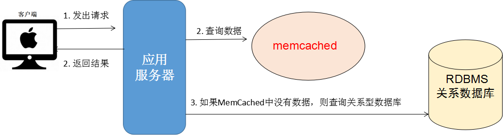
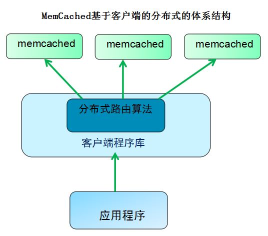
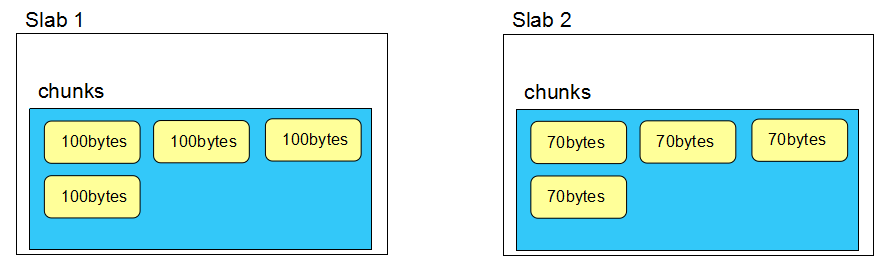
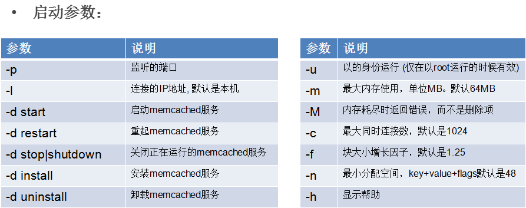
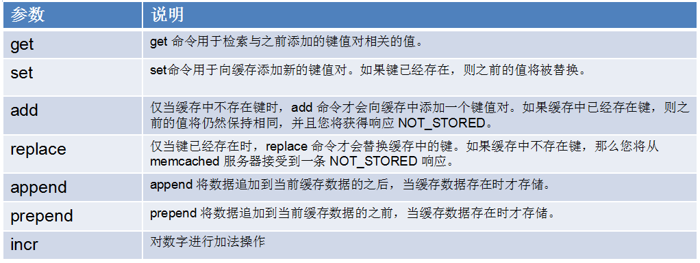
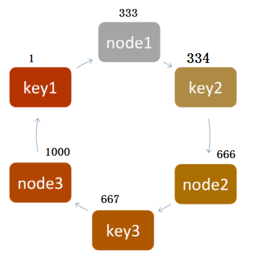
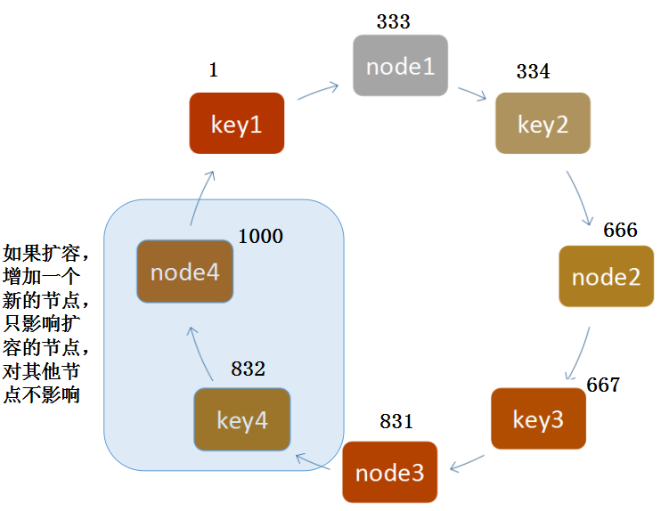
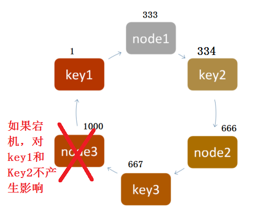
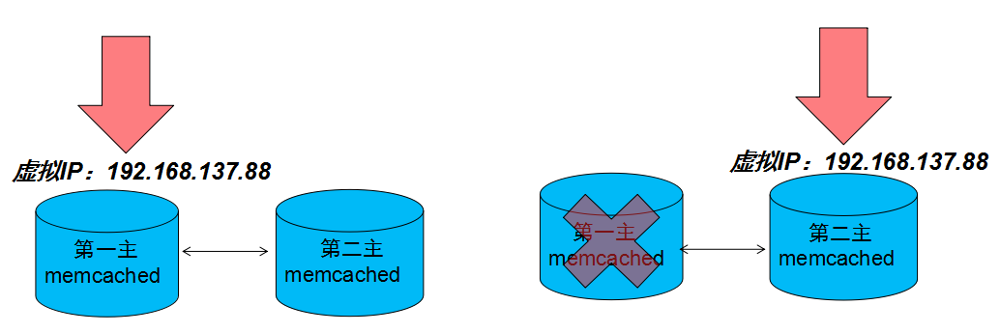

# 41-MemCached缓存技术

# 1.MemCached介绍

## 1.1 什么是MemCached

Memcache是一套开源,高性能的分布式的内存对象缓存系统，目前被许多网站使用以提升网站的访问速度，尤其对于一些大型的、需要频繁访问数据库的网站访问速度提升效果十分显著 。

Memcache将所有数据存储在内存中，并在内存里维护一个统一的巨大的Hash表，它能存储任意类型的数据，包括图像、视频、文件以及数据库检索的结果等。简单的说就是将数据调用到内存中，然后从内存中读取，从而大大提高读取速度。

##  1.2 为什么要用MemCached

首先讨论一个问题：这个问题在大并发，高负载的网站中必须考虑！**如何让速度更快。**

解决方案：

- 传统的RDBMS
- 页面静态化
- MemCached缓存技术

**基于Memcached的网站架构**



## 1.3 MemCached的基本原理和体系架构

简单的说: memcached就是在内存中维护一张巨大的hash表,通过自己的一套**路由算法**来维护数据的操作。



## 1.4 MemCached数据的存储方式和过期

1. 数据存储方式：Slab Allocation即：按组分配内存

   - 每次先分配一个Slab，相当于一个page，大小1M。
   - 然后在1M的空间里根据内容再划分相同大小的chunk
   - 优点是：最大限度的利用内存，避免产生内存碎片
   - 缺点是：会造成内存的浪费

   

2. 数据过期方式

   - 懒过期方式（Lazy Expiration）：

     memcached内部不监视数据是否过期，而是get时查看记录时间，检查是否已经过期，这叫惰性过期。

   - LRU算法：采用最近最少使用算法淘汰内存中的数据

# 2. 安装与部署

## 2.1 安装

1. 安装gcc

   ```
   yum install gcc
   ```

2. 安装libevent

   - 上传libevent安装包至software目录

   - 确认是否已经安装，并删除旧版本

     ```
     rpm -qa | grep libevent
     rpm -e libevent-1.4.13-4.el6.i686 --nodeps
     ```

   - 解压至software目录下

     ```
     tar -zxvf ./libevent-2.0.21-stable.tar.gz ./
     ```

   - 安装至目录`/opt/module`下

     - 进入解压后的libevent目录下

     - 依次执行如下命令

       ```
       ./configure --prefix=/opt/module/libevent-2.0.21
       make
       make install
       ```

3. 安装MemCached

   - 上传MemCached安装包至software目录

   - 解压至software目录下

     ```
     tar -zxvf ./memcached-1.4.25.tar.gz ./
     ```

   - 进入解压后的memcached目录

   - 执行如下代码

     ```
     ./configure --prefix=/opt/module/memcached-1.4.25 --with-libevent=/opt/module/libevent-2.0.21
     ```

     注：上述代码中第一个路径需要指定你的MemCached安装位置，第二个指定libevent的安装路径

     接着依次执行

     ```
     make
     make install
     ```

4. 启动MemCached

   ```
   ./memcached -u root -d -m 128
   ```

   - -p：指定端口 默认：11211
   - -u：指定用户名（root用户必须使用该选项）
   - -m：分配的内存，默认：64M
   - -c：最大并发连接，默认1024
   - -d：启动一个守护进程

   

**安装过程中出现的报错问题：**

```
error while loading shared libraries: libevent-2.0.so.5: cannot open shared obje
```

解决方法：

1. 运行`whereis libevent-2.0.so.5`

   查看`libevent-2.0.so.5`的位置所在

   ```
   [root@bigdata111 bin]# whereis libevent-2.0.so.5
   libevent-2.0.so: /usr/lib/libevent-2.0.so.5 /usr/lib64/libevent-2.0.so.5
   ```

   注：这是已经解决完问题时候的。解决之前是另外一个路径

2. 在运行`ldd /opt/module/memcached-1.4.25`，检查memcached的情况

   ```
   [root@bigdata111 memcached-1.4.25]# ldd /opt/module/memcached-1.4.25/bin/memcached 
   	linux-vdso.so.1 =>  (0x00007ffd5d5b8000)
   	libevent-2.0.so.5 => not found
   	libpthread.so.0 => /lib64/libpthread.so.0 (0x00007fe6f9b2e000)
   	libc.so.6 => /lib64/libc.so.6 (0x00007fe6f9760000)
   	/lib64/ld-linux-x86-64.so.2 (0x00007fe6f9f91000)
   ```

   注意：libevent-2.0.so.5 所在这一行是`not found`

3. 运行` LD_DEBUG=libs /opt/module/memcached-1.4.25/bin/memcached -v`

   找到memcached 运行时找libevent的路径

   ```
   [root@bigdata111 bin]# LD_DEBUG=libs /opt/module/memcached-1.4.25/bin/memcached -v
        21478:	find library=libevent-2.0.so.5 [0]; searching
        21478:	 search cache=/etc/ld.so.cache
        21478:	 search path=/lib64/tls/x86_64:/lib64/tls:/lib64/x86_64:/lib64:/usr/lib64/tls/x86_64:/usr/lib64/tls:/usr/lib64/x86_64:/usr/lib64		(system search path)
        21478:	  trying file=/lib64/tls/x86_64/libevent-2.0.so.5
        21478:	  trying file=/lib64/tls/libevent-2.0.so.5
        21478:	  trying file=/lib64/x86_64/libevent-2.0.so.5
        21478:	  trying file=/lib64/libevent-2.0.so.5
        21478:	  trying file=/usr/lib64/tls/x86_64/libevent-2.0.so.5
        21478:	  trying file=/usr/lib64/tls/libevent-2.0.so.5
        21478:	  trying file=/usr/lib64/x86_64/libevent-2.0.so.5
        21478:	  trying file=/usr/lib64/libevent-2.0.so.5
        21478:	
   ./memcached: error while loading shared libraries: libevent-2.0.so.5: cannot open shared object file: No such file or directory
   
   ```

   至此，问题已找到，是因为 libevent-2.0.so.5没有在memcached运行时默认去找的地方

   ```
   error while loading shared libraries: libevent-2.0.so.5: cannot open shared object file: No such file or directory
   翻译：
   加载共享库时出错：libevent-2.0.so.5：无法打开共享库文件：没有这样的文件或目录
   ```

4. 将`opt/module/libevent-2.0.21/lib/`下的`libevent-2.0.so.5`软连接到`/usr/lib64/`即可。

   ```
   [root@bigdata111 bin]# ln -s /opt/module/libevent-2.0.21/lib/libevent-2.0.so.5 /usr/lib64/
   ```

   注：可能版本不同，有些是`lib64`目录，有些是`lib`目录，具体需要看你第三步的路径显示的是哪一个

## 2.2 操作MemCached

### 2.2.1 Telnet方式



1. 执行如下代码

   ```
   telnet 127.0.0.1 11211
   ```

2. 然后输入如下命令

   ```
   add key1 0 0 4   
   abcd
   STORED
   ```

   注：第三行不需要自己输入，会自己出来

   **参数解释：**

   - `add key1 0 0 4   `
     - key1 key的名称
     - 第一个0 标志位 不用关心
     - 第二个0 数据过期时间，0表示不过期
     - 4 表示 value的长度

3. 获取

   ```
   get key1
   VALUE key1 0 4
   abcd
   END
   ```

   

统计信息的命令：

- stats  统计当前Memcached状态
- stats items 保存的数据信息
- stats slabs

### 2.2.2 java方式 

```java
import net.spy.memcached.MemcachedClient;

import java.io.IOException;
import java.io.Serializable;
import java.net.InetSocketAddress;
import java.util.ArrayList;
import java.util.List;
import java.util.concurrent.Future;

/**
 * Created by root on 2019/9/6.
 */
public class Demo1 {

    public static void main(String[] args) throws Exception  {
        d();
    }

    // 插入数据
    public static void a() throws Exception {
        //建立MemcachedClient实例
        MemcachedClient client = new MemcachedClient(new InetSocketAddress("192.168.109.133",11211));

        Future<Boolean> f = client.set("key2",10,"Hello World");
        if (f.get().booleanValue()){
            client.shutdown();
        }
    }

    // 查询数据
    public static void b() throws Exception {
        //建立MemcachedClient实例
        MemcachedClient client = new MemcachedClient(new InetSocketAddress("192.168.109.133",11211));
        Object object = client.get("key1");
        System.out.println("取到的值是： " + object);
        client.shutdown();
    }
    
    
    public static void c() throws Exception {
        //建立MemcachedClient实例
        MemcachedClient client = new MemcachedClient(new InetSocketAddress("192.168.109.133",11211));
        Future<Boolean> f = client.set("key3",0,new Student());
        if (f.get().booleanValue()){
            client.shutdown();
        }
    }
    
    
	// 基于客户端的分布式插入数据
    public static void d() throws Exception {
        //建立MemcachedClient实例
        List<InetSocketAddress> list = new ArrayList<>();
        list.add(new InetSocketAddress("192.168.109.133",11211));
        list.add(new InetSocketAddress("192.168.109.133",11212));
        list.add(new InetSocketAddress("192.168.109.133",11213));
        MemcachedClient client = new MemcachedClient(list);

        for (int i = 0; i<20;i++){
            System.out.println("插入数据：" + i);
            client.set("key"+i,0,"value"+i);
            Thread.sleep(1000);
        }

        client.shutdown();

    }

}

class  Student implements Serializable{}
```

# 3.MemCached的路由算法了解

## 3.1 求余数hash算法

用key做hash运算得到一个整数，根据余数路由。

例如：服务器端有三台MemCached服务器

根据key，做hash运算

- 7%3=1，那么就路由到第2台服务器。

- 6%3=0，那么路由到第1台服务器

- 5%3=2，那么路由到第3台服务器

优点：数据分布均衡在多台服务器中，适合大多数据需求。

缺点：如果需要扩容或者有宕机的情况，会造成数据的丢失。

## 3.2 一致性hash算法

- 基本原理

  

- 一致性hash算法下扩容

  

- down机

  

# 4.MemCached的主主复制和HA

## 4.1 MemCached主主复制

**安装具有复制功能的MemCached版本**

1. 上传并解压

   上传至software目录，解压至software目录

   ```
   tar -zxvf memcached-1.2.8-repcached-2.2.tar.gz -C ./
   ```

2. 进入解压后的目录，执行如下命令

   ```
   ./configure --prefix=/opt/module/memcached-1.2.8-repcached
   	         --with-libevent=/opt/module/libevent-2.0.21/ --enable-replication
   ```

   注意：

   - 第一个目录依旧是你需要安装的目录
   - 第二个目录是之前安装的libevent目录
   - 默认memcached单个进程只支持到2G内存，需要更大内存支持的话，需要打开64位支持，编译的时候加参数：`--enable-64bit`，由于我们只是用于学习，所以不需要那么大内存

3. 编译

   编译的目录依旧是software下你解压的目录

   ```
   make
   make install
   ```

   注意：此时会报错

   ```
   make all-recursive    
   make[1]: Entering directory `/usr/local/memcached'    
   Making all in doc    
   make[2]: Entering directory `/usr/local/memcached/doc'    
   make[2]: Nothing to be done for `all'.    
   make[2]: Leaving directory `/usr/local/memcached/doc'    
   make[2]: Entering directory `/usr/local/memcached'    
   gcc -DHAVE_CONFIG_H -I. -DNDEBUG -m64 -g -O2 -MT memcached-memcached.o -MD     
   MP -MF .deps/memcached-memcached.Tpo -c -o memcached-memcached.o `test -f     
   memcached.c' || echo './'`memcached.c    
   memcached.c: In function ‘add_iov’:    
   memcached.c:697: error: ‘IOV_MAX’ undeclared (first use in this function)    
   memcached.c:697: error: (Each undeclared identifier is reported only once    
   memcached.c:697: error: for each function it appears in.)    
   make[2]: *** [memcached-memcached.o] Error 1    
   make[2]: Leaving directory `/usr/local/memcached'    
   make[1]: *** [all-recursive] Error 1    
   make[1]: Leaving directory `/usr/local/memcached'    
   make: *** [all] Error 2
   ```

   **解决办法：**

   编辑解压后目录下的`memcached.c`文件

   ```
   将下下面的几行进行修改
   /* FreeBSD 4.x doesn't have IOV_MAX exposed. */    
   #ifndef IOV_MAX    
   #if defined(__FreeBSD__) || defined(__APPLE__)    
   # define IOV_MAX 1024    
   #endif    
   #endif
   
   修改为
   /* FreeBSD 4.x doesn't have IOV_MAX exposed. */    
   #ifndef IOV_MAX    
   # define IOV_MAX 1024    
   #endif
   
   ```

4. 重新编译

   ```
   make
   make install
   ```

5. 运行测试

   ```
   启动第一台MemCached，使用-x指定对端服务器的地址
   ./memcached -d -u root -m 128 -x 192.168.64.129
   启动第二台MemCached，使用-x指定对端服务器的地址
   ./memcached -d -u root -m 128 -x 192.168.64.130
   ```

## 4.2 MemCached的HA



Keepalived是一个交换机制的软件。Keepalived的作用是检测服务器的状态，如果有一台web服务器死机，或工作出现故障，Keepalived将检测到，并将有故障的服务器从系统中剔除，同时使用其他服务器代替该服务器的工作，当服务器工作正常后Keepalived自动将服务器加入到服务器群中，这些工作全部自动完成，不需要人工干涉，需要人工做的只是修复故障的服务器。

利用Keepalived实现MemCached的主主复制高可用架构：

- Keepalived在memcached主服务器产生一个虚拟IP（VIP）
- Keepalived可以通过不断的检测memcached主服务器的11211端口是否正常工作，  
- 如果发现memcached Down机，虚拟IP就从主服务器移到从服务器

**暂不需要搭建。**