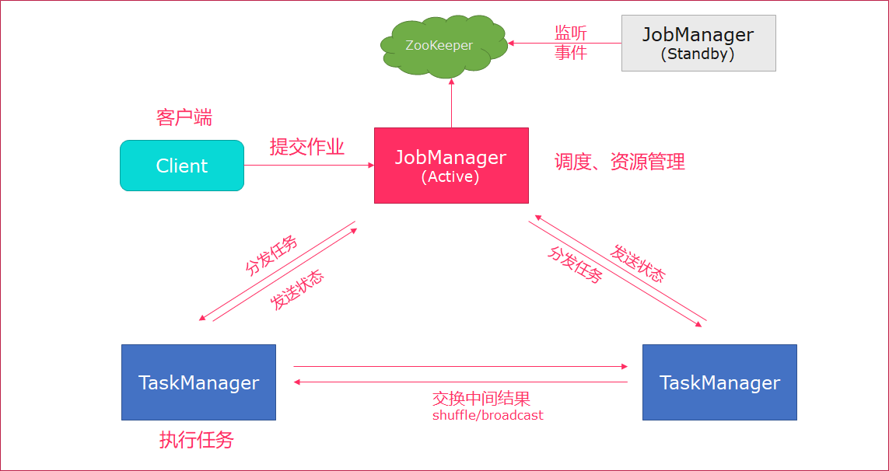
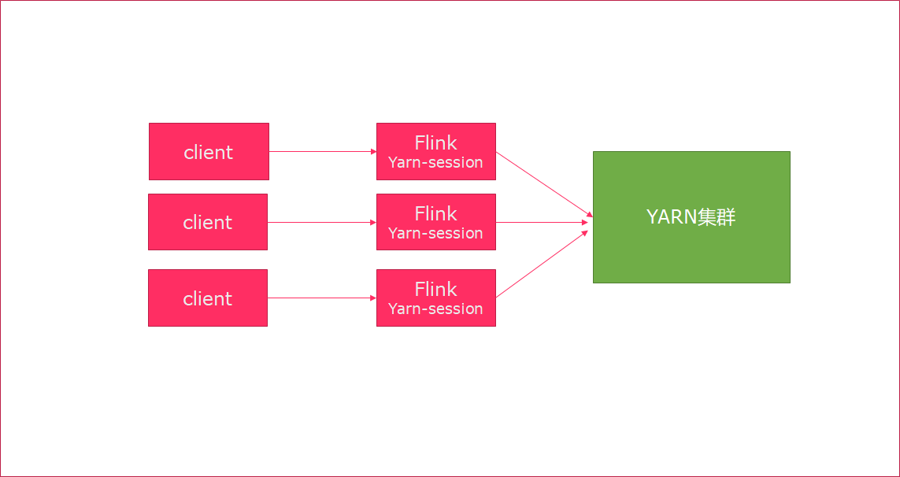
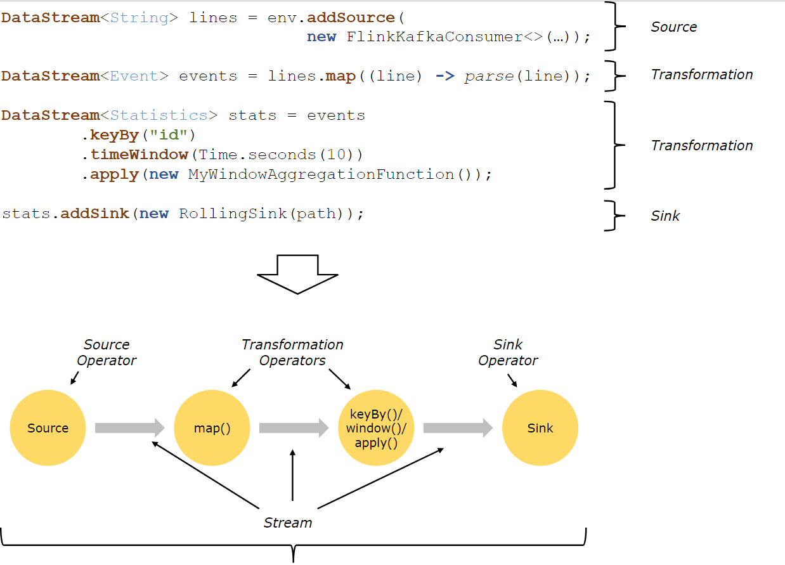
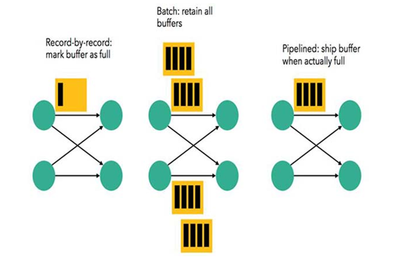

# 42-Flink基础

# 1.Flink介绍

## 1.1 Flink引入

这几年大数据的飞速发展，出现了很多热门的开源社区，其中著名的有 Hadoop 、 Storm ，以及后来的 Spark ，他们都有着各自专注的应用场景。 Spark 掀开了 内存计算 的先河，也以内存为赌注，赢得了内存计算的飞速发展。Spark 的火热或多或少的掩盖了其他分布式计算的系统身影。就像 Flink，也就在这个时候默默的发展着。

在国外一些社区，有很多人将大数据的计算引擎分成了 4 代 ，当然也有很多人不会认同。我们先姑且这么认为和讨论

- 第一代（Hadoop MapReduce）

  - 批处理

  - Mapper、Reducer

    hadoop的mapReduce将计算分为两个阶段，分别为Map和Reduce。对于上层应用来说，就不得不想法设法去拆分算法，甚至不得不在上层应用实现多个Job的串联，以完成一个完整的算法，例如迭代计算

- 第二代（DAG框架Tez + MapReduce）

  - 批处理
  - 1个Tez = MR(1) + MR(2) + ... + MR(n)
  - 相比于MR效率有所提升

  

- 第三代（Spark）

  - 批处理、流计算、SQL高层API支持
  - 自带DAG
  - 内存迭代计算、性能较为之前大幅度提升

- 第四代（Flink）

  - 批处理、流计算、SQL高层API支持
  - 自带DAG
  - 流式计算性能更高、可靠性更高

## 1.2 什么是Flink

**概述：**

- 分布式的**计算引擎**
- 支持**批处理**，即处理静态的数据集、历史的数据集
- 支持**流处理**，即实时地处理一些实时数据流
- 支持**基于事件**的应用【比如说滴滴通过 Flink CEP 实现实时监测司机的行为流来判断司机的行为是否正当】

**官方介绍：**


`Stateful Computations over Data Streams `，即数据流上的有状态的计算

- Data Streams

  Flink认为**有界数据集**是**无界数据流**的一种特例，所以说有界数据集也是一种数据流，事件流也是一种数据流。`Everything is streams`，即Flink可以用来处理任何的数据，可以支持批处理、流处理、AI、MachineLearning等

- Stateful Computations

  即有状态计算。有状态计算是最近几年来越来越被用户需求的一个功能。比如说一个网站一天内访问UV数，那么这个NV数便是状态。Flink提供了内置的对状态的一致性处理，即如果任务发生了Failover，其状态不会丢失、不会被多算少算，同时提供了非常高的性能

> **无界流：**意思很明显，只有开始没有结束。必须连续的处理无界流数据，也即是在事件注入之后立即要对其进行处理。不能等待数据到达了再去全部处理，因为数据是无界的并且永远不会结束数据注入。处理无界流数据往往要求事件注入的时候有一定的顺序性，例如可以以事件产生的顺序注入，这样会使得处理结果完整

> **有界流：**也即是有明确的开始和结束的定义。有界流可以等待数据全部注入完成了在开始处理。注入的顺序不是必须的了，因为对于一个静态的数据集，我们是可以对其进行排序的。有界流的处理也可以称为**批处理**

**其他特点：**

- 性能优秀（尤其在流计算领域）
- 高可扩展性
- 支持容错
- 纯内存式的计算引擎，做了内存管理方面的大量优化
- 支持eventtime的处理
- 支持超大状态的Job（在阿里巴巴中作业的sate大小超过TB是非常常见的）
- 支持exactly-once的处理

## 1.3 Flink在阿里的现状

基于Apache Flink在阿里巴巴搭建的平台于2016年正式上线，并从阿里巴巴的 **搜索** 和 **推荐** 这两大场景开始实现。目前阿里巴巴所有的业务，包括阿里巴巴所有子公司都采用了基于Flink搭建的实时计算平台。同时Flink计算平台运行在开源的Hadoop集群之上。

采用Hadoop的 YARN 做为资源管理调度，以 HDFS 作为数据存储。
因此，Flink可以和开源大数据软件Hadoop无缝对接。


**Flink在阿里巴巴的大规模应用，表现如何？**

- 规模：一个系统是否成熟，规模是重要指标，Flink最初上线阿里巴巴只有数百台服务器，目前规模已达上万台，此等规模在全球范围内也是屈指可数；
- 状态数据：基于Flink，内部积累起来的状态数据已经是PB级别规模；
- Events：如今每天在Flink的计算平台上，处理的数据已经超过万亿条;
- TPS：在峰值期间可以承担每秒超过4.72亿次的访问，最典型的应用场景是 阿里巴巴双11大屏

**Flink分支 Blink**

- 阿里自15年起开始调研开源流计算引擎，最终决定基于Flink打造新一代计算引擎

- 阿里贡献了数百个commiter，并对Flink进行高度定制，并取名为 Blink

- 阿里是 Flink SQL 的最大贡献者，一半以上的功能都是阿里的工程师开发的

# 2. Flink集群安装

Flink支持多种安装模式

- local（本地）——单机模式，一般不使用
- standalone——独立模式，Flink自带集群，开发测试环境使用
- yarn——计算资源统一由Hadoop YARN管理，生产测试环境

## 2.1 伪分布式环境部署


- Flink程序需要提交给Job Client
- Job Client将作业提交给Job Manager
- Job Manager负责协调资源分配和作业执行。资源分配完成后，任务提交给相应的Task Manager
- Task Manager启动一个线程以开始执行。Task Manager会向Job Manager报告状态更改。例如开始执行，正在执行或已完成
- 作业执行完成后，结果将发送回客户端（Job Client）

**环境准备：**

- 安装包`flink-1.6.1-bin-hadoop28-scala_2.11.tgz`

  注：需要根据自己的hadoop对应版本进行下载

**安装步骤：**

1. 上传压缩包并解压

   ```
   tar -zxvf flink-1.6.1-bin-hadoop28-scala_2.11.tgz -C /opt/module
   ```

2. 启动

   ```
   cd /opt/module/flink-1.6.1
   bin/start-cluster.sh
   ```

   此时使用jps可以查看到下面两个进程

   - TaskManagerRunner
   - StandaloneSessionClusterEntroi

3. 访问WEB界面

   ```
   http://bigdata111:8081
   ```

   注：slot 在flink里面可以认为是资源组，Flink是通过将任务分成子任务并且将这些子任务分配到slot来并行执行程序。

4. 运行测试任务

   ```
   bin/flink-1.6.1 run /opt/module/flink-1.6.1/examples/batch/WordCount.jar  --input /opt/module/zookeeper-3.4.10/zookeeper.out --output /opt/file/word.txt
   ```

   此时控制台输出如下内容

   ```
   Starting execution of program
   Program execution finished
   Job with JobID bb53dc79d510202e8abd95094791a32b has finished.
   Job Runtime: 9539 ms
   ```

5. 观察webUI

## 2.2 Standalone模式集群安装部署

Standalone集群架构


- client客户端提交任务给JobManager
- JobManager负责Flink集群计算资源管理，并分发任务给TaskManager来执行
- TaskManager定期向JobManager汇报状态

**部署情况：**

- 服务器：bigdata111（Master+Slave）
- 服务器：bigdata222（Slave）
- 服务器：bigdata333（Slave）

**安装步骤：**

1. 修改配置文件

   `vim ./conf/flink-conf.yaml`

   ```
   # jobManager 的IP地址
   jobmanager.rpc.address: node01
   
   # JobManager 的端口号
   jobmanager.rpc.port: 6123
   
   # JobManager JVM heap 内存大小
   jobmanager.heap.size: 1024
   
   # TaskManager JVM heap 内存大小
   taskmanager.heap.size: 1024
   
   # 每个 TaskManager 提供的任务 slots 数量大小
   taskmanager.numberOfTaskSlots: 2
   
   #是否进行预分配内存，默认不进行预分配，这样在我们不使用flink集群时候不会占用集群资源
   taskmanager.memory.preallocate: false
   
   # 程序默认并行计算的个数
   parallelism.default: 1
   
   #JobManager的Web界面的端口（默认：8081）
   jobmanager.web.port: 8081
   
   #配置每个taskmanager生成的临时文件目录（选配）
   taskmanager.tmp.dirs: /export/servers/flink-1.6.1/tmp
   ```

   注：根据使用的版本不同，里面的内容可能略有不同

   **slot和parallelism总结**

   - taskmanager.numberOfTaskSlots:2
   - 每一个taskmanager中的分配2个TaskSlot,3个taskmanager一共有6个TaskSlot
   - parallelism.default:1 运行程序默认的并行度为1，6个TaskSlot只用了1个，有5个空闲

   1. slot 是静态的概念，是指 taskmanager 具有的并发执行能力
   2. parallelism 是动态的概念，是指程序运行时实际使用的并发能力

2. 修改slaves文件

   `vim conf/slaves`

   ```
   bigdata111
   bigdata222
   bigdata333
   ```

   注：此处填入主机名，如果没有设置主机名映射，需要先进行设置

3. 修改/etc/profile系统环境变量配置文件，添加HADOOP_CONF_DIR目录**（节点同步进行配置）**

   添加如下内容

   ```
   export HADOOP_CONF_DIR=/opt/module/hadoop-2.8.4/etc/hadoop
   ```

   执行命令重新加载环境变量

   ```
   source /etc/profile
   ```

4. 分发flink

   ```
   scp -r /opt/module/flink-1.6.1  root@bigdata222:/opt/module
   scp -r /opt/module/flink-1.6.1  root@bigdata333:/opt/module
   ```

5. 启动Flink集群

   ```
   bin/start-cluster.sh
   ```

   友情提示：如果之前开启，请先关闭之后在启动

   - 启动/停止flink集群
     - 启动：./bin/start-cluster.sh
     - 停止：./bin/stop-cluster.sh
   - 启动/停止jobmanager 如果集群中的jobmanager进程挂了，执行下面命令启动
     - bin/jobmanager.sh start
     - bin/jobmanager.sh stop
   - 启动/停止taskmanager 添加新的taskmanager节点或者重启taskmanager节点
     - bin/taskmanager.sh start
     - bin/taskmanager.sh stop

6. 启动HDFS集群

   ```
   start-dfs.sh
   ```

7. 在HDFS中创建测试目录，并上传测试文件

   ```
   hdfs dfs -mkdir -p /flinkTest/input
   hdfs dfs -put /opt/file/wordcount.txt /flinkTest/input
   ```

8. 测试

   ```
   bin/flink-1.6.1 run /opt/module/flink-1.6.1/examples/batch/WordCount.jar --input hdfs://bigdata111:9000/flinkTest/input/wordcount.txt --output  hdfs://bigdata111:9000/flinkTest/output/word.txt
   ```

9. 浏览webUI页面

   ```
   http://bigdata111:8081
   ```

## 2.3 Standalone高可用HA模式

从上述架构图中，可发现JobManager存在 单点故障 ，一旦JobManager出现意外，整个集群无法工作。所以，为了确保集群的高可用，需要搭建Flink的HA。

**HA架构图**



**部署情况：**

- 服务器：bigdata111（Master+Slave）
- 服务器：bigdata222（Master+Slave）
- 服务器：bigdata333（Slave）

**安装步骤：**

1. 修改配置文件`flink-conf.yaml`，添加如下配置

   ```
   #开启HA，使用文件系统作为快照存储
   state.backend: filesystem
   
   #启用检查点，可以将快照保存到HDFS
   state.backend.fs.checkpointdir: hdfs://bigdata111:9000/flink-checkpoints
   
   #使用zookeeper搭建高可用
   high-availability: zookeeper
   
   # 存储JobManager的元数据到HDFS
   high-availability.storageDir: hdfs://bigdata111:9000/flink/ha/
   high-availability.zookeeper.quorum: bigdata111:2181,bigdata222:2181,bigdata333:2181
   ```

   注：同样因为版本不同，配置文件内容也不同。

2. 分发

   ```
   scp -r /opt/module/flink-1.6.1/conf/flink-conf.yaml  root@bigdata222:/opt/module/flink-1.6.1/conf/
   
   scp -r /opt/module/flink-1.6.1/conf/flink-conf.yaml  root@bigdata333:/opt/module/flink-1.6.1/conf/
   ```

3. 修改节点2里的`flink-conf.yaml`配置文件

   ```
   jobmanager.rpc.address: bigdata222
   ```

   注：修改为节点所在主机名

4. 修改节点1的`conf/masters`配置文件，添加如下内容

   ```
   bigdata111:8081
   bigdata222:8081
   ```

5. 分发masters文件

   ```
   scp -r /opt/module/flink-1.6.1/conf/masters root@bigdata222:/opt/module/flink-1.6.1/conf/
   
   scp -r /opt/module/flink-1.6.1/conf/masters root@bigdata333:/opt/module/flink-1.6.1/conf/
   ```

6. 启动zookeeper集群

7. 启动HDFS集群

8. 启动flink集群

9. 分别查看两个节点的WEBUI

   使用`kill -9 进程号` 干掉一个节点，然后查看另外一个节点的WEBUI

## 2.4 Yarn集群搭建

在一个企业中，为了最大化的利用集群资源，一般都会在一个集群中同时运行多种类型的 Workload。因此 Flink 也支持在 Yarn 上面运行； flink on yarn 的前提是：hdfs、yarn均启动

**部署情况：**

- JobManager: bigdata111
- WorkManager: bigdata111，bigdata222，bigdata333

**安装步骤：**

1. 修改Hadoop的`yarn-site.xm`

   添加该配置表示内存超过分配值，是否将任务杀掉。默认为true。
   运行Flink程序，很容易超过分配的内存

   ```xml
   <property>
    <name>yarn.nodemanager.vmem-check-enabled</name>
       <value>false</value>
   </property>
   ```

2. 分发`yarn-site.xm`至其他节点

   ```
   scp -r /opt/module/hadoop-2.8.4/etc/hadoop/yarn-site.xml root@bigdata222:/opt/module/hadoop-2.8.4/etc/hadoop/
   
   scp -r /opt/module/hadoop-2.8.4/etc/hadoop/yarn-site.xml root@bigdata333:/opt/module/hadoop-2.8.4/etc/hadoop/
   ```

3. 启动HDFS、yarn集群

   ```
   start-dfs.sh
   start-yarn.sh
   ```

## 2.5 yarn-session

Flink运行在YARN上，可以使用 yarn-session 来快速提交作业到YARN集群。我们先来看下`Flink On Yarn`模式，Flink是如何和Yarn进行交互的。


1. 上传jar包和配置文件到HDFS集群上
2. 申请资源和请求AppMaster容器
3. Yarn分配资源AppMaster容器，并启动JobManager
   - JobManager和ApplicationMaster运行在同一个container上。
   - 一旦他们被成功启动，AppMaster就知道JobManager的地址（AM它自己所在的机器）。
   - 它就会为TaskManager生成一个新的Flink配置文件（他们就可以连接到JobManager）。
   - 这个配置文件也被上传到HDFS上。
   - 此外，AppMaster容器也提供了Flink的web服务接口。
   - YARN所分配的所有端口都是临时端口，这允许用户并行执行多个Flink
4. 申请worker资源，启动TaskManager


yarn-session提供两种模式: **会话模式** 和 **分离模式**

### 2.5.1 会话模式

- 使用Flink中的yarn-session（yarn客户端），会启动两个必要服务 JobManager 和 TaskManager
- 客户端通过yarn-session提交作业
- yarn-session会一直启动，不停地接收客户端提交的作用
- 有大量的小作业，适合使用这种方式


**使用步骤：**

1. 在flink目录启动yarn-session

   ```
   bin/yarn-session.sh -n 2 -tm 800 -s 1 -d
   ```

   - -n 表示申请2个容器，
   - -s 表示每个容器启动多少个slot
   - -tm 表示每个TaskManager申请800M内存
   - -d 表示以后台程序方式运行

   **yarn-session.sh脚本可以携带的参数:**

   ```
    Required
        -n,--container <arg>               分配多少个yarn容器 (=taskmanager的数量)  
      Optional
        -D <arg>                       动态属性
        -d,--detached                   独立运行 （以分离模式运行作业）
        -id,--applicationId <arg>           YARN集群上的任务id，附着到一个后台运行的yarn 
   session中
        -j,--jar <arg>                     Path to Flink jar file
        -jm,--jobManagerMemory <arg>     JobManager的内存 [in MB] 
        -m,--jobmanager <host:port>       指定需要连接的jobmanager(主节点)地址  
                                      使用这个参数可以指定一个不同于配置文件中的jobmanager  
        -n,--container <arg>               分配多少个yarn容器 (=taskmanager的数量) 
        -nm,--name <arg>                 在YARN上为一个自定义的应用设置一个名字
        -q,--query                       显示yarn中可用的资源 (内存, cpu核数) 
        -qu,--queue <arg>                 指定YARN队列
        -s,--slots <arg>                   每个TaskManager使用的slots数量
        -st,--streaming                   在流模式下启动Flink
        -tm,--taskManagerMemory <arg>   每个TaskManager的内存 [in MB] 
        -z,--zookeeperNamespace <arg>     针对HA模式在zookeeper上创建NameSpace
   
   ```

2. 使用flink提交任务

   ```
   bin/flink-1.6.1 run examples/batch/WordCount.jar
   
   ```

3. 如果程序运行完了，可以使用 `yarn application -kill application_id `杀掉任务

   ```
   yarn application -kill application_1554377097889_0002
   ```

### 2.5.2 分离模式

- 直接提交任务给YARN
- 大作业，适合使用这种方式



**使用步骤：**

1. 直接使用flink提交任务

   ```
   bin/flink run -m yarn-cluster -yn 2 ./examples/batch/WordCount.jar  
   ```

   - -m jobmanager的地址
   - -yn 表示TaskManager的个数  

2. 查看WEBUI

# 3.Flink架构介绍

## 3.1 Flink基石

Flink之所以能这么流行，离不开它最重要的四个基石： Checkpoint、State、Time、Windo


首先是`Checkpoint`机制，这是Flink的一个重要特性，Flink基于`Chandy-Lamport`算法实现了一个分布式的一致性的快照，从而提供了**一致性的语义**。Chandy-Lamport算法是上在1985年的时候就已经被提出来，但并没有被很广泛的应用，而flink则把这个算法发扬光大了。Spark最近在实现Continue streaming，Continue streaming的目的是为了降低它处理的延时，其也需要提供这种一致性的语义，最终采用Chandy-Lamport这个算法，说明Chandy-Lamport算法在业界得到了一定的肯定

提供了一致性的语义之后，Flink为了让用户在编程时能够更轻松，更容易地去**管理状态**，还提供了一套非常简单明了的State API，包括里面的有有ValueState、ListState、MapState，近期添加了了BroadcastState，使用**State** API能够自动享受到这种一致性的语义

除此之外，Flink还实现了**Watermark**的机制，能够支持基于**事件的时间**的处理，或者说基于系统时间的处理，能够容忍数据的**迟到**，容忍**乱序**的数据

另外流计算中一般在对流数据进行操作之前都会先进行开窗，即基于一个什么样的窗口上做这个计算。Flink提供了开箱即用的各种窗口，比如如 **滑动窗口** 、 **滚动窗口** 、 **会话窗口** 以及非常灵活的 **自定义的窗口** 。

## 3.2 组件栈

Flink是一个分层架构的系统，每一层所包含的组件都提供了特定的抽象，用来服务于上层组件。Flink分层的组件栈如下图所示：


从上至下：

- 部署层

  Flink支持本地运行、能在独立集群或者在被YARN管理的集群上运行，也能部署在云上。

- 运行时

  Runtime层提供了支持Flink计算的全部核心实现，为上层API层提供基础服务

- API

  DataStream、DataSet、Table、SQLAPI

- 扩展库

  Flink还包括用于复杂事件处理，机器学习，图形处理和Apache Storm兼容性的专用代码库

## 3.3 Flink数据流编程模型抽象级别

Flink提供了不同的抽象级别以开发流式或批处理应用


- 最底层提供了有状态流。它将通过过程函数（Process Function）嵌入到DataStream API中。它允许用户可以自由地处理来自一个或者多个流数据的事件，并使用一致、容错的状态。除此之外，用户可以注册事件时间和处理事件回调，从而使程序可以实现复杂的计算
- DataStream/DataSet API 是Flink提供的核心API，DataSet处理有界的数据集，DataStream处理有界或者无界的数据流。用户可以通过各种方法（map / flatmap / window / keyby / sum / max / min / avg / join 等）将数据进行转换/计算
- Table API 是以表为中心的声明式DSL，其中表可能会动态变化（在表达流数据时）。Table API 提供了例如select、project、join、group-by、aggregat等操作，使用起来却更加简洁（代码量更少）。你可以在表于DataStream/DataSet 之间无缝切换，也允许程序将Table API与DataStream以及DataSet混合使用
- Flink提供了最高层级的抽象是SQL，这一层抽象在语法与表达能力上与Table API类似，但是是以SQL查询表达式的形式表现程序。SQL抽象与Table API交互密切，同时SQL查询可以直接在Table API定义的表上执行

## 3.4 Flink程序结构

Flink程序的基本构建块是**流**和**转换**（请注意。Flink的DataSet API中使用的DataSet也是内部流）。从概念上讲，流是（可能永无止境的）数据记录流，而转换是将一个或者多个流作为一个或多个流的操作。输入，并产生一个或者多个输出流



Flink应用程序结构就是如上图所示：

- Source：数据源，Flink在流处理和批处理上的source大概有四类：基于本地集合的source、基于文件的source、基于网络套接字的source、自定义的source。自定义的source常见的有Apache kafka、RabbitMQ等，当然你也可以定义自己的source
- Transformation：数据转换的各种操作，有 Map / FlatMap / Filter / KeyBy / Reduce / Fold / Aggregations / Window /WindowAll / Union / Window join / Split / Select等，操作很多，可以将数据转换计算成你想要的数据。
- Sink：接收器，Flink将转换计算后的数据发送的地点，你可能需要存储下来，Flink常见的Sink大概有如下几类：写入文件、打印出来、写入socket、自定义的sink。自定义的sink常见有Apache kafka、RabbitMQ、MySQL、ElasticSearch、Apache Cassandra、Hadoop FileSystem 等，同理你也可以定义自己的sink

## 3.5 Flink并行数据流

Flink程序在执行的时候，会被映射成一个`Streaming Dataflow`，一个Streaming Dataflow是一组`Stream`和`Transformation Operator `组成的。再启动时从一个或多个` Source Operator`开始，结束语一个或者多个`Sink Operator`

Flink程序本质上是 **并行的和分布式**的，在执行过程中，一个流（Stream）包含一个或多个流**分区**，而每一个operator包含一个或多个operator子任务。操作子任务间彼此独立，在不同的线程中执行，甚至是在不同的机器或者不同的容器上。operator子任务的数量是这一特定operator的 **并行度**。相同程序中的不同operator有不同级别的并行度


一个Stream可以被分成多个Stream的分区，也就是 `Stream Partition` 。一个Operator也可以被分为 多个`Operator Subtask `。如上图中，Source被分成Source1和Source2，它们分别为Source的Operator Subtask。每Operator Subtask都是在 不同的线程 当中独立执行的。一个Operator的并行度，就等于Operator Subtask的个数。上图Source的并行度为2。而一个Stream的并行度就等于它生成的Operator的并行度。

数据在两个operator之间传递的时候有两种模式：

- One to One模式：两个operator用此模式传递的时候，会保持数据的分区数和数据的排序；如上图中的Source1到Map1，它就保留的Source的分区特性，以及分区元素处理的有序性。
- Redistributing （重新分配）模式：这种模式会改变数据的分区数；每个一个operator subtask会根据选择transformation把数据发送到不同的目标subtasks,比如keyBy()会通过hashcode重新分区,broadcast()和rebalance()方法会随机重新分区；

## 3.6 Task和Opertor chain

Flink的所有操作都称之为Operator（转换），客户端在提交任务的时候会对Operator进行优化操作，能进行合并的Operator会被合并为一个Operator，合并后的Operator称为Operator chain，实际上就是一个执行链，每个执行链会在TaskManager上一个独立的线程中执行


## 3.7 任务调度与执行


1. 当Flink执行Executor会自动根据程序 代码生成DAG数据流图
2. ActorSystem创建Actor经数据流图发送给JobManager中的Actor
3. JobManager会不断接收TaskManager的心跳信息，从而可以获取到有效的TaskManager
4. JobManager通过调度器在TaskManager中调度执行Task（在Flink中，最小的调度单元就是task，对应就是一个线程）
5. 在程序运行过程中，task与task之间是可以进行数据传输的

- Job Client
  - 主要职责就是**提交任务**，提交后可以结束进程，也可以等待结果返回
  - Job Client**不是**Flink程序执行的内部部分，但它是任务执行的**起点**
  - Job Client负责接受用户的程序代码，然后创建数据流，将数据流提交给Job Manager以便进一步执行。执行完成后，Job Client将结果返回给用户
- Job Manager
  - 主要职责是调度工作并协调任务做检查点
  - 集群中至少有有一个**master**，master负责调度task，协调checkpoints和容错
  - 高可用设置的话可以有多个master，但是要保证一个是leader，其他是**standby**；
  - Job Manager包含`Actor System`、`Scheduler`、`CheckPoint`三个重要的组件
  - **Job Manager**从客户端接收到任务以后，首先生成**优化过的执行计划**，再调度在TaskManasger中执行
- Task Manager
  - 主要职责是从JobManager处接收任务，并部署和启动任务，接收上游的数据并处理
  - Task Manager是在JVM中的一个或者多个线程中执行任务的工作节点
  - **TaskManager**在创建之初就设置好了**Slot**，每个**Slot**可以执行 一个任务

## 3.8 任务槽（task-slot）和槽共享（Slot Sharing）

**任务槽**


- 每个TaskManager是一个JVM的进程，可以在不同的线程中执行一个或者多个子任务

- 为了控制一个worker能接受到多少个task。worker通过task slot来进行控制（一个worker至少有一个task slot）

- 每个task slot 表示TaskManager拥有资源的固定大小的子集

- Flink将进程的内存进行了划分到多个slot中

- 图中有两个TaskManager，每个TaskManager有三个slot，每个slot占有1/3的内存

- 内存被划分到不同的slot之后可以获得如下好处
  - TaskManager最多能同时并发执行的任务是可以控制的，那就是三个，因为不能超过slot的数量
  - slot有独占的内存空间，这样在一个TaskManager中可以运行多个不同的作业，作业之间不受影响

**槽共享（Slot Sharing）**

默认情况下，Flink允许子任务共享插槽，即使它们是不同任务的子任务，只要它们来自同一作业。结果是一个槽可以保存作业的整个管道。允许插槽共享有两个好处：

- 只需计算Job中最高并行度（parallelism）的task slot,只要这个满足，其他的job也都能满足
- 资源分配更加公平，如果有比较空闲的slot可以将更多的任务分配给它。图中若没有任务槽共享，负载不高的Source/Map等subtask将会占据许多资源，而负载较高的窗口subtask则会缺乏资源。
- 有了任务槽共享，可以将基本并行度（base parallelism）从2提升到6.提高了分槽资源的利用率。同时它还可以保障TaskManager给subtask的分配的slot方案更加公平


## 3.9 Flink统一的流处理和批处理

在大数据处理领域，批处理任务与流处理任务一般被认为是两种 **不同** 的任务

一个大数据框架一般会被设计为只能处理其中一种任务

- Storm只支持流处理任务
- MapReduce、Spark只支持批处理任务
- Spark Streaming是Apache Spark之上支持流处理任务的子系统，看似是一个特例，其实并不是——SparkStreaming采用了一种 **micro-batch** 的架构，即把输入的数据流切分成细粒度的batch，并为每一个batch数据提交一个批处理的Spark任务，所以Spark Streaming本质上还是基于Spark批处理系统对流式数据进行处理，和Storm等完全流式的数据处理方式完全不同。
- Flink通过灵活的执行引擎，能够 **同时支持** 批处理任务与流处理任务

在执行引擎这一层，流处理系统与批处理系统最大不同在于 节点间的数据传输方式 ：

- 对于一个流处理系统，其节点间数据传输的标准模型
  - 当一条数据被处理完成后，序列化到缓存中，然后立刻通过网络传输到下一个节点，由下一个节点继续处理
- 对于一个批处理系统，其节点间数据传输的标准模型
  - 当一条数据被处理完成后，序列化到缓存中，并不会立刻通过网络传输到下一个节点，当 缓存写满 ，就持久化到本地硬盘上，当所有数据都被处理完成后，才开始将处理后的数据通过网络传输到下一个节点

这两种数据传输模式是两个极端，对应的是流处理系统对 低延迟 的要求和批处理系统对 高吞吐量 的要求

Flink的执行引擎采用了一种十分灵活的方式，同时支持了这两种数据传输

- Flink以**固定的缓存块** 为单位进行网络数据传输，用户可以通过设置缓存块超时值指定缓存块的传输时机。如果缓存块的超时值为0，则Flink的数据传输方式类似上文所提到流处理系统的标准模型，此时系统可以获得最低的处理延迟
- 如果缓存块的超时值为无限大，则Flink的数据传输方式类似上文所提到批处理系统的标准模型，此时系统可以获得最高的吞吐量
- 同时缓存块的超时值也可以设置为0到无限大之间的任意值。缓存块的超时阈值越小，则Flink流处理执行引擎的数据处理延迟越低，但吞吐量也会降低，反之亦然。通过调整缓存块的超时阈值，用户可根据需求灵活地权衡系统延迟和吞吐量



## 3.10 Flink的应用场景


阿里在Flink的应用主要包含四个模块：实时监控、实时报表、流数据分析和实时仓库

- 实时监控
  - 用户行为预警、app crash 预警、服务器攻击预警
  - 对用户行为或者相关事件进行实时监测和分析，基于风控规则进行预警
- 实时报表
  - 双11、双12等活动直播大屏
  - 对外数据产品：生意参谋等
  - 数据化运营
- 流数据分析：
  - 实时计算相关指标反馈及时调整决策
  - 内容投放、无线智能推送、实时个性化推
- 实时仓库：
  - 数据实时清洗、归并、结构化
  - 数仓的补充和优化

从很多公司的应用案例发现，其实Flink主要用在如下三大场景：

**场景一：Event-driven Applications【事件驱动】**

**事件驱动型应用** 是一类具有状态的应用，它从一个或多个事件流提取数据，并根据到来的事件触发计算、状态更新或其他外部动作。

事件驱动型应用是在计算存储分离的 **传统应用** 基础上进化而来。

在传统架构中，应用需要 **读写远程事务型数据库** 。

相反，事件驱动型应用是基于 **状态化流处理** 来完成。在该设计中， **数据和计算不会分离** ，应用只需访问本地（内存或磁盘）即可获取数据。系统 **容错性 **的实现依赖于定期向远程持久化存储写入**checkpoint** 。下图描述了传统应用和事件驱动型应用架构的区别。


**典型的事件驱动类应用：**

- 欺诈检测(Fraud detection)
- 异常检测(Anomaly detection)
- 基于规则的告警(Rule-based alerting)
- 业务流程监控(Business process monitoring)
- Web应用程序(社交网络)

**场景二：Data Analytics Applications【数据分析】**

数据分析任务需要从原始数据中提取有价值的信息和指标。

如下图所示，Apache Flink 同时支持流式及批量分析应用


Data Analytics Applications包含Batch analytics（批处理分析）和Streaming analytics（流处理分析）。

Batch analytics可以理解为 **周期性查询** ：比如Flink应用凌晨从Recorded Events中读取昨天的数据，然后做周期查询运算，最后将数据写入Database或者HDFS，或者直接将数据生成报表供公司上层领导决策使用。

Streaming analytics可以理解为 **连续性查询** ：比如实时展示双十一天猫销售GMV，用户下单数据需要实时写入消息队列，Flink 应用源源不断读取数据做实时计算，然后不断的将数据更新至Database或者K-VStore，最后做大屏实时展示。

**典型的数据分析应用实例**

- 电信网络质量监控
- 移动应用中的产品更新及实验评估分析
- 消费者技术中的实时数据即席分析
- 大规模图分析

**场景三：Data Pipeline Applications【数据管道】**

**什么是数据管道？**

提取-转换-加载（ETL）是一种在存储系统之间进行数据转换和迁移的常用方法。

ETL 作业通常会周期性地触发，将数据从事务型数据库拷贝到分析型数据库或数据仓库

数据管道和 ETL 作业的用途相似，都可以转换、丰富数据，并将其从某个存储系统移动到另一个。

但数据管道是以 **持续流模式** 运行，而非周期性触发。因此它支持从一个不断生成数据的源头读取记录，并将它们以低延迟移动到终点。例如：数据管道可以用来监控文件系统目录中的新文件，并将其数据写入事件日志；另一个应用可能会将事件流物化到数据库或增量构建和优化查询索引。

和周期性 ETL 作业相比， **持续数据管道** 可以明显降低将数据移动到目的端的延迟。此外，由于它能够持续消费和发送数据，因此用途更广，支持用例更多。

下图描述了周期性 ETL 作业和持续数据管道的


Periodic ETL：比如每天凌晨周期性的启动一个Flink ETL Job，读取传统数据库中的数据，然后做ETL，最后写入数据库和文件系统。

Data Pipeline：比如启动一个Flink 实时应用，数据源（比如数据库、Kafka）中的数据不断的通过Flink Data Pipeline流入或者追加到数据仓库（数据库或者文件系统），或者Kafka消息队列。

**典型的数据管道应用实例**

- 电子商务中的实时查询索引构建
- 电子商务中的持续 ETL

**思考题：**

假设你是一个电商公司，经常搞运营活动，但收效甚微，经过细致排查，发现原来是羊毛党在薅平台的羊毛，把补给用户的补贴都薅走了，钱花了不少，效果却没达到。我们应该怎么办呢？

你可以做一个实时的异常检测系统，监控用户的高危行为，及时发现高危行为并采取措施，降低损失。

**系统流程：**

1. 用户的行为经由app上报或web日志记录下来，发送到一个消息队列里去；
2.  然后流计算订阅消息队列，过滤出感兴趣的行为，比如：购买、领券、浏览等；
3. 流计算把这个行为特征化；
4. 流计算通过UDF调用外部一个风险模型，判断这次行为是否有问题（单次行为）；
5. 流计算里通过CEP功能，跨多条记录分析用户行为（比如用户先做了a，又做了b，又做了3次c），整体识别是否有风险；
6. 综合风险模型和CEP的结果，产出预警信息。