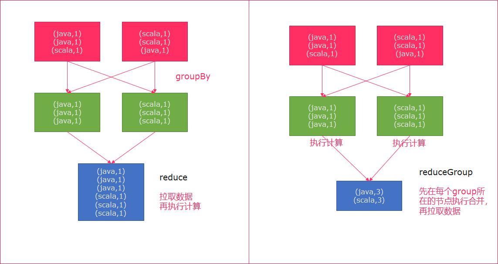
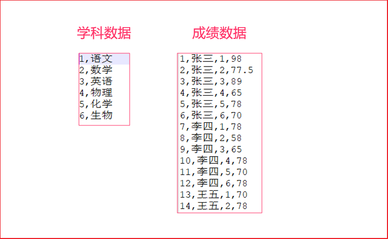
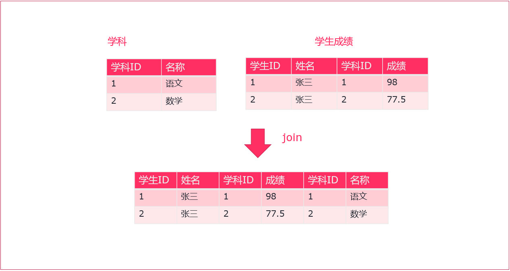
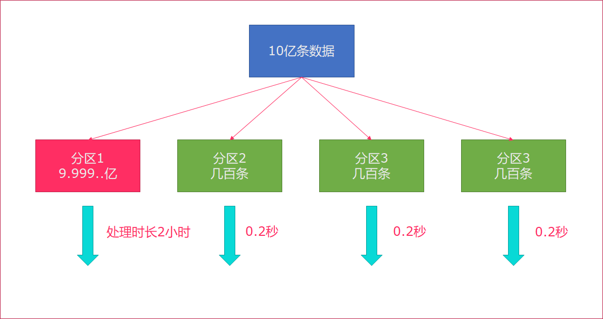
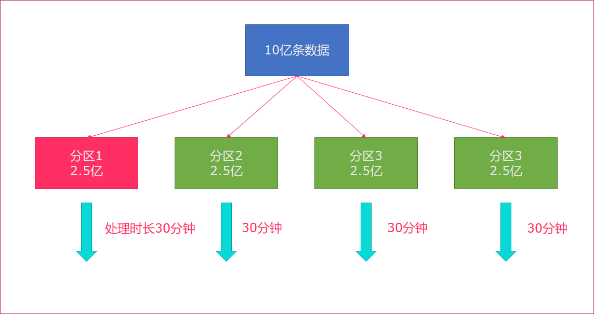
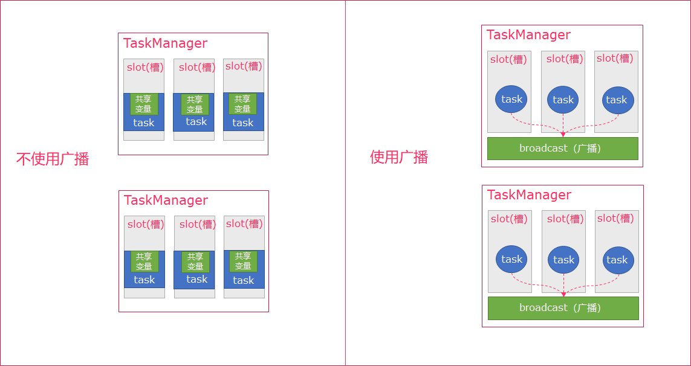

# 43-Flink批处理

# 1. Flink批处理开发

Flink应用程序结构主要包含三部分，Source、Transformation、Sink，如下所示：

- Source：数据源

  Flink在流处理和批处理上的Source大概有四类

  - 基于本地集合的source

  - 基于文件的source

  - 基于网络套接字的source

  - 自定义的source。

    自定义的 source 常见的有 Apache kafka、Amazon Kinesis Streams、RabbitMQ、Twitter Streaming API、Apache NiFi 等，当然你也可以定义自己的 source。

- Tformation：数据转换的各种操作

  有 Map / FlatMap / Filter / KeyBy / Reduce / Fold / Aggregations / Window / WindowAll / Union / Window join / Split / Select / Project 等，操作很多，可以将数据转换计算成你想要的数据。

- Sink：接收器

  Flink将转换计算后的数据发送的地点，你可能需要存储下来，Flink常见的Sink大概有如下几类

  - 写入文件

  - 打印输出

  - 写入socket

  - 自定义的sink

    自定义的 sink 常见的有 Apache kafka、RabbitMQ、MySQL、ElasticSearch、Apache Cassandra、Hadoop FileSystem 等，同理你也可以定义自己的 Sink。


## 环境搭建

创建maven项目，添加以下pom依赖，并在项目中导入scala支持

```xml
<?xml version="1.0" encoding="UTF-8"?>
<project xmlns="http://maven.apache.org/POM/4.0.0"
         xmlns:xsi="http://www.w3.org/2001/XMLSchema-instance"
         xsi:schemaLocation="http://maven.apache.org/POM/4.0.0 http://maven.apache.org/xsd/maven-4.0.0.xsd">
    <modelVersion>4.0.0</modelVersion>

    <groupId>com.itheima</groupId>
    <artifactId>flink-base</artifactId>
    <version>1.0-SNAPSHOT</version>

    <properties>
        <maven.compiler.source>1.8</maven.compiler.source>
        <maven.compiler.target>1.8</maven.compiler.target>
        <encoding>UTF-8</encoding>
        <scala.version>2.11</scala.version>
        <flink.version>1.6.1</flink.version>
        <hadoop.version>2.7.5</hadoop.version>
    </properties>

    <dependencies>

        <!--Flink TableAPI-->
        <dependency>
            <groupId>org.apache.flink</groupId>
            <artifactId>flink-table_${scala.version}</artifactId>
            <version>${flink.version}</version>
        </dependency>
        <!--导入scala的依赖-->
        <dependency>
            <groupId>org.apache.flink</groupId>
            <artifactId>flink-scala_${scala.version}</artifactId>
            <version>${flink.version}</version>
        </dependency>

        <dependency>
            <groupId>org.apache.flink</groupId>
            <artifactId>flink-connector-kafka-0.10_${scala.version}</artifactId>
            <version>${flink.version}</version>
        </dependency>

        <!--模块二 流处理-->
        <dependency>
            <groupId>org.apache.flink</groupId>
            <artifactId>flink-streaming-scala_${scala.version}</artifactId>
            <version>${flink.version}</version>
        </dependency>
        <dependency>
            <groupId>org.apache.flink</groupId>
            <artifactId>flink-streaming-java_${scala.version}</artifactId>
            <version>${flink.version}</version>
        </dependency>

        <!--对象和json 互相转换的-->
        <dependency>
            <groupId>com.alibaba</groupId>
            <artifactId>fastjson</artifactId>
            <version>1.2.44</version>
        </dependency>

        <dependency>
            <groupId>org.apache.flink</groupId>
            <artifactId>flink-runtime-web_2.11</artifactId>
            <version>${flink.version}</version>
        </dependency>

        <dependency>
            <groupId>org.apache.hadoop</groupId>
            <artifactId>hadoop-client</artifactId>
            <version>${hadoop.version}</version>
        </dependency>

        <!-- 指定mysql-connector的依赖 -->
        <dependency>
            <groupId>mysql</groupId>
            <artifactId>mysql-connector-java</artifactId>
            <version>5.1.38</version>
        </dependency>

    </dependencies>


    <build>
        <sourceDirectory>src/main/scala</sourceDirectory>
        <testSourceDirectory>src/test/scala</testSourceDirectory>
        <plugins>

            <plugin>
                <groupId>org.apache.maven.plugins</groupId>
                <artifactId>maven-compiler-plugin</artifactId>
                <version>2.5.1</version>
                <configuration>
                    <source>${maven.compiler.source}</source>
                    <target>${maven.compiler.target}</target>
                    <!--<encoding>${project.build.sourceEncoding}</encoding>-->
                </configuration>
            </plugin>

            <plugin>
                <groupId>net.alchim31.maven</groupId>
                <artifactId>scala-maven-plugin</artifactId>
                <version>3.2.0</version>
                <executions>
                    <execution>
                        <goals>
                            <goal>compile</goal>
                            <goal>testCompile</goal>
                        </goals>
                        <configuration>
                            <args>
                                <!--<arg>-make:transitive</arg>-->
                                <arg>-dependencyfile</arg>
                                <arg>${project.build.directory}/.scala_dependencies</arg>
                            </args>

                        </configuration>
                    </execution>
                </executions>
            </plugin>


            <plugin>
                <groupId>org.apache.maven.plugins</groupId>
                <artifactId>maven-shade-plugin</artifactId>
                <version>2.3</version>
                <executions>
                    <execution>
                        <phase>package</phase>
                        <goals>
                            <goal>shade</goal>
                        </goals>
                        <configuration>
                            <filters>
                                <filter>
                                    <artifact>*:*</artifact>
                                    <excludes>
                                        <!--
                                        zip -d learn_spark.jar META-INF/*.RSA META-INF/*.DSA META-INF/*.SF
                                        -->
                                        <exclude>META-INF/*.SF</exclude>
                                        <exclude>META-INF/*.DSA</exclude>
                                        <exclude>META-INF/*.RSA</exclude>
                                    </excludes>
                                </filter>
                            </filters>
                            <transformers>
                                <transformer
                                        implementation="org.apache.maven.plugins.shade.resource.ManifestResourceTransformer">
                                    <mainClass>com.itheima.batch.BatchFromCollection</mainClass>
                                </transformer>
                            </transformers>
                        </configuration>
                    </execution>

                </executions>
            </plugin>

            <plugin>
                <groupId>org.apache.maven.plugins</groupId>
                <artifactId>maven-jar-plugin</artifactId>
                <version>2.6</version>
                <configuration>
                    <archive>
                        <manifest>
                            <addClasspath>true</addClasspath>
                            <classpathPrefix>lib/</classpathPrefix>
                            <mainClass>com.itheima.env.BatchRemoteEven</mainClass>
                        </manifest>
                    </archive>
                </configuration>
            </plugin>
            <plugin>
                <groupId>org.apache.maven.plugins</groupId>
                <artifactId>maven-dependency-plugin</artifactId>
                <version>2.10</version>
                <executions>
                    <execution>
                        <id>copy-dependencies</id>
                        <phase>package</phase>
                        <goals>
                            <goal>copy-dependencies</goal>
                        </goals>
                        <configuration>
                            <outputDirectory>${project.build.directory}/lib</outputDirectory>
                        </configuration>
                    </execution>
                </executions>
            </plugin>
        </plugins>
    </build>

</project>
```

# 2. Flink批处理DataSource

DataSource是数据来源的意思。

Flink作为一款流式计算框架，它可以用来做批处理，即处理静态的数据集、历史的数据集，也可以用来做流处理，即实时的处理些实时数据流，实时的产生数据流结果，只要数据源源不断的过来，Flink就能够一致计算下去，这个DataSource就是数据的来源地

Flink在批处理中常见的source主要有两大类：

- 基于本地集合的Source（Collection-based-source）
- 基于文件的Source（File-based-source）

## 2.1 基于本地集合的source

在Flink中最常见的创建本地集合的DataSet方式有三种。

- 使用`env.fromElements()`，这种方式也支持Tuple，自定义对象等复合形式
- 使用`env.fromCollection()`，这种方式支持多种Collection的具体类型
- 使用`env.generateSequence()`，这种方法创建基于Sequence的DataSet

使用方法如下：

```scala
import org.apache.flink.api.scala.ExecutionEnvironment

import scala.collection.mutable
import scala.collection.mutable.{ArrayBuffer, ListBuffer}

/**
 * @Class:flink..BatchFromCollection
 * @Descript:
 * @Author:宋天
 * @Date:2020/3/7
 */
object BatchFromCollection {

  def main(args: Array[String]): Unit = {
//  创建批处理的运行环境
    val env = ExecutionEnvironment.getExecutionEnvironment

//    导入隐式转换
    import org.apache.flink.api.scala._

    //0.用element创建DataSet(fromElements)
    val ds0: DataSet[String] = env.fromElements("spark", "flink")
    ds0.print()

    //1.用Tuple创建DataSet(fromElements)
    val ds1: DataSet[(Int, String)] = env.fromElements((1, "spark"), (2, "flink"))
    ds1.print()

    //2.用Array创建DataSet
    val ds2: DataSet[String] = env.fromCollection(Array("spark", "flink"))
    ds2.print()

    //3.用ArrayBuffer创建DataSet
    val ds3: DataSet[String] = env.fromCollection(ArrayBuffer("spark", "flink"))
    ds3.print()

    //4.用List创建DataSet
    val ds4: DataSet[String] = env.fromCollection(List("spark", "flink"))
    ds4.print()

    //5.用List创建DataSet
    val ds5: DataSet[String] = env.fromCollection(ListBuffer("spark", "flink"))
    ds5.print()

    //6.用Vector创建DataSet
    val ds6: DataSet[String] = env.fromCollection(Vector("spark", "flink"))
    ds6.print()

    //7.用Queue创建DataSet
    val ds7: DataSet[String] = env.fromCollection(mutable.Queue("spark", "flink"))
    ds7.print()

    //8.用Stack创建DataSet
    val ds8: DataSet[String] = env.fromCollection(mutable.Stack("spark", "flink"))
    ds8.print()

    //9.用Stream创建DataSet（Stream相当于lazy List，避免在中间过程中生成不必要的集合）
    val ds9: DataSet[String] = env.fromCollection(Stream("spark", "flink"))
    ds9.print()

    //10.用Seq创建DataSet
    val ds10: DataSet[String] = env.fromCollection(Seq("spark", "flink"))
    ds10.print()

    //11.用Set创建DataSet
    val ds11: DataSet[String] = env.fromCollection(Set("spark", "flink"))
    ds11.print()

    //12.用Iterable创建DataSet
    val ds12: DataSet[String] = env.fromCollection(Iterable("spark", "flink"))
    ds12.print()

    //13.用ArraySeq创建DataSet
    val ds13: DataSet[String] = env.fromCollection(mutable.ArraySeq("spark", "flink"))
    ds13.print()

    //14.用ArrayStack创建DataSet
    val ds14: DataSet[String] = env.fromCollection(mutable.ArrayStack("spark", "flink"))
    ds14.print()

    //15.用Map创建DataSet
    val ds15: DataSet[(Int, String)] = env.fromCollection(Map(1 -> "spark", 2 -> "flink"))
    ds15.print()

    //16.用Range创建DataSet
    val ds16: DataSet[Int] = env.fromCollection(Range(1, 9))
    ds16.print()

    //17.用fromElements创建DataSet
    val ds17: DataSet[Long] = env.generateSequence(1, 9)
    ds17.print()
  }
}

```

## 2.2 基于文件的Source

Flink支持直接从外部文件存储系统中读取文件的方式来创建Source数据源,Flink支持的方式有以下几种:

1.  读取本地文件数据
2.  读取HDFS文件数据
3.  读取CSV文件数据
4.  读取压缩文件
5.  遍历目录

### 2.2.1 读取本地文件

```scala
//  读取文件中的批次数据
  @Test
  def a():Unit = {
//    初始化环境
  val env = ExecutionEnvironment.getExecutionEnvironment
//    加载数据，使用readTextFile读取本地文件
val datas = env.readTextFile("./data/data.txt")

//    触发程序执行
    datas.print()
  }
```

### 2.2.2 读取HDFS文件数据

```scala
//  读取文件中的批次数据
  @Test
  def b():Unit = {
//    初始化环境
  val env = ExecutionEnvironment.getExecutionEnvironment
//    加载数据，使用readTextFile读取本地文件
val datas = env.readTextFile("hdfs://bigdata111:9000/data.txt")

//    触发程序执行
    datas.print()
  }
```

### 2.2.3 读取csv文件数据

```scala
  @Test
  def c():Unit = {
    // 初始化环境
    val env = ExecutionEnvironment.getExecutionEnvironment


//    导入隐式转换
    import org.apache.flink.api.scala._
    val csv = env.readCsvFile[Student]("./data/subject.csv")
//    触发程序执行
    csv.print()

    /**
     * Student(2,flink)
     * Student(1,spark)
     */
  }

//    映射CSV文件中的样例类
case class Student(id:Int,name: String)
```

### 2.2.4 读取压缩文件

对于以下压缩类型，不需要指定任何额外的inputformat方法，flink可以自动识别并且解压。但是，压缩文件可能不会并行读取，可能是顺序读取的，这样可能会影响作业的可伸缩性。

| 压缩格式 | 扩展名    | 并行化 |
| -------- | --------- | ------ |
| DEFLATE  | .deflate  | no     |
| GZIP     | .gz .gzip | no     |
| Bzip2    | .bz2      | no     |
| XZ       | .xz       | no     |

```scala
  @Test
  def d():Unit = {
    //初始化环境
    val env = ExecutionEnvironment.getExecutionEnvironment
    //加载数据
    val result = env.readTextFile(" C://Users//宋天//Desktop//大数据//安装包//HBase//hbase-2.0.0-bin.tar.gz")
    //触发程序执行
    result.print()
  }
```

### 2.2.5 遍历目录

flink支持对一个文件目录内的所有文件，包括所有子目录中的所有文件的遍历访问方式。

对于从文件中读取数据，当读取的数个文件夹的时候，嵌套的文件默认是不会被读取的，只会读取第一个文件，其他的都会被忽略。所以我们需要使用`recursive.file.enumeration`进行递归读取

```scala
  @Test
  def e():Unit = {
//    初始化执行环境
    val env = ExecutionEnvironment.getExecutionEnvironment
    //   recursive.file.enumeration 开启递归
    val conf = new Configuration
    conf.setBoolean("recursive.file.enumeration",true)

    val result = env.readTextFile("./data").withParameters(conf)
//    触发程序执行
    result.print()
  }
```

# 3. Flink批处理Transformation、

| Transformation  | 说明                                                         |
| --------------- | ------------------------------------------------------------ |
| map             | 将DataSet中的每一个元素转换为另外一个元素                    |
| flatMap         | 将DataSet中的每一个元素转换为0...n个元素                     |
| mapPartition    | 将一个分区中的元素转换为另一个元素                           |
| filter          | 过滤出来一些符合条件的元素                                   |
| reduce          | 可以对一个dataset或者一个group来进行聚合计算，最终聚合成一个元素 |
| reduceGroup     | 将一个dataset或者一个group聚合成一个或多个元素               |
| aggregate       | 按照内置的方式来进行聚合。例如：SUM/MIN/MAX..                |
| distinct        | 去重                                                         |
| join            | 将两个DataSet按照一定条件连接到一起，形成新的DataSet         |
| union           | 将两个DataSet取并集，并不会去重                              |
| rebalance       | 让每个分区的数据均匀分布，避免数据倾斜                       |
| partitionByHash | 按照指定的key进行hash分区                                    |
| sortPartition   | 指定字段对分区中的数据进行排序                               |

## 3.1 map

将DataSet中的每一个元素转换为另外一个元素

```scala
  @Test
  def map():Unit = {
    val env = ExecutionEnvironment.getExecutionEnvironment
//    导入隐式转换
    import org.apache.flink.api.scala._
    val testDataSet = env.fromCollection(List("1,张三", "2,李四", "3,王五", "4,赵六"))

    val stu = testDataSet.map{
      text =>
      val arr = text.split(",")
      User(arr(0),arr(1))
    }

//    打印
    stu.print()
  }
  case class User(id:String, name:String)
```

## 3.2 flatMap

将DataSet中的每一个元素转换为0...n个元素

需求：分别将以下数据，转换成`国家`、`省份`、`城市`三个维度的数据。

```
张三,中国,江西省,南昌市
李四,中国,河北省,石家庄市
Tom,America,NewYork,Manhattan
```

```scala
  @Test
  def flatMapped():Unit = {
    // 1. 构建批处理运行环境
    val env = ExecutionEnvironment.getExecutionEnvironment

    import org.apache.flink.api.scala._
    // 2. 构建本地集合数据源
    val userDataSet = env.fromCollection(List(
      "张三,中国,江西省,南昌市",
      "李四,中国,河北省,石家庄市",
      "Tom,America,NewYork,Manhattan"
    ))
//    3. 使用flatmap将一条数据转为三条数据
   val reslut =  userDataSet.flatMap{
      text =>
//        使用逗号分隔字段
        val fieldArr = text.split(",")
//        分别构建国家、国家省份、国家省份城市三个元组
        List(
          (fieldArr(0), fieldArr(1)), // 构建国家维度数据
          (fieldArr(0), fieldArr(1) + fieldArr(2)), // 构建省份维度数据
          (fieldArr(0), fieldArr(1) + fieldArr(2) + fieldArr(3)) // 构建城市维度数据
        )
    }

// 输出
    reslut.print()

    /**
     * (张三,中国)
     * (张三,中国江西省)
     * (张三,中国江西省南昌市)
     * (李四,中国)
     * (李四,中国河北省)
     * (李四,中国河北省石家庄市)
     * (Tom,America)
     * (Tom,AmericaNewYork)
     * (Tom,AmericaNewYorkManhattan)
     */
  }
```

## 3.3 mapPartition

将一个`分区`中的元素转换为另一个元素

**示例**

使用mapPartition操作，将以下数据

```html
"1,张三", "2,李四", "3,王五", "4,赵六"
```

转换为一个scala的样例类。

```scala
  @Test
  def mapPartition():Unit = {
    // 1. 获取`ExecutionEnvironment`运行环境
    val env = ExecutionEnvironment.getExecutionEnvironment

    import org.apache.flink.api.scala._
    // 2. 使用`fromCollection`构建数据源
    val userDataSet = env.fromCollection(List("1,张三", "2,李四", "3,王五", "4,赵六"))

//    3.使用mapPartition操作执行转换

    val result = userDataSet.mapPartition{
      iter =>{
        iter.map{
          ele =>{
            val fieldArr = ele.split(",")
            User(fieldArr(0),fieldArr(1))
          }
        }
      }
    }
    result.print()

    /**
     * User(1,张三)
     * User(2,李四)
     * User(3,王五)
     * User(4,赵六)
     */
  }
  
  case class User(id:String, name:String)
```

> `map`和`mapPartition`的效果是一样的，但如果在map的函数中，需要访问一些外部存储。例如：
>
> `访问mysql数据库，需要打开连接`, 此时效率较低。而使用`mapPartition`可以有效减少连接数，提高效率

## 3.4 filter

`过滤出来`一些符合条件的元素

```scala
  @Test
  def filter():Unit = {
    // 1. 获取`ExecutionEnvironment`运行环境
    val env = ExecutionEnvironment.getExecutionEnvironment

    import org.apache.flink.api.scala._
    // 2. 使用`fromCollection`构建数据源
    val wordDataSet = env.fromCollection(List("hadoop", "hive", "spark", "flink"))

//    3. 使用filter执行过滤操作
    val value = wordDataSet.filter(_.startsWith("h"))
    value.print()
    /**
    * hadoop
	* hive
    */
  }
```

## 3.5 reduce

可以对一个`dataset`或者一个`group`来进行聚合计算，最终聚合成一个元素

**示例1**

请将以下元组数据，使用`reduce`操作聚合成一个最终结果

```html
("java" , 1) , ("java", 1) ,("java" , 1) 
```

将上传元素数据转换为`("java",3)`

```scala
  @Test
  def reduce1():Unit = {
    // 1. 获取`ExecutionEnvironment`运行环境
    val env = ExecutionEnvironment.getExecutionEnvironment
    import org.apache.flink.api.scala._
    // 2. 使用`fromCollection`构建数据源
    val wordCountDataSet = env.fromCollection(List(("java" , 1) , ("java", 1) ,("java" , 1) ))
    // 3. 使用`redice`执行聚合操作
    val result = wordCountDataSet.reduce{
      (wc1,wc2) =>{
        (wc2._1, wc1._2 + wc2._2)
      }
    }
    result.print()

    /**
     * (java,3)
     */
  }
```

**示例**2

请将以下元组数据，下按照单词使用`groupBy`进行分组，再使用`reduce`操作聚合成一个最终结果

```html
("java" , 1) , ("java", 1) ,("scala" , 1)  
```

转换为

```html
("java", 2), ("scala", 1)
```

```scala
  @Test
  def reduce2():Unit = {
    // 1. 获取`ExecutionEnvironment`运行环境
    val env = ExecutionEnvironment.getExecutionEnvironment
    import org.apache.flink.api.scala._
    // 2. 使用`fromCollection`构建数据源
    val wordcountDataSet = env.fromCollection(List(("java" , 1) , ("java", 1) ,("scala" , 1)  ))
    // 3. 使用`groupBy`按照单词进行分组
    val result = wordcountDataSet.groupBy(_._1)
    // 4. 使用`reduce`对每个分组进行统计
    val resultDataSet = result.reduce{
      (wc1, wc2) =>
        (wc1._1, wc1._2 + wc2._2)
    }
    resultDataSet.print()

    /**
     * (java,2)
     * (scala,1)
     */
  }

```

## 3.6 reduceGroup

  可以对一个dataset或者一个group来进行聚合计算，最终聚合成一个元素

reduce和reduceGroup的`区别`



- reduce是将数据一个个拉取到另外一个节点，然后再执行计算
- reduceGroup是先在每个group所在的节点上执行计算，然后再拉取

**示例**

请将以下元组数据，下按照单词使用`groupBy`进行分组，再使用`reduceGroup`操作进行单词计数

```html
("java" , 1) , ("java", 1) ,("scala" , 1)  
```

```scala
  @Test
  def reduceGroup():Unit = {
    // 1. 获取`ExecutionEnvironment`运行环境
    val env = ExecutionEnvironment.getExecutionEnvironment
    env.setParallelism(1) //设置并行度
    import org.apache.flink.api.scala._
    // 2. 使用`fromCollection`构建数据源
    val wordcountDataSet = env.fromCollection(
      List(("java" , 1) , ("java", 1) ,("scala" , 1)  )
    )
    // 3. 使用`groupBy`按照单词进行分组
    val groupedDataSet = wordcountDataSet.groupBy(_._1)
    // 4. 使用`reduceGroup`对每个分组进行统计
    val resultDataSet = groupedDataSet.reduceGroup{
      iter =>
        iter.reduce{(wc1, wc2) => (wc1._1,wc1._2 + wc2._2)}
    }
    resultDataSet.print()

    /**
     * (java,2)
     * (scala,1)
     */

  }
```

## 3.7 aggregate

按照内置的方式来进行聚合, Aggregate只能作用于`元组`上。例如：SUM/MIN/MAX..

**示例**

请将以下元组数据，使用`aggregate`操作进行单词统计

```html
("java" , 1) , ("java", 1) ,("scala" , 1)
```

```scala
  @Test
  def aggregate():Unit = {
    // 1. 获取`ExecutionEnvironment`运行环境
    val env = ExecutionEnvironment.getExecutionEnvironment
    import org.apache.flink.api.scala._
    // 2. 使用`fromCollection`构建数据源
    val wordcountDataSet = env.fromCollection(
      List(("java" , 1) , ("java", 1) ,("scala" , 1)  )
    )
//    3.使用groupBy 按照单词分组
    val group = wordcountDataSet.groupBy(0)
//    4. 使用aggregate对每个分组进行sum统计
    val result = group.aggregate(Aggregations.SUM, 1)

    result.print()

    /**
     * (java,2)
     * (scala,1)
     */
  }

```

> **注意**
>
> 要使用aggregate，只能使用字段索引名或索引名称来进行分组`groupBy(0)`，否则会报一下错误:
>
> ```html
> Exception in thread "main" java.lang.UnsupportedOperationException: Aggregate does not support grouping with KeySelector functions, yet.
> ```

## 3.8 distinct

去除重复的数据

**示例**

请将以下元组数据，使用`distinct`操作去除重复的单词

```html
("java" , 1) , ("java", 2) ,("scala" , 1)

```

去重得到

```html
("java", 1), ("scala", 1)
```

```scala
  @Test
  def distinct():Unit = {
    // 1. 获取`ExecutionEnvironment`运行环境
    val env = ExecutionEnvironment.getExecutionEnvironment
    import org.apache.flink.api.scala._
    // 2. 使用`fromCollection`构建数据源
    val wordcountDataSet = env.fromCollection(
      List(("java" , 1) , ("java", 1) ,("scala" , 1)  )
    )
//    3. 使用distinct 指定按照哪个字段来进行去重
    val result = wordcountDataSet.distinct(0)
    result.print()

    /**
     * (java,1)
     * (scala,1)
     */
  }
```

## 3.9 join

使用join可以将两个DataSet连接起来

示例：

有两个csv文件，有一个为`score.csv`，一个为`subject.csv`，分别保存了成绩数据以及学科数据。



需要将这两个数据连接到一起，然后打印出来。



```scala
@Test
  def join():Unit = {
  // 1. 获取`ExecutionEnvironment`运行环境
  val env = ExecutionEnvironment.getExecutionEnvironment
  import org.apache.flink.api.scala._
  // 3. 分别使用`readCsvFile`加载csv数据源
  val scoreDataSet = env.readCsvFile[Score]("./data/score.csv")
  val subjectDataSet = env.readCsvFile[Subject]("./data/subject.csv")

  // 4. 使用join连接两个DataSet，并使用`where`、`equalTo`方法设置关联条件
  val joinedDataSet = scoreDataSet.join(subjectDataSet).where(2).equalTo(0)
  joinedDataSet.print()
}

// 学科Subject（学科ID、学科名字）
case class Subject(id:Int, name:String)
// 成绩Score（唯一ID、学生姓名、学科ID、分数）
case class Score(id:Int, name:String, subjectId:Int, score:Double)


```

## 3.10 union

将两个DataSet取并集，不会去重

**示例**

将以下数据进行取并集操作

数据集1

```html
"hadoop", "hive", "flume"
```

数据集2

```html
"hadoop", "hive", "spark"
```

```scala
  @Test
  def union():Unit = {
    // 1. 获取`ExecutionEnvironment`运行环境
    val env = ExecutionEnvironment.getExecutionEnvironment
    import org.apache.flink.api.scala._
    // 2. 使用`fromCollection`创建两个数据源
    val wordDataSet1 = env.fromCollection(List("hadoop", "hive", "flume"))
    val wordDataSet2 = env.fromCollection(List("hadoop", "hive", "spark"))
    // 3. 使用`union`将两个数据源关联在一起
    val resultDataSet = wordDataSet1.union(wordDataSet2)

    // 4. 打印测试
    resultDataSet.print()

    /**
     * hadoop
     * hadoop
     * hive
     * hive
     * flume
     * spark
     */
  }
```

## 3.11 rebalance

  Flink也会产生`数据倾斜`的时候，例如：当前的数据量有10亿条，在处理过程就有可能发生如下状况：



`rebalance`会使用轮询的方式将数据均匀打散，这是处理数据倾斜最好的选择。



```scala
  @Test
  def rebalance():Unit = {
    // 1. 获取`ExecutionEnvironment`运行环境
    val env = ExecutionEnvironment.getExecutionEnvironment
    import org.apache.flink.api.scala._
    // 2. 使用`env.generateSequence`创建0-100的并行数据
    val numDataSet = env.generateSequence(0, 100)

    // 3. 使用`fiter`过滤出来`大于8`的数字
    val filterDataSet = numDataSet.filter(_ > 8)
//    val filterDataSet = numDataSet.filter(_ > 8).rebalance()

    // 4. 使用map操作传入`RichMapFunction`，将当前子任务的ID和数字构建成一个元组
    val resultDataSet = filterDataSet.map(new RichMapFunction[Long, (Long, Long)] {
      override def map(in: Long): (Long, Long) = {
        (getRuntimeContext.getIndexOfThisSubtask, in)
      }
    })

    // 5. 打印测试
    resultDataSet.print()
  }

```

上述代码没有加rebalance，通过观察，有可能会出现数据倾斜。

在filter计算完后，调用`rebalance`，这样，就会均匀地将数据分布到每一个分区中。

## 3.12 hashPartition

按照指定的key进行hash分区

**示例**

基于以下列表数据来创建数据源，并按照hashPartition进行分区，然后输出到文件。

```html
List(1,1,1,1,1,1,1,2,2,2,2,2)
```

```scala
  @Test
  def hashPartition():Unit = {
    // 1. 获取`ExecutionEnvironment`运行环境
    val env = ExecutionEnvironment.getExecutionEnvironment
    import org.apache.flink.api.scala._
    // 1. 设置并行度为`2`
    env.setParallelism(2)

    // 2. 使用`fromCollection`构建测试数据集
    val numDataSet = env.fromCollection(List(1,1,1,1,1,1,1,2,2,2,2,2))
    // 3. 使用`partitionByHash`按照字符串的hash进行分区
    val partitionDataSet: DataSet[Int] = numDataSet.partitionByHash(_.toString)

    // 4. 调用`writeAsText`写入文件到`data/parition_output`目录中
    partitionDataSet.writeAsText("./data/parition_output")

    // 5. 打印测试
    partitionDataSet.print()

  }
```

## 3.13 sortPartition

指定字段对分区中的数据进行`排序`

**示例**

按照以下列表来创建数据集

```html
List("hadoop", "hadoop", "hadoop", "hive", "hive", "spark", "spark", "flink")
```

对分区进行排序后，输出到文件。

```scala
  @Test
  def sortPartition():Unit = {
    // 1. 获取`ExecutionEnvironment`运行环境
    val env = ExecutionEnvironment.getExecutionEnvironment
    import org.apache.flink.api.scala._
    // 2. 使用`fromCollection`构建测试数据集
    val wordDataSet = env.fromCollection(List("hadoop", "hadoop", "hadoop", "hive", "hive", "spark", "spark", "flink"))

    // 3. 设置数据集的并行度为`2`
    wordDataSet.setParallelism(2)

    // 4. 使用`sortPartition`按照字符串进行降序排序
    val sortedDataSet = wordDataSet.sortPartition(_.toString, Order.DESCENDING)

    // 5. 调用`writeAsText`写入文件到`data/sort_output`目录中
    sortedDataSet.writeAsText("./data/sort_output/")
    
    // 6. 启动执行
    env.execute("App")
  }
```

# 4.Flink 批处理Sink

flink在批处理中常见的sink

-   基于本地集合的sink（Collection-based-sink）

-   基于文件的sink（File-based-sink）

## 4.1 基于本地集合的sink

**目标:**

基于下列数据,分别 进行打印输出,error输出,collect()

```
(19, "zhangsan", 178.8),
(17, "lisi", 168.8),
(18, "wangwu", 184.8),
(21, "zhaoliu", 164.8)
```

```scala
  @Test
  def sink1():Unit = {
    //1.定义环境
    val env = ExecutionEnvironment.getExecutionEnvironment
    import org.apache.flink.api.scala._
    //2.定义数据 stu(age,name,height)
    val stu: DataSet[(Int, String, Double)] = env.fromElements(
      (19, "zhangsan", 178.8),
      (17, "lisi", 168.8),
      (18, "wangwu", 184.8),
      (21, "zhaoliu", 164.8)
    )
    //3.TODO sink到标准输出
    stu.print

    //3.TODO sink到标准error输出
    stu.printToErr()

    //4.TODO sink到本地Collection
    print(stu.collect())

//    env.execute()
  }
```

## 4.2基于文件的sink

-   flink支持多种存储设备上的文件，包括本地文件，hdfs文件等。

-   flink支持多种文件的存储格式，包括text文件，CSV文件等。

-   writeAsText()：TextOuputFormat - 将元素作为字符串写入行。字符串是通过调用每个元素的toString()方法获得的。

### 4.2.1 将数据写入本地文件

**目标:**

基于下列数据,写入到文件中

```
Map(1 -> "spark", 2 -> "flink")
```

```scala
 def sink2():Unit = {
    //1.定义环境
    val env = ExecutionEnvironment.getExecutionEnvironment
    import org.apache.flink.api.scala._
    //2.定义数据
    val ds1: DataSet[Map[Int, String]] = env.fromElements(Map(1 -> "spark", 2 -> "flink"))
    //3 .TODO 写入到本地，文本文档,NO_OVERWRITE模式下如果文件已经存在，则报错，OVERWRITE模式下如果文件已经存在，则覆盖
    ds1.setParallelism(1).writeAsText("data/data1/aa", WriteMode.OVERWRITE)
    env.execute()
  }
```

### 4.2.2 将数据写入HDFS

```scala
  @Test
  def sink3():Unit = {
    //1.定义环境
    val env = ExecutionEnvironment.getExecutionEnvironment
    import org.apache.flink.api.scala._
    //2.定义数据 stu(age,name,height)
    val stu: DataSet[(Int, String, Double)] = env.fromElements(
      (19, "zhangsan", 178.8),
      (17, "lisi", 168.8),
      (18, "wangwu", 184.8),
      (21, "zhaoliu", 164.8)
    )
    val ds1: DataSet[Map[Int, String]] = env.fromElements(Map(1 -> "spark", 2 -> "flink"))
    //1.TODO 写入到本地，文本文档,NO_OVERWRITE模式下如果文件已经存在，则报错，OVERWRITE模式下如果文件已经存在，则覆盖
    ds1.setParallelism(1).writeAsText("hdfs://bigdata111:9000/a", WriteMode.OVERWRITE)
    env.execute()
  }
```

# 5.Flink程序本地执行和集群执行

## 5.1 本地执行

Flink支持两种不同的本地执行

- `LocalExecutionEnvironment`

  是启动完整的Flink运行时（Flink Runtime），包括JobManager和TaskManger。这种方式包括内存管理和在集群模式下执行的所有内部算法

- `CollectionEnvironment` 

  是在Java集合（Java Collections）上执行Flink程序。此模式不会启动完整的Flink运行时（Flink Runtime），因此执行的开销非常低并且轻量化。例如一个`DataSet.map()`变换，会对java list中所有元素应用`map()`函数

### 5.1.1 Local 环境

`LocalEnvironment`是Flink 本地执行的句柄。可使用它，独立或者嵌入其他程序在本地JVM中运行Flink程序。

本地环境通过该方法实例化`ExecutionEnvironment.createLocalEnvironment()`。

默认情况下，启动的**本地线程数与计算机的cpu个数相同**。也可以指定所需的并行性。本地环境可以配置为使用`enableLogging()`登录到控制台`disableLogging()`。

在大多数情况下，`ExecutionEnvironment.getExecutionEnvironment()`是更好的方式。LocalEnvironment当程序在本地启动时（命令行界面外），该方法会返回一个程序，并且当程序由命令行界面调用时，它会返回一个预配置的群集执行环境。

> 注意：本地执行环境不启动任何Web前端来监视执行。

```scala
object local {
  def main(args: Array[String]): Unit = {
    val startTime = new Date().getTime
    // env
    val localEnv: ExecutionEnvironment = ExecutionEnvironment.createLocalEnvironment(2)
    val collectEnv: ExecutionEnvironment = ExecutionEnvironment.createCollectionsEnvironment
    import org.apache.flink.api.scala._
    // load list
    val listDataSet: DataSet[Int] = localEnv.fromCollection(List(1,2,3,4))

    // print
    listDataSet.print()
    // 开始时间
    val endTime = new Date().getTime
    println(endTime-startTime)
  }
}

```

### 5.1.2 集合环境

使用集合的执行CollectionEnvironment是执行Flink程序的低开销方法。这种模式的典型用例是自动化测试，调试和代码重用。

用户也可以使用为批处理实施的算法，以便更具交互性的案例

>   请注意，基于集合的Flink程序的执行仅适用于适合JVM堆的小数据。集合上的执行不是多线程的，只使用一个线程

```scala
object local {
  def main(args: Array[String]): Unit = {
    val startTime = new Date().getTime
    // env
    val collectEnv: ExecutionEnvironment = ExecutionEnvironment.createCollectionsEnvironment
    import org.apache.flink.api.scala._
    // load list
    val listDataSet: DataSet[Int] = localEnv.fromCollection(List(1,2,3,4))

    // print
    listDataSet.print()
    // 开始时间
    val endTime = new Date().getTime
    println(endTime-startTime)
  }
}


```

## 5.2 集群执行

Flink程序可以在许多机器的集群上分布运行。有两种方法可将程序发送到群集以供执行：

-   使用命令行界面提交
-   使用代码中的远程环境提交

### 5.2.1 使用命令行提交

```
./bin/flink run ./examples/batch/WordCount.jar   --input file:///home/user/hamlet.txt --output file:///home/user/wordcount_out
```

### 5.2.2 使用代码中远程环境提交

通过IDE,直接在远程环境上执行Flink Java程序。

**添加maven插件**

```xml
<build>
    <plugins>
        <plugin>
            <groupId>org.apache.maven.plugins</groupId>
            <artifactId>maven-jar-plugin</artifactId>
            <version>2.6</version>
            <configuration>
                <archive>
                    <manifest>
                        <addClasspath>true</addClasspath>
                        <classpathPrefix>lib/</classpathPrefix>
                        <mainClass>com.flink.DataStream.RemoteEven</mainClass>
                    </manifest>
                </archive>
            </configuration>
        </plugin>
        <plugin>
            <groupId>org.apache.maven.plugins</groupId>
            <artifactId>maven-dependency-plugin</artifactId>
            <version>2.10</version>
            <executions>
                <execution>
                    <id>copy-dependencies</id>
                    <phase>package</phase>
                    <goals>
                        <goal>copy-dependencies</goal>
                    </goals>
                    <configuration>
                        <outputDirectory>${project.build.directory}/lib</outputDirectory>
                    </configuration>
                </execution>
            </executions>
        </plugin>
    </plugins>
</build>
```

```scala
/**
 创建远程执行环境。远程环境将程序（部分）发送到集群以执行。请注意，程序中使用的所有文件路径都必须可以从集群中访问。除非通过[[ExecutionEnvironment.setParallelism（）]显式设置并行度，否则执行将使用集群的默认并行度。 

 * @param host  JobManager的ip或域名
 * @param port  JobManager的端口
 * @param jarFiles 包含需要发送到集群的代码的JAR文件。如果程序使用用户定义的函数、用户定义的输入格式或任何库，则必须在JAR文件中提供这些函数。
 */
def createRemoteEnvironment(host: String, port: Int, jarFiles: String*): ExecutionEnvironment = {
    new ExecutionEnvironment(JavaEnv.createRemoteEnvironment(host, port, jarFiles: _*))
}
```

**示例**

读取HDFS上的score.csv文件, 获取到每个学生最好的成绩信息.

```scala
object remote {
  def main(args: Array[String]): Unit = {
    // 1. 创建远程执行环境，这里的jar包需要把程序打包，然后指定这个jar包的路径即可
    val env = ExecutionEnvironment.createRemoteEnvironment("bigdata111",9000,"E://bigdata_ws//flink-base//target//flink-base-1.0-SNAPSHOT.jar")

    // 2. 读取hdfs中csv文件,转换为元组

    val csvFile: DataSet[(Long, String, Long, Double)] = env.readCsvFile[(Long,String,Long,Double)]("hdfs://bigdata111:9000/flink-datas/score.csv")

    // 3. 根据元组的姓名分组,以成绩降序,取第一个值
    val result: DataSet[(Long, String, Long, Double)] = csvFile.groupBy(1).sortGroup(3,Order.DESCENDING).first(1)

    // 4. 打印
    result.print()
  }
}

```

# 6. Flink的广播变量

Flink支持广播。可以将数据广播到TaskManager上，数据存储到内存中。数据存储在内存中，这样可以减缓大量的shuffle操作；比如在数据join阶段，不可避免的就是大量的shuffle操作，我们可以把其中一个dataSet广播出去，一直加载到taskManager的内存中，可以直接在内存中拿数据，避免了大量的shuffle，导致集群性能下降；

广播变量创建后，它可以运行在集群中的任何function上，而不需要多次传递给集群节点。另外需要记住，不应该修改广播变量，这样才能确保每个节点获取到的值都是一致的。

一句话解释，可以理解为是一个公共的共享变量，我们可以把一个dataset 数据集广播出去，然后不同的task在节点上都能够获取到，这个数据在每个节点上只会存在一份。如果不使用broadcast，则在每个节点中的每个task中都需要拷贝一份dataset数据集，比较浪费内存(也就是一个节点中可能会存在多份dataset数据)。



* 可以理解广播就是一个公共的共享变量
* 将一个数据集广播后，不同的Task都可以在节点上获取到
* 每个节点**只存一份**
* 如果不使用广播，每一个Task都会拷贝一份数据集，造成内存资源浪费

**用法**

* 在需要使用广播的操作后，使用`withBroadcastSet`创建广播
* 在操作中，使用`getRuntimeContext.getBroadcastVariable[广播数据类型](广播名)`获取广播变量

**操作步骤:**

```scala
1：初始化数据
DataSet<Integer> toBroadcast = env.fromElements(1, 2, 3)
2：广播数据
.withBroadcastSet(toBroadcast, "broadcastSetName");
3：获取数据
Collection<Integer> broadcastSet = getRuntimeContext().getBroadcastVariable("broadcastSetName");
```

**示例**

创建一个`学生`数据集，包含以下数据

```html
|学生ID | 姓名 |
|------|------|
List((1, "张三"), (2, "李四"), (3, "王五"))
```

将该数据，发布到广播。

再创建一个`成绩`数据集， 

```html
|学生ID | 学科 | 成绩 |
|------|------|-----|
List( (1, "语文", 50),(2, "数学", 70), (3, "英文", 86))
```

请通过广播获取到学生姓名，将数据转换为

```html
List( ("张三", "语文", 50),("李四", "数学", 70), ("王五", "英文", 86))
```

```scala
import org.apache.flink.api.common.functions.RichMapFunction
import org.apache.flink.api.scala._
import org.apache.flink.configuration.Configuration

object BroadCastVal {

  def main(args: Array[String]): Unit = {

    // 1. 创建env
    val env = ExecutionEnvironment.getExecutionEnvironment

    // 2. 加载两个集合
    // List((1, "张三"), (2, "李四"), (3, "王五"))  => 广播变量
    // List( (1, "语文", 50),(2, "数学", 70), (3, "英文", 86))
    // List( ("张三", "语文", 50),("李四", "数学", 70), ("王五", "英文", 86))
    val stuDataSet: DataSet[(Int, String)] = env.fromCollection(List((1, "张三"), (2, "李四"), (3, "王五")))
    val scoreDataSet: DataSet[(Int, String, Int)] = env.fromCollection(List((1, "语文", 50), (2, "数学", 70), (3, "英文", 86)))
    // 3. 遍历成绩集合
    // IN  OUT
    val resultDataSet: DataSet[(String, String, Int)] = scoreDataSet.map(new RichMapFunction[(Int, String, Int), (String, String, Int)] {

      var stuList: List[(Int, String)] = null

      override def map(value: (Int, String, Int)): (String, String, Int) = {
        // 在map方法中 我们要进行数据的对比
        // 1. 获取学生ID
        val stuID = value._1

        // 2. 过滤出id相等数据
        val tuples: List[(Int, String)] = stuList.filter((x: (Int, String)) => stuID == x._1)

        // 3. 构建新的元组
        (tuples(0)._2, value._2, value._3)

      }

      // open方法会在map方法之前执行
      override def open(parameters: Configuration): Unit = {

        import scala.collection.JavaConverters._
        // 获取广播变量
        stuList = getRuntimeContext.getBroadcastVariable[(Int, String)]("stuDataSet").asScala.toList
      }
    }).withBroadcastSet(stuDataSet, "stuDataSet")


    // 4. 打印
    resultDataSet.print()


  }

}

```

1. 广播出去的变量存放在每个节点的内存中，直到程序结束，这个数据集不能太大
2. `withBroadcastSet`需要在要使用到广播的操作后调用
3. 需要手动导入`scala.collection.JavaConverters._`将Java集合转换为scala集合

# 8.Flink的累加器

`Accumulator`即累加器，与`MapReduce counter`的应用场景差不多，都能很好地观察task在运行期间的数据变化

可以在Flink job任务中的算子函数中操作累加器，但是只能在任务执行结束之后才能获得累加器的最终结果。

Flink现在有以下内置累加器。每个累加器都实现了Accumulator接口。

-   IntCounter
-   LongCounter
-   DoubleCounter

**操作步骤:**

```scala
1：创建累加器
private IntCounter numLines = new IntCounter(); 
2：注册累加器
getRuntimeContext().addAccumulator("num-lines", this.numLines);
3：使用累加器
this.numLines.add(1); 
4：获取累加器的结果
myJobExecutionResult.getAccumulatorResult("num-lines")
```

**示例:**

遍历下列数据, 打印出单词的总数

```
"a","b","c","d"
```

```scala
import org.apache.flink.api.common.JobExecutionResult
import org.apache.flink.api.common.accumulators.IntCounter
import org.apache.flink.api.common.functions.RichMapFunction
import org.apache.flink.api.scala._
import org.apache.flink.configuration.Configuration
import org.apache.flink.core.fs.FileSystem

object CounterDemo {

  def main(args: Array[String]): Unit = {

    // 1. 创建批处理环境
    val env = ExecutionEnvironment.getExecutionEnvironment
    // 2. 加载本地集合
    val words: DataSet[String] = env.fromElements("a","b","c","d")

    // 3. map转换
    val resultDataSet: DataSet[String] = words.map(new RichMapFunction[String, String] {

      // 1. 创建累加器
      val intCounter = new IntCounter

      override def open(parameters: Configuration): Unit = {
        // 2. 注册累加器
        // 参数1: 累加器的名称  参数2:累加器对象
        getRuntimeContext.addAccumulator("wordsCount", intCounter)
      }

      override def map(value: String): String = {
        // 3.数据累加
        intCounter.add(1)
        value
      }
    })

    // 4. 输出到文件
//    resultDataSet.print()
    resultDataSet.writeAsText("./data/couter",FileSystem.WriteMode.OVERWRITE)

    // 5. 执行任务
    val jobExecutionResult: JobExecutionResult = env.execute("counterDemo")

    // 6. 获取累加器的数值
    val sumResult: Int = jobExecutionResult.getAccumulatorResult[Int]("wordsCount")

    // 7. 打印结果
    println(sumResult)

  }
}

```

> **Flink Broadcast和Accumulators的区别**
>
> Broadcast(广播变量)允许程序员将一个只读的变量缓存在每台机器上，而不用在任务之间传递变量。广播变量可以进行共享，但是不可以进行修改
>
> Accumulators(累加器)是可以在不同任务中对同一个变量进行累加操作

# 9.Flink的分布式缓存

Flink提供了一个类似于Hadoop的分布式缓存，让并行运行实例的函数可以在本地访问。这个功能可以被使用来分享外部静态的数据，例如：机器学习的逻辑回归模型等！

缓存的使用流程：

使用ExecutionEnvironment实例对本地的或者远程的文件（例如：HDFS上的文件）,为缓存文件指定一个名字注册该缓存文件。当程序执行时候，Flink会自动将复制文件或者目录到所有worker节点的本地文件系统中，函数可以根据名字去该节点的本地文件系统中检索该文件！

>   注意:广播是将变量分发到各个worker节点的内存上，分布式缓存是将文件缓存到各个worker节点上

**操作步骤:**

```
1：注册一个文件
env.registerCachedFile("hdfs:///path/to/your/file", "hdfsFile")  
2：访问数据
File myFile = getRuntimeContext().getDistributedCache().getFile("hdfsFile");
```


**示例：**

遍历下列数据, 并在open方法中获取缓存的文件

```
a,b,c,d
```

```scala
import java.io.File

import org.apache.commons.io.FileUtils
import org.apache.flink.api.common.functions.RichMapFunction
import org.apache.flink.api.scala._
import org.apache.flink.configuration.Configuration

object CachFile {

  def main(args: Array[String]): Unit = {
    // 1. env
    val env = ExecutionEnvironment.getExecutionEnvironment
    // 2. load list
    val list: DataSet[String] = env.fromCollection(List("a","b","c","d"))

    // 3. 注册文件
    // 参数1:文件路径,可以是HDFS的路径,参数2:文件的名称,自定义
    env.registerCachedFile("E://bigdata_ws//flink-base//src//main//resources//data.txt","data.txt")

    // 4. map open 获取文件
    val result: DataSet[String] = list.map(new RichMapFunction[String, String] {
      override def open(parameters: Configuration): Unit = {
        // 获取文件
        val file: File = getRuntimeContext.getDistributedCache.getFile("data.txt")
        // 打印文件内容
        val str: String = FileUtils.readFileToString(file)
        println(str)
      }

      override def map(value: String): String = {
        value
      }
    })

    // 5.print
    result.print
  }
}

```

