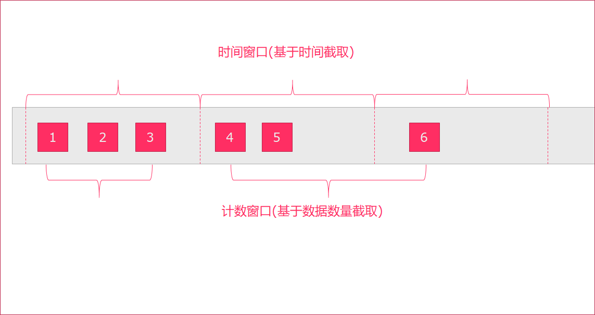
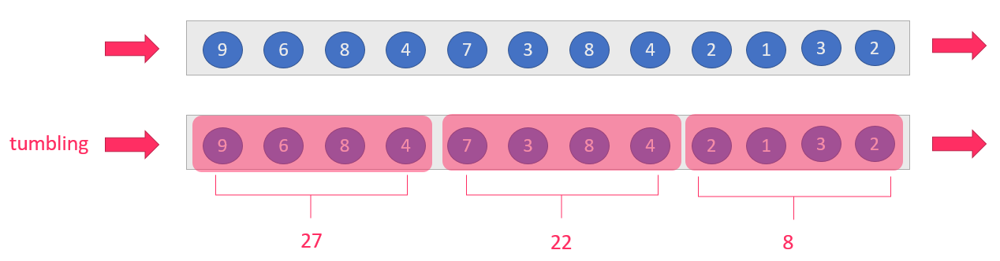
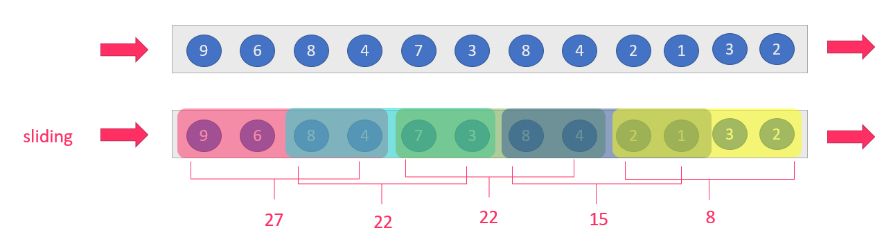
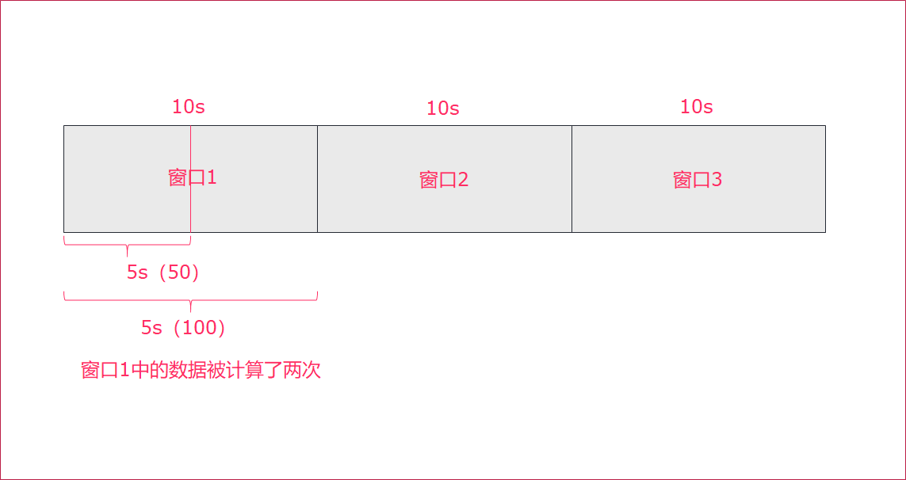
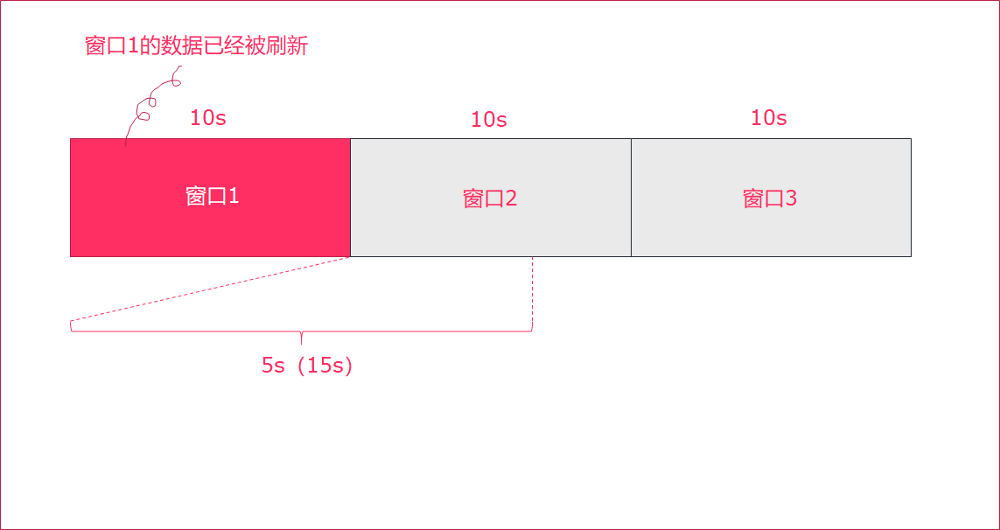
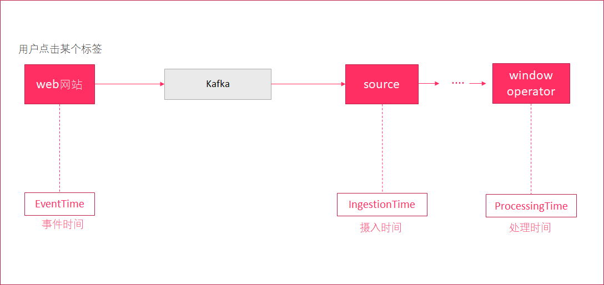
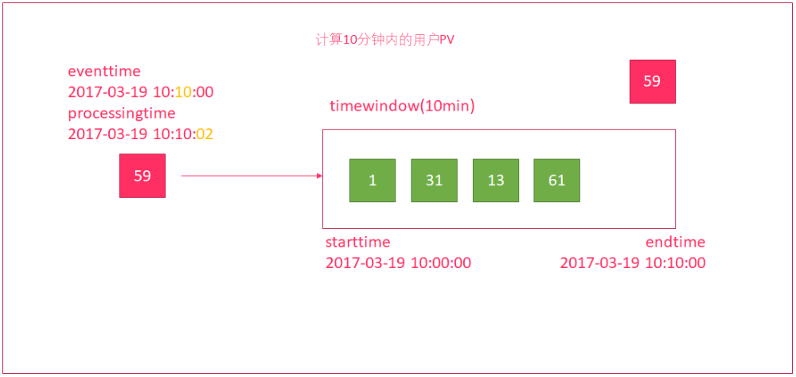
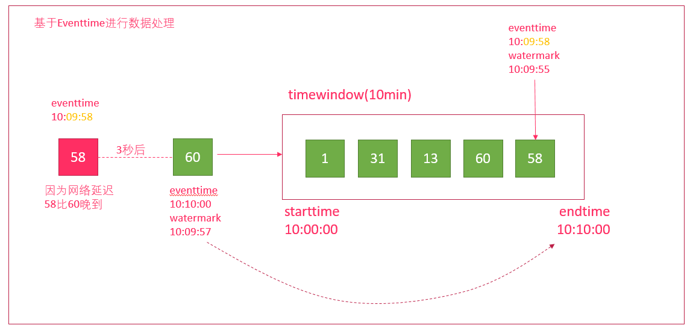

# 44-Flink流处理

# 1.输入数据集DataSource

Flink中可以使用`StreaExecutionEnvironment.getExecutionEnvironment`创建流处理的执行环境

Flink中可以使用`StreamExecutionEnvironment.addSource(source)`来为程序添加数据来源

Flink已经提供了若干实现好了的source functions，当然也可以通过实现`SourceFunction`来自定义非并行的source或者实现`ParallesourceFuntion`接口或者扩展`RichParallelSourceFunction` 来自定义并行的source

Flink在流处理上的source和在批处理上的source基本一致。大致有四类：

- 基于本地集合的source（Collection-based-source）
- 基于文件的source（File-based-source）- 读取文本文件，即符合 TextInputFormat 规范的文件，并将其作为字符串返回
- 基于网络套接字的sourceSocket-based-source）- 从 socket 读取。元素可以用分隔符切分。
- 自定义的source（Custom-source）

## 1.1 基于集合的source

```scala
import org.apache.flink.streaming.api.scala.{DataStream, StreamExecutionEnvironment}
import org.junit.Test

import scala.collection.mutable
import scala.collection.mutable.{ArrayBuffer, ListBuffer}

/**
 * @Class:flink..demo
 * @Descript:
 * @Author:宋天
 * @Date:2020/3/9
 */
class demo {

  @Test
  def collection():Unit = {
//    创建流处理的执行环境
    val senv: StreamExecutionEnvironment = StreamExecutionEnvironment.getExecutionEnvironment
//    导入隐式转换
    import org.apache.flink.api.scala._

//    构建数据源

    //0.用element创建DataStream(fromElements)
    val ds0: DataStream[String] = senv.fromElements("spark", "flink")
    ds0.print()

    //1.用Tuple创建DataStream(fromElements)
    val ds1: DataStream[(Int, String)] = senv.fromElements((1, "spark"), (2, "flink"))
    ds1.print()

    //2.用Array创建DataStream
    val ds2: DataStream[String] = senv.fromCollection(Array("spark", "flink"))
    ds2.print()

    //3.用ArrayBuffer创建DataStream
    val ds3: DataStream[String] = senv.fromCollection(ArrayBuffer("spark", "flink"))
    ds3.print()

    //4.用List创建DataStream
    val ds4: DataStream[String] = senv.fromCollection(List("spark", "flink"))
    ds4.print()

    //5.用List创建DataStream
    val ds5: DataStream[String] = senv.fromCollection(ListBuffer("spark", "flink"))
    ds5.print()

    //6.用Vector创建DataStream
    val ds6: DataStream[String] = senv.fromCollection(Vector("spark", "flink"))
    ds6.print()

    //7.用Queue创建DataStream
    val ds7: DataStream[String] = senv.fromCollection(mutable.Queue("spark", "flink"))
    ds7.print()

    //8.用Stack创建DataStream
    val ds8: DataStream[String] = senv.fromCollection(mutable.Stack("spark", "flink"))
    ds8.print()

    //9.用Stream创建DataStream（Stream相当于lazy List，避免在中间过程中生成不必要的集合）
    val ds9: DataStream[String] = senv.fromCollection(Stream("spark", "flink"))
    ds9.print()

    //10.用Seq创建DataStream
    val ds10: DataStream[String] = senv.fromCollection(Seq("spark", "flink"))
    ds10.print()

    //11.用Set创建DataStream(不支持)
    //val ds11: DataStream[String] = senv.fromCollection(Set("spark", "flink"))
    //ds11.print()

    //12.用Iterable创建DataStream(不支持)
    //val ds12: DataStream[String] = senv.fromCollection(Iterable("spark", "flink"))
    //ds12.print()

    //13.用ArraySeq创建DataStream
    val ds13: DataStream[String] = senv.fromCollection(mutable.ArraySeq("spark", "flink"))
    ds13.print()

    //14.用ArrayStack创建DataStream
    val ds14: DataStream[String] = senv.fromCollection(mutable.ArrayStack("spark", "flink"))
    ds14.print()

    //15.用Map创建DataStream(不支持)
    //val ds15: DataStream[(Int, String)] = senv.fromCollection(Map(1 -> "spark", 2 -> "flink"))
    //ds15.print()

    //16.用Range创建DataStream
    val ds16: DataStream[Int] = senv.fromCollection(Range(1, 9))
    ds16.print()

    //17.用fromElements创建DataStream
    val ds17: DataStream[Long] = senv.generateSequence(1, 9)
    ds17.print()


//    流处理必须手动执行才行
    senv.execute(this.getClass.getName)
  }

}

```

## 1.2 基于文件的source

Flink的流处理可以直接通过`readTestFile()`方法读取文件来创建数据源，如下

```scala
  @Test
  def readTest():Unit = {
    // 1. 获取流处理运行环境
    val env = StreamExecutionEnvironment.getExecutionEnvironment
    // 2. 读取文件
    val textDataStream: DataStream[String] = env.readTextFile("hdfs://bigdata111:9000/flink-datas/score.csv")
    // 3. 打印数据
    textDataStream.print()
    // 4. 执行程序
    env.execute()
  }

```

## 1.3 基于网络套接字的source

上面两种方式创建的数据源一般都是固定的.如果需要源源不断的产生数据,可以使用socket的方式来获取数据,通过调用`socketTextStream()`方法

**示例**

编写Flink程序，接收`socket`的单词数据，并以空格进行单词拆分打印。

```scala
object SocketSource {
  def main(args: Array[String]): Unit = {
    //1. 获取流处理运行环境
    val env = StreamExecutionEnvironment.getExecutionEnvironment
    //  2. 构建socket流数据源，并指定IP地址和端口号
    // hadoop hadoop hive spark
    val socketDataStream: DataStream[String] = env.socketTextStream("bigdata111", 9999)
    //  3. 转换,以空格拆分单词
    val mapDataSet: DataStream[String] = socketDataStream.flatMap(_.split(" "))
    //  4. 打印输出
    mapDataSet.print()
    //  5. 启动执行
    env.execute("WordCount_Stream")
  }
}
```

## 1.4 自定义source

我们也可以通过去实现`SourceFunction`或者它的子类`RichSourceFunction`类来自定义实现一些自定义的source，Kafka创建source数据源类`FlinkKafkaConsumer010`也是采用类似的方式。

### 1.4.1 自定义数据源

**示例:**

自定义数据源, 每1秒钟随机生成一条订单信息(`订单ID`、`用户ID`、`订单金额`、`时间戳`)

```scala
import java.util.UUID
import java.util.concurrent.TimeUnit

import org.apache.flink.streaming.api.functions.source.{RichSourceFunction, SourceFunction}
import org.apache.flink.streaming.api.scala.{DataStream, StreamExecutionEnvironment}

import scala.util.Random

/**
 * @Class:flink..StreanFlinkSqlDemo
 * @Descript:
 * @Author:宋天
 * @Date:2020/3/9
 */
object StreanFlinkSqlDemo {
  def main(args: Array[String]): Unit = {
    // 获取流处理运行环境
    val senv: StreamExecutionEnvironment = StreamExecutionEnvironment.getExecutionEnvironment
    // 创建自定义数据源
    import org.apache.flink.api.scala._
    val orderDataStream: DataStream[Order] = senv.addSource(new RichSourceFunction[Order] {
      override def run(ctx: SourceFunction.SourceContext[Order]): Unit = {
        // 使用for循环生成1000个订单
        for (i <- 0 until 1000) {
          // 随机生成订单ID（UUID）
          val id = UUID.randomUUID().toString
          // 随机生成用户ID（0-2）
          val userId = Random.nextInt(3)
          // 随机生成订单金额（0-100）
          val money = Random.nextInt(101)
          // 时间戳为当前系统时间
          val timestamp = System.currentTimeMillis()
          // 收集数据
          ctx.collect(Order(id, userId, money, timestamp))
          // 每隔1秒生成一个订单
          TimeUnit.SECONDS.sleep(1)
        }
      }

      override def cancel(): Unit = ()
    })

//    打印数据
    orderDataStream.print()
//    执行程序
    senv.execute()
  }
}
// 创建一个订单样例类Order，包含四个字段（订单ID、用户ID、订单金额、时间戳）
case class Order(id:String,userId:Int,money:Long,createTime:Long)
```

### 1.4.2 使用kafka作为数据源

我们可以通过使用`FlinkKafkaConsumer010`来从Kafka中获取消息:

**示例:**

使用Flink流处理方式,读取Kafka的数据,并打印.

**Kafka相关操作: **

> **创建topic**
>
> kafka-topics.sh --create --partitions 3 --replication-factor 2 --topic kafkatopic --zookeeper bigdata111:2181,bigdata222:2181,bigdata333:2181
>
> **模拟生产者**
>
> kafka-console-producer.sh --broker-list bigdata111:9092,bigdata222:9092,bigdata333:9092 --topic kafkatopic
>
> **模拟消费者**
>
> kafka-console-consumer.sh --from-beginning --topic kafkatopic --zookeeper node01:2181,node02:2181,node03:2181

```scala
import java.util.Properties
import org.apache.flink.api.common.serialization.SimpleStringSchema
import org.apache.flink.streaming.api.scala.{DataStream, StreamExecutionEnvironment}
import org.apache.flink.api.scala._
import org.apache.flink.streaming.connectors.kafka.FlinkKafkaConsumer010
import org.apache.kafka.clients.CommonClientConfigs

/**
 * @Class:flink..DataSource_kafka
 * @Descript:
 * @Author:宋天
 * @Date:2020/3/9
 */
object DataSource_kafka {
  def main(args: Array[String]): Unit = {
    //1. 创建流处理环境
    val senv: StreamExecutionEnvironment = StreamExecutionEnvironment.getExecutionEnvironment
    //2. 指定kafka数据流相关的信息
    val kafkaCluster = "bigdata111:9092,bigdata222:9092,bigdata333:9092"
    val kafkaTopicName = "kafkatopic"

    // 3. 创建kafka数据流
    val properties = new Properties()
    properties.setProperty(CommonClientConfigs.BOOTSTRAP_SERVERS_CONFIG,kafkaCluster)

    val kafka010 = new FlinkKafkaConsumer010[String](kafkaTopicName,new SimpleStringSchema(),properties)

    //4. 添加数据源addSource(kafka010)
    val text: DataStream[String] = senv.addSource(kafka010)
    //5. 打印数据
    text.print()

    //6. 执行任务
    senv.execute("flink-kafka-wordcunt")

  }
}

```

### 1.4.3 使用MySql作为数据源

**示例**

自定义数据源, 读取MySql数据库表中的数据

**相关依赖**

```
 <!-- 指定mysql-connector的依赖 -->
 <dependency>
     <groupId>mysql</groupId>
     <artifactId>mysql-connector-java</artifactId>
     <version>5.1.27</version>
 </dependency>
```

```scala
package com.itheima.stream

import java.sql.{Connection, DriverManager, PreparedStatement}

import org.apache.flink.api.scala._
import org.apache.flink.configuration.Configuration
import org.apache.flink.streaming.api.functions.source.RichSourceFunction
import org.apache.flink.streaming.api.functions.source.SourceFunction.SourceContext
import org.apache.flink.streaming.api.scala.{DataStream, StreamExecutionEnvironment}

object DataSource_mysql {
  def main(args: Array[String]): Unit = {
    // 1. 创建流处理环境
    val env = StreamExecutionEnvironment.getExecutionEnvironment
    // 2. 设置并行度
    env.setParallelism(1)
    // 3. 添加自定义MySql数据源
    val source = env.addSource(new MySql_source)
    // 4. 打印结果
    source.print()
    // 5. 执行任务
    env.execute()
  }
}

class MySql_source extends RichSourceFunction[(Int, String, String, String)] {

  override def run(ctx: SourceContext[(Int, String, String, String)]): Unit = {

    // 1. 加载MySql驱动
    Class.forName("com.mysql.jdbc.Driver")
    // 2. 链接MySql
    var connection: Connection = DriverManager.getConnection("jdbc:mysql:///test", "root", "123456")
    // 3. 创建PreparedStatement
    val sql = "select id , username , password , name from user"
    var ps: PreparedStatement = connection.prepareStatement(sql)

    // 4. 执行Sql查询
    val queryRequest = ps.executeQuery()
    // 5. 遍历结果
    while (queryRequest.next()) {
      val id = queryRequest.getInt("id")
      val username = queryRequest.getString("username")
      val password = queryRequest.getString("password")
      val name = queryRequest.getString("name")
      // 收集数据
      ctx.collect((id, username, password, name))
    }
  }

  override def cancel(): Unit = {}
}
```

# 2. DataSream的Transformation

和DataSet批处理一样，DataStream也包括一系列的Transformation操作.

流数据处理和批数据处理有很多操作是类似的，所以就不再一 一讲解。我们主要讲解，和批处理不一样的一些操作。

## 2.1 KeyBy

按照指定的key来进行分流，类似于批处理中的`groupBy`。可以按照索引名/字段名来指定分组的字段.

**示例**

读取socket数据源, 进行单词的计数

先使用`nc -l 9999`监听端口

```scala
import org.apache.flink.streaming.api.scala.{DataStream, StreamExecutionEnvironment}
import org.apache.flink.api.scala._
/**
 * @Class:flink..KeyBy
 * @Descript:
 * @Author:宋天
 * @Date:2020/3/9
 */
object KeyBy {
  def main(args: Array[String]): Unit = {
    // 1.获取流处理运行环境
    val senv = StreamExecutionEnvironment.getExecutionEnvironment
    // 2.设置并行度
    senv.setParallelism(3)
    //3. 获取Socket数据源
    val stream = senv.socketTextStream("bigdata111", 9999, '/n')
    //4. 转换操作,以空格切分,每个元素计数1,以单词分组,累加
    val text = stream.flatMap(_.split("//s"))
      .map((_,1))
      //TODO 逻辑上将一个流分成不相交的分区，每个分区包含相同键的元素。在内部，这是通过散列分区来实现的
      .keyBy(_._1)
      //TODO 这里的sum并不是分组去重后的累加值，如果统计去重后累加值，则使用窗口函数
      .sum(1)
    //5. 打印到控制台
    text.print()
    //6. 执行任务
    senv.execute()
  }
}

```

## 2.2 connect

`Connect`用来将两个DataStream组装成一个`ConnectedStreams`。它用了两个泛型，即不要求两个dataStream的element是同一类型。这样我们就可以把不同的数据组装成同一个结构.

**示例**

读取两个不同类型的数据源，使用connect进行合并打印。

```scala
import java.util.concurrent.TimeUnit

import org.apache.flink.streaming.api.functions.source.SourceFunction
import org.apache.flink.streaming.api.scala.{ConnectedStreams, DataStream, StreamExecutionEnvironment}
import org.apache.flink.api.scala._
/**
 * @Class:flink..connect
 * @Descript:
 * @Author:宋天
 * @Date:2020/3/9
 */
object connect {
  def main(args: Array[String]): Unit = {
    // 1. 创建流式处理环境
    val env = StreamExecutionEnvironment.getExecutionEnvironment
    // 2. 添加两个自定义数据源
    val text1: DataStream[Long] = env.addSource(new MyLongSourceScala)
    val text2: DataStream[String] = env.addSource(new MyStringSourceScala)
    // 3. 使用connect合并两个数据流,创建ConnectedStreams对象
    val connectedStreams: ConnectedStreams[Long, String] = text1.connect(text2)
    // 4. 遍历ConnectedStreams对象,转换为DataStream
    val result: DataStream[Any] = connectedStreams.map(line1 => {
      line1
    }, line2 => {
      line2
    })
    // 5. 打印输出,设置并行度为1
    result.print().setParallelism(1)
    // 6. 执行任务
    env.execute("StreamingDemoWithMyNoParallelSourceScala")
  }

}
/**
 * 创建自定义并行度为1的source
 * 实现从1开始产生递增数字
 */
class MyLongSourceScala extends SourceFunction[Long]{
  var count = 1L;
  var isRuning = true;
  override def run(ctx: SourceFunction.SourceContext[Long]): Unit = {
    while (isRuning){
      ctx.collect(count)
       count += 1
      TimeUnit.SECONDS.sleep(1)
    }
  }

  override def cancel(): Unit = {
    isRuning = false
  }
}
/**
 * 创建自定义并行度为1的source
 * 实现从1开始产生递增字符串
 */
class MyStringSourceScala extends SourceFunction[String] {
  var count = 1L
  var isRunning = true

  override def run(ctx: SourceFunction.SourceContext[String]) = {
    while (isRunning) {
      ctx.collect("str_" + count)
      count += 1
      TimeUnit.SECONDS.sleep(1)
    }
  }

  override def cancel() = {
    isRunning = false
  }
}
```

## 2.3 split和select

`split`就是将一个DataStream分成多个流，用`SplitStream`来表示

DataStream → SplitStream

`select`就是获取分流后对应的数据，跟split搭配使用，从SplitStream中选择一个或多个流

SplitStream → DataStream

**示例**

加载本地集合(1,2,3,4,5,6), 使用split进行数据分流,分为奇数和偶数. 并打印奇数结果

```scala
import org.apache.flink.streaming.api.scala.{DataStream, SplitStream, StreamExecutionEnvironment}
import org.apache.flink.api.scala._
/**
 * @Class:flink..split
 * @Descript:
 * @Author:宋天
 * @Date:2020/3/9
 */
object split {
  def main(args: Array[String]): Unit = {
    // 1. 创建批处理环境
    val env = StreamExecutionEnvironment.getExecutionEnvironment
    // 2. 设置并行度
    env.setParallelism(1)
    // 3. 加载本地集合
    val elements: DataStream[Int] = env.fromElements(1, 2, 3, 4, 5, 6)
    // 4. 数据分流,分为奇数和偶数
    val split_data: SplitStream[Int] = elements.split(
      (num: Int) =>
        num % 2 match {
          case 0 => List("even")
          case 1 => List("odd")
        }
    )
    // 5. 获取分流后的数据
    val even: DataStream[Int] = split_data.select("even")
    val odd: DataStream[Int] = split_data.select("odd")
    val all: DataStream[Int] = split_data.select("odd", "even")

    // 6. 打印数据
    odd.print()

    // 7. 执行任务
    env.execute()
  }
}

```

# 3.Flink在流处理上常见的sink

Flink将数据进行sink操作到本地文件/本地集合/HDFS等和之前的批处理操作一致.这里重点说下sink到Kafka以及MySQL的操作

## 3.1 slink到kafka

首先创建一个topic

```
kafka-console-consumer.sh --from-beginning --topic test2 --zookeeper bigdata111:2181,bigdata222:2181,bigdata333:2181
```

**示例**

读取MySql的数据, 落地到Kafka中

```scala
object DataSink_kafka {
  def main(args: Array[String]): Unit = {
    // 1. 创建流处理环境
    val env = StreamExecutionEnvironment.getExecutionEnvironment
    // 2. 设置并行度
    env.setParallelism(1)
    // 3. 添加自定义MySql数据源
    val source: DataStream[(Int, String, String, String)] = env.addSource(new MySql_source)

    // 4. 转换元组数据为字符串
    val strDataStream: DataStream[String] = source.map(
      line => line._1 + line._2 + line._3 + line._4
    )

    //5. 构建FlinkKafkaProducer010
    val p: Properties = new Properties
    p.setProperty("bootstrap.servers", "bigdata111:9092,bigdata222:9092,bigdata333:9092")
    val sink = new FlinkKafkaProducer010[String]("test2", new SimpleStringSchema(), p)
    // 6. 添加sink
    strDataStream.addSink(sink)
    // 7. 执行任务
    env.execute("flink-kafka-wordcount")
  }
}

class Mysql_source extends RichSourceFunction[(Int,String,String, String)]{
  override def run(ctx: SourceFunction.SourceContext[(Int, String, String, String)]): Unit = {
    //1. 加载mysql驱动
    Class.forName("com.mysql.jdbc.Driver")
    //2. 连接mysql
    val connection: Connection = DriverManager.getConnection("jdbc:mysql://localhost/phpsql", "root", "000000")
    //3. 创建PreparedStatement
    val sql = "select id , user_name , user_pass,edu from user2"
    var ps: PreparedStatement = connection.prepareStatement(sql)

    //4. 执行sql查询
    val queryRequest: ResultSet = ps.executeQuery()
    //5. 遍历结果
    while(queryRequest.next()){
      val id = queryRequest.getInt("id")
      val username = queryRequest.getString("user_name")
      val password = queryRequest.getString("user_pass")
      val name = queryRequest.getString("edu")

      // 收集数据
      ctx.collect((id,username,password,name))

    }
  }

  override def cancel(): Unit = {}
}
```

## 3.2 Sink到MySql

**示例**

加载下列本地集合,导入MySql中

```scala
List(
      (10, "dazhuang", "123456", "大壮"),
      (11, "erya", "123456", "二丫"),
      (12, "sanpang", "123456", "三胖")
    )
```

```scala
import java.sql.{Connection, DriverManager, PreparedStatement}

import org.apache.flink.streaming.api.scala.{DataStream, StreamExecutionEnvironment}
import org.apache.flink.api.scala._
import org.apache.flink.configuration.Configuration
import org.apache.flink.streaming.api.functions.sink.RichSinkFunction
/**
 * @Class:flink..DataSink_mysql
 * @Descript:
 * @Author:宋天
 * @Date:2020/3/10
 */
object DataSink_mysql {
  def main(args: Array[String]): Unit = {
    //1.创建流执行环境
    val env = StreamExecutionEnvironment.getExecutionEnvironment
    //2.准备数据
    val value: DataStream[(Int, String, String, String)] = env.fromCollection(List(
      (10, "dazhuang", "123456", "大壮"),
      (11, "erya", "123456", "二丫"),
      (12, "sanpang", "123456", "三胖")
    ))
    // 3. 添加sink
    value addSink new MySql_Sink
    //4.触发流执行
    env.execute()
  }

}


// 自定义落地MySql的Sink
class MySql_Sink extends RichSinkFunction[(Int, String, String, String)] {

  private var connection: Connection = null
  private var ps: PreparedStatement = null

  override def open(parameters: Configuration): Unit = {
    //1:加载驱动
    Class.forName("com.mysql.jdbc.Driver")
    //2：创建连接
    connection = DriverManager.getConnection("jdbc:mysql:///phpsql", "root", "000000")
    //3:获得执行语句
    val sql = "insert into user(id , username , password , name) values(?,?,?,?);"
    ps = connection.prepareStatement(sql)
  }

  override def invoke(value: (Int, String, String, String)): Unit = {
    try {
      //4.组装数据，执行插入操作
      ps.setInt(1, value._1)
      ps.setString(2, value._2)
      ps.setString(3, value._3)
      ps.setString(4, value._4)
      ps.executeUpdate()
    } catch {
      case e: Exception => println(e.getMessage)
    }
  }

  //关闭连接操作
  override def close(): Unit = {
    if (connection != null) {
      connection.close()
    }
    if (ps != null) {
      ps.close()
    }
  }
}
```

# 4.Flink的Window操作

Flink 认为 Batch 是 Streaming 的一个特例，所以 Flink 底层引擎是一个流式引擎，在上面实现了流处理和批处理。而窗口（window）就是从 Streaming 到 Batch 的一个桥梁。Flink 提供了非常完善的窗口机制。

## 4.1 什么是window

在流处理应用中，数据是连续不断的，因此我们不可能等到所有数据都到了才开始处理。当然我们可以每来一个消息就处理一次，但是有时我们需要做一些聚合类的处理，例如：在过去的1分钟内有多少用户点击了我们的网页。在这种情况下，我们必须定义一个窗口，用来收集最近一分钟内的数据，并对这个窗口内的数据进行计算。

如果在数据流上，截取固定大小的一部分，这部分是可以进行统计的。 截取方式主要有两种:

>   1.  根据`时间`进行截取(time-driven-window)，比如每1分钟统计一次或每10分钟统计一次。
>   2.  根据`消息数量`进行截取(data-driven-window)，比如每5个数据统计一次或每50个数据统计一次。



## 4.2 时间窗口

我们先提出一个问题：统计经过某红绿灯的汽车数量之和？ 
假设在一个红绿灯处，我们每隔15秒统计一次通过此红绿灯的汽车数量，如下图：


可以把汽车的经过看成一个流，无穷的流，不断有汽车经过此红绿灯，因此无法统计总共的汽车数量。但是，我们可以换一种思路，每隔15秒，我们都将与上一次的结果进行sum操作（滑动聚合, 但是这个结果似乎还是无法回答我们的问题，根本原因在于流是无界的，我们不能限制流，但可以在有一**有界**的范围内处理**无界**的流数据。

因此，我们需要换一个问题的提法：**每分钟经过某红绿灯的汽车数量之和？** 
这个问题，就相当于一个定义了一个Window（窗口），window的界限是1分钟，且每分钟内的数据互不干扰，因此也可以称为翻滚（不重合）窗口，如下图： 



第一分钟的数量为8，第二分钟是22，第三分钟是27。。。这样，1个小时内会有60个window。

再考虑一种情况**，每30秒统计一次过去1分钟的汽车数量之和：** 



**此时，window出现了重合。这样，1个小时内会有120个window。**

### 4.2.1  tumbling-time-window (翻滚窗口-无重叠数据)

按照`时间`来进行窗口划分,每次窗口的`滑动距离`等于窗口的长度,这样数据不会重复计算,我们参考上面的案例

代码如下:

```scala

import org.apache.flink.streaming.api.scala.{DataStream, KeyedStream, StreamExecutionEnvironment}
import org.apache.flink.streaming.api.windowing.time.Time

/**
 * @Class:flink..StreamingTumblingTimeWindow
 * @Descript:
 * @Author:宋天
 * @Date:2020/3/10
 */
object StreamingTumblingTimeWindow {


  def main(args: Array[String]): Unit = {
    //1. 创建运行环境
    val senv: StreamExecutionEnvironment = StreamExecutionEnvironment.getExecutionEnvironment
    //2. 定义数据来源
    val textStream: DataStream[String] = senv.socketTextStream("bigdata111", 9999)
    //3. 转换数据格式 text -> carwc
    import org.apache.flink.api.scala._
    val data: DataStream[WordCountCart] = textStream.map(
      line => {
        val array = line.split(",")
        WordCountCart(array(0).toInt, array(1).toInt)
      }
    )
    //4. 执行统计操作，每个sensorId一个tumbling窗口，窗口大小为5秒
    // 也就是说，5秒钟统计一次，在这过去的5秒钟内，各个路口通过红绿灯汽车的数量
    val keyByData: KeyedStream[WordCountCart, Int] = data.keyBy(line => line.sen)
    //无重叠数据，所以只需要给一个参数即可，每5秒钟统计一下各个路口通过红绿灯的数量
    val result: DataStream[WordCountCart] = keyByData.timeWindow(Time.seconds(5)).sum(1)
    //5. 显示统计结果
    result.print()
    //6. 触发流式计算
    senv.execute()
  }
}
/**
 * @param sen     哪个红绿灯
 * @param cardNum 多少辆车
 */
case class WordCountCart(sen: Int, cardNum: Int)
```

### 4.2.2 sliding-time-window (滑动窗口-有重叠数据)

按照时间来进行窗口划分,每次窗口的滑动距离小于窗口的长度,这样数据就会有一部分重复计算,我们参考上面的案例



```scala

import org.apache.flink.streaming.api.scala.{DataStream, KeyedStream, StreamExecutionEnvironment}
import org.apache.flink.streaming.api.windowing.time.Time

/**
 * @Class:flink..StreamingTimeSlidingWindow
 * @Descript:
 * @Author:宋天
 * @Date:2020/3/10
 */
object StreamingTimeSlidingWindow {
  def main(args: Array[String]): Unit = {
    //1. 创建运行环境
    val senv: StreamExecutionEnvironment = StreamExecutionEnvironment.getExecutionEnvironment
    //2. 定义数据源
    val textStream: DataStream[String] = senv.socketTextStream("bigdata111", 9999)
    //3. 转换数据格式 text->Carwc
    import org.apache.flink.api.scala._
    val data: DataStream[WordCountCart] = textStream.map(
      line => {
        val array = line.split(",")
        WordCountCart(array(0).toInt, array(1).toInt)
      }
    )
    //4. 执行统计操作，每个sensorId一个tumbling窗口，窗口大小为5秒
    // 也就是说，2秒钟统计一次，在这过去的10秒钟内，各个路口通过红绿灯汽车的数量
    val keyByData: KeyedStream[WordCountCart, Int] = data.keyBy(line => line.sen)
    //无重叠数据，所以只需要给一个参数即可，每5秒钟统计一下各个路口通过红绿灯的数量
    val result: DataStream[WordCountCart] = keyByData.timeWindow(Time.seconds(10),Time.seconds(2)).sum(1)
    //5. 显示统计结果
    result.print()
    //6. 触发流式计算
    senv.execute()
  }

}
case class WordCountCart(sen: Int, cardNum: Int)
```

### 4.2.3 小结

1. 如果窗口计算时间 > 窗口时间，会出现数据丢失

   

2. 如果窗口计算时间 < 窗口时间，会出现数据重复计算

   

3. 如果窗口计算时间 = 窗口时间，数据不会被重复计算

   

## 4.3 Count-Window

### 4.3.1 tumbling-count-window (无重叠数据)

按照个数进行统计，比如：

每个路口分别统计，收到关于它的5条消息时,统计在最近5条消息中，各自路口通过的汽车数量

代码如下:

```scala
import org.apache.flink.streaming.api.scala.{DataStream, KeyedStream, StreamExecutionEnvironment}
import org.apache.flink.streaming.api.windowing.time.Time

/**
 * @Class:flink..StreamingCountTumblingWindow
 * @Descript:
 * @Author:宋天
 * @Date:2020/3/10
 */
object StreamingCountTumblingWindow {
  def main(args: Array[String]): Unit = {
    //1. 创建运行环境
    val senv: StreamExecutionEnvironment = StreamExecutionEnvironment.getExecutionEnvironment
    //2. 定义数据源
    val textStream: DataStream[String] = senv.socketTextStream("bigdata111", 9999)
    //3. 转换数据格式 text->Carwc
    import org.apache.flink.api.scala._
    val data: DataStream[WordCountCart] = textStream.map(
      line => {
        val array = line.split(",")
        WordCountCart(array(0).toInt, array(1).toInt)
      }
    )
    //4. 执行统计操作，每个sensorId一个tumbling窗口，窗口大小为5秒
    // 按照key进行收集，对应的key出现的次数达到3次作为一个结果
    val keyByData: KeyedStream[WordCountCart, Int] = data.keyBy(line => line.sen)
    //相同的key出现三次才做一次sum聚合
    val result: DataStream[WordCountCart] = keyByData.countWindow(3).sum(1)
    //5. 显示统计结果
    result.print()
    //6. 触发流式计算
    senv.execute()
  }
}
case class WordCountCart(sen: Int, cardNum: Int)
```

#### 4.3.2 sliding-count-window (有重叠数据)

同样也是窗口长度和滑动窗口的操作：窗口长度是5，滑动长度是3

```scala
import org.apache.flink.streaming.api.scala.{DataStream, KeyedStream, StreamExecutionEnvironment}

/**
 * @Class:flink..StreamingCountSlidingWindow
 * @Descript:
 * @Author:宋天
 * @Date:2020/3/10
 */
object StreamingCountSlidingWindow {
  def main(args: Array[String]): Unit = {
    //1. 创建运行环境
    val senv: StreamExecutionEnvironment = StreamExecutionEnvironment.getExecutionEnvironment
    //2. 定义数据源
    val textStream: DataStream[String] = senv.socketTextStream("bigdata111", 9999)
    //3. 转换数据格式 text->Carwc
    import org.apache.flink.api.scala._
    val data: DataStream[WordCountCart] = textStream.map(
      line => {
        val array = line.split(",")
        WordCountCart(array(0).toInt, array(1).toInt)
      }
    )
    //4. 执行统计操作，每个sensorId一个sliding窗口，窗口大小3条数据,窗口滑动为3条数据
    // 也就是说，每个路口分别统计，收到关于它的3条消息时统计在最近5条消息中，各自路口通过的汽车数量
    val keyByData: KeyedStream[WordCountCart, Int] = data.keyBy(line => line.sen)
    //相同的key出现三次才做一次sum聚合
    val result: DataStream[WordCountCart] = keyByData.countWindow(5,3).sum(1)
    //5. 显示统计结果
    result.print()
    //6. 触发流式计算
    senv.execute()
  }

}
case class WordCountCart(sen: Int, cardNum: Int)
```

## 4.4 window apply

apply方法可以进行一些自定义处理，通过匿名内部类的方法来实现。当有一些复杂计算时使用。


**用法**

1. 实现`WindowFunction`类
2. 指定该类的泛型为`[输入数据类型, 输出数据类型, keyBy中使用分组字段的类型, 窗口类型]`

```scala
import org.apache.flink.streaming.api.scala.function.WindowFunction
import org.apache.flink.streaming.api.scala.{DataStream, KeyedStream, StreamExecutionEnvironment}
import org.apache.flink.streaming.api.windowing.time.Time
import org.apache.flink.streaming.api.windowing.windows.TimeWindow
import org.apache.flink.util.Collector

/**
 * @Class:flink..WindowApply
 * @Descript:
 * @Author:宋天
 * @Date:2020/3/10
 */
object WindowApply {
  def main(args: Array[String]): Unit = {
    //1. 创建运行环境
    val senv: StreamExecutionEnvironment = StreamExecutionEnvironment.getExecutionEnvironment
    //2. 定义数据源
    val socketDataStream: DataStream[String] = senv.socketTextStream("bigdata111", 9999)
    //3.  对接收到的数据转换成单词元组
    import org.apache.flink.api.scala._
    val wordcountDataStream: DataStream[(String, Int)] = socketDataStream.flatMap {
      text =>
        text.split(" ").map(_ -> 1)
    }
    
    //4. 使用keyBy进行分流（分组）
    val groupedDataStream: KeyedStream[(String, Int), String] = wordcountDataStream.keyBy(_._1)
    // 5. 使用`timeWinodw`指定窗口的长度（每3秒计算一次）
    val windowedDataStream = groupedDataStream.timeWindow(Time.seconds(3))

    // 6. 实现一个WindowFunction匿名内部类
    val resultDataStream: DataStream[(String, Int)] = windowedDataStream.apply(new WindowFunction[(String, Int), (String, Int), String, TimeWindow] {

      //   - 在apply方法中实现聚合计算
      override def apply(key: String, window: TimeWindow, input: Iterable[(String, Int)], out: Collector[(String, Int)]): Unit = {
        val resultWordCount: (String, Int) = input.reduce {
          (wc1, wc2) =>
            (wc1._1, wc1._2 + wc2._2)
        }
        //   - 使用Collector.collect收集数据
        out.collect(resultWordCount)
      }
    })

    // 7. 打印输出
    resultDataStream.print()

    // 8. 启动执行
    senv.execute("App")

  }
}

```

# 5. Flink的水印机制

### 5.1. Flink流处理时间方式

- EventTime[事件时间]

  事件发生的时间，例如：点击网站上的某个链接的时间

- IngestionTime[摄入时间]

  某个Flink节点的source operator接收到数据的时间，例如：某个source消费到kafka中的数据

- ProcessingTime[处理时间]

  某个Flink节点执行某个operation的时间，例如：timeWindow接收到数据的时间



设置Flink流处理的时间类型（一般在生产环境中，都是使用EventTime来进行计算的）

```scala
// 设置为按照事件时间来进行计算
env.setStreamTimeCharacteristic(TimeCharacteristic.EventTime)
// 设置为按照处理时间来进行计算
env.setStreamTimeCharacteristic(TimeCharacteristic.ProcessingTime)
```

### 5.2. 水印机制产生的原因

在实际环境中，经常会出现，因为网络原因，数据有可能会`延迟`一会才到达Flink实时处理系统。

我们来设想一下下面这个场景:



1.  使用时间窗口来统计10分钟内的用户流量
2.  有一个时间窗口
    -   开始时间为：2017-03-19 10:00:00
    -   结束时间为：2017-03-19 10:10:00
3.  有一个数据，因为网络延迟
    -   事件发生的时间为：2017-03-19 10:`10`:00
    -   但进入到窗口的时间为：2017-03-19 10:10:`02`，延迟了2秒中
4.  时间窗口并没有将`59`这个数据计算进来，导致数据统计不正确

**这种处理方式，根据消息进入到window时间，来进行计算。在网络有延迟的时候，会引起计算误差。**

## 5.3 使用水印解决网络延迟问题	

水印（watermark）就是一个`时间戳`，Flink可以给数据流添加水印，可以理解为：收到一条消息后，额外给这个消息添加了一个时间字段，这就是**添加水印**。

-   水印并不会影响原有Eventtime
-   当数据流添加水印后，会按照水印时间来触发窗口计算
-   一般会设置水印时间，比Eventtime小几秒钟
-   当接收到的`水印时间 >= 窗口的endTime`，则触发计算



**示例**

编写代码, 计算5秒内，用户的订单总额

订单数据（订单ID——UUID、用户ID、时间戳、订单金额），要求`添加水印`来解决网络延迟问题。

**步骤**

1.  创建流处理运行环境
2.  设置处理时间为`EventTime`
3.  创建一个订单样例类`Order`，包含四个字段（订单ID、用户ID、订单金额、时间戳）
4.  创建一个自定义数据源
    -   随机生成订单ID（UUID）
    -   随机生成用户ID（0-2）
    -   随机生成订单金额（0-100）
    -   时间戳为当前系统时间
    -   每隔1秒生成一个订单
5.  添加水印
    -   允许延迟2秒
    -   在获取水印方法中，打印水印时间、事件时间和当前系统时间
6.  按照用户进行分流
7.  设置5秒的时间窗口
8.  进行聚合计算
9.  打印结果数据
10.  启动执行流处理

```scala


import java.util.UUID
import java.util.concurrent.TimeUnit

import org.apache.commons.lang.time.FastDateFormat
import org.apache.flink.api.scala._
import org.apache.flink.streaming.api.TimeCharacteristic
import org.apache.flink.streaming.api.functions.AssignerWithPeriodicWatermarks
import org.apache.flink.streaming.api.functions.source.{RichSourceFunction, SourceFunction}
import org.apache.flink.streaming.api.scala.{DataStream, StreamExecutionEnvironment}
import org.apache.flink.streaming.api.watermark.Watermark
import org.apache.flink.streaming.api.windowing.time.Time

import scala.util.Random

object WatermarkDemo {

  //  3. 创建一个订单样例类`Order`，包含四个字段（订单ID、用户ID、订单金额、时间戳）
  case class Order(orderId: String, userId: Int, money: Long, timestamp: Long)

  def main(args: Array[String]): Unit = {
    //  1. 创建流处理运行环境
    val env = StreamExecutionEnvironment.getExecutionEnvironment
    //  2. 设置处理时间为`EventTime`
    env.setStreamTimeCharacteristic(TimeCharacteristic.EventTime)

    //  4. 创建一个自定义数据源
    val orderDataStream: DataStream[Order] = env.addSource(new RichSourceFunction[Order] {
      var isRunning = true

      override def run(ctx: SourceFunction.SourceContext[Order]): Unit = {
        while (isRunning) {
          //   - 随机生成订单ID（UUID）
          // - 随机生成用户ID（0-2）
          // - 随机生成订单金额（0-100）
          // - 时间戳为当前系统时间
          // - 每隔1秒生成一个订单
          val order = Order(UUID.randomUUID().toString, Random.nextInt(3), Random.nextInt(101), new java.util.Date().getTime)
          ctx.collect(order)
          TimeUnit.SECONDS.sleep(1)
        }
      }

      override def cancel(): Unit = isRunning = false
    })
    //  5. 添加水印

    val watermarkDataStream: DataStream[Order] = orderDataStream.assignTimestampsAndWatermarks(
      new AssignerWithPeriodicWatermarks[Order] {

        // 允许延迟2秒
        val delayTime = 2000L
        // 当前时间戳
        var currentTimestamp = 0L

        // 获取水印时间
        override def getCurrentWatermark: Watermark = {
          val watermark = new Watermark(currentTimestamp - delayTime)
          // - 在获取水印方法中，打印水印时间、事件时间和当前系统时间
          val dateFormat: FastDateFormat = FastDateFormat.getInstance("HH:mm:ss")
          println(s"水印时间:${dateFormat.format(watermark.getTimestamp)}," +
            s"事件时间:${dateFormat.format(currentTimestamp)}," +
            s"系统时间:${dateFormat.format(System.currentTimeMillis())}")

          watermark
        }

        // 抽取当前时间戳
        override def extractTimestamp(element: Order, previousElementTimestamp: Long): Long = {
          // 比对两个元素的时间,求最大值
          currentTimestamp = Math.max(element.timestamp, previousElementTimestamp)
          currentTimestamp
        }
      })


    //  6. 按照用户进行分流
    //  7. 设置5秒的时间窗口
    //  8. 进行聚合计算
    val resultDataStream: DataStream[Order] = watermarkDataStream.
      keyBy(_.userId).
      timeWindow(Time.seconds(5))
      .reduce((p1, p2) => Order(p1.orderId, p1.userId, p1.money + p2.money, 0L))

    //  9. 打印结果数据
    resultDataStream.print()

    //  10. 启动执行流处理
    env.execute()
  }

}

```

