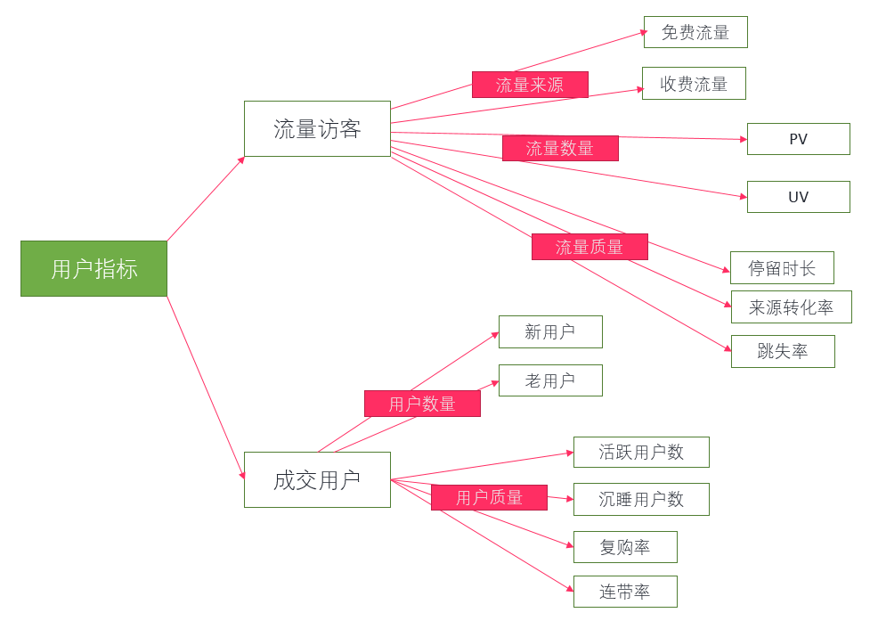
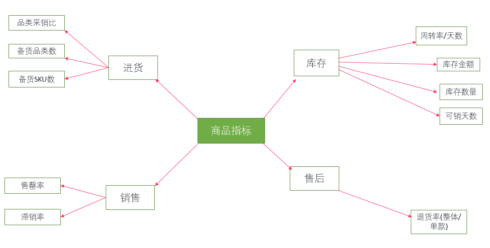
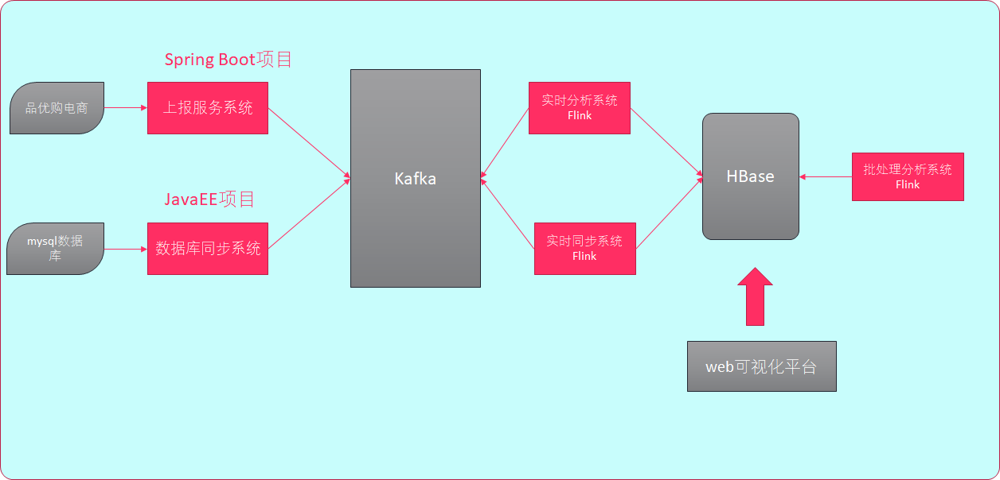
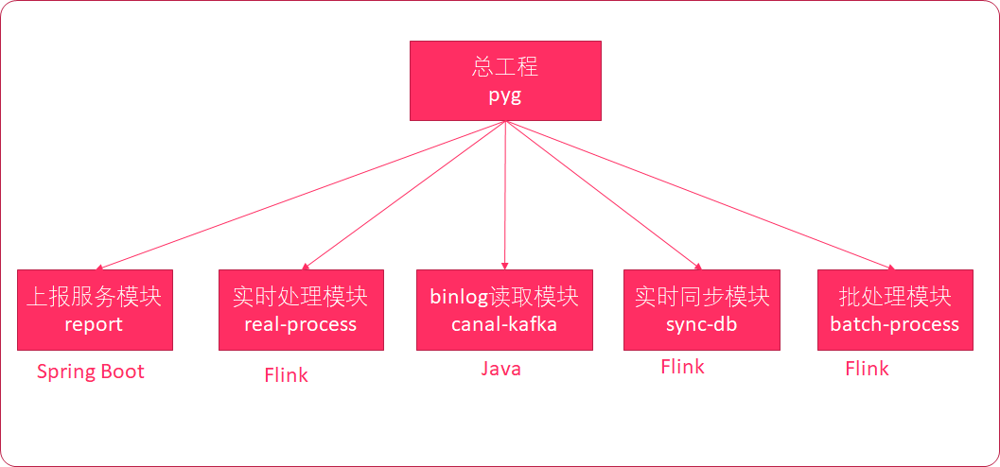
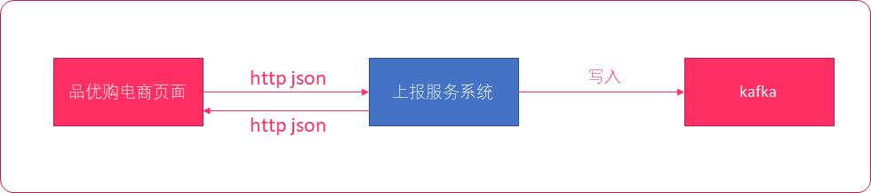
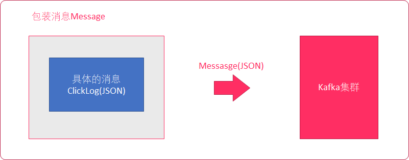
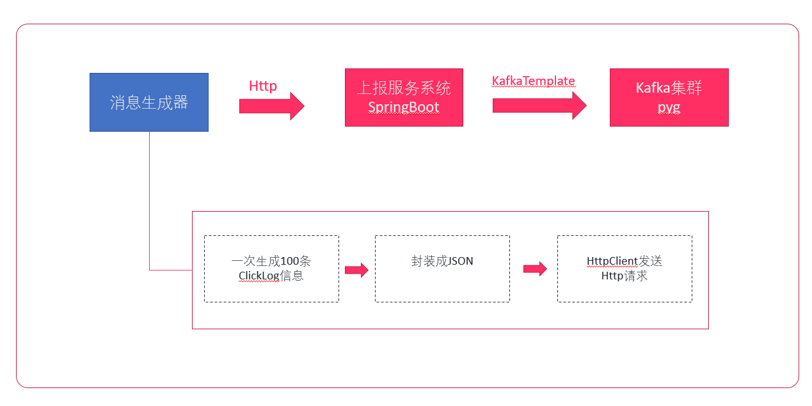
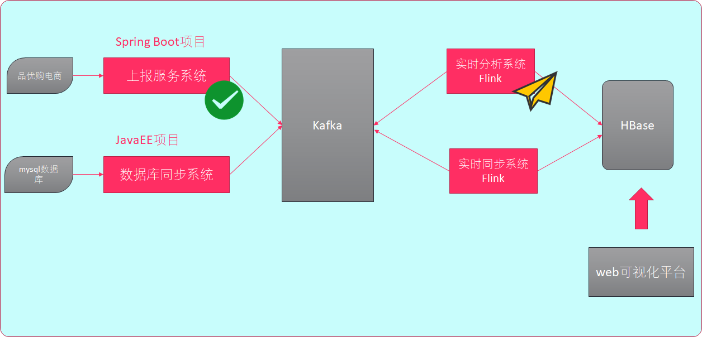
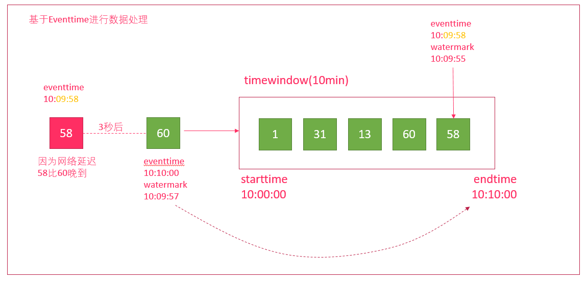

# 46-Flink电商指标分析项目-01

# 1. 项目背景

## 1.1 项目简介

- 公司有一个正在运营中的电商网站，名称叫做【品优购】。这是一个B2B2C的电商平台，类似京东。
- 现在我们想了解一下该电商网站的各种用户行为（访问行为、购物行为、点击行为等），统计出PV、UV等数据。
- 针对这样的大数据分析项目，我们可以采用MapReduce、Spark或者Flink来进行开发。
- 由于本项目会对实时数据和静态数据进行分析，所以我们采用性能更加优越的Flink来开发。

**业务目标**

- 帮助产品经理、数据分析师以及管理人员分析现有产品的情况
- 根据用户行为分析结果持续改进产品的设计
- 调整公司战略和业务
- 用大数据技术来帮助提升业绩、营业额以及市场占有率

> **常见电商模式**
>
> C2C--个人对个人 案例：淘宝、瓜子二手车
>
> B2B--企业对企业 案例：阿里巴巴、慧聪网
>
> B2C--企业对个人 案例：唯品会、乐蜂网
>
> B2B2C -企业-企业-个人 案例：京东商城、天猫商城
>
> C2B--个人对企业 案例：海尔商城、 尚品宅配
>
> O2O--线上到线下 案例：美团、饿了么

## 1.2 多维度指标分析

**用户指标**



**商品指标**



> **电商小概念: **
>
> **SPU** = Standard Product Unit （标准产品单位）SPU是商品信息聚合的最小单位，是一组可复用、易检索的标准化信息的集合，该集合描述了一个产品的特性。	例如：iPhone X 可以确定一个产品即为一个SPU。
>
> **SKU **= Stock Keeping Unit（库存量单位）。一款商品有多个颜色，则是有多个SKU，例：一件衣服，有红色、白色、蓝色，则SKU编码也不相同，如相同则会出现混淆，发错货。	例如：iPhone X 64G 银色 则是一个SKU。

# 2. 项目整体介绍

## 2.1 项目使用到的技术

* 语言

  **Java、scala**

* 框架

  **Spring Boot、Hadoop、HBase、Kafka、Flink、Canal**

## 2.2 项目整体流程



1. `上报服务系统`将商城访问日志推送到`kafka`
2. `数据库同步系统`将mysql数据推送到`kafka`
3. `实时分析系统`消费`kafka`数据，经过分析后，下沉到`HBase`
4. `实时同步系统`消费kafka数据，下沉到`HBase`
5. `批处理分析系统`从hbase取出数据，进行数据分析
6. `web可视化平台`展示HBase中的分析结果数据

# 3.项目的技术选型

为什么要选择架构中的技术？

* Kafka
* Hbase
* Canal
* Flink

## 3.1. Kafka

Kafka是一种高吞吐量的分布式发布订阅消息系统。

- 吞吐量高
  - 每秒达到几十万的数据
- 速度快
  - 内存接力（消费者直接消费PageCache内存区数据）
- 数据安全
  - 冗余机制可以有效避免消息丢失错误
  - 其中几台实例挂掉也可以继续工作
- 高并发
  - 突发型流量可以将峰值的数据持久化，等到流量正常或低估时再取出消费

## 3.2. HBase

HBase是一个分布式的、面向列的开源数据库。

* 业务不复杂

  * PV/UV、页面点击量、新鲜度（没有复杂SQL查询）

* 实时电商平台

  * 存取海量的数据，一个表可以有上亿行，上百万列

* 社区活跃

  Hbase社区非常大，Facebook、小米、网易等公司都在使用HBase

* 高可用

  没有单点故障，高可用性高

## 3.3. Canal

数据库同步常用的有两种方案：

- 方案1

  `mysql --> logstash --> kafka --> flink --> hbase`

- 方案2

  `mysql --> sqoop --> kafka --> flink-->hbase`

**上述方案存在的问题**

logstash、sqoop还是需要**使用SQL语句查询mysql**，会给mysql增加压力，如果要跑大量数据的同步，会拖垮mysql

- 解决方案

  `mysql --> cannal(binlog) --> kafka --> flink --> hbase`

**cannal**

Canal可以实时解析mysql的`binlog`日志，通过读取binlog日志，将数据输出到Kafka。**不需要执行SQL语句**，不会增加mysql压力

## 3.4. Flink

* 速度要比Spark、MapReduce更快
* 保证EXACTLY_ONCE
* 容错更轻量级
* 自动程序调优，自动避免性能消耗较大的操作（例如：shuffle、sort）
* 高吞吐


> 问题：
>
> 为什么要选择基于canal来进行数据库同步技术？

# 4. 项目整体工程搭建

本项目采用`Maven`构建，下面是我们的项目的整体工程架构。总工程为pyg，下面包含我们要开发的5个子模块。



**IDEA创建工程**

1. 在在指定目录创建父模块`pyg`，**删除**总工程的`src`目录

   在福模块配置java版本为1.8

   ```xml
   <build>
       <plugins>
           <plugin>
               <groupId>org.apache.maven.plugins</groupId>
               <artifactId>maven-compiler-plugin</artifactId>
               <version>3.1</version>
               <configuration>
                   <source>1.8</source>
                   <target>1.8</target>
               </configuration>
           </plugin>
       </plugins>
   </build>
   ```

2. 创建`report`模块

3. 创建`real-process`实时处理Maven模块

4. 创建`canal-kafka`数据采集Maven模块

5. 创建`sync-db`数据库同步处理Maven模块

6. 创建`batch-process`批数据处理Maven模块

# 5. 上报服务系统开发

## 5.1 Spring Boot 简介

Spring Boot是一个基于Spring之上的快速应用构建框架。使用Spring Boot可以快速开发出基于Spring的应用。Spring Boot主要解决两方面的问题。

* 依赖太多问题

  * 轻量级JavaEE开发，需要导入大量的依赖

  * 依赖之间还存在版本冲突

* 配置太多问题

  * 大量的XML配置

Spring Boot内部整合了大量的依赖，而且经过大量测试，选择的依赖都是没有版本冲突的

Spring Boot简化了大量的配置，通过少量的配置，就可以让程序工作。

**开发Spring Boot程序的基本步骤**

* 导入Spring Boot依赖（起步依赖）
* 编写`application.properties`配置文件
* 编写`Application`入口程序

## 5.2 导入maven依赖

注意：是主目录下的依赖，而不是创建的小模块的依赖

```xml
<?xml version="1.0" encoding="UTF-8"?>
<project xmlns="http://maven.apache.org/POM/4.0.0"
         xmlns:xsi="http://www.w3.org/2001/XMLSchema-instance"
         xsi:schemaLocation="http://maven.apache.org/POM/4.0.0 http://maven.apache.org/xsd/maven-4.0.0.xsd">
    <modelVersion>4.0.0</modelVersion>

    <parent>
        <groupId>org.springframework.boot</groupId>
        <artifactId>spring-boot-starter-parent</artifactId>
        <version>1.5.13.RELEASE</version>
        <relativePath/> <!-- lookup parent from repository -->
    </parent>

    <groupId>org.example</groupId>
    <artifactId>pyg</artifactId>
    <version>1.0-SNAPSHOT</version>

    <packaging>pom</packaging>

    <modules>
        <module>report</module>
        <module>real-process</module>
        <module>canal-kafka</module>
        <module>sync-db</module>
        <module>batch-process</module>
    </modules>


    <build>
        <plugins>
            <plugin>
                <groupId>org.springframework.boot</groupId>
                <artifactId>spring-boot-maven-plugin</artifactId>
            </plugin>
        </plugins>
    </build>

</project>
```

## 5.3 创建项目包结构

在模块report中，创建以下包

| 包名                     | 说明                       |
| ------------------------ | -------------------------- |
| com.it.report.controller | 存放Spring MVC的controller |
| com.it.report.bean       | 存放相关的Java Bean实体类  |
| com.it.report.util       | 用来存放相关的工具类       |

## 5.4  验证Spring Boot工程是否创建成功

**步骤**

1. 创建SpringBoot`入口程序`Application
2. 创建`application.properties`配置文件
3. 编写一个简单`Spring MVC` Controller/Handler，接收浏览器请求参数并打印回显
4. 打开浏览器测试

**实现**

1. 创建SpringBoot入口程序`ReportApplication`，用来启动SpringBoot程序

   在`com.it.report`包下创建名为`ReportApplication`的java文件

   ```java
   package com.it.report;
   
   import org.springframework.boot.SpringApplication;
   import org.springframework.boot.autoconfigure.SpringBootApplication;
   
   /**
    * @Class:pyg.com.it.report.ReportApplication
    * @Descript:
    * @Author:宋天
    * @Date:2020/3/13
    */
   // 表示该类是个启动类
   @SpringBootApplication
   public class ReportApplication {
       public static void main(String[] args) {
           //用来运行Spring Boot程序
           SpringApplication.run(ReportApplication.class,args);
       }
   
   }
   
   ```

2. 在创建一个`TestController`

   在`com.it.report.controlle`包下创建名为`TestController`的java文件

   ```java
   package com.it.report.controlle;
   
   import org.springframework.web.bind.annotation.RequestMapping;
   import org.springframework.web.bind.annotation.RestController;
   
   /**
    * @Class:pyg.com.it.report.controlle.TestController
    * @Descript:
    * @Author:宋天
    * @Date:2020/3/13
    */
   
   // 表示这是一个Controller，并且其中所有的方法都带有@ResponseBody
   @RestController
   public class TestController {
   
       //该方法从浏览器上接收一个叫做json参数，并打印回显
       @RequestMapping("/test")
       public String test(String json){
           System.out.println(json);
           return json;
       }
   }
   
   ```

3. 编写`application.properties`配置文件

   配置端口号8888（可不进行配置，默认为8080端口）

   在目录`report`的`resource`目录下创建`application.properties`文件，并添加以下内容

   ```
   server.port=8888
   ```

4. 启动Spring Boot程序

5. 打开浏览器测试Handler是否能够接收到数据

     http://localhost:8888/test?json=123123

## 5.5 安装kafka-Manager

Kafka-manager是Yahoo!开源的一款Kafka监控管理工具。

**安装步骤**

1. 上传并解压安装包

2. 修改配置文件`conf/application.conf`

   ```
   kafka-manager.zkhosts="bigdata111:2181,bigdata222:2181,bigdata333:2181"
   ```

3. 启动zookeeper

   三台全部启动

   ```
   zkServer.sh start
   ```

4. 启动kafka

   三台全部启动

   ```
   bin/kafka-server-start.sh config/server.properties > /dev/null 2>&1 &
   ```

5. 运行kafka-Manager

   ```
   nohup bin/kafka-manager 2>&1 &
   ```

6. 浏览器中访问

   bigdata111:9000

> 默认kafka-manager的端口号为`9000`，如果该端口被占用，请使用下面的命令修改端口
>
> bin/kafka-manager -Dconfig.file=/opt/module/kafka-manager-1.3.3.7/conf/application.conf -Dhttp.port=10086

## 5.6 编写kafka生产者配置工具类

由于我们项目要操作Kafka, 我们先来构建出KafkaTemplate, 这是一个Kafka的模板对象, 通过它我们可以很方便的发送消息到Kafka. 

**开发步骤**

1. 编写Kafka生产者配置
2. 编写Kafka生产者SpringBoot配置工具类`KafkaProducerConfig`,构建`KafkaTemplate`

**实现**

1. 导入Kafka生产者配置文件

   将下面的代码拷贝到`application.properties`中

   ```
   #
   # kakfa
   #
   #kafka的服务器地址
   kafka.bootstrap_servers_config=bigdata111:9092,bigdata222:9092,bigdata333:9092
   #如果出现发送失败的情况，允许重试的次数
   kafka.retries_config=0
   #每个批次发送多大的数据
   kafka.batch_size_config=4096
   #定时发送，达到1ms发送
   kafka.linger_ms_config=1
   #缓存的大小
   kafka.buffer_memory_config=40960
   #TOPIC的名字
   kafka.topic=pyg
   ```

   **定时定量**

   1. kafka生产者发送一批数据的大小：kafka.producer.batch.size=4096  (单位：字节)

      实际环境可以调大一些，提高效率

   2. 定时发送：kafka.producer.linger=1

      达到一毫秒后发送

2. 编写`KafkaProducerConfig`，主要创建`KafkaTemplate`，用于发送Kafka消息

   - 使用@Value("`${配置项}`")来读取配置
   - 构建`DefaultKafkaProducerFactory`
   - 构建`KafkaTemplate`

   **在com.it.report.util目录下创建KafkaProducerConfig.java文件**

   ```java
   package com.it.report.util;
   
   import org.apache.kafka.clients.producer.ProducerConfig;
   import org.apache.kafka.common.serialization.StringSerializer;
   import org.springframework.beans.factory.annotation.Value;
   import org.springframework.context.annotation.Bean;
   import org.springframework.context.annotation.Configuration;
   import org.springframework.kafka.core.DefaultKafkaProducerFactory;
   import org.springframework.kafka.core.KafkaTemplate;
   import org.springframework.kafka.core.ProducerFactory;
   
   import java.util.HashMap;
   import java.util.Map;
   
   /**
    * @Class:pyg.com.it.report.util.KafkaProducerConfig
    * @Descript:
    * @Author:宋天
    * @Date:2020/3/13
    */
   
   // 表示该类是个配置类
   @Configuration
   public class KafkaProducerConfig {
   
       // 加载配置文件对应的属性
       @Value("${kafka.bootstrap_servers_config}")
       private String bootstrap_servers_config; // kafka的服务器地址
   
       @Value("${kafka.retries_config}")
       private String retries_config; // 如果出现发送失败的情况，允许重试的次数
   
       @Value("${kafka.batch_size_config}")
       private String batch_size_config; // 每个批次发送多大的数据
   
       @Value("${kafka.linger_ms_config}")
       private String linger_ms_config; // 定时发送，达到1ms发送
   
       @Value("${kafka.buffer_memory_config}")
       private String buffer_memory_config;// 缓存的大小
   
       @Value("${kafka.topic}")
       private String topic; // TOPIC的名字
   
       // 表示该对象是收spring管理的一个bean
       @Bean
       public KafkaTemplate kafkaTemplate(){
           //构建工厂需要的配置
           Map<String,Object> configs = new HashMap<>();
           // 将配置文件属性添加到工厂里面
           configs.put(ProducerConfig.BOOTSTRAP_SERVERS_CONFIG,bootstrap_servers_config);
           configs.put(ProducerConfig.RETRIES_CONFIG,retries_config);
           configs.put(ProducerConfig.BATCH_SIZE_CONFIG,batch_size_config);
           configs.put(ProducerConfig.LINGER_MS_CONFIG,linger_ms_config);
           configs.put(ProducerConfig.BUFFER_MEMORY_CONFIG,buffer_memory_config);
   
           //设置key,value的序列化器
           configs.put(ProducerConfig.KEY_SERIALIZER_CLASS_CONFIG,StringSerializer.class);
           configs.put(ProducerConfig.VALUE_SERIALIZER_CLASS_CONFIG, StringSerializer.class);
   
           //指定自定义分区
        configs.put(ProducerConfig.PARTITIONER_CLASS_CONFIG,RoundRobinPartitioner.class);
   
           // 创建生产者工厂
           ProducerFactory<String,String> producerFactory =  new DefaultKafkaProducerFactory<>(configs);
   
           // 要返回一个KafkaTemplate对象
           return new KafkaTemplate(producerFactory);
       }
   }
   
   ```

3. 在`test`测试源码中创建一个Junit测试用例

   - 整合Spring Boot Test

   - 注入`KafkaTemplate`

   - 测试发送100条消息到`test`topic

   在`report/src/test`下创建包`com.it.report`,并在其中创建`kafkaTest.java`文件

   ```java
   package com.it.report;
   
   import org.junit.Test;
   import org.junit.runner.RunWith;
   import org.springframework.beans.factory.annotation.Autowired;
   import org.springframework.boot.test.context.SpringBootTest;
   import org.springframework.kafka.core.KafkaTemplate;
   import org.springframework.test.context.junit4.SpringRunner;
   
   /**
    * @Class:pyg.com.it.report.kafkaTest
    * @Descript:
    * @Author:宋天
    * @Date:2020/3/13
    */
   @RunWith(SpringRunner.class)
   @SpringBootTest
   public class kafkaTest {
   
       @Autowired
       KafkaTemplate kafkaTemplate;
   
   
       // 测试：消费100条数据
       // 问题：数据没有均匀分布
       // 解决：使用自定义分区类
       @Test
       public void sendMsg(){
           for (int i = 0; i < 100; i++){
               kafkaTemplate.send("test","key","this is message"); // 指定key会让数据无法均匀的分布在多个分区中，去掉即可
           }
       }
   }
   
   ```

4. 在`kafkaManager`中创建`test topic`，三个分区、两个副本

   - 点击Cluster，选择Add Cluster

     1. 添加名字test

     2. 指定zookeeper地址

        ```
        bigdata111:2181,bigdata222,2181,bigdata333:2181
        ```

     3. 指定kafka版本

        0.10.1.0

     4. 然后点击最下方的save即可

   - 然后就可以在Cluster中选择list，就可以把刚刚创建的test展示出来

   - 点击上方列表的Topic中的Create

     1. 指定Topic的名字test
     2. 分区数为3
     3. 副本数为2
     4. 点击create即可

   - 再点击Topic选项中的list就可以把创建的test topic展示出来

5. 启动`kafka-console-consumer`

   ```
    bin/kafka-console-consumer.sh --zookeeper bigdata111:2181 --from-beginning --topic test
   ```

6. 打开kafka-manager的`consumer`监控页面，查看对应的`logsize`参数，消息是否均匀的分布在不同的分区中

   答：本次结果并未均匀分布于分区中

## 5.7 均匀分区

编写`RoundRobbinPartitioner`,实现`Partitioner`接口，确保消息能够发送到Kafka的每个分区

- 实现`Partitioner`接口的partition方法
- 创建一个`AtomicInteger`变量，用来保存当前的计数器，每次生产一条消息加1
- 使用计数器变量模除以`分区数量`得到当前消息需要发送的分区号

在` com.it.report.util`，创建` RoundRobbinPartitioner`

```java
package com.it.report.util;

import org.apache.kafka.clients.producer.Partitioner;
import org.apache.kafka.common.Cluster;

import java.util.Map;
import java.util.concurrent.atomic.AtomicInteger;

/**
 * @Class:pyg.com.it.report.util.RoundRobinPartitioner
 * @Descript:
 * @Author:宋天
 * @Date:2020/3/13
 */

//自定义分区
public class RoundRobinPartitioner implements Partitioner {

    // 并发包下的线程安全的整型类
    AtomicInteger counter = new AtomicInteger(0);

    // 返回值为分区号 0 1 2
    @Override
    public int partition(String topic, Object key, byte[] keyBytes, Object value, byte[] valueBytes, Cluster cluster) {
        // 获取分区的数量
        Integer partitions = cluster.partitionCountForTopic(topic);
        int curpartition = counter.incrementAndGet() % partitions;
        if (counter.get() > 65535 ){
            counter.set(0);
        }

        return curpartition;
    }

    @Override
    public void close() {

    }

    @Override
    public void configure(Map<String, ?> configs) {

    }
}

```

还需要在`KafkaProducerConfig.java`文件中指定使用自定义分区

```java
 //指定自定义分区
     configs.put(ProducerConfig.PARTITIONER_CLASS_CONFIG,RoundRobinPartitioner.class);
```

然后运行`kafkaTest.java`文件，再去webUI页面中查看就会发现已经均匀的分布在三个分区中了

## 5.8 上报服务开发

上报服务系统要能够接收http请求，并将http请求中的数据写入到kafka



**步骤**

1. 创建`Message`实体类对象

   所有的点击流消息都会封装到Message实体类中

2. 设计一个Controller来接收http请求

3. 将http请求发送的消息封装到一个`Message`实体类对象

4. 使用`FastJSON`将`Message`实体类对象转换为JSON字符串

5. 将JSON字符串使用`kafkaTemplate`写入到`kafka`

6. 返回给客户端一个写入结果JSON串



**实现**

1. 创建`Message`实体类

   - 包含以下字段：消息次数（count）、消息时间（timeStamp）、消息体（message）
   - 生成getter/setter、toString方法

   **在com.it.report.bean目录下创建Message.java文件**

   ```java
   package com.it.report.bean;
   
   /**
    * @Class:pyg.com.it.report.bean.Message
    * @Descript:
    * @Author:宋天
    * @Date:2020/3/13
    */
   public class Message {
       //消息次数
       private int count;
   
       // 消息的时间戳
       private long timeStamp;
   
       // 消息体
       private String message;
   
       public int getCount() {
           return count;
       }
   
       public void setCount(int count) {
           this.count = count;
       }
   
       public Long getTimeStamp() {
           return timeStamp;
       }
   
       public void setTimeStamp(long timeStamp) {
           this.timeStamp = timeStamp;
       }
   
       public String getMessage() {
           return message;
       }
   
       public void setMessage(String message) {
           this.message = message;
       }
   
       @Override
       public String toString() {
           return "Message{" +
                   "count=" + count +
                   ", timeStamp=" + timeStamp +
                   ", message='" + message + '\'' +
                   '}';
       }
   }
   ```

2. 在`com.it.report.controller`包下创建`ReportController`类

   - 编写`receiveData`Handler接收从客户端JSON数据，并将响应结果封装到`Map`结构中，返回给客户端
     注意：接收JSON数据要在参数前面添加`@RequestBody`注解
   - 将接收的参数封装到`Message`实体类
   - 使用`FastJSON`将`Message`实体类对象转换为JSON字符串
   - 将JSON字符串发送到Kafka的`pyg`topic
   - 将响应结果封装到`Map`结构中，返回给客户端

   > 注意：
   >
   > 1. 在ReportController类上要添加`@RestController`注解
   > 2. 需要添加`@AutoWired`注解来注入KafkaTemplate
   > 3. 请求参数上要加上`@RequestBody`注解

   ```java
   package com.it.report.controlle;
   
   import com.alibaba.fastjson.JSON;
   import com.it.report.bean.Message;
   import org.springframework.beans.factory.annotation.Autowired;
   import org.springframework.kafka.core.KafkaTemplate;
   import org.springframework.web.bind.annotation.RequestBody;
   import org.springframework.web.bind.annotation.RequestMapping;
   import org.springframework.web.bind.annotation.RestController;
   
   import java.util.HashMap;
   import java.util.Map;
   
   /**
    * @Class:pyg.com.it.report.controlle.ReportController
    * @Descript:
    * @Author:宋天
    * @Date:2020/3/13
    */
   
   @RestController
   public class ReportController {
   
       @Autowired
       KafkaTemplate kafkaTemplate;
   
       @RequestMapping("/receive")
       public Map<String,String> receive(@RequestBody String json ){
           Map<String,String> map = new HashMap<>();
           try {
               // 构建message
               Message msg = new Message();
               msg.setMessage((json));
               msg.setCount(1);
               msg.setTimeStamp(System.currentTimeMillis());
   
               String msgJSON = JSON.toJSONString(msg);
               // 发送message到kafka
               kafkaTemplate.send("pyg",msgJSON);
               map.put("sucess","true");
           }catch (Exception ex){
               ex.printStackTrace();
               map.put("suceess","false");
           }
           
           return map;
       }
   }
   
   ```

3. 重启`ReportApplication.java`启动类，查看是否可以正确启动

## 5.9 模拟生产点击流日志消息到Kafka

为了方便进行测试，我们可以使用一个消息生成工具来生成点击流日志，然后发送给上报服务系统。该消息生成工具可以一次生成100条ClickLog信息，并转换成JSON，通过HttpClient把消息内容发送到我们编写好的ReportController。



**点击流日志字段**

| 字段        | 说明                            |
| ----------- | ------------------------------- |
| channelID   | 频道ID                          |
| categoryID  | 产品的类别ID                    |
| produceID   | 产品ID                          |
| country     | 国家                            |
| province    | 省份                            |
| city        | 城市                            |
| network     | 网络方式（移动、联通、电信...） |
| source      | 来源方式                        |
| browserType | 浏览器类型                      |
| entryTime   | 进入网站时间                    |
| leaveTime   | 离开网站时间                    |
| userID      | 用户ID                          |

**步骤**

1. 在`com.it.report.bean`下创建`ClickLog.java`文件

   ```java
   package com.it.report.bean;
   
   /**
    * 点击流日志
    */
   public class ClickLog {
       //频道ID
       private long channelID ;
       //产品的类别ID
       private long categoryID ;
       //产品ID
       private long produceID ;
       //用户的ID
       private long userID ;
   
       //国家
       private String country ;
       //省份
       private String province ;
       //城市
       private String city ;
   
   
       //网络方式
       private String network ;
       //来源方式
       private String source ;
   
       //浏览器类型
       private String browserType;
   
       //进入网站时间
       private Long entryTime ;
   
       //离开网站时间
       private long leaveTime ;
   
   
   
   
   
   
       public long getChannelID() {
           return channelID;
       }
   
       public void setChannelID(long channelID) {
           this.channelID = channelID;
       }
   
       public long getCategoryID() {
           return categoryID;
       }
   
       public void setCategoryID(long categoryID) {
           this.categoryID = categoryID;
       }
   
       public long getProduceID() {
           return produceID;
       }
   
       public void setProduceID(long produceID) {
           this.produceID = produceID;
       }
   
       public String getCountry() {
           return country;
       }
   
       public void setCountry(String country) {
           this.country = country;
       }
   
       public String getProvince() {
           return province;
       }
   
       public void setProvince(String province) {
           this.province = province;
       }
   
       public String getCity() {
           return city;
       }
   
       public void setCity(String city) {
           this.city = city;
       }
   
       public String getNetwork() {
           return network;
       }
   
       public void setNetwork(String network) {
           this.network = network;
       }
   
       public String getSource() {
           return source;
       }
   
       public void setSource(String source) {
           this.source = source;
       }
   
       public String getBrowserType() {
           return browserType;
       }
   
       public void setBrowserType(String browserType) {
           this.browserType = browserType;
       }
   
       public Long getEntryTime() {
           return entryTime;
       }
   
       public void setEntryTime(Long entryTime) {
           this.entryTime = entryTime;
       }
   
       public long getLeaveTime() {
           return leaveTime;
       }
   
       public void setLeaveTime(long leaveTime) {
           this.leaveTime = leaveTime;
       }
   
       public long getUserID() {
           return userID;
       }
   
       public void setUserID(long userID) {
           this.userID = userID;
       }
   
       @Override
       public String toString() {
           return "ClickLog{" +
                   "channelID=" + channelID +
                   ", categoryID=" + categoryID +
                   ", produceID=" + produceID +
                   ", country='" + country + '\'' +
                   ", province='" + province + '\'' +
                   ", city='" + city + '\'' +
                   ", network='" + network + '\'' +
                   ", source='" + source + '\'' +
                   ", browserType='" + browserType + '\'' +
                   ", entryTime=" + entryTime +
                   ", leaveTime=" + leaveTime +
                   ", userID=" + userID +
                   '}';
       }
   }
   
   ```

2. 在`com.it.report.util`下创建`ClickLogGenerator.java`文件

   ```java
   package com.it.report.util;
   
   import com.alibaba.fastjson.JSONObject;
   import com.it.report.bean.ClickLog;
   import org.apache.http.HttpResponse;
   import org.apache.http.HttpStatus;
   import org.apache.http.client.methods.HttpPost;
   import org.apache.http.entity.StringEntity;
   import org.apache.http.impl.client.CloseableHttpClient;
   import org.apache.http.impl.client.HttpClientBuilder;
   import org.apache.http.util.EntityUtils;
   import org.junit.Test;
   
   import java.text.DateFormat;
   import java.text.ParseException;
   import java.text.SimpleDateFormat;
   import java.util.ArrayList;
   import java.util.Date;
   import java.util.List;
   import java.util.Random;
   
   /**
    * 点击流日志模拟器
    */
   public class ClickLogGenerator {
       private static Long[] channelID = new Long[]{1l,2l,3l,4l,5l,6l,7l,8l,9l,10l,11l,12l,13l,14l,15l,16l,17l,18l,19l,20l};//频道id集合
       private static Long[] categoryID = new Long[]{1l,2l,3l,4l,5l,6l,7l,8l,9l,10l,11l,12l,13l,14l,15l,16l,17l,18l,19l,20l};//产品类别id集合
       private static Long[] produceID = new Long[]{1l,2l,3l,4l,5l,6l,7l,8l,9l,10l,11l,12l,13l,14l,15l,16l,17l,18l,19l,20l};//产品id集合
       private static Long[] userID = new Long[]{1l,2l,3l,4l,5l,6l,7l,8l,9l,10l,11l,12l,13l,14l,15l,16l,17l,18l,19l,20l};//用户id集合
   
       /**
        * 地区
        */
       private static String[] contrys = new String[]{"china"};//地区-国家集合
       private static String[] provinces = new String[]{"HeNan","HeBeijing"};//地区-省集合
       private static String[] citys = new String[]{"ShiJiaZhuang","ZhengZhou", "LuoYang"};//地区-市集合
   
       /**
        *网络方式
        */
       private static String[] networks = new String[]{"电信","移动","联通"};
   
       /**
        * 来源方式
        */
       private static String[] sources = new String[]{"直接输入","百度跳转","360搜索跳转","必应跳转"};
   
       /**
        * 浏览器
        */
       private static String[] browser = new String[]{"火狐","qq浏览器","360浏览器","谷歌浏览器"};
   
       /**
        * 打开时间 离开时间
        */
       private static List<Long[]> usetimelog = producetimes();
       //获取时间
       public static List<Long[]> producetimes(){
           List<Long[]> usetimelog = new ArrayList<Long[]>();
           for(int i=0;i<100;i++){
               Long [] timesarray = gettimes("2018-12-12 24:60:60:000");
               usetimelog.add(timesarray);
           }
           return usetimelog;
       }
   
       private static Long [] gettimes(String time){
           DateFormat dateFormat = new SimpleDateFormat("yyyy-MM-dd hh:mm:ss:SSS");
           try {
               Date date = dateFormat.parse(time);
               long timetemp = date.getTime();
               Random random = new Random();
               int randomint = random.nextInt(10);
               long starttime = timetemp - randomint*3600*1000;
               long endtime = starttime + randomint*3600*1000;
               return new Long[]{starttime,endtime};
           } catch (ParseException e) {
               e.printStackTrace();
           }
           return new Long[]{0l,0l};
       }
   
   
       /**
        * 模拟发送Http请求到上报服务系统
        * @param url
        * @param json
        */
       public static void send(String url, String json) {
           try {
               CloseableHttpClient httpClient = HttpClientBuilder.create().build();
               HttpPost post = new HttpPost(url);
               JSONObject response = null;
               try {
                   StringEntity s = new StringEntity(json.toString(), "utf-8");
                   s.setContentEncoding("utf-8");
                   // 发送json数据需要设置contentType
                   s.setContentType("application/json");
                   post.setEntity(s);
   
                   HttpResponse res = httpClient.execute(post);
                   if (res.getStatusLine().getStatusCode() == HttpStatus.SC_OK) {
                       // 返回json格式：
                       String result = EntityUtils.toString(res.getEntity());
                       System.out.println(result);
                   }
               } catch (Exception e) {
                   throw new RuntimeException(e);
               }
           } catch (Exception e) {
               e.printStackTrace();
           }
       }
   
       public static void main(String[] args) {
           Random random = new Random();
           for (int i = 0; i < 100; i++) {
               //频道id 类别id 产品id 用户id 打开时间 离开时间 地区 网络方式 来源方式 浏览器
               ClickLog clickLog = new ClickLog();
   
               clickLog.setChannelID(channelID[random.nextInt(channelID.length)]);
               clickLog.setCategoryID(categoryID[random.nextInt(categoryID.length)]);
               clickLog.setProduceID(produceID[random.nextInt(produceID.length)]);
               clickLog.setUserID(userID[random.nextInt(userID.length)]);
               clickLog.setCountry(contrys[random.nextInt(contrys.length)]);
               clickLog.setProvince(provinces[random.nextInt(provinces.length)]);
               clickLog.setCity(citys[random.nextInt(citys.length)]);
               clickLog.setNetwork(networks[random.nextInt(networks.length)]);
               clickLog.setSource(sources[random.nextInt(sources.length)]);
               clickLog.setBrowserType(browser[random.nextInt(browser.length)]);
   
               Long[] times = usetimelog.get(random.nextInt(usetimelog.size()));
               clickLog.setEntryTime(times[0]);
               clickLog.setLeaveTime(times[1]);
   
               String jonstr = JSONObject.toJSONString(clickLog);
               System.out.println(jonstr);
               try {
                   Thread.sleep(100);
               } catch (InterruptedException e) {
                   e.printStackTrace();
               }
   
               send("http://localhost:8888/receive", jonstr);
           }
       }
   }
   
   ```

## 5.10 验证测试代码

**步骤**

1. 创建Kafka的topic（`pyg`）
2. 使用`kafka-console-consumer.sh`消费 topic中的数据
3. 启动上报服务
4. 执行`ClickLogGenerator`的main方法，生成一百条用户浏览消息到Kafka

**实现**：注提前启动ReportApplication程序启动类

1. 创建kafka topic

   ```
   bin/kafka-topics.sh --create --zookeeper bigdata111:2181 --replication-factor 2 --partitions 3 --topic pyg
   ```

2. 启动kafka消费者

   ```
   bin/kafka-console-consumer.sh --zookeeper bigdata111:2181 --from-beginning --topic pyg
   ```

3. 执行`ClickLogGenerator.java`文件

# 6. Flink实时数据分析系统开发

前边我们已经开发完毕了`上报服务系统`, 我们可以通过上报服务系统把电商页面中的点击流数据发送到Kafka中, 那么接下来我们就来开发`Flink实时分析系统`, 通过流的方式读取Kafka中的消息, 进而分析数据。



**业务**

- 实时分析频道热点
- 实时分析频道PV/UV
- 实时分析频道新鲜度
- 实时分析频道地域分布
- 实时分析运营商平台
- 实时分析浏览器类型


**技术**

- Flink实时处理算子
- 使用`CheckPoint`和`水印`解决Flink生产上遇到的问题（网络延迟、丢数据）
- Flink整合Kafka
- Flink整合HBase

## 6.1 搭建【Flink实时数据分析系统】项目环境

### 6.1.1. 导入Maven项目依赖

1. 在模块`real-process`下导入依赖

   ```xml
   <?xml version="1.0" encoding="UTF-8"?>
   <project xmlns="http://maven.apache.org/POM/4.0.0"
            xmlns:xsi="http://www.w3.org/2001/XMLSchema-instance"
            xsi:schemaLocation="http://maven.apache.org/POM/4.0.0 http://maven.apache.org/xsd/maven-4.0.0.xsd">
       <parent>
           <artifactId>pyg</artifactId>
           <groupId>org.example</groupId>
           <version>1.0-SNAPSHOT</version>
       </parent>
       <modelVersion>4.0.0</modelVersion>
   
       <artifactId>real-process</artifactId>
   
       <properties>
           <scala.version>2.11</scala.version>
           <flink.version>1.6.1</flink.version>
           <hadoop.version>2.8.4</hadoop.version>
           <hbase.version>2.0.0</hbase.version>
       </properties>
   
   
       <dependencies>
           <!--kafka 客户端-->
           <dependency>
               <groupId>org.apache.kafka</groupId>
               <artifactId>kafka_${scala.version}</artifactId>
              <version>0.10.0.0</version>
           </dependency>
   
   
           <!--flink对接kafka：导入flink使用kafka的依赖-->
           <dependency>
               <groupId>org.apache.flink</groupId>
               <artifactId>flink-connector-kafka-0.10_${scala.version}</artifactId>
               <version>${flink.version}</version>
           </dependency>
   
           <!--批处理-->
           <dependency>
               <groupId>org.apache.flink</groupId>
               <artifactId>flink-table_${scala.version}</artifactId>
               <version>${flink.version}</version>
           </dependency>
           <!--导入scala的依赖-->
           <dependency>
               <groupId>org.apache.flink</groupId>
               <artifactId>flink-scala_${scala.version}</artifactId>
               <version>${flink.version}</version>
           </dependency>
   
           <!--模块二 流处理-->
           <dependency>
               <groupId>org.apache.flink</groupId>
               <artifactId>flink-streaming-scala_${scala.version}</artifactId>
               <version>${flink.version}</version>
           </dependency>
           <dependency>
               <groupId>org.apache.flink</groupId>
               <artifactId>flink-streaming-java_${scala.version}</artifactId>
               <version>${flink.version}</version>
           </dependency>
   
           <!--数据落地flink和hbase的集成依赖-->
           <dependency>
               <groupId>org.apache.flink</groupId>
               <artifactId>flink-hbase_${scala.version}</artifactId>
               <version>${flink.version}</version>
           </dependency>
   
           <dependency>
               <groupId>org.apache.hbase</groupId>
               <artifactId>hbase-client</artifactId>
               <version>${hbase.version}</version>
           </dependency>
   
   
           <!--<dependency>
               <groupId>org.apache.hbase</groupId>
               <artifactId>hbase-server</artifactId>
               <version>2.0.0</version>
           </dependency>-->
   
   
           <!--hbase依赖于hadoop-->
           <dependency>
               <groupId>org.apache.hadoop</groupId>
               <artifactId>hadoop-common</artifactId>
               <version>${hadoop.version}</version>
           </dependency>
   
           <dependency>
               <groupId>org.apache.hadoop</groupId>
               <artifactId>hadoop-hdfs</artifactId>
               <version>${hadoop.version}</version>
               <!--xml.parser冲突 flink hdfs-->
               <exclusions>
                   <exclusion>
                       <groupId>xml-apis</groupId>
                       <artifactId>xml-apis</artifactId>
                   </exclusion>
               </exclusions>
           </dependency>
   
           <dependency>
               <groupId>org.apache.hadoop</groupId>
               <artifactId>hadoop-client</artifactId>
               <version>${hadoop.version}</version>
               <!--数据同步：canal 和 hadoop protobuf-->
               <exclusions>
                   <exclusion>
                       <groupId>com.google.protobuf</groupId>
                       <artifactId>protobuf-java</artifactId>
                   </exclusion>
               </exclusions>
           </dependency>
   
   
           <!--对象和json 互相转换的-->
           <dependency>
               <groupId>com.alibaba</groupId>
               <artifactId>fastjson</artifactId>
               <version>1.2.44</version>
           </dependency>
       </dependencies>
   
   
       <build>
           <sourceDirectory>src/main/scala</sourceDirectory>
           <testSourceDirectory>src/test/scala</testSourceDirectory>
           <plugins>
               <plugin>
                   <groupId>org.apache.maven.plugins</groupId>
                   <artifactId>maven-shade-plugin</artifactId>
                   <version>3.0.0</version>
                   <executions>
                       <execution>
                           <phase>package</phase>
                           <goals>
                               <goal>shade</goal>
                           </goals>
                           <configuration>
                               <artifactSet>
                                   <excludes>
                                       <exclude>com.google.code.findbugs:jsr305</exclude>
                                       <exclude>org.slf4j:*</exclude>
                                       <exclude>log4j:*</exclude>
                                   </excludes>
                               </artifactSet>
                               <filters>
                                   <filter>
                                       <!-- Do not copy the signatures in the META-INF folder.
                                       Otherwise, this might cause SecurityExceptions when using the JAR. -->
                                       <artifact>*:*</artifact>
                                       <excludes>
                                           <exclude>META-INF/*.SF</exclude>
                                           <exclude>META-INF/*.DSA</exclude>
                                           <exclude>META-INF/*.RSA</exclude>
                                       </excludes>
                                   </filter>
                               </filters>
                               <transformers>
                                   <transformer
                                           implementation="org.apache.maven.plugins.shade.resource.ManifestResourceTransformer">
                                       <mainClass>com.itheima.realprocess.App</mainClass>
                                   </transformer>
                               </transformers>
                           </configuration>
                       </execution>
                   </executions>
               </plugin>
           </plugins>
       </build>
   
   </project>
   ```

2. 为`real-process`模块添加scala支持

3. main和test创建`scala`文件夹，并标记为源代码和测试代码目录

### 6.1.2 创建项目包结构

在模块real-proceess的scala下分别创建如下包

| 包名                    | 说明                                                         |
| ----------------------- | ------------------------------------------------------------ |
| com.it.realprocess.util | 存放工具类                                                   |
| com.it.realprocess.bean | 存放实体类                                                   |
| com.it.realprocess.task | 存放具体的分析任务 每一个业务都是一个任务，对应的分析处理都写在这里 |

### 6.1.3 导入实时系统Kafka/Hbase配置

在模块real-proceess的resourcees下创建如下文件

- application.conf

  ```
  #
  #kafka的配置
  #
  # Kafka集群地址
  bootstrap.servers="bigdata111:9092,bigdata222:9092,bigdata333:9092"
  # ZooKeeper集群地址
  zookeeper.connect="bigdata111:2181,bigdata222:2181,bigdata333:2181"
  # Kafka Topic名称
  input.topic="pyg"
  # 消费组ID
  group.id="pyg"
  # 自动提交拉取到消费端的消息offset到kafka
  enable.auto.commit="true"
  # 自动提交offset到zookeeper的时间间隔单位（毫秒）
  auto.commit.interval.ms="5000"
  # 每次消费最新的数据
  auto.offset.reset="latest"
  ```

- log4j.properties

  ```
  log4j.rootLogger=warn,stdout
  log4j.appender.stdout=org.apache.log4j.ConsoleAppender 
  log4j.appender.stdout.layout=org.apache.log4j.PatternLayout 
  log4j.appender.stdout.layout.ConversionPattern=%5p - %m%n
  ```

注意修改`kafka服务器`和`hbase服务器`的机器名称

### 6.1.4 获取配置文件API介绍

**ConfigFactory.load()介绍**

- 使用`ConfigFactory.load()`可以自动加载配置文件中的`application.conf`文件（`注意：名字一定不要写错，否则无法加载`），并返回一个Config对象
- 使用Config对象可以获取到配置文件中的配置项
- `application.conf`文件是一个properties文件，存放key-value键值对的数据。

**常用API**

| 方法名             | 说明                                    |
| ------------------ | --------------------------------------- |
| `getString("key")` | 获取配置文件中指定key的值对应的字符串   |
| getInt("key")      | 获取配置文件中指定key的值对应的整型数字 |
| getLong("key")     | 同上                                    |
| getBoolean("key")  | 同上                                    |

### 6.1.5 编写scala代码读取配置类工具

在`com.it.realprocess.util`包下创建`GlobalConfigUtil`单例对象（object）

**步骤**

1. 使用`ConfigFactory.load`获取配置对象
2. 编写方法加载`application.conf`配置
3. 添加一个`main`方法测试，工具类是否能够正确读取出配置项。

**GlobalConfigUtil.scala**

```scala
package com.it.realprocess.util

import com.typesafe.config.{Config, ConfigFactory}

/**
 * @Class:pyg.com.it.realprocess.util.GlobalConfigUtil
 * @Descript:
 * @Author:宋天
 * @Date:2020/3/13
 */

// 配置文件加载类
object GlobalConfigUtil {


  // 通过工厂加载配置
  val config:Config = ConfigFactory.load()

  val bootstrapServers = config.getString("bootstrap.servers")
  val zookeeperConnect = config.getString("zookeeper.connect")
  val inputTopic = config.getString("input.topic")
  val groupId = config.getString("group.id")
  val enableAutoCommit = config.getString("enable.auto.commit")
  val autoCommitIntervalMs = config.getString("auto.commit.interval.ms")
  val autoOffsetReset = config.getString("auto.offset.reset")


  def main(args: Array[String]): Unit = {
    println(bootstrapServers)
    println(zookeeperConnect)
    println(inputTopic)
    println(groupId)
    println(enableAutoCommit)
    println(autoCommitIntervalMs)
    println(autoOffsetReset)
  }
}

```

## 6.2 初始化Flink流式计算环境

**步骤**

1. 创建`App`单例对象
2. 创建main方法，获取`StreamExecutionEnvironment`运行环境
3. 设置流处理的时间为`EventTime`，使用数据发生的时间来进行数据处理
4. 设置Flink的并行度
5. 编写测试代码，测试Flink程序是否能够正确执行

在`real-process`下`com.it.realprocess`的根目录下创建名为App的scala的Object单例对象

```scala
package com.it.realprocess

import java.lang
import java.util.Properties

import com.it.realprocess.util.GlobalConfigUtil
import org.apache.flink.api.common.serialization.SimpleStringSchema
import org.apache.flink.streaming.api.{CheckpointingMode, TimeCharacteristic}
import org.apache.flink.streaming.api.scala.{DataStream, StreamExecutionEnvironment}
import org.apache.flink.api.scala._
import org.apache.flink.runtime.state.filesystem.FsStateBackend
import org.apache.flink.streaming.api.environment.CheckpointConfig
import org.apache.flink.streaming.connectors.kafka.FlinkKafkaConsumer010
import com.alibaba.fastjson.{JSON, JSONObject}
import com.it.realprocess.bean.{ClickLog, ClickLogWide, Message}
import org.apache.flink.streaming.api.functions.AssignerWithPeriodicWatermarks
import org.apache.flink.streaming.api.watermark.Watermark

/**
 * @Class:pyg.com.it.realprocess.App
 * @Descript:
 * @Author:宋天
 * @Date:2020/3/13
 */
object App {
  def main(args: Array[String]): Unit = {
	    // ---------------初始化FLink的流式环境--------------
    val env: StreamExecutionEnvironment = StreamExecutionEnvironment.getExecutionEnvironment

    // 设置处理的时间为EventTime
    env.setStreamTimeCharacteristic(TimeCharacteristic.EventTime)

    // 设置处理的时间为EventTime
    env.setStreamTimeCharacteristic(TimeCharacteristic.EventTime)

    // 本地测试 加载本地集合 成为一个DataStream 打印输出
    val localDataStream: DataStream[String] = env.fromCollection(
      List("hadoop", "hive", "hbase", "flink")
    )
    localDataStream.print()
	 //执行任务
    env.execute("real-process")
  }

}

```

> 注意：
>
> 1. 一定要导入`import org.apache.flink.api.scala._`隐式转换，否则Flink程序无法执行
> 2. 到导入`org.apache.flink.streaming.api`下的`TimeCharacteristic`，否则`没有EventTime`

## 6.3 Flink添加checkpoint容错支持

`Checkpoint`是Flink实现容错机制最核心的功能，它能够根据配置周期性地基于Stream中各个Operator的状态来生成`Snapshot`，从而将这些状态数据定期持久化存储下来，当Flink程序一旦意外崩溃时，重新运行程序时可以有选择地从这些Snapshot进行恢复，从而修正因为故障带来的程序数据状态中断。

**步骤**

1. Flink envrionment中添加`checkpoint`支持
2. 运行Flink程序测试checkpoint是否配置成功（检查HDFS中是否已经保存snapshot数据）

**实现**

1. 在Flink流式处理环境中，添加以下checkpoint的支持，确保Flink的高容错性，数据不丢失。

   在之前的app单例对象中继续添加以下代码

   注：需要在`env.execute`的上一步

   ```scala
   // 添加Checkpoint支持
       // 5s 启动一次checkpoint
       env.enableCheckpointing(5000)
       // 设置checkpoint只能checkpoint一次
       env.getCheckpointConfig.setCheckpointingMode(CheckpointingMode.EXACTLY_ONCE)
       // 设置两次checkpoint的最小时间间隔
       env.getCheckpointConfig.setMinPauseBetweenCheckpoints(1000)
       // 设置checkpoint的超时时长
       env.getCheckpointConfig.setCheckpointTimeout(6000)
       // 最大并行度
       env.getCheckpointConfig.setMaxConcurrentCheckpoints(1)
       // 当程序关闭时触发额外的checkpoint
       env.getCheckpointConfig.enableExternalizedCheckpoints(CheckpointConfig.ExternalizedCheckpointCleanup.RETAIN_ON_CANCELLATION)
       // 设置checkpoint
       env.setStateBackend(new FsStateBackend("hdfs://bigdata111:9000/flink-checkpoint"))
   
   ```

2. 启动HDFS

3. 启动Flink程序测试

4. 程序执行成功后，会在HDFS下生成一个`flink-checkpoint`目录

## 6.4 Flink整合kafka

### 6.4.1 Flink读取kafka数据

**步骤**

1. 配置Kafka连接属性
2. 使用`FlinkKafkaConsumer010`整合Kafka
3. 添加一个source到当前Flink环境
4. 启动`zookeeper`
5. 启动`kafka`
6. 运行Flink程序测试是否能够从Kafka中消费到数据

**实现**

1. 配置kafka连接属性

   注：继续在app单例对象中添加，`env.execute`的上一步

   ```scala
    // 整合kafka
       val properties = new Properties()
   
       // Kafka集群地址
       properties.setProperty("bootstrap.servers",GlobalConfigUtil.bootstrapServers)
       // ZooKeeper集群地址
       properties.setProperty("zookeeper.connect",GlobalConfigUtil.zookeeperConnect)
       // Kafka Topic名称
       properties.setProperty("input.topic",GlobalConfigUtil.inputTopic)
       // 消费组ID
       properties.setProperty("group.id",GlobalConfigUtil.groupId)
       // 自动提交拉取到消费端的消息offset到kafka
       properties.setProperty("enable.auto.commit",GlobalConfigUtil.enableAutoCommit)
       // 自动提交offset到zookeeper的时间间隔单位（毫秒）
       properties.setProperty("auto.commit.interval.ms",GlobalConfigUtil.autoCommitIntervalMs)
       // 每次消费最新的数据
       properties.setProperty("auto.offset.reset",GlobalConfigUtil.autoOffsetReset)
   
   
       // 参数： 话题，反序列化器，属性集合
       val consumer = new FlinkKafkaConsumer010[String](GlobalConfigUtil.inputTopic, new SimpleStringSchema(), properties)
   
       //  添加一个source到当前Flink环境
       val kafkaDataStream: DataStream[String] = env.addSource(consumer)
   	// 打印DataStream中的数据
       kafkaDataStream.print()
   ```

2. 启动zookeepr

3. 启动kafka

4. 运行Flink程序

5. 运行上报服务系统

6. 启动消息生成器，测试是否能够从kafka中消费得到数据

如果Flink从Kafka消费成功会打印以下数据，就证明我们的代码是正确的。

```json
  {
      "count": 1,
      "message": "{\"browserType\":\"谷歌浏览器\",\"categoryID\":6,\"channelID\":4,\"city\":\"America\",\"country\":\"china\",\"entryTime\":1544601660000,\"leaveTime\":1544634060000,\"network\":\"联通\",\"produceID\":4,\"province\":\"china\",\"source\":\"百度跳转\",\"userID\":13}",
      "timeStamp": 1553188417573
  }
```

### 6.4.2 kafka消息解析为元组


**步骤**

- 使用map算子，遍历kafka中消费到的数据
- 使用FastJSON转换为JSON对象
- 将JSON的数据解析成一个元组
- 打印map映射后的元组数据
- 测试是否能够正确解析


**代码**

1. 使用map算子，将kafka中消费到的数据，使用FastJSON准换为JSON对象

2. 将JSON的数据解析成一个元组

   继续在app单例对象中添加

   ```scala
     // JSON -> 元组
       val tupleDataStream = kafkaDataStream.map {
         msgJson =>
           val jsonObject: JSONObject = JSON.parseObject(msgJson)
           val message: String = jsonObject.getString("message")
           val count: lang.Long = jsonObject.getLong("count")
           val timeStamp: lang.Long = jsonObject.getLong("timeStamp")
            // 将JSON的数据解析封装到元组中
           (message, count, timeStamp)
       }
   
   //    tupleDataStream.print()
   
   ```

3. 打印经过map映射后的元组数据，测试是否能够正确解析

   ```json
   (1,{"browserType":"360浏览器","categoryID":6,"channelID":15,"city":"ShiJiaZhuang","country":"china","entryTime":1544619660000,"leaveTime":1544634060000,"network":"移动","produceID":2,"province":"Beijing","source":"直接输入","userID":8},1557474908321)
   ```

### 6.4.3 Flink封装点击流消息为样例类

**步骤**

1. 创建一个`ClickLog`样例类中来封装消息
2. 使用map算子将数据封装到`ClickLog`样例类

**代码**

1. 在bean包中，创建`ClickLog`样例类，添加以下字段

- 频道ID(channelID)
- 产品类别ID(categoryID)
- 产品ID(produceID)
- 国家(country)
- 省份(province)
- 城市(city)
- 网络方式(network)
- 来源方式(source)
- 浏览器类型(browserType)
- 进入网站时间(entryTime)
- 离开网站时间(leaveTime)
- 用户的ID(userID)


1. 在`ClickLog`伴生对象中实现`apply`方法

2. 使用FastJSON的`JSON.parseObject`方法将JSON字符串构建一个`ClickLog`实例对象

3. 使用map算子将数据封装到`ClickLog`样例类

4. 在样例类中编写一个main方法，传入一些JSON字符串测试是否能够正确解析

5. 重新运行Flink程序，测试数据是否能够完成封装


> 使用JSONObject.get("key")获取到的数据是一个Any类型，要调用toString方法转换为String类型

**在com.it.realprocess.bean包下创建ClickLog的样例类**

```scala
package com.it.realprocess.bean

import com.alibaba.fastjson.JSON

/**
 * @Class:pyg.com.it.realprocess.bean.ClickLog
 * @Descript:
 * @Author:宋天
 * @Date:2020/3/13
 */

//频道ID(channelID)
//产品类别ID(categoryID)
//产品ID(produceID)
//国家(country)
//省份(province)
//城市(city)
//网络方式(network)
//来源方式(source)
//浏览器类型(browserType)
//进入网站时间(entryTime)
//离开网站时间(leaveTime)
//用户的ID(userID)
case class ClickLog(
                     var channelID:String,
                     var categoryID:String,
                     var produceID:String,
                     var country:String,
                     var province:String,
                     var city:String,
                     var network:String,
                     var source:String,
                     var browserType:String,
                     var entryTime:String,
                     var leaveTime:String,
                     var userID:String
                   )

object ClickLog{

  def apply(json:String):ClickLog={
    //先把json转换为JSONObject
    val jsonObject = JSON.parseObject(json)
    // 提取jsonObject中的各个属性，赋值给样例类
    val channelID = jsonObject.getString("channelID")
    val categoryID = jsonObject.getString("categoryID")
    val produceID = jsonObject.getString("produceID")
    val country = jsonObject.getString("country")
    val province = jsonObject.getString("province")
    val city = jsonObject.getString("city")
    val network = jsonObject.getString("network")
    val source = jsonObject.getString("source")
    val browserType = jsonObject.getString("browserType")
    val entryTime = jsonObject.getString("entryTime")
    val leaveTime = jsonObject.getString("leaveTime")
    val userID = jsonObject.getString("userID")

    ClickLog(
      channelID,
      categoryID,
      produceID,
      country,
      province,
      city,
      network,
      source,
      browserType,
      entryTime,
      leaveTime,
      userID
    )

  }
}
```

然后将`(message, count, timeStamp)`，代码替换为`(ClickLog(message),count,timeStamp)`

尝试打印输出，查看结果

### 6.4.4 封装kafka消息为Message样例类

**步骤**

1. 创建一个`Message`样例类，将ClickLog、时间戳、数量封装
2. 将Kafka中的数据整个封装到Message类中
3. 运行Flink测试

**参考代码**

**在com.it.realprocess.bean包下创建Message的样例类**

```scala
package com.it.realprocess.bean

/**
 * @Class:pyg.com.it.realprocess.bean.Message
 * @Descript:
 * @Author:宋天
 * @Date:2020/3/13
 */
case class Message (
                     var clickLog:ClickLog,
                     var count:Long,
                     var timeStamp:Long
                   )

```

然后将`(ClickLog(message),count,timeStamp)`，代码替换为`Message(ClickLog(message),count,timeStamp)`，如下：

```scala
    // JSON -> 元组
    val tupleDataStream = kafkaDataStream.map {
      msgJson =>
        val jsonObject: JSONObject = JSON.parseObject(msgJson)
        val message: String = jsonObject.getString("message")
        val count: lang.Long = jsonObject.getLong("count")
        val timeStamp: lang.Long = jsonObject.getLong("timeStamp")
//        (message, count, timeStamp)
//        (ClickLog(message),count,timeStamp)

        Message(ClickLog(message),count,timeStamp)
    }

//    tupleDataStream.print()
```

尝试打印输出，查看结果，至此，消息封装已完成

## 6.5 Flink添加水印支持

水印（watermark）就是一个`时间戳`，Flink可以给数据流添加水印，可以理解为：Flink收到一条消息后，额外给这个消息添加了一个时间字段，这就是`添加水印`。


- 水印并不会影响原有Eventtime
- 一般会设置水印时间，比Eventtime小几秒钟
- 当数据流添加水印后，会按照水印时间来触发窗口计算
- 当接收到的`水印时间 >= 窗口的endTime`，则触发计算


**观察下图:** 

`60号`消息的EventTime为`10:10:00`, 正好符合10:00:00到10:10:00这个时间窗口的endtime。正常情况, 该消息应该被这个窗口计算的。但是当发生网络延迟的时候，该消息可能会晚到几秒钟，那么当它到达flink时，该窗口已经运算完毕。为了解决该问题，我们为该消息设置`watermark时间`为`10:09:57`，当它到达flink时，会把该watermark时间设置为窗口的当前时间，由于小于endtime，所以该消息到达后并不会立即计算。直到一个携带watermark时间大于或者等于endtime的时候，窗口计算才会被触发。这样就可以有效的解决由于网络延迟造成的数据计算不精确的情况。



1. 在`App.scala`中添加水印支持

   继续在app单例对象中添加如下代码，依旧在`env.execute`的上一步

   ```scala
      // 添加水印支持
       tupleDataStream.assignTimestampsAndWatermarks(new AssignerWithPeriodicWatermarks[Message] {
         var currentTimeStamp = 0l
         // 延迟时间
         var maxDelayTime = 2000l
   
         //获取当前时间戳
         override def getCurrentWatermark: Watermark = {
           new Watermark(currentTimeStamp - maxDelayTime)
         }
   
         // 获取事件事件
         override def extractTimestamp(element: Message, previousElementTimestamp: Long): Long = {
           currentTimeStamp = Math.max(element.timeStamp, previousElementTimestamp)
           currentTimeStamp
         }
       })
   ```

2. 启动执行测试，观察输出

   ```
   Message(1,1557475915909,ClickLog(火狐,9,14,ShiJiaZhuang,china,1544612460000,1544634060000,移动,2,HeNan,必应跳转,11))
   ```

   