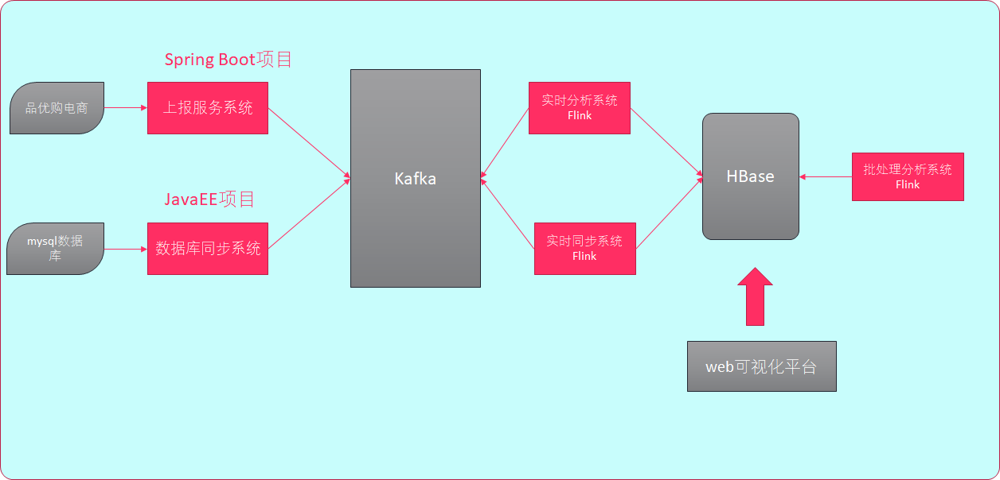
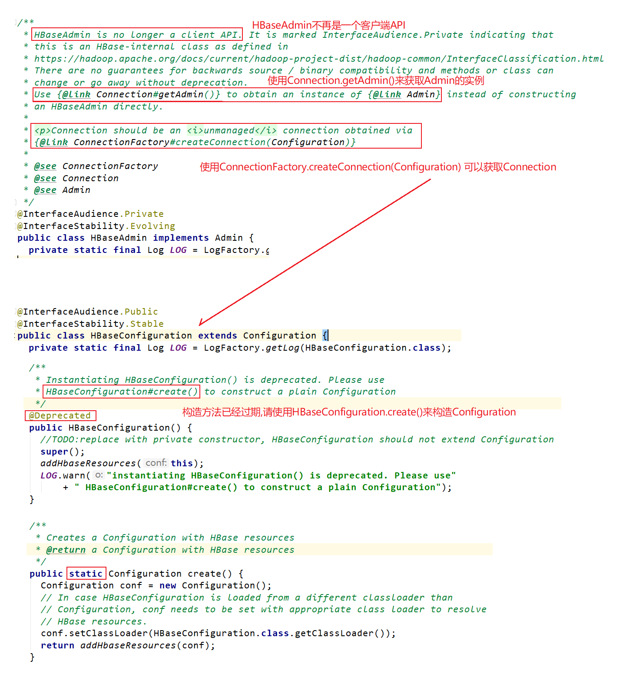
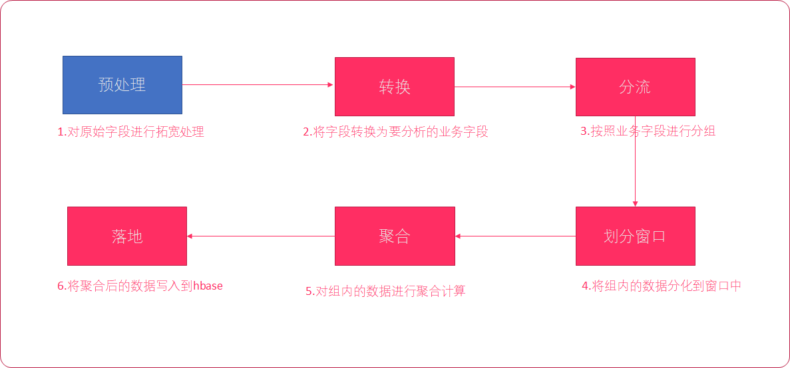
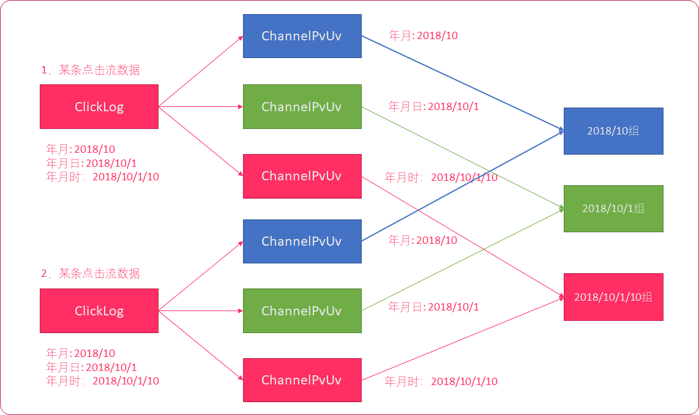

# 47-Flink电商指标分析项目-02

# 1.HBaseUtil工具类

前面我们实现了Flink整合Kakfa，可以从kafka中获取数据进行分析，分析之后我们要把结果存入HBase中国，为了方便操作，我们先提前编写一个操作HBase的工具类。HBase作为一个数据库，我们肯定要进行数据的增删改查，那么我们就可以围绕这几个操作进行开发



## 1.1 API介绍

| 方法名     | 用途                                   | 参数说明                                                     | 返回值                       |
| ---------- | -------------------------------------- | ------------------------------------------------------------ | ---------------------------- |
| getTable   | 创建/获取表                            | tableNameStr:表名 columnFamily:列族名                        | HBase Table对象              |
| putData    | 插入/更新一列数据                      | tableNameStr: 表名 rowkey:String rowkey columnFamily:列族名 column:String 列名 data:String 列值 | 空                           |
| putMapData | 插入/更新多个列数据                    | tableNameStr: 表名 rowkey:String rowkey columnFamily:列族名 mapData:列名/列值 | 空                           |
| getData    | 根据rowkey，列族+列名 获取单列数据     | tableNameStr: 表名 rowkey:String rowkey columnFamily:列族名 column:列名 | 列对应的数据 String类型      |
| getMapData | 根据rowkey，列族+列名集合 获取多列数据 | tableNameStr: 表名 rowkey:String rowkey columnFamily:列族名 column:列名集合 | 列对应的数据 Map[列名, 列值] |
| deleteData | 根据rowkey删除一条数据                 | tableNameStr: 表名 rowkey:rowkey columnFamily: 列族名        | 空                           |

## 1.2 获取表

**开发步骤：**

1. 将导入`hbase-site.xml`配置文件到`real-process下的resources`目录
2. 在`com.it.realprocess.util`包中添加`HBaseUtil`
   - 使用`HBaseConfiguration.create`获取配置对象`Configuration`，该配置对象会自动加载hbase-site.xml
   - 使用`ConnectionFactory.createConnection`获取hbase连接
   - 使用`Connection.getAdmin`获取与master的连接
3. 创建`getTable`方法
   - 构建`TableName`
   - 构建`TableDescriptorBuilder`
   - 构建`ColumnFamilyDescriptor`
   - 添加列族
   - 检查表是否存在，若不存在，则创建表
4. 测试：创建main方法，并在main方法中调用getTable方法

**关于HBaseConfiguration的构造方法说明：**



```scala
package com.it.realprocess.util

import org.apache.hadoop.conf.Configuration
import org.apache.hadoop.hbase.{HBaseConfiguration, TableName}
import org.apache.hadoop.hbase.client.{ColumnFamilyDescriptor, _}
import org.apache.hadoop.hbase.util.Bytes

/**
 * @Class:pyg.com.it.realprocess.util.HBaseUtil
 * @Descript:
 * @Author:宋天
 * @Date:2020/3/14
 */
/**
 * HBase的工具类
 * 获取Tble
 * 保存单列数据
 * 查询单列数据
 * 保存多列数据
 * 查询多列数据
 * 删除数据
 */
object HBaseUtil {
  // 读取HBase配置文件，不需要指定配置文件名，文件名要求hbase-site.xml
  val conf:Configuration = HBaseConfiguration.create()
  // 创建HBase连接
  val conn:Connection = ConnectionFactory.createConnection(conf)
  // 创建HBase管理类，HBase的操作API
  val admin:Admin = conn.getAdmin

  /**
   * 返回Table，如果不存在，则创建表
   * @param tableNameStr
   * @param columnFamilyName
   * @return
   */
  def getTable(tableNameStr:String,columnFamilyName:String):Table = {
    // 获取tableName
    val tableName: TableName = TableName.valueOf(tableNameStr)
    // 如果表不存在，则创建表
    if (!admin.tableExists(tableName)){
      // 构建出表的描述的建造者/描述者
      val descBuilder:TableDescriptorBuilder = TableDescriptorBuilder.newBuilder(tableName);
      // 构建列簇
      val columnFamily: ColumnFamilyDescriptor = ColumnFamilyDescriptorBuilder.newBuilder(columnFamilyName.getBytes).build()
      // 给表添加列簇
      descBuilder.setColumnFamily(columnFamily)
      //创建表
      admin.createTable(descBuilder.build())
    }
    // 返回表
    conn.getTable(tableName)

  }
  // 测试
  def main(args: Array[String]): Unit = {
    //创建表测试
    println(getTable("test","info"))
  }
}

```


## 1.3 存储数据

创建`putData`方法

- 调用getTable获取表
- 构建`Put`对象
- 添加列、列值
- 对table执行put操作
- 启动编写main进行测试

```scala
package com.it.realprocess.util

import org.apache.hadoop.conf.Configuration
import org.apache.hadoop.hbase.{HBaseConfiguration, TableName}
import org.apache.hadoop.hbase.client.{ColumnFamilyDescriptor, _}
import org.apache.hadoop.hbase.util.Bytes

/**
 * @Class:pyg.com.it.realprocess.util.HBaseUtil
 * @Descript:
 * @Author:宋天
 * @Date:2020/3/14
 */


/**
 * HBase的工具类
 * 获取Tble
 * 保存单列数据
 * 查询单列数据
 * 保存多列数据
 * 查询多列数据
 * 删除数据
 */
object HBaseUtil {
  // 读取HBase配置文件，不需要指定配置文件名，文件名要求hbase-site.xml
  val conf:Configuration = HBaseConfiguration.create()
  // 创建HBase连接
  val conn:Connection = ConnectionFactory.createConnection(conf)
  // 创建HBase管理类，HBase的操作API
  val admin:Admin = conn.getAdmin

    
    // 此处省略获取table方法。。。。。
    
  /**
   * 存储单列数据
   * @param tableNameStr 表名
   * @param rowkey rowkey
   * @param columnFamilyName 列簇名
   * @param columnName 列名
   * @param columnValue 列值
   */
  def putData(tableNameStr:String,rowkey:String,columnFamilyName:String,columnName:String,columnValue:String)={
    // 获取表
    val table:Table = getTable(tableNameStr,columnFamilyName)

    try {
      // put
      val put:Put = new Put(rowkey.getBytes())
      put.addColumn(columnFamilyName.getBytes(),columnName.getBytes(),columnValue.getBytes())

      //保存
      table.put(put)
    }catch {
      case ex:Exception=>{
        ex.printStackTrace()
      }
    }finally {
      table.close()
    }

  }
    
  // 测试
  def main(args: Array[String]): Unit = {
    //创建表测试
//    println(getTable("test","info"))
      
          // 存储单列数据测试
    putData("test","1","info","t1","HelloWorld")
  }
}

```

## 1.4 获取数据

1. 使用`Connection`获取表
2. 创建`getData`方法
   - 调用getTable获取表
   - 构建`Get`对象
   - 对table执行get操作，获取result
   - 使用Result.getValue获取列族列对应的值
   - 捕获异常
   - 关闭表
3. 启动`hhbase`
4. 启动编写main进行测试

```scala
package com.it.realprocess.util

import org.apache.hadoop.conf.Configuration
import org.apache.hadoop.hbase.{HBaseConfiguration, TableName}
import org.apache.hadoop.hbase.client.{ColumnFamilyDescriptor, _}
import org.apache.hadoop.hbase.util.Bytes

/**
 * @Class:pyg.com.it.realprocess.util.HBaseUtil
 * @Descript:
 * @Author:宋天
 * @Date:2020/3/14
 */


/**
 * HBase的工具类
 * 获取Tble
 * 保存单列数据
 * 查询单列数据
 * 保存多列数据
 * 查询多列数据
 * 删除数据
 */
object HBaseUtil {
  // 读取HBase配置文件，不需要指定配置文件名，文件名要求hbase-site.xml
  val conf:Configuration = HBaseConfiguration.create()
  // 创建HBase连接
  val conn:Connection = ConnectionFactory.createConnection(conf)
  // 创建HBase管理类，HBase的操作API
  val admin:Admin = conn.getAdmin

    
    // 此处省略获取table方法。。。。。
    // 此处省略存储单列数据方法。。。。
    
    /**
   * 通过单列名获取值
   * @param tableNameStr 表名
   * @param rowkey rowkey
   * @param columnFamilyName 列簇名
   * @param columnName 列名
   * @return 列值
   */
  def getData(tableNameStr:String,rowkey:String,columnFamilyName:String,columnName:String):String ={
    //1. 获取table对象
    val table = getTable(tableNameStr,columnFamilyName)

    try{
      //2. 构建get对象
      val get = new Get(rowkey.getBytes())
      //3. 进行查询
      val result:Result = table.get(get)
      //4.判断查询结果是否为空，并且包含我们需要查询的列
      if (result!=null && result.containsColumn(columnFamilyName.getBytes(),columnName.getBytes())){
        val bytes: Array[Byte] = result.getValue(columnFamilyName.getBytes(), columnName.getBytes())
        Bytes.toString(bytes)
      }else{
        ""
      }
    }catch {
      case ex:Exception =>{
        ex.printStackTrace()
        ""
      }
    }finally{
      //5. 关闭表
      table.close()
    }
  }

 
  // 测试
  def main(args: Array[String]): Unit = {
          //创建表测试
//    println(getTable("test","info"))
      
          // 存储单列数据测试
//    putData("test","1","info","t1","HelloWorld")
      
          // 通过单列名获取值测试
    println(getData("test","1","info","t1"))
  }
}

```

## 1.5 批量存储数据

创建`putMapData`方法

- 调用`getTable`获取表
- 构建`Put`对象
- 添加Map中的列、列值
- 对table执行put操作
- 捕获异常
- 关闭表
- 启动编写main进行测试

```scala
package com.it.realprocess.util

import org.apache.hadoop.conf.Configuration
import org.apache.hadoop.hbase.{HBaseConfiguration, TableName}
import org.apache.hadoop.hbase.client.{ColumnFamilyDescriptor, _}
import org.apache.hadoop.hbase.util.Bytes

/**
 * @Class:pyg.com.it.realprocess.util.HBaseUtil
 * @Descript:
 * @Author:宋天
 * @Date:2020/3/14
 */


/**
 * HBase的工具类
 * 获取Tble
 * 保存单列数据
 * 查询单列数据
 * 保存多列数据
 * 查询多列数据
 * 删除数据
 */
object HBaseUtil {
  // 读取HBase配置文件，不需要指定配置文件名，文件名要求hbase-site.xml
  val conf:Configuration = HBaseConfiguration.create()
  // 创建HBase连接
  val conn:Connection = ConnectionFactory.createConnection(conf)
  // 创建HBase管理类，HBase的操作API
  val admin:Admin = conn.getAdmin

    
    // 此处省略获取table方法。。。。。
    // 此处省略存储单列数据方法。。。。  
    // 此处省略通过单列名获取值。。。。
    
    
 /**
   * 存储多列数据
   * @param tableNameStr 表名
   * @param rowKey rowkey
   * @param columnFamilyName 列簇名
   * @param map 多个列名和列值的集合
   */
  def putMapData(tableNameStr:String,rowKey:String,columnFamilyName:String,map:Map[String,Any]) = {
    //1.获取table
    val table: Table = getTable(tableNameStr, columnFamilyName)

    try{
      //2. 创建put
      val put = new Put(rowKey.getBytes())
      //3.在put中添加多个列名和列值
      for ((colName,colValue) <- map){
        put.addColumn(columnFamilyName.getBytes(),colName.getBytes(),colValue.toString.getBytes())
      }
      //4.保存put
      table.put(put)
    }catch {
      case ex:Exception =>{
        ex.printStackTrace()
      }
    }finally{
      //5. 关闭table
      table.close()
    }
  }


 
  // 测试
  def main(args: Array[String]): Unit = {
    //创建表测试
//    println(getTable("test","info"))
      
          // 存储单列数据测试
//    putData("test","1","info","t1","HelloWorld")
      
      
          // 存储多列数据测试
    val map = Map(
      "t2" -> "scala",
      "t3" -> "hive",
      "t4" -> "flink"
    )
    putMapData("test","1","info",map)
  }
}

```

## 1.6. 批量获取数据

创建`putMapData`方法

- 调用`getTable`获取表
- 构建`Get`对象
- 根据Get对象查询表
- 构建可变Map
- 遍历查询各个列的列值
- 过滤掉不符合的结果
- 把结果转换为Map返回
- 捕获异常
- 关闭表
- 启动编写main进行测试

```scala
package com.it.realprocess.util

import org.apache.hadoop.conf.Configuration
import org.apache.hadoop.hbase.{HBaseConfiguration, TableName}
import org.apache.hadoop.hbase.client.{ColumnFamilyDescriptor, _}
import org.apache.hadoop.hbase.util.Bytes

/**
 * @Class:pyg.com.it.realprocess.util.HBaseUtil
 * @Descript:
 * @Author:宋天
 * @Date:2020/3/14
 */


/**
 * HBase的工具类
 * 获取Tble
 * 保存单列数据
 * 查询单列数据
 * 保存多列数据
 * 查询多列数据
 * 删除数据
 */
object HBaseUtil {
  // 读取HBase配置文件，不需要指定配置文件名，文件名要求hbase-site.xml
  val conf:Configuration = HBaseConfiguration.create()
  // 创建HBase连接
  val conn:Connection = ConnectionFactory.createConnection(conf)
  // 创建HBase管理类，HBase的操作API
  val admin:Admin = conn.getAdmin

    
    // 此处省略获取table方法。。。。。
    // 此处省略存储单列数据方法。。。。  
    // 此处省略通过单列名获取值。。。。
   	// 此处省略存储多列数据。。。。
   	
   	
  /**
   * 获取多列数据的值
   * @param tableNameStr 表名
   * @param rowKey rowkey
   * @param columnFamilyName 列簇名
   * @param columnNameList 多个列名
   * @return 多个列名和多个列值的map集合
   */
  def getMapData(tableNameStr:String,rowKey:String,columnFamilyName:String,columnNameList:List[String]):Map[String,String]={

    //1.获取table
    val table: Table = getTable(tableNameStr,columnFamilyName)

    try{
      //2.构建get对象
      val get = new Get(rowKey.getBytes())

      //3.执行查询
      val result: Result = table.get(get)

      //4.遍历列名集合，取出列值，构建成map返回
      columnNameList.map{
        col =>{
          val bytes: Array[Byte] = result.getValue(columnFamilyName.getBytes(), col.getBytes())
          if (bytes != null && bytes.size>0){
            col->Bytes.toString(bytes)
          }else{
            ""->""
          }
        }
      }.filter(_._1 != "").toMap
    }catch {
      case ex:Exception =>{
        ex.printStackTrace()
        Map[String,String]()
      }
    }finally {
      //5.关闭table
      table.close()
    }
  }


 
  // 测试
  def main(args: Array[String]): Unit = {
    //创建表测试
//    println(getTable("test","info"))
      
          // 存储单列数据测试
//    putData("test","1","info","t1","HelloWorld")
      
      
    // 存储多列数据测试
//    val map = Map(
//      "t2" -> "scala",
//      "t3" -> "hive",
//      "t4" -> "flink"
//    )
//    putMapData("test","1","info",map)

    // 获取多列数据的值测试
    val list = List("t2","t3","t4")
    println(getMapData("test","1","info",list))
  }
}

```

## 1.7.  删除数据

创建`deleteData`方法

- 调用`getTable`获取表
- 构建`Delete`对象
- 对table执行delete操作
- 捕获异常
- 关闭表
- 启动编写main进行测试

```scala
package com.it.realprocess.util

import org.apache.hadoop.conf.Configuration
import org.apache.hadoop.hbase.{HBaseConfiguration, TableName}
import org.apache.hadoop.hbase.client.{ColumnFamilyDescriptor, _}
import org.apache.hadoop.hbase.util.Bytes

/**
 * @Class:pyg.com.it.realprocess.util.HBaseUtil
 * @Descript:
 * @Author:宋天
 * @Date:2020/3/14
 */


/**
 * HBase的工具类
 * 获取Tble
 * 保存单列数据
 * 查询单列数据
 * 保存多列数据
 * 查询多列数据
 * 删除数据
 */
object HBaseUtil {
  // 读取HBase配置文件，不需要指定配置文件名，文件名要求hbase-site.xml
  val conf:Configuration = HBaseConfiguration.create()
  // 创建HBase连接
  val conn:Connection = ConnectionFactory.createConnection(conf)
  // 创建HBase管理类，HBase的操作API
  val admin:Admin = conn.getAdmin

    
    // 此处省略获取table方法。。。。。
    // 此处省略存储单列数据方法。。。。  
    // 此处省略通过单列名获取值。。。。
   	// 此处省略存储多列数据。。。。
	// 此处省略获取多列数据的值。。。。
	
	
/**
   * 删除数据
   * @param tableNameStr 表名
   * @param rowKey rowkey
   * @param columnFamilyName 列簇名
   */
  def deleteData(tableNameStr:String,rowKey:String,columnFamilyName:String)={
    //1. 获取table
    val table: Table = getTable(tableNameStr, columnFamilyName)
    try {
      //2. 构建delete对象
      val delete = new Delete(rowKey.getBytes())
      //3. 执行删除
      table.delete(delete)

    }catch {
      case ex:Exception =>{
        ex.printStackTrace()
      }
    }finally {
      //4. 关闭table
      table.close()
    }
  }
 
  // 测试
  def main(args: Array[String]): Unit = {
    //创建表测试
//    println(getTable("test","info"))
      
          // 存储单列数据测试
//    putData("test","1","info","t1","HelloWorld")
      
      
    // 存储多列数据测试
//    val map = Map(
//      "t2" -> "scala",
//      "t3" -> "hive",
//      "t4" -> "flink"
//    )
//    putMapData("test","1","info",map)

    // 获取多列数据的值测试
//    val list = List("t2","t3","t4")
//    println(getMapData("test","1","info",list))

    // 删除数据测试
    deleteData("test","1","info")
  }
}

```

# 2.实时数据分析业务的目标与开发一般流程

## 2.1 分析业务目标

- 完成点击流日志`数据预处理`业务开发
- 完成实时频道`热点`分析业务开发
- 完成实时频道`PV/UV`分析业务开发
- 完成实时频道`用户新鲜度`分析业务开发
- 完成实时频道`地域`分析业务开发

## 2.2 业务开发一般流程



**一般流程**

1. 先对原始数据进行拓宽`预处理`
2. 将拓宽后的数据转换为要进行分析业务字段
3. 按照指定字段进行分组
4. 将组内数据划分到窗口中
5. 聚合计算
6. 将数据落地到hbase

> `预处理`的过程非常关键，它是业务的源头，如果预处理做得很好，后续业务的开发会变得简单很多

# 3.点击流日志实时数据预处理

## 3.1 业务分析

为了方便后续分析，我们需要对点击流日志，使用Flink进行实时预处理。在原有点击流日志的基础上添加一些字段，方便进行后续业务功能的统计开发

以下为Kafka中消费得到的原始点击流日志字段：

| 字段名      | 说明         |
| ----------- | ------------ |
| channelID   | 频道ID       |
| categoryID  | 产品类别ID   |
| produceID   | 产品ID       |
| country     | 国家         |
| province    | 省份         |
| city        | 城市         |
| network     | 网络方式     |
| source      | 来源方式     |
| browserType | 浏览器类型   |
| entryTime   | 进入网站时间 |
| leaveTime   | 离开网站时间 |
| userID      | 用户的ID     |

我们需要在原有点击流日志字段基础上，再添加以下字段：

| 字段名           | 说明                               |
| ---------------- | ---------------------------------- |
| count            | 用户访问的次数                     |
| timestamp        | 用户访问的时间                     |
| address          | 国家省份城市（拼接）               |
| yearMonth        | 年月                               |
| yearMonthDay     | 年月日                             |
| yearMonthDayHour | 年月日时                           |
| isNew            | 是否为访问某个频道的新用户         |
| isHourNew        | 在某一小时内是否为某个频道的新用户 |
| isDayNew         | 在某一天是否为某个频道的新用户     |
| isMonthNew       | 在某一个月是否为某个频道的新用户   |


我们不能直接从点击流日志中，直接计算得到上述后4个字段的值。而是需要在`hbase`中有一个`历史记录表`，来保存用户的历史访问状态才能计算得到。

该历史记录表(`user_history`表)结构如下：

| 列名            | 说明                   | 示例       |
| --------------- | ---------------------- | ---------- |
| rowkey          | 用户ID:频道ID          | 10:220     |
| userid          | 用户ID                 | 10         |
| channelid       | 频道ID                 | 220        |
| lastVisitedTime | 最后访问时间（时间戳） | 1553653555 |

## 3.2 创建ClickLogWide样例类

我们使用`ClickLogWide`样例类来保存拓宽后的点击流日志数据。直接`复制`原有的`ClickLog`样例类，然后给它加上下列额外的字段：

**步骤**

1. 在` com.it.realprocess.bean`包中创建`ClickLogWide`样例类
2. 复制原有`ClickLog样例类`
3. 添加以下字段
   * 用户访问的次数（count)
   * 用户访问的时间（timestamp)
   * 国家省份城市（拼接）（address)
   * 年月（yearMonth)
   * 年月日（yearMonthDay)
   * 年月日时（yearMonthDayHour)
   * 是否为访问某个频道的新用户（isNew)——0表示否，1表示是
   * 在某一小时内是否为某个频道的新用户（isHourNew)——0表示否
   * 在某一天是否为某个频道的新用户（isDayNew)——0表示否，1表示是，
   * 在某一个月是否为某个频道的新用户（isMonthNew)——0表示否，1表示是

```scala
package com.it.realprocess.bean

//频道ID(channelID)
//产品类别ID(categoryID)
//产品ID(produceID)
//国家(country)
//省份(province)
//城市(city)
//网络方式(network)
//来源方式(source)
//浏览器类型(browserType)
//进入网站时间(entryTime)
//离开网站时间(leaveTime)
//用户的ID(userID)

//用户访问的次数（count)
//用户访问的时间（timestamp)
//国家省份城市（拼接）（address)
//年月（yearMonth)
//年月日（yearMonthDay)
//年月日时（yearMonthDayHour)
//是否为访问某个频道的新用户（isNew)——0表示否，1表示是
//在某一小时内是否为某个频道的新用户（isHourNew)——0表示否
//在某一天是否为某个频道的新用户（isDayNew)——0表示否，1表示是，
//在某一个月是否为某个频道的新用户（isMonthNew)——0表示否，1表示是
case class ClickLogWide (
                      var channelID:String,
                      var categoryID:String,
                      var produceID:String,
                      var country:String,
                      var province:String,
                      var city:String,
                      var network:String,
                      var source:String,
                      var browserType:String,
                      var entryTime:String,
                      var leaveTime:String,
                      var userID:String,
                      var count:Long,
                      var timestamp:Long,
                      var address:String,
                      var yearMonth:String,
                      var yearMonthDay:String,
                      var yearMonthDayHour:String,
                      var isNew:Int,
                      var isHourNew:Int,
                      var isDayNew:Int,
                      var isMonthNew:Int
                    )

```

## 3.3 预处理：地址、时间字段拓宽

为了方便后续进行数据分析，我们需要对地址、时间字段进行拓宽。我们先来拓宽以下几个字段：

| 字段名           | 说明                     |
| ---------------- | ------------------------ |
| address          | 国家、省份、城市（拼接） |
| yearMonth        | 年月                     |
| yearMonthDay     | 年月日                   |
| yearMonthDayHour | 年月日时                 |

**步骤**

1. 对水印数据流进行预处理
2. 拼接拓宽字段
3. 使用`SimpleDateFormat+FastDateFormat`来获取格式化的时间（FastDateFormat是`线程安全`的）
4. 构建`ClickLogWide`样例类
5. 打印预处理数据
6. 测试

**实现**

* 在`task`包下创建`PreprocessTask`
* 添加`process`接收水印流数据
* 使用`map`算子进行数据转换

* 构建以下拓宽字段
  * 国家省份城市（拼接）（address)
  * 年月（yearMonth)
  * 年月日（yearMonthDay)
  * 年月日时（yearMonthDayHour)
* 编写工具方法`timestamp2Str`，传入时间戳和日期格式，使用`FastDateFormat`将时间戳转换为指定格式的日期

* 分别使用`timestamp2Str`获取`年月`、`年月日`、`年月日时`字段

* 构建`ClickLogWide`样例类

* 在`App`中调用预处理任务的`process`方法，并打印测试

## 3.4 预处理：isNew字段处理

isNew字段是判断某个`用户ID`，是否已经访问过`某个频道`。

**实现思路**

1. 先把要拓宽的字段`isNew`、`isHourNew`、`isDayNew`、`isMonthNew`都创建出来，初始化为0
2. 从hbase查询rowkey为`userid:channlid`查询`user_history`中`userid`列的数据
3. 判断`userid`列数据是否为空

  * 如果为空
    * 设置`isNew`字段为`1`，表示是新用户
    * 将其他的`isHourNew`、`isDayNew`、`isMonthNew`字段都设置为1
    * 将该用户数据添加到`user_history`表中
  * 如果不为空
    * 设置`isNew`字段为0，表示是老用户
    * 更新`user_history`表中的`lastVisitedTime`列

**user_history表的列**

* 用户ID:频道ID(rowkey)
* 用户ID(userid)
* 频道ID(channelid)
* 最后访问时间（时间戳）(lastVisitedTime)

**步骤**

1. 创建一个object `RealPreprogressTask`，用来编写预处理的scala代码
2. 创建一个方法`process`，接收水印流数据
3. 使用map算子按照实现思路进行处理，计算得到`isNew`字段，然后返回
4. 打印测试，查看hbase中是否已经成功创建`user_history`表并保存了用户数据


## 3.5. 预处理：isHourNew字段处理

---

`isHourNew`字段表示，用户虽然不是第一次访问某个频道，但是用户在`某一个小时`内，是第一次访问该频道。

我们通过时间比较来判断：

1. 如果当前用户的访问时间是：2020-03-27 11点
2. 历史记录表中，最后一次的访问时间是：2020-03-27 10点，isHourNew为`1`（11点确实没访问）
3. 历史记录表中，最后一次的访问时间是：2020-03-27 11点，isHourNew为`0`

所以，我们根据时间来进行判断。

**步骤**

1. 从`user_history`表中获取`lastVisitedTime`字段
2. 将`lastVisitedTime`字段格式化为`年月日时`格式
3. 和当前点击流日志的`年/月/日/时`字段比较
   - 如果当前时间字段 > `lastVisited`，则`isHourNew`为1
   - 否则`isHourNew`为0

## 3.6. 预处理：isDayNew字段处理

---

与`isHourNew`字段处理类似，只不过需要使用`年月日`来进行比较

## 3.7. isMonthNew字段处理

---

与`isHourNew`字段处理类似，只不过需要使用`年月`来进行比较


## 3.8 预处理代码

```scala
package com.it.realprocess.task

import com.it.realprocess.bean.{ClickLogWide, Message}
import com.it.realprocess.util.HBaseUtil
import org.apache.commons.lang.StringUtils
import org.apache.commons.lang.time.FastDateFormat
import org.apache.flink.streaming.api.scala.DataStream
import org.apache.flink.api.scala._
/**
 * @Class:pyg.com.it.realprocess.task.PreprocessTask
 * @Descript:
 * @Author:宋天
 * @Date:2020/3/14
 */
// 预处理任务
object PreprocessTask {

  def process(watermarkDataStream:DataStream[Message]):DataStream[ClickLogWide] ={
    watermarkDataStream.map{
      msg =>
        //转换时间
        val yearMonth: String = FastDateFormat.getInstance("yyyyMM").format(msg.timeStamp)
        val yearMonthDay: String = FastDateFormat.getInstance("yyyyMMdd").format(msg.timeStamp)
        val yearMonthDayHour: String = FastDateFormat.getInstance("yyyyMMddHH").format(msg.timeStamp)

        //转换地区
        val address = msg.clickLog.country + msg.clickLog.province + msg.clickLog.city
        val isNewTuple: (Int, Int, Int, Int) = isNewProcess(msg)
        ClickLogWide(
          msg.clickLog.channelID,
          msg.clickLog.categoryID,
          msg.clickLog.produceID,
          msg.clickLog.country,
          msg.clickLog.province,
          msg.clickLog.city,
          msg.clickLog.network,
          msg.clickLog.source,
          msg.clickLog.browserType,
          msg.clickLog.entryTime,
          msg.clickLog.leaveTime,
          msg.clickLog.userID,
          msg.count,
          msg.timeStamp,
          address,
          yearMonth,
          yearMonthDay,
          yearMonthDayHour,
          isNewTuple._1,
          isNewTuple._2,
          isNewTuple._3,
          isNewTuple._4

        )
    }
  }

  /**
   * 判断用户是否为新用户
   * @param msg
   */
  private def isNewProcess(msg:Message) ={
    //1. 定义4个变量，初始化为0
    var isNew = 0
    var isHourNew = 0
    var isDayNew = 0
    var isMonthNew = 0


    //2.从HBase中查询用户记录，如果有记录，再去判断其他时间，如果没记录，则是新用户
    val tableName = "user_history"
    var clfName = "info"
    var rowKey = msg.clickLog.userID + ":" + msg.clickLog.channelID

    //    用户ID(userid)
    var userIdColumn = "userid"
    //    频道ID(channelid)
    var channelidColumn = "channelid"
    //    最后访问时间（时间戳）(lastVisitedTime)
    var lastVisitedTimeColumn = "lastVisitedTime"

    val userId:String = HBaseUtil.getData(tableName,rowKey,clfName,userIdColumn)
    val channelid: String = HBaseUtil.getData(tableName, rowKey, clfName, channelidColumn)
    val lastVisitedTime: String = HBaseUtil.getData(tableName, rowKey, clfName, lastVisitedTimeColumn)


    //如果userid为空，则该用户为新用户
    if(StringUtils.isBlank(userId)){
      isNew = 1
      isHourNew =1
      isDayNew = 1
      isMonthNew = 1

      // 保存用户的访问记录到“user_history”
      HBaseUtil.putMapData(tableName,rowKey,clfName,Map(
        userIdColumn -> msg.clickLog.userID,
        channelidColumn -> msg.clickLog.channelID,
        lastVisitedTimeColumn -> msg.timeStamp
      ))

    }else{
      isNew = 0
      // 其他字段需要进行时间戳的比对
      isHourNew = compareDate(msg.timeStamp,lastVisitedTime.toLong,"yyyyMMddHH")
      isDayNew = compareDate(msg.timeStamp,lastVisitedTime.toLong,"yyyyMMdd")
      isMonthNew = compareDate(msg.timeStamp,lastVisitedTime.toLong,"yyyyMM")
      //更新“user_history”的用户的时间戳
      HBaseUtil.putData(tableName, rowKey, clfName,lastVisitedTimeColumn , msg.timeStamp.toString)
    }

    (isNew,isHourNew,isDayNew,isMonthNew)
  }

  /**
   * 比对时间
   * @param currentTime 现在时间
   * @param historyTime 历史时间
   * @param format 时间格式
   * @return 1 or 0
   */
  def compareDate(currentTime:Long,historyTime:Long,format:String): Int ={
    val currentTimeStr: String = timestamp2Str(currentTime, format)
    val historyTimeStr: String = timestamp2Str(currentTime, format)

    // 比对字符串大小，如果当前时间大于历史时间，返回1
    var result: Int = currentTimeStr.compareTo(historyTimeStr)

    if (result>0 ){
      result = 1
    }else{
      result = 0
    }
    result
  }

  /**
   * 转换日期
   * @param timestamp    Long类型的时间戳
   * @param format       日期格式
   * @return
   */
  def timestamp2Str(timestamp:Long,format:String): String ={
    FastDateFormat.getInstance(format).format(timestamp)
  }

}

```

`App.scala`中添加执行任务代码

```scala
 // 数据的预处理
    val clickLogWideDataStream: DataStream[ClickLogWide] = PreprocessTask.process(watermarkDataStream)
    clickLogWideDataStream.print()
```


# 4.实时频道热点业务开发

## 4.1. 业务介绍

频道热点，就是要统计频道被访问（点击）的数量。

分析得到以下的数据：

| 频道ID  | 访问数量 |
| ------- | -------- |
| 频道ID1 | 128      |
| 频道ID2 | 401      |
| 频道ID3 | 501      |

> 需要将历史的点击数据进行累加

## 4.2. 业务开发

**步骤**

1. 创建实时热点样例类，专门用来计算实时热点的数据
2. 将预处理后的数据，`转换`为要分析出来的数据（频道、访问次数）样例类
3. 按照`频道`进行分组（分流）
4. 划分时间窗口（3秒一个窗口）
5. 进行合并计数统计
6. 打印测试
7. 将计算后的数据下沉到Hbase

**实现**

1. 创建一个`ChannelRealHotTask`单例对象
2. 添加一个`ChannelRealHot`样例类，它封装要统计的两个业务字段：频道ID（channelID）、访问数量（visited）
3. 在`ChannelRealHotTask`中编写一个`process`方法，接收预处理后的`DataStream`
4. 使用map算子，将`ClickLog`对象转换为`ChannelRealHot`
5. 按照频道ID进行分流
6. 划分时间窗口（3秒一个窗口）
7. 执行reduce合并计算
8. 将合并后的数据下沉到hbase
   * 判断hbase中是否已经存在结果记录
   * 若存在，则获取后进行累加
   * 若不存在，则直接写入

在包`com.it.realprocess.task`下创建名为`ChannelRealHotTask.scala`的单例对象

```scala
package com.it.realprocess.task

import com.it.realprocess.bean.ClickLogWide
import com.it.realprocess.util.HBaseUtil
import org.apache.commons.lang.StringUtils
import org.apache.flink.streaming.api.scala.{DataStream, KeyedStream, WindowedStream}
import org.apache.flink.api.scala._
import org.apache.flink.streaming.api.datastream.DataStreamSink
import org.apache.flink.streaming.api.functions.sink.SinkFunction
import org.apache.flink.streaming.api.windowing.time.Time
import org.apache.flink.streaming.api.windowing.windows.TimeWindow
/**
 * @Class:pyg.com.it.realprocess.task.ChannelRealHotTask
 * @Descript:
 * @Author:宋天
 * @Date:2020/3/14
 */

/**
 * 添加一个ChannelRealHot样例类，它封装要统计的两个业务字段：
 *
 * @param channelid 频道ID（channelID）
 * @param visited 访问数量（visited）
 */
case class ChannelRealaHot(var channelid:String,var visited:Long)
/**
 * 频道热点分析
 *
 * 1. 字段转换
 * 2. 分组
 * 3. 时间窗口
 * 4. 聚合
 * 5. 落地HBase
 *
 */
object ChannelRealHotTask {
  def process(clickLogWideDataStream:DataStream[ClickLogWide])={
    //1.字段转换 channelid   visited
    val realHotDataStream: DataStream[ChannelRealaHot] = clickLogWideDataStream.map {
      clickLogWide: ClickLogWide => {
        ChannelRealaHot(clickLogWide.channelID, clickLogWide.count)
      }
    }

    //2. 分组
    val keyedStream: KeyedStream[ChannelRealaHot, String] = realHotDataStream.keyBy(_.channelid)

    //3. 时间窗口
    val windowedStream: WindowedStream[ChannelRealaHot, String, TimeWindow] = keyedStream.timeWindow(Time.seconds(3))

    //4. 聚合
    val reduceDataStream: DataStream[ChannelRealaHot] = windowedStream.reduce {
      (t1: ChannelRealaHot, t2: ChannelRealaHot) => {

        ChannelRealaHot(t1.channelid, t1.visited + t2.visited)
      }
    }

    //5. 落地HBase
    realHotDataStream.addSink(new SinkFunction[ChannelRealaHot] {
      override def invoke(value: ChannelRealaHot): Unit = {
        //HBase相关字段
        val tableName = "channel"
        val clfName = "info"
        // 频道ID（channelID）、访问数量（visited）
        val channelIdColumn = "channelId"
        val visitedColumn = "visited"
        val rowKey = value.channelid

        // 判断hbase中是否已经存在结果记录
        val visitedValue: String = HBaseUtil.getData(tableName, rowKey, clfName, visitedColumn)
        // 创建总数的临时变量
        var totalCount: Long = 0
        // 若存在，则获取后进行累加
        if (StringUtils.isBlank(visitedValue)) {
          totalCount = value.visited
        } else {
          // 若不存在，则直接写入
          totalCount = visitedValue.toLong + value.visited
        }

        // 保存数据
        HBaseUtil.putMapData(tableName, rowKey, clfName, Map(
          channelIdColumn -> value.channelid,
          visitedColumn -> totalCount.toString
        ))
      }
    })

  }

}

```

可以在app.scala中调用方法进行测试

```scala
    // 频道热点分析
ChannelRealHotTask.process(clickLogWideDataStream)
```


# 5.实时频道PV/UV分析

针对频道的PV、UV进行不同时间维度的分析。有以下三个维度：

* 小时
* 天
* 月

我们会分别来实现不同维度的分析。

## 5.1. 业务介绍

**PV(访问量)**

即Page View，页面刷新一次算一次。

**UV(独立访客)**

即Unique Visitor，指定时间内相同的客户端只被计算一次

统计分析后得到的数据如下所示：

| 频道ID | 时间       | PV   | UV   |
| ------ | ---------- | ---- | ---- |
| 频道1  | 2017010116 | 1230 | 350  |
| 频道2  | 2017010117 | 1251 | 330  |
| 频道3  | 2017010118 | 5512 | 610  |

## 5.2 小时维度PV/UV业务开发

**步骤**

1. 创建频道PV、UV样例类
2. 将预处理后的数据，`转换`为要分析出来的数据（频道、PV、UV）样例类
3. 按照`频道`和`时间`进行分组（分流）
4. 划分时间窗口（3秒一个窗口）
5. 进行合并计数统计
6. 打印测试
7. 将计算后的数据下沉到Hbase

**实现**

1. 创建一个`ChannelPvUvTask`单例对象
2. 添加一个`ChannelPvUv`样例类，它封装要统计的四个业务字段：频道ID（channelID）、年月日时、PV、UV
3. 在`ChannelPvUvTask`中编写一个`processHourDim`方法，接收预处理后的`DataStream`
4. 使用map算子，将`ClickLog`对象转换为`ChannelPvUv`
5. 按照`频道ID`、`年月日时`进行分流
6. 划分时间窗口（3秒一个窗口）
7. 执行reduce合并计算
8. 打印测试
9. 将合并后的数据下沉到hbase
   - 判断hbase中是否已经存在结果记录
   - 若存在，则获取后进行累加
   - 若不存在，则直接写入

在包`com.it.realprocess.task`下创建名为`ChannelPvUvTask.scala`的单例对象

```scala
package com.it.realprocess.task

import com.it.realprocess.bean.ClickLogWide
import com.it.realprocess.util.HBaseUtil
import org.apache.commons.lang.StringUtils
import org.apache.flink.streaming.api.scala.{DataStream, KeyedStream, WindowedStream}
import org.apache.flink.api.scala._
import org.apache.flink.streaming.api.functions.sink.SinkFunction
import org.apache.flink.streaming.api.windowing.time.Time
import org.apache.flink.streaming.api.windowing.windows.TimeWindow
/**
 * @Class:pyg.com.it.realprocess.task.ChannelPvUvTask
 * @Descript: 实时频道PV/UV分析
 * @Author:宋天
 * @Date:2020/3/14
 */

/**
 * 添加一个ChannelPvUv样例类，它封装要统计的四个业务字段：
 *
 * @param channelId 频道ID（channelID）
 * @param yearDayMonthHour 年月日时
 * @param pv PV
 * @param uv UV
 */
case class ChannelPvUv(
                        val channelId: String,
                        val yearDayMonthHour: String,
                        val pv: Long,
                        val uv: Long
                      )

/**
 * 渠道PV/UV
 *
 * 1. 转换
 * 2. 分组
 * 3. 时间窗口
 * 4. 聚合
 * 5. 落地
 */
object ChannelPvUvTask {
  def process(clickLogWideDataStream: DataStream[ClickLogWide]) = {
    
    // 1. 使用map算子，将`ClickLog`对象转换为`ChannelPvUv`
    val channelPvUvDS: DataStream[ChannelPvUv] = clickLogWideDataStream.map {
      clickLogWide =>
        ChannelPvUv(clickLogWide.channelID, clickLogWide.yearMonthDayHour, clickLogWide.count, clickLogWide.isHourNew)
    }

    // 2. 分组

    val keyedStream: KeyedStream[ChannelPvUv, String] = channelPvUvDS.keyBy {
      channelPvUv => channelPvUv.channelId + channelPvUv.yearDayMonthHour
    }
    // 3. 窗口
    val windowedStream: WindowedStream[ChannelPvUv, String, TimeWindow] = keyedStream.timeWindow(Time.seconds(3))

    // 4. 聚合
    val reduceDataStream: DataStream[ChannelPvUv] = windowedStream.reduce {
      (t1, t2) => ChannelPvUv(t1.channelId, t1.yearDayMonthHour, t1.pv + t2.pv, t1.uv + t2.uv)
    }

    // 5. 落地
    reduceDataStream.addSink(new SinkFunction[ChannelPvUv] {

      override def invoke(value: ChannelPvUv): Unit = {
        val tableName = "channel_pvuv"
        val clfName = "info"
        val channelIdColumn = "channelId"
        val yearMonthDayHourColumn = "yearMonthDayHour"
        val pvColumn = "pv"
        val uvColumn = "uv"
        val rowkey = value.channelId + ":" + value.yearDayMonthHour

        val pvInHBase: String = HBaseUtil.getData(tableName, rowkey, clfName, pvColumn)
        val uvInHBase: String = HBaseUtil.getData(tableName, rowkey, clfName, uvColumn)

        var totalPv = 0L
        var totalUv = 0L

        // 如果HBase中没有pv值,那么就把当前值保存,如果有值,进行累加
        if (StringUtils.isBlank(pvInHBase)) {
          totalPv = value.pv
        } else {
          totalPv = value.pv + pvInHBase.toLong
        }

        // 如果HBase中没有pv值,那么就把当前值保存,如果有值,进行累加
        if (StringUtils.isBlank(uvInHBase)) {
          totalUv = value.uv
        } else {
          totalUv = value.uv + uvInHBase.toLong
        }

        HBaseUtil.putMapData(tableName, rowkey, clfName, Map(

          channelIdColumn -> value.channelId,
          yearMonthDayHourColumn -> value.yearDayMonthHour,
          pvColumn -> totalPv.toString,
          uvColumn -> totalUv.toString
        ))

      }
    })

  }

}

```

可以在app.scala中调用方法进行测试

```scala
    //实时频道uv/pv分析
ChannelPvUvTask.process(clickLogWideDataStream)
```

## 5.3. 天维度PV/UV业务开发

按天的维度来统计PV、UV与按小时维度类似，就是分组字段不一样。可以直接复制按小时维度的PV/UV，然后修改即可。

## 5.4. 小时/天/月维度PV/UV业务开发

但是，其实上述代码，都是一样的。我们可以将`小时`、`天`、`月`三个时间维度的数据放在一起来进行分组

**思路**

1. 每一条ClickLog生成三个维度的`ChannelPvUv`，分别用于三个维度的统计

  * ChannelPvUv --> 小时维度
  * ChannelPvUv --> 天维度
  * ChannelPvUv --> 月维度



**实现**

1. 使用`flatmap`算子，将`ClickLog`转换为三个`ChannelPvUv`
2. 重新运行测试

只需要将上述代码中的转换部分替换如下内容即可

```scala
//1. 转换 map是一种类型转换为另一种类型 flatmap 是一种转多种
    val channelPvUvDS: DataStream[ChannelPvUv] = clickLogWideDataStream.flatMap {
      clickLogWide => {
        List(
          ChannelPvUv(clickLogWide.channelID, clickLogWide.yearMonthDayHour, clickLogWide.count, clickLogWide.isHourNew),
          ChannelPvUv(clickLogWide.channelID, clickLogWide.yearMonthDay, clickLogWide.count, clickLogWide.isDayNew),
          ChannelPvUv(clickLogWide.channelID, clickLogWide.yearMonth, clickLogWide.count, clickLogWide.isMonthNew)
        )
      }
    }
```

# 6. 实时频道用户新鲜度分析

## 6.1. 业务介绍

用户新鲜度即分析网站每小时、每天、每月活跃的新老用户占比

可以通过新鲜度：

* 从宏观层面上了解每天的新老用户比例以及来源结构

* 当天新增用户与当天`推广行为`是否相关

统计分析要得到的数据如下：

| 频道ID | 时间       | 新用户 | 老用户 |
| ------ | ---------- | ------ | ------ |
| 频道1  | 201703     | 512    | 144    |
| 频道1  | 20170318   | 411    | 4123   |
| 频道1  | 2017031810 | 342    | 4412   |

## 6.2. 业务开发

**步骤**

1. 创建频道新鲜度样例类，包含以下字段（频道、时间、新用户、老用户）
2. 将预处理后的数据，转换为新鲜度样例类
3. 按照`频道`和`时间`进行分组（分流）
4. 划分时间窗口（3秒一个窗口）
5. 进行合并计数统计
6. 打印测试
7. 将计算后的数据下沉到Hbase

**实现**

1. 创建一个`ChannelFreshnessTask`单例对象

2. 添加一个`ChannelFreshness`样例类，它封装要统计的四个业务字段：频道ID（channelID）、日期（date）、新用户（newCount）、老用户（oldCount）

3. 在`ChannelFreshnessTask`中编写一个`process`方法，接收预处理后的`DataStream`

4. 使用`flatMap`算子，将`ClickLog`对象转换为三个不同时间维度`ChannelFreshness`

5. 按照`频道ID`、`日期`进行分流

6. 划分时间窗口（3秒一个窗口）

7. 执行reduce合并计算

8. 打印测试

9. 将合并后的数据下沉到hbase

   * 准备hbase的表名、列族名、rowkey名、列名

   - 判断hbase中是否已经存在结果记录
   - 若存在，则获取后进行累加
   - 若不存在，则直接写入


> 注意：
>
> 这个地方，老用户需要注意处理，因为如果不进行判断，就会计算重复的一些用户访问数据
>
> 1. 新用户就是根据clicklog拓宽后的isNew来判断
>
> 2. 老用户需要判断
>
>   * 如果isNew是0，且isHourNew为1/isDayNew为1、isMonthNew为1，则进行老用户为1
>   * 否则为0
>
> 

```scala
package com.it.realprocess.task

import com.it.realprocess.bean.ClickLogWide
import com.it.realprocess.util.HBaseUtil
import org.apache.commons.lang.StringUtils
import org.apache.flink.streaming.api.scala.{DataStream, KeyedStream, WindowedStream}
import org.apache.flink.api.scala._
import org.apache.flink.streaming.api.functions.sink.SinkFunction
import org.apache.flink.streaming.api.windowing.time.Time
import org.apache.flink.streaming.api.windowing.windows.TimeWindow
/**
 * @Class:pyg.com.it.realprocess.task.ChannelFreshnessTask
 * @Descript:
 * @Author:宋天
 * @Date:2020/3/14
 */

/**
 * 添加一个ChannelFreshness样例类，它封装要统计的四个业务字段：
 * @param channelId 频道ID（channelID）
 * @param date 日期（date）
 * @param newCount 新用户（newCount）
 * @param oldCount 老用户（oldCount）
 */
case class ChannelFreshness(
                             var channelId: String,
                             var date: String,
                             var newCount: Long,
                             val oldCount: Long
                           )

/**
 * 1. 转换
 * 2. 分组
 * 3. 时间窗口
 * 4. 聚合
 * 5. 落地HBase
 */
object ChannelFreshnessTask {
  // 2. 在`ChannelFreshnessTask`中编写一个`process`方法，接收预处理后的`DataStream`
  def process(clicklogWideDataStream:DataStream[ClickLogWide]) = {

    // 3. 使用flatMap算子，将`ClickLog`对象转换为`ChannelFreshness`
    val channelFreshnessDataStream: DataStream[ChannelFreshness] = clicklogWideDataStream.flatMap {
      clicklog =>
        val isOld = (isNew: Int, isDateNew:Int) => if (isNew == 0 && isDateNew == 1) 1 else 0

        List(
          ChannelFreshness(clicklog.channelID, clicklog.yearMonthDayHour, clicklog.isNew, isOld(clicklog.isNew, clicklog.isHourNew)),
          ChannelFreshness(clicklog.channelID, clicklog.yearMonthDay, clicklog.isNew, isOld(clicklog.isDayNew, clicklog.isDayNew)),
          ChannelFreshness(clicklog.channelID, clicklog.yearMonth, clicklog.isNew, isOld(clicklog.isMonthNew, clicklog.isMonthNew))
        )
    }

    // 4. 按照`频道ID`、`日期`进行分流

    val groupedDateStream: KeyedStream[ChannelFreshness, String] = channelFreshnessDataStream.keyBy {
      freshness =>
        freshness.channelID + freshness.date
    }

    // 5. 划分时间窗口（3秒一个窗口）
    val windowStream: WindowedStream[ChannelFreshness, String, TimeWindow] = groupedDateStream.timeWindow(Time.seconds(3))

    // 6. 执行reduce合并计算
    val reduceDataStream: DataStream[ChannelFreshness] = windowStream.reduce {
      (freshness1, freshness2) =>
        ChannelFreshness(freshness2.channelID, freshness2.date, freshness1.newCount + freshness2.newCount, freshness1.oldCount + freshness2.oldCount)
    }

    // 打印测试
    reduceDataStream.print()

    // 7. 将合并后的数据下沉到hbase
    reduceDataStream.addSink(new SinkFunction[ChannelFreshness] {
      override def invoke(value: ChannelFreshness): Unit = {
        val tableName = "channel_freshness"
        val cfName = "info"
        // 频道ID（channelID）、日期（date）、新用户（newCount）、老用户（oldCount）
        val channelIdColName = "channelID"
        val dateColName = "date"
        val newCountColName = "newCount"
        val oldCountColName = "oldCount"
        val rowkey = value.channelID + ":" + value.date

        // - 判断hbase中是否已经存在结果记录
        val newCountOldCountMap = HBaseUtil.getData(tableName, rowkey, cfName, List(newCountColName, oldCountColName))

        var totalNewCount = 0L
        var totalOldCount = 0L

        // - 若存在，则获取后进行累加
        if(newCountOldCountMap != null && StringUtils.isNotBlank(newCountOldCountMap.getOrElse(newCountColName, ""))) {
          totalNewCount = value.newCount + newCountOldCountMap(newCountColName).toLong
        }
        else {
          totalNewCount = value.newCount
        }
        // - 若不存在，则直接写入

        HBaseUtil.putMapData(tableName, rowkey, cfName, Map(
          channelIdColName -> value.channelID,
          dateColName -> value.date,
          newCountColName -> totalNewCount.toString,
          oldCountColName -> totalOldCount.toString
        ))
      }
    })
  }
}

```

app.scala测试

```scala
//    实时频道用户新鲜度分析
 ChannelFreshnessTask.process(clickLogWideDataStream)
```


# 7. 模板方法提取公共类

**模板方法**

​	模板方法模式是在父类中定义算法的骨架，把具体实延迟到子类中去，可以在不改变一个算法的结构时可重定义该算法的某些步骤。

​	前面我们已经编写了三个业务的分析代码，代码结构都是分五部分，非常的相似。针对这样的代码，我们可以进行优化，提取模板类，让所有的任务类都按照模板的顺序去执行。

在包`com.it.realprocess.task`下创建`BaseTask.scala`的单例对象

```scala
package com.it.realprocess.task

import com.it.realprocess.bean.ClickLogWide
import org.apache.commons.lang.StringUtils
import org.apache.flink.streaming.api.scala.{DataStream, KeyedStream, WindowedStream}
import org.apache.flink.streaming.api.windowing.time.Time
import org.apache.flink.streaming.api.windowing.windows.TimeWindow

/**
 * @Class:pyg.com.it.realprocess.task.BaseTask
 * @Descript:
 * @Author:宋天
 * @Date:2020/3/14
 */
trait BaseTask[T] {

  // 转换
  def map(clickLogWideDataStream: DataStream[ClickLogWide]): DataStream[T]

  //分组
  def keyBy(mapDataStream: DataStream[T]): KeyedStream[T, String]

  //时间窗口
  def timeWindow(keyedStream: KeyedStream[T, String]): WindowedStream[T, String, TimeWindow] = {
    //这一步每一个业务都一样，所以提取出来，避免冗余
    keyedStream.timeWindow(Time.seconds(3))
  }

  // 聚合
  def reduce(windowedStream: WindowedStream[T, String, TimeWindow]): DataStream[T]

  //落地HBase
  def sink2HBase(reduceDataStream: DataStream[T])


  def process(clickLogWideDataStream: DataStream[ClickLogWide]) = {
    val mapDataStream: DataStream[T] = map(clickLogWideDataStream)
    val keyedStream: KeyedStream[T, String] = keyBy(mapDataStream)
    val windowedStream: WindowedStream[T, String, TimeWindow] = timeWindow(keyedStream)
    val reduceStream: DataStream[T] = reduce(windowedStream)
    sink2HBase(reduceStream)
  }

}

```

改造`ChannelFreshnessTask.scala`代码

```scala
package com.it.realprocess.task

import com.it.realprocess.bean.ClickLogWide
import com.it.realprocess.util.HBaseUtil
import org.apache.commons.lang.StringUtils
import org.apache.flink.streaming.api.scala.{DataStream, KeyedStream, WindowedStream}
import org.apache.flink.api.scala._
import org.apache.flink.streaming.api.functions.sink.SinkFunction
import org.apache.flink.streaming.api.windowing.time.Time
import org.apache.flink.streaming.api.windowing.windows.TimeWindow
/**
 * @Class:pyg.com.it.realprocess.task.ChannelFreshnessTask
 * @Descript:
 * @Author:宋天
 * @Date:2020/3/14
 */

/**
 * 添加一个ChannelFreshness样例类，它封装要统计的四个业务字段：
 * @param channelId 频道ID（channelID）
 * @param date 日期（date）
 * @param newCount 新用户（newCount）
 * @param oldCount 老用户（oldCount）
 */
case class ChannelFreshness(
                             var channelId: String,
                             var date: String,
                             var newCount: Long,
                             val oldCount: Long
                           )

/**
 * 1. 转换
 * 2. 分组
 * 3. 时间窗口
 * 4. 聚合
 * 5. 落地HBase
 */
object ChannelFreshnessTask extends BaseTask[ChannelFreshness]{
  override def map(clickLogWideDataStream: DataStream[ClickLogWide]): DataStream[ChannelFreshness] = {
    // 转换
    val mapDataStream: DataStream[ChannelFreshness] = clickLogWideDataStream.flatMap {
      clickLog => {
        //如果是老用户，只有在他第一次来的时候计数为1，否则为0
        val isOld = (isNew: Int, isDataNew: Int) => if (isNew == 0 && isDataNew == 1) 1 else 0
        List(
          ChannelFreshness(clickLog.channelID, clickLog.yearMonthDayHour, clickLog.isNew, isOld(clickLog.isNew, clickLog.isHourNew)),
          ChannelFreshness(clickLog.channelID, clickLog.yearMonthDay, clickLog.isNew, isOld(clickLog.isNew, clickLog.isDayNew)),
          ChannelFreshness(clickLog.channelID, clickLog.yearMonth, clickLog.isNew, isOld(clickLog.isNew, clickLog.isMonthNew))
        )
      }
    }

    mapDataStream
  }

  override def keyBy(mapDataStream: DataStream[ChannelFreshness]): KeyedStream[ChannelFreshness, String] = {
    // 分组
    val keyedStream: KeyedStream[ChannelFreshness, String] = mapDataStream.keyBy {
      freshness => (freshness.channelId + freshness.date)
    }
    keyedStream
  }

  override def reduce(windowedStream: WindowedStream[ChannelFreshness, String, TimeWindow]): DataStream[ChannelFreshness] = {
    // 聚合
    val reduceDataStream: DataStream[ChannelFreshness] = windowedStream.reduce {
      (t1, t2) => {
        ChannelFreshness(t1.channelId, t1.date, t1.newCount + t2.newCount, t1.oldCount + t2.oldCount)
      }
    }
    reduceDataStream
  }

  override def sink2HBase(reduceDataStream: DataStream[ChannelFreshness]): Unit = {
    //落地
    reduceDataStream.addSink(new SinkFunction[ChannelFreshness] {
      override def invoke(value: ChannelFreshness): Unit ={
        // 创建HBase相关字段
        val tableName = "channel_freshness"
        val clfName = "info"
        val rowKey = value.channelId+":"+value.date

        val channelIdColumn = "channelId"
        val dateColumn = "date"
        val newCountColumn = "newCount"
        val oldCountColumn = "oldCount"

        // 查询历史数据
        val resultMap: Map[String, String] = HBaseUtil.getMapData(tableName, rowKey, clfName, List(newCountColumn, oldCountColumn))

        //累加
        var totalNewCount = 0L
        var totalOldCount = 0L

        if (resultMap!= null && StringUtils.isNotBlank(resultMap.getOrElse(newCountColumn,""))){
          totalNewCount = resultMap(newCountColumn).toLong+value.newCount
        }else {
          totalNewCount = value.newCount
        }

        if (resultMap!= null && StringUtils.isNotBlank(resultMap.getOrElse(oldCountColumn,""))){
          totalOldCount = resultMap(oldCountColumn).toLong+value.oldCount
        }else {
          totalOldCount = value.oldCount
        }

        //保存数据

        HBaseUtil.putMapData(tableName, rowKey, clfName, Map(
          channelIdColumn -> value.channelId,
          dateColumn -> value.date,
          newCountColumn -> totalNewCount,
          oldCountColumn -> totalOldCount
        ))
      }
    })
  }

}

```

# 8.实时频道地域分析业务开发

## 8.1. 业务介绍

通过地域分析，可以帮助查看地域相关的PV/UV、用户新鲜度。

**需要分析出来指标**

- PV

- UV

- 新用户

- 老用户


**需要分析的维度**

- 地域（国家省市）——这里为了节省时间，只分析市级的地域维度，其他维度大家可以自己来实现
- 时间维度（时、天、月）

统计分析后的结果如下：

| 频道ID | 地域（国/省/市） | 时间       | PV   | UV   | 新用户 | 老用户 |
| ------ | ---------------- | ---------- | ---- | ---- | ------ | ------ |
| 频道1  | 中国北京市朝阳区 | 201809     | 1000 | 300  | 123    | 171    |
| 频道1  | 中国北京市朝阳区 | 20180910   | 512  | 123  | 23     | 100    |
| 频道1  | 中国北京市朝阳区 | 2018091010 | 100  | 41   | 11     | 30     |

## 8.2. 业务开发

**步骤**

1. 创建频道地域分析样例类（频道、地域（国省市）、时间、PV、UV、新用户、老用户）
2. 将预处理后的数据，使用`flatMap`转换为样例类
3. 按照`频道`、`时间`、`地域`进行分组（分流）
4. 划分时间窗口（3秒一个窗口）
5. 进行合并计数统计
6. 打印测试
7. 将计算后的数据下沉到Hbase

**实现**

1. 创建一个`ChannelAreaTask`单例对象
2. 添加一个`ChannelArea`样例类，它封装要统计的四个业务字段：频道ID（channelID）、地域（area）、日期（date）pv、uv、新用户（newCount）、老用户（oldCount）
3. 在`ChannelAreaTask`中编写一个`process`方法，接收预处理后的`DataStream`
4. 使用`flatMap`算子，将`ClickLog`对象转换为三个不同时间维度`ChannelArea`
5. 按照`频道ID`、`时间`、`地域`进行分流
6. 划分时间窗口（3秒一个窗口）
7. 执行reduce合并计算
8. 打印测试
9. 将合并后的数据下沉到hbase
   - 准备hbase的表名、列族名、rowkey名、列名
   - 判断hbase中是否已经存在结果记录
   - 若存在，则获取后进行累加
   - 若不存在，则直接写入

在`com.it.realprocess.task`创建`ChannelAreaTask.scala`的单例对象并继承`BeanTask`

```scala
package com.it.realprocess.task
import com.it.realprocess.bean.ClickLogWide
import com.it.realprocess.util.HBaseUtil
import org.apache.commons.lang.StringUtils
import org.apache.flink.streaming.api.scala.{DataStream, KeyedStream, WindowedStream}
import org.apache.flink.streaming.api.windowing.windows.TimeWindow
import org.apache.flink.api.scala._
/**
 * @Class:pyg.com.it.realprocess.task.ChannelAreaTask
 * @Descript:
 * @Author:宋天
 * @Date:2020/3/14
 */

/**
 *
 * @param channelId 频道ID（channelID）
 * @param area 地域（area）
 * @param date 日期（date）
 * @param pv pv
 * @param uv uv 
 * @param newCount 新用户（newCount）
 * @param oldCount 老用户（oldCount）
 */
case class ChannelArea(
                        var channelId: String,
                        var area: String,
                        var date: String,
                        var pv: Long,
                        var uv: Long,
                        var newCount: Long,
                        var oldCount: Long
                      )

object ChannelAreaTask extends BaseTask[ChannelArea]{
  override def map(clickLogWideDataStream: DataStream[ClickLogWide]): DataStream[ChannelArea] = {
    val isOld = (isNew: Int, isDateNew: Int) => if(isNew == 0 && isDateNew == 1) 1 else 0
    clickLogWideDataStream.flatMap{

      clickLogWide =>{
        List(
          ChannelArea(clickLogWide.channelID,
            clickLogWide.address,
            clickLogWide.yearMonth,
            clickLogWide.count,
            clickLogWide.isMonthNew,
            clickLogWide.isNew,
            isOld(clickLogWide.isNew, clickLogWide.isMonthNew)
          ),
          ChannelArea(clickLogWide.channelID,
            clickLogWide.address,
            clickLogWide.yearMonthDay,
            clickLogWide.count,
            clickLogWide.isDayNew,
            clickLogWide.isNew,
            isOld(clickLogWide.isNew, clickLogWide.isDayNew)
          ),
          ChannelArea(clickLogWide.channelID,
            clickLogWide.address,
            clickLogWide.yearMonthDayHour,
            clickLogWide.count,
            clickLogWide.isHourNew,
            clickLogWide.isNew,
            isOld(clickLogWide.isNew, clickLogWide.isHourNew)
          )
        )
      }
    }
  }

  override def keyBy(mapDataStream: DataStream[ChannelArea]): KeyedStream[ChannelArea, String] = {
    mapDataStream.keyBy{
      area =>(area.channelId + ":" + area.area+":"+area.date)
    }
  }
  override def reduce(windowedStream: WindowedStream[ChannelArea, String, TimeWindow]): DataStream[ChannelArea] = {
    windowedStream.reduce{
      (t1, t2) =>
        ChannelArea(t1.channelId, t1.area,
          t1.date,
          t1.pv + t2.pv,
          t1.uv + t2.uv,
          t1.newCount + t2.newCount,
          t1.oldCount + t2.oldCount)
    }
  }
  override def sink2HBase(reduceDataStream: DataStream[ChannelArea]): Unit = {
    reduceDataStream.addSink{
      area =>{
        // 创建HBase相关字段
        val tableName = "channel_area"
        val clfName = "info"
        val rowkey = area.channelId + ":" + area.area + ":" + area.date

        val channelIdColumn = "channelId"
        val areaColumn = "area"
        val dateColumn = "date"
        val pvColumn = "pv"
        val uvColumn = "uv"
        val newCountColumn = "newCount"
        val oldCountColumn = "oldCount"

        // 查询HBase
        val pvInHbase: String = HBaseUtil.getData(tableName,rowkey,clfName,pvColumn)
        val uvInHbase: String = HBaseUtil.getData(tableName,rowkey,clfName,uvColumn)
        val newCountInHbase: String = HBaseUtil.getData(tableName,rowkey,clfName,newCountColumn)
        val oldCountInHbase: String = HBaseUtil.getData(tableName,rowkey,clfName,oldCountColumn)

        // 累加
        var totalPv = 0L
        var totalUv = 0L
        var totalNewCount = 0L
        var totalOldCount = 0L


        if(StringUtils.isNotBlank(pvInHbase)){
          totalPv  = pvInHbase.toLong+area.pv
        }else{
          totalPv = area.pv
        }

        if(StringUtils.isNotBlank(uvInHbase)){
          totalUv  = uvInHbase.toLong+area.uv
        }else{
          totalUv = area.uv
        }

        if(StringUtils.isNotBlank(newCountInHbase)){
          totalNewCount  = newCountInHbase.toLong+area.newCount
        }else{
          totalNewCount = area.newCount
        }

        if(StringUtils.isNotBlank(oldCountInHbase)){
          totalOldCount  = oldCountInHbase.toLong+area.oldCount
        }else{
          totalOldCount = area.oldCount
        }

        // 保存数据

        HBaseUtil.putMapData(tableName,rowkey,clfName,Map(
          channelIdColumn->area.channelId,
          areaColumn->area.area,
          dateColumn->area.date,
          pvColumn->totalPv,
          uvColumn->totalUv,
          newCountColumn->totalNewCount,
          oldCountColumn->totalOldCount
        ))
      }
    }
  }
}

```

app.scala中添加如下代码测试

```scala
//    实时频道地域分析业务开发
    ChannelAreaTask.process(clickLogWideDataStream)
```


# 9.实时运营商分析业务开发

## 9.1. 业务介绍

分析出来中国移动、中国联通、中国电信等运营商的指标。来分析，流量的主要来源是哪个运营商的，这样就可以进行较准确的网络推广。

**需要分析出来指标**

- PV

- UV

- 新用户

- 老用户


**需要分析的维度**

- 运营商
- 时间维度（时、天、月）

统计分析后的结果如下：

| 频道ID | 运营商   | 时间       | PV   | UV   | 新用户 | 老用户 |
| ------ | -------- | ---------- | ---- | ---- | ------ | ------ |
| 频道1  | 中国联通 | 201809     | 1000 | 300  | 0      | 300    |
| 频道1  | 中国联通 | 20180910   | 123  | 1    | 0      | 1      |
| 频道1  | 中国电信 | 2018091010 | 55   | 2    | 2      | 0      |

## 9.2. 业务开发

**步骤**

1. 将预处理后的数据，转换为要分析出来数据（频道、运营商、时间、PV、UV、新用户、老用户）样例类
2. 按照`频道`、`时间`、`运营商`进行分组（分流）
3. 划分时间窗口（3秒一个窗口）
4. 进行合并计数统计
5. 打印测试
6. 将计算后的数据下沉到Hbase

**实现**

1. 创建一个`ChannelNetworkTask`单例对象
2. 添加一个`ChannelNetwork`样例类，它封装要统计的四个业务字段：频道ID（channelID）、运营商（network）、日期（date）pv、uv、新用户（newCount）、老用户（oldCount）
3. 在`ChannelNetworkTask`中编写一个`process`方法，接收预处理后的`DataStream`
4. 使用`flatMap`算子，将`ClickLog`对象转换为三个不同时间维度`ChannelNetwork`
5. 按照`频道ID`、`时间`、`运营商`进行分流
6. 划分时间窗口（3秒一个窗口）
7. 执行reduce合并计算
8. 打印测试
9. 将合并后的数据下沉到hbase
   - 准备hbase的表名、列族名、rowkey名、列名
   - 判断hbase中是否已经存在结果记录
   - 若存在，则获取后进行累加
   - 若不存在，则直接写入

```scala
package com.it.realprocess.task
import com.it.realprocess.bean.ClickLogWide
import com.it.realprocess.util.HBaseUtil
import org.apache.commons.lang.StringUtils
import org.apache.flink.streaming.api.scala.{DataStream, KeyedStream, WindowedStream}
import org.apache.flink.streaming.api.windowing.windows.TimeWindow
import org.apache.flink.api.scala._

/**
 * @Class:pyg.com.it.realprocess.task.ChannelNetWork
 * @Descript:
 * @Author:宋天
 * @Date:2020/3/14
 */

/**
 * 添加一个`ChannelNetwork`样例类，它封装要统计的四个业务字段：
 * @param channelId 频道ID（channelID）
 * @param network 运营商（network）
 * @param date 日期（date）
 * @param pv pv
 * @param uv uv
 * @param newCount 新用户（newCount）
 * @param oldCount 老用户（oldCount）
 */
case class ChannelNetWork(
                           var channelId: String,
                           var network: String,
                           var date: String,
                           var pv: Long,
                           var uv: Long,
                           var newCount: Long,
                           var oldCount: Long
                         )

object ChannelNetWork extends BaseTask[ChannelNetWork] {
  override def map(clickLogWideDataStream: DataStream[ClickLogWide]): DataStream[ChannelNetWork] = {
    val isOld = (isNew: Int, isDateNew: Int) => if (isNew == 0 && isDateNew == 1) 1 else 0
    clickLogWideDataStream.flatMap {
      clickLogWide => {
        List(
          ChannelNetWork(
            clickLogWide.channelID,
            clickLogWide.network,
            clickLogWide.yearMonth,
            clickLogWide.count,
            clickLogWide.isMonthNew,
            clickLogWide.isNew,
            isOld(clickLogWide.isNew, clickLogWide.isMonthNew)
          ),
          ChannelNetWork(
            clickLogWide.channelID,
            clickLogWide.network,
            clickLogWide.yearMonthDay,
            clickLogWide.count,
            clickLogWide.isDayNew,
            clickLogWide.isNew,
            isOld(clickLogWide.isNew, clickLogWide.isDayNew)
          ),
          ChannelNetWork(
            clickLogWide.channelID,
            clickLogWide.network,
            clickLogWide.yearMonthDayHour,
            clickLogWide.count,
            clickLogWide.isHourNew,
            clickLogWide.isNew,
            isOld(clickLogWide.isNew, clickLogWide.isHourNew)
          )
        )
      }
    }
  }

  override def keyBy(mapDataStream: DataStream[ChannelNetWork]): KeyedStream[ChannelNetWork, String] = {
    mapDataStream.keyBy {
      network =>
        network.channelId + ":" + network.network + ":" + network.date
    }
  }

  override def reduce(windowedStream: WindowedStream[ChannelNetWork, String, TimeWindow]): DataStream[ChannelNetWork] = {
    windowedStream.reduce {
      (t1, t2) => {
        ChannelNetWork(t1.channelId, t1.network, t1.date,
          t1.pv + t2.pv, t1.uv + t2.uv, t1.newCount + t2.newCount, t1.oldCount + t2.oldCount)
      }
    }
  }

  override def sink2HBase(reduceDataStream: DataStream[ChannelNetWork]): Unit = {
    reduceDataStream.addSink(
      network => {
        // 创建HBase相关列
        val tableName = "channel_network"
        val clfName = "info"
        val rowkey = s"${network.channelId}:${network.network}:${network.date}"

        val channelIdColumn = "channelId"
        val networkColumn = "network"
        val dateColumn = "date"
        val pvColumn = "pv"
        val uvColumn = "uv"
        val newCountColumn = "newCount"
        val oldCountColumn = "oldCount"

        // 查询HBase

        val resultMap: Map[String, String] = HBaseUtil.getMapData(tableName, rowkey, clfName, List(
          pvColumn, uvColumn, newCountColumn, oldCountColumn
        ))

        // 数据累加

        var totalPv = 0L
        var totalUv = 0L
        var totalNewCount = 0L
        var totalOldCount = 0L

        // 如果resultMap不为空,并且可以去到相关列的值,那么就进行累加
        if (resultMap != null && StringUtils.isNotBlank(resultMap.getOrElse(pvColumn,""))) {
          totalPv = resultMap(pvColumn).toLong + network.pv
        } else {
          totalPv = network.pv
        }


        if (resultMap != null && StringUtils.isNotBlank(resultMap.getOrElse(uvColumn,""))) {
          totalUv = resultMap(uvColumn).toLong + network.uv
        } else {
          totalUv = network.uv
        }

        if (resultMap != null && StringUtils.isNotBlank(resultMap.getOrElse(newCountColumn,""))) {
          totalNewCount = resultMap(newCountColumn).toLong + network.newCount
        } else {
          totalNewCount = network.newCount
        }

        if (resultMap != null && StringUtils.isNotBlank(resultMap.getOrElse(oldCountColumn,""))) {
          totalOldCount = resultMap(oldCountColumn).toLong + network.oldCount
        } else {
          totalOldCount = network.oldCount
        }


        // 保存数据
        HBaseUtil.putMapData(
          tableName, rowkey, clfName, Map(
            channelIdColumn -> network.channelId,
            networkColumn -> network.network,
            dateColumn -> network.date,
            pvColumn -> totalPv,
            uvColumn -> totalUv,
            newCountColumn -> totalNewCount,
            oldCountColumn -> totalOldCount
          )
        )
      }
    )

  }
}


```

app.scala中添加如下代码测试

```
//    实时运营商分析业务开发测试
ChannelNetWork.process(clickLogWideDataStream)
```

# 10.实时频道浏览器分析业务开发

## 10.1. 业务介绍

需要分别统计不同浏览器（或者客户端）的占比

**需要分析出来指标**

- PV

- UV

- 新用户

- 老用户


**需要分析的维度**

- 浏览器
- 时间维度（时、天、月）

统计分析后的结果如下：

| 频道ID | 浏览器    | 时间       | PV   | UV   | 新用户 | 老用户 |
| ------ | --------- | ---------- | ---- | ---- | ------ | ------ |
| 频道1  | 360浏览器 | 201809     | 1000 | 300  | 0      | 300    |
| 频道1  | IE        | 20180910   | 123  | 1    | 0      | 1      |
| 频道1  | Chrome    | 2018091010 | 55   | 2    | 2      | 0      |

## 10.2. 业务开发

**步骤**

1. 创建频道浏览器分析样例类（频道、浏览器、时间、PV、UV、新用户、老用户）
2. 将预处理后的数据，使用`flatMap`转换为要分析出来数据样例类
3. 按照`频道`、`时间`、`浏览器`进行分组（分流）
4. 划分时间窗口（3秒一个窗口）
5. 进行合并计数统计
6. 打印测试
7. 将计算后的数据下沉到Hbase

**实现**

1. 创建一个`ChannelBrowserTask`单例对象
2. 添加一个`ChannelBrowser`样例类，它封装要统计的四个业务字段：频道ID（channelID）、浏览器（browser）、日期（date）pv、uv、新用户（newCount）、老用户（oldCount）
3. 在`ChannelBrowserTask`中编写一个`process`方法，接收预处理后的`DataStream`
4. 使用`flatMap`算子，将`ClickLog`对象转换为三个不同时间维度`ChannelBrowser`
5. 按照`频道ID`、`时间`、`浏览器`进行分流
6. 划分时间窗口（3秒一个窗口）
7. 执行reduce合并计算
8. 打印测试
9. 将合并后的数据下沉到hbase
   - 准备hbase的表名、列族名、rowkey名、列名
   - 判断hbase中是否已经存在结果记录
   - 若存在，则获取后进行累加
   - 若不存在，则直接写入

在包`com.it.realprocess.task`下创建`ChannelBrowser.scala`的单例对象，并继承BaseTask

```scala
package com.it.realprocess.task

import com.it.realprocess.bean.ClickLogWide
import com.it.realprocess.util.HBaseUtil
import org.apache.commons.lang.StringUtils
import org.apache.flink.streaming.api.scala.{DataStream, KeyedStream, WindowedStream}
import org.apache.flink.streaming.api.windowing.windows.TimeWindow
import org.apache.flink.api.scala._

/**
 * 添加一个ChannelBrowser样例类，它封装要统计的四个业务字段：
 * @param channelId 频道ID（channelID）
 * @param browser  浏览器（browser）
 * @param date 日期（date）
 * @param pv pv
 * @param uv uv
 * @param newCount 新用户（newCount）
 * @param oldCount 老用户（oldCount）
 */
case class ChannelBrowser(
                           var channelId: String,
                           var browser: String,
                           var date: String,
                           var pv: Long,
                           var uv: Long,
                           var newCount: Long,
                           var oldCount: Long
                         )

object ChannelBrowserTask extends BaseTask[ChannelBrowser] {
  override def map(clickLogWideDataStream: DataStream[ClickLogWide]): DataStream[ChannelBrowser] = {

    clickLogWideDataStream.flatMap {
      clickLogWide => {
        List(
          ChannelBrowser(
            clickLogWide.channelID,
            clickLogWide.browserType,
            clickLogWide.yearMonth,
            clickLogWide.count,
            clickLogWide.isMonthNew,
            clickLogWide.isNew,
            isOld(clickLogWide.isNew, clickLogWide.isMonthNew)
          ),
          ChannelBrowser(
            clickLogWide.channelID,
            clickLogWide.browserType,
            clickLogWide.yearMonthDay,
            clickLogWide.count,
            clickLogWide.isDayNew,
            clickLogWide.isNew,
            isOld(clickLogWide.isNew, clickLogWide.isDayNew)
          ),
          ChannelBrowser(
            clickLogWide.channelID,
            clickLogWide.browserType,
            clickLogWide.yearMonthDayHour,
            clickLogWide.count,
            clickLogWide.isHourNew,
            clickLogWide.isNew,
            isOld(clickLogWide.isNew, clickLogWide.isHourNew)
          )
        )
      }
    }
  }

  override def keyBy(mapDataStream: DataStream[ChannelBrowser]): KeyedStream[ChannelBrowser, String] = {
    mapDataStream.keyBy {
      browser =>
        browser.channelId + ":" + browser.browser + ":" + browser.date
    }
  }

  override def reduce(windowedStream: WindowedStream[ChannelBrowser, String, TimeWindow]): DataStream[ChannelBrowser] = {
    windowedStream.reduce {
      (t1, t2) => {
        ChannelBrowser(t1.channelId, t1.browser, t1.date,
          t1.pv + t2.pv, t1.uv + t2.uv, t1.newCount + t2.newCount, t1.oldCount + t2.oldCount)
      }
    }
  }

  override def sink2HBase(reduceDataStream: DataStream[ChannelBrowser]): Unit = {

    reduceDataStream.addSink(
      browser => {
        // 创建HBase相关列
        tableName = "channel_browser"
        rowkey = s"${browser.channelId}:${browser.browser}:${browser.date}"
        browserColumn = "browser"

        // 查询HBase

        val resultMap: Map[String, String] = HBaseUtil.getMapData(tableName, rowkey, clfName, List(
          pvColumn, uvColumn, newCountColumn, oldCountColumn
        ))


        // 保存数据
        HBaseUtil.putMapData(
          tableName, rowkey, clfName, Map(
            channelIdColumn -> browser.channelId,
            browserColumn -> browser.browser,
            dateColumn -> browser.date,
            pvColumn -> getTotal(resultMap,pvColumn,browser.pv),
            uvColumn -> getTotal(resultMap,uvColumn,browser.uv),
            newCountColumn -> getTotal(resultMap,newCountColumn,browser.newCount),
            oldCountColumn -> getTotal(resultMap,oldCountColumn,browser.oldCount)
          )
        )
      }
    )

  }

}

```

