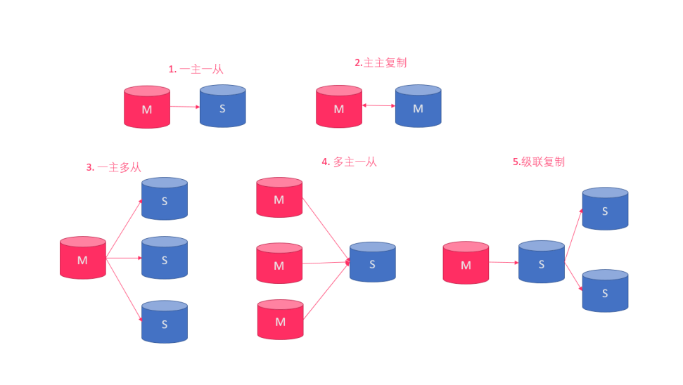
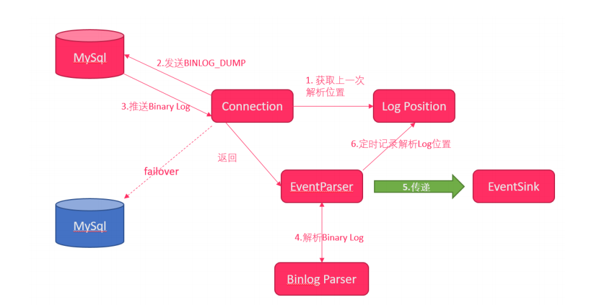

# 48-Flink电商指标分析项目-03

# 1.实时数据同步系统介绍

## 1.1 实时数据同步系统目标

* 理解`canal`数据同步解决方案
* 安装`canal`
* 实现`Flink数据同步系统`


## 1.2 业务同步系统需求分析

### 1.2.1 业务场景

一个大型的电商网站，每天都需要分析当天的成交量。如果使用`mysql`去分析，会`非常慢`，甚至会导致mysql宕机。要进行海量数据分析，需要将mysql中的数据`同步`到其他的海量数据存储介质（HDFS、hbase）中。那如何来导出呢？

### 1.2.2 sqoop解决方案一


1. 使用`sqoop`定期导出mysql的数据到hbase或hdfs

2. `sqoop`导出mysql的数据，需要通过sql语句来查询数据，再执行导出

**存在的问题**

mysql本来压力就比较大，`sqoop`再执行查询时，还需要执行sql查询，到加大mysql的压力，导致mysql速度更慢

### 1.2.3 logstash解决方案二

Logstash 是一个开源的数据收集引擎，它具有备实时数据传输能力。它可以统一过滤来自不同源的数据，并按照开发
者的制定的规范输出到目的地。

- 集中、转换和存储数据

  Logstash 是开源的服务器端数据处理管道，能够同时从多个来源采集数据，转换数据，然后将数据发送到“存储库”中。

- 采集各种样式、大小和来源的数据

  数据往往以各种各样的形式，或分散或集中地存在于很多系统中。 Logstash 支持各种输入选择，可以在同一时间从众多常用来源捕捉事件。能够以连续的流式传输方式，轻松地从您的日志、指标、Web 应用、数据存储以及各种 AWS 服务采集数据。

- 过滤器实时解析和转换

  数据从源传输到存储库的过程中，Logstash 过滤器能够解析各个事件，识别已命名的字段以构建结构，并将它们转换成通用格式，以便更轻松、更快速地分析和实现商业价值。

- 输出到存储库

   Logstash提供众多输出选择，可以将数据发送到您要指定的地方，并且能够灵活地解锁众多下游用例


1. 通过`logstash`将mysql的数据抽取到kafka

2. 在`logstatsh`编写sql语句，从mysql中查询数据


**logstash-input-jdbc**
使用 logstash-input-jdbc 插件读取 mysql 的数据，这个插件的工作原理比较简单，就是**定时执行一个 sql**，然后将 **sql 执行的结果写入到流中**，增量获取的方式没有通过 binlog 方式同步，而是**用一个递增字段作为条件去查询**，每次都记录当前查询的位置，由于递增的特性，只需要查询比当前大的记录即可获取这段时间内的全部增量，建议在mysql 表设计的时候都增加一个 update_time 字段。

**配置文件**

```json
input {
 jdbc {
   jdbc_driver_library => "../mysql-connector-java-5.1.46/mysql-connector-java-5.1.46-
bin.jar"
   jdbc_driver_class => "com.mysql.jdbc.Driver"
   jdbc_connection_string => "jdbc:mysql://node01:3306/pyg"
   jdbc_user => "root"
   jdbc_password => "123456"
   schedule => "* * * * *"
   statement => "SELECT * FROM table WHERE update_time >= :sql_last_value"
   use_column_value => true
   tracking_column_type => "timestamp"
   tracking_column => "update_time"
   last_run_metadata_path => "syncpoint_table"
 }
}
```

- jdbc_driver_library : jdbc mysql 驱动的路径，在上一步中已经下载

- jdbc_driver_class : 驱动类的名字，mysql 填 com.mysql.jdbc.Driver 就好了

- jdbc_connection_string : mysql 地址

- jdbc_user : mysql 用户

- jdbc_password : mysql 密码

- schedule : 执行 sql 时机，类似 crontab 的调度

- statement : 要执行的 sql，以 ":" 开头是定义的变量，可以通过 parameters 来设置变量，这里的

- sql_last_value 是内置的变量，表示上一次 sql 执行中 update_time 的值，这里 update_time 条件是 >=

  因为时间有可能相等，没有等号可能会漏掉一些增量

- use_column_value : 使用递增列的值

- tracking_column_type : 递增字段的类型， numeric 表示数值类型, timestamp 表示时间戳类型

- tracking_column : 递增字段的名称，这里使用 update_time 这一列，这列的类型是 timestamp

- last_run_metadata_path : 同步点文件，这个文件记录了上次的同步点，重启时会读取这个文件，这个文件可以手动修改

>  **存在的问题**
>
>  logstash也需要在mysql中执行sql语句，也会加大mysql的压力，拖慢mysql

### 1.2.4 canal解决方案三


1. 通过`canal`来解析mysql中的`binlog`日志来获取数据
2. `不需要使用sql`查询mysql，不会增加mysql的压力

# 2. Canal数据采集平台

接下来我们去搭建Canal的数据采集平台，它是去操作Canal获取MySql的binlog文件，解析之后再把数据存入到Kafka中。


## 2.1 mysql安装

此步省略

## 2.2 mysql创建测试表

**步骤**

1. 创建`pyg`数据库
2. 创建数据库表

**实现**

推荐使用`sqlyog`来创建数据库、创建表

1. 创建`pyg`数据库

2. 将`资料\mysql脚本\`下的`创建表.sql`贴入到sqlyog中执行，创建数据库表

## 2.3 biglog日志介绍

* 用来记录mysql中的`增加`、`删除`、`修改`操作

* select操作`不会`保存到binlog中

* 必须要`打开`mysql中的binlog功能，才会生成binlog日志

* binlog日志就是一系列的二进制文件

  ```
  -rw-rw---- 1 mysql mysql 669 11⽉月 10 21:29 mysql-bin.000001
  -rw-rw---- 1 mysql mysql 126 11⽉月 10 22:06 mysql-bin.000002
  -rw-rw---- 1 mysql mysql 11799 11⽉月 15 18:17 mysql-bin.00000
  ```

## 2.4 开启binlog

**步骤**

1. 修改mysql配置文件，添加binlog支持
2. 重启mysql，查看binlog是否配置成功

**实现**

1. 使用vi打开`/etc/my.cnf`

2. 添加以下配置

   ```shell
   [mysqld]
   # 2. 配置binlog日志的存放路径为/var/lib/mysql目录，文件以mysql-bin开头
   log-bin=/var/lib/mysql/mysql-bin 
   
   # 3. 配置mysql中每一行记录的变化都会详细记录下来
   binlog-format=ROW 
   
   # 4. 配置当前机器器的服务ID（如果是mysql集群，不能重复）
   server_id=1
   ```

3. 重启mysql

   ```shell
   systemctl restart mysqld.service 
   ```

4. `mysql -u root -p`登录到mysql，执行以下命令

   ```sql
   show variables like '%log_bin%';
   ```

5. mysql输出以下内容，表示binlog已经成功开启

   ```shell
   mysql> show variables like '%log_bin%';
   +---------------------------------+--------------------------------+
   | Variable_name                   | Value                          |
   +---------------------------------+--------------------------------+
   | log_bin                         | ON                             |
   | log_bin_basename                | /var/lib/mysql/mysql-bin       |
   | log_bin_index                   | /var/lib/mysql/mysql-bin.index |
   | log_bin_trust_function_creators | OFF                            |
   | log_bin_use_v1_row_events       | OFF                            |
   | sql_log_bin                     | ON                             |
   +---------------------------------+--------------------------------+
   6 rows in set (0.01 sec)
   ```

6. 进入到`/var/lib/mysql`可以查看到mysql-bin.000001文件已经生成

## 2.5 安装Canal

### 2.5.1 Canal介绍

- canal是 阿里巴巴 的一个使用Java开发的开源项目
- 它是专门用来进行 数据库同步 的
- 目前支持 mysql 、以及(mariaDB)

> 注：MariaDB数据库管理系统是MySQL的一个分支，主要由开源社区在维护，采用GPL授权许可 MariaDB的目的是完全兼容MySQL，包括API和命令行，使之能轻松成为MySQL的代替品。

### 2.5.2 MySql主从复制原理

**mysql主从复制用途**

- 实时灾备，用于故障切换
- 读写分离，提供查询服务
- 备份，避免影响业务

**主从形式**

- 一主一从

- 一主多从--扩展系统读取性能

  一主一从和一主多从是最常见的主从架构，实施起来简单并且有效，不仅可以实现HA，而且还能读写分离，进而提升集群的并发能力

- 多主一从--5.7开始支持

  多主一从可以将多个mysql数据库备份到一台存储性能比较好的服务器上。

- 主主复制

  双主复制，也就是互做主从复制，每个master既是master，又是另外一台服务器的slave。这样任何一方所做的变更，都会通过复制应用到另外一方的数据库中

- 联级复制

  级联复制模式下，部分slave的数据同步不连接主节点，而是连接从节点。因为如果主节点有太多的从节点，就会损耗一部分性能用于replication，那么我们可以让3~5个从节点连接主节点，其它从节点作为二级或者三级与从节点连接，这样不仅可以缓解主节点的压力，并且对数据一致性没有负面影响



**主从部署必要条件：**

- 主库开启 binlog 日志
- 主从 server-id 不同
- 从库服务器能连通主库

**主从复制原理图:**


1. master 将改变记录到二进制日志( binary log )中（这些记录叫做二进制日志事件， binary log events ，可以通过 show binlog events 进行查看）；
2. slave 的I/O线程去请求主库的binlog，拷贝到它的中继日志( relay log )；
3. master 会生成一个 log dump 线程，用来给从库I/O线程传输binlog；
4. slave重做中继日志中的事件，将改变反映它自己的数据

### 2.5.3 Canal原理


1. Canal模拟mysql slave的交互协议，伪装自己为mysql slave
2. 向mysql master发送dump协议
3. mysql master收到dump协议，发送binary log给slave（canal)
4. canal解析binary log字节流对象

### 2.5.4 Canal架构设计


**说明：**

- server 代表一个canal运行实例，对应于一个jvm
- instance 对应于一个数据队列 （1个server对应1..n个instance）

**instance模块：**

- eventParser (数据源接入，模拟slave协议和master进行交互，协议解析)
- eventSink (Parser和Store链接器，进行数据过滤，加工，分发的工作)
- eventStore (数据存储)
- metaManager (增量订阅&消费信息管理器)

**EventParser设计**



整个parser过程大致可分为六步：
1. Connection获取上一次解析成功的位置
2. Connection建立连接，发送BINLOG_DUMP命令
3. Mysql开始推送Binary Log
4. 接收到的Binary Log通过Binlog parser进行协议解析，补充一些特定信息
5. 传递给EventSink模块进行数据存储，是一个阻塞操作，直到存储成功
6. 存储成功后，定时记录Binary Log位置

**EventSink设计**


**说明：**

- 数据过滤：支持通配符的过滤模式，表名，字段内容等
- 数据路由/分发：解决1:n (1个parser对应多个store的模式)
- 数据归并：解决n:1 (多个parser对应1个store)
- 数据加工：在进入store之前进行额外的处理，比如join

**EventStore设计**

目前实现了Memory内存、本地file存储以及持久化到zookeeper以保障数据集群共享。 Memory内存的RingBuwer设计：


定义了3个cursor

- Put : Sink模块进行数据存储的最后一次写入位置
- Get : 数据订阅获取的最后一次提取位置
- Ack : 数据消费成功的最后一次消费位置

### 2.5.5 安装Canal

1. 上传安装包，并在module目录中创建canal目录，并解压至此目录

2. 修改 `canal/conf/example` 目录中的 `instance.properties `文件

   ```shell
   ## mysql serverId
   canal.instance.mysql.slaveId = 1234
     
   # position info
   canal.instance.master.address = bigdata111:3306
   canal.instance.dbUsername = root
   canal.instance.dbPassword = 000000
   ```

   注：

   - canal.instance.mysql.slaveId这个ID不能与之前配置的 service_id 重复
   - canal.instance.master.address配置为mysql安装的机器名和端口号

3. 执行/opt/module/canal/bin目录中的 startup.sh 启动canal

4. 控制台如果输出如下，表示canal已经启动成功

   ```shell
   cd to /export/servers/canal/bin for workaround relative path
   LOG CONFIGURATION : /export/servers/canal/bin/../conf/logback.xml
   canal conf : /export/servers/canal/bin/../conf/canal.properties
   CLASSPATH 
   :/export/servers/canal/bin/../conf:/export/servers/canal/bin/../lib/zookeeper-
   ...
   cd to /export/servers/canal/bin for continue
   ```

   注意：Canal的远程连接端口号默认为`11111`，当然如果需要，可以在`canal.properties`文件中修改


## 2.6 Canal数据采集系统-项目初始化

**步骤**

1. 导入pom依赖

   写入目录`canal-kakfa`模块下的pom文件

   ```xml
       <dependencies>
           <dependency>
               <groupId>com.alibaba.otter</groupId>
               <artifactId>canal.client</artifactId>
               <version>1.0.24</version>
           </dependency>
           <!-- https://mvnrepository.com/artifact/org.apache.kafka/kafka -->
           <dependency>
               <groupId>org.apache.kafka</groupId>
               <artifactId>kafka_2.11</artifactId>
               <version>0.9.0.1</version>
           </dependency>
   
           <!--对象和json 互相转换的-->
           <dependency>
               <groupId>com.alibaba</groupId>
               <artifactId>fastjson</artifactId>
               <version>1.2.44</version>
           </dependency>
       </dependencies>
   ```

2. `log4j.properties`配置文件

   写入目录`canal-kakfa`模块下的resources目录内

   ```
   log4j.rootLogger=error,stdout
   log4j.appender.stdout=org.apache.log4j.ConsoleAppender 
   log4j.appender.stdout.layout=org.apache.log4j.PatternLayout 
   log4j.appender.stdout.layout.ConversionPattern=%5p - %m%n
   ```

3. `application.properties `文件

   写入目录`canal-kakfa`模块下的resources目录内

   ```shell
   #
   # canal\u914D\u7F6E
   #
   canal.host=bigdata111
   canal.port=11111
   canal.instance=example
   mysql.username=root
   mysql.password=000000
   #
   #kafka\u7684\u914D\u7F6E
   #
   kafka.bootstrap.servers=bigdata111:9092,bigdata222:9092,bigdata333:9092
   kafka.zookeeper.connect=bigdata111:2181,bigdata222:2181,bigdata333:2181
   kafka.input.topic=canal
   ```

## 2.7 Canal采集程序搭建

使用java语言将canal中的binlog日志解析，并写入到Kafka中


在canal-kafka项目的`java`目录中，创建以下包结构：

| 包名                    | 说明                           |
| ----------------------- | ------------------------------ |
| com.it.canal_kafka      | 用来存放操作mysql binlog的工具 |
| com.it.canal_kafka.util | 用来存放工具类的源代码         |

### 2.7.1 编写配置文件加载代码

**步骤**

1. 在`com.it.canal_kafka.util`下创建名为`GlobalConfigUtil.java`工具类，读取`application.properties`中的`canal`和`kafka`配置
2. 添加main方法，测试是否能正确读取配置

**实现**

1. 在`util`包中创建`GlobalConfigUtil`，用来读取`application.properties`中的配置。我们使用以下代码来读取`application.properties`中的配置

   ```java
    ResourceBundle bundle = ResourceBundle.getBundle("配置文件名", Locale.ENGLISH);
     String host = bundle.getString("属性key");
   ```

     将`application.properties`中的`canal`和`kafka`配置读取出来

2. 编写main方法测试是否能够正确读取配置

**GlobalConfigUtil.java**

```java
package com.it.canal_kafka.util;

import java.util.ResourceBundle;

public class GlobalConfigUtil {
    // 获取一个资源加载器
    // 资源加载器会自动去加载CLASSPATH中的application.properties配置文件
    private static ResourceBundle resourceBundle = ResourceBundle.getBundle("application");

    // 使用ResourceBundle.getString方法来读取配置
    public static String canalHost = resourceBundle.getString("canal.host");
    public static String canalPort = resourceBundle.getString("canal.port");
    public static String canalInstance = resourceBundle.getString("canal.instance");
    public static String mysqlUsername = resourceBundle.getString("mysql.username");
    public static String mysqlPassword = resourceBundle.getString("mysql.password");
    public static String kafkaBootstrapServers = resourceBundle.getString("kafka.bootstrap.servers");
    public static String kafkaZookeeperConnect = resourceBundle.getString("kafka.zookeeper.connect");
    public static String kafkaInputTopic = resourceBundle.getString("kafka.input.topic");

    public static void main(String[] args) {
        System.out.println(canalHost);
        System.out.println(canalPort);
        System.out.println(canalInstance);
        System.out.println(mysqlUsername);
        System.out.println(mysqlPassword);
        System.out.println(kafkaBootstrapServers);
        System.out.println(kafkaZookeeperConnect);
        System.out.println(kafkaInputTopic);
    }
}

```

> 注意：
>
> 使用ResourceBundle.getBundle("application", Locale.ENGLISH); 读取`application.properties`读取配置文件，`不需要`写后缀名

### 2.7.2 创建kafka工具类代码

在`com.it.canal_kafkautil.util`下创建名为`KafkaSender.java`工具类

```java
package com.it.canal_kafka.util;

import kafka.javaapi.producer.Producer;
import kafka.producer.KeyedMessage;
import kafka.producer.ProducerConfig;
import kafka.serializer.StringEncoder;

import java.util.Properties;

/**
 * Kafka生产消息工具类
 */
public class KafkaSender {
    private String topic;

    public KafkaSender(String topic){
        super();
        this.topic = topic;
    }

    /**
     * 发送消息到Kafka指定topic
     *
     * @param topic topic名字
     * @param key 键值
     * @param data 数据
     */
    public static void sendMessage(String topic , String key , String data){
        Producer<String, String> producer = createProducer();
        producer.send(new KeyedMessage<String , String>(topic , key , data));
    }

    private static Producer<String , String> createProducer(){
        Properties properties = new Properties();

        properties.put("metadata.broker.list" , GlobalConfigUtil.kafkaBootstrapServers);
        properties.put("zookeeper.connect" , GlobalConfigUtil.kafkaZookeeperConnect);
        properties.put("serializer.class" , StringEncoder.class.getName());

        return new Producer<String, String>(new ProducerConfig(properties));
    }
}
```

### 2.7.3  导入Canal解析binlog日志工具类代码

* 将mysql中的`binlog`日志解析
* 将解析后的数据写入到`Kafka`

在`com.it.canal_kafka`下创建名为`CanalClient.java`工具类

```java
package com.it.canal_kafka;

import com.alibaba.fastjson.JSON;
import com.alibaba.fastjson.JSONObject;
import com.alibaba.otter.canal.client.CanalConnector;
import com.alibaba.otter.canal.client.CanalConnectors;
import com.alibaba.otter.canal.protocol.CanalEntry;
import com.alibaba.otter.canal.protocol.Message;
import com.itheima.canal_kafka.util.GlobalConfigUtil;
import com.itheima.canal_kafka.util.KafkaSender;

import java.net.InetSocketAddress;
import java.util.ArrayList;
import java.util.List;
import java.util.UUID;

/**
 * Canal解析binlog日志工具类
 */
public class CanalClient {

    static class ColumnValuePair {
        private String columnName;
        private String columnValue;
        private Boolean isValid;

        public ColumnValuePair(String columnName, String columnValue, Boolean isValid) {
            this.columnName = columnName;
            this.columnValue = columnValue;
            this.isValid = isValid;
        }

        public String getColumnName() { return columnName; }
        public void setColumnName(String columnName) { this.columnName = columnName; }
        public String getColumnValue() { return columnValue; }
        public void setColumnValue(String columnValue) { this.columnValue = columnValue; }
        public Boolean getIsValid() { return isValid; }
        public void setIsValid(Boolean isValid) { this.isValid = isValid; }
    }

    /**
     * 获取Canal连接
     *
     * @param host     主机名
     * @param port     端口号
     * @param instance Canal实例名
     * @param username 用户名
     * @param password 密码
     * @return Canal连接器
     */
    public static CanalConnector getConn(String host, int port, String instance, String username, String password) {
        CanalConnector canalConnector = CanalConnectors.newSingleConnector(new InetSocketAddress(host, port), instance, username, password);

        return canalConnector;
    }

    /**
     * 解析Binlog日志
     *
     * @param entries    Binlog消息实体
     * @param emptyCount 操作的序号
     */
    public static void analysis(List<CanalEntry.Entry> entries, int emptyCount) {
        for (CanalEntry.Entry entry : entries) {
            // 只解析mysql事务的操作，其他的不解析
            if (entry.getEntryType() == CanalEntry.EntryType.TRANSACTIONBEGIN ||
                    entry.getEntryType() == CanalEntry.EntryType.TRANSACTIONEND) {
                continue;
            }

            // 那么解析binlog
            CanalEntry.RowChange rowChange = null;

            try {
                rowChange = CanalEntry.RowChange.parseFrom(entry.getStoreValue());
            } catch (Exception e) {
                e.printStackTrace();
            }

            // 获取操作类型字段（增加  删除  修改）
            CanalEntry.EventType eventType = rowChange.getEventType();
            // 获取binlog文件名称
            String logfileName = entry.getHeader().getLogfileName();
            // 读取当前操作在binlog文件的位置
            long logfileOffset = entry.getHeader().getLogfileOffset();
            // 获取当前操作所属的数据库
            String dbName = entry.getHeader().getSchemaName();
            // 获取当前操作所属的表
            String tableName = entry.getHeader().getTableName();//当前操作的是哪一张表
            long timestamp = entry.getHeader().getExecuteTime();//执行时间

            // 解析操作的行数据
            for (CanalEntry.RowData rowData : rowChange.getRowDatasList()) {
                // 删除操作
                if (eventType == CanalEntry.EventType.DELETE) {
                    // 获取删除之前的所有列数据
                    dataDetails(rowData.getBeforeColumnsList(), logfileName, logfileOffset, dbName, tableName, eventType, emptyCount,timestamp);
                }
                // 新增操作
                else if (eventType == CanalEntry.EventType.INSERT) {
                    // 获取新增之后的所有列数据
                    dataDetails(rowData.getAfterColumnsList(), logfileName, logfileOffset, dbName, tableName, eventType, emptyCount,timestamp);
                }
                // 更新操作
                else {
                    // 获取更新之后的所有列数据
                    dataDetails(rowData.getAfterColumnsList(), logfileName, logfileOffset, dbName, tableName, eventType, emptyCount,timestamp);
                }
            }
        }
    }

    /**
     * 解析具体一条Binlog消息的数据
     *
     * @param columns       当前行所有的列数据
     * @param logFileName   binlog文件名
     * @param logFileOffset 当前操作在binlog中的位置
     * @param dbName        当前操作所属数据库名称
     * @param tableName     当前操作所属表名称
     * @param eventType     当前操作类型（新增、修改、删除）
     * @param emptyCount    操作的序号
     */
    private static void dataDetails(List<CanalEntry.Column> columns,
                                    String logFileName,
                                    Long logFileOffset,
                                    String dbName,
                                    String tableName,
                                    CanalEntry.EventType eventType,
                                    int emptyCount,
                                    long timestamp) {

        // 找到当前那些列发生了改变  以及改变的值
        List<ColumnValuePair> columnValueList = new ArrayList<ColumnValuePair>();

        for (CanalEntry.Column column : columns) {
            ColumnValuePair columnValuePair = new ColumnValuePair(column.getName(), column.getValue(), column.getUpdated());
            columnValueList.add(columnValuePair);
        }

        String key = UUID.randomUUID().toString();

        JSONObject jsonObject = new JSONObject();
        jsonObject.put("logFileName", logFileName);
        jsonObject.put("logFileOffset", logFileOffset);
        jsonObject.put("dbName", dbName);
        jsonObject.put("tableName", tableName);
        jsonObject.put("eventType", eventType);
        jsonObject.put("columnValueList", columnValueList);
        jsonObject.put("emptyCount", emptyCount);
        jsonObject.put("timestamp", timestamp);


        // 拼接所有binlog解析的字段
        String data = JSON.toJSONString(jsonObject);

        System.out.println(data);

        // 解析后的数据发送到kafka
        KafkaSender.sendMessage(GlobalConfigUtil.kafkaInputTopic, key, data);
    }


    public static void main(String[] args) {

        // 加载配置文件
        String host = GlobalConfigUtil.canalHost;
        int port = Integer.parseInt(GlobalConfigUtil.canalPort);
        String instance = GlobalConfigUtil.canalInstance;
        String username = GlobalConfigUtil.mysqlUsername;
        String password = GlobalConfigUtil.mysqlPassword;

        // 获取Canal连接
        CanalConnector conn = getConn(host, port, instance, username, password);

        // 从binlog中读取数据
        int batchSize = 100;
        int emptyCount = 1;

        try {
            // 连接cannal
            conn.connect();
            //订阅实例中所有的数据库和表
            conn.subscribe(".*\\..*");
            // 回滚到未进行ack的地方
            conn.rollback();

            int totalCount = 120; //循环次数

            while (totalCount > emptyCount) {
                // 获取数据
                Message message = conn.getWithoutAck(batchSize);

                long id = message.getId();
                int size = message.getEntries().size();
                if (id == -1 || size == 0) {
                    //没有读取到任何数据
                } else {
                    //有数据，那么解析binlog日志
                    analysis(message.getEntries(), emptyCount);
                    emptyCount++;
                }

                // 确认消息
                conn.ack(message.getId());

            }
        } catch (Exception e) {
            e.printStackTrace();
        } finally {
            conn.disconnect();
        }
    }
}

```

### 2.7.4 测试类工具代码

**步骤**

1. 启动`mysql`

2. 启动`canal`

3. 启动`zookeeper`集群

4. 启动`kafka`集群

5. 在kafka创建一个`canal`topic

   启动kafka，集群启动

   ```shell
    nohup bin/kafka-server-start.sh config/server.properties 2>&1 &
   ```

   创建topic

   ```shell
   bin/kafka-topics.sh --create --zookeeper bigdata111:2181 --replication-factor 2 --partitions 3 --topic canal
   ```

6. 启动kafka的控制台消费者程序

   ```shell
   bin/kafka-console-consumer.sh --zookeeper bigdata111:2181 --from-beginning --topic canal
   ```

7. 启动工具类`canal同步程序`

8. 打开`sqlyog`，往mysql中插入一些数据

   ```sql
   INSERT INTO commodity(commodityId , commodityName , commodityTypeId , originalPrice , activityPrice) VALUES (1 , '耐克' , 1 , 888.00 , 820.00);
   INSERT INTO commodity(commodityId , commodityName , commodityTypeId , originalPrice , activityPrice) VALUES (2 , '阿迪达斯' , 1 , 900.00 , 870.00);
   INSERT INTO commodity(commodityId , commodityName , commodityTypeId , originalPrice , activityPrice) VALUES (3 , 'MacBook Pro' , 2 , 18000.00 , 17500.00);
   INSERT INTO commodity(commodityId , commodityName , commodityTypeId , originalPrice , activityPrice) VALUES (4 , '联想' , 2 , 5500.00 , 5320.00);
   INSERT INTO commodity(commodityId , commodityName , commodityTypeId , originalPrice , activityPrice) VALUES (5 , '索菲亚' , 3 , 35000.00 , 30100.00);
   INSERT INTO commodity(commodityId , commodityName , commodityTypeId , originalPrice , activityPrice) VALUES (6 , '欧派' , 3 , 43000.00 , 40000.00);
   ```

9. 如果kafka中能看到打印以下消息，表示canal已经正常工作

   ```json
   {"emptyCount":2,"logFileName":"mysql-bin.000002","dbName":"pyg","logFileOffset":250,"eventType":"INSERT","columnValueList":[{"columnName":"commodityId","columnValue":"1","isValid":"true"},{"columnName":"commodityName","columnValue":"耐克","isValid":"true"},{"columnName":"commodityTypeId","columnValue":"1","isValid":"true"},{"columnName":"originalPrice","columnValue":"888.0","isValid":"true"},{"columnName":"activityPrice","columnValue":"820.0","isValid":"true"}],"tableName":"commodity","timestamp":1553741346000}
   ```

   