# 49-Flink电商指标分析项目-04

# 1.Flink实时数据同步系统开发

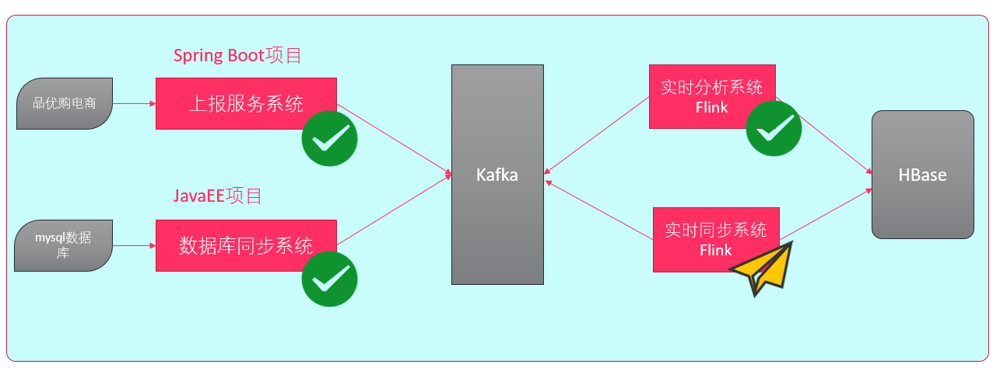

## 1.1 biglog日志格式分析

**测试日志数据**

```json
{
    "emptyCount": 2,
    "logFileName": "mysql-bin.000002",
    "dbName": "pyg",
    "logFileOffset": 250,
    "eventType": "INSERT",
    "columnValueList": [
        {
            "columnName": "commodityId",
            "columnValue": "1",
            "isValid": "true"
        },
        {
            "columnName": "commodityName",
            "columnValue": "耐克",
            "isValid": "true"
        },
        {
            "columnName": "commodityTypeId",
            "columnValue": "1",
            "isValid": "true"
        },
        {
            "columnName": "originalPrice",
            "columnValue": "888.0",
            "isValid": "true"
        },
        {
            "columnName": "activityPrice",
            "columnValue": "820.0",
            "isValid": "true"
        }
    ],
    "tableName": "commodity",
    "timestamp": 1553741346000
}
```

**格式分析**

| 字段名称        | 说明                   | 示例                                                         |
| --------------- | ---------------------- | ------------------------------------------------------------ |
| emptyCount      | 操作序号（第几条记录） | 12                                                           |
| logFileName     | binlog文件名           | mysql-bin.000001                                             |
| dbName          | 数据库名称             | pyg                                                          |
| logFileOffset   | binlog文件偏移位置     | 100                                                          |
| eventType       | 操作类型               | INSERT或UPDATE或DELETE                                       |
| columnValueList | 列值列表               | { "columnName": "列名","columnValue": "列值","isValid": "是否有效"} |
| tableName       | 表名                   | commodity                                                    |
| timestamp       | 执行时间戳             | 1553701139000                                                |

## 1.2 Flink实时同步应用开发

**整体架构**

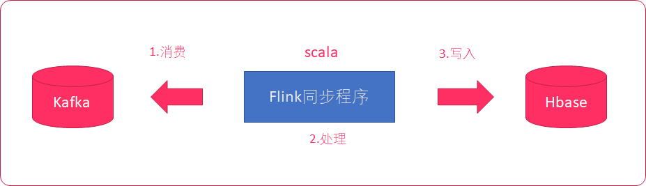

**具体架构**

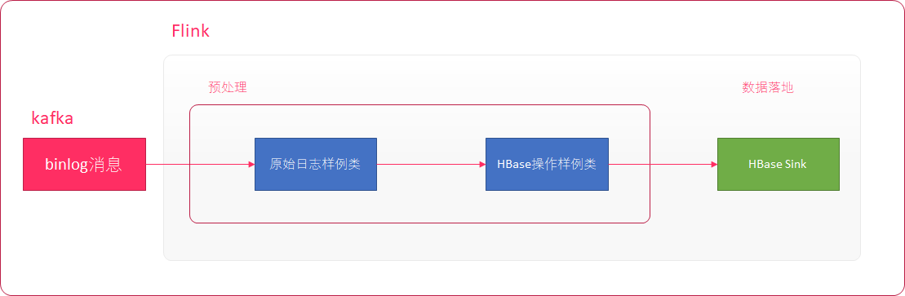

1. Flink对接kafka
2. 对数据进行预处理
3. 将数据落地到hbase

**数据同步说明**

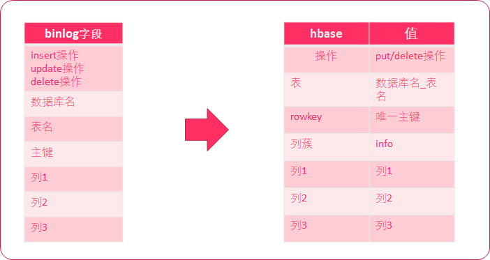

> 要确保hbase中的rowkey是唯一的，数据落地不能被覆盖

## 1.3 实时数据同步项目初始化

在sync-db项目的 scala 目录中，创建以下包结构：

| 包名                    | 说明                  |
| ----------------------- | --------------------- |
| com.itheima.syncdb.task | 存放所有flink任务代码 |
| com.it.syncdb.util      | 工具类                |
| com.it.syncdb.bean      | 存放实体类            |

1. 导入pom依赖

   ```xml
   <?xml version="1.0" encoding="UTF-8"?>
   <project xmlns="http://maven.apache.org/POM/4.0.0"
            xmlns:xsi="http://www.w3.org/2001/XMLSchema-instance"
            xsi:schemaLocation="http://maven.apache.org/POM/4.0.0 http://maven.apache.org/xsd/maven-4.0.0.xsd">
       <parent>
           <artifactId>pyg</artifactId>
           <groupId>org.example</groupId>
           <version>1.0-SNAPSHOT</version>
       </parent>
       <modelVersion>4.0.0</modelVersion>
   
       <artifactId>sync-db</artifactId>
   
       <properties>
           <scala.version>2.11</scala.version>
           <flink.version>1.6.1</flink.version>
           <hadoop.version>2.7.5</hadoop.version>
           <hbase.version>2.0.0</hbase.version>
       </properties>
   
   
       <dependencies>
           <!--kafka 客户端-->
           <dependency>
               <groupId>org.apache.kafka</groupId>
               <artifactId>kafka_${scala.version}</artifactId>
               <version>0.10.1.0</version>
           </dependency>
   
   
           <!--flink对接kafka：导入flink使用kafka的依赖-->
           <dependency>
               <groupId>org.apache.flink</groupId>
               <artifactId>flink-connector-kafka-0.10_${scala.version}</artifactId>
               <version>${flink.version}</version>
           </dependency>
   
           <!--批处理-->
           <dependency>
               <groupId>org.apache.flink</groupId>
               <artifactId>flink-table_${scala.version}</artifactId>
               <version>${flink.version}</version>
           </dependency>
           <!--导入scala的依赖-->
           <dependency>
               <groupId>org.apache.flink</groupId>
               <artifactId>flink-scala_${scala.version}</artifactId>
               <version>${flink.version}</version>
           </dependency>
   
           <!--模块二 流处理-->
           <dependency>
               <groupId>org.apache.flink</groupId>
               <artifactId>flink-streaming-scala_${scala.version}</artifactId>
               <version>${flink.version}</version>
           </dependency>
           <dependency>
               <groupId>org.apache.flink</groupId>
               <artifactId>flink-streaming-java_${scala.version}</artifactId>
               <version>${flink.version}</version>
           </dependency>
   
           <!--数据落地flink和hbase的集成依赖-->
           <dependency>
               <groupId>org.apache.flink</groupId>
               <artifactId>flink-hbase_${scala.version}</artifactId>
               <version>${flink.version}</version>
           </dependency>
   
           <dependency>
               <groupId>org.apache.hbase</groupId>
               <artifactId>hbase-client</artifactId>
               <version>${hbase.version}</version>
           </dependency>
   
   
           <!--<dependency>
               <groupId>org.apache.hbase</groupId>
               <artifactId>hbase-server</artifactId>
               <version>2.0.0</version>
           </dependency>-->
   
   
           <!--hbase依赖于hadoop-->
           <dependency>
               <groupId>org.apache.hadoop</groupId>
               <artifactId>hadoop-common</artifactId>
               <version>${hadoop.version}</version>
           </dependency>
   
           <dependency>
               <groupId>org.apache.hadoop</groupId>
               <artifactId>hadoop-hdfs</artifactId>
               <version>${hadoop.version}</version>
               <!--xml.parser冲突 flink hdfs-->
               <exclusions>
                   <exclusion>
                       <groupId>xml-apis</groupId>
                       <artifactId>xml-apis</artifactId>
                   </exclusion>
               </exclusions>
           </dependency>
   
           <dependency>
               <groupId>org.apache.hadoop</groupId>
               <artifactId>hadoop-client</artifactId>
               <version>${hadoop.version}</version>
               <!--数据同步：canal 和 hadoop protobuf-->
               <exclusions>
                   <exclusion>
                       <groupId>com.google.protobuf</groupId>
                       <artifactId>protobuf-java</artifactId>
                   </exclusion>
               </exclusions>
           </dependency>
   
   
           <!--对象和json 互相转换的-->
           <dependency>
               <groupId>com.alibaba</groupId>
               <artifactId>fastjson</artifactId>
               <version>1.2.44</version>
           </dependency>
       </dependencies>
   
   
       <build>
           <sourceDirectory>src/main/scala</sourceDirectory>
           <testSourceDirectory>src/test/scala</testSourceDirectory>
           <plugins>
               <plugin>
                   <groupId>org.apache.maven.plugins</groupId>
                   <artifactId>maven-shade-plugin</artifactId>
                   <version>3.0.0</version>
                   <executions>
                       <execution>
                           <phase>package</phase>
                           <goals>
                               <goal>shade</goal>
                           </goals>
                           <configuration>
                               <artifactSet>
                                   <excludes>
                                       <exclude>com.google.code.findbugs:jsr305</exclude>
                                       <exclude>org.slf4j:*</exclude>
                                       <exclude>log4j:*</exclude>
                                   </excludes>
                               </artifactSet>
                               <filters>
                                   <filter>
                                       <!-- Do not copy the signatures in the META-INF folder.
                                       Otherwise, this might cause SecurityExceptions when using the JAR. -->
                                       <artifact>*:*</artifact>
                                       <excludes>
                                           <exclude>META-INF/*.SF</exclude>
                                           <exclude>META-INF/*.DSA</exclude>
                                           <exclude>META-INF/*.RSA</exclude>
                                       </excludes>
                                   </filter>
                               </filters>
                               <transformers>
                                   <transformer
                                           implementation="org.apache.maven.plugins.shade.resource.ManifestResourceTransformer">
                                       <mainClass>com.it.syncdb.App</mainClass>
                                   </transformer>
                               </transformers>
                           </configuration>
                       </execution>
                   </executions>
               </plugin>
           </plugins>
       </build>
   
   
   </project>
   ```

2. 给模块`sync-db`添加scala支持

3. main和test目录下分别创建scala文件夹，并标记为源代码和测试代码目录

4. 导入`application.conf`配置文件至resources目录

   ```
   #
   #kafka的配置
   #
   # Kafka集群地址
   bootstrap.servers="bigdata111:9092,bigdata222:9092,bigdata333:9092"
   # ZooKeeper集群地址
   zookeeper.connect="bigdata111:2181,bigdata222:2181,bigdata333:2181"
   # Kafka Topic名称
   input.topic="canal"
   # 消费组ID
   group.id="canal"
   # 自动提交拉取到消费端的消息offset到kafka
   enable.auto.commit="true"
   # 自动提交offset到zookeeper的时间间隔单位（毫秒）
   auto.commit.interval.ms="5000"
   # 每次消费最新的数据
   auto.offset.reset="latest"
   ```

5. 导入`log4j.properties`配置文件至resources目录

   ```
   log4j.rootLogger=warn,stdout
   log4j.appender.stdout=org.apache.log4j.ConsoleAppender 
   log4j.appender.stdout.layout=org.apache.log4j.PatternLayout 
   log4j.appender.stdout.layout.ConversionPattern=%5p - %m%n
   ```

6. 复制之前Flink项目中real-process模块模块下的 `GlobalConfigUtil` 和` HBaseUtil`文件至util目录内

## 1.4 Flink程序开发

**步骤**

1. 编写 App.scala ，初始化Flink环境
2. 运行Flink程序，测试是否能够消费到kafka中topic为 canal 的数据

**App.scala**

```scala
package com.it.syncdb

import java.util.Properties

import com.it.syncdb.bean.{Canal, HBaseOperation}
import com.it.syncdb.task.PreprocessTask
import com.it.syncdb.util.{FlinkUtils, GlobalConfigUtil, HBaseUtil}
import org.apache.flink.streaming.api.scala.{DataStream, StreamExecutionEnvironment}
import org.apache.flink.api.scala._
import org.apache.flink.streaming.api.functions.AssignerWithPeriodicWatermarks
import org.apache.flink.streaming.api.functions.sink.SinkFunction
import org.apache.flink.streaming.api.watermark.Watermark
import org.apache.flink.streaming.connectors.kafka.FlinkKafkaConsumer010
/**
 * @Class:pyg.com.it.syncdb.App
 * @Descript:
 * @Author:宋天
 * @Date:2020/3/15
 */
object App {
  def main(args: Array[String]): Unit = {
    // 初始化Flink的流式环境
    val env = FlinkUtils.initFlinkEnv()

    //测试流式环境
    val testDs: DataStream[String] = env.fromCollection(List(
      "1", "2", "3"
    ))
    testDs.print()

    //整合kafka
    val consumer: FlinkKafkaConsumer010[String] = FlinkUtils.initKafkaFlink()
    //测试打印
    val kafkaDataStream: DataStream[String] = env.addSource(consumer)
    kafkaDataStream.print()
    
        //执行任务
    env.execute("sink-db")

  }
}
```

**FlinkUtils.scala**

```scala
package com.it.syncdb.util

import java.util.Properties

import org.apache.flink.api.common.serialization.SimpleStringSchema
import org.apache.flink.runtime.state.filesystem.FsStateBackend
import org.apache.flink.streaming.api.{CheckpointingMode, TimeCharacteristic}
import org.apache.flink.streaming.api.environment.CheckpointConfig
import org.apache.flink.streaming.api.scala.StreamExecutionEnvironment
import org.apache.flink.streaming.connectors.kafka.FlinkKafkaConsumer010

/**
 * @Class:pyg.com.it.syncdb.util.FlinkUtils
 * @Descript:
 * @Author:宋天
 * @Date:2020/3/15
 */
object FlinkUtils {

  // 初始化Flink的流式环境
  def initFlinkEnv()={
    //Flink流式环境的创建
    val env: StreamExecutionEnvironment = StreamExecutionEnvironment.getExecutionEnvironment
    //设置env的处理时间为EventTime
    env.setStreamTimeCharacteristic(TimeCharacteristic.EventTime)
    //设置并行度
    env.setParallelism(1)
      
	    // 设置checkpoint
    //开启checkpoint，间隔时间为5秒
    env.enableCheckpointing(5000)
    // 设置处理模式
    env.getCheckpointConfig.setCheckpointingMode(CheckpointingMode.EXACTLY_ONCE)
    // 设置两次checkpoint的间隔
    env.getCheckpointConfig.setMinPauseBetweenCheckpoints(1000)
    //设置超时时长
    env.getCheckpointConfig.setCheckpointTimeout(60000)
    // 设置并行度
    env.getCheckpointConfig.setMaxConcurrentCheckpoints(1)
    // 当程序关闭的时候触发额外的checkpoint
    env.getCheckpointConfig.enableExternalizedCheckpoints(CheckpointConfig.ExternalizedCheckpointCleanup.RETAIN_ON_CANCELLATION)
    // 设置检查点在hdfs中的存储位置
    env.setStateBackend(new FsStateBackend("hdfs://bigdata111:9000/flink-checkpoint"))

    env
  }
    
    
     //整合kafka
    def initKafkaFlink()={
    val props = new Properties()
    props.setProperty("bootstrap.servers",GlobalConfigUtil.bootstrapServers)
    props.setProperty("group.id",GlobalConfigUtil.groupId)
    props.setProperty("enable.auto.commit",GlobalConfigUtil.enableAutoCommit)
    props.setProperty("auto.commit.interval.ms",GlobalConfigUtil.autoCommitIntervalMs)
    props.setProperty("auto.offset.reset",GlobalConfigUtil.autoOffsetReset)

    val consumer = new FlinkKafkaConsumer010[String](
      GlobalConfigUtil.inputTopic,
      new SimpleStringSchema(),
      props
    )

    consumer
  }

}


```

### 1.4.1 定义原始 Canal消息 样例类

**步骤**

1. 在 bean 包下创建 Canal原始消息 映射样例类
2. 在 Cannal样例类 中编写apply方法，使用FastJSON来解析数据，转换为Cannal样例类对象
3. 编写 main 方法测试是否能够成功构建样例类对象

**canan.scala**

```scala
package com.it.syncdb.bean
import com.alibaba.fastjson.{JSON, JSONObject}
/**
 * @Class:pyg.com.it.syncdb.bean.Canal
 * @Descript:
 * @Author:宋天
 * @Date:2020/3/16
 */


case class Canal(
                  var emptyCount: Long,
                  var logFileName: String,
                  var dbName: String,
                  var logFileOffset: Long,
                  var eventType: String,
                  var columnValueList: String,
                  var tableName: String,
                  var timestamp: Long
                )

object Canal {
  def apply(json: String): Canal = {
    JSON.parseObject[Canal](json, classOf[Canal])
  }

  def main(args: Array[String]): Unit = {
    val json = "{\"emptyCount\":2,\"logFileName\":\"mysql-bin.000005\",\"dbName\":\"pyg\",\"logFileOffset\":20544,\"eventType\":\"INSERT\",\"columnValueList\":[{\"columnName\":\"commodityId\",\"columnValue\":\"6\",\"isValid\":true},{\"columnName\":\"commodityName\",\"columnValue\":\"欧派\",\"isValid\":true},{\"columnName\":\"commodityTypeId\",\"columnValue\":\"3\",\"isValid\":true},{\"columnName\":\"originalPrice\",\"columnValue\":\"43000.0\",\"isValid\":true},{\"columnName\":\"activityPrice\",\"columnValue\":\"40000.0\",\"isValid\":true}],\"tableName\":\"commodity\",\"timestamp\":1558764495000}"
    val canal = Canal(json)

    println(canal.timestamp)
  }
}
```

### 1.4.2 解析kafka数据流为canal样例类

**步骤**

1. 在 map 算子将消息转换为 Canal样例类 对象

2. 打印测试，如果能输出以下信息，表示成功

   ```scala
   Canal(mysql-bin.000002,1893,pyg,commodity,DELETE,
   [{"isValid":"false","columnValue":"5","columnName":"commodityId"},
   {"isValid":"false","columnValue":"索菲亚","columnName":"commodityName"},
   {"isValid":"false","columnValue":"3","columnName":"commodityTypeId"},
   {"isValid":"false","columnValue":"35000.0","columnName":"originalPrice"},
   {"isValid":"false","columnValue":"30100.0","columnName":"activityPrice"}],3,1553743567000)
   HBaseOperation(DELETE,commodity,info,5,,)
   ```

在`app.scala`中添加如下代码并执行测试

```scala
    // 将kafka中拿到的JSON字符串canal消息，转换为Canal样
    val canalDs: DataStream[Canal] = kafkaDataStream.map {
      json => {
        Canal(json)
      }
    }
    canalDs.print()
```

### 1.4.3 添加水印支持

**步骤**

1. 使用Canal中的 timestamp 字段，生成水印数据
2. 重新运行Flink，打印添加水印后的数据

在`app.scala`中添加如下代码并执行测试

```scala
 // 添加水印
    val waterDs: DataStream[Canal] = canalDs.assignTimestampsAndWatermarks(new AssignerWithPeriodicWatermarks[Canal] {
      // 当前时间戳
      var currentTimestamp = 0L
      // 延迟时间
      val delayTime = 2000l

      // 返回水印时间
      override def getCurrentWatermark: Watermark = {
        new Watermark(currentTimestamp - delayTime)
      }

      // 比较当前元素的时间和上一个元素的时间，取最大值，防止时间倒流
      override def extractTimestamp(t: Canal, l: Long): Long = {
        currentTimestamp = Math.max(t.timestamp, l)
        currentTimestamp
      }
    })
```

### 1.4.4 定义HBaseOperation样例类

HbaseOperation样例类主要封装对Hbase的操作，主要封装以下字段：

- 操作类型（opType）= INSERT/DELETE/UPDATE
- 表名（tableName）= mysql.binlog数据库名.binlog表名
- 列族名（cfName）= 固定为info
- rowkey = 唯一主键（取binlog中列数据的第一个）
- 列名（colName）= binlog中列名
- 列值（colValue）= binlog中列值

在bean包下创建**HBaseOperation.scala**样例类

```scala
package com.it.syncdb.bean

/**
  * 操作类型（opType）= INSERT/DELETE/UPDATE
  * 表名（tableName）= mysql.binlog数据库名.binlog表名
  * 列族名（cfName）= 固定为info
  * rowkey = 唯一主键（取binlog中列数据的第一个）
  * 列名（colName）= binlog中列名
  * 列值（colValue）= binlog中列值
  */
case class HBaseOperation(
                           var opType: String,
                           val tableName: String,
                           val cfName: String,
                           val rowkey: String,
                           val colName: String,
                           val colValue: String
                         )

```

### 1.4.5 将Canal样例类转换为HBaseOperation样

一个binlog消息中，有会有多个列的操作。它们的映射关系如下：

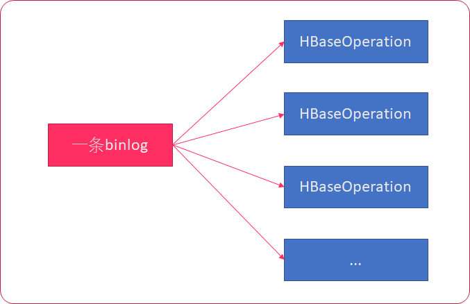

我们可以使用 flatMap 算子，来生成一组 HBaseOperation 操作

**步骤**

1. 创建一个预处理任务对象
2. 使用flatMap对水印数据流转换为 HBaseOperation
- 根据eventType分别处理 HBaseOperation 列表
- 生成的表名为 mysql.数据库名.表名
- rowkey就是第一个列的值
- INSERT操作 -> 将所有列值转换为HBaseOperation
- UPDATE操作 -> 过滤掉isValid字段为 false 的列，再转换为HBaseOperation
- DELETE操作 -> 只生成一条DELETE的HBaseOperation的List

**INSERT操作记录**

| 序号            | 值       | 说明                                     |
| --------------- | -------- | ---------------------------------------- |
| eventType       | INSERT   | 表示这是一个插入操作                     |
| columnValueList | JSON数组 | columnValueList中，`isValid`总是为`true` |

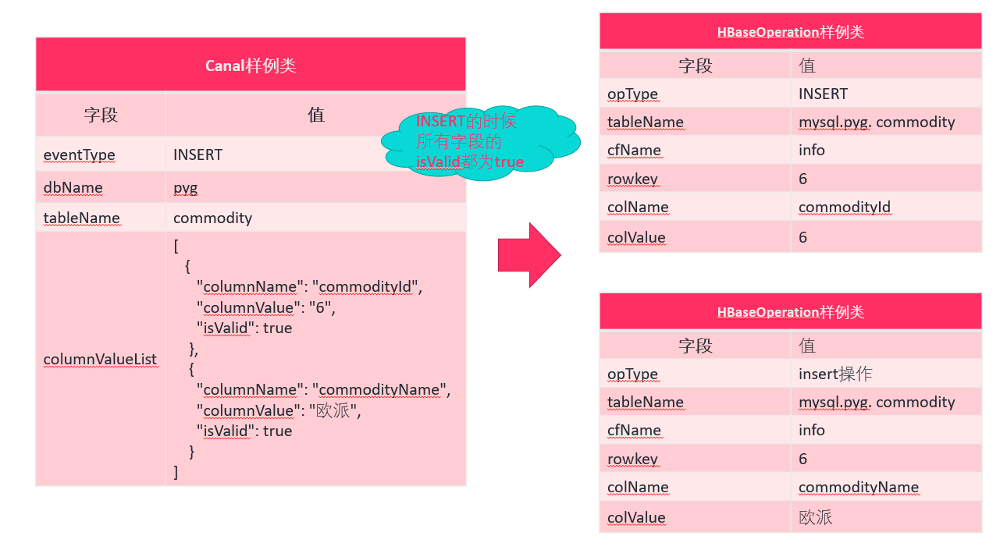

**UPDATE操作记录**


| 序号            | 值       | 说明                                                         |
| --------------- | -------- | ------------------------------------------------------------ |
| eventType       | UPDATE   | 表示这是一个更新操作                                         |
| columnValueList | JSON数组 | columnValueList中，更新的`isValid`字段为`true`，未更新的为`false` |

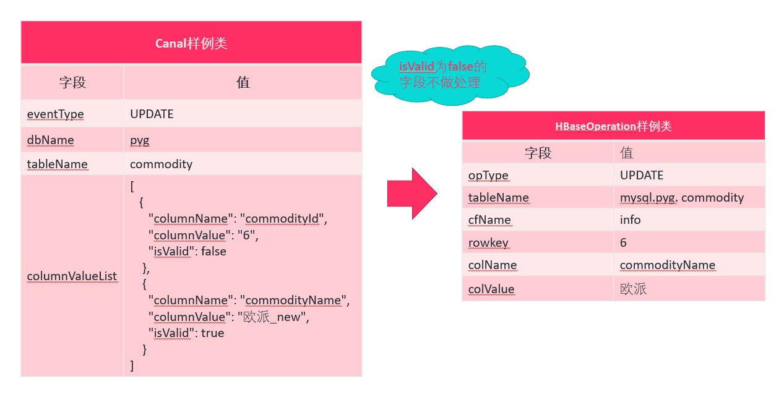

**DELETE操作记录**

| 序号            | 值       | 说明                                      |
| --------------- | -------- | ----------------------------------------- |
| eventType       | DELETE   | 表示这是一个删除操作                      |
| columnValueList | JSON数组 | columnValueList中，`isValid`总是为`false` |

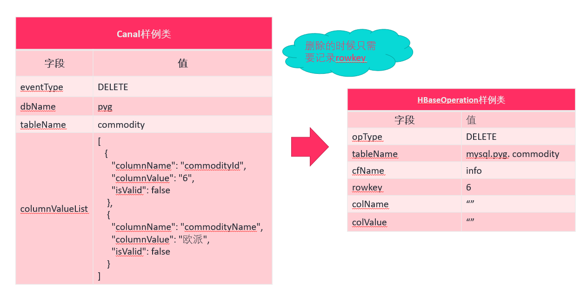

**实现**

1. 在`task`包下创建`PreprocessTask`单例对象，添加`process`方法

2. 使用flatMap对Canal样例类进行扩展

3. 使用`FastJSON`解析Canal样例类中的`列值列表数据`，并存储到一个Seq中

4. 遍历集合，构建`HBaseOperation`样例类对象

5. 打印测试

6. 启动Flink验证程序是否正确处理


> **JSON字符串转List**
>
> `List<T> parseArray(String text, Class<T> clazz) `
>
> `classOf[T] `: 获取class对象
>
> **Java的List转Scala的集合**
>
> 注意要导入: `import scala.collection.JavaConverters._`
>
> `var scalaList: mutable.Buffer[T] = javaList.asScala`

```scala
package com.it.syncdb.task

import java.util

import com.alibaba.fastjson.JSON
import com.it.syncdb.bean.{Canal, HBaseOperation}
import org.apache.flink.streaming.api.scala.DataStream
import org.apache.flink.api.scala._

import scala.collection.JavaConverters._
import scala.collection.mutable
/**
 * 封装列名、列值、是否有效
 *
 * @param columnName 列名
 * @param columnValue 列值
 * @param isValid 是否有效
 */

case class NameValuePair(
                          var columnName: String,
                          var columnValue: String,
                          var isValid: Boolean
                        )

/**
 * 预处理任务
 * 把Canal-> HBaseOperation
 */

object PreprocessTask {

  def process(canalDataStream: DataStream[Canal]) = {

    // flatmap

    canalDataStream.flatMap {
      canal => {
        // 把canal.columnValueList转换为scala的集合
        val javaList: util.List[NameValuePair] = JSON.parseArray(canal.columnValueList, classOf[NameValuePair])
        // java的集合转换为scala集合 需要import scala.collection.JavaConverters._
        val nameValueList: mutable.Buffer[NameValuePair] = javaList.asScala

        // 获取操作类型
        var opType = canal.eventType
        // 生成的表名为mysql.数据库名.表名
        val tableName = "mysql." + canal.dbName + "." + canal.tableName
        // 列族名
        val cfName = "info"
        // 获取mysql中的主键，获取第一列的值
        val rowkey = nameValueList(0).columnValue

        // 遍历集合,先判断是insert还是update或者delete
        opType match {
          case "INSERT" =>
            // 如果是INSERT操作，将每一个列值对转换为一个HBaseOperation
            nameValueList.map {
              nameValue => HBaseOperation(opType, tableName, cfName, rowkey, nameValue.columnName, nameValue.columnValue)
            }
          // UPDATE操作 -> 过滤出来isValid字段为true的列，再转换为HBaseOperat
          case "UPDATE" =>
            nameValueList.filter(_.isValid).map {
              nameValue => HBaseOperation(opType, tableName, cfName, rowkey, nameValue.columnName, nameValue.columnValue)
            }
          // DELETE操作 -> 只生成一条DELETE的HBaseOperation的List
          case "DELETE" =>
            List(HBaseOperation(opType,tableName,cfName,rowkey,"",""))

        }

//        List[HBaseOperation]()
      }
    }

  }

}

```

### 1.4.6 Flink数据同步到hbase

步骤
1. 分两个落地实现，一个是 delete ，一个是 insert/update （因为hbase中只有一个put操作，所以只要是
insert/update都转换为put操作）
2. 启动 hbase
3. 启动 flink 测试

在`app.scala`中添加如下代码，并执行测试

```scala
 // 落地HBase
    val hbaseDs: DataStream[HBaseOperation] = PreprocessTask.process(waterDs)
    hbaseDs.print()

    hbaseDs.addSink(new SinkFunction[HBaseOperation] {
      override def invoke(value: HBaseOperation): Unit = {
        value.opType match {
          case "DELETE" => HBaseUtil.deleteData(value.tableName,value.rowkey,value.cfName)
          case _ => HBaseUtil.putData(value.tableName,value.rowkey,value.cfName,value.colName,value.colValue)
        }
      }
    })
```

### 1.4.7  验证Flink同步数据功能

**步骤**

1. 启动 mysql
2. 启动 canal
3. 启动 zookeeper 集群
4. 启动 kafka 集群
5. 启动 hdfs 集群
6. 启动 hbase 集群
7. 启动 Flink数据同步程序
8. 启动 Canal数据同步程序
9. 在mysql中执行insert、update、delete语句，查看 hbase 数据是否落地

# 2. Flink离线分析系统开发

## 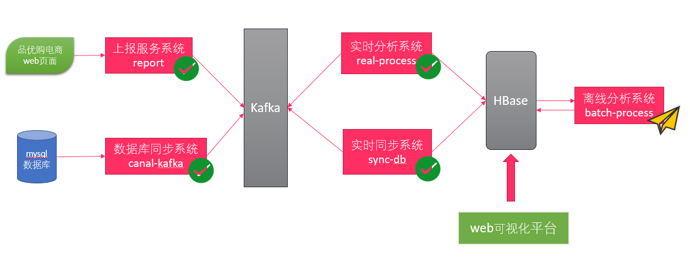2.1 介绍

- 使用之前开发的数据库实时同步系统，将mysql中的数据实时同步到hbase
- 使用Flink程序开发批处理应用，对hbase中的数据进行离线分析

## 2.2 主要业务数据

订单业务数据表 orderRecord 介绍

| 字段名称      | 说明                        |
| ------------- | --------------------------- |
| orderId       | 订单ID                      |
| userId        | ⽤户ID                      |
| merchantId    | 商家ID                      |
| orderAmount   | 下单金额                    |
| payAmount     | 支付金额                    |
| payMethod     | 支付方式                    |
| payTime       | 支付时间                    |
| benefitAmount | 红包金额                    |
| voucherAmount | 代⾦券金额                  |
| commodityId   | 产品id                      |
| activityNum   | 活动编号（大于0代表有活动） |
| createTime    | 创建时间                    |

## 2.3 业务目标

- 按照 天、月、年 维度统计不同 支付方式 的 订单数量 、 支付金额
- 按照 天、月、年 维度统计不同 商家 的 订单数量 、 支付金额

## 2.4 构建Flink批处理项目结构

### 2.4.1 导入maven依赖

导入`pom.xml`依赖至`batch-process`模块内

```xml
<?xml version="1.0" encoding="UTF-8"?>
<project xmlns="http://maven.apache.org/POM/4.0.0"
         xmlns:xsi="http://www.w3.org/2001/XMLSchema-instance"
         xsi:schemaLocation="http://maven.apache.org/POM/4.0.0 http://maven.apache.org/xsd/maven-4.0.0.xsd">
    <modelVersion>4.0.0</modelVersion>

    <groupId>org.example</groupId>
    <artifactId>batch-process</artifactId>
    <version>1.0-SNAPSHOT</version>

    <properties>
        <scala.version>2.11</scala.version>
        <flink.version>1.6.1</flink.version>
        <hadoop.version>2.7.5</hadoop.version>
        <hbase.version>2.0.0</hbase.version>
    </properties>


    <dependencies>
        <!--kafka 客户端-->
        <dependency>
            <groupId>org.apache.kafka</groupId>
            <artifactId>kafka_${scala.version}</artifactId>
            <version>0.10.1.0</version>
        </dependency>


        <!--flink对接kafka：导入flink使用kafka的依赖-->
        <dependency>
            <groupId>org.apache.flink</groupId>
            <artifactId>flink-connector-kafka-0.10_${scala.version}</artifactId>
            <version>${flink.version}</version>
        </dependency>

        <!--批处理-->
        <dependency>
            <groupId>org.apache.flink</groupId>
            <artifactId>flink-table_${scala.version}</artifactId>
            <version>${flink.version}</version>
        </dependency>
        <!--导入scala的依赖-->
        <dependency>
            <groupId>org.apache.flink</groupId>
            <artifactId>flink-scala_${scala.version}</artifactId>
            <version>${flink.version}</version>
        </dependency>

        <!--模块二 流处理-->
        <dependency>
            <groupId>org.apache.flink</groupId>
            <artifactId>flink-streaming-scala_${scala.version}</artifactId>
            <version>${flink.version}</version>
        </dependency>
        <dependency>
            <groupId>org.apache.flink</groupId>
            <artifactId>flink-streaming-java_${scala.version}</artifactId>
            <version>${flink.version}</version>
        </dependency>

        <!--数据落地flink和hbase的集成依赖-->
        <dependency>
            <groupId>org.apache.flink</groupId>
            <artifactId>flink-hbase_${scala.version}</artifactId>
            <version>${flink.version}</version>
        </dependency>

        <dependency>
            <groupId>org.apache.hbase</groupId>
            <artifactId>hbase-client</artifactId>
            <version>${hbase.version}</version>
        </dependency>


        <!--hbase依赖于hadoop-->
        <dependency>
            <groupId>org.apache.hadoop</groupId>
            <artifactId>hadoop-common</artifactId>
            <version>${hadoop.version}</version>
        </dependency>

        <dependency>
            <groupId>org.apache.hadoop</groupId>
            <artifactId>hadoop-hdfs</artifactId>
            <version>${hadoop.version}</version>
            <!--xml.parser冲突 flink hdfs-->
            <exclusions>
                <exclusion>
                    <groupId>xml-apis</groupId>
                    <artifactId>xml-apis</artifactId>
                </exclusion>
            </exclusions>
        </dependency>

        <dependency>
            <groupId>org.apache.hadoop</groupId>
            <artifactId>hadoop-client</artifactId>
            <version>${hadoop.version}</version>
            <!--数据同步：canal 和 hadoop protobuf-->
            <exclusions>
                <exclusion>
                    <groupId>com.google.protobuf</groupId>
                    <artifactId>protobuf-java</artifactId>
                </exclusion>
            </exclusions>
        </dependency>


        <!--对象和json 互相转换的-->
        <dependency>
            <groupId>com.alibaba</groupId>
            <artifactId>fastjson</artifactId>
            <version>1.2.44</version>
        </dependency>
    </dependencies>


    <build>
        <sourceDirectory>src/main/scala</sourceDirectory>
        <testSourceDirectory>src/test/scala</testSourceDirectory>
        <plugins>
            <plugin>
                <groupId>org.apache.maven.plugins</groupId>
                <artifactId>maven-shade-plugin</artifactId>
                <version>3.0.0</version>
                <executions>
                    <execution>
                        <phase>package</phase>
                        <goals>
                            <goal>shade</goal>
                        </goals>
                        <configuration>
                            <artifactSet>
                                <excludes>
                                    <exclude>com.google.code.findbugs:jsr305</exclude>
                                    <exclude>org.slf4j:*</exclude>
                                    <exclude>log4j:*</exclude>
                                </excludes>
                            </artifactSet>
                            <filters>
                                <filter>
                                    <!-- Do not copy the signatures in the META-INF folder.
                                    Otherwise, this might cause SecurityExceptions when using the JAR. -->
                                    <artifact>*:*</artifact>
                                    <excludes>
                                        <exclude>META-INF/*.SF</exclude>
                                        <exclude>META-INF/*.DSA</exclude>
                                        <exclude>META-INF/*.RSA</exclude>
                                    </excludes>
                                </filter>
                            </filters>
                            <transformers>
                                <transformer
                                        implementation="org.apache.maven.plugins.shade.resource.ManifestResourceTransformer">
                                    <mainClass>com.it.syncdb.App</mainClass>
                                </transformer>
                            </transformers>
                        </configuration>
                    </execution>
                </executions>
            </plugin>
        </plugins>
    </build>
</project>
```

### 2.4.2 创建包结构

| 包名                      | 说明                 |
| ------------------------- | -------------------- |
| com.it.batch_process.task | 存放离线分析业务任务 |
| com.it.batch_process.bean | 存在样例类           |
| com.it.batch_process.util | 存放工具类           |

## 2.5 初始化Flink批处理运行环境

**步骤**

1. 获取Flink批处理运行环境 ExecutionEnvironment
2. 使用fromCollection构建测试数据
3. 调用print操作
4. 执行测试

在`batch-process`模块内创建`app.scala`文件，并添加以下代码，执行测试

```scala
package com.it.batch_process

import com.it.batch_process.bean.{OrderRecord, OrderRecordWide}
import com.it.batch_process.task.{MerchantCountMoneyTask, PaymethodMoneyCountTask, PreprocessTask}
import com.it.batch_process.util.HBaseTableInputFormat
import org.apache.flink.api.scala.ExecutionEnvironment
import org.apache.flink.api.scala._
import org.apache.flink.api.java.tuple
/**
 * @Class:pyg.com.it.batch_process.App
 * @Descript:
 * @Author:宋天
 * @Date:2020/3/16
 */
object App {

  def main(args: Array[String]): Unit = {
    // 初始化批处理环境
    val env: ExecutionEnvironment = ExecutionEnvironment.getExecutionEnvironment
    //设置并行度
    env.setParallelism(1)
    //测试输出
    val testDataSet: DataSet[String] = env.fromCollection(List("1", "2"))
    testDataSet.print()
      
     }
}

```

## 2.6 导入测试数据

步骤

1. 启动Flink实时同步系统
2. 启动canal
3. 导入下面sql脚本中的测试数据
4. 检查数据是否已经成功导入到hbase中

```sql
-- 商品表
create table commodity(
	commodityId int(10), #商品ID
	commodityName varchar(20), #商品名称
	commodityTypeId int(20),# 商品类别ID
	originalPrice double(16,2), # 原价
	activityPrice double(16,2) # 活动价
);

-- 列表表
create table category(
	categoryId int(10), # 商品类别ID
	categoryName varchar(20), # 商品类别名称
	categoryGrade int(20) # 商品类别等级
	
);

-- 店铺表
create table merchantStore(
	merchantId int(20), # 商家ID
	storeName varchar(20), # 商家店铺名称
	storeId varchar(20) # 商家店铺Id
);

-- 商家表
create table merchant(
	merchantId int(20), # 商家ID
	merchantName varchar(20), #商家名称
	merchantArea varchar(20) # 商家地区

)

-- 用户表
create table user(
	userId int(10), # 用户id
	userName varchar(30), # 用户名称
	userAge int(3), #用户年龄
	registerArea varchar(30), # 用户注册地区
	userPhone varchar(30), #用户手机号
	userBirthday varchar(30) # 用户生日
);


-- 订单表 
create table orderRecord(
	orderId int(10),#订单ID
	userId int(10), # 用户id
	merchantId int(20), # 商家ID
	orderAmount DOUBLE(16,2), #下单金额
	payAmount DOUBLE(16,2),# 支付金额
	payMethod int(10),# 支付方式
	payTime DATETIME, # 支付时间
	benefitAmount double(16,2),# 红包金额
	voucherAmount double(16,2) ,# 代金券金额
	commodityId int(10), # 产品ID
	activityNum varchar(20), # 活动编号（大于0代表有活动）
	createTime DATETIME #创建时间
);


-- 活动表
create table activityRecord(
	orderId int(10),# 订单ID
	userId int(10), # 用户id
	activityId int(10),# 活动ID
	activityName varchar(30),# 活动名称
	activityBeginTime DATETIME,#活动开始时间
	activityEndTime DATETIME,#活动开始时间
	commodityId int(10) # 商品ID
)

```

## 2.7 整合HBase

**步骤**

1. 导入中的 log4j.properties 和 hbase-site.xml 文件

   - log4j.properties 

     ```
     log4j.rootLogger=warn,stdout
     log4j.appender.stdout=org.apache.log4j.ConsoleAppender 
     log4j.appender.stdout.layout=org.apache.log4j.PatternLayout 
     log4j.appender.stdout.layout.ConversionPattern=%5p - %m%n
     ```

   -  hbase-site.xml 文件去服务器的hbase目录的config下找

2. 将模块`real-process`内`util`包下的HBaseUtil.scala 工具类，导入`batch-process`的`util`包内

3. 导入 ItheimaAbstractTableInputFormat.java

   ```scala
   /*
    * Licensed to the Apache Software Foundation (ASF) under one
    * or more contributor license agreements.  See the NOTICE file
    * distributed with this work for additional information
    * regarding copyright ownership.  The ASF licenses this file
    * to you under the Apache License, Version 2.0 (the
    * "License"); you may not use this file except in compliance
    * with the License.  You may obtain a copy of the License at
    *
    *     http://www.apache.org/licenses/LICENSE-2.0
    *
    * Unless required by applicable law or agreed to in writing, software
    * distributed under the License is distributed on an "AS IS" BASIS,
    * WITHOUT WARRANTIES OR CONDITIONS OF ANY KIND, either express or implied.
    * See the License for the specific language governing permissions and
    * limitations under the License.
    */
   
   package com.it.batch_process.util;
   
   import org.apache.flink.addons.hbase.AbstractTableInputFormat;
   import org.apache.flink.api.common.io.InputFormat;
   import org.apache.flink.api.common.io.LocatableInputSplitAssigner;
   import org.apache.flink.api.common.io.RichInputFormat;
   import org.apache.flink.api.common.io.statistics.BaseStatistics;
   import org.apache.flink.configuration.Configuration;
   import org.apache.flink.core.io.InputSplitAssigner;
   
   import org.apache.hadoop.hbase.client.HTable;
   import org.apache.hadoop.hbase.client.Result;
   import org.apache.hadoop.hbase.client.ResultScanner;
   import org.apache.hadoop.hbase.client.Scan;
   import org.apache.hadoop.hbase.util.Bytes;
   import org.apache.hadoop.hbase.util.Pair;
   import org.slf4j.Logger;
   import org.slf4j.LoggerFactory;
   
   import java.io.IOException;
   import java.util.ArrayList;
   import java.util.List;
   
   /**
    * 由于flink-hbase_2.11_1.6.1 jar包引用的是hbase1.4.3版本，我们现在用的是hbase2.0，版本不匹配
    * 故需要重写flink-hbase_2.11_1.6.1里面的TableInputFormat
    *
    * Abstract {@link InputFormat} to read data from HBase tables.
    */
   public abstract class ItheimaAbstractTableInputFormat<T> extends RichInputFormat<T, ItheimaTableInputSplit> {
   
   	protected static final Logger LOG = LoggerFactory.getLogger(AbstractTableInputFormat.class);
   
   	// helper variable to decide whether the input is exhausted or not
   	protected boolean endReached = false;
   
   	protected transient HTable table = null;
   	protected transient Scan scan = null;
   
   	/** HBase iterator wrapper. */
   	protected ResultScanner resultScanner = null;
   
   	protected byte[] currentRow;
   	protected long scannedRows;
   
   	/**
   	 * Returns an instance of Scan that retrieves the required subset of records from the HBase table.
   	 *
   	 * @return The appropriate instance of Scan for this use case.
   	 */
   	protected abstract Scan getScanner();
   
   	/**
   	 * What table is to be read.
   	 *
   	 * <p>Per instance of a TableInputFormat derivative only a single table name is possible.
   	 *
   	 * @return The name of the table
   	 */
   	protected abstract String getTableName();
   
   	/**
   	 * HBase returns an instance of {@link Result}.
   	 *
   	 * <p>This method maps the returned {@link Result} instance into the output type {@link T}.
   	 *
   	 * @param r The Result instance from HBase that needs to be converted
   	 * @return The appropriate instance of {@link T} that contains the data of Result.
   	 */
   	protected abstract T mapResultToOutType(Result r);
   
   	/**
   	 * Creates a {@link Scan} object and opens the {@link HTable} connection.
   	 *
   	 * <p>These are opened here because they are needed in the createInputSplits
   	 * which is called before the openInputFormat method.
   	 *
   	 * <p>The connection is opened in this method and closed in {@link #closeInputFormat()}.
   	 *
   	 * @param parameters The configuration that is to be used
   	 * @see Configuration
   	 */
   	public abstract void configure(Configuration parameters);
   
   	@Override
   	public void open(ItheimaTableInputSplit split) throws IOException {
   		if (table == null) {
   			throw new IOException("The HBase table has not been opened! " +
   				"This needs to be done in configure().");
   		}
   		if (scan == null) {
   			throw new IOException("Scan has not been initialized! " +
   				"This needs to be done in configure().");
   		}
   		if (split == null) {
   			throw new IOException("Input split is null!");
   		}
   
   		logSplitInfo("opening", split);
   
   		// set scan range
   		currentRow = split.getStartRow();
   		scan.setStartRow(currentRow);
   		scan.setStopRow(split.getEndRow());
   
   		resultScanner = table.getScanner(scan);
   		endReached = false;
   		scannedRows = 0;
   	}
   
   	public T nextRecord(T reuse) throws IOException {
   		if (resultScanner == null) {
   			throw new IOException("No table result scanner provided!");
   		}
   		try {
   			Result res = resultScanner.next();
   			if (res != null) {
   				scannedRows++;
   				currentRow = res.getRow();
   				return mapResultToOutType(res);
   			}
   		} catch (Exception e) {
   			resultScanner.close();
   			//workaround for timeout on scan
   			LOG.warn("Error after scan of " + scannedRows + " rows. Retry with a new scanner...", e);
   			scan.setStartRow(currentRow);
   			resultScanner = table.getScanner(scan);
   			Result res = resultScanner.next();
   			if (res != null) {
   				scannedRows++;
   				currentRow = res.getRow();
   				return mapResultToOutType(res);
   			}
   		}
   
   		endReached = true;
   		return null;
   	}
   
   	private void logSplitInfo(String action, ItheimaTableInputSplit split) {
   		int splitId = split.getSplitNumber();
   		String splitStart = Bytes.toString(split.getStartRow());
   		String splitEnd = Bytes.toString(split.getEndRow());
   		String splitStartKey = splitStart.isEmpty() ? "-" : splitStart;
   		String splitStopKey = splitEnd.isEmpty() ? "-" : splitEnd;
   		String[] hostnames = split.getHostnames();
   		LOG.info("{} split (this={})[{}|{}|{}|{}]", action, this, splitId, hostnames, splitStartKey, splitStopKey);
   	}
   
   	@Override
   	public boolean reachedEnd() throws IOException {
   		return endReached;
   	}
   
   	@Override
   	public void close() throws IOException {
   		LOG.info("Closing split (scanned {} rows)", scannedRows);
   		currentRow = null;
   		try {
   			if (resultScanner != null) {
   				resultScanner.close();
   			}
   		} finally {
   			resultScanner = null;
   		}
   	}
   
   	@Override
   	public void closeInputFormat() throws IOException {
   		try {
   			if (table != null) {
   				table.close();
   			}
   		} finally {
   			table = null;
   		}
   	}
   
   	@Override
   	public ItheimaTableInputSplit[] createInputSplits(final int minNumSplits) throws IOException {
   		if (table == null) {
   			throw new IOException("The HBase table has not been opened! " +
   				"This needs to be done in configure().");
   		}
   		if (scan == null) {
   			throw new IOException("Scan has not been initialized! " +
   				"This needs to be done in configure().");
   		}
   
   		// Get the starting and ending row keys for every region in the currently open table
   		final Pair<byte[][], byte[][]> keys = table.getRegionLocator().getStartEndKeys();
   		if (keys == null || keys.getFirst() == null || keys.getFirst().length == 0) {
   			throw new IOException("Expecting at least one region.");
   		}
   		final byte[] startRow = scan.getStartRow();
   		final byte[] stopRow = scan.getStopRow();
   		final boolean scanWithNoLowerBound = startRow.length == 0;
   		final boolean scanWithNoUpperBound = stopRow.length == 0;
   
   		final List<ItheimaTableInputSplit> splits = new ArrayList<ItheimaTableInputSplit>(minNumSplits);
   		for (int i = 0; i < keys.getFirst().length; i++) {
   			final byte[] startKey = keys.getFirst()[i];
   			final byte[] endKey = keys.getSecond()[i];
   			final String regionLocation = table.getRegionLocator().getRegionLocation(startKey, false).getHostnamePort();
   			// Test if the given region is to be included in the InputSplit while splitting the regions of a table
   			if (!includeRegionInScan(startKey, endKey)) {
   				continue;
   			}
   			// Find the region on which the given row is being served
   			final String[] hosts = new String[]{regionLocation};
   
   			// Determine if regions contains keys used by the scan
   			boolean isLastRegion = endKey.length == 0;
   			if ((scanWithNoLowerBound || isLastRegion || Bytes.compareTo(startRow, endKey) < 0) &&
   				(scanWithNoUpperBound || Bytes.compareTo(stopRow, startKey) > 0)) {
   
   				final byte[] splitStart = scanWithNoLowerBound || Bytes.compareTo(startKey, startRow) >= 0 ? startKey : startRow;
   				final byte[] splitStop = (scanWithNoUpperBound || Bytes.compareTo(endKey, stopRow) <= 0)
   					&& !isLastRegion ? endKey : stopRow;
   				int id = splits.size();
   				final ItheimaTableInputSplit split = new ItheimaTableInputSplit(id, hosts, table.getName().getName(), splitStart, splitStop);
   				splits.add(split);
   			}
   		}
   		LOG.info("Created " + splits.size() + " splits");
   		for (ItheimaTableInputSplit split : splits) {
   			logSplitInfo("created", split);
   		}
   		return splits.toArray(new ItheimaTableInputSplit[splits.size()]);
   	}
   
   	/**
   	 * Test if the given region is to be included in the scan while splitting the regions of a table.
   	 *
   	 * @param startKey Start key of the region
   	 * @param endKey   End key of the region
   	 * @return true, if this region needs to be included as part of the input (default).
   	 */
   	protected boolean includeRegionInScan(final byte[] startKey, final byte[] endKey) {
   		return true;
   	}
   
   	@Override
   	public InputSplitAssigner getInputSplitAssigner(ItheimaTableInputSplit[] inputSplits) {
   		return new LocatableInputSplitAssigner(inputSplits);
   	}
   
   	@Override
   	public BaseStatistics getStatistics(BaseStatistics cachedStatistics) {
   		return null;
   	}
   
   }
   
   ```

4. 导入 ItheimaTableInputFormat.java

   ```scala
   /*
    * Licensed to the Apache Software Foundation (ASF) under one
    * or more contributor license agreements.  See the NOTICE file
    * distributed with this work for additional information
    * regarding copyright ownership.  The ASF licenses this file
    * to you under the Apache License, Version 2.0 (the
    * "License"); you may not use this file except in compliance
    * with the License.  You may obtain a copy of the License at
    *
    *     http://www.apache.org/licenses/LICENSE-2.0
    *
    * Unless required by applicable law or agreed to in writing, software
    * distributed under the License is distributed on an "AS IS" BASIS,
    * WITHOUT WARRANTIES OR CONDITIONS OF ANY KIND, either express or implied.
    * See the License for the specific language governing permissions and
    * limitations under the License.
    */
   
   package com.it.batch_process.util;
   
   import org.apache.flink.addons.hbase.AbstractTableInputFormat;
   import org.apache.flink.api.common.io.InputFormat;
   import org.apache.flink.api.java.tuple.Tuple;
   import org.apache.flink.configuration.Configuration;
   
   import org.apache.hadoop.hbase.HBaseConfiguration;
   import org.apache.hadoop.hbase.TableName;
   import org.apache.hadoop.hbase.client.*;
   
   /**
    * {@link InputFormat} subclass that wraps the access for HTables.
    */
   public abstract class ItheimaTableInputFormat<T extends Tuple> extends ItheimaAbstractTableInputFormat<T> {
   
   	private static final long serialVersionUID = 1L;
   
   	/**
   	 * Returns an instance of Scan that retrieves the required subset of records from the HBase table.
   	 * @return The appropriate instance of Scan for this usecase.
   	 */
   	protected abstract Scan getScanner();
   
   	/**
   	 * What table is to be read.
   	 * Per instance of a TableInputFormat derivative only a single tablename is possible.
   	 * @return The name of the table
   	 */
   	protected abstract String getTableName();
   
   	/**
   	 * The output from HBase is always an instance of {@link Result}.
   	 * This method is to copy the data in the Result instance into the required {@link Tuple}
   	 * @param r The Result instance from HBase that needs to be converted
   	 * @return The appropriate instance of {@link Tuple} that contains the needed information.
   	 */
   	protected abstract T mapResultToTuple(Result r);
   
   	/**
   	 * Creates a {@link Scan} object and opens the {@link HTable} connection.
   	 * These are opened here because they are needed in the createInputSplits
   	 * which is called before the openInputFormat method.
   	 * So the connection is opened in {@link #configure(Configuration)} and closed in {@link #closeInputFormat()}.
   	 *
   	 * @param parameters The configuration that is to be used
   	 * @see Configuration
   	 */
   	@Override
   	public void configure(Configuration parameters) {
   		table = createTable();
   		if (table != null) {
   			scan = getScanner();
   		}
   	}
   
   	/**
   	 * Create an {@link HTable} instance and set it into this format.
   	 */
   	private HTable createTable() {
   		LOG.info("Initializing HBaseConfiguration");
   		//use files found in the classpath
   		org.apache.hadoop.conf.Configuration hConf = HBaseConfiguration.create();
   
   		try {
   			Connection conn = ConnectionFactory.createConnection(hConf);
   			return (HTable) conn.getTable(TableName.valueOf(getTableName()));
   		} catch (Exception e) {
   			LOG.error("Error instantiating a new HTable instance", e);
   		}
   		return null;
   	}
   
   	protected T mapResultToOutType(Result r) {
   		return mapResultToTuple(r);
   	}
   }
   
   ```

5. 导入 ItheimaTableInputSplit.java

   ```scala
   package com.it.batch_process.util;/*
    * Licensed to the Apache Software Foundation (ASF) under one
    * or more contributor license agreements.  See the NOTICE file
    * distributed with this work for additional information
    * regarding copyright ownership.  The ASF licenses this file
    * to you under the Apache License, Version 2.0 (the
    * "License"); you may not use this file except in compliance
    * with the License.  You may obtain a copy of the License at
    *
    *     http://www.apache.org/licenses/LICENSE-2.0
    *
    * Unless required by applicable law or agreed to in writing, software
    * distributed under the License is distributed on an "AS IS" BASIS,
    * WITHOUT WARRANTIES OR CONDITIONS OF ANY KIND, either express or implied.
    * See the License for the specific language governing permissions and
    * limitations under the License.
    */
   
   
   import org.apache.flink.core.io.LocatableInputSplit;
   
   /**
    * 由于flink-hbase_2.11_1.6.1 jar包引用的是hbase1.4.3版本，我们现在用的是hbase2.0，版本不匹配
    * 故需要重写flink-hbase_2.11_1.6.1里面的TableInputSplit
    *
    * This class implements a input splits for HBase. Each table input split corresponds to a key range (low, high). All
    * references to row below refer to the key of the row.
    */
   public class ItheimaTableInputSplit extends LocatableInputSplit {
   
       private static final long serialVersionUID = 1L;
   
       /** The name of the table to retrieve data from. */
       private final byte[] tableName;
   
       /** The start row of the split. */
       private final byte[] startRow;
   
       /** The end row of the split. */
       private final byte[] endRow;
   
       /**
        * Creates a new table input split.
        *
        * @param splitNumber
        *        the number of the input split
        * @param hostnames
        *        the names of the hosts storing the data the input split refers to
        * @param tableName
        *        the name of the table to retrieve data from
        * @param startRow
        *        the start row of the split
        * @param endRow
        *        the end row of the split
        */
       ItheimaTableInputSplit(final int splitNumber, final String[] hostnames, final byte[] tableName, final byte[] startRow,
                       final byte[] endRow) {
           super(splitNumber, hostnames);
   
           this.tableName = tableName;
           this.startRow = startRow;
           this.endRow = endRow;
       }
   
       /**
        * Returns the table name.
        *
        * @return The table name.
        */
       public byte[] getTableName() {
           return this.tableName;
       }
   
       /**
        * Returns the start row.
        *
        * @return The start row.
        */
       public byte[] getStartRow() {
           return this.startRow;
       }
   
       /**
        * Returns the end row.
        *
        * @return The end row.
        */
       public byte[] getEndRow() {
           return this.endRow;
       }
   }
   
   ```

6. 编写 HBaseTableInputFormat.scala 去读取HBase数据

   ```scala
   package com.it.batch_process.util
   
   import com.alibaba.fastjson.JSONObject
   import org.apache.flink.addons.hbase.TableInputFormat
   import org.apache.flink.api.java.tuple.Tuple2
   import org.apache.hadoop.hbase.{Cell, CellUtil}
   import org.apache.hadoop.hbase.client.{Result, Scan}
   import org.apache.hadoop.hbase.util.Bytes
   /**
    * @Class:pyg.com.it.batch_process.util.HBaseTableInputFormat
    * @Descript:
    * @Author:宋天
    * @Date:2020/3/16
    */
   
   
   /**
    * 这是Flink整合HBase的工具类,去读取HBase的表的数据
    *
    * 1. 继承TableInputFormat<T extends Tuple>, 需要指定泛型
    * 2. 泛型是Java的Tuple : org.apache.flink.api.java.tuple
    * 3. Tuple2 中第一个元素装载rowkey 第二个元素装 列名列值的JSON字符串
    * 4. 实现抽象方法
    * getScanner: 返回Scan对象, 父类中已经定义了scan ,我们在本方法中需要为父类的scan赋值
    * getTableName : 返回表名,我们可以在类的构造方法中传递表名
    * mapResultToTuple : 转换HBase中取到的Result进行转换为Tuple
    *
    *  a. 取rowkey
    *  b. 取cell数组
    *  c. 遍历数组,取列名和列值
    *  d. 构造JSONObject
    *  e. 构造Tuple2
    */
   
   
   /**
   * 操作HBase的表
   * 需要继承 TableInputFormat
   * 由于flink-hbase_2.11_1.6.1 jar包引用的是hbase1.4.3版本，我们现在用的是hbase2.0，版本不匹配,我们重
   写了相关类
   *
   * @param tableName
   */
   class HBaseTableInputFormat(var tableName: String) extends ItheimaTableInputFormat[Tuple2[String, String]] {
     // 返回操作HBase表的Scan对象
     override def getScanner: Scan = {
       scan = new Scan()
   
       scan
     }
   
     // 返回表名
     override def getTableName: String = {
       tableName
     }
   
     //
     override def mapResultToTuple(result: Result): Tuple2[String, String] = {
       // 取rowkey
       val rowkey: String = Bytes.toString(result.getRow)
       // 取cells,列单元格
       val cells: Array[Cell] = result.rawCells()
       // 定义JSONOBject
       val jsonObject = new JSONObject()
       //遍历cells
       for (i <- 0 until cells.length) {
           // 列名
         val colName: String = Bytes.toString(CellUtil.cloneQualifier(cells(i)))
           // 列值
         val colValue: String = Bytes.toString(CellUtil.cloneValue(cells(i)))
   		// 插入列名和列值到JSONObject
         jsonObject.put(colName, colValue)
       }
   
         // 返回元组
       new Tuple2[String, String](rowkey, jsonObject.toString)
   
     }
   }
   
   ```

7. 使用 env.createInput 构建一个HBase的DataSet，将 orderRecord 表中的数据读取出来

8. 测试打印是否能够正确读取到HBase表中的数据

   将以下内容添加至app.scala中，并执行测试

   ```scala
   // 构建DataSet    
   val tupleDataSet: DataSet[tuple.Tuple2[String, String]] = env.createInput(new HBaseTableInputFormat("mysql.pyg.orderRecord"))
   tupleDataSet.print()
   
   ```

## 2.8  JSON数据封装

将整合好HBase后获取到的JSON字符串，通过转换映射成scala的样例类

**步骤**

1. 在bean包下创建样例类 OrderRecord 用来封装对接HBase后获取到的JSON数据
2. 并在 OrderRecord 伴生对象中创建 apply 方法解析JSON数据
3. 编写 main 方法测试
4. 使用map操作将数据转换为样例类
5. 启动Flink程序测试

OrderRecord .scala

```scala
package com.it.batch_process.bean

import com.alibaba.fastjson.JSON

case class OrderRecord(
                        var benefitAmount: String,// 红包金额
                        var orderAmount: String,//订单金额
                        var payAmount: String,//支付金额
                        var activityNum: String,//活动ID
                        var createTime: String,//创建时间
                        var merchantId: String,//商家ID
                        var orderId: String,//订单ID
                        var payTime: String,//支付时间
                        var payMethod: String,//支付方式
                        var voucherAmount: String,//优惠券的金额
                        var commodityId: String,//产品ID
                        var userId: String//用户ID
                      )

object OrderRecord{

  def apply(json:String):OrderRecord={
    JSON.parseObject[OrderRecord](json,classOf[OrderRecord])
  }


  def main(args: Array[String]): Unit = {
      // 测试apply方法是否能够封装JSON数据
    val json = "{\"benefitAmount\":\"20.0\",\"orderAmount\":\"300.0\",\"payAmount\":\"457.0\",\"activityNum\":\"0\",\"createTime\":\"2018-08-13 00:00:06\",\"merchantId\":\"1\",\"orderId\":\"99\",\"payTime\":\"2018-08-13 00:00:06\",\"payMethod\":\"1\",\"voucherAmount\":\"20.0\",\"commodityId\":\"1101\",\"userId\":\"4\"}"

    val record = OrderRecord(json)

    println(record.commodityId)
  }
}

```

app.scala中添加如下代码进行测试

```scala
//    json转字符串
    val orderRecordDataSet: DataSet[OrderRecord] = tupleDataSet.map {
       tuple2 => OrderRecord(tuple2.f1)
    }
    orderRecordDataSet.print()

```

## 2.9 一般业务流程


## 2.10 数据预处理

以为后续需要按照不同的时间维度来对订单数据进行分析，需要拓宽以下字段

| 字段名       | 说明     |
| ------------ | -------- |
| yearMonthDay | 年/月/天 |
| yearMonth    | 年/月    |
| year         | 年       |

步骤

1. 在bean报下创建`OrderRecordWide`样例类，添加上述需要拓宽的字段
2. 创建`PreprocessTask`单例对象，编写`process`方法来进行字段拓宽
3. 创建`formatDateTime`方法，用于进行时间格式转换
   - 将字符串时间转换为时间戳
   - 再转换为其他类型格式
4. 重新运行Flink程序测试

`OrderRecordWide.scala`

```scala
package com.it.batch_process.bean

case class OrderRecordWide(
                            var benefitAmount: String, // 红包金额
                            var orderAmount: String, //订单金额
                            var payAmount: String, //支付金额
                            var activityNum: String, //活动ID
                            var createTime: String, //创建时间
                            var merchantId: String, //商家ID
                            var orderId: String, //订单ID
                            var payTime: String, //支付时间
                            var payMethod: String, //支付方式
                            var voucherAmount: String, //优惠券的金额
                            var commodityId: String, //产品ID
                            var userId: String, //用户ID
                            var yearMonthDay: String,
                            var yearMonth: String,
                            var year: String
                          )


```

在task包下创建`PreprocessTask.scala`

```scala
package com.it.batch_process.task

import com.it.batch_process.bean.{OrderRecord, OrderRecordWide}
import org.apache.commons.lang3.time.FastDateFormat
import org.apache.flink.api.scala.DataSet
import org.apache.flink.api.scala._

object PreprocessTask {

  def process(orderRecordDataSet: DataSet[OrderRecord]) = {

    orderRecordDataSet.map {
      orderRecord =>
        OrderRecordWide(
          orderRecord.benefitAmount,
          orderRecord.orderAmount,
          orderRecord.payAmount,
          orderRecord.activityNum,
          orderRecord.createTime,
          orderRecord.merchantId,
          orderRecord.orderId,
          orderRecord.payTime,
          orderRecord.payMethod,
          orderRecord.voucherAmount,
          orderRecord.commodityId,
          orderRecord.userId,
          formatTime(orderRecord.createTime,"yyyyMMdd"),
          formatTime(orderRecord.createTime,"yyyyMM"),
          formatTime(orderRecord.createTime,"yyyy")

        )
    }

  }

  // 2018-08-13 00:00:06 => 时间戳 => 年月日 或者 年月 或者 年
  def formatTime(date:String,format:String)={

    val dateFormat: FastDateFormat = FastDateFormat.getInstance("yyyy-MM-dd HH:mm:ss")
    val timeStamp: Long = dateFormat.parse(date).getTime

    FastDateFormat.getInstance(format).format(timeStamp)

  }

}


```

app.scala中添加如下代码进行测试

```scala
//  数据预处理,拓宽
    val wideDataSet: DataSet[OrderRecordWide] = PreprocessTask.process(orderRecordDataSet)

```


## 2.11 统计不同支付方式的商家的订单数量、支付金额

按照天、月、年的维度来统计出不同支付方式的订单数量、支付金额

统计结果

| 时间       | 支付方式 | 订单数量 | 支付金额   |
| ---------- | -------- | -------- | ---------- |
| 2020-11-11 | 支付宝   | 1238     | 1238       |
| 2020-11    | 微信     | 12355    | 1234555    |
| 2020       | 银联     | 155551   | 1235555555 |

**步骤**

1. 在task包下创建`PaymethodMoneyCountTask`单例对象
2. 在task包下创建样例类`PaymethodMoneyCount`，包含以下字段：支付方式、时间、订单数、支付金额
3. 使用`flatMap`操作生成不同维度的数据
4. 使用`groupBy`按照`支付方式`和`日期`进行分组
5. 使用`reduceGroup`进行聚合计算
6. 测试：打印结果
7. 将使用`collect`收集计算结果，并转换为List
8. 使用`foreach`将数据下沉到HBase的`analysis_payment`表中

`PaymethodMoneyCountTask.scala`

```scala
package com.it.batch_process.task

import com.it.batch_process.bean.OrderRecordWide
import com.it.batch_process.util.HBaseUtil
import org.apache.flink.api.scala.DataSet
import org.apache.flink.api.scala._
// 设计一个样例类来保存统计的数据
case class PaymethodMoneyCount(
                                var payMethod: String, // 支付方式
                                var date: String, //日期
                                var moneyCount: Double, //订单金额
                                var count: Long //订单总数
                              )
/**
  * 按照不同的时间维度来统计不同支付方式的订单金额、订单数量
  */
object PaymethodMoneyCountTask {

  def process(orderRecordWideDataSet: DataSet[OrderRecordWide]) = {

    // 1. 转换
    val payMethodDataSet: DataSet[PaymethodMoneyCount] = orderRecordWideDataSet.flatMap {
      orderRecordWide =>
        List(
          PaymethodMoneyCount(orderRecordWide.payMethod, orderRecordWide.yearMonthDay, orderRecordWide.payAmount.toDouble, 1),
          PaymethodMoneyCount(orderRecordWide.payMethod, orderRecordWide.yearMonth, orderRecordWide.payAmount.toDouble, 1),
          PaymethodMoneyCount(orderRecordWide.payMethod, orderRecordWide.year, orderRecordWide.payAmount.toDouble, 1)
        )
    }

    // 2. 分组

    val groupDataSet: GroupedDataSet[PaymethodMoneyCount] = payMethodDataSet.groupBy {
      paymethodMoneyCount => paymethodMoneyCount.payMethod + paymethodMoneyCount.date
    }


    // 3. 聚合

    val reduceDataSet: DataSet[PaymethodMoneyCount] = groupDataSet.reduce {
      (p1, p2) =>
        PaymethodMoneyCount(p1.payMethod, p1.date, p1.moneyCount + p2.moneyCount, p1.count + p2.count)
    }


    // 4. 落地

    reduceDataSet.collect().foreach {
      paymethodMoneyCount =>
        // 构造HBase相关列
        val tableName = "analysis_payment"
        val clfName = "info"
        val rowkey = paymethodMoneyCount.payMethod + ":" + paymethodMoneyCount.date

        var payMethodColumn = "payMethod"
        var dateColumn = "date"
        var moneyCountColumn = "moneyCount"
        var countColumn = "count"

        HBaseUtil.putMapData(
          tableName, rowkey, clfName, Map(
            payMethodColumn -> paymethodMoneyCount.payMethod,
            dateColumn -> paymethodMoneyCount.date,
            moneyCountColumn -> paymethodMoneyCount.moneyCount,
            countColumn -> paymethodMoneyCount.count
          )
        )


    }


  }


}


```

app.scala中添加如下代码进行测试

```scala
PaymethodMoneyCountTask.process(wideDataSet)
```


## 2.12  统计天、月、年维度商家的订单数量、支付金额

根据不同商家，按照天、月、年、所有维度来进行统计订单数量、支付金额

统计结果

| 商家ID | 时间       | 订单数量 | 支付金额   |
| ------ | ---------- | -------- | ---------- |
| 1      | 2018-10-01 | 1238     | 1238       |
| 2      | 2018-10    | 12355    | 1234555    |
| 3      | 2018       | 155551   | 1235555555 |

**步骤**

1. 在Task包下创建`MerchantCountMoneyTask`单例对象
2. 在Task包下创建样例类`MerchantCountMoney`，包含以下字段：商家ID、时间、订单数、支付金额
3. 使用`flatMap`操作生成不同维度的数据
4. 使用`groupBy`按照`商家ID`和`日期`进行分组
5. 使用`reduceGroup`进行聚合计算
6. 测试：打印结果
7. 将使用`collect`收集计算结果，并转换为List
8. 使用`foreach`将数据下沉到HBase的`analysis_merchant`表中

`MerchantCountMoneyTask.scala`

```scala
package com.it.batch_process.task

import com.it.batch_process.bean.OrderRecordWide
import com.it.batch_process.util.HBaseUtil
import org.apache.flink.api.scala.DataSet
import org.apache.flink.api.scala._

/**
  * 1. 创建样例类 MerchantCountMoney
  * 商家ID, 时间,支付金额,订单数量,
  *
  * 2. 编写process方法
  *
  * 转换  flatmap
  *
  * 分组 groupby
  *
  * 聚合 reduce
  *
  * 落地保存到HBase
  *
  *
  */

case class MerchantCountMoney(
                               var merchantId: String,
                               var date: String,
                               var amount: Double,
                               var count: Long
                             )

object MerchantCountMoneyTask {

  def process(wideDataSet: DataSet[OrderRecordWide]) = {

    //转换  flatmap
    val mapDataSet: DataSet[MerchantCountMoney] = wideDataSet.flatMap {
      orderRecordWide => {
        List(
          MerchantCountMoney(orderRecordWide.merchantId, orderRecordWide.yearMonthDay, orderRecordWide.payAmount.toDouble, 1),
          MerchantCountMoney(orderRecordWide.merchantId, orderRecordWide.yearMonth, orderRecordWide.payAmount.toDouble, 1),
          MerchantCountMoney(orderRecordWide.merchantId, orderRecordWide.year, orderRecordWide.payAmount.toDouble, 1)
        )
      }
    }

    //分组 groupby
    val groupDataSet: GroupedDataSet[MerchantCountMoney] = mapDataSet.groupBy {
      merchant => (merchant.merchantId + merchant.date)
    }

    // 聚合
    val reduceDataSet: DataSet[MerchantCountMoney] = groupDataSet.reduce {
      (p1, p2) => {
        MerchantCountMoney(p1.merchantId, p1.date, p1.amount + p2.amount, p1.count + p2.count)
      }
    }

    // 保存到HBase中
    reduceDataSet.collect().foreach {
      merchant => {
        // HBase相关字段

        val tableName = "analysis_merchant"
        val rowkey = merchant.merchantId + ":" + merchant.date
        val clfName = "info"

        val merchantIdColumn = "merchantId"
        val dateColumn = "date"
        val amountColumn = "amount"
        val countColumn = "count"

        HBaseUtil.putMapData(tableName, rowkey, clfName, Map(
          merchantIdColumn -> merchant.merchantId,
          dateColumn -> merchant.date,
          amountColumn -> merchant.amount,
          countColumn -> merchant.count

        ))

      }
    }

  }

}

```

app.scala中添加如下代码进行测试

```scala
MerchantCountMoneyTask.process(wideDataSet)
```

# 3. 项目总结

**项目简介**

- 项目名称: 品优购电商指标分析
- 开发语言: Java、scala
- 开发框架: Spring Boot、Hadoop、HBase、Kafka、Flink、Canal
- 子模块: 上报服务系统、实时分析系统、数据库同步系统、实时同步系统、离线分析系统

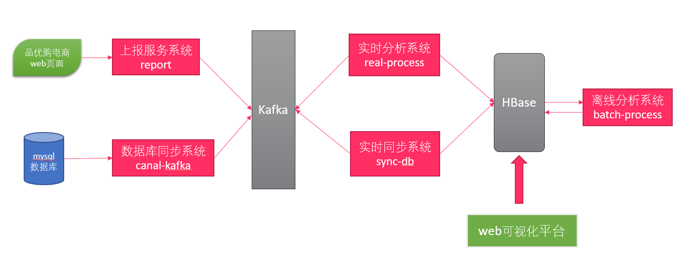

**模块概述**


**上报服务系统**

- 上报服务系统是由`SpringBoot`技术开发的JavaWeb应用,SpringBoot是一个快速开发Spring应用的框架

- 电商的WEB页面会通过HTTP的方式提交用户的`点击流日志`到上报服务系统
- 接收用户数据经过`转换处理`之后发送到`Kafka`


**实时分析系统**

- 使用Flink的流式计算开发的业务分析系统
- 实时读取Kafka的数据,进行处理
- 内部处理方式: `原始数据拓宽`->`转换`->`分组`->`时间窗口`->`聚合`->`落地HBase`


**数据库同步系统**

- 使用Java开发, 主要连接canal和kafka,进行mysql数据的传输

- 通过`canal`取读取mysql的`binlog`文件
- 解析binlog,转换成JSON格式的数据存入Kafka


**实时同步系统**

- 使用Java开发

- 实时接收kafka的数据
- 获取到mysql的数据
- 转换存储到HBase


**离线分析系统**

- 使用Flink的批处理方式

- 批量读取HBase的数据,进行业务分析
- 内部处理方式: `原始数据拓宽`->`转换`->`分组`->`聚合`->`落地HBase`

**Web可视化平台**

- 图表展示ECharts https://echarts.baidu.com/

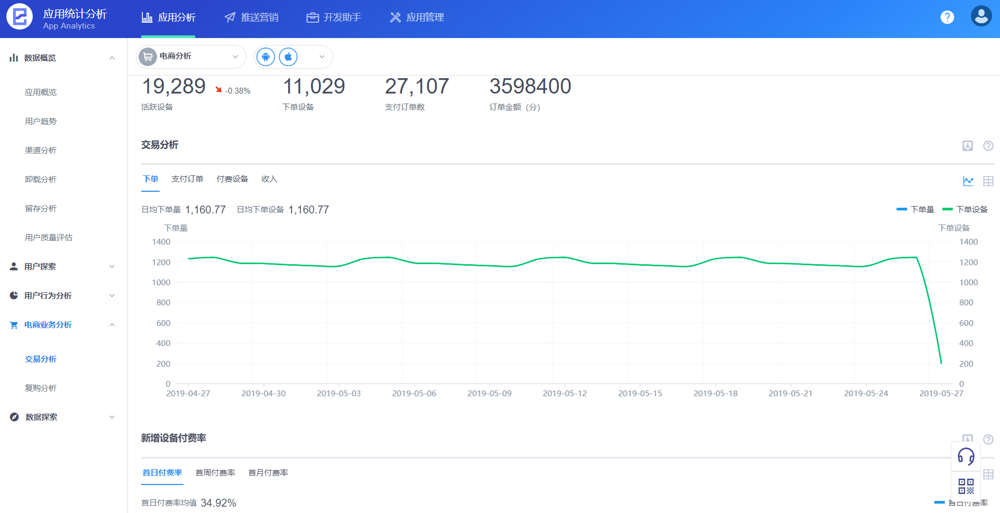