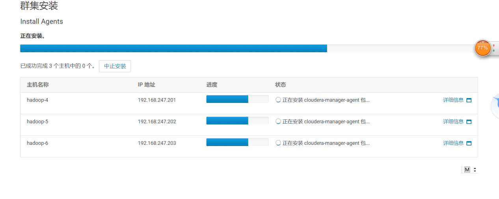
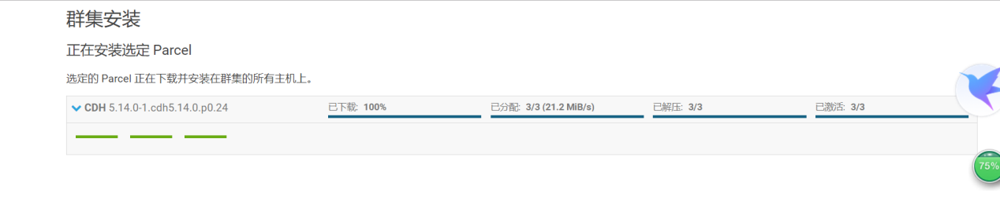
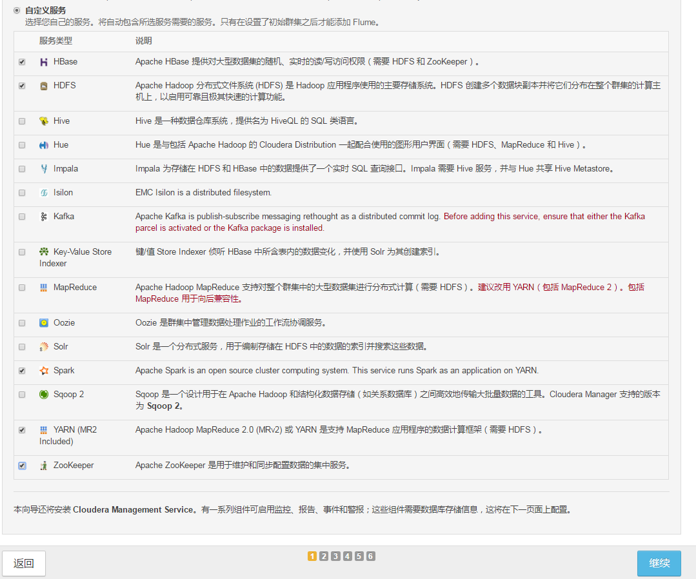
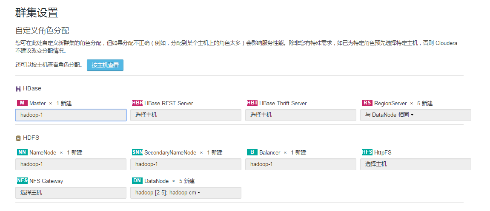
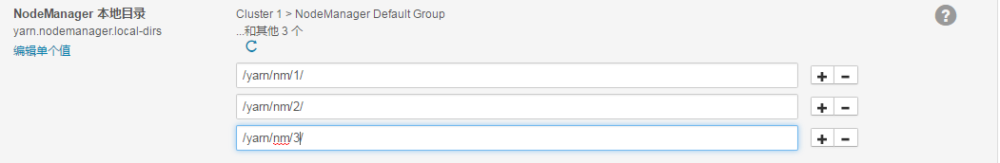
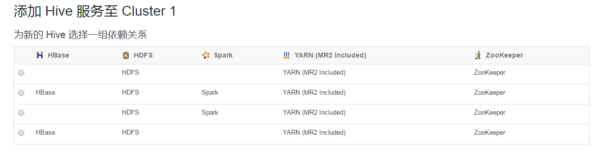
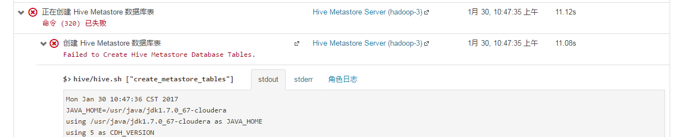
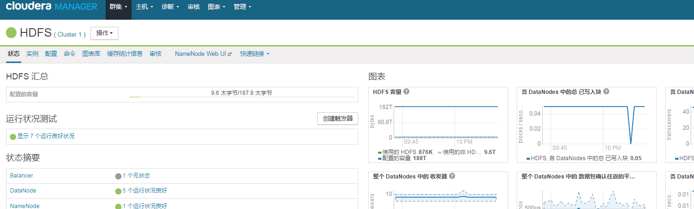

# 50-CDH搭建-Cloudera Manager

# 1.基础环境准备

1. 搭建三台基于centos6虚拟机

   注：三台服务器的硬盘可以设置的大一些，主节点的内存高一些

2. 设置网络

   vim /etc/sysconfig/network-scripts/ifcfg-eth0 

   ```shell
   IPADDR=192.168.64.130
   GATEWAY=192.168.64.2
   NETMASK =255.255.255.0
   DNS1=8.8.8.8
   DNS2=8.8.4.4
   BOOTPROTO=static
   ONBOOT=yes
   ```

   ```shell
   service network restart # 重启网卡
   ```

3. 关闭防火墙

   ```shell
   service iptables stop # 关闭防火墙
   service iptables status # 验证是否关闭
   chkconfig iptables off # 关闭防火墙自动运行
   ```

4. 修改主机名

   vim /etc/sysconfig/network

   ```shell
   HOSTNAME=node01
   ```

5. 设置主机名映射

   vim /etc/hosts

   ```shell
   192.168.64.130 node01
   192.168.64.131 node02
   192.168.64.132 node03
   ```

6. 增加开启自启项

   说明：这里是把后面配置的移到这里，因为这里设置之后需要重启，需要重启的一次性配置完。

   vim /etc/rc.local 新增以下内容

   ```shell
   echo 0 >  /proc/sys/vm/swappiness
   echo never > /sys/kernel/mm/redhat_transparent_hugepage/enabled
   echo never > /sys/kernel/mm/redhat_transparent_hugepage/defrag
   swapoff -a
   ```

7. 关闭selinux安全模块

    vim /etc/selinux/config

   ```shell
   SELINUX=disabled
   ```

8. 设置ssh免密登录

   ```shell
   ssh-keygen -t rsa  # 生成密钥文件，一路回车就行了
   cd ~/.ssh # 进入生成私钥和公钥文件的目录
   cat id_rsa.pub >> authorized_keys # 生成自己的认证文件
   
   # 分别发送给另外两台节点
   ssh-copy-id node02
   ssh-copy-id node03
   ```

9. 重启节点

注：以上操作基于centos6进行操作，并且每台节点都需要进行配置

# 2.私有网络软件仓库搭建

在集群安装的过程中，要求每个节点都必须挂载光驱， 而对于每台节点都手动的去挂载光驱太麻烦，也不方便。这里使用每个节点都指向同一个私有网络镜像来解决这个问题。

我们的集群采用的是全离线安装，也不可能逐个节点的安装，同样是也使用指向同一个私有的网络软件包来解决

因此**选择在node01上搭建一个私有的网络软件仓库**，以下是搭建的全过程。

1. 上传Centos6的镜像文件至任意目录

2. 安装http

   ```shell
   service httpd status # 检查是否安装
   yum –y install httpd # 使用yum进行安装
   service httpd start # 启动httpd服务
   chkconfig httpd on # 开机自启httpd服务
   ```

   可通过浏览器进行访问，默认为80端口，例如：node01:80

   注：http默认将` /var/www/html`目录作为软件仓库的目录

3. 挂载镜像

   - 创建文件夹

     mkdir -p  /media/CentOS

   - 执行挂载

     ```
     mount -o loop /opt/software/CentOS-6.7-x86_64-bin-DVD1.iso /media/CentOS/
     ```

   - 进入目录/etc/yum.repos.d 

     ```
     mv CentOS-Base.repo CentOS-Base.repo.bak # 使该文件无法生效
     ```

   - 修改CentOS-Media.repo文件

     vim CentOS-Media.repo

     ```shell
     enabled=1
     ```

   - 清除yum缓存

     ```
     yum clean metadata
     yum clean dbcache
     ```

   - 查看是否挂载成功

     ```
     yum list | wc -l 
     ```

     这是统计镜像中有多少个软件包的命令，CentOS6.7x64位的系统的软件包个数一般在3000以上

4. 安装createrepo

   该软件使用来生成http镜像的网络识别路径的

   ```
   yum -y install createrepo
   ```

# 3.挂载网络系统镜像

以下内容同样在node01主节点中进行操作

1. 将从镜像中挂载的文件拷贝到软件仓库的目录中

   ```
   cp -r /media/CentOS /var/www/html/
   ```

2. 删除repodata

   镜像会自动寻找repodata目录，如果找到两个的话会报错

   ```shell
   cd /var/www/html/CentOS
   rm -rf ./repodata
   ```

3. 生成新的软件路径目录repodata  

   ```
   createrepo .
   ```

4. 解除对镜像文件的挂载

   ```shell
   umount /media/CentOS
   ```

   检查`/media/CentOS`为空，即为解除成功

   注：如果出现下列报错，说明有进程在占用挂载点

   

   解决方法：

   ```
   fuser -m /media/CentOS # 找出占用的进程
   kill -9 进程号 # 干掉进程
   ```

   使用后可再次执行第四步的命令

5. 修改文件`CentOS-Media.repo`让其指向刚才创建的网络镜像

   vim /etc/yum.repos.d/CentOS-Media.repo

   ```
   baseurl=http://node01/CentOS
   ```

到此，node01网络系统镜像挂载完成，可以将原本的镜像文件删除了。

# 4.创建CM和CDH网络软件镜像

1. 创建CM网络软件镜像

   CM下载地址：http://archive.cloudera.com/cm5/redhat/6/x86_64/cm/5.14/

   下载后，将这些文件放入一个文件夹后，在将该目录上传至`/var/www/html`下

   注：可以将准备好的cm5.14目录，上传上去

2. 创建CDH网络镜像

   CDH下载地址：http://archive.cloudera.com/cdh5/parcels/5.14.0/

   将下面的文件下载下来将这些文件放入一个文件夹后，在将该目录上传至`/var/www/html`下

   ```
   CDH-5.14.0-1.cdh5.14.0.p0.24-el6.parcel 	
   CDH-5.14.0-1.cdh5.14.0.p0.24-el6.parcel.sha1
   manifest.json
   ```

   注：`CDH-5.14.0-1.cdh5.14.0.p0.24-el6.parcel.sha1`的后缀名`sha1`需要改为`sha`

   同样可以将准备好的cdh目录，上传上去

3. 子节点挂载网络镜像

   将主节点的` /etc/yum.repos.d`下的`CentOS-Media.repo`文件分发到各子节点的目录

   `/etc/yum.repos.d`下：

   ```
   scp -r /etc/yum.repos.d/CentOS-Media.repo node02:/etc/yum.repos.d/
   scp -r /etc/yum.repos.d/CentOS-Media.repo node03:/etc/yum.repos.d/
   ```

4. 在所有子节点执行如下命令：

   ```
   mv /etc/yum.repos.d/CentOS-Base.repo /etc/yum.repos.d/CentOS-Base.repo.bak
   ```

5. 清除yum的缓存，并查看软件包的个数（三台）

   ```
   yum clean metadata
   yum clean dbcache
   ```

   查看是否挂载成功

   ```
   yum list | wc -l 
   ```

   这是统计镜像中有多少个软件包的命令，CentOS6.7x64位的系统的软件包个数一般在3000以上

# 5.安装时钟服务ntp

**方法1：所有子节点向主节点同步**

1. 安装时钟服务（三台）

   ```
   yum -y install ntp
   ```

2. 启动服务，并注册开机自启

   ```
   service ntpd start
   chkconfig ntpd on
   ```

3. 查看ntpd状态

   ```
   service ntpd status
   ```

4. 配置主时钟服务器，编辑/etc/ntp.conf

   将注释掉的

   ```
   # 将注释掉的以下内容解开，并修改为主机所在网段，注意第三位参数
   # 第一个IP地址的是表明时钟同步的网段是192.168.64.0的
   restrict 192.168.64.0 mask 255.255.255.0 nomodify notrap 
   
   # 新添加如下内容，表明服务器是跟自己同步的。
   server 127.127.1.0
   fudge 127.127.1.0 statum 10
   
   # 注释掉原文件内 server 开头的四行配置内容
   ```

5. 配置从时钟服务器，编辑/etc/ntp.conf

   ```
   # 将注释掉的以下内容解开，并修改为主机所在网段，注意第三位参数
   # 第一个IP地址的是表明时钟同步的网段是192.168.64.0的
   restrict 192.168.64.0 mask 255.255.255.0 nomodify notrap 
   
   # 新添加如下内容
   server node01
   
   # 注释掉原文件内 server 开头的四行配置内容
   ```

6. 重启ntp服务

   重启后需要一定时间进行同步，耐心等待即可

   ```
   service ntpd restart
   ```

   

**方法2：所有节点向网络同步**

1. 所有节点安装ntp服务

   ```
   yum -y install ntp
   ```

2. 启动服务，并注册开机自启

   ```
   service ntpd start
   chkconfig ntpd on
   ```

3. 查看状态

   ```
   nepstat
   ```

   

方法2，不需要进行任何配置，会自动向网络时间进行同步

# 6.安装mysql

安装mysql的用处是提供cm存储集群信息已经hive的元数据库的。只需要安装一个mysql数据库即可，虽说mysql可以随意安装在集群的任意接节点，这里还是建议安装在主节点上。

1. 安装mysql

   ```
   yum -y install mysql-server
   ```

2. 启动并设置开机自启

   ```
   service mysqld start
   chkconfig mysqld on
   ```

3. 修改root用户密码

   ```
   mysqladmin -u root password "000000"
   ```

4. 登录mysql

   ```
   mysql -uroot -p000000
   ```

5. 创建相关数据库

   - Hive的元数据库

     ```
     create database hive DEFAULT CHARSET utf8 COLLATE utf8_general_ci;
     ```

   - Cloudera的元数据库

     ```
     create database amon DEFAULT CHARSET utf8 COLLATE utf8_general_ci;
     ```

   - oozie的元数据库

     ```
     create database oozie DEFAULT CHARSET utf8 COLLATE utf8_general_ci;
     ```

6. 开启远程访问

   - 进入mysql库

     ```
     use mysql;
     ```

   - 修改访问权限表

     执行以下命令

     ```
     grant all privileges on *.* to "root"@"%" identified by "root" with grant option;
     grant all on amon.* TO "root"@"%" identified by "root";
     grant all on hive.* TO "root"@"node01" identified by "root";
     grant all on hive.* TO "root"@"node02" identified by "root";
     grant all on hive.* TO "root"@"node03" identified by "root";
     grant all on amon.* TO "root"@"node01" identified by "root";
     grant all on amon.* TO "root"@"node02" identified by "root";
     grant all on amon.* TO "root"@"node03" identified by "root";
     
     grant all on oozie.* TO "root"@"node01" identified by "root";
     grant all on oozie.* TO "root"@"node02" identified by "root";
     grant all on oozie.* TO "root"@"node03" identified by "root";
     ```

   - 刷新权限

     ```
     flush privileges;
     ```

   - 查看是否开启远程访问：

     ```
     select user,password,host from user;
     ```

# 7. 安装CM

1. 拷贝cloudera-manager.repo到/etc/yum.repos.d/目录下：

   ```
   cp /var/www/html/cm5.14/cloudera-manager.repo /etc/yum.repos.d/
   ```

2. 进入目录`/etc/yum.repos.d/`，修改 `cloudera-manager.repo`

   ```
   cd /etc/yum.repos.d/
   vim cloudera-manager.repo
   ```

   修改内容：

   ```
   baseurl=http://node01/cm5.14/
   gpgkey=http://node01/cm5.14/RPM-GPG-KEY-cloudera
   gpgcheck=0
   ```

   注：去`var/www/html/cm5.14`下检查有没有写错

3. 复制一份`cloudera-manager.repo`，当做备份

   说明：每次cloudera-manager后该文件都会回复原状

   ```
   cp cloudera-manager.repo cloudera-manager.1111
   ```

4. 为保证无误，在hadoop-cm中执行检查命令

   ```
   yum repolist
   ```

   

   此图说明hadoop-cm已经识别了cm的网络软件镜像。

5. 下载CM安装的引导文件`cloudera-manager-installer.bin`，并上传至opt目录下

   http://archive.cloudera.com/cm5/installer/5.14.0/，一定要对应你的CM的版本。

6. 赋予`cloudera-manager-installer.bin`执行权限

   ```
   chmod 755 cloudera-manager-installer.bin
   ```

7. 开始安装CM

   ```
   /opt/cloudera-manager-installer.bin
   ```

8. 出现引导界面，然后一路next+yes+OK即可

   注：因为CM会安装自己的JDK所以一开始我们并不需要安装，后面会进行重装

9. 通过命令查看cloudera的服务是否启动：

   ```
   service cloudera-scm-server status
   ```

10. 浏览器访问cm的页面控制台

    ```
    http://node01:7180
    ```

    用户名密码均为admin，登录后就进入CDH集群安装界面。至此CM安装完成

# 8.CDH集群安装

## 8.1 选择子节点

1. 在登录后，进入的第一个界面是cloudera的最终用户许可条款和条件，选择同意，再点继续，进入CDH版本选择界面

   

   

2. 这里选择免费版， 再点击继续

   

3. 直接点击继续，进入了节点选择界面：

   

   在这个界面我们需要填入，我们集群的所有节点主机名（可从任意节点的hosts文件中拷贝。），以英文逗号分隔，填完了后点击搜索：

   

   

## 8.2 CDH和CM的具体网络位置的选择

1. 集群安装

   

2. 先点击 更多选项，进入CDH网络位置选择界面

   

   修改第三条远程存储库，并将多余的都删掉，只留一个即可

   修改成我们自己的CDH网络软件镜像的地址， 而我们的CDH的地址为：`192.168.64.130/cdh`

   

3. 点击保存更改，这时CDH和CM的网络位置选择界面变为：

   选择我们的CDH版本就完成了，对CDH的选择。接下来选择CM。

   

4. 继续点击 **自定义存储库** 来选择我们自己的CM：

   其实呢，就是把配置`cloudera-cm.repo`的配置拿出来，在界面上填一遍，我们的填写如下：

   

   此步完成后点击继续，会报错

5. 填写完成后，就会进入给每个节点安装cloudera-scm-agent的界面，再点击继续前，我们需要将hadoop-cm中安装CM时安装的JDK文件分发到每个子节点，不然子节点在安装cloudera-scm-agent会包错。

   因此我们把node01整个java目录分发给所有的子节点就好了，在node01下执行：

   ```
   scp -r /usr/java node02:/usr/
   scp -r /usr/java node03:/usr/
   ```

   重新执行第四步，就不会报错了

6. Agent的安装和配置

   Jdk分发完成后，点击继续，进入jdk安装选项，这一步由于我们已经分发了jdk所以不需要勾选

   

7. 直接点击继续，进入选择是否启动单用户模式

   这里选择不启用，直接点击继续

   

8. 进入节点通信选择：

   我们这里使用 所有用户接收相同的密码，密码为写为000000，点击继续

   

9. 进入agent安装界面， 耐心等待安装完成

   

10. 安装完成后，进度条会全绿显示，点击继续，进入CDH包分发到agent的界面，耐心等待其完成。

    

11. 分发为完成后，点击继续，进入agent主机检查：

    

    注：如若没有配置` /etc/rc.local`文件，这里会报如下的错。如何配置在基础环境准备中有写

    需要将所有警告都解决才能点击继续，不然安装可能会报错， 这里说

    报的警告为：未禁止透明大页，进入在每个节点中执行，解决后，点击重新运行即可

    

## 8.3 CDH服务选择

1. 安装和配置完Agent后，就会进入CDH服务选择界面，

   

2. 我们选择自定义服务，我们的选择如下：

   

3. 确认无误后，点击继续，进入服务安装细节界面

   

### 8.3.1 HBase服务安装选择

1. HMaster选择两个节点：node01,node02

2. 不安装reset和 thrift服务，因此不需要选，

3. regionserver选择除主节点以外的所有节点：

4. 选择完成后如下

   

### 8.3.2 HDFS服务安装选择

1. NameNode只能单选，做高可用是在集群搭建完成后的事，选择node01就好了，还有就是选择DataNode,也是选择除主节点以外的所有节点：

2. 其他不需要进行修改，选择完成后如下

   

### 8.3.3 CM服务安装选择

全部选择安装在node01上即可。选择完成后如下：


### 8.3.4 Spark服务安装选择

将historyserver选择到最后一个子节点即可，选择完成后如下：


### 8.3.5 Yarn服务安装选择

将jobhistoryserver选择到最后一个子节点即可，选择完成后如下：


### 8.3.6 Zookeeper服务安装选择

Zookeeper服务安装选择的原则是，服务个数最好是5以下的奇数，位置随意（不能放在hadoop-cm上），这里选择如下：


到此服务选择安装完成，选择如下：


确认无误后点击继续

## 8.4 配置元数据库为Mysql

在选择完服务后，点击继续就可以进入数据库选择界面：


1. 数据库主机名选择自己的主机名+端口号
2. 这里选择数据库类型为mysql
3. 用户名和密码，这里需要填如Mysql中支持远程连接的用户名和密码

问题：

1. 没有找到mysql的jdbc，通过图我们可以知道，Activity Monitor服务是安装在node01上的，因此需要将mysql的jdbc放到节点node01上，具体的放的位置为：`/usr/share/cmf/lib`

   将mysql-connector-java-5.1.25.jar拷贝进去然后再次点击测试连接即可

   

2. 报这个错，是因为我们的mysql是安装在hadoop-cm上的，也就是和Activity Monitor位于同一个节点，因此不需要远程访问，将hadoop-cm改成localhost即可，再执行检查，

   

3.  检查通过了后，点击继续，进入集群设置界面。

## 8.5 集群服务配置

在选择了mysql后，进入的就是集群配置界面：


更改以下内容：

1. HDFS DataNode地址配置

   

2. HDFS NameNode地址配置

   

3. HDFS SNameNode地址配置

   

4. Yarn NodeManager的地址配置

   

其他的均不需要调整，配置完后点击继续，进入安装界面。

## 8.6 CDH集群安装

在选择完集群服务配置后，就会进行运行安装界面，耐心等待启动完成。


完成后，点击继续，集群cm集群控制界面


到此全新的集群安装完成。

## 8.7 安装Flume

1. 在CM的集群控制界面如下点击：

   

2. 点击，添加服务，选择flume，继续

   

   选择最下面的一个，点击继续，进入安装节点选择，

3. 按需要安装（hadoop-cm不能安装），我们的选择如下：

   	

4. 选择完了，点击继续，再点击完成，在cm控制界面点击启动flume,到此安装flume完成，效果如下：

   

## 8.8 安装hive

1. 假如在安装集群的时候，知道需要hive的情况下，就可以在装服务的时候就选装hive

2. 这里是后期需要使用hive,所以在集群安装好后进行安装，整个流程和8.7类似，点击添加服务，选择hive，进入依赖选择界面：

   

   选择的原则很简单，哪个多就选哪一个，选择第二个，点击继续，进入服务安装选择界面：

3. 在选择服务的时候，hive最重要的是Metastore和HiveServer2，为了容灾，这里都选择安装两个，至于Gateway可以任意选择（hadoop-cm除外），不需要WebHCatServer，所以选择如下：

   

4. 点击继续，进入元数据库选择（此步选择参考之前mysql时候）

   

   到这里，回想下之前的时候，是不是需要上传Mysql的jdbc架包，但是到目前为止，我们并没有为hive**上传Mysql的jdbc架包**，所以点击 测试连接 肯定会失败。那么现在开始上传Mysql的jdbc架包，刚才在服务安装选择的时候，我们是把Metastore安装在node02和node03，所以需要上传至这两个节点，地址和安装mysql时的一致，

5. 点击继续， 进入审核更改界面，这一步不需要任何更改，直接点击继续即可

   

6. 进入服务安装和启动界面：

   出现报错如下

   

   还是缺少Mysql的连接架包，上传架包到三个节点的的目录`/opt/cloudera/parcels/CDH-5.9.0-1.cdh5.9.0.p0.23/lib/hive/lib`下

7. 点击继续，在CM的控制台去启动该服务。

   

## 8.9 安装kafka

在CM5.9以后自带了kafka的服务描述，**要是安装的是CM5.9以前的版本**，则需要自己下载Kafka的服务描述，地址为：http://archive.cloudera.com/csds/kafka/，

将这个服务描述包，下载后，通过xftp上传到node01（CM的安装节点）节点的/opt/cloudera/csd目录下，重启hadoop-cm上的agent和server才可以识别。

### 8.9.1 下载和上传kafka服务包

由于我们安装的是5.9，可以跳过上述步骤，直接下载kafka的服务包，地址为：

http://archive.cloudera.com/kafka/parcels/latest/

我们的系统是CentOS6.x，所以下载el6结尾的两个文件，必须是两个都下载。

下载完成后，通过xftp上传到node01（CM的安装节点）的目录：

/opt/cloudera/parcel-repo下：


将文件`KAFKA-2.1.0-1.2.1.0.p0.115-el6.parcel.sha1`后面的1去掉，不然cm是无法识别kafka的服务包的，最终目录文件如下：

### 8.9.2 分发kafka服务包

由于我们只在nod01上上传了kafka的服务包，其他子节点却没有，这里通过cm的控制界面来分发和激活kafka的服务包。

1. 进入CM的控制界面，点击主机，

   

2. 再点击Parcel，进入Parcel界面，

   

3. 假如没有看到刚才我们上传的kafka的服务包，可以点击右上角的 检查新Parcel。

   看到kafka的服务包后，点击分配。

   

   

4. 分配完成后，再点击激活，

   

### 8.9.3 安装kafka

激活完成后，就可以回到CM的控制界面，点击选择添加服务，选择kafka继续，


同样的，hadoop-cm上不能装kafka,其他子节点随便选，这里我是所有子节点都选了，


其他服务可以不选，点击继续，进入了kafka服务配置界面，


注意：安装kafka失败情况

修改的地方如下：


其他均不需要修改，点击继续，进入服务添加和启动界面：


最终全部启动失败，因为这个启动失败是因为kafka服务配置的默认内存太小导致的，所以我们现在在浏览器中另起一个CM控制台，来调整kafka的内存配置，

点击kafka，并选择配置，


选择左下角的状态中的警告项:


将该值调整为1G，保存，


再重试启动kafka：


## 8.10 HDFS高可用配置

1. 进入CM控制台，点击HDFS，进入HDFS服务界面：

   

2. 再点击操作，选择启用High Availabillity,

   

3. 进入高可用配置界面：

   

   默认即可，点击继续，进入备用NameNode和JournalNode选择界面：

   

   JournalNode选择三个即可，我们的选择如下：

   

4. 点击继续，进入审核更改界面：

   

   需要JournalNode的数据目录，最好和NameNode的数据放在相同的目录下，我们的配置如下：

   

5. 点击继续，执行开启高可用：

   

6. 耐心等待，任务成功即可，完成后，点击继续回到CM控制台，HDFS的高可用开启完成。