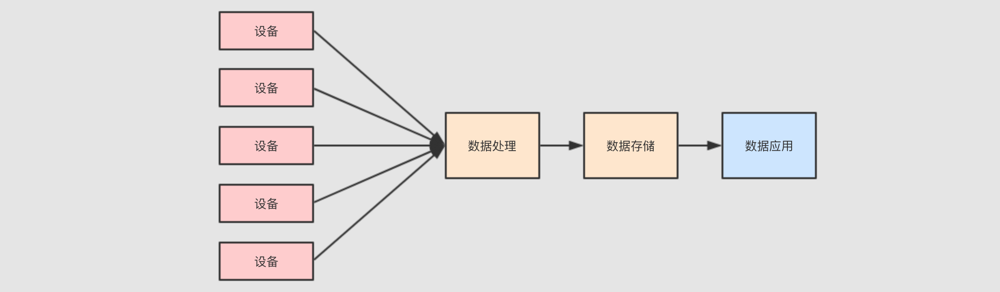

# 52-kudu

# 1.什么是kudu

## 1.1 kudu的应用场景

### 1.1.1现在大数据的应用场景

例如，现在要做一个类似物联网的项目，可能是对某个工厂的生产数据进行分析

项目特点：

1. 数据量大

   有一个非常重大的挑战, 就是这些设备可能很多, 其所产生的事件记录可能也很大, 所以需要对设备进行数据收集和分析的话, 需要使用一些大数据的组件和功能

   

2. 流式处理

   因为数据是事件，而事件是一个一个来的，并且如果快速查看结果的话，必须使用流计算来处理这些数据

3. 数据需要存储

   最终需要对数据进行统计和分析，所以数据要先有一个地方存，然后在通过可视化平台分析和处理

   

**对存储层的要求**

这样的一个流计算系统，需要对数据进行什么样的处理呢？

1. 要能够及时的看到最近的数据，判断系统是否有异常
2. 要能够扫描历史数据，从而改进设备和流程

所以对数据存储层就可能进行如下的操作

1. 逐行插入，因为数据是一行一行来的，要想及时看到，就需要来一行插一行
2. 低延迟随机读取，如果想分析某台设备的信息，就需要在数据集中随机读取某一个设备的事件记录
3. 快速分析和扫描，数据分析师需要快速的得到结论，执行一行sql等很久是不行的

### 1.1.2 方案一

使用Spark Streaming 配合HDFS存储

需求总结：

- 实时处理，Spark Streaming
- 大数据存储，HDFS
- 使用Kafka过渡数据


这样的方案有一个非常重大的问题，就是速度，因为HDFS不擅长存储小文件，而通过流处理直接写入HDFS的话就会产生非常大量的小文件，扫描的性能也是非常差

### 1.1.3 方案二

HDFS+ compaction

上面方案的问题是大量小文件的查询是十分低效的，所以可以将这些小文件压缩起来


但是这样的处理方案也有很多问题

- 一个文件只有不再活跃时才能合并
- 不能将覆盖的结果放回原来的位置

所以一个在流式系统中进行小文件合并的话，需要将数据放在一个新的目录中，让Hive/Impala指向新的位置，在清理老的位置

### 1.1.4 方案三

HBase + HDFS

前面的方案都不够舒服，主要原因是因为一直在强迫HDFS做它并不擅长的事情，对于实时的数据存储HBase好像更加合适一些，虽然HBase适合实时的低延迟的数据存储，但是对于历史的大规模数据的分析和扫描性能是比较差的，所以还要结合HDFS 和 Parquet来做这件事


因为HBase不擅长离线数据分析，所以在一定的条件触发下，需要将HBase中的数据写入到HDFS中的Parquet文件中，以便支持离线数据分析，但是这种方案又会产生新的问题

- 维护特别复杂，因为需要在不同的存储间复制数据
- 难以进行统一的查询，因为实时数据和离线数据不在同一个地方

这种方案，也称为Lambda，分为实时层和批处理层，通过这些复杂的方案，其实想做的就是一件事，流式数据的存储和快速查询

### 1.1.5 方案四

Kudu

kudu声称在扫描性能上，媲美HDFS上的Parquet，在随机读写性能上，媲美HBase，所以将存储层替换为kudu，理论上就可以解决我们的问题了


**总结：**

对于实时流式数据处理，Spark，Flink，Storm等工具提供了计算上的支持，但是他们都需要依赖外部的存储系统，对存储系统的要求会比较高一点，需要满足以下特点

- 支持逐行插入
- 支持更新
- 低延迟随机读写
- 快速分析和扫描

## 1.2kudu和其他存储工具的对比

### 1.2.1 OLAP和OLTP

广义来讲，数据库分为OLAP和OLTP


- OLTP

  举个例子，在电商网站中，经常见到一个功能**我的订单**，这个功能在查询数据的时候，是查询的某一个用户的数据，并不是批数据

  OLTP需要做的事情就是：

  - 快速插入和更新
  - 精确查询

  所以OLTP并不需要读数据进行大规模的扫描和分析，所以它的性能并不好，它主要是用于对响应速度和数据完整性很高的在线服务应用中

- OLAP

  OLAP和OLTP的场景不同，OLAP主要服务于分析型应用，其一般都是批量加载数据，如果出错了，重新查询即可

- 总结

  - OLTP随机访问能力比较强，批量扫描比较差
  - OLAP擅长大规模数据加载，对于随机访问的能力则比较差
  - 在大数据系统中，往往从OLTP数据库中ETL放入OLAP数据库中，然后做分析和处理

### 1.2.2 行式存储和列式存储

行式和列式是不同的存储方式，其大致如下


- 行式存储

  行式一般用做于OLTP，例如我的订单，那不仅要看到订单，还要看到收货地址，付款信息，派送信息等，所以OLTP一般倾向于获取整行所有列的信息

- 列式存储

  而分析平台就不太一样了，例如分析销售额，那可能只对于销售额这一列感兴趣，所以只需要获取需要的列，这样能减少数据的读取量

### 1.2.3 存储模型

**结构：**

- kudu的存储模型是有结构的表
- OLTP中代表性的MySql，Oracle模型是有结构的表
- HBase是看起来像表一样的key-value型数据，key是RowKey和列簇的组合，value是具体的值

**主键：**

- kudu采用了Raft协议，所以kudu的表中有唯一的主键
- 关系型数据库也有唯一的主键
- HBase的RowKey并不是唯一的主键

**事物支持：**

- kudu缺少跨行的ACID事务
- 关系型数据库大多在单机上是可以支持ACID事务的

**性能：**

- kudu的随机读写速度目标是和HBase相似，但是这个目标建立在使用SSD基础之上
- kudu的批量查询性能目标是比HDFS上的Parquet慢两倍以内

**硬件需求：**

- Hadoop的设计理念是尽可能的减少硬件依赖，使用更廉价的机器，配置机械银盘
- kudu的时代SSD已经比较常见了，能够做到更多的磁盘操作和内存操作
- Hadoop不太能发挥比较好的硬件能力，而kudu为了大内存和SSD设计，所以kudu对硬件的需求会更大一些

## 1.3 kudu的设计和结构

### 1.3.1 kudu是什么

**HDFS上的数据分析：**

HDFS是一种能够非常高效的进行数据分析的存储引擎

- HDFS有很多支持压缩的列式存储的文件格式，性能很好，例如Parquet和ORC
- HDFS本身支持并行

**HBase可以进行高效的数据插入和读取**

HBase主要用于完成一些对实时性要求比较高的场景

- HBase能够以极高的吞吐量来进行数据存储，无论是批量加载，还是大量put
- HBase能够对主键进行非常高效的扫描，因为其根据主键进行排序和维护
- 但是对于主键以外的列进行扫描则性能会比较差

**kudu的设计目标：**

kudu最初的目标是成为一个新的存储引擎，可以进行快速的数据分析，又可以进行高效的数据随机插入，这样就能简化数据从源端到Hadoop中可以用于被分析的过程，所以有如下的一些设计目标

- 尽可能的快速扫描，达到HDFS中parquet的二分之一速度
- 尽可能的支持随机写，达到1MS的响应时间
- 列式存储
- 支持NoSQL样式的API，例如put，get，delete，scan

### 1.3.2 总体设计

- kudu不支持SQL

  kudu和Impala都是Cloudera的项目，所以kudu不打算自己实现SQL的解析和执行计划，而是选择放在Impala中实现，这两个东西配合起来完成任务

  kudu的底层是一个基于表的引擎，但是提供了NoSQL的API

- kudu中存储两类的数据

  - kudu存储自己的元信息，例如表名，列名，列类型
  - kudu当然也有存放表中的数据

  这两种数据都存储在tablet中

- Master server

  存储元数据的tablet有Master server管理

- Tablet server

  存储表中数据的tablet由不同的tablet server管理

- tablet

  Master server和Tablet server都是以tablet作为存储形式来存储数据的，一个tablet通常由一个Leader和两个Follower组成，这些角色分布在不同的服务器中

  


**Master server**


- Master server中存储的起始也就是一个tablet，这个tablet中存储系统的元数据，所以kudu无需依赖Hive
- 客户端访问某一张表的一部分数据时，会先访问Master server获取这个数据的位置，去对应位置获取或者存储数据
- 虽然Master比较重要，但是其承担的职责并不多，数据量也不大，所以为了增进效率，这个tablet会存储在内存中
- 生产环境中通常会使用多个Master server来保证可用性

**Tablet server**


- Tablet server中也是tablet，但是其中存储的是表数据
- Tablet server的任务非常繁重，其负责和数据相关的所有操作，包括存储，访问，压缩，其还负责将数据复制到其他机器
- 因为Tablet server特殊的结构，其任务过于繁重，所以有如下限制
  - kudu最多支持300个服务器，建议Tablet server最多不超过100个
  - 建议每个Tablet server至多包含2000个tablet（包含Follower）
  - 建议每个表在每个Tablet server中至多包含60个tablet（包含Follower）
  - 每个Tablet server至多管理8TB的数据
  - 理想环境下，一个tablet leader应该对应一个cpu核心，以保证最优的扫描性能

**Tablet 的存储结构**


在 `Kudu` 中, 为了同时支持批量分析和随机访问, 在整体上的设计一边参考了 `Parquet` 这样的文件格式的设计, 一边参考了 `HBase` 的设计

- `MemRowSet`

  这个组件就很像 `HBase` 中的 `MemoryStore`, 是一个缓冲区, 数据来了先放缓冲区, 保证响应速度

- `DiskRowSet`

  列存储的好处不仅仅只是分析的时候只 `I/O` 对应的列, 还有一个好处, 就是同类型的数据放在一起, 更容易压缩和编码

  `DiskRowSet` 中的数据以列式组织, 类似 `Parquet` 中的方式, 对其中的列进行编码, 通过布隆过滤器增进查询速度

**tablet的Insert流程**


- 使用 MemRowSet 作为缓冲, 特定条件下写为多个 DiskRowSet
- 在插入之前, 为了保证主键唯一性, 会已有的 DiskRowSet 和 MemRowSet 进行验证, 如果主键已经存在则报错

**tablet的update流程**


1. 找要更新的数据在哪个 `DiskRowSet` 中

2. 数据放入 `DiskRowSet` 所持有的 `DeltaMemStore` 中, 这一步也是暂存

3. 特定时机下, `DeltaMemStore` 会将数据溢写到磁盘, 生成 `RedoDeltaFile`, 记录数据的变化

4. 定时合并 `RedoDeltaFile`

   合并策略有三种, 常见的有两种, 一种是 `major`, 会将数据合并到基线数据中, 一种是 `minor`, 只合并 `RedoDeltaFile`

# 2.kudu的安装和操作

因为 `Kudu` 经常和 `Impala` 配合使用, 所以我们也要安装 `Impala`, 但是又因为 `Impala` 强依赖于 `CDH`, 所以我们连 `CDH` 一起安装一下, 做一个完整的 `CDH` 集群, 搭建一套新的虚拟机

1. 创建虚拟机准备初始环境
2. 安装 `Zookeeper`
3. 安装 `Hadoop`
4. 安装 `MySQL`
5. 安装 `Hive`
6. 安装 `Kudu`
7. 安装 `Impala`

注：此步按照**51-CDH搭建-离线yum源**，进行操作即可

## 2.1 使用scala操作kudu

**kudu API的结构设计**

- Client

  - 创建：

    使用kudu master服务器地址列表来创建

  - 作用：

    kudu api的主入口，通过client对象获取Table后才能操作数据

  - 操作：

    - 检查表是否存在
    - 提交表的 `DDL` 操作, 如 `create`, `delete`, `alter`, 在对表进行 `DDL` 的时候, 需要如下两个对象
      - `Kudu Schema` 定义表的列结构
      - `Kudu Partial Row` 指定分区方式
    - 创建 `Table` 对象

- Table

  - 创建：

    通过client对象开启

  - 作用

    通过 `Table` 对象可以操作表中的数据

    操作

    - `insert`, `delete`, `update`, `upsert` 行
    - 扫描行

- Scanner

  - 创建

    通过 `Table` 对象开启扫描

  - 作用

    扫描表数据, 并获取结果

  - 操作

    `Kudu` 中可以通过读取模式空值该读到哪些数据, 有如下三种读取模式

    - `READ_LATEST` 是 `Scanner` 的默认模式, 只会返回已经提交的数据, 类似 `ACID` 中的 `ReadCommitted`
    - `READ_AT_SNAPSHOT` 读取某一个时间点的数据, 这个模式效率相对比较低, 因为会等待这个时间点之前的所有事务都提交后, 才会返回响应的数据, 类似 `ACID` 中的 `RepeatableRead`
    - `READ_YOUR_WRITES` 这种模式会确保读取到自己已经写入的数据, 并且尽可能的忽略其他人的写入, 会导致读取期间有其它人写入但是没有等待, 所以产生的问题就是每次读取的数据可能是不同的, 当前还是实验性功能, 尽量不要使用

### 2.1.1 环境准备

Kudu 并没有提供 Scala 单独的客户端 SDK, 但是提供了 Java 的 SDK, 我们使用 Scala 访问 Kudu 的时候, 可以使用 Java 的 API


pom.xml

```xml
<?xml version="1.0" encoding="UTF-8"?>
<project xmlns="http://maven.apache.org/POM/4.0.0"
         xmlns:xsi="http://www.w3.org/2001/XMLSchema-instance"
         xsi:schemaLocation="http://maven.apache.org/POM/4.0.0 http://maven.apache.org/xsd/maven-4.0.0.xsd">
    <modelVersion>4.0.0</modelVersion>

    <groupId>org.example</groupId>
    <artifactId>kudu</artifactId>
    <packaging>pom</packaging>
    <version>1.0-SNAPSHOT</version>
    <modules>
        <module>dmp</module>
    </modules>
    <properties>
        <junit.version>4.12</junit.version>
        <maven.version>3.6.1</maven.version>
    </properties>

    <repositories>
        <repository>
            <id>cdh.repo</id>
            <name>Cloudera Repositories</name>
            <url>https://repository.cloudera.com/artifactory/cloudera-repos</url>
            <snapshots>
                <enabled>false</enabled>
            </snapshots>
        </repository>
    </repositories>

    <dependencies>
        <!-- Kudu client -->
        <dependency>
            <groupId>org.apache.kudu</groupId>
            <artifactId>kudu-client</artifactId>
            <version>1.7.0-cdh5.16.1</version>
            <scope>provided</scope>
        </dependency>

        <!-- Logging -->
        <dependency>
            <groupId>org.slf4j</groupId>
            <artifactId>slf4j-simple</artifactId>
            <version>1.7.12</version>
        </dependency>

        <!-- Unit testing -->
        <dependency>
            <groupId>junit</groupId>
            <artifactId>junit</artifactId>
            <version>${junit.version}</version>
            <scope>provided</scope>
        </dependency>
    </dependencies>

    <build>
        <sourceDirectory>src/main/scala</sourceDirectory>
        <testSourceDirectory>src/test/scala</testSourceDirectory>

        <plugins>
            <plugin>
                <groupId>org.apache.maven.plugins</groupId>
                <artifactId>maven-compiler-plugin</artifactId>
                <version>${maven.version}</version>
                <configuration>
                    <source>1.8</source>
                    <target>1.8</target>
                </configuration>
            </plugin>

            <plugin>
                <groupId>net.alchim31.maven</groupId>
                <artifactId>scala-maven-plugin</artifactId>
                <version>3.2.0</version>
                <executions>
                    <execution>
                        <goals>
                            <goal>compile</goal>
                            <goal>testCompile</goal>
                        </goals>
                        <configuration>
                            <args>
                                <arg>-dependencyfile</arg>
                                <arg>${project.build.directory}/.scala_dependencies</arg>
                            </args>
                        </configuration>
                    </execution>
                </executions>
            </plugin>

            <plugin>
                <groupId>org.apache.maven.plugins</groupId>
                <artifactId>maven-shade-plugin</artifactId>
                <version>2.4</version>
                <executions>
                    <execution>
                        <phase>package</phase>
                        <goals>
                            <goal>shade</goal>
                        </goals>
                    </execution>
                </executions>
            </plugin>
        </plugins>
    </build>
</project>
```

### 2.2.2 kudu API操作

```scala
import org.apache.kudu.ColumnSchema.ColumnSchemaBuilder
import org.apache.kudu.client.CreateTableOptions
import org.apache.kudu.{Schema, Type}
import org.apache.kudu.client.KuduClient.KuduClientBuilder
import org.junit.Test

/**
 * @Class:kudu..kuduAPI
 * @Descript:
 * @Author:宋天
 * @Date:2020/3/21
 */
class kuduAPI {

//  创建表
  @Test
  def createTable():Unit = {
    // Kudu 的 Master 地址
    val KUDU_MASTER = "192.168.64.140:7051"

    //1. 创建 KuduClient 入口
    val kuduClient = new KuduClientBuilder(KUDU_MASTER).build()

    // 2. 创创建表的Schema
    val columns = List(
      new ColumnSchemaBuilder("key", Type.STRING).key(true).build(),
      new ColumnSchemaBuilder("value", Type.STRING).key(true).build()
    )

    // 因为是 Java 的 API, 所以在使用 List 的时候要转为 Java 中的 List
    import scala.collection.JavaConverters._
    val javaColumns = columns.asJava
    val schema = new Schema(javaColumns)

    //3.因为 Kudu 必须要指定分区, 所以先创建一个分区键设置
    val options = new CreateTableOptions()
      .setRangePartitionColumns(List("key").asJava)
      // Tablet 是存储数据的位置，tablet是不是可以有多个，有主从的概念
      .setNumReplicas(1)


    //4. 通过 Schema 创建表
    kuduClient.createTable("simple", schema, options)

    /** /etc/kudu/conf/master.gflagfile
     * 
     * 如果报错可以将一下配置添加到kudu的配置文件中
     * --unlock_unsafe_flags=true
     * --allow_unsafe_replication_factor=true
     * --default_num_replicas=1
     * --rpc_negotiation_timeout_ms=9000
     * --rpc_authentication=disabled
     * --rpc-encryption=disabled
     * --trusted_subnets=0.0.0.0/0
     */
  }

//  插入数据
  @Test
  def insertData(): Unit = {
    val KUDU_MASTER = "192.168.64.140:7051"
    val kuduClient = new KuduClientBuilder(KUDU_MASTER).build()

    // 得到表对象, 表示对一个表进行操作
    val table = kuduClient.openTable("simple")

    // 表示操作, 组织要操作的行数据
    val insert = table.newInsert()
    val row = insert.getRow
    row.addString(0, "A")
    row.addString(1, "1")

    // 开启会话开始操作
    val session = kuduClient.newSession()
    session.apply(insert)
  }

//  扫描查询数据
  @Test
  def scan(): Unit = {
    val KUDU_MASTER = "192.168.64.140:7051"
    val kuduClient = new KuduClientBuilder(KUDU_MASTER).build()

    // 1. 设置投影
    import scala.collection.JavaConverters._
    val projects = List("key", "value").asJava

    // 2. scanner 租装
    val scanner = kuduClient.newScannerBuilder(kuduClient.openTable("simple"))
      .setProjectedColumnNames(projects)
      .build()

    // 3. 获取结果
    while (scanner.hasMoreRows) {
      // 这个 Results 是一整个 tablet
      val results = scanner.nextRows()

      while (results.hasNext) {
        // 这才是一条具体的数据
        val result = results.next()

        println(result.getString(0), result.getString(1))
      }
    }
  }
}

```

## 2.2 使用spark操作kudu


在原来的基础上导入pom依赖

```xml
 <!-- Spark -->
        <dependency>
            <groupId>org.scala-lang</groupId>
            <artifactId>scala-library</artifactId>
            <version>2.11.8</version>
        </dependency>
        <dependency>
            <groupId>org.apache.spark</groupId>
            <artifactId>spark-core_2.11</artifactId>
            <version>2.2.0</version>
        </dependency>
        <dependency>
            <groupId>org.apache.spark</groupId>
            <artifactId>spark-sql_2.11</artifactId>
            <version>2.2.0</version>
        </dependency>
        <dependency>
            <groupId>org.apache.spark</groupId>
            <artifactId>spark-hive_2.11</artifactId>
            <version>2.2.0</version>
        </dependency>
        <dependency>
            <groupId>org.apache.hadoop</groupId>
            <artifactId>hadoop-client</artifactId>
            <version>2.6.0</version>
        </dependency>

        <!-- Kudu Spark -->
        <dependency>
            <groupId>org.apache.kudu</groupId>
            <artifactId>kudu-spark2_2.11</artifactId>
            <version>1.7.0-cdh5.16.1</version>
        </dependency>

```

kudu spark api操作

```scala
import org.apache.kudu.client.CreateTableOptions
import org.apache.kudu.spark.kudu.KuduContext
import org.apache.spark.sql.{SaveMode, SparkSession}
import org.apache.spark.sql.types.{DoubleType, IntegerType, StringType, StructField, StructType}
import org.junit.Test

/**
 * @Class:kudu..kuduSparkAPI
 * @Descript:
 * @Author:宋天
 * @Date:2020/3/21
 */
class kuduSparkAPI {

  // DDL操作
  @Test
  def ddl(): Unit = {
    // 1. 创建 KuduContext 和 SparkSession
    val spark = SparkSession.builder()
      .master("local[6]")
      .appName("kudu")
      .getOrCreate()

    val KUDU_MASTERS = "192.168.64.140:7051,192.168.64.141:7051,192.168.64.142:7051"
    val kuduContext = new KuduContext(KUDU_MASTERS, spark.sparkContext)

    // 2. 判断表是否存在, 如果存在则删除表
    val TABLE_NAME = "students"
    if (kuduContext.tableExists(TABLE_NAME)) {
      kuduContext.deleteTable(TABLE_NAME)
    }

    // 3. 创建一张 Kudu 表
    val schema = StructType(
      StructField("name", StringType, nullable = false) ::
        StructField("age", IntegerType, nullable = false) ::
        StructField("gpa", DoubleType, nullable = false) :: Nil
    )

    val keys = Seq("name")

    import scala.collection.JavaConverters._
    val options = new CreateTableOptions()
      .setRangePartitionColumns(List("name").asJava)
      .setNumReplicas(1)

    kuduContext.createTable(tableName = TABLE_NAME,
      schema = schema,
      keys = keys,
      options = options)
  }

//  数据操作
  @Test
  def crud(): Unit = {
    // 1. 创建 KuduContext 和 SparkSession
    val spark = SparkSession.builder()
      .master("local[6]")
      .appName("kudu")
      .getOrCreate()

    val KUDU_MASTERS = "192.168.64.140:7051,192.168.64.141:7051,192.168.64.142:7051"
    val kuduContext = new KuduContext(KUDU_MASTERS, spark.sparkContext)

    // 2. 增
    import spark.implicits._
    val df = Seq(Student("zhangsan", 15, 60.1), Student("lisi", 10, 50.6)).toDF()

    val TABLE_NAME = "students"
    kuduContext.insertRows(df, TABLE_NAME)

    // 3. 删
    kuduContext.deleteRows(df.select($"name"), TABLE_NAME)

    // 4. 增改
    kuduContext.upsertRows(df, TABLE_NAME)

    // 5. 改
    kuduContext.updateRows(df, TABLE_NAME)
  }

//  写数据
  @Test
  def dfWrite(): Unit = {
    // 1. 创建 KuduContext 和 SparkSession
    val spark = SparkSession.builder()
      .master("local[6]")
      .appName("kudu")
      .getOrCreate()

    // 2. 读取数据
    val schema = StructType(
      StructField("name", StringType, nullable = false) ::
        StructField("age", IntegerType, nullable = false) ::
        StructField("gpa", DoubleType, nullable = false) :: Nil
    )

    val originDF = spark.read
      .option("header", value = false)
      .option("delimiter", value = "\t")
      .schema(schema)
      .csv("dataset/studenttab10k")

    // 3. 写入 Kudu 中
    val TABLE_NAME = "students"
    val KUDU_MASTERS =  "192.168.64.140:7051,192.168.64.141:7051,192.168.64.142:7051"

    import org.apache.kudu.spark.kudu._

    originDF.write
      .option("kudu.table", TABLE_NAME)
      .option("kudu.master", KUDU_MASTERS)
      .mode(SaveMode.Append)
      .kudu
  }

//  读取数据
  @Test
  def dfRead(): Unit = {
    val spark = SparkSession.builder()
      .master("local[6]")
      .appName("kudu")
      .getOrCreate()

    val TABLE_NAME = "students"
    val KUDU_MASTERS =  "192.168.64.140:7051,192.168.64.141:7051,192.168.64.142:7051"

    import org.apache.kudu.spark.kudu._

    val kuduDF = spark.read
      .option("kudu.table", TABLE_NAME)
      .option("kudu.master", KUDU_MASTERS)
      .kudu

    kuduDF.createOrReplaceTempView("kudu_students")

    val projectDF = spark.sql("select name from kudu_students where gpa > 2")

    projectDF.show()
  }
}

case class Student(name: String, age: Int, gpa: Double)

```

## 2.3 使用Impala执行SQL语句访问Hive

**lmpala场景**

- lmpala主要作用并不是编写代码来通过JDBC访问的
- lmpala主要是提供数据分析人员来进行数据分析和查询的
- lmpala类似于hive

**lmpala和hive**

- lmpala的速度比hive要快的多
- hive执行计划使用MR
- lmpala有自己的执行计划，是一个MPP架构，MPP大规模并行
- MPP架构往往会将节点分开，每个节点对应每个数据存储的位置
- hive使用了MR，MR专门为了大规模的数据分析而设计，MR在数据规模上游显著优势
- lmpala虽说可以提升运行速度，但架构决定了impala无法执行长时间的sql

**Impala和kudu来进行整合的目的是为了通过使用hive表来操作kudu**

- lmpala和hive是强依赖关系
- lmpala依赖hive的Metastore

**基本步骤如下：**

启动相关服务后使用`impala-shell`，进入操作页面

因为按照集群规划我们的tablet server位于cdh02服务器中，所以开始会包一个错误，只需要执行`  connect cdh02;`即可

- 创建数据库

  ```sql
   create database kudu_db;
  ```

- 进入数据库

  ```sql
  use kudu_db;
  ```

- 创建表

  ```sql
  create external table `students` stored as kudu tblproperties('kudu.table_name'='students','kudu.master_addresses'='cdh01:7051,cdh02:7051,cdh03:7051');
  ```

  