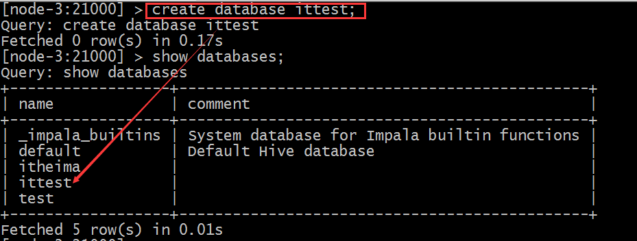
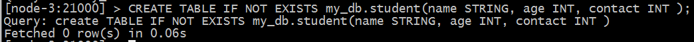
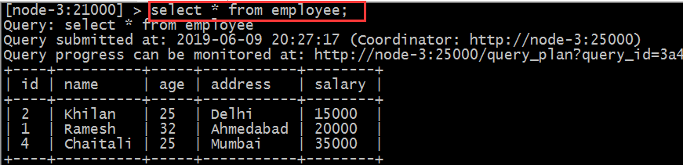

# 53-Apache-Impala

# 1.Impala基本介绍

- Impala是cloudera提供的一款高效率的sql查询工具，提供实时的查询效果，官方测试性能比hive快10到100倍，其sql查询比sparkSQL还要更加快速，号称是当前大数据领域内最快的查询工具

- Impala是参照谷歌的新三篇论文（Caffeine--网络搜索引擎、Pregel--分布式图计算、Dremel--交互式分析工具）当中的Dremel实现而来，其中旧三篇论文分别是（BigTable，GFS，MapReduce）分别对应我们已经学过的HBase、HDFS以及MapReduce。

- Impala是基于hive并使用内存进行计算，兼顾数据仓库，具有实时，批处理，多并发等优点

# 2.lmpala与hive的关系

Impala是基于hive的大数据分析查询引擎，直接使用hive的元数据库metadata，意味着impala元数据都存储在hive的metastore当中，并且impala兼容hive的绝大多数sql语法。所以需要安装inpala的话，必须先安装hive，保证hive安装成功，并且还需要启动hive的metastore服务。

hive元数据包含用hive创建的database，table等元信息。元数据存储在关系型数据库中，如Derby，MySql等

客户端连接metastore服务，metastore再去连接mysql数据库来存取元数据。有了metastore服务，就可以有多个客户端同时连接，而且这些客户端不需要知道mysql数据库的用户名和密码，只需要连接metastore服务即可


hive适合于长时间的批处理查询分析，而lmpala适合于实时交互式SQL查询。可以先使用hive进行数据转换处理，之后使用impala在hive处理后的结果数据集上进行快速的数据分析

# 3.Imapa与hive的异同

impala与hive都是构建在hadoop之上的数据查询工具各有不同的侧重适应面，但从客户端使用来看lmpala与hive有很多共同之处，如数据表元数据、ODBC/JDBC驱动、SQL语法、灵活的文件格式、存储资源池等。

但是impala跟hive最大的优化区别在于：**没有使用MapReduce进行并行计算**，虽然MapReduce是非常好的并行计算框架，但它更多的面向批处理模式，而不是面向交互式的SQL执行。与MapReduce相比，impala把整个查询分成一个**执行计划树**，而不是一连串的MapReduce任务，在分发执行计划后，lmpala使用**拉式获取数据**的方式获取结果，但结果数据组成按执行计划树流式传递汇集，减少了把中间结果写入磁盘的步骤，再从磁盘读取数据的开销。impala使用服务的方式避免每次执行查询都需要启动的开销，即相比hive没了MapReduce启动时间


## 3.1 Impala使用的优化技术

- 使用LLVM产生运行代码，针对特定查询生成特定代码，同时使用Inline的方式减少函数调用的开销，加快执行效率。**(C++特性)**

- 充分利用可用的硬件指令（SSE4.2）。

- 更好的IO调度，Impala知道数据块所在的磁盘位置能够更好的利用多磁盘的优势，同时Impala支持直接数据块读取和本地代码计算checksum。

- 通过选择合适数据存储格式可以得到最好性能（Impala支持多种存储格式）。

- **最大使用内存**，中间结果不写磁盘，及时通过网络以stream的方式传递。

## 3.2 执行计划

- Hive

  依赖于**MapReduce执行框架**，执行计划分成 `map->shuffle->reduce->map->shuffle->reduce…`的模型。如果一个Query会 被编译成多轮MapReduce，则会有更多的写中间结果。由于MapReduce执行框架本身的特点，过多的中间过程会增加整个Query的执行时间。

- Impala

  把执行计划表现为一棵完整的**执行计划树**，可以更自然地分发执行计划到各个Impalad执行查询，而不用像Hive那样把它组合成管道型的 map->reduce模式，以此保证Impala有更好的并发性和避免不必要的中间sort与shuffle。

## 3.3 数据流

- hive

  采用 **推** 的方式，每一个计算节点计算完成后将数据主动推给后续节点。

- Impala

  采用 **拉** 的方式，后续节点通过getNext主动向前面节点要数据，以此方式数据可以流式的返回给客户端，且只要有1条数据被处理完，就可以立即展现出来，而不用等到全部处理完成，更符合SQL交互式查询使用。

## 3.4 内存使用

- hive

  在执行过程中如果**内存放不下所有数据，则会使用外存**，以保证Query能顺序执行完。每一轮MapReduce结束，中间结果也会写入HDFS中，同样由于MapReduce执行架构的特性，shuffle过程也会有写本地磁盘的操作。

- impala

  在遇到内存**放不下数据时，版本1.0.1是直接返回错误**，而不会利用外存，以后版本应该会进行改进。这使用得Impala目前处理Query会受到一定的限制，最好还是与Hive配合使用。

## 3.5 调度

- hive

  任务调度**依赖于Hadoop的调度策略。**

- impala

  调度由**自己完成**，目前只有一种调度器simple-schedule，它会尽量满足数据的局部性，扫描数据的进程尽量靠近数据本身所在的物理机器。调度器 目前还比较简单，在SimpleScheduler::GetBackend中可以看到，现在还没有考虑负载，网络IO状况等因素进行调度。但目前 Impala已经有对执行过程的性能统计分析，应该以后版本会利用这些统计信息进行调度吧。

## 3.6 容错

- hive

  **依赖于Hadoop的容错能力。**

- impala

  **在查询过程中，没有容错逻辑**，如果在执行过程中发生故障，则直接返回错误（这与Impala的设计有关，因为Impala定位于实时查询，一次查询失败， 再查一次就好了，再查一次的成本很低）。

## 3.7 适用面

- hive

  复杂的**批处理查询任务**，数据转换任务。

- impala

  **实时数据分析**，因为不支持UDF，能处理的问题域有一定的限制，**与Hive配合使用**,对Hive的结果数据集进行实时分析。

# 4.Impala架构

Impala主要由Impalad、 State Store、Catalogd和CLI组成。


## 4.1 impalad

impala：与DataNode运行在同一节点上，**由Impalad进程表示**，它**接收客户端的查询请求**（接收查询请求的Impalad为Coordinator，Coordinator通过JNI调用java前端解释SQL查询语句，生成查询计划树，再通过调度器把执行计划分发给具有相应数据的其它Impalad进行执行），**读写数据，并行执行查询**，并把结果通过网络流式的传送回给Coordinator，**由Coordinator返回给客户端**。同时Impalad也与State Store保持连接，用于确定哪个Impalad是健康和可以接受新的工作。

在Impalad中启动三个ThriftServer: beeswax_server（连接客户端），hs2_server（借用Hive元数据）， be_server（Impalad内部使用）和一个ImpalaServer服务。

## 4.2 Impala State Store

Impala State Store：**跟踪集群中的Impalad的健康状态及位置信息，由statestored进程表示**，它通过创建多个线程来处理Impalad的注册订阅和与各Impalad保持心跳连接，各Impalad都会缓存一份State Store中的信息，当State Store离线后（Impalad发现State Store处于离线时，会进入recovery模式，反复注册，当State Store重新加入集群后，自动恢复正常，更新缓存数据）因为Impalad有State Store的缓存仍然可以工作，但会因为有些Impalad失效了，而已缓存数据无法更新，导致把执行计划分配给了失效的Impalad，导致查询失败。

## 4.3 CLI

CLI：提供给用户**查询使用的命令行工具**（Impala Shell使用python实现），同时Impala还提供了Hue，JDBC， ODBC使用接口。

## 4.4 Catalogd

Catalogd：作为metadata访问网关，从Hive Metastore等外部catalog中获取元数据信息，放到impala自己的catalog结构中。impalad执行ddl命令时通过catalogd由其代为执行，该更新则由statestored广播。

# 5. Impala查询处理过程

Impalad**分为Java前端与C++处理后端**，接受客户端连接的Impalad即作为这次查询的Coordinator，Coordinator通过JNI调用Java前端对用户的查询SQL进行分析生成执行计划树。


- Java前端产生的执行计划树以Thrift数据格式返回给C++后端（Coordinator）

  > 执行计划分为多个阶段，每一个阶段叫做一个PlanFragment，每一个PlanFragment在执行时可以由多个Impalad实例并行执行(有些PlanFragment只能由一个Impalad实例执行,如聚合操作)，整个执行计划为一执行计划树

- Coordinator根据执行计划，数据存储信息（Impala通过libhdfs与HDFS进行交互。通过hdfsGetHosts方法获得文件数据块所在节点的位置信息），通过调度器（现在只有simple-scheduler, 使用round-robin算法）Coordinator::Exec对生成的执行计划树分配给相应的后端执行器Impalad执行（查询会使用LLVM进行代码生成，编译，执行），通过调用GetNext()方法获取计算结果。

- 如果是insert语句，则将计算结果通过libhdfs写回HDFS当所有输入数据被消耗光，执行结束，之后注销此次查询服务。

# 6. Impala安装部署

说明：由于之前搭建cdh的时候顺带也把impala一起安装了，所以以下安装过程并未重新安装

## 6.1 安装前提

集群提前安装好hadoop，hive。

hive安装包scp在所有需要安装impala的节点上，因为impala需要引用hive的依赖包。

hadoop框架需要支持C程序访问接口，查看下图，如果有该路径下有这么文件，就证明支持C接口。


注：查看我自己的cdh集群对应目录下好像也没有这些文件，但是可以运行impala。。。。

## 6.2 下载安装包、依赖包

由于impala没有提供tar包进行安装，只提供了rpm包。因此在安装impala的时候，需要使用rpm包来进行安装。rpm包只有cloudera公司提供了，所以去cloudera公司网站进行下载rpm包即可。

但是另外一个问题，impala的rpm包依赖非常多的其他的rpm包，可以一个个的将依赖找出来，也可以将所有的rpm包下载下来，制作成我们本地yum源来进行安装。这里就选择制作本地的yum源来进行安装。

所以首先需要下载到所有的rpm包，下载地址如下

http://archive.cloudera.com/cdh5/repo-as-tarball/5.14.0/cdh5.14.0-centos6.tar.gz

也可以使用准备好的安装包，值得注意的是，需要和自己的centos版本相对应

## 6.3 虚拟机新增磁盘的方法

注意事项：新增挂载磁盘需要虚拟机保持在关机状态。

- 在VMware中选择想要增加磁盘的节点，添加任意大小的磁盘，然后开机

- 对新增的磁盘进行分区，格式化，并且挂载新磁盘到指定目录。

  

  

  

  

- 下面开始对分区进行格式化操作

  `mkfs -t ext4 -c /dev/sdb1`

  

- 创建挂载目录

  

- 添加至开机自动挂载：

  ```
  vim /etc/fstab
  /dev/sdb1   /cloudera_data    ext4    defaults    0 0
  ```

  

## 6.4 配置本地yum源

省略，参考搭建CDH的两章笔记即可，

## 6.5 安装配置impala

**集群规划：**

| 服务名称               | 从节点 | 从节点 | 主节点 |
| ---------------------- | ------ | ------ | ------ |
| impala-catalog         |        |        | Node-3 |
| impala-state-store     |        |        | Node-3 |
| impala-server(impalad) | Node-1 | Node-2 | Node-3 |

**主节点安装**

在规划的主节点node-3执行以下命令进行安装：

```
yum install -y impala impala-server impala-state-store impala-catalog impala-shell
```

**从节点安装**

在规划的从节点node-1、node-2执行以下命令进行安装：

```
yum install -y impala-server
```

### 6.5.1 修改hive配置

可在node-1机器上进行配置，然后scp给其他2台机器。

vim /export/servers/hive/conf/hive-site.xml

```xml
<configuration> 
  <property> 
    <name>javax.jdo.option.ConnectionURL</name>  
    <value>jdbc:mysql://node-1:3306/hive?createDatabaseIfNotExist=true</value> 
  </property>  
  <property> 
    <name>javax.jdo.option.ConnectionDriverName</name>  
    <value>com.mysql.jdbc.Driver</value> 
  </property>  
  <property> 
    <name>javax.jdo.option.ConnectionUserName</name>  
    <value>root</value> 
  </property>  
  <property> 
    <name>javax.jdo.option.ConnectionPassword</name>  
    <value>hadoop</value> 
  </property>  
  <property> 
    <name>hive.cli.print.current.db</name>  
    <value>true</value> 
  </property>  
  <property> 
    <name>hive.cli.print.header</name>  
    <value>true</value> 
  </property>  
  <!-- 绑定运行hiveServer2的主机host,默认localhost -->  
  <property> 
    <name>hive.server2.thrift.bind.host</name>  
    <value>node-1</value> 
  </property>  
  <!-- 指定hive metastore服务请求的uri地址 -->  
  <property> 
    <name>hive.metastore.uris</name>  
    <value>thrift://node-1:9083</value> 
  </property>  
  <property> 
    <name>hive.metastore.client.socket.timeout</name>  
    <value>3600</value> 
  </property> 
</configuration>
```

将hive安装包cp给其他两个机器。

cd /export/servers/

scp -r hive/ node-2:$PWD

scp -r hive/ node-3:$PWD

### 6.5.2 修改hadoop配置

所有节点创建下述文件夹

```
mkdir -p /var/run/hdfs-sockets
```

修改所有节点的hdfs-site.xml添加以下配置，修改完之后重启hdfs集群生效

vim  etc/hadoop/hdfs-site.xml

```xml
	<property>
		<name>dfs.client.read.shortcircuit</name>
		<value>true</value>
	</property>
	<property>
		<name>dfs.domain.socket.path</name>
		<value>/var/run/hdfs-sockets/dn</value>
	</property>
	<property>
		<name>dfs.client.file-block-storage-locations.timeout.millis</name>
		<value>10000</value>
	</property>
	<property>
		<name>dfs.datanode.hdfs-blocks-metadata.enabled</name>
		<value>true</value>
	</property>
```

**说明：**

- `dfs.client.read.shortcircuit `打开DFSClient本地读取数据的控制，

- `dfs.domain.socket.path`是Datanode和DFSClient之间沟通的Socket的本地路径。

把更新hadoop的配置文件，scp给其他机器。

cd /export/servers/hadoop-2.7.5/etc/hadoop

scp -r hdfs-site.xml node-2:$PWD

scp -r hdfs-site.xml node-3:$PWD 

**注意：**root用户不需要下面操作，普通用户需要这一步操作。

给这个文件夹赋予权限，如果用的是普通用户hadoop，那就直接赋予普通用户的权限，例如：

```
chown  -R  hadoop:hadoop  /var/run/hdfs-sockets/
```

因为这里直接用的root用户，所以不需要赋权限了。

### 6.5.3 重启hadoop、hive

在node-1上执行下述命令分别启动hive metastore服务和hadoop。

```shell
cd  /export/servers/hive

nohup bin/hive --service metastore &

nohup bin/hive --service hiveserver2 &

 

cd /export/servers/hadoop-2.7.5/

sbin/stop-dfs.sh | sbin/start-dfs.sh
```

### 6.5.4 复制hadoop、hive配置文件

impala的配置目录为/etc/impala/conf，这个路径下面需要把core-site.xml，hdfs-site.xml以及hive-site.xml。

所有节点执行以下命令

```shell
cp -r /export/servers/hadoop-2.7.5/etc/hadoop/core-site.xml /etc/impala/conf/core-site.xml

cp -r /export/servers/hadoop-2.7.5/etc/hadoop/hdfs-site.xml /etc/impala/conf/hdfs-site.xml

cp -r /export/servers/hive/conf/hive-site.xml /etc/impala/conf/hive-site.xml
```

### 6.5.5 修改impala配置

- 修改impala默认配置
  所有节点更改impala默认配置文件
  vim /etc/default/impala

  ```
  IMPALA_CATALOG_SERVICE_HOST=node-3
  IMPALA_STATE_STORE_HOST=node-3
  ```

- 添加mysql驱动
  通过配置/etc/default/impala中可以发现已经指定了mysql驱动的位置名字。

  

  使用软链接指向该路径即可（3台机器都需要执行）

  ```
  - ln -s /export/servers/hive/lib/mysql-connector-java-5.1.32.jar /usr/share/java/mysql-connector-java.jar
  ```

- 修改bigtop配置

  修改bigtop的java_home路径（3台机器）

  vim /etc/default/bigtop-utils

  ```
  export JAVA_HOME=/export/servers/jdk1.8.0_65
  ```

## 6.6 启动、关闭impala服务

主节点node-3启动以下三个服务进程

```
service impala-state-store start
service impala-catalog start
service impala-server start
```

从节点启动node-1与node-2启动impala-server

```
service  impala-server  start
```

查看impala进程是否存在

```
ps -ef | grep impala
```

启动之后所有关于impala的**日志默认都在/var/log/impala** 

如果需要关闭impala服务 把命令中的start该成stop即可。注意如果关闭之后进程依然驻留，可以采取下述方式删除。正常情况下是随着关闭消失的。

解决方式：


**impala web ui**

访问impalad的管理界面http://node-3:25000/

访问statestored的管理界面http://node-3:25010/

# 7. Impala-shell命令参数

## 7.1 impala-shell外部命令

所谓的外部命令指的是**不需要进入到impala-shell交互命令行当中即可执行的命令参数。**impala-shell后面执行的时候可以带很多参数。你可以在**启动 impala-shell 时设置，用于修改命令执行环境。**

- impala-shell –h可以帮助我们查看帮助手册。也可以参考课程附件资料。

**比如几个常见的：**

- `impala-shell –r `刷新impala元数据，与建立连接后执行 REFRESH 语句效果相同

- `impala-shell –f `文件路径 执行指的的sql查询文件。

- `impala-shell –i`指定连接运行 impalad 守护进程的主机。默认端口是 21000。你可以连接到集群中运行 impalad 的任意主机。

- `impala-shell –o`保存执行结果到文件当中去。


## 7.2 impala-shell 内部命令

所谓内部命令是指，**进入impala-shell命令行之后可以执行的语法。**


- `connect hostname `连接到指定的机器impalad上去执行。

  

- `refresh dbname.tablename`增量刷新，刷新某一张表的元数据，主要用于刷新hive当中数据表里面的数据改变的情况。

  

- `invalidate  metadata`全量刷新，性能消耗较大，主要用于hive当中新建数据库或者数据库表的时候来进行刷新。

  `quit/exit`命令 从Impala shell中弹出

  `explain `命令 用于查看sql语句的执行计划。

  explain的值可以设置成0,1,2,3等几个值，其中3级别是最高的，可以打印出最全的信息

  set explain_level=3;

  

- profile命令执行sql语句之后执行，可以

  打印出更加详细的执行步骤，主要用于查询结果的查看，集群的调优等。

  

**注意**：

- 如果在hive窗口中插入数据或者新建的数据库或者数据库表，那么在impala当中是不可直接查询，需要执行`invalidate metadata`以通知元数据的更新；

- 在impala-shell当中插入的数据，在impala当中是可以直接查询到的，不需要刷新数据库，其中使用的就是catalog这个服务的功能实现的，catalog是impala1.2版本之后增加的模块功能，主要作用就是同步impala之间的元数据。

- 更新操作通知Catalog，Catalog通过广播的方式通知其它的Impalad进程。默认情况下Catalog是异步加载元数据的，因此查询可能需要等待元数据加载完成之后才能进行（第一次加载）。

# 8.Impala SQL语法

## 8.1 数据库特定语句

### 8.1.1 创建数据库

`CREATE DATABASE`语句用于在Impala中创建新数据库。

```sql
CREATE DATABASE IF NOT EXISTS database_name;
```

这里，`IF NOT EXISTS`是一个可选的子句。如果我们使用此子句，则只有在没有具有相同名称的现有数据库时，才会创建具有给定名称的数据库。


impala默认使用impala用户执行操作，会报权限不足问题，解决办法：

1. 给HDFS指定文件夹授予权限

   ```
   hadoop fs -chmod -R 777 hdfs://node-1:9000/user/hive
   ```

2. haoop 配置文件中hdfs-site.xml 中设置权限为false

   ```xml
   <property>
       <name>dfs.permissions.enabled</name>
       <value>false</value>
   </property>
   ```

上述两种方式都可以



默认就会在hive的数仓路径下创建新的数据库名文件夹

```
/user/hive/warehouse/ittest.db
```

也可以在创建数据库的时候指定hdfs路径。需要注意该路径的权限。

```
hadoop fs -mkdir -p /input/impala
hadoop fs -chmod -R 777 /input/impala 
```

```
create  external table  t3(id int ,name string ,age int )  row  format  delimited fields terminated  by  '\t' location  '/input/impala/external';
```

### 8.1.2 删除数据库

Impala的`DROP DATABASE`语句用于从Impala中删除数据库。 在删除数据库之前，建议从中删除所有表。

如果使用级联删除，Impala会在删除指定数据库中的表之前删除它。

```
DROP database sample cascade;
```


## 8.2 表特定语句

### 8.2.1 create table语句

`CREATE TABLE`语句用于在Impala中的所需数据库中创建新表。 需要指定表名字并定义其列和每列的数据类型。

impala支持的数据类型和hive类似，除了sql类型外，还支持java类型。

```sql
create table IF NOT EXISTS database_name.table_name (
   column1 data_type,
   column2 data_type,
   column3 data_type,
   ………
   columnN data_type
);
```

```sql
CREATE TABLE IF NOT EXISTS my_db.student(name STRING, age INT, contact INT );
```



> 默认建表的数据存储路径跟hive一致。也可以在建表的时候通过location指定具体路径，需要注意hdfs权限问题。

### 8.2.2 insert语句

Impala的INSERT语句有两个子句: into和overwrite。into用于插入新记录数据，overwrite用于覆盖已有的记录。

```sql
insert into table_name (column1, column2, column3,...columnN)
values (value1, value2, value3,...valueN);
Insert into table_name values (value1, value2, value2);
```

这里，column1，column2，... columnN是要插入数据的表中的列的名称。还可以添加值而不指定列名，但是，需要确保值的顺序与表中的列的顺序相同。

举个例子：

```sql
create table employee (Id INT, name STRING, age INT,address STRING, salary BIGINT);
insert into employee VALUES (1, 'Ramesh', 32, 'Ahmedabad', 20000 );
insert into employee values (2, 'Khilan', 25, 'Delhi', 15000 );
Insert into employee values (3, 'kaushik', 23, 'Kota', 30000 );
Insert into employee values (4, 'Chaitali', 25, 'Mumbai', 35000 );

Insert into employee values (5, 'Hardik', 27, 'Bhopal', 40000 );
Insert into employee values (6, 'Komal', 22, 'MP', 32000 );
```


overwrite覆盖子句覆盖表当中**全部记录**。 覆盖的记录将从表中永久删除。

```sql
Insert overwrite employee values (1, 'Ram', 26, 'Vishakhapatnam', 37000 );
```


### 8.2.3 select语句

Impala SELECT语句用于从数据库中的一个或多个表中提取数据。 此查询以表的形式返回数据。


### 8.2.4 describe语句

Impala中的describe语句用于提供表的描述。 此语句的结果包含有关表的信息，例如列名称及其数据类型。

```sql
Describe table_name;
```


此外，还可以使用hive的查询表元数据信息语句。

```
desc formatted table_name;
```


### 8.2.5 alter table

Impala中的Alter table语句用于对给定表执行更改。使用此语句，我们可以添加，删除或修改现有表中的列，也可以重命名它们。

表重命名：

```sql
ALTER TABLE [old_db_name.]old_table_name RENAME TO
[new_db_name.]new_table_name
```

向表中添加列

```sql
ALTER TABLE name ADD COLUMNS (col_spec[, col_spec ...])
```

从表中删除列：

```sql
ALTER TABLE name DROP [COLUMN] column_name
```

更改列的名称和类型：

```sql
ALTER TABLE name CHANGE column_name new_name new_type
```


### 8.2.6 delete、truncate table

Impala drop table语句用于删除Impala中的现有表。此语句还会删除内部表的底层HDFS文件。

**注意：**使用此命令时必须小心，因为删除表后，表中可用的所有信息也将永远丢失。

```sql
DROP table database_name.table_name;
```

Impala的Truncate Table语句用于从现有表中删除所有记录。保留表结构。

您也可以使用DROP TABLE命令删除一个完整的表，但它会从数据库中删除完整的表结构，如果您希望存储一些数据，您将需要重新创建此表。

```sql
truncate table_name;
```


### 8.2.7 view 视图

视图仅仅是存储在数据库中具有关联名称的Impala查询语言的语句。 它是以预定义的SQL查询形式的表的组合。

视图可以包含表的所有行或选定的行。

```sql
Create View IF NOT EXISTS view_name as Select statement
```



创建视图view、查询视图view

```sql
CREATE VIEW IF NOT EXISTS employee_view AS select name, age from employee;
```


修改视图

ALTER VIEW database_name.view_name为Select语句

删除视图

```sql
DROP VIEW database_name.view_name;
```


### 8.2.8 order by子句

Impala ORDER BY子句用于根据一个或多个列以升序或降序对数据进行排序。 默认情况下，一些数据库按升序对查询结果进行排序。

```sql
select * from table_name ORDER BY col_name  [ASC|DESC] [NULLS FIRST|NULLS LAST]
```

可以使用关键字ASC或DESC分别按升序或降序排列表中的数据。

如果我们使用NULLS FIRST，表中的所有空值都排列在顶行; 如果我们使用NULLS LAST，包含空值的行将最后排列。


### 8.2.9 group by 子句

Impala GROUP BY子句与SELECT语句协作使用，以将相同的数据排列到组中。

```sql
select data from table_name Group BY col_name;
```

### 8.2.10 having 子句

Impala中的Having子句允许您指定过滤哪些组结果显示在最终结果中的条件。

一般来说，Having子句与group by子句一起使用; 它将条件放置在由GROUP BY子句创建的组上。

### 8.2.11 limit、offset 子句

Impala中的limit子句用于将结果集的行数限制为所需的数，即查询的结果集不包含超过指定限制的记录。

一般来说，select查询的resultset中的行从0开始。使用offset子句，我们可以决定从哪里考虑输出。


### 8.2.12 with 子句

如果查询太复杂，我们可以为复杂部分定义别名，并使用Impala的with子句将它们包含在查询中。

```
with x as (select 1), y as (select 2) (select * from x union y);
```

例如：使用with子句显示年龄大于25的员工和客户的记录。

```sql
with t1 as (select * from customers where age>25), t2 as (select * from employee where age>25) select * from t1 union select * from t2);
```

### 8.2.13 distinct

Impala中的distinct运算符用于通过删除重复值来获取唯一值。

```sql
select distinct columns… from table_name;
```

# 9. impala数据导入方式

## 9.1 load data

首先创建一个表：

```sql
create table user(id int ,name string,age int ) row format delimited fields terminated by "\t";
```

再将准备数据user.txt并上传到hdfs的 /user/impala路径下去

加载数据

```sql
load data inpath '/user/impala/' into table user;
```

查询加载的数据

```sql
select  *  from  user;
```


如果查询不不到数据，那么需要刷新一遍数据表。

```sql
refresh  user;
```

## 9.2 insert into values

这种方式非常类似于RDBMS的数据插入方式。

```sql
create table t_test2(id int,name string);
insert into table t_test2 values(1,”zhangsan”);
```

## 9.3 insert into select

插入一张表的数据来自于后面的select查询语句返回的结果。


## 9.4 create as select

建表的字段个数、类型、数据来自于后续的select查询语句。


# 10. Impala 的java开发

在实际工作当中，因为impala的查询比较快，所以可能有会使用到impala来做数据库查询的情况，可以通过java代码来进行操作impala的查询。

**环境准备：**

1. 下载impala jdbc依赖

   下载路径：

   https://www.cloudera.com/downloads/connectors/impala/jdbc/2-5-28.html

   因为cloudera属于商业公司性质，其提供的jar并不会出现在开源的maven仓库中，如果在企业中需要使用，请添加到企业maven私服。

2. 创建普通的java工程，并在根目录下创建lib文件夹，将下载的压缩包解压，并将其内JDBC对应版本的压缩包再次解压，拷贝里面的jar包至lib目录，并将整个lib目录标记为Library

3. java api

   ```java
   import java.sql.*;
   
   /**
    * @Class:impala.PACKAGE_NAME.test
    * @Descript:
    * @Author:宋天
    * @Date:2020/3/23
    */
   public class test {
       public static void main(String[] args) {
           Connection con = null;
           ResultSet rs = null;
           PreparedStatement ps = null;
           String JDBC_DRIVER = "com.cloudera.impala.jdbc41.Driver";
           String CONNECTION_URL = "jdbc:impala://cdh02:21050";
           try
           {
               Class.forName(JDBC_DRIVER);
               con = (Connection) DriverManager.getConnection(CONNECTION_URL);
               ps = con.prepareStatement("select * from test.employee;");
               rs = ps.executeQuery();
               while (rs.next())
               {
                   System.out.println(rs.getString(1));
                   System.out.println(rs.getString(2));
                   System.out.println(rs.getString(3));
               }
           } catch (Exception e)
           {
               e.printStackTrace();
           } finally
           {
               try {
                   rs.close();
                   ps.close();
                   con.close();
               } catch (SQLException e) {
                   e.printStackTrace();
               }
           }
   
       }
   }
   
   ```

   