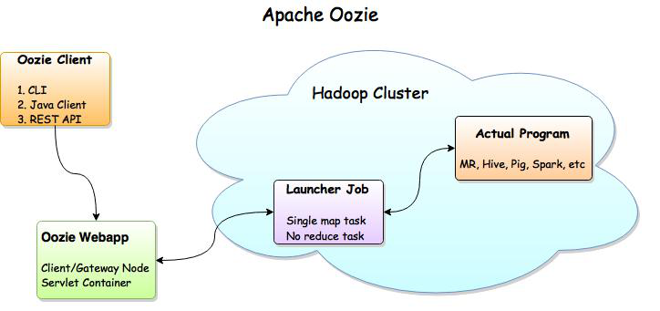
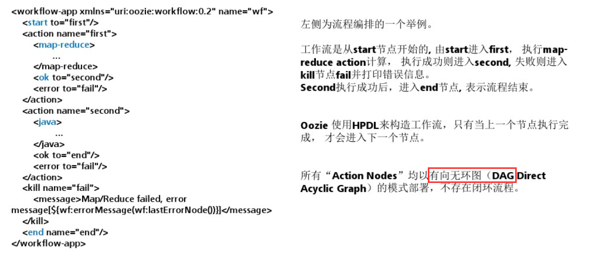
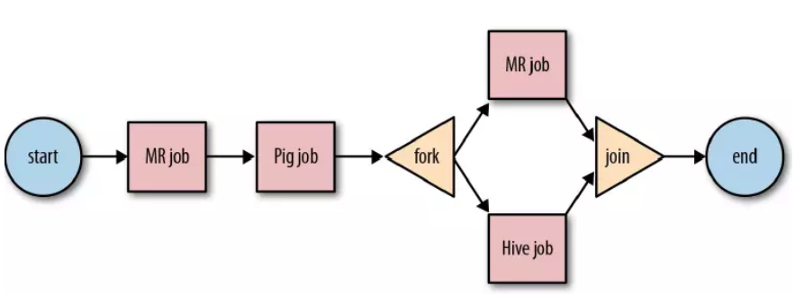
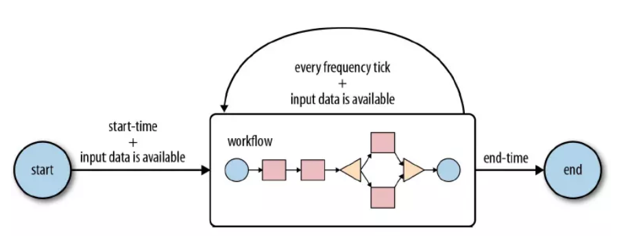
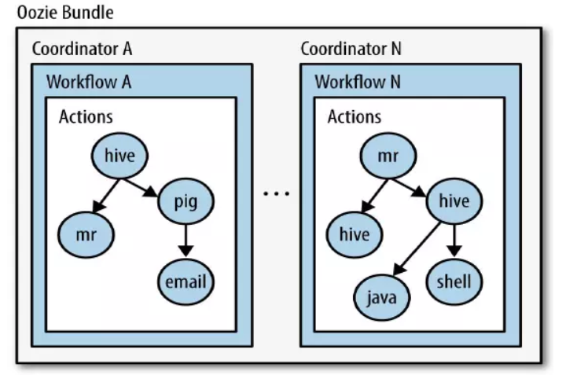

# 54-Apache Oozie

# 1.Oozie概述

Oozie 是一个用来管理 Hadoop生态圈job的工作流调度系统。由Cloudera公司贡献给Apache。Oozie是运行于Java servlet容器上的一个java web应用。Oozie的目的是按照**DAG（有向无环图）**调度一系列的Map/Reduce或者Hive等任务。Oozie 工作流由hPDL（Hadoop Process Definition Language）定义（这是一种XML流程定义语言）。适用场景包括：

- 需要按顺序进行一系列任务；
- 需要并行处理的任务；
- 需要定时、周期触发的任务；
- 可视化作业流运行过程；
- 运行结果或异常的通报。

# 2.Oozie的架构



- Oozie Client

  提供命令行、java api、rest等方式，对Oozie的工作流程的提交、启动、运行、等操作

- Oozie WebApp

  即Oozie Server,本质是一个java应用。可以使用内置的web容器，也可以使用外置的web容器；

- Hadoop Cluster：底层执行Oozie编排流程的各个hadoop生态圈组件；

# 3. Oozie基本原理

Oozie对工作流的编排，是基于**workflow.xml**文件来完成的。用户预先将工作流执行规则定制于workflow.xml文件中，并在job.properties配置相关的参数，然后由Oozie Server向MR提交job来启动工作流。

工作流由两种类型的节点组成，分别是：

- ControlFlow Nodes

  控制工作流执行路径，包括start，end，kill，decision，fork,join。

- ActionNodes

  决定每个操作执行的任务类型，包括MapReduce、java、hive、shell等。



# 4. 工作流类型

## 4.1 WorkFlow

规则相对简单，不涉及定时、批处理的工作流。顺序执行流程节点。

Workflow有个大缺点：**没有定时和条件触发功能。**



## 4.2 Coordinator

Coordinator将多个工作流Job组织起来，称为Coordinator Job，并指定触发时间和频率，还可以配置数据集、并发数等，类似于在工作流外部增加了一个协调器来管理这些工作流的工作流Job的运行。



## 4.3 Bundle

针对coordinator的批处理工作流。Bundle将多个Coordinator管理起来，这样我们只需要一个Bundle提交即可。



# 5. Apache Oozie安装

说明：本次安装的是cdh版本，因为oozie的安装包是源码包，需要自行编译而且还需要考虑版本搭配问题，但是cdh版则没有这样的问题

## 5.1Hadoop相关配置

- core-site.xml

  ```xml
  <property>
          <name>hadoop.proxyuser.root.hosts</name>
          <value>*</value>
  </property>
  <property>
          <name>hadoop.proxyuser.root.groups</name>
          <value>*</value>
  </property>
  ```

  `hadoop.proxyuser.root.hosts` 允许通过httpfs方式访问hdfs的主机名、域名；

  `hadoop.proxyuser.root.groups`允许访问的客户端的用户组

- mapred-site.xml

  ```xml
  <property>
    <name>mapreduce.jobhistory.address</name>
    <value>node-1:10020</value>
    <description>MapReduce JobHistory Server IPC host:port</description>
  </property>
  
  <property>
    <name>mapreduce.jobhistory.webapp.address</name>
    <value>node-1:19888</value>
    <description>MapReduce JobHistory Server Web UI host:port</description>
  </property>
  <!-- 配置运行过的日志存放在hdfs上的存放路径 -->
  <property>
      <name>mapreduce.jobhistory.done-dir</name>
      <value>/export/data/history/done</value>
  </property>
  
  <!-- 配置正在运行中的日志在hdfs上的存放路径 -->
  <property>
      <name>mapreduce.jobhistory.intermediate-done-dir</name>
      <value>/export/data/history/done_intermediate</value>
  </property>
  ```

  启动history-server

  ```
  mr-jobhistory-daemon.sh start historyserver
  ```

  停止history-server

  ```
  mr-jobhistory-daemon.sh stop historyserver
  ```

  通过浏览器访问Hadoop Jobhistory的WEBUI

  ```
  http://node-1:19888
  ```

最后重启hadoop即可

## 5.2 安装oozie

1. 上传压缩包并解压

   ```
   tar -zxvf oozie-4.1.0-cdh5.14.0.tar.gz
   ```

2. 解压 hadooplibs 到oozie的根目录

   ```
   cd /export/servers/oozie-4.1.0-cdh5.14.0
   tar -zxvf oozie-hadooplibs-4.1.0-cdh5.14.0.tar.gz -C ../
   ```

3. 添加依赖

   - ooize根目录下创建libext目录

     ```
     mkdir libext
     ```

   - 拷贝 hadoop 依赖包到 libext

     ```
     cp -ra hadooplibs/hadooplib-2.6.0-cdh5.14.0.oozie-4.1.0-
     cdh5.14.0/* libext/
     ```

   - 上传mysql驱动包到libext

   - 上传ext-2.2.zip压缩包到libext

4. 修改配置文件

   说明：oozie默认使用的是UTC的时区，需要在oozie-site.xml当中配置时区为**GMT+0800时区**

   cd /export/servers/oozie-4.1.0-cdh5.14.0/conf

   vim oozie-site.xml

   ```xml
   	<property>
           <name>oozie.service.JPAService.jdbc.driver</name>
           <value>com.mysql.jdbc.Driver</value>
       </property>
   	<property>
           <name>oozie.service.JPAService.jdbc.url</name>
           <value>jdbc:mysql://node-1:3306/oozie</value>
       </property>
   	<property>
   		<name>oozie.service.JPAService.jdbc.username</name>
   		<value>root</value>
   	</property>
       <property>
           <name>oozie.service.JPAService.jdbc.password</name>
           <value>hadoop</value>
       </property>
   	<property>
   			<name>oozie.processing.timezone</name>
   			<value>GMT+0800</value>
   	</property>
   
   	<property>
           <name>oozie.service.coord.check.maximum.frequency</name>
   		<value>false</value>
       </property>     
   
   	<property>
   		<name>oozie.service.HadoopAccessorService.hadoop.configurations</name>
           <value>*=/export/servers/hadoop-2.7.5/etc/hadoop</value>
       </property>
   ```

5. 初始化mysql相关信息

   - 上传 oozie 的解压后目录的下的 yarn.tar.gz 到 hdfs

     ```
     bin/oozie-setup.sh sharelib create -fs hdfs://node-1:9000 -locallib oozie-sharelib-4.1.0-cdh5.14.0-yarn.tar.gz
     ```

     本质上就是将这些 jar 包解压到了 hdfs 上面的路径下

   - 创建 mysql 数据库

     ```sql
     mysql -uroot -p
     create database oozie;
     ```

   - 初始化ooize的数据库表

     ```
     cd /export/servers/oozie-4.1.0-cdh5.14.0
     bin/oozie-setup.sh db create -run -sqlfile oozie.sql
     ```

     检查mysql中有无生成表

6. 打包项目，生成war包

   ```shell
   cd /export/servers/oozie-4.1.0-cdh5.14.0
   bin/oozie-setup.sh prepare-war
   ```

7. 配置oozie环境变量

   ```shell
   vim /etc/profile
   
   export OOZIE_HOME=/export/servers/oozie-4.1.0-cdh5.14.0
   export OOZIE_URL=http://node03.hadoop.com:11000/oozie
   export PATH=$PATH:$OOZIE_HOME/bin
   
   source /etc/profile
   ```

8. 启动关闭oozie服务

   - 启动命令

     ```
     cd /export/servers/oozie-4.1.0-cdh5.14.0
     bin/oozied.sh start 
     ```

   - 关闭命令

     ```
     bin/oozied.sh stop
     ```

   注：启动的时候产生的 pid 文件，如果是 kill 方式关闭进程 则需要删除该文件重新启动，否则再次启动会报错。

   该文件位于oozie安装目录下的`oozie-server/temp/oozie.pid`

9. 浏览器web UI页面

   ```
   http://node-1:11000/oozie/
   ```

## 5.3 解决oozie页面时区显示异常

页面访问的时候，发现 oozie 使用的还是 GMT 的时区，与我们现在的时区相差一定的时间，所以需要调整一个 js 的获取时区的方法，将其改成我们现在的时区

vim  oozie-server/webapps/oozie/oozie-console.js

```js
function getTimeZone() {
 Ext.state.Manager.setProvider(new Ext.state.CookieProvider());
 return Ext.state.Manager.get("TimezoneId","GMT+0800"); // GMT+0800是修改的内容
}
```

然后重启oozie即可

# 6. Apache Oozie实战

oozie 安装好了之后，需要测试 oozie 的功能是否完整好使，官方已经给自带带了各种测试案例，可以通过官方提供的各种案例来学习 oozie 的使用，后续也可以把这些案例作为模板在企业实际中使用。

- 先把官方提供的各种案例给解压出来

  ```
  cd /export/servers/oozie-4.1.0-cdh5.14.0
  tar -zxvf oozie-examples.tar.gz
  ```

- 创建统一的工作目录，便于集中管理 oozie。企业中可任意指定路径。这里直接在 oozie 的安装目录下面创建工作目录

  ```
  cd /export/servers/oozie-4.1.0-cdh5.14.0
  mkdir oozie_works
  ```

  

## 6.1 优化更新hadoop相关配置

- yarn 容器资源分配属性

  yarn-site.xml

  ```xml
  <!—节点最大可用内存，结合实际物理内存调整 -->
  <property>
          <name>yarn.nodemanager.resource.memory-mb</name>
          <value>3072</value>
  </property>
  <!—每个容器可以申请内存资源的最小值，最大值 -->
  <property>
          <name>yarn.scheduler.minimum-allocation-mb</name>
          <value>1024</value>
  </property>
  <property>
          <name>yarn.scheduler.maximum-allocation-mb</name>
          <value>3072</value>
  </property>
  
  <!—修改为Fair公平调度，动态调整资源，避免yarn上任务等待（多线程执行） -->
  <property>
   <name>yarn.resourcemanager.scheduler.class</name>
   <value>org.apache.hadoop.yarn.server.resourcemanager.scheduler.fair.FairScheduler</value>
  </property>
  <!—Fair调度时候是否开启抢占功能 -->
  <property>
          <name>yarn.scheduler.fair.preemption</name>
          <value>true</value>
  </property>
  <!—超过多少开始抢占，默认0.8-->
      <property>
          <name>yarn.scheduler.fair.preemption.cluster-utilization-threshold</name>
          <value>1.0</value>
      </property>
  ```

- mapreduce 资源申请配置

  > 设置 mapreduce.map.memory.mb 和 mapreduce.reduce.memory.mb 配置
  > 否则 Oozie 读取的默认配置 -1, 提交给 yarn 的时候会抛异常 `Invalid resource 
  > request, requested memory < 0, or requested memory > max configured, 
  > requestedMemory=-1, maxMemory=8192`

  mapred-site.xml

  ```xml
  <!—单个 maptask、reducetask 可申请内存大小 -->
  <property>
   <name>mapreduce.map.memory.mb</name>
   <value>1024</value>
  </property>
  <property>
   <name>mapreduce.reduce.memory.mb</name>
   <value>1024</value>
  </property>
  ```

最后重启hadoop集群和oozie服务即可

## 6.2 Oozie调度shell脚本

1. 准备配置模板

   把 shell 的任务模板拷贝到 oozie 的工作目录当中去

   ```
   cd /export/servers/oozie-4.1.0-cdh5.14.0
   cp -r examples/apps/shell/ oozie_works/
   ```

2. 准备待调度的 shell 脚本

   ```shell
   cd /export/servers/oozie-4.1.0-cdh5.14.0
   vim oozie_works/shell/hello.sh
   # 注意：这个脚本一定要是在我们 oozie 工作路径下的 shell 路径下的
   # 以下是添加的内容
   
   #!/bin/bash
   echo "hello world" >> /export/servers/hello_oozie.txt
   ```

3. 修改配置模板

   修改 job.properties

   ```
   cd /export/servers/oozie-4.1.0-cdh5.14.0/oozie_works/shell
   vim job.properties
   ```

   ```shell
   nameNode=hdfs://node-1:8020 # nameNode端口
   jobTracker=node-1:8032   # 在hadoop2当中，jobTracker这种角色已经没有了，只有resourceManager，这里给定resourceManager的IP及端口即可。
   queueName=default # 提交mr任务的队列名
   examplesRoot=oozie_works  # 指定oozie的工作目录
   oozie.wf.application.path=${nameNode}/user/${user.name}/${examplesRoot}/shell # 指定oozie调度资源存储于hdfs的工作路径，注意要和hdfs保持一致
   EXEC=hello.sh # 指定执行任务的名称。
   ```

4. 修改workflow.xml

   ```xml
   <workflow-app xmlns="uri:oozie:workflow:0.4" name="shell-wf">
   <start to="shell-node"/>
   <action name="shell-node">
       <shell xmlns="uri:oozie:shell-action:0.2">
           <job-tracker>${jobTracker}</job-tracker>
           <name-node>${nameNode}</name-node>
           <configuration>
               <property>
                   <name>mapred.job.queue.name</name>
                   <value>${queueName}</value>
               </property>
           </configuration>
           
           # 修改的地方
           <exec>${EXEC}</exec>
           <file>/user/root/oozie_works/shell/${EXEC}#${EXEC}</file>
           
           
           <capture-output/>
       </shell>
       
       # 修改的地方
       <ok to="end"/>
       
       <error to="fail"/>
   </action>
   <decision name="check-output">
       <switch>
           <case to="end">
               ${wf:actionData('shell-node')['my_output'] eq 'Hello Oozie'}
           </case>
           <default to="fail-output"/>
       </switch>
   </decision>
   <kill name="fail">
       <message>Shell action failed, error message[${wf:errorMessage(wf:lastErrorNode())}]</message>
   </kill>
   <kill name="fail-output">
       <message>Incorrect output, expected [Hello Oozie] but was [${wf:actionData('shell-node')['my_output']}]</message>
   </kill>
   <end name="end"/>
   </workflow-app>
   ```

5. 上传调度任务到hdfs

   注意：上传的hdfs目录为/user/root，因为hadoop启动的时候使用的是root用户，如果hadoop启动的是其他用户，那么就上传到/user/其他用户

   ```
   cd /export/servers/oozie-4.1.0-cdh5.14.0
   hdfs dfs -put oozie_works/ /user/root
   ```

6. 执行调度任务
   通过oozie的命令来执行调度任务

   ```
   cd /export/servers/oozie-4.1.0-cdh5.14.0
   bin/oozie job -oozie http://node-1:11000/oozie -config oozie_works/shell/job.properties  -run
   ```

7. 查看oozie的监控页面对应的任务状态显示为SUCCEEDED就算运行成功

   也可以通过jobhistory来确定调度时候是由那台机器执行的。

## 6.3 Oozie调度hive

1. 准备配置模板

   ```
   cd /export/servers/oozie-4.1.0-cdh5.14.0
   cp -ra examples/apps/hive2/ oozie_works/
   ```

2. 修改配置模板
   修改job.properties

   ```
   cd /export/servers/oozie-4.1.0-cdh5.14.0/oozie_works/hive2
   vim job.properties
   ```

   ```
   nameNode=hdfs://node-1:8020
   jobTracker=node-1:8032
   queueName=default
   jdbcURL=jdbc:hive2://node-1:10000/default
   examplesRoot=oozie_works
   
   oozie.use.system.libpath=true
   
   # 配置我们文件上传到hdfs的保存路径 实际上就是在hdfs 的/user/root/oozie_works/hive2这个路径下
   oozie.wf.application.path=${nameNode}/user/${user.name}/${examplesRoot}/hive2
   ```

3. workflow.xml 无需修改，采用默认即可

4. 编辑hivesql文件

   vim script.q

   ```sql
   DROP TABLE IF EXISTS test;
   CREATE EXTERNAL TABLE test (a INT) STORED AS TEXTFILE LOCATION '${INPUT}';
   insert into test values(10);
   insert into test values(20);
   insert into test values(30);
   ```

5. 上传调度任务到hdfs

   ```
   cd /export/servers/oozie-4.1.0-cdh5.14.0/oozie_works
   hdfs dfs -put hive2/ /user/root/oozie_works/
   ```

6. 执行调度系统

   执行前需要确保启动了hiveServer2服务

   ```
   cd /export/servers/oozie-4.1.0-cdh5.14.0
   bin/oozie job -oozie http://node-1:11000/oozie -config oozie_works/hive2/job.properties  -run
   ```

   可以在yarn监控页面上查看具体的调度过程，同样可以在oozie上查看对一个的任务执行状态

## 6.4 Oozie调度MapReduce

1. 准备配置模板
   准备 mr 程序的待处理数据。用 hadoop 自带的 MR 程序来运行 wordcount。
   准备数据上传到 HDFS 的/oozie/input 路径下去

   ```
   hdfs dfs -mkdir -p /oozie/input
   hdfs dfs -put wordcount.txt /oozie/input
   ```

2. 拷贝 MR 的任务模板

   ```
   cd /export/servers/oozie-4.1.0-cdh5.14.0
   cp -ra examples/apps/map-reduce/ oozie_works/
   ```

3. 删掉 MR 任务模板 lib 目录下自带的 jar 包

   ```
   cd /export/servers/oozie-4.1.0-cdh5.14.0/oozie_works/map-reduce/lib
   rm -rf oozie-examples-4.1.0-cdh5.14.0.jar
   ```

4. 拷贝官方自带 mr 程序 jar 包到对应目录

   ```
   cp 
   /export/servers/hadoop-2.7.5/share/hadoop/mapreduce/hadoop-mapreduce-examples-2.7.5.jar 
   /export/servers/oozie-4.1.0-cdh5.14.0/oozie_works/map-reduce/lib/
   ```

5. 修改配置模板

   修改job.properties

   ```
   cd /export/servers/oozie-4.1.0-cdh5.14.0/oozie_works/map-reduce
   vim job.properties
   ```

   ```
   nameNode=hdfs://node-1:8020
   jobTracker=node-1:8032
   queueName=default
   examplesRoot=oozie_works
   
   oozie.wf.application.path=${nameNode}/user/${user.name}/${examplesRoot}/map-reduce/workflow.xml
   outputDir=/oozie/output
   inputdir=/oozie/input
   ```

6. 修改workflow.xml

   ```
   cd /export/servers/oozie-4.1.0-cdh5.14.0/oozie_works/map-reduce
   vim workflow.xml
   ```

   ```xml
   <?xml version="1.0" encoding="UTF-8"?>
   <workflow-app xmlns="uri:oozie:workflow:0.5" name="map-reduce-wf">
       <start to="mr-node"/>
       <action name="mr-node">
           <map-reduce>
               <job-tracker>${jobTracker}</job-tracker>
               <name-node>${nameNode}</name-node>
               <prepare>
               
               	# 注意的地方
                   <delete path="${nameNode}/${outputDir}"/>
                   
               </prepare>
               <configuration>
                   <property>
                       <name>mapred.job.queue.name</name>
                       <value>${queueName}</value>
                   </property>
   				<!--  
                   <property>
                       <name>mapred.mapper.class</name>
                       <value>org.apache.oozie.example.SampleMapper</value>
                   </property>
                   <property>
                       <name>mapred.reducer.class</name>
                       <value>org.apache.oozie.example.SampleReducer</value>
                   </property>
                   <property>
                       <name>mapred.map.tasks</name>
                       <value>1</value>
                   </property>
                   <property>
                       <name>mapred.input.dir</name>
                       <value>/user/${wf:user()}/${examplesRoot}/input-data/text</value>
                   </property>
                   <property>
                       <name>mapred.output.dir</name>
                       <value>/user/${wf:user()}/${examplesRoot}/output-data/${outputDir}</value>
                   </property>
   				-->
   				
   				   <!-- 开启使用新的API来进行配置 -->
                   <property>
                       <name>mapred.mapper.new-api</name>
                       <value>true</value>
                   </property>
   
                   <property>
                       <name>mapred.reducer.new-api</name>
                       <value>true</value>
                   </property>
   
                   <!-- 指定MR的输出key的类型 -->
                   <property>
                       <name>mapreduce.job.output.key.class</name>
                       <value>org.apache.hadoop.io.Text</value>
                   </property>
   
                   <!-- 指定MR的输出的value的类型-->
                   <property>
                       <name>mapreduce.job.output.value.class</name>
                       <value>org.apache.hadoop.io.IntWritable</value>
                   </property>
   
                   <!-- 指定输入路径 -->
                   <property>
                       <name>mapred.input.dir</name>
                       <value>${nameNode}/${inputdir}</value>
                   </property>
   
                   <!-- 指定输出路径 -->
                   <property>
                       <name>mapred.output.dir</name>
                       <value>${nameNode}/${outputDir}</value>
                   </property>
   
                   <!-- 指定执行的map类 -->
                   <property>
                       <name>mapreduce.job.map.class</name>
                       <value>org.apache.hadoop.examples.WordCount$TokenizerMapper</value>
                   </property>
   
                   <!-- 指定执行的reduce类 -->
                   <property>
                       <name>mapreduce.job.reduce.class</name>
                       <value>org.apache.hadoop.examples.WordCount$IntSumReducer</value>
                   </property>
   				<!--  配置map task的个数 -->
                   <property>
                       <name>mapred.map.tasks</name>
                       <value>1</value>
                   </property>
   
               </configuration>
           </map-reduce>
           <ok to="end"/>
           <error to="fail"/>
       </action>
       <kill name="fail">
           <message>Map/Reduce failed, error message[${wf:errorMessage(wf:lastErrorNode())}]</message>
       </kill>
       <end name="end"/>
   </workflow-app>
   ```

7. 上传调度任务到hdfs

   ```
   cd /export/servers/oozie-4.1.0-cdh5.14.0/oozie_works
   hdfs dfs -put map-reduce/ /user/root/oozie_works/
   ```

8. 执行调度任务

   ```
   cd /export/servers/oozie-4.1.0-cdh5.14.0
   bin/oozie job -oozie http://node-1:11000/oozie -config oozie_works/map-reduce/job.properties –run
   ```

## 6.5 Oozie任务串联

在实际工作当中，肯定会存在多个任务需要执行，并且存在上一个任务的输出结果作为下一个任务的输入数据这样的情况，所以我们需要在workflow.xml配置文件当中配置多个action，实现多个任务之间的相互依赖关系。

**需求：**首先执行一个shell脚本，执行完了之后再执行一个MR的程序，最后再执行一个hive的程序。

1. 准备工作目录

   ```
   cd /export/servers/oozie-4.1.0-cdh5.14.0/oozie_works
   mkdir -p sereval-actions
   ```

2. 准备调度文件

   将之前的hive，shell， MR的执行，进行串联成到一个workflow当中。

   ```
   cd /export/servers/oozie-4.1.0-cdh5.14.0/oozie_works
   cp hive2/script.q sereval-actions/
   cp shell/hello.sh sereval-actions/
   cp -ra map-reduce/lib sereval-actions/
   ```

3. 修改配置模板

   ```
   cd /export/servers/oozie-4.1.0-cdh5.14.0/oozie_works/sereval-actions
   vim workflow.xml
   ```

   ```xml
   <workflow-app xmlns="uri:oozie:workflow:0.4" name="shell-wf">
   <start to="shell-node"/>
   <action name="shell-node">
       <shell xmlns="uri:oozie:shell-action:0.2">
           <job-tracker>${jobTracker}</job-tracker>
           <name-node>${nameNode}</name-node>
           <configuration>
               <property>
                   <name>mapred.job.queue.name</name>
                   <value>${queueName}</value>
               </property>
           </configuration>
           <exec>${EXEC}</exec>
           <!-- <argument>my_output=Hello Oozie</argument> -->
           <file>/user/root/oozie_works/sereval-actions/${EXEC}#${EXEC}</file>
   
           <capture-output/>
       </shell>
       <ok to="mr-node"/>
       <error to="mr-node"/>
   </action>
   
   <action name="mr-node">
           <map-reduce>
               <job-tracker>${jobTracker}</job-tracker>
               <name-node>${nameNode}</name-node>
               <prepare>
                   <delete path="${nameNode}/${outputDir}"/>
               </prepare>
               <configuration>
                   <property>
                       <name>mapred.job.queue.name</name>
                       <value>${queueName}</value>
                   </property>
   				<!--  
                   <property>
                       <name>mapred.mapper.class</name>
                       <value>org.apache.oozie.example.SampleMapper</value>
                   </property>
                   <property>
                       <name>mapred.reducer.class</name>
                       <value>org.apache.oozie.example.SampleReducer</value>
                   </property>
                   <property>
                       <name>mapred.map.tasks</name>
                       <value>1</value>
                   </property>
                   <property>
                       <name>mapred.input.dir</name>
                       <value>/user/${wf:user()}/${examplesRoot}/input-data/text</value>
                   </property>
                   <property>
                       <name>mapred.output.dir</name>
                       <value>/user/${wf:user()}/${examplesRoot}/output-data/${outputDir}</value>
                   </property>
   				-->
   				
   				   <!-- 开启使用新的API来进行配置 -->
                   <property>
                       <name>mapred.mapper.new-api</name>
                       <value>true</value>
                   </property>
   
                   <property>
                       <name>mapred.reducer.new-api</name>
                       <value>true</value>
                   </property>
   
                   <!-- 指定MR的输出key的类型 -->
                   <property>
                       <name>mapreduce.job.output.key.class</name>
                       <value>org.apache.hadoop.io.Text</value>
                   </property>
   
                   <!-- 指定MR的输出的value的类型-->
                   <property>
                       <name>mapreduce.job.output.value.class</name>
                       <value>org.apache.hadoop.io.IntWritable</value>
                   </property>
   
                   <!-- 指定输入路径 -->
                   <property>
                       <name>mapred.input.dir</name>
                       <value>${nameNode}/${inputdir}</value>
                   </property>
   
                   <!-- 指定输出路径 -->
                   <property>
                       <name>mapred.output.dir</name>
                       <value>${nameNode}/${outputDir}</value>
                   </property>
   
                   <!-- 指定执行的map类 -->
                   <property>
                       <name>mapreduce.job.map.class</name>
                       <value>org.apache.hadoop.examples.WordCount$TokenizerMapper</value>
                   </property>
   
                   <!-- 指定执行的reduce类 -->
                   <property>
                       <name>mapreduce.job.reduce.class</name>
                       <value>org.apache.hadoop.examples.WordCount$IntSumReducer</value>
                   </property>
   				<!--  配置map task的个数 -->
                   <property>
                       <name>mapred.map.tasks</name>
                       <value>1</value>
                   </property>
   
               </configuration>
           </map-reduce>
           <ok to="hive2-node"/>
           <error to="fail"/>
       </action>
   
   
   
   
   
   
    <action name="hive2-node">
           <hive2 xmlns="uri:oozie:hive2-action:0.1">
               <job-tracker>${jobTracker}</job-tracker>
               <name-node>${nameNode}</name-node>
               <prepare>
                   <delete path="${nameNode}/user/${wf:user()}/${examplesRoot}/output-data/hive2"/>
                   <mkdir path="${nameNode}/user/${wf:user()}/${examplesRoot}/output-data"/>
               </prepare>
               <configuration>
                   <property>
                       <name>mapred.job.queue.name</name>
                       <value>${queueName}</value>
                   </property>
               </configuration>
               <jdbc-url>${jdbcURL}</jdbc-url>
               <script>script.q</script>
               <param>INPUT=/user/${wf:user()}/${examplesRoot}/input-data/table</param>
               <param>OUTPUT=/user/${wf:user()}/${examplesRoot}/output-data/hive2</param>
           </hive2>
           <ok to="end"/>
           <error to="fail"/>
       </action>
   <decision name="check-output">
       <switch>
           <case to="end">
               ${wf:actionData('shell-node')['my_output'] eq 'Hello Oozie'}
           </case>
           <default to="fail-output"/>
       </switch>
   </decision>
   <kill name="fail">
       <message>Shell action failed, error message[${wf:errorMessage(wf:lastErrorNode())}]</message>
   </kill>
   <kill name="fail-output">
       <message>Incorrect output, expected [Hello Oozie] but was [${wf:actionData('shell-node')['my_output']}]</message>
   </kill>
   <end name="end"/>
   </workflow-app>
   ```

4. 修改job.properties配置文件

   ```shell
   nameNode=hdfs://node-1:8020
   jobTracker=node-1:8032
   queueName=default
   examplesRoot=oozie_works
   EXEC=hello.sh
   outputDir=/oozie/output
   inputdir=/oozie/input
   jdbcURL=jdbc:hive2://node-1:10000/default
   oozie.use.system.libpath=true
   # 配置我们文件上传到hdfs的保存路径 实际上就是在hdfs 的/user/root/oozie_works/sereval-actions这个路径下
   oozie.wf.application.path=${nameNode}/user/${user.name}/${examplesRoot}/sereval-actions/workflow.xml
   ```

5. 上传调度任务到hdfs

   ```
   cd /export/servers/oozie-4.1.0-cdh5.14.0/oozie_works/
   hdfs dfs -put sereval-actions/ /user/root/oozie_works/
   ```

6. 执行调度任务

   ```
   cd /export/servers/oozie-4.1.0-cdh5.14.0/
   bin/oozie job -oozie http://node-1:11000/oozie -config oozie_works/sereval-actions/job.properties -run
   ```

## 6.6 Oozie定时调度

在oozie当中，主要是通过Coordinator 来实现任务的定时调度， Coordinator 模块主要通过xml来进行配置即可。

Coordinator 的调度主要可以有两种实现方式

- 第一种：基于时间的定时任务调度：

  oozie基于时间的调度主要需要指定三个参数，第一个起始时间，第二个结束时间，第三个调度频率；

- 第二种：基于数据的任务调度， 这种是基于数据的调度，只要在有了数据才会触发调度任务。

1. 准备配置模板

   - 第一步：拷贝定时任务的调度模板

     ```
     cd /export/servers/oozie-4.1.0-cdh5.14.0
     cp -r examples/apps/cron oozie_works/cron-job
     ```

   - 第二步：拷贝我们的hello.sh脚本

     ```
     cd /export/servers/oozie-4.1.0-cdh5.14.0/oozie_works
     cp shell/hello.sh  cron-job/
     ```

2. 修改配置模板
   修改job.properties

   ```
   cd /export/servers/oozie-4.1.0-cdh5.14.0/oozie_works/cron-job
   vim job.properties
   ```

   ```
   nameNode=hdfs://node-1:8020
   jobTracker=node-1:8032
   queueName=default
   examplesRoot=oozie_works
   
   oozie.coord.application.path=${nameNode}/user/${user.name}/${examplesRoot}/cron-job/coordinator.xml
   #start：必须设置为未来时间，否则任务失败
   start=2019-05-22T19:20+0800
   end=2019-08-22T19:20+0800
   EXEC=hello.sh
   workflowAppUri=${nameNode}/user/${user.name}/${examplesRoot}/cron-job/workflow.xml
   ```

3. 修改coordinator.xml
   vim coordinator.xml

   ```xml
   <!--
   	oozie的frequency 可以支持很多表达式，其中可以通过定时每分，或者每小时，或者每天，或者每月进行执行，也支持可以通过与linux的crontab表达式类似的写法来进行定时任务的执行
   	例如frequency 也可以写成以下方式
   	frequency="10 9 * * *"  每天上午的09:10:00开始执行任务
   	frequency="0 1 * * *"  每天凌晨的01:00开始执行任务
    -->
   
   
   # 修改的地方
   <coordinator-app name="cron-job" frequency="${coord:minutes(1)}" start="${start}" end="${end}" timezone="GMT+0800"
                    xmlns="uri:oozie:coordinator:0.4">
       
       
       
           <action>
           <workflow>
               <app-path>${workflowAppUri}</app-path>
               <configuration>
                   <property>
                       <name>jobTracker</name>
                       <value>${jobTracker}</value>
                   </property>
                   <property>
                       <name>nameNode</name>
                       <value>${nameNode}</value>
                   </property>
                   <property>
                       <name>queueName</name>
                       <value>${queueName}</value>
                   </property>
               </configuration>
           </workflow>
       </action>
   </coordinator-app>
   ```

4. 修改workflow.xml
   vim workflow.xml

   ```xml
   <workflow-app xmlns="uri:oozie:workflow:0.5" name="one-op-wf">
       <start to="action1"/>
       <action name="action1">
           
           # 修改的地方
       <shell xmlns="uri:oozie:shell-action:0.2">
           <job-tracker>${jobTracker}</job-tracker>
           <name-node>${nameNode}</name-node>
           <configuration>
               <property>
                   <name>mapred.job.queue.name</name>
                   <value>${queueName}</value>
               </property>
           </configuration>
           <exec>${EXEC}</exec>
           <!-- <argument>my_output=Hello Oozie</argument> -->
           <file>/user/root/oozie_works/cron-job/${EXEC}#${EXEC}</file>
   
           <capture-output/>
       </shell>
           
           
           
       <ok to="end"/>
       <error to="end"/>
   </action>
       <end name="end"/>
   </workflow-app>
   ```

5. 上传调度任务到hdfs

   ```
   cd /export/servers/oozie-4.1.0-cdh5.14.0/oozie_works
   hdfs dfs -put cron-job/ /user/root/oozie_works/
   ```

6. 执行调度

   ```
   cd /export/servers/oozie-4.1.0-cdh5.14.0
   bin/oozie job -oozie http://node-1:11000/oozie -config oozie_works/cron-job/job.properties –run
   ```

   

# 7. Oozie 任务查看、杀死

查看所有普通任务

```
oozie  jobs
```

查看定时任务

```
oozie jobs -jobtype coordinator
```

杀死某个任务oozie可以通过jobid来杀死某个定时任务

```
oozie job -kill [id]

oozie job -kill 0000085-180628150519513-oozie-root-C
```

