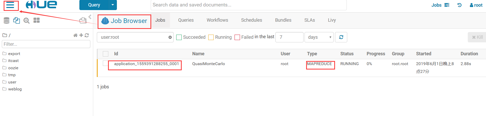
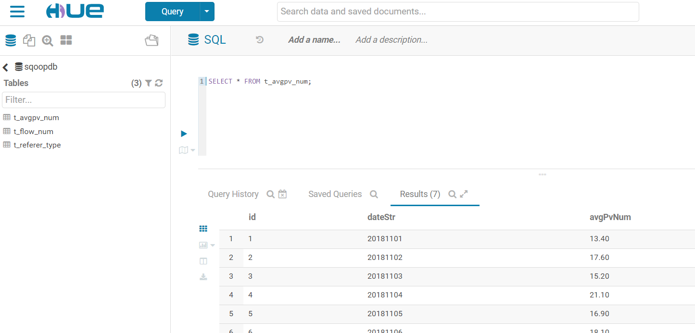
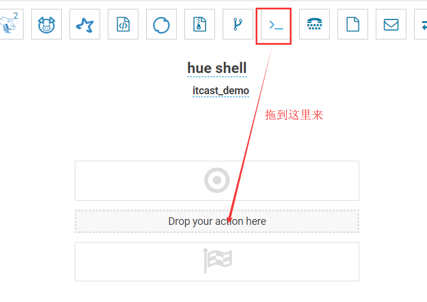

# 55-Apache Hue

# 1.Apache Hue介绍

注：之前已经在HBase章节做过一次了，本次是cdh版本

**hue是什么？**

HUE = Hadoop User Experience

Hue是一个开源的Apache Hadoop UI系统，由Cloudera Desktop演化而来，最后Cloudera公司将其贡献给Apache基金会的Hadoop社区，它是基于Python Web框架Django实现的。

通过使用Hue，可以在浏览器端的Web控制台上与Hadoop集群进行交互，来分析处理数据，例如操作HDFS上的数据，运行MapReduce Job，执行Hive的SQL语句，浏览HBase数据库等等。

**Hue能做什么？**

- 访问HDFS和文件浏览 
- 通过web调试和开发hive以及数据结果展示 
- 查询solr和结果展示，报表生成 通过web调试和开发impala交互式SQL Query 
- spark调试和开发 
- Pig开发和调试 
- oozie任务的开发，监控，和工作流协调调度 
- Hbase数据查询和修改，数据展示 
- Hive的元数据（metastore）查询 
- MapReduce任务进度查看，日志追踪 
- 创建和提交MapReduce，Streaming，Java job任务 
- Sqoop2的开发和调试 
- Zookeeper的浏览和编辑 
- 数据库（MySQL，PostGres，SQlite，Oracle）的查询和展示

**Hue的架构**

Hue是一个友好的界面集成框架，可以集成各种大量的大数据体系软件框架，通过一个界面就可以做到查看以及执行所有的框架。

Hue提供的这些功能相比Hadoop生态各组件提供的界面更加友好，但是一些需要debug的场景可能还是要使用原生系统才能更加深入的找到错误的原因。


# 2. Hue安装

Hue的安装支持多种方式，包括rpm包的方式进行安装、tar.gz包的方式进行安装以及cloudera  manager的方式来进行安装等，我们这里使用tar.gz包的方式来进行安装。

Hue的压缩包的下载地址：

http://archive.cloudera.com/cdh5/cdh/5/

我们这里使用的是CDH5.14.0这个对应的版本，具体下载地址为

http://archive.cloudera.com/cdh5/cdh/5/hue-3.9.0-cdh5.14.0.tar.gz

1. 上传并解压安装包

   ```
   tar -zxvf hue-3.9.0-cdh5.14.0.tar.gz
   ```

2. 安装依赖包

   ```
   yum install -y asciidoc cyrus-sasl-devel cyrus-sasl-gssapi cyrus-sasl-plain gcc gcc-c++ krb5-devel libffi-devel libxml2-devel libxslt-devel make openldap-devel python-devel sqlite-devel gmp-devel
   ```

3. 配置hue

   vim hue.ini

   ```shell
   #通用配置
   [desktop]
   secret_key=jFE93j;2[290-eiw.KEiwN2s3['d;/.q[eIW^y#e=+Iei*@Mn<qW5o
   http_host=node-1
   is_hue_4=true
   time_zone=Asia/Shanghai  # 注意时区
   server_user=root
   server_group=root
   default_user=root
   default_hdfs_superuser=root
   #配置使用mysql作为hue的存储数据库,大概在hue.ini的587行左右
   [[database]]
   engine=mysql
   host=node-1
   port=3306
   user=root
   password=Hadoop
   name=hue # 注意数据库的名字
   ```

4. 创建mysql中hue使用的数据库

   ```sql
   create database hue default character set utf8 default collate utf8_general_ci;
   ```

5. 编译Hue

   进入hue根目录下执行该命令

   ```
   make apps
   ```

   编译成功以后会在mysql对应的数据库中创建很多初始化表

6. 启动Hue，Web UI访问

   进入hue根目录下执行该命令

   ```
   build/env/bin/supervisor
   ```

   页面访问路径

   ```
   http://node-1:8888
   ```

注：第一次访问hue的时候需要设置超级管理员用户与密码。默认你第一次登陆使用的账户名和密码就是超级管理员

# 3.Hue与软件的集成

## 3.1 Hue集成HDFS

注意修改完HDFS相关配置后，需要把配置scp给集群中每台机器，重启hdfs集群。

1. core-site.xml

   ```xml
   <!—允许通过httpfs方式访问hdfs的主机名 -->
   <property>
   <name>hadoop.proxyuser.root.hosts</name>
   <value>*</value>
   </property>
   <!—允许通过httpfs方式访问hdfs的用户组 -->
   <property>
   <name>hadoop.proxyuser.root.groups</name>
   <value>*</value>
   </property>
   ```

2. hdfs-site.xml

   ```xml
   <property>
   	  <name>dfs.webhdfs.enabled</name>
   	  <value>true</value>
   </property>
   ```

3. hue.ini

   vim /hue/desktop/conf/hue.ini

   ```shell
   [[hdfs_clusters]]
       [[[default]]]
   fs_defaultfs=hdfs://node-1:9000 # NameNode端口
   webhdfs_url=http://node-1:50070/webhdfs/v1 # webUI页面端口
   hadoop_hdfs_home= /export/servers/hadoop-2.7.5 # hadoop所在位置
   hadoop_bin=/export/servers/hadoop-2.7.5/bin # hadoop的bin目录
   hadoop_conf_dir=/export/servers/hadoop-2.7.5/etc/hadoop # hadoop配置文件所在位置
   ```

4. 重启HDFS、Hue

   ```
   start-dfs.sh
   
   cd /export/servers/hue-3.9.0-cdh5.14.0/
   build/env/bin/supervisor
   ```

   


## 3.2 Hue集成YARN

1. 修改hue.ini

   ```shell
   [[yarn_clusters]]
       [[[default]]]
         resourcemanager_host=node-1 # RM所在节点
         resourcemanager_port=8032 # RM端口
         submit_to=True
         resourcemanager_api_url=http://node-1:8088 #yarn端口
         history_server_api_url=http://node-1:19888 # hadoop历史端口
   ```

2. 开启yarn日志聚集服务

   MapReduce 是在各个机器上运行的， 在运行过程中产生的日志存在于各个机器上，为了能够统一查看各个机器的运行日志，将日志集中存放在 HDFS 上， 这个过程就是日志聚集。

   ```xml
   <property>  ##是否启用日志聚集功能。
   <name>yarn.log-aggregation-enable</name>
   <value>true</value>
   </property>
   <property>  ##设置日志保留时间，单位是秒。
   <name>yarn.log-aggregation.retain-seconds</name>
   <value>106800</value>
   </property>
   ```

3. 重启Yarn、Hue



## 3.3 Hue集成Hive

如果需要配置hue与hive的集成，我们需要启动hive的metastore服务以及hiveserver2服务（impala需要hive的metastore服务，hue需要hvie的hiveserver2服务）。

1. 修改Hue.ini

   ```shell
   [beeswax]
     hive_server_host=node-1 # hive所在节点
     hive_server_port=10000 # hive端口
     hive_conf_dir=/export/servers/hive/conf # hive配置文件所在目录
     server_conn_timeout=120 # 超时时间
     auth_username=root # 用户
     auth_password=123456 # 密码
   
   [metastore]
     #允许使用hive创建数据库表等操作
     enable_new_create_table=true
   ```

2. 启动Hive服务、重启hue

   去node-1机器上启动hive的metastore以及hiveserver2服务

   ```
   nohup bin/hive --service metastore &
   nohup bin/hive --service hiveserver2 &
   ```

   重新启动hue。 

   ```
   build/env/bin/supervisor
   ```

   


## 3.4 Hue集成MySql

1. 修改hue.ini

   需要把mysql的注释给去掉。 大概位于1546行

   ```shell
   [[[mysql]]]
         nice_name="My SQL DB"
         engine=mysql
         host=node-1
         port=3306
         user=root
         password=hadoop
   ```

2. 重启hue

   ```
   build/env/bin/supervisor
   ```



## 3.5 Hue集成Oozie

1. 修改配置文件hue.ini

   ```shell
   [liboozie]
   oozie_url=http://node-1:11000/oozie
   remote_deployement_dir=/user/root/oozie_works
    
   [oozie]
   oozie_jobs_count=100
   enable_cron_scheduling=true
   enable_document_action=true
   enable_oozie_backend_filtering=true
   enable_impala_action=true
   
   [filebrowser]
   archive_upload_tempdir=/tmp
   show_download_button=true
   show_upload_button=true
   enable_extract_uploaded_archive=true
   ```

2. 启动hue、oozie

   启动 hue 进程

   ```
   cd /export/servers/hue-3.9.0-cdh5.14.0
   build/env/bin/supervisor
   ```

   启动 oozie 进程

   ```
   cd /export/servers/oozie-4.1.0-cdh5.14.0
   bin/oozied.sh start
   ```

   页面访问hue

   http://node-1:8888

### 3.5.1 使用hue配置oozie调度

hue提供了页面鼠标拖拽的方式配置oozie调度


### 3.5.2 利用hue调度shell脚本

在HDFS上创建一个shell脚本程序文件。


1. 打开工作流调度页面。

   

   

   

   

   

   

### 3.5.3 利用hue调度hive脚本

在HDFS上创建一个hive sql脚本程序文件。


打开workflow页面，拖拽hive2图标到指定位置。


### 3.5.4 利用hue调度MapReduce程序

利用hue提交MapReduce程序


### 3.5.5 利用Hue配置定时调度任务

在hue中，也可以针对workflow配置定时调度任务，具体操作如下：


一定要注意时区的问题，否则调度就出错了。保存之后就可以提交定时任务。


点击进去，可以看到定时任务的详细信息。


## 3.6 Hue集成HBase

1. hbase-site.xml

   作用：开启hbase thrift服务

   修改完成之后scp给其他机器上hbase安装包。

   ```xml
   <property>
     <name>hbase.thrift.support.proxyuser</name>
     <value>true</value>
   </property>
   <property>
     <name>hbase.regionserver.thrift.http</name>
     <value>true</value>
   </property>
   ```

2. core-site.xml

   scp给其他机器和hbase安装包conf目录下

   ```xml
   <property>
   <name>hadoop.proxyuser.hbase.hosts</name>
   <value>*</value>
   </property>
   <property>
   <name>hadoop.proxyuser.hbase.groups</name>
   <value>*</value>
   </property>
   ```

3. hue.ini

   ```shell
   [hbase]
   hbase_clusters=(Cluster|node-1:9090)
   hbase_conf_dir=/export/servers/hbase-1.2.1/conf
   thrift_transport=buffered
   ```

4. 启动HBase（包括thrift服务）、hue

   需要启动hdfs和hbase，然后再启动thrift。

   ```
   start-dfs.sh
   start-hbase.sh
   hbase-daemon.sh start thrift
   ```

   重新启动hue。 

   ```
   cd /export/servers/hue-3.9.0-cdh5.14.0/
   build/env/bin/supervisor
   ```


## 3.7 Hue集成Impala

1. hue.ini

   ```shell
   [impala]
    server_host=node-3 # 注意自己的impala server服务位于什么位置
    server_port=21050
   impala_conf_dir=/etc/impala/conf
   ```

2. 重启hue

   ```
   cd /export/servers/hue-3.9.0-cdh5.14.0/
   build/env/bin/supervisor
   ```

   


