# 56-网站流量日志分析实战-01

# 1. 网站流量日志分析背景介绍

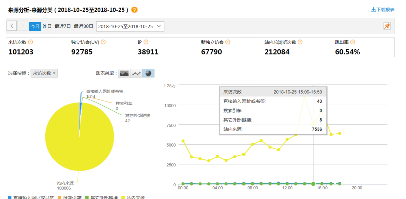

网站分析对于很多人来说是一个全新的行业，大家会存在常见的一些疑问，网站分析是干什么的？都分析哪些内容？为什么要对网站进行分析？这能带来哪些价值？

回答这些之前，我们先反问一下自己：**网站为什么会存在？**每个网站都有自己存在的目的和意义。除了政府和公益类网站之外，大多数网站的目的都是为了产生货币收入，**说白了就是赚钱**。要创建出用户需要的网站就必须进行网站分析，通过分析，找出用户实际需求，构建出符合用户需求的网站

## 1.1 网站分析的意义

网站分析，可以帮助网站管理员、运营人员、推广人员等实时获取网站流量信息，并从流量来源、网站内容、网站访客特性等多方面提供网站分析的数据依据。从而帮**助提高网站流量，提升网站用户体验，让访客更多的沉淀下来变成会员或客户，通过更少的投入获取最大化的收入**。

事实上网站分析设计的内容非常广泛，由很多部分组成。每一部分都可以单独作为一个分析项目，如下所示

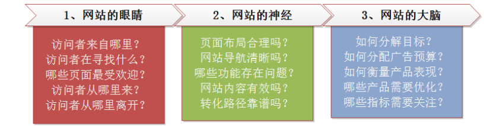

首先，网站分析是**网站的眼睛**。是从网站的营销角度看到的网站分析。在这部分中，网站分析的主要对象是访问者，访问者在网站中的行为以及不同流量之间的关系。

其次，**网站分析是整个网站的神经系统。这是从产品和架构的角度看到的网站分析**。在这部分中，网站分析的主要对象是网站的逻辑和结构，网站的导航结构是否合理，注册购买流程的逻辑是否顺畅。

最后**，网站分析是网站的大脑，在这部门中，网站分析的主要分析对象是投资回报率（ROI）**。也就是说在现有的情况下，如何合理的分配预算和资源以完成网站的目标

**终极意义：改善网站的运营，获取更高投资回报率（ROI）。赚更多的钱**

## 1.2 如何进行网站分析

网站分析整体来说是一个内涵非常丰富的体系，整体过程是一个金字塔结构：

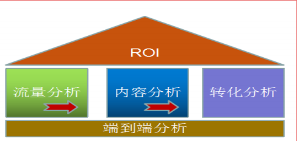

金字塔的顶部是网站的目标：投资回报率（ROI）。

### 1.2.1 网站流量质量分析（流量分析）

流量对于每个网站来说都是很重要，但流量并不是越多越好，应该更加看重流量的质量，换句话来说就是流量可以为我们带来多少收入。

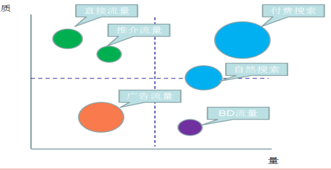

**X 轴代表量，指网站获得的访问量。Y 轴代表质，指可以促进网站目标的事件次数（比如商品浏览、注册、购买等行为）。圆圈大小表示获得流量的成本。**

- 第一象限：质高量高。这是网站的核心流量，对于这部分流量保持即可。建议降低获取流量的成本。
- 第二象限：质高量低。这部分是网站的忠诚用户，有很高的质，建议提高量。
- 第三象限: 量可以质较低，并且获取量的成本比较高。
- 第四象限: 量高质低。这部分需要提高质量。

**BD 流量是指商务拓展流量。**一般指的是互联网经过运营或者竞价排名等方式，从外部拉来的流量。比如在百度上花钱来竞价排名，产生的流量就是 BD 流量的一部分。

### 1.2.2 网站流量多维度细分（流量分析）

细分是指通过不同维度对指标进行分割，查看同一个指标在不同维度下的表现，进而找出有问题的那部分指标，对这部分指标进行优化

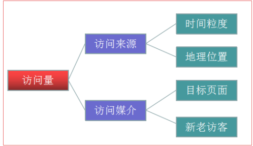

指标是访问量，就是我们常说的流量。在来源维度、媒介维度、时间维度、位置维度等维度下，我们可以对访问量进行单独或者重叠的多维度细分

### 1.2.3 网站内容及导航性

对于所有网站来说，页面都可以被划分为三个类别：导航页、功能页、内容页

首页和列表页都是典型的导航页；

站内搜索页面、注册表单页面和购物车页面都是典型的功能页，而产品详情页、新闻和文章页都是典型的内容页。

**导航页的目的是引导访问者找到信息，功能页的目的是帮助访问者完成特定任务，内容页的目的是向访问者展示信息并帮助访问者进行决策。**

比如从内容导航分析中，以下两类行为就是网站运营者不希望看到的行为：

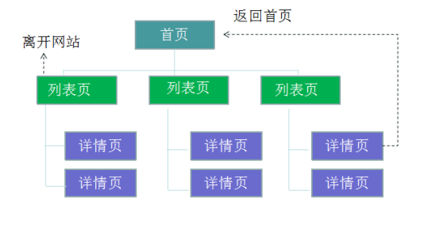

- 第一个问题：访问者从导航类页面（首页）进入，还没有看到内容类页面（详情页）之前就从导航类页面（列表页）离开网站。在这次访问中，访问者并没有完成任务，导航类页面也没有将访问者带入到内容类页面（详情页）中。因此，需要分析导航类页面（列表页）造成访问者中途离开的原因。

- 第二个问题：访问者从导航类页面（首页或列表页）进入网站，从内容类页面（详情页）又返回到导航类页面（首页）。看似访问者在这次访问中完成了任务（如果浏览内容页就是这个网站的最终目标的话），但其实访问者返回首页是在开始一次新的导航或任务。说明需要分析内容页的最初设计，并考虑中内容页提供交叉的信息推荐。

### 1.2.4 网站转化以及漏洞分析（转化分析）

**转化，指网站业务流程中的一个封闭渠道，引导用户按照流程最终实现业务目标**（比如商品成交）；在这个渠道中，**我们希望访问者一路向前，不要回头也不要离开，直到完成转化目标**

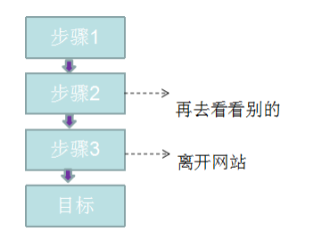

漏斗模型则是指进入渠道的用户在各环节递进过程中逐渐流失的形象描述。


对于转化渠道，主要进行两部分的分析：**访问者的流失和迷失。**

**转化中的阻力的流失：**

转化的阻力是造成访问者流失的主要原因之一。这里的阻力包括

- 错误的设计、错误的引导错误的设计包括访问者在转化过程中找不到下一步操作的按钮，无法确认订
  单信息，或无法完成支付等。
- 错误的引导包括在支付过程中提供很多离开的渠道链接，如不恰当的商品或者活动推荐、对支付环节中专业名称的解释、帮助信息等内容。
- 造成流失的原因很多，如：
  - 不恰当的商品或活动推荐
  - 对支付环节中专业名词的解释、帮助信息等内容不当

**访问者的迷失**

**造成迷失的主要原因是转化流量设计不合理，访问者在特定阶段得不到需要的信息，并且不能根据现有的信息作出决策**，比如在线购买演唱会门票，直到支付也没看到在线选座的提示，这时候就很可能会产生迷失，返回查看

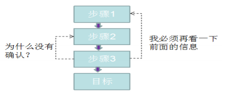

总之，网站数据分析是一门内容非常丰富的学科，本课程中主要关注网站流量分析过程中的技术运用，更多关于网站数据分析的业务知识可学习文档首页推荐的资料

# 2. 整体技术流程及架构

## 2.1 数据处理流程

网站流量日志数据分析是一个纯粹的数据分析项目，其整体流程基本上就是依据数据的处理流转流程进行。通俗可以概括为：数据从哪里来和数据到哪里去，可以分为以下几个大的步骤：

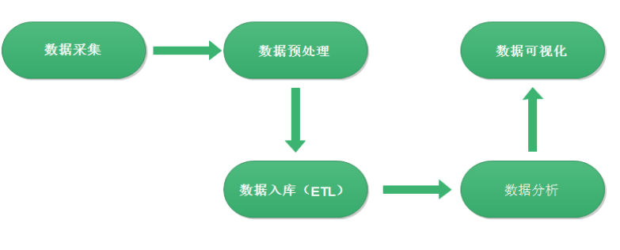

### 2.1.1 数据采集

- 数据采集概念，目前行业会有两种解释：

- 一是数据从无到有产生的过程（服务器打印的 log、自定义采集的日志等）叫做数据采集；

- 另一方面也有把通过使用 Flume 等工具把数据采集搬运到指定位置的这个过程叫做数据采集。

- 关于具体含义要结合语境具体分析，明白语境中具体含义即可

### 2.1.2 数据预处理

数据预处理（data preprocessing）是指在正式处理以前对数据进行的一些处理。现实世界中数据大体上都是不完整，不一致的脏数据，无法直接进行数据分析，或者说不利于分析。为了提高数据分析的质量和便捷性产生了数据预处理技术

数据预处理有多种方法：数据清理，数据集成，数据变换等。这些数据处理技术在正式数据分析之前使用，大大提高了后续数据分析的质量与便捷，降低实际分析所需要的时间

技术上原则来说，任何可以接受数据经过处理输出数据的语言技术都可以用来进行数据预处理。比如 java、Python、shell 等。

本项目中通过 MapReduce 程序对采集到的原始日志数据进行预处理，比如数据清洗，日期格式整理，滤除不合法数据等，并且梳理成点击流模型数据。

使用 MapReduce 的好处在于：一是 java 语言熟悉度高，有很多开源的工具库便于数据处理，二是 MR 可以进行分布式的计算，并发处理效率高

### 2.1.3 数据入库

预处理完的结构化数据通常会导入到 Hive 数据仓库中，建立相应的库和表与之映射关联。这样后续就可以使用 Hive SQL 针对数据进行分析。

因此这里所说的入库是把数据加进面向分析的数据仓库，而不是数据库。因项目中数据格式比较清晰简明，可以直接 load 进入数据仓库。

实际中，入库过程有个更加专业的叫法—ETL。ETL 是将业务系统的数据经过抽取、清洗转换之后加载到数据仓库的过程，目的是将企业中的分散、零乱、标准不统一的数据整合到一起，为企业的决策提供分析依据

> ETL 的设计分三部分：数据抽取、数据的清洗转换、数据的加载。在设计 ETL 的时候我们
> 也是从这三部分出发。数据的抽取是从各个不同的数据源抽取到 ODS(Operational Data 
> Store，操作型数据存储)中——这个过程也可以做一些数据的清洗和转换)，在抽取的过程中
> 需要挑选不同的抽取方法，尽可能的提高 ETL 的运行效率。ETL 三个部分中，花费时间最长的
> 是“T”(Transform，清洗、转换)的部分，一般情况下这部分工作量是整个 ETL 的 2/3。数据
> 的加载一般在数据清洗完了之后直接写入 DW(Data Warehousing，数据仓库)中去。

### 2.1.4 数据分析

本阶段是项目的核心内容，即根据需求使用 Hive SQL 分析语句，得出指标各种统计结果。

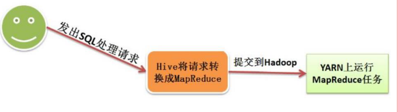

### 2.1.5 数据可视化

将分析所得数据结果进行数据可视化，一般通过图表进行展示。数据可视化可以帮你更容易的解释趋势和统计数据

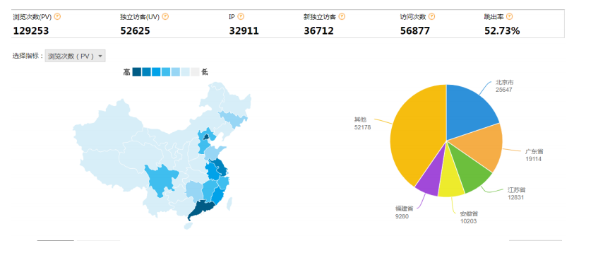

## 2.2 系统架构

相对于传统的 BI 数据处理，流程几乎差不多，但是因为是处理大数据，所以流程中各环节所使用的技术则跟传统 BI 完全不同：

- 数据采集：页面埋点 JavaScript 采集；开源框架 Apache Flume
- 数据预处理： Hadoop MapReduce 程序
- 数据仓库技术：基于 Hadoop 的数据仓库 Hive
- 数据导出：基于 Hadoop 的 sqoop 数据导入导出工具
- 数据可视化：定制开发 web 程序(echarts)
- 整个过程的流程调度：Hadoop 生态圈中的 Azkaban 工具

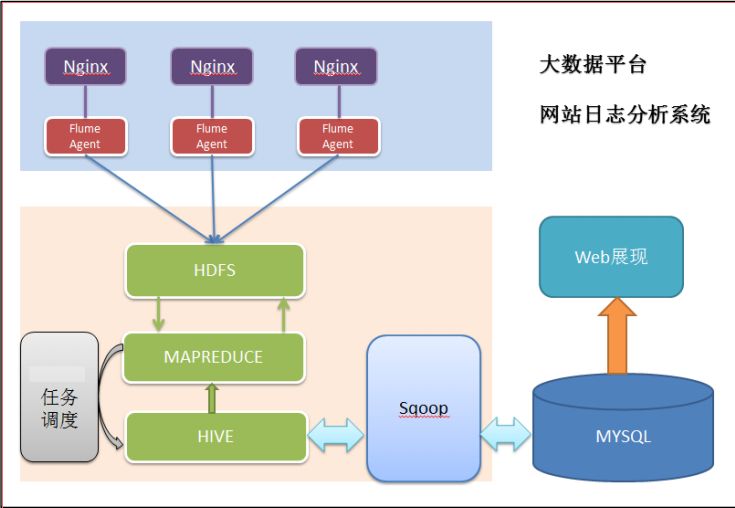

# 3. 模块开发-数据采集

## 3.1 网站流量日志数据获取

随着网站在技术和运营上的不断技术发展，人们对数据的要求越来越高，以求实现更加精细的运营来提升网站的质量。所以数据的获取方式也随着网站技术的进步和人们对网站数据需求的加深而不断地发展。从使用发展来看，主要分为2 类：**网站日志文件（Log files）和页面埋点 js 自定义采集**。 

### 3.1.1 网站日志文件

记录网站日志文件的方式是最原始的数据获取方式，主要在服务端完成，在网站的应用服务器配置相应的写日志的功能就能够实现，很多 web 应用服务器自带日志的记录功能。如 Nginx 的 access.log 日志等。

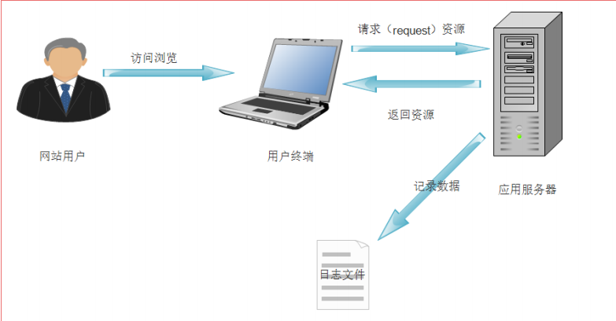

优点是获取数据时不需要对页面做相关处理，可以直接开始统计相关请求信息，缺点在于有些信息无法采集，比如用户在页面端的操作（如点击、ajax 的使用等）无法记录。限制了一些指标的统计和计算。

### 3.1.2 页面埋点JS自定义采集

自定义采集用户行为数据，通过在页面嵌入自定义的 JavaScript 代码来获取用户的访问行为（比如鼠标悬停的位置，点击的页面组件等），然后通过 ajax 请求到后台记录日志，这种方式所能采集的信息会更加全面。

在实际操作中，有以下几个方面的数据可以自定义的采集：

- 系统特征：比如所采用的操作系统、浏览器、域名和访问速度等。
- 访问特征：包括点击的 URL、所点击的“页面标签`<a>`”及标签的属性等。
- 来源特征：包括来访 URL，来访 IP 等。
- 产品特征：包括所访问的产品编号、产品类别、产品颜色、产品价格、产品利润、产品数量和特价等级等。

以某电商网站为例，当用户点击相关产品页面时，其自定义采集系统就会收集相关的行为数据，发到后端的服务器，收集的数据日志格式如下：

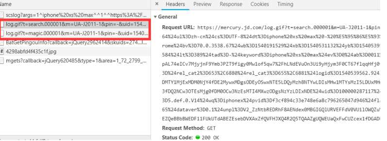

```
https://mercury.jd.com/log.gif?t=search.000001&m=UA-J2011-1&pin=-&uid=15401915286171416477093&sid=15401915286171416477093|5&v=je=0$sc=24-bit$sr=1536x864$ul=zh-cn$cs=UTF-8$dt=iphone xs max - 商 品 搜 索 - 京 东 $hn=search.jd.com$fl=-$os=win$br=chrome$bv=70.0.3538.67$wb=1540191529$xb=1540531132$yb=1540539558$zb=5$cb=2$usc=baidu$ucp=-$umd=organic$uct=not set$ct=1540539573584$lt=389$tad=-$keyword=iphone xs max$ev=0$ab=0011$mtest=group_base,ext_attr_fliter,qpv3,qpt9,qpz7$rel_ver=V0700$sig=80It1J9QZbpAL74eICv7MjyjnF9YmbJPZT9figy0Mw1of5qw7/hLNdEVuOn3Ui9yHjym3F0CT67flqqHfj0fyI08i8pf8Asn+7thpEDDaJZjrwK/gHpYwQNN2MK6q/GuOZfL8VOsvbLDGo3rpj+R1jMIO4n5hg0Kv6yrwrFLlSA=$rel_cat2=653,6880$rel_cat3=655,6881$logid=1540539562.92430$loc=1-72-2799
```

# 4. 数据采集之JS自定义采集

## 4.1 原理分析

首先，用户的行为会触发浏览器对被统计页面的一个 http 请求，比如打开某网页。当网页被打开，页面中的埋点 JavaScript 代码会被执行。

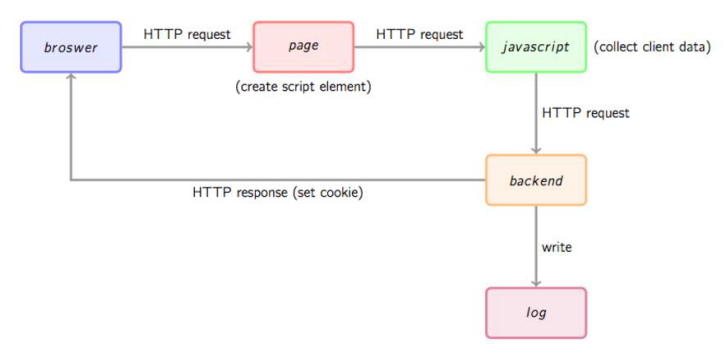

**埋点是指：**在网页中预先加入小段 JavaScript 代码，这个代码片段一般会动态创建一个 script 标签，并将 src 属性指向一个单独的 js 文件，此时这个单独的 js 文件（图中绿色节点）会被浏览器请求到并执行，这个 js 往往就是真正的数据收集脚本。

数据收集完成后，js 会请求一个后端的数据收集脚本（图中的 backend），这个脚本一般是一个伪装成图片的动态脚本程序，js 会将收集到的数据通过http 参数的方式传递给后端脚本，后端脚本解析参数并按固定格式记录到访问日志，同时可能会在 http 响应中给客户端种植一些用于追踪的 cookie。

## 4.2 设计实现

### 4.2.1 确定收集信息


| 名称       | 途径       | 备注                         |
| ---------- | ---------- | ---------------------------- |
| 访问时间   | web server | Nginx $msec                  |
| IP         | web server | Nginx $remote_addr           |
| 域名       | JavaScript | document.domain              |
| URL        | JavaScript | document.URL                 |
| 页面标题   | JavaScript | document.title               |
| 分辨率     | JavaScript | window.screen.height & width |
| 颜色深度   | JavaScript | window.screen.colorDepth     |
| Referrer   | JavaScript | document.referrer            |
| 浏览客户端 | web server | Nginx $http_user_agent       |
| 客户端语言 | JavaScript | navigator.language           |
| 访客标识   | cookie     | Nginx $http_cookie           |
| 网站标识   | JavaScript | 自定义对象                   |
| 状态码     | web server | Nginx $status                |
| 发送内容量 | web server | Nginx $body_bytes_sent       |

### 4.2.2 确定埋点代码

埋点，是网站分析的一种常用的数据采集方法。核心就是在需要进行数据采集的关键点植入统计代码，进行数据的采集。比如以谷歌分析原型来说，需要在页面中插入一段它提供的 JavaScript 片段，这个片段往往被称为埋点代码。

```javascript
<script type="text/javascript">
    var _maq = _maq || [];
    _maq.push(['_setAccount', 'UA-XXXXX-X']);
    (function() {
        var ma = document.createElement('script'); ma.type ='text/javascript'; ma.async = true;
        ma.src = 'xxxxx/ma.js';
        var s = document.getElementsByTagName('script')[0];
        s.parentNode.insertBefore(ma, s);
    })();
</script>
```

说明：

其中`_maq` 是全局数组，用于放置各种配置，其中每一条配置的格式为：

```
_maq.push(['Action', 'param1', 'param2', ...]
```

`_maq`的机制不是重点，重点是后面匿名函数的代码，这段代码的主要目的就是引入一个外部的 js 文件（ma.js），方式是通过` document.createElement `方法创建一个 script 并根据协议（http 或 https）将 src 指向对应的 ma.js，最后将这个元素插入页面的 Dom 树上

注意 `ma.async = true `的意思是异步调用外部 js 文件，即不阻塞浏览器的解析，待外部 js 下载完成后异步执行。这个属性是 HTML5 新引入的。

**扩展知识：JS自调用匿名函数**

格式：` (function(){})();`

第一对括号向脚本返回未命名的函数；后一对空括号立即执行返回的未命名函数，括号内为匿名函数的参数。

自调用匿名函数的好处是，避免重名，自调用匿名函数只会在运行时执行一次，一般用于初始化。

### 4.2.3 前端数据收集脚本

数据收集脚本（ma.js）被请求后会被执行，一般要做如下几件事：

1. 通过浏览器内置JavaScript对象收集信息，如页面title（通过`document.title`）、referrer（上一跳 URL，通过`document.referrer`）、用户显示器分辨率（通过`windows.screen`）、cookie 信息（通过 `document.cookie`）等等一些信息。
2. 解析`_maq `数组，收集配置信息。这里面可能会包括用户自定义的事件跟踪、业务数据（如电子商务网站的商品编号等）等。
3. 将上面两步收集的数据按预定义格式解析并拼接（get 请求参数）。
4. 请求一个后端脚本，将信息放在 http request 参数中携带给后端脚本

这里唯一的问题是步骤 4，JavaScript 请求后端脚本常用的方法是 ajax，但是**ajax 是不能跨域请求的**。一种**通用的方法是 js 脚本创建一个 Image 对象，将 Image对象的 src 属性指向后端脚本并携带参数，此时即实现了跨域请求后端**。这也是后端脚本为什么通常伪装成 gif 文件的原因。

示例代码：

整个脚本放在匿名函数里，确保不会污染全局

```javascript
(function () {
    var params = {};
    //Document对象数据
    if(document) {
        params.domain = document.domain || ''; 
        params.url = document.URL || ''; 
        params.title = document.title || ''; 
        params.referrer = document.referrer || ''; 
    }   
    //Window对象数据
    if(window && window.screen) {
        params.sh = window.screen.height || 0;
        params.sw = window.screen.width || 0;
        params.cd = window.screen.colorDepth || 0;
    }   
    //navigator对象数据
    if(navigator) {
        params.lang = navigator.language || ''; 
    }   
    //解析_maq配置
    if(_maq) {
        for(var i in _maq) {
            switch(_maq[i][0]) {
                case 'type':
                    params.account = _maq[i][1];
                    break;
                default:
                    break;
            }   
        }   
    }   
    //拼接参数串
    var args = ''; 
    for(var i in params) {
        if(args != '') {
            args += '&';
        }   
        args += i + '=' + encodeURIComponent(params[i]);
    }   
 
    //通过Image对象请求后端脚本
    var img = new Image(1, 1); 
    img.src = 'http://xxx.xxx.xxx.xxx/log.gif?' + args;
})();

```

### 4.2.4 后端脚本

log.gif 是一个伪装成 gif 图片的脚本。一般需要完成以下几件事情：

1. 解析 http 请求参数得到信息。
2. 从 Web 服务器中获取一些客户端无法获取的信息，如访客 ip 等。
3. 将信息按格式写入 log。
4. 生成一副 1×1 的空 gif 图片作为响应内容并将响应头的 Content-type设为 image/gif。
5. 在响应头中通过 Set-cookie 设置一些需要的 cookie 信息。

之所以要设置 cookie 是因为如果要跟踪唯一访客，通常做法是如果在请求时发现客户端没有指定的跟踪 cookie，则根据规则生成一个全局唯一的 cookie 并种植给用户，否则 Set-cookie 中放置获取到的跟踪 cookie 以保持同一用户 cookie不变。这种做法虽然不是完美的（例如用户清掉 cookie 或更换浏览器会被认为是两个用户），但是目前被广泛使用的手段。

我们**使用 nginx 的 access_log 做日志收集**，不过有个问题就是 nginx 配置本身的逻辑表达能力有限，所以选用 OpenResty 做这个事情。

**OpenResty** 是一个基于 Nginx 扩展出的高性能应用开发平台，内部集成了诸多有用的模块，其中的核心是通过 ngx_lua 模块集成了 Lua，从而在 nginx 配置文件中可以通过 Lua 来表述业务。

Lua 是一种轻量小巧的脚本语言，用标准 C 语言编写并以源代码形式开放，其设计目的是为了嵌入应用程序中，从而为应用程序提供灵活的扩展和定制功能。

首先，需要在 nginx 的配置文件中定义日志格式：

```shell
log_format tick 
"$msec||$remote_addr||$status||$body_bytes_sent||$u_domain||$u_url||$u_title||$u_referrer||$u_sh||$u_sw||$u_cd||$u_lang||$http_user_agent||$u_account";
```

注意这里以 u_开头的是我们待会会自己定义的变量，其它的是 nginx 内置变量。然后是核心的两个 location：

```nginx
########### 每个指令必须有分号结束。#################
worker_processes  2; #允许生成的进程数，默认为1

events {
    worker_connections  1024;  #最大连接数，默认为512
}


http {
    include       mime.types;
    default_type  application/octet-stream;

	#log_format  main  '$remote_addr - $remote_user [$time_local] "$request" '               #设置日志格式
    #                  '$status $body_bytes_sent "$http_referer" '
    #                  '"$http_user_agent" "$http_x_forwarded_for"';
    #access_log  logs/access.log  main;       #指定日志文件的存放路径、格式和缓存大小  access_log off 表示取消服务日志   
	
    log_format tick "$msec||$remote_addr||$u_domain||$u_url||$u_title||$u_referrer||$u_sh||$u_sw||$u_cd||$u_lang||$http_user_agent||$u_utrace||$u_account";
    
    access_log  logs/access.log  tick;

    sendfile        on;     #允许sendfile方式传输文件，默认为off

    keepalive_timeout  65;  #连接超时时间，默认为75s

    server {
        listen       80;   #监听端口
        server_name  localhost;   #监听地址
		location /log.gif {
			#伪装成gif文件
			default_type image/gif;    
			#本身关闭access_log，通过subrequest记录log
			access_log off;
		
			access_by_lua "
				-- 用户跟踪cookie名为__utrace
				local uid = ngx.var.cookie___utrace        
				if not uid then
					-- 如果没有则生成一个跟踪cookie，算法为md5(时间戳+IP+客户端信息)
					uid = ngx.md5(ngx.now() .. ngx.var.remote_addr .. ngx.var.http_user_agent)
				end 
				ngx.header['Set-Cookie'] = {'__utrace=' .. uid .. '; path=/'}
				if ngx.var.arg_domain then
				-- 通过subrequest到/i-log记录日志，将参数和用户跟踪cookie带过去
					ngx.location.capture('/i-log?' .. ngx.var.args .. '&utrace=' .. uid)
				end 
			";  
		
			#此请求不缓存
			add_header Expires "Fri, 01 Jan 1980 00:00:00 GMT";
			add_header Pragma "no-cache";
			add_header Cache-Control "no-cache, max-age=0, must-revalidate";
		
			#返回一个1×1的空gif图片
			empty_gif;
		}   
	
		location /i-log {
			#内部location，不允许外部直接访问
			internal;
		
			#设置变量，注意需要unescape
			set_unescape_uri $u_domain $arg_domain;
			set_unescape_uri $u_url $arg_url;
			set_unescape_uri $u_title $arg_title;
			set_unescape_uri $u_referrer $arg_referrer;
			set_unescape_uri $u_sh $arg_sh;
			set_unescape_uri $u_sw $arg_sw;
			set_unescape_uri $u_cd $arg_cd;
			set_unescape_uri $u_lang $arg_lang;
			set_unescape_uri $u_utrace $arg_utrace;
			set_unescape_uri $u_account $arg_account;
		
			#打开日志
			log_subrequest on;
			#记录日志到track.log，实际应用中最好加buffer，格式为tick
			access_log /var/nginx_logs/track.log tick;
		
			#输出空字符串
			echo '';
		}	
	
    }
}

```

要完全掌握这段脚本的每一个细节还是比较吃力的，用到了诸多第三方 nginx模块（全都包含在 OpenResty 中了），重点都用注释标出来，可以不用完全理解每一行的意义，只要大约知道这个配置完成了我们提到的后端逻辑就可以了。

### 4.5.5 日志格式

日志格式主要考虑日志分隔符，一般会有以下几种选择：

固定数量的字符、制表符分隔符、空格分隔符、其他一个或多个字符、特定的开始和结束文本。

### 4.5.6 日志切分

日志收集系统访问日志时间一长文件变得很大，而且日志放在一个文件不便于管理。通常要按时间段将日志切分，例如每天或每小时切分一个日志。通过crontab 定时调用一个 shell 脚本实现，如下：

```shell
nginx_path_prefix=/usr/local/nginx
time=`date +%Y%m%d%H`
mv ${nginx_path_prefix}/logs/user_defined.log ${nginx_path_prefix}/logs/user_defined-${time}.log
kill -USR1 `cat ${nginx_path_prefix}/logs/nginx.pid`
```

这个脚本将 user_defined.log 移动重命名为 user_defined-${time}.log，然后向 nginx 发送 USR1 信号令其重新打开日志文件。

USR1 通常被用来告知应用程序重载配置文件, 向服务器发送一个 USR1 信号将导致以下步骤的发生：停止接受新的连接，等待当前连接停止，重新载入配置文件，重新打开日志文件，重启服务器，从而实现相对平滑的不关机的更改。

`cat ${nginxpathprefix}/logs/nginx.pid` 取 nginx 的进

然后再/etc/crontab 里加入一行：

`59 * * * * root /path/to/directory/rotatelog.sh`

在每个小时的 59 分启动这个脚本进行日志轮转操作.

## 4.3 系统环境部署

1. 服务器中安装依赖

   ```
   yum -y install gcc perl pcre-devel openssl openssl-dev
   ```

2. 上传 LuaJIT-2.0.4.tar.gz 并安装 LuaJ

   ```shell
   tar -zxvf LuaJIT-2.0.4.tar.gz -C /usr/local/src/
   cd /usr/local/src/LuaJIT-2.0.4/ # 未经过编译的安装包是无法使用的
   make && make install PREFIX=/usr/local/luaj # 注意：编译的路径才是真正安装的路径
   ```

3. 设置 LuaJIT 环境变量

   ```
   vi /etc/profile
   export LUAJIT_LIB=/usr/local/luajit/lib
   export LUAJIT_INC=/usr/local/luajit/include/luajit-2.0
   source /etc/profile
   ```

4. 创建 modules 文件夹，保存 nginx 依赖的模块

   ```
   mkdir -p /usr/local/nginx/modules
   ```

5. 上传 nginx 依赖的模块

   ```
   set-misc-nginx-module-0.29.tar.gz 
   lua-nginx-module-0.10.0.tar.gz
   ngx_devel_kit-0.2.19.tar.gz
   echo-nginx-module-0.58.tar.gz
   ```

6. 将依赖的模块直接解压到 modules 目录

   ```
   tar -zxvf lua-nginx-module-0.10.0.tar.gz -C /usr/local/nginx/modules/
   tar -zxvf set-misc-nginx-module-0.29.tar.gz -C /usr/local/nginx/modules/
   tar -zxvf ngx_devel_kit-0.2.19.tar.gz -C /usr/local/nginx/modules/
   tar -zxvf echo-nginx-module-0.58.tar.gz -C /usr/local/nginx/modules/
   ```

7. 安装  openresty

   ```
   tar -zxvf openresty-1.9.7.3.tar.gz -C /usr/local/src/
   cd /usr/local/src/openresty-1.9.7.3/
   ./configure --prefix=/usr/local/openresty --with-luajit && make && make install
   ```

8. 安装 nginx

   ```
   tar -zxvf nginx-1.8.1.tar.gz -C /usr/local/src/
   ```

   注：安装nginx后，会出现中文乱码问题

   解决方法：修改源码文件`src/http/modules/ngx_http_log_module.c`

   将这个文件替换为准备好的文件即可，然后在进行下一步操作即可

9. 编译 nginx 并支持其他模块

   ```
   cd /usr/local/src/nginx-1.8.1/
   ./configure --prefix=/usr/local/nginx \
    --with-ld-opt="-Wl,-rpath,/usr/local/luajit/lib" \
    --add-module=/usr/local/nginx/modules/ngx_devel_kit-0.2.19 \
    --add-module=/usr/local/nginx/modules/lua-nginx-module-0.10.0 \
    --add-module=/usr/local/nginx/modules/set-misc-nginx-module-0.29 \
    --add-module=/usr/local/nginx/modules/echo-nginx-module-0.58 
   make -j2
   make install
   ```

备注：如果对 Linux 相关操作不熟，请严格按照上述步骤搭建环境，切记心细，心细，再心细

## 4.4 自定义采集数据实现

注意点：每个文件中指向服务器的IP地址，需要按照自己的服务器进行配置

### 4.4.1 方案1：基本功能实现

1. 创建页面 index.html，添加埋点代码，放入 nginx 默认目录 nginx/html 下。

   ```html
   <!DOCTYPE html>
   <html>
   	<head>
   		<meta charset="UTF-8">
   		<title>welcom to itheima</title>	
   	
   		<script type="text/javascript">
   		var _maq = _maq || [];
   		_maq.push(['_setAccount', 'AllenWoon']);
   	 
   		(function() {
   			var ma = document.createElement('script'); 
   			ma.type = 'text/javascript';
   			ma.async = true;
   			ma.src = 'http://192.168.227.153/ma.js';
   			var s = document.getElementsByTagName('script')[0]; 
   			s.parentNode.insertBefore(ma, s);
   		})();
   		</script>
   		
   				
   	</head>
   	<body>
   		<h1 align="center">黑马程序员--云计算大数据</h1>
   		
   	</body>
   </html>
   
   ```

2. 在默认目录 nginx/html 下添加一个数据采集脚本 ma.js

   ```javascript
   (function () {
       var params = {};
       //Document对象数据
       if(document) {
           params.domain = document.domain || ''; 
           params.url = document.URL || ''; 
           params.title = document.title || ''; 
           params.referrer = document.referrer || ''; 
       }   
       //Window对象数据
       if(window && window.screen) {
           params.sh = window.screen.height || 0;
           params.sw = window.screen.width || 0;
           params.cd = window.screen.colorDepth || 0;
       }   
       //navigator对象数据
       if(navigator) {
           params.lang = navigator.language || ''; 
       }   
       //解析_maq配置
       if(_maq) {
           for(var i in _maq) {
               switch(_maq[i][0]) {
                   case '_setAccount':
                       params.account = _maq[i][1];
                       break;
                   default:
                       break;
               }   
           }   
       }   
       //拼接参数串
       var args = ''; 
       for(var i in params) {
           if(args != '') {
               args += '&';
           }   
           args += i + '=' + encodeURIComponent(params[i]);
       }   
    
       //通过Image对象请求后端脚本
       var img = new Image(1, 1); 
       img.src = 'http://192.168.227.153/log.gif?' + args;
   })();
   
   ```

3. 修改 nginx 的配置文件，添加自定义相关业务逻辑。

   修改nginx.conf配置文件，也可以直接将源文件覆盖

   ```shell
   worker_processes  2;
   
   events {
       worker_connections  1024;
   }
   
   
   http {
       include       mime.types;
       default_type  application/octet-stream;
   
   	log_format  main  '$remote_addr - $remote_user [$time_local] "$request" '
                         '$status $body_bytes_sent "$http_referer" '
                         '"$http_user_agent" "$http_x_forwarded_for"';
   					  
       log_format user_log_format "$msec||$remote_addr||$status||$body_bytes_sent||$u_domain||$u_url||$u_title||$u_referrer||$u_sh||$u_sw||$u_cd||$u_lang||$http_user_agent||$u_account";
       
       sendfile        on;  #允许sendfile方式传输文件，默认为off
   
       keepalive_timeout  65; #连接超时时间，默认为75s
   
       server {
           listen       80;
           server_name  localhost;
   		location /log.gif {
   			#伪装成gif文件
   			default_type image/gif;    
   			#nginx本身记录的access_log，日志格式为main
   			access_log  logs/access.log  main;
   		
   			access_by_lua "
   				-- 用户跟踪cookie名为__utrace
   				local uid = ngx.var.cookie___utrace        
   				if not uid then
   					-- 如果没有则生成一个跟踪cookie，算法为md5(时间戳+IP+客户端信息)
   					uid = ngx.md5(ngx.now() .. ngx.var.remote_addr .. ngx.var.http_user_agent)
   				end 
   				ngx.header['Set-Cookie'] = {'__utrace=' .. uid .. '; path=/'}
   				if ngx.var.arg_domain then
   				-- 通过subrequest到/i-log记录日志，将参数和用户跟踪cookie带过去
   					ngx.location.capture('/i-log?' .. ngx.var.args .. '&utrace=' .. uid)
   				end 
   			";  
   		
   			#此请求资源本地不缓存
   			add_header Expires "Fri, 01 Jan 1980 00:00:00 GMT";
   			add_header Pragma "no-cache";
   			add_header Cache-Control "no-cache, max-age=0, must-revalidate";
   		
   			#返回一个1×1的空gif图片
   			empty_gif;
   		}   
   	
   		location /i-log {
   			#内部location，不允许外部直接访问
   			internal;
   		
   			#设置变量，注意需要unescape
   			set_unescape_uri $u_domain $arg_domain;
   			set_unescape_uri $u_url $arg_url;
   			set_unescape_uri $u_title $arg_title;
   			set_unescape_uri $u_referrer $arg_referrer;
   			set_unescape_uri $u_sh $arg_sh;
   			set_unescape_uri $u_sw $arg_sw;
   			set_unescape_uri $u_cd $arg_cd;
   			set_unescape_uri $u_lang $arg_lang;
   			set_unescape_uri $u_account $arg_account;
   
   		
   			#打开subrequest（子请求）日志
   			log_subrequest on;
   			#自定义采集的日志，记录数据到user_defined.log
   			access_log logs/user_defined.log user_log_format;
   		
   			#输出空字符串
   			echo '';
   		}	
   	
       }
   }
   
   ```

4. 启动 nginx

   ```
   sbin/nginx -c conf/nginx.conf 
   ```

5. 通过游览器访问 nginx

6. 观察自定义日志采集文件是否有对应的内容输出

   ```shell
   tail -f logs/user_defined.log
   # 此时还可以观察 nginx 默认的输出日志文件
   tail -f logs/access.log
   # 停止 nginx:
   sbin/nginx –s stop
   ```

### 4.4.2 方案2：页面点击事件

说明：页面点击事件具体操作步骤和基本功能实现基本相同，唯一不同的是，方案1数据采集发生才访问页面时，而方案2数据采集发生在点击时

1. 创建页面 index.html，page1.html，page2.html 添加埋点代码，放入 nginx 默认目录 nginx/html 下。

   index.html

   ```html
   <!DOCTYPE html>
   <html>
   	<head>
   		<meta charset="UTF-8">
   		<title>welcom to itheima</title>
   		<script src="/jquery-3.2.1.min.js">
   		</script>
   				 
   		<script type="text/javascript">
   		 var _maq = _maq || [];
   		 _maq.push(['_setAccount', 'AllenWoon']);
   		
   		 $(function(){
   		 $("a").click(function(){
   				var clstag = $(this).attr("clstag");
   				var _a_value = $(this).text();
   				_maq.push(['_a_value',_a_value]);
   				 clstag = clstag.split('|');
   				for (i in clstag){ 
   					_maq.push(['type'+i, clstag[i]]);
   					}
   					sendRequest();
   				})
   		});
   
   		function sendRequest(){
   				var ma = document.createElement('script'); 
   				ma.type = 'text/javascript';
   				ma.async = true;
   				ma.src = 'http://192.168.227.153/ma.js';
   				var s = document.getElementsByTagName('script')[0]; 
   				s.parentNode.insertBefore(ma, s);
   		}
   		</script>
   		
   	</head>
   	<body>
   		<h1 align="center">黑马程序员--云计算大数据</h1>
   		<a href="http://192.168.227.151/page1.html" target="_blank" clstag="click|index|page1">这是点击1</a><br/>
   		
   		<a href="http://192.168.227.151/page2.html" target="_blank" clstag="click|index|page2">这是点击2</a>
   	</body>
   </html>
   
   
   ```

   page1.html

   ```html
   <!DOCTYPE html>
   <html>
   	<head>
   		<meta charset="UTF-8">
   		<title>page1</title>	
   	
   		<script type="text/javascript">
   		var _maq = _maq || [];
   		_maq.push(['_setAccount', 'AllenWoon']);
   	 
   		(function() {
   			var ma = document.createElement('script'); 
   			ma.type = 'text/javascript';
   			ma.async = true;
   			ma.src = 'http://192.168.227.153/ma.js';
   			var s = document.getElementsByTagName('script')[0]; 
   			s.parentNode.insertBefore(ma, s);
   		})();
   		</script>
   		
   				
   	</head>
   	<body>
   		<h1 align="center">黑马程序员--云计算大数据</h1>
   		<h1 align="center">Page 1</h1>
   	</body>
   </html>
   
   
   ```

   page2.html

   ```html
   <!DOCTYPE html>
   <html>
   	<head>
   		<meta charset="UTF-8">
   		<title>page2</title>	
   	
   		<script type="text/javascript">
   		var _maq = _maq || [];
   		_maq.push(['_setAccount', 'AllenWoon']);
   	 
   		(function() {
   			var ma = document.createElement('script'); 
   			ma.type = 'text/javascript';
   			ma.async = true;
   			ma.src = 'http://192.168.227.153/ma.js';
   			var s = document.getElementsByTagName('script')[0]; 
   			s.parentNode.insertBefore(ma, s);
   		})();
   		</script>
   		
   				
   	</head>
   	<body>
   		<h1 align="center">黑马程序员--云计算大数据</h1>
   		<h1 align="center">page 2</h1>
   	</body>
   </html>
   
   
   ```

2. 在默认目录 nginx/html 下添加一个数据采集脚本 ma.js

   ```js
   (function () {
       var params = {};
       //Document对象数据
       if(document) {
           params.domain = document.domain || ''; 
           params.url = document.URL || ''; 
           params.title = document.title || ''; 
           params.referrer = document.referrer || ''; 
       }   
       //Window对象数据
       if(window && window.screen) {
           params.sh = window.screen.height || 0;
           params.sw = window.screen.width || 0;
           params.cd = window.screen.colorDepth || 0;
       }   
       //navigator对象数据
       if(navigator) {
           params.lang = navigator.language || ''; 
       }   
       //解析_maq配置
       if(_maq) {
           for(var i in _maq) {
               switch(_maq[i][0]) {
                   case '_setAccount':
                       params.account = _maq[i][1];
                       break;
   				case '_a_value':
                       params.avalue = _maq[i][1];
                       break;
   				case 'type0':
                       params.type0 = _maq[i][1];
                       break;
   				case 'type1':
                       params.type1 = _maq[i][1];
                       break;
   				case 'type2':
                       params.type2 = _maq[i][1];
                       break;
                   default:
                       break;
               }   
           }   
       }   
       //拼接参数串
       var args = ''; 
       for(var i in params) {
           if(args != '') {
               args += '&';
           }   
           args += i + '=' + encodeURIComponent(params[i]);
       }   
    
       //通过Image对象请求后端脚本
       var img = new Image(1, 1); 
       img.src = 'http://192.168.227.153/log.gif?' + args;
   })();
   
   ```

3. 修改 nginx 的配置文件，添加自定义相关业务逻辑。

   修改nginx.conf配置文件，也可以直接将源文件覆盖

   ```shell
   worker_processes  2;
   
   events {
       worker_connections  1024;
   }
   
   
   http {
       include       mime.types;
       default_type  application/octet-stream;
   
   	log_format  main  '$remote_addr - $remote_user [$time_local] "$request" '
                         '$status $body_bytes_sent "$http_referer" '
                         '"$http_user_agent" "$http_x_forwarded_for"';
     	
       log_format user_log_format "$msec||$remote_addr||$status||$body_bytes_sent||$u_domain||$u_url||$u_title||$u_referrer||$u_sh||$u_sw||$u_cd||$u_lang||$http_user_agent||$u_account||$u_avalue||$u_type0||$u_type1||$u_type2";
       
       sendfile        on;
   
       keepalive_timeout  65;
   
       server {
           listen       80;
           server_name  localhost;
   		location /log.gif {
   			#伪装成gif文件
   			default_type image/gif;    
   			#nginx本身记录的access_log，日志格式为main
   			access_log  logs/access.log  main;
   		
   			access_by_lua "
   				-- 用户跟踪cookie名为__utrace
   				local uid = ngx.var.cookie___utrace        
   				if not uid then
   					-- 如果没有则生成一个跟踪cookie，算法为md5(时间戳+IP+客户端信息)
   					uid = ngx.md5(ngx.now() .. ngx.var.remote_addr .. ngx.var.http_user_agent)
   				end 
   				ngx.header['Set-Cookie'] = {'__utrace=' .. uid .. '; path=/'}
   				if ngx.var.arg_domain then
   				-- 通过subrequest到/i-log记录日志，将参数和用户跟踪cookie带过去
   					ngx.location.capture('/i-log?' .. ngx.var.args .. '&utrace=' .. uid)
   				end 
   			";  
   		
   			#此请求不缓存
   			add_header Expires "Fri, 01 Jan 1980 00:00:00 GMT";
   			add_header Pragma "no-cache";
   			add_header Cache-Control "no-cache, max-age=0, must-revalidate";
   		
   			#返回一个1×1的空gif图片
   			empty_gif;
   		}   
   	
   		location /i-log {
   			#内部location，不允许外部直接访问
   			internal;
   		
   			#设置变量，注意需要unescape
   			set_unescape_uri $u_domain $arg_domain;
   			set_unescape_uri $u_url $arg_url;
   			set_unescape_uri $u_title $arg_title;
   			set_unescape_uri $u_referrer $arg_referrer;
   			set_unescape_uri $u_sh $arg_sh;
   			set_unescape_uri $u_sw $arg_sw;
   			set_unescape_uri $u_cd $arg_cd;
   			set_unescape_uri $u_lang $arg_lang;
   			set_unescape_uri $u_account $arg_account;
   			set_unescape_uri $u_avalue $arg_avalue;
   			set_unescape_uri $u_type0 $arg_type0;
   			set_unescape_uri $u_type1 $arg_type1;
   			set_unescape_uri $u_type2 $arg_type2;
   		
   			#打开subrequest（子请求）日志
   			log_subrequest on;
   			#自定义采集的日志，记录数据到user_defined.log
   			access_log logs/user_defined.log user_log_format;
   		
   			#输出空字符串
   			echo '';
   		}	
   	
       }
   }
   
   ```

4. 启动 nginx

   ```
   sbin/nginx -c conf/nginx.conf 
   ```

5. 通过游览器访问 nginx

6. 观察自定义日志采集文件是否有对应的内容输出

   ```shell
   tail -f logs/user_defined.log
   # 此时还可以观察 nginx 默认的输出日志文件
   tail -f logs/access.log
   # 停止 nginx:
   sbin/nginx –s stop
   ```

