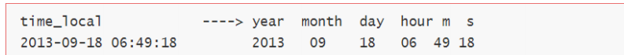

# 57-网站流量日志分析实战- 02

# 1.数据采集之Flume采集

在网站流量日志分析这种场景中，对数据采集部分的可靠性、容错能力要求通常不会非常严苛，需要注意的是结合语境明白是何种含义的数据采集。

对于数据从无到有的过程，可以使用 web 服务器自带的日志记录功能和自定义埋点 JavaScript 采集相结合的做法收集用户访问网站的行为数据。

对于数据需要做搬运的操作，可以使用 flume 定制相关的采集方案满足数据采集传输。

## 1.1 Taildir Source 组件

Flume 采集系统的搭建相对简单：

1. 在服务器上部署 agent 节点，修改配置文件
2. 启动 agent 节点，将采集到的数据汇聚到指定的 HDFS 目录中

针对 nginx 日志生成场景，如果通过 flume（1.6）收集，无论是 Spooling Directory Source 和 Exec Source 均不能满足动态实时收集的需求，在 flume1.7 版本之后，提供了一个非常好用的 TaildirSource，使用这个 source，可以监控一个目录，并且使用正则表达式匹配该目录中的文件名进行实时收集

核心配置如下：

```
a1.sources = r1
a1.sources.r1.type = TAILDIR
a1.sources.r1.channels = c1
a1.sources.r1.positionFile = /var/log/flume/taildir_position.json
a1.sources.r1.filegroups = f1 f2
a1.sources.r1.filegroups.f1 = /var/log/test1/example.log
a1.sources.r1.filegroups.f2 = /var/log/test2/.*log.*
```

- filegroups:指定 filegroups，可以有多个，以空格分隔；（Tail Source 可以同时监控tail 多个目录中的文件）
- positionFile:配置检查点文件的路径，检查点文件会以 json 格式保存已经 tail 文件的位置，解决了断点不能续传的缺陷。
- `filegroups.<filegroupName>`：配置每个 filegroup 的文件绝对路径，文件名可以用正则表达式匹配

通过以上配置，就可以监控文件内容的增加和文件的增加。产生和所配置的文件名正则
表达式不匹配的文件，则不会被 tail。

完整配置如下：

taildir_source_hdfs_sink.conf

```shell
# Name the components on this agent
a1.sources = r1
a1.sinks = k1
a1.channels = c1

# Describe/configure the source
a1.sources.r1.type = TAILDIR
a1.sources.r1.positionFile = /weblog/flume/taildir_position.json
a1.sources.r1.filegroups = f1 f2
a1.sources.r1.filegroups.f1 = /weblog/test1/example.log
a1.sources.r1.filegroups.f2 = /weblog/test2/.*log.*

# Describe the sink
a1.sinks.k1.type = hdfs
a1.sinks.k1.hdfs.path = /weblog/%y-%m-%d/%H-%M/
a1.sinks.k1.hdfs.filePrefix = itcast-  
a1.sinks.k1.hdfs.round = true
a1.sinks.k1.hdfs.roundValue = 10
a1.sinks.k1.hdfs.roundUnit = minute
# 控制文件进行滚动
a1.sinks.k1.hdfs.rollInterval = 0  # 时间间隔
a1.sinks.k1.hdfs.rollSize = 134217728  # 128M对应的字节数
a1.sinks.k1.hdfs.rollCount = 0 # event 数量

a1.sinks.k1.hdfs.idleTimeout = 20 # 基于文件空闲时间滚动 闲置超过20秒进行滚动

a1.sinks.k1.hdfs.batchSize = 1
a1.sinks.k1.hdfs.useLocalTimeStamp = true
#生成的文件类型，默认是Sequencefile，可用DataStream，则为普通文本
a1.sinks.k1.hdfs.fileType = DataStream

# Use a channel which buffers events in memory
a1.channels.c1.type = memory
a1.channels.c1.capacity = 1000
a1.channels.c1.transactionCapacity = 100

# Bind the source and sink to the channel
a1.sources.r1.channels = c1
a1.sinks.k1.channel = c1
```

使用以下命令启动flume进行采集

```shell
bin/flume-ng agent -c conf -f conf/taildir_source_hdfs_sink.conf -n a1 -Dflume.root.logger=INFO,console
```

然后将log文件复制到flume监控的目录下，就可以进行数据的采集工作

## 1.2 HDFS Sink 文件滚动属性

**基于文件闲置时间策略** 

- 配置项：hdfs.idleTimeout
- 默认值：0
- 说明：默认启动这个功能
- 这种策略很简单，如果文件在hdfs.idleTimeout秒的时间里都是闲置的，没有任何数据写入，那么当前文件关闭，滚动到下一个文件

**基于 hdfs 文件副本数**

- 配置项：hdfs.minBlockReplicas

- 默认值：和 hdfs 的副本数一致

- 原理：hdfs.minBlockReplicas 是为了让 flume 感知不到 hdfs 的块复制，这样滚动方式配置（比如时间间隔、文件大小、events 数量等）才不会受影响。

  假如 hdfs 的副本为 3.那么配置的滚动时间为 10 秒，那么在第二秒的时候，flume检测到 hdfs 在复制块，那么这时候 flume 就会滚动，这样导致 flume 的滚动方式受到影响。所以通常 hdfs.minBlockReplicas 配置为 1，就检测不到副本的复制了。但是hdfs 的副本还是 3

## 1.3 数据内容样例

数据样本：

```
58.215.204.118 - - [18/Sep/2018:06:51:35 +0000] "GET /wp-includes/js/jquery/jquery.js?ver=1.10.2 HTTP/1.1" 304 0 "http://blog.fens.me/nodejs-socketio-chat/" "Mozilla/5.0 (Windows NT 5.1; rv:23.0) Gecko/20100101 Firefox/23.0"
```

字段解析：

1. 访客 ip 地址： 58.215.204.118
2. 访客用户信息： - -
3. 请求时间：[18/Sep/2018:06:51:35 +0000]
4. 请求方式：GET
5. 请求的 url：/wp-includes/js/jquery/jquery.js?ver=1.10.2
6. 请求所用协议：HTTP/1.1
7. 响应码：304
8. 返回的数据流量：0
9. 访客的来源 url：http://blog.fens.me/nodejs-socketio-chat/
10. 访客所用浏览器：Mozilla/5.0 (Windows NT 5.1; rv:23.0) Gecko/20100101 
    Firefox/23.0

# 2. 模块开发-数据预处理

## 2.1 主要目的

- 过滤“不合规”数据，清洗无意义的数据
- 格式转换和规整
- 根据后续的统计需求，过滤分离出各种不同主题(不同栏目 path)的基础数据。


## 2.2 实现方式

**使用 MapReduce 程序对数据进行预处理。**

预处理过程中有些编程小技巧需要注意：

- 如果涉及多属性值数据传递 通常可建立与之对应的 javabean 携带数据传递注意要实现 Hadoop 序列化机制---writable 接口。
- 有意识的把 JavaBean 中 toString 方法重写，以\001 进行分割，方便后续数据入 hive 映射方便。
- 如涉及不符合本次分析的脏数据，往往采用逻辑删除，也就是自定义标记位，比如使用 1 或者 0 来表示数据是否有效，而不是直接物理删除。

WebLogBean.java

```java
package cn.itcast.hadoop.mr.weblog;

import org.apache.hadoop.io.Writable;

import java.io.DataInput;
import java.io.DataOutput;
import java.io.IOException;

/**
 * 对接外部数据的层，表结构定义最好跟外部数据源保持一致
 * 术语： 贴源表
 * @author
 *
 */
public class WebLogBean implements Writable {

	private boolean valid = true;// 判断数据是否合法
	private String remote_addr;// 记录客户端的ip地址
	private String remote_user;// 记录客户端用户名称,忽略属性"-"
	private String time_local;// 记录访问时间与时区
	private String request;// 记录请求的url与http协议
	private String status;// 记录请求状态；成功是200
	private String body_bytes_sent;// 记录发送给客户端文件主体内容大小
	private String http_referer;// 用来记录从那个页面链接访问过来的
	private String http_user_agent;// 记录客户浏览器的相关信息

	
	public void set(boolean valid,String remote_addr, String remote_user, String time_local, String request, String status, String body_bytes_sent, String http_referer, String http_user_agent) {
		this.valid = valid;
		this.remote_addr = remote_addr;
		this.remote_user = remote_user;
		this.time_local = time_local;
		this.request = request;
		this.status = status;
		this.body_bytes_sent = body_bytes_sent;
		this.http_referer = http_referer;
		this.http_user_agent = http_user_agent;
	}

	public String getRemote_addr() {
		return remote_addr;
	}

	public void setRemote_addr(String remote_addr) {
		this.remote_addr = remote_addr;
	}

	public String getRemote_user() {
		return remote_user;
	}

	public void setRemote_user(String remote_user) {
		this.remote_user = remote_user;
	}

	public String getTime_local() {
		return this.time_local;
	}

	public void setTime_local(String time_local) {
		this.time_local = time_local;
	}

	public String getRequest() {
		return request;
	}

	public void setRequest(String request) {
		this.request = request;
	}

	public String getStatus() {
		return status;
	}

	public void setStatus(String status) {
		this.status = status;
	}

	public String getBody_bytes_sent() {
		return body_bytes_sent;
	}

	public void setBody_bytes_sent(String body_bytes_sent) {
		this.body_bytes_sent = body_bytes_sent;
	}

	public String getHttp_referer() {
		return http_referer;
	}

	public void setHttp_referer(String http_referer) {
		this.http_referer = http_referer;
	}

	public String getHttp_user_agent() {
		return http_user_agent;
	}

	public void setHttp_user_agent(String http_user_agent) {
		this.http_user_agent = http_user_agent;
	}

	public boolean isValid() {
		return valid;
	}

	public void setValid(boolean valid) {
		this.valid = valid;
	}

	@Override
	public String toString() {
		StringBuilder sb = new StringBuilder();
		sb.append(this.valid);
		sb.append("\001").append(this.getRemote_addr());
		sb.append("\001").append(this.getRemote_user());
		sb.append("\001").append(this.getTime_local());
		sb.append("\001").append(this.getRequest());
		sb.append("\001").append(this.getStatus());
		sb.append("\001").append(this.getBody_bytes_sent());
		sb.append("\001").append(this.getHttp_referer());
		sb.append("\001").append(this.getHttp_user_agent());
		return sb.toString();
	}

	@Override
	public void readFields(DataInput in) throws IOException {
		this.valid = in.readBoolean();
		this.remote_addr = in.readUTF();
		this.remote_user = in.readUTF();
		this.time_local = in.readUTF();
		this.request = in.readUTF();
		this.status = in.readUTF();
		this.body_bytes_sent = in.readUTF();
		this.http_referer = in.readUTF();
		this.http_user_agent = in.readUTF();

	}

	@Override
	public void write(DataOutput out) throws IOException {
		out.writeBoolean(this.valid);
		out.writeUTF(null==remote_addr?"":remote_addr);
		out.writeUTF(null==remote_user?"":remote_user);
		out.writeUTF(null==time_local?"":time_local);
		out.writeUTF(null==request?"":request);
		out.writeUTF(null==status?"":status);
		out.writeUTF(null==body_bytes_sent?"":body_bytes_sent);
		out.writeUTF(null==http_referer?"":http_referer);
		out.writeUTF(null==http_user_agent?"":http_user_agent);

	}

}

```

WebLogParser.java

```java
package cn.itcast.hadoop.mr.weblog;

import java.text.ParseException;
import java.text.SimpleDateFormat;
import java.util.Locale;
import java.util.Set;

public class WebLogParser {

	public static SimpleDateFormat df1 = new SimpleDateFormat("dd/MMM/yyyy:HH:mm:ss", Locale.US);
	public static SimpleDateFormat df2 = new SimpleDateFormat("yyyy-MM-dd HH:mm:ss", Locale.US);

	public static WebLogBean parser(String line) {
		WebLogBean webLogBean = new WebLogBean();
		String[] arr = line.split(" ");
		if (arr.length > 11) {
			webLogBean.setRemote_addr(arr[0]);
			webLogBean.setRemote_user(arr[1]);
			String time_local = formatDate(arr[3].substring(1));
			if(null==time_local || "".equals(time_local)) time_local="-invalid_time-";
			webLogBean.setTime_local(time_local);
			webLogBean.setRequest(arr[6]);
			webLogBean.setStatus(arr[8]);
			webLogBean.setBody_bytes_sent(arr[9]);
			webLogBean.setHttp_referer(arr[10]);

			//如果useragent元素较多，拼接useragent
			if (arr.length > 12) {
				StringBuilder sb = new StringBuilder();
				for(int i=11;i<arr.length;i++){
					sb.append(arr[i]);
				}
				webLogBean.setHttp_user_agent(sb.toString());
			} else {
				webLogBean.setHttp_user_agent(arr[11]);
			}

			if (Integer.parseInt(webLogBean.getStatus()) >= 400) {// 大于400，HTTP错误
				webLogBean.setValid(false);
			}
			
			if("-invalid_time-".equals(webLogBean.getTime_local())){
				webLogBean.setValid(false);
			}
		} else {
			webLogBean=null;
		}

		return webLogBean;
	}

	public static void filtStaticResource(WebLogBean bean, Set<String> pages) {
		if (!pages.contains(bean.getRequest())) {
			bean.setValid(false);
		}
	}
        //格式化时间方法
	public static String formatDate(String time_local) {
		try {
			return df2.format(df1.parse(time_local));
		} catch (ParseException e) {
			return null;
		}

	}

}

```

WebLogPreProcess.java

```java
package cn.itcast.hadoop.mr.weblog;

import org.apache.hadoop.conf.Configuration;
import org.apache.hadoop.fs.Path;
import org.apache.hadoop.io.LongWritable;
import org.apache.hadoop.io.NullWritable;
import org.apache.hadoop.io.Text;
import org.apache.hadoop.mapreduce.Job;
import org.apache.hadoop.mapreduce.Mapper;
import org.apache.hadoop.mapreduce.lib.input.FileInputFormat;
import org.apache.hadoop.mapreduce.lib.output.FileOutputFormat;

import java.io.IOException;
import java.util.HashSet;
import java.util.Set;

/**
 * 处理原始日志，过滤出真实pv请求 转换时间格式 对缺失字段填充默认值 对记录标记valid和invalid
 * 
 */

public class WeblogPreProcess {

	static class WeblogPreProcessMapper extends Mapper<LongWritable, Text, Text, NullWritable> {
		// 用来存储网站url分类数据
		Set<String> pages = new HashSet<String>();
		Text k = new Text();
		NullWritable v = NullWritable.get();

		/**
		 * 从外部配置文件中加载网站的有用url分类数据 存储到maptask的内存中，用来对日志数据进行过滤
		 */
		@Override
		protected void setup(Context context) throws IOException, InterruptedException {
			pages.add("/about");
			pages.add("/black-ip-list/");
			pages.add("/cassandra-clustor/");
			pages.add("/finance-rhive-repurchase/");
			pages.add("/hadoop-family-roadmap/");
			pages.add("/hadoop-hive-intro/");
			pages.add("/hadoop-zookeeper-intro/");
			pages.add("/hadoop-mahout-roadmap/");

		}

		@Override
		protected void map(LongWritable key, Text value, Context context) throws IOException, InterruptedException {

			String line = value.toString();
			WebLogBean webLogBean = WebLogParser.parser(line);
			if (webLogBean != null) {
				// 过滤js/图片/css等静态资源
				WebLogParser.filtStaticResource(webLogBean, pages);
				/* if (!webLogBean.isValid()) return; */
				k.set(webLogBean.toString());
				context.write(k, v);
			}
		}

	}

	public static void main(String[] args) throws Exception {

		String inPath = args[0];
		String outpath =args[1];

		Configuration conf = new Configuration();
		Job job = Job.getInstance(conf);

		job.setJarByClass(WeblogPreProcess.class);

		job.setMapperClass(WeblogPreProcessMapper.class);

		job.setOutputKeyClass(Text.class);
		job.setOutputValueClass(NullWritable.class);

//		 FileInputFormat.setInputPaths(job, new Path(args[0]));
//		 FileOutputFormat.setOutputPath(job, new Path(args[1]));
		FileInputFormat.setInputPaths(job, new Path(inPath));
		FileOutputFormat.setOutputPath(job, new Path(outpath));

		job.setNumReduceTasks(0);

		boolean res = job.waitForCompletion(true);
		System.exit(res?0:1);

	}

}

```

## 2.3 点击流模型数据

### 2.3.1 点击流概念

点击流（Click Stream）是指用户在网站上持续访问的轨迹。注重用户浏览网站的整个流程。用户对网站的每次访问包含了一系列的点击动作行为，这些点击行为数据就构成了点击流数据（Click Stream Data），它代表了用户浏览网站的整个流程。

点击流和网站日志是两个不同的概念，点击流是从用户的角度出发，注重用户浏览网站的整个流程；而网站日志是面向整个站点，它包含了用户行为数据、服务器响应数据等众多日志信息，我们通过对网站日志的分析可以获得用户的点击流数据。

点击流模型完全是业务模型，相关概念由业务指定而来。由于大量的指标统计从点击流模型中更容易得出，所以在预处理阶段，可以使用 MapReduce 程序来生成点击流模型的数据。

在点击流模型中，存在着两种模型数据：Pageviews、Visits。


### 2.3.2 点击流模型pageviews

**Pageviews 模型数据专注于用户每次会话（session）的识别，以及每次session 内访问了几步和每一步的停留时间。**

在网站分析中，通常把前后两条访问记录时间差在 30 分钟以内算成一次会话。如果超过 30 分钟，则把下次访问算成新的会话开始。

大致步骤如下：

1. 在所有访问日志中找出该用户的所有访问记录
2. 把该用户所有访问记录按照时间正序排序
3. 计算前后两条记录时间差是否为 30 分钟
4. 如果小于 30 分钟，则是同一会话 session 的延续
5. 如果大于 30 分钟，则是下一会话 session 的开始
6. 用前后两条记录时间差算出上一步停留时间
7. 最后一步和只有一步的 业务默认指定页面停留时间 60s

pageviews编程实现思路：


ClickStreamPageView.java

```java
package cn.itcast.hadoop.mr.weblog.pageviews;

import cn.itcast.hadoop.mr.weblog.WebLogBean;
import org.apache.commons.beanutils.BeanUtils;
import org.apache.hadoop.conf.Configuration;
import org.apache.hadoop.fs.Path;
import org.apache.hadoop.io.LongWritable;
import org.apache.hadoop.io.NullWritable;
import org.apache.hadoop.io.Text;
import org.apache.hadoop.mapreduce.Job;
import org.apache.hadoop.mapreduce.Mapper;
import org.apache.hadoop.mapreduce.Reducer;
import org.apache.hadoop.mapreduce.lib.input.FileInputFormat;
import org.apache.hadoop.mapreduce.lib.output.FileOutputFormat;

import java.io.IOException;
import java.text.ParseException;
import java.text.SimpleDateFormat;
import java.util.*;


/**
 * 
 * 将清洗之后的日志梳理出点击流pageviews模型数据
 * 
 * 输入数据是清洗过后的结果数据
 * 
 * 区分出每一次会话，给每一次visit（session）增加了session-id（随机uuid）
 * 梳理出每一次会话中所访问的每个页面（请求时间，url，停留时长，以及该页面在这次session中的序号）
 * 保留referral_url，body_bytes_send，useragent
 * 
 * 
 * @author
 * 
 */
public class ClickStreamPageView {

	static class ClickStreamMapper extends Mapper<LongWritable, Text, Text, WebLogBean> {

		Text k = new Text();
		WebLogBean v = new WebLogBean();

		@Override
		protected void map(LongWritable key, Text value, Context context) throws IOException, InterruptedException {

			String line = value.toString();

			String[] fields = line.split("\001");
			if (fields.length < 9) return;
			//将切分出来的各字段set到weblogbean中
			//fields[0].equals("true")
			v.set("true".equals(fields[0]) ? true : false, fields[1], fields[2], fields[3], fields[4], fields[5], fields[6], fields[7], fields[8]);
			//只有有效记录才进入后续处理
			if (v.isValid()) {
			        //此处用ip地址来标识用户
				k.set(v.getRemote_addr());
				context.write(k, v);
			}
		}
	}

	static class ClickStreamReducer extends Reducer<Text, WebLogBean, NullWritable, Text> {

		Text v = new Text();

		@Override
		protected void reduce(Text key, Iterable<WebLogBean> values, Context context) throws IOException, InterruptedException {
			ArrayList<WebLogBean> beans = new ArrayList<WebLogBean>();

//			for (WebLogBean b : values) {
//				beans.add(b);
//			}

			// 先将一个用户的所有访问记录中的时间拿出来排序
			try {
				for (WebLogBean bean : values) {
					WebLogBean webLogBean = new WebLogBean();
					try {
						BeanUtils.copyProperties(webLogBean, bean);
					} catch(Exception e) {
						e.printStackTrace();
					}
					beans.add(webLogBean);
				}


				//将bean按时间先后顺序排序
				Collections.sort(beans, new Comparator<WebLogBean>() {

					@Override
					public int compare(WebLogBean o1, WebLogBean o2) {
						try {
							Date d1 = toDate(o1.getTime_local());
							Date d2 = toDate(o2.getTime_local());
							if (d1 == null || d2 == null)
								return 0;
							return d1.compareTo(d2);
						} catch (Exception e) {
							e.printStackTrace();
							return 0;
						}
					}

				});

				/**
				 * 以下逻辑为：从有序bean中分辨出各次visit，并对一次visit中所访问的page按顺序标号step
				 * 核心思想：
				 * 就是比较相邻两条记录中的时间差，如果时间差<30分钟，则该两条记录属于同一个session
				 * 否则，就属于不同的session
				 * 
				 */
				
				int step = 1;
				String session = UUID.randomUUID().toString();
				for (int i = 0; i < beans.size(); i++) {
					WebLogBean bean = beans.get(i);
					// 如果仅有1条数据，则直接输出
					if (1 == beans.size()) {
						
						// 设置默认停留时长为60s
						v.set(session+"\001"+key.toString()+"\001"+bean.getRemote_user() + "\001" + bean.getTime_local() + "\001" + bean.getRequest() + "\001" + step + "\001" + (60) + "\001" + bean.getHttp_referer() + "\001" + bean.getHttp_user_agent() + "\001" + bean.getBody_bytes_sent() + "\001"
								+ bean.getStatus());
						context.write(NullWritable.get(), v);
						session = UUID.randomUUID().toString();
						break;
					}

					// 如果不止1条数据，则将第一条跳过不输出，遍历第二条时再输出
					if (i == 0) {
						continue;
					}

					// 求近两次时间差
					long timeDiff = timeDiff(toDate(bean.getTime_local()), toDate(beans.get(i - 1).getTime_local()));
					// 如果本次-上次时间差<30分钟，则输出前一次的页面访问信息
					
					if (timeDiff < 30 * 60 * 1000) {
						
						v.set(session+"\001"+key.toString()+"\001"+beans.get(i - 1).getRemote_user() + "\001" + beans.get(i - 1).getTime_local() + "\001" + beans.get(i - 1).getRequest() + "\001" + step + "\001" + (timeDiff / 1000) + "\001" + beans.get(i - 1).getHttp_referer() + "\001"
								+ beans.get(i - 1).getHttp_user_agent() + "\001" + beans.get(i - 1).getBody_bytes_sent() + "\001" + beans.get(i - 1).getStatus());
						context.write(NullWritable.get(), v);
						step++;
					} else {
						
						// 如果本次-上次时间差>30分钟，则输出前一次的页面访问信息且将step重置，以分隔为新的visit
						v.set(session+"\001"+key.toString()+"\001"+beans.get(i - 1).getRemote_user() + "\001" + beans.get(i - 1).getTime_local() + "\001" + beans.get(i - 1).getRequest() + "\001" + (step) + "\001" + (60) + "\001" + beans.get(i - 1).getHttp_referer() + "\001"
								+ beans.get(i - 1).getHttp_user_agent() + "\001" + beans.get(i - 1).getBody_bytes_sent() + "\001" + beans.get(i - 1).getStatus());
						context.write(NullWritable.get(), v);
						// 输出完上一条之后，重置step编号
						step = 1;
						session = UUID.randomUUID().toString();
					}

					// 如果此次遍历的是最后一条，则将本条直接输出
					if (i == beans.size() - 1) {
						// 设置默认停留市场为60s
						v.set(session+"\001"+key.toString()+"\001"+bean.getRemote_user() + "\001" + bean.getTime_local() + "\001" + bean.getRequest() + "\001" + step + "\001" + (60) + "\001" + bean.getHttp_referer() + "\001" + bean.getHttp_user_agent() + "\001" + bean.getBody_bytes_sent() + "\001" + bean.getStatus());
						context.write(NullWritable.get(), v);
					}
				}

			} catch (ParseException e) {
				e.printStackTrace();

			}

		}

		private String toStr(Date date) {
			SimpleDateFormat df = new SimpleDateFormat("yyyy-MM-dd HH:mm:ss", Locale.US);
			return df.format(date);
		}

		private Date toDate(String timeStr) throws ParseException {
			SimpleDateFormat df = new SimpleDateFormat("yyyy-MM-dd HH:mm:ss", Locale.US);
			return df.parse(timeStr);
		}

		private long timeDiff(String time1, String time2) throws ParseException {
			Date d1 = toDate(time1);
			Date d2 = toDate(time2);
			return d1.getTime() - d2.getTime();

		}

		private long timeDiff(Date time1, Date time2) throws ParseException {

			return time1.getTime() - time2.getTime();

		}

	}

	public static void main(String[] args) throws Exception {

		Configuration conf = new Configuration();
		Job job = Job.getInstance(conf);

		job.setJarByClass(ClickStreamPageView.class);

		job.setMapperClass(ClickStreamMapper.class);
		job.setReducerClass(ClickStreamReducer.class);

		job.setMapOutputKeyClass(Text.class);
		job.setMapOutputValueClass(WebLogBean.class);

		job.setOutputKeyClass(Text.class);
		job.setOutputValueClass(Text.class);

//		FileInputFormat.setInputPaths(job, new Path(args[0]));
//		FileOutputFormat.setOutputPath(job, new Path(args[1]));

		FileInputFormat.setInputPaths(job, new Path("/test/output"));
		FileOutputFormat.setOutputPath(job, new Path("/test/pageviews"));

		job.waitForCompletion(true);

	}

}

```

PageViewsBean.java

```java
package pageviews;

import org.apache.hadoop.io.Writable;

import java.io.DataInput;
import java.io.DataOutput;
import java.io.IOException;

public class PageViewsBean implements Writable {

	private String session;
	private String remote_addr;
	private String timestr;
	private String request;
	private int step;
	private String staylong;
	private String referal;
	private String useragent;
	private String bytes_send;
	private String status;

	public void set(String session, String remote_addr, String useragent, String timestr, String request, int step, String staylong, String referal, String bytes_send, String status) {
		this.session = session;
		this.remote_addr = remote_addr;
		this.useragent = useragent;
		this.timestr = timestr;
		this.request = request;
		this.step = step;
		this.staylong = staylong;
		this.referal = referal;
		this.bytes_send = bytes_send;
		this.status = status;
	}

	public String getSession() {
		return session;
	}

	public void setSession(String session) {
		this.session = session;
	}

	public String getRemote_addr() {
		return remote_addr;
	}

	public void setRemote_addr(String remote_addr) {
		this.remote_addr = remote_addr;
	}

	public String getTimestr() {
		return timestr;
	}

	public void setTimestr(String timestr) {
		this.timestr = timestr;
	}

	public String getRequest() {
		return request;
	}

	public void setRequest(String request) {
		this.request = request;
	}

	public int getStep() {
		return step;
	}

	public void setStep(int step) {
		this.step = step;
	}

	public String getStaylong() {
		return staylong;
	}

	public void setStaylong(String staylong) {
		this.staylong = staylong;
	}

	public String getReferal() {
		return referal;
	}

	public void setReferal(String referal) {
		this.referal = referal;
	}

	public String getUseragent() {
		return useragent;
	}

	public void setUseragent(String useragent) {
		this.useragent = useragent;
	}

	public String getBytes_send() {
		return bytes_send;
	}

	public void setBytes_send(String bytes_send) {
		this.bytes_send = bytes_send;
	}

	public String getStatus() {
		return status;
	}

	public void setStatus(String status) {
		this.status = status;
	}

	@Override
	public void readFields(DataInput in) throws IOException {
		this.session = in.readUTF();
		this.remote_addr = in.readUTF();
		this.timestr = in.readUTF();
		this.request = in.readUTF();
		this.step = in.readInt();
		this.staylong = in.readUTF();
		this.referal = in.readUTF();
		this.useragent = in.readUTF();
		this.bytes_send = in.readUTF();
		this.status = in.readUTF();

	}

	@Override
	public void write(DataOutput out) throws IOException {
		out.writeUTF(session);
		out.writeUTF(remote_addr);
		out.writeUTF(timestr);
		out.writeUTF(request);
		out.writeInt(step);
		out.writeUTF(staylong);
		out.writeUTF(referal);
		out.writeUTF(useragent);
		out.writeUTF(bytes_send);
		out.writeUTF(status);

	}

}

```

### 2.3.3 点击流模型 visit

**Visit 模型专注于每次会话 session 内起始、结束的访问情况信息**。比如用户在某一个会话 session 内，进入会话的起始页面和起始时间，会话结束是从哪个页面离开的，离开时间，本次 session 总共访问了几个页面等信息

大致步骤如下：

1. 在 pageviews 模型上进行梳理
2. 在每一次回收 session 内所有访问记录按照时间正序排序
3.  第一天的时间页面就是起始时间页面
4. 业务指定最后一条记录的时间页面作为离开时间和离开页面

visit编程实现思路：


VisitBean.java

```java
package visits;

import org.apache.hadoop.io.Writable;

import java.io.DataInput;
import java.io.DataOutput;
import java.io.IOException;

public class VisitBean implements Writable {

	private String session;
	private String remote_addr;
	private String inTime;
	private String outTime;
	private String inPage;
	private String outPage;
	private String referal;
	private int pageVisits;

	public void set(String session, String remote_addr, String inTime, String outTime, String inPage, String outPage, String referal, int pageVisits) {
		this.session = session;
		this.remote_addr = remote_addr;
		this.inTime = inTime;
		this.outTime = outTime;
		this.inPage = inPage;
		this.outPage = outPage;
		this.referal = referal;
		this.pageVisits = pageVisits;
	}

	public String getSession() {
		return session;
	}

	public void setSession(String session) {
		this.session = session;
	}

	public String getRemote_addr() {
		return remote_addr;
	}

	public void setRemote_addr(String remote_addr) {
		this.remote_addr = remote_addr;
	}

	public String getInTime() {
		return inTime;
	}

	public void setInTime(String inTime) {
		this.inTime = inTime;
	}

	public String getOutTime() {
		return outTime;
	}

	public void setOutTime(String outTime) {
		this.outTime = outTime;
	}

	public String getInPage() {
		return inPage;
	}

	public void setInPage(String inPage) {
		this.inPage = inPage;
	}

	public String getOutPage() {
		return outPage;
	}

	public void setOutPage(String outPage) {
		this.outPage = outPage;
	}

	public String getReferal() {
		return referal;
	}

	public void setReferal(String referal) {
		this.referal = referal;
	}

	public int getPageVisits() {
		return pageVisits;
	}

	public void setPageVisits(int pageVisits) {
		this.pageVisits = pageVisits;
	}

	@Override
	public void readFields(DataInput in) throws IOException {
		this.session = in.readUTF();
		this.remote_addr = in.readUTF();
		this.inTime = in.readUTF();
		this.outTime = in.readUTF();
		this.inPage = in.readUTF();
		this.outPage = in.readUTF();
		this.referal = in.readUTF();
		this.pageVisits = in.readInt();

	}

	@Override
	public void write(DataOutput out) throws IOException {
		out.writeUTF(session);
		out.writeUTF(remote_addr);
		out.writeUTF(inTime);
		out.writeUTF(outTime);
		out.writeUTF(inPage);
		out.writeUTF(outPage);
		out.writeUTF(referal);
		out.writeInt(pageVisits);

	}

	@Override
	public String toString() {
		return session + "\001" + remote_addr + "\001" + inTime + "\001" + outTime + "\001" + inPage + "\001" + outPage + "\001" + referal + "\001" + pageVisits;
	}
}

```

ClickStreamVisit.java

```java
package visits;

import pageviews.PageViewsBean;
import org.apache.commons.beanutils.BeanUtils;
import org.apache.hadoop.conf.Configuration;
import org.apache.hadoop.fs.Path;
import org.apache.hadoop.io.LongWritable;
import org.apache.hadoop.io.NullWritable;
import org.apache.hadoop.io.Text;
import org.apache.hadoop.mapreduce.Job;
import org.apache.hadoop.mapreduce.Mapper;
import org.apache.hadoop.mapreduce.Reducer;
import org.apache.hadoop.mapreduce.lib.input.FileInputFormat;
import org.apache.hadoop.mapreduce.lib.output.FileOutputFormat;

import java.io.IOException;
import java.util.ArrayList;
import java.util.Collections;
import java.util.Comparator;


/**
 * 输入数据：pageviews模型结果数据
 * 从pageviews模型结果数据中进一步梳理出visit模型
 * sessionid  start-time   out-time   start-page   out-page   pagecounts  ......
 * 
 * @author
 *
 */
public class ClickStreamVisit {

	// 以session作为key，发送数据到reducer
	static class ClickStreamVisitMapper extends Mapper<LongWritable, Text, Text, PageViewsBean> {

		PageViewsBean pvBean = new PageViewsBean();
		Text k = new Text();

		@Override
		protected void map(LongWritable key, Text value, Context context) throws IOException, InterruptedException {

			String line = value.toString();
			String[] fields = line.split("\001");
			int step = Integer.parseInt(fields[5]);
			//(String session, String remote_addr, String timestr, String request, int step, String staylong, String referal, String useragent, String bytes_send, String status)
			//299d6b78-9571-4fa9-bcc2-f2567c46df3472.46.128.140-2013-09-18 07:58:50/hadoop-zookeeper-intro/160"https://www.google.com/""Mozilla/5.0"14722200
			pvBean.set(fields[0], fields[1], fields[2], fields[3],fields[4], step, fields[6], fields[7], fields[8], fields[9]);
			k.set(pvBean.getSession());
			context.write(k, pvBean);

		}

	}

	static class ClickStreamVisitReducer extends Reducer<Text, PageViewsBean, NullWritable, VisitBean> {

		@Override
		protected void reduce(Text session, Iterable<PageViewsBean> pvBeans, Context context) throws IOException, InterruptedException {

			// 将pvBeans按照step排序
			ArrayList<PageViewsBean> pvBeansList = new ArrayList<PageViewsBean>();
			for (PageViewsBean pvBean : pvBeans) {
				PageViewsBean bean = new PageViewsBean();
				try {
					BeanUtils.copyProperties(bean, pvBean);
					pvBeansList.add(bean);
				} catch (Exception e) {
					e.printStackTrace();
				}
			}

			Collections.sort(pvBeansList, new Comparator<PageViewsBean>() {

				@Override
				public int compare(PageViewsBean o1, PageViewsBean o2) {

					return o1.getStep() > o2.getStep() ? 1 : -1;
				}
			});

			// 取这次visit的首尾pageview记录，将数据放入VisitBean中
			VisitBean visitBean = new VisitBean();
			// 取visit的首记录
			visitBean.setInPage(pvBeansList.get(0).getRequest());
			visitBean.setInTime(pvBeansList.get(0).getTimestr());
			// 取visit的尾记录
			visitBean.setOutPage(pvBeansList.get(pvBeansList.size() - 1).getRequest());
			visitBean.setOutTime(pvBeansList.get(pvBeansList.size() - 1).getTimestr());
			// visit访问的页面数
			visitBean.setPageVisits(pvBeansList.size());
			// 来访者的ip
			visitBean.setRemote_addr(pvBeansList.get(0).getRemote_addr());
			// 本次visit的referal
			visitBean.setReferal(pvBeansList.get(0).getReferal());
			visitBean.setSession(session.toString());

			context.write(NullWritable.get(), visitBean);

		}

	}

	public static void main(String[] args) throws Exception {
		Configuration conf = new Configuration();
		Job job = Job.getInstance(conf);

		job.setJarByClass(ClickStreamVisit.class);

		job.setMapperClass(ClickStreamVisitMapper.class);
		job.setReducerClass(ClickStreamVisitReducer.class);

		job.setMapOutputKeyClass(Text.class);
		job.setMapOutputValueClass(PageViewsBean.class);

		job.setOutputKeyClass(NullWritable.class);
		job.setOutputValueClass(VisitBean.class);
		
		
		FileInputFormat.setInputPaths(job, new Path(args[0]));
		FileOutputFormat.setOutputPath(job, new Path(args[1]));
//		FileInputFormat.setInputPaths(job, new Path("F:\\学习\\example\\output1"));
//		FileOutputFormat.setOutputPath(job, new Path("F:\\学习\\example\\output2"));
		
		boolean res = job.waitForCompletion(true);
		System.exit(res?0:1);

	}

}

```

# 3. 模块开发-数据仓库设计

## 3.1 维度建模基本概念

维度模型是数据仓库领域大师 Ralph Kimall 所倡导，他的《数据仓库工具箱》，是数据仓库工程领域最流行的数仓建模经典。维度建模以分析决策的需求出发构建模型，构建的数据模型为分析需求服务，因此它重点解决用户如何更快速完成分析需求，同时还有较好的大规模复杂查询的响应性能。

维度建模是专门应用于分析型数据库、数据仓库、数据集市建模的方法。数据集市可以理解为是一种"小型数据仓库"。

### 3.1.1 事实表

发生在现实世界中的操作型事件，其所产生的可度量数值，存储在事实表中。从最低的粒度级别来看，事实表行对应一个度量事件，反之亦然。

事实表表示对分析主题的度量。比如一次购买行为我们就可以理解为是一个事实。


图中的订单表就是一个事实表，你可以理解他就是在现实中发生的一次操作型事件，我们每完成一个订单，就会在订单中增加一条记录。

**事实表的特征：**表里没有存放实际的内容，他是一堆主键的集合，这些 ID分别能对应到维度表中的一条记录。事实表包含了与各维度表相关联的外键，可与维度表关联。事实表的度量通常是数值类型，且记录数会不断增加，表数据规模迅速增长。

### 3.1.2 维度表

每个维度表都包含单一的主键列。维度表的主键可以作为与之关联的任何事实表的外键，当然，维度表行的描述环境应与事实表行完全对应。维度表通常比较宽，是扁平型非规范表，包含大量的低粒度的文本属性。

维度表示你要对数据进行分析时所用的一个量,比如你要分析产品销售情况, 你可以选择按类别来进行分析,或按区域来分析。这样的按..分析就构成一个维度。上图中的用户表、商家表、时间表这些都属于维度表，这些表都有一个唯一的主键，然后在表中存放了详细的数据信息。

总的说来，在数据仓库中不需要严格遵守规范化设计原则。因为数据仓库的主导功能就是面向分析，以查询为主，不涉及数据更新操作。事实表的设计是以能够正确记录历史信息为准则，维度表的设计是以能够以合适的角度来聚合主题内容为准则。

## 3.2 维度建模的三种模式

### 3.2.1 星型模式

星形模式(Star Schema)是最常用的维度建模方式。星型模式是以事实表为中心，所有的维度表直接连接在事实表上，像星星一样。

星形模式的维度建模由一个事实表和一组维表成，且具有以下特点：

1. 维表只和事实表关联，维表之间没有关联；
2. 每个维表主键为单列，且该主键放置在事实表中，作为两边连接的外键；
3. 以事实表为核心，维表围绕核心呈星形分布；


### 3.2.2 雪花模式

雪花模式(Snowflake Schema)是对星形模式的扩展。雪花模式的维度表可以拥有其他维度表的，虽然这种模型相比星型更规范一些，但是由于这种模型不太容易理解，维护成本比较高，而且性能方面需要关联多层维表，性能也比星型模型要低。所以一般不是很常用。


### 3.2.3 星座模式

星座模式是星型模式延伸而来，星型模式是基于一张事实表的，而星座模式是基于多张事实表的，而且共享维度信息。

前面介绍的两种维度建模方法都是多维表对应单事实表，但在很多时候维度空间内的事实表不止一个，而一个维表也可能被多个事实表用到。在业务发展后期，绝大部分维度建模都采用的是星座模式。


## 3.3 数据仓库设计

本项目中采用星型模型，事实表就是网站流量日志，维度表取决于业务。

### 3.3.1  事实表设计

原始数据表: ods_weblog_origin =>对应 mr 清洗完之后的数据

| valid           | string | 是否有效     |
| --------------- | ------ | ------------ |
| remote_addr     | string | 访客 ip      |
| remote_user     | string | 访客用户信息 |
| time_local      | string | 请求时间     |
| request         | string | 请求 url     |
| status          | string | 响应码       |
| body_bytes_sent | string | 响应字节数   |
| http_referer    | string | 来源 url     |
| http_user_agent | string | 访客终端信息 |

访问日志明细宽表：dw_weblog_detail

| valid           | string | 是否有效          |
| --------------- | ------ | ----------------- |
| remote_addr     | string | 访客 ip           |
| remote_user     | string | 访客用户信息      |
| time_local      | string | 请求完整时间      |
| daystr          | string | 访问日期          |
| timestr         | string | 访问时间          |
| month           | string | 访问月            |
| day             | string | 访问日            |
| hour            | string | 访问时            |
| request         | string | 请求 url 整串     |
| status          | string | 响应码            |
| body_bytes_sent | string | 响应字节数        |
| http_referer    | string | 来源 url          |
| ref_host        | string | 来源的 host       |
| ref_path        | string | 来源的路径        |
| ref_query       | string | 来源参数 query    |
| ref_query_id    | string | 来源参数 query 值 |
| http_user_agen  | string | 客户终端标识      |

### 3.3.2 维度表设计

| 时间维度 t_dim_time | 访客地域维度 t_dim_area | 终端类型维度 t_dim_termination | 网站栏目维度 t_dim_section |
| ------------------- | ----------------------- | ------------------------------ | -------------------------- |
| date_Key            | area_ID                 | uc                             | 跳蚤市场                   |
| year                | 北京                    | firefox                        | 房租信息                   |
| month               | 上海                    | chrome                         | 休闲娱乐                   |
| day                 | 广州                    | safari                         | 建材装修                   |
| hour                | 深圳                    | ios                            | 本地服务                   |
|                     |                         | android                        | 人才市场                   |

注意：
维度表的数据一般要结合业务情况自己写脚本按照规则生成，也可以使用工具生成，方便后续的关联分析。

比如一般会事前生成时间维度表中的数据，跨度从业务需要的日期到当前日期即可.具体根据你的分析粒度,可以生成年，季，月，周，天，时等相关信息，用于分析。

# 4. 模块开发-数据入库

ETL 工作的实质就是从各个数据源提取数据，对数据进行转换，并最终加载填充数据到数据仓库维度建模后的表中。只有当这些维度/事实表被填充好，ETL工作才算完成。

本项目的数据分析过程在 Hadoop 集群上实现，主要应用 hive 数据仓库工具，因此，采集并经过预处理后的数据，需要加载到 hive 数据仓库中，以进行后续的分析过程。

## 4.1 创建ODS层数据表

注意事项：

- 表名通常以简短 的英文表示 不用使用汉语拼音甚至中文
- 建表的时候表的字段顺序类型  要和数据保持一致  心细
- 通常企业中采用分区表进行优化  方便后续查询管理

### 4.1.1 原始日志数据表

原始数据表：对应mr清洗完之后的数据，而不是原始日志数据

```sql
drop table if exists ods_weblog_origin;
create table ods_weblog_origin(
valid string,
remote_addr string,
remote_user string,
time_local string,
request string,
status string,
body_bytes_sent string,
http_referer string,
http_user_agent string)
partitioned by (datestr string)
row format delimited
fields terminated by '\001';
```

### 4.1.2 点击流模型pageviews 表

点击流pageview表

```sql
drop table if exists ods_click_pageviews;
create table ods_click_pageviews(
session string,
remote_addr string,
remote_user string,
time_local string,
request string,
visit_step string,
page_staylong string,
http_referer string,
http_user_agent string,
body_bytes_sent string,
status string)
partitioned by (datestr string)
row format delimited
fields terminated by '\001';
```

### 4.1.3点击流 visit 模型表

点击流visit表

```sql
drop table if exists ods_click_stream_visit;
create table ods_click_stream_visit(
session     string,
remote_addr string,
inTime      string,
outTime     string,
inPage      string,
outPage     string,
referal     string,
pageVisits  int)
partitioned by (datestr string)
row format delimited
fields terminated by '\001';
```

### 4.1.4 时间维度表

```sql
drop table if exists t_dim_time;
create table t_dim_time(date_key int,year string,month string,day string,hour string) row format delimited fields terminated by ',';
```


## 4.2 导入ODS层数据

- 导入清洗结果数据到贴源数据表ods_weblog_origin

  ```sql
  load data local inpath '/root/hivedata/part-m-00000' into table ods_weblog_origin partition(datestr = "20181101");
  ```

- 导入点击流模型pageviews数据到ods_click_pageviews表

  ```sql
  load data local inpath '/root/hivedata/part-r-00000' into table ods_click_pageviews partition(datestr = "20181101");
  ```

- 导入点击流模型visit数据到ods_click_stream_visit表

  ```sql
  load data local inpath '/root/hivedata/part-r-00000' into table ods_click_stream_visit partition(datestr = "20181101");
  ```

- 时间维度表数据

  ```sql
  load data local inpath '/root/hivedata/dim_time.dat' into table t_dim_time;
  ```

## 4.3 明细表、宽表、窄表

### 4.3.1 概念

事实表的数据中，有些属性共同组成了一个字段（糅合在一起），比如年月日时分秒构成了时间,当需要根据某一属性进行分组统计的时候，需要截取拼接之类的操作，效率极低。

为了分析方便，可以事实表中的一个字段切割提取多个属性出来构成新的字段，因为字段变多了，所以称为宽表，原来的成为窄表。



又因为宽表的信息更加清晰明细，所以也可以称之为明细表。

### 4.3.2 明细表实现

建表——明细宽表 dw_weblog_detail

```sql
drop table dw_weblog_detail;
create table dw_weblog_detail(
valid           string, --有效标识
remote_addr     string, --来源IP
remote_user     string, --用户标识
time_local      string, --访问完整时间
daystr          string, --访问日期
timestr         string, --访问时间
month           string, --访问月
day             string, --访问日
hour            string, --访问时
request         string, --请求的url
status          string, --响应码
body_bytes_sent string, --传输字节数
http_referer    string, --来源url
ref_host        string, --来源的host
ref_path        string, --来源的路径
ref_query       string, --来源参数query
ref_query_id    string, --来源参数query的值
http_user_agent string --客户终端标识
)
partitioned by(datestr string);
```

通过查询插入数据到明细宽表 dw_weblog_detail 中

1. 抽取 refer_url 到中间表 t_ods_tmp_referurl

   也就是将来访 url 分离出 host path query query id

   ```sql
   drop table if exists t_ods_tmp_referurl;
   create table t_ods_tmp_referurl as
   SELECT a.*,b.*
   FROM ods_weblog_origin a 
   LATERAL VIEW parse_url_tuple(regexp_replace(http_referer, "\"", ""), 'HOST', 'PATH','QUERY', 'QUERY:id') b as host, path, query, query_id; 
   ```

   注：lateral view 用于和 split, explode 等 UDTF 一起使用，它能够将一列数据拆成
   多行数据

   > UDTF(User-Defined Table-Generating Functions) 用来解决输入一行输出多行(Onto-many maping) 的需求。Explode 也是拆列函数，比如 Explode (ARRAY) ，array 中的每
   > 个元素生成一行

2. 抽取转换 time_local 字段到中间表明细表 t_ods_tmp_detail

   ```sql
   drop table if exists t_ods_tmp_detail;
   create table t_ods_tmp_detail as 
   select b.*,substring(time_local,0,10) as daystr,
   substring(time_local,12) as tmstr,
   substring(time_local,6,2) as month,
   substring(time_local,9,2) as day,
   substring(time_local,12,2) as hour
   From t_ods_tmp_referurl b;
   ```

3. 以上语句可以合成一个总的语句

   ```sql
   insert into table dw_weblog_detail partition(datestr='20181101')
   select c.valid,c.remote_addr,c.remote_user,c.time_local,
   substring(c.time_local,0,10) as daystr,
   substring(c.time_local,12) as tmstr,
   substring(c.time_local,6,2) as month,
   substring(c.time_local,9,2) as day,
   substring(c.time_local,12,2) as hour,
   c.request,c.status,c.body_bytes_sent,c.http_referer,c.ref_host,c.ref_path,c.ref_query,c.ref_query_id,c.http_user_agent
   from
   (SELECT 
   a.valid,a.remote_addr,a.remote_user,a.time_local,
   a.request,a.status,a.body_bytes_sent,a.http_referer,a.http_user_agent,b.ref_host,b.ref_path,b.ref_query,b.ref_query_id 
   FROM ods_weblog_origin a LATERAL VIEW parse_url_tuple(regexp_replace(http_referer, "\"", ""), 'HOST', 'PATH','QUERY', 'QUERY:id') b as ref_host, ref_path, ref_query, ref_query_id) c;
   
   
   show partitions dw_weblog_detail;
   ```

   