# 58-网站流量日志分析实战- 03

# 1. 流量常见分类

指标是网站分析的基础，用来记录和衡量访问者在网站自的各种行为。比如我们经常说的流量就是一个网站指标，它是用来衡量网站获得的访问量。在进行流量分析之前，我们先来了解一些常见的指标。

## 1.1 基础级指标

1. Pageview 浏览次数（PV）:用户每打开 1 个网站页面，记录 1 个 PV。用户多次打开同一页面 PV 累计多次。通俗解释就是页面被加载的总次数
2. Unique Visitor 独立访客（UV）: 1 天之内，访问网站的不重复用户数（以浏览器 cookie 为依据），一天内同一访客多次访问网站只被计算 1 次。
3. 访问次数（VV）：访客从进入网站到离开网站的一系列活动记为一次访问，也称会话(session),1 次访问(会话)可能包含多个 PV。
4. IP：1 天之内，访问网站的不重复 IP 数。一天内相同 IP 地址多次访问网站只被计算 1 次。曾经 IP 指标可以用来表示用户访问身份，目前则更多的用来获取访问者的地理位置信息。

## 1.2 复合级指标

1. 平均访问频度: 平均每个独立访客一天内访问网站的次数（产生的 session 个数）, 平均访问频度=访问次数/独立访客数
2. 人均浏览页数（平均访问深度）：平均每个独立访客产生的浏览次数。人均浏览页数=浏览次数/独立访客。
3. 平均访问时长：平均每次访问（会话）在网站上的停留时间。体现网站对访客的吸引程度。平均访问时长=访问总时长/访问次数。
4. 跳出率: 跳出率是指用户到达你的网站上并在你的网站上仅浏览了一个页面就离开的访问次数与所有访问次数的百分比。是评价网站性能的重要指标。

## 1.3 分析模型

### 1.3.1 基础分析

- 对比分析：根据选定的两个对比时段，提供网站流量在时间上的纵向对比报表，发现网站发展状况、发展规律、流量变化率等。
- 访问明细：提供最近 7 日的访客访问记录，可按每个 PV 或每次访问行为（访客的每次会话）显示，并可按照来源、搜索词等条件进行筛选。 通过访问明细，用户可以详细了解网站流量的累计过程，从而为用户快速找出流量变动原因提供最原始、最准确的依据

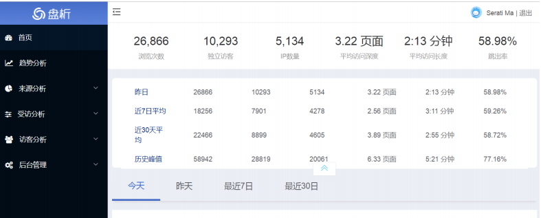

### 1.3.2 来源分析

1. 来源分类：提供不同来源形式（直接输入、搜索引擎、其他外部链接、站内来源）、不同来源项引入流量的比例情况。通过精确的量化数据，帮助用户分析什么类型的来路产生的流量多、效果好，进而合理优化推广方案
2. 搜索引擎：提供各搜索引擎以及搜索引擎子产品引入流量的比例情况。
3. 搜索词：提供访客通过搜索引擎进入网站所使用的搜索词，以及各搜索词引入流量的特征和分布。帮助用户了解各搜索词引入流量的质量，进而了解访客的兴趣关注点、网站与访客兴趣点的匹配度，为优化 SEO（搜索引擎优化）方案及 SEM（搜索引擎营销）提词方案提供详细依据。
4. 最近 7 日的访客搜索记录，可按每个 PV 或每次访问行为（访客的每次会话）显示，并可按照访客类型、地区等条件进行筛选。为您搜索引擎优化提供最详细的原始数据。
5. 来源升降榜：提供开通统计后任意两日的 TOP10000 搜索词、来路域名引入流量的对比情况，并按照变化的剧烈程度提供排行榜。 用户可通过此功能快速找到哪些来路对网站流量的影响比较大，从而及时排查相应来路问题

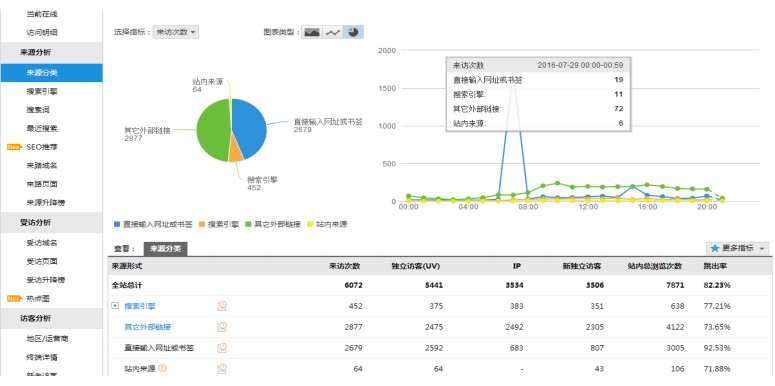

### 1.3.3 受访分析

1. 受访域名：提供访客对网站中各个域名的访问情况。 一般情况下，网站不同域名提供的产品、内容各有差异，通过此功能用户可以了解不同内容的受欢迎程度以及网站运营成效。
2. 受访页面：提供访客对网站中各个页面的访问情况。 站内入口页面为访客进入网站时浏览的第一个页面，如果入口页面的跳出率较高则需要关注并优化；站内出口页面为访客访问网站的最后一个页面，对于离开率较高的页面需要关注并优化
3. 受访升降榜：提供开通统计后任意两日的 TOP10000 受访页面的浏览情况对比，并按照变化的剧烈程度提供排行榜。 可通过此功能验证经过改版的页面是否有流量提升或哪些页面有巨大流量波动，从而及时排查相应问题。
4. 热点图：记录访客在页面上的鼠标点击行为，通过颜色区分不同区域的点击热度；支持将一组页面设置为"关注范围"，并可按来路细分点击热度。 通过访客在页面上的点击量统计，可以了解页面设计是否合理、广告位的安排能否获取更多佣金等。

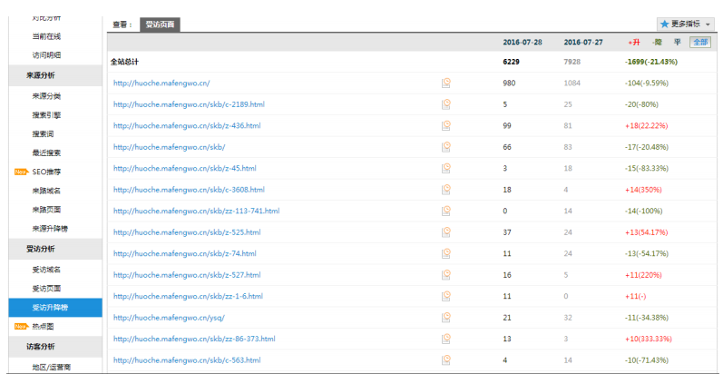

### 1.3.4 访客分析

1. 地区运营商：提供各地区访客、各网络运营商访客的访问情况分布。 地方网站、下载站等与地域性、网络链路等结合较为紧密的网站，可以参考此功能数据，合理优化推广运营方案。
2. 终端详情：提供网站访客所使用的浏览终端的配置情况。 参考此数据进行网页设计、开发，可更好地提高网站兼容性，以达到良好的用户交互体验。
3. 新老访客：当日访客中，历史上第一次访问该网站的访客记为当日新访客；历史上已经访问过该网站的访客记为老访客。 新访客与老访客进入网站的途径和浏览行为往往存在差异。该功能可以辅助分析不同访客的行为习惯，针对不同访客优化网站，例如为制作新手导航提供数据支持等

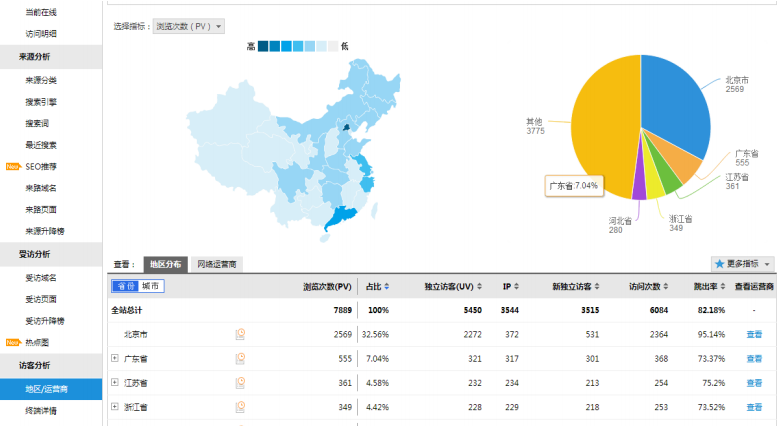

# 2. 模块开发-统计分析

数据仓库建设好以后，用户就可以编写 Hive SQL 语句对其进行访问并对其中数据进行分析

在实际生产中，究竟需要哪些统计指标通常由数据需求相关部门人员提出，而且会不断有新的统计需求产生，以下为网站流量分析中的一些典型指标示例

## 2.1 流量分析

### 2.1.1 基础指标多维统计分析

**基础指标统计**

1. PageView 浏览次数（pv）：一天之内网站页面被加载的总次数

   - 数据表： dw_weblog_detail
   - 分组字段：时间（day）  day比较特殊 还是表的分区字段  通过where分区过滤即可
   - 度量值：count(*)

   ```sql
   select
   count(*) as pv
   from  dw_weblog_detail t where t.datestr="20181101" and t.valid = "true";
   ```

2. Unique Visitor 独立访客（UV）：一天之内不重复的访客数

   计算的关键是对访客的识别。  以ip作为判断标识  不精准  技术上是一样的。

   - 数据表：dw_weblog_detail
   - 分组字段：时间（day）  day比较特殊 还是表的分区字段  通过where分区过滤即可
   - 度量值：count(distinct remote_addr)

   ```sql
   select
   count(distinct remote_user) as uv
   from dw_weblog_detail t where t.datestr="20181101";--以userID计算 准确
   ```

3. 访问次数（VV）：一天之内的会话次数（session数）

   - 数据表：ods_click_stream_visit
   - 分组字段：时间（day）  day比较特殊 还是表的分区字段  通过where分区过滤即可
   - 度量值：count(session)   如果使用ods_click_pageviews进行计算 count(distinct session)

   ```sql
   select
   count(t.session) as vv
   from ods_click_stream_visit t where t.datestr="20181101";
   ```

4. IP：一天之内不重复的IP个数。

   跟上述的UV计算一样。

   ```sql
   select
   count(distinct remote_addr) as ip
   from dw_weblog_detail t where t.datestr="20181101"; 
   ```

**基础指标结果保存入库：**

```sql
drop table dw_webflow_basic_info;
create table dw_webflow_basic_info(month string,day string,
pv bigint,uv bigint,ip bigint,vv bigint) partitioned by(datestr string);

insert into table dw_webflow_basic_info partition(datestr="20181101")
select '201811','01',a.*,b.* from
(select count(*) as pv,count(distinct remote_addr) as uv,count(distinct remote_addr) as ips 
from dw_weblog_detail
where datestr ='20181101') a join 
(select count(distinct session) as vvs from ods_click_stream_visit where datestr ="20181101") b;

这里插入时语句报错了，解决方法报错内容有写
Error: Error while compiling statement: FAILED: SemanticException Cartesian products are disabled for safety reasons. If you know what you are doing, please sethive.strict.checks.cartesian.product to false and that hive.mapred.mode is not set to 'strict' to proceed. Note that if you may get errors or incorrect results if you make a mistake while using some of the unsafe features. (state=42000,code=40000)
0: jdbc:hive2://bigdata111:10000> set hive.mapred.mode;
0: jdbc:hive2://bigdata111:10000> set hive.mapred.mode=strict;
No rows affected (0.004 seconds)
0: jdbc:hive2://bigdata111:10000> set hive.strict.checks.cartesian.product=false;
No rows affected (0.004 seconds)
```

**多维度统计分析**

- 维度：指的是看待问题的角度
- 本质：基于多个不同的维度的聚集 计算出某种度量值（count  sum  max  mix  topN）
- 重点：确定维度 维度就是sql层面分组的字段
- 技巧：按xxx  每xxx   各xxx

注意group by语句的语法

1. 时间维度统计

   - 计算该处理批次（一天）中的各小时pvs

     - 数据表：dw_weblog_detail
     - 分组字段：时间（day   hour）   day字段比较特殊  day是表分区字段   可以通过where过滤
     - 度量值：count(

     ```sql
     select
     t.hour,count(*) as pvs
     from dw_weblog_detail t where t.datestr ="20181101" group by t.hour;
     
     select
     t.day,t.hour,count(*) as pvs
     from dw_weblog_detail t where t.datestr ="20181101" group by t.hour;
     --直接报错  Invalid column reference 'day'   
     --想一想：sql语句  groupby有什么样的语法限制问题。
     出现在groupby语句表达式中的字段：要么是分组的字段 要么是被聚合函数包围应用的字段。
     
     select
     t.month,t.day,t.hour,count(*) as pvs
     from dw_weblog_detail t where t.datestr ="20181101" group by t.month,t.day,t.hour;
     ```

   - 计算每天的pvs

     ```sql
     --方式一：dw_pvs_everyhour_oneday  针对每个小时的pv进行sum求和 
     select sum(pvs) from dw_pvs_everyhour_oneday where datestr ="20181101";
     
     --方式二：dw_weblog_detail 分区和需求一直  基于分区进行count即可
     select count(*) from dw_weblog_detail where datestr ="20181101";
     
     --方式三：如果数据不是分区表  直接根据day进行分组
     select
     t.month,t.day,count(*) as pvs
     from dw_weblog_detail t where t.datestr ="20181101" group by t.month,t.day;
     ```

   - 事实表（宽表）和维度表进行关联查询

     关联查询的重点是确定join字段  跟时间相关的。

     - 计算每天的产生的pvs

     ```sql
     select count(*) as pvs,a.month as month,a.day as day from (select distinct month, day from t_dim_time) a
     join dw_weblog_detail b 
     on a.month=b.month and a.day=b.day
     group by a.month,a.day;
     ```

     - 拓展：使用与维度表关联的方式计算每个小时的pvs

     ```sql
     select count(*) as pvs,a.month as month,a.day as day,a.hour as hour from (select distinct month, day, hour from t_dim_time) a
     join dw_weblog_detail b 
     on a.month=b.month and a.day=b.day and a.hour=b.hour
     group by a.month,a.day,a.hour;
     ```

2. 按照来访维度、时间维度分析

   - *统计**每**小时**各**来访url产生的pv量*

     - 数据表：dw_weblog_detail
     - 分组字段：时间维度、来访referer(url)
     - 度量值：count()

     ```sql
     select http_referer,ref_host,month,day,hour,count(1) as pv_referer_cnt
     from dw_weblog_detail 
     group by http_referer,ref_host,month,day,hour 
     having ref_host is not null
     order by hour asc,day asc,month asc,pv_referer_cnt desc;
     ```

   - 统计**每**小时**各**来访host的产生的pv数并排序

     - 数据表：dw_weblog_detail
     - 分组字段：时间维度（hour）、来访维度（host）
     - 度量值：count()

     ```sql
     select ref_host,month,day,hour,count(1) as ref_host_cnts
     from dw_weblog_detail 
     group by ref_host,month,day,hour 
     having ref_host is not null
     order by hour asc,day asc,month asc,ref_host_cnts desc;
     ```

3. 按终端维度 

   数据中能够反映出用户终端信息的字段是 http_user_agent。

   User Agent 也简称 UA。它是一个特殊字符串头，是一种向访问网站提供所使用的浏览器类型及版本、操作系统及版本、浏览器内核、等信息的标识。例如：

   ```
   User-Agent,Mozilla/5.0 (Windows NT 6.3; WOW64) AppleWebKit/537.36 (KHTML, like Gecko) Chrome/58.0.3029.276 Safari/537.36
   ```

   上述 UA 信息就可以提取出以下的信息：chrome 58.0、浏览器 chrome、浏览器版本 58.0、系统平台 windows浏览器内核 webkit 

   **自定义 UDF 解析 UA：**

   - 引入依赖

     ```xml
     <dependencies>
             <dependency>
                 <groupId>org.apache.hive</groupId>
                 <artifactId>hive-exec</artifactId>
                 <version>1.2.1</version>
             </dependency>
             <dependency>
                 <groupId>org.apache.hadoop</groupId>
                 <artifactId>hadoop-common</artifactId>
                 <version>2.7.4</version>
             </dependency>
             <dependency>
                <groupId>eu.bitwalker</groupId>
                <artifactId>UserAgentUtils</artifactId>
                <version>1.21</version>
             </dependency>
         </dependencies>
     ```

   - 实现

     ```java
      public String evaluate(final String userAgent){
             StringBuilder builder = new StringBuilder();
          	// 利用第三方的jar包构建一个userAgent对象 基于该对象实现UA的解析
             UserAgent ua = new UserAgent(userAgent);
     builder.append(ua.getOperatingSystem()+"\t"+ua.getBrowser()+"\t"+ua.getBrowserVersion());
             return  (builder.toString());
         }
     ```

   - 使用：

     打成jar包，hive中add jar /opt/module/jars/exampleUDF-1.0-SNAPSHOT.jar;

     ```sql
     create temporary function ua_parse as 'cn.itcast.udf.UAParseUDF';
     
     select ua_parse(http_user_agent) from ods_click_pageviews limit 3;
     ```

4. 按栏目维度

   网站栏目可以理解为网站中内容相关的主题集中。体现在域名上来看就是不同的栏目会有不同的二级目录。比如某网站网址为 www.xxxx.cn,旗下栏目可以通过如下方式访问：

   - 栏目维度：../job
   - 栏目维度：../news
   - 栏目维度：../sports
   - 栏目维度：../technology
   - 那么根据用户请求 url 就可以解析出访问栏目，然后按照栏目进行统计分析。

### 2.2.2 符合指标统计分析

1. 人均浏览页数（平均访问深度）：一天之内平均每个独立访客打开的页面数

   =总的页面浏览数/总的独立访客数=pv/uv

   今日所有来访者平均请求浏览的页面数。该指标可以说明网站对用户的粘性。

   计算方式：总页面请求数 pv/独立访客数 uv

   remote_addr 表示不同的用户。可以先统计出不同 remote_addr 的 pv 量然后累加（sum）所有 pv 作为总页面请求数，再 count 所有 remote_addr 作为总的去重总人数

   - 数据表：dw_webflow_basic_info(基础指标信息表)
   - 分组字段：时间（day）  day比较特殊 还是表的分区字段  通过where分区过滤即可
   - 度量值：pv/uv

   ```sql
   --需求描述：统计今日所有来访者平均请求的页面数。
   --总页面请求数pv/去重总人数uv
   
   方式一：
   select
   pv/uv
   from dw_webflow_basic_info t where t.datestr="20181101";
   
   
   方式二：
   select
   sum(pv)/count(ip)
   from
   (select
   count(*) as pv,t.remote_addr as ip
   from dw_weblog_detail t where t.datestr="20181101" group by t.remote_addr) a;
   
   ```

2. 平均访问频度

   一天之内访问访问人均产生的会话次数（session次数）

   =总的会话次数/独立的访客人数

   =vv/uv

   - 数据表：dw_webflow_basic_info(基础指标信息表)
   - 分组字段：时间（day）  day比较特殊 还是表的分区字段  通过where分区过滤即可
   - 度量值：vv/uv

   ```sql
   select
   vv/uv
   from dw_webflow_basic_info t where t.datestr="20181101";--0.56
   --上述指标不符合客观规律
   --原因：在计算基础指标的时候 uv使用的宽表的数据 没有进行静态资源的过滤
   -- vv使用的点击流模型数据 在数据预处理阶段  进行了静态资源的过滤
   --  一个采用过滤的 一个不采用过滤的  计算的指标出现了谬论
   
   
   --统计采用 过滤静态资源后的数据进行计算  ods_click_stream_visit
   
   select
   count(t.session)/count(distinct t.remote_addr)
   from ods_click_stream_visit t where t.datestr="20181101"; --1.075
   ```

3. 平均访问时长：一天之内用户平均每次会话在网站的停留时间

   =总的停留时间/会话的次数（vv）

   - 数据表：ods_click_pageviews
   - 分组字段:时间（day）  day比较特殊 还是表的分区字段  通过where分区过滤即可
   - 度量计算：sum(page_staylong)/count(distinct session)

   ```sql
   select
   sum(t.page_staylong)/count(distinct t.session)
   from ods_click_pageviews t where t.datestr="20181101"; --211.24
   ```

4. /hadoop-mahout-roadmap/ 页面跳出率

   跳出率是指用户到网站上仅浏览了一个页面就离开的访问次数与所有访问次数的百分比。是评价网站性能的重要指标。简单来说就是：一天之内只访问一个页面就离开的会话次数与总的会话次数的百分比。

   - 数据表：ods_click_stream_visit
   - 分组字段：时间（day）  day比较特殊 还是表的分区字段  通过where分区过滤即可
   - 度量值：count
   - 过滤条件：会话的访问页面次数为1，并且该页面是指定的页面

   ```sql
   select 
   count(t.session)
   from ods_click_stream_visit t where t.datestr="20181101" and t.pagevisits =1 and t.inpage ="/hadoop-mahout-roadmap/";
   ```

### 2.2.3 分组TOP问题（分组函数）

需求描述：统计每小时各来访 host 的产生的 pvs 数最多的前 N 个（topN）。

row_number()函数

- 语法：row_number() over (partition by xxx order by xxx) rank，rank 为分组的别名，相当于新增一个字段为 rank。
- partition by 用于分组，比方说依照 sex 字段分组
- order by 用于分组内排序，比方说依照 sex 分组后，组内按照 age 排序
- 排好序之后，为每个分组内每一条分组记录从 1 开始返回一个数字
- 取组内某个数据，可以使用 where 表名.rank>x 之类的语法去取

```sql
--统计pv总量最大的来源TOPN
--需求：按照时间维度，统计一天内各小时产生最多pvs的来源topN


--row_number函数
select ref_host,ref_host_cnts,concat(month,day,hour),
row_number() over (partition by concat(month,day,hour) order by ref_host_cnts desc) as od 
from dw_pvs_refererhost_everyhour;

--综上可以得出
drop table dw_pvs_refhost_topn_everyhour;
create table dw_pvs_refhost_topn_everyhour(
hour string,
toporder string,
ref_host string,
ref_host_cnts string
)partitioned by(datestr string);

insert into table dw_pvs_refhost_topn_everyhour partition(datestr='20181101')
select t.hour,t.od,t.ref_host,t.ref_host_cnts from
 (select ref_host,ref_host_cnts,concat(month,day,hour) as hour,
row_number() over (partition by concat(month,day,hour) order by ref_host_cnts desc) as od from dw_pvs_refererhost_everyhour) t where od<=3;
```

## 2.2 受访分析（从页面的角度分析）

### 2.2.1 各页面访问统计

主要是针对数据中的 request 进行统计分析，比如各页面 PV ，各页面 UV 等。以上指标无非就是根据页面的字段 group by。例如：

```sql
select request as request,count(request) as request_counts from
dw_weblog_detail group by request having request is not null order by request_counts desc limit 20;
```

### 2.2.2 热门页面统计

统计每日最热门的页面top10

- 数据表：dw_weblog_detail
- 分组字段：时间维度(day)  day比较特殊还是表的分区字段 、页面维度（request）
- 度量值：count(*)---->top10

```sql
drop table dw_hotpages_everyday;
create table dw_hotpages_everyday(day string,url string,pvs string);

insert into table dw_hotpages_everyday
select '20181101',a.request,a.request_counts from
(select request as request,count(request) as request_counts from dw_weblog_detail where datestr='20181101' group by request having request is not null) a
order by a.request_counts desc limit 10;
```

## 2.3 访客分析

### 2.3.1 独立访客

需求描述：按照时间维度比如小时来统计独立访客及其产生的 pv。

对于独立访客的识别，如果在原始日志中有用户标识，则根据用户标识即很好实现;此处，由于原始日志中并没有用户标识，以访客 IP 来模拟，技术上是一样的，只是精确度相对较低。

- 数据表：dw_weblog_detail
- 分组字段：时间维度（hour）、访客维度（remote_addr）
- 度量值：count()

```sql
时间维度：时
drop table dw_user_dstc_ip_h;
create table dw_user_dstc_ip_h(
remote_addr string,
pvs      bigint,
hour     string);

insert into table dw_user_dstc_ip_h 
select remote_addr,count(1) as pvs,concat(month,day,hour) as hour 
from dw_weblog_detail
Where datestr='20181101'
group by concat(month,day,hour),remote_addr
order by hour asc,pvs desc;

--在上述基础之上，可以继续分析，比如每小时独立访客总数
select count(1) as dstc_ip_cnts,hour from dw_user_dstc_ip_h group by hour;


时间维度：日
select remote_addr,count(1) as counts,concat(month,day) as day
from dw_weblog_detail
Where datestr='20181101'
group by concat(month,day),remote_addr;


时间维度： 月
select remote_addr,count(1) as counts,month 
from dw_weblog_detail
group by month,remote_addr;

```

### 2.3.2 每日新访客

需求：将每天的新访客统计出来。

实现思路：创建一个去重访客累积表，然后将每日访客对比累积表

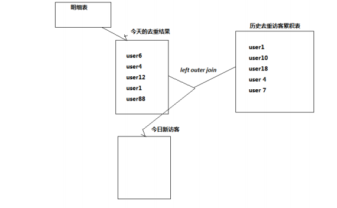

```sql
--今天（根据今天收集的数据进行去重统计）
select
distinct t.remote_addr as ip
from dw_weblog_detail t where t.datestr ="20181101";

--历史
create table dw_user_dsct_history(
day string,
ip string
) 
partitioned by(datestr string);

--框架
select
今天.ip
from 今天 left join 历史 on 今天.ip = 历史.ip
where 历史.ip is null;--新访客

select
今天.ip
from 今天 left join 历史 on 今天.ip = 历史.ip
where 历史.ip is not null;--老访客

代入框架：
select today.ip from
(select distinct t.remote_addr as ip from dw_weblog_detail t where t.datestr ="20181101") today left join dw_user_dsct_history history on today.ip = history.ip
where history.ip is null;--新访客

select today.ip from
(select distinct t.remote_addr as ip from dw_weblog_detail t where t.datestr ="20181101") today left join dw_user_dsct_history history on today.ip = history.ip
where history.ip is not null; --老访客
```

hive中join 的总结

- join语句最重要的是确定join的表和join字段

- 因为join的表可能真是存在  也可能不存在

- 如果不存在 设法通过嵌套查询生成表结构  实质是一个虚拟的表

- 如果涉及到需求中的两元操作（好或者不好 来或者不来 新或者旧） 都可以往join上进行扩展

  因为join的结果本身也是两种情况（null, not null）

### 2.3.3 地域分析

IP 一般包含的信息：国家、区域（省/州）、城市、街道、经纬度、ISP 提供商等信息。因为 IP 数据库随着时间经常变化（不过一段时间内变化很小），所以需要有人经常维护和更新。这个数据也不可能完全准确、也不可能覆盖全。

目前，国内用的比较有名的是“纯真 IP 数据库”，国外常用的是 maxmind、ip2location。IP 数据库是否收费：收费、免费都有。一般有人维护的数据往往都是收费的，准确率和覆盖率会稍微高一些。

**查询形式：**

本地，将 IP 数据库下载到本地使用，查询效率高、性能好。常用在统计分析方面。具体形式又分为：

- 内存查询：将全部数据直接加载到内存中，便于高性能查询。或者二进制的数据文件本身就是经过优化的索引文件，可以直接对文件做查询。
- 数据库查询：将数据导入到数据库，再用数据库查询。效率没有内存查询快。
- 远程（web service 或 ajax），调用远程第三方服务。查询效率自然比较低，

一般用在网页应用中。查询的本质：输入一个 IP，找到其所在的 IP 段，一般都是采用二分搜索实现的。

示例：Hive UDF 和 GeoIP 库为 Hive 加入 IP 识别功能

Hive 所需添加的 IP 地址信息识别 UDF 函数如

```java

```

## 2.4 访客Visit分析（点击流模型）

### 2.4.1 回头/单次访客统计

解读：次的理解  所谓次数指的是用户会话的的次数  

次数=1 单次访客  次数 > 1 回头访客

- 数据表：ods_click_stream_visit
- 分组字段：时间维度（day） 是分区字段  where
- 度量值: count(session)

```sql
--先计算每个用户产生的会话数
select
t.remote_addr,count(t.session) as nums
from ods_click_stream_visit t where t.datestr ="20181101" group by t.remote_addr;

--方式一：采用嵌套查询的思路
select 
*
from
(select
t.remote_addr as ip,count(t.session) as nums
from ods_click_stream_visit t where t.datestr ="20181101" group by t.remote_addr) a
where a.nums =1; --单次访客

select
*
from
(select
t.remote_addr as ip,count(t.session) as nums
from ods_click_stream_visit t where t.datestr ="20181101" group by t.remote_addr) a
where a.nums  > 1; --回头访客

--方式二：采用having
select
t.remote_addr,count(t.session) as nums
from ods_click_stream_visit t where t.datestr ="20181101" group by t.remote_addr
having nums = 1;--单次访客

select
t.remote_addr,count(t.session) as nums
from ods_click_stream_visit t where t.datestr ="20181101" group by t.remote_addr
having nums > 1;--回头访客
```

### 2.4.2 人均访问频次

需求：统计出每天所有用户访问网站的平均次数（visit）

总 visit 数/去重总用户数

```sql
select count(session)/count(distinct remote_addr) from ods_click_stream_visit where datestr='20181101';
```

## 2.5 关键路径转化率分析（漏斗模型）


**hive级联求和示例**

```sql
create table t_salary_detail(username string,month string,salary int)
row format delimited fields terminated by ',';

load data local inpath '/root/hivedata/t_salary_detail.dat' into table t_salary_detail;

A,2015-01,5
A,2015-01,15
B,2015-01,5
A,2015-01,8
B,2015-01,25
A,2015-01,5
A,2015-02,4
A,2015-02,6
B,2015-02,10
B,2015-02,5
A,2015-03,7
A,2015-03,9
B,2015-03,11
B,2015-03,6


需求：统计每个用户每个月获得多少小费？
分组维度：  username  month

select username,month,sum(salary)from t_salary_detail group by username,month;

+--------------------------+-----------------------+------------------------+--+
| t_salary_detail.username  | t_salary_detail.month  | t_salary_detail.salary  |
+--------------------------+-----------------------+------------------------+--+
| A                        | 2015-01               | 5                      |
| A                        | 2015-01               | 15                     |
| B                        | 2015-01               | 5                      |
| A                        | 2015-01               | 8                      |
| B                        | 2015-01               | 25                     |
| A                        | 2015-01               | 5                      |
| A                        | 2015-02               | 4                      |
| A                        | 2015-02               | 6                      |
| B                        | 2015-02               | 10                     |
| B                        | 2015-02               | 5                      |
| A                        | 2015-03               | 7                      |
| A                        | 2015-03               | 9                      |
| B                        | 2015-03               | 11                     |
| B                        | 2015-03               | 6                      |
+--------------------------+-----------------------+------------------------+--+

1、第一步，先求个用户的月总金额
select username,month,sum(salary) as salary from t_salary_detail group by username,month

+-----------+----------+---------+-
| username  |  month   | salary  |   累计金额
+-----------+----------+---------+-
| A         | 2015-01  | 33      |    33
| A         | 2015-02  | 10      |    43
| A         | 2015-03  | 16      |    59
| B         | 2015-01  | 33      |    33
| B         | 2015-02  | 15      |    48
| B         | 2015-03  | 17      |    65
+-----------+----------+---------+--+

2、第二步，将月总金额表 自己连接 自己连接
select A.*,B.* FROM
(select username,month,sum(salary) as salary from t_salary_detail group by username,month) A 
inner join 
(select username,month,sum(salary) as salary from t_salary_detail group by username,month) B
on
A.username=B.username
where B.month <= A.month
+-------------+----------+-----------+-------------+----------+-----------+--+
| a.username  | a.month  | a.salary  | b.username  | b.month  | b.salary  |
+-------------+----------+-----------+-------------+----------+-----------+--+
| A           | 2015-01  | 33        | A           | 2015-01  | 33        |
| A           | 2015-02  | 10        | A           | 2015-01  | 33        |
| A           | 2015-02  | 10        | A           | 2015-02  | 10        |
| A           | 2015-03  | 16        | A           | 2015-01  | 33        |
| A           | 2015-03  | 16        | A           | 2015-02  | 10        |
| A           | 2015-03  | 16        | A           | 2015-03  | 16        |
| B           | 2015-01  | 30        | B           | 2015-01  | 30        |
| B           | 2015-02  | 15        | B           | 2015-01  | 30        |
| B           | 2015-02  | 15        | B           | 2015-02  | 15        |
| B           | 2015-03  | 17        | B           | 2015-01  | 30        |
| B           | 2015-03  | 17        | B           | 2015-02  | 15        |
| B           | 2015-03  | 17        | B           | 2015-03  | 17        |
+-------------+----------+-----------+-------------+----------+-----------+--+


3、第三步，从上一步的结果中
进行分组查询，分组的字段是a.username a.month
求月累计值：  将b.month <= a.month的所有b.salary求和即可
select A.username,A.month,max(A.salary) as salary,sum(B.salary) as accumulate
from 
(select username,month,sum(salary) as salary from t_salary_detail group by username,month) A 
inner join 
(select username,month,sum(salary) as salary from t_salary_detail group by username,month) B
on
A.username=B.username
where B.month <= A.month
group by A.username,A.month
order by A.username,A.month;


+-------------+----------+---------+-------------+--+
| a.username  | a.month  | salary  | accumulate  |
+-------------+----------+---------+-------------+--+
| A           | 2015-01  | 33      | 33          |
| A           | 2015-02  | 10      | 43          |
| A           | 2015-03  | 16      | 59          |
| B           | 2015-01  | 30      | 30          |
| B           | 2015-02  | 15      | 45          |
| B           | 2015-03  | 17      | 62          |
+-------------+----------+---------+-------------+--+
```


1.  需求分析

   转化：在一条指定的业务流程中，各个步骤的完成人数及相对上一个步骤的百分比

   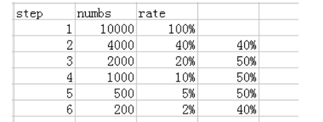

2. 模型设计

   定义好业务流程中的页面标识，下例中的步骤为：

   ```
   Step1、 /item
   Step2、 /category
   Step3、 /index
   Step4、 /order
   ```

3. 开发实现

   ```sql
   load data local inpath '/root/hivedata/click-part-r-00000' overwrite into table ods_click_pageviews partition(datestr='20181103');
   
   --1、查询每一个步骤的总访问人数
   UNION All将多个SELECT语句的结果集合并为一个独立的结果集
   
   create table dw_oute_numbs as 
   select 'step1' as step,count(distinct remote_addr)  as numbs from ods_click_pageviews where datestr='20181103' and request like '/item%'
   union all
   select 'step2' as step,count(distinct remote_addr)  as numbs from ods_click_pageviews where datestr='20181103' and request like '/category%'
   union all
   select 'step3' as step,count(distinct remote_addr)  as numbs from ods_click_pageviews where datestr='20181103' and request like '/order%'
   union all
   select 'step4' as step,count(distinct remote_addr)  as numbs from ods_click_pageviews where datestr='20181103' and request like '/index%';
   
   
   +---------------------+----------------------+--+
   | dw_oute_numbs.step  | dw_oute_numbs.numbs  |
   +---------------------+----------------------+--+
   | step1               | 1029                 |
   | step2               | 1029                 |
   | step3               | 1028                 |
   | step4               | 1018                 |
   +---------------------+----------------------+--+
   ----------------------------------------------------------------------------
   --2、查询每一步骤相对于路径起点人数的比例
   --级联查询，自己跟自己join
   
   select rn.step as rnstep,rn.numbs as rnnumbs,rr.step as rrstep,rr.numbs as rrnumbs  from dw_oute_numbs rn
   inner join 
   dw_oute_numbs rr;
   
   自join后结果如下图所示：
   +---------+----------+---------+----------+--+
   | rnstep  | rnnumbs  | rrstep  | rrnumbs  |
   +---------+----------+---------+----------+--+
   | step1   | 1029     | step1   | 1029     |
   | step2   | 1029     | step1   | 1029     |
   | step3   | 1028     | step1   | 1029     |
   | step4   | 1018     | step1   | 1029     |
   | step1   | 1029     | step2   | 1029     |
   | step2   | 1029     | step2   | 1029     |
   | step3   | 1028     | step2   | 1029     |
   | step4   | 1018     | step2   | 1029     |
   | step1   | 1029     | step3   | 1028     |
   | step2   | 1029     | step3   | 1028     |
   | step3   | 1028     | step3   | 1028     |
   | step4   | 1018     | step3   | 1028     |
   | step1   | 1029     | step4   | 1018     |
   | step2   | 1029     | step4   | 1018     |
   | step3   | 1028     | step4   | 1018     |
   | step4   | 1018     | step4   | 1018     |
   +---------+----------+---------+----------+--+
   
   
   --每一步的人数/第一步的人数==每一步相对起点人数比例
   select tmp.rnstep,tmp.rnnumbs/tmp.rrnumbs as ratio
   from
   (
   select rn.step as rnstep,rn.numbs as rnnumbs,rr.step as rrstep,rr.numbs as rrnumbs  from dw_oute_numbs rn
   inner join 
   dw_oute_numbs rr) tmp
   where tmp.rrstep='step1';
   
   
   tmp
   +---------+----------+---------+----------+--+
   | rnstep  | rnnumbs  | rrstep  | rrnumbs  |
   +---------+----------+---------+----------+--+
   | step1   | 1029     | step1   | 1029     |
   | step2   | 1029     | step1   | 1029     |
   | step3   | 1028     | step1   | 1029     |
   | step4   | 1018     | step1   | 1029     |
   
   --------------------------------------------------------------------------------
   --3、查询每一步骤相对于上一步骤的漏出率
   
   --首先通过自join表过滤出每一步跟上一步的记录
   
   select rn.step as rnstep,rn.numbs as rnnumbs,rr.step as rrstep,rr.numbs as rrnumbs  from dw_oute_numbs rn
   inner join 
   dw_oute_numbs rr
   where cast(substr(rn.step,5,1) as int)=cast(substr(rr.step,5,1) as int)-1;
   
   
   注意：cast为Hive内置函数 类型转换
   select cast(1 as float); --1.0  
   select cast('2016-05-22' as date); --2016-05-22 
   
   | step1   | 1029     | step2   | 1029     |
   | step2   | 1029     | step3   | 1028     |
   | step3   | 1028     | step4   | 1018     |
   
   
   +---------+----------+---------+----------+--+
   | rnstep  | rnnumbs  | rrstep  | rrnumbs  |
   +---------+----------+---------+----------+--+
   | step1   | 1029     | step2   | 1029     |
   | step2   | 1029     | step3   | 1028     |
   | step3   | 1028     | step4   | 1018     |
   +---------+----------+---------+----------+--+
   
   --然后就可以非常简单的计算出每一步相对上一步的漏出率
   select tmp.rrstep as step,tmp.rrnumbs/tmp.rnnumbs as leakage_rate
   from
   (
   select rn.step as rnstep,rn.numbs as rnnumbs,rr.step as rrstep,rr.numbs as rrnumbs  from dw_oute_numbs rn
   inner join 
   dw_oute_numbs rr) tmp
   where cast(substr(tmp.rnstep,5,1) as int)=cast(substr(tmp.rrstep,5,1) as int)-1;
   
   -----------------------------------------------------------------------------------
   --4、汇总以上两种指标
   select abs.step,abs.numbs,abs.rate as abs_ratio,rel.rate as leakage_rate
   from 
   (
   select tmp.rnstep as step,tmp.rnnumbs as numbs,tmp.rnnumbs/tmp.rrnumbs as rate
   from
   (
   select rn.step as rnstep,rn.numbs as rnnumbs,rr.step as rrstep,rr.numbs as rrnumbs  from dw_oute_numbs rn
   inner join 
   dw_oute_numbs rr) tmp
   where tmp.rrstep='step1'
   ) abs
   left outer join
   (
   select tmp.rrstep as step,tmp.rrnumbs/tmp.rnnumbs as rate
   from
   (
   select rn.step as rnstep,rn.numbs as rnnumbs,rr.step as rrstep,rr.numbs as rrnumbs  from dw_oute_numbs rn
   inner join 
   dw_oute_numbs rr) tmp
   where cast(substr(tmp.rnstep,5,1) as int)=cast(substr(tmp.rrstep,5,1) as int)-1
   ) rel
   on abs.step=rel.step;
   ```

# 3. 模块开发-数据导出

## 3.1 Apache Sqoop 

Sqoop 是 Hadoop 体系和关系数据库服务器之间传送数据的一种工具。用来从关系数据库如：Mysql、Oracle 到 HDFS、Hive 等，或者从 Hadoop 的文件系统导出数据到关系数据库。由 Apache 软件基金会提供。

Sqoop：“SQL 到 Hadoop 和 Hadoop 到 SQL”。

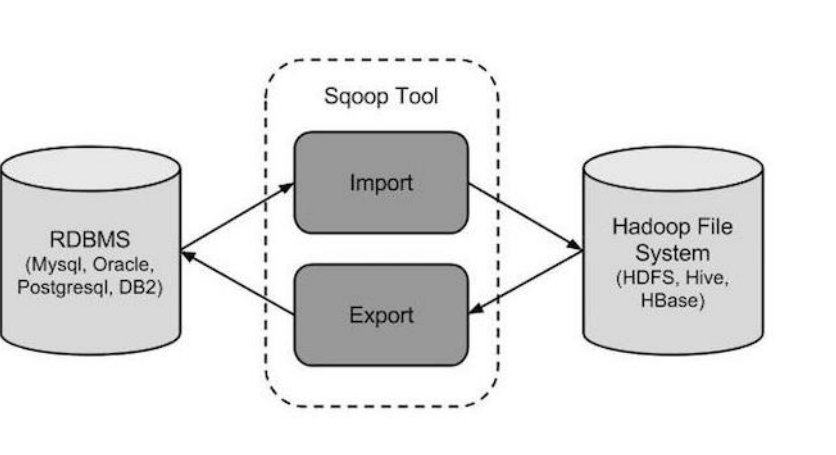

Sqoop 工作机制是将导入或导出命令翻译成 MapReduce 程序来实现。

在翻译出的 MapReduce 中主要是对 inputformat 和 outputformat 进行定制。

## 3.2 Sqoop导出项目数据

Sqoop 支持直接从 Hive 表到 RDBMS 表的导出操作，也支持 HDFS 到 RDBMS 表的操作，鉴于此，有如下两种方案：

- 从 Hive 表到 RDBMS 表的直接导出：效率较高，相当于直接在 Hive 表与 RDBMS 表的进行数据更新，但无法做精细的控制。

- 从 Hive 到 HDFS 再到 RDBMS 表的导出：

  需要先将数据从 Hive 表导出到 HDFS，再从 HDFS 将数据导入到 RDBMS。虽然比直接导出多了一步操作，但是可以实现对数据的更精准的操作，特别是在从 Hive 表导出到 HDFS 时，可以进一步对数据进行字段筛选、字段加工、数据过滤操作，从而使得 HDFS 上的数据更“接近”或等于将来实际要导入 RDBMS 表的数据，提高导出速度。

实际项目中应该结合具体业务场景灵活运用，切勿生搬硬套，照本宣科。

当前项目需求是从 Hive 中导出数据到 RDBMS，后续如果有 hive 增量数据产生，进行增量导出

以下是 export 命令语法 ：

```
：$ sqoop export (generic-args) (export-args)
```

### 3.2.1 全量导出数据到mysql

- 应用场景：将 Hive 表中的全部记录（可以是全部字段也可以部分字段）导出到 Mysql目标表。
-  使用限制：目标表中不能有与 Hive 中相同的记录，一般只有当目标表为空表时才使用该模式进行首次数据导出。
- 实现逻辑：以 dw_pvs_referer_everyhour（每小时来访 url 产生的 pv）为例进行数据全量导出

1. Hive------->HDFS

   导出 dw_pvs_referer_everyhour 表数据到 HDFS

   ```sql
   -- 路径是HDFS路径
   insert overwrite directory '/weblog/export/dw_pvs_referer_everyhour' row format delimited fields terminated by ',' STORED AS textfile select referer_url,hour,pv_referer_cnt from dw_pvs_referer_everyhour where datestr = "20181101";
   ```

2. HDFS-------->MySQL

   - mysql创建目标表

     ```sql
     create database weblog;
     use weblog;
     create table dw_pvs_referer_everyhour(
        hour varchar(10), 
        referer_url text, 
        pv_referer_cnt bigint);
     ```

   - 导入mysql

     ```sql
     bin/sqoop export \
     --connect jdbc:mysql://node-1:3306/weblog \
     --username root --password hadoop \
     --table dw_pvs_referer_everyhour \
     --fields-terminated-by '\001' \
     --columns referer_url,hour,pv_referer_cnt \
     --export-dir /weblog/export/dw_pvs_referer_everyhour
     ```

   注意：--columns选项当且仅当数据文件中的数据与表结构一致时（包括字段顺序）可以不指定
   	  --否则应按照数据文件中各个字段与目标的字段的映射关系来指定该参数	 

### 3.2.2 增量导出数据到 mysql

- 应用场景：将 Hive 表中的增量记录同步到目标表中。
- 使用技术：使用 sqoop export 中--update-mode 的 allowinsert 模式进行增量数据导入目标表中。该模式用于将 Hive 中有但目标表中无的记录同步到目标表中，但同时也会同步不一致的记录。
- 实现逻辑：以 dw_webflow_basic_info 基础信息指标表为例进行增量导出操作。

1. mysql中手动创建目标表

   ```sql
   create table dw_webflow_basic_info(
   monthstr varchar(20),
   daystr varchar(10),
   pv bigint,
   uv bigint,
   ip bigint,
   vv bigint
   )
   ```

2. 先进行全量导出 把hive中该表的数据全部导出至mysql中

   ```sql
   bin/sqoop export \
   --connect jdbc:mysql://node-1:3306/weblog \
   --username root --password hadoop \
   --table dw_webflow_basic_info \
   --fields-terminated-by '\001' \
   --export-dir /user/hive/warehouse/itheima.db/dw_webflow_basic_info/datestr=20181101/
   ```

3. 手动模拟在hive新增数据  表示增量数据

   ```sql
   insert into table dw_webflow_basic_info partition(datestr="20181103") values("201811","03",14250,1341,1341,96);
   ```

4. 利用sqoop进行增量导出

   ```sql
   bin/sqoop export \
   --connect jdbc:mysql://node-1:3306/weblog \
   --username root \
   --password hadoop \
   --table dw_webflow_basic_info \
   --fields-terminated-by '\001' \
   --update-key monthstr,daystr \
   --update-mode allowinsert \
   --export-dir /user/hive/warehouse/itheima.db/dw_webflow_basic_info/datestr=20181103/
   ```

   在sql中 update-key 用于指定更新时检查判断依据 可以多个字段  中间用,分割

   如果检查的字段在hive中有更新 mysql目标表中没有  那么sqoop就会执行更新操作

### 3.2.3 定时增量导出数据到 mysql

- 应用场景：将 Hive 表中的增量记录自动定时同步到目标表中。
- 使用技术：使用 sqoop export 中--update-mode 的 allowinsert 模式进行增量数据导入目标表中。该模式用于将 Hive 中有但目标表中无的记录同步到目标表中，但同时也会同步不一致的记录。
- 实现逻辑：以 dw_webflow_basic_info 基础信息指标表为例进行增量导出操作。

1. 手动导入增量数据 

   ```sql
   insert into table dw_webflow_basic_info partition(datestr="20181104") values("201811","04",10137,1129,1129,103);
   ```

   - 编写增量导出的shell脚本

     - 导出数据的时间最好不要写死 可以通过传参或者命令方式自动获取时间
   
  - 参数属性值不要写死 集中定义变量 后续引用 方便集中管理
   
       sqoop_export.sh
   
     ```shell
     #!/bin/bash
     export SQOOP_HOME=/export/servers/sqoop
     
     if [ $# -eq 1 ]
     then
         execute_date=`date --date="${1}" +%Y%m%d`
     else
         execute_date=`date -d'-1 day' +%Y%m%d`
     fi
     
     echo "execute_date:"${execute_date}
     
     table_name="dw_webflow_basic_info"
     hdfs_dir=/user/hive/warehouse/itheima.db/dw_webflow_basic_info/datestr=${execute_date}
     mysql_db_pwd=hadoop
     mysql_db_name=root
     
     echo 'sqoop start'
     $SQOOP_HOME/bin/sqoop export \
     --connect "jdbc:mysql://node-1:3306/weblog" \
     --username $mysql_db_name \
     --password $mysql_db_pwd \
     --table $table_name \
     --fields-terminated-by '\001' \
     --update-key monthstr,daystr \
     --update-mode allowinsert \
     --export-dir $hdfs_dir
  
     echo 'sqoop end'
  ```
   
     注：执行该脚本需要指定时间，因为我们的时间是过去2018年的，eg：sh sqoop_export 20181101
   
   - 配合定时调度工具完成周期性定时调度
   
     - Linux crontab
     - 开源Azkaban  oozie

# 4. 模块开发-工作流调度

## 4.1 工作流调度

工作流（Workflow），是对工作流程及其各操作步骤之间业务规则的抽象、概括描述。工作流建模，即将工作流程中的工作如何前后组织在一起的逻辑和规则，在计算机中以恰当的模型表达并对其实施计算。

工作流要解决的主要问题是：为实现某个业务目标，利用计算机在多个参与者之间按某种预定规则自动传递文档、信息或者任务。一个完整的大数据分析系统通常都是由多个前后依赖的模块组合构成的：数据采集、数据预处理、数据分析、数据展示等。

模块单元、模块内部往往存在时间上的先后依赖关系，且存在着周期性重复执行的工作。为了很好地组织起这样的复杂执行计划，需要一个工作流调度系统来调度执行。

## 4.2 工作流调度实现方式

1.  简单的任务调度

   使用 Linux 的 crontab 来定义调度,但是缺点比较明显，无法设置依赖复杂任务调度。且需要编写相关 shell 脚本

2. 复杂的任务调度

   当下企业两种选择，要么自主开发工作流调度系统，要么使用开源调度系统，比如 **Azkaban**、Apache Oozie、Zeus 等。

   其中知名度比较高的是 Apache Oozie，但是其配置工作流的过程是编写大量的 XML 配置，而且代码复杂度比较高，不易于二次开发。

## 4.3 项目中 Azkaban 使用

### 4.3.1 Azkaban 介绍

Azkaban 是由领英公司推出的一个批量工作流任务调度器，用于在一个工作流内以一个特定的顺序运行一组工作和流程。Azkaban 使用 job 配置文件建立任务之间的依赖关系，并提供一个易于使用的 web 用户界面维护和跟踪工作流。

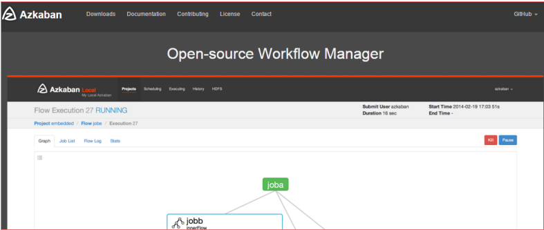

### 4.3.2 数据预处理定时调度

数据预处理模块按照数据处理过程和业务需求，可以分成 3 个步骤执行：数据预处理清洗、点击流模型之 pageviews、点击流模型之 visit。并且 3 个步骤之间存在着明显的依赖关系，使用 Azkaban 定时周期性执行将会非常方便。

- 把预处理阶段的3个MR程序打成可以执行的jar包

  注意使用maven插件 需要指定main class  里面的输入输出路径不要写死

  ```xml
   <build>
          <plugins>
              <plugin>
                  <groupId>org.apache.maven.plugins</groupId>
                  <artifactId>maven-jar-plugin</artifactId>
                  <version>2.4</version>
                  <configuration>
                      <archive>
                          <manifest>
                              <addClasspath>true</addClasspath>
                              <classpathPrefix>lib/</classpathPrefix>
                              <mainClass>WebLog.WeblogPreProcess</mainClass>
                          </manifest>
                      </archive>
                  </configuration>
              </plugin>
              <plugin>
                  <groupId>org.apache.maven.plugins</groupId>
                  <artifactId>maven-compiler-plugin</artifactId>
                  <version>3.0</version>
                  <configuration>
                      <source>1.8</source>
                      <target>1.8</target>
                      <encoding>UTF-8</encoding>
                  </configuration>
              </plugin>
          </plugins>
      </build>
  ```

- 配置Azkaban的  job信息 

  尤其需要注意设置的依赖  和输入输出的路径对应问题

  ```shell
  # weblog_preprocess.job
  type=command
  command=/opt/module/hadoop-2.8.4/binhadoop  jar Weblog_PreProcess.jar /test/input /test/PreProcess
  ```

  ```shell
  # weblog_click_pageviews.job
  type=command
  dependencies=Weblog_PreProcess
  command=/opt/module/hadoop-2.8.4/binhadoop  jar Weblog_Click_pageView.jar /test/PreProcess /test/pageView
  ```

  ```shell
  # weblog_click_visits.job
  type=command
  dependencies=Weblog_Click_pageView
  command=/opt/module/hadoop-2.8.4/bin/hadoop  jar Weblog_Click_Visit.jar /test/pageView /test/visits
  ```

- 把Azkaban配置及其依赖的资源打成zip压缩包

- 在Azkaban的web页面上创建工程  上传zip压缩包

  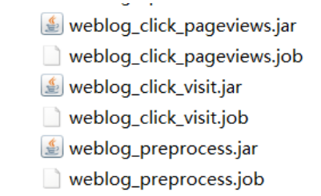

- 在Azkaban上可以进行两种选择 ，立即执行    配置定时执行的计划

### 4.3.3 数据入库定时调度

调度脚本的编写难点在于 shell 脚本。但是一般都是有固定编写模式。大体框架如下：

```shell
#!/bin/bash
#set java env
#set hadoop env
#设置一些主类、目录等常量
#获取时间信息
#shell 主程序、结合流程控制（if....else）去分别执行 shell 命令。
```

实现：

load-weblog.job

```shell
# load-weblog.job
type=command
command=sh load-weblog.sh
```

load-weblog.sh

```shell
#!/bin/bash

export HIVE_HOME=/opt/module/hive-2.3.4

if [ $# -eq 1 ]
then
    datestr=`date --date="${1}" +%Y%m%d`
else
    datestr=`date -d'-1 day' +%Y%m%d`
fi

HQL="load data inpath '/test/PreProcess' into table test.ods_weblog_origin partition(datestr='${datestr}')"

echo "开始执行load......"
$HIVE_HOME/bin/hive -e "$HQL"
echo "执行完毕......"
```

如何使用Azkaban调度hive

- hive  -e   sql语句
- hive  -f   sql脚本

### 4.3.4 数据统计计算定时调度

```shell
# 1execute_hive_sql_detail.job
type=command
command=sh 1execute_hive_sql_detail.sh
```

```shell
#!/bin/bash
HQL="
drop table itheima.dw_user_dstc_ip_h1;
create table itheima.dw_user_dstc_ip_h1(
remote_addr string,
pvs      bigint,
hour     string);

insert into table itheima.dw_user_dstc_ip_h1 
select remote_addr,count(1) as pvs,concat(month,day,hour) as hour 
from itheima.dw_weblog_detail
Where datestr='20181101'
group by concat(month,day,hour),remote_addr;
"
echo $HQL
/export/servers/hive/bin/hive -e "$HQL"
```

之后打成zip压缩包，上传到Azkaban进行调度，再去hive上进行验证

# 5. 模块开发-数据可视化

何谓数据可视化：

又称之为数据报表展示，属于数据应用中的一种，尽量使用图形表格的形式把分析的结果展示给被人看。

数据可视化的大量工作属于前端开发  我们需要掌握的是如何把数据分析处理 已经把数据按照要求传递给可视化的软件。

数据可视化是一种锦上添花的事。核心还是数据分析的过程。

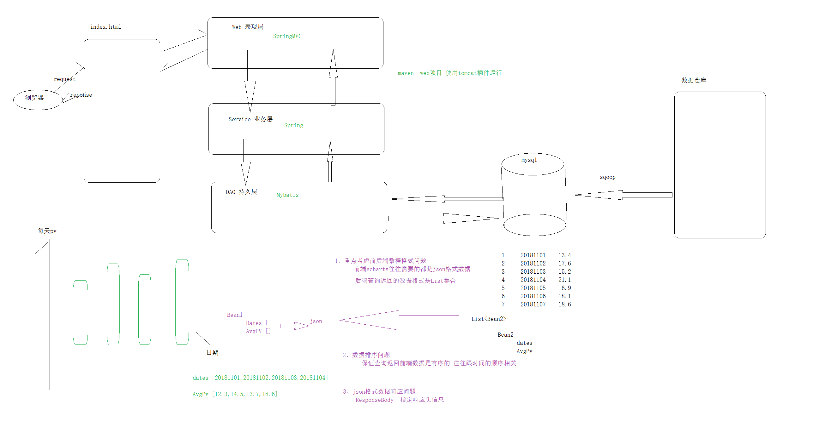

## 5.1 Echarts 介绍

Echarts 是一款由百度前端技术部开发的，基于 Javascript 的数据可视化图表库，提供直观，生动，可交互，可个性化定制的数据可视化图表。

提供大量常用的数据可视化图表，底层基于 ZRender（一个全新的轻量级canvas 类库），创建了坐标系，图例，提示，工具箱等基础组件，并在此上构建出折线图（区域图）、柱状图（条状图）、散点图（气泡图）、饼图（环形图）、K线图、地图、力导向布局图以及和弦图，同时支持任意维度的堆积和多图表混合展现

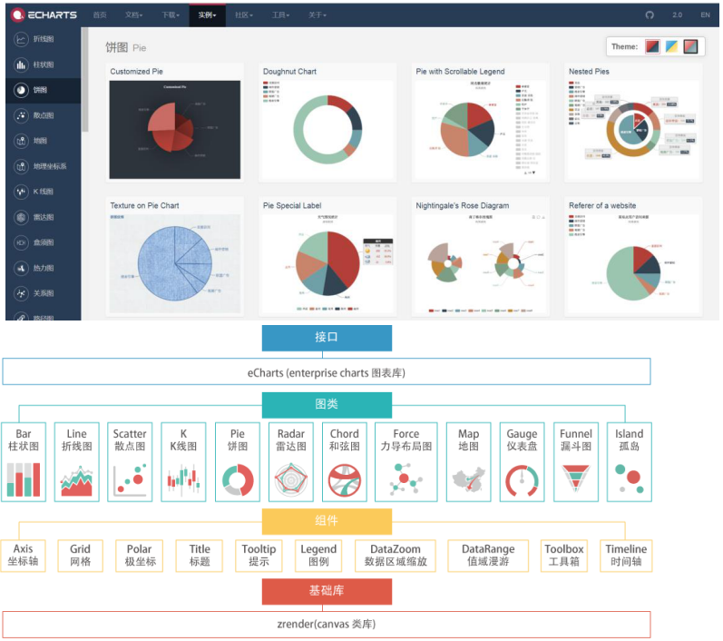


## 5.2 Echarts—简单入门

1. 下载 Echarts

   从官网下载界面选择你需要的版本下载，根据开发者功能和体积上的需求，提供了不同打包的下载，如果在体积上没有要求，可以直接下载完整版本。开发环境建议下载源代码版

2. 在页面上引入echarts.js

   ```html
   <script type="text/javascript" src="js/echarts.js" ></script>
   ```

3. 在页面创建一个Dom容器 有高有宽的范围

   ```html
    <div id="main" style="width: 600px;height:400px;"></div>
   ```

4. 选择容器使用echarts api创建echarts 实例

   ```JS
   var myChart = echarts.init(document.getElementById('main'));
   ```

5. 根据业务需求去echarts官网寻找对应的图形样式  复制其option

   ```js
   var option = {
               title: {
                   text: 'ECharts 入门示例'
               },
               tooltip: {},
               legend: {
                   data:['销量']
               },
               xAxis: {
                   data: ["衬衫","羊毛衫","雪纺衫","裤子","高跟鞋","袜子"]
               },
               yAxis: {},
               series: [{
                   name: '销量',
                   type: 'bar',
                   data: [5, 20, 36, 10, 10, 20]
               }]
           };
   ```

6. 把option设置到创建的echarts 实例中

   ```js
    // 使用刚指定的配置项和数据显示图表。
    myChart.setOption(option);
   ```

**效果：**

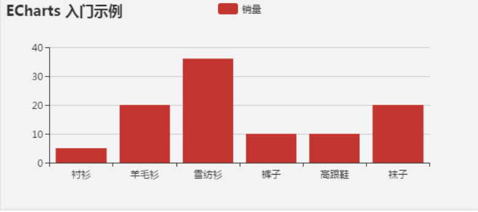

对我们来说需要思考如何把数据从后端动态加载返回至前端页面进行可视化展示。

数据可视化后端web工程

- 职责：把导出在mysql中的数据按照前端需要的格式查询返回给前端
- 技术：php  java   本项目中使用javaEE   基于SSM做数据查询

## 5.3 Web 程序工程结构

本项目是个纯粹的 JavaEE 项目，基于 spring 框架整合构建。使用 maven 的tomcat 插件启动项目。

具体不在这里赘述，详情直接看代码